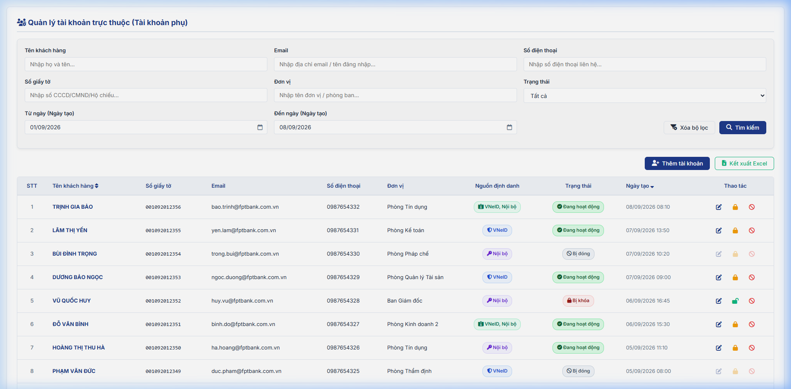
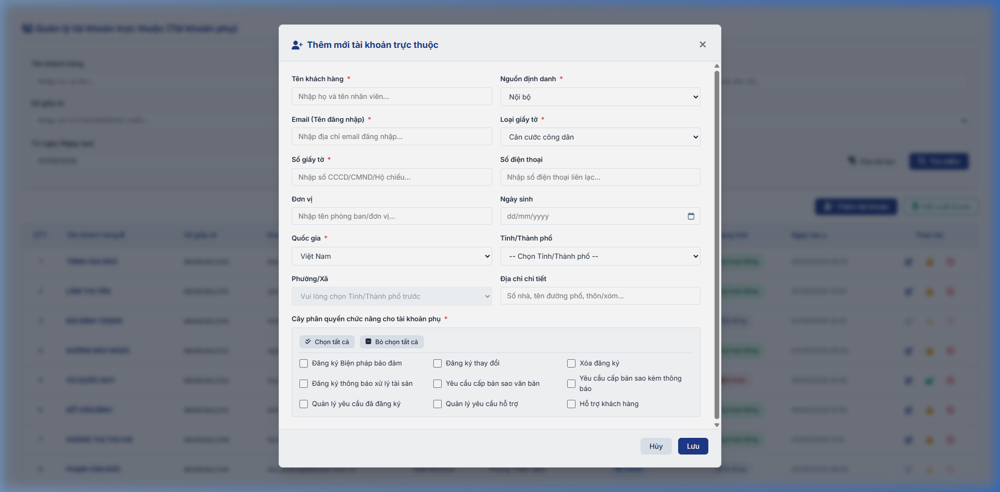
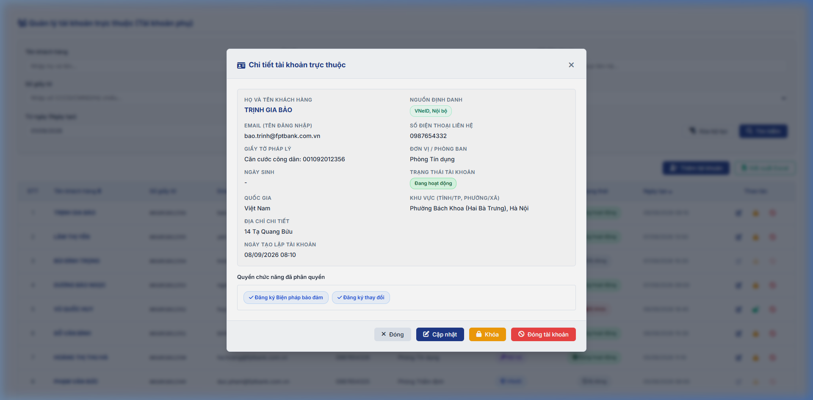
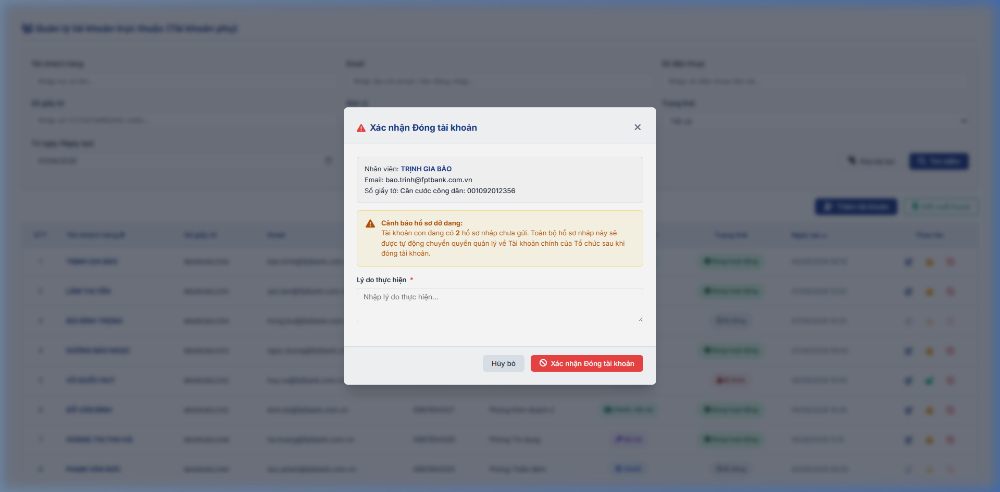

### 4.1.10. Quản lý tài khoản trực thuộc (Tài khoản phụ)

#### 4.1.10.1. Mục đích

- Cho phép tài khoản chính của Tổ chức quản lý danh sách các tài khoản phụ trực thuộc đơn vị của mình.  
- Hỗ trợ tra cứu, tìm kiếm tài khoản phụ theo nhiều tiêu chí lọc và sắp xếp độc lập.  
- Hỗ trợ thêm mới (tạo lập), cập nhật thông tin và thực hiện khóa/mở khóa/đóng tài khoản phụ trực thuộc nhằm đảm bảo phân quyền vận hành và an ninh hệ thống.  

*a. Phân quyền*

- Tài khoản chính của Tổ chức (đã đăng nhập thành công).  

*b. Điều kiện thực hiện*

- Người dùng đã đăng nhập thành công vào Website Khách hàng bằng tài khoản Tổ chức (Tài khoản chính).  
- Hệ thống hoạt động bình thường.  

---

#### 4.1.10.2. MH01 - Màn hình Tra cứu danh sách tài khoản phụ

##### 4.1.10.2.1. Màn hình

##### 4.1.10.2.2. Mô tả thông tin trên màn hình

| Trường thông tin | Kiểu dữ liệu | Bắt buộc | Mặc định | Mô tả |
| :--- | :--- | :--- | :--- | :--- |
| **I. Bộ lọc tìm kiếm** | - | - | - | Khối các tiêu chí lọc tìm kiếm tài khoản phụ. |
| Tên khách hàng | String(255) | Không | Trống | Control UI: Input text. - Nhập từ khóa tìm kiếm gần đúng theo Họ và tên của tài khoản phụ. |
| Email | String(255) | Không | Trống | Control UI: Input text. - Nhập từ khóa tìm kiếm gần đúng theo địa chỉ Email / Tên đăng nhập. |
| Số điện thoại | String(20) | Không | Trống | Control UI: Input text. - Nhập từ khóa tìm kiếm gần đúng theo Số điện thoại liên hệ. |
| Số giấy tờ | String(255) | Không | Trống | Control UI: Input text. - Nhập từ khóa tìm kiếm gần đúng theo Số giấy tờ pháp lý (CCCD/CMND/Hộ chiếu). |
| Đơn vị | String(255) | Không | Trống | Control UI: Input text. - Nhập từ khóa tìm kiếm theo Tên đơn vị / Phòng ban trực thuộc. |
| Từ ngày | Date | Không | Trống | Control UI: DatePicker. - Lọc theo `Ngày tạo` tài khoản phụ. Định dạng `dd/mm/yyyy`. Nếu nhập cùng `Đến ngày`, áp dụng [BR-VAL-007]. |
| Đến ngày | Date | Không | Trống | Control UI: DatePicker. - Lọc theo `Ngày tạo` tài khoản phụ. Định dạng `dd/mm/yyyy`. Nếu nhập cùng `Từ ngày`, áp dụng [BR-VAL-007]. |
| Trạng thái | Enum(String(50)) | Không | Tất cả | Control UI: Combobox. Gồm: + Tất cả + Đang hoạt động + Bị khóa + Bị đóng |
| Nút "Tìm kiếm" | Button | - | - | Control UI: Nút bấm. - Luôn hiển thị. |
| Nút "Xóa bộ lọc" | Button | - | - | Control UI: Nút bấm. - Luôn hiển thị. |
| **II. Bảng danh sách tài khoản phụ** | - | - | 20 bản ghi/trang | Control UI: Grid phẳng. - Hiển thị danh sách các tài khoản phụ trực thuộc Tổ chức. - Cho phép chọn cấu hình số lượng bản ghi hiển thị: 10, 20, 50, 100 bản ghi/trang (mặc định **20 bản ghi/trang**). - Tích hợp thanh phân trang (Pagination) đồng bộ: Đầu (`\|<<`), Trước (`<`), các số trang cụ thể, Sau (`>`), Cuối (`>>\|`). - Hỗ trợ xem chi tiết bằng thao tác click trực tiếp vào dòng dữ liệu (Row-click). |
| STT | Integer(10) | - | Tự tăng | Control UI: Text hiển thị (Read-only). - Số thứ tự tăng dần của bản ghi trên trang. |
| Tên khách hàng | String(255) | - | Theo hồ sơ | Control UI: Text hiển thị (Read-only). - Họ và tên tài khoản phụ/nhân viên thuộc Tổ chức. - Hỗ trợ sắp xếp Sortable khi bấm vào tiêu đề cột. |
| Số giấy tờ | String(255) | - | Theo hồ sơ | Control UI: Text hiển thị (Read-only). - Số giấy tờ pháp lý (CCCD/CMND/Hộ chiếu) của tài khoản phụ. |
| Email | String(255) | - | Theo hồ sơ | Control UI: Text hiển thị (Read-only). - Địa chỉ Email của tài khoản phụ, đồng thời là Tên đăng nhập đối với nguồn định danh Nội bộ. |
| Số điện thoại | String(20) | - | Theo hồ sơ | Control UI: Text hiển thị (Read-only). - Số điện thoại liên lạc của tài khoản phụ. |
| Đơn vị | String(255) | - | Theo hồ sơ | Control UI: Text hiển thị (Read-only). - Tên đơn vị / Phòng ban trực thuộc của nhân viên. |
| Nguồn định danh | Enum(String(50)) | - | Theo hồ sơ | Control UI: Badge/Tag hiển thị (Read-only). Gồm: + VNeID + Nội bộ + VNeID, Nội bộ |
| Trạng thái | Enum(String(50)) | - | Theo hồ sơ | Control UI: Badge/Tag hiển thị (Read-only). Gồm: + Đang hoạt động + Bị khóa + Bị đóng |
| Ngày tạo | DateTime | - | Theo hồ sơ | Control UI: Text hiển thị (Read-only). - Ngày tạo lập tài khoản phụ, định dạng `dd/mm/yyyy HH:mm`. - Mặc định sắp xếp danh sách theo Ngày tạo giảm dần (mới nhất lên đầu). Hỗ trợ sắp xếp Sortable khi bấm vào tiêu đề cột. |
| Thao tác | - | - | Theo trạng thái | Control UI: Nhóm icon thao tác trên lưới tài khoản phụ, căn giữa. - `Cập nhật`: Cho phép chỉnh sửa khi tài khoản chưa Bị đóng. - `Khóa / Mở khóa`: Khóa khi trạng thái là `Đang hoạt động` / Mở khóa khi trạng thái là `Bị khóa`. - `Đóng`: Chỉ hiển thị khi trạng thái là `Đang hoạt động` hoặc `Bị khóa`. |

##### 4.1.10.2.3. Chức năng trên màn hình

| STT | Tên chức năng | Định dạng | Mô tả |
| :--- | :--- | :--- | :--- |
| 1 | Tìm kiếm | Button | Tự động cắt bỏ khoảng trắng thừa ở hai đầu từ khóa (Trim space). Lọc danh sách tài khoản phụ theo các tiêu chí đã nhập (Tên khách hàng, Email, Số điện thoại, Số giấy tờ, Đơn vị, Từ ngày, Đến ngày, Trạng thái): - **TH Không hợp lệ hoặc Không có dữ liệu trả về**: Nếu `Từ ngày` lớn hơn `Đến ngày`, vi phạm [BR-VAL-007], hiển thị cảnh báo lỗi [MSG-ERR-VAL-007]. Khi không tìm thấy kết quả phù hợp với điều kiện tìm kiếm, bảng hiển thị duy nhất 01 dòng căn giữa trên toàn bộ chiều rộng bảng (`colspan`), in nghiêng với nội dung [MSG-INF-SYS-001]; thanh phân trang hiển thị *"Hiển thị 0-0 của 0 bản ghi"*, các nút điều hướng trang ở trạng thái ẩn hoặc khóa mờ (Disabled); Button Kết xuất Inactive. - **TH Hợp lệ (Có dữ liệu phù hợp)**: Hệ thống lọc và hiển thị danh sách các tài khoản phụ thuộc Tổ chức thỏa mãn tiêu chí tìm kiếm/lọc, đưa về Trang 1, sắp xếp theo `Ngày tạo` giảm dần. |
| 2 | Xóa bộ lọc | Button | Đặt lại toàn bộ các ô nhập liệu về rỗng, Combobox Trạng thái về giá trị `Tất cả` và tự động tải lại dữ liệu danh sách tài khoản phụ ban đầu. |
| 3 | Cập nhật | Icon | Mở Popup Form Thêm mới / Cập nhật tài khoản phụ (MH02) ở chế độ Cập nhật cho tài khoản phụ tương ứng. |
| 4 | Khóa / Mở khóa | Icon | Xử lý: Hệ thống mở popup Xác nhận Khóa/Mở khóa hoặc Đóng tài khoản trực thuộc (MH04). |
| 5 | Đóng | Icon | Xử lý: Hệ thống mở popup Xác nhận Khóa/Mở khóa hoặc Đóng tài khoản trực thuộc (MH04). |
| 6 | Click dòng dữ liệu (Row-click) | Row Click | Khi click vào bất kỳ dòng dữ liệu nào trên bảng (ngoại trừ click trực tiếp vào icon tại cột Thao tác), hệ thống mở Popup Xem chi tiết tài khoản phụ (MH03). |
| 7 | Kết xuất Excel | Button | Kiểm tra dữ liệu và kết xuất file Excel (.xlsx): - **TH1 (Không có dữ liệu)**: Button Kết xuất Inactive. - **TH Hợp lệ**: Hệ thống thực hiện kết xuất toàn bộ danh sách tài khoản phụ theo kết quả lọc hiện tại ra file Excel (`.xlsx`) gồm các cột: `STT`, `Tên khách hàng`, `Số giấy tờ`, `Email`, `Số điện thoại`, `Đơn vị`, `Nguồn định danh`, `Trạng thái`, `Ngày tạo`. |

---

#### 4.1.10.3. MH02 - Popup Thêm mới / Cập nhật tài khoản phụ

##### 4.1.10.3.1. Màn hình

##### 4.1.10.3.2. Mô tả thông tin trên màn hình

| Trường thông tin | Kiểu dữ liệu | Bắt buộc | Mặc định | Mô tả |
| :--- | :--- | :--- | :--- | :--- |
| **Form Thêm mới / Cập nhật tài khoản phụ** | - | - | - | Hiển thị dạng Popup Modal (bố cục 2 cột cân đối). |
| Tên khách hàng | String(255) | Có | Trống (Thêm mới) / Theo bản ghi (Cập nhật) | Control UI: Input text. - Nhập Họ và tên của tài khoản phụ/nhân viên. - Tự động chuyển đổi thành chữ in hoa và cắt bỏ khoảng trắng thừa đầu cuối. - Áp dụng quy tắc bắt buộc [BR-VAL-001]. |
| Nguồn định danh | Enum(String(50)) | Có | Nội bộ (Thêm mới) / Theo bản ghi (Cập nhật) | Control UI: Combobox / Checkbox chọn lựa nguồn định danh. Gồm: + Nội bộ + VNeID + VNeID, Nội bộ - **Khi Thêm mới**: Cho phép chọn lựa nguồn định danh cho tài khoản con (`Nội bộ`, `VNeID`, hoặc cả `VNeID, Nội bộ`). Mặc định chọn `Nội bộ`. - **Khi Cập nhật**: Chỉ đọc (Read-only) nếu tài khoản con đã tích chọn cả 2 nguồn (`VNeID` và `Nội bộ`). Cho phép sửa/chọn thêm nếu tài khoản con mới chỉ tích chọn 1 trong 2 nguồn (ví dụ: tài khoản đang là VNeID thì cho phép tích chọn bổ sung thêm Nội bộ). |
| Email (Tên đăng nhập) | String(255) | Tùy thuộc Nguồn định danh | Trống (Thêm mới) / Theo bản ghi (Cập nhật) | Control UI: Input text. - **Logic bắt buộc**: Chỉ bắt buộc nhập khi Nguồn định danh là `Nội bộ` hoặc `VNeID, Nội bộ`. Không bắt buộc nhập khi Nguồn định danh là `VNeID`. - **Khi Cập nhật**: Cho phép nhập/sửa nếu tích chọn mới Nguồn định danh là `Nội bộ` (chưa từng có tài khoản đăng nhập nội bộ trước đó). Trường hợp tài khoản đã có Nguồn Nội bộ từ trước thì ở trạng thái Chỉ đọc (Read-only). - Áp dụng quy tắc kiểm tra định dạng email [BR-VAL-EMAIL]. - Ràng buộc kiểm tra tính duy nhất trên toàn hệ thống đối với các tài khoản phụ khác đang ở trạng thái `Đang hoạt động` hoặc `Bị khóa` [BR-VAL-009]. |
| Loại giấy tờ | Enum(String(50)) | Có | Căn cước công dân (Thêm mới) / Theo bản ghi (Cập nhật) | Control UI: Combobox. - Tham chiếu Danh mục giấy tờ pháp lý [DM_10]. |
| Số giấy tờ | String(255) | Có | Trống (Thêm mới) / Theo bản ghi (Cập nhật) | Control UI: Input text. - Số giấy tờ pháp lý của tài khoản phụ. - Áp dụng quy tắc bắt buộc [BR-VAL-001]. - Ràng buộc kiểm tra tính duy nhất theo Loại giấy tờ đối với các tài khoản con hiện hành khác của Tổ chức đang ở trạng thái `Đang hoạt động` hoặc `Bị khóa` (khi Cập nhật thì loại trừ chính tài khoản đang xử lý) - [BR-VAL-009]. |
| Số điện thoại | String(20) | Không | Trống (Thêm mới) / Theo bản ghi (Cập nhật) | Control UI: Input text. - Số điện thoại liên lạc của nhân viên. - Nếu có nhập, áp dụng quy tắc kiểm tra định dạng số điện thoại [BR-VAL-PHONE]. |
| Đơn vị | String(255) | Không | Trống (Thêm mới) / Theo bản ghi (Cập nhật) | Control UI: Input text. - Tên đơn vị / Phòng ban trực thuộc của nhân viên trong Tổ chức. |
| Ngày sinh | Date | Không | Trống (Thêm mới) / Theo bản ghi (Cập nhật) | Control UI: DatePicker. - Ngày sinh của nhân viên, định dạng `dd/mm/yyyy`. - Nếu có nhập, giá trị phải nhỏ hơn ngày hiện tại [BR-VAL-002]. |
| Quốc gia | Enum(String(50)) | Có | Việt Nam (Thêm mới) / Theo bản ghi (Cập nhật) | Control UI: Combobox. - Tham chiếu Danh mục Quốc gia [DM_09]. |
| Tỉnh/Thành phố | Enum(String(100)) / String(100) | Không | Trống (Thêm mới) / Theo bản ghi (Cập nhật) | Control UI: Combobox có tìm kiếm / Input text. - Nếu `Quốc gia` = `Việt Nam`: Tham chiếu Danh mục Tỉnh/Thành phố [DM_13]. Cho phép gõ tìm kiếm theo Mã hoặc Tên. - Nếu `Quốc gia` khác `Việt Nam`: Hiển thị ô nhập văn bản tự do. |
| Phường/Xã | Enum(String(100)) / String(100) | Không | Trống (Thêm mới) / Theo bản ghi (Cập nhật) | Control UI: Combobox có tìm kiếm / Input text. - Phụ thuộc vào `Tỉnh/Thành phố` đã chọn. - Nếu `Quốc gia` = `Việt Nam`: Tham chiếu Danh mục Xã/Phường/Thị trấn [DM_15] (lọc theo Tỉnh/Thành phố đã chọn). Cho phép gõ tìm kiếm theo Mã hoặc Tên. Nếu chưa chọn Tỉnh/Thành phố thì khóa mờ (Disabled) kèm placeholder *"Vui lòng chọn Tỉnh/Thành phố trước"*. - Nếu `Quốc gia` khác `Việt Nam`: Hiển thị ô nhập văn bản tự do. |
| Địa chỉ chi tiết | String(500) | Không | Trống (Thêm mới) / Theo bản ghi (Cập nhật) | Control UI: Input text. - Nhập số nhà, tên đường/phố, thôn/xóm/ấp... |
| Cây phân quyền | Boolean | Có | Trống (Thêm mới) / Theo bản ghi (Cập nhật) | Control UI: Cây phân quyền kèm Checkbox. - Lấy theo danh sách chức năng hiện tại được phân quyền của tài khoản cha (Tổ chức). - Cho phép tích chọn để thay đổi, thiết lập quyền cho tài khoản con (quyền của tài khoản con là tập con trong phạm vi quyền của tài khoản cha). - Có nút chức năng để **"Chọn tất cả"** hoặc **"Bỏ chọn tất cả"**. |
| Nút "Lưu" | Button | - | - | Control UI: Nút bấm. - Luôn hiển thị. |
| Nút "Hủy" | Button | - | - | Control UI: Nút bấm. - Luôn hiển thị. |

##### 4.1.10.3.3. Chức năng trên màn hình

| STT | Tên chức năng | Định dạng | Mô tả |
| :--- | :--- | :--- | :--- |
| 1 | Lưu | Button | Kiểm tra dữ liệu trên form: - **TH1 (Bỏ trống trường bắt buộc)**: Vi phạm quy tắc [BR-VAL-001]. Hệ thống highlight viền đỏ ô lỗi đầu tiên, hiển thị thông báo lỗi [MSG-ERR-VAL-001] ngay phía dưới ô nhập và tự động focus con trỏ vào ô lỗi đầu tiên đó. Không cho phép lưu. - **TH2 (Dữ liệu không hợp lệ)**: Kiểm tra định dạng Email theo [BR-VAL-EMAIL], Số điện thoại theo [BR-VAL-PHONE], Ngày sinh (vi phạm [BR-VAL-002]). Nếu vi phạm, highlight viền đỏ ô lỗi, hiển thị thông báo lỗi [MSG-ERR-VAL-002] và focus con trỏ vào ô lỗi. Không cho phép lưu. - **TH3 (Trùng lặp dữ liệu)**: Kiểm tra trùng lặp cho Email và Số giấy tờ đã tồn tại với các tài khoản con khác của Tổ chức ở trạng thái `Đang hoạt động` hoặc `Bị khóa` (khi Cập nhật thì ngoại trừ chính tài khoản con đang xử lý): + Kiểm tra trùng lặp Email (nếu Nguồn định danh là `Nội bộ` hoặc `VNeID, Nội bộ`) theo [BR-VAL-009] + Kiểm tra trùng lặp Số giấy tờ theo Loại giấy tờ theo [BR-VAL-009] Nếu phát hiện trùng lặp, hiển thị thông báo lỗi [MSG-ERR-VAL-009], highlight viền đỏ ô lỗi đầu tiên và không cho phép lưu. - **TH Hợp lệ (Tuần tự các hành động của hệ thống)**: 1. *Lưu CSDL và phân quyền*: + Đối với chế độ Thêm mới: Lưu thông tin tài khoản con vào CSDL ở trạng thái `Đang hoạt động`, liên kết trực thuộc Tổ chức chủ quản. + Đối với chế độ Cập nhật: Lưu thông tin chỉnh sửa và phân quyền mới của tài khoản con vào CSDL. 2. *Xử lý mật khẩu và gửi email thông báo*: + **Nếu nguồn định danh tài khoản con chọn là Nội bộ** (hoặc bao gồm Nội bộ): Hệ thống sinh ngẫu nhiên mật khẩu khởi tạo, thực hiện mã hóa băm mật khẩu và lưu vào hệ thống, kích hoạt cờ bắt buộc đổi mật khẩu lần đầu (ForcePasswordChange: true), gửi email thông báo khởi tạo tài khoản theo đúng **Mẫu 5: Email thông báo khởi tạo tài khoản trực thuộc Nội bộ** (Phụ lục Mẫu Email hệ thống) cho nhân viên. + **Nếu nguồn định danh tài khoản con là VNeID**: Không sinh mật khẩu khởi tạo, gửi email thông báo kích hoạt theo đúng **Mẫu 4: Email thông báo tài khoản trực thuộc được kích hoạt qua VNeID** (Phụ lục Mẫu Email hệ thống) cho nhân viên. 3. *Ghi Audit Log & Hoàn tất*: + Ghi nhận toàn bộ thông tin tạo mới/thay đổi vào lịch sử Audit Log hệ thống. + Hiển thị thông báo thành công [MSG-SUC-SYS-001]. + Đóng popup form và tự động làm mới lại lưới danh sách ở màn hình tra cứu (MH01). |
| 2 | Hủy | Button | Đóng popup form, không lưu thay đổi và quay lại màn hình tra cứu. |

---

#### 4.1.10.4. MH03 - Popup Xem chi tiết tài khoản phụ

##### 4.1.10.4.1. Màn hình

##### 4.1.10.4.2. Mô tả thông tin trên màn hình

| Trường thông tin | Kiểu dữ liệu | Bắt buộc | Mặc định | Mô tả |
| :--- | :--- | :--- | :--- | :--- |
| **Thông tin tài khoản phụ** | - | - | - | Theo thông tin bản ghi, dạng chỉ đọc (Read-only). |
| Tên khách hàng | String(255) | - | Theo hồ sơ | Theo thông tin bản ghi, dạng chỉ đọc. |
| Nguồn định danh | Enum(String(50)) | - | Theo hồ sơ | Theo thông tin bản ghi, dạng chỉ đọc. |
| Email (Tên đăng nhập) | String(255) | - | Theo hồ sơ | Theo thông tin bản ghi, dạng chỉ đọc. |
| Loại giấy tờ | Enum(String(50)) | - | Theo hồ sơ | Theo thông tin bản ghi, dạng chỉ đọc. |
| Số giấy tờ | String(255) | - | Theo hồ sơ | Theo thông tin bản ghi, dạng chỉ đọc. |
| Số điện thoại | String(20) | - | Theo hồ sơ | Theo thông tin bản ghi, dạng chỉ đọc. |
| Đơn vị | String(255) | - | Theo hồ sơ | Theo thông tin bản ghi, dạng chỉ đọc. |
| Ngày sinh | Date | - | Theo hồ sơ | Theo thông tin bản ghi, dạng chỉ đọc. - Định dạng `dd/mm/yyyy`. |
| Quốc gia | Enum(String(50)) | - | Theo hồ sơ | Theo thông tin bản ghi, dạng chỉ đọc. |
| Tỉnh/Thành phố | String(100) | - | Theo hồ sơ | Theo thông tin bản ghi, dạng chỉ đọc. |
| Phường/Xã | String(100) | - | Theo hồ sơ | Theo thông tin bản ghi, dạng chỉ đọc. |
| Địa chỉ chi tiết | String(500) | - | Theo hồ sơ | Theo thông tin bản ghi, dạng chỉ đọc. |
| Trạng thái | Enum(String(50)) | - | Theo hồ sơ | Theo thông tin bản ghi, dạng chỉ đọc. |
| Ngày tạo | DateTime | - | Theo hồ sơ | Theo thông tin bản ghi, dạng chỉ đọc. - Định dạng `dd/mm/yyyy HH:mm`. |
| Cây phân quyền | Boolean | - | Theo hồ sơ | Control UI: Cây phân quyền chỉ đọc (Read-only). |
| **Nhóm nút thao tác cuối form** | - | - | - | Khối các nút hành động đặt tại footer của popup xem chi tiết. - `Đóng`: Luôn hiển thị. - `Cập nhật`: Chỉ hiển thị khi trạng thái là `Đang hoạt động` hoặc `Bị khóa`. - `Khóa`: Chỉ hiển thị khi trạng thái là `Đang hoạt động`. - `Mở khóa`: Chỉ hiển thị khi trạng thái là `Bị khóa`. - `Đóng tài khoản`: Chỉ hiển thị khi trạng thái là `Đang hoạt động` hoặc `Bị khóa`. |

##### 4.1.10.4.3. Chức năng trên màn hình

| STT | Tên chức năng | Định dạng | Mô tả |
| :--- | :--- | :--- | :--- |
| 1 | Đóng | Button | Đóng Popup Modal xem chi tiết và quay lại danh sách kết quả tại MH01. |
| 2 | Cập nhật | Button | Mở **MH02 - Popup Thêm mới / Cập nhật tài khoản phụ** ở chế độ Cập nhật. |
| 3 | Khóa | Button | Hệ thống mở popup Xác nhận Khóa/Mở khóa hoặc Đóng tài khoản trực thuộc (MH04) với thao tác `Khóa`. |
| 4 | Mở khóa | Button | Hệ thống mở popup Xác nhận Khóa/Mở khóa hoặc Đóng tài khoản trực thuộc (MH04) với thao tác `Mở khóa`. |
| 5 | Đóng tài khoản | Button | Hệ thống mở popup Xác nhận Khóa/Mở khóa hoặc Đóng tài khoản trực thuộc (MH04) với thao tác `Đóng`. |

---

#### 4.1.10.5. MH04 - Popup Xác nhận Khóa / Mở khóa / Đóng tài khoản phụ

##### 4.1.10.5.1. Màn hình

##### 4.1.10.5.2. Mô tả thông tin trên màn hình

| Trường thông tin | Kiểu dữ liệu | Bắt buộc | Mặc định | Mô tả |
| :--- | :--- | :--- | :--- | :--- |
| **Popup Xác nhận** | - | - | - | Control UI: Popup Modal xác nhận tùy chỉnh đồng bộ hệ thống. |
| Loại thao tác | String(50) | Có | Theo hành động | Hiển thị tiêu đề theo hành động tương ứng: `Khóa tài khoản`, `Mở khóa tài khoản`, hoặc `Đóng tài khoản`. |
| Thông tin tài khoản con | Text | Có | Theo bản ghi | Hiển thị thông tin tóm tắt: Họ và tên, Tên đăng nhập/Email, Số giấy tờ của tài khoản con đang được xử lý. |
| Cảnh báo hồ sơ dở dang (khi Đóng) | Text | Tùy điều kiện | Tự động sinh | **Chỉ hiển thị khi Loại thao tác là `Đóng tài khoản` và tài khoản con có hồ sơ nháp/giao dịch chưa gửi**: - Hiển thị cảnh báo: *"Tài khoản con đang có [X] hồ sơ nháp chưa gửi. Toàn bộ hồ sơ nháp này sẽ được tự động chuyển quyền quản lý về Tài khoản chính của Tổ chức sau khi đóng tài khoản."* |
| Lý do | String(500) | Có khi Khóa/Đóng | Trống | Control UI: Input text / Textarea. - Nhập lý do thực hiện. - **Bắt buộc nhập lý do** khi thực hiện `Khóa` hoặc `Đóng` tài khoản con. - Không bắt buộc khi `Mở khóa`. |

##### 4.1.10.5.3. Chức năng trên màn hình

| STT | Tên chức năng | Định dạng | Mô tả |
| :--- | :--- | :--- | :--- |
| 1 | Xác nhận | Button | Khi người dùng click nút [Xác nhận], hệ thống kiểm tra và thực hiện tuần tự theo từng loại thao tác:  - **1. Thao tác Khóa tài khoản**: + *Kiểm tra điều kiện*: Tài khoản con phải đang ở trạng thái `Đang hoạt động`. Nếu trạng thái đã bị thay đổi hoặc đã Bị đóng, hiển thị lỗi [MSG-ERR-DK-005] và không thực hiện. + *Xử lý hệ thống*: Thu hồi / vô hiệu hóa ngay lập tức toàn bộ phiên làm việc (JWT Token/Session) đang hoạt động của tài khoản con trên mọi thiết bị; cập nhật trạng thái tài khoản con sang `Bị khóa`; ghi nhật ký Audit Log kèm lý do khóa. + *Kết quả*: Hiển thị thông báo thành công [MSG-SUC-SYS-001], đóng popup và tự động làm mới danh sách MH01.  - **2. Thao tác Mở khóa tài khoản**: + *Kiểm tra điều kiện*: Tài khoản con phải đang ở trạng thái `Bị khóa`. Nếu không đúng trạng thái, báo lỗi [MSG-ERR-DK-005]. + *Xử lý hệ thống*: Cập nhật trạng thái tài khoản con sang `Đang hoạt động`; cho phép tài khoản đăng nhập trở lại bình thường; ghi nhận Audit Log. + *Kết quả*: Hiển thị thông báo thành công [MSG-SUC-SYS-001], đóng popup và tự động làm mới danh sách MH01.  - **3. Thao tác Đóng tài khoản con**: + *Kiểm tra điều kiện*: Tài khoản con phải đang ở trạng thái `Đang hoạt động` hoặc `Bị khóa`. Nếu tài khoản đã ở trạng thái `Bị đóng`, hiển thị lỗi [MSG-ERR-DK-005] và chặn thao tác (tuyệt đối không cho phép đóng tài khoản đã đóng). + *Bắt buộc nhập lý do*: Nếu chưa nhập lý do đóng tài khoản, vi phạm [BR-VAL-001], highlight viền đỏ ô lý do và hiển thị cảnh báo lỗi [MSG-ERR-VAL-001]. + *Xử lý hồ sơ dở dang*: Tự động chuyển toàn bộ hồ sơ nháp (draft) do tài khoản con này tạo về quyền quản trị của Tài khoản chính; các hồ sơ đã gửi đang trong quy trình xử lý hoặc chờ thanh toán vẫn tiếp tục thực hiện dưới tên của Tổ chức. + *Thu hồi bảo mật*: Hủy bỏ ngay lập tức tất cả Session/Token đăng nhập của tài khoản con. + *Cập nhật trạng thái*: Chuyển trạng thái tài khoản con sang `Bị đóng`; ghi Audit Log chi tiết. + *Kết quả*: Hiển thị thông báo thành công [MSG-SUC-SYS-001], đóng popup và tự động làm mới danh sách MH01. |
| 2 | Hủy bỏ | Button | Đóng popup xác nhận, không thực hiện thay đổi và quay lại màn hình trước đó. |
