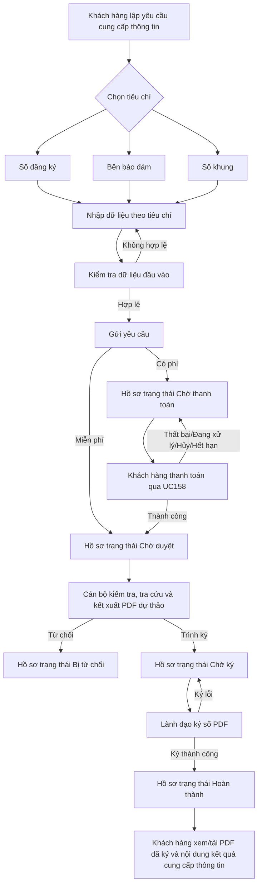

## 4.1. Yêu cầu cung cấp thông tin - Website Khách hàng

### 4.1.1. UC141/UC144/UC195 - Yêu cầu cung cấp thông tin trên Website Khách hàng

#### 4.1.1.1. Mục đích

- Cho phép Khách hàng lập hồ sơ Yêu cầu cung cấp thông tin về biện pháp bảo đảm theo Mẫu số 09d với ba tiêu chí tra cứu: "Số đăng ký", "Bên bảo đảm", "Số khung".

- Cho phép Khách hàng theo dõi trạng thái xử lý hồ sơ từ lúc gửi yêu cầu, thanh toán nếu có nghĩa vụ phí, Cán bộ kiểm tra/xử lý, Lãnh đạo ký số và nhận kết quả.

- Cho phép Khách hàng thực hiện thanh toán thông qua UC158 ngay sau khi gửi hồ sơ hợp lệ nếu hồ sơ thuộc diện phải thu phí; hồ sơ chỉ chuyển sang bước Cán bộ xử lý sau khi thanh toán thành công.

- Cho phép Khách hàng xem/tải đúng file PDF kết quả cung cấp thông tin đã được Lãnh đạo ký số theo mẫu `docs/Bieu mau/GCN_Mau Giay chung nhan CCTT.pdf` khi hồ sơ ở trạng thái "Hoàn thành", bao gồm cả trường hợp kết quả tra cứu không có dữ liệu còn hiệu lực.

- Cho phép Khách hàng xem/in biên lai điện tử đối với hồ sơ đã thanh toán trực tuyến thành công qua UC158.

*a. Phân quyền*

- Khách hàng là cá nhân/tổ chức có tài khoản hợp lệ trên Website Khách hàng.

- Khách hàng chỉ được xem, thanh toán và nhận kết quả đối với hồ sơ do chính tài khoản của mình tạo hoặc hồ sơ thuộc phạm vi được phân quyền.

*b. Điều kiện thực hiện*

- Khách hàng đã đăng nhập thành công vào Website Khách hàng.

- Tài khoản Khách hàng đang ở trạng thái được phép giao dịch.

- Hệ thống có cấu hình biểu phí cung cấp thông tin còn hiệu lực.

- Cổng thanh toán UC158 sẵn sàng tiếp nhận giao dịch tại thời điểm Khách hàng thực hiện thanh toán đối với hồ sơ có phát sinh nghĩa vụ phí.

---

#### 4.1.1.2. UC141.MH01 - Màn hình Lập yêu cầu cung cấp thông tin

##### 4.1.1.2.1. Màn hình

##### 4.1.1.2.2. Mô tả thông tin trên màn hình

| Trường thông tin | Kiểu dữ liệu | Bắt buộc | Mặc định | Mô tả |
| :--- | :--- | :---: | :--- | :--- |
| **I. Thông tin yêu cầu cung cấp thông tin** | | | | |
| Tiêu chí yêu cầu cung cấp thông tin | Enum(String(50)) | Có | "Số đăng ký" | - Chọn một trong các giá trị: - Số đăng ký - Bên bảo đảm - Số khung - Hệ thống chỉ cho phép chọn một tiêu chí tại một thời điểm. - Khi thay đổi tiêu chí, hệ thống ẩn nhóm trường của tiêu chí cũ và xóa dữ liệu đã nhập của tiêu chí cũ sau khi người dùng xác nhận. |
| Số đăng ký | String(50) | Tùy điều kiện | Trống | - Chỉ hiển thị và bắt buộc nếu Tiêu chí yêu cầu cung cấp thông tin là "Số đăng ký". - Nhập số đăng ký của biện pháp bảo đảm đã đăng ký. - Hệ thống tự động trim space theo [BR-VAL-001]. |
| Loại chủ thể | Enum(String(50)) | Tùy điều kiện | "Công dân Việt Nam" | - Chỉ hiển thị và bắt buộc nếu Tiêu chí yêu cầu cung cấp thông tin là "Bên bảo đảm". - Tham chiếu danh mục loại bên bảo đảm [DM_06]. - Các giá trị gồm: - Công dân Việt Nam - Tổ chức có đăng ký kinh doanh trong nước - Người nước ngoài - Tổ chức nước ngoài - Tổ chức khác - Người không quốc tịch cư trú tại Việt Nam |
| Số CMND/Căn cước công dân/Chứng minh quân đội | String(12) | Tùy điều kiện | Trống | - Chỉ hiển thị và bắt buộc khi Tiêu chí yêu cầu cung cấp thông tin là "Bên bảo đảm" và Loại chủ thể là "Công dân Việt Nam". - Bắt buộc đúng 12 chữ số theo [BR-VAL-004]. |
| Mã số thuế/Số đăng ký kinh doanh | String(14) | Tùy điều kiện | Trống | - Chỉ hiển thị và bắt buộc khi Tiêu chí yêu cầu cung cấp thông tin là "Bên bảo đảm" và Loại chủ thể là "Tổ chức có đăng ký kinh doanh trong nước". - Mã số thuế/Mã số doanh nghiệp phải đúng 10 hoặc 14 chữ số theo [BR-VAL-005]. |
| Họ và tên | String(255) | Tùy điều kiện | Trống | - Chỉ hiển thị và bắt buộc khi Tiêu chí yêu cầu cung cấp thông tin là "Bên bảo đảm" và Loại chủ thể là: - "Người nước ngoài" - "Người không quốc tịch cư trú tại Việt Nam" - Hệ thống tự động trim space theo [BR-VAL-001]. |
| Số Hộ chiếu | String(50) | Tùy điều kiện | Trống | - Chỉ hiển thị và bắt buộc khi Tiêu chí yêu cầu cung cấp thông tin là "Bên bảo đảm" và Loại chủ thể là "Người nước ngoài". |
| Mã số thuế/Số giấy phép đầu tư | String(50) | Tùy điều kiện | Trống | - Chỉ hiển thị và bắt buộc khi Tiêu chí yêu cầu cung cấp thông tin là "Bên bảo đảm" và Loại chủ thể là "Tổ chức nước ngoài". |
| Tên tổ chức | String(255) | Tùy điều kiện | Trống | - Chỉ hiển thị và bắt buộc khi Tiêu chí yêu cầu cung cấp thông tin là "Bên bảo đảm" và Loại chủ thể là "Tổ chức khác". |
| Số thẻ cư trú | String(50) | Tùy điều kiện | Trống | - Chỉ hiển thị và bắt buộc khi Tiêu chí yêu cầu cung cấp thông tin là "Bên bảo đảm" và Loại chủ thể là "Người không quốc tịch cư trú tại Việt Nam". |
| Số khung | String(50) | Tùy điều kiện | Trống | - Chỉ hiển thị và bắt buộc nếu Tiêu chí yêu cầu cung cấp thông tin là "Số khung". - Nhập số khung phương tiện giao thông cơ giới đường bộ cần yêu cầu cung cấp thông tin. - Hệ thống tự động trim space theo [BR-VAL-001]. |

##### 4.1.1.2.3. Chức năng trên màn hình

| STT | Tên chức năng | Định dạng | Mô tả |
| :--- | :--- | :--- | :--- |
| 1 | Thay đổi tiêu chí | Radio/Segment | TH1 (Có dữ liệu đã nhập ở tiêu chí hiện tại): Hệ thống hiển thị xác nhận trước khi chuyển tiêu chí. Nếu Khách hàng xác nhận, hệ thống xóa dữ liệu thuộc tiêu chí cũ, hiển thị nhóm trường của tiêu chí mới và chỉ lưu tiêu chí mới trong hồ sơ. TH2 (Không có dữ liệu đã nhập): Hệ thống chuyển ngay sang tiêu chí mới, hiển thị đúng nhóm trường tương ứng và ẩn các nhóm trường còn lại. |
| 2 | Thay đổi Loại chủ thể | Dropdown | Khi Khách hàng thay đổi Loại chủ thể trong tiêu chí "Bên bảo đảm", hệ thống hiển thị đúng các trường định danh tương ứng, ẩn các trường của loại chủ thể khác và xóa dữ liệu không còn phù hợp sau khi người dùng xác nhận nếu dữ liệu đã được nhập. |
| 3 | Gửi yêu cầu | Nút | TH1 (Bỏ trống trường bắt buộc): Vi phạm quy tắc [BR-VAL-001]. Hệ thống tô viền đỏ ô trống đầu tiên và hiển thị cảnh báo lỗi [MSG-ERR-VAL-001] màu đỏ. Không cho phép gửi yêu cầu. |
|  |  |  | TH2 (Dữ liệu không hợp lệ): Kiểm tra và phát hiện lỗi: - Số CMND/Căn cước công dân/Chứng minh quân đội không đúng 12 chữ số hoặc chứa ký tự khác ngoài số: Vi phạm quy tắc [BR-VAL-004], hiển thị cảnh báo lỗi [MSG-ERR-VAL-004] màu đỏ dưới ô nhập tương ứng. Không cho phép gửi yêu cầu. - Mã số thuế/Số đăng ký kinh doanh không đúng 10 hoặc 14 chữ số hoặc chứa ký tự khác ngoài số: Vi phạm quy tắc [BR-VAL-005], hiển thị cảnh báo lỗi [MSG-ERR-VAL-005] màu đỏ dưới ô nhập tương ứng. Không cho phép gửi yêu cầu. - Các trường dữ liệu vượt quá độ dài tối đa theo Kiểu dữ liệu: Hệ thống hiển thị cảnh báo lỗi "[Tên trường] vượt quá độ dài cho phép" màu đỏ dưới ô nhập tương ứng và không cho phép gửi yêu cầu. |
|  |  |  | TH Hợp lệ: Hệ thống thực hiện: - Lưu hồ sơ Yêu cầu cung cấp thông tin vào CSDL. - Sinh Mã hồ sơ theo cấu trúc `CCTT-[YYYYMMDD]-[TỰ_TĂNG_6_SỐ]`. - Ghi nhận Người yêu cầu từ tài khoản đăng nhập, Thời điểm đăng ký, Nguồn tiếp nhận là Website Khách hàng. - Lưu tiêu chí và dữ liệu tra cứu tương ứng; không lưu đồng thời dữ liệu của tiêu chí khác. - Xác định nghĩa vụ phí theo biểu phí cung cấp thông tin đang có hiệu lực tại thời điểm phát sinh hồ sơ. - Nếu hồ sơ thuộc diện phải thu phí, hệ thống tạo hồ sơ ở trạng thái "Chờ thanh toán", đóng gói thông tin thanh toán và chuyển ngay sang UC158 để Khách hàng thực hiện thanh toán, tương tự luồng Đăng ký mới. - Nếu hồ sơ thuộc diện miễn phí, hệ thống tạo hồ sơ ở trạng thái "Chờ duyệt" và điều hướng sang **4.1.1.3. UC141.MH03 - Màn hình Thông báo gửi hồ sơ thành công**. - Ghi nhật ký thao tác gửi yêu cầu vào III.6. |
| 4 | Nhập lại | Nút | Làm trống dữ liệu tiêu chí đang nhập, đưa tiêu chí về giá trị mặc định "Số đăng ký" và ẩn các nhóm trường không tương ứng. |

---

#### 4.1.1.3. UC141.MH03 - Màn hình Thông báo gửi hồ sơ thành công

##### 4.1.1.3.1. Màn hình

##### 4.1.1.3.2. Mô tả thông tin trên màn hình

| Trường thông tin | Kiểu dữ liệu | Bắt buộc | Mặc định | Mô tả |
| :--- | :--- | :---: | :--- | :--- |
| Mã hồ sơ | String(50) | Có | Theo hệ thống | Chỉ đọc. Hiển thị mã hồ sơ Yêu cầu cung cấp thông tin vừa được sinh. |
| Thời điểm đăng ký | Datetime | Có | Theo hệ thống | Chỉ đọc. Hiển thị ngày giờ gửi hồ sơ thành công. |
| Trạng thái hồ sơ | Enum(String(50)) | Có | "Chờ duyệt" | Chỉ đọc. Hiển thị theo bộ trạng thái nghiệp vụ của hồ sơ cung cấp thông tin trong tài liệu này. |
| Nội dung hướng dẫn | Text(1000) | Có | Theo hệ thống | Hướng dẫn Khách hàng theo dõi trạng thái hồ sơ tại danh sách yêu cầu đã gửi. Màn hình này chỉ hiển thị trực tiếp sau khi gửi yêu cầu nếu hồ sơ thuộc diện miễn phí; hồ sơ thuộc diện phải thu phí được chuyển sang UC158 ngay sau khi lưu ở trạng thái "Chờ thanh toán". |

---

#### 4.1.1.4. UC195.MH01 - Màn hình Danh sách yêu cầu cung cấp thông tin

##### 4.1.1.4.1. Màn hình

##### 4.1.1.4.2. Mô tả thông tin trên màn hình

| Trường thông tin | Kiểu dữ liệu | Bắt buộc | Mặc định | Mô tả |
| :--- | :--- | :---: | :--- | :--- |
| **I. Bộ lọc tìm kiếm** | | | | |
| Mã hồ sơ | String(50) | Không | Trống | Tìm kiếm chính xác hoặc gần đúng theo Mã hồ sơ; tự động trim space. |
| Tiêu chí yêu cầu | Enum(String(50)) | Không | Tất cả | Lọc theo tiêu chí yêu cầu cung cấp thông tin gồm: - Tất cả - Số đăng ký - Bên bảo đảm - Số khung |
| Trạng thái hồ sơ | Enum(String(50)) | Không | Tất cả | Lọc theo trạng thái hồ sơ, gồm: - Tất cả - Chờ thanh toán - Chờ duyệt - Chờ ký - Hoàn thành - Bị từ chối - Bị trả lại |
| Từ ngày | Date | Không | Trống | Lọc theo Thời điểm đăng ký. Nếu nhập cùng Đến ngày, phải tuân thủ [BR-VAL-007]. |
| Đến ngày | Date | Không | Trống | Lọc theo Thời điểm đăng ký. Nếu nhập cùng Từ ngày, phải tuân thủ [BR-VAL-007]. |
| **II. Bảng danh sách hồ sơ yêu cầu cung cấp thông tin** | | | | |
| Bảng danh sách hồ sơ | Text(1000) | Không | 20 bản ghi/trang | Hiển thị danh sách hồ sơ thuộc phạm vi tài khoản Khách hàng đăng nhập. Sắp xếp mặc định theo Thời điểm đăng ký giảm dần. Phân trang 20 bản ghi/trang. Click trực tiếp vào dòng dữ liệu để mở chi tiết, ngoại trừ khi click nút thao tác. |
| STT | Integer(10) | Không | Tự tăng | Số thứ tự bản ghi trên trang hiện tại. |
| Mã hồ sơ | String(50) | Có | Theo hệ thống | Mã hồ sơ Yêu cầu cung cấp thông tin. |
| Thời điểm đăng ký | Datetime | Có | Theo hệ thống | Ngày giờ Khách hàng gửi hồ sơ. |
| Tiêu chí yêu cầu | Enum(String(50)) | Có | Theo hồ sơ | Hiển thị một trong các giá trị: "Số đăng ký", "Bên bảo đảm", "Số khung". |
| Dữ liệu đã nhập | Text(1000) | Có | Theo hồ sơ | Hiển thị tóm tắt dữ liệu tra cứu đã gửi theo tiêu chí. |
| Trạng thái | Enum(String(50)) | Có | Theo hồ sơ | Hiển thị trạng thái hiện tại của hồ sơ. |
| Số tiền phải thanh toán | Decimal(18,0) | Không | Theo hồ sơ | Chỉ hiển thị giá trị khi hồ sơ thuộc diện phải thu phí và ở trạng thái "Chờ thanh toán", "Chờ duyệt", "Chờ ký" hoặc "Hoàn thành". Mức phí lấy từ cấu hình biểu phí cung cấp thông tin còn hiệu lực. Không hiển thị đối với hồ sơ thuộc diện miễn phí. |
| Thao tác | String(255) | Không | Theo trạng thái | Hiển thị thao tác theo trạng thái: - "Chờ thanh toán": Thanh toán - "Hoàn thành": Xem file, Tải file, In biên lai (chỉ hiển thị nếu hồ sơ đã thanh toán trực tuyến qua UC158 và có Số biên lai điện tử) - Các trạng thái khác: không hiển thị thao tác thanh toán, xem/tải file hoặc in biên lai |

##### 4.1.1.4.3. Chức năng trên màn hình

| STT | Tên chức năng | Định dạng | Mô tả |
| :--- | :--- | :--- | :--- |
| 1 | Tìm kiếm | Nút | TH1 (Điều kiện ngày không hợp lệ): Nếu Từ ngày lớn hơn Đến ngày, vi phạm [BR-VAL-007], hiển thị [MSG-ERR-VAL-007] và không thực hiện tìm kiếm. |
|  |  |  | TH Hợp lệ: Hệ thống tìm kiếm theo các tiêu chí đã nhập trong phạm vi hồ sơ thuộc tài khoản Khách hàng đăng nhập. Nếu không có dữ liệu phù hợp, hiển thị trạng thái rỗng theo [MSG-WRN-SYS-001] hoặc thông báo không có dữ liệu theo chuẩn danh sách. |
| 2 | Xóa bộ lọc | Nút | Xóa toàn bộ tiêu chí lọc, đưa Trạng thái hồ sơ và Tiêu chí yêu cầu về "Tất cả", tải lại danh sách mặc định theo Thời điểm đăng ký giảm dần. |
| 3 | Tạo mới | Nút | Mở **4.1.1.2. UC141.MH01 - Màn hình Lập yêu cầu cung cấp thông tin**. |
| 4 | Row Click | Thao tác dòng | Mở **4.1.1.5. UC195.MH02 - Màn hình Chi tiết yêu cầu cung cấp thông tin** tương ứng với hồ sơ được chọn. |
| 5 | Thanh toán | Nút | Chỉ hiển thị khi hồ sơ ở trạng thái "Chờ thanh toán", có kết quả tra cứu và thuộc diện phải thu phí. Khi click, hệ thống đóng gói thông tin thanh toán và chuyển hướng sang UC158. Chi tiết tại **4.1.1.6. Quy tắc thanh toán hồ sơ yêu cầu cung cấp thông tin**. |
| 6 | Xem file | Link/Nút | Chỉ hiển thị khi hồ sơ ở trạng thái "Hoàn thành" và có file PDF kết quả cung cấp thông tin đã được Lãnh đạo ký số. Cho phép mở đúng file PDF đã ký tại một tab riêng. Hệ thống ghi nhật ký thao tác xem file vào III.6. |
| 7 | Tải file | Link/Nút | Chỉ hiển thị khi hồ sơ ở trạng thái "Hoàn thành" và có file PDF kết quả cung cấp thông tin đã được Lãnh đạo ký số. Tải đúng file PDF đã ký xuống thiết bị của Khách hàng. Hệ thống ghi nhật ký thao tác tải file vào III.6. |
| 8 | In biên lai | Nút | Chỉ hiển thị khi hồ sơ ở trạng thái "Hoàn thành", đã thanh toán trực tuyến thành công qua UC158 và có Số biên lai điện tử. Không hiển thị đối với hồ sơ thuộc diện miễn phí (không phát sinh giao dịch thanh toán). Khi click, hệ thống hiển thị mẫu biên lai điện tử tương ứng và gửi lệnh in/xuất PDF biên lai. Hệ thống ghi nhật ký thao tác in biên lai vào III.6. |

---

#### 4.1.1.5. UC195.MH02 - Màn hình Chi tiết yêu cầu cung cấp thông tin

##### 4.1.1.5.1. Màn hình

##### 4.1.1.5.2. Mô tả thông tin trên màn hình

| Trường thông tin | Kiểu dữ liệu | Bắt buộc | Mặc định | Mô tả |
| :--- | :--- | :---: | :--- | :--- |
| **I. Thông tin hồ sơ** | | | | |
| Mã hồ sơ | String(50) | Có | Theo hồ sơ | Chỉ đọc. Mã hồ sơ Yêu cầu cung cấp thông tin. |
| Trạng thái hồ sơ | Enum(String(50)) | Có | Theo hồ sơ | Chỉ đọc. Hiển thị trạng thái hiện tại của hồ sơ. |
| Thời điểm đăng ký | Datetime | Có | Theo hồ sơ | Chỉ đọc. Thời điểm Khách hàng gửi hồ sơ. |
| Nguồn tiếp nhận | Enum(String(50)) | Có | "Website khách hàng" | Chỉ đọc. Nguồn tạo hồ sơ. |
| **II. Thông tin yêu cầu cung cấp thông tin** | | | | |
| Tiêu chí yêu cầu | Enum(String(50)) | Có | Theo hồ sơ | Chỉ đọc. Hiển thị tiêu chí đã gửi. |
| Dữ liệu đã nhập | Text(1000) | Có | Theo hồ sơ | Chỉ đọc. Hiển thị dữ liệu tra cứu đã gửi theo tiêu chí. |
| Thời điểm tra cứu | Datetime | Không | Theo hồ sơ | Chỉ hiển thị khi hồ sơ đã được Cán bộ thực hiện tra cứu (áp dụng cho cả trạng thái "Hoàn thành" và "Bị từ chối"). Định dạng `dd-mm-yyyy HH:mm`. |
| **III. Thông tin xử lý** | | | | |
| Lý do từ chối | Text(2000) | Không | Theo hồ sơ | Chỉ hiển thị khi trạng thái hồ sơ là "Bị từ chối" do Cán bộ hoặc Lãnh đạo từ chối theo điều kiện nghiệp vụ. Không dùng trường này để hiển thị trường hợp tra cứu không có dữ liệu còn hiệu lực; trường hợp đó được thể hiện trong file PDF đã ký và Khối VI khi hồ sơ "Hoàn thành". |
| Thời điểm trình ký | Datetime | Không | Theo hồ sơ | Chỉ hiển thị khi hồ sơ đã được Cán bộ trình Lãnh đạo ký. |
| Thời điểm ký | Datetime | Không | Theo hồ sơ | Chỉ hiển thị khi hồ sơ đã được Lãnh đạo ký số. |
| Thời điểm ký | Datetime | Không | Theo hồ sơ | Chỉ hiển thị khi hồ sơ đã được Lãnh đạo ký thành công. |
| Người ký/Đơn vị ký | String(255) | Không | Theo hồ sơ | Chỉ hiển thị trong phạm vi thông tin được công khai cho Khách hàng. |
| **IV. Thông tin thanh toán** | | | | |
| Số tiền phải thanh toán | Decimal(18,0) | Không | Theo hồ sơ | Chỉ hiển thị khi hồ sơ thuộc diện phải thu phí và ở trạng thái "Chờ thanh toán", "Chờ duyệt", "Chờ ký" hoặc "Hoàn thành". Không hiển thị đối với hồ sơ thuộc diện miễn phí. |
| Mã giao dịch thanh toán | String(100) | Không | Theo kết quả UC158 | Chỉ hiển thị sau khi phát sinh giao dịch thanh toán. |
| Số biên lai | String(100) | Không | Theo hệ thống tài chính | - Chỉ hiển thị nếu hệ thống có phát hành biên lai điện tử (áp dụng khi hồ sơ thanh toán trực tuyến qua UC158, không áp dụng cho hồ sơ thuộc diện miễn phí). - Kèm liên kết "Xem/In biên lai" ngay cạnh Số biên lai. |
| Thời điểm thanh toán | Datetime | Không | Theo kết quả UC158 | Chỉ hiển thị khi thanh toán thành công. |
| Trạng thái thanh toán | Enum(String(50)) | Không | Theo kết quả UC158 | Chỉ hiển thị khi phát sinh giao dịch thanh toán. |
| **V. Tệp kết quả** | | | | |
| File PDF đã ký | File | Không | Theo hồ sơ | Chỉ hiển thị khi hồ sơ ở trạng thái "Hoàn thành". Đây là đúng file PDF kết quả cung cấp thông tin đã được Lãnh đạo ký số theo mẫu `GCN_Mau Giay chung nhan CCTT.pdf`; link "Xem file" và "Tải file" phải trỏ tới file PDF đã ký này, không trỏ tới file dự thảo hoặc file kết quả tra cứu riêng. |
| **VI. Kết quả cung cấp thông tin có xác nhận của cơ quan đăng ký** | | | | - Chỉ hiển thị khi hồ sơ ở trạng thái "Hoàn thành". - Trình bày theo đúng nội dung file PDF đã được Lãnh đạo ký số, gồm lá mặt/trang ký Mẫu số 10d, phần tiêu đề kết quả, thông tin tiêu chí đã tra cứu, thời điểm tra cứu và kết quả tra cứu. - Nếu kết quả có dữ liệu, hiển thị danh sách chi tiết từng hồ sơ đăng ký giao dịch bảo đảm, hợp đồng tìm thấy. - Nếu kết quả không có dữ liệu, hiển thị dòng theo **[MSG-WRN-CCTT-001]** ngay trong khu vực kết quả cung cấp thông tin, dạng Inline, không hiển thị Toast. |
| Tiêu đề văn bản | String(255) | Có | "KẾT QUẢ CUNG CẤP THÔNG TIN CÓ XÁC NHẬN CỦA CƠ QUAN ĐĂNG KÝ" | Chỉ đọc. Hiển thị cố định, in hoa, in đậm ở đầu khối. |
| Đoạn xác nhận tra cứu | Text(500) | Có | Theo hệ thống | Chỉ đọc. Nội dung cố định theo mẫu GCN CCTT: "Thông tin đã được tìm thấy trong cơ sở dữ liệu của Cục Đăng ký giao dịch bảo đảm và Bồi thường nhà nước thỏa mãn các tiêu chí tra cứu thông tin như sau:". |
| Số cung cấp thông tin | String(50) | Có | Theo hồ sơ | Chỉ đọc. Chính là Mã hồ sơ tại Khối I, hiển thị dạng "Số cung cấp thông tin: [Mã hồ sơ]". |
| Tiêu chí đã tra cứu | Text(500) | Có | Theo hồ sơ | Chỉ đọc. Echo lại đúng theo nội dung file PDF đã ký: - "Số đăng ký": hiển thị dòng "Số đăng ký: [Giá trị]". - "Bên bảo đảm": hiển thị trực tiếp giá trị Loại chủ thể thành một dòng riêng, không ghi nhãn "Loại chủ thể" (Ví dụ: "Tổ chức có đăng ký kinh doanh trong nước"), sau đó hiển thị dòng số giấy tờ tương ứng theo đúng Loại chủ thể (Số CMND/Căn cước công dân/Chứng minh quân đội, Mã số thuế/Số đăng ký kinh doanh, Số Hộ chiếu, Mã số thuế/Số giấy phép đầu tư, Tên tổ chức, hoặc Thẻ cư trú). Nếu Loại chủ thể là "Công dân Việt Nam" và hồ sơ có Ngày tháng năm sinh thì hiển thị thêm dòng "Ngày tháng năm sinh: [dd/mm/yyyy]". - "Số khung": hiển thị dòng "Số khung: [Giá trị]". |
| Thời điểm tra cứu | Datetime | Có | Theo hồ sơ | Chỉ đọc. Lấy theo trường Thời điểm tra cứu tại Khối II, định dạng `dd-mm-yyyy HH:mm`. |
| Dòng kết quả không có dữ liệu | Text(500) | Tùy điều kiện | Theo file PDF đã ký | Chỉ hiển thị khi phiên tra cứu đã ký có trạng thái "Không có kết quả". Nội dung lấy theo **[MSG-WRN-CCTT-001]** và hiển thị Inline ngay trong khu vực kết quả cung cấp thông tin, không hiển thị Toast. Không hiển thị danh sách hồ sơ đăng ký giao dịch bảo đảm, hợp đồng tìm thấy. |
| Danh sách hồ sơ đăng ký giao dịch bảo đảm, hợp đồng tìm thấy | Text(10000) | Tùy điều kiện | Theo kết quả xử lý | - Chỉ hiển thị khi phiên tra cứu đã ký số có trạng thái "Có kết quả". - Hiển thị theo kết quả tra cứu đã được Cán bộ khóa, trình ký và Lãnh đạo ký số trên Website Quản trị. - Chỉ bao gồm hồ sơ đăng ký còn hiệu lực tại thời điểm Cán bộ tra cứu và không có hồ sơ xóa đăng ký/xóa thông báo xử lý tài sản đã hoàn thành làm chấm dứt hiệu lực. - Hiển thị lần lượt thông tin từng hồ sơ theo thứ tự Số hồ sơ tăng dần, đảm bảo liên tục từ hồ sơ đăng ký ban đầu đến các hồ sơ phát sinh sau đó (đăng ký thay đổi, xóa đăng ký, thông báo xử lý tài sản và các nghiệp vụ liên quan nếu có). - Từ dòng tiêu đề hồ sơ **"Đăng ký giao dịch bảo đảm / Hợp đồng - [Số đăng ký]"** trở xuống, hiển thị theo cấu trúc dùng chung tại [4.1.12.6.2.1. Cấu trúc chi tiết danh sách hồ sơ đăng ký giao dịch bảo đảm / hợp đồng](UC190_to_UC192_Tra_cuu_ho_so_theo_ma_so_su_dung_CSDL.md#cau-truc-chi-tiet-danh-sach-ho-so-dang-ky-giao-dich-bao-dam-hop-dong). |

##### 4.1.1.5.3. Chức năng trên màn hình

| STT | Tên chức năng | Định dạng | Mô tả |
| :--- | :--- | :--- | :--- |
| 1 | Quay lại | Nút | Quay lại **4.1.1.4. UC195.MH01 - Màn hình Danh sách yêu cầu cung cấp thông tin**, giữ nguyên bộ lọc trước đó. |
| 2 | Thanh toán | Nút | Chỉ hiển thị khi hồ sơ ở trạng thái "Chờ thanh toán", có kết quả tra cứu và thuộc diện phải thu phí. Khi click, hệ thống đóng gói thông tin thanh toán và chuyển hướng sang UC158. Chi tiết tại **4.1.1.6. Quy tắc thanh toán hồ sơ yêu cầu cung cấp thông tin**. |
| 3 | Xem file | Link/Nút | Chỉ hiển thị khi hồ sơ ở trạng thái "Hoàn thành" và có file PDF kết quả cung cấp thông tin đã được Lãnh đạo ký số. Cho phép mở đúng file PDF đã ký tại một tab riêng. Hệ thống ghi nhật ký thao tác xem file vào III.6. |
| 4 | Tải file | Link/Nút | Chỉ hiển thị khi hồ sơ ở trạng thái "Hoàn thành" và có file PDF kết quả cung cấp thông tin đã được Lãnh đạo ký số. Tải đúng file PDF đã ký xuống thiết bị của Khách hàng. Hệ thống ghi nhật ký thao tác tải file vào III.6. |
| 5 | Xem/In biên lai | Link/Nút | Chỉ hiển thị khi hồ sơ ở trạng thái "Hoàn thành", đã thanh toán trực tuyến thành công qua UC158 và có Số biên lai điện tử. Không hiển thị đối với hồ sơ thuộc diện miễn phí. Khi click, hệ thống hiển thị mẫu biên lai điện tử tại một tab riêng và cho phép gửi lệnh in/xuất PDF. Hệ thống ghi nhật ký thao tác in biên lai vào III.6. |

---

#### 4.1.1.6. Quy tắc thanh toán hồ sơ yêu cầu cung cấp thông tin

##### 4.1.1.6.1. Nguyên tắc sử dụng UC158

Tài liệu này không thiết kế lại màn hình lựa chọn phương thức thanh toán, màn hình thanh toán của Cổng thanh toán, quy trình Webhook Callback, màn hình kết quả giao dịch và các quy tắc kỹ thuật dùng chung của UC158.

Khi Khách hàng gửi hồ sơ thuộc diện phải thu phí, hệ thống đóng gói thông tin thanh toán và chuyển hướng ngay sang UC158 sau khi hồ sơ được tạo ở trạng thái "Chờ thanh toán".

Khi Khách hàng chọn "Thanh toán" trên danh sách/màn hình chi tiết đối với hồ sơ đang ở trạng thái "Chờ thanh toán", hệ thống đóng gói lại thông tin thanh toán và chuyển hướng sang UC158 để Khách hàng thực hiện thanh toán lại.

##### 4.1.1.6.2. Dữ liệu thanh toán đóng gói sang UC158

| Trường thông tin | Kiểu dữ liệu | Bắt buộc | Mặc định | Mô tả |
| :--- | :--- | :---: | :--- | :--- |
| Mã hồ sơ | String(50) | Có | Theo hồ sơ | Mã hồ sơ Yêu cầu cung cấp thông tin. |
| Số tiền phải thu | Decimal(18,0) | Có | Theo biểu phí | Lấy từ danh mục/cấu hình biểu phí cung cấp thông tin đang có hiệu lực tại thời điểm phát sinh nghĩa vụ thanh toán. |
| Nội dung thanh toán | Text(500) | Có | Theo hệ thống | Định dạng mặc định: `Thanh toan phi cung cap thong tin ho so [Mã hồ sơ]`. |
| Mã đơn vị thụ hưởng | String(50) | Có | Theo hồ sơ | Trung tâm đăng ký giao dịch bảo đảm tiếp nhận/xử lý hồ sơ. |
| Return URL | String(500) | Có | Theo hệ thống | Đường dẫn quay lại Website Khách hàng sau khi thanh toán. |

##### 4.1.1.6.3. Xử lý kết quả thanh toán

| Trường hợp | Mô tả xử lý |
| :--- | :--- |
| Thanh toán thành công | UC158 trả kết quả thành công. Hệ thống cập nhật thông tin giao dịch, biên lai nếu có, chuyển trạng thái hồ sơ từ "Chờ thanh toán" sang "Chờ duyệt", ghi nhật ký giao dịch thanh toán vào III.6. Khách hàng tiếp tục theo dõi hồ sơ; chỉ được xem/tải file PDF đã ký và khối Kết quả cung cấp thông tin có xác nhận của cơ quan đăng ký sau khi Lãnh đạo ký số và hồ sơ chuyển sang "Hoàn thành". |
| Thanh toán không thành công | Hồ sơ tiếp tục ở trạng thái "Chờ thanh toán". Khách hàng được phép thực hiện lại thanh toán. |
| Giao dịch đang xử lý | Hồ sơ tiếp tục ở trạng thái "Chờ thanh toán" cho đến khi UC158 trả kết quả cuối cùng. |
| Giao dịch bị hủy | Hồ sơ tiếp tục ở trạng thái "Chờ thanh toán". |
| Giao dịch hết hạn | Hồ sơ tiếp tục ở trạng thái "Chờ thanh toán". Khách hàng được phép tạo giao dịch thanh toán mới theo UC158. |

---

#### 4.1.1.7. Quy tắc bảo mật, phân quyền và toàn vẹn dữ liệu kết quả

| STT | Quy tắc | Mô tả |
| :--- | :--- | :--- |
| 1 | Quyền xem hồ sơ | Chỉ chủ hồ sơ hoặc người được phân quyền hợp lệ mới được xem danh sách, chi tiết, file PDF đã ký và Kết quả cung cấp thông tin có xác nhận của cơ quan đăng ký của hồ sơ. |
| 2 | Tính toàn vẹn kết quả | File PDF đã ký và khối Kết quả cung cấp thông tin có xác nhận của cơ quan đăng ký phải thuộc đúng hồ sơ, đúng phiên bản xử lý và đúng dữ liệu đã được Lãnh đạo phê duyệt. |
| 3 | Không sinh lại kết quả khi Khách hàng nhận file | Khi hồ sơ "Hoàn thành", hệ thống không tự động tra cứu lại, sinh lại file PDF hoặc thay đổi khối Kết quả cung cấp thông tin có xác nhận của cơ quan đăng ký đã được phê duyệt. |
| 4 | Không chỉnh sửa kết quả | Khách hàng không được sửa file PDF đã ký hoặc dữ liệu trong khối Kết quả cung cấp thông tin có xác nhận của cơ quan đăng ký. |
| 5 | Nhật ký hệ thống | Mọi thao tác gửi yêu cầu, xem chi tiết, thanh toán, xem/tải file và in biên lai phải ghi nhật ký vào III.6. |
| 6 | Toàn vẹn biên lai điện tử | Biên lai điện tử chỉ được phát hành khi Cổng thanh toán UC158 xác nhận giao dịch thanh toán trực tuyến thành công; không cho phép Khách hàng tự tạo, chỉnh sửa hoặc in biên lai đối với hồ sơ thuộc diện miễn phí hoặc chưa hoàn tất thanh toán. |

---

#### 4.1.1.8. Checklist ràng buộc chéo

| Câu hỏi kiểm tra | Đánh giá áp dụng |
| :--- | :--- |
| UC này có cần gọi dữ liệu từ tích hợp V.1 để tự động điền hoặc kiểm tra không? | Website Khách hàng không tự động tra cứu kết quả tại thời điểm gửi hồ sơ. Dữ liệu người yêu cầu lấy từ tài khoản đăng nhập/SSO nếu có. Kết nối CSDL BPBĐ và các tích hợp liên quan đến kết quả tra cứu do phần Cán bộ xử lý thực hiện. |
| Các trường lựa chọn đã tham chiếu đúng danh mục chưa? | Loại chủ thể tham chiếu [DM_06], Loại hình đăng ký trong kết quả tham chiếu [DM_04]. Trạng thái hồ sơ dùng bộ trạng thái nghiệp vụ riêng của hồ sơ cung cấp thông tin trong tài liệu này do danh mục trạng thái hiện có chưa thống nhất mã dùng chung. |
| Thao tác nào cần ghi log vào III.6? | Gửi yêu cầu, xem chi tiết, chuyển trạng thái, thanh toán, xem/tải PDF đã ký, xem/in biên lai. |
| Nguy cơ phát sinh bồi thường là gì? | Nếu Cán bộ/Lãnh đạo cung cấp sai kết quả, ký sai file hoặc trả nhầm dữ liệu không thuộc hồ sơ có thể phát sinh khiếu kiện. Website Khách hàng phải bảo đảm hiển thị đúng file PDF đã được duyệt, đúng nội dung Kết quả cung cấp thông tin có xác nhận của cơ quan đăng ký đã được phê duyệt và không tự động thay thế bằng dữ liệu tra cứu mới. |
| UC này có phiên bản Mobile tương ứng không? | Danh sách UC gốc có các chức năng cung cấp thông tin trên Mobile. Trạng thái hồ sơ phải đồng bộ qua CSDL dùng chung giữa Web và Mobile nếu Mobile triển khai cùng nghiệp vụ. |
| Kết quả xử lý làm thay đổi Dashboard nào? | Số lượng hồ sơ Yêu cầu cung cấp thông tin theo các trạng thái "Chờ thanh toán", "Chờ duyệt", "Chờ ký", "Hoàn thành", "Bị từ chối", "Bị trả lại"; doanh thu phí cung cấp thông tin chỉ cập nhật đối với hồ sơ có phát sinh nghĩa vụ phí và thanh toán thành công. |

---

#### 4.1.1.9. Sơ đồ và mô tả quy trình nghiệp vụ tổng thể

##### 4.1.1.9.1. Sơ đồ quy trình

##### 4.1.1.9.2. Mô tả quy trình chi tiết

| Bước | Người thực hiện | Mô tả nghiệp vụ |
| :--- | :--- | :--- |
| 1 | Khách hàng | Truy cập chức năng "Yêu cầu cung cấp thông tin" trên Website Khách hàng. |
| 2 | Khách hàng | Chọn một tiêu chí yêu cầu cung cấp thông tin: "Số đăng ký", "Bên bảo đảm" hoặc "Số khung". Tại một thời điểm, một hồ sơ chỉ được chọn một tiêu chí. |
| 3 | Hệ thống | Hiển thị động các trường nhập liệu tương ứng với tiêu chí được chọn; ẩn các trường không phù hợp và không lưu đồng thời dữ liệu của nhiều tiêu chí trong cùng một hồ sơ. |
| 4 | Khách hàng | Nhập dữ liệu theo tiêu chí và bấm "Gửi yêu cầu". |
| 5 | Hệ thống | Kiểm tra trường bắt buộc theo [BR-VAL-001], kiểm tra định dạng dữ liệu theo từng tiêu chí, sinh mã hồ sơ. Nếu hồ sơ phải thu phí thì lưu ở trạng thái "Chờ thanh toán" và chuyển sang UC158; nếu miễn phí thì lưu ở trạng thái "Chờ duyệt". |
| 6 | Khách hàng | Thực hiện thanh toán thông qua UC158 khi hồ sơ ở trạng thái "Chờ thanh toán". |
| 7 | Hệ thống | Khi thanh toán thành công, hồ sơ chuyển sang trạng thái "Chờ duyệt". Các trạng thái thanh toán không thành công, đang xử lý, bị hủy hoặc hết hạn không làm thay đổi trạng thái hồ sơ, hồ sơ tiếp tục ở trạng thái "Chờ thanh toán". |
| 8 | Cán bộ | Kiểm tra hồ sơ; hệ thống/cán bộ thực hiện tra cứu theo đúng tiêu chí và dữ liệu Khách hàng đã gửi, không cho phép sửa dữ liệu tra cứu. Cán bộ được phép từ chối nếu hồ sơ không đủ điều kiện xử lý. |
| 9 | Cán bộ | Nếu có kết quả còn hiệu lực tại thời điểm tra cứu, Cán bộ kết xuất kết quả, sinh file PDF dự thảo kết quả cung cấp thông tin theo mẫu `GCN_Mau Giay chung nhan CCTT.pdf` và trình Lãnh đạo ký; hồ sơ chuyển sang trạng thái "Chờ ký". |
| 10 | Cán bộ | Nếu tra cứu thành công nhưng không có dữ liệu còn hiệu lực, Cán bộ sinh file PDF dự thảo thông báo không có kết quả với nội dung lấy theo **[MSG-WRN-CCTT-001]** và trình Lãnh đạo ký; hồ sơ chuyển sang trạng thái "Chờ ký". |
| 11 | Lãnh đạo | Thực hiện ký số file PDF đối với hồ sơ ở trạng thái "Chờ ký". Nếu ký thành công, hồ sơ chuyển sang "Hoàn thành"; nếu từ chối, hồ sơ chuyển sang "Bị từ chối" và hệ thống phát sinh yêu cầu hoàn tiền đối với hồ sơ Online đã thanh toán; nếu trả lại, hồ sơ chuyển sang "Bị trả lại" để Cán bộ xử lý lại. |
| 12 | Khách hàng | Khi hồ sơ "Hoàn thành", Khách hàng xem/tải đúng file PDF kết quả cung cấp thông tin đã được Lãnh đạo ký số và xem nội dung Kết quả cung cấp thông tin có xác nhận của cơ quan đăng ký. |

##### 4.1.1.9.3. Luồng trạng thái hồ sơ

| STT | Trạng thái | Điều kiện chuyển vào trạng thái | Thao tác Khách hàng được phép |
| :--- | :--- | :--- | :--- |
| 1 | "Chờ thanh toán" | Khách hàng gửi hồ sơ hợp lệ và hồ sơ thuộc diện phải thu phí. | Xem chi tiết, thực hiện "Thanh toán". |
| 2 | "Chờ duyệt" | Hồ sơ Online đã thanh toán thành công hoặc thuộc diện miễn phí, đang chờ Cán bộ kiểm tra và xử lý. | Xem chi tiết, theo dõi trạng thái. |
| 3 | "Chờ ký" | Cán bộ đã tra cứu, kết xuất file PDF dự thảo và trình Lãnh đạo ký. | Xem chi tiết, theo dõi trạng thái. |
| 5 | "Hoàn thành" | Lãnh đạo ký số file PDF kết quả cung cấp thông tin thành công. | Xem chi tiết, xem/tải đúng file PDF đã được Lãnh đạo ký số, xem Kết quả cung cấp thông tin có xác nhận của cơ quan đăng ký, xem thông tin thanh toán nếu có. |
| 6 | "Bị từ chối" | Cán bộ hoặc Lãnh đạo từ chối hồ sơ theo điều kiện nghiệp vụ. Không dùng trạng thái này cho riêng trường hợp tra cứu không có dữ liệu còn hiệu lực. | Xem chi tiết và lý do từ chối. |

Ghi chú: Không sử dụng trạng thái "Yêu cầu xử lý lại" trong phạm vi nghiệp vụ hiện tại.

Ghi chú danh mục dùng chung tham chiếu trong UC này: [DM_04] Loại hình đăng ký (có giá trị "Yêu cầu cung cấp thông tin"), [DM_06] Loại bên bảo đảm (Chủ thể) (dùng cho tiêu chí "Bên bảo đảm").

