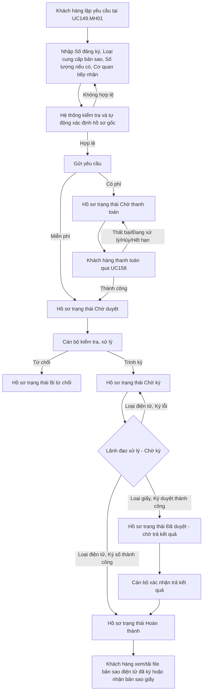

## 4.1. Yêu cầu cung cấp bản sao văn bản chứng nhận - Website Khách hàng

### 4.1.X. UC149/UC195-BS - Quản lý yêu cầu đã đăng ký Yêu cầu cung cấp bản sao văn bản chứng nhận

#### 4.1.X.1. Mục đích

- Cho phép Khách hàng lập yêu cầu cung cấp bản sao văn bản chứng nhận đăng ký biện pháp bảo đảm theo [UC149.MH01](SRS_YC_cung_cap_ban_sao_van_ban_chung_nhan.md) và gửi yêu cầu ngay, không qua màn hình Xem trước (Review).

- Cho phép Khách hàng theo dõi trạng thái xử lý hồ sơ từ lúc gửi yêu cầu, thanh toán nếu có nghĩa vụ phí, Cán bộ kiểm tra/xử lý, Lãnh đạo ký số/ký duyệt và nhận kết quả.

- Cho phép Khách hàng thực hiện thanh toán thông qua UC158 ngay sau khi gửi hồ sơ hợp lệ nếu hồ sơ thuộc diện phải thu phí; hồ sơ chỉ chuyển sang bước Cán bộ xử lý sau khi thanh toán thành công.

- Cho phép Khách hàng xem/tải file PDF bản sao văn bản chứng nhận đã được Lãnh đạo ký số khi hồ sơ ở trạng thái "Hoàn thành" (áp dụng Loại cung cấp bản sao là "Bản sao điện tử").

*a. Phân quyền*

- Khách hàng là cá nhân/tổ chức có tài khoản hợp lệ trên Website Khách hàng.

- Khách hàng chỉ được xem, thanh toán và nhận kết quả đối với hồ sơ do chính tài khoản của mình tạo hoặc hồ sơ thuộc phạm vi được phân quyền.

*b. Điều kiện thực hiện*

- Khách hàng đã đăng nhập thành công vào Website Khách hàng.

- Tài khoản Khách hàng đang ở trạng thái được phép giao dịch.

- Hệ thống có cấu hình biểu phí cung cấp bản sao còn hiệu lực.

- Cổng thanh toán UC158 sẵn sàng tiếp nhận giao dịch tại thời điểm Khách hàng thực hiện thanh toán.

---

#### 4.1.X.2. Điều chỉnh UC149.MH01 - Bỏ màn hình Xem trước (Review), Gửi yêu cầu trực tiếp

Tài liệu này điều chỉnh lại luồng khởi tạo yêu cầu tại [UC149.MH01](SRS_YC_cung_cap_ban_sao_van_ban_chung_nhan.md#41162-uc149mh01---man-hinh-yeu-cau-cap-ban-sao-van-ban-chung-nhan-dang-ky-bien-phap-bao-dam) như sau:

- **Bỏ hoàn toàn** màn hình Xem trước và xác nhận thông tin (Review) hiện đang mô tả tại `UC149.MH02`. Không còn bước xem trước trung gian.

- Sau khi Khách hàng nhập đầy đủ thông tin hợp lệ tại `UC149.MH01` (Số đăng ký, Loại cung cấp bản sao, Số lượng bản sao nếu là "Bản sao giấy", Cơ quan tiếp nhận) và đã qua đủ các bước kiểm tra TH1-TH5 hiện có (bỏ trống trường bắt buộc, số lượng bản sao không hợp lệ, số đăng ký không tồn tại, cơ quan tiếp nhận không khớp, hồ sơ chưa có hiệu lực pháp lý), nút **"Tiếp tục"** được đổi tên thành **"Gửi yêu cầu"** và thực hiện gửi hồ sơ ngay, không điều hướng sang màn hình Review.

- Khi Gửi yêu cầu hợp lệ, hệ thống thực hiện:
  1. Lưu hồ sơ Yêu cầu cung cấp bản sao vào CSDL.
  2. Sinh Mã hồ sơ theo cấu trúc `BS-[YYYYMMDD]-[TỰ_TĂNG_6_SỐ]` (giữ nguyên quy tắc hiện có).
  3. Ghi nhận Người yêu cầu theo tên người thực hiện lấy từ hồ sơ tài khoản đăng nhập, Thời điểm đăng ký, Nguồn tiếp nhận là "Website khách hàng"/"Mobile khách hàng".
  4. Lưu **Số đăng ký** đã kiểm tra hợp lệ (TH3/TH5) để xác định hồ sơ gốc của Yêu cầu cung cấp bản sao.
  5. Nếu hồ sơ thuộc diện phải thu phí, tạo hồ sơ ở trạng thái **"Chờ thanh toán"** và điều hướng sang UC158 để Khách hàng thanh toán. Nếu hồ sơ thuộc diện miễn phí, tạo hồ sơ ở trạng thái **"Chờ duyệt"**.
  6. Ghi nhật ký thao tác gửi yêu cầu vào III.6.
  7. Hiển thị màn hình/thông báo Gửi hồ sơ thành công (theo cấu trúc tương tự **4.1.1.3. UC141.MH03** của Yêu cầu cung cấp thông tin: Mã hồ sơ, Thời điểm đăng ký, Trạng thái hồ sơ "Chờ thanh toán" hoặc "Chờ duyệt", nội dung hướng dẫn theo dõi tại danh sách yêu cầu đã gửi).

- **Hiển thị hồ sơ gốc**: Khi cần hiển thị chi tiết hồ sơ gốc, hệ thống sử dụng **Số đăng ký** đã lưu ở bước 4 để lấy thông tin hồ sơ gốc tương ứng. Các thông tin riêng của Yêu cầu cung cấp bản sao tiếp tục mô tả tại `UC149.MH02`; riêng phần hồ sơ gốc được hiển thị theo [4.1.12.6.2.1. Cấu trúc chi tiết danh sách hồ sơ đăng ký giao dịch bảo đảm / hợp đồng](UC190_to_UC192_Tra_cuu_ho_so_theo_ma_so_su_dung_CSDL.md#cau-truc-chi-tiet-danh-sach-ho-so-dang-ky-giao-dich-bao-dam-hop-dong).

---

#### 4.1.X.3. Bộ trạng thái hồ sơ Yêu cầu cung cấp bản sao (thay thế bộ trạng thái cũ)

| STT | Trạng thái | Áp dụng | Mô tả |
| :--- | :--- | :--- | :--- |
| 1 | "Chờ thanh toán" | Hồ sơ thuộc diện phải thu phí | Khách hàng vừa gửi yêu cầu, đang chờ thanh toán qua UC158. |
| 2 | "Chờ duyệt" | Mọi hồ sơ Online đủ điều kiện vào xử lý | Hồ sơ đã thanh toán thành công hoặc thuộc diện miễn phí, đang chờ Cán bộ kiểm tra và xử lý. |
| 3 | "Chờ ký" | Mọi hồ sơ (áp dụng chung cho cả Loại "Bản sao điện tử" và "Bản sao giấy") | Cán bộ đã kiểm tra/kết xuất bản sao điện tử dự thảo nếu có và trình Lãnh đạo ký số/ký duyệt theo [BR-BS-013]. |
| 5 | "Đã duyệt - chờ trả kết quả" | Chỉ Loại cung cấp bản sao là "Bản sao giấy" | Lãnh đạo đã Ký duyệt tại "Chờ ký", Cán bộ đang in/sao và chuẩn bị trả bản giấy cho Khách hàng. |
| 6 | "Hoàn thành" | Mọi hồ sơ | Bản sao điện tử đã được Lãnh đạo ký số; hoặc Cán bộ đã xác nhận trả kết quả bản sao giấy. |
| 7 | "Bị từ chối" | Mọi hồ sơ | Cán bộ hoặc Lãnh đạo từ chối hồ sơ theo điều kiện nghiệp vụ. Nếu hồ sơ Online đã thanh toán, hệ thống phát sinh yêu cầu hoàn tiền để theo dõi tại Module Quản lý đối soát thanh toán. |
| 8 | "Bị trả lại" | Mọi hồ sơ | Lãnh đạo trả lại từ bước "Chờ ký" để Cán bộ xử lý lại, chưa phát sinh hoàn tiền/hoàn phí. |

Ghi chú: bộ trạng thái này thay thế hoàn toàn bộ trạng thái cũ ("Chờ duyệt"/"Duyệt chờ ký"/"Chờ thanh toán"/"Hoàn thành"/"Bị từ chối") đang mô tả tại `UCPS007.MH02`/`UCPS007.MH03` (mục 4.1.12.3/4.1.12.4) — hai mục đó đã được tách và thay thế bằng tài liệu này (xem mục 4.1.X.9).

---

#### 4.1.X.4. UCPS007.MH02-BS - Tab "Yêu cầu cung cấp bản sao" (thay thế mục 4.1.12.3 cũ)

##### 4.1.X.4.1. Giao diện

- Đặt tại **Tab "Yêu cầu cung cấp bản sao"** trên màn hình [UCPS007.MH01](SRS_Qly_yeu_cau_da_dky_Phieu%20dang%20ky.md#41122-ucps007mh01---man-hinh-danh-sach-yeu-cau-da-dang-ky), cùng cấp với Tab "Phiếu đăng ký" (mặc định) và Tab "Yêu cầu cung cấp thông tin".

- Cấu trúc giao diện gồm hai vùng: Vùng Tìm kiếm/Lọc ở trên và Vùng kết quả hiển thị dạng lưới phẳng (Grid) ở dưới.

##### 4.1.X.4.2. Mô tả thông tin trên màn hình

| Trường thông tin | Kiểu dữ liệu | Bắt buộc | Mặc định | Mô tả |
| :--- | :--- | :---: | :--- | :--- |
| **I. Bộ lọc tìm kiếm** | | | | |
| Mã hồ sơ | String(50) | Không | Trống | Tìm kiếm chính xác hoặc gần đúng theo Mã hồ sơ (`BS-[YYYYMMDD]-[TỰ_TĂNG_6_SỐ]`); tự động trim space theo [BR-VAL-001]. |
| Số đăng ký | String(50) | Không | Trống | Tìm kiếm theo Số đăng ký của hồ sơ gốc gắn với yêu cầu. |
| Loại cung cấp bản sao | Enum(String(50)) | Không | Tất cả | Lọc theo giá trị đã chọn ở [UC149.MH01](SRS_YC_cung_cap_ban_sao_van_ban_chung_nhan.md#41162-uc149mh01---man-hinh-yeu-cau-cap-ban-sao-van-ban-chung-nhan-dang-ky-bien-phap-bao-dam): - Tất cả - Bản sao điện tử - Bản sao giấy |
| Trạng thái hồ sơ | Enum(String(50)) | Không | Tất cả | Lọc theo bộ trạng thái tại mục 4.1.X.3: - Tất cả - Chờ thanh toán - Chờ duyệt - Chờ ký - Đã duyệt - chờ trả kết quả - Hoàn thành - Bị từ chối - Bị trả lại |
| Người tạo | String(255) | Không | Trống | Tìm kiếm gần đúng theo tên người đang đăng nhập đã tạo Yêu cầu cung cấp bản sao. |
| Từ ngày | Date | Không | Trống | Lọc theo Thời điểm đăng ký. Nếu nhập cùng Đến ngày, tuân thủ [BR-VAL-007]. |
| Đến ngày | Date | Không | Trống | Lọc theo Thời điểm đăng ký. Nếu nhập cùng Từ ngày, tuân thủ [BR-VAL-007]. |
| **II. Vùng kết quả hiển thị (Grid)** | - | - | 20 bản ghi/trang | Hiển thị dạng lưới phẳng, thuộc phạm vi tài khoản Khách hàng đăng nhập. Sắp xếp mặc định theo Thời điểm đăng ký giảm dần. Click trực tiếp vào dòng dữ liệu để mở màn hình chi tiết, ngoại trừ khi click nút tại cột Thao tác. |
| STT | Integer(10) | - | - | Số thứ tự bản ghi trên trang hiện tại. |
| Mã hồ sơ | String(50) | - | - | Mã hồ sơ yêu cầu cung cấp bản sao. |
| Số đăng ký | String(50) | - | - | Số đăng ký của hồ sơ gốc gắn với yêu cầu. |
| Loại cung cấp bản sao | String(50) | - | - | Hiển thị "Bản sao điện tử" hoặc "Bản sao giấy". |
| Số lượng bản sao | Integer(10) | - | - | Chỉ hiển thị giá trị khi Loại cung cấp bản sao là "Bản sao giấy"; nếu là "Bản sao điện tử", hiển thị `"—"`. |
| Thời điểm đăng ký | Datetime | - | - | Định dạng `dd/mm/yyyy HH:mm`. |
| Số tiền đã thanh toán (VNĐ) | Decimal(18,0) | - | Theo hồ sơ | Tiêu đề cột ghi rõ đơn vị tính `(VNĐ)`, dữ liệu từng dòng chỉ hiển thị số đã phân tách hàng nghìn, không lặp lại hậu tố `VNĐ`. Hiển thị tổng số tiền Khách hàng đã thanh toán thành công cho yêu cầu; hồ sơ đã chuyển sang trạng thái "Chờ duyệt" trở về sau (Chờ duyệt, Chờ ký, Đã duyệt - chờ trả kết quả, Hoàn thành) đồng nghĩa đã thanh toán xong (nếu thuộc diện phải thu phí) nên luôn có giá trị; chỉ hiển thị `"—"` khi hồ sơ đang ở trạng thái "Chờ thanh toán" hoặc thuộc diện miễn phí. |
| Trạng thái | String(50) | - | - | Hiển thị theo bộ trạng thái tại mục 4.1.X.3, kèm nhãn màu (badge) phân biệt trực quan. |
| Người tạo | String(255) | - | Theo hồ sơ | Hiển thị tên người đang đăng nhập đã tạo Yêu cầu cung cấp bản sao; không hiển thị account/email đăng nhập. |
| Thao tác | String(255) | - | - | - "Thanh toán": chỉ hiển thị khi Trạng thái là "Chờ thanh toán". - "Tải file": chỉ hiển thị khi Trạng thái là "Hoàn thành" và Loại cung cấp bản sao là "Bản sao điện tử". - Các trạng thái/loại bản sao khác không hiển thị thao tác thanh toán/tải file tại cột này. |

##### 4.1.X.4.3. Chức năng trên màn hình

| STT | Tên chức năng | Định dạng | Mô tả |
| :--- | :--- | :--- | :--- |
| 1 | Tìm kiếm | Nút | TH1 (Điều kiện ngày không hợp lệ): Nếu Từ ngày lớn hơn Đến ngày, vi phạm [BR-VAL-007], hiển thị [MSG-ERR-VAL-007] và không thực hiện tìm kiếm. |
|  |  |  | TH Hợp lệ: Hệ thống tìm kiếm trong phạm vi hồ sơ thuộc tài khoản Khách hàng đăng nhập. Nếu không có dữ liệu phù hợp, hiển thị theo [MSG-WRN-SYS-001] hoặc trạng thái rỗng theo chuẩn danh sách. |
| 2 | Xóa bộ lọc | Nút | Đưa toàn bộ tiêu chí lọc về mặc định (trống hoặc "Tất cả") và tải lại lưới kết quả theo Thời điểm đăng ký giảm dần. |
| 3 | Tạo mới | Nút | Mở [UC149.MH01](SRS_YC_cung_cap_ban_sao_van_ban_chung_nhan.md#41162-uc149mh01---man-hinh-yeu-cau-cap-ban-sao-van-ban-chung-nhan-dang-ky-bien-phap-bao-dam). |
| 4 | Row Click | Thao tác dòng | Mở **4.1.X.5. UCPS007.MH03-BS - Màn hình Chi tiết yêu cầu cung cấp bản sao** tương ứng với yêu cầu được chọn. |
| 5 | Thanh toán | Nút | Chỉ hiển thị khi hồ sơ ở trạng thái "Chờ thanh toán". TH1 (Sai trạng thái tại thời điểm click): Hiển thị [MSG-ERR-DK-005], không chuyển màn hình. TH Hợp lệ: Đóng gói thông tin thanh toán (Mã hồ sơ, Số tiền phải thu, Nội dung thanh toán, Mã đơn vị thụ hưởng, Return URL) và chuyển hướng sang [UC158 - Quản lý thanh toán phí](UC158_Quan_ly_thanh_toan_phi.md). |
| 6 | Tải file | Nút | Chỉ hiển thị khi Trạng thái là "Hoàn thành" và Loại cung cấp bản sao là "Bản sao điện tử". Tải đúng file PDF bản sao văn bản chứng nhận đã được Lãnh đạo ký số xuống thiết bị của Khách hàng. Ghi nhật ký vào III.6. |

---

#### 4.1.X.5. UCPS007.MH03-BS - Màn hình Chi tiết yêu cầu cung cấp bản sao

##### 4.1.X.5.1. Màn hình

Mở khi Khách hàng click vào một dòng dữ liệu tại Tab "Yêu cầu cung cấp bản sao" (mục 4.1.X.4). Toàn bộ thông tin hiển thị dưới dạng chỉ đọc; các khối thông tin xử lý/thanh toán/kết quả hiển thị động theo Trạng thái hiện tại.

##### 4.1.X.5.2. Mô tả thông tin trên màn hình

| Trường thông tin | Kiểu dữ liệu | Bắt buộc | Mặc định | Mô tả |
| :--- | :--- | :---: | :--- | :--- |
| **I. Thông tin hồ sơ** | | | | |
| Mã hồ sơ | String(50) | Có | Theo hồ sơ | Chỉ đọc. |
| Trạng thái | Enum(String(50)) | Có | Theo hồ sơ | Chỉ đọc. Hiển thị dạng nhãn màu theo bộ trạng thái tại mục 4.1.X.3. |
| Số đăng ký | String(50) | Có | Theo hồ sơ | Chỉ đọc. Số đăng ký của hồ sơ gốc gắn với yêu cầu. |
| Cơ quan tiếp nhận | Enum(String(100)) | Có | Theo hồ sơ | Chỉ đọc. Tham chiếu [DM_08]. |
| Loại cung cấp bản sao | Enum(String(50)) | Có | Theo hồ sơ | Chỉ đọc. Hiển thị "Bản sao điện tử" hoặc "Bản sao giấy". |
| Số lượng bản sao | Integer(10) | Tùy điều kiện | Theo hồ sơ | Chỉ đọc. Chỉ hiển thị khi Loại cung cấp bản sao là "Bản sao giấy". |
| Thời điểm đăng ký | Datetime | Có | Theo hồ sơ | Chỉ đọc. Định dạng `dd/mm/yyyy HH:mm`. |
| Người tạo | String(255) | Có | Theo hồ sơ | Chỉ đọc. Hiển thị tên người tạo Yêu cầu cung cấp bản sao. |
| **II. Thông tin chi tiết hồ sơ gốc** | | | | **Chỉ hiển thị khối này khi Trạng thái là "Hoàn thành".** |
| Khối thông tin chi tiết hồ sơ gốc | - | Có | Theo hồ sơ gốc | Hiển thị theo cấu trúc dùng chung tại [4.1.12.6.2.1. Cấu trúc chi tiết danh sách hồ sơ đăng ký giao dịch bảo đảm / hợp đồng](UC190_to_UC192_Tra_cuu_ho_so_theo_ma_so_su_dung_CSDL.md#cau-truc-chi-tiet-danh-sach-ho-so-dang-ky-giao-dich-bao-dam-hop-dong). Không cho phép chỉnh sửa. |
| **III. Thông tin xử lý (HIỂN THỊ ĐỘNG THEO TRẠNG THÁI)** | | | | |
| Thời điểm tiếp nhận | Datetime | Không | Theo hồ sơ | Chỉ hiển thị từ khi hồ sơ đã được Cán bộ tiếp nhận. |
| Thời điểm trình ký | Datetime | Không | Theo hồ sơ | Chỉ hiển thị từ khi hồ sơ đã được Cán bộ trình Lãnh đạo ký. |
| **Nếu Trạng thái là "Chờ thanh toán"** | | | | |
| Thời điểm duyệt | Datetime | Có | Theo hồ sơ | Chỉ đọc. |
| Người duyệt | String(255) | Có | Theo hồ sơ | Chỉ đọc. |
| Số tiền phải thanh toán | Decimal(18,0) | Có | Theo hồ sơ | Chỉ đọc. |
| **Nếu Trạng thái là "Chờ ký"** (áp dụng chung cho cả 2 Loại cung cấp bản sao) | | | | |
| Thời điểm duyệt | Datetime | Có | Theo hồ sơ | Chỉ đọc. |
| Người duyệt | String(255) | Có | Theo hồ sơ | Chỉ đọc. |
| Thời điểm thanh toán | Datetime | Tùy điều kiện | Theo kết quả UC158 | Chỉ hiển thị khi hồ sơ thuộc diện phải thu phí. |
| **Nếu Trạng thái là "Đã duyệt - chờ trả kết quả"** (chỉ Loại giấy) | | | | |
| Thời điểm ký duyệt | Datetime | Có | Theo hồ sơ | Chỉ đọc. Thời điểm Lãnh đạo Ký duyệt tại "Chờ ký" theo [BR-BS-013]. |
| Người ký duyệt | String(255) | Có | Theo hồ sơ | Chỉ đọc. |
| Nội dung hướng dẫn nhận bản sao giấy | Text(500) | Có | "Bản sao giấy của bạn đã được phê duyệt và đang được chuẩn bị. Vui lòng đến [Cơ quan tiếp nhận] hoặc theo hình thức nhận đã đăng ký để nhận kết quả." | Chỉ đọc. |
| **Nếu Trạng thái là "Hoàn thành"** | | | | |
| Thời điểm ký/Thời điểm trả kết quả | Datetime | Có | Theo hồ sơ | Chỉ đọc. Là thời điểm Lãnh đạo ký số (điện tử) hoặc thời điểm Cán bộ xác nhận trả kết quả (giấy). |
| Người ký/Người trả kết quả | String(255) | Có | Theo hồ sơ | Chỉ đọc. |
| Số tiền đã thanh toán (VNĐ) | Decimal(18,0) | Tùy điều kiện | Theo hồ sơ | Chỉ hiển thị khi hồ sơ thuộc diện phải thu phí. Nhãn trường ghi rõ đơn vị tính `(VNĐ)`, giá trị hiển thị chỉ là số đã phân tách hàng nghìn, không lặp lại hậu tố `VNĐ`. |
| Mã giao dịch thanh toán | String(100) | Tùy điều kiện | Theo kết quả UC158 | Chỉ hiển thị khi phát sinh giao dịch thanh toán. |
| Số biên lai | String(100) | Không | Theo hệ thống tài chính | Chỉ hiển thị nếu hệ thống có phát hành biên lai điện tử. |
| File bản sao điện tử đã ký | File | Tùy điều kiện | Theo hồ sơ | Chỉ hiển thị khi Loại cung cấp bản sao là "Bản sao điện tử". Đây là đúng file đã được Lãnh đạo ký số; link "Xem file"/"Tải file" phải trỏ tới file này. |
| Thông tin trả bản sao giấy | Text(500) | Tùy điều kiện | "Bản sao giấy đã được trả cho Khách hàng." | Chỉ hiển thị khi Loại cung cấp bản sao là "Bản sao giấy". Không hiển thị liên kết Xem/Tải file. |
| **Nếu Trạng thái là "Bị từ chối"** | | | | |
| Lý do từ chối | Text(1000) | Có | Theo hồ sơ | Chỉ đọc. |
| Thời điểm từ chối | Datetime | Có | Theo hồ sơ | Chỉ đọc. |
| Người từ chối | String(255) | Có | Theo hồ sơ | Chỉ đọc. |

##### 4.1.X.5.3. Chức năng trên màn hình

| STT | Tên chức năng | Định dạng | Mô tả |
| :--- | :--- | :--- | :--- |
| 1 | Quay lại | Nút | Quay lại Tab "Yêu cầu cung cấp bản sao" (mục 4.1.X.4), giữ nguyên bộ lọc và trang hiện tại. |
| 2 | Thanh toán | Nút | Chỉ hiển thị khi Trạng thái là "Chờ thanh toán". TH1 (Sai trạng thái): [MSG-ERR-DK-005], không chuyển màn hình. TH Hợp lệ: Đóng gói thông tin thanh toán và chuyển hướng sang [UC158](UC158_Quan_ly_thanh_toan_phi.md). |
| 3 | Xem file | Link/Nút | Chỉ hiển thị khi Trạng thái là "Hoàn thành" và Loại cung cấp bản sao là "Bản sao điện tử". Cho phép xem file tại một tab riêng. |
| 4 | Tải file | Link/Nút | Chỉ hiển thị khi Trạng thái là "Hoàn thành" và Loại cung cấp bản sao là "Bản sao điện tử". Tải file PDF bản sao đã ký xuống thiết bị của Khách hàng. |

---

#### 4.1.X.6. Quy tắc thanh toán hồ sơ yêu cầu cung cấp bản sao

Tài liệu này không thiết kế lại UC158. Khi Khách hàng chọn "Thanh toán", hệ thống chỉ đóng gói thông tin và chuyển hướng sang UC158 nếu hồ sơ đang ở trạng thái "Chờ thanh toán". Nội dung thanh toán mặc định giữ nguyên theo UC149 hiện có: `"Thanh toan phi cap ban sao ho so [Mã hồ sơ]"` (bản sao giấy) hoặc nội dung tương ứng cho bản sao điện tử. Kết quả thanh toán:

| Trường hợp | Mô tả xử lý |
| :--- | :--- |
| Thanh toán thành công | Hồ sơ chuyển từ "Chờ thanh toán" sang "Chờ duyệt" để Cán bộ kiểm tra/xử lý. Ghi nhật ký giao dịch vào III.6. |
| Thanh toán không thành công/đang xử lý/bị hủy/hết hạn | Hồ sơ tiếp tục ở trạng thái "Chờ thanh toán". Khách hàng được phép thực hiện lại thanh toán. |

---

#### 4.1.X.7. Checklist ràng buộc chéo

| Câu hỏi kiểm tra | Đánh giá áp dụng |
| :--- | :--- |
| UC này có cần gọi dữ liệu từ tích hợp V.1 để tự động điền hoặc kiểm tra không? | Không tự động tra cứu lại tại Website Khách hàng; hồ sơ gốc đã được xác định một lần tại thời điểm Gửi yêu cầu theo dữ liệu đăng ký BPBĐ đã có trong CSDL. |
| Các trường lựa chọn đã tham chiếu đúng danh mục chưa? | Cơ quan tiếp nhận tham chiếu [DM_08]. Trạng thái hồ sơ dùng bộ trạng thái riêng tại mục 4.1.X.3 do danh mục trạng thái dùng chung hiện chưa thống nhất mã. |
| Thao tác nào cần ghi log vào III.6? | Gửi yêu cầu, xem chi tiết, thanh toán, tải file bản sao điện tử đã ký. |
| Nguy cơ phát sinh bồi thường là gì? | Nếu Cán bộ xử lý sai hoặc Lãnh đạo ký/trả nhầm hồ sơ gốc không đúng Số đăng ký đã yêu cầu, hoặc trả nhầm bản sao giấy cho người không đúng, có thể phát sinh khiếu kiện. Hệ thống phải bảo đảm hồ sơ gốc gắn kèm là đúng dữ liệu đã xác định tại thời điểm Gửi yêu cầu, không thay thế bằng dữ liệu khác. |
| UC này có phiên bản Mobile tương ứng không? | Có; Mobile khách hàng là một Nguồn tiếp nhận hợp lệ, dùng chung CSDL và bộ trạng thái với Website. |
| Kết quả xử lý làm thay đổi Dashboard nào? | Số lượng hồ sơ Yêu cầu cung cấp bản sao theo từng trạng thái tại mục 4.1.X.3; doanh thu phí cung cấp bản sao chỉ cập nhật đối với hồ sơ thuộc diện phải thu phí và thanh toán thành công. |

---

#### 4.1.X.8. Sơ đồ và mô tả quy trình nghiệp vụ tổng thể

##### 4.1.X.8.1. Sơ đồ quy trình

##### 4.1.X.8.2. Luồng trạng thái hồ sơ

| STT | Trạng thái | Điều kiện chuyển vào trạng thái | Thao tác Khách hàng được phép |
| :--- | :--- | :--- | :--- |
| 1 | "Chờ thanh toán" | Khách hàng gửi hồ sơ hợp lệ và hồ sơ thuộc diện phải thu phí. | Xem chi tiết, thực hiện "Thanh toán". |
| 2 | "Chờ duyệt" | Hồ sơ Online đã thanh toán thành công hoặc thuộc diện miễn phí, đang chờ Cán bộ kiểm tra và xử lý. | Xem chi tiết, theo dõi trạng thái. |
| 3 | "Chờ ký" | Cán bộ đã kiểm tra/kết xuất bản sao điện tử dự thảo nếu có và trình Lãnh đạo ký số/ký duyệt. | Xem chi tiết, theo dõi trạng thái. |
| 5 | "Đã duyệt - chờ trả kết quả" | Lãnh đạo Ký duyệt (không ký số) tại "Chờ ký" đối với Loại cung cấp bản sao là "Bản sao giấy" theo [BR-BS-013]. | Xem chi tiết, theo dõi trạng thái, hướng dẫn nhận kết quả. |
| 6 | "Hoàn thành" | Lãnh đạo ký số file bản sao điện tử thành công; hoặc Cán bộ xác nhận đã trả kết quả bản sao giấy. | Xem chi tiết, xem/tải file bản sao điện tử đã ký (nếu là điện tử), xem thông tin thanh toán nếu có. |
| 7 | "Bị từ chối" | Cán bộ hoặc Lãnh đạo từ chối hồ sơ theo điều kiện nghiệp vụ; nếu hồ sơ Online đã thanh toán, hệ thống phát sinh yêu cầu hoàn tiền. | Xem chi tiết và lý do từ chối. |
| 8 | "Bị trả lại" | Lãnh đạo trả lại từ bước "Chờ ký" để Cán bộ xử lý lại. | Xem chi tiết, theo dõi trạng thái. |

---

#### 4.1.X.9. Ghi chú thay thế nội dung cũ

Mục này thay thế và làm nội dung chính thức cho phần "Yêu cầu cung cấp bản sao" hiện đang mô tả tại [SRS_Qly_yeu_cau_da_dky_Phieu dang ky.md](SRS_Qly_yeu_cau_da_dky_Phieu%20dang%20ky.md) mục **4.1.12.5. Tab Yêu cầu cung cấp bản sao** (bộ trạng thái cũ "Chờ duyệt/Duyệt chờ ký/Chờ thanh toán/Hoàn thành/Bị từ chối" không còn áp dụng). Khi triển khai, ưu tiên áp dụng nội dung tài liệu này.

