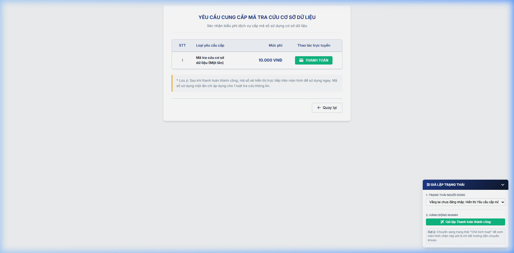

### 4.1.12. Tra cứu hồ sơ theo mã số sử dụng CSDL

#### 4.1.12.1. Mục đích
\- Cho phép Người sử dụng (NSD) và Cơ quan Nhà nước có thẩm quyền thực hiện tra cứu thông tin đăng ký biện pháp bảo đảm (BPBĐ) và hợp đồng đã được lưu trữ trong theo 3 tiêu chí tra cứu: Số đăng ký, Bên bảo đảm, hoặc Số khung phương tiện giao thông đường bộ.

*a. Phân quyền*

\- Khách hàng (Cá nhân, Tổ chức) đã được cấp mã số sử dụng CSDL thường xuyên hoặc mua mã số sử dụng một lần.

\- Cơ quan Nhà nước có thẩm quyền (Cục Thi hành án, Tòa án, Viện kiểm sát, Cơ quan điều tra,...) được cấp mã số sử dụng CSDL cơ quan (miễn phí).

*b. Điều kiện thực hiện*
\- Người dùng đã truy cập thành công vào phân hệ tra cứu trực tuyến trên Website Khách hàng. 

\- Người dùng có mã số sử dụng CSDL còn hiệu lực (trạng thái "Hoạt động", chưa hết hạn, và đối với mã sử dụng một lần thì không ở trạng thái "Đã sử dụng"). 

---

#### 4.1.12.2. MH01 - Màn hình Tra cứu thông tin

##### 4.1.12.2.1. Màn hình

##### 4.1.12.2.2. Mô tả thông tin trên màn hình

| Trường thông tin | Kiểu dữ liệu | Bắt buộc | Mặc định | Mô tả |
| :--- | :--- | :--- | :--- | :--- |
| **I. Khối Bạn chưa có mã số sử dụng cơ sở dữ liệu** | | | | |
| Thanh thông tin yêu cầu cấp mã số sử dụng CSDL | String(50) | Không | - | - Hiển thị khối thông tin (CTA block) gồm tiêu đề, icon và 2 nút lựa chọn: **Cấp mã Một lần** và **Cấp mã Thường xuyên**. + Quy tắc hiển thị: + Đối với khách vãng lai và tài khoản đã đăng nhập nhưng chưa liên kết mã: Hiển thị đầy đủ cả 2 lựa chọn. + Quy tắc ẩn: Hệ thống tự động ẩn nếu tài khoản đã liên kết mã thường xuyên ở trạng thái `Hoạt động`, hoặc đã tồn tại một yêu cầu cấp mã thường xuyên đang ở trạng thái `Chờ thanh toán`. |
| **II. Khối xác thực quyền tra cứu** | | | | |
| Mã số sử dụng CSDL | String(50) | Có | Trống / Tự động điền | - Nhập mã số sử dụng CSDL được cấp (dạng `CQ-XXXXXX`, `TX-XXXXXX`, `1L-XXXXXX` hoặc `OL-XXXXXX`). + Nếu người dùng đã đăng nhập và tài khoản đã liên kết mã thường xuyên: Hệ thống tự điền mã liên kết và để ở trạng thái chỉ đọc (Read-only). |
| **III. Khối tiêu chí - Tra cứu theo Số đăng ký** | - | - | - | Chỉ hiển thị khi NSD chọn Tab **Tra cứu theo Số đăng ký**. |
| Số đăng ký | String(50) | Có | Trống | Control UI: Input text. - Nhập số đăng ký của bất kỳ hồ sơ nào trong chuỗi giao dịch (số đăng ký gốc hoặc số thay đổi/xóa/thông báo) cần tra cứu. |
| **IV. Khối tiêu chí - Tra cứu theo Bên bảo đảm** | - | - | - | Chỉ hiển thị khi NSD chọn Tab **Tra cứu theo Bên bảo đảm**. |
| Loại chủ thể | Enum(String(50)) | Có | Công dân Việt Nam | Control UI: Hộp chọn. Tham chiếu Danh mục Loại bên bảo đảm (Chủ thể) [DM_06]. |
| Họ và tên | String(255) | Có | Trống | Chỉ hiển thị khi Loại chủ thể chọn là: + "Công dân Việt Nam" + "Người nước ngoài" + "Người không quốc tịch cư trú tại Việt Nam" |
| Số CMND/Căn cước công dân/Chứng minh quân đội | String(12) | Có | Trống | - Chỉ hiển thị khi Loại chủ thể là "Công dân Việt Nam". + Nhập số CMND/Căn cước công dân/Chứng minh quân đội hợp lệ (12 chữ số). Không chấp nhận chữ cái hay ký tự đặc biệt. |
| Mã số thuế | String(50) | Có | Trống | Chỉ hiển thị khi Loại chủ thể chọn là: + "Tổ chức có đăng ký kinh doanh trong nước" + "Tổ chức nước ngoài" |
| Số Hộ chiếu | String(50) | Có | Trống | Chỉ hiển thị khi Loại chủ thể là: + "Người nước ngoài" |
| **V. Khối tiêu chí - Tra cứu theo Số khung** | - | - | - | Chỉ hiển thị khi NSD chọn Tab **Tra cứu theo Số khung**. |
| Số khung | String(50) | Có | Trống | Control UI: Input text. - Nhập chính xác số khung của phương tiện giao thông cơ giới đường bộ cần kiểm tra. |

##### 4.1.12.2.3. Chức năng trên màn hình

| STT | Tên chức năng | Định dạng | Mô tả |
| :-- | :--- | :--- | :--- |
| 1 | Khởi tạo màn hình | Hệ thống | - Hệ thống tự động kiểm tra trạng thái tài khoản đăng nhập của người dùng. - Nếu tài khoản có yêu cầu cấp mã thường xuyên ở trạng thái `Chờ thanh toán`: Tự động chuyển hướng sang màn hình **MH03 - Thông tin yêu cầu cấp mã số đang chờ thanh toán**. - Các trường hợp khác: Hiển thị giao diện màn hình tra cứu bình thường. |
| 2 | Cấp mã Một lần | Button | - Chuyển hướng người dùng sang màn hình **MH04 - Yêu cầu cung cấp mã tra cứu cơ sở dữ liệu (Một lần)**. |
| 3 | Cấp mã Thường xuyên | Button | - **TH Chưa đăng nhập**: Chuyển hướng sang màn hình **Đăng nhập khách hàng** (thuộc Module Đăng nhập). Sau khi đăng nhập thành công: + Nếu tài khoản chưa tạo yêu cầu cấp mã: Tự động chuyển tiếp tới màn hình **MH02 - Màn hình Xác nhận biểu phí và thanh toán (Mã thường xuyên)**. + Nếu tài khoản đã có yêu cầu cấp mã ở trạng thái `Chờ thanh toán`: Tự động chuyển tiếp tới màn hình **MH03 - Màn hình Thông tin yêu cầu cấp mã số đang chờ thanh toán**. - **TH Đã đăng nhập**: + Nếu tài khoản chưa tạo yêu cầu cấp mã: Chuyển tiếp tới màn hình **MH02 - Màn hình Xác nhận biểu phí và thanh toán (Mã thường xuyên)**. + Nếu tài khoản đã có yêu cầu cấp mã ở trạng thái `Chờ thanh toán`: Chuyển tiếp tới màn hình **MH03 - Màn hình Thông tin yêu cầu cấp mã số đang chờ thanh toán**. |
| 4 | Tìm kiếm | Nút | Khi người dùng click nút Tìm kiếm, hệ thống kiểm tra dữ liệu và xử lý theo các trường hợp sau: - **TH1 - Bỏ trống trường bắt buộc**: Vi phạm [BR-VAL-001], hệ thống chặn thao tác, highlight đỏ viền ô nhập bị bỏ trống đầu tiên, hiển thị thông báo lỗi [MSG-ERR-VAL-001] ngay phía dưới ô nhập và tự động focus con trỏ vào ô lỗi đó. - **TH2 - Dữ liệu không hợp lệ**: Vi phạm [BR-VAL-003], hệ thống chặn thao tác và hiển thị thông báo lỗi tương ứng tại trường dữ liệu (Số định danh CCCD sai định dạng hiển thị [MSG-ERR-VAL-004], Mã số thuế sai định dạng hiển thị [MSG-ERR-VAL-005]). - **TH3 - Mã số sử dụng CSDL không tồn tại**: Hệ thống chặn thao tác và hiển thị cảnh báo [MSG-ERR-CSDL-001]. - **TH4 - Mã số sử dụng CSDL đang chờ thanh toán**: Hệ thống chặn thao tác và hiển thị cảnh báo [MSG-ERR-CSDL-002]. - **TH5 - Mã số sử dụng CSDL bị khóa/ngưng sử dụng/đã hết lượt**: Hệ thống chặn thao tác và hiển thị cảnh báo [MSG-ERR-CSDL-003]. - **TH6 - Mã số sử dụng CSDL hết hạn**: Hệ thống chặn thao tác và hiển thị cảnh báo [MSG-ERR-CSDL-004]. - **TH7 - Không có dữ liệu trả về**: Nếu không tìm thấy hồ sơ nào phù hợp với điều kiện tìm kiếm, hệ thống mở màn hình **MH06 - Chi tiết kết quả tra cứu** và hiển thị thông báo [MSG-INF-SYS-001] tại khu vực kết quả. - **TH8 - Hợp lệ**: Quét toàn bộ CSDL theo tiêu chí tra cứu. Hệ thống ghi nhật ký tra cứu (Audit Log). Trường hợp dùng mã một lần, hệ thống tự động cập nhật trạng thái của mã thành `Đã sử dụng` và ghi nhận lịch sử sử dụng. Hệ thống mở màn hình **MH06 - Chi tiết kết quả tra cứu** hiển thị toàn bộ các hồ sơ liên quan phù hợp với tiêu chí tìm kiếm và còn hiệu lực (chưa có Yêu cầu Xóa đăng ký được phê duyệt hoàn thành), được sắp xếp theo cây hồ sơ bắt đầu từ Hồ sơ đăng ký lần đầu tới các hồ sơ Đăng ký thay đổi, Thông báo xử lý tài sản bảo đảm... |
| 5 | Nhập lại | Nút | - Làm trống toàn bộ dữ liệu đã nhập trên form tìm kiếm của Tab đang chọn và reset về trạng thái mặc định (ngoại trừ mã số sử dụng CSDL nếu được tự động điền từ tài khoản đăng nhập). |

---

#### 4.1.12.3. MH02 - Màn hình Xác nhận biểu phí và thanh toán (Mã thường xuyên)

##### 4.1.12.3.1. Màn hình

##### 4.1.12.3.2. Mô tả thông tin trên màn hình

| Trường thông tin | Kiểu dữ liệu | Bắt buộc | Mặc định | Mô tả |
| :--- | :--- | :--- | :--- | :--- |
| Tiêu đề màn hình | String(255) | Có | "YÊU CẦU CẤP MÃ SỐ SỬ DỤNG CƠ SỞ DỮ LIỆU THƯỜNG XUYÊN" | Hiển thị ở đầu màn hình. |
| Mô tả phụ | Text(500) | Không | "Xác nhận biểu phí dịch vụ cấp mã số sử dụng cơ sở dữ liệu" | Hiển thị ngay dưới tiêu đề màn hình. |
| **I. Bảng xác nhận biểu phí** | - | - | - | Control UI: Bảng/Lưới hiển thị. Hiển thị dịch vụ đăng ký và mức phí trước khi thanh toán. |
| STT | Integer(10) | - | `1` | Số thứ tự dòng dữ liệu. Chỉ đọc. |
| Loại yêu cầu cấp | Enum(String(50)) | - | `Mã tra cứu cơ sở dữ liệu (Thường xuyên)` | Tên dịch vụ yêu cầu cấp. Chỉ đọc. |
| Số lượng | Integer(10) | - | `1` | Số lượng mã đăng ký cấp. Chỉ đọc. |
| Mức phí | Decimal(18,0) | - | Theo cấu hình | Mức phí cấp mã thường xuyên lấy tự động từ cấu hình biểu phí dịch vụ "Cấp mã số sử dụng CSDL thường xuyên" (tại Module Cấu hình thông tin biểu phí - UC559 thuộc Website Quản trị, đường dẫn: *Biện pháp bảo đảm -> Quản lý phí -> Quản lý Biểu phí*). - Quy tắc tính mức phí theo thời điểm thanh toán: + Thanh toán **trước ngày 01/07**: Thu **100%** mức phí theo cấu hình. + Thanh toán **từ ngày 01/07 trở đi của năm hiện tại**: Thu **50%** giá trị đã cấu hình. Chỉ đọc. |
| Lưu ý chân trang | Text(2000) | Không | Theo hệ thống | Hiển thị nội dung: `* Lưu ý: Sau khi thanh toán thành công, mã số thường xuyên sẽ được kích hoạt liên kết với tài khoản. Đồng thời Biên lai thu phí điện tử và mã số sẽ được gửi vào email đăng ký của người dùng.` |

##### 4.1.12.3.3. Chức năng trên màn hình

| STT | Tên chức năng | Định dạng | Mô tả |
| :-- | :--- | :--- | :--- |
| 1 | THANH TOÁN | Button | Khi người dùng click nút **THANH TOÁN**, hệ thống thực hiện: - **Bước 1**: Khởi tạo yêu cầu cấp mã CSDL Thường xuyên trên hệ thống với đầy đủ thông tin chuẩn hóa theo cấu trúc Popup Tạo mới/Chỉnh sửa yêu cầu cấp mã số sử dụng CSDL: + Mã yêu cầu (Request ID): Tự động sinh theo định dạng `RQ-YYYYMMDD-XXXX`. + Loại đối tượng: Tự động xác định theo loại tài khoản đăng nhập (`Cá nhân` hoặc `Tổ chức`, tham chiếu [DM_37]). + Loại mã số sử dụng CSDL: `Sử dụng thường xuyên` (tham chiếu [DM_38]). + Mã Tài khoản trực tuyến (Tên đăng nhập): Tên đăng nhập của tài khoản đang đăng nhập. + Tên đối tượng đề nghị: Họ và tên cá nhân hoặc Tên tổ chức lấy từ thông tin tài khoản đăng nhập. + Số CCCD/MST: Số CCCD (đối với cá nhân) hoặc Mã số thuế (đối với tổ chức) lấy từ thông tin tài khoản đăng nhập. + Email nhận thông tin: Email đăng ký của tài khoản. + Số điện thoại liên hệ: Số điện thoại từ thông tin tài khoản. + Địa chỉ liên hệ: Địa chỉ từ thông tin tài khoản. + Ngày tạo: Ngày giờ hiện tại của hệ thống (`dd/mm/yyyy HH:mm:ss`). + Ngày hết hạn: Ngày `31/12` của năm cấp mã. + Phương thức thanh toán: `Thanh toán trực tuyến` (tham chiếu [DM_40]). + Mức phí cần thu: Tự động lấy từ cấu hình biểu phí dịch vụ "Cấp mã số sử dụng CSDL thường xuyên" tại Module Cấu hình thông tin biểu phí (UC559). Thời điểm gửi yêu cầu/thanh toán trước ngày 01/07 tính 100% mức phí cấu hình; từ ngày 01/07 trở đi của năm hiện tại tính 50% mức phí cấu hình. + Mã CSDL dự kiến sinh: Dạng `TX-XXXXXX` (chuỗi 6 chữ số ngẫu nhiên duy nhất) ở trạng thái `Chờ thanh toán`. + Trạng thái yêu cầu: `Chờ thanh toán`. - **Bước 2**: Đóng gói bộ tham số thanh toán chuyển sang **Module Thanh toán trực tuyến**: + `Mã loại thanh toán`: `LOAI_04 - THANH_TOAN_CAP_MA_CSDL`. + `Mã hồ sơ / Mã đối soát`: Mã yêu cầu vừa sinh ở Bước 1 (`RQ-YYYYMMDD-XXXX`). + `Số tiền thanh toán`: Lấy theo Mức phí cần thu đã tính ở Bước 1. + `Nội dung thanh toán`: `"Nop phi cap ma CSDL [Mã yêu cầu]"`. + `Mã đơn vị thụ hưởng`: Mã Cục Đăng ký quốc gia giao dịch bảo đảm. + `Return URL`: Đường dẫn quay về màn hình **MH05 - Thanh toán lệ phí thành công** sau khi hoàn tất thanh toán. - **Bước 3**: Chuyển hướng người dùng sang **Module Thanh toán trực tuyến** để tiếp tục quy trình thanh toán qua Cổng thanh toán. |
| 2 | Quay lại | Button | Khi người dùng click, hệ thống chuyển hướng quay lại màn hình **MH01 - Tra cứu thông tin**. |

---

#### 4.1.12.4. MH03 - Màn hình Thông tin yêu cầu cấp mã số đang chờ thanh toán

##### 4.1.12.4.1. Màn hình

##### 4.1.12.4.2. Mô tả thông tin trên màn hình

| Trường thông tin | Kiểu dữ liệu | Bắt buộc | Mặc định | Mô tả |
| :--- | :--- | :--- | :--- | :--- |
| **I. Khối cảnh báo yêu cầu cấp mã chờ thanh toán** | - | - | - | Control UI: Banner thông báo màu vàng có icon cảnh báo. Hiển thị khi tài khoản đăng nhập đang có yêu cầu cấp mã số sử dụng CSDL ở trạng thái `Chờ thanh toán`. |
| Tiêu đề cảnh báo | String(255) | Có | "Yêu cầu cấp mã số đang chờ thanh toán" | In đậm, màu cảnh báo. |
| Nội dung cảnh báo | Text(500) | Có | "Tổ chức/cá nhân cần thanh toán phí cấp mã số sử dụng cơ sở dữ liệu trước khi kích hoạt!" | Hiển thị ngay dưới tiêu đề cảnh báo. |
| **II. Khối Thông tin đối soát phí cần nộp** | - | - | - | Control UI: Bảng/Lưới hiển thị thông tin nghĩa vụ phí của yêu cầu cấp mã. |
| Mã yêu cầu | String(50) | - | Theo yêu cầu | Chỉ đọc. Mã yêu cầu cấp mã CSDL (`RQ-YYYYMMDD-XXXX`). |
| Ngày tạo | Date | - | Theo yêu cầu | Chỉ đọc. Định dạng `dd/mm/yyyy`. |
| Tên khách hàng | String(255) | - | Theo tài khoản | Chỉ đọc. Họ tên cá nhân / Tên tổ chức từ tài khoản đăng nhập. |
| Mức phí | Decimal(18,0) | - | Theo cấu hình | Chỉ đọc. Tự động lấy từ cấu hình biểu phí dịch vụ "Cấp mã số sử dụng CSDL thường xuyên" tại Module **Cấu hình thông tin biểu phí** (UC559 trên Website Quản trị). Mức phí tính theo thời điểm thanh toán: gửi yêu cầu/thanh toán **trước ngày 01/07** thu **100%** mức phí theo cấu hình; gửi yêu cầu/thanh toán **từ ngày 01/07 trở đi của năm hiện tại** thu **50%** giá trị đã cấu hình. |
| Trạng thái | Enum(String(50)) | - | `Chờ thanh toán` | Chỉ đọc. Hiển thị dạng badge trạng thái `Chờ thanh toán`. |
| **III. Khối Hướng dẫn thanh toán phí** | - | - | - | Control UI: Khối thông tin hướng dẫn đa kênh. Nội dung hướng dẫn thanh toán được lấy động từ cấu hình quản trị nội dung **Hướng dẫn thanh toán phí cấp mã CSDL** tại Website Quản trị. |
| Nội dung Hướng dẫn thanh toán | Text(4000) | Không | Theo cấu hình hệ thống | Hiển thị chi tiết 3 hình thức thanh toán theo nội dung do Quản trị hệ thống cấu hình: 1. **Thanh toán trực tuyến**: Nhấn nút THANH TOÁN trực tiếp trên bảng Thông tin đối soát phí cần nộp để nộp phí qua Cổng thanh toán quốc gia (VNPAY / Foxpay). Sau khi thanh toán thành công, mã số sử dụng CSDL sẽ được kích hoạt tức thì. 2. **Chuyển khoản ngân hàng (Internet Banking / Smart Banking)**: Chuyển khoản qua số tài khoản chuyên thu của Cục Đăng ký quốc gia giao dịch bảo đảm tại ngân hàng VietinBank: - Tên tài khoản: Cục Đăng ký quốc gia giao dịch bảo đảm - Số tài khoản: 115618556886 - Ngân hàng: VietinBank - Chi nhánh Hà Nội - Nội dung chuyển: `Nop phi cap ma CSDL [Mã yêu cầu]` 3. **Nộp tiền mặt**: Nộp trực tiếp tại Văn phòng Cục Đăng ký quốc gia giao dịch bảo đảm. |

##### 4.1.12.4.3. Chức năng trên màn hình

| STT | Tên chức năng | Định dạng | Mô tả |
| :-- | :--- | :--- | :--- |
| 1 | THANH TOÁN | Button | Khi người dùng click nút **THANH TOÁN**, hệ thống đóng gói bộ tham số thanh toán chuyển sang **Module Thanh toán trực tuyến**: + `Mã loại thanh toán`: `LOAI_04 - THANH_TOAN_CAP_MA_CSDL`. + `Mã hồ sơ / Mã đối soát`: Mã yêu cầu (`RQ-YYYYMMDD-XXXX`). + `Số tiền thanh toán`: Mức phí cần thu theo yêu cầu cấp mã. + `Nội dung thanh toán`: `"Nop phi cap ma CSDL [Mã yêu cầu]"`. + `Mã đơn vị thụ hưởng`: Mã Cục Đăng ký quốc gia giao dịch bảo đảm. + `Return URL`: Đường dẫn quay về màn hình **MH05 - Thanh toán lệ phí thành công** sau khi hoàn tất thanh toán. Chuyển hướng người dùng sang **Module Thanh toán trực tuyến** để tiếp tục quy trình thanh toán qua Cổng thanh toán. |
| 2 | Xem | Link | Mở xem thông tin chi tiết của yêu cầu cấp mã. |
| 3 | Quay lại | Button | Khi người dùng click, hệ thống chuyển hướng quay lại màn hình **MH01 - Tra cứu thông tin**. |

---

#### 4.1.12.5. MH04 - Màn hình Yêu cầu cung cấp mã tra cứu cơ sở dữ liệu (Một lần)

##### 4.1.12.5.1. Màn hình

##### 4.1.12.5.2. Mô tả thông tin trên màn hình

| Trường thông tin | Kiểu dữ liệu | Bắt buộc | Mặc định | Mô tả |
| :--- | :--- | :--- | :--- | :--- |
| **I. Bảng biểu phí cần nộp** | - | - | - | Control UI: Bảng/Lưới hiển thị. Hiển thị dịch vụ đăng ký và mức phí. |
| Loại yêu cầu cấp | Enum(String(50)) | - | `Mã tra cứu cơ sở dữ liệu` | Tên dịch vụ yêu cầu cấp. Chỉ đọc. |
| Số lượng | Integer(10) | - | `1` | Số lượng mã đăng ký cấp. Chỉ đọc. |
| Mức phí | Decimal(18,0) | - | Theo cấu hình | Mức phí cấp 1 lần lấy tự động từ cấu hình biểu phí dịch vụ "Cấp mã tra cứu CSDL một lần" tại Module Cấu hình thông tin biểu phí (UC559). Chỉ đọc. |
| Ghi chú chân trang | Text(2000) | - | Ghi chú điều khoản Nghị định 99/2022/NĐ-CP | Quy định về việc người yêu cầu tự chịu phí thanh toán không dùng tiền mặt (nếu có). |

##### 4.1.12.5.3. Chức năng trên màn hình

| STT | Tên chức năng | Định dạng | Mô tả |
| :-- | :--- | :--- | :--- |
| 1 | Cấp mã Một lần | Button | Khi người dùng click nút **Cấp mã Một lần**, hệ thống thực hiện: - **Bước 1**: Khởi tạo yêu cầu cấp mã CSDL Một lần trên hệ thống với đầy đủ thông tin chuẩn hóa theo cấu trúc Popup Tạo mới/Chỉnh sửa yêu cầu cấp mã số sử dụng CSDL: + Mã yêu cầu (Request ID): Tự động sinh theo định dạng `RQ-YYYYMMDD-XXXX`. + Loại đối tượng: `Cá nhân` (hoặc `Tổ chức` nếu tài khoản đã đăng nhập; trường hợp vãng lai mặc định là `Cá nhân`, tham chiếu [DM_37]). + Loại mã số sử dụng CSDL: `Sử dụng một lần` (tham chiếu [DM_38]). + Mã Tài khoản trực tuyến (Tên đăng nhập): Tên đăng nhập của tài khoản (nếu đã đăng nhập) hoặc để trống (nếu là khách vãng lai). + Tên đối tượng đề nghị: Họ và tên cá nhân / Tên tổ chức lấy từ thông tin tài khoản đăng nhập hoặc lưu `"Vãng lai"` (nếu chưa đăng nhập). + Số CCCD/MST: Số CCCD hoặc Mã số thuế (nếu đã đăng nhập) hoặc để trống. + Email nhận thông tin: Email đăng ký (nếu có tài khoản đăng nhập) hoặc để trống. + Số điện thoại liên hệ: Số điện thoại từ thông tin tài khoản (nếu có) hoặc để trống. + Địa chỉ liên hệ: Địa chỉ từ thông tin tài khoản (nếu có) hoặc để trống. + Ngày tạo: Ngày giờ hiện tại của hệ thống (`dd/mm/yyyy HH:mm:ss`). + Ngày hết hạn: Không giới hạn thời gian (mã có hiệu lực cho tới khi được sử dụng tra cứu đúng 01 lần). + Phương thức thanh toán: `Thanh toán trực tuyến` (tham chiếu [DM_40]). + Mức phí cần thu: Tự động lấy từ cấu hình biểu phí dịch vụ "Cấp mã tra cứu CSDL một lần" tại Module Cấu hình thông tin biểu phí (UC559). + Mã CSDL dự kiến sinh: Dạng `1L-XXXXXX` (chuỗi 6 chữ số ngẫu nhiên duy nhất) ở trạng thái `Chờ thanh toán`. + Trạng thái yêu cầu: `Chờ thanh toán`. - **Bước 2**: Đóng gói bộ tham số thanh toán chuyển sang **Module Thanh toán trực tuyến**: + `Mã loại thanh toán`: `LOAI_04 - THANH_TOAN_CAP_MA_CSDL`. + `Mã hồ sơ / Mã đối soát`: Mã yêu cầu vừa sinh (`RQ-YYYYMMDD-XXXX`). + `Số tiền thanh toán`: Lấy theo Mức phí cần thu đã tính ở Bước 1. + `Nội dung thanh toán`: `"Nop phi cap ma CSDL [Mã yêu cầu]"`. + `Mã đơn vị thụ hưởng`: Mã Cục Đăng ký quốc gia giao dịch bảo đảm. + `Return URL`: Đường dẫn quay về màn hình **MH05 - Thanh toán lệ phí thành công** sau khi hoàn tất thanh toán. - **Bước 3**: Chuyển hướng người dùng sang **Module Thanh toán trực tuyến** để tiếp tục quy trình thanh toán qua Cổng thanh toán. |
| 2 | Quay lại | Button | Khi người dùng click, hệ thống chuyển hướng quay lại màn hình **MH01 - Tra cứu thông tin**. |

---

#### 4.1.12.6. MH05 - Màn hình Thanh toán lệ phí thành công

##### 4.1.12.6.1. Màn hình

##### 4.1.12.6.2. Mô tả thông tin trên màn hình

| Trường thông tin | Kiểu dữ liệu | Bắt buộc | Mặc định | Mô tả |
| :--- | :--- | :--- | :--- | :--- |
| Trạng thái thanh toán | String(255) | Có | "Thanh toán lệ phí thành công" | Hiển thị kèm icon check màu xanh để xác nhận giao dịch thanh toán thành công. |
| Nội dung thông báo thành công | Text(1000) | Có | Theo loại mã được cấp | Đối với mã thường xuyên, hiển thị nội dung: Yêu cầu cấp mã số sử dụng cơ sở dữ liệu thường xuyên đã được thanh toán và kích hoạt thành công. Dưới đây là mã số CSDL của bạn. |
| Mã số sử dụng CSDL của bạn | String(50) | Có | Theo mã vừa sinh | Hiển thị mã số sử dụng CSDL vừa được sinh và kích hoạt sau thanh toán thành công. Đối với mã thường xuyên, định dạng `TX-XXXXXX`. |
| Thông báo gửi email | Text(1000) | Có | Theo hệ thống | Chỉ hiển thị đối với mã thường xuyên. Thông báo kích hoạt mã số kèm **Biên lai thu phí điện tử đã nộp (đã ký số điện tử)** được gửi thành công đến địa chỉ email đăng ký của NSD. |

##### 4.1.12.6.3. Chức năng trên màn hình

| STT | Tên chức năng | Định dạng | Mô tả |
| :-- | :--- | :--- | :--- |
| 1 | Quay lại trang chủ | Button | Khi click, hệ thống chuyển NSD về trang chủ Website Khách hàng. |
| 2 | Tra cứu ngay | Button | Khi click, hệ thống chuyển NSD về màn hình **MH01 - Tra cứu thông tin**, hiển thị lại Tab tra cứu đang được chọn trước đó hoặc Tab mặc định **Tra cứu theo Số đăng ký** nếu chưa xác định được Tab trước đó. Hệ thống tự động điền sẵn mã số sử dụng CSDL thường xuyên vừa sinh/kích hoạt vào trường **Mã số sử dụng CSDL** để NSD có thể nhập tiêu chí còn lại và thực hiện tra cứu. |

---

#### 4.1.12.7. MH06 - Màn hình Chi tiết kết quả tra cứu (dùng chung sau khi bấm Tìm kiếm)

##### 4.1.12.7.1. Màn hình

##### 4.1.12.7.2. Mô tả thông tin trên màn hình

| Trường thông tin | Kiểu dữ liệu | Bắt buộc | Mặc định | Mô tả |
| :--- | :--- | :--- | :--- | :--- |
| **I. Tra cứu thông tin** | | | | Tiêu đề khối hiển thị là **"TRA CỨU THÔNG TIN"**, in hoa/in đậm. Khối này echo lại đúng tiêu chí người dùng đã sử dụng để tra cứu và thời điểm hệ thống thực hiện tra cứu. |
| Loại tra cứu | Enum(String(50)) | Có | Theo Tab vừa bấm Tìm kiếm | Chỉ đọc. Xác định theo Tab người dùng thực hiện tra cứu, gồm: **Số đăng ký**, **Bên bảo đảm**, **Số khung**. Không bắt buộc hiển thị thành dòng riêng nếu tiêu đề/tiêu chí bên dưới đã thể hiện rõ loại tra cứu. |
| Số đăng ký | String(50) | Tùy điều kiện | Theo tiêu chí nhập | Chỉ hiển thị nếu Loại tra cứu là **Số đăng ký**. Định dạng hiển thị: `Số đăng ký: [Giá trị]`. |
| Bên bảo đảm | String(255) | Tùy điều kiện | Theo tiêu chí nhập | Chỉ hiển thị nếu Loại tra cứu là **Bên bảo đảm** và tiêu chí có nhập tên bên bảo đảm. Định dạng hiển thị: `Bên bảo đảm: [Giá trị]`. |
| Loại chủ thể | Enum(String(50)) | Tùy điều kiện | Theo tiêu chí nhập | Chỉ hiển thị nếu Loại tra cứu là **Bên bảo đảm**. Tham chiếu Danh mục dùng chung - Loại bên bảo đảm (Chủ thể) [DM_06]. |
| Số CMND/Căn cước công dân/Chứng minh quân đội | String(12) | Tùy điều kiện | Theo tiêu chí nhập | Chỉ hiển thị nếu Loại tra cứu là **Bên bảo đảm** và Loại chủ thể là **Công dân Việt Nam**. Định dạng hiển thị: `Số CMND/Căn cước công dân/Chứng minh quân đội: [Giá trị]`. |
| Mã số thuế/Số đăng ký kinh doanh | String(14) | Tùy điều kiện | Theo tiêu chí nhập | Chỉ hiển thị nếu Loại tra cứu là **Bên bảo đảm** và Loại chủ thể là **Tổ chức có đăng ký kinh doanh trong nước**. Định dạng hiển thị: `Mã số thuế/Số đăng ký kinh doanh: [Giá trị]`. |
| Số Hộ chiếu | String(50) | Tùy điều kiện | Theo tiêu chí nhập | Chỉ hiển thị nếu Loại tra cứu là **Bên bảo đảm** và Loại chủ thể là **Người nước ngoài**. Định dạng hiển thị: `Số Hộ chiếu: [Giá trị]`. |
| Mã số thuế/Số giấy phép đầu tư | String(50) | Tùy điều kiện | Theo tiêu chí nhập | Chỉ hiển thị nếu Loại tra cứu là **Bên bảo đảm** và Loại chủ thể là **Tổ chức nước ngoài**. Định dạng hiển thị: `Mã số thuế/Số giấy phép đầu tư: [Giá trị]`. |
| Tên tổ chức | String(255) | Tùy điều kiện | Theo tiêu chí nhập | Chỉ hiển thị nếu Loại tra cứu là **Bên bảo đảm** và Loại chủ thể là **Tổ chức khác**. Định dạng hiển thị: `Tên tổ chức: [Giá trị]`. |
| Số thẻ cư trú | String(50) | Tùy điều kiện | Theo tiêu chí nhập | Chỉ hiển thị nếu Loại tra cứu là **Bên bảo đảm** và Loại chủ thể là **Người không quốc tịch cư trú tại Việt Nam**. Định dạng hiển thị: `Số thẻ cư trú: [Giá trị]`. |
| Số khung | String(50) | Tùy điều kiện | Theo tiêu chí nhập | Chỉ hiển thị nếu Loại tra cứu là **Số khung**. Định dạng hiển thị: `Số khung: [Giá trị]`. |
| Thời điểm tra cứu | Datetime | Có | Thời điểm hệ thống xử lý tìm kiếm | Chỉ đọc. Định dạng hiển thị: `dd/mm/yyyy HH:mm`. |
| **II. Chi tiết kết quả tra cứu** | | | | Chỉ hiển thị sau khi hệ thống thực hiện tra cứu hợp lệ. Hiển thị toàn bộ các hồ sơ liên quan phù hợp với tiêu chí tìm kiếm và còn hiệu lực (chưa có Yêu cầu Xóa đăng ký được phê duyệt hoàn thành), được sắp xếp theo cây hồ sơ bắt đầu từ Hồ sơ đăng ký lần đầu tới các hồ sơ Đăng ký thay đổi, Thông báo xử lý tài sản bảo đảm... |
| Dòng kết quả không có dữ liệu | Text(500) | Tùy điều kiện | Theo hệ thống | Chỉ hiển thị khi không tìm thấy hồ sơ đang có hiệu lực thỏa mãn tiêu chí tra cứu. Hiển thị Inline trong khu vực kết quả tra cứu với nội dung [MSG-INF-SYS-001], không hiển thị Toast. |
| Danh sách hồ sơ đăng ký giao dịch bảo đảm/hợp đồng tìm thấy | Text(10000) | Tùy điều kiện | Theo kết quả tra cứu | Chỉ hiển thị khi có kết quả. Từ dòng tiêu đề hồ sơ **"Đăng ký giao dịch bảo đảm / Hợp đồng - [Số đăng ký]"** trở xuống, hiển thị theo bảng **Cấu trúc chi tiết danh sách hồ sơ đăng ký giao dịch bảo đảm / hợp đồng** bên dưới. - Trạng thái có dữ liệu: Hiển thị danh sách các bản ghi kết quả theo cấu trúc các cột quy định. - Trạng thái không có dữ liệu (Empty State): Khi không tìm thấy kết quả phù hợp với điều kiện tìm kiếm, bảng hiển thị duy nhất 01 dòng căn giữa trên toàn bộ chiều rộng bảng (`colspan`), in nghiêng với nội dung theo MessageList dùng chung [MSG-INF-SYS-001]. |

###### 4.1.12.7.2.1. Cấu trúc chi tiết danh sách hồ sơ đăng ký giao dịch bảo đảm / hợp đồng

| Trường thông tin | Kiểu dữ liệu | Bắt buộc | Mặc định | Mô tả |
| :--- | :--- | :---: | :--- | :--- |
| **I. Danh sách hồ sơ đăng ký giao dịch bảo đảm / hợp đồng** | - | - | - | Hiển thị lần lượt theo từng hồ sơ. |
| Tiêu đề hồ sơ | String(255) | Có | - | Chỉ đọc. Định dạng "Đăng ký giao dịch bảo đảm / Hợp đồng - [Số đăng ký]". |
| Loại hình giao dịch | Enum(String(50)) | Có | Theo hồ sơ | Theo hồ sơ dạng Chỉ đọc. |
| Loại biện pháp | Enum(String(255)) | Tùy điều kiện | Theo hồ sơ | Theo hồ sơ dạng Chỉ đọc. |
| Loại hợp đồng | Enum(String(255)) | Tùy điều kiện | Theo hồ sơ | Theo hồ sơ dạng Chỉ đọc. |
| Trường hợp đăng ký | Enum(String(255)) | Có | Theo hồ sơ | Theo hồ sơ dạng Chỉ đọc.   - Chỉ hiển thị Tên trường hợp đăng ký ví dụ: ĐĂNG KÝ LẦN ĐẦU, ĐĂNG KÝ THAY ĐỔI, ...   - Hiển thị đậm, viết hoa |
| Trạng thái | Enum(String(50)) | Có | Theo hồ sơ | Theo hồ sơ dạng Chỉ đọc.   - Chỉ hiển thị Tên trạng thái ví dụ: Hoàn thành, Chờ duyệt...|
| Số hợp đồng | String(100) | Tùy điều kiện | Theo hồ sơ | Theo hồ sơ dạng Chỉ đọc. |
| Ngày có hiệu lực của hợp đồng | Date | Tùy điều kiện | Theo hồ sơ | Theo hồ sơ dạng Chỉ đọc. |
| **II. Thông tin người đăng ký** | - | Có | -| Control UI: Label|
| Họ và tên | String(255) | Có | Theo hồ sơ | Theo hồ sơ dạng Chỉ đọc. |
| Địa chỉ | String(500) | Có | Theo hồ sơ | Theo hồ sơ dạng Chỉ đọc. |
| **III. Thông tin đăng ký** | - | Có | - | Control UI: Label |
| Số đăng ký | String(50) | Có | Theo hồ sơ | Theo hồ sơ dạng Chỉ đọc. |
| Thời điểm đăng ký | Datetime | Có | Theo hồ sơ | Theo hồ sơ dạng Chỉ đọc. |
| Thời điểm có hiệu lực | Datetime | Có | Theo hồ sơ | Theo hồ sơ dạng Chỉ đọc. |
| **IV. Bên bảo đảm (Tiêu đề động)** | - | Có | Theo hồ sơ | Control UI: Label Theo hồ sơ |
| Loại chủ thể | Enum(String(50)) | Có | Theo hồ sơ | Theo hồ sơ dạng Chỉ đọc. |
| Số giấy tờ chứng minh tư cách pháp lý | String(50) | Có | Theo hồ sơ | Theo hồ sơ dạng Chỉ đọc. |
| Tên | String(255) | Có | Theo hồ sơ | Theo hồ sơ dạng Chỉ đọc. |
| Địa chỉ | String(500) | Có | Theo hồ sơ | Theo hồ sơ dạng Chỉ đọc. |
| **V. Bên nhận bảo đảm (Tiêu đề động)** | - | Có | Theo hồ sơ | Control UI: Label. - Theo hồ sơ dạng Chỉ đọc. |
| Tên | String(255) | Có | Theo hồ sơ | Theo hồ sơ dạng Chỉ đọc. |
| Địa chỉ | String(500) | Có | Theo hồ sơ | Theo hồ sơ dạng Chỉ đọc. |
| **VI. Tài sản bảo đảm (Tên động)** | - | Có | Theo hồ sơ | Control UI: Label. - Theo hồ sơ dạng Chỉ đọc. |
| Loại tài sản | Enum(String(50)) | Có | Theo hồ sơ | Theo hồ sơ dạng Chỉ đọc. |
| Mô tả | Text(2000) | Tùy điều kiện | Theo hồ sơ | Theo hồ sơ dạng Chỉ đọc. |
| Bảng thông tin Số khung | - | Tùy điều kiện | Theo hồ sơ | Control UI: Bảng/Lưới chỉ đọc. - Theo hồ sơ dạng Chỉ đọc. |
| Tên phương tiện | Enum/String(255) | Có | Theo hồ sơ | Theo hồ sơ dạng Chỉ đọc. |
| Nhãn hiệu, màu sơn | String(255) | Có | Theo hồ sơ | Theo hồ sơ dạng Chỉ đọc. |
| Số khung | String(50) | Có | Theo hồ sơ | Theo hồ sơ dạng Chỉ đọc. |
| Số máy | String(50) | Không | Theo hồ sơ | Theo hồ sơ dạng Chỉ đọc. |
| Biển số | String(50) | Tùy điều kiện | Theo hồ sơ | Theo hồ sơ dạng Chỉ đọc. |
| Bảng thông tin Phương tiện | - | Tùy điều kiện | Theo hồ sơ | Control UI: Bảng/Lưới chỉ đọc. - Theo hồ sơ dạng Chỉ đọc. |
| Tên phương tiện, nhãn hiệu | String(255) | Có | Theo hồ sơ | Theo hồ sơ dạng Chỉ đọc. |
| Tên/Họ tên chủ phương tiện/Chủ sở hữu | String(255) | Có | Theo hồ sơ | Theo hồ sơ dạng Chỉ đọc. |
| Số đăng ký | String(50) | Không | Theo hồ sơ | Theo hồ sơ dạng Chỉ đọc. |
| Cơ quan cấp giấy chứng nhận | String(100) | Không | Theo hồ sơ | Theo hồ sơ dạng Chỉ đọc. |
| Cấp phương tiện | String(100) | Không | Theo hồ sơ | Theo hồ sơ dạng Chỉ đọc. |
| Tên quyền | String(255) | Tùy điều kiện | Theo hồ sơ | Theo hồ sơ dạng Chỉ đọc. |
| Căn cứ phát sinh quyền | Text(2000) | Tùy điều kiện | Theo hồ sơ | Theo hồ sơ dạng Chỉ đọc. |
| Hàng hóa luân chuyển / Kho hàng | Enum(String(50)) | Tùy điều kiện | Theo hồ sơ | Theo hồ sơ dạng Chỉ đọc. |
| Giá trị hàng hóa/Tên, loại hàng hóa | Text(2000) | Tùy điều kiện | Theo hồ sơ | Theo hồ sơ dạng Chỉ đọc. |
| Địa chỉ kho hàng | String(500) | Tùy điều kiện | Theo hồ sơ | Theo hồ sơ dạng Chỉ đọc. |
| Số hiệu kho hàng/Dấu hiệu khác của vị trí kho hàng | String(255) | Tùy điều kiện | Theo hồ sơ | Theo hồ sơ dạng Chỉ đọc. |
| Bảng thông tin Thời điểm đăng ký biện pháp bảo đảm bằng chứng khoán đã đăng ký tập trung tại Tổng công ty lưu ký và bù trừ chứng khoán Việt Nam | - | Tùy điều kiện | Theo hồ sơ | Control UI: Bảng/Lưới chỉ đọc. - Theo hồ sơ dạng Chỉ đọc. |
| Giờ | Integer(10) | Có | Theo hồ sơ | Theo hồ sơ dạng Chỉ đọc. |
| Phút | Integer(10) | Có | Theo hồ sơ | Theo hồ sơ dạng Chỉ đọc. |
| Ngày | Date | Có | Theo hồ sơ | Theo hồ sơ dạng Chỉ đọc. |
| Tháng | Integer(10) | Có | Theo hồ sơ | Theo hồ sơ dạng Chỉ đọc. |
| Năm | Integer(10) | Có | Theo hồ sơ | Theo hồ sơ dạng Chỉ đọc. |

##### 4.1.12.7.3. Chức năng trên màn hình

| STT | Tên chức năng | Định dạng | Mô tả |
| :--- | :--- | :--- | :--- |
| 1 | Đóng | Button | Khi người dùng click, hệ thống đóng màn hình Chi tiết kết quả tra cứu và chuyển hướng quay lại đúng Tab đã thực hiện tra cứu trước đó, giữ nguyên các tiêu chí vừa nhập. |
