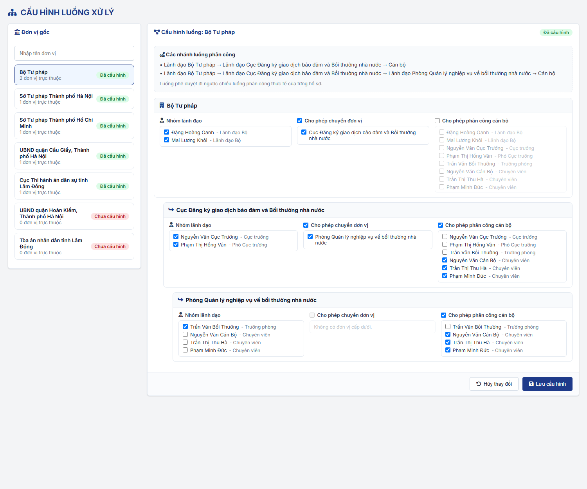
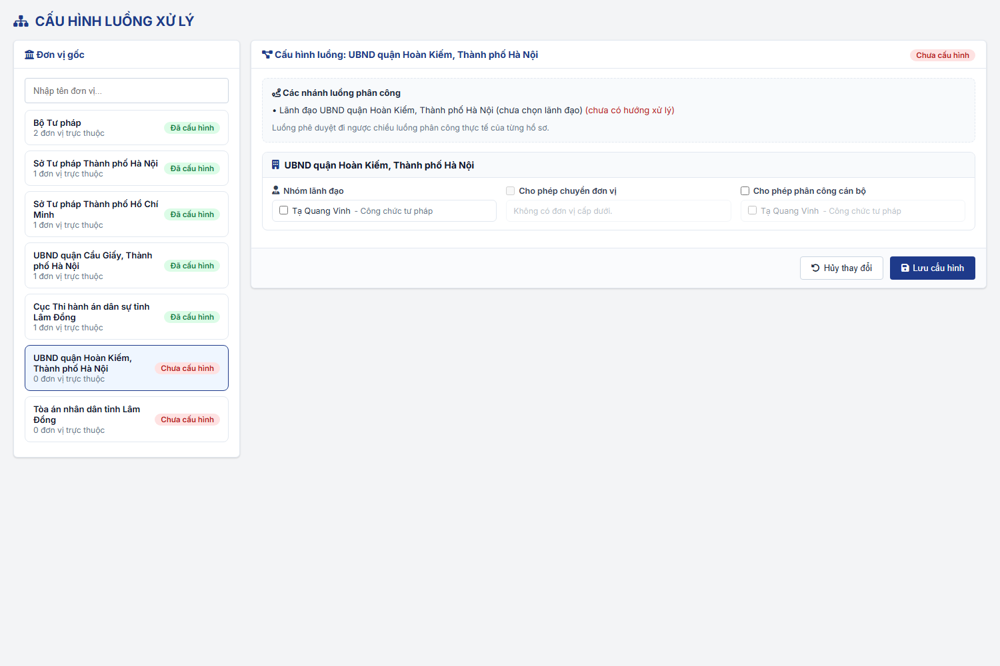
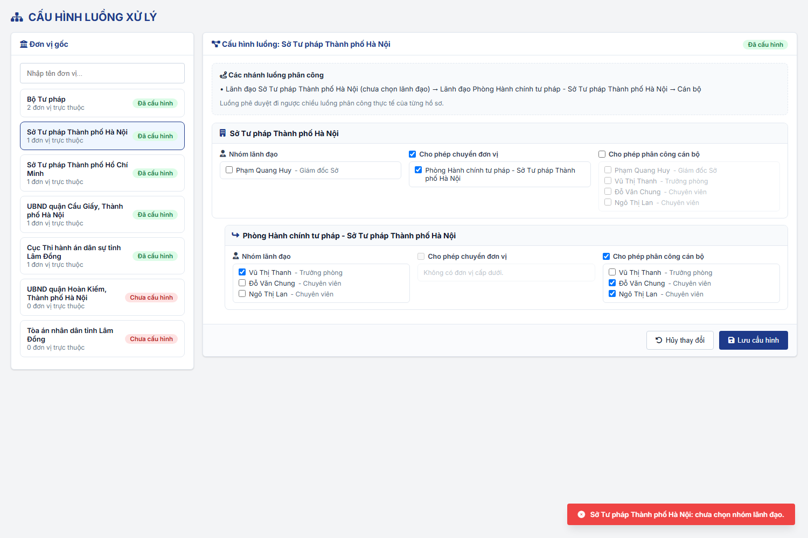

#### 4.3.1.14. Cấu hình luồng xử lý

##### 4.3.1.14.1. Mục đích
Cho phép Quản trị hệ thống cấu hình luồng phân công - phê duyệt hồ sơ của phân hệ Bồi thường nhà nước theo từng đơn vị gốc, bao gồm:
- Chọn Nhóm lãnh đạo của từng đơn vị trong cây đơn vị của đơn vị gốc.
- Cấu hình hướng xử lý của từng đơn vị: chuyển đơn vị cấp dưới trực tiếp và/hoặc phân công cán bộ.
- Xem trước các nhánh luồng phân công suy ra từ cấu hình.

Cấu hình được dùng tại [Hồ sơ trình Lãnh đạo - Hồ sơ trình Lãnh đạo - Bồi thường nhà nước (Website Quản trị)](../03_Cong_tac_boi_thuong/SRS_BTNN_ViecChoLanhDaoXuLy.md) và khi Chuyển CQGQBT tại phân hệ Xác định cơ quan giải quyết bồi thường. Cấu hình áp dụng chung cho cả 02 Loại yêu cầu "Xác định cơ quan giải quyết bồi thường" và "Yêu cầu bồi thường".

*a. Phân quyền*
- Quản trị hệ thống (QTHT).
- Menu "Cấu hình luồng xử lý" thuộc nhóm Quản trị hệ thống, đặt ngay sau menu "Quản lý cấu hình".

*b. Điều kiện thực hiện*
- Cán bộ quản trị đã đăng nhập thành công vào Website quản trị.
- Cây đơn vị và tài khoản cán bộ đã được khai báo tại [Quản lý cơ cấu tổ chức (Đơn vị) - Quản lý cơ cấu tổ chức - Quản trị hệ thống (Website Quản trị)](Co_cau_to_chuc.md) và [Quản lý tài khoản cán bộ - Quản lý tài khoản cán bộ - Quản trị hệ thống (Website Quản trị)](Quan_ly_tai_khoan_can_bo.md).

---

##### 4.3.1.14.2. Quy tắc nghiệp vụ

| STT | Nội dung | Quy tắc |
| :-- | :--- | :--- |
| 1 | Đơn vị gốc | Đơn vị cấp cao nhất trên cây Cơ cấu tổ chức (không có đơn vị cha): Bộ Tư pháp, từng Sở Tư pháp, từng cơ quan giải quyết bồi thường. - Mỗi đơn vị gốc có 01 cấu hình riêng, gồm cấu hình của đơn vị gốc và của từng đơn vị trực thuộc. |
| 2 | Nhóm lãnh đạo | Chọn nhiều tài khoản cán bộ thuộc chính đơn vị đó (không gồm cán bộ đơn vị trực thuộc). - Bất kỳ thành viên nào trong Nhóm lãnh đạo đều được phân công, phê duyệt hồ sơ tại đơn vị; không có ủy quyền. |
| 3 | Cho phép chuyển đơn vị | Khi chọn, phải chọn ít nhất 01 đơn vị cấp dưới trực tiếp được nhận hồ sơ. - Đơn vị không có đơn vị cấp dưới: không chọn được. |
| 4 | Cho phép phân công cán bộ | Khi chọn, phải chọn ít nhất 01 cán bộ được phân công, trong số cán bộ thuộc đơn vị và các đơn vị trực thuộc. |
| 5 | Đơn vị phải kiểm tra | Khi Lưu, hệ thống kiểm tra đơn vị gốc và các đơn vị nằm trên nhánh luồng (được một đơn vị khác chọn làm đơn vị nhận). Đơn vị không nằm trên nhánh luồng không bị kiểm tra. |
| 6 | Trạng thái cấu hình | Đơn vị gốc "Đã cấu hình" khi nút đơn vị gốc có Nhóm lãnh đạo và có ít nhất 01 hướng xử lý có dữ liệu (đã chọn đơn vị nhận hoặc cán bộ); ngược lại "Chưa cấu hình". - Không cho Chuyển CQGQBT đến cơ quan "Chưa cấu hình"; thông báo "Đơn vị [Tên đơn vị] chưa được cấu hình luồng phân công. Vui lòng liên hệ Quản trị hệ thống." |
| 7 | Luồng phê duyệt | Không cấu hình riêng. Luồng phê duyệt đi ngược chiều luồng phân công thực tế của từng hồ sơ. |
| 8 | Phạm vi cấu hình | Không cấu hình thời hạn cho từng bước. Không cấu hình ủy quyền. Áp dụng chung cho mọi Loại yêu cầu. |
| 9 | Hiệu lực | Cấu hình có hiệu lực ngay sau khi Lưu. Nhóm lãnh đạo, hướng xử lý được xác định tại thời điểm thao tác phân công, phê duyệt. |

---

##### 4.3.1.14.3. MH01 - Màn hình Cấu hình luồng xử lý

###### 4.3.1.14.3.1. Màn hình

###### 4.3.1.14.3.2. Mô tả thông tin trên màn hình

| Trường thông tin | Kiểu dữ liệu | Bắt buộc | Mặc định | Mô tả |
| :--- | :--- | :--- | :--- | :--- |
| Tiêu đề màn hình | String(255) | - | - | Hiển thị "CẤU HÌNH LUỒNG XỬ LÝ". |
| **I. Panel bên trái: Đơn vị gốc** | - | - | - | Danh sách đơn vị gốc. |
| Tìm kiếm đơn vị | String(255) | Không | Trống | Control UI: Input text, placeholder "Nhập tên đơn vị...". - Lọc ngay khi nhập, gần đúng, không phân biệt hoa thường theo Tên đơn vị. |
| Danh sách đơn vị gốc | List | - | Đơn vị gốc của người dùng được chọn | Mỗi dòng gồm: Tên đơn vị; "[n] đơn vị trực thuộc" (tổng số đơn vị trực thuộc các cấp); nhãn "Đã cấu hình" (màu xanh) hoặc "Chưa cấu hình" (màu đỏ). - Đơn vị đang chọn được tô nổi bật. |
| **II. Panel bên phải: Cấu hình luồng** | - | - | - | Cấu hình của đơn vị gốc đang chọn. |
| Tiêu đề khối | String(255) | - | Theo đơn vị | "Cấu hình luồng: [Tên đơn vị gốc]" và nhãn "Đã cấu hình"/"Chưa cấu hình" theo dữ liệu đã lưu. |
| Các nhánh luồng phân công | Text | - | Theo cấu hình đang chỉnh sửa | Control UI: Khung xem trước, cập nhật ngay khi thay đổi cấu hình. - Mỗi nhánh 01 dòng, dạng "Lãnh đạo [Đơn vị] → Lãnh đạo [Đơn vị cấp dưới] → ... → Cán bộ". VD Bộ Tư pháp: "Lãnh đạo Bộ Tư pháp → Lãnh đạo Cục → Lãnh đạo Phòng → Cán bộ"; Sở Tư pháp: "Lãnh đạo Sở → Lãnh đạo Phòng → Cán bộ". - Đơn vị chưa chọn Nhóm lãnh đạo: thêm "(chưa chọn lãnh đạo)" sau tên đơn vị. - Nhánh kết thúc tại đơn vị chưa có hướng xử lý: thêm "(chưa có hướng xử lý)" màu đỏ. - Dòng cuối: "Luồng phê duyệt đi ngược chiều luồng phân công thực tế của từng hồ sơ." |
| **III. Khối cấu hình theo đơn vị** | - | - | - | 01 khối cho đơn vị gốc và 01 khối cho mỗi đơn vị trực thuộc, thụt lề theo cấp trên cây đơn vị. |
| Tên đơn vị | String(255) | - | Theo cây đơn vị | Tiêu đề khối. |
| Nhóm lãnh đạo | List(String) | Có (đơn vị phải kiểm tra) | Theo dữ liệu đã lưu | Control UI: Danh sách checkbox, chọn nhiều. - Danh sách: tài khoản cán bộ thuộc chính đơn vị, hiển thị "[Họ tên] - [Chức danh]". - Đơn vị chưa có tài khoản: "Đơn vị chưa có tài khoản cán bộ." |
| Cho phép chuyển đơn vị | Boolean | Không | Theo dữ liệu đã lưu | Control UI: Checkbox. - Khóa (không chọn được) khi đơn vị không có đơn vị cấp dưới. |
| Đơn vị được chuyển | List(String) | Có (khi chọn Cho phép chuyển đơn vị) | Theo dữ liệu đã lưu | Control UI: Danh sách checkbox, chọn nhiều. - Danh sách: các đơn vị cấp dưới trực tiếp; không có: "Không có đơn vị cấp dưới." - Bị làm mờ, không chọn được khi chưa chọn "Cho phép chuyển đơn vị". |
| Cho phép phân công cán bộ | Boolean | Không | Theo dữ liệu đã lưu | Control UI: Checkbox. |
| Cán bộ được phân công | List(String) | Có (khi chọn Cho phép phân công cán bộ) | Theo dữ liệu đã lưu | Control UI: Danh sách checkbox, chọn nhiều. - Danh sách: tài khoản cán bộ thuộc đơn vị và các đơn vị trực thuộc, hiển thị "[Họ tên] - [Chức danh]"; không có: "Không có cán bộ." - Bị làm mờ, không chọn được khi chưa chọn "Cho phép phân công cán bộ". |
| Hủy thay đổi | - | - | - | Control UI: Nút, cuối khối cấu hình. |
| Lưu cấu hình | - | - | - | Control UI: Nút, cuối khối cấu hình. |

###### 4.3.1.14.3.3. Chức năng trên màn hình

| STT | Tên chức năng | Định dạng | Mô tả |
| :--- | :--- | :--- | :--- |
| 1 | Tìm kiếm đơn vị | Input text | Lọc danh sách đơn vị gốc theo từ khóa đã nhập. |
| 2 | Chọn đơn vị gốc | Click dòng | Tải cấu hình đã lưu của đơn vị gốc sang Panel phải. Đơn vị trực thuộc chưa có cấu hình hiển thị ở trạng thái trống. Thay đổi chưa lưu của đơn vị gốc đang chọn trước đó bị bỏ. |
| 3 | Chọn/bỏ chọn checkbox | Checkbox | Cập nhật cấu hình đang chỉnh sửa và khung "Các nhánh luồng phân công"; chưa lưu vào hệ thống. - Chọn/bỏ chọn "Cho phép chuyển đơn vị", "Cho phép phân công cán bộ": mở hoặc làm mờ danh sách tương ứng. |
| 4 | Hủy thay đổi | Nút | Tải lại cấu hình đã lưu của đơn vị gốc đang chọn, bỏ các thay đổi chưa lưu; hiển thị "Đã hủy các thay đổi chưa lưu." |
| 5 | Lưu cấu hình | Nút | Kiểm tra đơn vị gốc và các đơn vị nằm trên nhánh luồng theo [Quy tắc nghiệp vụ](#chlxl-quy-tac), dừng ở lỗi đầu tiên và hiển thị thông báo lỗi dạng Toast: - TH1 (Chưa chọn Nhóm lãnh đạo): "[Tên đơn vị]: chưa chọn nhóm lãnh đạo." - TH2 (Chọn Cho phép chuyển đơn vị nhưng chưa chọn đơn vị): "[Tên đơn vị]: đã chọn "Cho phép chuyển đơn vị" nhưng chưa chọn đơn vị nhận." - TH3 (Chọn Cho phép phân công cán bộ nhưng chưa chọn cán bộ): "[Tên đơn vị]: đã chọn "Cho phép phân công cán bộ" nhưng chưa chọn cán bộ." - TH4 (Chưa chọn hướng xử lý nào): "[Tên đơn vị]: chưa chọn hướng xử lý (chuyển đơn vị hoặc phân công cán bộ)." - TH Hợp lệ: lưu cấu hình của đơn vị gốc (chỉ lưu đơn vị có Nhóm lãnh đạo hoặc có hướng xử lý; bỏ danh sách đơn vị/cán bộ của hướng xử lý không được chọn), hiển thị "Đã lưu cấu hình luồng xử lý của [Tên đơn vị gốc].", tải lại cấu hình và cập nhật nhãn "Đã cấu hình"/"Chưa cấu hình". |

---

##### 4.3.1.14.4. Ghi chú
- Thanh "Người dùng giả lập" trên mockup chỉ phục vụ minh họa, không thuộc phạm vi chức năng.
- Quy tắc chặn Chuyển CQGQBT khi cơ quan được chỉ định "Chưa cấu hình" được áp dụng theo mặc định, chưa được xác nhận chính thức.
