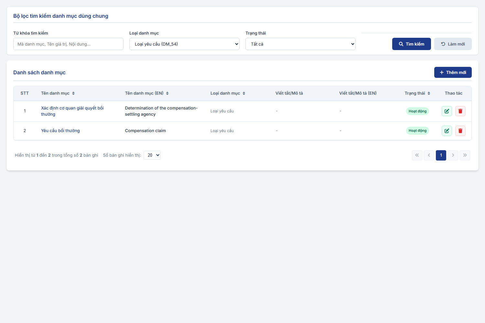
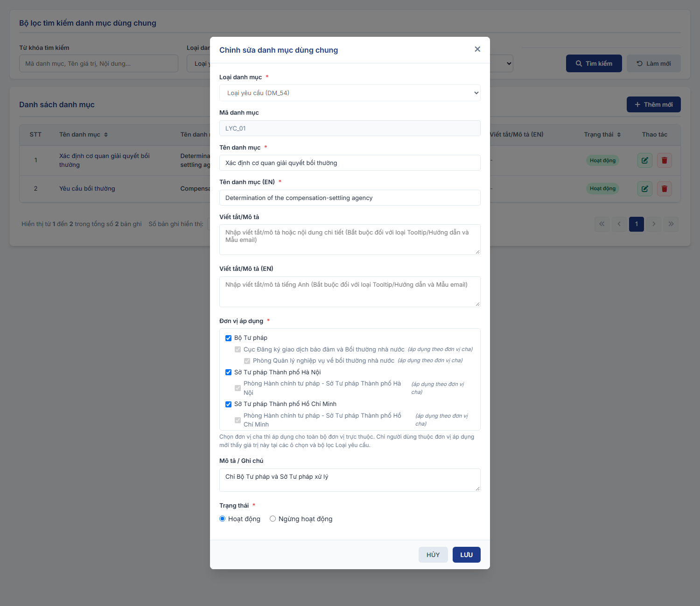
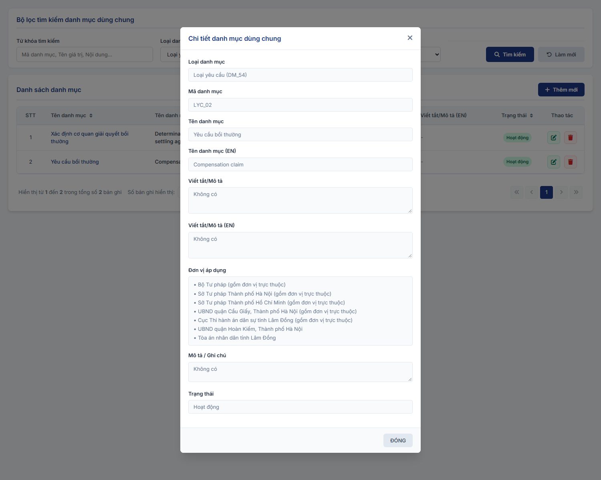

#### 4.3.1.5. Quản lý danh mục dùng chung (Master Data)

##### 4.3.1.5.1. Mục đích
Cho phép quản lý danh mục dữ liệu dùng chung (Master Data) của hệ thống Đăng ký biện pháp bảo đảm và Bồi thường nhà nước, bao gồm:
- Tra cứu, lọc danh mục theo Loại danh mục, từ khóa và trạng thái hoạt động.
- Thêm mới, chỉnh sửa thông tin danh mục hỗ trợ cả cấu trúc danh mục phẳng (Flat List) và danh mục phân cấp đa cấp (Hierarchical Tree List).
- Chuyển đổi trạng thái hoạt động (Hoạt động / Ngừng hoạt động) và xóa các bản ghi danh mục chưa phát sinh ràng buộc dữ liệu.
- Cấu hình Đơn vị áp dụng cho từng giá trị của Loại danh mục Loại yêu cầu [DM_54], dùng để phân quyền Loại yêu cầu theo đơn vị (xem [Loại danh mục Loại yêu cầu và Đơn vị áp dụng](#dm-don-vi-ap-dung)).

*a. Phân quyền*
- Quản trị hệ thống (QTHT).

*b. Điều kiện thực hiện*
- Cán bộ quản trị đã đăng nhập thành công vào Website quản trị.
- Hệ thống hoạt động bình thường.

---

##### 4.3.1.5.2. MH01 - Màn hình Tra cứu danh mục dùng chung

###### 4.3.1.5.2.1. Màn hình

###### 4.3.1.5.2.2. Mô tả thông tin trên màn hình

| Trường thông tin | Kiểu dữ liệu | Bắt buộc | Mặc định | Mô tả |
| :--- | :--- | :--- | :--- | :--- |
| **I. Bộ lọc tìm kiếm** | - | - | - | Khối điều kiện tìm kiếm danh mục. |
| Loại danh mục | Enum(String(50)) | Không | Tất cả | Control UI: Combobox. Lấy danh sách các Loại danh mục đang hoạt động từ hệ thống. |
| Từ khóa | String(255) | Không | Trống | Control UI: Input text. - Tìm kiếm theo Mã danh mục, Tên danh mục hoặc Nội dung mô tả. |
| Trạng thái | Enum(String(50)) | Không | Tất cả | Control UI: Combobox. Gồm: + Tất cả + Hoạt động + Ngừng hoạt động |
| Tìm kiếm | String(50) | - | - | Control UI: Button. - Luôn hiển thị tại bộ lọc. |
| Xóa bộ lọc | String(50) | - | - | Control UI: Button. - Luôn hiển thị tại bộ lọc. |
| **II. Bảng danh sách kết quả** | - | - | 20 bản ghi/trang | Control UI: Bảng/Lưới dữ liệu. - Cho phép chọn 10, 20, 50, 100 bản ghi/trang, mặc định 20. - Click vào dòng dữ liệu để mở MH03 ở chế độ Xem chi tiết danh mục. - Trạng thái không có dữ liệu (Empty State): Khi không tìm thấy kết quả phù hợp với điều kiện tìm kiếm, bảng hiển thị duy nhất 01 dòng căn giữa trên toàn bộ chiều rộng bảng (`colspan`), in nghiêng với nội dung theo MessageList dùng chung [MSG-INF-SYS-001]. |
| STT | Integer(10) | - | - | Control UI: Text hiển thị (Read-only). |
| Tên danh mục | String(255) | - | - | Control UI: Text hiển thị (Read-only). - Tên hiển thị tiếng Việt của danh mục. |
| Tên danh mục (EN) | String(255) | - | - | Control UI: Text hiển thị (Read-only). - Tên hiển thị tiếng Anh của danh mục. |
| Loại danh mục | String(100) | - | - | Control UI: Text hiển thị (Read-only). |
| Viết tắt / Mô tả | String(1000) | - | - | Control UI: Text hiển thị (Read-only). - Cắt ngắn kèm tooltip nếu nội dung quá dài. |
| Viết tắt / Mô tả (EN) | String(1000) | - | - | Control UI: Text hiển thị (Read-only). |
| Trạng thái | Enum(String(50)) | - | - | Control UI: Badge/Tag hiển thị. Gồm: + Hoạt động + Ngừng hoạt động |
| Thao tác | String(255) | - | - | Control UI: Nhóm icon thao tác. - `Xem chi tiết`: Luôn hiển thị. - `Sửa`: Luôn hiển thị. - `Xóa`: Luôn hiển thị. |
| Thêm mới | String(50) | - | - | Control UI: Button. - Luôn hiển thị phía trên bảng dữ liệu. |

###### 4.3.1.5.2.3. Chức năng trên màn hình

| STT | Tên chức năng | Định dạng | Mô tả |
| :--- | :--- | :--- | :--- |
| 1 | Tìm kiếm | Button | Khi người dùng click nút "Tìm kiếm": - **TH Không có dữ liệu**: Bảng hiển thị duy nhất 01 dòng căn giữa với nội dung [MSG-INF-SYS-001]; thanh phân trang hiển thị *"Hiển thị 0-0 của 0 bản ghi"* và các nút điều hướng bị khóa mờ. - **TH Có dữ liệu**: Hiển thị danh sách các bản ghi danh mục thỏa mãn điều kiện lọc. |
| 2 | Xóa bộ lọc | Button | Đưa toàn bộ các trường trong bộ lọc tìm kiếm về giá trị mặc định (`Loại danh mục` = Tất cả, `Từ khóa` = Trống, `Trạng thái` = Tất cả) và tải lại danh sách ban đầu. |
| 3 | Thêm mới | Button | Mở **MH02 - Popup Thêm mới / Cập nhật Danh mục** ở trạng thái rỗng để nhập mới. Nếu đang lọc sẵn một Loại danh mục thì tự động điền sẵn Loại danh mục đó. |
| 4 | Xem chi tiết | Icon | Mở **MH03 - Popup Xem chi tiết danh mục** hiển thị toàn bộ thông tin chi tiết của bản ghi ở chế độ chỉ đọc. |
| 5 | Sửa | Icon | Mở **MH02 - Popup Thêm mới / Cập nhật Danh mục** và tải toàn bộ dữ liệu hiện tại của bản ghi để chỉnh sửa. |
| 6 | Xóa | Icon | Mở **[POPUP-CFM-001]** với `Loại thao tác` là `Xóa` kèm thông báo xác nhận [MSG-CFM-SYS-001]: - **TH1 (Danh mục đang được sử dụng)**: Danh mục đã được sử dụng trong các hồ sơ, tài khoản hoặc đang làm Danh mục cha cho các danh mục con khác $\rightarrow$ Hệ thống chặn xóa, hiển thị cảnh báo lỗi yêu cầu chuyển trạng thái sang Ngừng hoạt động. - **TH Hợp lệ**: Khi người dùng chọn "Xác nhận", hệ thống xóa bản ghi khỏi CSDL, ghi Audit Log, hiển thị thông báo thành công [MSG-SUC-SYS-001] và làm mới danh sách bảng kết quả. |
| 7 | Click dòng dữ liệu | Row Click | Mở **MH03 - Popup Xem chi tiết danh mục** tương tự thao tác Xem chi tiết. |

---

##### 4.3.1.5.3. MH02 - Popup Thêm mới / Cập nhật Danh mục

###### 4.3.1.5.3.1. Màn hình

###### 4.3.1.5.3.2. Mô tả thông tin trên màn hình

| Trường thông tin | Kiểu dữ liệu | Bắt buộc | Mặc định | Mô tả |
| :--- | :--- | :--- | :--- | :--- |
| **Form Danh mục** | - | - | - | Hiển thị dạng Popup Modal. |
| Loại danh mục | Enum(String(50)) | Có | Lựa chọn hiện tại (Thêm mới) / Theo bản ghi (Sửa) | Control UI: Combobox. - Danh sách lấy từ các Loại danh mục đang hoạt động. - Khóa chỉ đọc (Read-only) khi ở chế độ Sửa. |
| Mã danh mục | String(50) | Có | Tự động sinh (Thêm mới) / Theo bản ghi (Sửa) | Control UI: Text hiển thị (Read-only). - Tự động sinh mã định danh duy nhất. Không cho phép sửa. |
| Tên danh mục | String(255) | Có | Trống (Thêm mới) / Theo bản ghi (Sửa) | Control UI: Input text. - Nhập tên tiếng Việt của danh mục. - Áp dụng quy tắc bắt buộc [BR-VAL-001]. |
| Tên danh mục (EN) | String(255) | Có | Trống (Thêm mới) / Theo bản ghi (Sửa) | Control UI: Input text. - Nhập tên tiếng Anh của danh mục. - Áp dụng quy tắc bắt buộc [BR-VAL-001]. |
| Viết tắt / Mô tả | Text(2000) | Tùy điều kiện | Trống (Thêm mới) / Theo bản ghi (Sửa) | Control UI: Textarea. - Bắt buộc đối với các loại danh mục đặc thù (như Tooltip, Mẫu email...). |
| Viết tắt / Mô tả (EN) | Text(2000) | Tùy điều kiện | Trống (Thêm mới) / Theo bản ghi (Sửa) | Control UI: Textarea. - Bắt buộc đối với các loại danh mục đặc thù cần đa ngôn ngữ. |
| Danh mục cha (Trực thuộc) | Enum(String(50)) | Không | Trống (Thêm mới) / Theo bản ghi (Sửa) | Control UI: Combobox. - Chọn danh mục cha đã có trên hệ thống (đối với danh mục dạng cây phân cấp). |
| Đơn vị áp dụng | List(String) | Có (chỉ với Loại danh mục Loại yêu cầu [DM_54]) | Trống (Thêm mới) / Theo bản ghi (Sửa) | Control UI: Cây đơn vị chọn nhiều (Tree Multi-select) theo cây Cơ cấu tổ chức. - Chỉ hiển thị khi Loại danh mục là Loại yêu cầu [DM_54]; ẩn với các loại danh mục khác. - Chọn đơn vị cha thì áp dụng cho toàn bộ đơn vị trực thuộc: các đơn vị con hiển thị đã chọn, bị khóa, kèm nhãn "(áp dụng theo đơn vị cha)"; không chọn riêng được. - Dòng hướng dẫn: "Chọn đơn vị cha thì áp dụng cho toàn bộ đơn vị trực thuộc. Chỉ người dùng thuộc đơn vị áp dụng mới thấy giá trị này tại các ô chọn và bộ lọc Loại yêu cầu." - Quy tắc chi tiết tại [Loại danh mục Loại yêu cầu và Đơn vị áp dụng](#dm-don-vi-ap-dung). |
| Ghi chú | Text(2000) | Không | Trống (Thêm mới) / Theo bản ghi (Sửa) | Control UI: Textarea. - Ghi chú nội bộ dành cho quản trị viên. |
| Trạng thái | Enum(String(50)) | Có | Hoạt động (Thêm mới) / Theo bản ghi (Sửa) | Control UI: Combobox / Radio. Gồm: + Hoạt động + Ngừng hoạt động |

###### 4.3.1.5.3.3. Chức năng trên màn hình

| STT | Tên chức năng | Định dạng | Mô tả |
| :--- | :--- | :--- | :--- |
| 1 | Lưu | Button | Kiểm tra dữ liệu trên form: - **TH1 (Bỏ trống trường bắt buộc)**: Vi phạm quy tắc [BR-VAL-001]. Highlight viền đỏ ô lỗi đầu tiên, hiển thị thông báo lỗi [MSG-ERR-VAL-001] và focus con trỏ vào ô lỗi. - **TH2 (Sai định dạng / Độ dài)**: Dữ liệu vi phạm quy tắc [BR-VAL-002] hoặc [BR-VAL-003] $\rightarrow$ Highlight viền đỏ ô lỗi, hiển thị thông báo lỗi [MSG-ERR-VAL-002] hoặc [MSG-ERR-VAL-003] và focus con trỏ. - **TH2b (Loại yêu cầu chưa chọn Đơn vị áp dụng)**: Loại danh mục là Loại yêu cầu [DM_54] và chưa chọn đơn vị nào tại `Đơn vị áp dụng` $\rightarrow$ Hiển thị dưới trường thông báo lỗi "Vui lòng chọn ít nhất một đơn vị áp dụng." và không lưu. - **TH3 (Trùng lặp dữ liệu)**: Kiểm tra trùng `Tên danh mục` trong cùng một `Loại danh mục` đối với các bản ghi đang ở trạng thái `Hoạt động` (khi Sửa loại trừ chính bản ghi đang xử lý). Nếu trùng, hiển thị thông báo lỗi [MSG-ERR-VAL-009]. - **TH Hợp lệ**: Lưu thông tin vào CSDL, ghi Audit Log, hiển thị thông báo thành công [MSG-SUC-SYS-001], đóng popup và làm mới danh sách dữ liệu tại MH01. Dữ liệu có trạng thái "Ngừng hoạt động" sẽ không xuất hiện trong các combobox nghiệp vụ mới nhưng vẫn duy trì toàn vẹn dữ liệu cho các hồ sơ lịch sử. |
| 2 | Hủy | Button | Đóng Popup Modal, hủy bỏ các thay đổi và quay lại màn hình chính. |

---

##### 4.3.1.5.4. MH03 - Popup Xem chi tiết danh mục

###### 4.3.1.5.4.1. Màn hình

###### 4.3.1.5.4.2. Mô tả thông tin trên màn hình

| Trường thông tin | Kiểu dữ liệu | Bắt buộc | Mặc định | Mô tả |
| :--- | :--- | :--- | :--- | :--- |
| **Form Danh mục** | - | - | - | Hiển thị dạng Popup Modal chuẩn chỉ đọc. |
| Loại danh mục | String(50) | - | Theo thông tin bản ghi | Chỉ đọc. |
| Mã danh mục | String(50) | - | Theo thông tin bản ghi | Chỉ đọc. |
| Tên danh mục | String(255) | - | Theo thông tin bản ghi | Chỉ đọc. |
| Tên danh mục (EN) | String(255) | - | Theo thông tin bản ghi | Chỉ đọc. |
| Viết tắt / Mô tả | Text(2000) | - | Theo thông tin bản ghi | Chỉ đọc. |
| Viết tắt / Mô tả (EN) | Text(2000) | - | Theo thông tin bản ghi | Chỉ đọc. |
| Danh mục cha (Trực thuộc) | String(50) | - | Theo thông tin bản ghi | Chỉ đọc. |
| Đơn vị áp dụng | List(String) | - | Theo thông tin bản ghi | Chỉ đọc. Chỉ hiển thị với Loại danh mục Loại yêu cầu [DM_54]. - Mỗi đơn vị đã chọn 01 dòng "• [Tên đơn vị]"; đơn vị có đơn vị trực thuộc thêm "(gồm đơn vị trực thuộc)". - Chưa chọn: "Chưa chọn". |
| Ghi chú | Text(2000) | - | Theo thông tin bản ghi | Chỉ đọc. |
| Trạng thái | String(50) | - | Theo thông tin bản ghi | Chỉ đọc. |

###### 4.3.1.5.4.3. Chức năng trên màn hình

| STT | Tên chức năng | Định dạng | Mô tả |
| :--- | :--- | :--- | :--- |
| 1 | Đóng | Button / Icon | Đóng Popup Modal Xem chi tiết và quay lại màn hình chính MH01. |
| 2 | Cập nhật | Button | Chuyển trực tiếp từ Popup Xem chi tiết sang Popup Thêm mới / Cập nhật Danh mục (MH02) ở chế độ Chỉnh sửa dữ liệu của bản ghi hiện tại. |

---

##### 4.3.1.5.5. Loại danh mục Loại yêu cầu và Đơn vị áp dụng

| STT | Nội dung | Quy tắc |
| :--- | :--- | :--- |
| 1 | Loại danh mục | Mã `DM_54`, tên "Loại yêu cầu", dùng cho phân hệ Bồi thường nhà nước. |
| 2 | Giá trị | Gồm 02 giá trị: + `LYC_01` - Xác định cơ quan giải quyết bồi thường. + `LYC_02` - Yêu cầu bồi thường. |
| 3 | Đơn vị áp dụng | Mỗi giá trị có trường `Đơn vị áp dụng`, bắt buộc, chọn nhiều đơn vị trên cây Cơ cấu tổ chức. - Trường chỉ có với Loại danh mục Loại yêu cầu; các loại danh mục khác không có trường này. - `LYC_01` chỉ gán cho Bộ Tư pháp và các Sở Tư pháp, nên chỉ Bộ Tư pháp và Sở Tư pháp thấy và xử lý yêu cầu Xác định cơ quan giải quyết bồi thường. |
| 4 | Đơn vị cha | Chọn đơn vị cha thì giá trị áp dụng cho toàn bộ đơn vị trực thuộc các cấp. - Trên cây, đơn vị con của đơn vị đã chọn hiển thị đã chọn, bị khóa, kèm nhãn "(áp dụng theo đơn vị cha)". - Khi chọn đơn vị cha, các đơn vị con đã chọn riêng trước đó được bỏ khỏi dữ liệu lưu (chỉ lưu đơn vị cha). |
| 5 | Hiệu lực tại các màn hình nghiệp vụ | Ô chọn và bộ lọc "Loại yêu cầu" ở mọi màn hình chỉ hiển thị giá trị ở trạng thái `Hoạt động` có Đơn vị áp dụng chứa đơn vị của người dùng hoặc một đơn vị cấp trên của đơn vị đó. Áp dụng tại: [Tiếp nhận yêu cầu - Tiếp nhận yêu cầu - Bồi thường nhà nước (Website Quản trị)](../03_Cong_tac_boi_thuong/SRS_BTNN_GiaiQuyetBT_TiepNhan_YCBT.md); [Việc chờ lãnh đạo xử lý - Việc chờ lãnh đạo xử lý - Bồi thường nhà nước (Website Quản trị)](../03_Cong_tac_boi_thuong/SRS_BTNN_ViecChoLanhDaoXuLy.md); [Xác định cơ quan giải quyết bồi thường - Xác định cơ quan giải quyết bồi thường - Bồi thường nhà nước (Website Quản trị)](../03_Cong_tac_boi_thuong/SRS_BTNN_GiaiQuyetBT__Xac%20định%20cơ%20quan%20GQBT.md). - Danh sách hồ sơ chỉ gồm hồ sơ có Loại yêu cầu áp dụng cho người dùng. - Màn hình Xác định cơ quan giải quyết bồi thường: người dùng thuộc đơn vị không được áp dụng `LYC_01` thấy thông báo "Loại yêu cầu "Xác định cơ quan giải quyết bồi thường" không áp dụng cho đơn vị [Tên đơn vị] (Danh mục Loại yêu cầu - Đơn vị áp dụng). Chỉ Bộ Tư pháp và Sở Tư pháp được xử lý loại yêu cầu này." và không có nút "Tạo yêu cầu". |
| 6 | Ghi chú | Quy tắc chọn đơn vị cha áp dụng cho đơn vị trực thuộc được áp dụng theo mặc định, chưa được xác nhận chính thức. |
