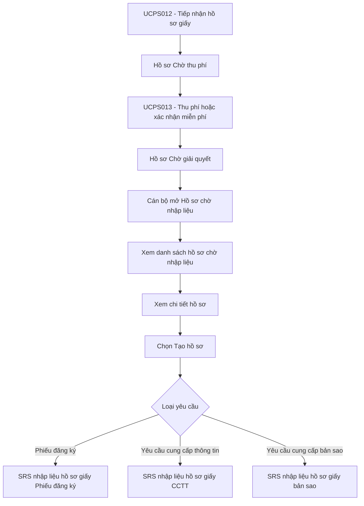

# SRS - Hồ sơ chờ nhập liệu

## 1. Tổng quan

### 1.1. Mục đích

Tài liệu này đặc tả chức năng **Hồ sơ chờ nhập liệu** dành cho Cán bộ giải quyết hồ sơ trên Website quản trị.

Chức năng cho phép Cán bộ giải quyết:

- Tra cứu danh sách hồ sơ giấy đã tiếp nhận và đã hoàn tất thu phí/miễn phí.
- Xem chi tiết thông tin tiếp nhận, thông tin thu phí và tài liệu liên quan ở trạng thái chỉ đọc.
- Chọn **Tạo hồ sơ** để hệ thống mở đúng SRS nhập liệu nghiệp vụ tương ứng theo **Loại yêu cầu** của hồ sơ.

### 1.2. Phạm vi

Phạm vi bắt đầu khi hồ sơ giấy được chuyển sang trạng thái **"Chờ giải quyết"** từ [UCPS013 - Quản lý thu phí/hoàn phí hồ sơ giấy](UCPS013_Quan_ly_thu_phi_ho_so_giay_Can_bo_ke_toan.md).

Tài liệu này chỉ mô tả:

- Màn hình Danh sách hồ sơ chờ nhập liệu.
- Màn hình Xem chi tiết hồ sơ chờ nhập liệu.
- Nguyên tắc điều hướng sang SRS nhập liệu nghiệp vụ tương ứng khi Cán bộ chọn **Tạo hồ sơ**.

Không thuộc phạm vi tài liệu này:

- Tiếp nhận hồ sơ giấy: xem [UCPS012](UCPS012_Tiep_nhan_ho_so_giay_Can_bo_tiep_nhan.md).
- Thu phí/miễn phí hồ sơ giấy: xem [UCPS013](UCPS013_Quan_ly_thu_phi_ho_so_giay_Can_bo_ke_toan.md).
- Nhập liệu chi tiết Phiếu đăng ký: xem [SRS_Nhap_lieu_ho_so_giay_Phieu_dang_ky_Can_bo](SRS_Nhap_lieu_ho_so_giay_Phieu_dang_ky_Can_bo.md).
- Nhập liệu chi tiết Yêu cầu cung cấp thông tin: xem [SRS_Nhap_lieu_ho_so_giay_Yeu_cau_cung_cap_thong_tin_Can_bo](SRS_Nhap_lieu_ho_so_giay_Yeu_cau_cung_cap_thong_tin_Can_bo.md).
- Nhập liệu chi tiết Yêu cầu cung cấp bản sao: xem [SRS_Nhap_lieu_ho_so_giay_Yeu_cau_cung_cap_ban_sao_Can_bo](SRS_Nhap_lieu_ho_so_giay_Yeu_cau_cung_cap_ban_sao_Can_bo.md).
- Luồng trình ký, duyệt chờ ký, ký số, trả lại hoặc từ chối sau khi hồ sơ nghiệp vụ được tạo; các nội dung này xem tại SRS nghiệp vụ tương ứng.

### 1.3. Đối tượng sử dụng

| Vai trò | Quyền sử dụng |
| :--- | :--- |
| Cán bộ giải quyết hồ sơ | Tra cứu danh sách hồ sơ chờ nhập liệu, xem chi tiết hồ sơ, xem/tải tài liệu liên quan, tạo hồ sơ nghiệp vụ theo Loại yêu cầu. |
| Cán bộ tiếp nhận | Chỉ xem thông tin tiếp nhận nếu được phân quyền. |
| Cán bộ kế toán | Chỉ xem thông tin thu phí nếu được phân quyền. |

## 2. Nguyên tắc nghiệp vụ

- Hồ sơ chỉ hiển thị tại màn hình **Hồ sơ chờ nhập liệu** khi đáp ứng đồng thời:
  + Nguồn tiếp nhận là "Cán bộ nhập liệu".
  + Trạng thái hồ sơ là "Chờ giải quyết".
  + Trạng thái lệ phí là "Đã thu" hoặc "Miễn phí".
  + Hồ sơ thuộc phạm vi đơn vị/quyền dữ liệu của Cán bộ giải quyết.
- Cán bộ giải quyết không được chỉnh sửa thông tin tiếp nhận, thông tin thu phí hoặc Loại yêu cầu tại tài liệu này.
- Khi chọn **Tạo hồ sơ**, hệ thống xác định **Loại yêu cầu** đã được tiếp nhận và mở đúng màn hình nhập liệu nghiệp vụ tương ứng.
- Mỗi SRS nhập liệu nghiệp vụ tự mô tả chi tiết màn nhập liệu, popup, điều kiện trình, file PDF, trạng thái sau trình và nhật ký của nghiệp vụ đó.
- Tài liệu này không mô tả lại form nhập liệu nghiệp vụ để tránh trùng lặp và sai lệch giữa các SRS.

## 3. Sơ đồ nghiệp vụ

## 4. Điều hướng SRS theo Loại yêu cầu

| STT | Loại yêu cầu | SRS được mở khi chọn "Tạo hồ sơ" | Ghi chú |
| :--- | :--- | :--- | :--- |
| 1 | Đăng ký lần đầu | [SRS_Nhap_lieu_ho_so_giay_Phieu_dang_ky_Can_bo](SRS_Nhap_lieu_ho_so_giay_Phieu_dang_ky_Can_bo.md) | Mở form Phiếu đăng ký tương ứng nghiệp vụ đăng ký lần đầu. |
| 2 | Đăng ký thay đổi | [SRS_Nhap_lieu_ho_so_giay_Phieu_dang_ky_Can_bo](SRS_Nhap_lieu_ho_so_giay_Phieu_dang_ky_Can_bo.md) | Mở form Phiếu đăng ký tương ứng nghiệp vụ đăng ký thay đổi. |
| 3 | Xóa đăng ký | [SRS_Nhap_lieu_ho_so_giay_Phieu_dang_ky_Can_bo](SRS_Nhap_lieu_ho_so_giay_Phieu_dang_ky_Can_bo.md) | Mở form Phiếu đăng ký tương ứng nghiệp vụ xóa đăng ký. |
| 4 | Thông báo xử lý tài sản bảo đảm lần đầu | [SRS_Nhap_lieu_ho_so_giay_Phieu_dang_ky_Can_bo](SRS_Nhap_lieu_ho_so_giay_Phieu_dang_ky_Can_bo.md) | Mở form Phiếu đăng ký tương ứng nghiệp vụ thông báo xử lý tài sản. |
| 5 | Thay đổi thông báo xử lý tài sản bảo đảm | [SRS_Nhap_lieu_ho_so_giay_Phieu_dang_ky_Can_bo](SRS_Nhap_lieu_ho_so_giay_Phieu_dang_ky_Can_bo.md) | Mở form Phiếu đăng ký tương ứng nghiệp vụ thay đổi thông báo xử lý tài sản. |
| 6 | Xóa đăng ký thông báo xử lý tài sản bảo đảm | [SRS_Nhap_lieu_ho_so_giay_Phieu_dang_ky_Can_bo](SRS_Nhap_lieu_ho_so_giay_Phieu_dang_ky_Can_bo.md) | Mở form Phiếu đăng ký tương ứng nghiệp vụ xóa thông báo xử lý tài sản. |
| 7 | Yêu cầu cung cấp thông tin | [SRS_Nhap_lieu_ho_so_giay_Yeu_cau_cung_cap_thong_tin_Can_bo](SRS_Nhap_lieu_ho_so_giay_Yeu_cau_cung_cap_thong_tin_Can_bo.md) | Mở màn hình nhập liệu hồ sơ giấy Yêu cầu cung cấp thông tin. |
| 8 | Yêu cầu cung cấp bản sao | [SRS_Nhap_lieu_ho_so_giay_Yeu_cau_cung_cap_ban_sao_Can_bo](SRS_Nhap_lieu_ho_so_giay_Yeu_cau_cung_cap_ban_sao_Can_bo.md) | Mở màn hình nhập liệu hồ sơ giấy Yêu cầu cung cấp bản sao. |
| 9 | Yêu cầu cung cấp bản sao kèm thông báo | SRS nhập liệu hồ sơ giấy Phiếu đăng ký hoặc SRS riêng theo cấu hình Loại yêu cầu | Hệ thống mở màn hình nhập liệu tương ứng khi có SRS riêng được ban hành; nếu chưa có SRS riêng, hiển thị trạng thái "Đang phát triển" theo cấu hình chức năng. |

## 5. Danh sách màn hình

| Mã màn hình | Tên màn hình | Mục đích |
| :--- | :--- | :--- |
| UCPS014.MH01 | Màn hình Danh sách hồ sơ chờ nhập liệu | Tìm kiếm, xem danh sách hồ sơ giấy đã đủ điều kiện nhập liệu và mở chi tiết hồ sơ. |
| UCPS014.MH02 | Màn hình Xem chi tiết hồ sơ chờ nhập liệu | Xem thông tin tiếp nhận, thông tin thu phí, tài liệu liên quan và tạo hồ sơ nghiệp vụ. |

## 6. UCPS014.MH01 - Màn hình Danh sách hồ sơ chờ nhập liệu

### 6.1. Màn hình

### 6.2. Mô tả thông tin trên màn hình

| Trường thông tin | Kiểu dữ liệu | Bắt buộc | Mặc định | Mô tả |
| :--- | :--- | :---: | :--- | :--- |
| **I. Bộ lọc tìm kiếm** | | | | |
| Mã hồ sơ | String(50) | Không | Trống | Tìm kiếm gần đúng hoặc chính xác theo Mã hồ sơ giấy. |
| Số đơn giấy | String(50) | Không | Trống | Tìm kiếm gần đúng theo số đơn giấy tại bước tiếp nhận. |
| Người yêu cầu | String(255) | Không | Trống | Tìm kiếm gần đúng, không phân biệt hoa/thường. |
| Người nộp hồ sơ | String(255) | Không | Trống | Tìm kiếm gần đúng, không phân biệt hoa/thường. |
| Loại yêu cầu | Enum(String(100)) | Không | Tất cả | Lọc theo Loại yêu cầu hồ sơ giấy đã tiếp nhận. |
| Trạng thái lệ phí | Enum(String(50)) | Không | Tất cả | Giá trị gồm: - "Tất cả" - "Đã thu" - "Miễn phí" |
| Cán bộ tiếp nhận | String(255) | Không | Trống | Lọc theo Cán bộ tiếp nhận hồ sơ giấy. |
| Từ ngày tiếp nhận | Date | Không | Ngày 01 của tháng hiện tại | Lọc theo Thời điểm tiếp nhận. Tuân thủ [BR-VAL-007]. |
| Đến ngày tiếp nhận | Date | Không | Ngày hiện tại | Lọc theo Thời điểm tiếp nhận. Tuân thủ [BR-VAL-007]. |
| **II. Bảng danh sách hồ sơ chờ nhập liệu** | | | | - Trạng thái có dữ liệu: Hiển thị danh sách các bản ghi kết quả theo cấu trúc các cột quy định. - Trạng thái không có dữ liệu (Empty State): Khi không tìm thấy kết quả phù hợp với điều kiện tìm kiếm, bảng hiển thị duy nhất 01 dòng căn giữa trên toàn bộ chiều rộng bảng (`colspan`), in nghiêng với nội dung: *"Không tìm thấy dữ liệu phù hợp với điều kiện tìm kiếm."*|
| Bảng danh sách hồ sơ | Text(1000) | Có | 20 bản ghi/trang | Chỉ hiển thị hồ sơ giấy thỏa điều kiện tại mục 2. Nếu không có dữ liệu, hiển thị dòng "Không có hồ sơ nào ở trạng thái này hoặc phù hợp với điều kiện tìm kiếm.". - Trạng thái có dữ liệu: Hiển thị danh sách các bản ghi kết quả theo cấu trúc các cột quy định. - Trạng thái không có dữ liệu (Empty State): Khi không tìm thấy kết quả phù hợp với điều kiện tìm kiếm, bảng hiển thị duy nhất 01 dòng căn giữa trên toàn bộ chiều rộng bảng (`colspan`), in nghiêng với nội dung: *"Không tìm thấy dữ liệu phù hợp với điều kiện tìm kiếm."*|
| STT | Integer(10) | Có | Theo trang | Số thứ tự dòng trên trang kết quả. |
| Mã hồ sơ | String(50) | Có | Theo hồ sơ | Chỉ đọc trên dòng dữ liệu. |
| Số đơn giấy | String(50) | Có | Theo UCPS012 | Số đơn giấy đã ghi nhận tại bước tiếp nhận. |
| Người yêu cầu | String(255) | Có | Theo UCPS012 | Tên cá nhân/tổ chức yêu cầu. |
| Người nộp hồ sơ | String(255) | Không | Theo UCPS012 | Người trực tiếp nộp hồ sơ giấy. |
| Loại yêu cầu | Enum(String(100)) | Có | Theo UCPS012 | Dùng để xác định SRS nhập liệu nghiệp vụ khi Cán bộ chọn "Tạo hồ sơ". |
| Ngày tiếp nhận | Datetime | Có | Theo UCPS012 | Thời điểm tiếp nhận hồ sơ giấy. |
| Trạng thái lệ phí | Enum(String(50)) | Có | Theo UCPS013 | Hiển thị "Đã thu" hoặc "Miễn phí". |
| Số tiền đã thu/Miễn phí | String(50) | Có | Theo UCPS013 | Hiển thị số tiền đã thu hoặc giá trị "Miễn phí". |
| Trạng thái hồ sơ | Enum(String(50)) | Có | "Chờ giải quyết" | Chỉ đọc. |
| Cán bộ tiếp nhận | String(255) | Có | Theo UCPS012 | Hiển thị Cán bộ đã tiếp nhận hồ sơ giấy. |
| Thao tác | String(255) | Không | Theo quyền | Chỉ hiển thị "Tạo hồ sơ" theo quyền của Cán bộ giải quyết. Không hiển thị icon/nút "Xem chi tiết". |

### 6.3. Chức năng trên màn hình

| STT | Tên chức năng | Định dạng | Mô tả |
| :--- | :--- | :--- | :--- |
| 1 | Tìm kiếm | Nút | TH1 (Khoảng ngày không hợp lệ): Vi phạm [BR-VAL-007], hiển thị [MSG-ERR-VAL-007], không thực hiện tìm kiếm. - **TH Không có dữ liệu trả về**: + Bảng kết quả: Hiển thị dòng thông báo rỗng *"Không tìm thấy dữ liệu phù hợp với điều kiện tìm kiếm."* ở giữa bảng. + Thanh phân trang (Pagination): Dòng số lượng hiển thị *"Hiển thị 0-0 của 0 bản ghi"*; các nút điều hướng trang (&#124;&lt;&lt;, &lt;, các số trang, &gt;, &gt;&gt;&#124;) ở trạng thái ẩn hoặc khóa mờ (Disabled). + Nút "Kết xuất Excel" (nếu màn hình có nút này): Thiết lập ở trạng thái khóa mờ (Disabled) với thuộc tính style="opacity: 0.35; pointer-events: none; cursor: not-allowed;" kèm tooltip: *"Không có dữ liệu để kết xuất Excel"*.|
|  |  |  | TH Hợp lệ: Hệ thống tìm kiếm hồ sơ chờ nhập liệu theo điều kiện lọc và phạm vi quyền dữ liệu của Cán bộ. |
|  |  |  | TH Không có dữ liệu: Hiển thị dòng "Không có hồ sơ nào ở trạng thái này hoặc phù hợp với điều kiện tìm kiếm.". |
| 2 | Xóa bộ lọc | Nút | Đưa toàn bộ tiêu chí lọc về mặc định và tải lại danh sách hồ sơ chờ nhập liệu. |
| 3 | Click dòng dữ liệu | Row Click | Mở **7. UCPS014.MH02 - Màn hình Xem chi tiết hồ sơ chờ nhập liệu**. Không hiển thị icon/nút "Xem chi tiết" trên từng dòng. |
| 4 | Tạo hồ sơ | Nút | Hệ thống xác định Loại yêu cầu của dòng hồ sơ và mở SRS nhập liệu nghiệp vụ tương ứng tại mục 4. |

## 7. UCPS014.MH02 - Màn hình Xem chi tiết hồ sơ chờ nhập liệu

### 7.1. Màn hình

### 7.2. Mô tả thông tin trên màn hình

| Trường thông tin | Kiểu dữ liệu | Bắt buộc | Mặc định | Mô tả |
| :--- | :--- | :---: | :--- | :--- |
| **I. Thông tin tiếp nhận** | | | | |
| Khối Thông tin tiếp nhận | Text(1000) | Có | Mở rộng | Toàn bộ dữ liệu chỉ đọc, lấy từ UCPS012. |
| Mã hồ sơ | String(50) | Có | Theo UCPS012 | Chỉ đọc. |
| Số đơn giấy | String(50) | Có | Theo UCPS012 | Chỉ đọc. |
| Nguồn tiếp nhận | Enum(String(50)) | Có | "Cán bộ nhập liệu" | Chỉ đọc. |
| Kênh tiếp nhận | Enum(String(50)) | Có | Theo UCPS012 | Giá trị gồm: - "Trực tiếp tại quầy" - "Bưu điện" - "Fax" - "Email" |
| Thời điểm tiếp nhận | Datetime | Có | Theo UCPS012 | Chỉ đọc. |
| Đơn vị tiếp nhận | String(255) | Có | Theo UCPS012 | Chỉ đọc. |
| Cán bộ tiếp nhận | String(255) | Có | Theo UCPS012 | Chỉ đọc. |
| Người yêu cầu | String(255) | Có | Theo UCPS012 | Chỉ đọc. |
| Địa chỉ người yêu cầu | Text(500) | Không | Theo UCPS012 | Chỉ đọc. |
| Người nộp hồ sơ | String(255) | Không | Theo UCPS012 | Chỉ đọc. |
| Số giấy tờ người nộp | String(50) | Không | Theo UCPS012 | Chỉ đọc. |
| Số điện thoại liên hệ | String(20) | Không | Theo UCPS012 | Chỉ đọc. |
| Email liên hệ | String(255) | Không | Theo UCPS012 | Chỉ đọc. |
| Loại yêu cầu | Enum(String(100)) | Có | Theo UCPS012 | Chỉ đọc. Dùng để điều hướng sang SRS nhập liệu nghiệp vụ tương ứng. |
| Trạng thái hồ sơ | Enum(String(50)) | Có | "Chờ giải quyết" | Chỉ đọc. |
| **II. Thông tin thu phí và tài liệu liên quan** | | | | |
| Khối Thông tin thu phí | Text(1000) | Có | Mở rộng | Toàn bộ dữ liệu chỉ đọc, lấy từ UCPS013. |
| Mã khoản phải thu | String(50) | Có | Theo UCPS013 | Chỉ đọc. |
| Trạng thái lệ phí | Enum(String(50)) | Có | Theo UCPS013 | Chỉ đọc. Giá trị hợp lệ để tạo hồ sơ là: - "Đã thu" - "Miễn phí" |
| Hình thức thu phí | Enum(String(50)) | Không | Theo UCPS013 | Chỉ đọc. |
| Số tiền phải thu | Decimal(18,0) | Có | Theo UCPS013 | Chỉ đọc. |
| Số tiền đã thu | Decimal(18,0) | Có | Theo UCPS013 | Chỉ đọc. |
| Số biên lai/chứng từ | String(50) | Không | Theo UCPS013 | Chỉ đọc. |
| Thời điểm thu phí/xác nhận miễn phí | Datetime | Có | Theo UCPS013 | Chỉ đọc. |
| Cán bộ thu phí/xác nhận miễn phí | String(255) | Có | Theo UCPS013 | Chỉ đọc. |
| Lý do miễn phí | Text(1000) | Có điều kiện | Theo UCPS013 | Chỉ hiển thị khi Trạng thái lệ phí là "Miễn phí". |
| Tài liệu liên quan | File/List | Không | Theo UCPS012/UCPS013 | Hiển thị danh sách tài liệu gắn với hồ sơ, gồm giấy tờ tiếp nhận, giấy tờ chứng minh miễn phí, biên lai/chứng từ và tài liệu bổ sung nếu có. Cho phép xem file ở tab riêng hoặc tải xuống theo quyền. |

### 7.3. Chức năng trên màn hình

| STT | Tên chức năng | Định dạng | Mô tả |
| :--- | :--- | :--- | :--- |
| 1 | Xem file | Link/Nút | Chỉ hiển thị với tài liệu liên quan có file đính kèm. Mở file ở tab riêng của trình duyệt. |
| 2 | Tải file | Link/Nút | Chỉ hiển thị khi người dùng có quyền tải tài liệu. |
| 3 | Tạo hồ sơ | Nút | TH1 (Hồ sơ không còn ở trạng thái "Chờ giải quyết" hoặc lệ phí không còn là "Đã thu"/"Miễn phí"): Hiển thị [MSG-ERR-DK-005], không mở màn nhập liệu nghiệp vụ. |
|  |  |  | TH Hợp lệ: Hệ thống xác định Loại yêu cầu và mở SRS nhập liệu nghiệp vụ tương ứng tại mục 4. |
| 4 | Quay lại | Nút | Quay lại **6. UCPS014.MH01 - Màn hình Danh sách hồ sơ chờ nhập liệu** và giữ lại điều kiện tìm kiếm trước đó. |

## 8. Ánh xạ Business Rule và MessageList

| Tình huống | Business Rule | MessageList | Ghi chú |
| :--- | :--- | :--- | :--- |
| Hồ sơ giấy đủ điều kiện chờ nhập liệu | [BR-UCPS-001] | Không áp dụng | Chỉ hiển thị hồ sơ "Chờ giải quyết" đã thu phí hoặc miễn phí. |
| Khoảng ngày tìm kiếm không hợp lệ | [BR-VAL-007] | [MSG-ERR-VAL-007] | Áp dụng tại UCPS014.MH01. |
| Tạo hồ sơ khi hồ sơ không còn đủ điều kiện | [BR-DK-026] | [MSG-ERR-DK-005] | Áp dụng tại UCPS014.MH01 và UCPS014.MH02. |

## 9. Yêu cầu nhật ký

Hệ thống ghi nhật ký đối với:

- Tra cứu danh sách hồ sơ chờ nhập liệu.
- Xem chi tiết hồ sơ chờ nhập liệu.
- Xem/tải tài liệu liên quan.
- Chọn Tạo hồ sơ và điều hướng sang SRS nghiệp vụ tương ứng.

Thông tin nhật ký tối thiểu gồm: Mã hồ sơ, Số đơn giấy, Loại yêu cầu, người thao tác, vai trò, đơn vị, thời điểm, hành động, màn hình nguồn, SRS nghiệp vụ được mở và kết quả xử lý.

## 10. Tiêu chí nghiệm thu

| Mã tiêu chí | Nội dung nghiệm thu |
| :--- | :--- |
| AC-UCPS014-001 | Danh sách chỉ hiển thị hồ sơ giấy ở trạng thái "Chờ giải quyết" và trạng thái lệ phí là "Đã thu" hoặc "Miễn phí". |
| AC-UCPS014-002 | Cán bộ xem được chi tiết hồ sơ với 2 khối: Thông tin tiếp nhận và Thông tin thu phí kèm tài liệu liên quan. |
| AC-UCPS014-003 | Toàn bộ dữ liệu trên màn Xem chi tiết hồ sơ chờ nhập liệu ở trạng thái chỉ đọc. |
| AC-UCPS014-004 | Khi chọn Tạo hồ sơ, hệ thống mở đúng SRS nhập liệu nghiệp vụ theo Loại yêu cầu. |
| AC-UCPS014-005 | Tài liệu này không mô tả màn nhập liệu chi tiết của CCTT hoặc bản sao; hai nghiệp vụ đó được mô tả tại SRS riêng tương ứng. |

