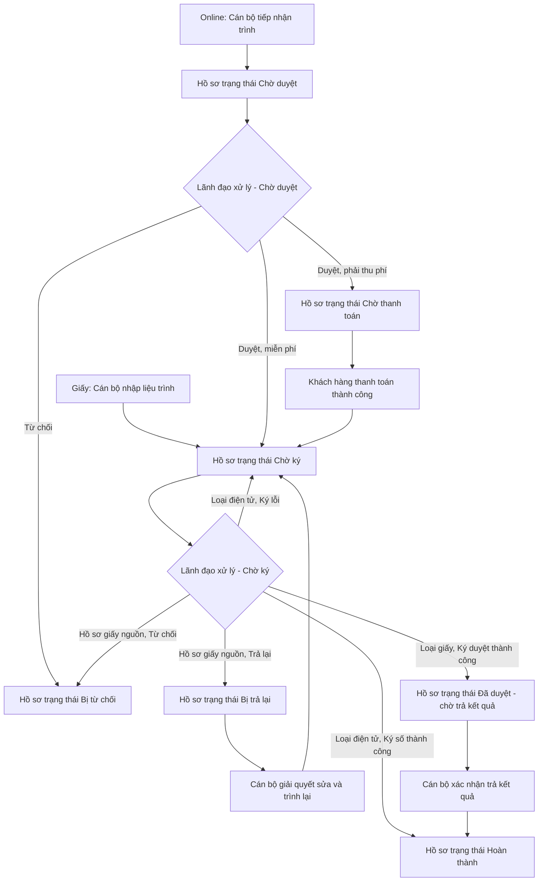

### 4.3.2.Y. UC-BS-LD - Ký số/ký duyệt yêu cầu cung cấp bản sao văn bản chứng nhận

#### 4.3.2.Y.1. Mục đích

\- Cho phép Lãnh đạo xem, đối chiếu và ký số/ký duyệt hồ sơ Yêu cầu cung cấp bản sao đã được Cán bộ trình ở trạng thái "Chờ ký". Lãnh đạo không có bước "Chờ duyệt/Chờ phê duyệt" riêng.

\- Hồ sơ Online có phí đã thanh toán thành công trước khi vào hàng chờ Cán bộ; hồ sơ Online miễn phí vào thẳng "Chờ duyệt" của Cán bộ. Sau khi Cán bộ kiểm tra/kết xuất và trình ký, hồ sơ chuyển sang "Chờ ký".

\- Tại trạng thái "Chờ ký" (áp dụng chung cho **mọi hồ sơ**, không phân biệt Nguồn tiếp nhận Online hay Cán bộ nhập liệu, cả 2 Loại cung cấp bản sao), Lãnh đạo thực hiện một trong hai hành động tùy theo Loại cung cấp bản sao:

\- Loại "Bản sao điện tử": Lãnh đạo **Ký số** file bản sao điện tử bằng USB Token/chứng thư số hợp lệ theo [BR-BS-006]; ký số thành công chuyển hồ sơ sang trạng thái "Hoàn thành".

\- Loại "Bản sao giấy": Lãnh đạo **Ký duyệt** — vẫn là một hành động ký, nhưng không ký số trên file PDF, không dùng USB Token/chứng thư số; chỉ là xác nhận đồng ý cấp bản sao giấy theo [BR-BS-013]. Ký duyệt thành công chuyển hồ sơ thẳng sang "Đã duyệt - chờ trả kết quả" để Cán bộ xử lý trả kết quả theo [BR-BS-010].

\- Tại trạng thái "Chờ ký", Lãnh đạo được phép ký số/ký duyệt, từ chối hoặc trả lại. Nếu từ chối hồ sơ đã thu tiền, hệ thống phát sinh yêu cầu hoàn tiền/hoàn phí theo nguồn hồ sơ. Nếu trả lại, hồ sơ chuyển sang "Bị trả lại" để Cán bộ xử lý lại và trình ký lại.

*a. Phân quyền*

\- Lãnh đạo được phân quyền ký số/ký duyệt hồ sơ Yêu cầu cung cấp bản sao.

\- Lãnh đạo chỉ được xem, ký số/ký duyệt, từ chối hoặc trả lại hồ sơ thuộc đơn vị quản lý và phạm vi thẩm quyền tại trạng thái "Chờ ký".

\- Hồ sơ được Cán bộ trình tới Lãnh đạo nào thì chỉ Lãnh đạo đó nhìn thấy và xử lý, trừ tài khoản có quyền giám sát/tra cứu thay theo cấu hình phân quyền.

*b. Điều kiện thực hiện*

\- Lãnh đạo đã đăng nhập thành công vào Website Quản trị.

\- Hồ sơ ký số/ký duyệt đang ở trạng thái "Chờ ký".

\- Máy trạm của Lãnh đạo có thành phần ký số cục bộ và USB Token/chứng thư số hợp lệ để thực hiện ký số (chỉ áp dụng Loại "Bản sao điện tử").

*c. Nguyên tắc dữ liệu*

\- Lãnh đạo không được sửa Số đăng ký, Loại cung cấp bản sao, Số lượng bản sao hoặc dữ liệu hồ sơ gốc. Hồ sơ gốc chỉ được tham chiếu theo Số đăng ký (khóa tham chiếu, không phải bản sao dữ liệu tĩnh); mọi màn hình hiển thị chi tiết hồ sơ gốc trong tài liệu này đều truy vấn trực tiếp (join) tại thời điểm Lãnh đạo xem, theo [BR-BS-011].

\- Hệ thống chỉ ký số/ký duyệt đúng phiên bản hồ sơ/file đã được Cán bộ trình và đang được khóa trong hồ sơ.

\- Việc thu phí phát sinh trước khi hồ sơ vào hàng chờ xử lý của Cán bộ: Online thanh toán qua UC158, hồ sơ giấy thu tại quầy hoặc ghi nhận miễn phí.

\- Với thao tác ký nhiều hồ sơ, hệ thống xử lý và ghi nhận kết quả theo từng hồ sơ.

\- Luồng "Trả lại" áp dụng tại trạng thái "Chờ ký" để Cán bộ xử lý lại file/kết quả trình ký; không làm thay đổi giao dịch thanh toán đã phát sinh.

\- Các thao tác không được phép đối với hồ sơ đang xét (ví dụ Ký số đối với hồ sơ "Bản sao giấy") hiển thị ở dạng **mờ (disabled)**, không ẩn hẳn khỏi giao diện.

#### 4.3.2.Y.2. UC-BS-LD.MH01 - Màn hình Danh sách yêu cầu cung cấp bản sao chờ duyệt (không áp dụng)

##### 4.3.2.Y.2.1. Màn hình`r`n`r`n> Cập nhật theo Plan BTNN: màn hình này không còn hiển thị trên UI. Lãnh đạo chỉ xử lý hồ sơ Yêu cầu cung cấp bản sao tại danh sách "Chờ ký".

##### 4.3.2.Y.2.2. Mô tả thông tin trên màn hình

| Trường thông tin | Kiểu dữ liệu | Bắt buộc | Mặc định | Mô tả |
| :--- | :--- | :---: | :--- | :--- |
| **I. Bộ lọc tìm kiếm** | | | | |
| Tìm kiếm | String(255) | Không | Trống | Tìm kiếm gần đúng theo Mã hồ sơ, Người yêu cầu, Số đăng ký hoặc Cán bộ trình. |
| Mã khách hàng | String(50) | Không | Trống | Tìm kiếm chính xác hoặc gần đúng theo Mã khách hàng của người yêu cầu. |
| Cán bộ trình | String(255) | Không | Trống | Lọc theo Cán bộ đã trình hồ sơ. |
| Loại cung cấp bản sao | Enum(String(50)) | Không | Tất cả | - Tất cả - Bản sao điện tử - Bản sao giấy |
| Từ ngày | Date | Không | Ngày 01 của tháng hiện tại | Lọc theo Thời điểm trình. Tuân thủ [BR-VAL-007]. |
| Đến ngày | Date | Không | Ngày hiện tại | Lọc theo Thời điểm trình. Tuân thủ [BR-VAL-007]. |
| **II. Bảng danh sách hồ sơ** | | | | - Trạng thái có dữ liệu: Hiển thị danh sách các bản ghi kết quả theo cấu trúc các cột quy định. - Trạng thái không có dữ liệu (Empty State): Khi không tìm thấy kết quả phù hợp với điều kiện tìm kiếm, bảng hiển thị duy nhất 01 dòng căn giữa trên toàn bộ chiều rộng bảng (`colspan`), in nghiêng với nội dung: *"Không tìm thấy dữ liệu phù hợp với điều kiện tìm kiếm."*|
| Bảng danh sách hồ sơ | Text(1000) | Không | 20 bản ghi/trang | Chỉ hiển thị hồ sơ Online ở trạng thái "Chờ duyệt" thuộc phạm vi xử lý của Lãnh đạo đăng nhập (hồ sơ giấy do Cán bộ nhập liệu trình không đi qua trạng thái này). Sắp xếp mặc định theo Thời điểm trình tăng dần. - Trạng thái có dữ liệu: Hiển thị danh sách các bản ghi kết quả theo cấu trúc các cột quy định. - Trạng thái không có dữ liệu (Empty State): Khi không tìm thấy kết quả phù hợp với điều kiện tìm kiếm, bảng hiển thị duy nhất 01 dòng căn giữa trên toàn bộ chiều rộng bảng (`colspan`), in nghiêng với nội dung: *"Không tìm thấy dữ liệu phù hợp với điều kiện tìm kiếm."*|
| Checkbox chọn | Boolean | Không | Không chọn | Cho phép chọn một hoặc nhiều hồ sơ để duyệt theo lô. Chỉ cho phép chọn hồ sơ đủ điều kiện theo [BR-BS-003]. |
| STT | Integer(10) | Không | Tự tăng | Số thứ tự dòng dữ liệu trên trang hiện tại. |
| Mã hồ sơ | String(50) | Có | Theo hồ sơ | Mã hồ sơ Yêu cầu cung cấp bản sao. |
| Người yêu cầu | String(255) | Có | Theo hồ sơ | Tên cá nhân/tổ chức yêu cầu. |
| Số đăng ký | String(50) | Có | Theo hồ sơ | Số đăng ký của hồ sơ gốc gắn với yêu cầu. |
| Loại cung cấp bản sao | Enum(String(50)) | Có | Theo hồ sơ | Hiển thị "Bản sao điện tử" hoặc "Bản sao giấy". |
| Cán bộ trình | String(255) | Có | Theo hồ sơ | Cán bộ đã trình hồ sơ. |
| Thời điểm trình | Datetime | Có | Theo hồ sơ | Thời điểm Cán bộ trình hồ sơ thành công. |
| Trạng thái | Enum(String(50)) | Có | "Chờ duyệt" | Chỉ đọc. |
| Thao tác | String(255) | Không | Theo quyền | - "Xem chi tiết": mọi hồ sơ. - "Duyệt": mọi hồ sơ. - "Từ chối": mọi hồ sơ. |

##### 4.3.2.Y.2.3. Chức năng trên màn hình

| STT | Tên chức năng | Định dạng | Mô tả |
| :--- | :--- | :--- | :--- |
| 1 | Tìm kiếm | Nút | TH1 (Điều kiện ngày không hợp lệ): Vi phạm [BR-VAL-007], hiển thị [MSG-ERR-VAL-007], không thực hiện tìm kiếm. - **TH Không có dữ liệu trả về**: + Bảng kết quả: Hiển thị dòng thông báo rỗng *"Không tìm thấy dữ liệu phù hợp với điều kiện tìm kiếm."* ở giữa bảng. + Thanh phân trang (Pagination): Dòng số lượng hiển thị *"Hiển thị 0-0 của 0 yêu cầu"*; các nút điều hướng trang (&#124;&lt;&lt;, &lt;, các số trang, &gt;, &gt;&gt;&#124;) ở trạng thái ẩn hoặc khóa mờ (Disabled). + Nút "Kết xuất Excel" (nếu màn hình có nút này): Thiết lập ở trạng thái khóa mờ (Disabled) kèm tooltip: *"Không có dữ liệu để kết xuất Excel"*.|
|  |  |  | TH Hợp lệ: Tìm kiếm trong phạm vi hồ sơ thuộc quyền ký của Lãnh đạo. |
| 2 | Xóa bộ lọc | Nút | Đưa toàn bộ tiêu chí lọc về mặc định và tải lại danh sách hồ sơ "Chờ duyệt". |
| 3 | Duyệt | Nút | TH1 (Chưa chọn hồ sơ hợp lệ): Vi phạm [BR-BS-003], hiển thị [MSG-ERR-BS-005], không thực hiện duyệt. |
|  |  |  | TH2 (Có hồ sơ không còn ở trạng thái "Chờ duyệt"): Vi phạm [BR-BS-003], hiển thị [MSG-ERR-BS-002], không cho phép duyệt hồ sơ không hợp lệ. |
|  |  |  | TH3 (Lãnh đạo không có quyền ký hồ sơ): Vi phạm [BR-BS-003], hiển thị [MSG-ERR-BS-004], không cho phép duyệt hồ sơ không hợp lệ. |
|  |  |  | TH4 (Hồ sơ gốc không còn ở trạng thái "Hoàn thành" khi hệ thống kiểm tra lại theo Số đăng ký): Vi phạm [BR-BS-011], hiển thị [MSG-ERR-BS-009], không cho phép duyệt hồ sơ đó. |
|  |  |  | TH Hợp lệ: Hệ thống yêu cầu xác nhận bằng [MSG-CFM-BS-002]. Sau khi xác nhận, hệ thống kiểm tra lại hồ sơ gốc còn hiệu lực và duyệt từng hồ sơ hợp lệ theo quy tắc rẽ nhánh tại [4.3.2.Y.8](#432y8-quy-tac-duyet-ky-so-tu-choi-va-tra-lai). Hiển thị [MSG-SUC-BS-001]. |
| 4 | Từ chối | Nút | TH1 (Hồ sơ không còn ở trạng thái "Chờ duyệt"): Vi phạm [BR-BS-007], hiển thị [MSG-ERR-BS-002], không mở popup từ chối. |
|  |  |  | TH2 (Lãnh đạo không có quyền): Vi phạm [BR-BS-007], hiển thị [MSG-ERR-BS-004], không mở popup từ chối. |
|  |  |  | TH Hợp lệ: Mở **UC-BS-LD.MH03 - Popup Từ chối (Chờ duyệt)**. |
| 5 | Xem chi tiết/Click dòng dữ liệu | Nút/Row Click | Mở **UC-BS-LD.MH02 - Chi tiết hồ sơ chờ duyệt**. |

#### 4.3.2.Y.3. UC-BS-LD.MH02 - Màn hình Chi tiết hồ sơ chờ duyệt

##### 4.3.2.Y.3.1. Màn hình

##### 4.3.2.Y.3.2. Mô tả thông tin trên màn hình

| Trường thông tin | Kiểu dữ liệu | Bắt buộc | Mặc định | Mô tả |
| :--- | :--- | :---: | :--- | :--- |
| **I. Thông tin hồ sơ** | | | | |
| Mã hồ sơ | String(50) | Có | Theo hồ sơ | Chỉ đọc. |
| Mã khách hàng | String(50) | Không | Theo hồ sơ | Chỉ đọc. Chỉ hiển thị khi hồ sơ có dữ liệu. |
| Người yêu cầu | String(255) | Có | Theo hồ sơ | Chỉ đọc. |
| Nguồn tiếp nhận | Enum(String(50)) | Có | Theo hồ sơ | - Website Khách hàng - Mobile Khách hàng (Chỉ hồ sơ Online; hồ sơ giấy do Cán bộ nhập liệu trình không đi qua trạng thái "Chờ duyệt"). |
| Số đăng ký | String(50) | Có | Theo hồ sơ | Chỉ đọc. |
| Loại cung cấp bản sao | Enum(String(50)) | Có | Theo hồ sơ | Chỉ đọc. |
| Số lượng bản sao | Integer(10) | Tùy điều kiện | Theo hồ sơ | Chỉ hiển thị khi Loại cung cấp bản sao là "Bản sao giấy". |
| Trạng thái | Enum(String(50)) | Có | "Chờ duyệt" | Chỉ đọc. |
| Cán bộ xử lý/trình | String(255) | Có | Theo hồ sơ | Chỉ đọc. |
| Thời điểm trình | Datetime | Có | Theo hồ sơ | Chỉ đọc. |
| Lịch sử xử lý | Text(4000) | Không | Theo hồ sơ | Chỉ đọc. |
| **II. Hồ sơ gốc (tham chiếu theo Số đăng ký)** | | | | |
| Khối hồ sơ gốc | - | Có | Theo hồ sơ gốc | Hiển thị theo cấu trúc dùng chung tại [4.1.12.6. Màn hình Chi tiết kết quả tra cứu](../../01_Website_Khach_hang/UC190_to_UC192_Tra_cuu_ho_so_theo_ma_so_su_dung_CSDL.md#41126-man-hinh-chi-tiet-ket-qua-tra-cuu-dung-chung-sau-khi-bam-tim-kiem), bắt đầu từ tiêu đề **Đăng ký giao dịch bảo đảm / Hợp đồng - [Số đăng ký]**. Dữ liệu được truy vấn trực tiếp (join) theo Số đăng ký tại thời điểm Lãnh đạo xem, theo [BR-BS-011]. Chỉ đọc. |
| **III. Tệp bản sao điện tử dự thảo** | | | | |
| Khối Tệp bản sao điện tử dự thảo | Text(1000) | Không | Ẩn | Chỉ hiển thị khi Loại cung cấp bản sao là "Bản sao điện tử". Không hiển thị khối này đối với Loại cung cấp bản sao là "Bản sao giấy". |
| File bản sao điện tử dự thảo | File | Có | Theo hồ sơ | Chỉ đọc. Phiên bản đã được khóa khi Cán bộ trình. |
| **IV. Nghĩa vụ phí** | | | | |
| Hồ sơ có phát sinh nghĩa vụ phí | Boolean | Có | Theo cấu hình biểu phí | "Có" nếu hồ sơ thuộc diện phải thu phí và (đối với hồ sơ Online) chưa thanh toán; "Không" nếu miễn phí hoặc (đối với hồ sơ giấy) đã thu phí tại quầy. |

##### 4.3.2.Y.3.3. Chức năng trên màn hình

| STT | Tên chức năng | Định dạng | Mô tả |
| :--- | :--- | :--- | :--- |
| 1 | Xem file/Tải file | Nút | Khi Lãnh đạo click, hệ thống mở xem hoặc tải file bản sao điện tử dự thảo tương ứng. |
| 2 | Duyệt | Nút | TH1 (Hồ sơ không còn ở trạng thái "Chờ duyệt"): Vi phạm [BR-BS-003], hiển thị [MSG-ERR-BS-002], không cho phép duyệt. |
|  |  |  | TH2 (Lãnh đạo không có quyền): Vi phạm [BR-BS-003], hiển thị [MSG-ERR-BS-004], không cho phép duyệt. |
|  |  |  | TH3 (Hồ sơ gốc không còn ở trạng thái "Hoàn thành" khi kiểm tra lại theo Số đăng ký): Vi phạm [BR-BS-011], hiển thị [MSG-ERR-BS-009], không cho phép duyệt. |
|  |  |  | TH Hợp lệ: Hệ thống kiểm tra lại hồ sơ gốc còn hiệu lực và duyệt hồ sơ theo quy tắc rẽ nhánh tại [4.3.2.Y.8](#432y8-quy-tac-duyet-ky-so-tu-choi-va-tra-lai). |
| 3 | Từ chối | Nút | Mở **UC-BS-LD.MH03**. |
| 4 | Quay lại | Nút | Quay về **UC-BS-LD.MH01**. |

#### 4.3.2.Y.4. UC-BS-LD.MH03 - Popup Từ chối (Chờ duyệt)

##### 4.3.2.Y.4.1. Màn hình

##### 4.3.2.Y.4.2. Mô tả thông tin trên màn hình

| Trường thông tin | Kiểu dữ liệu | Bắt buộc | Mặc định | Mô tả |
| :--- | :--- | :---: | :--- | :--- |
| Mã hồ sơ | String(50) | Có | Theo hồ sơ | Chỉ đọc. |
| Người yêu cầu | String(255) | Có | Theo hồ sơ | Chỉ đọc. |
| Lý do | Text(2000) | Có | Trống | Lãnh đạo bắt buộc nhập lý do từ chối theo [BR-VAL-001]. |

##### 4.3.2.Y.4.3. Chức năng trên màn hình

| STT | Tên chức năng | Định dạng | Mô tả |
| :--- | :--- | :--- | :--- |
| 1 | Hủy | Nút | Đóng popup, giữ nguyên trạng thái hồ sơ. |
| 2 | Xác nhận | Nút | TH1 (Bỏ trống Lý do): Vi phạm [BR-VAL-001], hiển thị [MSG-ERR-VAL-001], không cho phép xác nhận. |
|  |  |  | TH2 (Hồ sơ không còn ở trạng thái "Chờ duyệt"): Vi phạm [BR-BS-007], hiển thị [MSG-ERR-BS-002], không cho phép xác nhận. |
|  |  |  | TH Hợp lệ: Hệ thống yêu cầu xác nhận bằng [MSG-CFM-BS-001], lưu người từ chối, thời điểm, lý do, chuyển hồ sơ sang "Bị từ chối", hiển thị [MSG-SUC-BS-004]. |

#### 4.3.2.Y.5. UC-BS-LD.MH04 - Màn hình Danh sách yêu cầu cung cấp bản sao chờ ký

##### 4.3.2.Y.5.1. Màn hình

##### 4.3.2.Y.5.2. Mô tả thông tin trên màn hình

Hiển thị chung mọi hồ sơ ở trạng thái "Chờ ký", gồm: hồ sơ Online đã thanh toán thành công/miễn phí và được Cán bộ trình ký, hồ sơ giấy đã thu phí/miễn phí và được Cán bộ trình ký. Hành động khả dụng với từng dòng phụ thuộc Loại cung cấp bản sao theo bảng Thao tác dưới đây.

| Trường thông tin | Kiểu dữ liệu | Bắt buộc | Mặc định | Mô tả |
| :--- | :--- | :---: | :--- | :--- |
| **I. Bộ lọc tìm kiếm** | | | | |
| Tìm kiếm | String(255) | Không | Trống | Tìm kiếm gần đúng theo Mã hồ sơ, Người yêu cầu, Số đăng ký hoặc Cán bộ trình. |
| Mã khách hàng | String(50) | Không | Trống | Tìm kiếm chính xác hoặc gần đúng theo Mã khách hàng của người yêu cầu. |
| Cán bộ trình | String(255) | Không | Trống | Lọc theo Cán bộ đã trình hồ sơ. |
| Loại cung cấp bản sao | Enum(String(50)) | Không | Tất cả | - Tất cả - Bản sao điện tử - Bản sao giấy |
| Từ ngày | Date | Không | Ngày 01 của tháng hiện tại | Lọc theo Thời điểm chuyển sang "Chờ ký". Tuân thủ [BR-VAL-007]. |
| Đến ngày | Date | Không | Ngày hiện tại | Lọc theo Thời điểm chuyển sang "Chờ ký". Tuân thủ [BR-VAL-007]. |
| **II. Bảng danh sách hồ sơ** | | | | - Trạng thái có dữ liệu: Hiển thị danh sách các bản ghi kết quả theo cấu trúc các cột quy định. - Trạng thái không có dữ liệu (Empty State): Khi không tìm thấy kết quả phù hợp với điều kiện tìm kiếm, bảng hiển thị duy nhất 01 dòng căn giữa trên toàn bộ chiều rộng bảng (`colspan`), in nghiêng với nội dung: *"Không tìm thấy dữ liệu phù hợp với điều kiện tìm kiếm."*|
| Bảng danh sách hồ sơ | Text(1000) | Không | 20 bản ghi/trang | Chỉ hiển thị hồ sơ ở trạng thái "Chờ ký" thuộc phạm vi ký/duyệt của Lãnh đạo đăng nhập. - Trạng thái có dữ liệu: Hiển thị danh sách các bản ghi kết quả theo cấu trúc các cột quy định. - Trạng thái không có dữ liệu (Empty State): Khi không tìm thấy kết quả phù hợp với điều kiện tìm kiếm, bảng hiển thị duy nhất 01 dòng căn giữa trên toàn bộ chiều rộng bảng (`colspan`), in nghiêng với nội dung: *"Không tìm thấy dữ liệu phù hợp với điều kiện tìm kiếm."*|
| Checkbox chọn tất cả/Checkbox chọn | Boolean | Không | Không chọn | Cho phép chọn một hoặc nhiều hồ sơ đủ điều kiện để ký số theo lô. Chỉ áp dụng cho hồ sơ Loại "Bản sao điện tử"; hồ sơ Loại "Bản sao giấy" disable checkbox kèm tooltip lý do (xử lý qua nút "Ký duyệt" riêng, không ký số theo lô). |
| STT | Integer(10) | Không | Tự tăng | Số thứ tự dòng dữ liệu trên trang hiện tại. |
| Mã hồ sơ | String(50) | Có | Theo hồ sơ | Mã hồ sơ Yêu cầu cung cấp bản sao. |
| Người yêu cầu | String(255) | Có | Theo hồ sơ | Chỉ đọc. |
| Số đăng ký | String(50) | Có | Theo hồ sơ | Chỉ đọc. |
| Loại cung cấp bản sao | Enum(String(50)) | Có | Theo hồ sơ | Quyết định hệ thống hiển thị nút nào tại cột Thao tác: "Bản sao điện tử" → hiển thị nút "Ký số"; "Bản sao giấy" → hiển thị nút "Ký duyệt" theo [BR-BS-013] (áp dụng bất kể Nguồn tiếp nhận). Mỗi dòng chỉ hiển thị **đúng một** trong hai nút này; không hiển thị đồng thời cả 2, không áp dụng quy ước mờ cho cặp nút này. |
| Nguồn tiếp nhận | Enum(String(50)) | Có | Theo hồ sơ | Giá trị "Cán bộ nhập liệu" xác định hồ sơ được phép Từ chối/Trả lại theo quy tắc tại [4.3.2.Y.8](#432y8-quy-tac-duyet-ky-so-tu-choi-va-tra-lai) (dòng 9-10). |
| Trạng thái | Enum(String(50)) | Có | "Chờ ký" | Chỉ đọc. |
| Thao tác | String(255) | Không | Theo quyền | - "Xem chi tiết": mọi hồ sơ. - "Ký số": chỉ hiển thị (ẩn hẳn, không phải dạng mờ) đối với hồ sơ Loại "Bản sao điện tử" đủ điều kiện. - "Ký duyệt": chỉ hiển thị (ẩn hẳn, không phải dạng mờ) đối với hồ sơ Loại "Bản sao giấy" (bất kể Nguồn tiếp nhận là Online hay "Cán bộ nhập liệu"). Hai nút "Ký số"/"Ký duyệt" loại trừ nhau theo Loại cung cấp bản sao — không bao giờ cùng hiển thị trên một dòng. - "Từ chối"/"Trả lại": chỉ hồ sơ có Nguồn tiếp nhận là "Cán bộ nhập liệu" (cả 2 Loại); hồ sơ Online hiển thị 2 nút này ở dạng **mờ**. |

##### 4.3.2.Y.5.3. Chức năng trên màn hình

| STT | Tên chức năng | Định dạng | Mô tả |
| :--- | :--- | :--- | :--- |
| 1 | Tìm kiếm | Nút | TH1 (Điều kiện ngày không hợp lệ): Vi phạm [BR-VAL-007], hiển thị [MSG-ERR-VAL-007], không thực hiện tìm kiếm. - **TH Không có dữ liệu trả về**: + Bảng kết quả: Hiển thị dòng thông báo rỗng *"Không tìm thấy dữ liệu phù hợp với điều kiện tìm kiếm."* ở giữa bảng. + Thanh phân trang (Pagination): Dòng số lượng hiển thị *"Hiển thị 0-0 của 0 yêu cầu"*; các nút điều hướng trang (&#124;&lt;&lt;, &lt;, các số trang, &gt;, &gt;&gt;&#124;) ở trạng thái ẩn hoặc khóa mờ (Disabled). + Nút "Kết xuất Excel" (nếu màn hình có nút này): Thiết lập ở trạng thái khóa mờ (Disabled) kèm tooltip: *"Không có dữ liệu để kết xuất Excel"*.|
|  |  |  | TH Hợp lệ: Tìm kiếm trong phạm vi hồ sơ thuộc quyền ký của Lãnh đạo. |
| 2 | Xóa bộ lọc | Nút | Đưa toàn bộ tiêu chí lọc về mặc định và tải lại danh sách hồ sơ "Chờ ký". |
| 3 | Ký số | Nút | Chỉ hiển thị (ẩn hẳn, không phải dạng mờ) đối với hồ sơ Loại "Bản sao điện tử"; đối với hồ sơ Loại "Bản sao giấy", hệ thống hiển thị nút "Ký duyệt" thay thế tại đúng vị trí đó, không hiển thị đồng thời cả 2 nút trên một dòng. |
|  |  |  | TH1 (Chưa chọn hồ sơ hợp lệ): Vi phạm [BR-BS-006], hiển thị [MSG-ERR-BS-005], không mở popup ký số. |
|  |  |  | TH2 (Có hồ sơ không còn ở trạng thái "Chờ ký"): Vi phạm [BR-BS-006], hiển thị [MSG-ERR-BS-002], không cho phép ký hồ sơ không hợp lệ. |
|  |  |  | TH3 (Lãnh đạo không có quyền ký): Vi phạm [BR-BS-006], hiển thị [MSG-ERR-BS-004], không cho phép ký hồ sơ không hợp lệ. |
|  |  |  | TH Hợp lệ: Mở **UC-BS-LD.MH05 - Popup Ký số yêu cầu cung cấp bản sao** và truyền toàn bộ danh sách hồ sơ đã chọn sang popup. |
| 4 | Ký duyệt | Nút | Chỉ hiển thị (ẩn hẳn, không phải dạng mờ) đối với hồ sơ Loại "Bản sao giấy" (bất kể Nguồn tiếp nhận là Online hay "Cán bộ nhập liệu"); đối với hồ sơ Loại "Bản sao điện tử", hệ thống hiển thị nút "Ký số" thay thế tại đúng vị trí đó, không hiển thị đồng thời cả 2 nút trên một dòng. Đây vẫn là một hành động ký của Lãnh đạo, nhưng không ký số trên file PDF, không dùng USB Token/chứng thư số — chỉ xác nhận đồng ý cấp bản sao giấy. |
|  |  |  | TH1 (Hồ sơ không còn ở trạng thái "Chờ ký"): Vi phạm [BR-BS-013], hiển thị [MSG-ERR-BS-002], không cho phép ký duyệt. |
|  |  |  | TH2 (Lãnh đạo không có quyền): Vi phạm [BR-BS-013], hiển thị [MSG-ERR-BS-004], không cho phép ký duyệt. |
|  |  |  | TH3 (Hồ sơ gốc không còn ở trạng thái "Hoàn thành" khi kiểm tra lại theo Số đăng ký): Vi phạm [BR-BS-011], hiển thị [MSG-ERR-BS-009], không cho phép ký duyệt. |
|  |  |  | TH Hợp lệ: Hệ thống yêu cầu xác nhận bằng [MSG-CFM-BS-002]. Sau khi xác nhận, hệ thống kiểm tra lại hồ sơ gốc còn hiệu lực, không thực hiện ký số/USB Token, chuyển hồ sơ thẳng sang "Đã duyệt - chờ trả kết quả" theo [BR-BS-013], hiển thị [MSG-SUC-BS-001]. |
| 5 | Từ chối | Nút | Chỉ khả dụng (không mờ) khi Nguồn tiếp nhận là "Cán bộ nhập liệu". |
|  |  |  | TH1 (Hồ sơ Online): Vi phạm [BR-BS-007], nút hiển thị mờ. |
|  |  |  | TH2 (Hồ sơ không còn ở trạng thái "Chờ ký"): Vi phạm [BR-BS-007], hiển thị [MSG-ERR-BS-002], không cho phép từ chối. |
|  |  |  | TH Hợp lệ: Mở **UC-BS-LD.MH06 - Popup Từ chối/Trả lại (Chờ ký)** với Loại xử lý mặc định là "Từ chối". |
| 6 | Trả lại | Nút | Chỉ khả dụng (không mờ) khi Nguồn tiếp nhận là "Cán bộ nhập liệu". |
|  |  |  | TH1 (Hồ sơ Online): Vi phạm [BR-BS-009], nút hiển thị mờ. |
|  |  |  | TH2 (Hồ sơ không còn ở trạng thái "Chờ ký"): Vi phạm [BR-BS-009], hiển thị [MSG-ERR-BS-002], không cho phép trả lại. |
|  |  |  | TH Hợp lệ: Mở **UC-BS-LD.MH06** với Loại xử lý mặc định là "Trả lại". |

#### 4.3.2.Y.6. UC-BS-LD.MH05 - Popup Ký số yêu cầu cung cấp bản sao

##### 4.3.2.Y.6.1. Màn hình

##### 4.3.2.Y.6.2. Mô tả thông tin trên màn hình

| Trường thông tin | Kiểu dữ liệu | Bắt buộc | Mặc định | Mô tả |
| :--- | :--- | :---: | :--- | :--- |
| **I. Thông tin ký số** | | | | |
| Danh sách hồ sơ ký số | Text(4000) | Có | Theo hồ sơ đã chọn | Chỉ đọc. Mỗi dòng tối thiểu hiển thị: Mã hồ sơ, Người yêu cầu, Số đăng ký, Nguồn tiếp nhận, Trạng thái ký số. |
| Số lượng hồ sơ | Integer(10) | Có | Theo hồ sơ đã chọn | Chỉ đọc. |
| File bản sao điện tử chờ ký | File | Có | Theo hồ sơ đã chọn | Chỉ đọc. File bản sao điện tử tương ứng từng hồ sơ trong danh sách ký số. |
| Hình thức ký số | Enum(String(50)) | Có | "USB Token Ban Cơ yếu Chính phủ" | Chỉ đọc. |
| **II. Thông tin thiết bị ký số** | | | | |
| Trạng thái USB Token | Enum(String(50)) | Không | "Chưa kiểm tra" | - Chưa kiểm tra - Đã nhận thiết bị - Không nhận thiết bị - Chứng thư số không hợp lệ - Chứng thư số hợp lệ |
| Chứng thư số | Text(1000) | Không | Theo USB Token | Chỉ đọc. |
| Người ký | String(255) | Không | Theo chứng thư số | Chỉ đọc. |
| Thời hạn chứng thư số | String(255) | Không | Theo chứng thư số | Chỉ đọc. |
| Trạng thái ký số | Enum(String(50)) | Không | "Chưa ký" | - Chưa ký - Đang ký - Ký thành công - Ký lỗi |
| Kết quả ký từng hồ sơ | Text(4000) | Không | Theo kết quả ký | Chỉ đọc. |

##### 4.3.2.Y.6.3. Chức năng trên màn hình

| STT | Tên chức năng | Định dạng | Mô tả |
| :--- | :--- | :--- | :--- |
| 1 | Kiểm tra USB Token | Nút | TH1 (USB Token chưa sẵn sàng): Vi phạm [BR-BS-006], hiển thị [MSG-ERR-BS-006], chưa cho phép ký số. |
|  |  |  | TH2 (Chứng thư số không khớp Lãnh đạo được phân công): Vi phạm [BR-BS-006], hiển thị [MSG-ERR-BS-008], chưa cho phép ký số. |
|  |  |  | TH Hợp lệ: Hiển thị "Chứng thư số hợp lệ". |
| 2 | Ký số | Nút | TH1 (Chưa chọn hồ sơ hợp lệ): Vi phạm [BR-BS-006], hiển thị [MSG-ERR-BS-005], không thực hiện ký số. |
|  |  |  | TH2 (Hồ sơ không còn ở trạng thái "Chờ ký"): Vi phạm [BR-BS-006], hiển thị [MSG-ERR-BS-002], không ký hồ sơ đó. |
|  |  |  | TH3 (USB Token/chứng thư số chưa hợp lệ): Vi phạm [BR-BS-006], hiển thị [MSG-ERR-BS-006]/[MSG-ERR-BS-008], không thực hiện ký số. |
|  |  |  | TH4 (Lãnh đạo hủy ký/nhập sai PIN/thành phần ký số lỗi): Vi phạm [BR-BS-006], hiển thị [MSG-ERR-BS-007], ghi nhận lỗi ký và giữ nguyên "Chờ ký" đối với hồ sơ ký lỗi. |
|  |  |  | TH Hợp lệ: Hệ thống yêu cầu xác nhận bằng [MSG-CFM-BS-003]. Sau khi xác nhận, thành phần ký số cục bộ yêu cầu nhập PIN; hệ thống không lưu PIN. Ký số lần lượt từng file bản sao điện tử, lưu file đã ký, thông tin chữ ký, người ký, thời điểm ký, chuyển hồ sơ ký thành công sang "Hoàn thành". Hồ sơ ký lỗi giữ nguyên "Chờ ký". Hiển thị [MSG-SUC-BS-003]. |
| 3 | Hủy | Nút | Đóng popup, giữ nguyên trạng thái hồ sơ. |

#### 4.3.2.Y.7. UC-BS-LD.MH06 - Popup Từ chối/Trả lại (Chờ ký)

##### 4.3.2.Y.7.1. Màn hình

##### 4.3.2.Y.7.2. Mô tả thông tin trên màn hình

| Trường thông tin | Kiểu dữ liệu | Bắt buộc | Mặc định | Mô tả |
| :--- | :--- | :---: | :--- | :--- |
| Mã hồ sơ | String(50) | Có | Theo hồ sơ | Chỉ đọc. |
| Nguồn tiếp nhận | Enum(String(50)) | Có | "Cán bộ nhập liệu" | Chỉ đọc. Popup chỉ áp dụng hồ sơ có Nguồn tiếp nhận là "Cán bộ nhập liệu". |
| Người yêu cầu | String(255) | Có | Theo hồ sơ | Chỉ đọc. |
| File bản sao điện tử chờ ký | File | Có | Theo hồ sơ | Chỉ đọc. |
| Loại xử lý | Enum(String(50)) | Có | Theo nút đã chọn | - "Từ chối" - "Trả lại" |
| Lý do | Text(2000) | Có | Trống | Lãnh đạo bắt buộc nhập lý do theo [BR-VAL-001]. |

##### 4.3.2.Y.7.3. Chức năng trên màn hình

| STT | Tên chức năng | Định dạng | Mô tả |
| :--- | :--- | :--- | :--- |
| 1 | Hủy | Nút | Đóng popup, giữ nguyên trạng thái hồ sơ. |
| 2 | Xác nhận | Nút | TH1 (Bỏ trống Lý do): Vi phạm [BR-VAL-001], hiển thị [MSG-ERR-VAL-001], không cho phép xác nhận. |
|  |  |  | TH2 (Hồ sơ không phải hồ sơ giấy hoặc không còn ở trạng thái "Chờ ký"): Vi phạm [BR-BS-007]/[BR-BS-009], hiển thị [MSG-ERR-BS-002], không cho phép xác nhận. |
|  |  |  | TH Hợp lệ với Loại xử lý "Từ chối": Hệ thống yêu cầu xác nhận bằng [MSG-CFM-BS-001], lưu người từ chối, thời điểm, lý do, file bản sao điện tử chờ ký; chuyển hồ sơ sang "Bị từ chối"; hiển thị [MSG-SUC-BS-004]. |
|  |  |  | TH Hợp lệ với Loại xử lý "Trả lại": Hệ thống yêu cầu xác nhận bằng [MSG-CFM-BS-004], lưu người trả lại, thời điểm, lý do; chuyển hồ sơ sang "Bị trả lại"; hiển thị [MSG-SUC-BS-005]. |

#### 4.3.2.Y.8. Quy tắc duyệt, ký số, từ chối và trả lại

| STT | Quy tắc | Mô tả |
| :--- | :--- | :--- |
| 1 | Điều kiện ký số/ký duyệt | Chỉ cho phép Lãnh đạo ký số/ký duyệt, từ chối hoặc trả lại hồ sơ ở trạng thái "Chờ ký", thuộc đơn vị quản lý, phạm vi thẩm quyền, được phân công ký theo [BR-BS-003]. |
| 2 | Điều kiện tài chính trước ký | Hồ sơ Online có phí phải thanh toán thành công tại UC158 trước khi vào hàng chờ Cán bộ; hồ sơ giấy có phí phải được kế toán xác nhận thu trước khi Cán bộ trình ký. |
| 3 | Chuyển trạng thái sau ký | Bản sao điện tử ký số thành công chuyển "Hoàn thành". Bản sao giấy ký duyệt thành công chuyển "Đã duyệt - chờ trả kết quả". Nếu từ chối, hồ sơ chuyển "Bị từ chối" và phát sinh yêu cầu hoàn tiền/hoàn phí tương ứng nguồn hồ sơ. Nếu trả lại, hồ sơ chuyển "Bị trả lại" để Cán bộ xử lý lại. |
| 4 | Điều kiện ký số | Chỉ áp dụng Loại cung cấp bản sao là "Bản sao điện tử", hồ sơ ở trạng thái "Chờ ký" (dù Nguồn tiếp nhận là Online hay Cán bộ nhập liệu) theo [BR-BS-005]/[BR-BS-006]. |
| 5 | Ký số bằng USB Token | Hệ thống ký số file bản sao điện tử bằng USB Token/chứng thư số hợp lệ theo [BR-BS-006]. |
| 6 | Ký nhiều hồ sơ | Hệ thống cho phép ký nhiều hồ sơ trong cùng một lần thao tác; từng hồ sơ được kiểm tra điều kiện và ghi nhận kết quả độc lập. |
| 7 | Cập nhật sau ký thành công | Hồ sơ chuyển từ "Chờ ký" sang "Hoàn thành"; lưu file bản sao điện tử đã ký, thông tin chữ ký số, người ký, thời điểm ký. Đây là file Website Khách hàng được phép xem/tải khi hồ sơ hoàn thành. |
| 8 | Ký duyệt bản sao giấy tại "Chờ ký" | Áp dụng cho mọi hồ sơ có Loại cung cấp bản sao là "Bản sao giấy" đang ở "Chờ ký", **bất kể Nguồn tiếp nhận là Online hay "Cán bộ nhập liệu"** — hồ sơ Online Loại "Bản sao giấy" không còn bỏ qua "Chờ ký". Lãnh đạo Ký duyệt (vẫn là một hành động ký, nhưng không ký số trên PDF, không dùng USB Token); hồ sơ chuyển thẳng sang "Đã duyệt - chờ trả kết quả" theo [BR-BS-013]. |
| 9 | Từ chối | Đối với hồ sơ Online, Lãnh đạo chỉ từ chối tại "Chờ duyệt". Đối với hồ sơ giấy, vì không có trạng thái "Chờ duyệt", Lãnh đạo từ chối tại "Chờ ký" (áp dụng cho cả 2 Loại) theo [BR-BS-007]. |
| 10 | Trả lại hồ sơ giấy | Chỉ áp dụng hồ sơ giấy ở "Chờ ký" (áp dụng cho cả 2 Loại). Khi trả lại, hồ sơ chuyển "Bị trả lại"; Cán bộ giải quyết được sửa Số đăng ký/Loại cung cấp bản sao/Số lượng bản sao và trình lại theo [BR-BS-009]. Không áp dụng cho hồ sơ Online. |
| 11 | Ghi log | Mọi thao tác mở danh sách, mở chi tiết, xem file, tải file, duyệt, từ chối, trả lại, kiểm tra USB Token, ký số, ký lỗi, ký thành công và thay đổi trạng thái hồ sơ phải ghi lịch sử xử lý của hồ sơ và Audit log hệ thống. |

#### 4.3.2.Y.9. Sơ đồ và mô tả quy trình nghiệp vụ tổng thể

##### 4.3.2.Y.9.1. Sơ đồ quy trình

##### 4.3.2.Y.9.2. Luồng trạng thái hồ sơ

| STT | Trạng thái | Điều kiện chuyển vào trạng thái | Thao tác Lãnh đạo được phép |
| :--- | :--- | :--- | :--- |
| 1 | "Chờ duyệt" | Cán bộ tiếp nhận trình thành công (chỉ hồ sơ Online; hồ sơ giấy không đi qua trạng thái này). | Xem chi tiết, xem hồ sơ gốc/file dự thảo, duyệt, từ chối. |
| 2 | "Chờ thanh toán" | Khách hàng gửi hồ sơ Online thuộc diện phải thu phí, trước bước Cán bộ xử lý. | Không hiển thị tại màn Lãnh đạo. |
| 3 | "Chờ ký" | Hồ sơ Online: thanh toán thành công hoặc Duyệt thành công (miễn phí), áp dụng chung cho cả 2 Loại cung cấp bản sao. Hồ sơ giấy: Cán bộ giải quyết trình thành công (áp dụng chung cho cả 2 Loại). | Loại "Bản sao điện tử": Ký số. Loại "Bản sao giấy": Ký duyệt theo [BR-BS-013] (áp dụng bất kể Nguồn tiếp nhận). Riêng hồ sơ giấy nguồn (cả 2 Loại) còn được phép "Từ chối" hoặc "Trả lại"; hồ sơ Online chỉ được Ký số/Ký duyệt. |
| 4 | "Đã duyệt - chờ trả kết quả" | Lãnh đạo Ký duyệt thành công tại "Chờ ký" đối với Loại "Bản sao giấy" (áp dụng bất kể Nguồn tiếp nhận là Online hay "Cán bộ nhập liệu"). | Chỉ xem theo thẩm quyền; không có thao tác Lãnh đạo tại trạng thái này (Cán bộ xử lý trả kết quả). |
| 5 | "Hoàn thành" | Lãnh đạo ký số file bản sao điện tử thành công tại "Chờ ký"; hoặc Cán bộ xác nhận trả kết quả bản sao giấy. | Chỉ xem theo thẩm quyền. |
| 6 | "Bị từ chối" | Lãnh đạo từ chối hồ sơ Online tại "Chờ duyệt", hoặc hồ sơ giấy tại "Chờ ký". | Chỉ xem chi tiết, lý do từ chối và lịch sử xử lý theo thẩm quyền. |
| 7 | "Bị trả lại" | Lãnh đạo trả lại hồ sơ giấy tại "Chờ ký" do dữ liệu/hồ sơ gốc/file chưa khớp hồ sơ giấy. | Cán bộ giải quyết sửa dữ liệu và trình lại. |
