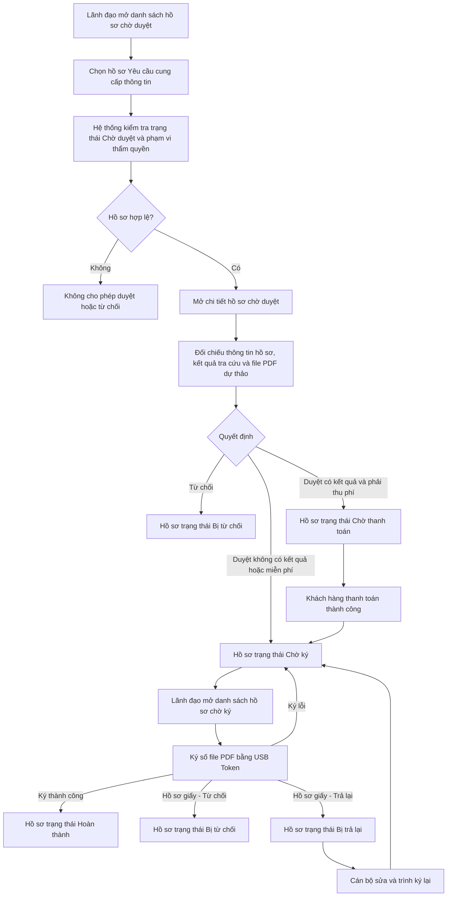

### 4.3.2.3. UC-CCTT-LD - Ký số yêu cầu cung cấp thông tin

#### 4.3.2.3.1. Mục đích

\- Cho phép Lãnh đạo xem, đối chiếu và ký số hồ sơ Yêu cầu cung cấp thông tin đã được Cán bộ trình ký ở trạng thái "Chờ ký".

\- Lãnh đạo không có bước "Chờ duyệt/Chờ phê duyệt" riêng. Cán bộ là người kiểm tra, tra cứu, kết xuất file PDF và trình hồ sơ sang "Chờ ký".

\- Cho phép Lãnh đạo ký số file PDF kết quả cung cấp thông tin ở trạng thái "Chờ ký" bằng USB Token/chứng thư số hợp lệ.

\- Khi ký số thành công, hồ sơ chuyển sang trạng thái "Hoàn thành".

\- Khi Lãnh đạo từ chối tại trạng thái "Chờ ký", hồ sơ chuyển sang trạng thái "Bị từ chối". Nếu hồ sơ Online đã thanh toán, hệ thống tạo yêu cầu hoàn tiền để theo dõi tại Module Quản lý đối soát thanh toán; nếu hồ sơ giấy đã thu phí, hệ thống tạo khoản hoàn phí/thông báo kế toán tại Module Quản lý thu phí/hoàn phí hồ sơ giấy.

\- Khi Lãnh đạo trả lại tại trạng thái "Chờ ký", hồ sơ chuyển sang "Bị trả lại" để Cán bộ xử lý lại và trình ký lại; thao tác trả lại không phát sinh hoàn tiền/hoàn phí.

*a. Phân quyền*

\- Lãnh đạo được phân quyền ký số hồ sơ Yêu cầu cung cấp thông tin.

\- Lãnh đạo chỉ được xem, ký số, từ chối hoặc trả lại hồ sơ thuộc đơn vị quản lý.

\- Lãnh đạo chỉ được xem, ký số, từ chối hoặc trả lại hồ sơ thuộc phạm vi thẩm quyền.

\- Hồ sơ được Cán bộ trình tới Lãnh đạo nào thì chỉ Lãnh đạo đó nhìn thấy và xử lý, trừ tài khoản có quyền giám sát/tra cứu thay theo cấu hình phân quyền.

*b. Điều kiện thực hiện*

\- Lãnh đạo đã đăng nhập thành công vào Website Quản trị.

\- Hồ sơ ký số đang ở trạng thái "Chờ ký".

\- Hồ sơ đã có kết quả tra cứu được Cán bộ lưu và khóa khi trình ký, bao gồm trường hợp tra cứu có dữ liệu hoặc không có dữ liệu.

\- Hồ sơ đã có file PDF kết quả cung cấp thông tin được sinh theo mẫu cấu hình `GCN_Mau Giay chung nhan CCTT.pdf` và khóa phiên bản trình ký.

\- Máy trạm của Lãnh đạo có thành phần ký số cục bộ và USB Token/chứng thư số hợp lệ để thực hiện ký số.

*c. Nguyên tắc dữ liệu*

\- Lãnh đạo không được sửa dữ liệu Khách hàng đã nhập, tiêu chí tra cứu, dữ liệu đầu vào tra cứu, kết quả tra cứu hoặc nội dung file PDF.

\- Hệ thống chỉ ký số đúng phiên bản file PDF đã được Cán bộ trình ký và đang được khóa trong hồ sơ.

\- Việc thu phí đối với hồ sơ Online phát sinh trước khi hồ sơ vào trạng thái "Chờ duyệt" của Cán bộ; Lãnh đạo không phát sinh bước duyệt để tạo nghĩa vụ thanh toán.

\- Hồ sơ tra cứu không có dữ liệu còn hiệu lực vẫn được Cán bộ trình ký file PDF thông báo không có kết quả; Lãnh đạo ký số tại trạng thái "Chờ ký".

\- Với thao tác ký nhiều hồ sơ, hệ thống xử lý và ghi nhận kết quả theo từng hồ sơ.

\- Luồng "Trả lại" áp dụng tại trạng thái "Chờ ký" để Cán bộ xử lý lại file/kết quả trình ký; không làm thay đổi giao dịch thanh toán đã phát sinh.

#### 4.3.2.3.2. UC-CCTT-LD.MH01 - Màn hình Danh sách yêu cầu cung cấp thông tin chờ duyệt (không áp dụng)

##### 4.3.2.3.2.1. Màn hình`r`n`r`n> Cập nhật theo Plan BTNN: màn hình này không còn hiển thị trên UI. Lãnh đạo chỉ xử lý hồ sơ Yêu cầu cung cấp thông tin tại danh sách "Chờ ký".

##### 4.3.2.3.2.2. Mô tả thông tin trên màn hình

| Trường thông tin | Kiểu dữ liệu | Bắt buộc | Mặc định | Mô tả |
| :--- | :--- | :---: | :--- | :--- |
| **I. Bộ lọc tìm kiếm** | | | | |
| Tìm kiếm | String(255) | Không | Trống | Tìm kiếm gần đúng, không phân biệt hoa thường, tự động trim space theo Mã hồ sơ, Người yêu cầu, Giá trị tiêu chí hoặc Cán bộ trình ký. |
| Mã khách hàng | String(50) | Không | Trống | Tìm kiếm chính xác hoặc gần đúng theo Mã khách hàng của người yêu cầu. |
| Cán bộ trình ký | String(255) | Không | Trống | Lọc theo Cán bộ đã trình ký hồ sơ. |
| Lãnh đạo ký | String(255) | Không | Lãnh đạo đăng nhập | - Cho phép tìm kiếm gần đúng theo tên Lãnh đạo được phân công ký. - Hiển thị thông tin Lãnh đạo được phép ký/duyệt của đơn vị tại Cấu hình thông tin về người ký. - Mặc định giới hạn theo Lãnh đạo đang đăng nhập. - Chỉ vai trò được phân quyền giám sát/tra cứu thay mới được nhập tên Lãnh đạo khác theo phạm vi thẩm quyền. |
| Tiêu chí yêu cầu cung cấp thông tin | Enum(String(50)) | Không | Tất cả | \- Lọc theo tiêu chí Khách hàng đã chọn khi gửi yêu cầu. \- Các giá trị gồm: \+ Tất cả \+ Số đăng ký \+ Bên bảo đảm \+ Số khung |
| Từ ngày | Date | Không | Ngày 01 của tháng hiện tại | Lọc theo Thời điểm đăng ký. Tuân thủ [BR-VAL-007]. |
| Đến ngày | Date | Không | Ngày hiện tại | Lọc theo Thời điểm đăng ký. Tuân thủ [BR-VAL-007]. |
| **II. Bảng danh sách hồ sơ** | | | | - Trạng thái có dữ liệu: Hiển thị danh sách các bản ghi kết quả theo cấu trúc các cột quy định. - Trạng thái không có dữ liệu (Empty State): Khi không tìm thấy kết quả phù hợp với điều kiện tìm kiếm, bảng hiển thị duy nhất 01 dòng căn giữa trên toàn bộ chiều rộng bảng (`colspan`), in nghiêng với nội dung: *"Không tìm thấy dữ liệu phù hợp với điều kiện tìm kiếm."*|
| Bảng danh sách hồ sơ | Text(1000) | Không | 20 bản ghi/trang | \- Chỉ hiển thị hồ sơ Yêu cầu cung cấp thông tin ở trạng thái "Chờ duyệt" thuộc phạm vi xử lý của Lãnh đạo đăng nhập. \- Sắp xếp mặc định theo Thời điểm trình ký tăng dần để ưu tiên xử lý hồ sơ được trình trước. \- Click trực tiếp vào dòng dữ liệu để mở **4.3.2.3.3. UC-CCTT-LD.MH02 - Màn hình Chi tiết hồ sơ chờ duyệt**. - Trạng thái có dữ liệu: Hiển thị danh sách các bản ghi kết quả theo cấu trúc các cột quy định. - Trạng thái không có dữ liệu (Empty State): Khi không tìm thấy kết quả phù hợp với điều kiện tìm kiếm, bảng hiển thị duy nhất 01 dòng căn giữa trên toàn bộ chiều rộng bảng (`colspan`), in nghiêng với nội dung: *"Không tìm thấy dữ liệu phù hợp với điều kiện tìm kiếm."*|
| Checkbox chọn | Boolean | Không | Không chọn | Cho phép chọn một hoặc nhiều hồ sơ để duyệt theo lô. Chỉ cho phép chọn hồ sơ đủ điều kiện theo [BR-CCTT-005]. |
| STT | Integer(10) | Không | Tự tăng | Số thứ tự dòng dữ liệu trên trang hiện tại. |
| Mã hồ sơ | String(50) | Có | Theo hồ sơ | Mã hồ sơ Yêu cầu cung cấp thông tin. |
| Người yêu cầu | String(255) | Có | Theo hồ sơ | Tên cá nhân/tổ chức yêu cầu cung cấp thông tin. |
| Địa chỉ | Text(500) | Không | Theo hồ sơ | Địa chỉ của Người yêu cầu theo thông tin Khách hàng đã gửi trong hồ sơ. |
| Tiêu chí yêu cầu cung cấp thông tin | Enum(String(50)) | Có | Theo hồ sơ | Hiển thị một trong các giá trị: "Số đăng ký", "Bên bảo đảm", "Số khung". |
| Giá trị tiêu chí | Text(1000) | Có | Theo hồ sơ | Tóm tắt dữ liệu Khách hàng đã nhập tương ứng với tiêu chí yêu cầu cung cấp thông tin. |
| Nguồn tiếp nhận | Enum(String(50)) | Có | Theo hồ sơ | Chỉ đọc. Hiển thị "Website Khách hàng" hoặc "Mobile Khách hàng". Màn hình chờ duyệt chỉ áp dụng hồ sơ Online đã được Cán bộ trình ký. |
| Thời điểm đăng ký | Datetime | Có | Theo hồ sơ | Thời điểm Khách hàng gửi yêu cầu cung cấp thông tin. Cột này đặt ngay sau cột Nguồn tiếp nhận. |
| Cán bộ trình ký | String(255) | Có | Theo hồ sơ | Cán bộ đã tra cứu, kết xuất và trình ký kết quả xử lý. |
| Thời điểm trình ký | Datetime | Có | Theo hồ sơ | Thời điểm Cán bộ trình ký hồ sơ thành công. |
| Trạng thái | Enum(String(50)) | Có | "Chờ duyệt" | Chỉ đọc. Tại màn hình này chỉ hiển thị hồ sơ ở trạng thái "Chờ duyệt". |
| Thao tác | String(255) | Không | Theo quyền | Hiển thị các thao tác: Xem chi tiết, Duyệt, Từ chối. |

##### 4.3.2.3.2.3. Chức năng trên màn hình

| STT | Tên chức năng | Định dạng | Mô tả |
| :--- | :--- | :--- | :--- |
| 1 | Tìm kiếm | Nút | TH1 (Điều kiện ngày không hợp lệ): Nếu Từ ngày lớn hơn Đến ngày, vi phạm [BR-VAL-007], hiển thị [MSG-ERR-VAL-007] và không thực hiện tìm kiếm. - **TH Không có dữ liệu trả về**: + Bảng kết quả: Hiển thị dòng thông báo rỗng *"Không tìm thấy dữ liệu phù hợp với điều kiện tìm kiếm."* ở giữa bảng. + Thanh phân trang (Pagination): Dòng số lượng hiển thị *"Hiển thị 0-0 của 0 yêu cầu"*; các nút điều hướng trang (&#124;&lt;&lt;, &lt;, các số trang, &gt;, &gt;&gt;&#124;) ở trạng thái ẩn hoặc khóa mờ (Disabled). + Nút "Kết xuất Excel" (nếu màn hình có nút này): Thiết lập ở trạng thái khóa mờ (Disabled) kèm tooltip: *"Không có dữ liệu để kết xuất Excel"*.|
|  |  |  | TH Hợp lệ: Hệ thống tìm kiếm theo bộ lọc trong phạm vi hồ sơ thuộc quyền ký của Lãnh đạo. Nếu không có dữ liệu phù hợp, hiển thị trạng thái rỗng theo chuẩn danh sách. |
| 2 | Xóa bộ lọc | Nút | Xóa toàn bộ tiêu chí lọc, đưa Tiêu chí yêu cầu cung cấp thông tin về "Tất cả", Từ ngày/Đến ngày về mặc định và tải lại danh sách hồ sơ "Chờ duyệt". |
| 3 | Duyệt | Nút | TH1 (Chưa chọn hồ sơ hợp lệ): Vi phạm [BR-CCTT-005], hiển thị [MSG-ERR-CCTT-008], không thực hiện duyệt. |
|  |  |  | TH2 (Có hồ sơ không còn ở trạng thái "Chờ duyệt"): Vi phạm [BR-CCTT-005], hiển thị [MSG-ERR-CCTT-006], không cho phép duyệt hồ sơ không hợp lệ. |
|  |  |  | TH3 (Lãnh đạo không có quyền ký hồ sơ): Vi phạm [BR-CCTT-005], hiển thị [MSG-ERR-CCTT-007], không cho phép duyệt hồ sơ không hợp lệ. |
|  |  |  | TH4 (Không tìm thấy file PDF dự thảo hợp lệ): Vi phạm [BR-CCTT-005], hiển thị [MSG-ERR-CCTT-009], không cho phép duyệt hồ sơ không hợp lệ. |
|  |  |  | Không áp dụng theo Plan BTNN. Lãnh đạo không thực hiện duyệt tại màn này. |
| 4 | Từ chối | Nút | TH1 (Hồ sơ không còn ở trạng thái "Chờ duyệt"): Vi phạm [BR-CCTT-007], hiển thị [MSG-ERR-CCTT-006], không mở popup từ chối. |
|  |  |  | TH2 (Lãnh đạo không có quyền ký hồ sơ): Vi phạm [BR-CCTT-007], hiển thị [MSG-ERR-CCTT-007], không mở popup từ chối. |
|  |  |  | TH Hợp lệ: Mở **4.3.2.3.4. UC-CCTT-LD.MH03 - Popup Từ chối yêu cầu cung cấp thông tin**. |
| 5 | Xem chi tiết | Nút | Mở **4.3.2.3.3. UC-CCTT-LD.MH02 - Màn hình Chi tiết hồ sơ chờ duyệt**. |
| 6 | Click dòng dữ liệu | Row Click | Mở **4.3.2.3.3. UC-CCTT-LD.MH02 - Màn hình Chi tiết hồ sơ chờ duyệt** nếu hồ sơ còn thuộc phạm vi duyệt của Lãnh đạo. |

#### 4.3.2.3.3. UC-CCTT-LD.MH02 - Màn hình Chi tiết hồ sơ chờ duyệt (không áp dụng)

##### 4.3.2.3.3.1. Màn hình`r`n`r`n> Cập nhật theo Plan BTNN: màn hình này không còn hiển thị trên UI. Chi tiết hồ sơ của Lãnh đạo chỉ mở từ danh sách "Chờ ký".

##### 4.3.2.3.3.2. Mô tả thông tin trên màn hình

| Trường thông tin | Kiểu dữ liệu | Bắt buộc | Mặc định | Mô tả |
| :--- | :--- | :---: | :--- | :--- |
| **I. Thông tin hồ sơ** | | | | |
| Mã hồ sơ | String(50) | Có | Theo hồ sơ | Chỉ đọc. Mã hồ sơ Yêu cầu cung cấp thông tin. |
| Mã khách hàng | String(50) | Không | Theo hồ sơ | Chỉ đọc. Chỉ hiển thị khi hồ sơ có dữ liệu. |
| Người yêu cầu | String(255) | Có | Theo hồ sơ | Chỉ đọc. Họ tên hoặc tên tổ chức yêu cầu cung cấp thông tin. |
| Địa chỉ | Text(500) | Không | Theo hồ sơ | Chỉ đọc. Địa chỉ của Người yêu cầu theo thông tin Khách hàng đã gửi trong hồ sơ. |
| Thời điểm đăng ký | Datetime | Có | Theo hồ sơ | Chỉ đọc. Thời điểm Khách hàng gửi yêu cầu cung cấp thông tin. |
| Nguồn tiếp nhận | Enum(String(50)) | Có | Theo hồ sơ | \- Chỉ đọc. \- Các giá trị gồm: \+ Website Khách hàng \+ Mobile Khách hàng \+ Cán bộ nhập liệu |
| Tiêu chí yêu cầu cung cấp thông tin | Enum(String(50)) | Có | Theo hồ sơ | \- Chỉ đọc. \- Các giá trị gồm: \+ Số đăng ký \+ Bên bảo đảm \+ Số khung |
| Dữ liệu Khách hàng đã nhập | Text(1000) | Có | Theo hồ sơ | Chỉ đọc. Hiển thị nguyên dữ liệu tra cứu Khách hàng đã gửi, không cho phép chỉnh sửa theo [BR-CCTT-001]. |
| Trạng thái | Enum(String(50)) | Có | "Chờ duyệt" | Chỉ đọc. Khi Lãnh đạo ký, trạng thái phải là "Chờ duyệt". |
| Cán bộ xử lý | String(255) | Có | Theo hồ sơ | Chỉ đọc. Cán bộ đã thực hiện tra cứu và kết xuất kết quả. |
| Thời điểm tra cứu | Datetime | Có | Theo hồ sơ | Chỉ đọc. Thời điểm Cán bộ thực hiện tra cứu được dùng để trình ký. |
| Cán bộ trình ký | String(255) | Có | Theo hồ sơ | Chỉ đọc. Cán bộ đã trình ký hồ sơ. |
| Thời điểm trình ký | Datetime | Có | Theo hồ sơ | Chỉ đọc. Thời điểm Cán bộ trình ký hồ sơ thành công. |
| Lịch sử xử lý | Text(4000) | Không | Theo hồ sơ | Chỉ đọc. Hiển thị dòng thời gian các thao tác gửi yêu cầu, tiếp nhận, tra cứu, kết xuất, trình ký, duyệt, thanh toán, ký số, ký lỗi hoặc từ chối. |
| **II. File PDF dự thảo trình ký** | | | | |
| File PDF dự thảo | File | Có | Theo hồ sơ | Chỉ đọc. File PDF kết quả cung cấp thông tin được sinh từ phiên tra cứu đã khóa và được Cán bộ trình ký theo mẫu `GCN_Mau Giay chung nhan CCTT.pdf`. - File gồm lá mặt/trang ký Mẫu số 10d và phần kết quả cung cấp thông tin/phụ lục phía sau trong cùng một PDF. - QR code được sinh và xác thực theo mô tả tại `4.3.2.2.7.2` dòng "QR code" trong tài liệu [SRS_Xu_ly_Yeu_cau_cung_cap_thong_tin_Can_bo.md](SRS_Xu_ly_Yeu_cau_cung_cap_thong_tin_Can_bo.md). - Nếu phiên tra cứu không có dữ liệu, phần kết quả phía sau hiển thị [MSG-WRN-CCTT-001]. |
| Người tạo file | String(255) | Có | Theo hồ sơ | Chỉ đọc. Người tạo file PDF dự thảo. |
| Thời điểm tạo file | Datetime | Có | Theo hồ sơ | Chỉ đọc. Thời điểm hệ thống sinh file PDF dự thảo. |
| Phiên bản file | String(50) | Có | Theo hồ sơ | Chỉ đọc. Phiên bản file PDF đang được trình ký. |
| **III. Kết quả tra cứu** | | | | - Trạng thái có dữ liệu: Hiển thị danh sách các bản ghi kết quả theo cấu trúc các cột quy định. - Trạng thái không có dữ liệu (Empty State): Khi không tìm thấy kết quả phù hợp với điều kiện tìm kiếm, bảng hiển thị duy nhất 01 dòng căn giữa trên toàn bộ chiều rộng bảng (`colspan`), in nghiêng với nội dung: *"Không tìm thấy dữ liệu phù hợp với điều kiện tìm kiếm."* |
| Bảng danh sách kết quả tra cứu | Text(4000) | Không | Theo kết quả tra cứu | \- Chỉ đọc. Hiển thị kết quả tra cứu đã được Cán bộ lưu và khóa khi trình ký. \- Nội dung hiển thị phải giống hệt **VI. Kết quả cung cấp thông tin có xác nhận của cơ quan đăng ký** tại màn Xem chi tiết hồ sơ của Website Khách hàng trong tài liệu [SRS yêu cầu cung cấp thông tin.md](../../01_Website_Khach_hang/SRS%20y%C3%AAu%20c%E1%BA%A7u%20cung%20c%E1%BA%A5p%20th%C3%B4ng%20tin.md#vi-ket-qua-cung-cap-thong-tin-co-xac-nhan-cua-co-quan-dang-ky). \- Nếu phiên tra cứu không có dữ liệu, hiển thị [MSG-WRN-CCTT-001] dạng Inline ngay trong khu vực kết quả tra cứu, không hiển thị Toast. \- Dữ liệu nguồn vẫn tuân thủ [BR-CCTT-002]. - Trạng thái có dữ liệu: Hiển thị danh sách các bản ghi kết quả theo cấu trúc các cột quy định. - Trạng thái không có dữ liệu (Empty State): Khi không tìm thấy kết quả phù hợp với điều kiện tìm kiếm, bảng hiển thị duy nhất 01 dòng căn giữa trên toàn bộ chiều rộng bảng (`colspan`), in nghiêng với nội dung: *"Không tìm thấy dữ liệu phù hợp với điều kiện tìm kiếm."*|
| Kết quả có phát sinh nghĩa vụ phí | Boolean | Có | Theo kết quả tra cứu/biểu phí | Giá trị "Có" khi phiên tra cứu có dữ liệu và hồ sơ thuộc diện phải thu phí. Giá trị "Không" khi tra cứu không có dữ liệu còn hiệu lực hoặc hồ sơ thuộc diện miễn phí. |

##### 4.3.2.3.3.3. Chức năng trên màn hình

| STT | Tên chức năng | Định dạng | Mô tả |
| :--- | :--- | :--- | :--- |
| 1 | Xem file | Nút | Cho phép xem file PDF dự thảo tại một tab riêng. |
| 2 | Tải file | Nút | Cho phép tải file PDF dự thảo nếu Lãnh đạo có quyền tải file. |
| 3 | Duyệt | Nút | TH1 (Hồ sơ không còn ở trạng thái "Chờ duyệt"): Vi phạm [BR-CCTT-005], hiển thị [MSG-ERR-CCTT-006], không cho phép duyệt. |
|  |  |  | TH2 (Lãnh đạo không có quyền ký hồ sơ): Vi phạm [BR-CCTT-005], hiển thị [MSG-ERR-CCTT-007], không cho phép duyệt. |
|  |  |  | TH3 (Không tìm thấy file PDF dự thảo hợp lệ): Vi phạm [BR-CCTT-005], hiển thị [MSG-ERR-CCTT-009], không cho phép duyệt. |
|  |  |  | Không áp dụng theo Plan BTNN. Lãnh đạo không thực hiện duyệt tại màn này. |
| 4 | Từ chối | Nút | TH1 (Hồ sơ không còn ở trạng thái "Chờ duyệt"): Vi phạm [BR-CCTT-007], hiển thị [MSG-ERR-CCTT-006], không mở popup từ chối. |
|  |  |  | TH2 (Lãnh đạo không có quyền ký hồ sơ): Vi phạm [BR-CCTT-007], hiển thị [MSG-ERR-CCTT-007], không mở popup từ chối. |
|  |  |  | TH Hợp lệ: Mở **4.3.2.3.4. UC-CCTT-LD.MH03 - Popup Từ chối yêu cầu cung cấp thông tin**. |
| 5 | Quay lại | Nút | Quay về **4.3.2.3.2. UC-CCTT-LD.MH01 - Màn hình Danh sách yêu cầu cung cấp thông tin chờ duyệt**. |

#### 4.3.2.3.4. UC-CCTT-LD.MH03 - Popup Từ chối yêu cầu cung cấp thông tin

##### 4.3.2.3.4.1. Màn hình

##### 4.3.2.3.4.2. Mô tả thông tin trên màn hình

| Trường thông tin | Kiểu dữ liệu | Bắt buộc | Mặc định | Mô tả |
| :--- | :--- | :---: | :--- | :--- |
| Mã hồ sơ | String(50) | Có | Theo hồ sơ | Chỉ đọc. Mã hồ sơ bị từ chối. |
| Người yêu cầu | String(255) | Có | Theo hồ sơ | Chỉ đọc. Người yêu cầu cung cấp thông tin. |
| Tiêu chí yêu cầu cung cấp thông tin | Enum(String(50)) | Có | Theo hồ sơ | Chỉ đọc. Tiêu chí yêu cầu cung cấp thông tin do Khách hàng đã gửi. |
| Giá trị tiêu chí | Text(1000) | Có | Theo hồ sơ | Chỉ đọc. Dữ liệu Khách hàng đã nhập tương ứng với tiêu chí yêu cầu cung cấp thông tin. |
| Lý do từ chối | Text(1000) | Có | Trống | Lãnh đạo bắt buộc nhập lý do từ chối. Hệ thống tự động trim space theo [BR-VAL-001]. |
| File PDF dự thảo | File | Không | Theo hồ sơ | Chỉ đọc. File PDF dự thảo chưa được duyệt/ký số, được lưu trong lịch sử xử lý khi từ chối. |
| Kết quả tra cứu | Text(4000) | Không | Theo hồ sơ | Chỉ đọc. Kết quả tra cứu đã được Cán bộ lưu và khóa khi trình ký, được lưu trong lịch sử xử lý khi từ chối. - Trạng thái có dữ liệu: Hiển thị danh sách các bản ghi kết quả theo cấu trúc các cột quy định. - Trạng thái không có dữ liệu (Empty State): Khi không tìm thấy kết quả phù hợp với điều kiện tìm kiếm, bảng hiển thị duy nhất 01 dòng căn giữa trên toàn bộ chiều rộng bảng (`colspan`), in nghiêng với nội dung: *"Không tìm thấy dữ liệu phù hợp với điều kiện tìm kiếm."* |

##### 4.3.2.3.4.3. Chức năng trên màn hình

| STT | Tên chức năng | Định dạng | Mô tả |
| :--- | :--- | :--- | :--- |
| 1 | Hủy | Nút | Đóng popup, giữ nguyên trạng thái hồ sơ và quay lại giao diện trước đó. |
| 2 | Xác nhận từ chối | Nút | TH1 (Bỏ trống Lý do từ chối): Vi phạm [BR-VAL-001], hiển thị [MSG-ERR-VAL-001], highlight viền đỏ và focus vào ô lỗi, không cho phép xác nhận. |
|  |  |  | TH2 (Hồ sơ không còn ở trạng thái "Chờ duyệt"): Vi phạm [BR-CCTT-007], hiển thị [MSG-ERR-CCTT-006], không cho phép từ chối. |
|  |  |  | TH3 (Lãnh đạo không có quyền ký hồ sơ): Vi phạm [BR-CCTT-007], hiển thị [MSG-ERR-CCTT-007], không cho phép từ chối. |
|  |  |  | TH Hợp lệ: Hệ thống yêu cầu xác nhận bằng [MSG-CFM-CCTT-001]. Sau khi Lãnh đạo xác nhận, hệ thống lưu người từ chối, thời điểm từ chối, lý do từ chối, file PDF dự thảo, kết quả tra cứu trong lịch sử; chuyển hồ sơ từ "Chờ duyệt" sang "Bị từ chối"; không chuyển hồ sơ về Cán bộ xử lý lại; hiển thị [MSG-SUC-CCTT-006]. |

#### 4.3.2.3.5. UC-CCTT-LD.MH04 - Màn hình Danh sách yêu cầu cung cấp thông tin chờ ký

##### 4.3.2.3.5.1. Màn hình

##### 4.3.2.3.5.2. Mô tả thông tin trên màn hình

| Trường thông tin | Kiểu dữ liệu | Bắt buộc | Mặc định | Mô tả |
| :--- | :--- | :---: | :--- | :--- |
| **I. Bộ lọc tìm kiếm** | | | | |
| Tìm kiếm | String(255) | Không | Trống | Tìm kiếm gần đúng, không phân biệt hoa thường, tự động trim space theo Mã hồ sơ, Người yêu cầu, Giá trị tiêu chí hoặc Cán bộ trình ký. |
| Mã khách hàng | String(50) | Không | Trống | Tìm kiếm chính xác hoặc gần đúng theo Mã khách hàng của người yêu cầu. |
| Cán bộ trình ký | String(255) | Không | Trống | Lọc theo Cán bộ đã trình ký hồ sơ trước khi hồ sơ chuyển sang "Chờ ký". |
| Lãnh đạo ký | String(255) | Không | Lãnh đạo đăng nhập | - Cho phép tìm kiếm gần đúng theo tên Lãnh đạo được phân công ký. - Hiển thị thông tin Lãnh đạo được phép ký của đơn vị tại Cấu hình thông tin về người ký. - Mặc định giới hạn theo Lãnh đạo đang đăng nhập. - Chỉ vai trò được phân quyền giám sát/tra cứu thay mới được nhập tên Lãnh đạo khác theo phạm vi thẩm quyền. |
| Tiêu chí yêu cầu cung cấp thông tin | Enum(String(50)) | Không | Tất cả | \- Lọc theo tiêu chí Khách hàng/Cán bộ nhập liệu đã chọn khi lập yêu cầu. \- Các giá trị gồm: \+ Tất cả \+ Số đăng ký \+ Bên bảo đảm \+ Số khung |
| Nguồn tiếp nhận | Enum(String(50)) | Không | Tất cả | \- Lọc theo nguồn phát sinh hồ sơ. \- Các giá trị gồm: \+ Tất cả \+ Website Khách hàng \+ Mobile Khách hàng \+ Cán bộ nhập liệu |
| Từ ngày | Date | Không | Ngày 01 của tháng hiện tại | Lọc theo Thời điểm đăng ký của hồ sơ. Tuân thủ [BR-VAL-007]. |
| Đến ngày | Date | Không | Ngày hiện tại | Lọc theo Thời điểm đăng ký của hồ sơ. Tuân thủ [BR-VAL-007]. |
| **II. Bảng danh sách hồ sơ** | | | | - Trạng thái có dữ liệu: Hiển thị danh sách các bản ghi kết quả theo cấu trúc các cột quy định. - Trạng thái không có dữ liệu (Empty State): Khi không tìm thấy kết quả phù hợp với điều kiện tìm kiếm, bảng hiển thị duy nhất 01 dòng căn giữa trên toàn bộ chiều rộng bảng (`colspan`), in nghiêng với nội dung: *"Không tìm thấy dữ liệu phù hợp với điều kiện tìm kiếm."*|
| Bảng danh sách hồ sơ | Text(1000) | Không | 20 bản ghi/trang | \- Chỉ hiển thị hồ sơ Yêu cầu cung cấp thông tin ở trạng thái "Chờ ký" thuộc phạm vi ký của Lãnh đạo đăng nhập. \- Sắp xếp mặc định theo Thời điểm chuyển sang "Chờ ký" tăng dần. \- Cho phép Lãnh đạo tích chọn một hoặc nhiều hồ sơ trên danh sách để ký số cùng một lúc. - Trạng thái có dữ liệu: Hiển thị danh sách các bản ghi kết quả theo cấu trúc các cột quy định. - Trạng thái không có dữ liệu (Empty State): Khi không tìm thấy kết quả phù hợp với điều kiện tìm kiếm, bảng hiển thị duy nhất 01 dòng căn giữa trên toàn bộ chiều rộng bảng (`colspan`), in nghiêng với nội dung: *"Không tìm thấy dữ liệu phù hợp với điều kiện tìm kiếm."*|
| Checkbox chọn tất cả | Boolean | Không | Không chọn | \- Hiển thị tại dòng tiêu đề bảng. \- Cho phép chọn/bỏ chọn toàn bộ hồ sơ đủ điều kiện ký trên trang hiện tại. \- Không chọn các hồ sơ không còn thuộc quyền ký, không ở trạng thái "Chờ ký" hoặc không có file PDF hợp lệ. |
| Checkbox chọn | Boolean | Không | Không chọn | \- Hiển thị tại từng dòng hồ sơ. \- Cho phép chọn một hoặc nhiều hồ sơ đủ điều kiện để ký số cùng một lúc. \- Nếu hồ sơ không đủ điều kiện ký, checkbox bị disable và hiển thị tooltip lý do không được chọn. |
| STT | Integer(10) | Không | Tự tăng | Số thứ tự dòng dữ liệu trên trang hiện tại. |
| Mã hồ sơ | String(50) | Có | Theo hồ sơ | Mã hồ sơ Yêu cầu cung cấp thông tin. |
| Người yêu cầu | String(255) | Có | Theo hồ sơ | Tên cá nhân/tổ chức yêu cầu cung cấp thông tin. |
| Tiêu chí yêu cầu cung cấp thông tin | Enum(String(50)) | Có | Theo hồ sơ | Hiển thị một trong các giá trị: "Số đăng ký", "Bên bảo đảm", "Số khung". |
| Giá trị tiêu chí | Text(1000) | Có | Theo hồ sơ | Tóm tắt dữ liệu Khách hàng đã nhập tương ứng với tiêu chí. |
| Nguồn tiếp nhận | Enum(String(50)) | Có | Theo hồ sơ | Chỉ đọc. Hiển thị "Website Khách hàng", "Mobile Khách hàng" hoặc "Cán bộ nhập liệu". Giá trị "Cán bộ nhập liệu" xác định hồ sơ giấy được phép trả lại theo [BR-CCTT-009]. |
| Thời điểm đăng ký | Datetime | Có | Theo hồ sơ | Thời điểm phát sinh yêu cầu cung cấp thông tin. Đối với hồ sơ Online là thời điểm Khách hàng gửi yêu cầu; đối với hồ sơ giấy là thời điểm tiếp nhận/ghi nhận yêu cầu tại UCPS012. Cột này đặt ngay sau cột Nguồn tiếp nhận. |
| Trạng thái | Enum(String(50)) | Có | "Chờ ký" | Chỉ đọc. Tại màn hình này chỉ hiển thị hồ sơ ở trạng thái "Chờ ký". |
| Thao tác | String(255) | Không | Theo quyền | Hiển thị các thao tác: - "Xem chi tiết": áp dụng mọi hồ sơ thuộc quyền. - "Ký số": áp dụng hồ sơ đủ điều kiện ký. - "Từ chối": chỉ hiển thị với hồ sơ giấy có Nguồn tiếp nhận là "Cán bộ nhập liệu". - "Trả lại": chỉ hiển thị với hồ sơ giấy có Nguồn tiếp nhận là "Cán bộ nhập liệu". |

##### 4.3.2.3.5.3. Chức năng trên màn hình

| STT | Tên chức năng | Định dạng | Mô tả |
| :--- | :--- | :--- | :--- |
| 1 | Tìm kiếm | Nút | TH1 (Điều kiện ngày không hợp lệ): Nếu Từ ngày lớn hơn Đến ngày, vi phạm [BR-VAL-007], hiển thị [MSG-ERR-VAL-007] và không thực hiện tìm kiếm. - **TH Không có dữ liệu trả về**: + Bảng kết quả: Hiển thị dòng thông báo rỗng *"Không tìm thấy dữ liệu phù hợp với điều kiện tìm kiếm."* ở giữa bảng. + Thanh phân trang (Pagination): Dòng số lượng hiển thị *"Hiển thị 0-0 của 0 yêu cầu"*; các nút điều hướng trang (&#124;&lt;&lt;, &lt;, các số trang, &gt;, &gt;&gt;&#124;) ở trạng thái ẩn hoặc khóa mờ (Disabled). + Nút "Kết xuất Excel" (nếu màn hình có nút này): Thiết lập ở trạng thái khóa mờ (Disabled) kèm tooltip: *"Không có dữ liệu để kết xuất Excel"*.|
|  |  |  | TH Hợp lệ: Hệ thống tìm kiếm theo bộ lọc trong phạm vi hồ sơ thuộc quyền ký của Lãnh đạo. Nếu không có dữ liệu phù hợp, hiển thị trạng thái rỗng theo chuẩn danh sách. |
| 2 | Xóa bộ lọc | Nút | Xóa toàn bộ tiêu chí lọc, đưa Tiêu chí yêu cầu cung cấp thông tin và Nguồn tiếp nhận về "Tất cả", Từ ngày/Đến ngày về mặc định và tải lại danh sách hồ sơ "Chờ ký". |
| 3 | Ký số | Nút | \- Cho phép ký số một hoặc nhiều hồ sơ cùng một lúc theo danh sách hồ sơ đã được tích chọn trên bảng. |
|  |  |  | TH1 (Chưa chọn hồ sơ hợp lệ): Vi phạm [BR-CCTT-006], hiển thị [MSG-ERR-CCTT-008], không mở popup ký số. |
|  |  |  | TH2 (Có hồ sơ không còn ở trạng thái "Chờ ký"): Vi phạm [BR-CCTT-006], hiển thị [MSG-ERR-CCTT-013], không cho phép ký hồ sơ không hợp lệ. |
|  |  |  | TH3 (Lãnh đạo không có quyền ký hồ sơ): Vi phạm [BR-CCTT-006], hiển thị [MSG-ERR-CCTT-007], không cho phép ký hồ sơ không hợp lệ. |
|  |  |  | TH4 (Không tìm thấy file PDF chờ ký hợp lệ): Vi phạm [BR-CCTT-006], hiển thị [MSG-ERR-CCTT-009], không cho phép ký hồ sơ không hợp lệ. |
|  |  |  | TH Hợp lệ: Mở **4.3.2.3.6. UC-CCTT-LD.MH05 - Popup Ký số yêu cầu cung cấp thông tin** và truyền toàn bộ danh sách hồ sơ đã chọn sang popup để ký số cùng một lúc. |
| 4 | Từ chối | Nút | TH1 (Hồ sơ không phải hồ sơ giấy có Nguồn tiếp nhận là "Cán bộ nhập liệu"): Vi phạm [BR-CCTT-007], không hiển thị/không cho phép thao tác. |
|  |  |  | TH2 (Hồ sơ không còn ở trạng thái "Chờ ký"): Vi phạm [BR-CCTT-007], hiển thị [MSG-ERR-CCTT-013], không cho phép từ chối. |
|  |  |  | TH Hợp lệ: Mở **4.3.2.3.7. UC-CCTT-LD.MH06 - Popup Từ chối/Trả lại hồ sơ giấy yêu cầu cung cấp thông tin** với Loại xử lý mặc định là "Từ chối". |
| 5 | Trả lại | Nút | TH1 (Hồ sơ không phải hồ sơ giấy có Nguồn tiếp nhận là "Cán bộ nhập liệu"): Vi phạm [BR-CCTT-009], không hiển thị/không cho phép thao tác. |
|  |  |  | TH2 (Hồ sơ không còn ở trạng thái "Chờ ký"): Vi phạm [BR-CCTT-009], hiển thị [MSG-ERR-CCTT-013], không cho phép trả lại. |
|  |  |  | TH Hợp lệ: Mở **4.3.2.3.7. UC-CCTT-LD.MH06 - Popup Từ chối/Trả lại hồ sơ giấy yêu cầu cung cấp thông tin** với Loại xử lý mặc định là "Trả lại". |

#### 4.3.2.3.6. UC-CCTT-LD.MH05 - Popup Ký số yêu cầu cung cấp thông tin

##### 4.3.2.3.6.1. Màn hình

##### 4.3.2.3.6.2. Mô tả thông tin trên màn hình

| Trường thông tin | Kiểu dữ liệu | Bắt buộc | Mặc định | Mô tả |
| :--- | :--- | :---: | :--- | :--- |
| **I. Thông tin ký số** | | | | |
| Danh sách hồ sơ ký số | Text(4000) | Có | Theo hồ sơ đã chọn | \- Chỉ đọc. Hiển thị danh sách một hoặc nhiều hồ sơ đã được Lãnh đạo tích chọn tại **4.3.2.3.5. UC-CCTT-LD.MH04 - Màn hình Danh sách yêu cầu cung cấp thông tin chờ ký**. \- Mỗi dòng tối thiểu hiển thị: Mã hồ sơ, Người yêu cầu, Tiêu chí yêu cầu cung cấp thông tin, Giá trị tiêu chí, Nguồn tiếp nhận, Trạng thái ký số. |
| Số lượng hồ sơ | Integer(10) | Có | Theo hồ sơ đã chọn | Chỉ đọc. Tổng số hồ sơ được chọn để ký số. |
| File PDF chờ ký | File | Có | Theo hồ sơ đã chọn | \- Chỉ đọc. File PDF kết quả cung cấp thông tin tương ứng từng hồ sơ trong danh sách ký số, bao gồm cả file thông báo không có kết quả nếu phiên tra cứu không có dữ liệu. \- Đây là file PDF đã được Cán bộ xử lý trình ký và khóa phiên bản, áp dụng cho cả hồ sơ Online và hồ sơ giấy. |
| Hình thức ký số | Enum(String(50)) | Có | "USB Token Ban Cơ yếu Chính phủ" | Chỉ đọc. Hệ thống ký số thông qua USB Token/chứng thư số hợp lệ của Lãnh đạo theo [BR-CCTT-006]. |
| **II. Thông tin thiết bị ký số** | | | | |
| Trạng thái USB Token | Enum(String(50)) | Không | Chưa kiểm tra | \- Chỉ đọc. \- Các giá trị gồm: \+ Chưa kiểm tra \+ Đã nhận thiết bị \+ Không nhận thiết bị \+ Chứng thư số không hợp lệ \+ Chứng thư số hợp lệ |
| Chứng thư số | Text(1000) | Không | Theo USB Token | Chỉ đọc. Hiển thị thông tin chứng thư số đọc được từ USB Token. |
| Người ký | String(255) | Không | Theo chứng thư số | Chỉ đọc. Người sở hữu chứng thư số dùng để ký. |
| Thời hạn chứng thư số | String(255) | Không | Theo chứng thư số | Chỉ đọc. Thời hạn hiệu lực của chứng thư số. |
| Trạng thái ký số | Enum(String(50)) | Không | "Chưa ký" | \- Chỉ đọc. Hiển thị trạng thái ký số của từng hồ sơ trong lô ký. \- Các giá trị gồm: \+ Chưa ký \+ Đang ký \+ Ký thành công \+ Ký lỗi |
| Kết quả ký từng hồ sơ | Text(4000) | Không | Theo kết quả ký | Chỉ đọc. Hiển thị kết quả ký thành công hoặc lỗi của từng hồ sơ khi ký số theo lô. |

##### 4.3.2.3.6.3. Chức năng trên màn hình

| STT | Tên chức năng | Định dạng | Mô tả |
| :--- | :--- | :--- | :--- |
| 1 | Kiểm tra USB Token | Nút | TH1 (USB Token chưa sẵn sàng hoặc không đọc được chứng thư số hợp lệ): Vi phạm [BR-CCTT-006], hiển thị [MSG-ERR-CCTT-010] và chưa cho phép ký số. |
|  |  |  | TH2 (Chứng thư số không khớp với Lãnh đạo được phân công ký): Vi phạm [BR-CCTT-006], hiển thị [MSG-ERR-CCTT-012] và chưa cho phép ký số. |
|  |  |  | TH Hợp lệ: Hệ thống nhận diện USB Token, đọc chứng thư số, kiểm tra thời hạn chứng thư số, kiểm tra trạng thái thu hồi nếu có tích hợp OCSP/CRL và hiển thị trạng thái "Chứng thư số hợp lệ". |
| 2 | Ký số | Nút | \- Cho phép ký số toàn bộ hồ sơ hợp lệ trong danh sách đã chọn chỉ với một lần thao tác xác nhận ký số. |
|  |  |  | \- Hệ thống ký lần lượt từng file PDF bằng USB Token/chứng thư số của Lãnh đạo; mỗi hồ sơ có kết quả ký độc lập. |
|  |  |  | TH1 (Chưa chọn hồ sơ hợp lệ): Vi phạm [BR-CCTT-006], hiển thị [MSG-ERR-CCTT-008], không thực hiện ký số. |
|  |  |  | TH2 (Hồ sơ không còn ở trạng thái "Chờ ký"): Vi phạm [BR-CCTT-006], hiển thị [MSG-ERR-CCTT-013], không thực hiện ký số đối với hồ sơ đó. |
|  |  |  | TH3 (Lãnh đạo không có quyền ký hồ sơ): Vi phạm [BR-CCTT-006], hiển thị [MSG-ERR-CCTT-007], không thực hiện ký số đối với hồ sơ đó. |
|  |  |  | TH4 (Không tìm thấy file PDF chờ ký hợp lệ): Vi phạm [BR-CCTT-006], hiển thị [MSG-ERR-CCTT-009], không thực hiện ký số đối với hồ sơ đó. |
|  |  |  | TH5 (USB Token/chứng thư số chưa hợp lệ): Vi phạm [BR-CCTT-006], hiển thị [MSG-ERR-CCTT-010] hoặc [MSG-ERR-CCTT-012], không thực hiện ký số. |
|  |  |  | TH6 (Lãnh đạo hủy ký, nhập sai PIN hoặc thành phần ký số trả lỗi): Vi phạm [BR-CCTT-006], hiển thị [MSG-ERR-CCTT-011], ghi nhận lỗi ký số và giữ nguyên trạng thái "Chờ ký" đối với hồ sơ ký lỗi. |
|  |  |  | TH Hợp lệ: Hệ thống yêu cầu xác nhận bằng [MSG-CFM-CCTT-002]. Sau khi Lãnh đạo xác nhận, thành phần ký số cục bộ yêu cầu nhập PIN USB Token; hệ thống không lưu PIN. Hệ thống ký số trực tiếp trên file PDF chờ ký tại vùng ký của lá mặt/trang ký Mẫu số 10d. Với ký theo lô, hệ thống ký lần lượt từng file PDF, xác minh chữ ký sau khi ký, lưu file PDF đã ký, thông tin chứng thư số, người ký, thời điểm ký, phiên bản file đã ký, ghi lịch sử xử lý của hồ sơ và Audit log hệ thống, sau đó chuyển hồ sơ ký thành công sang trạng thái "Hoàn thành". Hồ sơ ký lỗi giữ nguyên trạng thái "Chờ ký". Hiển thị [MSG-SUC-CCTT-007]. |
| 3 | Hủy | Nút | Đóng popup, giữ nguyên trạng thái hồ sơ và quay lại giao diện trước đó. |

#### 4.3.2.3.7. UC-CCTT-LD.MH06 - Popup Từ chối/Trả lại hồ sơ giấy yêu cầu cung cấp thông tin

##### 4.3.2.3.7.1. Màn hình

##### 4.3.2.3.7.2. Mô tả thông tin trên màn hình

| Trường thông tin | Kiểu dữ liệu | Bắt buộc | Mặc định | Mô tả |
| :--- | :--- | :---: | :--- | :--- |
| Mã hồ sơ | String(50) | Có | Theo hồ sơ | Chỉ đọc. |
| Số đơn giấy | String(50) | Có | Theo hồ sơ giấy | Chỉ đọc. Chỉ hiển thị đối với hồ sơ giấy. |
| Nguồn tiếp nhận | Enum(String(50)) | Có | "Cán bộ nhập liệu" | Chỉ đọc. Popup chỉ áp dụng hồ sơ có Nguồn tiếp nhận là "Cán bộ nhập liệu". |
| Người yêu cầu | String(255) | Có | Theo hồ sơ | Chỉ đọc. |
| Tiêu chí yêu cầu cung cấp thông tin | Enum(String(50)) | Có | Theo hồ sơ | Chỉ đọc. |
| Giá trị tiêu chí | Text(1000) | Có | Theo hồ sơ | Chỉ đọc. |
| File PDF chờ ký | File | Có | Theo hồ sơ | Chỉ đọc. File PDF đã được Cán bộ trình ký và đang chờ Lãnh đạo ký số. |
| Loại xử lý | Enum(String(50)) | Có | Theo nút đã chọn | Giá trị gồm: - "Từ chối" - "Trả lại" |
| Lý do | Text(2000) | Có | Trống | Lãnh đạo bắt buộc nhập lý do từ chối hoặc lý do trả lại. Hệ thống tự động trim space theo [BR-VAL-001]. |

##### 4.3.2.3.7.3. Chức năng trên màn hình

| STT | Tên chức năng | Định dạng | Mô tả |
| :--- | :--- | :--- | :--- |
| 1 | Hủy | Nút | Đóng popup, giữ nguyên trạng thái hồ sơ và quay lại giao diện trước đó. |
| 2 | Xác nhận | Nút | TH1 (Bỏ trống Lý do): Vi phạm [BR-VAL-001], hiển thị [MSG-ERR-VAL-001], không cho phép xác nhận. |
|  |  |  | TH2 (Hồ sơ không phải hồ sơ giấy hoặc không còn ở trạng thái "Chờ ký"): Vi phạm [BR-CCTT-007]/[BR-CCTT-009], hiển thị [MSG-ERR-CCTT-013], không cho phép xác nhận. |
|  |  |  | TH Hợp lệ với Loại xử lý là "Từ chối": Hệ thống yêu cầu xác nhận bằng [MSG-CFM-CCTT-001], lưu người từ chối, thời điểm từ chối, lý do từ chối, file PDF chờ ký, kết quả tra cứu và chuyển hồ sơ sang "Bị từ chối"; hiển thị [MSG-SUC-CCTT-006]. |
|  |  |  | TH Hợp lệ với Loại xử lý là "Trả lại": Hệ thống yêu cầu xác nhận bằng [MSG-CFM-CCTT-003], lưu người trả lại, thời điểm trả lại, lý do trả lại, phiên bản dữ liệu/PDF bị trả lại và chuyển hồ sơ sang "Bị trả lại"; hiển thị [MSG-SUC-CCTT-009]. |

#### 4.3.2.3.8. Quy tắc duyệt, ký số, từ chối và trả lại

| STT | Quy tắc | Mô tả |
| :--- | :--- | :--- |
| 1 | Điều kiện ký số | Chỉ cho phép Lãnh đạo ký số, từ chối hoặc trả lại hồ sơ ở trạng thái "Chờ ký", thuộc đơn vị quản lý, thuộc phạm vi thẩm quyền, được phân công ký và có file PDF chờ ký hợp lệ theo [BR-CCTT-005]. |
| 2 | Chuyển trạng thái sau ký | Nếu ký số thành công, hồ sơ chuyển sang "Hoàn thành". Nếu từ chối, hồ sơ chuyển sang "Bị từ chối" và phát sinh yêu cầu hoàn tiền/hoàn phí tương ứng nguồn hồ sơ. Nếu trả lại, hồ sơ chuyển sang "Bị trả lại" để Cán bộ xử lý lại. |
| 3 | Điều kiện tài chính trước ký | Đối với hồ sơ Online, hồ sơ phải đã thanh toán thành công hoặc thuộc diện miễn phí trước khi vào hàng chờ Cán bộ; đối với hồ sơ giấy, hồ sơ phải đã thu phí hoặc thuộc diện miễn phí trước khi Cán bộ trình ký. |
| 4 | Ký số bằng USB Token | Hệ thống ký số file PDF kết quả cung cấp thông tin theo mẫu `GCN_Mau Giay chung nhan CCTT.pdf` bằng USB Token/chứng thư số hợp lệ theo [BR-CCTT-006]. Chữ ký số/dấu điện tử được gắn tại vùng người có thẩm quyền ký trên lá mặt/trang ký Mẫu số 10d. |
| 5 | Ký nhiều hồ sơ | Hệ thống cho phép ký nhiều hồ sơ trong cùng một lần thao tác; từng hồ sơ phải được kiểm tra điều kiện và ghi nhận kết quả độc lập theo [BR-CCTT-006]. |
| 6 | Cập nhật sau ký thành công | Hồ sơ ký thành công chuyển từ trạng thái "Chờ ký" sang "Hoàn thành"; hệ thống lưu file PDF đã ký, thông tin chữ ký số, người ký, thời điểm ký và phiên bản file đã ký. File PDF đã ký này là file Website Khách hàng được phép xem/tải khi hồ sơ hoàn thành. |
| 7 | Từ chối | Lãnh đạo thực hiện từ chối tại trạng thái "Chờ ký"; khi từ chối, hồ sơ chuyển sang "Bị từ chối" theo [BR-CCTT-007]. Nếu hồ sơ Online đã thanh toán, hệ thống tạo yêu cầu hoàn tiền. Nếu hồ sơ giấy đã thu phí, hệ thống tạo khoản hoàn phí/thông báo kế toán. |
| 8 | Trả lại hồ sơ giấy | Chỉ áp dụng với hồ sơ giấy có Nguồn tiếp nhận là "Cán bộ nhập liệu" ở trạng thái "Chờ ký". Khi Lãnh đạo trả lại, hồ sơ chuyển sang "Bị trả lại"; Cán bộ giải quyết được sửa tiêu chí/dữ liệu tra cứu, tra cứu lại, kết xuất PDF mới và trình ký lại theo [BR-CCTT-009]. Không áp dụng trả lại cho hồ sơ Online. |
| 9 | Ghi log | Mọi thao tác mở danh sách, mở chi tiết, xem kết quả tra cứu, xem file, tải file, duyệt, từ chối, trả lại, kiểm tra USB Token, ký số, ký lỗi, ký thành công và thay đổi trạng thái hồ sơ phải ghi lịch sử xử lý của hồ sơ và Audit log hệ thống. |

#### 4.3.2.3.9. Sơ đồ và mô tả quy trình nghiệp vụ tổng thể

##### 4.3.2.3.9.1. Sơ đồ quy trình

##### 4.3.2.3.9.2. Mô tả quy trình chi tiết

| Bước | Người thực hiện | Mô tả nghiệp vụ |
| :--- | :--- | :--- |
| 1 | Lãnh đạo | Truy cập danh sách hồ sơ Yêu cầu cung cấp thông tin chờ duyệt. |
| 2 | Hệ thống | Hiển thị hồ sơ ở trạng thái "Chờ duyệt" thuộc đơn vị quản lý, phạm vi thẩm quyền và phân công ký của Lãnh đạo. |
| 3 | Lãnh đạo | Mở chi tiết hồ sơ để xem thông tin hồ sơ, kết quả tra cứu và file PDF dự thảo. |
| 4 | Lãnh đạo | Chọn "Duyệt" hoặc "Từ chối". |
| 5 | Hệ thống | Nếu duyệt và hồ sơ có kết quả tra cứu thuộc diện phải thu phí, chuyển hồ sơ sang "Chờ thanh toán". |
| 6 | Hệ thống | Nếu duyệt và hồ sơ không có kết quả hoặc thuộc diện miễn phí, chuyển hồ sơ sang "Chờ ký". |
| 7 | Hệ thống | Nếu từ chối, lưu lý do từ chối và chuyển hồ sơ sang "Bị từ chối"; không chuyển về Cán bộ xử lý lại. |
| 8 | Lãnh đạo | Với hồ sơ "Chờ ký", Lãnh đạo ký số, từ chối hoặc trả lại theo quyền. |
| 9 | Lãnh đạo | Truy cập danh sách hồ sơ chờ ký, chọn một hoặc nhiều hồ sơ để ký số. |
| 10 | Hệ thống | Kiểm tra trạng thái "Chờ ký", quyền ký, file PDF chờ ký, USB Token và chứng thư số. |
| 11 | Lãnh đạo | Bấm "Ký số", xác nhận ký số và nhập PIN tại thành phần ký số cục bộ. |
| 12 | Hệ thống | Ký số lần lượt từng file PDF, xác minh chữ ký, lưu PDF đã ký, thông tin chữ ký, người ký, thời điểm ký, phiên bản file, lịch sử xử lý và Audit log hệ thống. |
| 13 | Hệ thống | Chuyển hồ sơ ký thành công sang trạng thái "Hoàn thành"; hồ sơ ký lỗi giữ nguyên trạng thái "Chờ ký" và lưu lỗi theo từng hồ sơ. |
| 14 | Lãnh đạo | Với hồ sơ giấy có Nguồn tiếp nhận là "Cán bộ nhập liệu" ở trạng thái "Chờ ký", có thể chọn "Từ chối" hoặc "Trả lại" thay vì ký số nếu phát hiện nội dung chưa phù hợp. |
| 15 | Hệ thống | Nếu Lãnh đạo trả lại hồ sơ giấy, hồ sơ chuyển sang "Bị trả lại"; Cán bộ giải quyết được sửa tiêu chí/dữ liệu tra cứu và trình ký lại theo [SRS_Nhap_lieu_ho_so_giay_Yeu_cau_cung_cap_thong_tin_Can_bo](SRS_Nhap_lieu_ho_so_giay_Yeu_cau_cung_cap_thong_tin_Can_bo.md). |

##### 4.3.2.3.9.3. Luồng trạng thái hồ sơ

| STT | Trạng thái | Điều kiện chuyển vào trạng thái | Thao tác Lãnh đạo được phép |
| :--- | :--- | :--- | :--- |
| 1 | "Chờ duyệt" | Hồ sơ Online đã thanh toán thành công hoặc thuộc diện miễn phí, đang chờ Cán bộ kiểm tra và xử lý. | Không hiển thị tại màn Lãnh đạo. |
| 2 | "Chờ thanh toán" | Khách hàng gửi hồ sơ Online thuộc diện phải thu phí, trước bước Cán bộ xử lý. | Không hiển thị tại màn Lãnh đạo. |
| 3 | "Chờ ký" | Cán bộ đã tra cứu, kết xuất PDF dự thảo và trình Lãnh đạo ký. | Xem chi tiết, xem file PDF chờ ký, ký số, từ chối hoặc trả lại theo quyền. |
| 4 | "Hoàn thành" | Lãnh đạo ký số file PDF kết quả cung cấp thông tin thành công. | Chỉ xem theo thẩm quyền. |
| 5 | "Bị từ chối" | Cán bộ hoặc Lãnh đạo xác nhận từ chối hồ sơ. | Chỉ xem chi tiết, lý do từ chối, file PDF dự thảo/kết quả tra cứu và lịch sử xử lý theo thẩm quyền. |
| 6 | "Bị trả lại" | Lãnh đạo trả lại hồ sơ giấy CCTT ở trạng thái "Chờ ký" do dữ liệu nhập liệu/tiêu chí tra cứu/file PDF chưa khớp hồ sơ giấy. | Cán bộ giải quyết sửa dữ liệu, tra cứu lại, kết xuất PDF mới và trình ký lại. |

