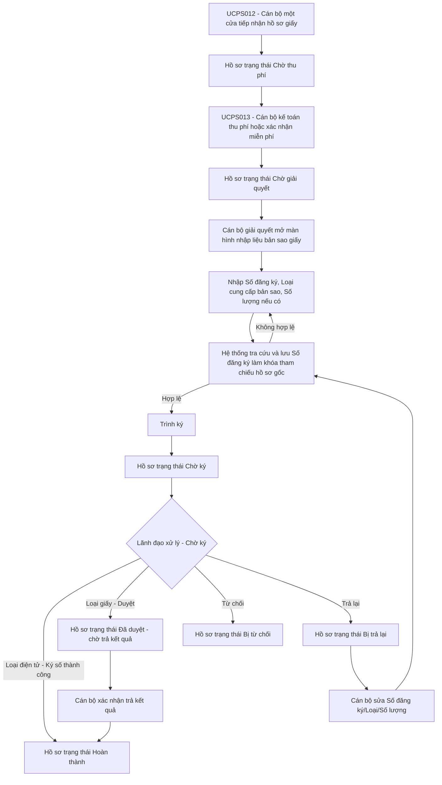

# UC-BS-GIAY - Nhập liệu hồ sơ giấy Yêu cầu cung cấp bản sao văn bản chứng nhận

## 1. Tổng quan

### 1.1. Mục đích

Tài liệu này đặc tả màn hình **Nhập liệu hồ sơ giấy Yêu cầu cung cấp bản sao văn bản chứng nhận đăng ký biện pháp bảo đảm** trên Website quản trị.

Chức năng cho phép Cán bộ giải quyết hồ sơ nhập Số đăng ký, Loại cung cấp bản sao và Số lượng bản sao (nếu là "Bản sao giấy") theo hồ sơ giấy đã được tiếp nhận và thu phí/miễn phí, hệ thống tự động tra cứu (kiểm tra tồn tại và hiệu lực) và lưu Số đăng ký làm khóa tham chiếu tới hồ sơ gốc, sau đó trình hồ sơ tới Lãnh đạo. Khác với luồng Online, hồ sơ giấy **luôn chuyển thẳng sang trạng thái "Chờ ký"** sau khi trình, không phân biệt theo Loại cung cấp bản sao (vì phí đã thu tại quầy, không cần qua "Chờ duyệt"/"Chờ thanh toán" như luồng Online); tại "Chờ ký", Lãnh đạo **Ký số** nếu Loại là "Bản sao điện tử", hoặc **Ký duyệt** (vẫn là một hành động ký, nhưng không ký số trên PDF, không dùng USB Token) nếu Loại là "Bản sao giấy".

Khác với hồ sơ trực tuyến do Khách hàng tự gửi, hồ sơ giấy do Cán bộ nhập liệu thay người yêu cầu nên cần cho phép Cán bộ chỉnh sửa Số đăng ký/Loại cung cấp bản sao/Số lượng bản sao khi hồ sơ đang ở trạng thái "Chờ giải quyết" hoặc bị Lãnh đạo trả lại ở trạng thái "Bị trả lại".

### 1.2. Phạm vi

Phạm vi bắt đầu khi hồ sơ giấy loại "Yêu cầu cung cấp bản sao" đã hoàn tất thu phí/miễn phí tại [UCPS013 - Quản lý thu phí/hoàn phí hồ sơ giấy](UCPS013_Quan_ly_thu_phi_ho_so_giay_Can_bo_ke_toan.md) và chuyển sang trạng thái "Chờ giải quyết".

Phạm vi kết thúc khi Cán bộ giải quyết trình thành công hồ sơ giấy Yêu cầu cung cấp bản sao tới Lãnh đạo, hồ sơ chuyển sang trạng thái "Chờ ký" (áp dụng chung cho cả Loại "Bản sao điện tử" và "Bản sao giấy") tại [SRS_Ky_duyet_Yeu_cau_cung_cap_ban_sao_Lanh_dao](SRS_Ky_duyet_Yeu_cau_cung_cap_ban_sao_Lanh_dao.md).

Không thuộc phạm vi tài liệu này:

\- Tiếp nhận hồ sơ giấy: xem [UCPS012](UCPS012_Tiep_nhan_ho_so_giay_Can_bo_tiep_nhan.md).

\- Thu phí/miễn phí hồ sơ giấy: xem [UCPS013](UCPS013_Quan_ly_thu_phi_ho_so_giay_Can_bo_ke_toan.md).

\- Duyệt/Ký số/Từ chối/Trả lại bằng USB Token của Lãnh đạo: xem [SRS_Ky_duyet_Yeu_cau_cung_cap_ban_sao_Lanh_dao](SRS_Ky_duyet_Yeu_cau_cung_cap_ban_sao_Lanh_dao.md).

\- Luồng hồ sơ trực tuyến do Khách hàng gửi từ Website/Mobile: xem [SRS_Xu_ly_Yeu_cau_cung_cap_ban_sao_Can_bo](SRS_Xu_ly_Yeu_cau_cung_cap_ban_sao_Can_bo.md).

\- Cấu trúc hiển thị chi tiết hồ sơ gốc: xem [4.1.12.6. Màn hình Chi tiết kết quả tra cứu](../../01_Website_Khach_hang/UC190_to_UC192_Tra_cuu_ho_so_theo_ma_so_su_dung_CSDL.md#41126-man-hinh-chi-tiet-ket-qua-tra-cuu-dung-chung-sau-khi-bam-tim-kiem).

### 1.3. Đối tượng sử dụng

| Vai trò | Quyền sử dụng |
| :--- | :--- |
| Cán bộ giải quyết hồ sơ | Xem hồ sơ giấy, nhập/cập nhật Số đăng ký, Loại cung cấp bản sao, Số lượng bản sao, trình Lãnh đạo, trình lại hồ sơ bị trả lại, từ chối hồ sơ giấy trước khi trình. |
| Lãnh đạo | Xem hồ sơ giấy ở trạng thái "Chờ ký"; Ký số nếu Loại là "Bản sao điện tử", Ký duyệt (không ký số) nếu Loại là "Bản sao giấy"; từ chối hoặc trả lại hồ sơ giấy theo quyền. |
| Cán bộ tiếp nhận | Chỉ xem thông tin tiếp nhận nếu được phân quyền, không nhập dữ liệu nghiệp vụ bản sao. |
| Cán bộ kế toán | Chỉ xem thông tin thu phí nếu được phân quyền, không nhập dữ liệu nghiệp vụ bản sao. |

## 2. Nguyên tắc phân biệt luồng Online và hồ sơ giấy

| Tiêu chí phân biệt | Hồ sơ Online | Hồ sơ giấy |
| :--- | :--- | :--- |
| Nguồn tiếp nhận | "Website Khách hàng" hoặc "Mobile Khách hàng" | "Cán bộ nhập liệu" |
| Chủ thể nhập dữ liệu nghiệp vụ | Khách hàng tự nhập | Cán bộ giải quyết nhập theo hồ sơ giấy |
| Mã hồ sơ giấy/Số đơn giấy | Không có | Có, sinh/ghi nhận tại UCPS012 |
| Thu phí | Sau khi Lãnh đạo duyệt, tại "Chờ thanh toán" | Thu phí/miễn phí trước khi nhập liệu chi tiết tại UCPS013 |
| Trạng thái bắt đầu xử lý bản sao | "Chờ tiếp nhận" | "Chờ giải quyết" |
| Quyền sửa Số đăng ký/Loại cung cấp bản sao/Số lượng của Cán bộ | Không được sửa theo [BR-BS-001] | Được sửa khi hồ sơ ở trạng thái "Chờ giải quyết" hoặc "Bị trả lại" theo [BR-BS-008]/[BR-BS-009] |
| Trình ký | Cán bộ trình duyệt, hồ sơ chuyển "Chờ duyệt" (áp dụng cả 2 loại bản sao) | Cán bộ trình, hồ sơ chuyển thẳng "Chờ ký" (áp dụng cả 2 loại bản sao) theo [BR-BS-008], không qua "Chờ duyệt"/"Chờ thanh toán" vì phí đã thu tại quầy |
| Lãnh đạo xử lý tại trạng thái cuối | Chờ ký: Ký số nếu Loại điện tử theo [BR-BS-006]; Ký duyệt (không ký số) nếu Loại giấy theo [BR-BS-013], chuyển thẳng "Đã duyệt - chờ trả kết quả" (giống hồ sơ giấy — hồ sơ Online Loại "Bản sao giấy" không còn bỏ qua "Chờ ký") | Chờ ký: Ký số nếu Loại điện tử theo [BR-BS-006]; Ký duyệt (không ký số) nếu Loại giấy theo [BR-BS-013], chuyển thẳng "Đã duyệt - chờ trả kết quả" |
| Lãnh đạo trả lại | Không áp dụng trong luồng Online | Áp dụng khi hồ sơ giấy ở trạng thái "Chờ ký"; hồ sơ chuyển "Bị trả lại" để Cán bộ sửa và trình lại |

Khuyến nghị nghiệp vụ:

\- Dùng trường `Nguồn tiếp nhận` kết hợp với `Mã hồ sơ giấy/Số đơn giấy` để phân biệt tuyệt đối hồ sơ Online và hồ sơ giấy.

\- Việc tra cứu và xác định khóa tham chiếu (Số đăng ký) hồ sơ gốc do Cán bộ giải quyết thực hiện thay Khách hàng tại `UC-BS-GIAY.MH01`. Mọi màn hình hiển thị chi tiết hồ sơ gốc (bao gồm cả các bước xử lý sau) đều truy vấn trực tiếp (join) theo Số đăng ký tại thời điểm xem, không lưu bản sao dữ liệu tĩnh, theo [BR-BS-011].

\- Mọi lần sửa Số đăng ký/Loại cung cấp bản sao/Số lượng bản sao của hồ sơ giấy phải tạo phiên bản xử lý mới, lưu người sửa, thời điểm sửa, lý do sửa nếu hồ sơ đang ở trạng thái "Bị trả lại", dữ liệu trước/sau và lịch sử xử lý.

## 3. Sơ đồ nghiệp vụ

## 4. Danh sách màn hình

| Mã màn hình | Tên màn hình | Mục đích |
| :--- | :--- | :--- |
| UC-BS-GIAY.MH01 | Nhập liệu hồ sơ giấy Yêu cầu cung cấp bản sao | Nhập/cập nhật Số đăng ký, Loại cung cấp bản sao, Số lượng bản sao và trình Lãnh đạo. |
| UC-BS-GIAY.MH02 | Popup Trình ký hồ sơ giấy Yêu cầu cung cấp bản sao | Chọn Lãnh đạo duyệt/ký và xác nhận trình. |
| UC-BS-GIAY.MH03 | Popup Từ chối xử lý hồ sơ giấy | Cán bộ nhập lý do từ chối khi hồ sơ giấy không đủ điều kiện xử lý. |

## 5. UC-BS-GIAY.MH01 - Nhập liệu hồ sơ giấy Yêu cầu cung cấp bản sao

### 5.1. Màn hình

Khi mở màn hình (cả chế độ nhập mới và chế độ sửa sau trả lại), hệ thống tự động focus/highlight vào Khối III "Thông tin yêu cầu cung cấp bản sao", vì đây là khối duy nhất Cán bộ trực tiếp nhập/sửa dữ liệu; Khối I và Khối II chỉ hiển thị thông tin chỉ đọc, Khối IV chỉ hiển thị sau khi tra cứu thành công.

### 5.2. Mô tả thông tin trên màn hình

| Trường thông tin | Kiểu dữ liệu | Bắt buộc | Mặc định | Mô tả |
| :--- | :--- | :---: | :--- | :--- |
| **I. Thông tin tiếp nhận và thu phí** | | | | |
| Khối Thông tin tiếp nhận và thu phí | Text(1000) | Có | Thu gọn | Mặc định thu gọn, cho phép mở rộng. Toàn bộ dữ liệu chỉ đọc. |
| Mã hồ sơ | String(50) | Có | Theo UCPS012 | Chỉ đọc. |
| Số đơn giấy | String(50) | Có | Theo UCPS012 | Chỉ đọc. |
| Nguồn tiếp nhận | Enum(String(50)) | Có | "Cán bộ nhập liệu" | Chỉ đọc. |
| Kênh tiếp nhận | Enum(String(50)) | Có | Theo UCPS012 | Chỉ đọc. Gồm "Trực tiếp tại quầy", "Bưu điện", "Fax", "Email". |
| Thời điểm tiếp nhận | Datetime | Có | Theo UCPS012 | Chỉ đọc. |
| Đơn vị tiếp nhận | String(255) | Có | Theo UCPS012 | Chỉ đọc. Dùng làm Cơ quan tiếp nhận xử lý hồ sơ bản sao. |
| Cán bộ tiếp nhận | String(255) | Có | Theo UCPS012 | Chỉ đọc. |
| Người yêu cầu | String(255) | Có | Theo UCPS012 | Chỉ đọc trong khối tiếp nhận; kế thừa sang hồ sơ bản sao. |
| Người nộp hồ sơ | String(255) | Không | Theo UCPS012 | Chỉ đọc. |
| Loại yêu cầu | Enum(String(50)) | Có | "Yêu cầu cung cấp bản sao" | Chỉ đọc. Không cho phép đổi sau khi đã thu phí/miễn phí. |
| Mã khoản phải thu | String(50) | Có | Theo UCPS013 | Chỉ đọc. |
| Trạng thái lệ phí | Enum(String(50)) | Có | Theo UCPS013 | Chỉ đọc. Chỉ cho phép xử lý khi giá trị là "Đã thu" hoặc "Miễn phí". |
| Số tiền đã thu | Decimal(18,0) | Có | Theo UCPS013 | Chỉ đọc. |
| Số biên lai/chứng từ | String(50) | Không | Theo UCPS013 | Chỉ đọc. |
| Tài liệu tiếp nhận | File | Không | Theo UCPS012 | Chỉ đọc. Cho phép xem file tại một tab riêng hoặc tải xuống theo quyền. |
| **II. Thông tin trả lại** | | | | |
| Khối Thông tin trả lại | Text(1000) | Không | Ẩn | Chỉ hiển thị khối này khi hồ sơ đang ở trạng thái "Bị trả lại". |
| Lý do trả lại gần nhất | Text(2000) | Có | Theo hồ sơ | Chỉ đọc. |
| Lãnh đạo trả lại | String(255) | Có | Theo hồ sơ | Chỉ đọc. |
| Thời điểm trả lại | Datetime | Có | Theo hồ sơ | Chỉ đọc. |
| **III. Thông tin yêu cầu cung cấp bản sao** | | | | |
| Số đăng ký | String(50) | Có | Trống hoặc theo phiên bản trước | Cán bộ nhập Số đăng ký của hồ sơ gốc theo hồ sơ giấy. Được sửa khi hồ sơ ở trạng thái "Chờ giải quyết" hoặc "Bị trả lại". Tự động trim space theo [BR-VAL-001]. |
| Loại cung cấp bản sao | Enum(String(50)) | Có | "Bản sao giấy" | - Bản sao điện tử - Bản sao giấy Khi chọn "Bản sao điện tử", hệ thống ẩn trường "Số lượng bản sao". |
| Số lượng bản sao | Integer(10) | Có điều kiện | Trống hoặc theo phiên bản trước | Chỉ hiển thị và bắt buộc khi Loại cung cấp bản sao là "Bản sao giấy". Số nguyên dương, tối đa 100 theo cùng quy tắc tại [UC149.MH01](../../01_Website_Khach_hang/SRS_YC_cung_cap_ban_sao_van_ban_chung_nhan.md#41162-uc149mh01---man-hinh-yeu-cau-cap-ban-sao-van-ban-chung-nhan-dang-ky-bien-phap-bao-dam). |
| Cơ quan tiếp nhận | Enum(String(100)) | Có | Theo Đơn vị tiếp nhận tại Khối I | Tham chiếu [DM_08]. Cán bộ được sửa nếu hồ sơ giấy thể hiện khác đơn vị tiếp nhận gốc; đối chiếu theo [BR-DK-032]. |
| Phiên bản xử lý hiện tại | String(50) | Có | Theo hồ sơ | Chỉ đọc. Tăng mỗi lần Cán bộ trình lại sau khi bị trả lại. |
| **IV. Hồ sơ gốc (tham chiếu theo Số đăng ký)** | | | | |
| Khối hồ sơ gốc | Text(1000) | Không | Ẩn | Chỉ hiển thị sau khi hệ thống tra cứu Số đăng ký thành công. Hiển thị theo cấu trúc dùng chung tại [4.1.12.6. Màn hình Chi tiết kết quả tra cứu](../../01_Website_Khach_hang/UC190_to_UC192_Tra_cuu_ho_so_theo_ma_so_su_dung_CSDL.md#41126-man-hinh-chi-tiet-ket-qua-tra-cuu-dung-chung-sau-khi-bam-tim-kiem), bắt đầu từ tiêu đề **Đăng ký giao dịch bảo đảm / Hợp đồng - [Số đăng ký]**. Dữ liệu được truy vấn trực tiếp (join) theo Số đăng ký tại thời điểm hiển thị, không lưu bản sao dữ liệu tĩnh, theo [BR-BS-011]. Chỉ đọc. Nếu Cán bộ sửa lại Số đăng ký, khối này tự động truy vấn lại theo Số đăng ký mới. |

### 5.3. Chức năng trên màn hình

| STT | Tên chức năng | Định dạng | Mô tả |
| :--- | :--- | :--- | :--- |
| 1 | Tra cứu hồ sơ gốc | Nút | Điều kiện hiển thị: Hồ sơ ở trạng thái "Chờ giải quyết" hoặc "Bị trả lại". |
|  |  |  | TH1 (Bỏ trống Số đăng ký): Vi phạm [BR-VAL-001], hiển thị [MSG-ERR-VAL-001]. |
|  |  |  | TH2 (Số đăng ký không tồn tại): Vi phạm [BR-BS-012], hiển thị [MSG-ERR-BS-010], không lưu khóa tham chiếu. |
|  |  |  | TH3 (Hồ sơ gốc chưa có hiệu lực pháp lý): Vi phạm [BR-BS-012], hiển thị [MSG-ERR-BS-011], không lưu khóa tham chiếu. |
|  |  |  | TH Hợp lệ: Hệ thống lưu Số đăng ký làm khóa tham chiếu tới hồ sơ gốc, hiển thị **IV. Hồ sơ gốc (tham chiếu theo Số đăng ký)** bằng dữ liệu truy vấn trực tiếp. |
| 2 | Thay đổi Loại cung cấp bản sao | Radio/Segment | Khi chuyển sang "Bản sao điện tử", ẩn và xóa dữ liệu "Số lượng bản sao"; khi chuyển lại "Bản sao giấy", hiển thị lại trường này ở trạng thái trống, yêu cầu nhập lại. |
| 3 | Trình ký | Nút | Điều kiện hiển thị: Hồ sơ ở trạng thái "Chờ giải quyết" hoặc "Bị trả lại", đã tra cứu hồ sơ gốc thành công. |
|  |  |  | TH1 (Sai trạng thái): Vi phạm [BR-BS-008]/[BR-BS-009], hiển thị [MSG-ERR-DK-005], không cho phép trình. |
|  |  |  | TH2 (Chưa xác định khóa tham chiếu hồ sơ gốc, hoặc hồ sơ gốc không còn hiệu lực khi kiểm tra lại tại thời điểm trình): Vi phạm [BR-BS-002]/[BR-BS-011], hiển thị [MSG-ERR-BS-003]/[MSG-ERR-BS-009], không cho phép trình. |
|  |  |  | TH Hợp lệ: Mở **6. UC-BS-GIAY.MH02 - Popup Trình ký hồ sơ giấy Yêu cầu cung cấp bản sao**. |
| 4 | Từ chối | Nút | Điều kiện hiển thị: Hồ sơ ở trạng thái "Chờ giải quyết" hoặc "Bị trả lại". Mở **7. UC-BS-GIAY.MH03 - Popup Từ chối xử lý hồ sơ giấy**. |
| 5 | Quay lại | Nút | Quay về màn hình nguồn đã mở màn nhập liệu. Nếu có dữ liệu thay đổi chưa trình, yêu cầu xác nhận trước khi rời màn hình. |

## 6. UC-BS-GIAY.MH02 - Popup Trình ký hồ sơ giấy Yêu cầu cung cấp bản sao

### 6.1. Màn hình

### 6.2. Mô tả thông tin trên màn hình

| Trường thông tin | Kiểu dữ liệu | Bắt buộc | Mặc định | Mô tả |
| :--- | :--- | :---: | :--- | :--- |
| Mã hồ sơ | String(50) | Có | Theo hồ sơ | Chỉ đọc. |
| Số đơn giấy | String(50) | Có | Theo hồ sơ | Chỉ đọc. |
| Người yêu cầu | String(255) | Có | Theo hồ sơ | Chỉ đọc. |
| Số đăng ký | String(50) | Có | Theo dữ liệu nhập | Chỉ đọc. |
| Loại cung cấp bản sao | Enum(String(50)) | Có | Theo dữ liệu nhập | Chỉ đọc. Mọi Loại đều chuyển sang "Chờ ký" sau khi trình thành công; Loại quyết định hành động Lãnh đạo thực hiện tại "Chờ ký" (Ký số nếu điện tử, Duyệt nếu giấy). |
| Số lượng bản sao | Integer(10) | Tùy điều kiện | Theo dữ liệu nhập | Chỉ đọc. Chỉ hiển thị khi Loại cung cấp bản sao là "Bản sao giấy". |
| Lãnh đạo duyệt/ký | Enum(String(255)) | Có | Trống | \- Control UI: Combobox có ô tìm kiếm. - Bắt buộc chọn trước khi xác nhận trình. - Hiển thị thông tin Lãnh đạo được phép ký/duyệt của đơn vị tại Cấu hình thông tin về người ký. - Cho phép tìm kiếm gần đúng theo tên Lãnh đạo, chức danh hoặc đơn vị. - Chỉ hiển thị Lãnh đạo còn hiệu lực thuộc phạm vi xử lý hồ sơ giấy bản sao của đơn vị. - Đối với Loại "Bản sao điện tử", đây là Lãnh đạo ký số file bản sao điện tử tại "Chờ ký". - Đối với Loại "Bản sao giấy", đây là Lãnh đạo duyệt (không ký số) tại "Chờ ký" trước bước trả kết quả giấy. |
| Ghi chú trình | Text(1000) | Không | Trống | Ghi chú nội bộ nếu cần. |

### 6.3. Chức năng trên màn hình

| STT | Tên chức năng | Định dạng | Mô tả |
| :--- | :--- | :--- | :--- |
| 1 | Hủy | Nút | Đóng popup, giữ nguyên trạng thái hồ sơ, quay lại **5. UC-BS-GIAY.MH01 - Nhập liệu hồ sơ giấy Yêu cầu cung cấp bản sao**. |
| 2 | Xác nhận trình | Nút | TH1 (Chưa chọn Lãnh đạo duyệt/ký hoặc Lãnh đạo đã chọn không còn hiệu lực/không có thẩm quyền tại thời điểm xác nhận): Vi phạm [BR-VAL-001], hiển thị [MSG-ERR-VAL-001], không cho phép trình. |
|  |  |  | TH2 (Hồ sơ không còn ở trạng thái "Chờ giải quyết"/"Bị trả lại"): Vi phạm [BR-BS-008]/[BR-BS-009], hiển thị [MSG-ERR-DK-005], không cho phép trình. |
|  |  |  | TH3 (Hồ sơ gốc không còn ở trạng thái "Hoàn thành" khi kiểm tra lại theo Số đăng ký): Vi phạm [BR-BS-011], hiển thị [MSG-ERR-BS-009], không cho phép trình. |
|  |  |  | TH Hợp lệ: Hệ thống khóa Số đăng ký/Loại cung cấp bản sao/Số lượng bản sao, ghi nhận Cán bộ trình, thời điểm trình, Lãnh đạo duyệt/ký đã chọn, tăng phiên bản xử lý nếu là hồ sơ "Bị trả lại", chuyển hồ sơ sang **"Chờ ký"** (áp dụng chung cho cả 2 Loại cung cấp bản sao) theo [BR-BS-008], chuyển hồ sơ đến đúng Lãnh đạo đã chọn và hiển thị [MSG-SUC-BS-002]. |

## 7. UC-BS-GIAY.MH03 - Popup Từ chối xử lý hồ sơ giấy

### 7.1. Màn hình

### 7.2. Mô tả thông tin trên màn hình

| Trường thông tin | Kiểu dữ liệu | Bắt buộc | Mặc định | Mô tả |
| :--- | :--- | :---: | :--- | :--- |
| Mã hồ sơ | String(50) | Có | Theo hồ sơ | Chỉ đọc. |
| Số đơn giấy | String(50) | Có | Theo hồ sơ | Chỉ đọc. |
| Người yêu cầu | String(255) | Có | Theo hồ sơ | Chỉ đọc. |
| Trạng thái hồ sơ | Enum(String(50)) | Có | Theo hồ sơ | Chỉ đọc. Chỉ cho phép từ chối khi trạng thái là "Chờ giải quyết" hoặc "Bị trả lại". |
| Lý do từ chối | Text(2000) | Có | Trống | Cán bộ bắt buộc nhập lý do từ chối. Tự động trim space theo [BR-VAL-001]. |

### 7.3. Chức năng trên màn hình

| STT | Tên chức năng | Định dạng | Mô tả |
| :--- | :--- | :--- | :--- |
| 1 | Hủy | Nút | Đóng popup, giữ nguyên trạng thái hồ sơ. |
| 2 | Xác nhận từ chối | Nút | TH1 (Bỏ trống Lý do từ chối): Vi phạm [BR-VAL-001], hiển thị [MSG-ERR-VAL-001], không cho phép xác nhận. |
|  |  |  | TH2 (Hồ sơ không còn ở trạng thái "Chờ giải quyết"/"Bị trả lại"): Hiển thị [MSG-ERR-DK-005], không cho phép từ chối. |
|  |  |  | TH Hợp lệ: Hệ thống lưu người từ chối, thời điểm từ chối, lý do từ chối, dữ liệu nhập liệu nếu có, lịch sử xử lý và chuyển hồ sơ sang "Bị từ chối". |

## 8. Trạng thái và chuyển trạng thái

| Đối tượng | Trạng thái trước | Sự kiện | Điều kiện | Trạng thái sau | Hệ thống thực hiện |
| :--- | :--- | :--- | :--- | :--- | :--- |
| Hồ sơ giấy bản sao | "Chờ thu phí" | Kế toán xác nhận thu phí/miễn phí tại UCPS013 | Khoản phải thu chuyển "Đã thu" hoặc "Miễn phí" | "Chờ giải quyết" | Hồ sơ xuất hiện tại [SRS_Ho_so_cho_nhap_lieu](SRS_Ho_so_cho_nhap_lieu.md). |
| Hồ sơ giấy bản sao | "Chờ giải quyết" | Tra cứu hồ sơ gốc | Số đăng ký hợp lệ | "Chờ giải quyết" | Lưu Số đăng ký làm khóa tham chiếu hồ sơ gốc, chưa đổi trạng thái. |
| Hồ sơ giấy bản sao | "Chờ giải quyết"/"Bị trả lại" | Trình ký | Đã tra cứu hồ sơ gốc thành công và đã chọn Lãnh đạo duyệt/ký (áp dụng chung cho cả 2 Loại cung cấp bản sao) | "Chờ ký" | Khóa phiên bản xử lý, chuyển hồ sơ đến đúng Lãnh đạo đã chọn. |
| Hồ sơ giấy bản sao | "Chờ ký" | Lãnh đạo ký số thành công | USB Token/chứng thư số hợp lệ, Loại cung cấp bản sao là "Bản sao điện tử" | "Hoàn thành" | Lưu file bản sao điện tử đã ký và lịch sử xử lý. |
| Hồ sơ giấy bản sao | "Chờ ký" | Lãnh đạo ký duyệt (không ký số) | Có quyền, dữ liệu hợp lệ, Loại cung cấp bản sao là "Bản sao giấy" | "Đã duyệt - chờ trả kết quả" | Chuyển hồ sơ sang danh sách chờ Cán bộ xác nhận trả kết quả theo [BR-BS-013]. |
| Hồ sơ giấy bản sao | "Đã duyệt - chờ trả kết quả" | Cán bộ xác nhận trả kết quả | Đã in/sao và trả bản giấy cho Khách hàng | "Hoàn thành" | Thao tác "Xác nhận trả kết quả" dùng chung màn hình [UC-BS-CB.MH05](SRS_Xu_ly_Yeu_cau_cung_cap_ban_sao_Can_bo.md#432x6-uc-bs-cbmh05---man-hinh-danh-sach-va-xac-nhan-tra-ket-qua-ban-sao-giay); lưu người xác nhận, thời điểm trả kết quả và lịch sử xử lý. |
| Hồ sơ giấy bản sao | "Chờ ký" | Lãnh đạo từ chối | Có lý do từ chối hợp lệ | "Bị từ chối" | Lưu lý do từ chối và lịch sử xử lý. |
| Hồ sơ giấy bản sao | "Chờ ký" | Lãnh đạo trả lại | Có lý do trả lại hợp lệ | "Bị trả lại" | Lưu lý do trả lại, mở quyền sửa cho Cán bộ giải quyết. |
| Hồ sơ giấy bản sao | "Bị trả lại" | Cán bộ sửa và trình lại | Có Số đăng ký/Loại cung cấp bản sao mới hợp lệ | "Chờ ký" | Tăng phiên bản xử lý, khóa dữ liệu mới, chuyển lại Lãnh đạo. |
| Hồ sơ giấy bản sao | "Chờ giải quyết"/"Bị trả lại" | Cán bộ từ chối | Có lý do từ chối hợp lệ | "Bị từ chối" | Lưu lý do và lịch sử xử lý. |

## 9. Ánh xạ Business Rule và MessageList

| Tình huống | Business Rule | MessageList | Ghi chú |
| :--- | :--- | :--- | :--- |
| Phân biệt hồ sơ Online và giấy | [BR-BS-001], [BR-BS-008] | Không áp dụng | Dựa trên `Nguồn tiếp nhận`, `Mã hồ sơ giấy/Số đơn giấy`. |
| Bỏ trống trường bắt buộc | [BR-VAL-001] | [MSG-ERR-VAL-001] | Inline tại trường lỗi đầu tiên. |
| Đối chiếu Cơ quan tiếp nhận | [BR-DK-032] | [MSG-CFM-DK-012] | Áp dụng khi Cơ quan tiếp nhận không khớp Số đăng ký. |
| Tra cứu và xác định khóa tham chiếu hồ sơ gốc | [BR-BS-012] | [MSG-ERR-BS-010], [MSG-ERR-BS-011] | Kiểm tra Số đăng ký tồn tại và hồ sơ gốc còn hiệu lực. Chỉ lưu Số đăng ký làm khóa tham chiếu; các màn hình sau truy vấn trực tiếp theo khóa này, không lưu bản sao dữ liệu tĩnh. |
| Kiểm tra lại hiệu lực hồ sơ gốc khi Trình ký | [BR-BS-002], [BR-BS-011] | [MSG-ERR-BS-003], [MSG-ERR-BS-009] | Áp dụng tại thời điểm Trình ký, đề phòng hồ sơ gốc bị Xóa đăng ký sau khi đã tra cứu ban đầu. |
| Trình ký hồ sơ giấy bản sao | [BR-BS-008] | [MSG-SUC-BS-002], [MSG-ERR-DK-005] | Luôn chuyển thẳng "Chờ ký", không phân biệt Loại cung cấp bản sao. |
| Ký duyệt hồ sơ giấy Loại "Bản sao giấy" tại Chờ ký | [BR-BS-013] | [MSG-SUC-BS-001] | Lãnh đạo Ký duyệt (không ký số) tại "Chờ ký", chuyển "Đã duyệt - chờ trả kết quả". Xem chi tiết tại [SRS_Ky_duyet_Yeu_cau_cung_cap_ban_sao_Lanh_dao](SRS_Ky_duyet_Yeu_cau_cung_cap_ban_sao_Lanh_dao.md). |
| Trả lại hồ sơ giấy bản sao | [BR-BS-009] | [MSG-SUC-BS-005], [MSG-ERR-DK-005] | Áp dụng tại "Chờ ký". |
| Từ chối hồ sơ giấy bản sao | [BR-BS-007] | [MSG-CFM-BS-001], [MSG-SUC-BS-004] | Cán bộ từ chối ở "Chờ giải quyết"/"Bị trả lại"; Lãnh đạo từ chối ở "Chờ ký". |

## 10. Yêu cầu nhật ký

Hệ thống ghi nhật ký đối với:

\- Mở hồ sơ giấy Yêu cầu cung cấp bản sao.

\- Nhập mới/cập nhật Số đăng ký, Loại cung cấp bản sao, Số lượng bản sao.

\- Tra cứu và xác định khóa tham chiếu hồ sơ gốc.

\- Trình và trình lại sau khi bị trả lại.

\- Từ chối của Cán bộ.

\- Trả lại của Lãnh đạo.

\- Ký duyệt/Ký số/Từ chối của Lãnh đạo.

Thông tin nhật ký tối thiểu gồm: Mã hồ sơ, Số đơn giấy, Nguồn tiếp nhận, người thao tác, vai trò, đơn vị, thời điểm, hành động, trạng thái trước, trạng thái sau, Số đăng ký, Loại cung cấp bản sao, phiên bản xử lý, lý do từ chối/trả lại nếu có.

## 11. Tiêu chí nghiệm thu

| Mã tiêu chí | Nội dung nghiệm thu |
| :--- | :--- |
| AC-BS-GIAY-001 | Hệ thống phân biệt được hồ sơ bản sao Online và hồ sơ bản sao giấy bằng `Nguồn tiếp nhận` và thông tin hồ sơ giấy. |
| AC-BS-GIAY-002 | Màn nhập liệu hồ sơ giấy bản sao chỉ được mở từ màn hình nguồn hợp lệ khi trạng thái là "Chờ giải quyết" hoặc "Bị trả lại" và lệ phí là "Đã thu" hoặc "Miễn phí". |
| AC-BS-GIAY-003 | Cán bộ được nhập/sửa Số đăng ký, Loại cung cấp bản sao, Số lượng bản sao đối với hồ sơ giấy ở trạng thái "Chờ giải quyết" hoặc "Bị trả lại". |
| AC-BS-GIAY-004 | Cán bộ không sửa được thông tin tiếp nhận và thông tin thu phí gốc trên màn nhập liệu. |
| AC-BS-GIAY-005 | Hệ thống tra cứu đúng hồ sơ gốc theo Số đăng ký Cán bộ nhập và lưu đúng khóa tham chiếu tại MH02; mọi lần hiển thị sau đó đều truy vấn trực tiếp theo khóa này. |
| AC-BS-GIAY-006 | Trình thành công luôn chuyển hồ sơ giấy sang "Chờ ký", không phân biệt Loại cung cấp bản sao. |
| AC-BS-GIAY-007 | Lãnh đạo trả lại hồ sơ giấy bản sao ở "Chờ ký" thì hồ sơ chuyển "Bị trả lại" và Cán bộ được sửa, trình lại. |
| AC-BS-GIAY-009 | Tại "Chờ ký", Lãnh đạo Ký số nếu Loại là "Bản sao điện tử" (chuyển "Hoàn thành"), hoặc Ký duyệt không ký số nếu Loại là "Bản sao giấy" (chuyển "Đã duyệt - chờ trả kết quả"). |
| AC-BS-GIAY-008 | Hồ sơ Online không áp dụng quyền sửa/trả lại như hồ sơ giấy trong tài liệu này. |

