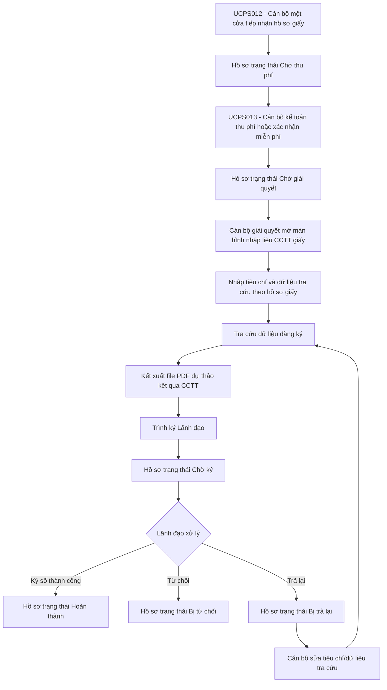

# UC-CCTT-GIAY - Nhập liệu hồ sơ giấy Yêu cầu cung cấp thông tin

## 1. Tổng quan

### 1.1. Mục đích

Tài liệu này đặc tả màn hình **Nhập liệu hồ sơ giấy Yêu cầu cung cấp thông tin** trên Website quản trị.

Chức năng cho phép Cán bộ giải quyết hồ sơ nhập tiêu chí yêu cầu cung cấp thông tin theo hồ sơ giấy đã được tiếp nhận và thu phí/miễn phí, thực hiện tra cứu, kết xuất file PDF kết quả cung cấp thông tin và trình Lãnh đạo ký số.

Khác với hồ sơ trực tuyến do Khách hàng tự gửi, hồ sơ giấy do Cán bộ nhập liệu thay người yêu cầu nên cần cho phép Cán bộ chỉnh sửa tiêu chí/dữ liệu tra cứu khi hồ sơ đang ở trạng thái "Chờ giải quyết" hoặc bị Lãnh đạo trả lại ở trạng thái "Bị trả lại".

### 1.2. Phạm vi

Phạm vi bắt đầu khi hồ sơ giấy loại "Yêu cầu cung cấp thông tin" đã hoàn tất thu phí/miễn phí tại [UCPS013 - Quản lý thu phí/hoàn phí hồ sơ giấy](Quan_ly_thu_phi_ho_so_giay_Can_bo_ke_toan.md) và chuyển sang trạng thái "Chờ giải quyết".

Phạm vi kết thúc khi Cán bộ giải quyết trình ký thành công hồ sơ giấy Yêu cầu cung cấp thông tin, hồ sơ chuyển sang trạng thái "Chờ ký" để Lãnh đạo ký số tại [SRS_Ky_duyet_Yeu_cau_cung_cap_thong_tin_Lanh_dao](SRS_Ky_duyet_Yeu_cau_cung_cap_thong_tin_Lanh_dao.md).

Không thuộc phạm vi tài liệu này:

\- Tiếp nhận hồ sơ giấy: xem [UCPS012](Tiep_nhan_ho_so_giay_Can_bo_tiep_nhan.md).

\- Thu phí/miễn phí hồ sơ giấy: xem [UCPS013](Quan_ly_thu_phi_ho_so_giay_Can_bo_ke_toan.md).

\- Ký số bằng USB Token của Lãnh đạo: xem [SRS_Ky_duyet_Yeu_cau_cung_cap_thong_tin_Lanh_dao](SRS_Ky_duyet_Yeu_cau_cung_cap_thong_tin_Lanh_dao.md).

\- Luồng hồ sơ trực tuyến do Khách hàng gửi từ Website/Mobile: xem [SRS_Xu_ly_Yeu_cau_cung_cap_thong_tin_Can_bo](SRS_Xu_ly_Yeu_cau_cung_cap_thong_tin_Can_bo.md).

### 1.3. Đối tượng sử dụng

| Vai trò | Quyền sử dụng |
| :--- | :--- |
| Cán bộ giải quyết hồ sơ | Xem hồ sơ giấy, nhập/cập nhật tiêu chí tra cứu, tra cứu, kết xuất PDF, xem trước PDF, trình ký, trình ký lại hồ sơ bị trả lại, từ chối hồ sơ giấy trước khi trình ký. |
| Lãnh đạo | Xem hồ sơ ở trạng thái "Chờ ký", ký số, từ chối hoặc trả lại hồ sơ giấy theo quyền. |
| Cán bộ tiếp nhận | Chỉ xem thông tin tiếp nhận nếu được phân quyền, không nhập dữ liệu nghiệp vụ CCTT. |
| Cán bộ kế toán | Chỉ xem thông tin thu phí nếu được phân quyền, không nhập dữ liệu nghiệp vụ CCTT. |

## 2. Nguyên tắc phân biệt luồng Online và hồ sơ giấy

| Tiêu chí phân biệt | Hồ sơ Online | Hồ sơ giấy |
| :--- | :--- | :--- |
| Nguồn tiếp nhận | "Website Khách hàng" hoặc "Mobile Khách hàng" | "Cán bộ nhập liệu" |
| Chủ thể nhập dữ liệu nghiệp vụ | Khách hàng tự nhập | Cán bộ giải quyết nhập theo hồ sơ giấy |
| Mã hồ sơ giấy/Số đơn giấy | Không có | Có, sinh/ghi nhận tại UCPS012 |
| Thu phí | Sau khi Lãnh đạo duyệt, chỉ thu khi tra cứu có kết quả và thuộc diện phải thu phí | Thu phí/miễn phí trước khi nhập liệu chi tiết tại UCPS013 theo luồng hồ sơ giấy |
| Trạng thái bắt đầu xử lý CCTT | "Chờ tiếp nhận" | "Chờ giải quyết" |
| Quyền sửa tiêu chí/dữ liệu tra cứu của Cán bộ | Không được sửa theo [BR-CCTT-001] | Được sửa khi hồ sơ ở trạng thái "Chờ giải quyết" hoặc "Bị trả lại" theo [BR-CCTT-008] và [BR-CCTT-009] |
| Trình Lãnh đạo | Cán bộ trình duyệt, hồ sơ chuyển "Chờ duyệt" | Cán bộ trình ký, hồ sơ chuyển "Chờ ký" |
| Lãnh đạo trả lại | Không áp dụng trong luồng Online hiện tại | Áp dụng khi hồ sơ giấy ở trạng thái "Chờ ký"; hồ sơ chuyển "Bị trả lại" để Cán bộ sửa và trình ký lại |

Khuyến nghị nghiệp vụ:

\- Dùng trường `Nguồn tiếp nhận` kết hợp với `Mã hồ sơ giấy/Số đơn giấy` để phân biệt tuyệt đối hồ sơ Online và hồ sơ giấy.

\- Hồ sơ Online không cho Cán bộ sửa tiêu chí/dữ liệu tra cứu vì dữ liệu là ý chí Khách hàng đã gửi.

\- Hồ sơ giấy cho Cán bộ sửa trong phạm vi hồ sơ chưa hoàn thành vì Cán bộ có thể nhập sai so với hồ sơ giấy.

\- Mọi lần sửa dữ liệu tra cứu của hồ sơ giấy phải tạo phiên bản xử lý mới, lưu người sửa, thời điểm sửa, lý do sửa nếu hồ sơ đang ở trạng thái "Bị trả lại", dữ liệu trước/sau và lịch sử xử lý.

## 3. Sơ đồ nghiệp vụ

## 4. Danh sách màn hình

| Mã màn hình | Tên màn hình | Mục đích |
| :--- | :--- | :--- |
| UC-CCTT-GIAY.MH01 | Nhập liệu hồ sơ giấy Yêu cầu cung cấp thông tin | Nhập/cập nhật tiêu chí tra cứu, tra cứu, kết xuất PDF và trình ký. |
| UC-CCTT-GIAY.MH02 | Popup Trình ký hồ sơ giấy Yêu cầu cung cấp thông tin | Chọn Lãnh đạo ký và xác nhận trình ký. |
| UC-CCTT-GIAY.MH03 | Xem trước file PDF dự thảo | Xem/tải file PDF dự thảo trước khi trình ký hoặc trình ký lại. |
| UC-CCTT-GIAY.MH04 | Popup Từ chối xử lý hồ sơ giấy | Cán bộ nhập lý do từ chối khi hồ sơ giấy không đủ điều kiện xử lý. |

## 5. UC-CCTT-GIAY.MH01 - Nhập liệu hồ sơ giấy Yêu cầu cung cấp thông tin

### 5.1. Màn hình

### 5.2. Mô tả thông tin trên màn hình

| Trường thông tin | Kiểu dữ liệu | Bắt buộc | Mặc định | Mô tả |
| :--- | :--- | :---: | :--- | :--- |
| **I. Thông tin tiếp nhận và thu phí** | | | | |
| Khối Thông tin tiếp nhận và thu phí | Text(1000) | Có | Thu gọn | Đặt phía trên màn hình, mặc định thu gọn, cho phép mở rộng. Toàn bộ dữ liệu chỉ đọc, không cho phép chỉnh sửa. |
| Mã hồ sơ | String(50) | Có | Theo UCPS012 | Chỉ đọc. |
| Số đơn giấy | String(50) | Có | Theo UCPS012 | Chỉ đọc. |
| Nguồn tiếp nhận | Enum(String(50)) | Có | "Cán bộ nhập liệu" | Chỉ đọc. Giá trị dùng để phân biệt với hồ sơ Online. |
| Kênh tiếp nhận | Enum(String(50)) | Có | Theo UCPS012 | Chỉ đọc. Giá trị gồm "Trực tiếp tại quầy", "Bưu điện", "Fax", "Email". |
| Thời điểm tiếp nhận | Datetime | Có | Theo UCPS012 | Chỉ đọc. |
| Đơn vị tiếp nhận | String(255) | Có | Theo UCPS012 | Chỉ đọc. Được dùng làm cơ quan xử lý hồ sơ giấy CCTT. |
| Cán bộ tiếp nhận | String(255) | Có | Theo UCPS012 | Chỉ đọc. |
| Người yêu cầu | String(255) | Có | Theo UCPS012 | Chỉ đọc trong khối tiếp nhận; được kế thừa sang hồ sơ CCTT nếu đúng ý nghĩa nghiệp vụ. |
| Địa chỉ người yêu cầu | Text(500) | Không | Theo UCPS012 | Chỉ đọc. |
| Người nộp hồ sơ | String(255) | Không | Theo UCPS012 | Chỉ đọc. |
| Loại yêu cầu | Enum(String(50)) | Có | "Yêu cầu cung cấp thông tin" | Chỉ đọc. Không cho phép đổi Loại yêu cầu sau khi đã thu phí/miễn phí. |
| Mã khoản phải thu | String(50) | Có | Theo UCPS013 | Chỉ đọc. |
| Trạng thái lệ phí | Enum(String(50)) | Có | Theo UCPS013 | Chỉ đọc. Chỉ cho phép xử lý khi giá trị là "Đã thu" hoặc "Miễn phí". |
| Số tiền đã thu | Decimal(18,0) | Có | Theo UCPS013 | Chỉ đọc. |
| Số biên lai/chứng từ | String(50) | Không | Theo UCPS013 | Chỉ đọc. |
| Tài liệu tiếp nhận | File | Không | Theo UCPS012 | Chỉ đọc. Cho phép xem file tại một tab riêng hoặc tải xuống theo quyền. |
| **II. Thông tin trả lại** | | | | |
| Trạng thái hồ sơ | Enum(String(50)) | Có | Theo hồ sơ | Chỉ đọc. Hiển thị "Chờ giải quyết" hoặc "Bị trả lại". |
| Lý do trả lại gần nhất | Text(2000) | Có điều kiện | Theo hồ sơ | Chỉ hiển thị khi hồ sơ ở trạng thái "Bị trả lại". Chỉ đọc. |
| Lãnh đạo trả lại | String(255) | Có điều kiện | Theo hồ sơ | Chỉ hiển thị khi hồ sơ ở trạng thái "Bị trả lại". Chỉ đọc. |
| Thời điểm trả lại | Datetime | Có điều kiện | Theo hồ sơ | Chỉ hiển thị khi hồ sơ ở trạng thái "Bị trả lại". Chỉ đọc. |
| Phiên bản xử lý hiện tại | String(50) | Có | Theo hồ sơ | Chỉ đọc. Mỗi lần Cán bộ trình ký lại sau khi bị trả lại, hệ thống tăng phiên bản xử lý. |
| **III. Thông tin yêu cầu cung cấp thông tin** | | | | |
| Người yêu cầu cung cấp thông tin | String(255) | Có | Theo UCPS012 | Cán bộ được sửa nếu thông tin trên hồ sơ giấy khác dữ liệu tiếp nhận. Không sửa ngược lại dữ liệu tiếp nhận gốc tại UCPS012. |
| Địa chỉ liên hệ | Text(500) | Có | Theo UCPS012 | Cán bộ được sửa theo hồ sơ giấy. Gồm Địa chỉ chi tiết, Phường/Xã, Tỉnh/Thành phố, Quốc gia nếu hồ sơ giấy có thông tin. |
| Phương thức nhận kết quả | Enum(String(50)) | Có | Theo UCPS012 | Cán bộ được sửa nếu hồ sơ giấy thể hiện khác thông tin tiếp nhận. |
| Email nhận kết quả | String(255) | Có điều kiện | Theo UCPS012 | Chỉ bắt buộc khi Phương thức nhận kết quả là "Cách thức điện tử" và hồ sơ chưa có email hợp lệ. Nếu nhập, kiểm tra [BR-VAL-002]. |
| **IV. Tiêu chí và dữ liệu tra cứu** | | | | |
| Tiêu chí yêu cầu cung cấp thông tin | Enum(String(50)) | Có | Trống hoặc theo phiên bản trước | Cán bộ chọn theo hồ sơ giấy. Giá trị gồm: + "Số đăng ký" + "Bên bảo đảm" + "Số khung" |
| Số đăng ký | String(50) | Có điều kiện | Trống hoặc theo phiên bản trước | Chỉ hiển thị và bắt buộc khi Tiêu chí yêu cầu cung cấp thông tin là "Số đăng ký". Cán bộ được nhập/sửa khi hồ sơ ở trạng thái "Chờ giải quyết" hoặc "Bị trả lại". |
| Loại chủ thể | Enum(String(50)) | Có điều kiện | Trống hoặc theo phiên bản trước | Chỉ hiển thị và bắt buộc khi Tiêu chí yêu cầu cung cấp thông tin là "Bên bảo đảm". Tham chiếu Danh mục Loại bên bảo đảm (Chủ thể) [DM_06]. |
| Số CMND/Căn cước công dân/Chứng minh quân đội | String(12) | Có điều kiện | Trống hoặc theo phiên bản trước | Chỉ hiển thị khi Tiêu chí là "Bên bảo đảm" và Loại chủ thể là "Công dân Việt Nam". |
| Mã số thuế/Số đăng ký kinh doanh | String(14) | Có điều kiện | Trống hoặc theo phiên bản trước | Chỉ hiển thị khi Tiêu chí là "Bên bảo đảm" và Loại chủ thể là "Tổ chức có đăng ký kinh doanh trong nước". |
| Họ và tên | String(255) | Có điều kiện | Trống hoặc theo phiên bản trước | Chỉ hiển thị khi Tiêu chí là "Bên bảo đảm" và Loại chủ thể là: + "Người nước ngoài" + "Người không quốc tịch cư trú tại Việt Nam" |
| Số Hộ chiếu | String(50) | Có điều kiện | Trống hoặc theo phiên bản trước | Chỉ hiển thị khi Tiêu chí là "Bên bảo đảm" và Loại chủ thể là "Người nước ngoài". |
| Mã số thuế/Số giấy phép đầu tư | String(50) | Có điều kiện | Trống hoặc theo phiên bản trước | Chỉ hiển thị khi Tiêu chí là "Bên bảo đảm" và Loại chủ thể là "Tổ chức nước ngoài". |
| Tên tổ chức | String(255) | Có điều kiện | Trống hoặc theo phiên bản trước | Chỉ hiển thị khi Tiêu chí là "Bên bảo đảm" và Loại chủ thể là "Tổ chức khác". |
| Số thẻ cư trú | String(50) | Có điều kiện | Trống hoặc theo phiên bản trước | Chỉ hiển thị khi Tiêu chí là "Bên bảo đảm" và Loại chủ thể là "Người không quốc tịch cư trú tại Việt Nam". |
| Số khung | String(50) | Có điều kiện | Trống hoặc theo phiên bản trước | Chỉ hiển thị và bắt buộc khi Tiêu chí yêu cầu cung cấp thông tin là "Số khung". |
| Ghi chú nhập liệu | Text(1000) | Không | Trống | Cán bộ nhập ghi chú nội bộ nếu cần; không hiển thị trên file PDF kết quả cung cấp thông tin. |
| **V. Tệp kết xuất kết quả cung cấp thông tin** | | | | |
| Khối Tệp kết xuất kết quả cung cấp thông tin | Text(1000) | Không | Ẩn | Chỉ hiển thị khi có file PDF dự thảo hợp lệ đã được sinh từ phiên tra cứu thành công gần nhất hoặc hồ sơ "Bị trả lại" đã có file PDF dự thảo của phiên xử lý trước để Cán bộ đối chiếu. - Khi Cán bộ chưa thực hiện tra cứu thành công: Không hiển thị khối này. - Khi Cán bộ đã tra cứu thành công nhưng chưa bấm "Kết xuất kết quả": Không hiển thị khối này, chỉ hiển thị nút "Kết xuất kết quả" tại khu vực chức năng. - Khi Cán bộ bấm "Kết xuất kết quả" thành công: Hiển thị khối này ở phía trên **VI. Kết quả tra cứu**. - Nếu Cán bộ thay đổi tiêu chí/dữ liệu tra cứu sau khi đã kết xuất PDF: File PDF dự thảo hiện tại không còn hợp lệ để trình ký; hệ thống ẩn hoặc đánh dấu hết hiệu lực khối này cho đến khi Cán bộ tra cứu lại và kết xuất lại PDF. |
| File PDF dự thảo | File | Không | Theo kết xuất | Chỉ hiển thị trong khối **V. Tệp kết xuất kết quả cung cấp thông tin** khi hệ thống đã sinh file PDF dự thảo hợp lệ. File được sinh theo đúng mẫu `docs/Bieu mau/GCN_Mau Giay chung nhan CCTT.pdf`, gồm lá mặt/trang ký Mẫu số 10d và phần kết quả/phụ lục phía sau trong cùng một file PDF. |
| Thời điểm kết xuất | Datetime | Không | Theo kết xuất | Chỉ đọc. Thời điểm hệ thống sinh file PDF dự thảo. |
| Phiên bản PDF | String(50) | Không | Theo kết xuất | Chỉ đọc. Phiên bản file PDF hiện tại. Khi trình ký thành công, phiên bản này được khóa để Lãnh đạo ký. |
| **VI. Kết quả tra cứu** | | | | - Trạng thái có dữ liệu: Hiển thị danh sách các bản ghi kết quả theo cấu trúc các cột quy định. - Trạng thái không có dữ liệu (Empty State): Khi không tìm thấy kết quả phù hợp với điều kiện tìm kiếm, bảng hiển thị duy nhất 01 dòng căn giữa trên toàn bộ chiều rộng bảng (`colspan`), in nghiêng với nội dung theo MessageList dùng chung [MSG-INF-SYS-001]. |
| Khối Kết quả tra cứu | Text(4000) | Không | Ẩn | Chỉ hiển thị sau khi Cán bộ bấm "Tra cứu" và hệ thống xử lý xong phiên tra cứu. - Trường hợp tra cứu hợp lệ và có dữ liệu: Hiển thị Trạng thái tra cứu, Thời điểm tra cứu, Tiêu chí tra cứu thực tế, Dữ liệu đầu vào tra cứu, Số lượng hồ sơ tra cứu được và Bảng danh sách kết quả tra cứu. - Trường hợp tra cứu hợp lệ nhưng không có dữ liệu: Hiển thị Trạng thái tra cứu, Thời điểm tra cứu, Tiêu chí tra cứu thực tế, Dữ liệu đầu vào tra cứu và Thông báo kết quả dạng Inline theo [MSG-WRN-CCTT-001]. Không hiển thị Bảng danh sách kết quả tra cứu. - Trường hợp dịch vụ tra cứu lỗi: Hiển thị Trạng thái tra cứu là "Lỗi dịch vụ" và thông báo lỗi Inline; không cho phép kết xuất PDF cho đến khi có phiên tra cứu xử lý thành công. |
| Trạng thái tra cứu | Enum(String(50)) | Không | "Chưa tra cứu" | Chỉ đọc. Giá trị gồm: + "Chưa tra cứu" + "Đang tra cứu" + "Có kết quả" + "Không có kết quả" + "Lỗi dịch vụ" |
| Thời điểm tra cứu | Datetime | Không | Theo lần tra cứu | Chỉ đọc. |
| Tiêu chí tra cứu thực tế | Enum(String(50)) | Không | Theo lần tra cứu | Chỉ đọc. Ghi nhận đúng tiêu chí dùng để gọi dịch vụ tra cứu. |
| Dữ liệu đầu vào tra cứu | Text(1000) | Không | Theo lần tra cứu | Chỉ đọc. Ghi nhận đúng dữ liệu đầu vào dùng để gọi dịch vụ tra cứu. |
| Số lượng hồ sơ tra cứu được | Integer(10) | Không | Theo kết quả | Chỉ hiển thị khi phiên tra cứu xử lý thành công. Trường hợp có dữ liệu, hiển thị tổng số hồ sơ đăng ký còn hiệu lực tìm thấy tại thời điểm tra cứu. Trường hợp không có dữ liệu, hiển thị "0". |
| Thông báo kết quả | Text(1000) | Không | Theo kết quả | Nếu không có dữ liệu, hiển thị [MSG-WRN-CCTT-001] dạng Inline ngay trong khu vực kết quả tra cứu, không hiển thị Toast. |
| Bảng danh sách kết quả tra cứu | Text(4000) | Không | Theo kết quả | Chỉ hiển thị khi tra cứu có kết quả. Hiển thị giống hệt cấu trúc **VI. Kết quả cung cấp thông tin có xác nhận của cơ quan đăng ký** tại màn Xem chi tiết hồ sơ của Website Khách hàng trong tài liệu [SRS yêu cầu cung cấp thông tin.md](../../01_Website_Khach_hang/SRS%20y%C3%AAu%20c%E1%BA%A7u%20cung%20c%E1%BA%A5p%20th%C3%B4ng%20tin.md#vi-ket-qua-cung-cap-thong-tin-co-xac-nhan-cua-co-quan-dang-ky). - Trạng thái có dữ liệu: Hiển thị danh sách các bản ghi kết quả theo cấu trúc các cột quy định. - Trạng thái không có dữ liệu (Empty State): Khi không tìm thấy kết quả phù hợp với điều kiện tìm kiếm, bảng hiển thị duy nhất 01 dòng căn giữa trên toàn bộ chiều rộng bảng (`colspan`), in nghiêng với nội dung theo MessageList dùng chung [MSG-INF-SYS-001].|

### 5.3. Chức năng trên màn hình

| STT | Tên chức năng | Định dạng | Mô tả |
| :--- | :--- | :--- | :--- |
| 1 | Tra cứu | Nút | Điều kiện hiển thị: Hiển thị khi hồ sơ ở trạng thái "Chờ giải quyết" hoặc "Bị trả lại" và Cán bộ có quyền xử lý hồ sơ giấy CCTT. TH1 (Hồ sơ không ở trạng thái "Chờ giải quyết" hoặc "Bị trả lại"): Vi phạm [BR-CCTT-008]/[BR-CCTT-009], hiển thị [MSG-ERR-DK-005], không gọi dịch vụ tra cứu. - **TH Không có dữ liệu trả về**: + Bảng kết quả: Hiển thị duy nhất 01 dòng căn giữa trên toàn bộ chiều rộng bảng (`colspan`), in nghiêng với nội dung theo MessageList dùng chung [MSG-INF-SYS-001]. + Thanh phân trang (Pagination): Dòng số lượng hiển thị *"Hiển thị 0-0 của 0 yêu cầu"*; các nút điều hướng trang (&#124;&lt;&lt;, &lt;, các số trang, &gt;, &gt;&gt;&#124;) ở trạng thái ẩn hoặc khóa mờ (Disabled). + Nút "Kết xuất Excel" (nếu màn hình có nút này): Thiết lập ở trạng thái khóa mờ (Disabled) kèm tooltip: *"Không có dữ liệu để kết xuất Excel"*.|
|  |  |  | TH2 (Bỏ trống trường bắt buộc): Vi phạm [BR-VAL-001], hiển thị [MSG-ERR-VAL-001] tại trường lỗi đầu tiên, không gọi dịch vụ tra cứu. |
|  |  |  | TH3 (Dữ liệu định danh/tiêu chí không hợp lệ): Hệ thống kiểm tra theo cấu hình kiểm tra định danh CCTT và các Business Rule liên quan; hiển thị lỗi Inline tại trường tương ứng, không gọi dịch vụ tra cứu. |
|  |  |  | TH Hợp lệ: Hệ thống gọi dịch vụ tra cứu theo đúng tiêu chí/dữ liệu Cán bộ đã nhập, chỉ lấy hồ sơ đăng ký còn hiệu lực tại thời điểm tra cứu theo [BR-CCTT-002], ghi nhận phiên tra cứu và hiển thị **VI. Kết quả tra cứu**. - Nếu có dữ liệu: Hiển thị Trạng thái tra cứu = "Có kết quả", Thời điểm tra cứu, Tiêu chí tra cứu thực tế, Dữ liệu đầu vào tra cứu, Số lượng hồ sơ tra cứu được và Bảng danh sách kết quả tra cứu. - Nếu không có dữ liệu: Hiển thị Trạng thái tra cứu = "Không có kết quả", Thời điểm tra cứu, Tiêu chí tra cứu thực tế, Dữ liệu đầu vào tra cứu, Số lượng hồ sơ tra cứu được = 0 và thông báo [MSG-WRN-CCTT-001] dạng Inline. - Sau khi tra cứu hợp lệ, hiển thị nút "Kết xuất kết quả". |
| 2 | Kết xuất kết quả | Nút | TH1 (Chưa có phiên tra cứu xử lý thành công): Vi phạm [BR-CCTT-004], hiển thị [MSG-ERR-CCTT-005], không sinh file PDF. |
|  |  |  | TH Hợp lệ: Hệ thống sinh file PDF dự thảo theo đúng mẫu `docs/Bieu mau/GCN_Mau Giay chung nhan CCTT.pdf`, gắn file vào hồ sơ, hiển thị tại **V. Tệp kết xuất kết quả cung cấp thông tin** và hiển thị [MSG-SUC-CCTT-002]. |
| 3 | Xem file | Nút | Cho phép xem file PDF dự thảo tại một tab riêng. |
| 4 | Tải file | Nút | Cho phép tải file PDF dự thảo theo quyền của Cán bộ. |
| 5 | Trình ký | Nút | Điều kiện hiển thị: Chỉ hiển thị khi hồ sơ ở trạng thái "Chờ giải quyết" hoặc "Bị trả lại", có phiên tra cứu xử lý thành công và có file PDF dự thảo hợp lệ đang hiển thị tại **V. Tệp kết xuất kết quả cung cấp thông tin**. TH1 (Hồ sơ không ở trạng thái "Chờ giải quyết" hoặc "Bị trả lại"): Vi phạm [BR-CCTT-008]/[BR-CCTT-009], hiển thị [MSG-ERR-DK-005], không cho phép trình ký. |
|  |  |  | TH2 (Chưa có phiên tra cứu xử lý thành công hoặc chưa có file PDF dự thảo hợp lệ): Vi phạm [BR-CCTT-004], hiển thị [MSG-ERR-CCTT-005] hoặc [MSG-ERR-CCTT-009], không cho phép trình ký. |
|  |  |  | TH Hợp lệ: Mở **6. UC-CCTT-GIAY.MH02 - Popup Trình ký hồ sơ giấy Yêu cầu cung cấp thông tin**. |
| 6 | Từ chối | Nút | Điều kiện hiển thị: Hiển thị khi hồ sơ đang ở trạng thái "Chờ giải quyết" hoặc "Bị trả lại" và Cán bộ có quyền xử lý hồ sơ. Mở **8. UC-CCTT-GIAY.MH04 - Popup Từ chối xử lý hồ sơ giấy**. |
| 7 | Quay lại | Nút | Điều kiện hiển thị: Luôn hiển thị trên màn hình. Quay về màn hình nguồn đã mở màn nhập liệu. Nếu có dữ liệu thay đổi chưa trình ký, hệ thống yêu cầu xác nhận trước khi rời màn hình. |

## 6. UC-CCTT-GIAY.MH02 - Popup Trình ký hồ sơ giấy Yêu cầu cung cấp thông tin

### 6.1. Màn hình

### 6.2. Mô tả thông tin trên màn hình

| Trường thông tin | Kiểu dữ liệu | Bắt buộc | Mặc định | Mô tả |
| :--- | :--- | :---: | :--- | :--- |
| Mã hồ sơ | String(50) | Có | Theo hồ sơ | Chỉ đọc. |
| Số đơn giấy | String(50) | Có | Theo hồ sơ | Chỉ đọc. |
| Người yêu cầu | String(255) | Có | Theo hồ sơ | Chỉ đọc. |
| Tiêu chí yêu cầu cung cấp thông tin | Enum(String(50)) | Có | Theo dữ liệu nhập | Chỉ đọc. |
| Giá trị tiêu chí | Text(1000) | Có | Theo dữ liệu nhập | Chỉ đọc. |
| Trạng thái tra cứu | Enum(String(50)) | Có | Theo phiên tra cứu | Chỉ đọc. Hiển thị "Có kết quả" hoặc "Không có kết quả". |
| File PDF dự thảo | File | Có | Theo kết xuất | Chỉ đọc. Phiên bản file PDF sẽ được khóa khi trình ký thành công. |
| Lãnh đạo ký | Enum(String(255)) | Có | Trống | \- Control UI: Combobox có ô tìm kiếm. - Bắt buộc chọn trước khi xác nhận trình ký. - Hiển thị thông tin Lãnh đạo được phép ký của đơn vị tại Cấu hình thông tin về người ký. - Cho phép tìm kiếm gần đúng theo tên Lãnh đạo, chức danh hoặc đơn vị trước khi chọn người ký. - Chỉ hiển thị Lãnh đạo còn hiệu lực thuộc phạm vi ký hồ sơ giấy CCTT của đơn vị xử lý. |
| Ghi chú trình ký | Text(1000) | Không | Trống | Cán bộ nhập ghi chú nội bộ nếu cần. |

### 6.3. Chức năng trên màn hình

| STT | Tên chức năng | Định dạng | Mô tả |
| :--- | :--- | :--- | :--- |
| 1 | Hủy | Nút | Đóng popup, giữ nguyên trạng thái hồ sơ và quay lại **5. UC-CCTT-GIAY.MH01 - Nhập liệu hồ sơ giấy Yêu cầu cung cấp thông tin**. |
| 2 | Xác nhận trình ký | Nút | TH1 (Chưa chọn Lãnh đạo ký): Vi phạm [BR-VAL-001], hiển thị [MSG-ERR-VAL-001], không cho phép trình ký. |
|  |  |  | TH2 (Hồ sơ không còn ở trạng thái "Chờ giải quyết" hoặc "Bị trả lại"): Vi phạm [BR-CCTT-008]/[BR-CCTT-009], hiển thị [MSG-ERR-DK-005], không cho phép trình ký. |
|  |  |  | TH3 (File PDF dự thảo không hợp lệ): Vi phạm [BR-CCTT-004], hiển thị [MSG-ERR-CCTT-009], không cho phép trình ký. |
|  |  |  | TH Hợp lệ: Hệ thống khóa tiêu chí/dữ liệu tra cứu, khóa kết quả tra cứu, khóa phiên bản file PDF dự thảo, ghi nhận Cán bộ trình ký, thời điểm trình ký, Lãnh đạo ký đã chọn, tăng phiên bản xử lý nếu là hồ sơ "Bị trả lại", chuyển hồ sơ sang "Chờ ký", chuyển hồ sơ đến đúng Lãnh đạo ký đã chọn và hiển thị [MSG-SUC-CCTT-008]. |

## 7. UC-CCTT-GIAY.MH03 - Xem trước file PDF dự thảo

### 7.1. Màn hình

### 7.2. Mô tả thông tin trên màn hình

| Trường thông tin | Kiểu dữ liệu | Bắt buộc | Mặc định | Mô tả |
| :--- | :--- | :---: | :--- | :--- |
| Mã hồ sơ | String(50) | Có | Theo hồ sơ | Chỉ đọc. |
| Số đơn giấy | String(50) | Có | Theo hồ sơ | Chỉ đọc. |
| Trạng thái tra cứu | Enum(String(50)) | Có | Theo phiên tra cứu | Chỉ đọc. |
| File PDF dự thảo | File | Có | Theo kết xuất | Chỉ đọc. Hiển thị bản xem trước file PDF kết quả cung cấp thông tin được sinh theo đúng mẫu `docs/Bieu mau/GCN_Mau Giay chung nhan CCTT.pdf`. |

### 7.3. Chức năng trên màn hình

| STT | Tên chức năng | Định dạng | Mô tả |
| :--- | :--- | :--- | :--- |
| 1 | Đóng | Nút | Đóng màn hình xem trước và quay lại **5. UC-CCTT-GIAY.MH01 - Nhập liệu hồ sơ giấy Yêu cầu cung cấp thông tin**. |
| 2 | Tải file dự thảo | Nút | Cho phép tải file PDF dự thảo theo quyền. |
| 3 | Trình ký | Nút | Mở **6. UC-CCTT-GIAY.MH02 - Popup Trình ký hồ sơ giấy Yêu cầu cung cấp thông tin**. |

## 8. UC-CCTT-GIAY.MH04 - Popup Từ chối xử lý hồ sơ giấy

### 8.1. Màn hình

### 8.2. Mô tả thông tin trên màn hình

| Trường thông tin | Kiểu dữ liệu | Bắt buộc | Mặc định | Mô tả |
| :--- | :--- | :---: | :--- | :--- |
| Mã hồ sơ | String(50) | Có | Theo hồ sơ | Chỉ đọc. |
| Số đơn giấy | String(50) | Có | Theo hồ sơ | Chỉ đọc. |
| Người yêu cầu | String(255) | Có | Theo hồ sơ | Chỉ đọc. |
| Trạng thái hồ sơ | Enum(String(50)) | Có | Theo hồ sơ | Chỉ đọc. Chỉ cho phép từ chối khi trạng thái là "Chờ giải quyết" hoặc "Bị trả lại". |
| Lý do từ chối | Text(2000) | Có | Trống | Cán bộ bắt buộc nhập lý do từ chối. Hệ thống tự động trim space theo [BR-VAL-001]. |

### 8.3. Chức năng trên màn hình

| STT | Tên chức năng | Định dạng | Mô tả |
| :--- | :--- | :--- | :--- |
| 1 | Hủy | Nút | Đóng popup, giữ nguyên trạng thái hồ sơ. |
| 2 | Xác nhận từ chối | Nút | TH1 (Bỏ trống Lý do từ chối): Vi phạm [BR-VAL-001], hiển thị [MSG-ERR-VAL-001], không cho phép xác nhận. |
|  |  |  | TH2 (Hồ sơ không còn ở trạng thái "Chờ giải quyết" hoặc "Bị trả lại"): Hiển thị [MSG-ERR-DK-005], không cho phép từ chối. |
|  |  |  | TH Hợp lệ: Hệ thống lưu người từ chối, thời điểm từ chối, lý do từ chối, dữ liệu nhập liệu nếu có, file PDF dự thảo nếu có, lịch sử xử lý và chuyển hồ sơ sang "Bị từ chối". |

## 9. Trạng thái và chuyển trạng thái

| Đối tượng | Trạng thái trước | Sự kiện | Điều kiện | Trạng thái sau | Hệ thống thực hiện |
| :--- | :--- | :--- | :--- | :--- | :--- |
| Hồ sơ giấy CCTT | "Chờ thu phí" | Kế toán xác nhận thu phí/miễn phí tại UCPS013 | Khoản phải thu chuyển "Đã thu" hoặc "Miễn phí" | "Chờ giải quyết" | Hồ sơ xuất hiện tại [SRS_Ho_so_cho_nhap_lieu](SRS_Ho_so_cho_nhap_lieu.md). |
| Hồ sơ giấy CCTT | "Chờ giải quyết" | Tra cứu | Dữ liệu tra cứu hợp lệ | "Chờ giải quyết" | Lưu phiên tra cứu, chưa đổi trạng thái. |
| Hồ sơ giấy CCTT | "Chờ giải quyết" | Trình ký | Có phiên tra cứu thành công, file PDF dự thảo hợp lệ và đã chọn Lãnh đạo ký | "Chờ ký" | Khóa phiên bản xử lý và chuyển hồ sơ đến đúng Lãnh đạo ký đã chọn. |
| Hồ sơ giấy CCTT | "Chờ ký" | Lãnh đạo ký số thành công | USB Token/chứng thư số hợp lệ | "Hoàn thành" | Lưu file PDF đã ký và lịch sử xử lý. |
| Hồ sơ giấy CCTT | "Chờ ký" | Lãnh đạo từ chối | Có lý do từ chối hợp lệ | "Bị từ chối" | Lưu lý do từ chối, file PDF dự thảo và kết quả tra cứu. |
| Hồ sơ giấy CCTT | "Chờ ký" | Lãnh đạo trả lại | Có lý do trả lại hợp lệ | "Bị trả lại" | Lưu lý do trả lại, mở quyền sửa cho Cán bộ giải quyết. |
| Hồ sơ giấy CCTT | "Bị trả lại" | Cán bộ sửa và trình ký lại | Có phiên tra cứu mới/thay đổi hợp lệ, file PDF dự thảo mới và đã chọn Lãnh đạo ký | "Chờ ký" | Tăng phiên bản xử lý, khóa dữ liệu mới và chuyển đến đúng Lãnh đạo ký đã chọn. |
| Hồ sơ giấy CCTT | "Chờ giải quyết" hoặc "Bị trả lại" | Cán bộ từ chối | Có lý do từ chối hợp lệ | "Bị từ chối" | Lưu lý do và lịch sử xử lý. |

## 10. Ánh xạ Business Rule và MessageList

| Tình huống | Business Rule | MessageList | Ghi chú |
| :--- | :--- | :--- | :--- |
| Phân biệt hồ sơ Online và giấy | [BR-CCTT-001], [BR-CCTT-008] | Không áp dụng | Dựa trên `Nguồn tiếp nhận`, `Mã hồ sơ giấy/Số đơn giấy`. |
| Bỏ trống trường bắt buộc | [BR-VAL-001] | [MSG-ERR-VAL-001] | Inline tại trường lỗi đầu tiên. |
| Sai định dạng email | [BR-VAL-002] | [MSG-ERR-VAL-002] | Inline tại Email nhận kết quả. |
| Tra cứu dữ liệu đăng ký | [BR-CCTT-002], [BR-CCTT-008] | [MSG-SUC-CCTT-001], [MSG-ERR-CCTT-003], [MSG-ERR-CCTT-004] | Áp dụng cho hồ sơ giấy ở "Chờ giải quyết" hoặc "Bị trả lại". |
| Tra cứu không có dữ liệu | [BR-CCTT-003] | [MSG-WRN-CCTT-001] | Hiển thị Inline trong khu vực kết quả tra cứu, không Toast. |
| Kết xuất file PDF | [BR-CCTT-004] | [MSG-SUC-CCTT-002], [MSG-ERR-CCTT-005], [MSG-ERR-CCTT-009] | File PDF dự thảo gồm lá mặt/trang ký Mẫu số 10d và phần kết quả/phụ lục phía sau. |
| Trình ký hồ sơ giấy CCTT | [BR-CCTT-008] | [MSG-SUC-CCTT-008], [MSG-ERR-DK-005] | Chuyển "Chờ giải quyết"/"Bị trả lại" sang "Chờ ký". |
| Trả lại hồ sơ giấy CCTT | [BR-CCTT-009] | [MSG-SUC-CCTT-009], [MSG-ERR-DK-005] | Chỉ áp dụng hồ sơ giấy ở "Chờ ký". |
| Từ chối hồ sơ giấy CCTT | [BR-CCTT-007] | [MSG-CFM-CCTT-001], [MSG-SUC-CCTT-006] | Cán bộ từ chối ở "Chờ giải quyết"/"Bị trả lại"; Lãnh đạo từ chối ở "Chờ ký". |

## 11. Yêu cầu nhật ký

Hệ thống ghi nhật ký đối với:

\- Mở hồ sơ giấy CCTT.

\- Nhập mới/cập nhật tiêu chí và dữ liệu tra cứu.

\- Tra cứu.

\- Kết xuất file PDF dự thảo.

\- Xem/tải file PDF dự thảo.

\- Trình ký và trình ký lại sau khi bị trả lại.

\- Từ chối của Cán bộ.

\- Trả lại của Lãnh đạo.

\- Ký số/từ chối của Lãnh đạo.

Thông tin nhật ký tối thiểu gồm: Mã hồ sơ, Số đơn giấy, Nguồn tiếp nhận, người thao tác, vai trò, đơn vị, thời điểm, hành động, trạng thái trước, trạng thái sau, tiêu chí tra cứu, dữ liệu đầu vào chính, phiên bản xử lý, phiên bản PDF, lý do từ chối/trả lại nếu có.

## 12. Tiêu chí nghiệm thu

| Mã tiêu chí | Nội dung nghiệm thu |
| :--- | :--- |
| AC-CCTT-GIAY-001 | Hệ thống phân biệt được hồ sơ CCTT Online và hồ sơ CCTT giấy bằng `Nguồn tiếp nhận` và thông tin hồ sơ giấy. |
| AC-CCTT-GIAY-002 | Màn nhập liệu hồ sơ giấy CCTT chỉ được mở từ màn hình nguồn hợp lệ khi trạng thái là "Chờ giải quyết" hoặc "Bị trả lại" và lệ phí là "Đã thu" hoặc "Miễn phí". |
| AC-CCTT-GIAY-003 | Cán bộ được nhập/sửa tiêu chí tra cứu đối với hồ sơ giấy ở trạng thái "Chờ giải quyết" hoặc "Bị trả lại". |
| AC-CCTT-GIAY-004 | Cán bộ không sửa được thông tin tiếp nhận và thông tin thu phí gốc trên màn nhập liệu CCTT giấy. |
| AC-CCTT-GIAY-005 | Hệ thống tra cứu theo đúng tiêu chí/dữ liệu Cán bộ nhập và lưu phiên tra cứu vào hồ sơ giấy. |
| AC-CCTT-GIAY-006 | Trường hợp không có dữ liệu, hệ thống hiển thị [MSG-WRN-CCTT-001] Inline và vẫn cho phép kết xuất PDF thông báo không có kết quả. |
| AC-CCTT-GIAY-007 | Cán bộ chỉ trình ký được khi có phiên tra cứu thành công và file PDF dự thảo hợp lệ. |
| AC-CCTT-GIAY-008 | Trình ký thành công chuyển hồ sơ giấy CCTT sang "Chờ ký" và khóa phiên bản dữ liệu/PDF đã trình. |
| AC-CCTT-GIAY-009 | Lãnh đạo trả lại hồ sơ giấy CCTT ở trạng thái "Chờ ký" thì hồ sơ chuyển "Bị trả lại" và Cán bộ được sửa, tra cứu, kết xuất và trình ký lại. |
| AC-CCTT-GIAY-010 | Hồ sơ Online không áp dụng quyền sửa/trả lại như hồ sơ giấy trong tài liệu này. |
