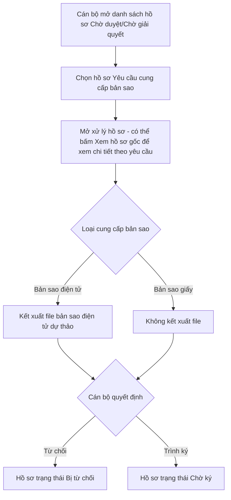

## 4.3.2. Dành cho Cán bộ nghiệp vụ tại Trung tâm đăng ký (TTĐK)

### 4.3.2.X. UC-BS-CB - Xử lý yêu cầu cung cấp bản sao văn bản chứng nhận

#### 4.3.2.X.1. Mục đích

\- Cho phép Cán bộ TTĐK kiểm tra và xử lý hồ sơ Yêu cầu cung cấp bản sao văn bản chứng nhận đăng ký biện pháp bảo đảm ở trạng thái "Chờ duyệt" đối với hồ sơ Online đã thanh toán thành công/miễn phí hoặc trạng thái "Chờ giải quyết" đối với hồ sơ giấy đã hoàn tất thu phí/miễn phí.

\- Bảo đảm Số đăng ký, Loại cung cấp bản sao, Số lượng bản sao và hồ sơ gốc đã được xác định tự động tại thời điểm Khách hàng gửi yêu cầu không bị Cán bộ thay đổi trong quá trình xử lý.

\- Đối với Loại cung cấp bản sao là "Bản sao điện tử", cho phép Cán bộ kết xuất file bản sao điện tử dự thảo trước khi trình Lãnh đạo ký.

\- Đối với Loại cung cấp bản sao là "Bản sao giấy", không kết xuất file; việc in/sao bản giấy chỉ thực hiện sau khi Lãnh đạo ký duyệt tại trạng thái "Chờ ký", ở ngoài hệ thống.

*a. Phân quyền*

\- Cán bộ TTĐK được phân quyền xử lý hồ sơ Yêu cầu cung cấp bản sao.

\- Cán bộ chỉ được xử lý hồ sơ thuộc Trung tâm đăng ký giao dịch, tài sản/đơn vị được phân công.

\- Cán bộ không được xử lý hồ sơ đã chuyển khỏi trạng thái đầu vào được phép xử lý, gồm "Chờ duyệt", "Chờ giải quyết" hoặc "Bị trả lại".

*b. Điều kiện thực hiện*

\- Cán bộ đã đăng nhập thành công vào Website Quản trị.

\- Hồ sơ Yêu cầu cung cấp bản sao Online đã thanh toán thành công/miễn phí và đang ở trạng thái "Chờ duyệt", hoặc hồ sơ giấy đã hoàn tất thu phí/miễn phí và đang ở trạng thái "Chờ giải quyết".

*c. Nguyên tắc dữ liệu*

\- Hồ sơ Yêu cầu cung cấp bản sao chỉ lưu **Số đăng ký** làm khóa tham chiếu tới hồ sơ gốc (không lưu bản sao tĩnh dữ liệu), theo [BR-BS-011]. Mọi màn hình hiển thị chi tiết hồ sơ gốc trong tài liệu này đều truy vấn trực tiếp (join) theo Số đăng ký tại thời điểm Cán bộ xem, luôn phản ánh đúng trạng thái hiệu lực mới nhất của hồ sơ gốc.

\- Cán bộ được xem chi tiết hồ sơ gốc ở mọi trạng thái xử lý (khác với Website Khách hàng, chỉ xem được khi hồ sơ đã "Hoàn thành"), nhưng không được sửa hồ sơ gốc, Số đăng ký, Loại cung cấp bản sao hoặc Số lượng bản sao theo [BR-BS-001].

\- Toàn bộ dữ liệu tra cứu ở trạng thái chỉ đọc.

#### 4.3.2.X.2. UC-BS-CB.MH01 - Màn hình Danh sách yêu cầu cung cấp bản sao chờ xử lý

##### 4.3.2.X.2.1. Màn hình

##### 4.3.2.X.2.2. Mô tả thông tin trên màn hình

| Trường thông tin | Kiểu dữ liệu | Bắt buộc | Mặc định | Mô tả |
| :--- | :--- | :---: | :--- | :--- |
| **I. Bộ lọc tìm kiếm** | | | | |
| Tìm kiếm | String(255) | Không | Trống | Tìm kiếm gần đúng theo Mã hồ sơ, Người yêu cầu, Mã khách hàng hoặc Số đăng ký. |
| Mã khách hàng | String(50) | Không | Trống | Tìm kiếm chính xác hoặc gần đúng theo Mã khách hàng nộp yêu cầu. |
| Loại cung cấp bản sao | Enum(String(50)) | Không | Tất cả | - Tất cả - Bản sao điện tử - Bản sao giấy |
| Trạng thái hồ sơ | Enum(String(50)) | Không | "Chờ duyệt" | Tham chiếu bộ trạng thái tại [4.1.X.3](../../01_Website_Khach_hang/SRS_Qly_yeu_cau_da_dky_YC%20Ban%20sao.md#41x3-bo-trang-thai-ho-so-yeu-cau-cung-cap-ban-sao-thay-the-bo-trang-thai-cu). Màn hình mặc định hiển thị hồ sơ "Chờ duyệt" và "Chờ giải quyết". |
| Từ ngày | Date | Không | Ngày 01 của tháng hiện tại | Lọc theo Thời điểm đăng ký. Tuân thủ [BR-VAL-007]. |
| Đến ngày | Date | Không | Ngày hiện tại | Lọc theo Thời điểm đăng ký. Tuân thủ [BR-VAL-007]. |
| **II. Bảng danh sách hồ sơ** | | | | - Trạng thái có dữ liệu: Hiển thị danh sách các bản ghi kết quả theo cấu trúc các cột quy định. - Trạng thái không có dữ liệu (Empty State): Khi không tìm thấy kết quả phù hợp với điều kiện tìm kiếm, bảng hiển thị duy nhất 01 dòng căn giữa trên toàn bộ chiều rộng bảng (`colspan`), in nghiêng với nội dung: *"Không tìm thấy dữ liệu phù hợp với điều kiện tìm kiếm."*|
| Bảng danh sách hồ sơ | Text(1000) | Không | 20 bản ghi/trang | Hiển thị danh sách hồ sơ Yêu cầu cung cấp bản sao thuộc phạm vi xử lý của Cán bộ. Sắp xếp mặc định theo Thời điểm đăng ký tăng dần. Click trực tiếp vào dòng dữ liệu để mở **4.3.2.X.3. UC-BS-CB.MH02**. - Trạng thái có dữ liệu: Hiển thị danh sách các bản ghi kết quả theo cấu trúc các cột quy định. - Trạng thái không có dữ liệu (Empty State): Khi không tìm thấy kết quả phù hợp với điều kiện tìm kiếm, bảng hiển thị duy nhất 01 dòng căn giữa trên toàn bộ chiều rộng bảng (`colspan`), in nghiêng với nội dung: *"Không tìm thấy dữ liệu phù hợp với điều kiện tìm kiếm."*|
| STT | Integer(10) | Không | Tự tăng | Số thứ tự dòng dữ liệu trên trang hiện tại. |
| Mã hồ sơ | String(50) | Có | Theo hồ sơ | Mã hồ sơ Yêu cầu cung cấp bản sao. |
| Thời điểm đăng ký | Datetime | Có | Theo hồ sơ | Thời điểm Khách hàng gửi yêu cầu. |
| Mã khách hàng | String(50) | Không | Theo hồ sơ | Mã khách hàng gắn với tài khoản nộp yêu cầu, nếu có. |
| Người yêu cầu | String(255) | Có | Theo hồ sơ | Tên cá nhân/tổ chức yêu cầu. |
| Số đăng ký | String(50) | Có | Theo hồ sơ | Số đăng ký của hồ sơ gốc gắn với yêu cầu. |
| Loại cung cấp bản sao | Enum(String(50)) | Có | Theo hồ sơ | Hiển thị "Bản sao điện tử" hoặc "Bản sao giấy". |
| Số lượng bản sao | Integer(10) | Tùy điều kiện | Theo hồ sơ | Chỉ hiển thị giá trị khi Loại cung cấp bản sao là "Bản sao giấy"; nếu là "Bản sao điện tử", hiển thị `"—"`. |
| Trạng thái | Enum(String(50)) | Có | "Chờ duyệt" | Hiển thị trạng thái hiện tại của hồ sơ. Khi Cán bộ xử lý, trạng thái phải là "Chờ duyệt", "Chờ giải quyết" hoặc "Bị trả lại". |
| Cán bộ xử lý | String(255) | Không | Theo phân công | Hiển thị Cán bộ đang được phân công xử lý, nếu đã có. |
| Thao tác | String(255) | Không | Theo trạng thái | Hiển thị "Xử lý hồ sơ" đối với hồ sơ ở trạng thái "Chờ duyệt", "Chờ giải quyết" hoặc "Bị trả lại". |

##### 4.3.2.X.2.3. Chức năng trên màn hình

| STT | Tên chức năng | Định dạng | Mô tả |
| :--- | :--- | :--- | :--- |
| 1 | Tìm kiếm | Nút | TH1 (Điều kiện ngày không hợp lệ): Vi phạm [BR-VAL-007], hiển thị [MSG-ERR-VAL-007], không thực hiện tìm kiếm. - **TH Không có dữ liệu trả về**: + Bảng kết quả: Hiển thị dòng thông báo rỗng *"Không tìm thấy dữ liệu phù hợp với điều kiện tìm kiếm."* ở giữa bảng. + Thanh phân trang (Pagination): Dòng số lượng hiển thị *"Hiển thị 0-0 của 0 yêu cầu"*; các nút điều hướng trang (&#124;&lt;&lt;, &lt;, các số trang, &gt;, &gt;&gt;&#124;) ở trạng thái ẩn hoặc khóa mờ (Disabled). + Nút "Kết xuất Excel" (nếu màn hình có nút này): Thiết lập ở trạng thái khóa mờ (Disabled) kèm tooltip: *"Không có dữ liệu để kết xuất Excel"*.|
|  |  |  | TH Hợp lệ: Tìm kiếm trong phạm vi hồ sơ thuộc quyền xử lý của Cán bộ. Nếu không có dữ liệu phù hợp, hiển thị [MSG-WRN-SYS-001] hoặc trạng thái rỗng theo chuẩn danh sách. |
| 2 | Xóa bộ lọc | Nút | Xóa toàn bộ tiêu chí lọc, đưa Trạng thái hồ sơ về "Chờ duyệt/Chờ giải quyết", Loại cung cấp bản sao về "Tất cả" và tải lại danh sách mặc định. |
| 3 | Xử lý hồ sơ | Nút | TH1 (Hồ sơ không thuộc trạng thái Cán bộ được phép xử lý): Vi phạm [BR-BS-002], hiển thị [MSG-ERR-BS-002], không mở màn hình xử lý. |
|  |  |  | TH2 (Cán bộ không có quyền xử lý): Vi phạm [BR-BS-002], hiển thị [MSG-ERR-BS-002], không mở màn hình xử lý. |
|  |  |  | TH Hợp lệ: Mở **4.3.2.X.3. UC-BS-CB.MH02**. |
| 4 | Click dòng dữ liệu | Row Click | Mở **4.3.2.X.3. UC-BS-CB.MH02**. Bảng danh sách đã lọc sẵn theo phạm vi quyền dữ liệu của Cán bộ, nên mọi dòng hiển thị đều thuộc quyền xử lý. |

#### 4.3.2.X.3. UC-BS-CB.MH02 - Màn hình Xử lý hồ sơ yêu cầu cung cấp bản sao

##### 4.3.2.X.3.1. Màn hình

##### 4.3.2.X.3.2. Mô tả thông tin trên màn hình

| Trường thông tin | Kiểu dữ liệu | Bắt buộc | Mặc định | Mô tả |
| :--- | :--- | :---: | :--- | :--- |
| **I. Thông tin hồ sơ** | | | | |
| Mã hồ sơ | String(50) | Có | Theo hồ sơ | Chỉ đọc. |
| Thời điểm đăng ký | Datetime | Có | Theo hồ sơ | Chỉ đọc. |
| Người yêu cầu | String(255) | Có | Theo hồ sơ | Chỉ đọc. |
| Mã khách hàng | String(50) | Không | Theo hồ sơ | Chỉ đọc. Chỉ hiển thị khi hồ sơ có dữ liệu. |
| Nguồn tiếp nhận | Enum(String(50)) | Có | Theo hồ sơ | Chỉ đọc. Màn hình này xử lý hồ sơ Online ở trạng thái "Chờ duyệt" và hồ sơ giấy ở trạng thái "Chờ giải quyết". |
| Số đăng ký | String(50) | Có | Theo hồ sơ | Chỉ đọc, không cho phép chỉnh sửa theo [BR-BS-001]. Kèm liên kết "Xem hồ sơ gốc" ngay cạnh giá trị Số đăng ký, cho phép Cán bộ mở xem chi tiết hồ sơ gốc theo yêu cầu (xem chức năng tương ứng tại mục 4.3.2.X.3.3); không tự động hiển thị sẵn trên màn hình. |
| Loại cung cấp bản sao | Enum(String(50)) | Có | Theo hồ sơ | Chỉ đọc. Hiển thị "Bản sao điện tử" hoặc "Bản sao giấy". |
| Số lượng bản sao | Integer(10) | Tùy điều kiện | Theo hồ sơ | Chỉ đọc. Chỉ hiển thị khi Loại cung cấp bản sao là "Bản sao giấy". |
| Cơ quan tiếp nhận | Enum(String(100)) | Có | Theo hồ sơ | Chỉ đọc. Tham chiếu [DM_08]. |
| Trạng thái | Enum(String(50)) | Có | Theo hồ sơ | Chỉ đọc. Khi Cán bộ xử lý, trạng thái phải là "Chờ duyệt", "Chờ giải quyết" hoặc "Bị trả lại". |
| Cán bộ xử lý | String(255) | Không | Theo phân công | Chỉ đọc. Hiển thị Cán bộ đang xử lý hồ sơ; nếu chưa có, hệ thống ghi nhận Cán bộ hiện tại khi bắt đầu xử lý. |
| Lịch sử xử lý | Text(4000) | Không | Theo hồ sơ | Chỉ đọc. Hiển thị dòng thời gian các thao tác gửi yêu cầu/nhập liệu, thanh toán/thu phí, kết xuất, trình ký, ký số/trả kết quả, từ chối, trả lại và các lần thay đổi trạng thái. |
| **II. Tệp bản sao điện tử dự thảo** | | | | |
| Khối Tệp bản sao điện tử dự thảo | Text(1000) | Không | Ẩn | Chỉ hiển thị khi Loại cung cấp bản sao là "Bản sao điện tử" và Cán bộ đã bấm "Kết xuất bản sao điện tử" thành công. Không hiển thị khối này đối với Loại cung cấp bản sao là "Bản sao giấy". |
| File bản sao điện tử dự thảo | File | Không | Theo kết xuất | File được sinh theo mẫu cấu hình chuẩn bản sao văn bản chứng nhận đăng ký biện pháp bảo đảm, dựa trên dữ liệu hồ sơ gốc truy vấn theo Số đăng ký tại Khối I (theo [BR-BS-011]). Đây là file dự thảo, chưa phải file ký số. |
| Thời điểm kết xuất | Datetime | Không | Theo kết xuất | Chỉ đọc. |
| Phiên bản PDF | String(50) | Không | Theo hồ sơ | Chỉ hiển thị sau khi Cán bộ trình ký thành công. Phiên bản này bị khóa theo [BR-BS-004]. |

##### 4.3.2.X.3.3. Chức năng trên màn hình

| STT | Tên chức năng | Định dạng | Mô tả |
| :--- | :--- | :--- | :--- |
| 1 | Xem hồ sơ gốc | Link | Luôn hiển thị cạnh Số đăng ký. Khi Cán bộ click, mở popup/tab riêng ở chế độ chỉ đọc, hiển thị theo cấu trúc dùng chung tại [4.1.12.6. Màn hình Chi tiết kết quả tra cứu](../../01_Website_Khach_hang/UC190_to_UC192_Tra_cuu_ho_so_theo_ma_so_su_dung_CSDL.md#41126-man-hinh-chi-tiet-ket-qua-tra-cuu-dung-chung-sau-khi-bam-tim-kiem), bắt đầu từ tiêu đề **Đăng ký giao dịch bảo đảm / Hợp đồng - [Số đăng ký]**. Dữ liệu được truy vấn trực tiếp (join) theo Số đăng ký ngay tại thời điểm click, không phải bản sao dữ liệu tĩnh, theo [BR-BS-011]. Nếu hồ sơ gốc không còn ở trạng thái "Hoàn thành" tại thời điểm xem, vi phạm [BR-BS-011], hiển thị [MSG-ERR-BS-009] và không mở popup. |
| 2 | Kết xuất bản sao điện tử | Nút | Điều kiện hiển thị: Chỉ hiển thị khi Loại cung cấp bản sao là "Bản sao điện tử" và hồ sơ ở trạng thái Cán bộ được phép xử lý. |
|  |  |  | TH Hợp lệ: Hệ thống sinh file bản sao điện tử dự thảo dựa trên dữ liệu hồ sơ gốc truy vấn theo Số đăng ký, hiển thị tại **II. Tệp bản sao điện tử dự thảo**, hiển thị [MSG-SUC-BS-001]. |
| 3 | Xem file/Tải file | Link/Nút | Chỉ hiển thị sau khi có File bản sao điện tử dự thảo. Cho phép xem file tại một tab riêng hoặc tải theo quyền. |
| 4 | Trình ký | Nút | TH1 (Hồ sơ không thuộc trạng thái Cán bộ được phép xử lý): Vi phạm [BR-BS-002], hiển thị [MSG-ERR-BS-002], không cho phép trình ký. |
|  |  |  | TH2 (Loại "Bản sao điện tử" nhưng chưa kết xuất file dự thảo): Vi phạm [BR-BS-004], hiển thị [MSG-ERR-BS-003], không cho phép trình ký. |
|  |  |  | TH Hợp lệ: Mở **4.3.2.X.4. UC-BS-CB.MH03 - Popup Trình ký yêu cầu cung cấp bản sao**. |
| 5 | Từ chối | Nút | Hiển thị khi hồ sơ ở trạng thái "Chờ duyệt", "Chờ giải quyết" hoặc "Bị trả lại". Mở **4.3.2.X.5. UC-BS-CB.MH04 - Popup Từ chối yêu cầu cung cấp bản sao**. Nếu hồ sơ Online đã thanh toán, hệ thống tạo yêu cầu hoàn tiền và chuyển sang Module Quản lý đối soát thanh toán để theo dõi. Nếu hồ sơ giấy đã thu phí, hệ thống tạo khoản hoàn phí/thông báo kế toán xử lý tại Module Quản lý thu phí/hoàn phí hồ sơ giấy. |
| 6 | Quay lại | Nút | Quay lại **4.3.2.X.2. UC-BS-CB.MH01**, giữ nguyên bộ lọc trước đó. |

#### 4.3.2.X.4. UC-BS-CB.MH03 - Popup Trình ký yêu cầu cung cấp bản sao

##### 4.3.2.X.4.1. Màn hình

##### 4.3.2.X.4.2. Mô tả thông tin trên màn hình

| Trường thông tin | Kiểu dữ liệu | Bắt buộc | Mặc định | Mô tả |
| :--- | :--- | :---: | :--- | :--- |
| Mã hồ sơ | String(50) | Có | Theo hồ sơ | Chỉ đọc. |
| Loại cung cấp bản sao | Enum(String(50)) | Có | Theo hồ sơ | Chỉ đọc. Hồ sơ Online có phí đã qua "Chờ thanh toán" trước khi vào hàng chờ Cán bộ; sau khi Cán bộ trình ký, hồ sơ chuyển sang "Chờ ký" để Lãnh đạo ký số (điện tử) hoặc ký duyệt (giấy). |
| File bản sao điện tử dự thảo | File | Tùy điều kiện | Theo kết xuất | Chỉ đọc. Chỉ hiển thị khi Loại cung cấp bản sao là "Bản sao điện tử". Phiên bản này sẽ bị khóa khi trình ký thành công theo [BR-BS-004]. |
| Người trình ký | String(255) | Có | Cán bộ hiện tại | Chỉ đọc. |
| Lãnh đạo ký | Enum(String(255)) | Có | Trống | \- Control UI: Combobox có ô tìm kiếm. - Bắt buộc chọn trước khi xác nhận trình ký. - Hiển thị thông tin Lãnh đạo được phép ký của đơn vị tại Cấu hình thông tin về người ký. - Cho phép tìm kiếm gần đúng theo tên Lãnh đạo, chức danh hoặc đơn vị trước khi chọn. - Chỉ hiển thị Lãnh đạo còn hiệu lực thuộc đơn vị/phạm vi thẩm quyền xử lý hồ sơ. - Đối với Loại "Bản sao điện tử", đây là Lãnh đạo ký số file bản sao điện tử tại "Chờ ký". - Đối với Loại "Bản sao giấy", đây là Lãnh đạo ký duyệt (không ký số) tại "Chờ ký" trước bước trả kết quả giấy. |

##### 4.3.2.X.4.3. Chức năng trên màn hình

| STT | Tên chức năng | Định dạng | Mô tả |
| :--- | :--- | :--- | :--- |
| 1 | Hủy | Nút | Đóng popup, giữ nguyên trạng thái hồ sơ, quay lại **4.3.2.X.3. UC-BS-CB.MH02**. |
| 2 | Xác nhận | Nút | TH1 (Hồ sơ không thuộc trạng thái Cán bộ được phép xử lý): Vi phạm [BR-BS-002], hiển thị [MSG-ERR-BS-002], không cho phép trình ký. |
|  |  |  | TH2 (Chưa chọn Lãnh đạo ký hoặc Lãnh đạo đã chọn không còn hiệu lực/không có thẩm quyền tại thời điểm xác nhận): Vi phạm [BR-VAL-001], hiển thị [MSG-ERR-VAL-001], không cho phép trình ký. |
|  |  |  | TH3 (Hồ sơ gốc không còn ở trạng thái "Hoàn thành" khi hệ thống kiểm tra lại theo Số đăng ký, ví dụ đã bị Xóa đăng ký sau khi Khách hàng gửi yêu cầu): Vi phạm [BR-BS-011], hiển thị [MSG-ERR-BS-009], không cho phép trình ký. |
|  |  |  | TH Hợp lệ: Hệ thống kiểm tra lại hồ sơ gốc còn hiệu lực, khóa phiên bản file bản sao điện tử dự thảo (nếu có), ghi nhận Cán bộ trình ký, thời điểm trình ký và Lãnh đạo ký đã chọn, chuyển hồ sơ sang **"Chờ ký"**, chuyển hồ sơ đến đúng Lãnh đạo đã chọn và hiển thị [MSG-SUC-BS-002]. |

#### 4.3.2.X.5. UC-BS-CB.MH04 - Popup Từ chối yêu cầu cung cấp bản sao

##### 4.3.2.X.5.1. Màn hình

##### 4.3.2.X.5.2. Mô tả thông tin trên màn hình

| Trường thông tin | Kiểu dữ liệu | Bắt buộc | Mặc định | Mô tả |
| :--- | :--- | :---: | :--- | :--- |
| Mã hồ sơ | String(50) | Có | Theo hồ sơ | Chỉ đọc. |
| Người yêu cầu | String(255) | Có | Theo hồ sơ | Chỉ đọc. |
| Lý do từ chối | Text(1000) | Có | Trống | Rule bắt buộc nhập lý do từ chối theo [BR-VAL-001]. |

##### 4.3.2.X.5.3. Chức năng trên màn hình

| STT | Tên chức năng | Định dạng | Mô tả |
| :--- | :--- | :--- | :--- |
| 1 | Hủy | Nút | Đóng popup, giữ nguyên trạng thái hồ sơ. |
| 2 | Xác nhận từ chối | Nút | TH1 (Bỏ trống Lý do từ chối): Vi phạm [BR-VAL-001], hiển thị [MSG-ERR-VAL-001]. Không cho phép lưu. |
|  |  |  | TH Hợp lệ: Cập nhật trạng thái hồ sơ thành "Bị từ chối", lưu Lý do từ chối. Đóng popup, hiển thị [MSG-SUC-BS-004] và làm mới Bảng danh sách kết quả. |

#### 4.3.2.X.6. UC-BS-CB.MH05 - Màn hình Danh sách và Xác nhận trả kết quả bản sao giấy

##### 4.3.2.X.6.1. Màn hình

Áp dụng chung cho hồ sơ Loại cung cấp bản sao là "Bản sao giấy" ở trạng thái "Đã duyệt - chờ trả kết quả", bất kể Nguồn tiếp nhận là Online hay "Cán bộ nhập liệu" (hồ sơ giấy tham chiếu màn hình này từ [SRS_Nhap_lieu_ho_so_giay_Yeu_cau_cung_cap_ban_sao_Can_bo](SRS_Nhap_lieu_ho_so_giay_Yeu_cau_cung_cap_ban_sao_Can_bo.md), không thiết kế màn hình riêng).

##### 4.3.2.X.6.2. Mô tả thông tin trên màn hình

| Trường thông tin | Kiểu dữ liệu | Bắt buộc | Mặc định | Mô tả |
| :--- | :--- | :---: | :--- | :--- |
| **I. Bộ lọc tìm kiếm** | | | | |
| Tìm kiếm | String(255) | Không | Trống | Tìm kiếm gần đúng theo Mã hồ sơ, Người yêu cầu hoặc Số đăng ký. |
| Nguồn tiếp nhận | Enum(String(50)) | Không | Tất cả | - Tất cả - Website Khách hàng - Mobile Khách hàng - Cán bộ nhập liệu |
| **II. Bảng danh sách hồ sơ** | | | | - Trạng thái có dữ liệu: Hiển thị danh sách các bản ghi kết quả theo cấu trúc các cột quy định. - Trạng thái không có dữ liệu (Empty State): Khi không tìm thấy kết quả phù hợp với điều kiện tìm kiếm, bảng hiển thị duy nhất 01 dòng căn giữa trên toàn bộ chiều rộng bảng (`colspan`), in nghiêng với nội dung: *"Không tìm thấy dữ liệu phù hợp với điều kiện tìm kiếm."*|
| Bảng danh sách hồ sơ | Text(1000) | Không | 20 bản ghi/trang | Chỉ hiển thị hồ sơ Loại "Bản sao giấy" ở trạng thái "Đã duyệt - chờ trả kết quả" thuộc phạm vi xử lý của Cán bộ. - Trạng thái có dữ liệu: Hiển thị danh sách các bản ghi kết quả theo cấu trúc các cột quy định. - Trạng thái không có dữ liệu (Empty State): Khi không tìm thấy kết quả phù hợp với điều kiện tìm kiếm, bảng hiển thị duy nhất 01 dòng căn giữa trên toàn bộ chiều rộng bảng (`colspan`), in nghiêng với nội dung: *"Không tìm thấy dữ liệu phù hợp với điều kiện tìm kiếm."*|
| STT | Integer(10) | Không | Tự tăng | Số thứ tự dòng dữ liệu trên trang hiện tại. |
| Mã hồ sơ | String(50) | Có | Theo hồ sơ | Chỉ đọc. |
| Người yêu cầu | String(255) | Có | Theo hồ sơ | Chỉ đọc. |
| Số đăng ký | String(50) | Có | Theo hồ sơ | Chỉ đọc. |
| Số lượng bản sao | Integer(10) | Có | Theo hồ sơ | Chỉ đọc. |
| Nguồn tiếp nhận | Enum(String(50)) | Có | Theo hồ sơ | Chỉ đọc. |
| Thời điểm duyệt | Datetime | Có | Theo hồ sơ | Chỉ đọc. |
| Thao tác | String(255) | Không | Theo trạng thái | Hiển thị "Xác nhận trả kết quả". |

##### 4.3.2.X.6.3. Chức năng trên màn hình

| STT | Tên chức năng | Định dạng | Mô tả |
| :--- | :--- | :--- | :--- |
| 1 | Xác nhận trả kết quả | Nút | TH1 (Hồ sơ không còn ở trạng thái "Đã duyệt - chờ trả kết quả"): Vi phạm [BR-BS-010], hiển thị [MSG-ERR-DK-005], không cho phép xác nhận. |
|  |  |  | TH Hợp lệ: Hệ thống yêu cầu xác nhận bằng [MSG-CFM-BS-005]. Sau khi xác nhận, lưu người xác nhận, thời điểm trả kết quả, chuyển hồ sơ sang "Hoàn thành" theo [BR-BS-010], hiển thị [MSG-SUC-BS-006]. |

---

#### 4.3.2.X.7. Checklist ràng buộc chéo

| Câu hỏi kiểm tra | Đánh giá áp dụng |
| :--- | :--- |
| UC này có cần gọi dữ liệu từ tích hợp V.1 để tự động điền hoặc kiểm tra không? | Không; hồ sơ gốc đã được xác định tự động một lần tại thời điểm Khách hàng gửi yêu cầu, không tra cứu lại tại đây. |
| Các trường lựa chọn đã tham chiếu đúng danh mục chưa? | Cơ quan tiếp nhận tham chiếu [DM_08]. |
| Thao tác nào cần ghi log vào III.6? | Mở xử lý, kết xuất bản sao điện tử, trình ký, từ chối. |
| Nguy cơ phát sinh bồi thường là gì? | Trình ký sai hồ sơ gốc hoặc trình ký file bản sao điện tử không đúng dữ liệu hồ sơ gốc có thể phát sinh khiếu kiện. Hệ thống kiểm tra lại hồ sơ gốc (theo Số đăng ký) vẫn còn hiệu lực ngay tại thời điểm trình ký, và khóa phiên bản file dự thảo ngay khi trình ký thành công. |
| UC này có phiên bản Mobile tương ứng không? | Chức năng không có phiên bản tương ứng trên Mobile App dành cho Cán bộ; khách hàng gửi yêu cầu trực tuyến từ Website/Mobile Khách hàng, Cán bộ xử lý duy nhất trên Website Quản trị. |
| Kết quả xử lý làm thay đổi Dashboard nào? | Số lượng yêu cầu cung cấp bản sao theo từng trạng thái; doanh thu phí cấp bản sao chỉ cập nhật đối với hồ sơ thuộc diện phải thu phí và thanh toán thành công. |

#### 4.3.2.X.8. Sơ đồ và mô tả quy trình nghiệp vụ

| Bước | Người thực hiện | Mô tả nghiệp vụ |
| :--- | :--- | :--- |
| 1 | Cán bộ | Truy cập danh sách hồ sơ Yêu cầu cung cấp bản sao chờ xử lý. |
| 2 | Hệ thống | Hiển thị hồ sơ ở trạng thái "Chờ duyệt" hoặc "Chờ giải quyết" thuộc phạm vi xử lý của Cán bộ. |
| 3 | Cán bộ | Mở xử lý hồ sơ. Có thể bấm "Xem hồ sơ gốc" để mở popup xem chi tiết hồ sơ gốc khi cần rà soát; hồ sơ gốc không hiển thị sẵn thành khối cố định trên màn hình. Hệ thống dùng dữ liệu hồ sơ gốc (truy vấn theo Số đăng ký) để kết xuất bản sao điện tử. |
| 4 | Cán bộ | Nếu Loại cung cấp bản sao là "Bản sao điện tử", kết xuất file bản sao điện tử dự thảo. Nếu là "Bản sao giấy", không kết xuất file. |
| 5 | Cán bộ | Chọn "Trình ký" hoặc "Từ chối". |
| 6 | Hệ thống | Nếu trình ký, kiểm tra lại hồ sơ gốc còn hiệu lực, khóa phiên bản file dự thảo (nếu có), chuyển hồ sơ sang "Chờ ký". Nếu từ chối, lưu lý do, chuyển hồ sơ sang "Bị từ chối" và phát sinh yêu cầu hoàn tiền/hoàn phí tương ứng nguồn hồ sơ. |

