# UCPS012 - Tiếp nhận hồ sơ giấy của Cán bộ tiếp nhận

## 1. Tổng quan

### 1.1. Mục đích

Tài liệu này đặc tả yêu cầu phần mềm cho chức năng **Tiếp nhận hồ sơ giấy** trên Website quản trị của Hệ thống đăng ký biện pháp bảo đảm. Chức năng cho phép Cán bộ tiếp nhận lập hồ sơ hành chính ban đầu đối với hồ sơ nộp trực tiếp tại quầy, qua bưu chính, fax hoặc email; hệ thống sinh Mã hồ sơ, mã QR/mã vạch, Phiếu tiếp nhận, Tem hồ sơ và tạo khoản phải thu để chuyển sang bước thu phí.

### 1.2. Phạm vi

Phạm vi bắt đầu khi Cán bộ tiếp nhận mở màn hình **Tiếp nhận hồ sơ giấy** và kết thúc khi hồ sơ được hoàn tất tiếp nhận, tạo khoản phải thu thành công và chuyển trạng thái hồ sơ sang "Chờ thu phí" để Cán bộ kế toán xử lý tại [UCPS013 - Quản lý thu phí/hoàn phí hồ sơ giấy của Cán bộ kế toán](UCPS013_Quan_ly_thu_phi_ho_so_giay_Can_bo_ke_toan.md).

Không thuộc phạm vi tài liệu này:

- Thu tiền, xác nhận chuyển khoản, xác nhận miễn phí và in biên lai: xem [UCPS013 - Quản lý thu phí/hoàn phí hồ sơ giấy của Cán bộ kế toán](UCPS013_Quan_ly_thu_phi_ho_so_giay_Can_bo_ke_toan.md).
- Hồ sơ chờ nhập liệu sau khi hoàn tất thu phí/miễn phí: xem [SRS - Hồ sơ chờ nhập liệu](SRS_Ho_so_cho_nhap_lieu.md).
- Điều hướng SRS nhập liệu nghiệp vụ theo Loại yêu cầu: xem bảng mapping tại [SRS - Hồ sơ chờ nhập liệu, mục 4](SRS_Ho_so_cho_nhap_lieu.md#4-dieu-huong-srs-theo-loai-yeu-cau).

### 1.3. Đối tượng sử dụng

| Vai trò | Quyền sử dụng |
| :--- | :--- |
| Cán bộ tiếp nhận | Tạo hồ sơ tiếp nhận, hoàn tất tiếp nhận, tải tệp đính kèm, in Phiếu tiếp nhận, in Tem hồ sơ, theo dõi trạng thái. |
| Cán bộ kế toán | Chỉ xem thông tin tiếp nhận khi xử lý thu phí, không sửa dữ liệu tiếp nhận. |
| Cán bộ giải quyết | Chỉ xem thông tin tiếp nhận ở bước nhập liệu chi tiết, không sửa dữ liệu tiếp nhận. |

### 1.4. Thuật ngữ

| Thuật ngữ | Diễn giải |
| :--- | :--- |
| Hồ sơ giấy | Tập hồ sơ khách hàng nộp ngoài kênh trực tuyến, được cán bộ nhập thông tin tiếp nhận tối thiểu lên hệ thống. |
| Mã hồ sơ | Mã duy nhất do hệ thống sinh, ví dụ `HS-2026-000125`, dùng xuyên suốt từ tiếp nhận, thu phí đến giải quyết. |
| Khoản phải thu | Bản ghi tài chính phát sinh sau khi hoàn tất tiếp nhận, làm cơ sở để kế toán thu phí hoặc xác nhận miễn phí. |
| Tham số tính phí | Các thông tin tối thiểu ảnh hưởng đến biểu phí, ví dụ Loại yêu cầu, Số lượng bản sao. |

### 1.5. Tài liệu liên quan

| Tài liệu | Link |
| :--- | :--- |
| Quy tắc chung hệ thống | [00_Tong_quan_va_Quy_tac_chung](../../00_Tong_quan_va_Quy_tac_chung.md) |
| Quản lý biểu phí | [UC559_Quan_ly_bieu_phi_SRS](../01_Quan_tri_he_thong/UC559_Quan_ly_bieu_phi_SRS.md) |
| Quản lý thu phí/hoàn phí hồ sơ giấy | [UCPS013](UCPS013_Quan_ly_thu_phi_ho_so_giay_Can_bo_ke_toan.md) |
| Hồ sơ chờ nhập liệu | [SRS_Ho_so_cho_nhap_lieu](SRS_Ho_so_cho_nhap_lieu.md) |

## 2. Nguyên tắc nghiệp vụ

1. Cán bộ tiếp nhận chỉ nhập thông tin hành chính, nhận diện tối thiểu của hồ sơ, người yêu cầu, người nộp hồ sơ, Loại yêu cầu, tham số tính phí, phương thức nhận kết quả và tài liệu đính kèm nếu có.
2. Cán bộ tiếp nhận không nhập dữ liệu nghiệp vụ chi tiết như bên bảo đảm, bên nhận bảo đảm, tài sản bảo đảm, hợp đồng, nghĩa vụ được bảo đảm, nội dung thay đổi, căn cứ xóa đăng ký, thông tin xử lý tài sản hoặc tiêu chí tra cứu chi tiết.
3. Không có chức năng **Lưu bản nháp** tại bước tiếp nhận; hồ sơ chỉ được tạo chính thức khi bấm **Hoàn tất tiếp nhận** thành công.
4. Hệ thống phải sinh Mã hồ sơ duy nhất, mã QR/mã vạch, Phiếu tiếp nhận và Tem hồ sơ sau khi hoàn tất tiếp nhận.
5. Hồ sơ và khoản phải thu phải được tạo trong cùng một giao dịch hệ thống. Nếu tạo khoản phải thu thất bại, hệ thống không được hoàn tất tiếp nhận.
6. Cán bộ tiếp nhận không được nhập hoặc sửa trực tiếp số tiền phải thu. Số tiền phải thu do hệ thống tính theo cấu hình biểu phí đang có hiệu lực.
7. Đơn vị tiếp nhận và Cán bộ tiếp nhận lấy theo tài khoản đăng nhập, chỉ đọc, không cho sửa.
8. Số đơn giấy phải kiểm tra trùng theo Số đơn giấy, Đơn vị tiếp nhận và Năm tiếp nhận.
9. Trạng thái hồ sơ giấy sử dụng xuyên suốt như hồ sơ trực tuyến, chỉ gồm: "Chờ thu phí", "Chờ giải quyết", "Duyệt chờ ký", "Chờ ký", "Bị trả lại", "Bị từ chối", "Hoàn thành".
10. Sau khi hoàn tất tiếp nhận thành công, hồ sơ luôn chuyển sang "Chờ thu phí"; mọi phương thức thu tiền, xác nhận chuyển khoản hoặc xác nhận miễn phí đều do Cán bộ kế toán xử lý tại [UCPS013](UCPS013_Quan_ly_thu_phi_ho_so_giay_Can_bo_ke_toan.md).

## 3. Sơ đồ nghiệp vụ

```mermaid
flowchart LR
    A[Cán bộ tiếp nhận mở chức năng] --> B[Nhập thông tin tiếp nhận tối thiểu]
    B --> C[Chọn Loại yêu cầu]
    C --> D[Hệ thống hiển thị tham số tính phí]
    D --> E[Cán bộ nhập tham số tính phí]
    E --> F[Hệ thống tra cứu biểu phí và tính số tiền]
    F --> G[Chọn phương thức nhận kết quả]
    G --> H[Tải tệp đính kèm nếu có]
    H --> I[Hoàn tất tiếp nhận]
    I --> J{Dữ liệu hợp lệ?}
    J -- Không --> K[Hiển thị lỗi, giữ màn hình]
    J -- Có --> L[Sinh Mã hồ sơ, QR/mã vạch]
    L --> M[Tạo khoản phải thu]
    M --> N{Tạo khoản thu thành công?}
    N -- Không --> K
    N -- Có --> O[Cập nhật hồ sơ sang Chờ thu phí]
    O --> P[Cho phép in Phiếu tiếp nhận và Tem hồ sơ]
    P --> Q[Chuyển sang UCPS013 - Thu phí]
```

## 4. Danh sách chức năng

| Mã chức năng | Tên chức năng | Tác nhân | Điều kiện trước | Điều kiện sau |
| :--- | :--- | :--- | :--- | :--- |
| UCPS012-01 | Tra cứu danh sách hồ sơ tiếp nhận | Cán bộ tiếp nhận | Đã đăng nhập và có quyền | Hiển thị danh sách hồ sơ tiếp nhận theo điều kiện lọc |
| UCPS012-02 | Tạo hồ sơ tiếp nhận mới | Cán bộ tiếp nhận | Đã mở màn hình tiếp nhận | Hiển thị form tiếp nhận rỗng với các trường mặc định |
| UCPS012-03 | Tra cứu/nhập người yêu cầu | Cán bộ tiếp nhận | Đã chọn loại khách hàng | Thông tin người yêu cầu được hiển thị hoặc nhập tối thiểu |
| UCPS012-04 | Nhập tham số tính phí | Cán bộ tiếp nhận | Đã chọn Loại yêu cầu | Hệ thống tính được số tiền phải thu |
| UCPS012-05 | Quản lý tài liệu đính kèm | Cán bộ tiếp nhận | Đang nhập hồ sơ | Tệp được chọn/xem/tải/xóa trước khi hoàn tất |
| UCPS012-06 | Hoàn tất tiếp nhận | Cán bộ tiếp nhận | Dữ liệu hợp lệ | Hồ sơ, Mã hồ sơ, QR/mã vạch và khoản phải thu được tạo |
| UCPS012-07 | In Phiếu tiếp nhận | Cán bộ tiếp nhận | Hồ sơ đã có Mã hồ sơ | Phiếu tiếp nhận được hiển thị/in |
| UCPS012-08 | In Tem hồ sơ | Cán bộ tiếp nhận | Hồ sơ đã có Mã hồ sơ | Tem hồ sơ được hiển thị/in |
| UCPS012-09 | Xem chi tiết hồ sơ tiếp nhận | Cán bộ tiếp nhận | Hồ sơ đã tồn tại | Hiển thị chi tiết hồ sơ ở chế độ phù hợp trạng thái |

## 5. Danh sách màn hình

| Mã màn hình | Tên màn hình | Mục đích | Màn hình nguồn | Màn hình đích |
| :--- | :--- | :--- | :--- | :--- |
| UCPS012.MH01 | Danh sách hồ sơ tiếp nhận | Tìm kiếm, theo dõi hồ sơ đã tiếp nhận | Menu Nghiệp vụ | UCPS012.MH02, UCPS012.MH03 |
| UCPS012.MH02 | Tiếp nhận hồ sơ giấy | Nhập thông tin tiếp nhận tối thiểu và hoàn tất tiếp nhận | UCPS012.MH01 | UCPS012.MH04, UCPS012.MH05, UCPS013.MH01 |
| UCPS012.MH03 | Xem chi tiết hồ sơ tiếp nhận | Xem lại dữ liệu đã tiếp nhận | UCPS012.MH01 | UCPS012.MH04, UCPS012.MH05 |
| UCPS012.MH04 | Phiếu tiếp nhận | In phiếu giao cho người nộp | UCPS012.MH02, UCPS012.MH03 | UCPS012.MH02, UCPS012.MH03 |
| UCPS012.MH05 | Tem hồ sơ | In tem gắn vào tập hồ sơ giấy | UCPS012.MH02, UCPS012.MH03 | UCPS012.MH02, UCPS012.MH03 |

## 6. UCPS012.MH01 - Màn hình Danh sách hồ sơ tiếp nhận

### 6.1. Màn hình

### 6.2. Mô tả thông tin trên màn hình

| Trường thông tin | Kiểu dữ liệu | Bắt buộc | Mặc định | Mô tả |
| :--- | :--- | :---: | :--- | :--- |
| **Khối Lọc/Tìm kiếm** | — | — | — | Nhóm điều kiện tìm kiếm hồ sơ tiếp nhận. |
| Mã hồ sơ | String(50) | Không | Trống | Tìm kiếm gần đúng, trim khoảng trắng. |
| Số đơn giấy | String(50) | Không | Trống | Tìm kiếm gần đúng theo số đơn giấy khách hàng nộp. |
| Người yêu cầu | String(255) | Không | Trống | Tìm kiếm không phân biệt hoa/thường. |
| Người nộp hồ sơ | String(255) | Không | Trống | Tìm kiếm không phân biệt hoa/thường. |
| Loại yêu cầu | Enum(String(50)) | Không | Tất cả | Chọn theo danh mục Loại yêu cầu. |
| Kênh tiếp nhận | Enum(String(50)) | Không | Tất cả | Giá trị gồm: + Trực tiếp tại quầy + Qua bưu điện + Fax + Email |
| Từ ngày tiếp nhận | Date | Không | Trống | Không được lớn hơn Đến ngày tiếp nhận. |
| Đến ngày tiếp nhận | Date | Không | Trống | Không được nhỏ hơn Từ ngày tiếp nhận. |
| Trạng thái hồ sơ | Enum(String(50)) | Không | Tất cả | Lọc theo bộ trạng thái hồ sơ giấy: "Chờ thu phí", "Chờ giải quyết", "Duyệt chờ ký", "Chờ ký", "Bị trả lại", "Bị từ chối", "Hoàn thành". |
| Trạng thái lệ phí | Enum(String(50)) | Không | Tất cả | Lọc theo trạng thái lệ phí: Chưa thu, Đã thu, Miễn phí. |
| Cán bộ tiếp nhận | String(100) | Không | Tài khoản đang đăng nhập | Chỉ tìm trong phạm vi quyền dữ liệu. |
| Đơn vị tiếp nhận | String(255) | Không | Đơn vị đang đăng nhập | Chỉ tìm trong phạm vi quyền dữ liệu. |
| **Khối Lưới danh sách hồ sơ tiếp nhận** | — | — | — | Kết quả tìm kiếm hồ sơ tiếp nhận theo điều kiện lọc. - Trạng thái có dữ liệu: Hiển thị danh sách các bản ghi kết quả theo cấu trúc các cột quy định. - Trạng thái không có dữ liệu (Empty State): Khi không tìm thấy kết quả phù hợp với điều kiện tìm kiếm, bảng hiển thị duy nhất 01 dòng căn giữa trên toàn bộ chiều rộng bảng (`colspan`), in nghiêng với nội dung theo MessageList dùng chung [MSG-INF-SYS-001].|
| STT | Integer(10) | Có | Theo trang | Số thứ tự dòng theo trang kết quả. |
| Mã hồ sơ | String(50) | Có | Theo dữ liệu hệ thống | Link mở **8. UCPS012.MH03 - Màn hình Xem chi tiết hồ sơ tiếp nhận**. |
| Số đơn giấy | String(50) | Có | Theo hồ sơ | Hiển thị số trên đơn giấy khách hàng nộp. |
| Người yêu cầu | String(255) | Có | Theo hồ sơ | Hiển thị tên cá nhân/tổ chức yêu cầu. |
| Người nộp hồ sơ | String(255) | Có | Theo hồ sơ | Hiển thị người trực tiếp nộp hồ sơ. |
| Loại yêu cầu | Enum(String(50)) | Có | Theo hồ sơ | Hiển thị một trong các loại yêu cầu được tiếp nhận. |
| Ngày tiếp nhận | Datetime | Có | Theo hồ sơ | Hiển thị theo định dạng `dd/MM/yyyy HH:mm`. |
| Số tiền phải thu | Decimal(18,0) | Có | Theo khoản phải thu | Số tiền do hệ thống tính theo biểu phí. |
| Trạng thái lệ phí | Enum(String(50)) | Có | Theo khoản phải thu | Hiển thị Chưa thu, Đã thu hoặc Miễn phí. |
| Trạng thái hồ sơ | Enum(String(50)) | Có | Theo hồ sơ | Hiển thị trạng thái hồ sơ giấy hiện tại. |
| Cán bộ tiếp nhận | String(100) | Có | Theo hồ sơ | Hiển thị cán bộ đã tiếp nhận hồ sơ. |
| Đơn vị tiếp nhận | String(255) | Có | Theo hồ sơ | Hiển thị đơn vị của cán bộ tiếp nhận. |
| Thao tác | Text(1000) | Có | Theo trạng thái hồ sơ | Hiển thị các thao tác Xem chi tiết, In phiếu, In tem, Theo dõi trạng thái theo quyền và trạng thái hồ sơ. Chi tiết nghiệp vụ xem ở bảng Chức năng trên màn hình. |

### 6.3. Chức năng trên màn hình

| STT | Tên chức năng | Định dạng | Mô tả |
| :--- | :--- | :--- | :--- |
| 1 | Tìm kiếm | Nút | Hệ thống tìm kiếm hồ sơ tiếp nhận theo điều kiện đã nhập tại nhóm Bộ lọc tìm kiếm. Nếu khoảng ngày không hợp lệ, áp dụng **[BR-VAL-007]** và hiển thị **[MSG-ERR-VAL-007]**. - **TH Không có dữ liệu trả về**: + Bảng kết quả: Hiển thị duy nhất 01 dòng căn giữa trên toàn bộ chiều rộng bảng (`colspan`), in nghiêng với nội dung theo MessageList dùng chung [MSG-INF-SYS-001]. + Thanh phân trang (Pagination): Dòng số lượng hiển thị *"Hiển thị 0-0 của 0 bản ghi"*; các nút điều hướng trang (&#124;&lt;&lt;, &lt;, các số trang, &gt;, &gt;&gt;&#124;) ở trạng thái ẩn hoặc khóa mờ (Disabled). + Nút "Kết xuất Excel" (nếu màn hình có nút này): Thiết lập ở trạng thái khóa mờ (Disabled) kèm tooltip: *"Không có dữ liệu để kết xuất Excel"*.|
| 2 | Xóa bộ lọc | Nút | Hệ thống xóa toàn bộ điều kiện tìm kiếm về giá trị mặc định và tải lại danh sách trong phạm vi quyền dữ liệu. |
| 3 | Thêm mới | Nút | Mở **7. UCPS012.MH02 - Màn hình Tiếp nhận hồ sơ giấy** để Cán bộ tiếp nhận nhập hồ sơ giấy mới. |
| 4 | Xem chi tiết | Row Click | Mở **8. UCPS012.MH03 - Màn hình Xem chi tiết hồ sơ tiếp nhận** tại dòng hồ sơ được chọn. |
| 5 | In Phiếu tiếp nhận | Icon/Nút dòng | Mở **9. UCPS012.MH04 - Màn hình Phiếu tiếp nhận** nếu hồ sơ đã có Mã hồ sơ; nếu chưa có Mã hồ sơ, hiển thị **[MSG-WRN-UCPS-001]**. |
| 6 | In Tem hồ sơ | Icon/Nút dòng | Mở **10. UCPS012.MH05 - Màn hình Tem hồ sơ** nếu hồ sơ đã có Mã hồ sơ; nếu chưa có Mã hồ sơ, hiển thị **[MSG-WRN-UCPS-001]**. |

## 7. UCPS012.MH02 - Màn hình Tiếp nhận hồ sơ giấy

### 7.1. Màn hình

### 7.2. Mô tả thông tin trên màn hình

| Trường thông tin | Kiểu dữ liệu | Bắt buộc | Mặc định | Mô tả |
| :--- | :--- | :---: | :--- | :--- |
| **Khối Thông tin tiếp nhận** | — | — | — | Thông tin hành chính do Cán bộ tiếp nhận ghi nhận. |
| Kênh tiếp nhận | Enum(String(50)) | Có | Trực tiếp tại quầy | Giá trị gồm: + Trực tiếp tại quầy + Bưu điện + Fax + Email |
| Thời điểm tiếp nhận | Datetime | Có | Thời gian hệ thống | Cho phép sửa nếu người dùng có quyền; mặc định theo thời gian hệ thống. |
| Số đơn giấy | String(50) | Có | Trống | Cán bộ nhập. Kiểm tra trùng theo đơn vị và năm tiếp nhận theo **[BR-UCPS-003]**. |
| Đơn vị tiếp nhận | String(255) | Có | Đơn vị đăng nhập | Chỉ đọc. Lấy theo tài khoản đăng nhập, không cho chọn lại đơn vị. |
| Cán bộ tiếp nhận | String(100) | Có | Người đăng nhập | Chỉ đọc. Tự động ghi nhận theo tài khoản đăng nhập. |
| Ghi chú tiếp nhận | Text(1000) | Không | Trống | Cán bộ nhập ghi chú hành chính; không nhập dữ liệu nghiệp vụ chi tiết. |
| **Khối Thông tin người yêu cầu** | — | — | — | Thông tin nhận diện cá nhân/tổ chức yêu cầu tiếp nhận. |
| Loại khách hàng | Enum(String(50)) | Có | Trống | Giá trị gồm: + Có tài khoản trực tuyến - Khách hàng vãng lai |
| Mã tài khoản trực tuyến | String(50) | Có điều kiện | Trống | Chỉ hiển thị khi Loại khách hàng = "Có tài khoản trực tuyến". - Bắt buộc nhập/chọn khi hiển thị. - Cho phép tra cứu theo mã tài khoản/mã khách hàng/số điện thoại/email. |
| Mã khách hàng | String(50) | Không | Sau khi chọn tài khoản | Chỉ hiển thị khi Loại khách hàng = "Có tài khoản trực tuyến" và hệ thống tra cứu được tài khoản. - Chỉ đọc. Lấy từ tài khoản khách hàng. |
| Họ tên cá nhân/Tên tổ chức | String(255) | Có | Trống hoặc theo tài khoản | Luôn hiển thị. - Với Loại khách hàng = "Có tài khoản trực tuyến": chỉ đọc, lấy theo tài khoản đã chọn. - Với Loại khách hàng = "Khách hàng vãng lai": Cán bộ tiếp nhận nhập tay. |
| Số điện thoại | String(20) | Có | Trống hoặc theo tài khoản | Luôn hiển thị. - Với Loại khách hàng = "Có tài khoản trực tuyến": mặc định theo tài khoản đã chọn và cho sửa theo quyền cấu hình. - Với Loại khách hàng = "Khách hàng vãng lai": Cán bộ tiếp nhận nhập tay. - Kiểm tra định dạng số điện thoại theo **[BR-VAL-003]**. |
| Email | String(255) | Không | Trống hoặc theo tài khoản | Luôn hiển thị. - Với Loại khách hàng = "Có tài khoản trực tuyến": mặc định theo tài khoản đã chọn. - Với Loại khách hàng = "Khách hàng vãng lai": Cán bộ tiếp nhận nhập tay nếu có. - Nếu nhập, kiểm tra định dạng email theo **[BR-VAL-002]**. |
| **Khối Thông tin người nộp hồ sơ** | — | — | — | Thông tin người trực tiếp nộp hồ sơ tại quầy/bưu chính. |
| Người nộp đồng thời là người yêu cầu | Boolean | Không | Không tích | Nếu tích, hệ thống tự điền thông tin từ người yêu cầu. |
| Họ và tên người nộp hồ sơ | String(255) | Có | Trống | Không được chỉ gồm khoảng trắng. |
| Số CCCD/Số định danh cá nhân | String(20) | Có | Trống | Kiểm tra độ dài/định dạng theo cấu hình. |
| Số điện thoại | String(20) | Có | Trống | Kiểm tra định dạng số điện thoại theo **[BR-VAL-003]**. |
| Email | String(255) | Không | Trống | Nếu nhập, kiểm tra định dạng email theo **[BR-VAL-002]**. |
| Quan hệ với người yêu cầu | Enum(String(50)) | Không | Trống | Giá trị gồm: + Người yêu cầu + Người được ủy quyền + Nhân viên tổ chức + Khác |
| **Khối Loại yêu cầu và tham số tính phí** | — | — | — | Xác định Loại yêu cầu và tham số tối thiểu phục vụ tính phí; không nhập tài sản, bên tham gia, hợp đồng, nghĩa vụ hoặc nội dung nghiệp vụ chi tiết. |
| Loại yêu cầu và tham số tính phí | Text(4000) | Có | Trống | Chọn Loại yêu cầu và nhập tham số cần thiết để hệ thống xác định biểu phí. Không nhập tài sản, bên tham gia, hợp đồng, nghĩa vụ hoặc nội dung nghiệp vụ chi tiết tại bước tiếp nhận. |
| Số lượng bản sao | Integer(10) | Có điều kiện | Trống | Chỉ hiển thị khi Loại yêu cầu thuộc nhóm "Yêu cầu cung cấp bản sao" hoặc "Yêu cầu cung cấp bản sao kèm thông báo". - Bắt buộc nhập khi hiển thị. - Giá trị là số nguyên >= 1 theo **[BR-UCPS-005]**. |
| **Khối Thông tin lệ phí** | — | — | — | Thông tin phí do hệ thống tự tính theo biểu phí hiệu lực; Cán bộ tiếp nhận không được sửa. |
| Mã biểu phí | String(50) | Có | Tự động | Chỉ đọc. Lấy theo biểu phí đang có hiệu lực. |
| Tên khoản phí | String(255) | Có | Tự động | Chỉ đọc. Xác định theo Loại yêu cầu. |
| Số tiền phải thu | Decimal(18,0) | Có | Tự động | Chỉ đọc. Hệ thống tính theo tham số phí và biểu phí hiệu lực. |
| Đối tượng miễn phí | Enum(String(50)) | Không | Trống | Chỉ hiển thị khi Loại yêu cầu hoặc đối tượng hồ sơ thuộc trường hợp có thể được miễn lệ phí theo cấu hình biểu phí. - Cán bộ tiếp nhận chỉ ghi nhận/cung cấp căn cứ ban đầu để hệ thống tính số tiền phải thu. - Việc xác nhận miễn phí cuối cùng do Cán bộ kế toán thực hiện tại [UCPS013](UCPS013_Quan_ly_thu_phi_ho_so_giay_Can_bo_ke_toan.md). |
| Trạng thái lệ phí | Enum(String(50)) | Có | Chưa tạo khoản thu | Chỉ đọc. Cập nhật sau Hoàn tất tiếp nhận. |
| **Khối Phương thức nhận kết quả** | — | — | — | Phương thức và địa chỉ/email nhận kết quả giải quyết hồ sơ. |
| Phương thức nhận kết quả | Enum(String(50)) | Có | Trống | Giá trị gồm: + Trực tiếp tại quầy + Qua dịch vụ bưu chính + Cách thức điện tử |
| Địa chỉ nhận kết quả | Text(1000) | Có điều kiện | Trống | Chỉ hiển thị và bắt buộc khi Phương thức nhận kết quả = "Qua dịch vụ bưu chính". |
| Email nhận kết quả | String(255) | Có điều kiện | Theo Email người yêu cầu nếu có | Chỉ hiển thị khi Phương thức nhận kết quả = "Cách thức điện tử". - Bắt buộc khi hồ sơ chưa có email người yêu cầu hợp lệ. - Kiểm tra theo **[BR-VAL-002]**. |
| **Khối Tài liệu đính kèm (Danh mục tài liệu gửi kèm)** | — | — | — | Quản lý danh mục tài liệu giấy được số hóa/đính kèm phục vụ tiếp nhận dạng bảng 4 cột (`STT`, `Tên tài liệu`, `File đính kèm`, `Thao tác`). Không yêu cầu chọn Loại tài liệu. - Tổng số lượng tệp đính kèm: tối đa **10 tệp/hồ sơ**. - Dung lượng tệp: không vượt quá **20MB/tệp** theo quy chuẩn **[BR-FILE-010]** (định dạng tệp hỗ trợ: `.pdf, .doc, .docx, .zip, .rar, .xls, .xlsx`). |
| Tên tài liệu | String(255) | Có điều kiện | Mặc định theo thành phần hoặc trống | - Hiển thị tên thành phần tài liệu theo quy định (kèm badge "Bắt buộc" màu đỏ nếu là tài liệu bắt buộc theo Loại yêu cầu). - Đối với thành phần tài liệu thêm mới: Cán bộ nhập tay tại ô text "Nhập tên tài liệu...". |
| File đính kèm | File | Không | Trống | Control UI: Nút `📁 Chọn file` / Hiển thị tên tệp tin. - Khi chưa đính kèm tệp: Hiển thị nút **`📁 Chọn file`** cho phép cán bộ chọn tệp đính kèm từ máy tính. - Ngay sau khi chọn/tải tệp thành công: Nút chọn file được thay thế bằng biểu tượng icon tệp (ví dụ icon PDF) kèm Tên tệp tin đính kèm. |
| Thao tác | Text(1000) | Không | Theo tệp tải lên | Control UI: Các liên kết thao tác dòng. - Khi chưa có tệp upload: Các nút thao tác ở trạng thái mờ (disabled). - Ngay sau khi tệp được upload thành công: Hiển thị 2 liên kết thao tác:   + **`Xem file`**: Cho phép mở xem nội dung tệp tin trong một tab mới của trình duyệt.   + **`🗑 Xóa`** (màu đỏ): Cho phép gỡ bỏ tệp đính kèm khỏi dòng tài liệu tương ứng. |
| Thêm thành phần hồ sơ mới | Button | Không | — | Control UI: Nút dạng viền nét đứt `➕ Thêm thành phần hồ sơ mới`. - Cho phép Cán bộ chèn thêm 1 dòng thành phần tài liệu mới vào bảng danh mục. - Giới hạn: Tổng số dòng/tệp không vượt quá 10 tệp. |

### 7.3. Chức năng trên màn hình

| STT | Tên chức năng | Định dạng | Mô tả |
| :--- | :--- | :--- | :--- |
| 1 | Tra cứu tài khoản | Nút/Icon | Khi Loại khách hàng là Có tài khoản trực tuyến, hệ thống tra cứu tài khoản theo mã tài khoản/mã khách hàng/số điện thoại/email. Nếu không tìm thấy, hiển thị **[MSG-ERR-UCPS-002]**. - **TH Không có dữ liệu trả về**: + Bảng kết quả: Hiển thị duy nhất 01 dòng căn giữa trên toàn bộ chiều rộng bảng (`colspan`), in nghiêng với nội dung theo MessageList dùng chung [MSG-INF-SYS-001]. + Thanh phân trang (Pagination): Dòng số lượng hiển thị *"Hiển thị 0-0 của 0 bản ghi"*; các nút điều hướng trang (&#124;&lt;&lt;, &lt;, các số trang, &gt;, &gt;&gt;&#124;) ở trạng thái ẩn hoặc khóa mờ (Disabled). + Nút "Kết xuất Excel" (nếu màn hình có nút này): Thiết lập ở trạng thái khóa mờ (Disabled) kèm tooltip: *"Không có dữ liệu để kết xuất Excel"*.|
| 2 | Chọn file | Nút | Bấm nút **`📁 Chọn file`** tại dòng tài liệu để tải tệp đính kèm lên. Kiểm tra tệp theo quy tắc **[BR-FILE-010]** (tối đa 10 tệp/hồ sơ, dung lượng tối đa 20MB/tệp, định dạng hợp lệ). Nếu vi phạm, hiển thị thông báo lỗi tương ứng **[MSG-ERR-FILE-001]**, **[MSG-ERR-FILE-002]** hoặc cảnh báo vượt quá 10 tệp. |
| 3 | Xem file | Liên kết | Click **`Xem file`** tại dòng đã có tệp đính kèm để mở xem nội dung tệp tin trực tiếp trong một tab riêng của trình duyệt. |
| 4 | Xóa file | Icon/Liên kết | Click **`🗑 Xóa`** tại dòng đã có tệp đính kèm để gỡ bỏ tệp tin khỏi hồ sơ trước khi hoàn tất tiếp nhận (hiển thị Popup xác nhận gỡ tệp tùy chỉnh). Sau khi hoàn tất tiếp nhận, không cho phép xóa tệp tại màn hình này. |
| 5 | Thêm thành phần hồ sơ mới | Nút | Click nút **`➕ Thêm thành phần hồ sơ mới`** để bổ sung thêm một dòng nhập tên tài liệu mới vào Bảng danh mục tài liệu gửi kèm. Hệ thống kiểm tra nếu tổng số lượng dòng/tệp đã đạt 10, hiển thị cảnh báo: "Danh mục tài liệu đính kèm đã đạt số lượng tối đa (10 tệp)" và không chèn thêm dòng mới. |
| 6 | Hoàn tất tiếp nhận | Nút | TH1: Nếu bỏ trống trường bắt buộc, áp dụng **[BR-VAL-001]** và hiển thị **[MSG-ERR-VAL-001]**. |
|  |  |  | TH2: Nếu Số đơn giấy trùng theo **[BR-UCPS-003]**, hiển thị **[MSG-ERR-UCPS-001]**, không tạo hồ sơ. |
|  |  |  | TH3: Nếu không xác định được biểu phí theo **[BR-UCPS-004]**, hiển thị **[MSG-ERR-UCPS-003]**, không tạo hồ sơ. |
|  |  |  | TH4: Nếu dữ liệu hợp lệ, hệ thống sinh Mã hồ sơ, mã QR/mã vạch, tạo khoản phải thu, cập nhật hồ sơ sang trạng thái "Chờ thu phí" theo **[BR-UCPS-001]**, **[BR-UCPS-002]** và hiển thị **[MSG-SUC-UCPS-001]**. |
| 7 | In Phiếu tiếp nhận | Nút | Mở **9. UCPS012.MH04 - Màn hình Phiếu tiếp nhận** khi hồ sơ đã có Mã hồ sơ. |
| 8 | In Tem hồ sơ | Nút | Mở **10. UCPS012.MH05 - Màn hình Tem hồ sơ** khi hồ sơ đã có Mã hồ sơ. |
| 9 | Hủy bỏ | Nút | Nếu có dữ liệu chưa lưu, hiển thị **[MSG-CFM-UCPS-001]**; khi xác nhận hủy, quay về **6. UCPS012.MH01 - Màn hình Danh sách hồ sơ tiếp nhận**. |

## 8. UCPS012.MH03 - Màn hình Xem chi tiết hồ sơ tiếp nhận

### 8.1. Màn hình

### 8.2. Mô tả thông tin trên màn hình

| Trường thông tin | Kiểu dữ liệu | Bắt buộc | Mặc định | Mô tả |
| :--- | :--- | :---: | :--- | :--- |
| **Khối Thông tin tiếp nhận** | — | — | — | Chỉ đọc. Hiển thị Mã hồ sơ, Số đơn giấy, Kênh tiếp nhận, Thời điểm tiếp nhận, Đơn vị tiếp nhận, Cán bộ tiếp nhận. |
| **Khối Thông tin người yêu cầu** | — | — | — | Chỉ đọc. Hiển thị dữ liệu đã ghi nhận tại **7. UCPS012.MH02 - Màn hình Tiếp nhận hồ sơ giấy**. |
| **Khối Thông tin người nộp hồ sơ** | — | — | — | Chỉ đọc. Hiển thị họ tên, giấy tờ định danh, số điện thoại, email, quan hệ với người yêu cầu. |
| **Khối Thông tin loại yêu cầu và lệ phí** | — | — | — | Chỉ đọc. Hiển thị Loại yêu cầu, tham số tính phí, số tiền phải thu, trạng thái lệ phí. Không hiển thị Phương thức thanh toán tại UCPS012 vì thông tin này do Cán bộ kế toán chọn/xác nhận tại [UCPS013](UCPS013_Quan_ly_thu_phi_ho_so_giay_Can_bo_ke_toan.md). |
| **Khối Tài liệu đính kèm (Danh mục tài liệu gửi kèm)** | — | — | — | Chỉ đọc (Readonly). Hiển thị bảng Danh mục tài liệu gửi kèm dạng 4 cột (`STT`, `Tên tài liệu`, `File đính kèm`, `Thao tác`). - **Tên tài liệu**: Hiển thị tên thành phần tài liệu đã ghi nhận (kèm badge "Bắt buộc" màu đỏ nếu là tài liệu bắt buộc theo Loại yêu cầu). - **File đính kèm**: Hiển thị icon định dạng tệp kèm Tên tệp tin đính kèm (nếu chưa có tệp hiển thị dấu `-`). - **Thao tác**: Ngay tại từng dòng đã đính kèm tệp tin, hiển thị 2 liên kết thao tác:   + **`Xem file`**: Mở xem nội dung tệp tin trực tiếp trong tab mới.   + **`📥 Tải tệp`**: Tải tệp tin về máy tính người dùng. + **Khác biệt với màn hình tiếp nhận**: Ẩn toàn bộ nút **`📁 Chọn file`**, nút **`🗑 Xóa`** và nút **`➕ Thêm thành phần hồ sơ mới`**. |
| **Khối Lịch sử trạng thái** | — | — | — | Chỉ đọc. Hiển thị trạng thái hồ sơ, trạng thái lệ phí và lịch sử xử lý liên quan. |

### 8.3. Chức năng trên màn hình

| STT | Tên chức năng | Định dạng | Mô tả |
| :--- | :--- | :--- | :--- |
| 1 | Quay lại | Nút | Quay về **6. UCPS012.MH01 - Màn hình Danh sách hồ sơ tiếp nhận** và giữ điều kiện tìm kiếm trước đó. |
| 2 | Xem file | Liên kết | Click **`Xem file`** tại dòng tài liệu để mở xem nội dung tệp tin trực tiếp trong một tab riêng của trình duyệt. |
| 3 | Tải tệp | Icon/Liên kết | Click **`📥 Tải tệp`** tại dòng tài liệu để tải tệp tin đính kèm về máy tính người dùng. |
| 4 | In Phiếu tiếp nhận | Nút | Mở **9. UCPS012.MH04 - Màn hình Phiếu tiếp nhận** nếu hồ sơ đã có Mã hồ sơ; nếu chưa có, hiển thị **[MSG-WRN-UCPS-001]**. |
| 5 | In Tem hồ sơ | Nút | Mở **10. UCPS012.MH05 - Màn hình Tem hồ sơ** nếu hồ sơ đã có Mã hồ sơ; nếu chưa có, hiển thị **[MSG-WRN-UCPS-001]**. |

## 9. UCPS012.MH04 - Màn hình Phiếu tiếp nhận

### 9.1. Màn hình

### 9.2. Mô tả thông tin trên màn hình

| Trường thông tin | Kiểu dữ liệu | Bắt buộc | Mặc định | Mô tả |
| :--- | :--- | :---: | :--- | :--- |
| Mã hồ sơ | String(50) | Có | Theo hồ sơ | Chỉ đọc. Hiển thị Mã hồ sơ và mã QR/mã vạch. |
| Số đơn giấy | String(50) | Có | Theo hồ sơ | Chỉ đọc. Hiển thị số đơn giấy khách hàng nộp. |
| Ngày giờ tiếp nhận | Datetime | Có | Theo hồ sơ | Chỉ đọc. Hiển thị thời điểm tiếp nhận. |
| Người yêu cầu | String(255) | Có | Theo hồ sơ | Chỉ đọc. Hiển thị cá nhân/tổ chức yêu cầu. |
| Người nộp hồ sơ | String(255) | Có | Theo hồ sơ | Chỉ đọc. Hiển thị người trực tiếp nộp hồ sơ. |
| Loại yêu cầu | Enum(String(50)) | Có | Theo hồ sơ | Chỉ đọc. Hiển thị Loại yêu cầu đã tiếp nhận. |
| Số tiền phải thu | Decimal(18,0) | Có | Theo hồ sơ | Chỉ đọc. Hiển thị số tiền phải thu hoặc thông tin miễn phí. |
| Phương thức nhận kết quả | Enum(String(50)) | Có | Theo hồ sơ | Chỉ đọc. Hiển thị phương thức nhận kết quả đã chọn. |
| Đơn vị tiếp nhận/Cán bộ tiếp nhận | String(255) | Có | Theo hồ sơ | Chỉ đọc. Hiển thị thông tin đơn vị và cán bộ tiếp nhận. |

### 9.3. Chức năng trên màn hình

| STT | Tên chức năng | Định dạng | Mô tả |
| :--- | :--- | :--- | :--- |
| 1 | In | Nút | Gửi lệnh in Phiếu tiếp nhận theo mẫu hệ thống. |
| 2 | Tải PDF | Nút | Tải Phiếu tiếp nhận dạng PDF theo dữ liệu hồ sơ. |
| 3 | Đóng | Nút | Đóng màn hình Phiếu tiếp nhận và quay về màn hình nguồn. |

## 10. UCPS012.MH05 - Màn hình Tem hồ sơ

### 10.1. Màn hình

### 10.2. Mô tả thông tin trên màn hình

| Trường thông tin | Kiểu dữ liệu | Bắt buộc | Mặc định | Mô tả |
| :--- | :--- | :---: | :--- | :--- |
| Mã hồ sơ | String(50) | Có | Theo hồ sơ | Chỉ đọc. Hiển thị Mã hồ sơ trên tem. |
| Mã QR/Mã vạch | String(100) | Có | Theo hồ sơ | Chỉ đọc. Hiển thị mã phục vụ quét nhanh hồ sơ. |
| Số đơn giấy | String(50) | Có | Theo hồ sơ | Chỉ đọc. Hiển thị số đơn giấy. |
| Loại yêu cầu | Enum(String(50)) | Có | Theo hồ sơ | Chỉ đọc. Hiển thị Loại yêu cầu. |
| Ngày tiếp nhận | Date | Có | Theo hồ sơ | Chỉ đọc. Hiển thị ngày tiếp nhận. |
| Đơn vị tiếp nhận | String(255) | Có | Theo hồ sơ | Chỉ đọc. Hiển thị đơn vị tiếp nhận hồ sơ. |

### 10.3. Chức năng trên màn hình

| STT | Tên chức năng | Định dạng | Mô tả |
| :--- | :--- | :--- | :--- |
| 1 | In | Nút | Gửi lệnh in Tem hồ sơ theo mẫu hệ thống. |
| 2 | Tải PDF | Nút | Tải Tem hồ sơ dạng PDF theo dữ liệu hồ sơ. |
| 3 | Đóng | Nút | Đóng màn hình Tem hồ sơ và quay về màn hình nguồn. |

## 11. Quy trình xử lý nghiệp vụ bổ sung

### 11.1. Hoàn tất tiếp nhận

Điều kiện trước:

- Cán bộ tiếp nhận đã nhập đầy đủ trường bắt buộc.
- Số đơn giấy không trùng theo quy tắc.
- Hệ thống tìm thấy biểu phí đang có hiệu lực.
- Số lượng bản sao hợp lệ nếu Loại yêu cầu là yêu cầu cung cấp bản sao.

Luồng chính:

1. Cán bộ bấm **Hoàn tất tiếp nhận**.
2. Hệ thống kiểm tra trường bắt buộc, định dạng dữ liệu, trùng số đơn giấy, tham số tính phí.
3. Hệ thống sinh Mã hồ sơ duy nhất.
4. Hệ thống sinh mã QR/mã vạch.
5. Hệ thống tạo bản ghi hồ sơ tiếp nhận.
6. Hệ thống tạo khoản phải thu.
7. Hệ thống cập nhật trạng thái hồ sơ thành "Chờ thu phí".
8. Hệ thống chuyển khoản phải thu sang [UCPS013](UCPS013_Quan_ly_thu_phi_ho_so_giay_Can_bo_ke_toan.md) để Cán bộ kế toán chọn hình thức thanh toán và xác nhận thu phí/miễn phí.
9. Hệ thống ghi nhật ký.
10. Hệ thống hiển thị thông báo hoàn tất và cho phép in Phiếu tiếp nhận/Tem hồ sơ.

Luồng ngoại lệ:

- Thiếu trường bắt buộc: hiển thị lỗi tại trường, không tạo hồ sơ.
- Số đơn giấy trùng: hiển thị thông báo lỗi, không tạo hồ sơ.
- Không tìm thấy biểu phí hoặc biểu phí hết hiệu lực: không cho hoàn tất.
- Tạo khoản phải thu thất bại: rollback hồ sơ tiếp nhận và thông báo lỗi.

### 11.2. In Phiếu tiếp nhận

Phiếu tiếp nhận chỉ được in khi hồ sơ đã có Mã hồ sơ. Phiếu gồm tối thiểu:

- Mã hồ sơ, mã QR/mã vạch.
- Số đơn giấy.
- Ngày giờ tiếp nhận.
- Người yêu cầu.
- Người nộp hồ sơ.
- Loại yêu cầu.
- Số tiền phải thu.
- Phương thức nhận kết quả.
- Đơn vị tiếp nhận, cán bộ tiếp nhận.

### 11.3. In Tem hồ sơ

Tem hồ sơ chỉ được in khi hồ sơ đã có Mã hồ sơ. Tem gồm tối thiểu:

- Mã hồ sơ.
- Mã QR/mã vạch.
- Số đơn giấy.
- Loại yêu cầu.
- Ngày tiếp nhận.
- Đơn vị tiếp nhận.

## 12. Trạng thái và chuyển trạng thái

| Đối tượng | Trạng thái trước | Sự kiện | Điều kiện | Trạng thái sau | Hệ thống thực hiện |
| :--- | :--- | :--- | :--- | :--- | :--- |
| Hồ sơ giấy | Chưa tạo | Hoàn tất tiếp nhận | Dữ liệu hợp lệ, tạo khoản phải thu thành công | "Chờ thu phí" | Sinh mã hồ sơ, mã QR/mã vạch, tạo khoản phải thu |
| Khoản phải thu | Chưa tạo | Hoàn tất tiếp nhận | Có biểu phí hợp lệ | Chưa thu | Ghi nhận số tiền phải thu và tham số tính phí; chưa ghi nhận phương thức thanh toán |

## 13. Phân quyền

| Vai trò | Xem | Thêm | Sửa | Xóa | Xác nhận | In | Tải tệp | Ghi chú |
| :--- | :---: | :---: | :---: | :---: | :---: | :---: | :---: | :--- |
| Cán bộ tiếp nhận | Có | Có | Chỉ khi chưa hoàn tất | Xóa tệp trước khi hoàn tất | Hoàn tất tiếp nhận | Phiếu, Tem | Có | Không thu phí, không nhập nghiệp vụ chi tiết |
| Cán bộ kế toán | Có | Không | Không | Không | Không | Không | Có | Chỉ xem phục vụ đối chiếu thu phí |
| Cán bộ giải quyết | Có | Không | Không | Không | Không | Không | Có | Chỉ xem phục vụ nhập liệu chi tiết |

## 14. Ánh xạ Business Rule và MessageList

| Nhóm xử lý | Business Rule áp dụng | MessageList tham chiếu | Ghi chú hiển thị |
| :--- | :--- | :--- | :--- |
| Bỏ trống trường bắt buộc | **[BR-VAL-001]** | **[MSG-ERR-VAL-001]** | Inline tại trường lỗi đầu tiên |
| Sai định dạng Email | **[BR-VAL-002]** | **[MSG-ERR-VAL-002]** | Inline tại trường Email |
| Sai định dạng Số điện thoại | **[BR-VAL-003]** | **[MSG-ERR-VAL-003]** | Inline tại trường Số điện thoại |
| Trùng Số đơn giấy | **[BR-UCPS-003]** | **[MSG-ERR-UCPS-001]** | Toast hoặc inline tại Số đơn giấy |
| Không tìm thấy tài khoản trực tuyến | Không áp dụng | **[MSG-ERR-UCPS-002]** | Toast hoặc inline tại ô tra cứu tài khoản |
| Không xác định được biểu phí hiệu lực | **[BR-UCPS-004]** | **[MSG-ERR-UCPS-003]** | Toast, không cho hoàn tất tiếp nhận |
| Số lượng bản sao không hợp lệ | **[BR-UCPS-005]** | **[MSG-ERR-VAL-012]** | Inline tại trường Số lượng bản sao |
| Lỗi tạo khoản phải thu | **[BR-UCPS-001]** **[BR-UCPS-004]** | **[MSG-ERR-UCPS-004]** | Toast |
| File đính kèm không hợp lệ | **[BR-FILE-010]** | **[MSG-ERR-FILE-001]** **[MSG-ERR-FILE-002]** | Inline tại vùng tải tệp |
| Hoàn tất tiếp nhận thành công | **[BR-UCPS-001]** **[BR-UCPS-002]** | **[MSG-SUC-UCPS-001]** | Toast, hồ sơ chuyển trạng thái "Chờ thu phí" |
| In khi hồ sơ chưa có Mã hồ sơ | Không áp dụng | **[MSG-WRN-UCPS-001]** | Toast |
| Hủy khi có dữ liệu chưa lưu | Không áp dụng | **[MSG-CFM-UCPS-001]** | Popup xác nhận |

## 15. Yêu cầu nhật ký

Hệ thống ghi nhật ký đối với:

- Hoàn tất tiếp nhận.
- Tạo khoản phải thu.
- Tải tệp, xóa tệp.
- In Phiếu tiếp nhận.
- In Tem hồ sơ.

Thông tin nhật ký gồm: người thực hiện, vai trò, đơn vị, thời điểm, chức năng, Mã hồ sơ, trạng thái trước, trạng thái sau, dữ liệu thay đổi và lý do nếu có.

## 16. Tiêu chí nghiệm thu

| Mã tiêu chí | Nội dung nghiệm thu |
| :--- | :--- |
| AC-UCPS012-001 | Cán bộ tiếp nhận tạo được hồ sơ giấy khi nhập đủ trường bắt buộc và dữ liệu hợp lệ. |
| AC-UCPS012-002 | Hệ thống không cho hoàn tất nếu Số đơn giấy trùng theo đơn vị và năm tiếp nhận. |
| AC-UCPS012-003 | Hệ thống tự tính số tiền phải thu theo Loại yêu cầu và tham số tính phí, cán bộ không sửa trực tiếp được số tiền. |
| AC-UCPS012-004 | Với yêu cầu cung cấp bản sao, hệ thống bắt buộc nhập Số lượng bản sao là số nguyên >= 1. |
| AC-UCPS012-005 | Sau khi hoàn tất, hệ thống sinh Mã hồ sơ duy nhất, mã QR/mã vạch, Phiếu tiếp nhận và Tem hồ sơ. |
| AC-UCPS012-006 | Nếu tạo khoản phải thu thất bại, hệ thống không tạo hồ sơ ở trạng thái hoàn tất. |
| AC-UCPS012-007 | Cán bộ tiếp nhận không thấy các trường nghiệp vụ chi tiết như bên bảo đảm, bên nhận bảo đảm, tài sản, hợp đồng, nghĩa vụ. |
| AC-UCPS012-008 | Hồ sơ hoàn tất theo phương thức tiền mặt/chuyển khoản/miễn phí chuyển đúng trạng thái ban đầu để Cán bộ kế toán xử lý tại [UCPS013](UCPS013_Quan_ly_thu_phi_ho_so_giay_Can_bo_ke_toan.md). |
| AC-UCPS012-009 | Danh mục tài liệu gửi kèm hỗ trợ đính kèm tối đa 10 tệp, dung lượng tối đa 20MB/tệp theo [BR-FILE-010], không yêu cầu chọn Loại tài liệu. Ngay khi tệp được tải lên thành công hiển thị liên kết "Xem file" (mở tab mới) và "Xóa". |
