# UCPS013 - Quản lý thu phí/hoàn phí hồ sơ giấy của Cán bộ kế toán

## 1. Tổng quan

### 1.1. Mục đích

Tài liệu này đặc tả chức năng **Quản lý thu phí/hoàn phí** trên Website quản trị, dành cho Cán bộ kế toán/Cán bộ thu phí xử lý các khoản phải thu phát sinh từ hồ sơ giấy đã tiếp nhận tại [UCPS012 - Tiếp nhận hồ sơ giấy](UCPS012_Tiep_nhan_ho_so_giay_Can_bo_tiep_nhan.md) và các khoản phải hoàn phát sinh khi hồ sơ giấy đã thu phí bị từ chối.

Chức năng cho phép Cán bộ kế toán tra cứu khoản phải thu/khoản phải hoàn, mở chi tiết, xác nhận thu tiền mặt, xác nhận khoản ghi Có/chuyển khoản theo sao kê tài khoản đơn vị, xác nhận miễn phí, phát hành và in biên lai thu phí/lệ phí, ghi nhận hoàn phí và in chứng từ hoàn phí.

### 1.2. Phạm vi

Phạm vi bắt đầu khi hồ sơ giấy đã hoàn tất tiếp nhận, hệ thống đã tạo khoản phải thu và hồ sơ/khoản thu đang ở trạng thái **"Chờ thu phí"**, hoặc khi hồ sơ giấy đã thu phí bị từ chối và hệ thống tạo khoản phải hoàn ở trạng thái **"Chờ hoàn phí"**.

Phạm vi kết thúc khi Cán bộ kế toán xác nhận một trong các hình thức:

- **"Tiền mặt"**: ghi nhận số tiền khách nộp trực tiếp.
- **"Chuyển khoản"**: ghi nhận khoản ghi Có trên tài khoản/KBNN của đơn vị theo sao kê hoặc thông báo ghi Có.
- **"Miễn phí"**: ghi nhận căn cứ miễn phí.

Sau khi xác nhận thu thành công, khoản phải thu chuyển sang **"Đã thu"** hoặc **"Miễn phí"**, hệ thống sinh số biên lai/chứng từ và chuyển hồ sơ sang **"Chờ giải quyết"** để Cán bộ giải quyết tiếp tục xử lý tại [SRS - Hồ sơ chờ nhập liệu](SRS_Ho_so_cho_nhap_lieu.md). Sau khi xác nhận hoàn phí thành công, khoản phải hoàn chuyển sang **"Đã hoàn"**, hệ thống sinh chứng từ hoàn phí và ghi lịch sử tài chính của hồ sơ.

Không thuộc phạm vi tài liệu này:

- Tạo hồ sơ tiếp nhận và tính phí ban đầu: xem [UCPS012](UCPS012_Tiep_nhan_ho_so_giay_Can_bo_tiep_nhan.md).
- Hồ sơ chờ nhập liệu sau khi đã hoàn tất thu phí/miễn phí: xem [SRS_Ho_so_cho_nhap_lieu](SRS_Ho_so_cho_nhap_lieu.md).
- Thanh toán trực tuyến tự phục vụ trên Website khách hàng và hoàn tiền Online qua Cổng thanh toán: xem [UCPS008 - Quản lý đối soát thanh toán](../01_Quan_tri_he_thong/UCPS008_Quan_ly_doi_soat_thanh_toan.md).

### 1.3. Đối tượng sử dụng

| Vai trò | Quyền sử dụng |
| :--- | :--- |
| Cán bộ kế toán/Cán bộ thu phí | Xem danh sách khoản phải thu/khoản phải hoàn; xem chi tiết khoản thu/hoàn; xác nhận thu tiền mặt; xác nhận khoản ghi Có/chuyển khoản; xác nhận miễn phí; ghi nhận hoàn phí; đính kèm chứng từ; in biên lai/chứng từ hoàn phí. |
| Cán bộ tiếp nhận | Theo dõi trạng thái thu phí của hồ sơ đã tiếp nhận; không được xác nhận thu phí. |
| Cán bộ giải quyết | Xem thông tin thu phí đã xác nhận để tiếp tục xử lý hồ sơ; không được sửa thông tin tài chính. |

### 1.4. Tài liệu liên quan

| Tài liệu | Link |
| :--- | :--- |
| Tiếp nhận hồ sơ giấy | [UCPS012](UCPS012_Tiep_nhan_ho_so_giay_Can_bo_tiep_nhan.md) |
| Hồ sơ chờ nhập liệu | [SRS_Ho_so_cho_nhap_lieu](SRS_Ho_so_cho_nhap_lieu.md) |
| Quản lý biểu phí | [UC559_Quan_ly_bieu_phi_SRS](../01_Quan_tri_he_thong/UC559_Quan_ly_bieu_phi_SRS.md) |

## 2. Nguyên tắc nghiệp vụ

1. Cán bộ kế toán chỉ xử lý thông tin tài chính của khoản phải thu đã được tạo từ bước tiếp nhận hồ sơ giấy.
2. Cán bộ kế toán không được sửa Loại yêu cầu, Người yêu cầu, Người nộp hồ sơ, tham số tính phí hoặc dữ liệu nghiệp vụ của hồ sơ.
3. Mã hồ sơ là khóa liên kết giữa hồ sơ tiếp nhận, khoản phải thu, thông tin xác nhận thanh toán, biên lai và hồ sơ nghiệp vụ.
4. Hệ thống chỉ cho phép xác nhận thu phí khi khoản phải thu đang ở trạng thái **"Chờ thu phí"**.
5. Trên lưới danh sách, thao tác **"Xác nhận thu phí"** chỉ khả dụng với khoản phải thu **"Chờ thu phí"**; thao tác **"In biên lai"** chỉ khả dụng với khoản phải thu **"Đã thu"** hoặc **"Miễn phí"**.
6. Khi xác nhận **"Tiền mặt"**, hệ thống cho phép nhập số tiền khách nộp lớn hơn hoặc bằng số tiền phải thu; nếu lớn hơn, hệ thống hiển thị số tiền trả lại.
7. Khi xác nhận **"Chuyển khoản"**, Cán bộ kế toán xác nhận theo thông tin khoản ghi Có trên tài khoản thụ hưởng của đơn vị. Thông tin người chuyển chỉ ghi nhận khi sao kê/chứng từ có hiển thị, không bắt buộc.
8. Khi xác nhận **"Miễn phí"**, Cán bộ kế toán bắt buộc chọn lý do miễn phí; văn bản/căn cứ và tài liệu đính kèm là thông tin bổ sung.
9. File đính kèm chứng từ/sao kê được tải lên bằng điều khiển tiếng Việt: **"Chọn tệp"**, trạng thái **"Chưa chọn tệp"**, sau khi chọn thành công hiển thị tên file cùng dòng với liên kết **"Xem file"** và **"Xóa"**.
10. Sau khi xác nhận thành công, hệ thống cập nhật khoản phải thu thành **"Đã thu"** hoặc **"Miễn phí"**, sinh số biên lai/chứng từ và chuyển hồ sơ sang **"Chờ giải quyết"**.
11. Biên lai thu phí/lệ phí hiển thị theo mẫu hành chính: tiêu ngữ, cơ quan thu phí, ký hiệu, số biên lai, thông tin người nộp phí, bảng khoản thu, tổng tiền, số tiền bằng chữ và chữ ký số của tổ chức thu phí.
12. Khi hồ sơ giấy đã thu phí bị từ chối, hệ thống tạo **khoản phải hoàn** liên kết với khoản thu gốc, biên lai thu, mã hồ sơ, lý do từ chối và người/thời điểm phát sinh yêu cầu hoàn phí.
13. Cán bộ kế toán chỉ được xác nhận hoàn phí khi khoản phải hoàn ở trạng thái **"Chờ hoàn phí"** hoặc **"Cần bổ sung chứng từ"**.
14. Sau khi xác nhận hoàn phí thành công, khoản phải hoàn chuyển sang **"Đã hoàn"**, hệ thống sinh chứng từ hoàn phí, ghi nhận hình thức hoàn phí, số tiền hoàn, người nhận tiền và chứng từ liên quan.
15. Mọi thao tác xác nhận thu phí, xác nhận miễn phí, phát hành biên lai, in biên lai, xác nhận hoàn phí và in chứng từ hoàn phí phải ghi nhật ký.

## 3. Sơ đồ nghiệp vụ

```mermaid
flowchart LR
    A[Hồ sơ giấy đã tiếp nhận và có khoản phải thu] --> B[Cán bộ kế toán mở Quản lý thu phí]
    B --> C[Tìm kiếm hoặc quét mã hồ sơ/Mã QR]
    C --> D[Xem danh sách khoản phải thu]
    D --> E{Khoản phải thu ở trạng thái nào?}
    E -- Chờ thu phí --> F[Xác nhận thu phí]
    E -- Đã thu/Miễn phí --> G[In biên lai]
    E -- Chờ hoàn phí --> U[Xác nhận hoàn phí]
    F --> H{Chọn hình thức thanh toán}
    H -- Tiền mặt --> I[Nhập số tiền khách nộp]
    H -- Chuyển khoản --> J[Đối soát khoản ghi Có theo sao kê]
    H -- Miễn phí --> K[Chọn lý do miễn phí]
    I --> L{Dữ liệu hợp lệ?}
    J --> L
    K --> L
    L -- Không --> M[Hiển thị lỗi và giữ trạng thái Chờ thu phí]
    L -- Có --> N[Cập nhật Đã thu/Miễn phí]
    N --> O[Sinh biên lai/chứng từ]
    O --> P{Cán bộ chọn in ngay?}
    P -- Có --> Q[Hiển thị mẫu biên lai và in]
    P -- Không --> R[Đóng modal xác nhận]
    Q --> S[Chuyển hồ sơ sang Chờ giải quyết]
    R --> S
    S --> T[Hồ sơ hiển thị tại UCPS014]
    U --> V[Nhập thông tin hoàn phí và chứng từ]
    V --> W{Dữ liệu hợp lệ?}
    W -- Không --> U
    W -- Có --> X[Cập nhật Đã hoàn]
    X --> Y[Sinh chứng từ hoàn phí]
```

## 4. Danh sách chức năng

| Mã chức năng | Tên chức năng | Tác nhân | Điều kiện trước | Điều kiện sau |
| :--- | :--- | :--- | :--- | :--- |
| UCPS013-01 | Tra cứu danh sách khoản phải thu | Cán bộ kế toán | Đã đăng nhập và có quyền truy cập chức năng | Hiển thị danh sách khoản phải thu theo điều kiện lọc |
| UCPS013-02 | Xem chi tiết khoản phải thu | Cán bộ kế toán | Khoản phải thu tồn tại trong phạm vi quyền dữ liệu | Hiển thị modal chi tiết khoản phải thu |
| UCPS013-03 | Xác nhận thu phí | Cán bộ kế toán | Khoản phải thu ở trạng thái "Chờ thu phí" | Hiển thị modal "Xác nhận thu phí & Phát hành biên lai" |
| UCPS013-04 | Xác nhận tiền mặt | Cán bộ kế toán | Đã chọn hình thức "Tiền mặt" | Khoản phải thu chuyển "Đã thu"; sinh số biên lai |
| UCPS013-05 | Xác nhận chuyển khoản | Cán bộ kế toán | Đã chọn hình thức "Chuyển khoản" | Khoản phải thu chuyển "Đã thu"; lưu thông tin đối soát sao kê; sinh số biên lai |
| UCPS013-06 | Xác nhận miễn phí | Cán bộ kế toán | Đã chọn hình thức "Miễn phí" | Khoản phải thu chuyển "Miễn phí"; sinh chứng từ/biên lai miễn phí |
| UCPS013-07 | In biên lai | Cán bộ kế toán | Khoản phải thu đã "Đã thu" hoặc "Miễn phí" | Hiển thị mẫu biên lai thu phí/lệ phí và gửi lệnh in |
| UCPS013-08 | Chuyển hồ sơ chờ giải quyết | Hệ thống | Xác nhận thu phí/miễn phí thành công | Hồ sơ chuyển trạng thái "Chờ giải quyết" |
| UCPS013-09 | Tra cứu khoản phải hoàn | Cán bộ kế toán | Hồ sơ giấy đã thu phí bị từ chối | Hiển thị danh sách khoản phải hoàn theo điều kiện lọc |
| UCPS013-10 | Xác nhận hoàn phí | Cán bộ kế toán | Khoản phải hoàn ở trạng thái "Chờ hoàn phí" hoặc "Cần bổ sung chứng từ" | Khoản phải hoàn chuyển "Đã hoàn"; sinh chứng từ hoàn phí |
| UCPS013-11 | In chứng từ hoàn phí | Cán bộ kế toán | Khoản phải hoàn đã "Đã hoàn" | Hiển thị mẫu chứng từ hoàn phí và gửi lệnh in |

## 5. Danh sách màn hình

| Mã màn hình | Tên màn hình | Mục đích | Màn hình nguồn | Màn hình đích |
| :--- | :--- | :--- | :--- | :--- |
| UCPS013.MH01 | Danh sách thu phí/hoàn phí | Tìm kiếm, lọc, xem và thao tác khoản phải thu/khoản phải hoàn | Menu "Quản lý phí/Quản lý thu phí/hoàn phí" | UCPS013.MH02, UCPS013.MH03, UCPS013.MH05 |
| UCPS013.MH02 | Chi tiết khoản phải thu | Hiển thị thông tin tiếp nhận hồ sơ giấy, thông tin khoản phải thu và trạng thái ở chế độ chỉ đọc để kế toán đối chiếu | UCPS013.MH01, nút "Quét mã" | UCPS013.MH03, UCPS013.MH04 |
| UCPS013.MH03 | Xác nhận thu phí & Phát hành biên lai | Chọn hình thức thanh toán và nhập thông tin xác nhận | UCPS013.MH01, UCPS013.MH02 | UCPS013.MH04 |
| UCPS013.MH04 | Biên lai thu phí, lệ phí | Hiển thị mẫu biên lai và in | UCPS013.MH01, UCPS013.MH02, UCPS013.MH03 | UCPS013.MH01 |
| UCPS013.MH05 | Xác nhận hoàn phí | Nhập thông tin hoàn phí, chứng từ hoàn phí và ghi nhận kết quả hoàn | UCPS013.MH01, UCPS013.MH02 | UCPS013.MH06 |
| UCPS013.MH06 | Chứng từ hoàn phí | Hiển thị mẫu chứng từ hoàn phí và in | UCPS013.MH01, UCPS013.MH05 | UCPS013.MH01 |

## 6. UCPS013.MH01 - Màn hình Danh sách thu phí/hoàn phí

### 6.1. Màn hình

### 6.2. Mô tả thông tin trên màn hình

| Trường thông tin | Kiểu dữ liệu | Bắt buộc | Mặc định | Mô tả |
| :--- | :--- | :---: | :--- | :--- |
| **Khối Bộ lọc tìm kiếm** |  |  |  | Nhóm điều kiện tìm kiếm khoản phải thu/khoản phải hoàn. |
| Loại khoản | Enum(String(50)) | Không | "Khoản phải thu" | Lọc theo loại khoản tài chính. - Tất cả - Khoản phải thu - Khoản phải hoàn |
| Mã hồ sơ/Mã QR | String(100) | Không | Trống | Tìm kiếm gần đúng theo Mã hồ sơ hoặc Mã QR. Placeholder: "HS-2026-000128". |
| Số đơn giấy | String(50) | Không | Trống | Tìm kiếm gần đúng theo số đơn giấy. Placeholder: "PG-0128". |
| Người yêu cầu | String(255) | Không | Trống | Tìm kiếm gần đúng, không phân biệt hoa/thường. Placeholder: "Tên cá nhân/tổ chức". |
| Loại yêu cầu | Enum(String(100)) | Không | "Tất cả" | Lọc theo loại yêu cầu. - Tất cả - Đăng ký lần đầu - Đăng ký thay đổi - Xóa đăng ký - Yêu cầu cung cấp bản sao - Thông báo xử lý tài sản bảo đảm |
| Hình thức thanh toán | Enum(String(50)) | Không | "Tất cả" | Lọc theo hình thức thanh toán đã xác nhận. - Tất cả - Tiền mặt - Chuyển khoản - Miễn phí |
| Trạng thái thu phí/hoàn phí | Enum(String(50)) | Không | "Chờ thu phí" | Lọc theo trạng thái khoản thu/khoản hoàn. - Tất cả - Chờ thu phí - Đã thu - Miễn phí - Chờ hoàn phí - Cần bổ sung chứng từ - Đã hoàn |
| Từ ngày tiếp nhận | Date | Không | Trống | Lọc theo ngày tiếp nhận từ ngày. UI hiển thị input ngày của trình duyệt. Không được lớn hơn "Đến ngày tiếp nhận". |
| Đến ngày tiếp nhận | Date | Không | Trống | Lọc theo ngày tiếp nhận đến ngày. UI hiển thị input ngày của trình duyệt. Không được nhỏ hơn "Từ ngày tiếp nhận". |
| **Khối Danh sách thu phí/hoàn phí** |  |  |  | Hiển thị danh sách khoản phải thu/khoản phải hoàn trong phạm vi quyền dữ liệu của Cán bộ kế toán. Cột "Thao tác" cố định bên phải khi bảng cuộn ngang. - Trạng thái có dữ liệu: Hiển thị danh sách các bản ghi kết quả theo cấu trúc các cột quy định. - Trạng thái không có dữ liệu (Empty State): Khi không tìm thấy kết quả phù hợp với điều kiện tìm kiếm, bảng hiển thị duy nhất 01 dòng căn giữa trên toàn bộ chiều rộng bảng (`colspan`), in nghiêng với nội dung: *"Không tìm thấy dữ liệu phù hợp với điều kiện tìm kiếm."* |
| STT | Integer(10) | Có | Theo thứ tự hiển thị | Chỉ đọc. Hiển thị số thứ tự dòng trên lưới. |
| Mã hồ sơ | String(50) | Có | Theo khoản phải thu | Chỉ đọc. Link mở **7. UCPS013.MH02 - Màn hình Chi tiết khoản phải thu**. |
| Loại khoản | Enum(String(50)) | Có | Theo dữ liệu | Chỉ đọc. Hiển thị "Khoản phải thu" hoặc "Khoản phải hoàn". |
| Số đơn giấy | String(50) | Có | Theo hồ sơ | Chỉ đọc. Hiển thị số đơn giấy tại bước tiếp nhận. |
| Người yêu cầu | String(255) | Có | Theo hồ sơ | Chỉ đọc. Hiển thị họ tên cá nhân hoặc tên tổ chức yêu cầu. |
| Người nộp | String(255) | Có | Theo hồ sơ | Chỉ đọc. Hiển thị người nộp hồ sơ giấy. |
| Loại yêu cầu | Enum(String(100)) | Có | Theo hồ sơ | Chỉ đọc. Hiển thị loại yêu cầu đã chọn khi tiếp nhận hồ sơ. |
| Hình thức TT | Enum(String(50)) | Không | "-" | Chỉ đọc. Hiển thị theo thông tin xác nhận thu phí. - "-" - Tiền mặt - Chuyển khoản - Miễn phí |
| Phải thu | Decimal(18,0) | Có | Theo khoản phải thu | Chỉ đọc. Hiển thị số tiền phải thu, định dạng VNĐ. |
| Đã thu | Decimal(18,0) | Có | "0 VNĐ" | Chỉ đọc. Hiển thị số tiền đã xác nhận thu; bằng 0 với khoản đang "Chờ thu phí" hoặc "Miễn phí". |
| Phải hoàn | Decimal(18,0) | Không | "0 VNĐ" | Chỉ đọc. Hiển thị số tiền phải hoàn khi Loại khoản là "Khoản phải hoàn". |
| Đã hoàn | Decimal(18,0) | Không | "0 VNĐ" | Chỉ đọc. Hiển thị số tiền đã xác nhận hoàn khi Loại khoản là "Khoản phải hoàn". |
| Trạng thái | Enum(String(50)) | Có | Theo khoản thu/hoàn | Chỉ đọc. Hiển thị badge trạng thái thu phí/hoàn phí. - Chờ thu phí - Đã thu - Miễn phí - Chờ hoàn phí - Cần bổ sung chứng từ - Đã hoàn |
| Số biên lai | String(50) | Không | "-" | Chỉ đọc. Hiển thị số biên lai/chứng từ sau khi xác nhận. |
| Ngày tiếp nhận | Datetime | Có | Theo hồ sơ | Chỉ đọc. Hiển thị thời điểm tiếp nhận hồ sơ. |
| Cán bộ tiếp nhận | String(100) | Có | Theo hồ sơ | Chỉ đọc. Hiển thị cán bộ đã tiếp nhận hồ sơ giấy. |
| Thao tác | String(100) | Có | Theo trạng thái khoản thu/hoàn | Hiển thị các icon thao tác trên từng dòng. - Xem chi tiết: mở **7. UCPS013.MH02 - Màn hình Chi tiết khoản phải thu/khoản phải hoàn**. - Xác nhận thu phí: khả dụng khi Loại khoản là "Khoản phải thu" và trạng thái là "Chờ thu phí". - In biên lai: khả dụng khi trạng thái là "Đã thu" hoặc "Miễn phí". - Xác nhận hoàn phí: khả dụng khi Loại khoản là "Khoản phải hoàn" và trạng thái là "Chờ hoàn phí" hoặc "Cần bổ sung chứng từ". - In chứng từ hoàn phí: khả dụng khi trạng thái là "Đã hoàn". - Icon không khả dụng hiển thị mờ và không cho thao tác. |
| **Khối phân trang** |  |  |  | Hiển thị thông tin "Đang hiển thị x-y trong tổng số n hồ sơ", dropdown "Số bản ghi/trang" gồm 10, 20, 50, 100 và cụm nút điều hướng trang. |

### 6.3. Chức năng trên màn hình

| STT | Tên chức năng | Định dạng | Mô tả |
| :--- | :--- | :--- | :--- |
| 1 | Tìm kiếm | Nút | Cán bộ kế toán nhập/chọn điều kiện lọc và bấm "Tìm kiếm". Hệ thống lọc danh sách khoản phải thu/khoản phải hoàn theo điều kiện hiện hành. Nếu khoảng ngày không hợp lệ, hiển thị thông báo lỗi và không thực hiện tìm kiếm. - **TH Không có dữ liệu trả về**: + Bảng kết quả: Hiển thị dòng thông báo rỗng *"Không tìm thấy dữ liệu phù hợp với điều kiện tìm kiếm."* ở giữa bảng. + Thanh phân trang (Pagination): Dòng số lượng hiển thị *"Hiển thị 0-0 của 0 bản ghi"* (hoặc *"Hiển thị 0-0 của 0 yêu cầu"*); các nút điều hướng trang (`&#124;&lt;&lt;`, `&lt;`, các số trang, `&gt;`, `&gt;&gt;&#124;`) ở trạng thái ẩn hoặc khóa mờ (Disabled). + Nút "Kết xuất Excel" (nếu màn hình có nút này): Thiết lập ở trạng thái khóa mờ (Disabled) kèm tooltip: *"Không có dữ liệu để kết xuất Excel"*. |
| 2 | Xóa bộ lọc | Nút | Hệ thống xóa các điều kiện tìm kiếm, đưa "Loại khoản" về "Khoản phải thu", "Trạng thái thu phí/hoàn phí" về "Chờ thu phí" và tải lại danh sách mặc định. |
| 3 | Quét mã | Nút | Cho phép mở nhanh khoản phải thu theo Mã hồ sơ/Mã QR. Nếu tìm thấy, hệ thống lọc danh sách và mở chi tiết khoản thu tương ứng. Nếu không tìm thấy, hiển thị thông báo lỗi. |
| 4 | Xem chi tiết | Row Click | Mở **7. UCPS013.MH02 - Màn hình Chi tiết khoản phải thu**. |
| 5 | Xác nhận thu phí | Icon | TH1: Nếu khoản phải thu không ở trạng thái "Chờ thu phí", icon bị vô hiệu hóa. |
|  |  |  | TH2: Nếu khoản phải thu ở trạng thái "Chờ thu phí", hệ thống mở **8. UCPS013.MH03 - Màn hình Xác nhận thu phí & Phát hành biên lai**. |
| 6 | In biên lai | Icon | TH1: Nếu khoản phải thu ở trạng thái "Chờ thu phí", icon bị vô hiệu hóa. |
|  |  |  | TH2: Nếu khoản phải thu ở trạng thái "Đã thu" hoặc "Miễn phí", hệ thống mở **9. UCPS013.MH04 - Màn hình Biên lai thu phí, lệ phí**. |
| 7 | Xác nhận hoàn phí | Icon | TH1: Nếu khoản phải hoàn không ở trạng thái "Chờ hoàn phí" hoặc "Cần bổ sung chứng từ", icon bị vô hiệu hóa. |
|  |  |  | TH2: Nếu khoản phải hoàn hợp lệ, hệ thống mở **10. UCPS013.MH05 - Màn hình Xác nhận hoàn phí**. |
| 8 | In chứng từ hoàn phí | Icon | TH1: Nếu khoản phải hoàn chưa ở trạng thái "Đã hoàn", icon bị vô hiệu hóa. |
|  |  |  | TH2: Nếu khoản phải hoàn đã hoàn, hệ thống mở **11. UCPS013.MH06 - Màn hình Chứng từ hoàn phí**. |

## 7. UCPS013.MH02 - Màn hình Chi tiết khoản phải thu

### 7.1. Màn hình

### 7.2. Mô tả thông tin trên màn hình

| Trường thông tin | Kiểu dữ liệu | Bắt buộc | Mặc định | Mô tả |
| :--- | :--- | :---: | :--- | :--- |
| **Khối Thông tin tiếp nhận** |  |  |  | Hiển thị lại các thông tin tiếp nhận hồ sơ giấy từ [UCPS012](UCPS012_Tiep_nhan_ho_so_giay_Can_bo_tiep_nhan.md). Toàn bộ trường trong khối chỉ đọc, không cho phép Cán bộ kế toán chỉnh sửa. |
| Mã hồ sơ | String(50) | Có | Theo hồ sơ | Chỉ đọc. Hiển thị Mã hồ sơ đã sinh tại bước tiếp nhận. |
| Số đơn giấy | String(50) | Có | Theo hồ sơ | Chỉ đọc. Hiển thị số đơn giấy của hồ sơ giấy. |
| Kênh tiếp nhận | Enum(String(50)) | Có | Theo hồ sơ | Chỉ đọc. Hiển thị kênh tiếp nhận đã ghi nhận tại UCPS012. - Trực tiếp tại quầy - Qua bưu điện - Fax - Email |
| Thời điểm tiếp nhận | Datetime | Có | Theo hồ sơ | Chỉ đọc. Hiển thị ngày giờ Cán bộ tiếp nhận hoàn tất tiếp nhận hồ sơ. |
| Đơn vị tiếp nhận | String(255) | Có | Theo hồ sơ | Chỉ đọc. Hiển thị đơn vị/trung tâm tiếp nhận hồ sơ. |
| Cán bộ tiếp nhận | String(100) | Có | Theo hồ sơ | Chỉ đọc. Hiển thị cán bộ đã tiếp nhận hồ sơ. |
| **Khối Thông tin người yêu cầu** |  |  |  | Hiển thị thông tin người yêu cầu đã nhập tại phần tiếp nhận. Toàn bộ trường trong khối chỉ đọc. |
| Loại khách hàng | Enum(String(50)) | Có | Theo hồ sơ | Chỉ đọc. - Có tài khoản trực tuyến - Khách hàng vãng lai |
| Mã tài khoản trực tuyến | String(50) | Không | Theo hồ sơ | Chỉ đọc. Chỉ hiển thị khi Loại khách hàng là "Có tài khoản trực tuyến"; nếu không có dữ liệu thì ẩn trường. |
| Họ tên/Tên tổ chức | String(255) | Có | Theo hồ sơ | Chỉ đọc. Hiển thị người yêu cầu đăng ký/cung cấp thông tin. |
| Số điện thoại người yêu cầu | String(20) | Không | Theo hồ sơ | Chỉ đọc. Hiển thị số điện thoại đã nhập ở UCPS012. |
| Email người yêu cầu | String(255) | Không | Theo hồ sơ | Chỉ đọc. Hiển thị email đã nhập ở UCPS012. |
| Ghi chú tiếp nhận | Text(1000) | Không | Theo hồ sơ | Chỉ đọc. Hiển thị ghi chú của Cán bộ tiếp nhận; nếu không có dữ liệu thì ẩn trường. |
| **Khối Thông tin người nộp hồ sơ** |  |  |  | Hiển thị thông tin người trực tiếp nộp hồ sơ giấy hoặc người gửi hồ sơ. Toàn bộ trường trong khối chỉ đọc. |
| Họ tên người nộp | String(255) | Có | Theo hồ sơ | Chỉ đọc. |
| Giấy tờ định danh | String(50) | Không | Theo hồ sơ | Chỉ đọc. Hiển thị số CCCD/CMND/hộ chiếu/giấy tờ định danh đã nhập tại UCPS012. |
| Số điện thoại người nộp | String(20) | Không | Theo hồ sơ | Chỉ đọc. |
| Email người nộp | String(255) | Không | Theo hồ sơ | Chỉ đọc. |
| Quan hệ với người yêu cầu | Enum(String(100)) | Không | Theo hồ sơ | Chỉ đọc. - Người được ủy quyền - Người yêu cầu - Nhân viên tổ chức - Khác |
| Phương thức nhận kết quả | Enum(String(100)) | Có | Theo hồ sơ | Chỉ đọc. - Trực tiếp tại cơ quan - Qua dịch vụ bưu chính - Cách thức điện tử |
| Địa chỉ nhận kết quả | String(500) | Không | Theo hồ sơ | Chỉ đọc. Chỉ hiển thị khi Phương thức nhận kết quả là "Qua dịch vụ bưu chính". |
| Email nhận kết quả | String(255) | Không | Theo hồ sơ | Chỉ đọc. Chỉ hiển thị khi Phương thức nhận kết quả là "Cách thức điện tử". |
| **Khối Thông tin loại yêu cầu và lệ phí** |  |  |  | Hiển thị thông tin nghiệp vụ và thông tin khoản phải thu đã tạo khi tiếp nhận. Toàn bộ trạng thái và số tiền trong khối chỉ đọc. |
| Loại yêu cầu | Enum(String(100)) | Có | Theo hồ sơ | Chỉ đọc. Hiển thị loại yêu cầu đã chọn tại UCPS012. |
| Tham số tính phí | String(255) | Không | Theo hồ sơ | Chỉ đọc. Hiển thị tham số tính phí, ví dụ số lượng bản sao hoặc ghi nhận tính theo biểu phí nghiệp vụ đã chọn. |
| Đối tượng miễn phí | String(255) | Không | Theo hồ sơ | Chỉ đọc. Chỉ hiển thị nếu hồ sơ có căn cứ miễn phí tại bước tiếp nhận. |
| Mã biểu phí | String(50) | Có | Theo biểu phí | Chỉ đọc. Hiển thị mã biểu phí/khoản thu áp dụng. |
| Tên khoản phí | String(255) | Có | Theo biểu phí | Chỉ đọc. Hiển thị tên khoản phí/lệ phí áp dụng. |
| Số tiền phải thu | Decimal(18,0) | Có | Theo khoản phải thu | Chỉ đọc. Hiển thị số tiền phải thu, định dạng VNĐ. |
| Số tiền đã thu | Decimal(18,0) | Có | Theo khoản phải thu | Chỉ đọc. Hiển thị số tiền đã xác nhận thu; bằng 0 nếu đang "Chờ thu phí" hoặc được "Miễn phí". |
| Hình thức thanh toán | Enum(String(50)) | Không | "Chưa xác nhận" | Chỉ đọc. Hiển thị "Chưa xác nhận" nếu chưa thu; sau xác nhận hiển thị "Tiền mặt", "Chuyển khoản" hoặc "Miễn phí". |
| Trạng thái thu phí | Enum(String(50)) | Có | Theo khoản phải thu | Chỉ đọc. Hiển thị badge trạng thái thu phí. - Chờ thu phí - Đã thu - Miễn phí |
| Trạng thái hồ sơ | Enum(String(50)) | Có | Theo hồ sơ | Chỉ đọc. Hiển thị trạng thái xử lý hồ sơ hiện tại, ví dụ "Chờ thu phí", "Chờ giải quyết". |
| Số biên lai | String(50) | Không | "-" | Chỉ đọc. Hiển thị số biên lai/chứng từ sau khi khoản thu đã được xác nhận. |
| **Khối Tài liệu đính kèm** |  |  |  | Hiển thị danh sách tài liệu đã tiếp nhận ở UCPS012. Cán bộ kế toán chỉ xem/tải để đối chiếu, không được thêm, sửa hoặc xóa tài liệu tiếp nhận. |
| Cột: STT | Integer(10) | Có | Theo thứ tự hiển thị | Chỉ đọc. Số thứ tự tài liệu. |
| Cột: Tên tài liệu | String(255) | Có | Theo hồ sơ | Chỉ đọc. Hiển thị tên thành phần hồ sơ; đánh dấu tài liệu bắt buộc nếu có cấu hình. |
| Cột: File đính kèm | File | Không | Theo hồ sơ | Chỉ đọc. Hiển thị tên file đã tiếp nhận. |
| Cột: Thao tác tài liệu | String(100) | Không | Theo file | Hiển thị thao tác trên từng tài liệu. - Xem file: Cho phép xem file tại một tab riêng. - Tải tệp: Cho phép tải file đã tiếp nhận để đối chiếu. |
| **Khối Lịch sử trạng thái** |  |  |  | Hiển thị lịch sử trạng thái của hồ sơ/khoản thu. Toàn bộ trường trong khối chỉ đọc. |
| Cột: Thời điểm | Datetime | Có | Theo lịch sử | Chỉ đọc. |
| Cột: Trạng thái | Enum(String(50)) | Có | Theo lịch sử | Chỉ đọc. Hiển thị trạng thái hồ sơ/khoản thu tại từng mốc. |
| Cột: Nội dung xử lý | Text(1000) | Có | Theo lịch sử | Chỉ đọc. Hiển thị nội dung phát sinh tại từng mốc lịch sử. |

### 7.3. Chức năng trên màn hình

| STT | Tên chức năng | Định dạng | Mô tả |
| :--- | :--- | :--- | :--- |
| 1 | Xác nhận thu phí | Nút | TH1: Nếu khoản phải thu không ở trạng thái "Chờ thu phí", nút bị vô hiệu hóa. |
|  |  |  | TH2: Nếu khoản phải thu ở trạng thái "Chờ thu phí", hệ thống mở **8. UCPS013.MH03 - Màn hình Xác nhận thu phí & Phát hành biên lai**. |
| 2 | In biên lai | Nút | TH1: Nếu khoản phải thu ở trạng thái "Chờ thu phí", nút bị vô hiệu hóa. |
|  |  |  | TH2: Nếu khoản phải thu ở trạng thái "Đã thu" hoặc "Miễn phí", hệ thống mở **9. UCPS013.MH04 - Màn hình Biên lai thu phí, lệ phí**. |
| 3 | Đóng | Icon | Đóng modal chi tiết và quay lại danh sách. |

## 8. UCPS013.MH03 - Màn hình Xác nhận thu phí & Phát hành biên lai

### 8.1. Màn hình

### 8.2. Mô tả thông tin trên màn hình

| Trường thông tin | Kiểu dữ liệu | Bắt buộc | Mặc định | Mô tả |
| :--- | :--- | :---: | :--- | :--- |
| **Khối Tóm tắt khoản phải thu** |  |  |  | Hiển thị ở đầu modal để Cán bộ kế toán đối chiếu trước khi xác nhận. Toàn bộ trường trong khối chỉ đọc. |
| Mã hồ sơ | String(50) | Có | Theo khoản phải thu | Chỉ đọc. Hiển thị Mã hồ sơ cần xác nhận thu phí. |
| Người yêu cầu / Khách hàng | String(255) | Có | Theo hồ sơ | Chỉ đọc. Hiển thị người yêu cầu/khách hàng tương ứng với khoản thu. |
| Loại yêu cầu | Enum(String(100)) | Có | Theo hồ sơ | Chỉ đọc. Hiển thị loại yêu cầu đã tạo khoản phải thu. |
| Số tiền phải thu | Decimal(18,0) | Có | Theo khoản phải thu | Chỉ đọc. Hiển thị nổi bật, định dạng VNĐ. |
| **Khối Chọn phương thức & Thông tin thanh toán** |  |  |  | Nhóm lựa chọn phương thức xác nhận thu phí. Khi chọn từng phương thức, hệ thống hiển thị khối trường tương ứng ngay trong cùng modal. |
| Hình thức thanh toán | Enum(String(50)) | Có | Theo số tiền phải thu | Nhóm lựa chọn gồm 3 giá trị. - Tiền mặt: mặc định nếu số tiền phải thu lớn hơn 0. - Chuyển khoản. - Miễn phí: mặc định nếu số tiền phải thu bằng 0. |
| **Khối Hiển thị nếu chọn "Tiền mặt"** |  |  |  | Hiển thị khi Cán bộ kế toán chọn Hình thức thanh toán là "Tiền mặt". |
| Số tiền khách nộp | Decimal(18,0) | Có | Bằng "Số tiền phải thu" | Cán bộ kế toán nhập số tiền khách nộp. UI tự động định dạng dấu phân tách hàng nghìn khi gõ, ví dụ "80.000". Phải lớn hơn hoặc bằng "Số tiền phải thu". |
| Số tiền trả lại | Decimal(18,0) | Có | "0 VNĐ" | Chỉ đọc. Hệ thống tự tính bằng "Số tiền khách nộp" trừ "Số tiền phải thu"; nếu âm thì hiển thị 0. |
| Ghi chú / Số biên lai giấy nếu có | String(255) | Không | Trống | Ghi chú tài chính hoặc số biên lai giấy nếu có. |
| **Khối Hiển thị nếu chọn "Chuyển khoản"** |  |  |  | Hiển thị khi Cán bộ kế toán chọn Hình thức thanh toán là "Chuyển khoản". Cán bộ kế toán xác nhận dựa trên khoản ghi Có vào tài khoản/KBNN của đơn vị; thông tin người chuyển chỉ ghi khi sao kê/chứng từ có hiển thị. |
| Nguồn xác nhận | Enum(String(100)) | Có | "Sao kê tài khoản/KBNN" | Nguồn dữ liệu để kế toán xác nhận khoản ghi Có. - Sao kê tài khoản/KBNN - Thông báo ghi Có ngân hàng - Chứng từ khách hàng cung cấp |
| Tài khoản thụ hưởng | Enum(String(255)) | Có | Tài khoản đầu tiên trong danh sách | Tài khoản đơn vị nhận tiền. - 7111.0.1054837 - Kho bạc Nhà nước - 102010000123456 - VietinBank |
| Mã tham chiếu/Số bút toán | String(100) | Có | Theo gợi ý hệ thống | Nhập mã tham chiếu, số bút toán hoặc mã giao dịch hiển thị trên sao kê/thông báo ghi Có. Không được bỏ trống. |
| Ngày ghi Có | Date | Có | Ngày hiện tại | Ngày khoản tiền ghi Có trên tài khoản thụ hưởng. Không được bỏ trống. |
| Số tiền ghi Có | Decimal(18,0) | Có | Bằng "Số tiền phải thu" | UI tự động định dạng dấu phân tách hàng nghìn khi gõ, ví dụ "80.000". Phải lớn hơn hoặc bằng "Số tiền phải thu". |
| Nội dung chuyển khoản | String(500) | Có | Gợi ý gồm Mã hồ sơ và Người yêu cầu | Nội dung chuyển khoản trên sao kê. Không được bỏ trống. |
| Tên người chuyển theo sao kê | String(255) | Không | Theo Người yêu cầu nếu có | Chỉ nhập khi sao kê/chứng từ có hiển thị. Không bắt buộc vì Cán bộ kế toán xác nhận từ view tài khoản thụ hưởng của đơn vị. |
| Số tài khoản chuyển | String(50) | Không | Trống | Chỉ nhập khi sao kê/chứng từ có hiển thị. |
| Ngân hàng chuyển tiền | String(255) | Không | Trống | Chỉ nhập khi sao kê/chứng từ có hiển thị. |
| Đính kèm sao kê/chứng từ | File | Không | "Chưa chọn tệp" | Điều khiển upload tiếng Việt, validate theo [BR-FILE-013]. - Nút hiển thị: "Chọn tệp". - Khi chưa có file: hiển thị "Chưa chọn tệp". - Sau khi tải file thành công: hiển thị tên file cùng dòng với liên kết "Xem file" và "Xóa". - Xem file: Cho phép xem file tại một tab riêng. - Xóa: gỡ file đã chọn và đưa trạng thái về "Chưa chọn tệp". - Định dạng hỗ trợ theo UI: PDF, JPG, JPEG, PNG. |
| **Khối Hiển thị nếu chọn "Miễn phí"** |  |  |  | Hiển thị khi Cán bộ kế toán chọn Hình thức thanh toán là "Miễn phí". |
| Lý do miễn phí | Enum(String(100)) | Có | "Đối tượng ưu tiên" | Cán bộ kế toán chọn lý do miễn phí. - Đối tượng ưu tiên - Theo quy định pháp luật - Khác |
| Văn bản / Căn cứ miễn phí | String(500) | Không | "Hồ sơ thuộc trường hợp miễn lệ phí theo quy định." | Ghi nhận văn bản hoặc căn cứ miễn phí nếu có. |
| Tài liệu đính kèm căn cứ | File | Không | "Chưa chọn tệp" | Điều khiển upload tiếng Việt giống trường "Đính kèm sao kê/chứng từ", validate theo [BR-FILE-013]. - Nút hiển thị: "Chọn tệp". - Khi chưa có file: hiển thị "Chưa chọn tệp". - Sau khi chọn file: hiển thị tên file cùng dòng với "Xem file" và "Xóa". - Xem file: Cho phép xem file tại một tab riêng. - Xóa: gỡ file đã chọn và đưa trạng thái về "Chưa chọn tệp". - Định dạng hỗ trợ: PDF, JPG, JPEG, PNG. |

### 8.3. Chức năng trên màn hình

| STT | Tên chức năng | Định dạng | Mô tả |
| :--- | :--- | :--- | :--- |
| 1 | Hủy bỏ | Nút | Đóng modal xác nhận, không lưu dữ liệu chưa xác nhận. |
| 2 | Chỉ xác nhận thu | Nút | TH1: Nếu chọn "Tiền mặt", hệ thống kiểm tra "Số tiền khách nộp" lớn hơn hoặc bằng "Số tiền phải thu". |
|  |  |  | TH2: Nếu chọn "Chuyển khoản", hệ thống kiểm tra các trường bắt buộc theo [BR-VAL-001] và kiểm tra "Số tiền ghi Có" lớn hơn hoặc bằng "Số tiền phải thu" theo [BR-UCPS-007]. |
|  |  |  | TH3: Nếu chọn "Miễn phí", hệ thống kiểm tra bắt buộc "Lý do miễn phí" theo [BR-VAL-001]. |
|  |  |  | TH Hợp lệ: Hệ thống lưu thông tin xác nhận, cập nhật khoản phải thu, sinh số biên lai/chứng từ, chuyển hồ sơ sang "Chờ giải quyết" và đóng modal. |
| 3 | Xác nhận & In biên lai | Nút | TH1: Thực hiện các kiểm tra dữ liệu giống nút "Chỉ xác nhận thu". |
|  |  |  | TH Hợp lệ: Hệ thống lưu thông tin xác nhận, sinh số biên lai/chứng từ và mở **9. UCPS013.MH04 - Màn hình Biên lai thu phí, lệ phí**. |

## 9. UCPS013.MH04 - Màn hình Biên lai thu phí, lệ phí

### 9.1. Màn hình

### 9.2. Mô tả thông tin trên màn hình

| Trường thông tin | Kiểu dữ liệu | Bắt buộc | Mặc định | Mô tả |
| :--- | :--- | :---: | :--- | :--- |
| **Khối Tiêu ngữ và thông tin biên lai** |  |  |  | Hiển thị phần đầu biên lai theo mẫu hành chính. |
| BỘ TƯ PHÁP/CỤC ĐĂNG KÝ GIAO DỊCH BẢO ĐẢM VÀ BỒI THƯỜNG NHÀ NƯỚC | String(255) | Có | Theo cấu hình đơn vị | Chỉ đọc. Hiển thị bên trái phần đầu biên lai. |
| CỘNG HÒA XÃ HỘI CHỦ NGHĨA VIỆT NAM/Độc lập - Tự do - Hạnh phúc | String(255) | Có | Cố định | Chỉ đọc. Hiển thị bên phải phần đầu biên lai. |
| Ký hiệu | String(50) | Có | "BLĐT/2026" hoặc "MPĐT/2026" | Chỉ đọc. "BLĐT/2026" với khoản đã thu; "MPĐT/2026" với khoản miễn phí. |
| Số | String(50) | Có | Theo số biên lai/chứng từ | Chỉ đọc. Số biên lai/chứng từ do hệ thống sinh. |
| Tiêu đề biên lai | String(100) | Có | "BIÊN LAI THU PHÍ, LỆ PHÍ" | Chỉ đọc. Hiển thị căn giữa, in hoa. |
| Loại bản | String(50) | Có | "(Bản điện tử / Mã QR)" | Chỉ đọc. Hiển thị dưới tiêu đề. |
| **Khối Thông tin người nộp phí** |  |  |  | Hiển thị thông tin cơ quan thu phí và người nộp phí. |
| Cơ quan thu phí | String(255) | Có | "Cục Đăng ký giao dịch bảo đảm và Bồi thường nhà nước" | Chỉ đọc. |
| Mã số thuế cơ quan | String(50) | Không | Trống dạng dòng chấm | Chỉ đọc. Hiển thị theo cấu hình nếu có. |
| Người nộp phí | String(255) | Có | Theo Người yêu cầu/Người nộp | Chỉ đọc. |
| Mã số thuế/CCCD | String(50) | Không | Theo hồ sơ nếu có | Chỉ đọc. Nếu chưa có dữ liệu, hiển thị dòng chấm. |
| Địa chỉ | String(500) | Không | Theo hồ sơ nếu có | Chỉ đọc. Nếu chưa có dữ liệu, hiển thị dòng chấm. |
| **Khối Bảng khoản thu** |  |  |  | Hiển thị các khoản phí/lệ phí thanh toán trên biên lai. |
| Cột: STT | Integer(10) | Có | Theo thứ tự hiển thị | Chỉ đọc. |
| Cột: Nội dung khoản thu | String(255) | Có | Theo khoản phải thu | Chỉ đọc. |
| Cột: Mệnh giá (VNĐ) | Decimal(18,0) | Có | Theo biểu phí | Chỉ đọc. |
| Cột: Số tiền (VNĐ) | Decimal(18,0) | Có | Theo số tiền đã thu/miễn phí | Chỉ đọc. |
| Tổng cộng tiền phí, lệ phí thanh toán | Decimal(18,0) | Có | Theo số tiền đã thu/miễn phí | Chỉ đọc. Hiển thị định dạng VNĐ. |
| Số tiền bằng chữ | String(500) | Có | Hệ thống tự sinh | Chỉ đọc. Đọc số tiền thành chữ tiếng Việt, kết thúc bằng "đồng chẵn./.". |
| Ngày tháng năm | Date | Có | Theo ngày tiếp nhận hoặc ngày hệ thống | Hiển thị dạng "Ngày ... tháng ... năm ...". |
| TỔ CHỨC THU PHÍ/(Chữ ký số) | String(100) | Có | Cố định | Chỉ đọc. Hiển thị khu vực ký số bên dưới biên lai. |

### 9.3. Chức năng trên màn hình

| STT | Tên chức năng | Định dạng | Mô tả |
| :--- | :--- | :--- | :--- |
| 1 | Đóng | Nút | Đóng modal biên lai và quay lại màn hình nguồn. |
| 2 | In biên lai | Nút | Gửi lệnh in biên lai theo mẫu đang hiển thị và ghi nhận nhật ký in. |

## 10. Quy trình xử lý nghiệp vụ bổ sung

### 10.1. UCPS013.MH05 - Màn hình Xác nhận hoàn phí

#### 10.1.1. Mô tả thông tin trên màn hình

| Trường thông tin | Kiểu dữ liệu | Bắt buộc | Mặc định | Mô tả |
| :--- | :--- | :---: | :--- | :--- |
| Mã hồ sơ | String(50) | Có | Theo khoản hoàn | Chỉ đọc. Link mở chi tiết hồ sơ giấy bị từ chối. |
| Mã khoản thu gốc | String(50) | Có | Theo khoản thu | Chỉ đọc. Liên kết tới biên lai/chứng từ thu phí ban đầu. |
| Lý do phát sinh hoàn phí | Text(1000) | Có | Theo hồ sơ bị từ chối | Chỉ đọc. Lấy từ lý do từ chối hoặc lý do hoàn phí được hệ thống tạo. |
| Người được hoàn phí | String(255) | Có | Theo hồ sơ | Cho phép điều chỉnh nếu khác người nộp ban đầu và phải ghi lý do. |
| Hình thức hoàn phí | Enum(String(50)) | Có | Chuyển khoản | Gồm: Tiền mặt; Chuyển khoản. |
| Số tiền phải hoàn | Decimal(18,0) | Có | Theo khoản thu gốc | Chỉ đọc. |
| Số tiền hoàn thực tế | Decimal(18,0) | Có | Bằng số tiền phải hoàn | Cho phép nhập, không được lớn hơn số tiền phải hoàn. |
| Thông tin nhận chuyển khoản | Text(1000) | Tùy điều kiện | Trống | Bắt buộc khi Hình thức hoàn phí là "Chuyển khoản". |
| Số chứng từ hoàn phí | String(100) | Có | Trống | Nhập số phiếu chi/số chứng từ kế toán hoặc số bút toán hoàn phí. |
| Ngày hoàn phí | Date | Có | Ngày hiện tại | Ngày thực hiện hoàn phí. |
| Tài liệu chứng từ | File/List | Không | Trống | Cho phép đính kèm chứng từ hoàn phí, sao kê hoặc phiếu chi. |
| Ghi chú | Text(1000) | Không | Trống | Ghi chú xử lý hoàn phí. |

#### 10.1.2. Chức năng trên màn hình

| STT | Tên chức năng | Định dạng | Mô tả |
| :--- | :--- | :--- | :--- |
| 1 | Lưu nháp | Nút | Lưu thông tin đang nhập, khoản phải hoàn giữ nguyên trạng thái hiện tại. |
| 2 | Xác nhận hoàn phí | Nút | Kiểm tra thông tin bắt buộc, lưu kết quả hoàn phí, chuyển khoản phải hoàn sang "Đã hoàn", sinh chứng từ hoàn phí và ghi lịch sử tài chính hồ sơ. |
| 3 | Hủy bỏ | Nút | Đóng màn hình, không thay đổi trạng thái khoản phải hoàn. |

### 10.2. UCPS013.MH06 - Màn hình Chứng từ hoàn phí

| Trường thông tin | Kiểu dữ liệu | Bắt buộc | Mặc định | Mô tả |
| :--- | :--- | :---: | :--- | :--- |
| Thông tin cơ quan hoàn phí | Text(1000) | Có | Theo đơn vị | Hiển thị tên đơn vị, mã đơn vị và thông tin liên hệ. |
| Số chứng từ hoàn phí | String(100) | Có | Theo xác nhận | Hiển thị số chứng từ hoàn phí đã ghi nhận. |
| Mã hồ sơ | String(50) | Có | Theo hồ sơ | Hiển thị mã hồ sơ giấy bị từ chối. |
| Người được hoàn phí | String(255) | Có | Theo xác nhận | Hiển thị cá nhân/tổ chức nhận hoàn phí. |
| Số tiền hoàn | Decimal(18,0) | Có | Theo xác nhận | Hiển thị số tiền đã hoàn và số tiền bằng chữ. |
| Lý do hoàn phí | Text(1000) | Có | Theo dữ liệu | Hiển thị lý do hoàn phí. |
| Ngày hoàn phí | Date | Có | Theo xác nhận | Hiển thị ngày thực hiện hoàn phí. |
| Chữ ký/xác nhận | Text(1000) | Không | Theo cấu hình | Hiển thị khu vực ký/xác nhận của đơn vị. |

| STT | Tên chức năng | Định dạng | Mô tả |
| :--- | :--- | :--- | :--- |
| 1 | In chứng từ | Nút | Gửi lệnh in chứng từ hoàn phí. |
| 2 | Xuất PDF | Nút | Xuất chứng từ hoàn phí ra file PDF. |
| 3 | Đóng | Nút | Đóng màn hình chứng từ và quay lại danh sách thu phí/hoàn phí. |

### 10.3. Xác nhận tiền mặt

Điều kiện trước:

- Khoản phải thu ở trạng thái **"Chờ thu phí"**.
- Cán bộ kế toán chọn hình thức thanh toán **"Tiền mặt"**.

Luồng chính:

1. Cán bộ kế toán bấm **"Xác nhận thu phí"** từ lưới danh sách hoặc modal chi tiết.
2. Hệ thống mở modal **"Xác nhận thu phí & Phát hành biên lai"**.
3. Cán bộ chọn **"Tiền mặt"**.
4. Hệ thống hiển thị trường **"Số tiền khách nộp"**, **"Số tiền trả lại"**, **"Ghi chú / Số biên lai giấy nếu có"**.
5. Cán bộ nhập số tiền khách nộp và bấm **"Chỉ xác nhận thu"** hoặc **"Xác nhận & In biên lai"**.
6. Hệ thống kiểm tra số tiền khách nộp lớn hơn hoặc bằng số tiền phải thu.
7. Hệ thống cập nhật khoản phải thu thành **"Đã thu"**, số tiền đã thu bằng số tiền phải thu, sinh biên lai và chuyển hồ sơ sang **"Chờ giải quyết"**.

### 10.4. Xác nhận chuyển khoản

Điều kiện trước:

- Khoản phải thu ở trạng thái **"Chờ thu phí"**.
- Cán bộ kế toán chọn hình thức thanh toán **"Chuyển khoản"**.
- Cán bộ kế toán đang xác nhận theo khoản ghi Có của tài khoản đơn vị, sao kê KBNN/ngân hàng, thông báo ghi Có hoặc chứng từ khách hàng cung cấp.

Luồng chính:

1. Cán bộ kế toán bấm **"Xác nhận thu phí"** từ lưới danh sách hoặc modal chi tiết.
2. Hệ thống mở modal **"Xác nhận thu phí & Phát hành biên lai"**.
3. Cán bộ chọn **"Chuyển khoản"**.
4. Hệ thống hiển thị nhóm trường đối soát khoản ghi Có, gồm nguồn xác nhận, tài khoản thụ hưởng, mã tham chiếu/số bút toán, ngày ghi Có, số tiền ghi Có, nội dung chuyển khoản và các thông tin người chuyển không bắt buộc.
5. Cán bộ nhập thông tin bắt buộc theo sao kê/thông báo ghi Có.
6. Cán bộ có thể đính kèm sao kê/chứng từ bằng nút **"Chọn tệp"**; sau khi chọn thành công, hệ thống hiển thị tên file cùng dòng với **"Xem file"** và **"Xóa"**.
7. Cán bộ bấm **"Chỉ xác nhận thu"** hoặc **"Xác nhận & In biên lai"**.
8. Hệ thống kiểm tra các trường bắt buộc và kiểm tra số tiền ghi Có lớn hơn hoặc bằng số tiền phải thu.
9. Hệ thống cập nhật khoản phải thu thành **"Đã thu"**, lưu thông tin đối soát vào hồ sơ thanh toán, sinh biên lai và chuyển hồ sơ sang **"Chờ giải quyết"**.

Luồng ngoại lệ:

- Bỏ trống "Mã tham chiếu/Số bút toán": hệ thống hiển thị thông báo "Vui lòng nhập Mã tham chiếu/Số bút toán." và không xác nhận.
- Bỏ trống "Nội dung chuyển khoản": hệ thống hiển thị thông báo "Vui lòng nhập Nội dung chuyển khoản theo sao kê." và không xác nhận.
- "Số tiền ghi Có" nhỏ hơn "Số tiền phải thu": hệ thống hiển thị thông báo "Số tiền ghi Có phải lớn hơn hoặc bằng số tiền phải thu." và không xác nhận.
- Thông tin người chuyển không hiển thị trên sao kê/chứng từ: Cán bộ kế toán được phép để trống các trường "Tên người chuyển theo sao kê", "Số tài khoản chuyển", "Ngân hàng chuyển tiền".

### 10.5. Xác nhận miễn phí

Điều kiện trước:

- Khoản phải thu ở trạng thái **"Chờ thu phí"**.
- Cán bộ kế toán chọn hình thức thanh toán **"Miễn phí"**.

Luồng chính:

1. Cán bộ kế toán bấm **"Xác nhận thu phí"** từ lưới danh sách hoặc modal chi tiết.
2. Hệ thống mở modal **"Xác nhận thu phí & Phát hành biên lai"**.
3. Cán bộ chọn **"Miễn phí"**.
4. Hệ thống hiển thị "Lý do miễn phí", "Văn bản / Căn cứ miễn phí" và "Tài liệu đính kèm căn cứ".
5. Cán bộ chọn lý do miễn phí; có thể nhập căn cứ và đính kèm tài liệu.
6. Cán bộ bấm **"Chỉ xác nhận thu"** hoặc **"Xác nhận & In biên lai"**.
7. Hệ thống cập nhật khoản phải thu thành **"Miễn phí"**, sinh chứng từ/biên lai miễn phí và chuyển hồ sơ sang **"Chờ giải quyết"**.

### 10.6. In biên lai và in lại biên lai

Biên lai hiển thị theo mẫu:

- Header trái: **"BỘ TƯ PHÁP"**, **"CỤC ĐĂNG KÝ GIAO DỊCH BẢO ĐẢM"**, **"VÀ BỒI THƯỜNG NHÀ NƯỚC"**.
- Header phải: **"CỘNG HÒA XÃ HỘI CHỦ NGHĨA VIỆT NAM"**, **"Độc lập - Tự do - Hạnh phúc"**.
- Ký hiệu và số biên lai.
- Tiêu đề **"BIÊN LAI THU PHÍ, LỆ PHÍ"** và dòng **"(Bản điện tử / Mã QR)"**.
- Cơ quan thu phí, mã số thuế cơ quan, người nộp phí, mã số thuế/CCCD, địa chỉ.
- Bảng khoản thu gồm "STT", "Nội dung khoản thu", "Mệnh giá (VNĐ)", "Số tiền (VNĐ)".
- Tổng cộng tiền phí, lệ phí thanh toán.
- Số tiền bằng chữ.
- Ngày tháng năm và khu vực **"TỔ CHỨC THU PHÍ"**, **"(Chữ ký số)"**.

Quy tắc:

- Chỉ in biên lai khi khoản phải thu đã **"Đã thu"** hoặc **"Miễn phí"**.
- Biên lai mở từ lưới danh sách, modal chi tiết hoặc sau khi bấm **"Xác nhận & In biên lai"**.
- In biên lai phải ghi nhật ký.
- Không cho sửa dữ liệu biên lai trực tiếp trên modal biên lai.

## 11. Chuyển hồ sơ sang Cán bộ giải quyết

Sau khi khoản phải thu là **"Đã thu"** hoặc **"Miễn phí"**, hệ thống tự động:

1. Cập nhật hồ sơ sang **"Chờ giải quyết"**.
2. Ghi nhận thời điểm hoàn tất thu phí/miễn phí.
3. Liên kết biên lai/chứng từ với Mã hồ sơ.
4. Đưa hồ sơ vào danh sách chờ nhập liệu tại [SRS_Ho_so_cho_nhap_lieu](SRS_Ho_so_cho_nhap_lieu.md).
5. Không yêu cầu Cán bộ giải quyết hoặc Cán bộ kế toán nhập lại dữ liệu đã có.

## 12. Trạng thái và chuyển trạng thái

| Đối tượng | Trạng thái trước | Sự kiện | Điều kiện | Trạng thái sau | Hệ thống thực hiện |
| :--- | :--- | :--- | :--- | :--- | :--- |
| Khoản phải thu | "Chờ thu phí" | Xác nhận tiền mặt | Số tiền khách nộp lớn hơn hoặc bằng số tiền phải thu | "Đã thu" | Lưu thông tin tiền mặt, sinh biên lai |
| Khoản phải thu | "Chờ thu phí" | Xác nhận chuyển khoản | Có mã tham chiếu/số bút toán, nội dung chuyển khoản, ngày ghi Có và số tiền ghi Có hợp lệ | "Đã thu" | Lưu thông tin đối soát sao kê, sinh biên lai |
| Khoản phải thu | "Chờ thu phí" | Xác nhận miễn phí | Có lý do miễn phí | "Miễn phí" | Lưu căn cứ miễn phí, sinh chứng từ/biên lai miễn phí |
| Hồ sơ giấy | "Chờ thu phí" | Khoản phải thu chuyển "Đã thu" | Xác nhận thu thành công | "Chờ giải quyết" | Chuyển sang UCPS014 |
| Hồ sơ giấy | "Chờ thu phí" | Khoản phải thu chuyển "Miễn phí" | Xác nhận miễn phí thành công | "Chờ giải quyết" | Chuyển sang UCPS014 |
| Khoản phải thu | "Đã thu"/"Miễn phí" | In biên lai | Biên lai/chứng từ đã sinh | Không đổi | Ghi nhật ký in |

## 13. Phân quyền

| Vai trò | Xem | Thêm | Sửa | Xóa | Xác nhận | In | Từ chối | Ghi chú |
| :--- | :---: | :---: | :---: | :---: | :---: | :---: | :---: | :--- |
| Cán bộ kế toán | Có | Không | Không | Không | Thu tiền mặt, chuyển khoản, miễn phí | Biên lai | Không | Chỉ xử lý thông tin tài chính của khoản phải thu. |
| Cán bộ tiếp nhận | Theo dõi | Không | Không | Không | Không | Phiếu/Tem tại UCPS012 | Không | Không thu phí. |
| Cán bộ giải quyết | Xem thông tin thu phí | Không | Không | Không | Không | Không | Theo UCPS014 | Không sửa thông tin tài chính. |
| Quản trị hệ thống | Theo phân quyền | Không | Theo cấu hình riêng | Không | Không | Không | Không | Không dùng để xác nhận nghiệp vụ thay kế toán. |

## 14. Ánh xạ Business Rule và MessageList

| Nhóm xử lý | Business Rule áp dụng | MessageList tham chiếu | Ghi chú hiển thị |
| :--- | :--- | :--- | :--- |
| Không tìm thấy khoản phải thu theo Mã hồ sơ/Mã QR | Không áp dụng | **[MSG-ERR-UCPS-005]** | Toast |
| Khoản phải thu không ở trạng thái cho phép xác nhận | **[BR-UCPS-006]** | **[MSG-ERR-UCPS-006]** | Icon/nút bị vô hiệu hóa hoặc Toast |
| Số tiền khách nộp nhỏ hơn số tiền phải thu | **[BR-UCPS-007]** | **[MSG-ERR-UCPS-007]** | Inline hoặc Toast |
| Bỏ trống Mã tham chiếu/Số bút toán | **[BR-VAL-001]** | **[MSG-ERR-VAL-001]** | Inline hoặc Toast |
| Bỏ trống Nội dung chuyển khoản | **[BR-VAL-001]** | **[MSG-ERR-VAL-001]** | Inline hoặc Toast |
| Số tiền ghi Có nhỏ hơn số tiền phải thu | **[BR-UCPS-007]** | **[MSG-ERR-UCPS-007]** | Inline hoặc Toast |
| Bỏ trống Lý do miễn phí | **[BR-VAL-001]** | **[MSG-ERR-VAL-001]** | Inline hoặc Toast |
| File đính kèm sao kê/chứng từ thu phí sai định dạng | **[BR-FILE-013]** | **[MSG-ERR-FILE-003]** | Chỉ chấp nhận PDF, JPG, JPEG, PNG; mỗi trường đính kèm 01 tệp, tối đa 20MB/tệp. |
| Xác nhận thu phí thành công | **[BR-UCPS-006]** | **[MSG-SUC-UCPS-002]** | Toast, hồ sơ chuyển "Chờ giải quyết" |
| Xác nhận miễn phí thành công | **[BR-UCPS-006]** | **[MSG-SUC-UCPS-003]** | Toast, hồ sơ chuyển "Chờ giải quyết" |
| In biên lai khi khoản phải thu chưa được xác nhận | **[BR-UCPS-006]** | **[MSG-WRN-UCPS-002]** | Icon/nút bị vô hiệu hóa hoặc Toast |

## 15. Yêu cầu nhật ký

Hệ thống ghi nhật ký đối với:

- Mở chi tiết khoản phải thu.
- Mở modal xác nhận thu phí.
- Xác nhận tiền mặt.
- Xác nhận chuyển khoản/khoản ghi Có.
- Xác nhận miễn phí.
- Chọn, xem, xóa file chứng từ/sao kê đính kèm nếu được cấu hình audit file.
- Sinh biên lai/chứng từ.
- In biên lai.
- Chuyển hồ sơ sang **"Chờ giải quyết"**.

Thông tin nhật ký gồm: người thực hiện, vai trò, đơn vị, thời điểm, Mã hồ sơ, số biên lai/chứng từ, hình thức thanh toán, số tiền phải thu, số tiền đã thu/miễn phí, trạng thái trước, trạng thái sau, dữ liệu xác nhận và ghi chú nếu có.

## 16. Tiêu chí nghiệm thu

| Mã tiêu chí | Nội dung nghiệm thu |
| :--- | :--- |
| AC-UCPS013-001 | Cán bộ kế toán mở được màn hình "Quản lý thu phí" từ menu "Quản lý phí/Quản lý thu phí". |
| AC-UCPS013-002 | Bộ lọc hiển thị đúng các trường: Mã hồ sơ/Mã QR, Số đơn giấy, Người yêu cầu, Loại yêu cầu, Hình thức thanh toán, Trạng thái thu phí, Từ ngày tiếp nhận, Đến ngày tiếp nhận. |
| AC-UCPS013-003 | Khi mở màn hình, bộ lọc "Trạng thái thu phí" mặc định là "Chờ thu phí" và danh sách hiển thị các khoản phải thu đang chờ thu phí trong phạm vi quyền dữ liệu. |
| AC-UCPS013-004 | Lưới danh sách hiển thị đúng các cột theo UI, bao gồm cột "Thao tác" cố định bên phải khi cuộn ngang. |
| AC-UCPS013-005 | Với khoản "Chờ thu phí", nút "Xác nhận thu phí" khả dụng và nút "In biên lai" bị vô hiệu hóa. |
| AC-UCPS013-006 | Với khoản "Đã thu" hoặc "Miễn phí", nút "In biên lai" khả dụng và nút "Xác nhận thu phí" bị vô hiệu hóa. |
| AC-UCPS013-007 | Màn hình "Chi tiết khoản phải thu" hiển thị đầy đủ các khối thông tin như phần tiếp nhận hồ sơ giấy tại [UCPS012], gồm thông tin tiếp nhận, người yêu cầu, người nộp hồ sơ, loại yêu cầu và lệ phí, tài liệu đính kèm, lịch sử trạng thái; toàn bộ trường thông tin và trạng thái hiển thị ở chế độ chỉ đọc. |
| AC-UCPS013-008 | Modal "Xác nhận thu phí & Phát hành biên lai" hiển thị khối tóm tắt hồ sơ và nhóm lựa chọn "Tiền mặt", "Chuyển khoản", "Miễn phí". |
| AC-UCPS013-009 | Khối hiển thị nếu chọn "Tiền mặt" chỉ xác nhận khi "Số tiền khách nộp" lớn hơn hoặc bằng "Số tiền phải thu" và tự tính "Số tiền trả lại". |
| AC-UCPS013-010 | Khối hiển thị nếu chọn "Chuyển khoản" bắt buộc "Mã tham chiếu/Số bút toán", "Ngày ghi Có", "Số tiền ghi Có", "Nội dung chuyển khoản"; không bắt buộc thông tin người chuyển nếu sao kê/chứng từ không hiển thị. |
| AC-UCPS013-011 | File đính kèm tại khối "Chuyển khoản" và "Miễn phí" hiển thị tiếng Việt: "Chọn tệp", "Chưa chọn tệp"; sau khi chọn file hiển thị tên file cùng dòng với "Xem file" và "Xóa". |
| AC-UCPS013-012 | Khối hiển thị nếu chọn "Miễn phí" bắt buộc chọn "Lý do miễn phí"; "Văn bản / Căn cứ miễn phí" và "Tài liệu đính kèm căn cứ" là thông tin bổ sung. |
| AC-UCPS013-013 | Bấm "Chỉ xác nhận thu" lưu thông tin xác nhận, sinh số biên lai/chứng từ, cập nhật trạng thái khoản phải thu và đóng modal xác nhận. |
| AC-UCPS013-014 | Bấm "Xác nhận & In biên lai" lưu thông tin xác nhận, sinh số biên lai/chứng từ và mở modal "Biên lai thu phí, lệ phí". |
| AC-UCPS013-015 | Biên lai hiển thị đúng mẫu hành chính gồm tiêu ngữ, ký hiệu, số, thông tin cơ quan thu phí, người nộp phí, bảng khoản thu, tổng tiền, số tiền bằng chữ và khu vực chữ ký số. |
| AC-UCPS013-016 | Sau khi xác nhận thành công, hồ sơ chuyển sang "Chờ giải quyết" và xuất hiện tại [SRS_Ho_so_cho_nhap_lieu](SRS_Ho_so_cho_nhap_lieu.md). |
| AC-UCPS013-017 | Mọi thao tác xác nhận và in biên lai được ghi nhật ký đầy đủ. |
