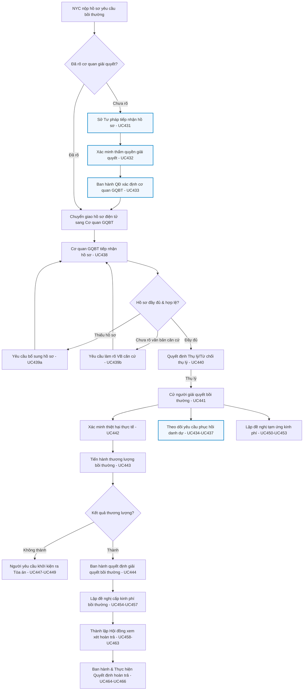

# TÀI LIỆU ĐẶC TẢ YÊU CẦU NGHIỆP VỤ (BA FEATURE SPECIFICATION) - PHÂN HỆ BỒI THƯỜNG NHÀ NƯỚC (BTNN)

Tài liệu này đặc tả chi tiết thiết kế hệ thống phần mềm nghiệp vụ hỗ trợ Cán bộ giải quyết bồi thường, Thủ trưởng cơ quan và các bên liên quan thực hiện các thủ tục giải quyết bồi thường, cấp kinh phí bồi thường và xem xét trách nhiệm hoàn trả theo đúng quy định của pháp luật.

---

## PHẦN I: TỔNG QUAN HỆ THỐNG & PHÂN QUYỀN CHUNG

### 1. Luồng Nghiệp Vụ Tổng Thể Chuẩn Hóa (Workflow Text-Flow & Diagram)

Dưới đây là sơ đồ luồng dữ liệu và nghiệp vụ giải quyết bồi thường nhà nước:

```
[Chuẩn bị hồ sơ - NYC] 
    → Tiếp nhận hồ sơ YCBT (UC438) [đa kênh: Trực tiếp / Bưu chính / Cổng DVC]
    → Kiểm tra hồ sơ
         ├─ Thiếu hồ sơ ──────────→ Yêu cầu bổ sung hồ sơ (UC439a) → [chờ NYC bổ sung]
         ├─ Cần làm rõ VB căn cứ ─→ Yêu cầu cung cấp/làm rõ VB (UC439b) → [chờ CQNN phản hồi]
         └─ Đầy đủ ──────────────→ Kiểm tra điều kiện thụ lý (UC440)
                                        ├─ Không đủ điều kiện → Không thụ lý + Trả hồ sơ → Kết thúc
                                        └─ Đủ điều kiện → Thụ lý hồ sơ
                                              → Cử người giải quyết (UC441)
                                              ├─[song song, độc lập]→ Có YC phục hồi danh dự? 
                                              │        └─ Có → Quy trình Phục hồi danh dự (II.1.2, chạy song song)
                                              └─[luồng chính]→ Có đề nghị tạm ứng?
                                                       ├─ Có → Đề nghị tạm ứng (UC450) → Duyệt (UC451) → Quản lý KP (II.2)
                                                       └────────────────────────────────┐
                                                                                          ↓
                                              Cập nhật xác minh thiệt hại (UC442) ⇄ Tạm đình chỉ (nếu có căn cứ Đ50)
                                                       ↓
                                              Cập nhật thương lượng (UC443) ⇄ Tạm đình chỉ (nếu có căn cứ Đ50)
                                                       ├─ Không thành → NYC có quyền khởi kiện ra Tòa (→ chuyển II.1.4)
                                                       └─ Thành → Ban hành QĐ giải quyết BT (UC444)
                                                                → Cần cấp kinh phí?
                                                                     ├─ Có → Quản lý kinh phí BT (II.2: UC454-457)
                                                                     └─ Phương án khác (phục hồi DD/khôi phục quyền lợi đã xử lý song song ở nhánh trên)
                                                                → Kết thúc
```



### 2. Ma Trận Phân Quyền Vai Trò (Role-Permission Matrix)

| Nhóm chức năng | Chuyên viên thụ lý | Thủ trưởng cơ quan | Lãnh đạo cơ quan cấp trên | Cán bộ Tài chính |
| :--- | :---: | :---: | :---: | :---: |
| **GQBT hành chính** | Xem, tạo nháp, cập nhật | Ký số phê duyệt | Xem giám sát | - |
| **GQBT tại Tòa án** | Nhập liệu, liên kết vụ việc | Xem báo cáo | Xem | - |
| **Kinh phí bồi thường** | Lập đề xuất, cập nhật chi | Duyệt đề xuất | Xem | Phê duyệt cấp phát |
| **Xem xét hoàn trả** | Khởi tạo, gán thành viên | Ký quyết định hoàn trả | Xem | - |

### 3. Quy Tắc Kiểm Soát Thời Hạn (SLA Timer Rules)

Mỗi hồ sơ yêu cầu giải quyết bồi thường được hệ thống áp dụng các quy tắc đếm ngược thời gian thực (Countdown SLA) theo đúng Luật TNBTCNN 2017:

1.  **Xác định cơ quan GQBT (Điều 41.4)**: Tối đa **05 ngày làm việc** kể từ ngày tiếp nhận.
2.  **Yêu cầu bổ sung hồ sơ (Điều 42.2)**: Tối đa **05 ngày làm việc** kể từ ngày tiếp nhận. Người yêu cầu có **05 ngày làm việc** để bổ sung.
3.  **Thụ lý hồ sơ (Điều 43.1)**: Tối đa **02 ngày làm việc** kể từ ngày nhận hồ sơ hợp lệ.
4.  **Cử người giải quyết (Điều 43.3)**: Tối đa **02 ngày làm việc** kể từ ngày thụ lý.
5.  **Xác minh thiệt hại (Điều 45.1)**: Tối đa **15 ngày** kể từ ngày thụ lý (vụ phức tạp tối đa **30 ngày**; được thỏa thuận kéo dài tối đa **15 ngày**).
6.  **Thương lượng bồi thường (Điều 46.1)**: Tổ chức trong vòng **02 ngày làm việc** kể từ ngày có Báo cáo xác minh. Thời gian thương lượng tối đa **10 ngày** (phức tạp tối đa **15 ngày**; được thỏa thuận kéo dài tối đa **10 ngày**).
7.  **Đề nghị cấp kinh phí (Điều 62.1)**: Tối đa **02 ngày làm việc** kể từ ngày quyết định/bản án bồi thường có hiệu lực.
8.  **Thành lập Hội đồng hoàn trả (Điều 66.1)**: Tối đa **10 ngày** kể từ ngày hoàn tất chi trả tiền bồi thường.

---

## PHẦN II: ĐẶC TẢ CHI TIẾT CÁC PHÂN HỆ NGHIỆP VỤ & USE CASES

### II.1. Quản lý việc giải quyết yêu cầu bồi thường

#### II.1.1. Xác định cơ quan giải quyết bồi thường

##### UC431: Nhập yêu cầu xác định cơ quan giải quyết bồi thường
*   **Mục đích**: Chuyên viên tiếp nhận hồ sơ yêu cầu xác định cơ quan giải quyết bồi thường từ người dân (trực tiếp hoặc bưu chính) khi chưa rõ cơ quan chịu trách nhiệm.
*   **Phân quyền**: Chuyên viên thụ lý (Sở Tư pháp/Cục ĐGDBĐ&BTNN).
*   **Thiết kế Giao diện**: Biểu mẫu nhập liệu 2 cột, hỗ trợ tải lên nhiều file văn bản scan. Có nút "In giấy tiếp nhận hồ sơ".
*   **Đặc tả trường dữ liệu**:
    *   *Họ tên người yêu cầu*: String(255), Bắt buộc.
    *   *Loại giấy tờ*: Dropdown (CCCD/Căn cước, Hộ chiếu, Chứng minh nhân dân, Giấy tờ khác), Bắt buộc.
    *   *Số giấy tờ*: String(255), Bắt buộc.
    *   *Ngày cấp*: Date, Bắt buộc.
    *   *Nơi cấp*: String(255), Bắt buộc.
    *   *Quốc gia*: String(255), Bắt buộc. Mặc định là Việt Nam
    *   *Tỉnh/TP*: String(255), Bắt buộc. Chỉ hiển thị khi Quốc gia là Việt 
    *   *Địa chỉ liên hệ*: String(500), Bắt buộc.
    *   *Hành vi gây thiệt hại của người thi hành công vụ gây thiệt hại*: Text(1000), Bắt buộc.
    *   *Văn bản đính kèm*: Tệp tin (PDF/Word), Bắt buộc.
*   **Quy tắc nghiệp vụ**: 
    *   Hệ thống tự động sinh Mã hồ sơ theo quy chuẩn: `XD-[NĂM]-[STT]` (Ví dụ: `XD-2027-0015`).
    *   Bấm "In giấy tiếp nhận": Hệ thống tự động điền các trường thông tin vào biểu mẫu tiếp nhận theo định dạng PDF để in ra trao cho công dân.

##### UC432: Thực hiện xác định cơ quan giải quyết bồi thường
*   **Mục đích**: Xem danh sách hồ sơ cần xác định cơ quan, thực hiện rà soát thẩm quyền và cập nhật hồ sơ xác định.
*   **Phân quyền**: Chuyên viên thụ lý.
*   **Thiết kế Giao diện**: Màn hình danh sách có bộ lọc tìm kiếm theo SLA đếm ngược. Nhấp đúp vào dòng để mở form xử lý chi tiết.
*   **Quy tắc nghiệp vụ & Tính năng thông minh**:
    *   **Smart Routing Suggestion (Gợi ý tự động)**: Khi chuyên viên nhập tên cơ quan cũ của cán bộ gây thiệt hại $\rightarrow$ Hệ thống tự động tra cứu CSDL tổ chức hành chính để phát hiện xem cơ quan đó có bị chia tách, sáp nhập hay giải thể hay không. Từ đó gợi ý cơ quan tiếp nhận kế thừa nghĩa vụ theo Điều 40 Luật TNBTCNN 2017.
    *   Trường *Căn cứ pháp lý xác định*: Dropdown bắt buộc chọn (Khoản 1a, 1b, 1c, 1d, 1đ Điều 40).
    *   Trường *Cơ quan đề xuất giải quyết*: Chọn từ danh mục Cơ quan nhà nước của hệ thống.

##### UC433: Cập nhật kết quả việc xác định cơ quan giải quyết bồi thường
*   **Mục đích**: Nhập Quyết định xác định cơ quan giải quyết chính thức, ký số ban hành và chuyển giao hồ sơ sang cơ quan GQBT.
*   **Phân quyền**: Chuyên viên thụ lý (Lập dự thảo) $\rightarrow$ Thủ trưởng cơ quan (Ký số phê duyệt).
*   **Thiết kế Giao diện**: Popup PDF Preview hỗ trợ xem trước mẫu văn bản quyết định và tích hợp nút Ký số (USB Token / Cloud CA).
*   **Quy tắc nghiệp vụ**:
    *   Khi Thủ trưởng thực hiện **Ký số ban hành**:
        1.  Trạng thái hồ sơ chuyển thành `ĐÃ CHUYỂN GIAO`.
        2.  Hệ thống tự động đóng gói toàn bộ hồ sơ (metadata + file đính kèm) và đồng bộ trực tuyến sang tài khoản cơ quan GQBT mới được xác định để thụ lý.
        3.  Tự động gửi SMS/Email thông báo cho người dân: *"Hồ sơ mã [MaHoSo] đã được xác định cơ quan giải quyết là [TenCoQuan] và đã được chuyển giao thụ lý."*

---

#### II.1.2. Phục hồi danh dự

> [!NOTE]
> Quy trình Phục hồi danh dự chạy **song song và độc lập** với tiến trình xác minh/thương lượng thiệt hại vật chất, được kích hoạt ngay sau khi hồ sơ bồi thường được thụ lý chính thức và cử người giải quyết, không phụ thuộc vào tiến độ luồng chính.

##### UC434: Nhập thông tin về việc phục hồi danh dự
*   **Mục đích**: Ghi nhận yêu cầu phục hồi danh dự từ người bị thiệt hại và cập nhật các thông tin cơ bản.
*   **Phân quyền**: Chuyên viên thụ lý.
*   **Thiết kế Giao diện**: Tab độc lập nằm trong hồ sơ GQBT chính (Được kích hoạt ngay sau khi thụ lý + cử chuyên viên).
*   **Đặc tả trường dữ liệu**:
    *   *Yêu cầu phục hồi danh dự*: Checkbox.
    *   *Hình thức yêu cầu*: Checkbox nhiều chọn: `{Trực tiếp xin lỗi và cải chính công khai tại nơi cư trú/làm việc (Điều 58), Đăng báo xin lỗi công khai (Điều 59)}`.
    *   *Nội dung yêu cầu chi tiết*: Text(2000), Không bắt buộc.
    *   *File đơn yêu cầu phục hồi danh dự đính kèm*: Tệp tin.

##### UC435: Thông báo tổ chức thực hiện phục hồi danh dự
*   **Mục đích**: Ban hành văn bản thông báo của cơ quan bồi thường về việc tổ chức thực hiện phục hồi danh dự gửi cho người bị thiệt hại.
*   **Phân quyền**: Chuyên viên thụ lý (Soạn thảo) $\rightarrow$ Thủ trưởng cơ quan (Phê duyệt gửi đi).
*   **Quy tắc nghiệp vụ**:
    *   *Thời hạn (SLA)*: Hệ thống đếm ngược **15 ngày** kể từ ngày có văn bản làm căn cứ yêu cầu bồi thường (Điều 57.1) để nhắc nhở cán bộ gửi Thông báo.
    *   Hệ thống hỗ trợ xuất file tự động Thông báo theo Mẫu biểu chuẩn quy định.

##### UC436: Nhập thông tin ý kiến của người bị thiệt hại
*   **Mục đích**: Cập nhật văn bản phản hồi, sự đồng ý hoặc đề xuất thay đổi thời gian/địa điểm tổ chức xin lỗi của người bị thiệt hại.
*   **Phân quyền**: Chuyên viên thụ lý.
*   **Đặc tả trường dữ liệu**:
    *   *Ý kiến của người bị thiệt hại*: Radio `{Đồng ý với thông báo, Đề nghị thay đổi nội dung}`.
    *   *Nội dung đề nghị thay đổi*: Text(1000).
    *   *Ngày nhận văn bản ý kiến*: Date, Bắt buộc.
    *   *File văn bản ý kiến đính kèm*: Tệp tin.

##### UC437: Cập nhật kết quả việc thực hiện phục hồi danh dự
*   **Mục đích**: Ghi nhận biên bản thực tế và các tài liệu chứng minh việc xin lỗi công khai đã hoàn tất.
*   **Phân quyền**: Chuyên viên thụ lý.
*   **Thiết kế Giao diện**: Form cập nhật kết quả kèm trường đính kèm link báo hoặc hình ảnh.
*   **Đặc tả trường dữ liệu**:
    *   *Đối với hình thức Xin lỗi trực tiếp*: Cập nhật Ngày tổ chức, Địa điểm tổ chức, Thành phần tham gia, Đính kèm File scan Biên bản buổi xin lỗi trực tiếp.
    *   *Đối với hình thức Đăng báo*: Cập nhật Tên tờ báo đăng (Trung ương/Địa phương), Ngày đăng 3 số liên tiếp, Liên kết (Link) bài viết cải chính điện tử, Ảnh chụp 3 trang báo in.
    *   *Trạng thái phục hồi danh dự*: Enum `{Chưa thực hiện, Đang chuẩn bị, Đã hoàn thành}`.

---

#### II.1.3. Giải quyết yêu cầu bồi thường

##### UC438: Tiếp nhận hồ sơ yêu cầu bồi thường
*   **Mục đích**: Tiếp nhận chính thức hồ sơ yêu cầu bồi thường của công dân từ các kênh (Trực tiếp, Bưu chính, Cổng Dịch vụ công) theo đúng biểu mẫu pháp lý ban hành kèm theo **Thông tư số 04/2018/TT-BTP ngày 17/5/2018** (đảm bảo độ chính xác pháp lý, tránh nhầm lẫn với TT 08/2019/TT-BTP dùng cho công tác báo cáo).
*   **Phân quyền**: Chuyên viên thụ lý.
*   **Thiết kế Giao diện**: Giao diện tab-wizard phân chia cụ thể các khối dữ liệu.
*   **Đặc tả các khối dữ liệu chi tiết (Mẫu 01/BTNN)**:
    1.  **Khối thông tin chung (Người yêu cầu)**:
        *   *Cơ quan nhận (Kính gửi)*: Danh mục cơ quan (FK), tự động điền nếu hồ sơ chuyển từ bước UC433.
        *   *Họ tên / Tên tổ chức NYC*: String(255), Bắt buộc.
        *   *Loại giấy tờ thân nhân*: Enum (Tách biệt theo Loại người yêu cầu):
            *   *Cá nhân*: `{CCCD, Thẻ căn cước, Căn cước điện tử, Giấy chứng nhận căn cước, Hộ chiếu, Giấy tờ tương ứng khác}`.
            *   *Tổ chức*: `{Quyết định thành lập, GCN đăng ký doanh nghiệp, Giấy đăng ký hộ kinh doanh, GCN đăng ký đầu tư, Giấy phép tương đương}`.
        *   *Số/Ngày cấp/Nơi cấp*: Ký tự, Bắt buộc.
        *   *Địa chỉ*: Ký tự, Bắt buộc (Cá nhân: Nơi cư trú; Tổ chức: Trụ sở chính tại thời điểm nộp).
        *   *SĐT/Email*: Ký tự, Không bắt buộc.
        *   *Tư cách người yêu cầu*: Radio chọn 1 trong 6 tư cách cụ thể của Luật:
            1. Người bị thiệt hại.
            2. Người thừa kế của người bị thiệt hại.
            3. Người đại diện cho những người thừa kế (khi có từ 2 người thừa kế trở lên).
            4. Đại diện cho tổ chức kế thừa quyền/nghĩa vụ của tổ chức bị thiệt hại.
            5. Người đại diện theo pháp luật của người bị thiệt hại.
            6. Người/pháp nhân được ủy quyền.
            *(Hệ thống tự động sinh câu chữ tương thích khi in mẫu. Nếu chọn tư cách số 3: Bắt buộc đính kèm văn bản cử đại diện và danh sách những người thừa kế còn lại).*
    2.  **Khối văn bản làm căn cứ & Hành vi gây thiệt hại**:
        *   *Văn bản làm căn cứ bồi thường*: Sub-form (Số hiệu, Ngày ban hành, Cơ quan ban hành, Trích yếu văn bản pháp lý xác định công chức làm sai).
        *   *Hành vi gây thiệt hại*: Text(1000), Bắt buộc.
        *   *Mối quan hệ nhân quả*: Text(1000), Bắt buộc.
    3.  **Khối I. Thiệt hại yêu cầu bồi thường (Phân loại theo Điều 23 - Điều 28)**:
        *   Thiết kế bảng lưới gồm 3 cột: `[Loại thiệt hại] - [Cách tính/Diễn giải công thức áp dụng] - [Số tiền yêu cầu]`.
        *   Các loại thiệt hại gồm: 
            1. Thiệt hại do tài sản bị xâm phạm.
            2. Thiệt hại do thu nhập thực tế bị mất/giảm sút.
            3. Thiệt hại vật chất do người bị thiệt hại chết.
            4. Thiệt hại vật chất do sức khỏe bị xâm phạm.
            5. Thiệt hại về tinh thần.
            6. Chi phí hợp lý khác.
        *   *Quy tắc Validate*: Khi tích chọn loại thiệt hại nào, bắt buộc phải nhập cả "Cách tính" và "Số tiền yêu cầu" của loại đó (Không được để trống 1 trong 2).
        *   *Tổng số tiền yêu cầu bồi thường (Số & Chữ)*: Hệ thống tự động tính tổng (Không cho sửa tay) và tự động chuyển đổi số tiền thành chữ tiếng Việt chính xác.
    4.  **Khối II. Đề nghị tạm ứng kinh phí**:
        *   *Có đề nghị tạm ứng?*: Checkbox. Nếu tích sẽ mở ra các trường:
            *   *Thiệt hại tinh thần đề nghị tạm ứng*: Số tiền (Validate: Chỉ cho phép nhập nếu mục "Thiệt hại tinh thần" ở khối trên > 0. Áp dụng cho khoản 1, 2, 3, 4, 6 Điều 27; hệ thống sẽ tự động vô hiệu hóa nếu chỉ yêu cầu bồi thường tinh thần thuộc khoản 5).
            *   *Tài liệu chứng cứ kèm tạm ứng tinh thần*: Upload file.
            *   *Thiệt hại khác tính được ngay đề nghị tạm ứng*: Ghi rõ loại thiệt hại (chọn từ các mục còn lại của khối trên) + Số tiền đề nghị tạm ứng.
            *   *Tài liệu chứng cứ kèm*: Upload file.
            *   *Tổng số tiền tạm ứng (Số & Chữ)*: Tự động tính toán (Validate: Tổng tạm ứng phải <= Tổng số tiền yêu cầu bồi thường).
            *   *Thông tin người NHẬN tạm ứng (Tách biệt khỏi người yêu cầu)*: Họ tên người nhận, Giấy tờ thân nhân, Địa chỉ, Phương thức nhận tiền (Tiền mặt / Chuyển khoản). Nếu chuyển khoản, bắt buộc nhập Số TK, Chủ TK, Ngân hàng. Mặc định tự động điền theo thông tin NYC nhưng cho phép sửa (chú thích 9 mẫu).
    5.  **Khối III. Các nội dung khác**:
        *   *Đề nghị thu thập văn bản làm căn cứ*: Nhập Tên văn bản + Địa chỉ thu thập (Không bắt buộc, chỉ hiện khi người dân khai báo không tự thu thập được văn bản).
        *   *Yêu cầu phục hồi danh dự*: Checkbox. Nếu tích chọn sẽ tự động mở liên kết chuyển dữ liệu sang phân hệ Phục hồi danh dự (II.1.2).
        *   *Khôi phục quyền/lợi ích hợp pháp khác*: Checkbox + nội dung nhập chi tiết.
        *   *Địa điểm, ngày lập đơn*: Ký tự + Date, Bắt buộc.
        *   *Chữ ký / Điểm chỉ*: Đính kèm ảnh chụp chữ ký hoặc điểm chỉ đối với cá nhân; chữ ký người đại diện + đóng dấu đối với tổ chức.
        *   *Danh mục tài liệu gửi kèm*: Bảng lưới gồm STT (tự sinh), Tên tài liệu, File đính kèm để quản lý siêu dữ liệu (metadata) của từng tài liệu thay vì upload file chung chung.

##### UC438a (Mới): Kết xuất Mẫu 01/BTNN
*   **Mục đích**: Cho phép chuyên viên hoặc người dân kết xuất/in toàn bộ thông tin đã nhập tại UC438 ra định dạng file PDF/DOCX đúng chuẩn Mẫu 01/BTNN ban hành kèm theo Thông tư số 04/2018/TT-BTP.

##### UC439a: Yêu cầu bổ sung hồ sơ yêu cầu bồi thường
*   **Mục đích**: Gửi thông báo yêu cầu người dân bổ sung giấy tờ khi hồ sơ chưa đầy đủ trong thời hạn kiểm tra 05 ngày làm việc (Theo Điều 42.2.a).
*   **Phân quyền**: Chuyên viên thụ lý.
*   **Quy tắc nghiệp vụ**:
    *   Hệ thống cho phép tick chọn các giấy tờ thiếu từ danh mục checklist chuẩn hóa.
    *   Tự động tính toán và hiển thị Hạn chót bổ sung (Ngày hiện tại + 05 ngày làm việc).
    *   Kết xuất và in Thông báo yêu cầu bổ sung hồ sơ.

##### UC439b (Mới): Yêu cầu cung cấp/làm rõ văn bản làm căn cứ yêu cầu bồi thường
*   **Mục đích**: Gửi văn bản yêu cầu cơ quan nhà nước đã ban hành văn bản làm căn cứ cung cấp hoặc giải thích rõ nội dung văn bản phục vụ giải quyết bồi thường (Điều 42.2.b).
*   **Phân quyền**: Chuyên viên thụ lý.
*   **Đặc tả trường dữ liệu**:
    *   *Loại yêu cầu*: Radio `{Người yêu cầu đề nghị thu thập hộ văn bản, Cơ quan bồi thường chủ động yêu cầu làm rõ văn bản}`.
    *   *Cơ quan nhận yêu cầu*: Chọn từ danh mục cơ quan ban hành.
    *   *Nội dung cần cung cấp/làm rõ*: Text(1000), Bắt buộc.
    *   *Thời hạn phản hồi (SLA)*: Tự động điền hạn chót = Ngày gửi + 05 ngày làm việc (Điều 42.3).
    *   *Trạng thái yêu cầu*: Enum `{Đã gửi, Đã nhận phản hồi, Quá hạn}`.

##### UC440: Thụ lý hồ sơ yêu cầu bồi thường
*   **Mục đích**: Thủ trưởng cơ quan xem xét hồ sơ đề xuất thụ lý của chuyên viên, đưa ra quyết định thụ lý hoặc từ chối thụ lý.
*   **Phân quyền**: Thủ trưởng cơ quan.
*   **Thiết kế Giao diện**: Màn hình xem hồ sơ tóm tắt kèm theo 2 nút hành động lớn: **[Quyết định thụ lý]** và **[Từ chối thụ lý]**.
*   **Quy tắc nghiệp vụ**:
    *   Nếu chọn **Từ chối thụ lý**: Bắt buộc chọn Lý do từ chối theo Điều 43 Khoản 2 (Lý do: Hết thời hiệu, Không thuộc phạm vi, Không có văn bản căn cứ...). Hệ thống tự động sinh và in Quyết định từ chối thụ lý kèm Biên bản trả lại hồ sơ cho công dân.
    *   Nếu chọn **Thụ lý**: Hệ thống ghi nhận vào Sổ thụ lý điện tử, sinh số thụ lý mới, thay đổi trạng thái vụ việc thành `ĐÃ THỤ LÝ - CHỜ PHÂN CÔNG`.

##### UC441: Cử người giải quyết yêu cầu bồi thường
*   **Mục đích**: Phân công cán bộ làm đầu mối chịu trách nhiệm chính trong việc xác minh và thương lượng giải quyết vụ việc.
*   **Phân quyền**: Thủ trưởng cơ quan.
*   **Thiết kế Giao diện**: Form phân công hiển thị danh sách chuyên viên rảnh việc kèm nút hành động.
*   **Quy tắc nghiệp vụ**:
    *   *SLA*: Bắt buộc thực hiện trong vòng **02 ngày làm việc** kể từ ngày thụ lý hồ sơ (Điều 43.3).
    *   Sau khi phân công, hệ thống tự động sinh Quyết định cử người giải quyết bồi thường gửi đến chuyên viên, đồng thời gửi email thông báo tự động cho chuyên viên được cử và gửi bản sao Quyết định cho Bộ Tư pháp/Sở Tư pháp để quản lý.

##### UC442: Cập nhật thông tin xác minh yêu cầu bồi thường
*   **Mục đích**: Chuyên viên cập nhật quá trình xác minh thiệt hại thực tế, bao gồm việc trưng cầu giám định, định giá tài sản và lập Báo cáo kết quả xác minh thiệt hại.
*   **Phân quyền**: Chuyên viên được cử giải quyết.
*   **Thiết kế Giao diện**: Vùng cập nhật tiến trình xác minh dạng dòng thời gian (Timeline logs).
*   **Đặc tả các hoạt động xác minh**:
    *   *Trưng cầu giám định / Định giá tài sản*: Cho phép nhập thông tin Cơ quan giám định, Chi phí dự tính, Ngày trưng cầu, Ngày nhận kết quả, đính kèm Kết luận giám định.
    *   *Báo cáo xác minh thiệt hại*: Trường bắt buộc nhập tóm tắt kết quả xác minh, số tiền thiệt hại thực tế xác minh được đối với từng loại thiệt hại. Bắt buộc đính kèm File Báo cáo kết quả xác minh (PDF).
*   **Quy tắc nghiệp vụ**:
    *   *Thời hạn Báo cáo*: Phải hoàn thành và tải lên hệ thống trong vòng **03 ngày làm việc** kể từ ngày kết thúc xác minh (Điều 45.1).

##### UC443: Cập nhật thông tin thương lượng bồi thường
*   **Mục đích**: Nhập kết quả các buổi thương lượng bồi thường giữa cơ quan giải quyết và người yêu cầu bồi thường.
*   **Phân quyền**: Chuyên viên giải quyết.
*   **Thiết kế Giao diện**: Màn hình quản lý các phiên họp thương lượng.
*   **Đặc tả các phiên thương lượng**:
    *   *Phiên thương lượng*: Thứ tự phiên (Phiên 1, Phiên 2...).
    *   *Thời gian & Địa điểm*: Date/Time + String.
    *   *Thành phần tham gia*: Đại diện Cơ quan giải quyết, Người yêu cầu, Chuyên viên thụ lý, Người làm chứng (nếu có).
    *   *Kết quả thương lượng*: Radio `{Thương lượng thành, Thương lượng không thành}`.
    *   *Biên bản thương lượng*: Bắt buộc đính kèm File scan Biên bản thương lượng có chữ ký hai bên.
*   **Quy tắc nghiệp vụ**:
    *   *SLA*: Phiên thương lượng đầu tiên phải được mở trong vòng **02 ngày làm việc** kể từ ngày ban hành Báo cáo xác minh thiệt hại (Điều 46.1).

##### UC444: Ban hành quyết định giải quyết bồi thường
*   **Mục đích**: Ký số và ban hành Quyết định giải quyết bồi thường chính thức sau khi thương lượng thành công.
*   **Phân quyền**: Thủ trưởng cơ quan.
*   **Thiết kế Giao diện**: PDF Viewer xem trước Quyết định giải quyết bồi thường và tích hợp chữ ký số.
*   **Quy tắc nghiệp vụ**:
    *   Quyết định giải quyết bồi thường được tự động điền các trường dữ liệu từ Biên bản thương lượng thành (Số tiền bồi thường, các hình thức khôi phục quyền lợi, thời hạn thanh toán).
    *   Khi ký ban hành: Trạng thái hồ sơ chuyển sang `ĐÃ CÓ QUYẾT ĐỊNH - HIỆU LỰC SAU 15 NGÀY`. Hệ thống tự động kích hoạt luồng Đề nghị cấp kinh phí bồi thường (UC454) sau 15 ngày đếm ngược (nếu người dân không khiếu nại hay khởi kiện).

##### UC445: Tra cứu quyết định giải quyết bồi thường
*   **Mục đích**: Tra cứu tất cả các Quyết định giải quyết bồi thường đã ban hành trên hệ thống theo các tiêu chí phục vụ báo cáo.
*   **Phân quyền**: Chuyên viên, Thủ trưởng cơ quan.
*   **Thiết kế Giao diện**: Trang tra cứu nâng cao với bảng lưới kết quả có bộ lọc: Mã hồ sơ, Cơ quan ban hành, Số quyết định, Năm ban hành, Số tiền bồi thường (từ... đến...). Hỗ trợ xuất file Excel (Kết xuất Excel).

##### UC446: Tra cứu thông tin về yêu cầu bồi thường
*   **Mục đích**: Tìm kiếm nhanh các hồ sơ yêu cầu bồi thường đang giải quyết hoặc đã lưu trữ.
*   **Phân quyền**: Tất cả cán bộ có quyền quản lý bồi thường.
*   **Thiết kế Giao diện**: Thanh tìm kiếm thông minh (Global Search) hỗ trợ gõ từ khóa tự động gợi ý (Họ tên người dân, số CCCD, Mã hồ sơ) kèm bảng kết quả phân trang chuẩn hóa.

---

#### II.1.4. Giải quyết YCBT theo thủ tục tố tụng

##### UC447: Nhập thông tin thụ lý YCBT / chấp nhận YCBT của Tòa án
*   **Mục đích**: Ghi nhận việc Tòa án thụ lý vụ án dân sự về yêu cầu bồi thường độc lập, hoặc thụ lý yêu cầu bồi thường kết hợp trong vụ án hành chính/hình sự.
*   **Phân quyền**: Chuyên viên thụ lý.
*   **Đặc tả trường dữ liệu**:
    *   *Tên Tòa án thụ lý*: Chọn từ danh mục Tòa án.
    *   *Số thụ lý của Tòa*: String(100), Bắt buộc.
    *   *Ngày thụ lý*: Date, Bắt buộc.
    *   *Tư cách tham gia tố tụng của cơ quan*: Radio `{Bị đơn, Người có quyền lợi nghĩa vụ liên quan}`.
    *   *File thông báo thụ lý của Tòa án*: Tệp tin.

##### UC448: Liên kết thông tin vụ việc YCBT đã có
*   **Mục đích**: Thực hiện liên kết hồ sơ tố tụng đang nhập với hồ sơ giải quyết hành chính cũ đã có sẵn trên hệ thống (đối với trường hợp thương lượng không thành trước đó).
*   **Phân quyền**: Chuyên viên thụ lý.
*   **Thiết kế Giao diện**: Ô tìm kiếm mã hồ sơ GQBT hành chính $\rightarrow$ Bấm liên kết $\rightarrow$ Hệ thống tự động hiển thị mối liên kết sơ đồ cây và hiển thị toàn bộ nhật ký thương lượng không thành cũ để cán bộ tố tụng tham khảo làm tài liệu tranh tụng tại Tòa.

##### UC449: Cập nhật thông tin Quyết định / Bản án có YCBT
*   **Mục đích**: Nhập kết quả phán quyết cuối cùng của Tòa án có hiệu lực pháp luật để làm căn cứ cấp kinh phí chi trả bồi thường.
*   **Phân quyền**: Chuyên viên thụ lý.
*   **Đặc tả trường dữ liệu**:
    *   *Số Bản án / Quyết định*: Ký tự, Bắt buộc.
    *   *Ngày ban hành*: Date, Bắt buộc.
    *   *Cơ quan ban hành*: Danh mục Tòa án.
    *   *Kết quả phán quyết*: Radio `{Chấp nhận yêu cầu bồi thường, Bác yêu cầu bồi thường}`.
    *   *Số tiền bồi thường theo tuyên án*: Số tiền (Chỉ nhập nếu chấp nhận).
    *   *File scan bản án đính kèm*: Tệp tin, Bắt buộc.
*   **Quy tắc nghiệp vụ**: 
    *   Nếu Bản án tuyên chấp nhận bồi thường và có hiệu lực: Trạng thái vụ việc chuyển sang `ĐÃ CÓ PHÁN QUYẾT TÒA ÁN - CHỜ CHI TRẢ`, tự động mở luồng lập đề nghị cấp kinh phí bồi thường (UC454).

---

### II.2. Quản lý kinh phí bồi thường

#### II.2.1. Cấp tạm ứng kinh phí bồi thường

##### UC450: Lập đề nghị cấp tạm ứng bồi thường
*   **Mục đích**: Chuyên viên lập hồ sơ đề xuất tạm ứng kinh phí gửi cơ quan tài chính khi người dân yêu cầu tạm ứng đối với các khoản thiệt hại tinh thần hoặc tài sản tính được ngay mà không cần xác minh.
*   **Phân quyền**: Chuyên viên giải quyết.
*   **Thiết kế Giao diện**: Form đề nghị tạm ứng tự động lấy thông tin từ UC438.
*   **Quy tắc kiểm soát số tiền**:
    *   **Tự động tính toán hạn mức**: Hệ thống tự động tính mức đề xuất tạm ứng tối thiểu là **50%** giá trị các thiệt hại về tinh thần (Điều 27) và thiệt hại khác tính được ngay (Điều 44.1).
    *   *Validate*: Tổng số tiền tạm ứng đề nghị không được vượt quá **Tổng số tiền yêu cầu bồi thường** đã nhập tại UC438.

##### UC451: Duyệt đề nghị cấp tạm ứng bồi thường
*   **Mục đích**: Thủ trưởng cơ quan duyệt gửi đề nghị cấp tạm ứng $\rightarrow$ Cơ quan tài chính duyệt cấp tiền tạm ứng từ ngân sách.
*   **Phân quyền**: Lãnh đạo cơ quan giải quyết (Duyệt trình ký) $\rightarrow$ Cán bộ cơ quan Tài chính (Phê duyệt cấp phát kinh phí).
*   **Quy tắc nghiệp vụ**:
    *   *SLA*: Cơ quan tài chính có thời hạn tối đa **07 ngày làm việc** kể từ ngày nhận đủ hồ sơ đề nghị để hoàn tất việc cấp phát kinh phí tạm ứng (Điều 44.2).

##### UC452: Cập nhật kết quả chi trả tạm ứng bồi thường
*   **Mục đích**: Ghi nhận việc chi trả tiền tạm ứng thực tế cho người dân để hệ thống ghi nợ ngân sách.
*   **Phân quyền**: Chuyên viên giải quyết.
*   **Đặc tả trường dữ liệu**:
    *   *Ngày chi trả tạm ứng thực tế*: Date, Bắt buộc.
    *   *Số tiền đã chi trả*: Số tiền, Bắt buộc.
    *   *Chứng từ chi trả (Phiếu chi/Ủy nhiệm chi)*: Đính kèm file ảnh/PDF.
    *   *Trạng thái chi trả*: Enum `{Đã tạm ứng, Lỗi giao dịch}`.

##### UC453: Tra cứu thông tin tạm ứng bồi thường
*   **Mục đích**: Thống kê số lượng tiền đã tạm ứng của các vụ việc trên hệ thống, phục vụ công tác quyết toán và đối chiếu sau này.
*   **Phân quyền**: Cán bộ giải quyết, Cán bộ tài chính.

---

#### II.2.2. Cấp kinh phí bồi thường chính thức

##### UC454: Lập đề nghị cấp kinh phí bồi thường
*   **Mục đích**: Sau khi Quyết định bồi thường hoặc Bản án của Tòa án có hiệu lực, chuyên viên lập hồ sơ đề nghị cấp kinh phí bồi thường toàn phần gửi cơ quan tài chính.
*   **Phân quyền**: Chuyên viên giải quyết.
*   **Quy tắc nghiệp vụ**:
    *   *Thời hạn (SLA)*: Phải hoàn tất lập hồ sơ đề nghị gửi đi trong vòng **02 ngày làm việc** kể từ ngày Quyết định/Bản án có hiệu lực (Điều 62.1).
    *   **Tự động đối chiếu số dư tạm ứng**: Hệ thống tự động hiển thị số tiền đã tạm ứng trước đó (nếu có) từ UC452 và thực hiện trừ (-) khấu trừ vào số tiền đề nghị cấp kinh phí chính thức để tính ra số tiền cần cấp phát thực tế còn lại.

##### UC455: Duyệt gửi đề nghị cấp kinh phí bồi thường
*   **Mục đích**: Thủ trưởng cơ quan giải quyết duyệt hồ sơ đề xuất cấp kinh phí chính thức của chuyên viên để gửi cơ quan tài chính.
*   **Phân quyền**: Thủ trưởng cơ quan.
*   **Quy tắc nghiệp vụ**:
    *   *SLA*: Cơ quan tài chính có thời hạn **05 ngày làm việc** kể từ ngày nhận đủ hồ sơ đề nghị cấp kinh phí để hoàn tất việc chuyển tiền vào tài khoản của cơ quan giải quyết bồi thường (Điều 62.4).

##### UC456: Cập nhật kết quả chi trả kinh phí bồi thường
*   **Mục đích**: Ghi nhận giao dịch chi trả tiền bồi thường cuối cùng cho công dân.
*   **Phân quyền**: Chuyên viên giải quyết.
*   **Đặc tả trường dữ liệu**:
    *   *Ngày chi trả*: Date, Bắt buộc.
    *   *Hình thức nhận*: Chuyển khoản / Tiền mặt.
    *   *Biên bản nghiệm thu chi trả tiền*: Bắt buộc đính kèm File scan Biên bản chi trả bồi thường có chữ ký xác nhận của công dân.
*   **Quy tắc nghiệp vụ & Quá hạn nhận (Điều 62.5 & 62.6)**:
    *   *SLA chi trả*: Phải thực hiện chi trả tiền bồi thường cho công dân trong vòng **02 ngày làm việc** kể từ ngày nhận được tiền cấp phát từ cơ quan tài chính (Điều 62.5).
    *   *Cảnh báo Quá hạn*: Nếu quá **03 năm** kể từ ngày gửi thông báo nhận tiền bồi thường mà người yêu cầu vẫn không đến nhận tiền, hệ thống tự động đưa ra cảnh báo khẩn cấp và chuyển trạng thái vụ việc sang `QUÁ HẠN NHẬN BỒI THƯỜNG - ĐỀ NGHỊ SUNG QUỸ` để cán bộ lập thủ tục trả lại ngân sách (Điều 62.6).

##### UC457: Tra cứu thông tin kinh phí bồi thường
*   **Mục đích**: Xem và kết xuất báo cáo thống kê tình hình cấp phát và giải ngân kinh phí bồi thường nhà nước trên toàn quốc hoặc địa bàn quản lý.

---

### II.3. Quản lý việc xem xét trách nhiệm hoàn trả

#### II.3.1. Hội đồng xem xét trách nhiệm hoàn trả

##### UC458: Nhập hồ sơ thành lập Hội đồng xem xét trách nhiệm hoàn trả
*   **Mục đích**: Khởi tạo hồ sơ lập Hội đồng đánh giá mức độ lỗi và nghĩa vụ hoàn trả tiền của công chức làm sai gây ra thiệt hại.
*   **Phân quyền**: Chuyên viên thụ lý.
*   **Thiết kế Giao diện**: Form nhập thành lập hội đồng, cho phép thêm dòng chọn nhân sự.
*   **Quy tắc nghiệp vụ**:
    *   *Thời hạn nhắc nhở*: Hệ thống tự động cảnh báo nhắc nhở lập Hội đồng trong vòng **10 ngày** kể từ ngày hoàn tất chi trả tiền bồi thường cho công dân (UC456 đã hoàn thành) (Điều 66.1).
    *   *Thành phần Hội đồng*: Bắt buộc gán vai trò rõ ràng gồm: Chủ tịch hội đồng (Lãnh đạo cơ quan), 01 Ủy viên đại diện tổ chức công đoàn, 01 Ủy viên là đại diện đơn vị tài chính/kế toán, 01 Ủy viên đại diện đơn vị quản lý cán bộ trực tiếp, Thư ký hội đồng.

##### UC459: Ký duyệt Quyết định thành lập Hội đồng
*   **Mục đích**: Thủ trưởng ký ban hành Quyết định thành lập Hội đồng xem xét trách nhiệm hoàn trả chính thức.
*   **Phân quyền**: Thủ trưởng cơ quan.
*   **Quy tắc nghiệp vụ**: Sau khi ký duyệt, hệ thống tự động kích hoạt trạng thái vụ việc hoàn trả thành `ĐANG XEM XÉT HOÀN TRẢ` và bắt đầu đếm ngược thời hạn hoạt động của Hội đồng là **20 ngày** (tối đa **30 ngày**) (Điều 66.2).

##### UC460: Tra cứu thông tin Quyết định thành lập Hội đồng
*   **Mục đích**: Tìm kiếm nhanh các Hội đồng hoàn trả đang hoạt động trên hệ thống theo tên công chức, mã vụ việc bồi thường.

##### UC461: Cập nhật quá trình làm việc của Hội đồng
*   **Mục đích**: Chuyên viên cập nhật biên bản các buổi họp thảo luận, trưng cầu ý kiến chuyên môn của Hội đồng hoàn trả.
*   **Phân quyền**: Chuyên viên giải quyết (Thư ký Hội đồng).
*   **Thiết kế Giao diện**: Lưới cập nhật nhật ký họp, cho phép tải lên biên bản họp định kỳ.

##### UC462: Cập nhật kiến nghị của Hội đồng về xem xét trách nhiệm hoàn trả
*   **Mục đích**: Cập nhật Văn bản kiến nghị chính thức của Hội đồng về mức hoàn trả gửi Thủ trưởng cơ quan xem xét ban hành Quyết định hoàn trả.
*   **Phân quyền**: Chuyên viên (Thư ký).
*   **Đặc tả trường dữ liệu**:
    *   *Họ tên công chức phải hoàn trả*: Chọn từ thành viên vụ việc.
    *   *Xác định mức độ lỗi*: Radio `{Lỗi cố ý, Lỗi vô ý}` (Căn cứ Điều 65).
    *   *Mức tiền hoàn trả kiến nghị*: Số tiền.
    *   *File Văn bản kiến nghị của Hội đồng*: Bắt buộc đính kèm File PDF có chữ ký các thành viên Hội đồng.

##### UC463: Tra cứu thông tin kiến nghị của Hội đồng về xem xét trách nhiệm hoàn trả
*   **Mục đích**: Tra cứu, quản lý lịch sử các kiến nghị hoàn trả của các vụ việc đã hoặc đang xử lý.

---

#### II.3.2. Ban hành và thực hiện Quyết định hoàn trả

##### UC464: Ban hành Quyết định hoàn trả
*   **Mục đích**: Thủ trưởng ban hành Quyết định hoàn trả chính thức đối với công chức gây ra thiệt hại.
*   **Phân quyền**: Thủ trưởng cơ quan.
*   **Thiết kế Giao diện**: Form ban hành kèm công cụ tính toán tự động thông minh.
*   **Reimbursement Calculator (Công cụ tính mức hoàn trả tự động)**:
    *   Hệ thống tích hợp sẵn công cụ tự động tính toán khung tiền hoàn trả gợi ý đúng theo quy định pháp lý tại Điều 65 Luật TNBTCNN 2017:
        *   **Nếu lỗi vô ý**: Mức hoàn trả tối đa không quá **03 tháng lương** của công chức tại thời điểm có quyết định hoàn trả (Nếu tiền bồi thường > 03 tháng lương) hoặc hoàn trả bằng đúng số tiền bồi thường (Nếu tiền bồi thường < 03 tháng lương).
        *   **Nếu lỗi cố ý nhưng chưa đến mức truy cứu trách nhiệm hình sự**: Mức hoàn trả tối đa không quá **36 tháng lương** của công chức (Nếu tiền bồi thường > 36 tháng lương) hoặc hoàn trả bằng đúng số tiền bồi thường (Nếu tiền bồi thường < 36 tháng lương).
        *   **Nếu lỗi cố ý và bị truy cứu trách nhiệm hình sự**: Mức hoàn trả bằng **100% số tiền bồi thường** đã chi trả (Không giới hạn trần tháng lương).
    *   *Validate*: Hệ thống tự động kiểm tra số tiền hoàn trả nhập tay của cán bộ xem có vượt mức trần tối đa theo quy định của tháng lương công chức đã khai báo hay không $\rightarrow$ Cảnh báo đỏ nếu vượt trần.

##### UC465: Cập nhật thực hiện hoàn trả
*   **Mục đích**: Theo dõi tiến độ thu hồi tiền hoàn trả thực tế từ công chức gây thiệt hại để nộp ngân sách nhà nước.
*   **Phân quyền**: Chuyên viên giải quyết (phối hợp với Kế toán cơ quan).
*   **Đặc tả phương thức thu hồi (Điều 68)**:
    *   *Hình thức nộp tiền*: Radio `{Trừ vào lương hàng tháng, Nộp một lần}`.
        *   *Nếu trừ vào lương*: Hệ thống cho phép nhập Số tiền trừ hàng tháng (Validate: Mức trừ hàng tháng phải nằm trong khoảng **10% đến tối đa 30%** mức lương thực tế hàng tháng của công chức - Điều 68.2).
    *   *Trạng thái đặc biệt (Hoãn hoàn trả - Điều 68.3)*: Checkbox `Đề nghị hoãn hoàn trả`. Nếu tick $\rightarrow$ Bắt buộc chọn Lý do hoãn `{Công chức là nữ đang mang thai, Công chức đang nuôi con nhỏ dưới 36 tháng tuổi}` $\rightarrow$ Hệ thống tự động tạm dừng tính toán công nợ hoàn trả cho đến khi kết thúc thời gian hoãn.
    *   *Trạng thái Dừng hoàn trả (Điều 72)*: Khi công chức chết $\rightarrow$ Chuyển trạng thái quyết định hoàn trả thành `CHẤM DỨT HOÀN TRẢ`.

##### UC466: Tra cứu thông tin thực hiện hoàn trả
*   **Mục đích**: Quản lý chi tiết công nợ hoàn trả của toàn bộ công chức làm sai trong cơ quan theo thời gian, theo dõi số tiền đã nộp lũy kế và số tiền còn phải nộp ngân sách. Tích hợp tính năng Kết xuất Excel báo cáo nợ hoàn trả.

---

## PHẦN III: PHƯƠNG ÁN BỐ TRÍ & THIẾT KẾ GIAO DIỆN TỐI ƯU (UX/UI PROPOSAL)

Để giải quyết triệt để 36 Use Cases một cách tiện dụng, tránh việc chia nhỏ hệ thống thành 36 trang web rời rạc gây khó khăn cho trải nghiệm của Cán bộ thụ lý, chúng tôi đề xuất phương án gom nhóm giao diện và tổ chức luồng như sau:

### 1. Phân hệ Giải quyết hồ sơ (II.1): Trục Hồ Sơ Tích Hợp (Timeline Stepper Dashboard)
Thay vì chuyển trang liên tục, toàn bộ quá trình giải quyết một vụ việc bồi thường từ thụ lý đến ban hành quyết định sẽ được tích hợp trên **một màn hình Dashboard duy nhất** theo bố cục:
*   **Bên trái (Vùng thông tin chính):** 
    *   Hiển thị thông tin hành chính của Hồ sơ yêu cầu (UC438) theo cấu trúc tab (Thông tin NYC | Các khoản thiệt hại | Đề nghị tạm ứng | Tài liệu đính kèm).
*   **Bên phải (Trục tiến trình giải quyết - Timeline Stepper):**
    *   Hiển thị tuần tự tiến trình thực tế của hồ sơ từ trên xuống dưới:
        1.  *Bước tiếp nhận & kiểm tra:* Gồm nút gửi Yêu cầu bổ sung hồ sơ (UC439a) và làm rõ văn bản (UC439b).
        2.  *Bước thụ lý & cử cán bộ:* Hiển thị Quyết định thụ lý (UC440), thông tin Cán bộ giải quyết được cử (UC441).
        3.  *Bước xác minh:* Nơi cập nhật các phiên xác minh, chi phí định giá, Báo cáo kết quả xác minh (UC442).
        4.  *Bước thương lượng:* Nhật ký các phiên thương lượng (UC443).
        5.  *Bước ban hành:* Ký số ban hành Quyết định giải quyết (UC444).
    *   *Cơ chế tự động định tuyến lại khi Tạm đình chỉ:* Nếu có Quyết định tạm đình chỉ (Điều 50), hệ thống sẽ đánh dấu đỏ tại bước đang tạm dừng (Ví dụ: `Đang thương lượng`). Khi có Quyết định giải quyết tiếp, hệ thống tự động mở lại đúng ô nhập liệu của bước đó, khóa các bước khác lại.

### 2. Phân hệ Phục hồi danh dự (II.1.2): Tab song song độc lập
*   Nằm độc lập dưới dạng một tab phụ kế bên Trục hồ sơ chính. Tab này sẽ sáng lên (kích hoạt xử lý) ngay khi trạng thái hồ sơ chuyển sang `Đã thụ lý` và có tick chọn yêu cầu phục hồi danh dự.
*   Cán bộ có thể vừa cập nhật lịch tổ chức xin lỗi trực tiếp (UC435 - UC436), vừa tiến hành các phiên xác minh thiệt hại vật chất ở bên ngoài mà không bị chồng chéo hay chặn luồng của nhau.

### 3. Phân hệ Kinh phí (II.2): Tiện ích Tự động Đối chiếu & Kiểm soát
*   Thiết kế giao diện Đề xuất cấp kinh phí (UC454) tự động hiển thị số tiền tạm ứng thực tế đã chi ở UC452 ngay cạnh ô Số tiền đề nghị thanh toán chính thức để cán bộ dễ dàng đối chiếu số dư nợ ngân sách.
*   Hệ thống tích hợp bộ lọc tìm kiếm theo SLA đếm ngược của các vụ việc chi trả giúp Lãnh đạo cơ quan tài chính (UC451) phát hiện nhanh các khoản bồi thường sắp quá hạn để ưu tiên giải ngân.

### 4. Phân hệ Hoàn trả (II.3): Reimbursement Calculator & Trực quan hóa công nợ công chức
*   **Trình tính toán tự động:** Thiết kế giao diện nhập liệu thông tin lương và phân loại lỗi của công chức dưới dạng thanh kéo trượt (Slider) trực quan. Công cụ Reimbursement Calculator tự động tính toán số tiền gợi ý và khóa giới hạn trần tối đa theo quy định pháp luật để ngăn ngừa sai phạm số liệu.
*   **Bảng theo dõi công nợ lương:** Thiết kế bảng lưới hiển thị danh sách các tháng thu hồi tiền hoàn trả. Kế toán cơ quan chỉ cần tích chọn tháng đã trừ lương $\rightarrow$ Hệ thống tự động ghi nhận số tiền thu hồi lũy kế và trừ vào dư nợ hoàn trả của công chức.

---

## PHẦN IV: ĐÁNH GIÁ TÍNH PHÁP LÝ & CẢNH BÁO PHÒNG NGỪA RỦI RO (LEGAL & COMPLIANCE WARNINGS)

### ⚠️ Cảnh báo quan trọng về Kênh tiếp nhận Cổng dịch vụ công (DVC)
*   **Pháp lý hiện hành:** Theo quy định tại Điều 41.4 Luật TNBTCNN 2017, người yêu cầu bồi thường chỉ được nộp hồ sơ qua 2 hình thức: **Nộp trực tiếp** hoặc **gửi qua dịch vụ bưu chính**. Luật chưa có điều khoản chính thức công nhận hình thức nộp qua Cổng dịch vụ công.
*   **Khuyến nghị BA:** Việc thiết kế hình thức nộp qua Cổng DVC là hoàn toàn phù hợp với xu hướng chuyển đổi số quốc gia, giúp tối ưu hóa tiện ích cho người dân. Tuy nhiên, đơn vị phát triển và BA cần làm việc với bộ phận Pháp chế của Bộ Tư pháp để trích xuất các văn bản hướng dẫn dưới Luật hoặc Nghị định liên quan về giao dịch điện tử trong hoạt động hành chính làm căn cứ pháp lý bổ trợ, đảm bảo tính hợp pháp tối đa khi đưa hệ thống vào vận hành thực tế.


********************* THÔNG TIN BỔ SUNG THÊM PHẦN THI HÀNH THEO BẢN ÁN **************
BỐI CẢNH
Form hiện tại: "Tiếp nhận hồ sơ yêu cầu bồi thường mới (Mẫu 01/BTNN)" trong hệ thống quản lý Bồi thường Nhà nước.
Form gồm các khối: (1) Loại yêu cầu giải quyết bồi thường, (2) Hình thức tiếp nhận / Lĩnh vực / Cơ quan giải quyết,
(3) Văn bản làm căn cứ yêu cầu bồi thường, (4) Thông tin chi tiết người yêu cầu bồi thường.

Cần bổ sung 1 nhánh xử lý mới: trường hợp đã có Bản án/Quyết định của Tòa án xác định sẵn mức bồi thường
(căn cứ Điều 54, Điều 55 Luật TNBTCNN 2017) — khi đó hồ sơ KHÔNG qua Xác minh thiệt hại/Thương lượng/
Quyết định giải quyết bồi thường như luồng thường, mà đi thẳng sang Chờ cấp phát kinh phí/Chờ chi trả
(hoặc Chờ thực hiện phục hồi danh dự). Bản án chỉ được đính kèm dưới dạng file — KHÔNG có OCR/trích xuất
tự động, mọi thông tin vẫn do cán bộ đọc bản án rồi tự nhập tay.

YÊU CẦU THAY ĐỔI

1. Bổ sung giá trị mới cho dropdown "Hình thức tiếp nhận hồ sơ":
   - Thêm lựa chọn: "Cán bộ chủ động lập hồ sơ (theo tố tụng/thi hành án)"
   - Giữ nguyên các lựa chọn hiện có

2. Bổ sung khối mới ngay sau "Loại yêu cầu giải quyết bồi thường":
   - Checkbox: "Đã có Bản án/Quyết định của Tòa án xác định mức bồi thường"
   - Khi tick, hiện thêm các trường:
     - "Nguồn phát sinh bản án" (select, bắt buộc): "Khởi kiện sau khi đã nộp đơn cho cơ quan (Điều 52)"
       / "Giải quyết trong quá trình tố tụng hình sự, tố tụng hành chính (Điều 55)"
     - "Hồ sơ yêu cầu bồi thường gốc liên quan" (lookup, chỉ hiện & bắt buộc khi Nguồn = "Khởi kiện sau khi
       đã nộp đơn"; ẩn khi Nguồn = Điều 55)
     - "File bản án/quyết định đính kèm" (upload, bắt buộc)
     - "Số bản án/quyết định" (text, bắt buộc)
     - "Ngày bản án/quyết định có hiệu lực pháp luật" (date, bắt buộc) — dùng làm mốc tính hạn cấp phát
       kinh phí (2 ngày làm việc) và hạn phục hồi danh dự (15 ngày) ở các bước xử lý tiếp theo

3. Trường "Văn bản làm căn cứ yêu cầu bồi thường":
   - Khi checkbox ở mục 2 được tick: ẩn ô nhập tự do hiện tại, thay bằng hiển thị chỉ đọc tham chiếu
     đúng tới "File bản án/quyết định đính kèm" vừa nhập ở mục 2 (không cho nhập tay 2 nơi gây lệch dữ liệu)

4. Khối "Thông tin chi tiết người yêu cầu bồi thường":
   - KHÔNG tự động điền (không OCR, không trích xuất) — giữ nguyên toàn bộ là các ô nhập tay
   - Khi checkbox ở mục 2 được tick, chia khối này thành 2 nhóm có nhãn phụ rõ ràng để cán bộ đối chiếu
     khi nhập, tránh gõ sai lệch với bản án đính kèm:
     a) Nhóm "Theo bản án" — thêm nhãn phụ nhỏ "(đối chiếu theo bản án đính kèm)" cạnh các trường:
        Họ và tên người yêu cầu bồi thường, Ngày tháng năm sinh, Địa chỉ chi tiết, Trạng thái người bị
        thiệt hại (Còn sống/Đã mất). Các trường này vẫn là ô nhập tay bình thường, không khóa, không
        pre-fill — chỉ thêm gợi ý UI để cán bộ biết cần đối chiếu đúng theo nội dung bản án đã đính kèm.
     b) Nhóm "Bổ sung ngoài bản án" — giữ nguyên như hiện tại, không thêm nhãn phụ: Loại giấy tờ thân
        nhân, Số giấy tờ, Ngày cấp, Nơi cấp, Quốc gia, Tỉnh/Thành phố, Tư cách người yêu cầu bồi thường —
        vì các trường này thường không có sẵn trong bản án, cán bộ phải tự thu thập thêm để phục vụ chi trả.
   - Khi "Trạng thái người bị thiệt hại" = "Đã mất", hiện thêm khối nhập thông tin người thừa kế/đại diện
     (áp dụng chung cho mọi luồng, không chỉ luồng có bản án — nếu form hiện tại chưa có thì bổ sung thêm)

5. Ẩn hoàn toàn trường/khối "Đề nghị tạm ứng kinh phí bồi thường" khi checkbox ở mục 2 được tick — vì
   tạm ứng chỉ áp dụng cho hồ sơ đang xử lý tại cơ quan (Điều 44), không áp dụng khi đã có bản án quyết
   sẵn mức bồi thường (đi thẳng cấp phát kinh phí chính thức theo Điều 62).

6. Luồng xử lý sau khi bấm "Lưu hồ sơ":
   - Nếu checkbox mục 2 KHÔNG tick: giữ nguyên luồng hiện tại (Chờ tiếp nhận → Chờ thụ lý → Xác minh
     thiệt hại → Thương lượng → Chờ ban hành QĐ → Chờ thực thi → Hoàn thành), rẽ nhánh theo "Loại yêu
     cầu giải quyết bồi thường" như logic đã có (chỉ phục hồi danh dự thì bỏ qua Xác minh/Thương lượng/QĐ).
   - Nếu checkbox mục 2 CÓ tick: hồ sơ đi thẳng tới trạng thái "Chờ thực thi" — cụ thể là "Chờ cấp phát
     kinh phí" nếu Loại yêu cầu có phần tiền, và/hoặc chuyển sang module Phục hồi danh dự (trạng thái
     "Đang thực hiện phục hồi danh dự") nếu Loại yêu cầu có phần phục hồi danh dự — bỏ qua hoàn toàn các
     bước Xác minh thiệt hại, Thương lượng, Chờ ban hành QĐ giải quyết bồi thường.
   - Nếu có chọn "Hồ sơ yêu cầu bồi thường gốc liên quan" ở mục 2: cập nhật trạng thái của hồ sơ gốc đó
     sang "Đang thực thi theo bản án", giữ liên kết 2 chiều để tra cứu được lịch sử đầy đủ từ lúc nộp đơn
     ban đầu đến khi thi hành án.

RÀNG BUỘC KHÔNG THAY ĐỔI
- Không thêm bất kỳ cơ chế OCR, AI trích xuất, hay tự động điền dữ liệu từ file bản án đính kèm.
- Không thay đổi hành vi của "Lĩnh vực phát sinh thiệt hại" và "Cơ quan giải quyết bồi thường".
- Toàn bộ validate bắt buộc (*) hiện có trên form giữ nguyên, chỉ thêm mới theo mục 2 ở trên.


7. Điều chỉnh màn "Xem chi tiết hồ sơ" để hỗ trợ 2 trường hợp:

   a) Hồ sơ loại cũ (tạo trước khi có tính năng này, không có giá trị cho checkbox mục 2) và
      hồ sơ Luồng A/B thường (checkbox mục 2 = false/null): hiển thị NGUYÊN VẸN như hiện tại,
      không thêm/ẩn bất kỳ thành phần nào.

   b) Hồ sơ Luồng D (checkbox mục 2 = true):
      - Thêm badge/nhãn nổi bật ở đầu trang chi tiết: "Hồ sơ thực hiện theo Bản án/Quyết định
        Tòa án"
      - Thêm khối "Thông tin bản án" ngay dưới badge, hiển thị: Nguồn phát sinh, Số bản án,
        Ngày có hiệu lực, File đính kèm, và (nếu có) link điều hướng sang "Hồ sơ yêu cầu bồi
        thường gốc liên quan"
      - Nếu hồ sơ này có "Hồ sơ gốc liên quan": trên màn chi tiết của HỒ SƠ GỐC đó cũng phải
        hiện thêm 1 dòng thông báo "Đã chuyển sang thực thi theo bản án" kèm link điều hướng
        ngược lại hồ sơ Luồng D — liên kết 2 chiều
      - Trong phần tiến trình xử lý (timeline hoặc các tab/mục): thay nội dung mục "Xác minh
        thiệt hại", "Thương lượng", "Quyết định giải quyết bồi thường" bằng trạng thái
        "Không áp dụng — đã được xác định trong bản án/quyết định của Tòa án" — KHÔNG để trống,
        KHÔNG hiển thị như đang chờ xử lý, để tránh gây hiểu nhầm là hồ sơ thiếu bước xử lý
      - Timeline tổng quan chỉ hiện các mốc: Tiếp nhận → Thụ lý → Ghi nhận bản án → Thực thi
        (Chờ cấp phát kinh phí/Chờ chi trả và/hoặc chuyển sang module Phục hồi danh dự)
      - Khối "Thông tin chi tiết người yêu cầu bồi thường" vẫn hiển thị đầy đủ như đã nhập ở
        form, giữ nguyên các nhãn phụ "(đối chiếu theo bản án đính kèm)" đã thêm ở mục 4

   c) Ở màn danh sách hồ sơ (nếu có cột trạng thái/loại), thêm 1 cột hoặc icon nhỏ để phân biệt
      nhanh hồ sơ Luồng D với hồ sơ thường, không cần mở chi tiết mới biết.