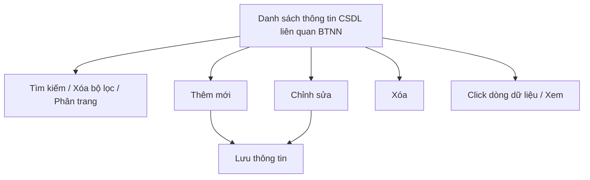

#### 4.3.3.20. UC503/UCPS018 - Quản lý thông tin từ các CSDL có liên quan đến công tác BTNN

##### 4.3.3.20.1. Mục đích

\- Cho phép cán bộ nghiệp vụ BTNN (Bộ Tư pháp) ghi nhận, quản lý và tra cứu thông tin trích xuất/tiếp nhận từ các cơ sở dữ liệu (CSDL) có liên quan đến công tác bồi thường nhà nước (BTNN), bao gồm CSDL về bản án, quyết định của Tòa án; CSDL quốc gia về thủ tục hành chính (TTHC); CSDL quốc gia về khiếu nại, tố cáo, phục vụ đối chiếu, theo dõi và tổng hợp công tác BTNN.

\- Nội dung chỉ phục vụ nội bộ cán bộ quản lý, không công khai ra Website khách hàng.

*a. Phân quyền*

\- Cán bộ nghiệp vụ BTNN (Bộ Tư pháp): được tra cứu, xem chi tiết, thêm mới, chỉnh sửa, xóa bản ghi.

*b. Điều kiện thực hiện*

\- Người dùng đã đăng nhập thành công vào Website quản trị.

\- Người dùng được phân quyền truy cập màn hình `Quản lý thông tin từ các CSDL có liên quan đến công tác BTNN`.

\- Cơ quan quản lý CSDL nguồn tham chiếu Danh mục các đơn vị trên hệ thống `[DM_DON_VI]`.

\- Màn hình ghi nhận thủ công thông tin cán bộ đã tra cứu/nhận được từ CSDL nguồn; không thực hiện kết nối, đồng bộ dữ liệu tự động với các CSDL nêu trên.

---

##### 4.3.3.20.2. Sơ đồ luồng nghiệp vụ theo giao diện

---

##### 4.3.3.20.3. MH01 - Màn hình Danh sách thông tin từ các CSDL liên quan đến công tác BTNN

###### 4.3.3.20.3.1. Màn hình

###### 4.3.3.20.3.2. Mô tả thông tin trên màn hình

| Trường thông tin | Kiểu dữ liệu | Bắt buộc | Mặc định | Mô tả |
| :--- | :--- | :--- | :--- | :--- |
| **I. Bộ lọc tìm kiếm** | | | | |
| Từ khóa | String(255) | Không | Trống | Tìm kiếm gần đúng theo `Tên/Mã bản ghi tham chiếu`. |
| Loại CSDL nguồn | Enum(String(100)) | Không | Tất cả | \- Giá trị gồm: + Tất cả + CSDL về bản án, quyết định của Tòa án + CSDL quốc gia về thủ tục hành chính (TTHC) + CSDL quốc gia về khiếu nại, tố cáo + Khác |
| Từ ngày trích xuất | Date | Không | Theo dữ liệu hệ thống | Định dạng `dd/mm/yyyy`. |
| Đến ngày trích xuất | Date | Không | Theo dữ liệu hệ thống | Định dạng `dd/mm/yyyy`. Áp dụng rule khoảng ngày [BR-VAL-007]. |
| **II. Bảng danh sách kết quả** | | | | |
| Cột: STT | Integer(10) | Không | Theo trang hiện tại | Chỉ đọc. Căn giữa, tăng theo phân trang. |
| Cột: Tên/Mã bản ghi tham chiếu | String(100) | Không | Theo dữ liệu hệ thống | Chỉ đọc. |
| Cột: Loại CSDL nguồn | Enum(String(100)) | Không | Theo dữ liệu hệ thống | Chỉ đọc. |
| Cột: Cơ quan quản lý CSDL nguồn | String(255) | Không | Theo dữ liệu hệ thống | Chỉ đọc. |
| Cột: Ngày trích xuất/nhận thông tin | Date | Không | Theo dữ liệu hệ thống | Chỉ đọc. Định dạng `dd/mm/yyyy`. |
| Cột: Vụ việc BTNN liên quan | String(255) | Không | Theo dữ liệu hệ thống | Chỉ đọc. Hiển thị `-` nếu chưa gắn thông tin. |
| Cột: Thao tác | String(255) | Không | Theo dữ liệu | Chỉ đọc. Gồm icon `Chỉnh sửa`, `Xóa`. |
| Phân trang | String(255) | Không | `20 bản ghi/trang` | Tuân thủ quy chuẩn phân trang chung [BR-UI-001]. |

###### 4.3.3.20.3.3. Chức năng trên màn hình

| STT | Tên chức năng | Định dạng | Mô tả |
| :--- | :--- | :--- | :--- |
| 1 | Tìm kiếm | Button | TH1 (Khoảng ngày không hợp lệ): Vi phạm [BR-VAL-007], hiển thị [MSG-ERR-VAL-007]. Không thực hiện tìm kiếm. |
|  |  |  | TH2 (Hợp lệ): Hệ thống lọc danh sách theo các tiêu chí đã nhập, cập nhật lưới kết quả và đưa về trang 1. |
| 2 | Xóa bộ lọc | Button | Hệ thống đặt lại toàn bộ tiêu chí lọc về giá trị mặc định và tải lại danh sách. |
| 3 | Thêm mới | Button | Hệ thống mở **4.3.3.20.4. MH02 - Màn hình Thêm mới/Chỉnh sửa thông tin CSDL liên quan BTNN** ở chế độ thêm mới. |
| 4 | Chỉnh sửa | Icon button | Hệ thống mở **4.3.3.20.4. MH02** ở chế độ chỉnh sửa. |
| 5 | Xóa | Icon button | Hệ thống mở **4.3.3.20.5. Popup Xác nhận** với nội dung [MSG-CFM-SYS-001]. Nếu xác nhận, hệ thống xóa vĩnh viễn bản ghi khỏi hệ thống và hiển thị [MSG-SUC-SYS-002]. |
| 6 | Click dòng dữ liệu | Row click | Hệ thống mở **4.3.3.20.4. MH02** ở chế độ chỉ xem. |

---

##### 4.3.3.20.4. MH02 - Màn hình Thêm mới/Chỉnh sửa thông tin CSDL liên quan BTNN

###### 4.3.3.20.4.1. Màn hình

###### 4.3.3.20.4.2. Mô tả thông tin trên màn hình

| Trường thông tin | Kiểu dữ liệu | Bắt buộc | Mặc định | Mô tả |
| :--- | :--- | :--- | :--- | :--- |
| Tiêu đề màn hình | String(255) | - | Theo ngữ cảnh | Chỉ đọc. Hiển thị `THÊM MỚI THÔNG TIN CSDL LIÊN QUAN BTNN` hoặc `CHỈNH SỬA THÔNG TIN CSDL LIÊN QUAN BTNN`. |
| Loại CSDL nguồn | Enum(String(100)) | Có | `CSDL về bản án, quyết định của Tòa án` | \- Giá trị gồm: + CSDL về bản án, quyết định của Tòa án + CSDL quốc gia về thủ tục hành chính (TTHC) + CSDL quốc gia về khiếu nại, tố cáo + Khác |
| Tên/Mã bản ghi tham chiếu | String(100) | Có | Trống | Ghi mã/số hiệu bản ghi tại CSDL nguồn (ví dụ số bản án, mã hồ sơ TTHC, số đơn khiếu nại/tố cáo). Áp dụng rule bắt buộc [BR-VAL-001]. |
| Cơ quan quản lý CSDL nguồn | Enum(String(255)) | Có | Trống | Giá trị lấy từ Danh mục các đơn vị trên hệ thống `[DM_DON_VI]`. Cho phép tìm kiếm nhanh theo `Mã đơn vị` hoặc `Tên đơn vị`; áp dụng tìm gần đúng. Áp dụng rule bắt buộc [BR-VAL-001]. |
| Ngày trích xuất/nhận thông tin | Date | Có | Ngày hiện tại | Áp dụng rule ngày quá khứ [BR-VAL-008]. |
| Vụ việc BTNN liên quan | String(255) | Không | Trống | Không bắt buộc liên kết với vụ việc trong hệ thống. Cán bộ có thể nhập mã vụ việc để tham khảo; để trống nếu không xác định cụ thể. |
| Nội dung thông tin liên quan đến BTNN | Text(2000) | Có | Trống | Ghi tóm tắt nội dung trích xuất từ CSDL nguồn có liên quan đến công tác BTNN. Áp dụng rule bắt buộc [BR-VAL-001]. |
| Tài liệu/minh chứng đính kèm | File | Không | Trống | Áp dụng [BR-FILE-010]. |
| Hủy bỏ | - | Không | Hiển thị | Chi tiết nghiệp vụ xem tại bảng Chức năng trên màn hình. |
| Lưu thông tin | - | Không | Hiển thị | Chi tiết nghiệp vụ xem tại bảng Chức năng trên màn hình. |

###### 4.3.3.20.4.3. Chức năng trên màn hình

| STT | Tên chức năng | Định dạng | Mô tả |
| :--- | :--- | :--- | :--- |
| 1 | Hủy bỏ | Button | Hệ thống đóng màn hình, không lưu dữ liệu và quay lại **4.3.3.20.3. MH01**. |
| 2 | Lưu thông tin | Button | TH1 (Bỏ trống trường bắt buộc): Vi phạm [BR-VAL-001]. Hệ thống tô viền đỏ ô trống đầu tiên và hiển thị [MSG-ERR-VAL-001]. Không cho phép lưu. |
|  |  |  | TH2 (`Ngày trích xuất/nhận thông tin` lớn hơn ngày hiện tại): Vi phạm [BR-VAL-008], hiển thị [MSG-ERR-VAL-008]. Không cho phép lưu. |
|  |  |  | TH3 (Hợp lệ - thêm mới): Hệ thống lưu bản ghi, đóng màn hình, tải lại danh sách và hiển thị [MSG-SUC-SYS-003]. |
|  |  |  | TH4 (Hợp lệ - chỉnh sửa): Hệ thống cập nhật bản ghi, đóng màn hình, tải lại danh sách và hiển thị [MSG-SUC-SYS-002]. |
| 3 | Tải lên | Button | Hệ thống mở trình chọn file cho `Tài liệu/minh chứng đính kèm`. |
| 4 | Xem file | Link | Cho phép xem file tại một tab riêng. |
| 5 | Xóa | Link | Hệ thống gỡ file khỏi danh sách file đã chọn trên màn hình trước khi lưu. |

---

##### 4.3.3.20.5. Popup Xác nhận

###### 4.3.3.20.5.1. Màn hình

###### 4.3.3.20.5.2. Mô tả thông tin trên màn hình

| Trường thông tin | Kiểu dữ liệu | Bắt buộc | Mặc định | Mô tả |
| :--- | :--- | :--- | :--- | :--- |
| Tiêu đề popup | String(255) | - | Theo thao tác | Chỉ đọc. Hiển thị icon cảnh báo và nội dung xác nhận theo thao tác đang thực hiện. |
| Nội dung xác nhận | Text(2000) | - | Theo thao tác | Chỉ đọc. Áp dụng message xác nhận [MSG-CFM-SYS-001]. |
| Hủy bỏ | - | Không | Hiển thị | Đóng popup, không thực hiện callback. |
| Đồng ý | - | Không | Hiển thị | Xác nhận thực hiện callback của thao tác đã gọi popup. |

###### 4.3.3.20.5.3. Chức năng trên màn hình

| STT | Tên chức năng | Định dạng | Mô tả |
| :--- | :--- | :--- | :--- |
| 1 | Hủy bỏ | Button | Hệ thống đóng popup xác nhận và không thực hiện thao tác. |
| 2 | Đồng ý | Button | Hệ thống đóng popup xác nhận và xóa vĩnh viễn bản ghi. |

---

##### 4.3.3.20.6. Ghi chú phạm vi đặc tả

\- Bản ghi áp dụng cơ chế xóa vĩnh viễn (hard delete), không lưu lại lịch sử sau khi xóa.

\- Màn hình chỉ phục vụ nội bộ cán bộ quản lý trên Website quản trị, không hiển thị trên Website khách hàng.

\- Đây là màn hình ghi nhận thủ công (log tham khảo), không phải màn hình tích hợp/đồng bộ API với CSDL nguồn; phạm vi tích hợp API (nếu có) sẽ được đặc tả riêng ở tài liệu khác khi có yêu cầu.
