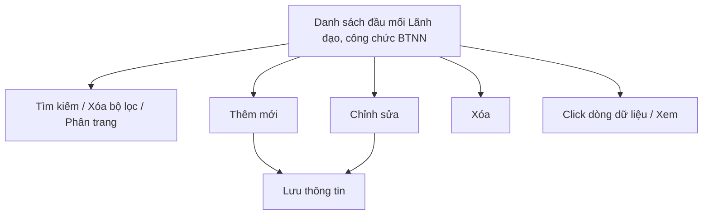

#### 4.3.3.19. UC501-502 - Quản lý thông tin đầu mối Lãnh đạo, công chức thực hiện công tác BTNN tại địa phương

##### 4.3.3.19.1. Mục đích

\- Cho phép cán bộ nghiệp vụ BTNN (Bộ Tư pháp) ghi nhận, quản lý và tra cứu danh sách đầu mối Lãnh đạo và công chức trực tiếp thực hiện công tác bồi thường nhà nước (BTNN) tại các Sở Tư pháp địa phương, phục vụ liên hệ, phối hợp công tác và theo dõi công tác BTNN theo Điều 8-15 Thông tư 08/2019/TT-BTP.

\- Nội dung chỉ phục vụ nội bộ cán bộ quản lý, không công khai ra Website khách hàng.

*a. Phân quyền*

\- Cán bộ nghiệp vụ BTNN (Bộ Tư pháp): được tra cứu, xem chi tiết, thêm mới, chỉnh sửa, xóa bản ghi.

*b. Điều kiện thực hiện*

\- Người dùng đã đăng nhập thành công vào Website quản trị.

\- Người dùng được phân quyền truy cập màn hình `Quản lý thông tin đầu mối Lãnh đạo, công chức thực hiện công tác BTNN tại địa phương`.

\- Tỉnh/Thành phố Tham chiếu Danh mục Tỉnh/Thành phố [DM_13]. Đơn vị tham chiếu Danh mục các đơn vị trên hệ thống `[DM_DON_VI]`.

---

##### 4.3.3.19.2. Sơ đồ luồng nghiệp vụ theo giao diện

---

##### 4.3.3.19.3. MH01 - Màn hình Danh sách đầu mối Lãnh đạo, công chức thực hiện công tác BTNN

###### 4.3.3.19.3.1. Màn hình

###### 4.3.3.19.3.2. Mô tả thông tin trên màn hình

| Trường thông tin | Kiểu dữ liệu | Bắt buộc | Mặc định | Mô tả |
| :--- | :--- | :--- | :--- | :--- |
| **I. Bộ lọc tìm kiếm** | | | | |
| Từ khóa | String(255) | Không | Trống | Tìm kiếm gần đúng theo `Họ và tên` hoặc `Số điện thoại`. |
| Tỉnh/Thành phố | Enum(String(100)) / String(100) | Không | Tất cả | Control UI: Combobox có tìm kiếm / Input text. - Nếu `Quốc gia` = `Việt Nam`: Tham chiếu Danh mục Tỉnh/Thành phố [DM_13]. Cho phép gõ tìm kiếm theo Mã hoặc Tên. - Nếu `Quốc gia` khác `Việt Nam`: Hiển thị ô nhập văn bản để người dùng tự do nhập. |
| Phường/Xã | Enum(String(100)) / String(100) | Không | Tất cả | Control UI: Combobox có tìm kiếm / Input text. - Phụ thuộc vào `Tỉnh/Thành phố` đã chọn. - Nếu `Quốc gia` = `Việt Nam`: Tham chiếu Danh mục Xã/Phường/Thị trấn [DM_15] (lọc động theo Tỉnh/Thành phố đã chọn). Cho phép gõ tìm kiếm theo Mã hoặc Tên. Nếu chưa chọn Tỉnh/Thành phố thì khóa mờ (Disabled) kèm placeholder *"Vui lòng chọn Tỉnh/Thành phố trước"*. - Nếu `Quốc gia` khác `Việt Nam`: Hiển thị ô nhập văn bản (Input text) để người dùng tự do nhập. |
| Vai trò phụ trách | Enum(String(50)) | Không | Tất cả | \- Giá trị gồm: + Tất cả + Lãnh đạo phụ trách công tác BTNN + Công chức đầu mối |
| Trạng thái | Enum(String(50)) | Không | Tất cả | \- Giá trị gồm: + Tất cả + Đang phụ trách + Đã ngừng phụ trách |
| **II. Bảng danh sách kết quả** | - | - | 20 bản ghi/trang | Control UI: Data grid. - Khi người dùng truy cập màn hình, hệ thống tự động tải trang đầu tiên (Trang 1) với số lượng mặc định 20 bản ghi. - Sắp xếp mặc định: Sắp xếp theo "Ngày tạo" giảm dần (mới nhất hiển thị lên đầu). - Trạng thái có dữ liệu: Hiển thị danh sách các bản ghi kết quả theo cấu trúc các cột quy định. - Trạng thái không có dữ liệu (Empty State): Khi không tìm thấy kết quả phù hợp với điều kiện tìm kiếm, bảng hiển thị duy nhất 01 dòng căn giữa trên toàn bộ chiều rộng bảng (`colspan`), in nghiêng với nội dung theo MessageList dùng chung [MSG-INF-SYS-001]. |
| Cột: STT | Integer(10) | Không | Theo trang hiện tại | Chỉ đọc. Căn giữa, tăng theo phân trang. |
| Cột: Tỉnh/Thành phố | Enum(String(100)) / String(100) | Không | Theo dữ liệu hệ thống | Chỉ đọc. Hiển thị Tỉnh/Thành phố; tham chiếu Danh mục Tỉnh/Thành phố [DM_13]. |
| Cột: Phường/Xã | Enum(String(100)) / String(100) | Không | Theo dữ liệu hệ thống | Chỉ đọc. Hiển thị Phường/Xã; tham chiếu Danh mục Xã/Phường/Thị trấn [DM_15], phụ thuộc vào Tỉnh/Thành phố. |
| Cột: Đơn vị | String(255) | Không | Theo dữ liệu hệ thống | Chỉ đọc. |
| Cột: Họ và tên | String(100) | Không | Theo dữ liệu hệ thống | Chỉ đọc. |
| Cột: Chức vụ | String(100) | Không | Theo dữ liệu hệ thống | Chỉ đọc. |
| Cột: Vai trò phụ trách | Enum(String(50)) | Không | Theo dữ liệu hệ thống | Chỉ đọc. |
| Cột: Số điện thoại | String(20) | Không | Theo dữ liệu hệ thống | Chỉ đọc. |
| Cột: Email | String(255) | Không | Theo dữ liệu hệ thống | Chỉ đọc. Hiển thị `-` nếu chưa nhập. |
| Cột: Trạng thái | Enum(String(50)) | Không | Theo dữ liệu hệ thống | Chỉ đọc. Hiển thị badge màu theo giá trị. |
| Cột: Thao tác | String(255) | Không | Theo dữ liệu | Chỉ đọc. Gồm icon `Chỉnh sửa`, `Xóa`. |
| Phân trang | String(255) | Không | 20 bản ghi/trang | Control UI: Pagination. - Cho phép chọn cấu hình số lượng bản ghi hiển thị trên mỗi trang gồm: 10, 20, 50, 100 bản ghi/trang; mặc định chọn sẵn 20 bản ghi/trang. - Đầy đủ các nút điều hướng trang: Đầu (&#124;&lt;&lt;), Trước (&lt;), các số trang, Sau (&gt;), Cuối (&gt;&gt;&#124;). - Hiển thị dải bản ghi: "Hiển thị [từ] - [đến] của [tổng số] bản ghi". |

###### 4.3.3.19.3.3. Chức năng trên màn hình

| STT | Tên chức năng | Định dạng | Mô tả |
| :--- | :--- | :--- | :--- |
| 1 | Tìm kiếm | Button | Khi người dùng click nút, hệ thống kiểm tra điều kiện dữ liệu và thực hiện tìm kiếm theo các trường hợp bên dưới: |
|  |  |  | **TH1 - Khoảng ngày không hợp lệ**: Nếu `Từ ngày` lớn hơn `Đến ngày`, vi phạm [BR-VAL-007], hệ thống hiển thị cảnh báo lỗi [MSG-ERR-VAL-007] và không thực hiện tìm kiếm. |
|  |  |  | **TH Hợp lệ (Có dữ liệu phù hợp)**: Hệ thống lọc và hiển thị danh sách các bản ghi thỏa mãn đồng thời các tiêu chí tìm kiếm/lọc đã nhập/chọn, hiển thị kết quả lên bảng và đưa về Trang 1. |
|  |  |  | **TH Không có dữ liệu trả về**: Bảng kết quả hiển thị duy nhất 01 dòng căn giữa trên toàn bộ chiều rộng bảng (`colspan`), in nghiêng với nội dung theo MessageList dùng chung [MSG-INF-SYS-001]; thanh phân trang hiển thị *"Hiển thị 0-0 của 0 bản ghi"*, các nút điều hướng trang ở trạng thái ẩn hoặc khóa mờ (Disabled); nút "Kết xuất Excel" (nếu có) ở trạng thái khóa mờ kèm tooltip *"Không có dữ liệu để kết xuất Excel"*. |
| 2 | Xóa bộ lọc | Button | Hệ thống đặt lại toàn bộ tiêu chí lọc về giá trị mặc định và tải lại danh sách. |
| 3 | Thêm mới | Button | Hệ thống mở **MH02 - Thêm mới/Chỉnh sửa đầu mối Lãnh đạo, công chức BTNN** ở chế độ thêm mới. |
| 4 | Chỉnh sửa | Icon button | Hệ thống mở **MH02 - Thêm mới/Chỉnh sửa đầu mối Lãnh đạo, công chức BTNN** ở chế độ chỉnh sửa. |
| 5 | Xóa | Icon button | Hệ thống mở **Popup Xác nhận** với nội dung [MSG-CFM-SYS-001]. Nếu xác nhận, hệ thống xóa vĩnh viễn bản ghi khỏi hệ thống và hiển thị [MSG-SUC-SYS-002]. |
| 6 | Click dòng dữ liệu | Row click | Hệ thống mở **MH02 - Thêm mới/Chỉnh sửa đầu mối Lãnh đạo, công chức BTNN** ở chế độ chỉ xem. |

---

##### 4.3.3.19.4. MH02 - Màn hình Thêm mới/Chỉnh sửa đầu mối Lãnh đạo, công chức BTNN

###### 4.3.3.19.4.1. Màn hình

###### 4.3.3.19.4.2. Mô tả thông tin trên màn hình

| Trường thông tin | Kiểu dữ liệu | Bắt buộc | Mặc định | Mô tả |
| :--- | :--- | :--- | :--- | :--- |
| Tiêu đề màn hình | String(255) | - | Theo ngữ cảnh | Chỉ đọc. Hiển thị `THÊM MỚI ĐẦU MỐI LÃNH ĐẠO, CÔNG CHỨC BTNN` hoặc `CHỈNH SỬA ĐẦU MỐI LÃNH ĐẠO, CÔNG CHỨC BTNN`. |
| Tỉnh/Thành phố | Enum(String(100)) / String(100) | Có | Trống | Control UI: Combobox có tìm kiếm / Input text. - Nếu `Quốc gia` = `Việt Nam`: Tham chiếu Danh mục Tỉnh/Thành phố [DM_13]. Cho phép gõ tìm kiếm theo Mã hoặc Tên. - Nếu `Quốc gia` khác `Việt Nam`: Hiển thị ô nhập văn bản để người dùng tự do nhập. |
| Phường/Xã | Enum(String(100)) / String(100) | Có | Trống | Control UI: Combobox có tìm kiếm / Input text. - Phụ thuộc vào `Tỉnh/Thành phố` đã chọn. - Nếu `Quốc gia` = `Việt Nam`: Tham chiếu Danh mục Xã/Phường/Thị trấn [DM_15] (lọc động theo Tỉnh/Thành phố đã chọn). Cho phép gõ tìm kiếm theo Mã hoặc Tên. Nếu chưa chọn Tỉnh/Thành phố thì khóa mờ (Disabled) kèm placeholder *"Vui lòng chọn Tỉnh/Thành phố trước"*. - Nếu `Quốc gia` khác `Việt Nam`: Hiển thị ô nhập văn bản (Input text) để người dùng tự do nhập. |
| Đơn vị | Enum(String(255)) | Có | Trống | Tham chiếu Danh mục Cơ quan, Đơn vị giải quyết [DM_DON_VI]. Cho phép tìm kiếm nhanh theo `Mã đơn vị` hoặc `Tên đơn vị`; áp dụng tìm gần đúng. Áp dụng rule bắt buộc [BR-VAL-001]. |
| Họ và tên | String(100) | Có | Trống | Áp dụng rule bắt buộc [BR-VAL-001]. |
| Chức vụ | String(100) | Có | Trống | Áp dụng rule bắt buộc [BR-VAL-001]. |
| Vai trò phụ trách | Enum(String(50)) | Có | `Công chức đầu mối` | \- Giá trị gồm: + Lãnh đạo phụ trách công tác BTNN + Công chức đầu mối |
| Số điện thoại liên hệ | String(20) | Có | Trống | Áp dụng rule số điện thoại [BR-VAL-003]. |
| Email | String(255) | Không | Trống | Áp dụng rule Email [BR-VAL-002] khi có dữ liệu. |
| Ngày bắt đầu phụ trách | Date | Có | Ngày hiện tại | Áp dụng rule ngày quá khứ [BR-VAL-008]. |
| Trạng thái | Enum(String(50)) | Có | `Đang phụ trách` | \- Giá trị gồm: + Đang phụ trách + Đã ngừng phụ trách |
| Ghi chú | Text(500) | Không | Trống | Ghi chú thêm nếu cần. |
| Hủy bỏ | - | Không | Hiển thị | Chi tiết nghiệp vụ xem tại bảng Chức năng trên màn hình. |
| Lưu thông tin | - | Không | Hiển thị | Chi tiết nghiệp vụ xem tại bảng Chức năng trên màn hình. |

###### 4.3.3.19.4.3. Chức năng trên màn hình

| STT | Tên chức năng | Định dạng | Mô tả |
| :--- | :--- | :--- | :--- |
| 1 | Hủy bỏ | Button | Hệ thống đóng màn hình, không lưu dữ liệu và quay lại **MH01 - Danh sách đầu mối Lãnh đạo, công chức thực hiện công tác BTNN**. |
| 2 | Lưu thông tin | Button | TH1 (Bỏ trống trường bắt buộc): Vi phạm [BR-VAL-001]. Hệ thống tô viền đỏ ô trống đầu tiên và hiển thị [MSG-ERR-VAL-001]. Không cho phép lưu. |
|  |  |  | TH2 (`Số điện thoại liên hệ` không đúng định dạng): Vi phạm [BR-VAL-003], hiển thị [MSG-ERR-VAL-003]. Không cho phép lưu. |
|  |  |  | TH3 (`Email` có dữ liệu nhưng không đúng định dạng): Vi phạm [BR-VAL-002], hiển thị [MSG-ERR-VAL-002]. Không cho phép lưu. |
|  |  |  | TH4 (`Ngày bắt đầu phụ trách` lớn hơn ngày hiện tại): Vi phạm [BR-VAL-008], hiển thị [MSG-ERR-VAL-008]. Không cho phép lưu. |
|  |  |  | TH5 (Hợp lệ - thêm mới): Hệ thống lưu bản ghi, đóng màn hình, tải lại danh sách và hiển thị [MSG-SUC-SYS-003]. |
|  |  |  | TH6 (Hợp lệ - chỉnh sửa): Hệ thống cập nhật bản ghi, đóng màn hình, tải lại danh sách và hiển thị [MSG-SUC-SYS-002]. |

---

##### 4.3.3.19.5. Popup Xác nhận

###### 4.3.3.19.5.1. Màn hình

###### 4.3.3.19.5.2. Mô tả thông tin trên màn hình

| Trường thông tin | Kiểu dữ liệu | Bắt buộc | Mặc định | Mô tả |
| :--- | :--- | :--- | :--- | :--- |
| Tiêu đề popup | String(255) | - | Theo thao tác | Chỉ đọc. Hiển thị icon cảnh báo và nội dung xác nhận theo thao tác đang thực hiện. |
| Nội dung xác nhận | Text(2000) | - | Theo thao tác | Chỉ đọc. Áp dụng message xác nhận [MSG-CFM-SYS-001]. |
| Hủy bỏ | - | Không | Hiển thị | Đóng popup, không thực hiện callback. |
| Đồng ý | - | Không | Hiển thị | Xác nhận thực hiện callback của thao tác đã gọi popup. |

###### 4.3.3.19.5.3. Chức năng trên màn hình

| STT | Tên chức năng | Định dạng | Mô tả |
| :--- | :--- | :--- | :--- |
| 1 | Hủy bỏ | Button | Hệ thống đóng popup xác nhận và không thực hiện thao tác. |
| 2 | Đồng ý | Button | Hệ thống đóng popup xác nhận và xóa vĩnh viễn bản ghi. |

---

##### 4.3.3.19.6. Ghi chú phạm vi đặc tả

\- Bản ghi áp dụng cơ chế xóa vĩnh viễn (hard delete), không lưu lại lịch sử sau khi xóa.

\- Màn hình chỉ phục vụ nội bộ cán bộ quản lý trên Website quản trị, không hiển thị trên Website khách hàng.

\- Mỗi Tỉnh/Thành phố có thể có nhiều bản ghi đầu mối (1 Lãnh đạo phụ trách và một hoặc nhiều Công chức đầu mối); hệ thống không giới hạn số lượng bản ghi theo từng Tỉnh/Thành phố.
