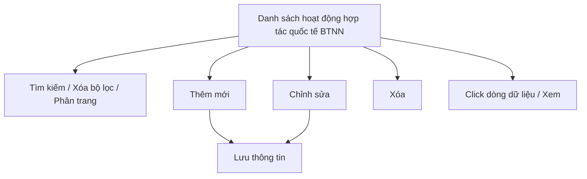

#### 4.3.3.16. UC465-466 - Hợp tác quốc tế trong công tác BTNN

##### 4.3.3.16.1. Mục đích

\- Cho phép cán bộ Bộ Tư pháp (Cục Bồi thường nhà nước) ghi nhận, quản lý và tra cứu thông tin các hoạt động hợp tác quốc tế trong công tác bồi thường nhà nước (BTNN) theo nhiệm vụ quản lý nhà nước quy định tại khoản 1 Điều 73 Luật Trách nhiệm bồi thường của Nhà nước 2017.

\- Nội dung chỉ phục vụ nội bộ cán bộ quản lý, không công khai ra Website khách hàng.

*a. Phân quyền*

\- Cán bộ Bộ Tư pháp: được tra cứu, xem chi tiết, thêm mới, chỉnh sửa, xóa bản ghi.

*b. Điều kiện thực hiện*

\- Người dùng đã đăng nhập thành công vào Website quản trị.

\- Người dùng được phân quyền truy cập màn hình `Hợp tác quốc tế trong công tác BTNN`.

\- Quốc gia đối tác Tham chiếu Danh mục Quốc tịch / Quốc gia [DM_09]. Đơn vị chủ trì tham chiếu Danh mục các đơn vị trên hệ thống `[DM_DON_VI]`.

---

##### 4.3.3.16.2. Sơ đồ luồng nghiệp vụ theo giao diện

---

##### 4.3.3.16.3. MH01 - Màn hình Danh sách hoạt động hợp tác quốc tế BTNN

###### 4.3.3.16.3.1. Màn hình

###### 4.3.3.16.3.2. Mô tả thông tin trên màn hình

| Trường thông tin | Kiểu dữ liệu | Bắt buộc | Mặc định | Mô tả |
| :--- | :--- | :--- | :--- | :--- |
| **I. Bộ lọc tìm kiếm** | | | | |
| Từ khóa | String(255) | Không | Trống | Tìm kiếm gần đúng theo `Tên hoạt động` hoặc `Đối tác/Tổ chức quốc tế`. |
| Quốc gia đối tác | Enum(String(100)) | Không | Tất cả | Tham chiếu Danh mục Quốc tịch / Quốc gia [DM_09]. |
| Hình thức hợp tác | Enum(String(50)) | Không | Tất cả | \- Giá trị gồm: + Tất cả + Hội thảo/Tọa đàm + Trao đổi đoàn công tác + Ký kết văn bản hợp tác + Hỗ trợ kỹ thuật + Khác |
| Từ ngày thực hiện | Date | Không | Theo dữ liệu hệ thống | Định dạng `dd/mm/yyyy`. |
| Đến ngày thực hiện | Date | Không | Theo dữ liệu hệ thống | Định dạng `dd/mm/yyyy`. Áp dụng rule khoảng ngày [BR-VAL-007]. |
| **II. Bảng danh sách kết quả** | | | | - Trạng thái có dữ liệu: Hiển thị danh sách các bản ghi kết quả theo cấu trúc các cột quy định. - Trạng thái không có dữ liệu (Empty State): Khi không tìm thấy kết quả phù hợp với điều kiện tìm kiếm, bảng hiển thị duy nhất 01 dòng căn giữa trên toàn bộ chiều rộng bảng (`colspan`), in nghiêng với nội dung: *"Không tìm thấy dữ liệu phù hợp với điều kiện tìm kiếm."* |
| Cột: STT | Integer(10) | Không | Theo trang hiện tại | Chỉ đọc. Căn giữa, tăng theo phân trang. |
| Cột: Tên hoạt động hợp tác quốc tế | String(255) | Không | Theo dữ liệu hệ thống | Chỉ đọc. |
| Cột: Đối tác/Tổ chức quốc tế | String(255) | Không | Theo dữ liệu hệ thống | Chỉ đọc. |
| Cột: Quốc gia đối tác | Enum(String(100)) | Không | Theo dữ liệu hệ thống | Chỉ đọc. Tham chiếu Danh mục Quốc tịch / Quốc gia [DM_09]. |
| Cột: Hình thức hợp tác | Enum(String(50)) | Không | Theo dữ liệu hệ thống | Chỉ đọc. |
| Cột: Thời gian thực hiện | String(50) | Không | Theo dữ liệu hệ thống | Chỉ đọc. Hiển thị dạng `Từ ngày - Đến ngày`, định dạng `dd/mm/yyyy`. |
| Cột: Thao tác | String(255) | Không | Theo dữ liệu | Chỉ đọc. Gồm icon `Chỉnh sửa`, `Xóa`. |
| Phân trang | String(255) | Không | `20 bản ghi/trang` | Tuân thủ quy chuẩn phân trang chung [BR-UI-001]. |

###### 4.3.3.16.3.3. Chức năng trên màn hình

| STT | Tên chức năng | Định dạng | Mô tả |
| :--- | :--- | :--- | :--- |
| 1 | Tìm kiếm | Button | TH1 (Khoảng ngày không hợp lệ): Vi phạm [BR-VAL-007], hiển thị [MSG-ERR-VAL-007]. Không thực hiện tìm kiếm. - **TH Không có dữ liệu trả về**: + Bảng kết quả: Hiển thị dòng thông báo rỗng *"Không tìm thấy dữ liệu phù hợp với điều kiện tìm kiếm."* ở giữa bảng. + Thanh phân trang (Pagination): Dòng số lượng hiển thị *"Hiển thị 0-0 của 0 bản ghi"* (hoặc *"Hiển thị 0-0 của 0 yêu cầu"*); các nút điều hướng trang (`&#124;&lt;&lt;`, `&lt;`, các số trang, `&gt;`, `&gt;&gt;&#124;`) ở trạng thái ẩn hoặc khóa mờ (Disabled). + Nút "Kết xuất Excel" (nếu màn hình có nút này): Thiết lập ở trạng thái khóa mờ (Disabled) kèm tooltip: *"Không có dữ liệu để kết xuất Excel"*. |
|  |  |  | TH2 (Hợp lệ): Hệ thống lọc danh sách theo các tiêu chí đã nhập, cập nhật lưới kết quả và đưa về trang 1. |
| 2 | Xóa bộ lọc | Button | Hệ thống đặt lại toàn bộ tiêu chí lọc về giá trị mặc định và tải lại danh sách. |
| 3 | Thêm mới | Button | Hệ thống mở **MH02 - Thêm mới/Chỉnh sửa hoạt động hợp tác quốc tế BTNN** ở chế độ thêm mới. |
| 4 | Chỉnh sửa | Icon button | Hệ thống mở **MH02 - Thêm mới/Chỉnh sửa hoạt động hợp tác quốc tế BTNN** ở chế độ chỉnh sửa. |
| 5 | Xóa | Icon button | Hệ thống mở **Popup Xác nhận** với nội dung [MSG-CFM-SYS-001]. Nếu xác nhận, hệ thống xóa vĩnh viễn bản ghi khỏi hệ thống và hiển thị [MSG-SUC-SYS-002]. |
| 6 | Click dòng dữ liệu | Row click | Hệ thống mở **MH02 - Thêm mới/Chỉnh sửa hoạt động hợp tác quốc tế BTNN** ở chế độ chỉ xem. |

---

##### 4.3.3.16.4. MH02 - Màn hình Thêm mới/Chỉnh sửa hoạt động hợp tác quốc tế BTNN

###### 4.3.3.16.4.1. Màn hình

###### 4.3.3.16.4.2. Mô tả thông tin trên màn hình

| Trường thông tin | Kiểu dữ liệu | Bắt buộc | Mặc định | Mô tả |
| :--- | :--- | :--- | :--- | :--- |
| Tiêu đề màn hình | String(255) | - | Theo ngữ cảnh | Chỉ đọc. Hiển thị `THÊM MỚI HOẠT ĐỘNG HỢP TÁC QUỐC TẾ BTNN` hoặc `CHỈNH SỬA HOẠT ĐỘNG HỢP TÁC QUỐC TẾ BTNN`. |
| Tên hoạt động hợp tác quốc tế | String(255) | Có | Trống | Áp dụng rule bắt buộc [BR-VAL-001]. |
| Đối tác/Tổ chức quốc tế | String(255) | Có | Trống | Áp dụng rule bắt buộc [BR-VAL-001]. |
| Quốc gia đối tác | Enum(String(100)) | Có | Trống | Tham chiếu Danh mục Quốc tịch / Quốc gia [DM_09]. Áp dụng rule bắt buộc [BR-VAL-001]. |
| Hình thức hợp tác | Enum(String(50)) | Có | `Hội thảo/Tọa đàm` | \- Giá trị gồm: + Hội thảo/Tọa đàm + Trao đổi đoàn công tác + Ký kết văn bản hợp tác + Hỗ trợ kỹ thuật + Khác |
| Đơn vị chủ trì | Enum(String(255)) | Có | Trống | Tham chiếu Danh mục Cơ quan, Đơn vị giải quyết [DM_DON_VI]. Cho phép tìm kiếm nhanh theo `Mã đơn vị` hoặc `Tên đơn vị`; áp dụng tìm gần đúng. Áp dụng rule bắt buộc [BR-VAL-001]. |
| Từ ngày thực hiện | Date | Có | Trống | Áp dụng rule bắt buộc [BR-VAL-001]. |
| Đến ngày thực hiện | Date | Có | Trống | Áp dụng rule bắt buộc [BR-VAL-001] và rule khoảng ngày [BR-VAL-007] (phải lớn hơn hoặc bằng `Từ ngày thực hiện`). |
| Nội dung/Kết quả hợp tác | Text(2000) | Có | Trống | Áp dụng rule bắt buộc [BR-VAL-001]. |
| Tài liệu đính kèm | File | Không | Trống | Áp dụng [BR-FILE-010]. |
| Hủy bỏ | - | Không | Hiển thị | Chi tiết nghiệp vụ xem tại bảng Chức năng trên màn hình. |
| Lưu thông tin | - | Không | Hiển thị | Chi tiết nghiệp vụ xem tại bảng Chức năng trên màn hình. |

###### 4.3.3.16.4.3. Chức năng trên màn hình

| STT | Tên chức năng | Định dạng | Mô tả |
| :--- | :--- | :--- | :--- |
| 1 | Hủy bỏ | Button | Hệ thống đóng màn hình, không lưu dữ liệu và quay lại **MH01 - Danh sách hoạt động hợp tác quốc tế BTNN**. |
| 2 | Lưu thông tin | Button | TH1 (Bỏ trống trường bắt buộc): Vi phạm [BR-VAL-001]. Hệ thống tô viền đỏ ô trống đầu tiên và hiển thị [MSG-ERR-VAL-001]. Không cho phép lưu. |
|  |  |  | TH2 (`Đến ngày thực hiện` nhỏ hơn `Từ ngày thực hiện`): Vi phạm [BR-VAL-007], hiển thị [MSG-ERR-VAL-007]. Không cho phép lưu. |
|  |  |  | TH3 (Hợp lệ - thêm mới): Hệ thống lưu bản ghi, đóng màn hình, tải lại danh sách và hiển thị [MSG-SUC-SYS-003]. |
|  |  |  | TH4 (Hợp lệ - chỉnh sửa): Hệ thống cập nhật bản ghi, đóng màn hình, tải lại danh sách và hiển thị [MSG-SUC-SYS-002]. |
| 3 | Tải lên | Button | Hệ thống mở trình chọn file cho `Tài liệu đính kèm`. |
| 4 | Xem file | Link | Cho phép xem file tại một tab riêng. |
| 5 | Xóa | Link | Hệ thống gỡ file khỏi danh sách file đã chọn trên màn hình trước khi lưu. |

---

##### 4.3.3.16.5. Popup Xác nhận

###### 4.3.3.16.5.1. Màn hình

###### 4.3.3.16.5.2. Mô tả thông tin trên màn hình

| Trường thông tin | Kiểu dữ liệu | Bắt buộc | Mặc định | Mô tả |
| :--- | :--- | :--- | :--- | :--- |
| Tiêu đề popup | String(255) | - | Theo thao tác | Chỉ đọc. Hiển thị icon cảnh báo và nội dung xác nhận theo thao tác đang thực hiện. |
| Nội dung xác nhận | Text(2000) | - | Theo thao tác | Chỉ đọc. Áp dụng message xác nhận [MSG-CFM-SYS-001]. |
| Hủy bỏ | - | Không | Hiển thị | Đóng popup, không thực hiện callback. |
| Đồng ý | - | Không | Hiển thị | Xác nhận thực hiện callback của thao tác đã gọi popup. |

###### 4.3.3.16.5.3. Chức năng trên màn hình

| STT | Tên chức năng | Định dạng | Mô tả |
| :--- | :--- | :--- | :--- |
| 1 | Hủy bỏ | Button | Hệ thống đóng popup xác nhận và không thực hiện thao tác. |
| 2 | Đồng ý | Button | Hệ thống đóng popup xác nhận và xóa vĩnh viễn bản ghi. |

---

##### 4.3.3.16.6. Ghi chú phạm vi đặc tả

\- Bản ghi áp dụng cơ chế xóa vĩnh viễn (hard delete), không lưu lại lịch sử sau khi xóa.

\- Màn hình chỉ phục vụ nội bộ cán bộ quản lý trên Website quản trị, không hiển thị trên Website khách hàng.
