#### 4.3.3.25. UC509 - Báo cáo tổng hợp kết quả đánh giá và xếp loại kết quả công tác bồi thường nhà nước

##### 4.3.3.25.1. Mục đích

\- Cho phép cán bộ nghiệp vụ BTNN tổng hợp, tra cứu và kết xuất báo cáo kết quả đánh giá, xếp loại công tác bồi thường nhà nước theo năm, đơn vị, địa phương, trạng thái kỳ chấm điểm, xếp loại và nhóm tiêu chí.

\- Báo cáo sử dụng dữ liệu nguồn từ module Quản lý chấm điểm công tác BTNN tại `SRS_BTNN_Cham_Diem.md`; không phát sinh thao tác chấm điểm, duyệt hoặc trình lãnh đạo trong màn hình báo cáo này.

\- Báo cáo phục vụ theo dõi kết quả xếp loại của các Sở TÆ° pháp, phân bố mức xếp loại theo Danh mục Xếp loại chấm điểm công tác BTNN [DM_33], so sánh Ä‘iểm tá»± chấm vá»›i Ä‘iểm Bá»™ TÆ° pháp đánh giá và xác định nhóm tiêu chí cần cải thiện theo Danh mục Nhóm tiêu chí chấm điểm công tác BTNN [DM_34].

*a. Phân quyền*

\- Cán bộ nghiệp vụ Bộ Tư pháp: Được tra cứu, tổng hợp số liệu, xem chi tiết kỳ chấm điểm và kết xuất báo cáo theo toàn bộ phạm vi dữ liệu được phân quyền.

\- Lãnh đạo Bộ Tư pháp: Được tra cứu, xem số liệu tổng hợp, xem chi tiết kỳ chấm điểm và kết xuất báo cáo; không chỉnh sửa dữ liệu chấm điểm/xếp loại.

\- Cán bộ Sở Tư pháp: Được tra cứu, xem số liệu và kết xuất báo cáo đối với đơn vị của mình theo phạm vi được phân quyền; không xem dữ liệu chi tiết của đơn vị khác.

*b. Điều kiện thực hiện*

\- Người dùng đã đăng nhập thành công vào Website quản trị.

\- Người dùng được phân quyền truy cập menu `Báo cáo quản lý BTNN` và chức năng `Báo cáo tổng hợp kết quả đánh giá và xếp loại kết quả công tác bồi thường nhà nước`.

\- Dữ liệu kỳ chấm điểm, điểm tự chấm, điểm Bộ Tư pháp đánh giá, xếp loại và điểm theo nhóm tiêu chí đã phát sinh tại module Quản lý chấm điểm công tác BTNN.

\- Trạng thái kỳ chấm điểm tham chiếu danh mục [DM_32]. Xếp loại kỳ chấm điểm tham chiếu danh mục [DM_33]. Nhóm tiêu chí chấm điểm tham chiếu danh mục [DM_34]. Tỉnh/Thành phố tham chiếu [DM_13]. Đơn vị tham chiếu `[DM_DON_VI]`.

\- Quy tắc tính tổng điểm và xếp loại công tác BTNN áp dụng [BR-BTNN-CD-003]. Quy tắc điểm thưởng sáng kiến và điểm trừ nộp muộn áp dụng [BR-BTNN-CD-004].

---

##### 4.3.3.25.2. Sơ đồ luồng nghiệp vụ theo giao diện

```mermaid
flowchart TD
    A[Người dùng mở Báo cáo tổng hợp kết quả đánh giá và xếp loại] --> B[Hệ thống hiển thị khối lọc mặc định]
    B --> C[Người dùng chọn năm đánh giá, đơn vị, tỉnh/thành phố, trạng thái, xếp loại, nhóm tiêu chí]
    C --> D[Tổng hợp số liệu]
    D --> E{Có dữ liệu kỳ chấm điểm phù hợp?}
    E -->|Không| F[Hiển thị thông tin không có dữ liệu tại vùng kết quả]
    E -->|Có| G[Hiển thị thẻ tổng quan, bảng tổng hợp theo đơn vị, bảng phân bố xếp loại và bảng tổng hợp theo nhóm tiêu chí]
    G --> H[Người dùng xem chi tiết kỳ chấm điểm bằng Row click]
    H --> I[Mở màn hình xem chi tiết kỳ chấm điểm ở chế độ chỉ xem]
    G --> J[Kết xuất]
    J --> K[Chọn định dạng Excel/DOC/PDF]
```

---

##### 4.3.3.25.3. MH01 - Màn hình Báo cáo tổng hợp kết quả đánh giá và xếp loại kết quả công tác bồi thường nhà nước

###### 4.3.3.25.3.1. Màn hình

###### 4.3.3.25.3.2. Mô tả thông tin trên màn hình

| Trường thông tin | Kiểu dữ liệu | Bắt buộc | Mặc định | Mô tả |
| :--- | :--- | :--- | :--- | :--- |
| **I. Khối lọc, tìm kiếm thông tin** | | | | |
| Năm đánh giá | Enum(String(10)) | Có | Năm hiện tại | Giá trị gồm 05 năm gần nhất tính đến năm hiện tại. |
| Đơn vị Sở Tư pháp | Enum(String(255)) | Không | Theo phạm vi tài khoản đăng nhập | - Tham chiếu `[DM_DON_VI]`. - Với tài khoản Cán bộ Sở Tư pháp, hệ thống tự lọc theo đơn vị của tài khoản đăng nhập và chỉ hiển thị dữ liệu đơn vị đó. - Với tài khoản Bộ Tư pháp/Lãnh đạo Bộ Tư pháp, cho phép chọn `Tất cả` hoặc chọn một đơn vị cụ thể. |
| Tỉnh/Thành phố | Enum(String(100)) | Không | Tất cả | Tham chiếu [DM_13]. Dùng để lọc các đơn vị Sở Tư pháp theo địa phương. |
| Trạng thái kỳ chấm điểm | Enum(String(50)) | Không | Hoàn thành | - Tham chiếu [DM_32]. - Giá trị lọc gồm `Tất cả` và các trạng thái thuộc [DM_32]. - Mặc định chỉ tổng hợp các kỳ đã ở trạng thái "Hoàn thành". |
| Xếp loại | Enum(String(50)) | Không | Tất cả | - Tham chiếu [DM_33]. - Giá trị lọc gồm `Tất cả` và các giá trị thuộc [DM_33]. |
| Nhóm tiêu chí | Enum(String(255)) | Không | Tất cả | - Tham chiếu [DM_34]. - Khi chọn một nhóm tiêu chí cụ thể, bảng tổng hợp theo nhóm tiêu chí chỉ hiển thị nhóm được chọn, bảng tổng hợp theo đơn vị vẫn hiển thị tổng điểm toàn kỳ và điểm của nhóm được chọn. |
| **II. Khối tổng quan kết quả** | | | | |
| Tổng số đơn vị được đánh giá | Integer(10) | Không | Hệ thống tính | Chỉ đọc. Đếm số đơn vị có kỳ chấm điểm thuộc điều kiện lọc hiện hành. |
| Đã hoàn thành đánh giá | Integer(10) | Không | Hệ thống tính | Chỉ đọc. Đếm số kỳ chấm điểm có trạng thái "Hoàn thành". |
| Chưa hoàn thành đánh giá | Integer(10) | Không | Hệ thống tính | Chỉ đọc. Đếm số kỳ chấm điểm có trạng thái khác "Hoàn thành" trong điều kiện lọc hiện hành. |
| Điểm Bộ Tư pháp trung bình | Decimal(5,1) | Không | Hệ thống tính | Chỉ đọc. Trung bình cộng `Điểm Bộ Tư pháp đánh giá` của các kỳ chấm điểm có dữ liệu điểm đánh giá. |
| Tỷ lệ hoàn thành đánh giá | Decimal(5,2) | Không | Hệ thống tính | Chỉ đọc. Công thức: `Đã hoàn thành đánh giá / Tổng số đơn vị được đánh giá * 100`. Nếu mẫu số bằng 0 thì hiển thị `0%`. |
| **III. Bảng kết quả tổng hợp theo đơn vị** | | | | - Trạng thái có dữ liệu: Hiển thị danh sách các bản ghi kết quả theo cấu trúc các cột quy định. - Trạng thái không có dữ liệu (Empty State): Khi không tìm thấy kết quả phù hợp với điều kiện tìm kiếm, bảng hiển thị duy nhất 01 dòng căn giữa trên toàn bộ chiều rộng bảng (`colspan`), in nghiêng với nội dung: *"Không tìm thấy dữ liệu phù hợp với điều kiện tìm kiếm."* |
| STT | Integer(10) | Không | Theo trang hiện tại | Chỉ đọc. Hiển thị số thứ tự bản ghi theo phân trang. |
| Đơn vị Sở Tư pháp | String(255) | Không | Theo dữ liệu hệ thống | Chỉ đọc. Hiển thị tên đơn vị được đánh giá. |
| Tỉnh/Thành phố | Enum(String(100)) | Không | Theo dữ liệu hệ thống | Chỉ đọc. Tham chiếu [DM_13]. |
| Năm đánh giá | Enum(String(10)) | Không | Theo dữ liệu hệ thống | Chỉ đọc. Hiển thị năm của kỳ chấm điểm. |
| Trạng thái kỳ chấm Ä‘iểm | Enum(String(50)) | Không | Theo dữ liệu hệ thống | Chỉ đọc. Hiển thị theo Danh mục DM_32 [DM_32] dÆ°á»›i dạng nhãn trạng thái. |
| Điểm tự chấm | Decimal(5,1) | Không | Theo dữ liệu hệ thống | Chỉ đọc. Hiển thị tổng điểm tự chấm của Sở Tư pháp trên thang 100. |
| Điểm Bộ Tư pháp đánh giá | Decimal(5,1) | Không | Theo dữ liệu hệ thống | Chỉ đọc. Hiển thị tổng điểm Bộ Tư pháp đánh giá trên thang 100. |
| Chênh lệch điểm | Decimal(5,1) | Không | Hệ thống tính | Chỉ đọc. Công thức: `Điểm Bộ Tư pháp đánh giá - Điểm tự chấm`. |
| Xếp loại | Enum(String(50)) | Không | Theo dữ liệu hệ thống | Chỉ đọc. Hiển thị kết quả xếp loại theo Danh mục Xếp loại chấm điểm công tác BTNN [DM_33] và [BR-BTNN-CD-003]. |
| Nhóm I | Decimal(5,1) | Không | Theo dữ liệu hệ thống | Chỉ đọc. Hiển thị Ä‘iểm Bá»™ TÆ° pháp đánh giá của Nhóm I theo Danh mục Nhóm tiêu chí chấm điểm công tác BTNN [DM_34]. |
| Nhóm II | Decimal(5,1) | Không | Theo dữ liệu hệ thống | Chỉ đọc. Hiển thị Ä‘iểm Bá»™ TÆ° pháp đánh giá của Nhóm II theo Danh mục Nhóm tiêu chí chấm điểm công tác BTNN [DM_34]. |
| Nhóm III | Decimal(5,1) | Không | Theo dữ liệu hệ thống | Chỉ đọc. Hiển thị Ä‘iểm Bá»™ TÆ° pháp đánh giá của Nhóm III theo Danh mục Nhóm tiêu chí chấm điểm công tác BTNN [DM_34]. |
| Nhóm IV | Decimal(5,1) | Không | Theo dữ liệu hệ thống | Chỉ đọc. Hiển thị Ä‘iểm Bá»™ TÆ° pháp đánh giá của Nhóm IV theo Danh mục Nhóm tiêu chí chấm điểm công tác BTNN [DM_34]. |
| Nhóm V | Decimal(5,1) | Không | Theo dữ liệu hệ thống | Chỉ đọc. Hiển thị Ä‘iểm Bá»™ TÆ° pháp đánh giá của Nhóm V theo Danh mục Nhóm tiêu chí chấm điểm công tác BTNN [DM_34]; hiển thị `N/A` nếu kỳ chấm Ä‘iểm không áp dụng Nhóm V. |
| Điểm thưởng | Decimal(5,1) | Không | Theo dữ liệu hệ thống | Chỉ đọc. Tổng điểm thưởng sáng kiến/giải pháp theo [BR-BTNN-CD-004]. |
| Điểm trừ | Decimal(5,1) | Không | Theo dữ liệu hệ thống | Chỉ đọc. Tổng điểm trừ nộp muộn theo [BR-BTNN-CD-004]. |
| Ngày Sở Tư pháp gửi | Date | Không | Theo dữ liệu hệ thống | Chỉ đọc. Định dạng `dd/mm/yyyy`. |
| Ngày Bộ Tư pháp hoàn thành đánh giá | Date | Không | Theo dữ liệu hệ thống | Chỉ đọc. Định dạng `dd/mm/yyyy`. |
| **IV. Bảng phân bố xếp loại** | | | | |
| Xếp loại | Enum(String(50)) | Không | Theo dữ liệu hệ thống | Chỉ đọc. Hiển thị từng giá trị xếp loại thuộc [DM_33] có phát sinh trong dữ liệu lọc. |
| Số đơn vị | Integer(10) | Không | Hệ thống tính | Chỉ đọc. Đếm số đơn vị theo từng xếp loại. |
| Tỷ lệ | Decimal(5,2) | Không | Hệ thống tính | Chỉ đọc. Công thức: `Số đơn vị của xếp loại / Tổng số đơn vị được đánh giá * 100`. |
| Điểm Bộ Tư pháp trung bình theo xếp loại | Decimal(5,1) | Không | Hệ thống tính | Chỉ đọc. Trung bình điểm Bộ Tư pháp đánh giá của các đơn vị thuộc cùng xếp loại. |
| **V. Bảng tổng hợp theo nhóm tiêu chí** | | | | |
| Nhóm tiêu chí | Enum(String(255)) | Không | Theo dữ liệu hệ thống | Chỉ đọc. Tham chiếu [DM_34]. |
| Điểm tối đa | Decimal(5,1) | Không | Theo danh mục tiêu chí | Chỉ đọc. Hiển thị điểm tối đa của từng nhóm tiêu chí trong bộ chấm điểm. |
| Điểm tự chấm trung bình | Decimal(5,1) | Không | Hệ thống tính | Chỉ đọc. Trung bình điểm tự chấm của các đơn vị trong điều kiện lọc. |
| Điểm Bộ Tư pháp trung bình | Decimal(5,1) | Không | Hệ thống tính | Chỉ đọc. Trung bình điểm Bộ Tư pháp đánh giá của các đơn vị trong điều kiện lọc. |
| Chênh lệch trung bình | Decimal(5,1) | Không | Hệ thống tính | Chỉ đọc. Công thức: `Điểm Bộ Tư pháp trung bình - Điểm tự chấm trung bình`. |
| Số đơn vị dưới ngưỡng | Integer(10) | Không | Hệ thống tính | Chỉ đọc. Đếm số đơn vị có điểm Bộ Tư pháp đánh giá của nhóm tiêu chí nhỏ hơn 70% điểm tối đa của nhóm đó. |
| **VI. Phân trang và trạng thái kết xuất** | | | | |
| Số dòng hiển thị | Enum(String(10)) | Không | 20 | Giá trị gồm `20`, `50`, `100`. Áp dụng cho bảng kết quả tổng hợp theo đơn vị. |
| Thông tin phân trang | String(255) | Không | Theo dữ liệu lọc | Chỉ đọc. Hiển thị khoảng bản ghi đang xem và tổng số bản ghi. |
| Trạng thái kỳ tổng hợp | Enum(String(50)) | Không | Nháp | - Giá trị gồm: + Nháp + Đã kết xuất |

###### 4.3.3.25.3.3. Chức năng trên màn hình

| STT | Tên chức năng | Định dạng | Mô tả |
| :--- | :--- | :--- | :--- |
| 1 | Tổng hợp số liệu | Button | TH1 (Không có dữ liệu phù hợp): Hệ thống hiển thị [MSG-INF-BTNN-CD-023] tại vùng kết quả tổng hợp, đặt các chỉ tiêu tổng quan bằng 0, không hiển thị phân trang và làm mờ nút `Kết xuất`. |
|  |  |  | TH Hợp lệ: Hệ thống tổng hợp dữ liệu theo điều kiện lọc hiện hành; hiển thị khối tổng quan kết quả, bảng kết quả tổng hợp theo đơn vị, bảng phân bố xếp loại, bảng tổng hợp theo nhóm tiêu chí và đặt `Trạng thái kỳ tổng hợp` là "Nháp". |
| 2 | Xóa bộ lọc | Button | Hệ thống đưa các tiêu chí lọc về giá trị mặc định, tải lại dữ liệu theo phạm vi tài khoản đăng nhập, đưa trang hiện tại về trang 1 và hiển thị [MSG-SUC-BTNN-CD-001]. |
| 3 | Kết xuất | Button/Menu | TH1 (Không có dữ liệu để kết xuất): Hệ thống kiểm tra theo [BR-EXP-041], hiển thị [MSG-WRN-SYS-002] và không sinh file. |
|  |  |  | TH Hợp lệ: Hệ thống mở menu chọn định dạng gồm `Excel`, `DOC`, `PDF`. |
| 4 | Chọn Excel | Menu item | Hệ thống kết xuất báo cáo ra file Excel theo đúng dữ liệu đang hiển thị trên màn hình, cập nhật `Trạng thái kỳ tổng hợp` sang "Đã kết xuất" và hiển thị [MSG-SUC-SYS-005]. |
| 5 | Chọn DOC | Menu item | Hệ thống kết xuất báo cáo ra file Word theo đúng dữ liệu đang hiển thị trên màn hình, cập nhật `Trạng thái kỳ tổng hợp` sang "Đã kết xuất" và hiển thị [MSG-SUC-SYS-005]. |
| 6 | Chọn PDF | Menu item | Hệ thống kết xuất báo cáo ra file PDF theo đúng dữ liệu đang hiển thị trên màn hình, cập nhật `Trạng thái kỳ tổng hợp` sang "Đã kết xuất" và hiển thị [MSG-SUC-SYS-005]. |
| 7 | Sắp xếp cột | Header cột | TH1 (Chọn lại cột đang sắp xếp): Hệ thống đảo chiều sắp xếp tăng/giảm và cập nhật biểu tượng sắp xếp trên tiêu đề cột. |
|  |  |  | TH2 (Chọn cột khác): Hệ thống đặt cột được chọn làm cột sắp xếp hiện hành và cập nhật lại bảng kết quả tổng hợp theo đơn vị. Các cột hỗ trợ sắp xếp gồm `Đơn vị Sở Tư pháp`, `Tỉnh/Thành phố`, `Năm đánh giá`, `Trạng thái kỳ chấm điểm`, `Điểm tự chấm`, `Điểm Bộ Tư pháp đánh giá`, `Chênh lệch điểm`, `Xếp loại`, `Ngày Sở Tư pháp gửi`, `Ngày Bộ Tư pháp hoàn thành đánh giá`. |
| 8 | Số dòng hiển thị | Select | Hệ thống cập nhật số bản ghi hiển thị trên mỗi trang theo giá trị được chọn, đưa trang hiện tại về trang 1 và tải lại bảng kết quả tổng hợp theo đơn vị. |
| 9 | Chuyển trang | Pagination | Hệ thống chuyển đến trang đầu, trang trước, trang được chọn, trang sau hoặc trang cuối theo thao tác người dùng; dữ liệu hiển thị giữ nguyên tiêu chí lọc/sắp xếp hiện hành. |
| 10 | Click dòng dữ liệu | Row click | TH1 (Kỳ ở trạng thái "Chưa bắt đầu" hoặc "Đang tự chấm"): Hệ thống hiển thị [MSG-ERR-BTNN-CD-018], không mở màn hình chi tiết. |
|  |  |  | TH Hợp lệ: Hệ thống mở **MH03 - Màn hình Xem chi tiết/Đánh giá kỳ chấm điểm công tác BTNN** ở chế độ chỉ xem. |

---

##### 4.3.3.25.4. Quy tắc tổng hợp số liệu

\- Mỗi đơn vị Sở Tư pháp trong cùng một năm đánh giá chỉ được tính một bản ghi kỳ chấm điểm mới nhất theo dữ liệu hệ thống; trường hợp có nhiều phiên bản hoàn thành, hệ thống lấy phiên bản hoàn thành sau cùng.

\- Báo cáo mặc định tổng hợp các kỳ ở trạng thái "Hoàn thành". Khi người dùng chủ động chọn trạng thái khác trong bộ lọc, hệ thống hiển thị các kỳ tương ứng nhưng các trường điểm/xếp loại chưa phát sinh đầy đủ được hiển thị theo dữ liệu hiện có.

\- Tổng điểm và xếp loại cuối cùng lấy theo kết quả Bộ Tư pháp đánh giá, tính theo [BR-BTNN-CD-003].

\- Điểm thưởng và điểm trừ lấy theo kết quả đã ghi nhận trong kỳ chấm điểm, tính theo [BR-BTNN-CD-004].

\- Khi tính tỷ lệ, hệ thống làm tròn đến 02 chữ số thập phân. Nếu mẫu số bằng 0, hệ thống hiển thị `0%`.

\- Bảng tổng hợp theo nhóm tiêu chí chỉ sử dụng điểm của các tiêu chí thuộc nhóm tương ứng trong [DM_34]; không cộng điểm thưởng/điểm trừ vào từng nhóm tiêu chí.

\- File kết xuất phải giữ đúng tiêu chí lọc/sắp xếp đang áp dụng trên màn hình tại thời điểm người dùng chọn định dạng kết xuất theo [BR-EXP-041].

---

##### 4.3.3.25.5. Ràng buộc chéo và phụ thuộc dữ liệu

| STT | Nội dung kiểm tra | Kết quả áp dụng |
| :--- | :--- | :--- |
| 1 | Danh mục dùng chung | Sử dụng [DM_13], [DM_32], [DM_33], [DM_34] và `[DM_DON_VI]`; không tạo danh mục cục bộ cho trạng thái, xếp loại, nhóm tiêu chí hoặc đơn vị. |
| 2 | Nguồn dữ liệu nghiệp vụ | Lấy dữ liệu từ `SRS_BTNN_Cham_Diem.md`, gồm kỳ chấm điểm, điểm tự chấm, điểm Bộ Tư pháp đánh giá, điểm theo nhóm tiêu chí, điểm thưởng, điểm trừ, ngày gửi và ngày hoàn thành đánh giá. |
| 3 | Quy tắc tính toán | Áp dụng [BR-BTNN-CD-003] để xác định tổng điểm/xếp loại và [BR-BTNN-CD-004] để xác định điểm thưởng/điểm trừ. |
| 4 | Phân quyền dữ liệu | Cán bộ Sở Tư pháp chỉ xem dữ liệu của đơn vị mình; Bộ Tư pháp/Lãnh đạo Bộ Tư pháp xem theo phạm vi được phân quyền. |
| 5 | Lưu vết hệ thống | Mọi thao tác kết xuất báo cáo phải ghi nhận lịch sử người thực hiện, thời điểm thực hiện, định dạng file, tiêu chí lọc và đường dẫn tệp kết xuất. |
| 6 | Phạm vi dữ liệu liên phân hệ | Báo cáo chỉ tổng hợp dữ liệu chấm điểm/xếp loại công tác BTNN; không lấy dữ liệu vụ việc YCBT của Mẫu số 01/03/04 Thông tư 08. |
