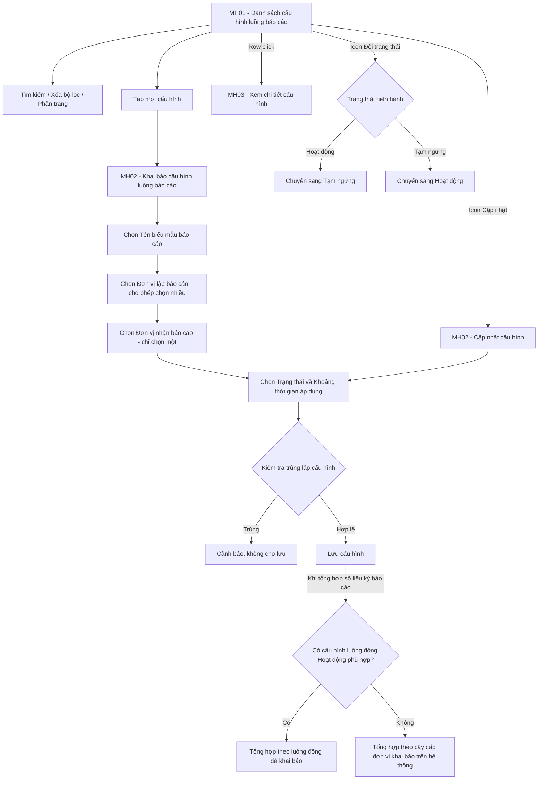

### 4.3.3.27. Cấu hình luồng báo cáo phân hệ Bồi thường nhà nước

#### 1. Mục đích
Cho phép cán bộ quản trị nghiệp vụ khai báo và quản lý luồng đi của báo cáo trong phân hệ Bồi thường nhà nước, phục vụ việc tổng hợp số liệu báo cáo theo đúng mô hình tổ chức thực tế, bao gồm:
- Khai báo cấu hình luồng báo cáo cho từng biểu mẫu báo cáo: xác định rõ đơn vị lập báo cáo và đơn vị nhận báo cáo tương ứng.
- Cho phép một cấu hình khai báo nhiều đơn vị lập báo cáo cùng gửi về một đơn vị nhận báo cáo duy nhất, đáp ứng trường hợp một đầu mối tiếp nhận báo cáo của nhiều đơn vị không cùng cây tổ chức.
- Quản lý hiệu lực của cấu hình theo trạng thái `Hoạt động` / `Tạm ngưng` và theo khoảng thời gian áp dụng, phục vụ việc thay đổi đầu mối tổng hợp giữa các kỳ báo cáo mà không làm sai lệch số liệu các kỳ đã chốt.
- Áp dụng cơ chế tổng hợp số liệu báo cáo ưu tiên theo luồng động đã khai báo; trường hợp không tồn tại cấu hình luồng động phù hợp, hệ thống tự động tổng hợp theo đúng cây cấp đơn vị đã khai báo trên hệ thống.
- Tra cứu, theo dõi toàn bộ danh sách cấu hình luồng báo cáo đang áp dụng và lịch sử thay đổi cấu hình.

a. Phân quyền
Hệ thống phân quyền thao tác theo vai trò và quyền hạn được cấp:
- Xem: Tra cứu danh sách cấu hình luồng báo cáo, xem chi tiết cấu hình.
- Tạo mới: Khai báo cấu hình luồng báo cáo mới.
- Chỉnh sửa: Cập nhật thông tin cấu hình luồng báo cáo đã khai báo.
- Xóa: Xóa cấu hình luồng báo cáo chưa từng được áp dụng cho kỳ báo cáo nào.
- Thay đổi trạng thái: Chuyển cấu hình giữa `Hoạt động` và `Tạm ngưng`.

b. Điều kiện thực hiện
- Người dùng đã đăng nhập hệ thống.
- Người dùng được cấp quyền truy cập chức năng "Cấu hình luồng báo cáo phân hệ Bồi thường nhà nước".
- Danh mục Cơ quan, Đơn vị giải quyết [DM_DON_VI] và Danh mục Biểu mẫu báo cáo đã được khai báo trên hệ thống.

#### 2. Sơ đồ luồng nghiệp vụ theo giao diện

---

#### 3. Quy tắc nghiệp vụ chung

| Mã quy tắc | Nội dung quy tắc |
| :--- | :--- |
| [BR-BTNN-CHBC-001] | **Đơn vị nhận báo cáo là duy nhất**: Mỗi cấu hình luồng báo cáo chỉ được khai báo 01 `Đơn vị nhận báo cáo`. Trường `Đơn vị lập báo cáo` được phép chọn nhiều đơn vị trong cùng một cấu hình. |
| [BR-BTNN-CHBC-002] | **Chống trùng lặp luồng báo cáo**: Trong cùng một `Tên biểu mẫu báo cáo` và cùng khoảng thời gian áp dụng, một đơn vị chỉ được xuất hiện tại trường `Đơn vị lập báo cáo` của duy nhất 01 cấu hình ở trạng thái `Hoạt động`. Vi phạm quy tắc này, hệ thống chặn lưu và nêu rõ đơn vị bị trùng cùng mã cấu hình đang xung đột. |
| [BR-BTNN-CHBC-003] | **Đơn vị lập và Đơn vị nhận không được trùng nhau**: Một đơn vị không được đồng thời là `Đơn vị lập báo cáo` và `Đơn vị nhận báo cáo` trong cùng một cấu hình. |
| [BR-BTNN-CHBC-004] | **Khoảng thời gian áp dụng**: Hai trường `Từ ngày` và `Đến ngày` đều không bắt buộc nhập và được hiểu như sau: - Bỏ trống cả hai: Cấu hình áp dụng không giới hạn thời gian. - Chỉ nhập `Từ ngày`: Cấu hình áp dụng từ ngày đó trở đi. - Chỉ nhập `Đến ngày`: Cấu hình áp dụng đến hết ngày đó. - Nhập cả hai: `Đến ngày` không được nhỏ hơn `Từ ngày`. |
| [BR-BTNN-CHBC-005] | **Thứ tự ưu tiên khi tổng hợp số liệu báo cáo**: Khi hệ thống thực hiện tổng hợp số liệu của một kỳ báo cáo, thứ tự xác định đơn vị nhận báo cáo như sau: - **Ưu tiên 1 - Luồng động**: Tìm cấu hình luồng báo cáo có `Trạng thái` là `Hoạt động`, đúng `Tên biểu mẫu báo cáo` của kỳ, có chứa đơn vị lập báo cáo tương ứng, và ngày chốt số liệu của kỳ nằm trong khoảng thời gian áp dụng của cấu hình. Nếu tìm thấy, số liệu được tổng hợp về `Đơn vị nhận báo cáo` của cấu hình đó. - **Ưu tiên 2 - Cây cấp đơn vị**: Nếu không tìm thấy cấu hình luồng động phù hợp, hệ thống tổng hợp số liệu về đơn vị cấp trên trực tiếp theo đúng cây cấp đơn vị đã khai báo tại Danh mục Cơ quan, Đơn vị giải quyết [DM_DON_VI]. |
| [BR-BTNN-CHBC-006] | **Cấu hình `Tạm ngưng` không tham gia tổng hợp**: Cấu hình ở trạng thái `Tạm ngưng` bị bỏ qua hoàn toàn khi xác định luồng động. Các đơn vị thuộc cấu hình đó được tổng hợp theo cây cấp đơn vị cho tới khi cấu hình được kích hoạt lại. |
| [BR-BTNN-CHBC-007] | **Điều kiện xóa cấu hình**: Chỉ cho phép xóa cấu hình chưa từng được áp dụng để tổng hợp cho bất kỳ kỳ báo cáo nào. Trường hợp cấu hình đã được áp dụng, hệ thống không cho phép xóa; người dùng chỉ được chuyển sang trạng thái `Tạm ngưng` để bảo toàn số liệu các kỳ báo cáo đã chốt. |

---

### MH01 - Màn hình Danh sách cấu hình luồng báo cáo

#### 1. Màn hình

#### 2. Mô tả thông tin trên màn hình

| Trường thông tin | Kiểu dữ liệu | Bắt buộc | Mặc định | Mô tả |
| :--- | :--- | :--- | :--- | :--- |
| Tiêu đề màn hình | String(255) | - | - | Control UI: Page Header. Chỉ đọc. `CẤU HÌNH LUỒNG BÁO CÁO PHÂN HỆ BỒI THƯỜNG NHÀ NƯỚC`. |
| **I. Khối bộ lọc tìm kiếm** | | | | |
| Tên biểu mẫu báo cáo | Enum(String(255)) | Không | `Tất cả` | Control UI: Combobox. Tham chiếu Danh mục Biểu mẫu báo cáo của phân hệ Bồi thường nhà nước. |
| Đơn vị lập báo cáo | String(255) | Không | Trống | Control UI: Textbox. Tìm kiếm tương đối theo mã hoặc tên đơn vị lập báo cáo, không phân biệt chữ hoa chữ thường, tự động cắt khoảng trắng thừa. |
| Đơn vị nhận báo cáo | String(255) | Không | Trống | Control UI: Textbox. Tìm kiếm tương đối theo mã hoặc tên đơn vị nhận báo cáo, không phân biệt chữ hoa chữ thường. |
| Trạng thái | Enum(String(50)) | Không | `Tất cả` | Control UI: Combobox. Giá trị gồm: + Tất cả + Hoạt động + Tạm ngưng |
| Nút: Xóa bộ lọc | Button | Không | Hiển thị | Control UI: Button (icon `fa-filter-circle-xmark`). Luôn hiển thị khả dụng. |
| Nút: Tìm kiếm | Button | Không | Hiển thị | Control UI: Button (icon `fa-magnifying-glass`). Luôn hiển thị khả dụng. |
| Nút: Tạo mới cấu hình | Button | Không | Hiển thị | Control UI: Button (icon `fa-plus`). Chỉ hiển thị với người dùng được cấp quyền Tạo mới. |
| **II. Bảng danh sách cấu hình luồng báo cáo** | - | - | 10 bản ghi/trang | Control UI: Data grid. - Sắp xếp mặc định theo Ngày cập nhật gần nhất giảm dần. - Trạng thái không có dữ liệu: Hiển thị 01 dòng căn giữa `colspan="9"` theo [MSG-INF-SYS-001]. |
| Cột: STT | Integer(10) | - | Tự tăng | Control UI: Text. Chỉ đọc. Căn giữa. Đánh số thứ tự từ 1 đến hết trang. |
| Cột: Mã cấu hình | String(50) | - | Hệ thống tự sinh | Control UI: Text link. Chỉ đọc. Hiển thị dạng liên kết; khi người dùng click, hệ thống mở **MH03 - Màn hình Xem chi tiết cấu hình luồng báo cáo**. |
| Cột: Tên biểu mẫu báo cáo | String(255) | - | Theo dữ liệu | Control UI: Text. Chỉ đọc. Căn trái. |
| Cột: Đơn vị lập báo cáo | String(500) | - | Theo dữ liệu | Control UI: Text. Chỉ đọc. Căn trái. Hiển thị tên đơn vị đầu tiên kèm hậu tố `và [N] đơn vị khác` khi cấu hình có nhiều đơn vị lập báo cáo; rê chuột hiển thị tooltip đầy đủ danh sách. |
| Cột: Đơn vị nhận báo cáo | String(255) | - | Theo dữ liệu | Control UI: Text. Chỉ đọc. Căn trái. |
| Cột: Từ ngày | Date | - | Theo dữ liệu | Control UI: Text. Chỉ đọc. Căn giữa. Định dạng `dd/mm/yyyy`. Hiển thị `-` khi không khai báo. |
| Cột: Đến ngày | Date | - | Theo dữ liệu | Control UI: Text. Chỉ đọc. Căn giữa. Định dạng `dd/mm/yyyy`. Hiển thị `-` khi không khai báo. |
| Cột: Trạng thái | Enum(String(50)) | - | Theo dữ liệu | Control UI: Badge. Chỉ đọc. Gồm: + `Hoạt động` (màu xanh lá) + `Tạm ngưng` (màu xám) |
| Cột: Thao tác | Action buttons | - | Theo quy chuẩn cố định 3 slots | Control UI: Fixed-slot group icon button (3 slot): + Slot 1 `Cập nhật` (icon `fa-pen-to-square`): Luôn khả dụng với người dùng có quyền Chỉnh sửa. + Slot 2 `Đổi trạng thái` (icon `fa-toggle-on` khi đang `Hoạt động`, icon `fa-toggle-off` khi đang `Tạm ngưng`): Luôn khả dụng với người dùng có quyền Thay đổi trạng thái. + Slot 3 `Xóa` (icon `fa-trash-can`): Chỉ khả dụng với cấu hình chưa từng được áp dụng cho kỳ báo cáo nào theo [BR-BTNN-CHBC-007]; khóa mờ với các trường hợp còn lại. |
| Thanh phân trang | Panel | - | 10 bản ghi/trang | Control UI: Pagination bar. - Bên trái: Combobox chọn số lượng bản ghi trên trang gồm các giá trị: + 10 + 20 + 50 + 100 kèm dòng thông tin `Đang xem [từ] đến [đến] trong tổng số [tổng] bản ghi`. - Bên phải: Nút `Trang trước`, các nút số trang và nút `Trang sau`. |

#### 3. Chức năng trên màn hình

| STT | Tên chức năng | Định dạng | Mô tả |
| :--- | :--- | :--- | :--- |
| 1 | Xóa bộ lọc | Button | Hệ thống đặt lại toàn bộ điều kiện lọc về giá trị mặc định, tải lại bảng danh sách và đưa về Trang 1. |
| 2 | Tìm kiếm | Button | Hệ thống lọc danh sách cấu hình theo các tiêu chí đã nhập, cập nhật bảng kết quả và đưa về Trang 1. Nếu không có bản ghi phù hợp thì hiển thị thông báo [MSG-INF-SYS-001]. |
| 3 | Tạo mới cấu hình | Button | Hệ thống mở **MH02 - Màn hình Khai báo/Cập nhật cấu hình luồng báo cáo** ở chế độ tạo mới, toàn bộ trường ở trạng thái trống và `Trạng thái` mặc định là `Hoạt động`. |
| 4 | Mã cấu hình | Link | Hệ thống mở **MH03 - Màn hình Xem chi tiết cấu hình luồng báo cáo** tương ứng với bản ghi được chọn. |
| 5 | Cập nhật | Icon button | Hệ thống mở **MH02 - Màn hình Khai báo/Cập nhật cấu hình luồng báo cáo** ở chế độ cập nhật với dữ liệu của bản ghi được chọn. |
| 6 | Đổi trạng thái | Icon button | Khi người dùng click icon, hệ thống hiển thị thông báo xác nhận [MSG-CFM-SYS-001] nêu rõ trạng thái sẽ chuyển sang. Sau khi người dùng chọn "Đồng ý", hệ thống đổi trạng thái cấu hình giữa `Hoạt động` và `Tạm ngưng`, ghi nhận lịch sử thay đổi, tải lại danh sách và hiển thị thông báo thành công [MSG-SUC-SYS-002]. Cấu hình chuyển sang `Tạm ngưng` sẽ không tham gia xác định luồng động theo [BR-BTNN-CHBC-006]. |
| 7 | Xóa | Icon button | Khi người dùng click icon, hệ thống xử lý theo các trường hợp bên dưới: - **TH1 - Cấu hình đã được áp dụng cho kỳ báo cáo**: Vi phạm [BR-BTNN-CHBC-007], hệ thống hiển thị cảnh báo [MSG-WRN-SYS-001] nêu rõ cấu hình đã được áp dụng và không thực hiện xóa. - **TH2 - Hợp lệ**: Hệ thống hiển thị xác nhận [MSG-CFM-SYS-001]; sau khi người dùng chọn "Đồng ý", hệ thống xóa bản ghi cấu hình, tải lại danh sách và hiển thị thông báo thành công [MSG-SUC-SYS-002]. |
| 8 | Thanh phân trang | Panel | Khi người dùng chọn lại số lượng bản ghi trên trang, hệ thống áp dụng số lượng mới và đưa về Trang 1. Khi người dùng click nút số trang, `Trang trước` hoặc `Trang sau`, hệ thống tải lại bảng danh sách theo đúng trang được chọn và giữ nguyên toàn bộ điều kiện lọc hiện hành. |

---

### MH02 - Màn hình Khai báo/Cập nhật cấu hình luồng báo cáo

#### 1. Màn hình

#### 2. Mô tả thông tin trên màn hình

| Trường thông tin | Kiểu dữ liệu | Bắt buộc | Mặc định | Mô tả |
| :--- | :--- | :--- | :--- | :--- |
| Tiêu đề màn hình | String(255) | - | Theo ngữ cảnh | Control UI: Page Header. Chỉ đọc. Hiển thị động theo chế độ mở màn hình: + `KHAI BÁO CẤU HÌNH LUỒNG BÁO CÁO` khi tạo mới + `CẬP NHẬT CẤU HÌNH LUỒNG BÁO CÁO` khi cập nhật |
| Mã cấu hình | String(50) | - | Hệ thống tự sinh | Control UI: Textbox. Chỉ đọc. Định dạng `CHBC-YYYY-XXX`. Ẩn khi ở chế độ tạo mới, chỉ hiển thị sau khi lưu thành công. |
| Tên biểu mẫu báo cáo | Enum(String(255)) | Có | Trống | Control UI: Combobox có tìm kiếm. - Tham chiếu Danh mục Biểu mẫu báo cáo của phân hệ Bồi thường nhà nước. - Chỉ cho phép chọn 01 biểu mẫu cho mỗi cấu hình. - Áp dụng [BR-VAL-001]. |
| Đơn vị lập báo cáo | List(Object) | Có | Trống | Control UI: Popup chọn cây đơn vị, cho phép tích chọn nhiều. - Tham chiếu Danh mục Cơ quan, Đơn vị giải quyết [DM_DON_VI]. - Cho phép chọn 01 hoặc nhiều đơn vị. - Các đơn vị đã chọn hiển thị dạng thẻ (tag) bên dưới ô chọn, mỗi thẻ có icon xóa để loại bỏ đơn vị khỏi cấu hình. - Không được chọn trùng đơn vị đã khai báo tại `Đơn vị nhận báo cáo` theo [BR-BTNN-CHBC-003]. - Áp dụng [BR-VAL-001]. |
| Đơn vị nhận báo cáo | Enum(String(255)) | Có | Trống | Control UI: Popup chọn cây đơn vị, chỉ cho phép chọn 01 đơn vị. - Tham chiếu Danh mục Cơ quan, Đơn vị giải quyết [DM_DON_VI]. - Chỉ được chọn duy nhất 01 đơn vị theo [BR-BTNN-CHBC-001]. - Áp dụng [BR-VAL-001]. |
| Trạng thái | Enum(String(50)) | Có | `Hoạt động` | Control UI: Radio button. Giá trị gồm: + Hoạt động + Tạm ngưng |
| Từ ngày | Date | Không | Trống | Control UI: Datepicker. - Định dạng `dd/mm/yyyy`. - Không bắt buộc nhập. Bỏ trống được hiểu là áp dụng không giới hạn ngày bắt đầu theo [BR-BTNN-CHBC-004]. |
| Đến ngày | Date | Không | Trống | Control UI: Datepicker. - Định dạng `dd/mm/yyyy`. - Không bắt buộc nhập. Bỏ trống được hiểu là áp dụng không giới hạn ngày kết thúc theo [BR-BTNN-CHBC-004]. - Không được nhỏ hơn `Từ ngày`. |
| Ghi chú | Text(1000) | Không | Trống | Control UI: Textarea. Ghi nhận diễn giải lý do khai báo luồng báo cáo riêng, phục vụ tra cứu về sau. |
| Nút: Hủy bỏ | Button | Không | Hiển thị | Control UI: Button. Luôn hiển thị khả dụng. |
| Nút: Lưu | Button | Không | Hiển thị | Control UI: Button (màu chủ đạo). Luôn hiển thị khả dụng. |

#### 3. Chức năng trên màn hình

| STT | Tên chức năng | Định dạng | Mô tả |
| :--- | :--- | :--- | :--- |
| 1 | Đơn vị lập báo cáo | Popup chọn cây đơn vị | Hệ thống mở popup cây đơn vị theo Danh mục Cơ quan, Đơn vị giải quyết [DM_DON_VI], cho phép người dùng tích chọn nhiều đơn vị. Sau khi xác nhận, các đơn vị đã chọn hiển thị dạng thẻ trên form; người dùng có thể bấm icon xóa trên từng thẻ để loại đơn vị khỏi cấu hình. |
| 2 | Đơn vị nhận báo cáo | Popup chọn cây đơn vị | Hệ thống mở popup cây đơn vị theo Danh mục Cơ quan, Đơn vị giải quyết [DM_DON_VI], chỉ cho phép chọn 01 đơn vị. Khi người dùng chọn đơn vị mới, hệ thống thay thế giá trị cũ. |
| 3 | Hủy bỏ | Button | Hệ thống đóng màn hình, không lưu các thay đổi chưa lưu và quay lại **MH01 - Màn hình Danh sách cấu hình luồng báo cáo**. |
| 4 | Lưu | Button | Khi người dùng click nút, hệ thống kiểm tra tính hợp lệ của dữ liệu theo các trường hợp bên dưới: - **TH1 - Bỏ trống trường bắt buộc**: Nếu bỏ trống `Tên biểu mẫu báo cáo`, `Đơn vị lập báo cáo` hoặc `Đơn vị nhận báo cáo`, vi phạm [BR-VAL-001], hệ thống highlight viền đỏ ô lỗi đầu tiên, hiển thị thông báo lỗi [MSG-ERR-VAL-001] ngay dưới ô đó và tự động focus con trỏ vào ô lỗi. - **TH2 - Đơn vị lập và Đơn vị nhận trùng nhau**: Vi phạm [BR-BTNN-CHBC-003], hệ thống hiển thị cảnh báo [MSG-WRN-SYS-001] nêu rõ tên đơn vị bị trùng và không cho phép lưu. - **TH3 - Khoảng thời gian không hợp lệ**: Nếu `Đến ngày` nhỏ hơn `Từ ngày`, vi phạm [BR-BTNN-CHBC-004], hệ thống hiển thị thông báo lỗi [MSG-ERR-VAL-001] và không cho phép lưu. - **TH4 - Trùng lặp cấu hình luồng báo cáo**: Nếu tồn tại cấu hình khác ở trạng thái `Hoạt động`, cùng `Tên biểu mẫu báo cáo` và có khoảng thời gian áp dụng giao nhau, đồng thời chứa ít nhất 01 đơn vị trùng với `Đơn vị lập báo cáo` đang khai báo, vi phạm [BR-BTNN-CHBC-002], hệ thống hiển thị cảnh báo [MSG-WRN-SYS-001] nêu rõ mã cấu hình và tên đơn vị đang xung đột, đồng thời không cho phép lưu. - **TH Hợp lệ**: Hệ thống lưu cấu hình, tự sinh `Mã cấu hình` đối với trường hợp tạo mới, ghi nhận lịch sử thay đổi, đóng màn hình, tải lại danh sách và hiển thị thông báo thành công [MSG-SUC-SYS-002]. |

---

### MH03 - Màn hình Xem chi tiết cấu hình luồng báo cáo

#### 1. Màn hình

#### 2. Mô tả thông tin trên màn hình

Toàn bộ thông tin hiển thị tại màn hình Xem chi tiết ở chế độ **Chỉ đọc (Read-only)**.

| Trường thông tin | Kiểu dữ liệu | Bắt buộc | Mặc định | Mô tả |
| :--- | :--- | :--- | :--- | :--- |
| Tiêu đề màn hình | String(255) | - | - | Control UI: Page Header. Chỉ đọc. `CHI TIẾT CẤU HÌNH LUỒNG BÁO CÁO`. |
| Mã cấu hình | String(50) | - | Theo dữ liệu | Control UI: Text. Chỉ đọc. |
| Trạng thái | Enum(String(50)) | - | Theo dữ liệu | Control UI: Badge. Chỉ đọc. Gồm `Hoạt động` (màu xanh lá) hoặc `Tạm ngưng` (màu xám). |
| Tên biểu mẫu báo cáo | String(255) | - | Theo dữ liệu | Control UI: Text. Chỉ đọc. |
| Đơn vị lập báo cáo | List(Object) | - | Theo dữ liệu | Control UI: Danh sách thẻ (tag). Chỉ đọc. Hiển thị đầy đủ toàn bộ đơn vị lập báo cáo đã khai báo, kèm tổng số đơn vị. |
| Đơn vị nhận báo cáo | String(255) | - | Theo dữ liệu | Control UI: Text. Chỉ đọc. |
| Từ ngày | Date | - | Theo dữ liệu | Control UI: Text. Chỉ đọc. Định dạng `dd/mm/yyyy`. Hiển thị `Không giới hạn` khi không khai báo. |
| Đến ngày | Date | - | Theo dữ liệu | Control UI: Text. Chỉ đọc. Định dạng `dd/mm/yyyy`. Hiển thị `Không giới hạn` khi không khai báo. |
| Ghi chú | Text(1000) | - | Theo dữ liệu | Control UI: Text. Chỉ đọc. |
| **Khối Kỳ báo cáo đã áp dụng cấu hình** | List(Object) | - | Ẩn nếu không có | Control UI: Data grid. - Chỉ hiển thị khi cấu hình đã được áp dụng để tổng hợp cho ít nhất 01 kỳ báo cáo. - Gồm các cột: `STT`, `Năm báo cáo`, `Loại kỳ báo cáo`, `Đơn vị lập báo cáo`, `Ngày tổng hợp`. - Khối này là căn cứ xác định cấu hình không còn được phép xóa theo [BR-BTNN-CHBC-007]. |
| **Khối Lịch sử thay đổi** | List(Object) | - | Theo dữ liệu | Control UI: Timeline. Chỉ đọc. Hiển thị các mốc thay đổi cấu hình gồm: Thời điểm thực hiện (định dạng `dd/mm/yyyy HH:mm`), Người thực hiện, Nội dung thay đổi. |
| Nút: Cập nhật | Button | Không | Hiển thị | Control UI: Button. Chỉ hiển thị với người dùng được cấp quyền Chỉnh sửa. |
| Nút: Đóng | Button | Không | Hiển thị | Control UI: Button. Luôn hiển thị khả dụng. |

#### 3. Chức năng trên màn hình

| STT | Tên chức năng | Định dạng | Mô tả |
| :--- | :--- | :--- | :--- |
| 1 | Cập nhật | Button | Hệ thống mở **MH02 - Màn hình Khai báo/Cập nhật cấu hình luồng báo cáo** ở chế độ cập nhật với dữ liệu của cấu hình đang xem. |
| 2 | Đóng | Button | Hệ thống đóng màn hình chi tiết và quay lại **MH01 - Màn hình Danh sách cấu hình luồng báo cáo**. |
