### 4.3.3. Dành cho Cán bộ Công tác bồi thường nhà nước

#### 4.3.3.6. UC467-476 - Quản lý chấm điểm công tác BTNN

##### 4.3.3.6.1. Mục đích

\- Cho phép Sở Tư pháp tự chấm điểm công tác bồi thường nhà nước theo Bộ tiêu chí đánh giá công tác BTNN.

\- Cho phép Bộ Tư pháp theo dõi danh sách kỳ chấm điểm, khởi tạo kỳ chấm điểm mới, đánh giá/xếp loại kết quả tự chấm của các Sở Tư pháp.

\- Cho phép kết xuất danh sách kỳ chấm điểm, kết xuất Phụ lục I và Phụ lục II theo dữ liệu chấm điểm hiện hành.

*a. Phân quyền*

\- Cán bộ Sở Tư pháp: được xem danh sách kỳ chấm điểm của đơn vị mình, tự chấm điểm đối với kỳ ở trạng thái "Chưa bắt đầu" hoặc "Đang tự chấm", lưu nháp, gửi Bộ Tư pháp duyệt và xuất Phụ lục I.

\- Cán bộ nghiệp vụ Bộ Tư pháp: được xem danh sách kỳ chấm điểm của các Sở Tư pháp, khởi tạo kỳ chấm điểm mới, đánh giá/xếp loại kỳ ở trạng thái "Đã gửi BTP" hoặc "BTP đang đánh giá", lưu nháp kết quả thẩm định và xuất Phụ lục II.

*b. Điều kiện thực hiện*

\- Người dùng truy cập màn hình `Chấm điểm Bộ tiêu chí đánh giá công tác Bồi thường nhà nước (BTNN)` trên Website quản trị.

\- Nguồn giao diện: `UI_Mockups/Website_Quan_tri/UC467_to_UC476/quan_ly_cham_diem_btnn.html`.

\- Trạng thái kỳ chấm điểm tham chiếu danh mục [DM_32].

\- Xếp loại kỳ chấm điểm tham chiếu danh mục [DM_33].

\- Nhóm tiêu chí chấm điểm tham chiếu danh mục [DM_34].

\- Quy tắc điều kiện tự chấm điểm áp dụng [BR-BTNN-CD-001].

\- Quy tắc điều kiện Bộ Tư pháp đánh giá/xếp loại áp dụng [BR-BTNN-CD-002].

---

##### 4.3.3.6.2. Sơ đồ luồng nghiệp vụ theo giao diện

```mermaid
flowchart TD
    A[Danh sách kỳ chấm điểm công tác BTNN] --> B[Tìm kiếm / Xóa bộ lọc / Sắp xếp / Phân trang]
    A --> C[Kết xuất Excel]
    A --> D{Nhóm quyền tài khoản}
    D -->|Cán bộ Sở Tư pháp| E[Tự chấm điểm]
    E --> F[Lưu nháp bảng tự chấm]
    F --> G["Đang tự chấm"]
    E --> H[Tổng kết và cam đoan số liệu]
    H --> I[Gửi Bộ Tư pháp duyệt]
    I --> J["Đã gửi BTP"]
    D -->|Cán bộ nghiệp vụ Bộ Tư pháp| K[Khởi tạo kỳ chấm điểm mới]
    D -->|Cán bộ nghiệp vụ Bộ Tư pháp| L[Đánh giá và xếp loại]
    L --> M[Lưu nháp kết quả thẩm định]
    M --> N["BTP đang đánh giá"]
    L --> O[Hoàn thành đánh giá và xếp loại]
    O --> P["Hoàn thành"]
    A --> Q[Click dòng dữ liệu]
    Q --> R{Kỳ đã gửi/chấm xong?}
    R -->|Có| S[Xem chi tiết bảng so sánh STP vs BTP]
    R -->|Không| T[Thông báo chưa có bảng điểm hoàn tất]
```

---

##### 4.3.3.6.3. MH01 - Màn hình Danh sách kỳ chấm điểm công tác BTNN

###### 4.3.3.6.3.1. Màn hình

Nguồn UI: `UI_Mockups/Website_Quan_tri/UC467_to_UC476/quan_ly_cham_diem_btnn.html`.

###### 4.3.3.6.3.2. Mô tả thông tin trên màn hình

| Trường thông tin | Kiểu dữ liệu | Bắt buộc | Mặc định | Mô tả |
| :--- | :--- | :--- | :--- | :--- |
| Năm đánh giá | Enum(String(10)) | Không | Tất cả | - Giá trị UI gồm: + Tất cả + 2026 + 2025 + 2024 |
| Đơn vị Sở Tư pháp | Enum(String(255)) | Không | Theo tài khoản đăng nhập | - Chỉ hiển thị với tài khoản Cán bộ nghiệp vụ Bộ Tư pháp. - Với tài khoản Cán bộ Sở Tư pháp, hệ thống tự lọc theo đơn vị của tài khoản đăng nhập và không hiển thị bộ lọc này. - Giá trị UI gồm: + Tất cả + Sở Tư pháp Hà Nội + Sở Tư pháp TP. Hồ Chí Minh + Sở Tư pháp Đà Nẵng + Sở Tư pháp Hải Phòng + Sở Tư pháp Cần Thơ |
| Trạng thái | Enum(String(50)) | Không | Tất cả | - Tham chiếu danh mục Trạng thái kỳ chấm điểm công tác BTNN [DM_32]. - Giá trị lọc gồm `Tất cả` và các giá trị thuộc [DM_32]. |
| Xếp loại | Enum(String(50)) | Không | Tất cả | - Tham chiếu danh mục Xếp loại chấm điểm công tác BTNN [DM_33]. - Giá trị lọc gồm `Tất cả` và các giá trị thuộc [DM_33], trừ giá trị "Không đánh giá" nếu không phát sinh trong bộ lọc UI. |
| Hạn nộp từ ngày | Date | Không | Ngày đầu tháng hiện tại | - Định dạng `dd/mm/yyyy`. - Dùng để nhập điều kiện lọc hạn nộp bắt đầu. - Áp dụng rule khoảng ngày [BR-VAL-007]. |
| Hạn nộp đến ngày | Date | Không | Ngày hiện tại | - Định dạng `dd/mm/yyyy`. - Dùng để nhập điều kiện lọc hạn nộp kết thúc. - Áp dụng rule khoảng ngày [BR-VAL-007]. |
| Thông báo nghiệp vụ | Text(1000) | Không | Theo tài khoản đăng nhập | - Chỉ đọc. - Với tài khoản Cán bộ Sở Tư pháp, hiển thị cảnh báo thời hạn nộp kỳ chấm điểm. - Với tài khoản Cán bộ nghiệp vụ Bộ Tư pháp, hiển thị thông báo nghiệp vụ BTP về số đơn vị đã gửi bảng tự chấm và thời hạn thẩm định. |
| Cột: STT | Integer(10) | Không | Theo trang hiện tại | - Chỉ đọc. - Hiển thị số thứ tự bản ghi theo phân trang. |
| Cột: Kỳ đánh giá | String(50) | Không | Theo dữ liệu hệ thống | - Chỉ đọc. - Hiển thị dạng `Kỳ chấm năm [Năm]`. - Hỗ trợ sắp xếp theo năm đánh giá. |
| Cột: Đơn vị STP | String(255) | Không | Theo dữ liệu hệ thống | - Chỉ đọc. - Hiển thị tên Sở Tư pháp của kỳ chấm điểm. |
| Cột: Trạng thái | Enum(String(50)) | Không | Theo dữ liệu hệ thống | - Chỉ đọc. - Hiển thị trạng thái kỳ chấm điểm dưới dạng badge màu. - Tham chiếu [DM_32]. |
| Cột: Điểm tự chấm | Decimal(5,1) | Không | Theo dữ liệu hệ thống | - Chỉ đọc. - Hiển thị điểm tự chấm trên thang 100. - Hiển thị `-` nếu kỳ ở trạng thái "Chưa bắt đầu". |
| Cột: Điểm BTP đánh giá | Decimal(5,1) | Không | Theo dữ liệu hệ thống | - Chỉ đọc. - Hiển thị điểm Bộ Tư pháp đánh giá trên thang 100. - Hiển thị `-` nếu kỳ chưa ở trạng thái "Hoàn thành". |
| Cá»™t: Xếp loại | Enum(String(50)) | Không | Theo dữ liệu hệ thống | - Chỉ đọc. - Hiển thị xếp loại theo Danh mục Xếp loại chấm điểm công tác BTNN [DM_33]. |
| Cột: Hạn nộp | Date | Không | Theo dữ liệu hệ thống | - Chỉ đọc. - Định dạng `dd/mm/yyyy`. - Hỗ trợ sắp xếp theo hạn nộp. |
| Cột: Thao tác | String(50) | Không | Theo quyền/trạng thái | - Chỉ đọc. - Với tài khoản Cán bộ Sở Tư pháp, hiển thị icon `Tự chấm điểm`. - Với tài khoản Cán bộ nghiệp vụ Bộ Tư pháp, hiển thị icon `Đánh giá & Xếp loại`. - Icon không đủ điều kiện hiển thị dạng mờ và không cho thao tác. |
| Số dòng hiển thị | Enum(String(10)) | Không | 5 | - Giá trị UI gồm: + 5 + 10 + 20 |
| Thông tin phân trang | String(255) | Không | Theo dữ liệu lọc | - Chỉ đọc. - Hiển thị khoảng bản ghi đang xem và tổng số bản ghi. |
| Nút phân trang | String(50) | Không | Theo số trang | - Chỉ đọc. - Gồm các nút: + Trang đầu + Trang trước + Số trang + Trang sau + Trang cuối |

###### 4.3.3.6.3.3. Chức năng trên màn hình

| STT | Tên chức năng | Định dạng | Mô tả |
| :--- | :--- | :--- | :--- |
| 1 | Tìm kiếm | Button | TH1 (Khoảng ngày không hợp lệ): Nếu `Hạn nộp từ ngày` lớn hơn `Hạn nộp đến ngày`, vi phạm quy tắc [BR-VAL-007]. Hệ thống hiển thị cảnh báo [MSG-ERR-VAL-007] và không thực hiện tìm kiếm. - **TH Không có dữ liệu trả về**: + Bảng kết quả: Hiển thị dòng thông báo rỗng *"Không tìm thấy dữ liệu phù hợp với điều kiện tìm kiếm."* ở giữa bảng. + Thanh phân trang (Pagination): Dòng số lượng hiển thị *"Hiển thị 0-0 của 0 bản ghi"* (hoặc *"Hiển thị 0-0 của 0 yêu cầu"*); các nút điều hướng trang (`&#124;&lt;&lt;`, `&lt;`, các số trang, `&gt;`, `&gt;&gt;&#124;`) ở trạng thái ẩn hoặc khóa mờ (Disabled). + Nút "Kết xuất Excel" (nếu màn hình có nút này): Thiết lập ở trạng thái khóa mờ (Disabled) kèm tooltip: *"Không có dữ liệu để kết xuất Excel"*. |
|  |  |  | TH2 (Không có dữ liệu phù hợp): Hệ thống hiển thị thông tin [MSG-INF-BTNN-CD-023] tại vùng lưới dữ liệu và ẩn phân trang. |
|  |  |  | TH Hợp lệ: Hệ thống lọc danh sách kỳ chấm điểm theo `Năm đánh giá`, `Đơn vị Sở Tư pháp`, `Trạng thái`, `Xếp loại`, khoảng `Hạn nộp`, cập nhật lưới kết quả và đưa trang hiện tại về trang 1. |
| 2 | Xóa bộ lọc | Button | Hệ thống xóa các tiêu chí lọc, đặt lại danh sách kỳ chấm điểm theo quyền và đơn vị của tài khoản đăng nhập, đưa trang hiện tại về trang 1 và hiển thị [MSG-SUC-BTNN-CD-001]. |
| 3 | Khởi tạo Kỳ chấm điểm mới | Button | Chỉ hiển thị với tài khoản Cán bộ nghiệp vụ Bộ Tư pháp. Hệ thống mở **Popup Khởi tạo Kỳ đánh giá & Chấm điểm mới**. |
| 4 | Kết xuất Excel | Button | TH1 (Danh sách rỗng): Vi phạm quy tắc [BR-EXP-040]. Hệ thống hiển thị cảnh báo [MSG-WRN-SYS-001] và không tải file. |
|  |  |  | TH Hợp lệ: Hệ thống kết xuất danh sách kỳ chấm điểm hiện hành ra Excel theo tiêu chí lọc/sắp xếp hiện tại, áp dụng [BR-EXP-040] và hiển thị [MSG-SUC-BTNN-CD-002]. |
| 5 | Sắp xếp cột | Header cột | TH1 (Chọn lại cột đang sắp xếp): Hệ thống đảo chiều sắp xếp tăng/giảm và cập nhật icon sắp xếp trên tiêu đề cột. |
|  |  |  | TH2 (Chọn cột khác): Hệ thống đặt cột được chọn làm cột sắp xếp hiện hành và cập nhật danh sách. Các cột hỗ trợ sắp xếp gồm `Kỳ đánh giá` và `Hạn nộp`. |
| 6 | Số dòng hiển thị | Select | Hệ thống cập nhật số bản ghi hiển thị trên mỗi trang theo giá trị được chọn, đưa trang hiện tại về trang 1 và tải lại lưới dữ liệu. |
| 7 | Chuyển trang | Pagination | Hệ thống chuyển đến trang đầu, trang trước, trang được chọn, trang sau hoặc trang cuối theo thao tác người dùng; dữ liệu hiển thị giữ nguyên tiêu chí lọc/sắp xếp hiện hành. |
| 8 | Click dòng dữ liệu | Row click | TH1 (Kỳ ở trạng thái "Chưa bắt đầu" hoặc "Đang tự chấm"): Hệ thống hiển thị [MSG-ERR-BTNN-CD-018], không mở màn hình chi tiết. |
|  |  |  | TH Hợp lệ: Hệ thống mở **MH03 - Màn hình Xem chi tiết/Đánh giá kỳ chấm điểm công tác BTNN** ở chế độ chỉ xem. |
| 9 | Tự chấm điểm | Icon button | TH1 (Không đủ điều kiện tự chấm): Icon hiển thị dạng mờ, không cho thao tác theo [BR-BTNN-CD-001]. |
|  |  |  | TH Hợp lệ: Hệ thống mở **MH02 - Màn hình Tự chấm điểm công tác BTNN** cho kỳ chấm điểm được chọn; nếu kỳ đang ở trạng thái "Chưa bắt đầu", hệ thống chuyển sang trạng thái "Đang tự chấm". |
| 10 | Đánh giá & Xếp loại | Icon button | TH1 (Không đủ điều kiện đánh giá): Icon hiển thị dạng mờ, không cho thao tác theo [BR-BTNN-CD-002]. |
|  |  |  | TH Hợp lệ: Hệ thống mở **MH03 - Màn hình Xem chi tiết/Đánh giá kỳ chấm điểm công tác BTNN** ở chế độ đánh giá; nếu kỳ đang ở trạng thái "Đã gửi BTP", hệ thống chuyển sang trạng thái "BTP đang đánh giá". |

---

##### 4.3.3.6.4. MH02 - Màn hình Tự chấm điểm công tác BTNN

###### 4.3.3.6.4.1. Màn hình

Nguồn UI: `screenStpScoring` trong `quan_ly_cham_diem_btnn.html`.

###### 4.3.3.6.4.2. Mô tả thông tin trên màn hình

| Trường thông tin | Kiểu dữ liệu | Bắt buộc | Mặc định | Mô tả |
| :--- | :--- | :--- | :--- | :--- |
| Thanh tổng hợp điểm | String(255) | Không | Theo dữ liệu hệ thống | - Chỉ đọc. - Hiển thị điểm Nhóm I/50. - Hiển thị điểm Nhóm II/20. - Hiển thị điểm Nhóm III/10. - Hiển thị điểm Nhóm IV/10. - Hiển thị điểm Nhóm V/10 hoặc `N/A`. - Hiển thị điểm thưởng. - Hiển thị điểm trừ. - Hiển thị tổng điểm. - Hiển thị xếp loại dự kiến. - Hiển thị số tiêu chí đã chấm. |
| Nhóm tiêu chí | Enum(String(255)) | Có | Nhóm I | - Tham chiếu [DM_34]. - Màn hình hiển thị theo 7 bước: + Nhóm I + Nhóm II + Nhóm III + Nhóm IV + Nhóm V + Sáng kiến & Điểm trừ + Tổng kết & Gửi hồ sơ |
| Danh sách nhóm/tiêu chí chấm điểm | String(255) | Không | Theo dữ liệu hệ thống | - Chỉ đọc. - Hiển thị bảng tiêu chí chấm điểm theo từng nhóm trên màn hình tự chấm điểm. - Bảng gồm các cột: + Mã tiêu chí + Nhóm tiêu chí + Tên tiêu chí + Điểm tối đa |
| Mã tiêu chí | String(20) | Không | Theo tiêu chí | - Chỉ đọc. - Hiển thị mã tiêu chí gồm: + `I.1` + `I.2` + `I.3a` + `I.3b` + `II.1` + `III.1` + `IV.1` + `V.1` |
| Tên tiêu chí đánh giá | Text(1000) | Không | Theo tiêu chí | - Chỉ đọc. - Hiển thị nội dung tiêu chí đánh giá công tác BTNN. |
| Điểm tối đa | Decimal(5,1) | Không | Theo tiêu chí | - Chỉ đọc. - Hiển thị điểm tối đa của tiêu chí. |
| Không phát sinh nghiệp vụ | Boolean | Không | Theo tiêu chí | - Chỉ hiển thị với các tiêu chí có điều kiện không phát sinh trên UI. - Khi tích chọn, hệ thống tự chấm điểm tối đa cho tiêu chí và ghi diễn giải tương ứng. |
| Danh sách sự kiện nghiệp vụ phát sinh | Text(1000) | Không | Trống | - Chỉ hiển thị với các tiêu chí `I.1`, `II.1`, `III.1`, `III.2` khi không chọn `Không phát sinh`. - Gồm các thông tin: + `Chi tiết sự vụ / Số hiệu văn bản` + `Nội dung đánh giá` + Thao tác `Xóa` |
| Nội dung đánh giá tự chấm | Enum(String(1000)) | Có | Theo tiêu chí | - Giá trị chọn theo phương án chấm điểm của từng tiêu chí trên UI. - Mỗi phương án gắn với một điểm số. |
| Điểm tự chấm tiêu chí | Decimal(5,1) | Không | 0 | - Chỉ đọc hoặc tự cập nhật theo `Nội dung đánh giá tự chấm`. - Trường hợp tiêu chí có nhiều sự kiện phát sinh, hệ thống tính điểm trung bình theo các dòng sự kiện. |
| Tài liệu kiểm chứng | File | Không | Chưa đính kèm tài liệu kiểm chứng | - Cho phép đính kèm tệp kiểm chứng cho từng tiêu chí. - Dung lượng tệp tối đa 10MB theo UI. |
| Diễn giải nội dung chi tiết / Lý do tự chấm | Text(2000) | Không | Trống | - Nhập cơ sở chứng minh. - Nhập thông tin tài liệu. - Nhập ngày ban hành quyết định. - Nhập lý do tự chấm. |
| Đơn vị có được cấp kinh phí hoặc hỗ trợ kinh phí để thực hiện khảo sát đánh giá Nhóm tiêu chí V không? | Boolean | Có | Không được cấp kinh phí | - Chỉ hiển thị tại bước Nhóm V. - Nếu chọn `Có, được cấp kinh phí thực hiện`, hệ thống hiển thị và yêu cầu chấm các tiêu chí: + V.1 + V.2 + V.3 + Nếu chọn `Không được cấp kinh phí`, hệ thống ẩn Nhóm V và không tính điểm nhóm này. |
| Bảng điểm thưởng sáng kiến | String(255) | Không | Theo dữ liệu hệ thống | - Chỉ đọc. - Hiển thị danh sách sáng kiến/giải pháp công nhận gồm: + `STT` + `Tên sáng kiến/giải pháp công nhận` + `Số quyết định` + `Ngày ban hành` + `Quyết định đính kèm` + `Xóa` + Áp dụng [BR-BTNN-CD-004]. |
| Số điểm bị trừ | Decimal(5,1) | Không | Theo dữ liệu hệ thống | - Chỉ đọc. - Hệ thống tự động tính điểm trừ do gửi chậm hạn theo [BR-BTNN-CD-004]. |
| Bảng tổng hợp kết quả tự chấm điểm | String(255) | Không | Theo dữ liệu hệ thống | - Chỉ đọc. - Hiển thị các nội dung: + Nhóm tiêu chí + Điểm tối đa + Điểm tự chấm + Ghi chú giải trình + Điểm thưởng sáng kiến + Điểm trừ nộp muộn + Tổng điểm chung + Xếp loại dự kiến |
| Cam đoan thông tin số liệu | Boolean | Có khi gửi Bộ Tư pháp | Không chọn | - Người dùng tích chọn để xác nhận toàn bộ số điểm tự chấm, diễn giải và tài liệu kiểm chứng là đúng sự thật trước khi gửi Bộ Tư pháp duyệt. |

###### 4.3.3.6.4.3. Chức năng trên màn hình

| STT | Tên chức năng | Định dạng | Mô tả |
| :--- | :--- | :--- | :--- |
| 1 | Quay lại danh sách | Button | Hệ thống đóng màn hình tự chấm điểm và quay về **MH01 - Màn hình Danh sách kỳ chấm điểm công tác BTNN**. |
| 2 | Chế độ Bảng tổng hợp | Button | Hệ thống chuyển sang chế độ tự chấm nhanh dạng bảng Phụ lục I, hiển thị các cột `STT`, `Tiêu chí đánh giá`, `Điểm tối đa`, `Tự chấm`, `Tài liệu kiểm chứng`, `Cơ sở chứng minh / Diễn giải`. |
| 3 | Chế độ Từng bước | Button | Hệ thống quay lại chế độ tự chấm theo từng nhóm tiêu chí. |
| 4 | Hướng dẫn chi tiết | Icon button | Hệ thống mở **Popup Hướng dẫn chấm điểm tiêu chí** theo tiêu chí đang chọn. |
| 5 | Không phát sinh nghiệp vụ | Checkbox | TH1 (Được tích chọn): Hệ thống tự chấm điểm tối đa cho tiêu chí, cập nhật diễn giải tự chấm và ẩn bảng sự kiện nghiệp vụ phát sinh nếu tiêu chí có bảng sự kiện. |
|  |  |  | TH2 (Bỏ tích chọn): Hệ thống đưa điểm tiêu chí về 0, xóa diễn giải tự động và hiển thị bảng sự kiện nghiệp vụ phát sinh nếu tiêu chí có bảng sự kiện. |
| 6 | Thêm vụ việc/hoạt động | Button | Hệ thống thêm một dòng vào bảng `Danh sách sự kiện nghiệp vụ phát sinh`, tính lại điểm trung bình của tiêu chí theo các dòng sự kiện. |
| 7 | Xóa | Icon button | TH1 (Bảng sự kiện chỉ còn 1 dòng): Hệ thống hiển thị [MSG-ERR-BTNN-CD-010], không xóa dòng. |
|  |  |  | TH Hợp lệ: Hệ thống xóa dòng sự kiện được chọn và tính lại điểm trung bình của tiêu chí. |
| 8 | Đính kèm tệp | Button | TH1 (Tệp vượt quá 10MB): Hệ thống hiển thị [MSG-ERR-BTNN-CD-007] và không lưu tệp. |
|  |  |  | TH Hợp lệ: Hệ thống thêm tệp vào danh sách tài liệu kiểm chứng của tiêu chí và hiển thị [MSG-SUC-BTNN-CD-008]. |
| 9 | Xem file | Link | Cho phép xem file tại một tab riêng. |
| 10 | Xóa | Link | Hệ thống yêu cầu xác nhận xóa tệp kiểm chứng; nếu người dùng xác nhận, hệ thống xóa tệp khỏi danh sách và hiển thị [MSG-SUC-BTNN-CD-009]. |
| 11 | Thêm sáng kiến | Button | Hệ thống mở **Popup Thêm mới Sáng kiến / Giải pháp bồi thường nhà nước**. |
| 12 | Lưu nháp | Button | Hệ thống lưu dữ liệu tự chấm, điểm tự chấm, xếp loại dự kiến, danh sách sáng kiến; cập nhật kỳ chấm điểm sang trạng thái "Đang tự chấm" và hiển thị [MSG-SUC-BTNN-CD-003]. |
| 13 | Quay lại | Button | Hệ thống chuyển về bước trước trong quy trình tự chấm. Nút bị vô hiệu khi đang ở bước đầu tiên. |
| 14 | Tiếp tục | Button | Hệ thống chuyển sang bước tiếp theo trong quy trình tự chấm. Tại bước cuối, nút hiển thị nhãn `Tổng kết & Gửi` và không cho chuyển tiếp. |
| 15 | Xuất Phụ lục I (Bảng điểm) | Button | Hệ thống kết xuất báo cáo Phụ lục I theo bảng điểm tự chấm hiện hành và hiển thị [MSG-SUC-BTNN-CD-006]. |
| 16 | Gửi Bộ Tư pháp duyệt | Button | TH1 (Chưa tích cam đoan thông tin số liệu): Hệ thống hiển thị [MSG-ERR-BTNN-CD-004] và không gửi bảng tự chấm. |
|  |  |  | TH Hợp lệ: Hệ thống lưu dữ liệu tự chấm, chuyển kỳ chấm điểm sang trạng thái "Đã gửi BTP", đánh dấu đã gửi Bộ Tư pháp và hiển thị [MSG-SUC-BTNN-CD-005]. |

---

##### 4.3.3.6.5. MH03 - Màn hình Xem chi tiết/Đánh giá kỳ chấm điểm công tác BTNN

###### 4.3.3.6.5.1. Màn hình

Nguồn UI: `screenBtpEvaluation` trong `quan_ly_cham_diem_btnn.html`.

###### 4.3.3.6.5.2. Mô tả thông tin trên màn hình

| Trường thông tin | Kiểu dữ liệu | Bắt buộc | Mặc định | Mô tả |
| :--- | :--- | :--- | :--- | :--- |
| Tiêu đề kỳ chấm điểm | String(255) | Không | Theo dữ liệu hệ thống | - Chỉ đọc. - Hiển thị `Đánh giá kỳ chấm điểm: [Năm] - [Đơn vị]` ở chế độ đánh giá. - Hiển thị `Xem chi tiết kỳ chấm điểm: [Năm] - [Đơn vị]` ở chế độ xem chi tiết. |
| Bảng so sánh đánh giá chấm điểm | String(255) | Không | Theo dữ liệu kỳ chấm điểm | - Chỉ đọc ở chế độ xem chi tiết. - Cho phép nhập điểm BTP ở chế độ đánh giá. - Cho phép nhập ghi chú BTP ở chế độ đánh giá. |
| Cột: STT | Integer(10) | Không | Theo thứ tự tiêu chí | - Chỉ đọc. - Hiển thị số thứ tự tiêu chí trong bảng so sánh. |
| Cột: Tiêu chí đánh giá | Text(1000) | Không | Theo tiêu chí | - Chỉ đọc. - Hiển thị mã tiêu chí. - Hiển thị tên tiêu chí. |
| Cột: Điểm tối đa | Decimal(5,1) | Không | Theo tiêu chí | - Chỉ đọc. - Hiển thị điểm tối đa của tiêu chí. |
| Cột: STP tự chấm | Decimal(5,1) | Không | Theo dữ liệu STP gửi | - Chỉ đọc. - Hiển thị điểm STP tự chấm. - Hiển thị phương án tự chấm đã chọn. |
| Cột: Tài liệu kiểm chứng / Giải trình STP | Text(2000) | Không | Theo dữ liệu STP gửi | - Chỉ đọc. - Hiển thị file kiểm chứng STP gửi. - Hiển thị giải trình của STP. |
| Cột: BTP chấm | Enum(String(1000)) | Có khi đánh giá | Theo điểm STP tự chấm | - Ở chế độ đánh giá, cho phép chọn phương án chấm điểm của BTP theo từng tiêu chí. - Ở chế độ xem chi tiết, chỉ đọc điểm BTP đã chấm. - Ở chế độ xem chi tiết, chỉ đọc phương án BTP đã chấm. |
| Cột: Lệch | Boolean | Không | Theo so sánh điểm | - Chỉ đọc. - Hiển thị biểu tượng cảnh báo khi điểm BTP khác điểm STP. - Hiển thị biểu tượng hoàn tất khi hai điểm bằng nhau. |
| Cột: Ghi chú ý kiến của BTP | Text(2000) | Có nếu lệch điểm | Trống | - Ở chế độ đánh giá, cho phép nhập ý kiến thẩm định nếu hạ hoặc nâng điểm. - Bắt buộc khi có chênh lệch điểm theo [BR-BTNN-CD-005]. - Ở chế độ xem chi tiết, chỉ đọc ghi chú đã lưu. |
| Tài liệu thẩm định của BTP | File | Không | Chưa đính kèm tài liệu thẩm định | - Cho phép đính kèm file BTP tại từng tiêu chí ở chế độ đánh giá. - Dung lượng tệp tối đa 10MB theo UI. |
| Tổng kết Sở Tư pháp tự chấm | Decimal(5,1) | Không | Theo dữ liệu STP gửi | - Chỉ đọc. - Hiển thị tổng điểm tự chấm của Sở Tư pháp. - Hiển thị xếp loại dự kiến của Sở Tư pháp. |
| Tổng kết Bộ Tư pháp đánh giá | Decimal(5,1) | Không | Theo dữ liệu BTP | - Chỉ đọc. - Hiển thị tổng điểm BTP đánh giá. - Hiển thị xếp loại kết luận theo [BR-BTNN-CD-003]. |

###### 4.3.3.6.5.3. Chức năng trên màn hình

| STT | Tên chức năng | Định dạng | Mô tả |
| :--- | :--- | :--- | :--- |
| 1 | Quay lại danh sách | Button | Hệ thống đóng màn hình xem chi tiết/đánh giá và quay về **MH01 - Màn hình Danh sách kỳ chấm điểm công tác BTNN**. |
| 2 | Tiến hành đánh giá | Button | Chỉ hiển thị với tài khoản Cán bộ nghiệp vụ Bộ Tư pháp khi mở kỳ ở trạng thái "Đã gửi BTP" hoặc "BTP đang đánh giá" từ chế độ xem chi tiết. Hệ thống chuyển màn hình sang chế độ đánh giá theo [BR-BTNN-CD-002]. |
| 3 | Xem file | Link | Cho phép xem file tại một tab riêng. |
| 4 | Đính kèm file BTP | Button | TH1 (Tệp vượt quá 10MB): Hệ thống hiển thị [MSG-ERR-BTNN-CD-007] và không lưu tệp. |
|  |  |  | TH Hợp lệ: Hệ thống thêm tệp vào danh sách tài liệu thẩm định của BTP và hiển thị [MSG-SUC-BTNN-CD-008]. |
| 5 | Xóa | Link | Hệ thống xóa tệp thẩm định của BTP khỏi tiêu chí đang chọn và hiển thị [MSG-SUC-BTNN-CD-009]. |
| 6 | Lưu nháp | Button | Hệ thống lưu điểm và ghi chú thẩm định của BTP, chuyển kỳ chấm điểm sang trạng thái "BTP đang đánh giá" và hiển thị [MSG-SUC-BTNN-CD-014]. |
| 7 | Xuất Phụ lục II | Button | Hệ thống kết xuất báo cáo Phụ lục II kết quả chấm điểm của các Sở Tư pháp và hiển thị [MSG-SUC-BTNN-CD-017]. |
| 8 | Hoàn thành đánh giá & Xếp loại | Button | TH1 (Có tiêu chí chênh lệch điểm nhưng chưa nhập ý kiến BTP): Vi phạm [BR-BTNN-CD-005]. Hệ thống tô viền đỏ ô ghi chú tương ứng, hiển thị [MSG-ERR-BTNN-CD-015] và không hoàn thành đánh giá. |
|  |  |  | TH Hợp lệ: Hệ thống lưu kết quả thẩm định, tính tổng điểm/xếp loại theo [BR-BTNN-CD-003], chuyển kỳ chấm điểm sang trạng thái "Hoàn thành" và hiển thị [MSG-SUC-BTNN-CD-016]. |

---

##### 4.3.3.6.6. MH04 - Popup Thêm mới Sáng kiến / Giải pháp bồi thường nhà nước

###### 4.3.3.6.6.1. Màn hình

Nguồn UI: `modalInitiative` trong `quan_ly_cham_diem_btnn.html`.

###### 4.3.3.6.6.2. Mô tả thông tin trên màn hình

| Trường thông tin | Kiểu dữ liệu | Bắt buộc | Mặc định | Mô tả |
| :--- | :--- | :--- | :--- | :--- |
| Tên sáng kiến/giải pháp bồi thường nhà nước | String(255) | Có | Trống | Nhập tên giải pháp, sáng kiến kinh nghiệm công tác BTNN. |
| Số quyết định công nhận | String(50) | Có | Trống | Nhập số quyết định công nhận sáng kiến/giải pháp. |
| Ngày công nhận | Date | Có | Trống | Định dạng `dd/mm/yyyy`. |
| Quyết định công nhận đính kèm | File | Có | Trống | - Đính kèm tệp quyết định công nhận sáng kiến/giải pháp. - UI cho phép 1 tệp quyết định. |
| Danh sách tệp đã chọn | String(255) | Không | Trống | - Chỉ đọc. - Hiển thị tên tệp đã chọn. - Hiển thị thao tác xóa khỏi popup trước khi lưu. |

###### 4.3.3.6.6.3. Chức năng trên màn hình

| STT | Tên chức năng | Định dạng | Mô tả |
| :--- | :--- | :--- | :--- |
| 1 | Chọn tệp Quyết định | Button | Hệ thống cho phép chọn tệp quyết định công nhận đính kèm và hiển thị tên tệp trong danh sách tệp đã chọn. |
| 2 | Xóa | Link | Hệ thống xóa tệp quyết định công nhận khỏi danh sách tệp đã chọn trên popup. |
| 3 | Hủy | Button | Hệ thống đóng popup và không lưu thông tin sáng kiến/giải pháp đang nhập. |
| 4 | Lưu lại | Button | TH1 (Bỏ trống trường bắt buộc): Vi phạm quy tắc [BR-VAL-001]. Hệ thống hiển thị [MSG-ERR-BTNN-CD-011] và không lưu sáng kiến/giải pháp. |
|  |  |  | TH Hợp lệ: Hệ thống thêm sáng kiến/giải pháp vào bảng điểm thưởng, cộng 5 điểm/sáng kiến theo [BR-BTNN-CD-004], đóng popup và hiển thị [MSG-SUC-BTNN-CD-012]. |

---

##### 4.3.3.6.7. MH05 - Popup Khởi tạo Kỳ đánh giá & Chấm điểm mới

###### 4.3.3.6.7.1. Màn hình

Nguồn UI: `modalCreatePeriod` trong `quan_ly_cham_diem_btnn.html`.

###### 4.3.3.6.7.2. Mô tả thông tin trên màn hình

| Trường thông tin | Kiểu dữ liệu | Bắt buộc | Mặc định | Mô tả |
| :--- | :--- | :--- | :--- | :--- |
| Năm đánh giá | Enum(String(10)) | Có | 2027 | - Giá trị UI gồm: + 2027 + 2028 |
| Hạn nộp tự chấm | Date | Có | 08/12/2027 | Định dạng `dd/mm/yyyy`. |
| Phạm vi áp dụng | Enum(String(255)) | Có | Tất cả các Sở Tư pháp trên toàn quốc (63 tỉnh/thành) | - Cho phép chọn tất cả đơn vị. - Cho phép chọn nhiều Sở Tư pháp trong danh sách. - Có ô tìm kiếm nhanh theo tên đơn vị. |
| Tìm kiếm nhanh theo tên đơn vị | String(255) | Không | Trống | Lọc nhanh danh sách đơn vị trong vùng chọn phạm vi áp dụng. |

###### 4.3.3.6.7.3. Chức năng trên màn hình

| STT | Tên chức năng | Định dạng | Mô tả |
| :--- | :--- | :--- | :--- |
| 1 | Hủy bỏ | Button | Hệ thống đóng popup và không khởi tạo kỳ chấm điểm mới. |
| 2 | Khởi tạo kỳ chấm | Button | TH1 (Bỏ trống trường bắt buộc): Vi phạm quy tắc [BR-VAL-001]. Hệ thống hiển thị [MSG-ERR-VAL-001] hoặc [MSG-ERR-BTNN-CD-020] theo trường thiếu và không khởi tạo kỳ chấm. |
|  |  |  | TH2 (Không chọn phạm vi áp dụng): Hệ thống hiển thị [MSG-ERR-BTNN-CD-019] và không khởi tạo kỳ chấm. |
|  |  |  | TH3 (Kỳ chấm điểm đã tồn tại cho các đơn vị được chọn): Hệ thống hiển thị [MSG-ERR-BTNN-CD-021], đóng popup và không tạo bản ghi trùng. |
|  |  |  | TH Hợp lệ: Hệ thống tạo kỳ chấm điểm mới cho các đơn vị trong phạm vi áp dụng với trạng thái "Chưa bắt đầu", xếp loại "Chưa xếp loại", đóng popup, đưa danh sách về trang 1 và hiển thị [MSG-SUC-BTNN-CD-022]. |

---

##### 4.3.3.6.8. MH06 - Popup Hướng dẫn chấm điểm tiêu chí

###### 4.3.3.6.8.1. Màn hình

Nguồn UI: `modalGuide` trong `quan_ly_cham_diem_btnn.html`.

###### 4.3.3.6.8.2. Mô tả thông tin trên màn hình

| Trường thông tin | Kiểu dữ liệu | Bắt buộc | Mặc định | Mô tả |
| :--- | :--- | :--- | :--- | :--- |
| Tiêu đề hướng dẫn | String(255) | Không | Theo tiêu chí | - Chỉ đọc. - Hiển thị `Hướng dẫn chấm điểm: Tiêu chí [Mã tiêu chí]`. |
| Tiêu chí | Text(1000) | Không | Theo tiêu chí | - Chỉ đọc. - Hiển thị tên tiêu chí. - Hiển thị điểm tối đa. |
| Cơ sở pháp lý & Hướng dẫn | Text(4000) | Không | Theo tiêu chí | - Chỉ đọc. - Hiển thị nội dung hướng dẫn chấm điểm tương ứng với tiêu chí. |
| Trích lục văn bản | String(255) | Không | Theo giao diện | - Chỉ đọc. - Hiển thị trích lục Phụ lục I - Quyết định số 3062/QĐ-BTP ngày 11/12/2019 của Bộ trưởng Bộ Tư pháp. |

###### 4.3.3.6.8.3. Chức năng trên màn hình

| STT | Tên chức năng | Định dạng | Mô tả |
| :--- | :--- | :--- | :--- |
| 1 | Đóng | Button | Hệ thống đóng popup hướng dẫn chấm điểm tiêu chí và quay lại màn hình đang thao tác trước đó. |
