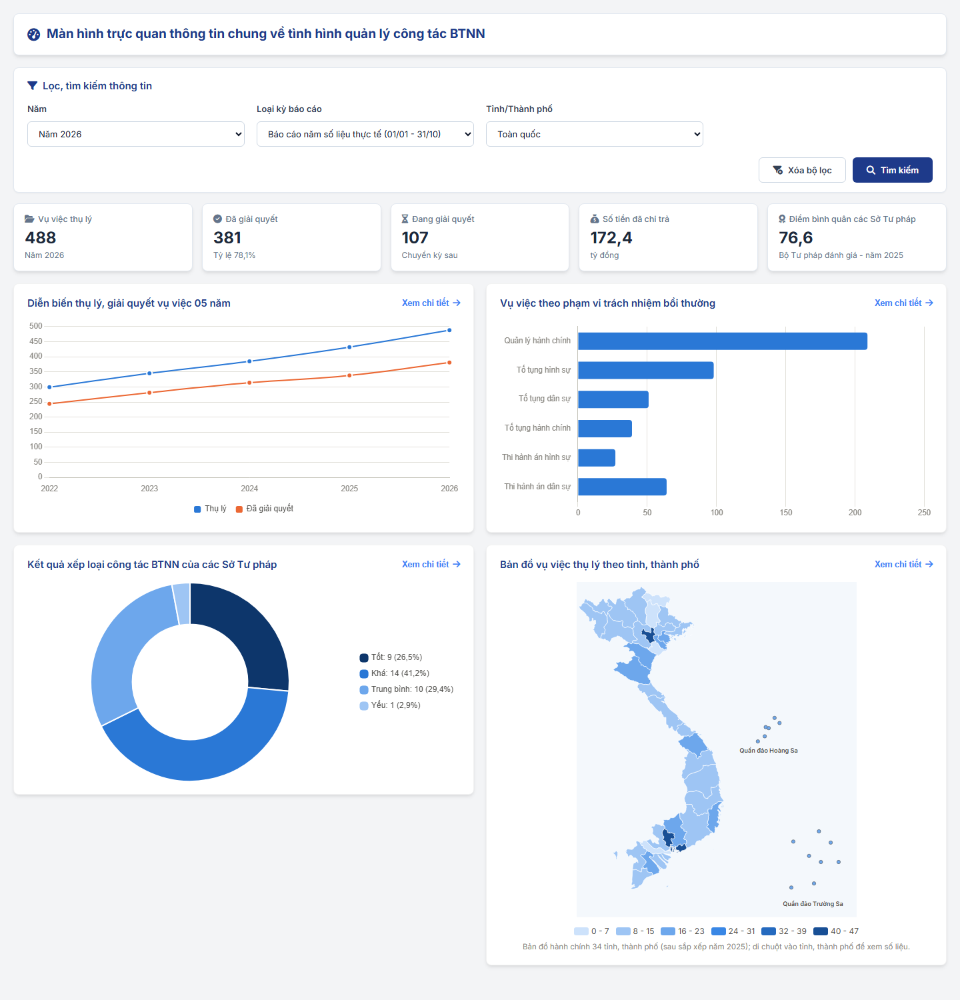
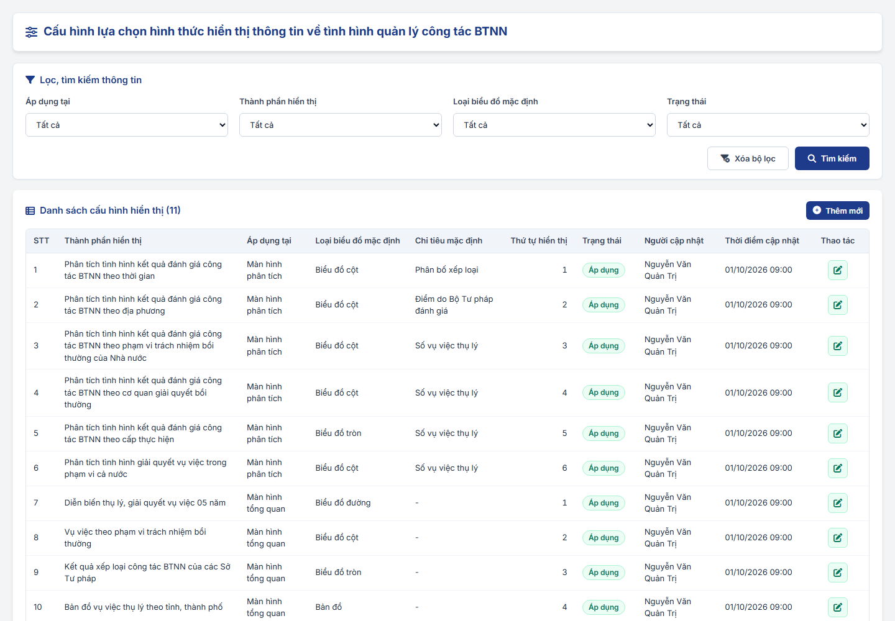
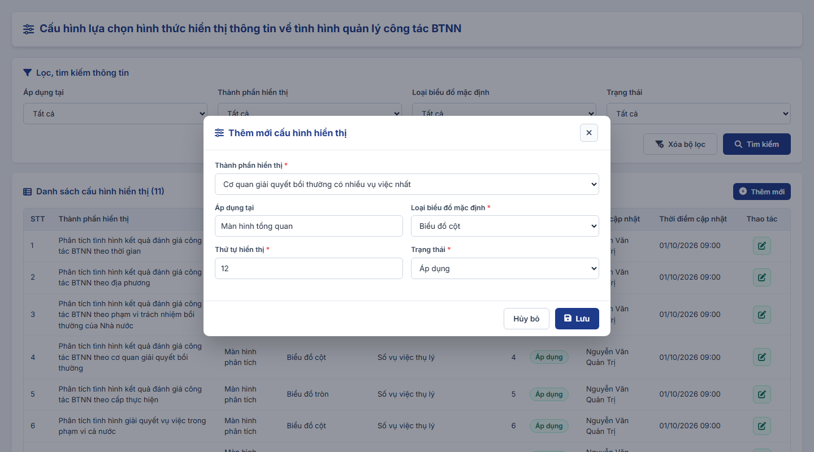
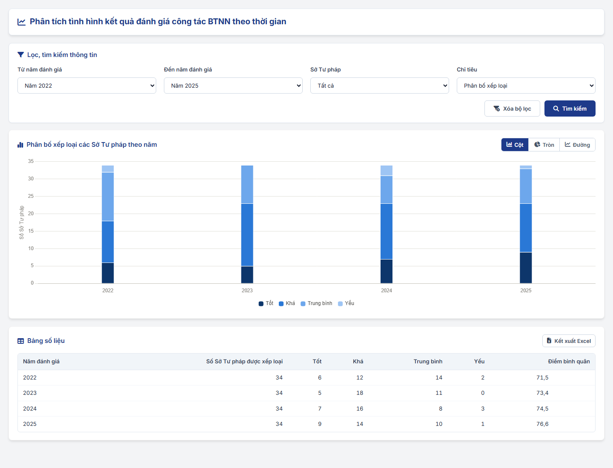
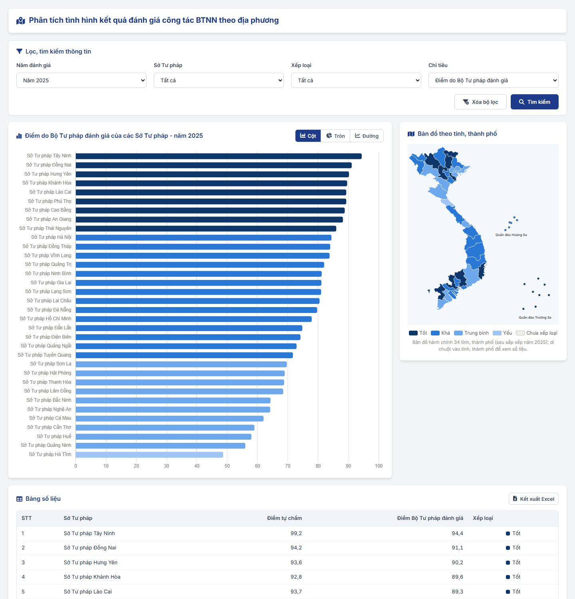
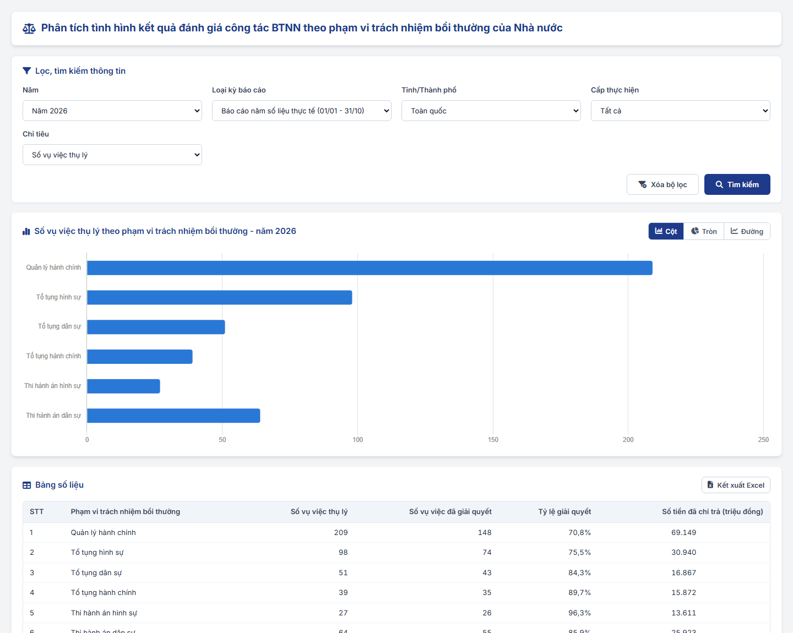
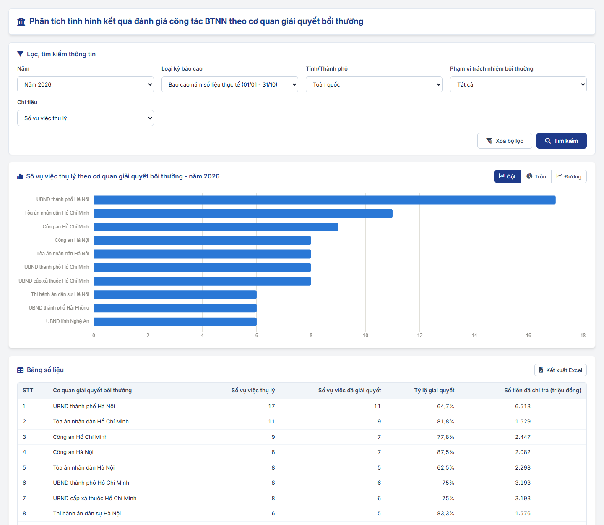
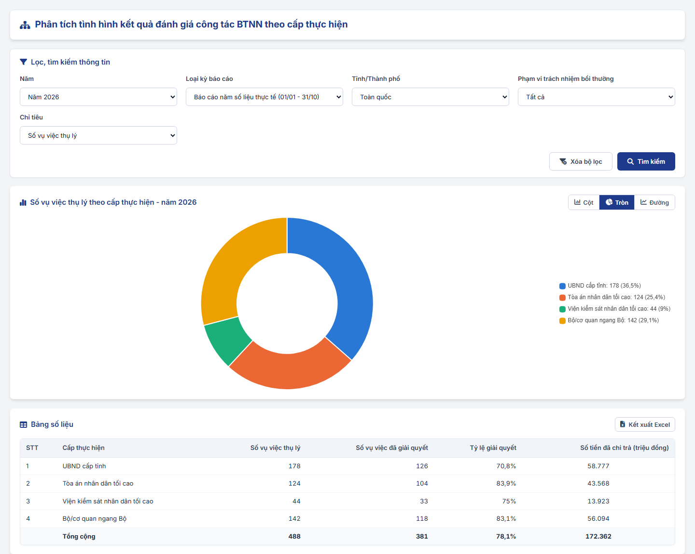
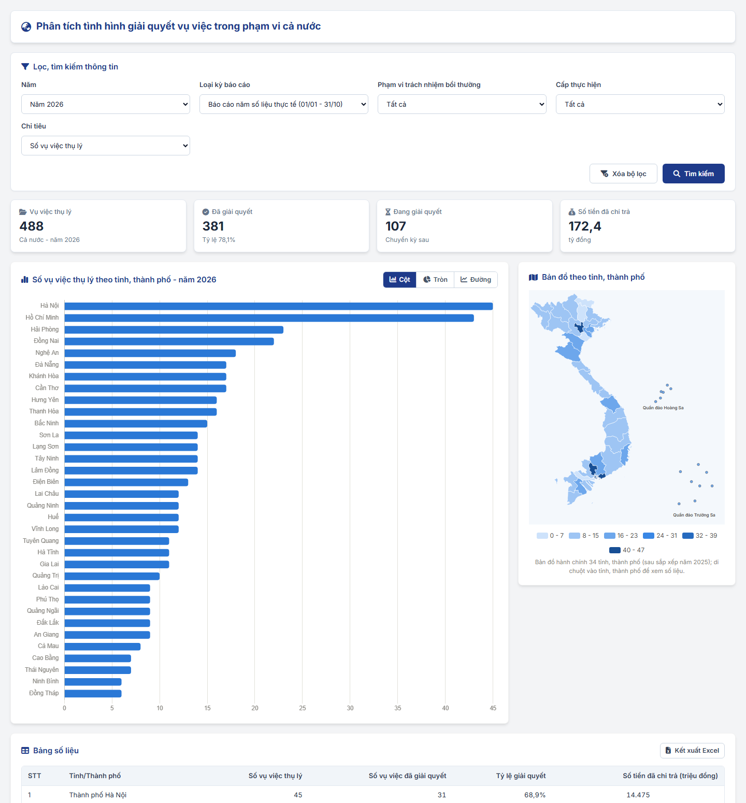

### 4.3.3.28. Dashboard trực quan thông tin về tình hình quản lý công tác bồi thường nhà nước

#### 4.3.3.28.1. Mục đích

\- Cung cấp cho Quản trị hệ thống (QTHT) và cán bộ quản lý màn hình trực quan về tình hình quản lý công tác bồi thường nhà nước (BTNN): tổng quan chung, phân tích kết quả đánh giá công tác BTNN và tình hình giải quyết vụ việc trên phạm vi cả nước.

\- Gồm 08 chức năng:

\+ Xem màn hình trực quan thông tin chung về tình hình quản lý công tác BTNN.

\+ Cấu hình lựa chọn hình thức hiển thị thông tin về tình hình quản lý công tác BTNN.

\+ Phân tích tình hình kết quả đánh giá công tác BTNN theo thời gian.

\+ Phân tích tình hình kết quả đánh giá công tác BTNN theo địa phương.

\+ Phân tích tình hình kết quả đánh giá công tác BTNN theo phạm vi trách nhiệm bồi thường của Nhà nước.

\+ Phân tích tình hình kết quả đánh giá công tác BTNN theo cơ quan giải quyết bồi thường.

\+ Phân tích tình hình kết quả đánh giá công tác BTNN theo cấp thực hiện.

\+ Phân tích tình hình giải quyết vụ việc trong phạm vi cả nước.

\- Dashboard chỉ đọc, tổng hợp từ dữ liệu đã có trên hệ thống; không phát sinh nhập liệu mới (trừ chức năng Cấu hình).

*a. Phân quyền*

\- Menu "Dashboard trực quan về quản lý BTNN", mỗi chức năng là 01 quyền riêng.

\- Vai trò thực hiện: Quản trị hệ thống (QTHT).

*b. Điều kiện thực hiện*

\- Người dùng đã đăng nhập Website Quản trị và được phân quyền chức năng tương ứng.

---

#### 4.3.3.28.2. Quy tắc chung

| STT | Nội dung | Quy tắc |
| :-- | :--- | :--- |
| 1 | Nguồn dữ liệu kết quả đánh giá | Dữ liệu tại Quản lý chấm điểm công tác BTNN: điểm tự chấm, điểm Bộ Tư pháp đánh giá, xếp loại [DM_33]. - Phạm vi: theo từng Sở Tư pháp (01 Sở Tư pháp/01 tỉnh, thành phố). - Chỉ lấy kỳ chấm điểm đã được Bộ Tư pháp đánh giá, xếp loại; xếp loại theo [BR-BTNN-CD-003]. - Áp dụng cho: Phân tích theo thời gian, Phân tích theo địa phương, thẻ và biểu đồ xếp loại tại màn hình tổng quan. |
| 2 | Nguồn dữ liệu vụ việc | Dữ liệu vụ việc yêu cầu bồi thường (YCBT) trên hệ thống, dùng chung bộ chỉ tiêu với Báo cáo Mẫu số 03-TT08: Số vụ việc thụ lý, Số vụ việc đã giải quyết, Số tiền đã chi trả. - Phạm vi: theo địa phương (tỉnh, thành phố nơi cơ quan giải quyết bồi thường đóng trụ sở). - Áp dụng cho: Phân tích theo phạm vi trách nhiệm, theo cơ quan giải quyết, theo cấp thực hiện, Phân tích trong phạm vi cả nước và các thẻ, biểu đồ vụ việc tại màn hình tổng quan. - Một vụ việc chỉ được tính một lần trong cùng kỳ, cùng chỉ tiêu. |
| 3 | Chiều phân tích | Thời gian: năm đánh giá. - Địa phương: Sở Tư pháp/tỉnh, thành phố [DM_13]. - Phạm vi trách nhiệm bồi thường: Lĩnh vực phát sinh thiệt hại [DM_22]. - Cơ quan giải quyết bồi thường: Đơn vị giải quyết của vụ việc [DM_DON_VI]. - Cấp thực hiện: Loại cơ quan báo cáo [DM_43]. |
| 4 | Kỳ số liệu | Loại kỳ báo cáo [DM_44]: Báo cáo năm số liệu thực tế (01/01 - 31/10); Số liệu thống kê năm chính thức (01/01 - 31/12). |
| 5 | Tham số mặc định | Khi mở màn hình, bộ lọc, loại biểu đồ, chỉ tiêu lấy theo cấu hình đang "Áp dụng" tại [MH02 - Cấu hình lựa chọn hình thức hiển thị](#db-mh02); chưa có cấu hình: Biểu đồ cột, chỉ tiêu đầu tiên của màn hình. - Năm mặc định: năm hiện tại đối với dữ liệu vụ việc; năm đánh giá gần nhất đã có kết quả đối với dữ liệu chấm điểm. |
| 6 | Loại biểu đồ | Mỗi màn hình phân tích có 03 loại: Biểu đồ cột, Biểu đồ tròn, Biểu đồ đường (dạng đường cong, thể hiện xu hướng theo thời gian). - Chuyển loại biểu đồ bằng nhóm nút "Cột / Tròn / Đường" tại góc phải khối biểu đồ, áp dụng ngay, không cần Tìm kiếm. - Biểu đồ tròn thể hiện cơ cấu (tỷ trọng); chú giải hiển thị giá trị và tỷ lệ %. - Di chuột vào biểu đồ hiển thị giá trị chi tiết. |
| 7 | Bản đồ tỉnh, thành phố | Bản đồ hành chính Việt Nam gồm 34 tỉnh, thành phố sau sắp xếp đơn vị hành chính năm 2025, vẽ theo ranh giới tỉnh, thành phố. - Thể hiện quần đảo Hoàng Sa (thành phố Đà Nẵng) và quần đảo Trường Sa (tỉnh Khánh Hòa); số liệu của quần đảo tính chung vào thành phố, tỉnh tương ứng. - Màu tỉnh, thành phố theo giá trị: 06 mức từ nhạt đến đậm (cùng một màu xanh); xếp loại theo 04 mức Tốt, Khá, Trung bình, Yếu; không có dữ liệu màu xám. - Di chuột vào tỉnh, thành phố hiển thị số liệu; click tỉnh, thành phố mở màn hình phân tích liên quan, lọc theo tỉnh, thành phố đó. - Dữ liệu ranh giới lưu sẵn trên hệ thống, không phụ thuộc kết nối mạng. |
| 8 | Bảng số liệu | Dưới biểu đồ của màn hình phân tích luôn có Bảng số liệu tương ứng (đối chiếu với biểu đồ), dòng Tổng cộng với chỉ tiêu cộng được. - Nút "Kết xuất Excel" xuất bảng số liệu theo điều kiện lọc hiện hành. |
| 9 | Không có dữ liệu | Biểu đồ không hiển thị; Bảng số liệu hiển thị [MSG-INF-SYS-001]. |
| 10 | Trình bày | Trên giao diện không đánh số La Mã, không có dòng mô tả dưới tiêu đề, không có nút Quay lại; màu biểu đồ dùng bảng màu chuẩn của hệ thống, nhận diện được với người mù màu; nhãn, giá trị dùng màu chữ, không dùng màu của biểu đồ. |

---

#### 4.3.3.28.3. MH01 - Màn hình trực quan thông tin chung về tình hình quản lý công tác BTNN

##### 4.3.3.28.3.1. Màn hình

##### 4.3.3.28.3.2. Mô tả thông tin trên màn hình

| Trường thông tin | Kiểu dữ liệu | Bắt buộc | Mặc định | Mô tả |
| :--- | :--- | :--- | :--- | :--- |
| **I. Lọc, tìm kiếm thông tin** | - | - | - | Control UI: Khối thu gọn/mở rộng, mặc định mở rộng. |
| Năm | Enum(Integer(4)) | Có | Năm hiện tại | Control UI: Hộp chọn, 05 năm gần nhất. |
| Loại kỳ báo cáo | Enum(String(100)) | Có | Báo cáo năm số liệu thực tế (01/01 - 31/10) | Control UI: Hộp chọn. - Tham chiếu [DM_44]. |
| Tỉnh/Thành phố | Enum(String(100)) | Không | Toàn quốc | Control UI: Hộp chọn. - Gồm: Toàn quốc và các tỉnh, thành phố [DM_13]. |
| **II. Thẻ số liệu** | - | - | - | Control UI: Hàng thẻ số liệu. |
| Vụ việc thụ lý | Integer(10) | - | Theo dữ liệu | Số vụ việc thụ lý trong kỳ. |
| Đã giải quyết | Integer(10) | - | Theo dữ liệu | Số vụ việc đã giải quyết; dòng phụ "Tỷ lệ [x]%" = Đã giải quyết / Thụ lý. |
| Đang giải quyết | Integer(10) | - | Theo dữ liệu | Thụ lý trừ Đã giải quyết. |
| Số tiền đã chi trả | Decimal(18,1) | - | Theo dữ liệu | Đơn vị tỷ đồng. |
| Điểm bình quân các Sở Tư pháp | Decimal(5,1) | - | Theo dữ liệu | Điểm Bộ Tư pháp đánh giá bình quân của các Sở Tư pháp, năm đánh giá gần nhất không lớn hơn Năm đã chọn. - Chọn Tỉnh/Thành phố: thay bằng thẻ "Xếp loại Sở Tư pháp [Tên]" hiển thị xếp loại và điểm. |
| **III. Thành phần biểu đồ** | - | - | Theo cấu hình | Control UI: Lưới 02 cột. - Chỉ hiển thị thành phần có cấu hình "Áp dụng" tại "Màn hình tổng quan", sắp xếp theo Thứ tự hiển thị; loại biểu đồ theo cấu hình. - Mỗi thành phần có link "Xem chi tiết" mở màn hình phân tích tương ứng, giữ nguyên Năm, Loại kỳ báo cáo, Tỉnh/Thành phố. - Không có thành phần nào: hiển thị "Chưa có thành phần nào được cấu hình hiển thị trên màn hình tổng quan." |
| Diễn biến thụ lý, giải quyết vụ việc 05 năm | - | - | Biểu đồ đường | Số vụ việc thụ lý và đã giải quyết của 05 năm gần nhất. - Xem chi tiết: [MH08](#db-mh08). |
| Vụ việc theo phạm vi trách nhiệm bồi thường | - | - | Biểu đồ cột | Số vụ việc thụ lý theo 06 lĩnh vực [DM_22]. - Xem chi tiết: [MH05](#db-mh05). |
| Kết quả xếp loại công tác BTNN của các Sở Tư pháp | - | - | Biểu đồ tròn | Số Sở Tư pháp theo xếp loại, toàn quốc, năm đánh giá gần nhất. - Xem chi tiết: [MH04](#db-mh04). |
| Bản đồ vụ việc thụ lý theo tỉnh, thành phố | - | - | Bản đồ | Số vụ việc thụ lý của từng tỉnh, thành phố. - Click tỉnh, thành phố: mở [MH08](#db-mh08) đánh dấu tỉnh, thành phố đó. |
| Vụ việc theo cấp thực hiện | - | - | Biểu đồ tròn | Số vụ việc thụ lý theo [DM_43]. - Xem chi tiết: [MH07](#db-mh07). |
| Cơ quan giải quyết bồi thường có nhiều vụ việc nhất | - | - | Biểu đồ cột | 06 cơ quan có số vụ việc thụ lý lớn nhất. - Xem chi tiết: [MH06](#db-mh06). |

##### 4.3.3.28.3.3. Chức năng trên màn hình

| STT | Tên chức năng | Định dạng | Mô tả |
| :-- | :--- | :--- | :--- |
| 1 | Tìm kiếm | Nút | - Tính lại thẻ số liệu, thành phần biểu đồ theo điều kiện lọc. |
| 2 | Xóa bộ lọc | Nút | - Đưa bộ lọc về giá trị mặc định và tải lại màn hình. |
| 3 | Xem chi tiết | Link | - Mở màn hình phân tích tương ứng của thành phần, giữ nguyên điều kiện lọc. |

---

#### 4.3.3.28.4. MH02 - Cấu hình lựa chọn hình thức hiển thị thông tin về tình hình quản lý công tác BTNN

##### 4.3.3.28.4.1. Màn hình

##### 4.3.3.28.4.2. Mô tả thông tin trên màn hình

\- Cấu hình áp dụng chung cho toàn hệ thống; mỗi thành phần hiển thị chỉ có 01 cấu hình.

| Trường thông tin | Kiểu dữ liệu | Bắt buộc | Mặc định | Mô tả |
| :--- | :--- | :--- | :--- | :--- |
| **I. Lọc, tìm kiếm thông tin** | - | - | - | Control UI: Khối thu gọn/mở rộng. |
| Áp dụng tại | Enum(String(50)) | Không | Tất cả | Control UI: Hộp chọn. - Gồm: Tất cả, Màn hình tổng quan, Màn hình phân tích. |
| Thành phần hiển thị | Enum(String(255)) | Không | Tất cả | Control UI: Hộp chọn, gồm 06 màn hình phân tích và 06 thành phần của màn hình tổng quan. |
| Loại biểu đồ mặc định | Enum(String(50)) | Không | Tất cả | Control UI: Hộp chọn. - Gồm: Tất cả, Biểu đồ cột, Biểu đồ tròn, Biểu đồ đường, Bản đồ. |
| Trạng thái | Enum(String(50)) | Không | Tất cả | Control UI: Hộp chọn. - Gồm: Tất cả, Áp dụng, Không áp dụng. |
| **II. Danh sách cấu hình hiển thị** | - | - | - | Control UI: Bảng; góc phải tiêu đề có nút "Thêm mới". - Sắp xếp theo Áp dụng tại, sau đó Thứ tự hiển thị. |
| STT | Integer(10) | - | Tự sinh | |
| Thành phần hiển thị | String(255) | - | Theo dữ liệu | |
| Áp dụng tại | String(50) | - | Theo dữ liệu | |
| Loại biểu đồ mặc định | String(50) | - | Theo dữ liệu | |
| Chỉ tiêu mặc định | String(255) | - | Theo dữ liệu | Chỉ có với màn hình phân tích; thành phần màn hình tổng quan hiển thị "-". |
| Thứ tự hiển thị | Integer(2) | - | Theo dữ liệu | |
| Trạng thái | String(50) | - | Theo dữ liệu | Control UI: Tag (Áp dụng, Không áp dụng). |
| Người cập nhật | String(255) | - | Theo dữ liệu | |
| Thời điểm cập nhật | DateTime | - | Theo dữ liệu | Định dạng dd/mm/yyyy hh:mm. |
| Thao tác | - | - | - | Control UI: Icon "Cập nhật". |
| **III. Popup Thêm mới/Cập nhật cấu hình hiển thị** | - | - | - | Control UI: Popup. |
| Thành phần hiển thị | Enum(String(255)) | Có | Thành phần đầu tiên chưa có cấu hình | Control UI: Hộp chọn. - Thêm mới: chỉ gồm thành phần chưa có cấu hình. - Cập nhật: chỉ đọc. |
| Áp dụng tại | String(50) | - | Theo thành phần | Chỉ đọc. |
| Loại biểu đồ mặc định | Enum(String(50)) | Có | Biểu đồ cột | Control UI: Hộp chọn: Biểu đồ cột, Biểu đồ tròn, Biểu đồ đường. - Thành phần Bản đồ: cố định "Bản đồ", chỉ đọc. |
| Chỉ tiêu mặc định | Enum(String(255)) | Có (màn hình phân tích) | Chỉ tiêu đầu tiên | Control UI: Hộp chọn theo danh sách Chỉ tiêu của màn hình phân tích. - Ẩn với thành phần màn hình tổng quan. |
| Thứ tự hiển thị | Integer(2) | Có | Số thứ tự tiếp theo | Control UI: Input number, 1 - 99. |
| Trạng thái | Enum(String(50)) | Có | Áp dụng | Control UI: Hộp chọn: Áp dụng, Không áp dụng. - Không áp dụng: thành phần không hiển thị trên màn hình tổng quan; màn hình phân tích dùng giá trị mặc định của hệ thống. |

##### 4.3.3.28.4.3. Chức năng trên màn hình

| STT | Tên chức năng | Định dạng | Mô tả |
| :-- | :--- | :--- | :--- |
| 1 | Tìm kiếm | Nút | - Lọc danh sách theo đồng thời các điều kiện. |
| 2 | Xóa bộ lọc | Nút | - Đưa bộ lọc về "Tất cả" và tải lại danh sách. |
| 3 | Thêm mới | Nút | - TH1 (Tất cả thành phần đã có cấu hình): Hiển thị "Tất cả thành phần đã có cấu hình. Vui lòng chọn Cập nhật.". - TH Hợp lệ: Mở Popup ở chế độ Thêm mới. |
| 4 | Cập nhật | Icon | - Mở Popup ở chế độ Cập nhật với thông tin hiện tại. |
| 5 | Lưu | Nút (Popup) | - TH1 (Bỏ trống trường bắt buộc): Hiển thị [MSG-ERR-VAL-001] dưới trường. - TH Hợp lệ: Lưu cấu hình, ghi Người cập nhật, Thời điểm cập nhật; đóng popup, tải lại danh sách; hiển thị "Thêm mới cấu hình thành công." hoặc "Cập nhật cấu hình thành công.". - Cấu hình có hiệu lực ngay ở lần mở tiếp theo của màn hình tổng quan, màn hình phân tích. |
| 6 | Hủy bỏ / Đóng (x) | Nút / Icon | - Đóng popup, không lưu. |

---

#### 4.3.3.28.5. Bố cục chung của màn hình phân tích (MH03 - MH08)

| Trường thông tin | Kiểu dữ liệu | Bắt buộc | Mặc định | Mô tả |
| :--- | :--- | :--- | :--- | :--- |
| **I. Lọc, tìm kiếm thông tin** | - | - | Theo cấu hình | Control UI: Khối thu gọn/mở rộng; các trường lọc theo từng màn hình (mô tả tại từng màn hình). |
| Chỉ tiêu | Enum(String(255)) | Có | Theo cấu hình | Control UI: Hộp chọn; danh sách theo từng màn hình. |
| **II. Thẻ số liệu** | - | - | - | Chỉ có tại [MH08](#db-mh08). |
| **III. Khối biểu đồ** | - | - | - | Control UI: Tiêu đề động theo Chỉ tiêu, điều kiện lọc và loại biểu đồ. - Góc phải: nhóm nút Cột / Tròn / Đường; mặc định theo cấu hình. |
| **IV. Bản đồ theo tỉnh, thành phố** | - | - | - | Chỉ có tại [MH04](#db-mh04), [MH08](#db-mh08); đặt bên phải khối biểu đồ. |
| **V. Bảng số liệu** | - | - | - | Control UI: Bảng; góc phải có nút "Kết xuất Excel". |

| STT | Tên chức năng | Định dạng | Mô tả |
| :-- | :--- | :--- | :--- |
| 1 | Tìm kiếm | Nút | - Tổng hợp lại số liệu, vẽ lại biểu đồ, bản đồ, bảng theo điều kiện lọc. |
| 2 | Xóa bộ lọc | Nút | - Đưa bộ lọc về giá trị mặc định theo cấu hình và tải lại. |
| 3 | Cột / Tròn / Đường | Nhóm nút | - Đổi loại biểu đồ theo quy tắc của từng màn hình; giữ nguyên điều kiện lọc. |
| 4 | Kết xuất Excel | Nút | - Xuất Bảng số liệu ra tệp .xlsx. |
| 5 | Click tỉnh, thành phố trên bản đồ | Bản đồ | - Mở màn hình phân tích liên quan, lọc theo tỉnh, thành phố được chọn. |

---

#### 4.3.3.28.6. MH03 - Phân tích tình hình kết quả đánh giá công tác BTNN theo thời gian

\- Nguồn dữ liệu: kết quả chấm điểm theo Sở Tư pháp.

| Trường thông tin | Kiểu dữ liệu | Bắt buộc | Mặc định | Mô tả |
| :--- | :--- | :--- | :--- | :--- |
| Từ năm đánh giá | Enum(Integer(4)) | Có | Năm đánh giá sớm nhất có dữ liệu | Control UI: Hộp chọn. |
| Đến năm đánh giá | Enum(Integer(4)) | Có | Năm đánh giá gần nhất | Control UI: Hộp chọn. - Từ năm lớn hơn Đến năm: hiển thị "Từ năm đánh giá không được lớn hơn Đến năm đánh giá.", không tìm kiếm. |
| Sở Tư pháp | Enum(String(255)) | Không | Tất cả | Control UI: Hộp chọn. |
| Chỉ tiêu | Enum(String(255)) | Có | Phân bố xếp loại | Gồm: Phân bố xếp loại; Điểm bình quân do Bộ Tư pháp đánh giá. |

| Loại biểu đồ | Cách thể hiện |
| :--- | :--- |
| Biểu đồ cột | Trục ngang là năm đánh giá. - Phân bố xếp loại: cột chồng số Sở Tư pháp theo 04 mức Tốt, Khá, Trung bình, Yếu. - Điểm bình quân: 01 cột/năm, trục dọc 0 - 100. |
| Biểu đồ tròn | Cơ cấu xếp loại cộng dồn các năm đã chọn. |
| Biểu đồ đường | Phân bố xếp loại: 01 đường/mức xếp loại. - Điểm bình quân: 01 đường. |

\- Bảng số liệu: Năm đánh giá; Số Sở Tư pháp được xếp loại; Tốt; Khá; Trung bình; Yếu; Điểm bình quân.

---

#### 4.3.3.28.7. MH04 - Phân tích tình hình kết quả đánh giá công tác BTNN theo địa phương

\- Nguồn dữ liệu: kết quả chấm điểm theo Sở Tư pháp.

| Trường thông tin | Kiểu dữ liệu | Bắt buộc | Mặc định | Mô tả |
| :--- | :--- | :--- | :--- | :--- |
| Năm đánh giá | Enum(Integer(4)) | Có | Năm đánh giá gần nhất | Control UI: Hộp chọn. |
| Sở Tư pháp | Enum(String(255)) | Không | Tất cả | Control UI: Hộp chọn. |
| Xếp loại | Enum(String(50)) | Không | Tất cả | Control UI: Hộp chọn, tham chiếu [DM_33]. |
| Chỉ tiêu | Enum(String(255)) | Có | Điểm do Bộ Tư pháp đánh giá | Gồm: Điểm do Bộ Tư pháp đánh giá; Điểm tự chấm. |

| Loại biểu đồ | Cách thể hiện |
| :--- | :--- |
| Biểu đồ cột | Cột ngang, 01 cột/Sở Tư pháp, sắp xếp điểm giảm dần; màu cột theo xếp loại; trục 0 - 100. |
| Biểu đồ tròn | Cơ cấu số Sở Tư pháp theo xếp loại trong năm. |
| Biểu đồ đường | Diễn biến điểm qua các năm đánh giá của 05 Sở Tư pháp có điểm cao nhất trong danh sách đang lọc (chọn 01 Sở Tư pháp: hiển thị Sở Tư pháp đó). |

\- Bản đồ: màu tỉnh, thành phố theo xếp loại; tỉnh, thành phố không thuộc điều kiện lọc màu xám; di chuột hiển thị Điểm tự chấm, Điểm Bộ Tư pháp đánh giá, Xếp loại.

\- Bảng số liệu: STT; Sở Tư pháp; Điểm tự chấm; Điểm Bộ Tư pháp đánh giá; Xếp loại.

---

#### 4.3.3.28.8. MH05 - Phân tích tình hình kết quả đánh giá công tác BTNN theo phạm vi trách nhiệm bồi thường của Nhà nước

\- Nguồn dữ liệu: vụ việc YCBT theo địa phương.

| Trường thông tin | Kiểu dữ liệu | Bắt buộc | Mặc định | Mô tả |
| :--- | :--- | :--- | :--- | :--- |
| Năm | Enum(Integer(4)) | Có | Năm hiện tại | Control UI: Hộp chọn. |
| Loại kỳ báo cáo | Enum(String(100)) | Có | Báo cáo năm số liệu thực tế (01/01 - 31/10) | Tham chiếu [DM_44]. |
| Tỉnh/Thành phố | Enum(String(100)) | Không | Toàn quốc | Tham chiếu [DM_13]. |
| Cấp thực hiện | Enum(String(100)) | Không | Tất cả | Tham chiếu [DM_43]. |
| Chỉ tiêu | Enum(String(255)) | Có | Số vụ việc thụ lý | Gồm: Số vụ việc thụ lý; Số vụ việc đã giải quyết; Số tiền đã chi trả (triệu đồng). |

| Loại biểu đồ | Cách thể hiện |
| :--- | :--- |
| Biểu đồ cột | 01 cột/lĩnh vực [DM_22]. |
| Biểu đồ tròn | Cơ cấu theo 06 lĩnh vực. |
| Biểu đồ đường | Diễn biến 05 năm, 01 đường/lĩnh vực. |

\- Bảng số liệu: STT; Phạm vi trách nhiệm bồi thường; Số vụ việc thụ lý; Số vụ việc đã giải quyết; Tỷ lệ giải quyết; Số tiền đã chi trả (triệu đồng); dòng Tổng cộng.

---

#### 4.3.3.28.9. MH06 - Phân tích tình hình kết quả đánh giá công tác BTNN theo cơ quan giải quyết bồi thường

\- Nguồn dữ liệu: vụ việc YCBT theo địa phương.

| Trường thông tin | Kiểu dữ liệu | Bắt buộc | Mặc định | Mô tả |
| :--- | :--- | :--- | :--- | :--- |
| Năm | Enum(Integer(4)) | Có | Năm hiện tại | Control UI: Hộp chọn. |
| Loại kỳ báo cáo | Enum(String(100)) | Có | Báo cáo năm số liệu thực tế (01/01 - 31/10) | Tham chiếu [DM_44]. |
| Tỉnh/Thành phố | Enum(String(100)) | Không | Toàn quốc | Tham chiếu [DM_13]. |
| Phạm vi trách nhiệm bồi thường | Enum(String(100)) | Không | Tất cả | Tham chiếu [DM_22]. |
| Chỉ tiêu | Enum(String(255)) | Có | Số vụ việc thụ lý | Như [MH05](#db-mh05). |

| Loại biểu đồ | Cách thể hiện |
| :--- | :--- |
| Biểu đồ cột | Cột ngang, 10 cơ quan có giá trị lớn nhất, sắp xếp giảm dần. |
| Biểu đồ tròn | 05 cơ quan có giá trị lớn nhất và nhóm "Các cơ quan khác" (màu xám). |
| Biểu đồ đường | Diễn biến 05 năm của 05 cơ quan có giá trị lớn nhất. |

\- Bảng số liệu: toàn bộ cơ quan có số liệu, sắp xếp giảm dần; các cột như [MH05](#db-mh05).

---

#### 4.3.3.28.10. MH07 - Phân tích tình hình kết quả đánh giá công tác BTNN theo cấp thực hiện

\- Nguồn dữ liệu: vụ việc YCBT theo địa phương.

| Trường thông tin | Kiểu dữ liệu | Bắt buộc | Mặc định | Mô tả |
| :--- | :--- | :--- | :--- | :--- |
| Năm, Loại kỳ báo cáo, Tỉnh/Thành phố, Phạm vi trách nhiệm bồi thường, Chỉ tiêu | - | - | - | Như [MH06](#db-mh06). |

| Loại biểu đồ | Cách thể hiện |
| :--- | :--- |
| Biểu đồ cột | 01 cột/cấp thực hiện [DM_43]. |
| Biểu đồ tròn | Cơ cấu theo 04 cấp thực hiện. |
| Biểu đồ đường | Diễn biến 05 năm, 01 đường/cấp thực hiện. |

\- Bảng số liệu: STT; Cấp thực hiện; các cột như [MH05](#db-mh05).

---

#### 4.3.3.28.11. MH08 - Phân tích tình hình giải quyết vụ việc trong phạm vi cả nước

\- Nguồn dữ liệu: vụ việc YCBT của toàn bộ tỉnh, thành phố.

| Trường thông tin | Kiểu dữ liệu | Bắt buộc | Mặc định | Mô tả |
| :--- | :--- | :--- | :--- | :--- |
| Năm | Enum(Integer(4)) | Có | Năm hiện tại | Control UI: Hộp chọn. |
| Loại kỳ báo cáo | Enum(String(100)) | Có | Báo cáo năm số liệu thực tế (01/01 - 31/10) | Tham chiếu [DM_44]. |
| Phạm vi trách nhiệm bồi thường | Enum(String(100)) | Không | Tất cả | Tham chiếu [DM_22]. |
| Cấp thực hiện | Enum(String(100)) | Không | Tất cả | Tham chiếu [DM_43]. |
| Chỉ tiêu | Enum(String(255)) | Có | Số vụ việc thụ lý | Như [MH05](#db-mh05). |
| Thẻ số liệu | - | - | Theo dữ liệu | Vụ việc thụ lý; Đã giải quyết (kèm tỷ lệ); Đang giải quyết; Số tiền đã chi trả (tỷ đồng) - cả nước. |

| Loại biểu đồ | Cách thể hiện |
| :--- | :--- |
| Biểu đồ cột | Cột ngang, 01 cột/tỉnh, thành phố, sắp xếp giảm dần theo Chỉ tiêu; tỉnh được chọn từ bản đồ màn hình tổng quan tô màu nổi bật. |
| Biểu đồ tròn | Cơ cấu tình trạng giải quyết: Đã giải quyết, Đang giải quyết. |
| Biểu đồ đường | Diễn biến 05 năm: Số vụ việc thụ lý, Số vụ việc đã giải quyết. |

\- Bản đồ: màu tỉnh, thành phố theo Chỉ tiêu đang chọn (06 mức); di chuột hiển thị Số vụ việc thụ lý, Số vụ việc đã giải quyết, Tỷ lệ giải quyết, Số tiền đã chi trả; click tỉnh, thành phố mở [MH05](#db-mh05) lọc theo tỉnh, thành phố.

\- Bảng số liệu: STT; Tỉnh/Thành phố; Số vụ việc thụ lý; Số vụ việc đã giải quyết; Tỷ lệ giải quyết; Số tiền đã chi trả (triệu đồng); dòng Tổng cộng.
