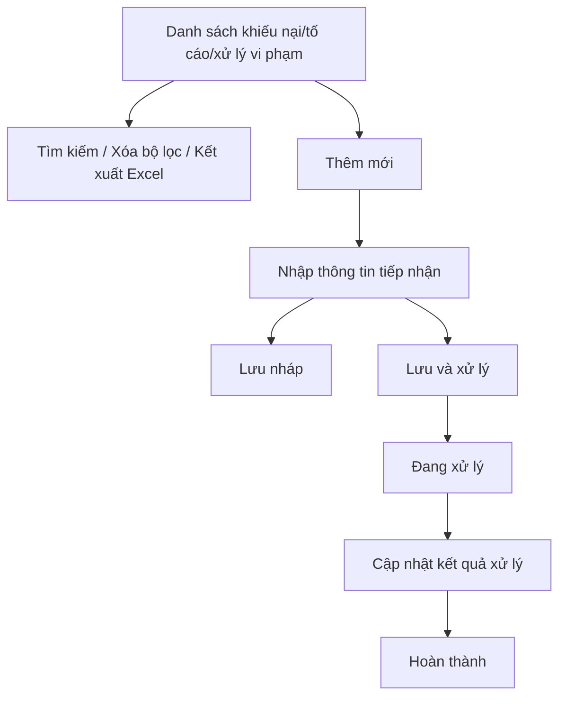

### 4.3.3. Dành cho Cán bộ Công tác bồi thường nhà nước

#### 4.3.3.10. UC-BTNN-KNTC - Giải quyết khiếu nại, tố cáo, xử lý vi phạm trong công tác BTNN

##### 4.3.3.10.1. Mục đích

\- Cho phép quản lý thông tin khiếu nại, tố cáo, phản ánh, kiến nghị liên quan đến công tác bồi thường nhà nước; theo dõi quá trình xử lý, kết quả xử lý và biện pháp khắc phục/xử lý vi phạm.

\- Cho phép liên kết hồ sơ với vụ việc yêu cầu bồi thường, hồ sơ hoàn trả, hồ sơ theo dõi/đôn đốc hoặc hồ sơ kiểm tra khi nội dung phát sinh từ các nghiệp vụ này.

*a. Phân quyền*:

\- Cán bộ xử lý: Được tra cứu, thêm mới, cập nhật, chuyển xử lý, cập nhật kết quả, hoàn thành và đính kèm tài liệu.

*b. Điều kiện thực hiện*:

\- Người dùng đã đăng nhập Website Quản trị và có quyền truy cập nhóm chức năng Công tác bồi thường nhà nước.

\- Nội dung tiếp nhận thuộc nhóm khiếu nại, tố cáo, phản ánh, kiến nghị hoặc xử lý vi phạm liên quan đến giải quyết bồi thường, cấp kinh phí/chi trả, xác định trách nhiệm hoàn trả, xử lý kỷ luật, quản lý nhà nước về công tác BTNN.

##### 4.3.3.10.2. Sơ đồ luồng nghiệp vụ theo giao diện

##### 4.3.3.10.3. MH01 - Màn hình Danh sách khiếu nại, tố cáo, xử lý vi phạm trong công tác BTNN

###### 4.3.3.10.3.1. Màn hình

###### 4.3.3.10.3.2. Mô tả thông tin trên màn hình

| Trường thông tin | Kiểu dữ liệu | Bắt buộc | Mặc định | Mô tả |
| :--- | :--- | :--- | :--- | :--- |
| Tiêu đề màn hình | String(255) | Không | Khiếu nại, tố cáo, xử lý vi phạm trong công tác BTNN | Hiển thị tên màn hình. |
| Mã hồ sơ | String(50) | Không | Trống | Tìm gần đúng theo mã hồ sơ. |
| Người/cơ quan gửi | String(255) | Không | Trống | Tìm gần đúng theo người/cơ quan gửi khiếu nại, tố cáo, phản ánh, kiến nghị. |
| Loại nội dung | Enum(String(100)) | Không | Tất cả | Gồm: - Tất cả - Khiếu nại - Tố cáo - Phản ánh - Kiến nghị - Xử lý vi phạm |
| Nhóm nghiệp vụ liên quan | Enum(String(100)) | Không | Tất cả | Gồm: - Tất cả - Giải quyết yêu cầu bồi thường - Cấp kinh phí bồi thường và chi trả tiền bồi thường - Xác định trách nhiệm hoàn trả - Xử lý kỷ luật - Quản lý nhà nước về công tác BTNN - Kiểm tra công tác BTNN - Đôn đốc công tác BTNN |
| Trạng thái | Enum(String(50)) | Không | Tất cả | Gồm: - Tất cả - Lưu nháp - Đang xử lý - Hoàn thành |
| Từ ngày | Date | Không | Trống | Ngày tiếp nhận từ, áp dụng [BR-VAL-007]. |
| Đến ngày | Date | Không | Trống | Ngày tiếp nhận đến, áp dụng [BR-VAL-007]. |
| Thêm mới | String(50) | Không | Hiển thị | Chi tiết nghiệp vụ xem tại bảng Chức năng trên màn hình. |
| Xóa bộ lọc | String(50) | Không | Hiển thị | Chi tiết nghiệp vụ xem tại bảng Chức năng trên màn hình. |
| Tìm kiếm | String(50) | Không | Hiển thị | Chi tiết nghiệp vụ xem tại bảng Chức năng trên màn hình. |
| Kết xuất Excel | String(50) | Không | Hiển thị | Chi tiết nghiệp vụ xem tại bảng Chức năng trên màn hình. |
| Bảng danh sách | String(255) | Không | Theo dữ liệu hệ thống | Sắp xếp mặc định theo ngày tiếp nhận giảm dần. - Trạng thái có dữ liệu: Hiển thị danh sách các bản ghi kết quả theo cấu trúc các cột quy định. - Trạng thái không có dữ liệu (Empty State): Khi không tìm thấy kết quả phù hợp với điều kiện tìm kiếm, bảng hiển thị duy nhất 01 dòng căn giữa trên toàn bộ chiều rộng bảng (`colspan`), in nghiêng với nội dung: *"Không tìm thấy dữ liệu phù hợp với điều kiện tìm kiếm."* |
| STT | Integer(10) | Không | Tự tăng | Số thứ tự dòng trên trang hiện tại. |
| Mã hồ sơ | String(50) | Không | Theo dữ liệu | Người dùng click dòng dữ liệu để mở chi tiết. |
| Người/cơ quan gửi | String(255) | Không | Theo dữ liệu | Hiển thị chủ thể gửi nội dung. |
| Loại nội dung | Enum(String(100)) | Không | Theo dữ liệu | Hiển thị loại nội dung. |
| Nhóm nghiệp vụ liên quan | Enum(String(100)) | Không | Theo dữ liệu | Hiển thị nghiệp vụ BTNN liên quan. |
| Mã vụ việc liên quan | String(50) | Không | Theo dữ liệu | Hiển thị mã vụ việc nếu có liên kết. |
| Ngày tiếp nhận | Date | Không | Theo dữ liệu | Hỗ trợ sắp xếp. |
| Cán bộ xử lý | String(255) | Không | Theo dữ liệu | Hiển thị cán bộ xử lý hiện hành. |
| Trạng thái | Enum(String(50)) | Không | Theo dữ liệu | Hiển thị dạng badge. |
| Thao tác | String(255) | Không | Theo trạng thái | Không hiển thị row click chi tiết; xem bằng row click. Hiển thị `Sửa`, `Lưu và xử lý`, `Cập nhật kết quả`, `Hoàn thành` theo trạng thái; nút không đủ điều kiện hiển thị mờ. |
| Phân trang | String(255) | Không | 20 bản ghi/trang | Tuân thủ chuẩn phân trang chung. |

###### 4.3.3.10.3.3. Chức năng trên màn hình

| STT | Tên chức năng | Định dạng | Mô tả |
| :--- | :--- | :--- | :--- |
| 1 | Thêm mới | Button | Mở **4.3.3.10.4. MH02 - Màn hình Thêm mới/Cập nhật khiếu nại, tố cáo, xử lý vi phạm trong công tác BTNN** ở chế độ thêm mới. |
| 2 | Tìm kiếm | Button | TH1 (Khoảng ngày không hợp lệ): Vi phạm [BR-VAL-007], hệ thống hiển thị lỗi inline và không tìm kiếm. - **TH Không có dữ liệu trả về**: + Bảng kết quả: Hiển thị dòng thông báo rỗng *"Không tìm thấy dữ liệu phù hợp với điều kiện tìm kiếm."* ở giữa bảng. + Thanh phân trang (Pagination): Dòng số lượng hiển thị *"Hiển thị 0-0 của 0 bản ghi"* (hoặc *"Hiển thị 0-0 của 0 yêu cầu"*); các nút điều hướng trang (`&#124;&lt;&lt;`, `&lt;`, các số trang, `&gt;`, `&gt;&gt;&#124;`) ở trạng thái ẩn hoặc khóa mờ (Disabled). + Nút "Kết xuất Excel" (nếu màn hình có nút này): Thiết lập ở trạng thái khóa mờ (Disabled) với thuộc tính `style="opacity: 0.35; pointer-events: none; cursor: not-allowed;"` kèm tooltip: *"Không có dữ liệu để kết xuất Excel"*. |
|  |  |  | TH Hợp lệ: Hệ thống lọc danh sách theo tiêu chí nhập/chọn và đưa về trang 1. |
| 3 | Xóa bộ lọc | Button | Hệ thống xóa tiêu chí lọc, đưa về giá trị mặc định và tải lại danh sách. |
| 4 | Kết xuất Excel | Button | Kết xuất danh sách theo kết quả tìm kiếm hiện hành, áp dụng [BR-EXP-040]. |
| 5 | Click dòng dữ liệu | Row click | Mở **4.3.3.10.4. MH02** ở chế độ xem chi tiết. |
| 6 | Lưu và xử lý | Button/Icon | Lưu thông tin tiếp nhận, chuyển hồ sơ sang trạng thái "Đang xử lý" và ghi nhận cán bộ/đơn vị xử lý. |
| 7 | Cập nhật kết quả | Button/Icon | Mở **4.3.3.10.4. MH02** tại khối kết quả xử lý khi hồ sơ ở trạng thái "Đang xử lý". |

##### 4.3.3.10.4. MH02 - Màn hình Thêm mới/Cập nhật khiếu nại, tố cáo, xử lý vi phạm trong công tác BTNN

###### 4.3.3.10.4.1. Màn hình

###### 4.3.3.10.4.2. Mô tả thông tin trên màn hình

| Trường thông tin | Kiểu dữ liệu | Bắt buộc | Mặc định | Mô tả |
| :--- | :--- | :--- | :--- | :--- |
| Mã hồ sơ | String(50) | Không | Hệ thống tự sinh | Chỉ đọc sau khi lưu lần đầu. |
| Loại nội dung | Enum(String(100)) | Có | Khiếu nại | Gồm: - Khiếu nại - Tố cáo - Phản ánh - Kiến nghị - Xử lý vi phạm |
| Ngày tiếp nhận | Date | Có | Ngày hiện tại | Áp dụng [BR-VAL-001]. |
| Người/cơ quan gửi | String(255) | Có | Trống | Tên người, cơ quan, tổ chức gửi nội dung. |
| Thông tin liên hệ | String(255) | Không | Trống | Số điện thoại, email hoặc địa chỉ liên hệ nếu có. |
| Nhóm nghiệp vụ liên quan | Enum(String(100)) | Có | Trống | Gồm các giá trị tại MH01. |
| Mã vụ việc liên quan | String(50) | Không | Trống | Cho phép liên kết vụ việc yêu cầu bồi thường hoặc hồ sơ hoàn trả nếu có. |
| Cơ quan/cá nhân bị phản ánh | String(255) | Không | Trống | Cơ quan, tổ chức, cá nhân liên quan đến nội dung phản ánh/khiếu nại/tố cáo. |
| Nội dung tiếp nhận | Text(4000) | Có | Trống | Nội dung khiếu nại, tố cáo, phản ánh, kiến nghị hoặc nội dung vi phạm cần xử lý. |
| Mức độ ưu tiên | Enum(String(50)) | Có | Bình thường | Gồm: - Bình thường - Khẩn - Rất khẩn |
| Đơn vị/cán bộ xử lý | String(255) | Có khi lưu và xử lý | Trống | Đơn vị hoặc cán bộ được phân công xử lý. |
| Hạn xử lý | Date | Không | Trống | Hạn xử lý nội dung tiếp nhận. |
| Kết quả xác minh/xử lý | Text(4000) | Có khi hoàn thành | Trống | Kết quả xử lý nội dung khiếu nại, tố cáo, phản ánh, kiến nghị hoặc vi phạm. |
| Biện pháp xử lý/khắc phục | Text(4000) | Không | Trống | Ghi nhận biện pháp xử lý vi phạm, kiến nghị xử lý hoặc khắc phục hậu quả nếu có. |
| Kết quả thực hiện biện pháp | Text(4000) | Không | Trống | Cập nhật tình hình thực hiện biện pháp xử lý/khắc phục. |
| Tài liệu liên quan | File/List(File) | Không | Trống | Cho phép nhập tên tài liệu và đính kèm nhiều file; hỗ trợ `Xem file`, `Xóa`. |
| Lịch sử xử lý | String(255) | Không | Theo dữ liệu | Hiển thị thời gian, người thực hiện, thao tác, nội dung xử lý. |
| Hủy bỏ | String(50) | Không | Hiển thị | Chi tiết nghiệp vụ xem tại bảng Chức năng trên màn hình. |
| Lưu nháp | String(50) | Không | Hiển thị | Chi tiết nghiệp vụ xem tại bảng Chức năng trên màn hình. |
| Lưu và xử lý | String(50) | Không | Hiển thị | Chi tiết nghiệp vụ xem tại bảng Chức năng trên màn hình. |
| Hoàn thành | String(50) | Không | Hiển thị sau khi có kết quả xử lý | Chi tiết nghiệp vụ xem tại bảng Chức năng trên màn hình. |

###### 4.3.3.10.4.3. Chức năng trên màn hình

| STT | Tên chức năng | Định dạng | Mô tả |
| :--- | :--- | :--- | :--- |
| 1 | Hủy bỏ | Button | Đóng màn hình và quay lại danh sách, không tự động lưu dữ liệu đang nhập. |
| 2 | Lưu nháp | Button | TH1 (Dữ liệu không hợp lệ): Vi phạm [BR-VAL-001], [BR-VAL-007] hoặc [BR-FILE-010], hệ thống hiển thị lỗi inline và không cho lưu. |
|  |  |  | TH Hợp lệ: Hệ thống lưu hồ sơ ở trạng thái "Lưu nháp", ghi lịch sử xử lý. |
| 3 | Lưu và xử lý | Button | TH1 (Bỏ trống trường bắt buộc): Vi phạm [BR-VAL-001], hệ thống hiển thị lỗi inline và không cho lưu và xử lý. |
|  |  |  | TH Hợp lệ: Hệ thống chuyển hồ sơ sang trạng thái "Đang xử lý", ghi nhận đơn vị/cán bộ xử lý và lịch sử xử lý. |
| 4 | Hoàn thành | Button | TH1 (Chưa nhập kết quả xác minh/xử lý): Vi phạm [BR-VAL-001], hệ thống không cho hoàn thành. |
|  |  |  | TH Hợp lệ: Hệ thống chuyển hồ sơ sang trạng thái "Hoàn thành" và ghi lịch sử xử lý. |
| 5 | Xem file | Link | Cho phép xem file tại một tab riêng. |
