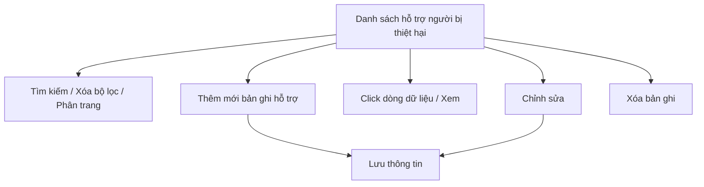

#### 4.3.3.9. UC479-480 - Hỗ trợ người bị thiệt hại thực hiện thủ tục YCBT

##### 4.3.3.9.1. Mục đích

\- Cho phép cán bộ Sở Tư pháp ghi nhận, theo dõi và thống kê các trường hợp đã hướng dẫn, hỗ trợ người bị thiệt hại (hoặc người đại diện/người thừa kế hợp pháp) thực hiện thủ tục yêu cầu bồi thường nhà nước (chuẩn bị hồ sơ, xác định cơ quan có trách nhiệm giải quyết, hướng dẫn trình tự/thủ tục theo Luật Trách nhiệm bồi thường của Nhà nước 2017).

\- Cho phép cán bộ thêm mới, chỉnh sửa, xóa bản ghi hỗ trợ do mình phụ trách.

*a. Phân quyền*

\- Cán bộ Sở Tư pháp: được tra cứu, xem chi tiết, thêm mới, chỉnh sửa, xóa bản ghi hỗ trợ do chính mình tạo.

*b. Điều kiện thực hiện*

\- Người dùng đã đăng nhập thành công vào Website quản trị.

\- Người dùng được phân quyền truy cập màn hình `Hỗ trợ người bị thiệt hại thực hiện thủ tục YCBT`.

\- Hình thức hỗ trợ tham chiếu danh mục [DM_25] (dùng chung với Hình thức tiếp nhận hồ sơ bồi thường) đối với các giá trị trùng khớp; bổ sung riêng giá trị `Qua điện thoại` cho đặc thù nghiệp vụ hỗ trợ.

---

##### 4.3.3.9.2. Sơ đồ luồng nghiệp vụ theo giao diện

---

##### 4.3.3.9.3. MH01 - Màn hình Danh sách hỗ trợ người bị thiệt hại

###### 4.3.3.9.3.1. Màn hình

###### 4.3.3.9.3.2. Mô tả thông tin trên màn hình

| Trường thông tin | Kiểu dữ liệu | Bắt buộc | Mặc định | Mô tả |
| :--- | :--- | :--- | :--- | :--- |
| **I. Bộ lọc tìm kiếm** | | | | |
| Từ khóa | String(255) | Không | Trống | Tìm kiếm gần đúng theo `Họ và tên người được hỗ trợ` hoặc `Số điện thoại`. |
| Hình thức hỗ trợ | Enum(String(50)) | Không | Tất cả | \- Giá trị gồm: + Tất cả + Trực tiếp tại trụ sở + Qua điện thoại + Qua văn bản/email + Khác |
| Kết quả hỗ trợ | Enum(String(50)) | Không | Tất cả | \- Giá trị gồm: + Tất cả + Đang hỗ trợ + Đã hướng dẫn xong + Người dân đã nộp YCBT + Không liên hệ được |
| Từ ngày hỗ trợ | Date | Không | Theo dữ liệu hệ thống | Định dạng `dd/mm/yyyy`. |
| Đến ngày hỗ trợ | Date | Không | Theo dữ liệu hệ thống | Định dạng `dd/mm/yyyy`. Áp dụng rule khoảng ngày [BR-VAL-007]. |
| **II. Bảng danh sách kết quả** | | | | - Trạng thái có dữ liệu: Hiển thị danh sách các bản ghi kết quả theo cấu trúc các cột quy định. - Trạng thái không có dữ liệu (Empty State): Khi không tìm thấy kết quả phù hợp với điều kiện tìm kiếm, bảng hiển thị duy nhất 01 dòng căn giữa trên toàn bộ chiều rộng bảng (`colspan`), in nghiêng với nội dung: *"Không tìm thấy dữ liệu phù hợp với điều kiện tìm kiếm."* |
| Cột: STT | Integer(10) | Không | Theo trang hiện tại | Chỉ đọc. Căn giữa, tăng theo phân trang. |
| Cột: Họ và tên người được hỗ trợ | String(100) | Không | Theo dữ liệu hệ thống | Chỉ đọc. |
| Cột: Số điện thoại | String(20) | Không | Theo dữ liệu hệ thống | Chỉ đọc. |
| Cột: Hình thức hỗ trợ | Enum(String(50)) | Không | Theo dữ liệu hệ thống | Chỉ đọc. |
| Cột: Vụ việc liên quan | String(50) | Không | Theo dữ liệu hệ thống | Chỉ đọc. Hiển thị `-` nếu chưa gắn mã vụ việc. |
| Cột: Ngày hỗ trợ | Date | Không | Theo dữ liệu hệ thống | Chỉ đọc. Định dạng `dd/mm/yyyy`. |
| Cột: Cán bộ hỗ trợ | String(100) | Không | Theo dữ liệu hệ thống | Chỉ đọc. |
| Cột: Kết quả hỗ trợ | Enum(String(50)) | Không | Theo dữ liệu hệ thống | Chỉ đọc. Hiển thị dạng badge màu theo giá trị. |
| Cột: Thao tác | String(255) | Không | Theo trạng thái | Chỉ đọc. Gồm icon `Chỉnh sửa`, `Xóa`; hiển thị theo trạng thái bản ghi. |
| Phân trang | String(255) | Không | `20 bản ghi/trang` | Tuân thủ quy chuẩn phân trang chung [BR-UI-001]. |

###### 4.3.3.9.3.3. Chức năng trên màn hình

| STT | Tên chức năng | Định dạng | Mô tả |
| :--- | :--- | :--- | :--- |
| 1 | Tìm kiếm | Button | TH1 (Khoảng ngày không hợp lệ): Vi phạm [BR-VAL-007], hiển thị [MSG-ERR-VAL-007]. Không thực hiện tìm kiếm. - **TH Không có dữ liệu trả về**: + Bảng kết quả: Hiển thị dòng thông báo rỗng *"Không tìm thấy dữ liệu phù hợp với điều kiện tìm kiếm."* ở giữa bảng. + Thanh phân trang (Pagination): Dòng số lượng hiển thị *"Hiển thị 0-0 của 0 bản ghi"* (hoặc *"Hiển thị 0-0 của 0 yêu cầu"*); các nút điều hướng trang (`&#124;&lt;&lt;`, `&lt;`, các số trang, `&gt;`, `&gt;&gt;&#124;`) ở trạng thái ẩn hoặc khóa mờ (Disabled). + Nút "Kết xuất Excel" (nếu màn hình có nút này): Thiết lập ở trạng thái khóa mờ (Disabled) kèm tooltip: *"Không có dữ liệu để kết xuất Excel"*. |
|  |  |  | TH2 (Hợp lệ): Hệ thống lọc danh sách theo các tiêu chí đã nhập, cập nhật lưới kết quả và đưa về trang 1. |
| 2 | Xóa bộ lọc | Button | Hệ thống đặt lại toàn bộ tiêu chí lọc về giá trị mặc định và tải lại danh sách. |
| 3 | Thêm mới | Button | Hệ thống mở **4.3.3.9.4. MH02 - Màn hình Thêm mới/Chỉnh sửa hỗ trợ người bị thiệt hại** ở chế độ thêm mới. |
| 4 | Chỉnh sửa | Icon button | Chỉ hiển thị với bản ghi do cán bộ đăng nhập tạo. Hệ thống mở **4.3.3.9.4. MH02** ở chế độ chỉnh sửa. |
| 5 | Xóa | Icon button | Chỉ hiển thị với bản ghi do cán bộ đăng nhập tạo. Hệ thống mở **4.3.3.9.5. Popup Xác nhận** với nội dung [MSG-CFM-SYS-001]. Nếu xác nhận, hệ thống xóa vĩnh viễn bản ghi khỏi hệ thống và hiển thị [MSG-SUC-SYS-002]. |
| 6 | Click dòng dữ liệu | Row click | Hệ thống mở **4.3.3.9.4. MH02** ở chế độ chỉ xem. |

---

##### 4.3.3.9.4. MH02 - Màn hình Thêm mới/Chỉnh sửa hỗ trợ người bị thiệt hại

###### 4.3.3.9.4.1. Màn hình

###### 4.3.3.9.4.2. Mô tả thông tin trên màn hình

| Trường thông tin | Kiểu dữ liệu | Bắt buộc | Mặc định | Mô tả |
| :--- | :--- | :--- | :--- | :--- |
| Tiêu đề màn hình | String(255) | - | Theo ngữ cảnh | Chỉ đọc. Hiển thị `THÊM MỚI HỖ TRỢ NGƯỜI BỊ THIỆT HẠI` hoặc `CHỈNH SỬA HỖ TRỢ NGƯỜI BỊ THIỆT HẠI` theo ngữ cảnh mở màn hình. |
| **I. Thông tin người được hỗ trợ** | String(100) | - | - | Khối thông tin người dân được hướng dẫn/hỗ trợ. |
| Họ và tên người được hỗ trợ | String(100) | Có | Trống | Áp dụng rule bắt buộc [BR-VAL-001]. |
| Số điện thoại liên hệ | String(20) | Có | Trống | Áp dụng rule số điện thoại [BR-VAL-003]. |
| Địa chỉ liên hệ | Text(1000) | Không | Trống | \- Ghi địa chỉ liên hệ của người được hỗ trợ. |
| Số giấy tờ thân nhân | String(20) | Không | Trống | Nhập nếu đã xác định được nhân thân người được hỗ trợ. |
| **II. Nội dung hỗ trợ** | Text(2000) | - | - | Khối ghi nhận nội dung hỗ trợ. |
| Hình thức hỗ trợ | Enum(String(50)) | Có | `Trực tiếp tại trụ sở` | \- Giá trị gồm: + Trực tiếp tại trụ sở + Qua điện thoại + Qua văn bản/email + Khác |
| Ngày hỗ trợ | Date | Có | Ngày hiện tại | Áp dụng rule ngày quá khứ [BR-VAL-008]. |
| Cán bộ hỗ trợ | String(100) | - | Theo tài khoản đăng nhập | Chỉ đọc. Tự động điền theo cán bộ đang đăng nhập. |
| Nội dung yêu cầu hỗ trợ | Text(2000) | Có | Trống | Ghi tóm tắt nội dung/vướng mắc mà người dân cần hỗ trợ. Áp dụng rule bắt buộc [BR-VAL-001]. |
| Nội dung đã hướng dẫn/hỗ trợ | Text(2000) | Có | Trống | Ghi cụ thể nội dung đã hướng dẫn (thủ tục, hồ sơ, cơ quan có trách nhiệm giải quyết...). Áp dụng rule bắt buộc [BR-VAL-001]. |
| Vụ việc yêu cầu bồi thường liên quan | String(50) | Không | Trống | Không bắt buộc liên kết với vụ việc trong hệ thống. Cán bộ có thể nhập mã vụ việc nếu người dân đã nộp yêu cầu bồi thường phát sinh từ lần hỗ trợ này; để trống nếu người dân chưa nộp hoặc chưa xác định. |
| Kết quả hỗ trợ | Enum(String(50)) | Có | `Đang hỗ trợ` | \- Giá trị gồm: + Đang hỗ trợ + Đã hướng dẫn xong + Người dân đã nộp YCBT + Không liên hệ được |
| Tài liệu hỗ trợ đính kèm | File | Không | Trống | Áp dụng [BR-FILE-010]. |
| Hủy bỏ | - | Không | Hiển thị | Chi tiết nghiệp vụ xem tại bảng Chức năng trên màn hình. |
| Lưu thông tin | - | Không | Hiển thị | Chi tiết nghiệp vụ xem tại bảng Chức năng trên màn hình. |

###### 4.3.3.9.4.3. Chức năng trên màn hình

| STT | Tên chức năng | Định dạng | Mô tả |
| :--- | :--- | :--- | :--- |
| 1 | Hủy bỏ | Button | Hệ thống đóng màn hình, không lưu dữ liệu và quay lại **4.3.3.9.3. MH01**. |
| 2 | Lưu thông tin | Button | TH1 (Bỏ trống trường bắt buộc): Vi phạm [BR-VAL-001]. Hệ thống tô viền đỏ ô trống đầu tiên và hiển thị [MSG-ERR-VAL-001]. Không cho phép lưu. |
|  |  |  | TH2 (`Số điện thoại liên hệ` không đúng định dạng): Vi phạm [BR-VAL-003], hiển thị [MSG-ERR-VAL-003]. Không cho phép lưu. |
|  |  |  | TH3 (`Ngày hỗ trợ` lớn hơn ngày hiện tại): Vi phạm [BR-VAL-008], hiển thị [MSG-ERR-VAL-008]. Không cho phép lưu. |
|  |  |  | TH4 (Hợp lệ - thêm mới): Hệ thống lưu bản ghi hỗ trợ, ghi nhận cán bộ tạo/ngày tạo, đóng màn hình, tải lại danh sách và hiển thị [MSG-SUC-SYS-003]. |
|  |  |  | TH5 (Hợp lệ - chỉnh sửa): Hệ thống cập nhật bản ghi hỗ trợ, đóng màn hình, tải lại danh sách và hiển thị [MSG-SUC-SYS-002]. |
| 3 | Tải lên | Button | Hệ thống mở trình chọn file cho `Tài liệu hỗ trợ đính kèm`. |
| 4 | Xem file | Link | Cho phép xem file tại một tab riêng. |
| 5 | Xóa | Link | Hệ thống gỡ file khỏi danh sách file đã chọn trên màn hình trước khi lưu. |

---

##### 4.3.3.9.5. Popup Xác nhận

###### 4.3.3.9.5.1. Màn hình

###### 4.3.3.9.5.2. Mô tả thông tin trên màn hình

| Trường thông tin | Kiểu dữ liệu | Bắt buộc | Mặc định | Mô tả |
| :--- | :--- | :--- | :--- | :--- |
| Tiêu đề popup | String(255) | - | Theo thao tác | Chỉ đọc. Hiển thị icon cảnh báo và nội dung xác nhận theo thao tác đang thực hiện. |
| Nội dung xác nhận | Text(2000) | - | Theo thao tác | Chỉ đọc. Áp dụng message xác nhận [MSG-CFM-SYS-001]. |
| Hủy bỏ | - | Không | Hiển thị | Đóng popup, không thực hiện callback. |
| Đồng ý | - | Không | Hiển thị | Xác nhận thực hiện callback của thao tác đã gọi popup. |

###### 4.3.3.9.5.3. Chức năng trên màn hình

| STT | Tên chức năng | Định dạng | Mô tả |
| :--- | :--- | :--- | :--- |
| 1 | Hủy bỏ | Button | Hệ thống đóng popup xác nhận và không thực hiện thao tác. |
| 2 | Đồng ý | Button | Hệ thống đóng popup xác nhận và thực hiện callback tương ứng (xóa vĩnh viễn bản ghi). |

---

##### 4.3.3.9.6. Ghi chú phạm vi đặc tả

\- Bản ghi hỗ trợ áp dụng cơ chế xóa vĩnh viễn (hard delete): khi cán bộ xác nhận xóa, dữ liệu bị loại bỏ hoàn toàn khỏi hệ thống, không lưu lại lịch sử.

\- Trường `Vụ việc yêu cầu bồi thường liên quan` chỉ mang tính ghi chú tham khảo, không thực hiện autofill hoặc kiểm tra tồn tại trong hệ thống.
