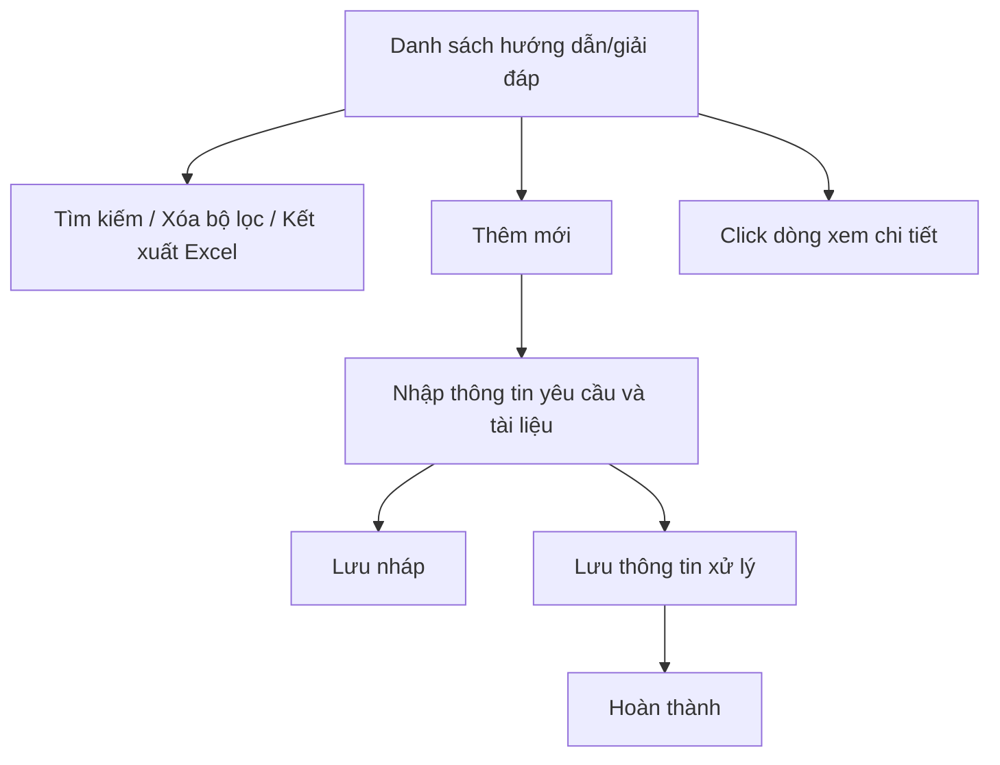

### 4.3.3. Dành cho Cán bộ Công tác bồi thường nhà nước

#### 4.3.3.7. UC-BTNN-HD - Hướng dẫn nghiệp vụ, giải đáp vướng mắc BTNN

##### 4.3.3.7.1. Mục đích

\- Cho phép Cán bộ quản lý nhà nước tiếp nhận, tra cứu, cập nhật và theo dõi hồ sơ hướng dẫn nghiệp vụ công tác bồi thường nhà nước, giải đáp vướng mắc trong việc áp dụng pháp luật về trách nhiệm bồi thường của Nhà nước theo Mục 1 Thông tư 08/2019/TT-BTP.

\- Cho phép quản lý cả hình thức hướng dẫn bằng văn bản, hướng dẫn trực tiếp, giải đáp bằng văn bản, giải đáp qua Cổng thông tin điện tử hoặc hòm thư điện tử.

*a. Phân quyền*:

\- Cán bộ xử lý: Được tra cứu, thêm mới, cập nhật, lưu nháp, hoàn thành xử lý và đính kèm tài liệu.

*b. Điều kiện thực hiện*:

\- Người dùng đã đăng nhập Website Quản trị và có quyền truy cập nhóm chức năng Công tác bồi thường nhà nước.

\- Nội dung xử lý thuộc phạm vi hướng dẫn nghiệp vụ, giải đáp vướng mắc quy định tại Điều 3 đến Điều 7 Thông tư 08/2019/TT-BTP.

##### 4.3.3.7.2. Sơ đồ luồng nghiệp vụ theo giao diện

##### 4.3.3.7.3. MH01 - Màn hình Danh sách hướng dẫn nghiệp vụ, giải đáp vướng mắc

###### 4.3.3.7.3.1. Màn hình

###### 4.3.3.7.3.2. Mô tả thông tin trên màn hình

| Trường thông tin | Kiểu dữ liệu | Bắt buộc | Mặc định | Mô tả |
| :--- | :--- | :--- | :--- | :--- |
| Tiêu đề màn hình | String(255) | Không | Hướng dẫn nghiệp vụ, giải đáp vướng mắc BTNN | Hiển thị tên màn hình. |
| Mã hồ sơ | String(50) | Không | Trống | Tìm gần đúng theo mã hồ sơ, tự động trim space. |
| Cơ quan/cá nhân đề nghị | String(255) | Không | Trống | Tìm gần đúng theo tên cơ quan, tổ chức, cá nhân đề nghị. |
| Loại nội dung | Enum(String(100)) | Không | Tất cả | Gồm: - Tất cả - Hướng dẫn nghiệp vụ - Giải đáp vướng mắc |
| Hình thức thực hiện | Enum(String(100)) | Không | Tất cả | Gồm: - Tất cả - Văn bản - Trực tiếp - Cổng thông tin điện tử - Hòm thư điện tử - Họp liên ngành |
| Trạng thái | Enum(String(50)) | Không | Tất cả | Gồm: - Tất cả - Lưu nháp - Đang xử lý - Hoàn thành |
| Từ ngày | Date | Không | Trống | Ngày tiếp nhận từ, áp dụng [BR-VAL-007]. |
| Đến ngày | Date | Không | Trống | Ngày tiếp nhận đến, áp dụng [BR-VAL-007]. |
| Thêm mới | String(50) | Không | Hiển thị | Chi tiết nghiệp vụ xem tại bảng Chức năng trên màn hình. |
| Xóa bộ lọc | String(50) | Không | Hiển thị | Chi tiết nghiệp vụ xem tại bảng Chức năng trên màn hình. |
| Tìm kiếm | String(50) | Không | Hiển thị | Chi tiết nghiệp vụ xem tại bảng Chức năng trên màn hình. |
| Kết xuất Excel | String(50) | Không | Hiển thị | Chi tiết nghiệp vụ xem tại bảng Chức năng trên màn hình. |
| Bảng danh sách | String(255) | Không | Theo dữ liệu hệ thống | Hiển thị danh sách hồ sơ, sắp xếp mặc định theo ngày tiếp nhận giảm dần. - Trạng thái có dữ liệu: Hiển thị danh sách các bản ghi kết quả theo cấu trúc các cột quy định. - Trạng thái không có dữ liệu (Empty State): Khi không tìm thấy kết quả phù hợp với điều kiện tìm kiếm, bảng hiển thị duy nhất 01 dòng căn giữa trên toàn bộ chiều rộng bảng (`colspan`), in nghiêng với nội dung: *"Không tìm thấy dữ liệu phù hợp với điều kiện tìm kiếm."* |
| STT | Integer(10) | Không | Tự tăng | Số thứ tự dòng trên trang hiện tại. |
| Mã hồ sơ | String(50) | Không | Theo dữ liệu | Hiển thị mã hồ sơ. Người dùng click dòng dữ liệu để mở chi tiết. |
| Cơ quan/cá nhân đề nghị | String(255) | Không | Theo dữ liệu | Hiển thị tên cơ quan, tổ chức, cá nhân đề nghị. |
| Loại nội dung | Enum(String(100)) | Không | Theo dữ liệu | Hiển thị `Hướng dẫn nghiệp vụ` hoặc `Giải đáp vướng mắc`. |
| Hình thức thực hiện | Enum(String(100)) | Không | Theo dữ liệu | Hiển thị hình thức thực hiện. |
| Ngày tiếp nhận | Date | Không | Theo dữ liệu | Hỗ trợ sắp xếp. |
| Cán bộ xử lý | String(255) | Không | Theo dữ liệu | Hiển thị cán bộ xử lý hiện hành. |
| Trạng thái | Enum(String(50)) | Không | Theo dữ liệu | Hiển thị dạng badge. |
| Thao tác | String(255) | Không | Theo trạng thái | Không hiển thị row click chi tiết; xem chi tiết bằng row click. Hiển thị `Sửa`, `Lưu thông tin xử lý`, `Hoàn thành` theo trạng thái; nút không đủ điều kiện hiển thị mờ. |
| Phân trang | String(255) | Không | 20 bản ghi/trang | Cho phép chuyển trang và chọn số dòng hiển thị theo chuẩn chung. |

###### 4.3.3.7.3.3. Chức năng trên màn hình

| STT | Tên chức năng | Định dạng | Mô tả |
| :--- | :--- | :--- | :--- |
| 1 | Thêm mới | Button | Mở **4.3.3.7.4. MH02 - Màn hình Thêm mới/Cập nhật hướng dẫn nghiệp vụ, giải đáp vướng mắc** ở chế độ thêm mới. |
| 2 | Tìm kiếm | Button | TH1 (Khoảng ngày không hợp lệ): Vi phạm [BR-VAL-007], hệ thống hiển thị lỗi inline tại trường ngày và không tìm kiếm. - **TH Không có dữ liệu trả về**: + Bảng kết quả: Hiển thị dòng thông báo rỗng *"Không tìm thấy dữ liệu phù hợp với điều kiện tìm kiếm."* ở giữa bảng. + Thanh phân trang (Pagination): Dòng số lượng hiển thị *"Hiển thị 0-0 của 0 bản ghi"* (hoặc *"Hiển thị 0-0 của 0 yêu cầu"*); các nút điều hướng trang (`&#124;&lt;&lt;`, `&lt;`, các số trang, `&gt;`, `&gt;&gt;&#124;`) ở trạng thái ẩn hoặc khóa mờ (Disabled). + Nút "Kết xuất Excel" (nếu màn hình có nút này): Thiết lập ở trạng thái khóa mờ (Disabled) kèm tooltip: *"Không có dữ liệu để kết xuất Excel"*. |
|  |  |  | TH Hợp lệ: Hệ thống lọc danh sách theo các tiêu chí đã nhập/chọn và đưa về trang 1. |
| 3 | Xóa bộ lọc | Button | Hệ thống xóa các tiêu chí lọc, đưa về giá trị mặc định và tải lại danh sách. |
| 4 | Kết xuất Excel | Button | Kết xuất danh sách theo kết quả tìm kiếm hiện hành, áp dụng [BR-EXP-040]. |
| 5 | Click dòng dữ liệu | Row click | Mở **4.3.3.7.4. MH02 - Màn hình Thêm mới/Cập nhật hướng dẫn nghiệp vụ, giải đáp vướng mắc** ở chế độ xem chi tiết. |
| 6 | Sửa | Icon/Button | Mở **4.3.3.7.4. MH02** ở chế độ cập nhật khi người dùng có quyền và hồ sơ ở trạng thái cho phép sửa. |

##### 4.3.3.7.4. MH02 - Màn hình Thêm mới/Cập nhật hướng dẫn nghiệp vụ, giải đáp vướng mắc

###### 4.3.3.7.4.1. Màn hình

###### 4.3.3.7.4.2. Mô tả thông tin trên màn hình

| Trường thông tin | Kiểu dữ liệu | Bắt buộc | Mặc định | Mô tả |
| :--- | :--- | :--- | :--- | :--- |
| Mã hồ sơ | String(50) | Không | Hệ thống tự sinh | Chỉ đọc sau khi lưu lần đầu. |
| Loại nội dung | Enum(String(100)) | Có | Hướng dẫn nghiệp vụ | Gồm: - Hướng dẫn nghiệp vụ - Giải đáp vướng mắc |
| Cơ quan/cá nhân đề nghị | String(255) | Có | Trống | Tên cơ quan, tổ chức, cá nhân đề nghị. |
| Cấp/nhóm cơ quan đề nghị | Enum(String(100)) | Có | Trống | Gồm: - Bộ, ngành Trung ương - UBND cấp tỉnh - Sở Tư pháp - Cơ quan giải quyết bồi thường - Tòa án - Viện kiểm sát - Cơ quan khác - Cá nhân |
| Lĩnh vực nội dung | Enum(String(100)) | Có | Trống | Gồm: - Giải quyết yêu cầu bồi thường - Đề nghị cấp kinh phí bồi thường và chi trả tiền bồi thường - Xác định trách nhiệm hoàn trả - Quản lý nhà nước về công tác BTNN - Xác định phạm vi trách nhiệm bồi thường - Xác định thiệt hại và giá trị thiệt hại được bồi thường |
| Hình thức thực hiện | Enum(String(100)) | Có | Văn bản | Gồm: - Văn bản - Trực tiếp - Cổng thông tin điện tử - Hòm thư điện tử - Họp liên ngành |
| Ngày tiếp nhận | Date | Có | Ngày hiện tại | Áp dụng [BR-VAL-001]. |
| Nội dung đề nghị | Text(4000) | Có | Trống | Nội dung đề xuất, kiến nghị hoặc vướng mắc cần xử lý. |
| Quan điểm của cơ quan đề nghị | Text(4000) | Không | Trống | Ghi nhận quan điểm kèm theo nếu có. |
| Tóm tắt nội dung vụ việc | Text(4000) | Có điều kiện | Trống | Bắt buộc khi hồ sơ hướng dẫn nghiệp vụ có liên quan vụ việc cụ thể hoặc họp liên ngành. |
| Cơ quan phối hợp | Text(2000) | Không | Trống | Danh sách cơ quan phối hợp nếu cần lấy ý kiến. |
| Nội dung hướng dẫn/giải đáp | Text(4000) | Có khi hoàn thành | Trống | Nội dung trả lời chính thức. |
| Căn cứ pháp luật | Text(4000) | Có khi hoàn thành | Trống | Căn cứ pháp luật phải nêu trong văn bản hướng dẫn/giải đáp. |
| Tài liệu liên quan | File/List(File) | Không | Trống | Cho phép nhập tên tài liệu và đính kèm nhiều file; hỗ trợ `Xem file`, `Xóa`. |
| Lịch sử xử lý | String(255) | Không | Theo dữ liệu | Hiển thị thời gian, người thực hiện, thao tác, nội dung xử lý. |
| Hủy bỏ | String(50) | Không | Hiển thị | Chi tiết nghiệp vụ xem tại bảng Chức năng trên màn hình. |
| Lưu nháp | String(50) | Không | Hiển thị | Chi tiết nghiệp vụ xem tại bảng Chức năng trên màn hình. |
| Lưu thông tin xử lý | String(50) | Không | Hiển thị | Chi tiết nghiệp vụ xem tại bảng Chức năng trên màn hình. |
| Hoàn thành | String(50) | Không | Hiển thị | Chi tiết nghiệp vụ xem tại bảng Chức năng trên màn hình. |

###### 4.3.3.7.4.3. Chức năng trên màn hình

| STT | Tên chức năng | Định dạng | Mô tả |
| :--- | :--- | :--- | :--- |
| 1 | Hủy bỏ | Button | Đóng màn hình và quay lại danh sách, không tự động lưu dữ liệu đang nhập. |
| 2 | Lưu nháp | Button | TH1 (Dữ liệu không hợp lệ): Vi phạm [BR-VAL-001], [BR-VAL-007] hoặc [BR-FILE-010], hệ thống hiển thị lỗi inline và không cho lưu. |
|  |  |  | TH Hợp lệ: Hệ thống lưu hồ sơ ở trạng thái "Lưu nháp", ghi lịch sử xử lý. |
| 3 | Lưu thông tin xử lý | Button | TH1 (Bỏ trống trường bắt buộc khi lưu xử lý): Vi phạm [BR-VAL-001], hệ thống hiển thị lỗi inline và không cho lưu. |
|  |  |  | TH Hợp lệ: Hệ thống lưu thông tin hướng dẫn/giải đáp, chuyển hồ sơ sang trạng thái "Đang xử lý" nếu chưa hoàn thành và ghi lịch sử xử lý. |
| 4 | Hoàn thành | Button | TH1 (Chưa nhập `Nội dung hướng dẫn/giải đáp` hoặc `Căn cứ pháp luật`): Vi phạm [BR-VAL-001], hệ thống hiển thị lỗi inline và không cho hoàn thành. |
|  |  |  | TH Hợp lệ: Hệ thống chuyển hồ sơ sang trạng thái "Hoàn thành" và ghi lịch sử xử lý. |
| 5 | Xem file | Link | Cho phép xem file tại một tab riêng. |
