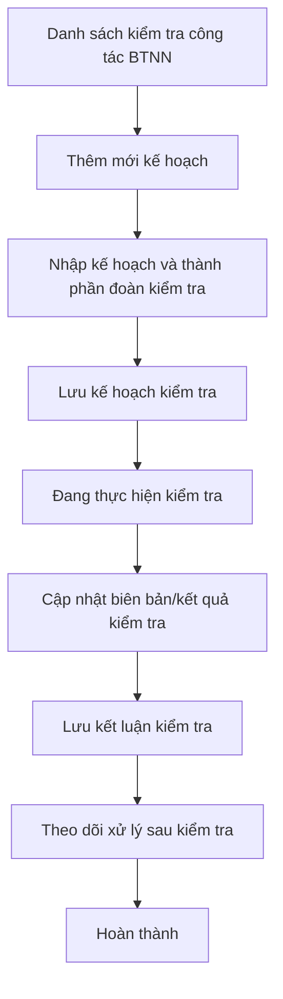

### 4.3.3. Dành cho Cán bộ Công tác bồi thường nhà nước

#### 4.3.3.9. UC-BTNN-KT - Kiểm tra công tác BTNN

##### 4.3.3.9.1. Mục đích

\- Cho phép quản lý kế hoạch kiểm tra định kỳ/đột xuất, đoàn kiểm tra, yêu cầu cung cấp tài liệu, biên bản kiểm tra, kết luận kiểm tra và theo dõi biện pháp xử lý sau kiểm tra theo Điều 16 đến Điều 23 Thông tư 08/2019/TT-BTP.

*a. Phân quyền*:

\- Cán bộ xử lý: Được tra cứu, lập kế hoạch, cập nhật hồ sơ kiểm tra, đính kèm tài liệu, cập nhật kết luận, theo dõi xử lý sau kiểm tra và hoàn thành hồ sơ.

*b. Điều kiện thực hiện*:

\- Người dùng đã đăng nhập Website Quản trị và có quyền truy cập nhóm chức năng Công tác bồi thường nhà nước.

\- Kế hoạch kiểm tra được lập theo căn cứ quy định tại Điều 17 và hình thức kiểm tra quy định tại Điều 18 Thông tư 08/2019/TT-BTP.

##### 4.3.3.9.2. Sơ đồ luồng nghiệp vụ theo giao diện

##### 4.3.3.9.3. MH01 - Màn hình Danh sách kiểm tra công tác BTNN

###### 4.3.3.9.3.1. Màn hình

###### 4.3.3.9.3.2. Mô tả thông tin trên màn hình

| Trường thông tin | Kiểu dữ liệu | Bắt buộc | Mặc định | Mô tả |
| :--- | :--- | :--- | :--- | :--- |
| Tiêu đề màn hình | String(255) | Không | Kiểm tra công tác BTNN | Hiển thị tên màn hình. |
| Mã cuộc kiểm tra | String(50) | Không | Trống | Tìm gần đúng theo mã cuộc kiểm tra. |
| Cơ quan được kiểm tra | String(255) | Không | Trống | Tìm gần đúng theo tên cơ quan thuộc đối tượng kiểm tra. |
| Hình thức kiểm tra | Enum(String(50)) | Không | Tất cả | Gồm: + Tất cả - Kiểm tra định kỳ - Kiểm tra đột xuất |
| Nội dung kiểm tra | Enum(String(100)) | Không | Tất cả | Gồm: + Tất cả + Giải quyết yêu cầu bồi thường + Xác định và thực hiện trách nhiệm hoàn trả + Quản lý nhà nước về công tác BTNN + Tổ chức thi hành pháp luật về trách nhiệm bồi thường của Nhà nước |
| Trạng thái | Enum(String(50)) | Không | Tất cả | Gồm: + Tất cả + Lưu nháp + Đang thực hiện kiểm tra + Theo dõi xử lý sau kiểm tra + Hoàn thành |
| Từ ngày | Date | Không | Trống | Ngày lập kế hoạch từ, áp dụng [BR-VAL-007]. |
| Đến ngày | Date | Không | Trống | Ngày lập kế hoạch đến, áp dụng [BR-VAL-007]. |
| Thêm mới | String(50) | Không | Hiển thị | Chi tiết nghiệp vụ xem tại bảng Chức năng trên màn hình. |
| Xóa bộ lọc | String(50) | Không | Hiển thị | Chi tiết nghiệp vụ xem tại bảng Chức năng trên màn hình. |
| Tìm kiếm | String(50) | Không | Hiển thị | Chi tiết nghiệp vụ xem tại bảng Chức năng trên màn hình. |
| Kết xuất Excel | String(50) | Không | Hiển thị | Chi tiết nghiệp vụ xem tại bảng Chức năng trên màn hình. |
| Bảng danh sách | String(255) | Không | 20 bản ghi/trang | Control UI: Data grid. - Khi người dùng truy cập màn hình, hệ thống tự động tải trang đầu tiên (Trang 1) với số lượng mặc định 20 bản ghi. - Sắp xếp mặc định: Sắp xếp theo "Ngày tạo" giảm dần (mới nhất hiển thị lên đầu). - Trạng thái có dữ liệu: Hiển thị danh sách các bản ghi kết quả theo cấu trúc các cột quy định. - Trạng thái không có dữ liệu (Empty State): Khi không tìm thấy kết quả phù hợp với điều kiện tìm kiếm, bảng hiển thị duy nhất 01 dòng căn giữa trên toàn bộ chiều rộng bảng (`colspan`), in nghiêng với nội dung: *"Không tìm thấy dữ liệu phù hợp với điều kiện tìm kiếm."* |
| STT | Integer(10) | Không | Tự tăng | Số thứ tự dòng trên trang hiện tại. |
| Mã cuộc kiểm tra | String(50) | Không | Theo dữ liệu | Người dùng click dòng dữ liệu để mở chi tiết. |
| Cơ quan được kiểm tra | String(255) | Không | Theo dữ liệu | Hiển thị cơ quan thuộc đối tượng kiểm tra. |
| Hình thức kiểm tra | Enum(String(50)) | Không | Theo dữ liệu | Hiển thị hình thức kiểm tra. |
| Thời gian kiểm tra | String(100) | Không | Theo dữ liệu | Hiển thị khoảng thời gian kiểm tra. |
| Trưởng đoàn kiểm tra | String(255) | Không | Theo dữ liệu | Hiển thị trưởng đoàn kiểm tra. |
| Trạng thái | Enum(String(50)) | Không | Theo dữ liệu | Hiển thị dạng badge. |
| Thao tác | String(255) | Không | Theo trạng thái | Không hiển thị row click chi tiết; xem bằng row click. Hiển thị `Sửa`, `Cập nhật kết quả`, `Cập nhật xử lý sau kiểm tra` theo trạng thái; nút không đủ điều kiện hiển thị mờ. |
| Phân trang | String(255) | Không | 20 bản ghi/trang | Control UI: Pagination. - Cho phép chọn cấu hình số lượng bản ghi hiển thị trên mỗi trang gồm: 10, 20, 50, 100 bản ghi/trang; mặc định chọn sẵn 20 bản ghi/trang. - Đầy đủ các nút điều hướng trang: Đầu (&#124;&lt;&lt;), Trước (&lt;), các số trang, Sau (&gt;), Cuối (&gt;&gt;&#124;). - Hiển thị dải bản ghi: "Hiển thị [từ] - [đến] của [tổng số] bản ghi". |

###### 4.3.3.9.3.3. Chức năng trên màn hình

| STT | Tên chức năng | Định dạng | Mô tả |
| :--- | :--- | :--- | :--- |
| 1 | Thêm mới | Button | Mở **MH02 - Thêm mới/Cập nhật kiểm tra công tác BTNN** ở chế độ thêm mới. |
| 2 | Tìm kiếm | Button | Khi người dùng click nút, hệ thống kiểm tra điều kiện dữ liệu và thực hiện tìm kiếm theo các trường hợp bên dưới: |
|  |  |  | **TH1 - Khoảng ngày không hợp lệ**: Nếu `Từ ngày` lớn hơn `Đến ngày`, vi phạm [BR-VAL-007], hệ thống hiển thị cảnh báo lỗi [MSG-ERR-VAL-007] và không thực hiện tìm kiếm. |
|  |  |  | **TH Hợp lệ (Có dữ liệu phù hợp)**: Hệ thống lọc và hiển thị danh sách các bản ghi thỏa mãn đồng thời các tiêu chí tìm kiếm/lọc đã nhập/chọn, hiển thị kết quả lên bảng và đưa về Trang 1. |
|  |  |  | **TH Không có dữ liệu trả về**: Bảng kết quả hiển thị duy nhất 01 dòng căn giữa trên toàn bộ chiều rộng bảng (`colspan`), in nghiêng với nội dung: *"Không tìm thấy dữ liệu phù hợp với điều kiện tìm kiếm."*; thanh phân trang hiển thị *"Hiển thị 0-0 của 0 bản ghi"*, các nút điều hướng trang ở trạng thái ẩn hoặc khóa mờ (Disabled); nút "Kết xuất Excel" (nếu có) ở trạng thái khóa mờ kèm tooltip *"Không có dữ liệu để kết xuất Excel"*. |
| 3 | Xóa bộ lọc | Button | Hệ thống xóa tiêu chí lọc, đưa về giá trị mặc định và tải lại danh sách. |
| 4 | Kết xuất Excel | Button | Kết xuất danh sách theo kết quả tìm kiếm hiện hành, áp dụng [BR-EXP-040]. |
| 5 | Click dòng dữ liệu | Row click | Mở **MH02 - Thêm mới/Cập nhật kiểm tra công tác BTNN** ở chế độ xem chi tiết. |

##### 4.3.3.9.4. MH02 - Màn hình Thêm mới/Cập nhật kiểm tra công tác BTNN

###### 4.3.3.9.4.1. Màn hình

###### 4.3.3.9.4.2. Mô tả thông tin trên màn hình

| Trường thông tin | Kiểu dữ liệu | Bắt buộc | Mặc định | Mô tả |
| :--- | :--- | :--- | :--- | :--- |
| Mã cuộc kiểm tra | String(50) | Không | Hệ thống tự sinh | Chỉ đọc sau khi lưu lần đầu. |
| Hình thức kiểm tra | Enum(String(50)) | Có | Kiểm tra định kỳ | Gồm: + Kiểm tra định kỳ - Kiểm tra đột xuất |
| Căn cứ kiểm tra | Enum(String(100)) | Có | Trống | Gồm: + Kiến nghị, phản ánh, khiếu nại, tố cáo + Kết quả hướng dẫn nghiệp vụ + Kết quả theo dõi, đôn đốc + Kết quả hỗ trợ, hướng dẫn người bị thiệt hại + Kết quả thống kê hằng năm + Hướng dẫn của cơ quan quản lý nhà nước ở trung ương |
| Cơ quan được kiểm tra | String(255) | Có | Trống | Cơ quan thuộc đối tượng kiểm tra. |
| Nội dung kiểm tra | Enum(String(100)) | Có | Trống | Gồm các giá trị tại MH01. |
| Phạm vi kiểm tra | Text(2000) | Có | Trống | Phạm vi nghiệp vụ, thời kỳ kiểm tra, đơn vị liên quan. |
| Thời gian kiểm tra từ ngày | Date | Có | Trống | Áp dụng [BR-VAL-007]. |
| Thời gian kiểm tra đến ngày | Date | Có | Trống | Áp dụng [BR-VAL-007]. |
| Địa điểm kiểm tra | String(255) | Có | Trống | Địa điểm tiến hành kiểm tra. |
| Trưởng đoàn kiểm tra | String(255) | Có | Trống | Người được phân công làm Trưởng đoàn kiểm tra. |
| Thành viên đoàn kiểm tra | File/List(File) | Có | Trống | Danh sách thành viên; mỗi dòng gồm họ tên, chức vụ, cơ quan/đơn vị, nhiệm vụ được phân công. |
| Yêu cầu cung cấp tài liệu | Text(4000) | Không | Trống | Nội dung yêu cầu đối tượng kiểm tra cung cấp tài liệu. |
| Tài liệu kế hoạch kiểm tra | File/List(File) | Không | Trống | Cho phép nhập tên tài liệu và đính kèm nhiều file. |
| Biên bản kiểm tra | Text(4000) | Có khi cập nhật kết quả | Trống | Ghi nhận nội dung biên bản kiểm tra. |
| Kết luận kiểm tra | Text(4000) | Có khi lưu kết luận | Trống | Nội dung kết luận kiểm tra. |
| Kiến nghị xử lý sau kiểm tra | Text(4000) | Không | Trống | Ghi nhận kiến nghị biện pháp xử lý, khắc phục hậu quả nếu có. |
| Kết quả xử lý sau kiểm tra | Text(4000) | Không | Trống | Cập nhật tình hình thực hiện kết luận/kiến nghị sau kiểm tra. |
| Tài liệu kết quả/kết luận | File/List(File) | Không | Trống | Cho phép đính kèm nhiều file; hỗ trợ `Xem file`, `Xóa`. |
| Lịch sử xử lý | String(255) | Không | Theo dữ liệu | Hiển thị thời gian, người thực hiện, thao tác, nội dung xử lý. |
| Hủy bỏ | String(50) | Không | Hiển thị | Chi tiết nghiệp vụ xem tại bảng Chức năng trên màn hình. |
| Lưu nháp | String(50) | Không | Hiển thị | Chi tiết nghiệp vụ xem tại bảng Chức năng trên màn hình. |
| Lưu kế hoạch kiểm tra | String(100) | Không | Hiển thị | Chi tiết nghiệp vụ xem tại bảng Chức năng trên màn hình. |
| Cập nhật kết quả | String(100) | Không | Hiển thị khi trạng thái "Đang thực hiện kiểm tra" | Chi tiết nghiệp vụ xem tại bảng Chức năng trên màn hình. |
| Lưu kết luận kiểm tra | String(100) | Không | Hiển thị sau khi có kết luận | Chi tiết nghiệp vụ xem tại bảng Chức năng trên màn hình. |
| Hoàn thành | String(50) | Không | Hiển thị khi đã có kết quả xử lý sau kiểm tra | Chi tiết nghiệp vụ xem tại bảng Chức năng trên màn hình. |

###### 4.3.3.9.4.3. Chức năng trên màn hình

| STT | Tên chức năng | Định dạng | Mô tả |
| :--- | :--- | :--- | :--- |
| 1 | Hủy bỏ | Button | Đóng màn hình và quay lại danh sách, không tự động lưu dữ liệu đang nhập. |
| 2 | Lưu nháp | Button | TH1 (Dữ liệu không hợp lệ): Vi phạm [BR-VAL-001], [BR-VAL-007] hoặc [BR-FILE-010], hệ thống hiển thị lỗi inline và không cho lưu. |
|  |  |  | TH Hợp lệ: Hệ thống lưu hồ sơ ở trạng thái "Lưu nháp", ghi lịch sử xử lý. |
| 3 | Lưu kế hoạch kiểm tra | Button | TH1 (Bỏ trống trường bắt buộc): Vi phạm [BR-VAL-001], hệ thống hiển thị lỗi inline và không cho lưu kế hoạch. |
|  |  |  | TH Hợp lệ: Hệ thống lưu kế hoạch kiểm tra, chuyển hồ sơ sang trạng thái "Đang thực hiện kiểm tra", ghi lịch sử xử lý. |
| 4 | Cập nhật kết quả | Button | Lưu biên bản kiểm tra, tài liệu kết quả và chuyển hồ sơ sang bước lập kết luận kiểm tra. |
| 5 | Lưu kết luận kiểm tra | Button | TH1 (Chưa nhập kết luận kiểm tra): Vi phạm [BR-VAL-001], hệ thống không cho lưu kết luận. |
|  |  |  | TH Hợp lệ: Hệ thống lưu kết luận kiểm tra và chuyển hồ sơ sang trạng thái "Theo dõi xử lý sau kiểm tra". |
| 6 | Hoàn thành | Button | Hệ thống chuyển hồ sơ sang trạng thái "Hoàn thành" sau khi đã cập nhật kết quả xử lý sau kiểm tra. |
| 7 | Xem file | Link | Cho phép xem file tại một tab riêng. |
