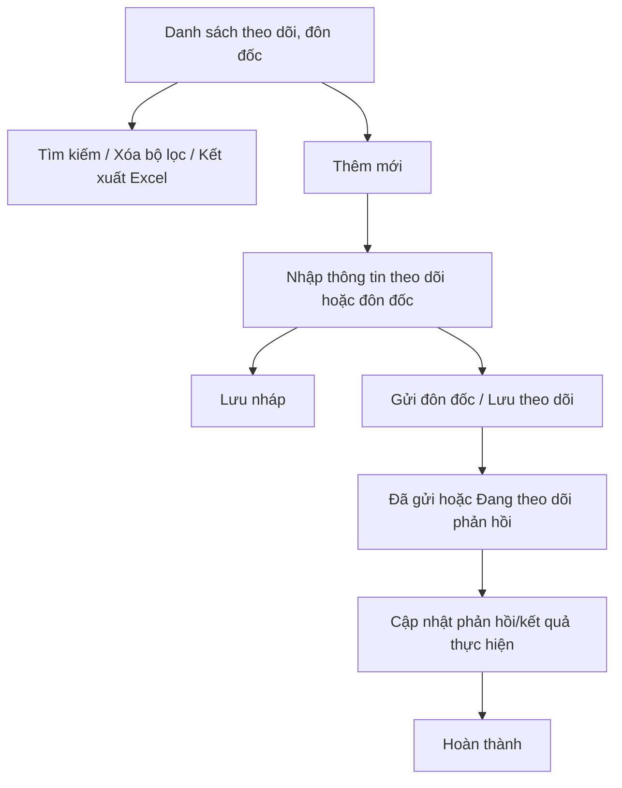

### 4.3.3. Dành cho Cán bộ Công tác bồi thường nhà nước

#### 4.3.3.8. UC-BTNN-TDDD - Theo dõi, đôn đốc công tác BTNN

##### 4.3.3.8.1. Mục đích

\- Cho phép Cán bộ quản lý nhà nước lập danh mục, theo dõi tình hình giải quyết yêu cầu bồi thường, cấp kinh phí/chi trả, xác định trách nhiệm hoàn trả, xử lý kỷ luật và thực hiện quản lý nhà nước về công tác bồi thường nhà nước theo Điều 8 đến Điều 12 Thông tư 08/2019/TT-BTP.

\- Cho phép lập và quản lý văn bản đôn đốc, phối hợp đôn đốc, theo dõi phản hồi và kết quả thực hiện đôn đốc theo Điều 13 đến Điều 15 Thông tư 08/2019/TT-BTP.

*a. Phân quyền*:

\- Cán bộ xử lý: Được tra cứu, thêm mới, cập nhật, gửi đôn đốc, cập nhật phản hồi/kết quả, hoàn thành và đính kèm tài liệu.

*b. Điều kiện thực hiện*:

\- Người dùng đã đăng nhập Website Quản trị và có quyền truy cập nhóm chức năng Công tác bồi thường nhà nước.

\- Thông tin theo dõi/đôn đốc thuộc phạm vi nhiệm vụ quản lý nhà nước quy định tại Thông tư 08/2019/TT-BTP.

##### 4.3.3.8.2. Sơ đồ luồng nghiệp vụ theo giao diện

##### 4.3.3.8.3. MH01 - Màn hình Danh sách theo dõi, đôn đốc công tác BTNN

###### 4.3.3.8.3.1. Màn hình

###### 4.3.3.8.3.2. Mô tả thông tin trên màn hình

| Trường thông tin | Kiểu dữ liệu | Bắt buộc | Mặc định | Mô tả |
| :--- | :--- | :--- | :--- | :--- |
| Tiêu đề màn hình | String(255) | Không | Theo dõi, đôn đốc công tác BTNN | Hiển thị tên màn hình. |
| Tab nghiệp vụ | Enum(String(100)) | Có | Theo dõi công tác BTNN | Gồm: - Theo dõi công tác BTNN - Đôn đốc công tác BTNN |
| Mã hồ sơ | String(50) | Không | Trống | Tìm gần đúng theo mã hồ sơ. |
| Cơ quan liên quan | String(255) | Không | Trống | Tìm gần đúng theo tên cơ quan trực tiếp quản lý người thi hành công vụ gây thiệt hại/cơ quan được đôn đốc. |
| Nội dung công tác | Enum(String(100)) | Không | Tất cả | Gồm: - Tất cả - Giải quyết yêu cầu bồi thường - Tham gia tố tụng - Cấp kinh phí bồi thường và chi trả tiền bồi thường - Xác định và thực hiện trách nhiệm hoàn trả - Xử lý kỷ luật - Quản lý nhà nước về công tác BTNN - Phục hồi danh dự |
| Hình thức/căn cứ | Enum(String(100)) | Không | Tất cả | Gồm: - Tất cả - Báo cáo - Bản án, quyết định của Tòa án - Quyết định giải quyết bồi thường - Đề nghị hướng dẫn/giải đáp - Kết quả kiểm tra/thanh tra - Thông tin báo chí - Khiếu nại, tố cáo, phản ánh, kiến nghị - Căn cứ khác |
| Trạng thái | Enum(String(50)) | Không | Tất cả | Gồm: - Tất cả - Lưu nháp - Đã gửi - Đang theo dõi phản hồi - Hoàn thành |
| Từ ngày | Date | Không | Trống | Ngày lập từ, áp dụng [BR-VAL-007]. |
| Đến ngày | Date | Không | Trống | Ngày lập đến, áp dụng [BR-VAL-007]. |
| Thêm mới | String(50) | Không | Hiển thị | Chi tiết nghiệp vụ xem tại bảng Chức năng trên màn hình. |
| Xóa bộ lọc | String(50) | Không | Hiển thị | Chi tiết nghiệp vụ xem tại bảng Chức năng trên màn hình. |
| Tìm kiếm | String(50) | Không | Hiển thị | Chi tiết nghiệp vụ xem tại bảng Chức năng trên màn hình. |
| Kết xuất Excel | String(50) | Không | Hiển thị | Chi tiết nghiệp vụ xem tại bảng Chức năng trên màn hình. |
| Bảng danh sách | String(255) | Không | Theo dữ liệu hệ thống | Sắp xếp mặc định theo ngày lập giảm dần. |
| STT | Integer(10) | Không | Tự tăng | Số thứ tự dòng trên trang hiện tại. |
| Mã hồ sơ | String(50) | Không | Theo dữ liệu | Người dùng click dòng dữ liệu để mở chi tiết. |
| Cơ quan liên quan | String(255) | Không | Theo dữ liệu | Hiển thị cơ quan được theo dõi/đôn đốc. |
| Nội dung công tác | Enum(String(100)) | Không | Theo dữ liệu | Hiển thị nhóm nội dung công tác BTNN. |
| Hạn phản hồi | Date | Không | Theo dữ liệu | Hiển thị với hồ sơ đôn đốc hoặc yêu cầu báo cáo. |
| Cán bộ xử lý | String(255) | Không | Theo dữ liệu | Hiển thị cán bộ phụ trách. |
| Trạng thái | Enum(String(50)) | Không | Theo dữ liệu | Hiển thị dạng badge. |
| Thao tác | String(255) | Không | Theo trạng thái | Không hiển thị row click chi tiết; xem bằng row click. Hiển thị `Sửa`, `Cập nhật phản hồi`, `Hoàn thành` theo trạng thái; nút không đủ điều kiện hiển thị mờ. |
| Phân trang | String(255) | Không | 20 bản ghi/trang | Tuân thủ chuẩn phân trang chung. |

###### 4.3.3.8.3.3. Chức năng trên màn hình

| STT | Tên chức năng | Định dạng | Mô tả |
| :--- | :--- | :--- | :--- |
| 1 | Chuyển tab | Tab | Hệ thống tải danh sách theo tab nghiệp vụ được chọn và đưa về trang 1. |
| 2 | Thêm mới | Button | Mở **4.3.3.8.4. MH02 - Màn hình Thêm mới/Cập nhật theo dõi, đôn đốc công tác BTNN** ở chế độ thêm mới. |
| 3 | Tìm kiếm | Button | TH1 (Khoảng ngày không hợp lệ): Vi phạm [BR-VAL-007], hệ thống hiển thị lỗi inline và không tìm kiếm. |
|  |  |  | TH Hợp lệ: Hệ thống lọc danh sách theo tiêu chí nhập/chọn và đưa về trang 1. |
| 4 | Xóa bộ lọc | Button | Hệ thống xóa tiêu chí lọc, đưa về giá trị mặc định và tải lại danh sách. |
| 5 | Kết xuất Excel | Button | Kết xuất danh sách theo kết quả tìm kiếm hiện hành, áp dụng [BR-EXP-040]. |
| 6 | Click dòng dữ liệu | Row click | Mở **4.3.3.8.4. MH02** ở chế độ xem chi tiết. |
| 7 | Cập nhật phản hồi | Button/Icon | Mở **4.3.3.8.4. MH02** tại khối kết quả phản hồi khi hồ sơ ở trạng thái "Đã gửi" hoặc "Đang theo dõi phản hồi". |

##### 4.3.3.8.4. MH02 - Màn hình Thêm mới/Cập nhật theo dõi, đôn đốc công tác BTNN

###### 4.3.3.8.4.1. Màn hình

###### 4.3.3.8.4.2. Mô tả thông tin trên màn hình

| Trường thông tin | Kiểu dữ liệu | Bắt buộc | Mặc định | Mô tả |
| :--- | :--- | :--- | :--- | :--- |
| Mã hồ sơ | String(50) | Không | Hệ thống tự sinh | Chỉ đọc sau khi lưu lần đầu. |
| Nhóm nghiệp vụ | Enum(String(100)) | Có | Theo dõi công tác BTNN | Gồm: - Theo dõi công tác BTNN - Đôn đốc công tác BTNN |
| Cơ quan liên quan | String(255) | Có | Trống | Cơ quan trực tiếp quản lý người thi hành công vụ gây thiệt hại/cơ quan được theo dõi hoặc đôn đốc. |
| Nội dung công tác | Enum(String(100)) | Có | Trống | Gồm các giá trị tại trường `Nội dung công tác` của MH01. |
| Căn cứ thực hiện | Enum(String(100)) | Có | Trống | Gồm các giá trị tại trường `Hình thức/căn cứ` của MH01. |
| Mã vụ việc liên quan | String(50) | Không | Trống | Cho phép liên kết vụ việc yêu cầu bồi thường nếu phát sinh từ một vụ việc cụ thể. |
| Nội dung cần theo dõi/đôn đốc | Text(4000) | Có | Trống | Mô tả nhiệm vụ công tác BTNN cần theo dõi hoặc đôn đốc. |
| Kiến nghị cụ thể | Text(4000) | Có điều kiện | Trống | Bắt buộc với nhóm nghiệp vụ `Đôn đốc công tác BTNN`. |
| Hạn phản hồi | Date | Có điều kiện | Trống | Bắt buộc với nhóm nghiệp vụ `Đôn đốc công tác BTNN` hoặc yêu cầu báo cáo. |
| Cơ quan phối hợp | Text(2000) | Không | Trống | Ghi nhận cơ quan phối hợp nếu có. |
| Nội dung phản hồi/kết quả thực hiện | Text(4000) | Không | Trống | Ghi nhận phản hồi hoặc kết quả thực hiện sau đôn đốc/theo dõi. |
| Tài liệu liên quan | File/List(File) | Không | Trống | Cho phép nhập tên tài liệu và đính kèm nhiều file; hỗ trợ `Xem file`, `Xóa`. |
| Lịch sử xử lý | String(255) | Không | Theo dữ liệu | Hiển thị thời gian, người thực hiện, thao tác, nội dung xử lý. |
| Hủy bỏ | String(50) | Không | Hiển thị | Chi tiết nghiệp vụ xem tại bảng Chức năng trên màn hình. |
| Lưu nháp | String(50) | Không | Hiển thị | Chi tiết nghiệp vụ xem tại bảng Chức năng trên màn hình. |
| Gửi đôn đốc / Lưu theo dõi | String(50) | Không | Hiển thị | Chi tiết nghiệp vụ xem tại bảng Chức năng trên màn hình. |
| Hoàn thành | String(50) | Không | Hiển thị khi đã có kết quả thực hiện | Chi tiết nghiệp vụ xem tại bảng Chức năng trên màn hình. |

###### 4.3.3.8.4.3. Chức năng trên màn hình

| STT | Tên chức năng | Định dạng | Mô tả |
| :--- | :--- | :--- | :--- |
| 1 | Hủy bỏ | Button | Đóng màn hình và quay lại danh sách, không tự động lưu dữ liệu đang nhập. |
| 2 | Lưu nháp | Button | TH1 (Dữ liệu không hợp lệ): Vi phạm [BR-VAL-001], [BR-VAL-007] hoặc [BR-FILE-010], hệ thống hiển thị lỗi inline và không cho lưu. |
|  |  |  | TH Hợp lệ: Hệ thống lưu hồ sơ ở trạng thái "Lưu nháp", ghi lịch sử xử lý. |
| 3 | Gửi đôn đốc / Lưu theo dõi | Button | TH1 (Bỏ trống trường bắt buộc): Vi phạm [BR-VAL-001], hệ thống hiển thị lỗi inline và không cho thực hiện. |
|  |  |  | TH Hợp lệ: Với nhóm `Đôn đốc công tác BTNN`, hệ thống chuyển hồ sơ sang trạng thái "Đã gửi"; với nhóm `Theo dõi công tác BTNN`, hệ thống chuyển hồ sơ sang trạng thái "Đang theo dõi phản hồi"; ghi lịch sử xử lý. |
| 4 | Hoàn thành | Button | TH1 (Chưa có nội dung phản hồi/kết quả thực hiện): Vi phạm [BR-VAL-001], hệ thống không cho hoàn thành. |
|  |  |  | TH Hợp lệ: Hệ thống chuyển hồ sơ sang trạng thái "Hoàn thành" và ghi lịch sử xử lý. |
| 5 | Xem file | Link | Cho phép xem file tại một tab riêng. |
