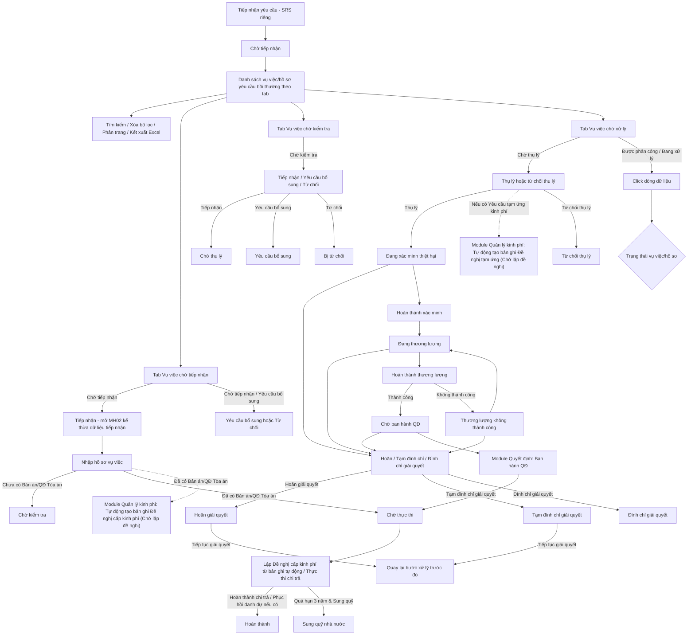

### 4.3.3. Dành cho Cán bộ Công tác bồi thường nhà nước

#### 4.3.3.1. Giải quyết yêu cầu bồi thường

##### 4.3.3.1.1. Mục đích
Cho phép quản lý quy trình tiếp nhận, thụ lý và giải quyết hồ sơ vụ việc yêu cầu bồi thường nhà nước theo đúng quy định của Luật Trách nhiệm bồi thường của Nhà nước, bao gồm:
- Tra cứu danh sách vụ việc theo phân trang và các tab trạng thái nghiệp vụ (Vụ việc chờ tiếp nhận, Vụ việc chờ kiểm tra, Vụ việc chờ xử lý), hỗ trợ tìm kiếm và lọc đa tiêu chí.
- Tiếp nhận và nhập liệu hồ sơ vụ việc yêu cầu bồi thường từ các nguồn tiếp nhận, tự động kế thừa thông tin và kiểm tra tính hợp lệ của hồ sơ.
- Kiểm tra tính đầy đủ, hợp lệ của hồ sơ yêu cầu bồi thường; thực hiện yêu cầu bổ sung hồ sơ hoặc từ chối tiếp nhận khi không đủ điều kiện.
- Thụ lý hồ sơ vụ việc trong thời hạn quy định (02 ngày làm việc) hoặc từ chối thụ lý hồ sơ.
- Theo dõi và cập nhật toàn diện tiến trình giải quyết vụ việc sau thụ lý: xác minh thiệt hại, lập biên bản xác minh, tổ chức thương lượng việc bồi thường và lập biên bản kết quả thương lượng.
- Xử lý các nghiệp vụ gián đoạn giải quyết theo quy định pháp luật: hoãn giải quyết, tạm đình chỉ giải quyết, đình chỉ giải quyết và khôi phục tiếp tục giải quyết vụ việc.
- Thực thi chi trả tiền bồi thường (lập đề nghị cấp kinh phí, tạm ứng kinh phí) và theo dõi thực hiện thủ tục phục hồi danh dự cho người bị thiệt hại.
- Quản lý trạng thái vòng đời vụ việc và ghi nhận toàn bộ lịch sử xử lý, dòng thời gian (timeline) qua từng giai đoạn.

a. Phân quyền
Hệ thống phân quyền thao tác theo vai trò và quyền hạn được cấp:
- Xem: Tra cứu danh sách vụ việc theo tab, xem chi tiết tiến trình hồ sơ vụ việc, xem tài liệu đính kèm và lịch sử xử lý.
- Thêm mới / Nhập liệu: Tiếp nhận và nhập liệu hồ sơ vụ việc mới, tải lên các văn bản căn cứ.
- Cập nhật tiến độ: Cập nhật thông tin kiểm tra hồ sơ, cập nhật kết quả xác minh thiệt hại, cập nhật kết quả thương lượng.
- Xử lý nghiệp vụ gián đoạn: Thực hiện hoãn, tạm đình chỉ, đình chỉ giải quyết hoặc tiếp tục giải quyết vụ việc.
- Thụ lý / Phê duyệt: Thủ trưởng/Lãnh đạo cơ quan giải quyết thực hiện thụ lý vụ việc, từ chối thụ lý, phê duyệt kết quả xử lý.
- Quản lý trạng thái / Xóa: Xóa hồ sơ ở trạng thái Chờ tiếp nhận hoặc đóng hồ sơ khi hoàn thành toàn bộ nghĩa vụ.

b. Điều kiện thực hiện
- Người dùng đã đăng nhập hệ thống.
- Người dùng được cấp quyền truy cập chức năng "Giải quyết yêu cầu bồi thường".

##### 4.3.3.1.2. Sơ đồ luồng nghiệp vụ theo giao diện

---

##### 4.3.3.1.3. MH01 - Màn hình Danh sách vụ việc/hồ sơ yêu cầu bồi thường

###### 4.3.3.1.3.1. Màn hình

###### 4.3.3.1.3.2. Mô tả thông tin trên màn hình

| Trường thông tin | Kiểu dữ liệu | Bắt buộc | Mặc định | Mô tả |
| :--- | :--- | :--- | :--- | :--- |
| **Tab nghiệp vụ** | Enum(String(100)) | Có | `Vụ việc chờ tiếp nhận` | Control UI: Tabs navigation. - **Tab 1: "Vụ việc chờ tiếp nhận"**- Hiển thị các vụ việc ở trạng thái: + Chờ tiếp nhận + Yêu cầu bổ sung - **Tab 2: "Vụ việc chờ kiểm tra"**- Hiển thị các vụ việc ở trạng thái: + Chờ kiểm tra - **Tab 3: "Vụ việc chờ xử lý"**- Hiển thị các vụ việc thuộc các trạng thái tiếp theo gồm: + Chờ thụ lý + Đang xác minh thiệt hại + Đang thương lượng + Chờ ban hành QĐ + Chờ thực thi + Hoãn giải quyết + Tạm đình chỉ giải quyết |
| **Bộ lọc tìm kiếm** | String(255) | - | - | Khối tiêu chí lọc danh sách vụ việc trong tab đang chọn. |
| Mã vụ việc | String(50) | Không | Trống | Tìm gần đúng theo mã vụ việc, tự động trim space. |
| Tên vụ việc | String(255) | Không | Trống | Control UI: Input text. - Tìm gần đúng theo tên vụ việc, không phân biệt hoa thường. - Dữ liệu lấy từ thông tin tiếp nhận YCBT hoặc hồ sơ xác định cơ quan liên thông. |
| Tên người yêu cầu | String(100) | Không | Trống | Tìm gần đúng theo họ tên người yêu cầu, không phân biệt hoa thường. |
| Cơ quan giải quyết | String(255) | Không | Trống | Tìm gần đúng theo tên cơ quan giải quyết. |
| Tỉnh/Thành phố | Enum(String(100)) | Không | `Tất cả` | Control UI: Combobox có tìm kiếm. - Tham chiếu Danh mục Tỉnh/Thành phố [DM_13]. - Cho phép gõ tìm kiếm nhanh theo Mã hoặc Tên Tỉnh/Thành phố. |
| Lĩnh vực phát sinh thiệt hại | Enum(String(100)) | Không | `Tất cả` | Tham chiếu Danh mục Lĩnh vực phát sinh thiệt hại [DM_22]. |
| Trạng thái giải quyết | Enum(String(50)) | Không | Theo từng tab | Control UI: Combobox. - Danh sách lựa chọn và giá trị mặc định thay đổi động theo Tab đang chọn: + **Tab 1 "Vụ việc chờ tiếp nhận"**: Giá trị mặc định khi vào tab là `Tất cả`. Danh sách trạng thái có thể lọc: `Tất cả`, `Chờ tiếp nhận`, `Yêu cầu bổ sung`. + **Tab 2 "Vụ việc chờ kiểm tra"**: Giá trị mặc định khi vào tab là `Chờ kiểm tra`. Danh sách trạng thái có thể lọc: `Chờ kiểm tra`. + **Tab 3 "Vụ việc chờ xử lý"**: Giá trị mặc định khi vào tab là `Tất cả`. Danh sách trạng thái có thể lọc: `Tất cả`, `Chờ thụ lý`, `Đang xác minh thiệt hại`, `Đang thương lượng`, `Chờ ban hành QĐ`, `Chờ thực thi`, `Hoãn giải quyết`, `Tạm đình chỉ giải quyết`. - Khi chuyển tab hoặc bấm nút `Xóa bộ lọc`, trường tự động reset về giá trị mặc định của tab đó|
| Tiếp nhận: Từ ngày | Date | Không | Trống | Định dạng `dd/mm/yyyy`. Áp dụng rule khoảng ngày [BR-VAL-007]. |
| Tiếp nhận: Đến ngày | Date | Không | Trống | Định dạng `dd/mm/yyyy`. Áp dụng rule khoảng ngày [BR-VAL-007]. |
| Hạn xử lý: Từ ngày | Date | Không | Trống | Định dạng `dd/mm/yyyy`. Áp dụng rule khoảng ngày [BR-VAL-007]. |
| Hạn xử lý: Đến ngày | Date | Không | Trống | Định dạng `dd/mm/yyyy`. Áp dụng rule khoảng ngày [BR-VAL-007]. |
| Hình thức tiếp nhận | Enum(String(50)) | Không | `Tất cả` | Tham chiếu Danh mục Hình thức tiếp nhận hồ sơ bồi thường [DM_25]. |
| Bảng danh sách vụ việc/hồ sơ yêu cầu bồi thường | List(Object) | Không | 20 bản ghi/trang | Control UI: Data grid. - Khi người dùng truy cập màn hình, hệ thống tự động tải trang đầu tiên (Trang 1) với số lượng mặc định 20 bản ghi. - Sắp xếp mặc định: Sắp xếp theo "Ngày tiếp nhận" giảm dần (mới nhất hiển thị lên đầu). - Trạng thái có dữ liệu: Hiển thị danh sách các bản ghi kết quả theo cấu trúc các cột quy định. - Trạng thái không có dữ liệu (Empty State): Khi không tìm thấy kết quả phù hợp với điều kiện tìm kiếm, bảng hiển thị duy nhất 01 dòng căn giữa trên toàn bộ chiều rộng bảng (`colspan`), in nghiêng với nội dung theo MessageList dùng chung [MSG-INF-SYS-001]. |
| STT | Integer(10) | - | Tự tăng | Căn giữa, tăng theo phân trang. |
| Mã vụ việc | String(50) | - | Theo dữ liệu | Hiển thị mã vụ việc. Người dùng click vào dòng dữ liệu để mở màn hình chi tiết. |
| Tên vụ việc | String(255) | - | Theo dữ liệu | Chỉ đọc. Hiển thị tên vụ việc đã ghi nhận ở bước tiếp nhận YCBT. |
| Tên người yêu cầu | String(100) | - | Theo dữ liệu | Chỉ đọc. Hiển thị tên người yêu cầu bồi thường. |
| Tỉnh/Thành phố | String(100) | - | Theo dữ liệu | Chỉ đọc. Hiển thị Tỉnh/Thành phố của vụ việc/người yêu cầu theo Danh mục Tỉnh/Thành phố [DM_13]. |
| Địa chỉ | String(500) | - | Theo dữ liệu | Chỉ đọc. Hiển thị địa chỉ chi tiết và Phường/Xã của người yêu cầu. |
| Hành vi gây thiệt hại | String(255) | - | Theo dữ liệu | Chỉ đọc. Hiển thị tóm tắt hành vi gây thiệt hại của người thi hành công vụ. |
| Lĩnh vực phát sinh thiệt hại | Enum(String(50)) | - | Theo dữ liệu | Chỉ đọc. Hiển thị lĩnh vực phát sinh thiệt hại theo Danh mục Lĩnh vực phát sinh thiệt hại [DM_22]. |
| Cơ quan giải quyết | String(255) | - | Theo dữ liệu | Chỉ đọc. Hiển thị cơ quan giải quyết bồi thường. |
| Cán bộ xử lý | String(255) | - | Theo dữ liệu | Chỉ đọc. Hiển thị cán bộ xử lý được chỉ định. |
| Ngày tiếp nhận | Date | - | Theo dữ liệu | Căn giữa. Cho phép click tiêu đề cột để đảo chiều sắp xếp tăng/giảm. |
| Hạn xử lý | Date | - | Theo dữ liệu | Hiển thị hạn xử lý và trạng thái cảnh báo SLA theo dữ liệu hệ thống. |
| Hình thức tiếp nhận | Enum(String(50)) | - | Theo dữ liệu | Hiển thị hình thức tiếp nhận theo Danh mục Hình thức tiếp nhận hồ sơ bồi thường [DM_25]. |
| Trạng thái | Enum(String(50)) | - | Theo dữ liệu | Control UI: Text hiển thị kèm Badge màu theo trạng thái vụ việc. |
| Thao tác | String(255) | - | Theo vai trò/trạng thái | Control UI: Icon buttons (Fixed-slot Action Column). - Không có nút/icon `Xem chi tiết` riêng biệt trong cột Thao tác; người dùng xem chi tiết bằng sự kiện click trực tiếp vào dòng dữ liệu (Row-Click). - **Tại Tab 1: "Vụ việc chờ tiếp nhận"**: + `Tiếp nhận`, `Yêu cầu bổ sung`, `Từ chối`: Chỉ hiển thị khi vụ việc ở trạng thái `Chờ tiếp nhận`. + `Cập nhật hồ sơ`: Chỉ hiển thị khi vụ việc ở trạng thái `Yêu cầu bổ sung`.  + `In Phiếu Bổ sung`: Chỉ hiển thị khi vụ việc ở trạng thái `Yêu cầu bổ sung`. - **Tại Tab 2: "Vụ việc chờ kiểm tra"**: + `Tiếp nhận kiểm tra`   + `Yêu cầu bổ sung sau kiểm tra`   + `Từ chối sau kiểm tra` - **Tại Tab 3: "Vụ việc chờ xử lý"**: + `Thụ lý hồ sơ`, `Từ chối thụ lý`: Chỉ hiển thị khi vụ việc ở trạng thái `Chờ thụ lý`. + `Cập nhật hồ sơ`: Chỉ hiển thị đối với các hồ sơ đang trong quá trình giải quyết sau thụ lý gồm các trạng thái:   * `Đang xác minh thiệt hại`   * `Đang thương lượng`   * `Chờ ban hành QĐ`   * `Chờ thực thi`   * `Hoãn giải quyết`   * `Tạm đình chỉ giải quyết` - Các thao tác không thỏa mãn điều kiện theo trạng thái hồ sơ sẽ bị ẩn hoàn toàn khỏi danh sách (hoặc hiển thị nút mờ vô hiệu hóa theo quy chuẩn giao diện). |
| Phân trang | String(255) | Không | 20 bản ghi/trang | Control UI: Pagination. - Cho phép chọn cấu hình số lượng bản ghi hiển thị trên mỗi trang gồm: 10, 20, 50, 100 bản ghi/trang; mặc định chọn sẵn 20 bản ghi/trang. - Đầy đủ các nút điều hướng trang: Đầu (&#124;&lt;&lt;), Trước (&lt;), các số trang, Sau (&gt;), Cuối (&gt;&gt;&#124;). - Hiển thị dải bản ghi: "Hiển thị [từ] - [đến] của [tổng số] bản ghi". |

###### 4.3.3.1.3.3. Chức năng trên màn hình

| STT | Tên chức năng | Định dạng | Mô tả |
| :--- | :--- | :--- | :--- |
| 1 | Chuyển tab | Tab | Hệ thống tải danh sách vụ việc theo tab được chọn và đặt lại trang hiện tại về trang 1. Bộ lọc đang nhập có thể được giữ nguyên nếu cùng trường dữ liệu hoặc xóa theo thao tác `Xóa bộ lọc`. |
| 2 | Tìm kiếm | Button | Khi người dùng click nút, hệ thống kiểm tra điều kiện dữ liệu và thực hiện tìm kiếm theo các trường hợp bên dưới: |
|  |  |  | **TH1 - Khoảng ngày không hợp lệ**: Nếu `Từ ngày` lớn hơn `Đến ngày`, vi phạm [BR-VAL-007], hệ thống hiển thị cảnh báo lỗi [MSG-ERR-VAL-007] và không thực hiện tìm kiếm. |
|  |  |  | **TH Hợp lệ (Có dữ liệu phù hợp)**: Hệ thống lọc và hiển thị danh sách các bản ghi thỏa mãn đồng thời các tiêu chí tìm kiếm/lọc đã nhập/chọn, hiển thị kết quả lên bảng và đưa về Trang 1. |
|  |  |  | **TH Không có dữ liệu trả về**: Bảng kết quả hiển thị duy nhất 01 dòng căn giữa trên toàn bộ chiều rộng bảng (`colspan`), in nghiêng với nội dung theo MessageList dùng chung [MSG-INF-SYS-001]; thanh phân trang hiển thị *"Hiển thị 0-0 của 0 bản ghi"*, các nút điều hướng trang ở trạng thái ẩn hoặc khóa mờ (Disabled); nút "Kết xuất Excel" (nếu có) ở trạng thái khóa mờ kèm tooltip *"Không có dữ liệu để kết xuất Excel"*. |
| 3 | Xóa bộ lọc | Button | Hệ thống xóa các tiêu chí lọc, đặt lại danh sách theo dữ liệu mặc định của tab hiện hành và đưa về trang 1. |
| 4 | Kết xuất Excel | Button | Hệ thống kết xuất dữ liệu thống kê theo danh sách đang hiển thị trong tab hiện hành. |
| 5 | Click dòng dữ liệu | Row click | Hệ thống mở [MH05 - Màn hình Xem chi tiết hồ sơ yêu cầu bồi thường](#43317-mh05---màn-hình-xem-chi-tiết-hồ-sơ-yêu-cầu-bồi-thường) tương ứng với vụ việc được chọn. Nếu click vào icon thao tác, hệ thống thực hiện chức năng của icon và không kích hoạt row click. |
| 6 | Tiếp nhận | Icon button/Button | - **Điều kiện hiển thị**: Chỉ hiển thị khi vụ việc ở trạng thái `Chờ tiếp nhận` (thuộc Tab 1: "Vụ việc chờ tiếp nhận"). - **Luồng xử lý**: Khi người dùng click nút, hệ thống mở **MH02 - Nhập liệu hồ sơ vụ việc** để cán bộ nhập đầy đủ thông tin chi tiết. Hệ thống tự động kế thừa toàn bộ thông tin đã nhập ở bước **Tiếp nhận yêu cầu**, cán bộ có thể chỉnh sửa và bổ sung thêm các thông tin khác. |
| 7 | Yêu cầu bổ sung | Icon button/Button | - **Điều kiện hiển thị**: Chỉ hiển thị khi vụ việc ở trạng thái `Chờ tiếp nhận` (thuộc Tab 1: "Vụ việc chờ tiếp nhận"). - **Luồng xử lý**: Khi người dùng click nút, hệ thống mở [Popup Yêu cầu bổ sung / Từ chối hồ sơ](#43319-popup-yêu-cầu-bổ-sung--từ-chối-hồ-sơ) ở ngữ cảnh yêu cầu bổ sung để nhập nội dung yêu cầu bổ sung thông tin/hồ sơ; sau khi xác nhận hợp lệ, vụ việc chuyển sang trạng thái `Yêu cầu bổ sung`. |
| 8 | Từ chối | Icon button/Button | - **Điều kiện hiển thị**: Chỉ hiển thị khi vụ việc ở trạng thái `Chờ tiếp nhận` (thuộc Tab 1: "Vụ việc chờ tiếp nhận"). - **Luồng xử lý**: Khi người dùng click nút, hệ thống mở [Popup Yêu cầu bổ sung / Từ chối hồ sơ](#43319-popup-yêu-cầu-bổ-sung--từ-chối-hồ-sơ) ở ngữ cảnh từ chối để nhập lý do từ chối tiếp nhận hồ sơ; sau khi xác nhận hợp lệ, vụ việc chuyển sang trạng thái `Bị từ chối`. |
| 9 | Cập nhật hồ sơ | Icon button/Button | Khi người dùng click nút, hệ thống kiểm tra trạng thái hồ sơ và phân biệt xử lý cụ thể theo từng trường hợp trạng thái: - **TH1 - Hồ sơ ở trạng thái `Yêu cầu bổ sung` (thuộc Tab 1: "Vụ việc chờ tiếp nhận")**:  Hệ thống mở màn hình [MH02 - Nhập liệu hồ sơ vụ việc](#43314-mh02---màn-hình-nhập-liệu-hồ-sơ-vụ-việc) với tiêu đề `BỔ SUNG HỒ SƠ VỤ VIỆC`. Hệ thống tự động cuộn focus tới khối `Thông tin yêu cầu bổ sung` để Cán bộ nắm bắt nội dung yêu cầu bổ sung, đồng thời mở khóa các trường thông tin và danh mục tài liệu cần hoàn thiện để Cán bộ tiếp nhận thông tin/tệp đính kèm bổ sung từ người yêu cầu và bấm `Gửi hoàn thiện` để chuyển hồ sơ sang trạng thái `Chờ kiểm tra`. - **TH2 - Hồ sơ ở các trạng thái trong quá trình giải quyết sau thụ lý (thuộc Tab 3: "Vụ việc chờ xử lý": `Đang xác minh thiệt hại`, `Đang thương lượng`, `Thương lượng không thành công`, `Chờ ban hành QĐ`, `Chờ thực thi`, `Hoãn giải quyết`, `Tạm đình chỉ giải quyết`)**: Hệ thống mở màn hình [MH03 - Màn hình Cập nhật kết quả xử lý hồ sơ yêu cầu bồi thường](#43315-mh03---màn-hình-cập-nhật-kết-quả-xử-lý-hồ-sơ-yêu-cầu-bồi-thường) trực tiếp ở chế độ Cập nhật/Xử lý; hệ thống tự động chuyển sang tab `Chi tiết xử lý hồ sơ`, tự động mở rộng và cuộn focus vào đúng khối nghiệp vụ tương ứng theo trạng thái hiện tại của hồ sơ ở chế độ cho phép nhập liệu, đồng thời hiển thị các nút thao tác hoàn tất giai đoạn tương ứng trên thanh thao tác. |
| 10 | Tiếp nhận kiểm tra | Icon button/Button | Hệ thống xác nhận hồ sơ hợp lệ, chuyển vụ việc sang trạng thái `Chờ thụ lý`, cập nhật timeline xử lý. |
| 11 | Yêu cầu bổ sung sau kiểm tra | Icon button/Button | Hệ thống mở [Popup Yêu cầu bổ sung / Từ chối hồ sơ](#43319-popup-yêu-cầu-bổ-sung--từ-chối-hồ-sơ) để nhập nội dung yêu cầu bổ sung hồ sơ. |
| 12 | Từ chối sau kiểm tra | Icon button/Button | Hệ thống mở [Popup Yêu cầu bổ sung / Từ chối hồ sơ](#43319-popup-yêu-cầu-bổ-sung--từ-chối-hồ-sơ) để nhập lý do từ chối. Sau khi xác nhận, vụ việc chuyển sang trạng thái `Bị từ chối`. |
| 13 | Thụ lý hồ sơ | Icon button/Button | Hệ thống mở [Popup Thụ lý hồ sơ và Cử người giải quyết bồi thường](#43318-popup-thụ-lý-hồ-sơ-và-cử-người-giải-quyết-bồi-thường). Sau khi xác nhận thụ lý hợp lệ: lưu thông tin cử người giải quyết, chuyển trạng thái giải quyết của hồ sơ; đồng thời nếu hồ sơ có Yêu cầu tạm ứng kinh phí thì hệ thống tự động tạo 01 bản ghi tại Module Quản lý kinh phí bồi thường với trạng thái `Chờ lập đề nghị` (Loại đề nghị: `Đề nghị tạm ứng`) để Cán bộ thụ lý/giải quyết chủ động thực hiện. |
| 14 | Từ chối thụ lý | Icon button/Button | - **Điều kiện hiển thị**: Chỉ hiển thị khi vụ việc ở trạng thái `Chờ thụ lý` (thuộc Tab 3: "Vụ việc chờ xử lý" dành cho Lãnh đạo / Thủ trưởng cơ quan giải quyết). - **Luồng xử lý**: Khi người dùng click nút, hệ thống mở [Popup Từ chối thụ lý hồ sơ](#433115-popup-từ-chối-thụ-lý-hồ-sơ) để lựa chọn căn cứ không thụ lý theo quy định, nhập lý do từ chối chi tiết và đính kèm văn bản thông báo không thụ lý. Sau khi xác nhận hợp lệ, vụ việc chuyển sang trạng thái `Từ chối thụ lý`, cập nhật timeline xử lý và hiển thị thông báo thành công [MSG-SUC-SYS-002]. |
| 15 | In Phiếu Bổ sung | Icon button | - Khi người dùng click nút, hệ thống mở [Popup In Phiếu yêu cầu bổ sung hồ sơ](#433114-popup-in-phiếu-yêu-cầu-bổ-sung-hồ-sơ)  |

---

##### 4.3.3.1.4. MH02 - Màn hình Nhập liệu hồ sơ vụ việc

###### 4.3.3.1.4.1. Màn hình

###### 4.3.3.1.4.2. Mô tả thông tin trên màn hình

| Trường thông tin | Kiểu dữ liệu | Bắt buộc | Mặc định | Mô tả |
| :--- | :--- | :--- | :--- | :--- |
| Tiêu đề màn hình | String(255) | - | Theo ngữ cảnh | Chỉ đọc. Hiển thị động theo trạng thái vụ việc khi mở màn hình: + Vụ việc ở trạng thái "Chờ tiếp nhận": `NHẬP LIỆU HỒ SƠ VỤ VIỆC`. + Vụ việc ở trạng thái "Yêu cầu bổ sung": `BỔ SUNG HỒ SƠ VỤ VIỆC`. + Các trạng thái khác (mở lại để cập nhật/trình lại): `CẬP NHẬT HỒ SƠ VỤ VIỆC`. |
| Mã vụ việc | String(50) | - | Theo dữ liệu tiếp nhận | Chỉ đọc. Tự động điền từ vụ việc đã tiếp nhận. |
| Thời điểm tiếp nhận | Datetime | - | Theo dữ liệu tiếp nhận | Chỉ đọc. Tự động điền từ vụ việc đã tiếp nhận. |
| Tên vụ việc | String(255) | - | Theo dữ liệu tiếp nhận | Control UI: Input text. - Tự động điền từ bước tiếp nhận YCBT hoặc hồ sơ xác định cơ quan liên thông. - Cho phép điều chỉnh |
| Tỉnh/Thành phố | Enum(String(100)) / String(100) | Có | Theo dữ liệu tiếp nhận | Control UI: Combobox có tìm kiếm / Input text. - Nếu `Quốc gia` = `Việt Nam`: Tham chiếu Danh mục Tỉnh/Thành phố [DM_13]. Cho phép gõ tìm kiếm theo Mã hoặc Tên. - Nếu `Quốc gia` khác `Việt Nam`: Hiển thị ô nhập văn bản để người dùng tự do nhập. |
| Phường/Xã | Enum(String(100)) / String(100) | Có | Theo dữ liệu tiếp nhận | Control UI: Combobox có tìm kiếm / Input text. - Phụ thuộc vào `Tỉnh/Thành phố` đã chọn. - Nếu `Quốc gia` = `Việt Nam`: Tham chiếu Danh mục Xã/Phường/Thị trấn [DM_15] (lọc động theo Tỉnh/Thành phố đã chọn). Cho phép gõ tìm kiếm theo Mã hoặc Tên. Nếu chưa chọn Tỉnh/Thành phố thì khóa mờ (Disabled) kèm placeholder *"Vui lòng chọn Tỉnh/Thành phố trước"*. - Nếu `Quốc gia` khác `Việt Nam`: Hiển thị ô nhập văn bản (Input text) để người dùng tự do nhập. |
| Địa chỉ chi tiết | Text(1000) / String(500) | Có | Theo dữ liệu tiếp nhận | Control UI: Textarea / Input text. - Nhập số nhà, tên đường/phố, thôn/xóm/ấp... - Áp dụng quy tắc bắt buộc [BR-VAL-001]. |
| Tìm nhanh từ vụ việc xác định cơ quan | String(50) | Không | Trống | Control UI: Input text kèm nút `Tìm kiếm` (icon kính lúp) và liên kết `Tìm kiếm nâng cao`. - Chỉ hiển thị khi Tình trạng pháp lý hồ sơ là `Chưa có Bản án/Quyết định của Tòa án`. - Nếu bấm `Tìm kiếm` khi chưa nhập dữ liệu: Vi phạm quy tắc [BR-VAL-001], hệ thống hiển thị thông báo cảnh báo lỗi [MSG-ERR-VAL-001] (*"Vui lòng nhập Mã vụ việc để tìm kiếm"*) và không mở popup. |
| Liên kết hồ sơ xác định cơ quan | String(255) | Không | Ẩn | Control UI: Text link (Hyperlink). - Chỉ hiển thị sau khi cán bộ chọn một hồ sơ xác định cơ quan từ popup tìm kiếm hoặc khi mở lại hồ sơ đã lưu liên kết trước đó. |
| **Thông tin yêu cầu bổ sung** | Section | - | Ẩn | Control UI: Khối thông tin cảnh báo (Alert box). - **Điều kiện hiển thị**: Chỉ hiển thị khi vụ việc ở trạng thái `Yêu cầu bổ sung`. Khi mở màn hình ở trạng thái này, hệ thống tự động focus/cuộn tới khối này để cán bộ nhìn thấy ngay nội dung cần bổ sung; toàn bộ dữ liệu hồ sơ đã nhập liệu trước đó vẫn hiển thị đầy đủ trên form và cho phép sửa lại, không bị khóa. - Gồm các thông tin: |
| Banner cảnh báo | Text | - | Theo dữ liệu | Control UI: Alert box (Read-only). - Hiển thị thông báo dạng cảnh báo (Warning) với nội dung: *"Hồ sơ đang yêu cầu bổ sung. Vui lòng kiểm tra nội dung yêu cầu bên dưới và thực hiện bổ sung trước hạn."*. |
| Nội dung yêu cầu bổ sung | Text(2000) | - | Theo dữ liệu | Control UI: Text (Read-only). - Hiển thị nội dung yêu cầu bổ sung do Cán bộ kiểm tra đã nhập tại **Popup Yêu cầu bổ sung / Từ chối hồ sơ**. |
| Cán bộ yêu cầu | String(100) | - | Theo dữ liệu | Control UI: Text (Read-only). - Họ và tên cán bộ thực hiện yêu cầu bổ sung. |
| Thời gian yêu cầu | Datetime | - | Theo dữ liệu | Control UI: Text (Read-only). - Thời điểm cán bộ kiểm tra gửi yêu cầu bổ sung, định dạng `dd/mm/yyyy HH:mm`. |
| Loại yêu cầu giải quyết bồi thường | Enum(String(100)) | Có | `Yêu cầu cả hai (Bồi thường tiền & Phục hồi danh dự)` | Control UI: Radio button. Giá trị gồm: + `Yêu cầu cả hai (Bồi thường tiền & Phục hồi danh dự)` + `Chỉ yêu cầu bồi thường thiệt hại bằng tiền` + `Chỉ yêu cầu phục hồi danh dự` |
| Tình trạng pháp lý hồ sơ | Enum(String(50)) | Có | `Chưa có Bản án/Quyết định của Tòa án` | Giá trị gồm: + `Chưa có Bản án/Quyết định của Tòa án` + `Đã có Bản án/Quyết định của Tòa án` |
| **Thông tin bản án gốc** | String(255) | - | Ẩn | Chỉ hiển thị khi chọn `Đã có Bản án/Quyết định của Tòa án`. |
| Nguồn phát sinh bản án | Enum(String(100)) | Có theo điều kiện | `Khởi kiện vụ án dân sự (Điều 52)` | Giá trị gồm: + `Khởi kiện vụ án dân sự (Điều 52)` + `Giải quyết trong quá trình tố tụng hình sự, tố tụng hành chính (Điều 55)` |
| Trường hợp khởi kiện | Enum(String(255)) | Có theo điều kiện | `Đã yêu cầu cơ quan giải quyết trước khi khởi kiện (điểm b khoản 1 và khoản 2 Điều 52)` | Chỉ hiển thị khi `Nguồn phát sinh bản án` là `Khởi kiện vụ án dân sự (Điều 52)`. Cán bộ chọn theo đúng căn cứ thụ lý đã nêu trong bản án/hồ sơ vụ án của Tòa án gửi về; **không** suy ra từ việc tìm/không tìm thấy hồ sơ gốc trên hệ thống ở trường bên dưới. Giá trị gồm: + `Khởi kiện thẳng ra Tòa án, chưa từng yêu cầu cơ quan giải quyết (điểm a khoản 1 Điều 52)` + `Đã yêu cầu cơ quan giải quyết trước khi khởi kiện — rút yêu cầu hoặc không đồng ý/thương lượng không thành (điểm b khoản 1 và khoản 2 Điều 52)` |
| Vụ việc yêu cầu bồi thường gốc liên quan | String(255) | Không | Trống | Control UI: Input text kèm nút `Tìm kiếm` (icon kính lúp) và liên kết `Tìm kiếm nâng cao`. - Chỉ hiển thị khi "Trường hợp khởi kiện" là "Đã yêu cầu cơ quan giải quyết trước khi khởi kiện — rút yêu cầu hoặc không đồng ý/thương lượng không thành (điểm b khoản 1 và khoản 2 Điều 52)". - Cho phép nhập `Mã vụ việc gốc` để tìm nhanh vụ việc/hồ sơ gốc liên quan. - Nếu bấm `Tìm kiếm` khi chưa nhập dữ liệu: Vi phạm quy tắc [BR-VAL-001], hệ thống hiển thị thông báo cảnh báo lỗi [MSG-ERR-VAL-001] (*"Vui lòng nhập Mã vụ việc gốc để tìm kiếm"*) và không mở popup. |
| Liên kết hồ sơ gốc | String(255) | Không | Ẩn | Control UI: Text link (Read-only Hyperlink). - Chỉ hiển thị sau khi cán bộ đã chọn một vụ việc gốc từ popup tìm kiếm hoặc khi mở lại hồ sơ đã có dữ liệu liên kết gốc trước đó. - Vị trí: Hiển thị ngay dưới trường `Vụ việc yêu cầu bồi thường gốc liên quan`. - Khi click vào liên kết: Hệ thống mở màn hình [MH05 - Màn hình Xem chi tiết hồ sơ yêu cầu bồi thường](#43317-mh05---màn-hình-xem-chi-tiết-hồ-sơ-yêu-cầu-bồi-thường) của hồ sơ gốc ở chế độ chỉ xem trong cùng tab làm việc. Khi đóng màn hình chi tiết, hệ thống quay trở lại đúng màn hình MH02 đang nhập liệu. |
| Không có hồ sơ gốc trên hệ thống | Boolean | Không | Chưa chọn |  - Chỉ hiển thị khi "Trường hợp khởi kiện" là "Đã yêu cầu cơ quan giải quyết trước khi khởi kiện — rút yêu cầu hoặc không đồng ý/thương lượng không thành (điểm b khoản 1 và khoản 2 Điều 52)".  - Khi tick, hiển thị 3 trường bắt buộc thay thế ngay dưới đây để lưu vết căn cứ pháp lý dù không liên kết được hồ sơ gốc trên hệ thống. |
| Số quyết định/biên bản/đơn xin rút yêu cầu gốc | String(100) | Có theo điều kiện | Trống | Chỉ hiển thị và bắt buộc khi tick `Không có hồ sơ gốc trên hệ thống`.   - Áp dụng rule bắt buộc [BR-VAL-001]. |
| Ngày ban hành (hồ sơ gốc) | Date | Có theo điều kiện | Trống | Chỉ hiển thị và bắt buộc khi tick `Không có hồ sơ gốc trên hệ thống`.   - Áp dụng rule bắt buộc [BR-VAL-001]. |
| Cơ quan đã giải quyết trước đó | String(255) | Có theo điều kiện | Trống | Chỉ hiển thị và bắt buộc khi tick `Không có hồ sơ gốc trên hệ thống`.  - Áp dụng rule bắt buộc [BR-VAL-001]. |
| Số Bản án/Quyết định | String(50) | Có theo điều kiện | Trống | Áp dụng rule bắt buộc [BR-VAL-001]. |
| Ngày Bản án/Quyết định có hiệu lực | Date | Có theo điều kiện | Trống | Áp dụng rule bắt buộc [BR-VAL-001]. |
| Hình thức tiếp nhận hồ sơ | Enum(String(50)) | Không | Theo dữ liệu tiếp nhận | Tự động điền từ bước tiếp nhận YCBT. Khi hồ sơ đã có bản án, UI tự động khóa/đặt theo luồng cán bộ chủ động nhập theo tố tụng/thi hành án. |
| Lĩnh vực phát sinh thiệt hại | Enum(String(100)) | Có | Theo dữ liệu tiếp nhận | Tự động điền từ bước tiếp nhận YCBT. - Cho phép điều chỉnh. |
| Ngày văn bản yêu cầu bồi thường | Date | Có | Trống |  Control UI: DatePicker. Định dạng hiển thị trên UI `mm/dd/yyyy`   - Nhập ngày ghi trên đơn/văn bản yêu cầu bồi thường của người yêu cầu. . Áp dụng rule bắt buộc [BR-VAL-001] và rule ngày quá khứ [BR-VAL-008]. Phục vụ tổng hợp báo cáo theo Mẫu số 01/03 Thông tư 08/2019/TT-BTP. |
| Pháp luật áp dụng để giải quyết bồi thường | Enum(String(100)) | Có | Theo danh mục | Control UI: Combobox. - Tham chiếu Danh mục Pháp luật áp dụng để giải quyết bồi thường [DM_28]. - Xác định căn cứ theo thời điểm phát sinh vụ việc và ngày văn bản yêu cầu bồi thường. - Phục vụ tổng hợp báo cáo theo Mẫu số 01 Thông tư 08/2019/TT-BTP. |
| Cơ quan giải quyết bồi thường | Enum(String(255)) | Không | Trống | Control UI: Ô chọn có tìm kiếm (combobox).   - Tham chiếu Danh mục Cơ quan, Đơn vị giải quyết [DM_DON_VI].   - Cho phép tìm kiếm nhanh theo `Mã đơn vị` hoặc `Tên đơn vị`; áp dụng tìm gần đúng (chứa chuỗi nhập, không phân biệt hoa/thường và dấu tiếng Việt). |
| **Thông tin người yêu cầu bồi thường** | String(100) | - | - | Khối thông tin nhân thân/tổ chức của người yêu cầu. |
| Họ và tên người yêu cầu bồi thường | String(100) | Có | Theo dữ liệu tiếp nhận | Tự động điền từ bước tiếp nhận YCBT, hiển thị dưới dạng Text, Cho phép chỉnh sửa; áp dụng rule bắt buộc [BR-VAL-001]. |
| Tư cách người yêu cầu bồi thường | Enum(String(100)) | Có | `Người bị thiệt hại` | Tham chiếu Danh mục Tư cách người yêu cầu bồi thường [DM_26]. |
| Giới tính | Enum(String(20)) | Có | `Nam` | Tham chiếu Danh mục Giới tính [DM_23]. |
| Ngày tháng năm sinh | Date | Có | Trống | Định dạng `dd/mm/yyyy`. Áp dụng rule bắt buộc [BR-VAL-001] và rule ngày quá khứ [BR-VAL-008]. |
| Trạng thái người bị thiệt hại | Enum(String(50)) | Có | `Còn sống` | Giá trị gồm: + `Còn sống` + `Đã chết` |
| Số điện thoại liên hệ | String(20) | Có | Trống | Áp dụng rule số điện thoại [BR-VAL-003]. |
| Địa chỉ Email | String(255) | Không | Trống | Control UI: Input text. - Cho phép nhập địa chỉ email liên hệ của người yêu cầu bồi thường. - Nếu có dữ liệu, áp dụng quy tắc Email [BR-VAL-002]. |
| Loại giấy tờ thân nhân | Enum(String(50)) | Có | `Căn cước công dân (CCCD)` | Tham chiếu Danh mục Loại giấy tờ pháp lý/thân nhân [DM_10]. |
| Số giấy tờ thân nhân | String(20) | Có | Trống | Nếu loại giấy tờ là CCCD, áp dụng rule [BR-VAL-004]. |
| Ngày cấp | Date | Có | Trống | Áp dụng rule ngày quá khứ [BR-VAL-008]. |
| Nơi cấp | String(255) | Có | Trống | Áp dụng rule bắt buộc [BR-VAL-001]. |
| Quốc gia | Enum(String(100)) | Có | `Việt Nam` | Tham chiếu Danh mục Quốc tịch / Quốc gia [DM_09]. Nếu chọn `Quốc gia khác`, UI chuyển phần tỉnh/thành sang nhập tự do. |
| Tỉnh/Thành phố | Enum(String(100)) / String(100) | Có | Theo quốc gia | Control UI: Combobox có tìm kiếm / Input text. - Nếu `Quốc gia` = `Việt Nam`: Tham chiếu Danh mục Tỉnh/Thành phố [DM_13]. Cho phép gõ tìm kiếm theo Mã hoặc Tên. - Nếu `Quốc gia` khác `Việt Nam`: Hiển thị ô nhập văn bản để người dùng tự do nhập. |
| Phường/Xã | Enum(String(100)) / String(100) | Có | Theo quốc gia | Control UI: Combobox có tìm kiếm / Input text. - Phụ thuộc vào `Tỉnh/Thành phố` đã chọn. - Nếu `Quốc gia` = `Việt Nam`: Tham chiếu Danh mục Xã/Phường/Thị trấn [DM_15] (lọc động theo Tỉnh/Thành phố đã chọn). Cho phép gõ tìm kiếm theo Mã hoặc Tên. Nếu chưa chọn Tỉnh/Thành phố thì khóa mờ (Disabled) kèm placeholder *"Vui lòng chọn Tỉnh/Thành phố trước"*. - Nếu `Quốc gia` khác `Việt Nam`: Hiển thị ô nhập văn bản (Input text) để người dùng tự do nhập. |
| Địa chỉ chi tiết | Text(1000) / String(500) | Có | Theo dữ liệu tiếp nhận | Control UI: Textarea / Input text. - Nhập số nhà, tên đường/phố, thôn/xóm/ấp... - Áp dụng quy tắc bắt buộc [BR-VAL-001]. |
| Hành vi gây thiệt hại của người thi hành công vụ | Text(2000) | Có | Trống | Áp dụng rule bắt buộc [BR-VAL-001]. |
| Mối quan hệ nhân quả giữa thiệt hại thực tế xảy ra và hành vi gây thiệt hại | Text(2000) | Có | Trống | Áp dụng rule bắt buộc [BR-VAL-001]. |
| **Thông tin bồi thường thiệt hại bằng tiền** | Section | - | Ẩn/Hiện | **Nhóm thông tin về thiệt hại và chi trả tiền bồi thường/tạm ứng.** - **Điều kiện hiển thị**: Chỉ hiển thị khi `Loại yêu cầu giải quyết bồi thường` là *"Yêu cầu cả hai (Bồi thường tiền & Phục hồi danh dự)"* hoặc *"Chỉ yêu cầu bồi thường thiệt hại bằng tiền"* - **Phạm vi nhóm**: Bao gồm 03 khối thông tin con: + Khối Bảng thiệt hại yêu cầu bồi thường + Khối Đề nghị tạm ứng kinh phí + Khối Thông tin người nhận tiền |
| *Khối Bảng thiệt hại yêu cầu bồi thường* | List(Object) | Không | Các dòng mặc định | Control UI: Data grid. - Hiển thị mặc định theo điều kiện của nhóm cha. - Tham chiếu Danh mục Loại thiệt hại yêu cầu bồi thường [DM_27]. |
| STT | Integer(10) | - | Tự tăng | Căn giữa. |
| Mục thiệt hại yêu cầu bồi thường | Boolean | - | Chưa chọn | Chỉ đọc. Tick để mở nhập `Cách tính / Diễn giải công thức áp dụng` và `Số tiền yêu cầu bồi thường`. |
| Cách tính / Diễn giải công thức áp dụng | Text(2000) | Có khi chọn dòng | Disabled khi chưa chọn | Áp dụng rule bắt buộc [BR-VAL-001] khi dòng thiệt hại được tick. |
| Số tiền yêu cầu bồi thường (đồng) | Decimal(18,0) | Có khi chọn dòng | Disabled khi chưa chọn | Áp dụng rule số tiền dương [BR-VAL-010] khi dòng thiệt hại được tick. |
| *Khối Đề nghị tạm ứng kinh phí* | Boolean | Không | Chưa chọn | Control UI: Checkbox. - Hiển thị theo điều kiện của nhóm cha (ẩn thêm khi hồ sơ theo luồng đã có bản án của Tòa án). - Tick để mở rộng các trường nhập tạm ứng kinh phí bên dưới. |
| Tạm ứng Thiệt hại tinh thần (đồng) | Decimal(18,0) | Không | Trống | Control UI: Ô nhập số tiền (Input number). - Chỉ nhập khi có đề nghị tạm ứng và mục thiệt hại tinh thần ở trên được tick chọn. - Định dạng phân tách hàng nghìn bằng dấu chấm (VNĐ). - Áp dụng quy tắc ràng buộc số tiền tạm ứng [BR-VAL-013]: Bắt buộc phải nhỏ hơn số tiền yêu cầu bồi thường thiệt hại tinh thần đã nhập tại Khối Bảng thiệt hại. |
| Tài liệu đính kèm kèm tạm ứng tinh thần | File | Không | Trống | Control UI: Chọn file đính kèm. - Cho phép đính kèm tài liệu chứng minh tạm ứng thiệt hại tinh thần. |
| Tạm ứng Thiệt hại khác tính được ngay (đồng) | Decimal(18,0) | Không | Trống | Control UI: Ô nhập số tiền (Input number). - **Cơ chế**: Nhập số tiền đề nghị tạm ứng tương ứng với loại thiệt hại khác đã diễn giải ở ô text đi kèm. - Định dạng phân tách hàng nghìn bằng dấu chấm (VNĐ). Áp dụng quy tắc số tiền dương [BR-VAL-010]. - Áp dụng quy tắc ràng buộc số tiền tạm ứng [BR-VAL-014]: Bắt buộc phải nhỏ hơn tổng số tiền của các loại thiệt hại khác (trừ thiệt hại tinh thần) đã nhập tại Khối Bảng thiệt hại. - Áp dụng ràng buộc đồng bộ: Nếu có nhập tên loại thiệt hại tại ô text thì bắt buộc phải nhập số tiền tạm ứng lớn hơn 0 tại ô này. |
| Tài liệu đính kèm kèm tạm ứng thiệt hại khác | File | Không | Trống | Control UI: Chọn file đính kèm. - Cho phép đính kèm tài liệu chứng minh tạm ứng thiệt hại khác tính được ngay. |
| Tổng số tiền đề nghị tạm ứng (đồng) | Decimal(18,0) | - | 0 | Control UI: Text tĩnh / Readonly. - Hệ thống tự động tính: `Tổng số tiền đề nghị tạm ứng` = `Tạm ứng Thiệt hại tinh thần` + `Tạm ứng Thiệt hại khác tính được ngay`. - Hiển thị kèm số tiền viết bằng chữ tiếng Việt. |
| *Khối Thông tin người nhận tiền* | String(100) | - | Ẩn | **Khối thông tin nhân thân và phương thức chi trả tiền tạm ứng/bồi thường.** - *Điều kiện hiển thị*: Chỉ hiển thị khi tick chọn "Đề nghị tạm ứng kinh phí" (hoặc khi phát sinh chi trả tiền bồi thường thực tế). - *Phạm vi khối*: Bao gồm các trường từ "Họ và tên người nhận tiền" đến "Chi nhánh ngân hàng". |
| Họ và tên người nhận tiền | String(100) | Có khi hiển thị | Trống | Control UI: Input text. - Nhập đầy đủ họ và tên của cá nhân hoặc người đại diện nhận tiền. - Áp dụng quy tắc bắt buộc [BR-VAL-001]. |
| Số giấy tờ thân nhân người nhận | String(50) | Có khi hiển thị | Trống | Control UI: Input text. - Nhập số CCCD/Hộ chiếu/Giấy tờ pháp lý của người nhận tiền. - Áp dụng quy tắc bắt buộc [BR-VAL-001]. |
| Địa chỉ chi tiết người nhận | Text(1000) | Có khi hiển thị | Trống | Control UI: Textarea / Input text. - Nhập địa chỉ cư trú hoặc địa chỉ liên hệ của người nhận tiền. - Áp dụng quy tắc bắt buộc [BR-VAL-001]. |
| Phương thức chi trả tiền bồi thường | Enum(String(100)) | Có khi hiển thị | `Chi trả trực tiếp bằng tiền mặt` | Control UI: Radio button / Combobox. Danh sách giá trị lựa chọn cố định gồm: - `Chi trả trực tiếp bằng tiền mặt` - `Chi trả qua chuyển khoản` |
| Số biên lai nhận tiền mặt | String(50) | Không | Trống | Control UI: Input text. - Chỉ hiển thị khi phương thức chi trả tiền bồi thường là "Chi trả trực tiếp bằng tiền mặt". - Nhập số biên lai/phiếu chi giao nhận tiền mặt trực tiếp. |
| Chủ tài khoản | String(100) | Có theo điều kiện | Trống | Control UI: Input text. - Chỉ hiển thị và bắt buộc khi phương thức chi trả tiền bồi thường là "Chi trả qua chuyển khoản". - Áp dụng quy tắc bắt buộc [BR-VAL-001]. |
| Số tài khoản | String(50) | Có theo điều kiện | Trống | Control UI: Input text. - Chỉ hiển thị và bắt buộc khi phương thức chi trả tiền bồi thường là "Chi trả qua chuyển khoản". - Áp dụng quy tắc bắt buộc [BR-VAL-001]. |
| Tên ngân hàng | String(255) | Có theo điều kiện | Trống | Control UI: Combobox có tìm kiếm / Input text. - Chỉ hiển thị và bắt buộc khi phương thức chi trả tiền bồi thường là "Chi trả qua chuyển khoản". - Áp dụng quy tắc bắt buộc [BR-VAL-001]. |
| Chi nhánh ngân hàng | String(255) | Có theo điều kiện | Trống | Control UI: Input text. - Chỉ hiển thị và bắt buộc khi phương thức chi trả tiền bồi thường là "Chi trả qua chuyển khoản". - Áp dụng quy tắc bắt buộc [BR-VAL-001]. |
| **Thông tin phục hồi danh dự** | Section | - | Ẩn/Hiện | **Nhóm thông tin về đề nghị phục hồi danh dự.** - **Điều kiện hiển thị**: Chỉ hiển thị khi `Loại yêu cầu giải quyết bồi thường` là *"Yêu cầu cả hai (Bồi thường tiền & Phục hồi danh dự)"* hoặc *"Chỉ yêu cầu phục hồi danh dự"*; ẩn hoàn toàn khi chọn *"Chỉ yêu cầu bồi thường thiệt hại bằng tiền"*. - **Phạm vi nhóm**: Bao gồm các trường từ "Đề nghị phục hồi danh dự" đến "Yêu cầu khôi phục quyền, lợi ích hợp pháp khác". |
| Đề nghị phục hồi danh dự | Boolean | Không | Theo loại yêu cầu | Control UI: Checkbox. - Nếu `Loại yêu cầu` là `Chỉ yêu cầu phục hồi danh dự`: Bắt buộc tick và khóa mờ (Disabled). |
| Trực tiếp xin lỗi và cải chính công khai | Boolean | Không | Checked | Hình thức phục hồi danh dự. |
| Đăng báo xin lỗi và cải chính công khai | Boolean | Không | Chưa chọn | Hình thức phục hồi danh dự. |
| Yêu cầu khôi phục quyền, lợi ích hợp pháp khác | Boolean | Không | Chưa chọn | Nếu tick, nhập mô tả nội dung khôi phục khác. |
| Bảng tài liệu đính kèm hồ sơ | List(Object) | Không | Danh mục tài liệu theo tư cách người yêu cầu | Control UI: Data grid. - Danh sách tài liệu thay đổi theo `Tư cách người yêu cầu bồi thường`. - Các tài liệu đã đính kèm ở bước tiếp nhận YCBT được hiển thị sẵn để người dùng xem, xóa hoặc bổ sung thêm. - Bao gồm nút **`+ Thêm tài liệu`** cho phép bổ sung thêm dòng tài liệu ngoài danh mục mặc định. |
| STT | Integer(10) | - | Tự tăng | Căn giữa. |
| Tên tài liệu | String(255) | Có khi thêm dòng | Theo danh mục / Trống | Hiển thị tên tài liệu theo danh mục hoặc ô nhập text cho phép Cán bộ nhập tên tài liệu bổ sung khi thêm dòng mới. |
| File đính kèm | File | - | Theo dữ liệu | Hiển thị tên file đã tải lên kèm dung lượng hoặc trạng thái chưa có file. |
| Thao tác | String(255) | - | Theo dữ liệu | Gồm `Tải lên`, `Xem file`, `Xóa` (gỡ file hoặc xóa dòng thêm mới). |

###### 4.3.3.1.4.3. Chức năng trên màn hình

| STT | Tên chức năng | Định dạng | Mô tả |
| :--- | :--- | :--- | :--- |
| 1 | Tìm kiếm (tại Khối Tìm nhanh từ vụ việc xác định cơ quan) | Button | - Nếu chưa nhập dữ liệu tại ô tìm kiếm: Vi phạm quy tắc [BR-VAL-001], hệ thống hiển thị thông báo lỗi [MSG-ERR-VAL-001] và không mở popup. - Nếu đã nhập dữ liệu: Hệ thống mở [Popup Tìm kiếm Vụ việc xác định cơ quan giải quyết bồi thường](#433111-popup-tìm-kiếm-vụ-việc-xác-định-cơ-quan-giải-quyết-bồi-thường), tự động điền giá trị đang nhập vào trường `Mã vụ việc` trên Popup và kích hoạt tìm kiếm. |
| 2 | Tìm kiếm nâng cao (tại Khối Tìm nhanh từ vụ việc xác định cơ quan) | Button | - Hệ thống mở [Popup Tìm kiếm Vụ việc xác định cơ quan giải quyết bồi thường](#433111-popup-tìm-kiếm-vụ-việc-xác-định-cơ-quan-giải-quyết-bồi-thường) ở chế độ mở rộng đầy đủ các tiêu chí lọc. - Tự động kế thừa giá trị mã vụ việc đang nhập ở form chính (nếu có). - Cho phép Cán bộ nhập thêm các tiêu chí lọc và bấm nút `Tìm kiếm` trên Popup. |
| 3 | Liên kết hồ sơ xác định cơ quan | Link | - Khi click vào liên kết: Hệ thống mở màn hình [Chi tiết yêu cầu xác định cơ quan giải quyết bồi thường](SRS_BTNN_GiaiQuyetBT__Xac%20định%20cơ%20quan%20GQBT.md#43316-mh04---màn-hình-chi-tiết-yêu-cầu-xác-định-cơ-quan-giải-quyết-bồi-thường) ở chế độ chỉ xem trong cùng tab làm việc. - Thanh Menu Sidebar tự động chuyển Focus sang "Xác định cơ quan giải quyết bồi thường". - Khi người dùng bấm "Đóng" tại màn chi tiết: Hệ thống điều hướng quay về đúng màn hình MH02 đang mở, Active lại menu "Giải quyết yêu cầu bồi thường" và giữ nguyên toàn bộ dữ liệu đang nhập trên form. |
| 4 | Tìm kiếm (tại trường Vụ việc yêu cầu bồi thường gốc liên quan) | Button | - Nếu chưa nhập dữ liệu tại ô tìm kiếm: Vi phạm quy tắc [BR-VAL-001], hệ thống hiển thị thông báo lỗi [MSG-ERR-VAL-001] và không mở popup. - Nếu đã nhập dữ liệu: Hệ thống mở [Popup chuẩn Tìm kiếm vụ việc/hồ sơ gốc liên quan](#433110-popup-chuẩn-tìm-kiếm-vụ-việchồ-sơ-gốc-liên-quan), tự động điền giá trị đang nhập vào trường `Mã vụ việc/Số quyết định` trên Popup và kích hoạt tìm kiếm. |
| 5 | Tìm kiếm nâng cao (tại trường Vụ việc yêu cầu bồi thường gốc liên quan) | Button | - Hệ thống mở [Popup chuẩn Tìm kiếm vụ việc/hồ sơ gốc liên quan](#433110-popup-chuẩn-tìm-kiếm-vụ-việchồ-sơ-gốc-liên-quan) ở chế độ mở rộng đầy đủ các tiêu chí lọc. - Tự động kế thừa giá trị đang nhập ở form chính (nếu có). - Cho phép Cán bộ nhập thêm các tiêu chí lọc và bấm nút `Tìm kiếm` trên Popup. |
| 6 | Liên kết hồ sơ gốc | Link | - Khi click vào liên kết tại trường `Vụ việc yêu cầu bồi thường gốc liên quan`: Hệ thống mở màn hình [MH05 - Màn hình Xem chi tiết hồ sơ yêu cầu bồi thường](#43317-mh05---màn-hình-xem-chi-tiết-hồ-sơ-yêu-cầu-bồi-thường) của vụ việc gốc ở chế độ chỉ xem trong cùng tab làm việc. - Khi người dùng bấm "Đóng" tại màn chi tiết: Hệ thống điều hướng quay về đúng màn hình MH02 đang mở, giữ nguyên toàn bộ dữ liệu đang nhập trên form. |
| 7 | Hủy bỏ | Button | Hệ thống đóng form nhập liệu hồ sơ vụ việc và quay lại danh sách. |
| 8 | Lưu nháp | Button | Khi người dùng click nút, hệ thống kiểm tra dữ liệu và xử lý theo các trường hợp bên dưới. |
|  |  |  | **TH1 - Nhập liệu từ vụ việc**: Hệ thống lưu dữ liệu đang nhập, giữ trạng thái "Chờ tiếp nhận" và hiển thị thông báo [MSG-SUC-SYS-001]. |
|  |  |  | **TH2 - Cập nhật**: Hệ thống cập nhật dữ liệu hồ sơ hiện tại, giữ trạng thái hiện hành và hiển thị thông báo [MSG-SUC-SYS-002]. |
| 9 | Lưu thông tin | Button | - Điều kiện hiển thị: Chỉ hiển thị khi nhập liệu hồ sơ mới ở trạng thái "Chờ tiếp nhận" (tiêu đề "NHẬP LIỆU HỒ SƠ VỤ VIỆC"). - Khi người dùng click nút, hệ thống kiểm tra dữ liệu và xử lý theo các trường hợp bên dưới: |
|  |  |  | **TH1 - Bỏ trống trường bắt buộc**: Vi phạm quy tắc [BR-VAL-001]. Hệ thống tô viền đỏ ô trống đầu tiên (class `.is-invalid`), hiển thị dòng chữ cảnh báo màu đỏ [MSG-ERR-VAL-001] ngay phía dưới ô nhập và tự động focus con trỏ vào ô nhập lỗi đầu tiên đó. Không cho phép lưu thông tin. |
|  |  |  | **TH2 - `Số điện thoại liên hệ` không đúng định dạng**: Vi phạm [BR-VAL-003], hiển thị [MSG-ERR-VAL-003] ngay dưới ô nhập và focus con trỏ. Không cho phép lưu thông tin. |
|  |  |  | **TH3 - Địa chỉ Email không đúng định dạng**: Nếu `Địa chỉ Email` có dữ liệu nhưng không đúng định dạng, vi phạm [BR-VAL-002], hệ thống hiển thị [MSG-ERR-VAL-002] ngay dưới ô nhập và focus con trỏ. Không cho phép lưu thông tin. |
|  |  |  | **TH4 - `Số giấy tờ thân nhân` là CCCD nhưng không đúng 12 chữ số**: Vi phạm [BR-VAL-004], hiển thị [MSG-ERR-VAL-004] ngay dưới ô nhập và focus con trỏ. Không cho phép lưu thông tin. |
|  |  |  | **TH5 - `Ngày văn bản yêu cầu bồi thường`, `Ngày tháng năm sinh`, `Ngày cấp` lớn hơn ngày hiện tại**: Vi phạm [BR-VAL-008], hiển thị [MSG-ERR-VAL-008] ngay dưới ô nhập và focus con trỏ. Không cho phép lưu thông tin. |
|  |  |  | **TH6 - Dòng thiệt hại được tick nhưng chưa nhập cách tính hoặc số tiền không lớn hơn 0**: Vi phạm [BR-VAL-001]/[BR-VAL-010], hiển thị [MSG-ERR-VAL-001]/[MSG-ERR-VAL-012] ngay dưới ô nhập và focus con trỏ. Không cho phép lưu thông tin. |
|  |  |  | **TH7 - Số tiền Tạm ứng Thiệt hại tinh thần không hợp lệ**: Trong trường hợp có tick chọn "Có đề nghị tạm ứng kinh phí bồi thường", nếu có nhập `Tạm ứng Thiệt hại tinh thần (đồng)`: Số tiền này bắt buộc phải **nhỏ hơn** số tiền yêu cầu bồi thường thiệt hại tinh thần đã nhập ở Khối Bảng thiệt hại yêu cầu bồi thường (Mục 5. Thiệt hại về tinh thần). Nếu vi phạm (chưa tick chọn mục thiệt hại tinh thần ở trên, hoặc số tiền tạm ứng lớn hơn hoặc bằng số tiền thiệt hại tinh thần đã yêu cầu), vi phạm quy tắc [BR-VAL-013], hệ thống thực hiện: - Tô viền đỏ ô nhập `Tạm ứng Thiệt hại tinh thần (đồng)` (thêm class `.is-invalid`). - Hiển thị thông báo lỗi theo MessageList ngay dưới ô nhập: `[MSG-ERR-VAL-013]`: *"Số tiền tạm ứng thiệt hại tinh thần phải nhỏ hơn số tiền yêu cầu bồi thường thiệt hại tinh thần đã nhập"*. - Tự động cuộn và focus con trỏ chuột vào ô nhập lỗi này. - Dừng xử lý, tuyệt đối không lưu dữ liệu. |
|  |  |  | **TH8 - Số tiền Tạm ứng Thiệt hại khác tính được ngay không hợp lệ**: Trong trường hợp có tick chọn "Có đề nghị tạm ứng kinh phí bồi thường", nếu có nhập `Tạm ứng Thiệt hại khác tính được ngay (đồng)`: Số tiền này bắt buộc phải **nhỏ hơn** Tổng các loại thiệt hại khác (trừ thiệt hại tinh thần) đã yêu cầu ở Khối Bảng thiệt hại yêu cầu bồi thường (tổng số tiền các mục 1, 2, 3, 4, 6 được tick chọn). Nếu vi phạm (chưa tick chọn loại thiệt hại nào khác ở trên, hoặc số tiền tạm ứng thiệt hại khác lớn hơn hoặc bằng tổng các loại thiệt hại khác), vi phạm quy tắc [BR-VAL-014], hệ thống thực hiện: - Tô viền đỏ ô nhập `Tạm ứng Thiệt hại khác tính được ngay (đồng)` (thêm class `.is-invalid`). - Hiển thị thông báo lỗi theo MessageList ngay dưới ô nhập: `[MSG-ERR-VAL-014]`: *"Số tiền tạm ứng thiệt hại khác phải nhỏ hơn tổng các loại thiệt hại khác đã yêu cầu bồi thường"*. - Tự động cuộn và focus con trỏ chuột vào ô nhập lỗi này. - Dừng xử lý, tuyệt đối không lưu dữ liệu. |
|  |  |  | **TH9 - Hợp lệ (Hồ sơ Chưa có Bản án/Quyết định của Tòa án)**: Hệ thống sinh/cập nhật mã vụ việc theo quy tắc hiện hành, lưu toàn bộ thông tin hồ sơ vụ việc, chuyển trạng thái sang `Chờ kiểm tra`, cập nhật timeline và hiển thị thông báo [MSG-SUC-SYS-003]. |
|  |  |  | **TH10 - Hợp lệ (Hồ sơ Đã có Bản án/Quyết định của Tòa án)**: Hệ thống lưu toàn bộ thông tin bản án và mức bồi thường đã nhập; hồ sơ chuyển sang trạng thái `Chờ thực thi`, đồng thời hệ thống tự động tạo 01 bản ghi tại Module Quản lý kinh phí bồi thường với trạng thái `Chờ lập đề nghị` (Loại đề nghị: `Đề nghị cấp kinh phí bồi thường`) theo thông tin số tiền đã nhập ở hồ sơ (không qua các bước Chờ kiểm tra, Thụ lý, Xác minh thiệt hại, Thương lượng hay Ban hành Quyết định bồi thường). |
| 10 | Gửi lại hồ sơ | Button | - Điều kiện hiển thị: Chỉ hiển thị khi mở màn hình MH02 đối với hồ sơ đang ở trạng thái "Yêu cầu bổ sung" (tiêu đề "BỔ SUNG HỒ SƠ VỤ VIỆC"). - Khi người dùng click nút, hệ thống kiểm tra dữ liệu và xử lý theo các trường hợp bên dưới: |
|  |  |  | **TH1 - Bỏ trống trường bắt buộc hoặc thông tin bổ sung**: Vi phạm quy tắc [BR-VAL-001]. Hệ thống tô viền đỏ ô trống đầu tiên và hiển thị cảnh báo lỗi [MSG-ERR-VAL-001]. Không cho phép gửi lại hồ sơ. |
|  |  |  | **TH2 - Lỗi định dạng dữ liệu & Quy tắc tạm ứng (Email, SĐT, Số CCCD, Ngày tháng, Số tiền tạm ứng...)**: Vi phạm các quy tắc [BR-VAL-002], [BR-VAL-003], [BR-VAL-004], [BR-VAL-008], [BR-VAL-013], [BR-VAL-014]. Hệ thống hiển thị thông báo lỗi tương ứng theo MessageList ngay dưới ô nhập lỗi, tự động focus con trỏ và dừng xử lý, không lưu dữ liệu. |
|  |  |  | **TH3 - Hợp lệ**: Hệ thống lưu toàn bộ dữ liệu hồ sơ đã bổ sung, chuyển trạng thái hồ sơ từ "Yêu cầu bổ sung" sang "Chờ kiểm tra", cập nhật timeline xử lý và hiển thị thông báo thành công [MSG-SUC-SYS-002]. |
| 11 | + Thêm tài liệu | Button | Khi người dùng click nút: Hệ thống chèn thêm 01 dòng trống vào cuối bảng tài liệu đính kèm hồ sơ (STT tự tăng, ô nhập Tên tài liệu cho phép nhập tên văn bản/tài liệu bổ sung, cột File đính kèm ở trạng thái chưa có file và hiển thị nút "Tải lên", icon "Xóa"). |
| 12 | Tải lên | Button (Dòng tài liệu) | Khi người dùng click nút "Tải lên" tại dòng tài liệu, hệ thống mở hộp thoại chọn tệp tin từ thiết bị và thực hiện kiểm tra: - **TH1 - Sai định dạng file**: Nếu tệp tin không đúng định dạng `.pdf`, vi phạm [BR-FILE-010], hệ thống hiển thị thông báo lỗi [MSG-ERR-FILE-001] và không tiếp nhận tệp. - **TH2 - File quá dung lượng**: Nếu dung lượng tệp tin vượt quá 20MB, vi phạm [BR-FILE-010], hệ thống hiển thị thông báo lỗi [MSG-ERR-FILE-002] và không tiếp nhận tệp. - **TH3 - Hợp lệ**: Hệ thống tải tệp tin lên thành công, cập nhật cột `File đính kèm` hiển thị tên tệp tin kèm dung lượng, kích hoạt liên kết `Xem file` và nút `Xóa` tại cột Thao tác, đồng thời hiển thị thông báo thành công [MSG-SUC-SYS-002]. |
| 13 | Xem file | Link (Dòng tài liệu) | Mở xem nội dung tệp tin đính kèm tại một tab trình duyệt mới. |
| 14 | Xóa | Icon/Button (Dòng tài liệu) | - **Đối với dòng tài liệu thuộc danh mục mặc định**: Mở popup xác nhận [POPUP-CFM-001] với nội dung [MSG-CFM-SYS-001]. Khi người dùng chọn "Đồng ý", hệ thống gỡ bỏ tệp tin đính kèm và chuyển trạng thái về chưa có file (không xóa dòng tài liệu). - **Đối với dòng tài liệu tự bổ sung từ nút "+ Thêm tài liệu"**: Mở popup xác nhận [POPUP-CFM-001] với nội dung [MSG-CFM-SYS-001]. Khi người dùng chọn "Đồng ý", hệ thống gỡ bỏ tệp tin đính kèm và xóa hẳn dòng tài liệu đó khỏi bảng danh sách. |

---

##### 4.3.3.1.5. MH03 - Màn hình Cập nhật kết quả xử lý hồ sơ yêu cầu bồi thường

###### 4.3.3.1.5.1. Màn hình

###### 4.3.3.1.5.2. Mô tả thông tin trên màn hình

| Trường thông tin | Kiểu dữ liệu | Bắt buộc | Mặc định | Mô tả |
| :--- | :--- | :--- | :--- | :--- |
| Tiêu đề màn hình | String(255) | - | CẬP NHẬT TIẾN TRÌNH VỤ VIỆC: [Mã vụ việc] - [Tên vụ việc] | Control UI: Tiêu đề trang. - Hiển thị dạng `CẬP NHẬT TIẾN TRÌNH VỤ VIỆC: [Mã vụ việc] - [Tên vụ việc]`. Chỉ đọc. |
| Badge trạng thái | Enum(String(50)) | - | Theo hồ sơ | Control UI: Badge màu hiển thị tại góc phải tiêu đề trang thể hiện trạng thái hồ sơ vụ việc yêu cầu bồi thường (`Chờ thực thi`, `Hoàn thành`...). |
| Tab nghiệp vụ | Enum(String(50)) | - | Thông tin Hồ sơ yêu cầu | Control UI: Tab navigation. Bao gồm 03 tab nghiệp vụ: + **Tab 1: "Thông tin Hồ sơ yêu cầu"**: Luôn hiển thị (Active mặc định). Hiển thị toàn bộ thông tin chi tiết của hồ sơ vụ việc yêu cầu bồi thường ở chế độ chỉ đọc. + **Tab 2: "Chi tiết xử lý hồ sơ"**: Chỉ hiển thị khi Hồ sơ ở trạng thái từ Đang xác minh thiệt hại trở đi VÀ Loại yêu cầu giải quyết bồi thường là "Yêu cầu cả hai" hoặc "Chỉ yêu cầu bồi thường thiệt hại bằng tiền". + **Tab 3: "Phục hồi danh dự"**: Chỉ hiển thị trên thanh điều hướng tab khi thỏa mãn đồng thời 2 điều kiện: Hồ sơ có yêu cầu phục hồi danh dự (Loại yêu cầu giải quyết bồi thường là *"Yêu cầu cả hai"* hoặc *"Chỉ yêu cầu phục hồi danh dự"*) VÀ trạng thái hồ sơ thuộc nhóm từ Đang xác minh thiệt hại trở đi. |
| **Tab 1: Thông tin Hồ sơ yêu cầu** | String(100) | - | Active | Khối thông tin chi tiết hồ sơ vụ việc yêu cầu bồi thường ở chế độ chỉ đọc. - Điều kiện hiển thị: Luôn hiển thị. - Phạm vi khối: Bao gồm các thông tin chi tiết từ "Mã vụ việc" đến "Bảng tài liệu đính kèm hồ sơ" được mô tả chi tiết từng dòng bên dưới (kế thừa toàn bộ dữ liệu từ MH02 ở chế độ chỉ đọc). |
| Mã vụ việc | String(50) | - | Theo dữ liệu tiếp nhận | Chỉ đọc. Tự động điền từ vụ việc đã tiếp nhận. |
| Thời điểm tiếp nhận | Datetime | - | Theo dữ liệu tiếp nhận | Chỉ đọc. Tự động điền từ vụ việc đã tiếp nhận, định dạng dd/mm/yyyy HH:mm. |
| Tên vụ việc | String(255) | - | Theo dữ liệu tiếp nhận | Chỉ đọc. Tên vụ việc yêu cầu bồi thường đã nhập. |
| Tỉnh/Thành phố | Enum(String(100)) / String(100) | - | Theo dữ liệu tiếp nhận | Chỉ đọc. Tỉnh/Thành phố nơi xảy ra thiệt hại. |
| Phường/Xã | Enum(String(100)) / String(100) | - | Theo dữ liệu tiếp nhận | Chỉ đọc. Phường/Xã nơi xảy ra thiệt hại. |
| Địa chỉ chi tiết | Text(1000) / String(500) | - | Theo dữ liệu tiếp nhận | Chỉ đọc. Địa chỉ chi tiết nơi xảy ra thiệt hại. |
| Liên kết hồ sơ xác định cơ quan | String(255) | - | Theo dữ liệu | Control UI: Text link (Hyperlink). - Chỉ hiển thị nếu hồ sơ có liên kết với vụ việc xác định cơ quan. |
| Thông tin yêu cầu bổ sung | String(255) | - | Theo dữ liệu | Chỉ hiển thị khi hồ sơ từng có yêu cầu bổ sung. Hiển thị nội dung yêu cầu bổ sung do Cán bộ kiểm tra đã nhập. |
| Loại yêu cầu giải quyết bồi thường | Enum(String(100)) | - | Theo dữ liệu | Chỉ đọc. Gồm Yêu cầu cả hai (Bồi thường tiền & Phục hồi danh dự), Chỉ yêu cầu bồi thường thiệt hại bằng tiền hoặc Chỉ yêu cầu phục hồi danh dự. |
| Tình trạng pháp lý hồ sơ | Enum(String(50)) | - | Theo dữ liệu | Chỉ đọc. Gồm Chưa có Bản án/Quyết định của Tòa án hoặc Đã có Bản án/Quyết định của Tòa án. |
| **Thông tin bản án gốc** | String(255) | - | Ẩn | Chỉ hiển thị khi hồ sơ thuộc trường hợp Đã có Bản án/Quyết định của Tòa án. |
| Nguồn phát sinh bản án | Enum(String(100)) | - | Theo dữ liệu | Chỉ đọc. Gồm Khởi kiện vụ án dân sự (Điều 52) hoặc Giải quyết trong quá trình tố tụng hình sự, tố tụng hành chính (Điều 55). |
| Trường hợp khởi kiện | Enum(String(255)) | - | Theo dữ liệu | Chỉ đọc. Hiển thị căn cứ khởi kiện theo bản án. |
| Vụ việc yêu cầu bồi thường gốc liên quan | String(255) | - | Theo dữ liệu | Chỉ đọc. Mã vụ việc hoặc số quyết định bồi thường gốc liên quan. |
| Liên kết hồ sơ gốc | String(255) | - | Theo dữ liệu | Control UI: Text link (Hyperlink). - Chỉ hiển thị khi có liên kết vụ việc gốc. - Click vào liên kết mở màn hình chi tiết hồ sơ gốc ở chế độ chỉ xem trong cùng tab làm việc. |
| Không có hồ sơ gốc trên hệ thống | Boolean | - | Theo dữ liệu | Chỉ đọc. Theo thông tin của Hồ sơ |
| Số quyết định/biên bản/đơn xin rút yêu cầu gốc | String(100) | - | Theo dữ liệu | Chỉ đọc. Số văn bản căn cứ gốc đối với hồ sơ ngoài hệ thống. |
| Ngày ban hành (hồ sơ gốc) | Date | - | Theo dữ liệu | Chỉ đọc. Định dạng dd/mm/yyyy. |
| Cơ quan đã giải quyết trước đó | String(255) | - | Theo dữ liệu | Chỉ đọc. Tên cơ quan đã giải quyết trước khi khởi kiện. |
| Số Bản án/Quyết định | String(50) | - | Theo dữ liệu | Chỉ đọc. Số bản án/quyết định của Tòa án. |
| Ngày Bản án/Quyết định có hiệu lực | Date | - | Theo dữ liệu | Chỉ đọc. Định dạng dd/mm/yyyy. |
| Hình thức tiếp nhận hồ sơ | Enum(String(50)) | - | Theo dữ liệu tiếp nhận | Chỉ đọc. Tự động điền từ bước tiếp nhận YCBT. |
| Lĩnh vực phát sinh thiệt hại | Enum(String(100)) | - | Theo dữ liệu tiếp nhận | Chỉ đọc. Tự động điền từ bước tiếp nhận YCBT. |
| Ngày văn bản yêu cầu bồi thường | Date | - | Theo dữ liệu | Chỉ đọc. Ngày ghi trên đơn yêu cầu, định dạng dd/mm/yyyy. |
| Pháp luật áp dụng để giải quyết bồi thường | Enum(String(100)) | - | Theo dữ liệu | Chỉ đọc. Tham chiếu Danh mục Pháp luật áp dụng để giải quyết bồi thường [DM_28]. |
| Cơ quan giải quyết bồi thường | Enum(String(255)) | - | Theo dữ liệu | Chỉ đọc. Tên cơ quan, đơn vị có thẩm quyền giải quyết bồi thường. |
| **Thông tin người yêu cầu bồi thường** | String(100) | - | - | Khối thông tin nhân thân/tổ chức của người yêu cầu bồi thường ở chế độ chỉ đọc. |
| Họ và tên người yêu cầu bồi thường | String(100) | - | Theo dữ liệu tiếp nhận | Chỉ đọc. Họ và tên người yêu cầu. |
| Tư cách người yêu cầu bồi thường | Enum(String(100)) | - | Theo dữ liệu | Chỉ đọc. Tham chiếu Danh mục Tư cách người yêu cầu bồi thường [DM_26]. |
| Giới tính | Enum(String(20)) | - | Theo dữ liệu | Chỉ đọc. Tham chiếu Danh mục Giới tính [DM_23]. |
| Ngày tháng năm sinh | Date | - | Theo dữ liệu | Chỉ đọc. Định dạng dd/mm/yyyy. |
| Trạng thái người bị thiệt hại | Enum(String(50)) | - | Theo dữ liệu | Chỉ đọc. Còn sống hoặc Đã chết. |
| Số điện thoại liên hệ | String(20) | - | Theo dữ liệu | Chỉ đọc. Số điện thoại liên hệ. |
| Địa chỉ Email | String(255) | - | Theo dữ liệu | Chỉ đọc. Địa chỉ email liên hệ. |
| Loại giấy tờ thân nhân | Enum(String(50)) | - | Theo dữ liệu | Chỉ đọc. Tham chiếu Danh mục Loại giấy tờ pháp lý/thân nhân [DM_10]. |
| Số giấy tờ thân nhân | String(20) | - | Theo dữ liệu | Chỉ đọc. Số CCCD/Hộ chiếu/Giấy tờ pháp lý. |
| Ngày cấp | Date | - | Theo dữ liệu | Chỉ đọc. Định dạng dd/mm/yyyy. |
| Nơi cấp | String(255) | - | Theo dữ liệu | Chỉ đọc. Cơ quan cấp giấy tờ. |
| Quốc gia | Enum(String(100)) | - | Theo dữ liệu | Chỉ đọc. Tham chiếu Danh mục Quốc tịch / Quốc gia [DM_09]. |
| Tỉnh/Thành phố (người yêu cầu) | Enum(String(100)) / String(100) | - | Theo dữ liệu | Chỉ đọc. Tỉnh/Thành phố nơi cư trú. |
| Phường/Xã (người yêu cầu) | Enum(String(100)) / String(100) | - | Theo dữ liệu | Chỉ đọc. Phường/Xã nơi cư trú. |
| Địa chỉ chi tiết (người yêu cầu) | Text(1000) / String(500) | - | Theo dữ liệu tiếp nhận | Chỉ đọc. Địa chỉ chi tiết nơi cư trú. |
| Hành vi gây thiệt hại của người thi hành công vụ | Text(2000) | - | Theo dữ liệu | Chỉ đọc. Mô tả hành vi gây thiệt hại. |
| Mối quan hệ nhân quả giữa thiệt hại thực tế xảy ra và hành vi gây thiệt hại | Text(2000) | - | Theo dữ liệu | Chỉ đọc. Mô tả quan hệ nhân quả. |
| **Thông tin bồi thường thiệt hại bằng tiền** | Section | - | Ẩn/Hiện | **Nhóm thông tin về thiệt hại và chi trả tiền bồi thường/tạm ứng ở chế độ chỉ đọc.** - **Điều kiện hiển thị**: Chỉ hiển thị khi Loại yêu cầu giải quyết bồi thường là *"Yêu cầu cả hai (Bồi thường tiền & Phục hồi danh dự)"* hoặc *"Chỉ yêu cầu bồi thường thiệt hại bằng tiền"*; - **Phạm vi nhóm**: Bao gồm 03 khối thông tin con: + Khối Bảng thiệt hại yêu cầu bồi thường + Khối Đề nghị tạm ứng kinh phí + Khối Thông tin người nhận tiền |
| *Khối Bảng thiệt hại yêu cầu bồi thường* | List(Object) | - | Theo dữ liệu | Control UI: Data grid chỉ đọc. - Hiển thị mặc định theo điều kiện của nhóm cha. - Danh sách các mục thiệt hại và số tiền do người yêu cầu đề nghị. |
| STT | Integer(10) | - | Tự tăng | Căn giữa. |
| Mục thiệt hại yêu cầu | String(255) | - | Theo dữ liệu | Chỉ đọc. Tên loại thiệt hại theo Danh mục Loại thiệt hại yêu cầu bồi thường [DM_27]. |
| Cách tính / Diễn giải công thức áp dụng | Text(2000) | - | Theo dữ liệu | Chỉ đọc. Diễn giải chi tiết cách tính mức bồi thường của người yêu cầu. |
| Số tiền yêu cầu bồi thường (đồng) | Decimal(18,0) | - | Theo dữ liệu | Chỉ đọc. Số tiền người yêu cầu đề nghị, định dạng phân tách hàng nghìn. |
| *Khối Đề nghị tạm ứng kinh phí* | Boolean | - | Theo dữ liệu | Control UI: Checkbox chỉ đọc. - Hiển thị theo điều kiện của nhóm cha (ẩn khi hồ sơ theo luồng đã có bản án của Tòa án). |
| Tạm ứng Thiệt hại tinh thần (đồng) | Decimal(18,0) | - | Theo dữ liệu | Chỉ đọc. Số tiền đề nghị tạm ứng thiệt hại tinh thần nếu có, định dạng phân tách hàng nghìn (VNĐ). |
| Tài liệu đính kèm kèm tạm ứng tinh thần | File | - | Theo dữ liệu | Chỉ đọc. Tên file và liên kết xem file đính kèm. |
| Tạm ứng Thiệt hại khác tính được ngay (đồng) | Decimal(18,0) | - | Theo dữ liệu | Chỉ đọc. Số tiền đề nghị tạm ứng thiệt hại khác tính được ngay nếu có, định dạng phân tách hàng nghìn (VNĐ). |
| Tài liệu đính kèm kèm tạm ứng thiệt hại khác | File | - | Theo dữ liệu | Chỉ đọc. Tên file và liên kết xem file đính kèm. |
| Tổng số tiền đề nghị tạm ứng (đồng) | Decimal(18,0) | - | Theo dữ liệu | Chỉ đọc. Tổng số tiền đề nghị tạm ứng kinh phí kèm số tiền viết bằng chữ tiếng Việt. |
| *Khối Thông tin người nhận tiền* | String(100) | - | Theo dữ liệu | **Khối thông tin người nhận tiền tạm ứng/bồi thường ở chế độ chỉ đọc.** - *Điều kiện hiển thị*: Chỉ hiển thị khi có dữ liệu tạm ứng kinh phí hoặc khi phát sinh chi trả tiền bồi thường. - *Phạm vi khối*: Gồm các trường từ "Họ và tên người nhận tiền" đến "Chi nhánh ngân hàng". |
| Họ và tên người nhận tiền | String(100) | - | Theo dữ liệu | Chỉ đọc. Họ và tên người nhận tiền. |
| Số giấy tờ thân nhân người nhận | String(50) | - | Theo dữ liệu | Chỉ đọc. Số giấy tờ thân nhân người nhận. |
| Địa chỉ chi tiết người nhận | Text(1000) | - | Theo dữ liệu | Chỉ đọc. Địa chỉ liên hệ người nhận. |
| Phương thức chi trả tiền bồi thường | Enum(String(100)) | - | Theo dữ liệu | Chỉ đọc. `Chi trả trực tiếp bằng tiền mặt` hoặc `Chi trả qua chuyển khoản`. |
| Số biên lai nhận tiền mặt | String(50) | - | Theo dữ liệu | Chỉ đọc. Số biên lai giao nhận tiền mặt (nếu chi trả trực tiếp bằng tiền mặt). |
| Chủ tài khoản | String(100) | - | Theo dữ liệu | Chỉ đọc. Tên chủ tài khoản ngân hàng (nếu chi trả qua chuyển khoản). |
| Số tài khoản | String(50) | - | Theo dữ liệu | Chỉ đọc. Số tài khoản ngân hàng (nếu chi trả qua chuyển khoản). |
| Tên ngân hàng | String(255) | - | Theo dữ liệu | Chỉ đọc. Tên ngân hàng (nếu chi trả qua chuyển khoản). |
| Chi nhánh ngân hàng | String(255) | - | Theo dữ liệu | Chỉ đọc. Chi nhánh ngân hàng (nếu chi trả qua chuyển khoản). |
| **Thông tin phục hồi danh dự** | Section | - | Theo dữ liệu | **Nhóm thông tin về đề nghị phục hồi danh dự ở chế độ chỉ đọc.** - **Điều kiện hiển thị**: Chỉ hiển thị khi Loại yêu cầu giải quyết bồi thường là *"Yêu cầu cả hai (Bồi thường tiền & Phục hồi danh dự)"* hoặc *"Chỉ yêu cầu phục hồi danh dự"*;  - **Phạm vi nhóm**: Bao gồm các trường từ "Đề nghị phục hồi danh dự" đến "Yêu cầu khôi phục quyền, lợi ích hợp pháp khác". |
| Đề nghị phục hồi danh dự | Boolean | - | Theo dữ liệu | Chỉ đọc. Trạng thái có/không đề nghị phục hồi danh dự. |
| Trực tiếp xin lỗi và cải chính công khai | Boolean | - | Theo dữ liệu | Chỉ đọc. Chỉ hiển thị khi có tích chọn tại hồ sơ Vụ việc YCBT. |
| Đăng báo xin lỗi và cải chính công khai | Boolean | - | Theo dữ liệu | Chỉ đọc. Chỉ hiển thị khi có tích chọn tại hồ sơ Vụ việc YCBT. |
| Yêu cầu khôi phục quyền, lợi ích hợp pháp khác | Boolean | - | Theo dữ liệu | Chỉ đọc. Chỉ hiển thị khi có tích chọn tại hồ sơ Vụ việc YCBT. |
| Bảng tài liệu đính kèm hồ sơ | List(Object) | - | Theo dữ liệu | Control UI: Data grid chỉ đọc. - Hiển thị toàn bộ các tài liệu đã đính kèm ở các bước tiếp nhận và xử lý hồ sơ. |
| STT | Integer(10) | - | Tự tăng | Căn giữa. |
| Tên tài liệu | String(255) | - | Theo danh mục | Chỉ đọc. Tên tài liệu đính kèm. |
| File đính kèm | File | - | Theo dữ liệu | Chỉ đọc. Tên file đính kèm. |
| Thao tác | String(255) | - | Theo dữ liệu | Chỉ đọc. Liên kết Xem file tại tab riêng. |
| **Tab 2: Chi tiết xử lý hồ sơ** | Text(2000) | - | Theo trạng thái | Khối hiển thị toàn bộ lộ trình các bước quy trình nghiệp vụ giải quyết bồi thường theo dạng các khối thông tin có thể mở rộng - thu gọn. - **Điều kiện hiển thị**: Chỉ hiển thị khi Hồ sơ ở trạng thái từ Đang xác minh thiệt hại trở đi VÀ Loại yêu cầu giải quyết bồi thường là **"Yêu cầu cả hai (Bồi thường tiền & Phục hồi danh dự)"** hoặc **"Chỉ yêu cầu bồi thường thiệt hại bằng tiền"**. - **Phạm vi khối**: Bao gồm tuần tự 07 khối thông tin từ "1. Khối Tiếp nhận & Thụ lý hồ sơ" đến "7. Khối thông tin Hoãn / Tạm đình chỉ / Đình chỉ giải quyết". |
| **1. Khối Tiếp nhận & Thụ lý hồ sơ** | String(255) | - | Thu gọn / Chỉ đọc | Control UI: Khối nghiệp vụ thu gọn. - Hiển thị toàn bộ thông tin tiếp nhận và thụ lý hồ sơ ở chế độ Chỉ đọc kèm biểu tượng [✓ Đã hoàn thành]. |
| Kênh tiếp nhận | Enum(String(50)) | - | Theo dữ liệu tiếp nhận | Chỉ đọc. Kênh tiếp nhận hồ sơ (Trực tiếp, Bưu chính, Trực tuyến...). |
| Ngày tiếp nhận | Date | - | Theo dữ liệu tiếp nhận | Chỉ đọc. Định dạng dd/mm/yyyy. |
| Hạn xử lý | Date | - | Theo quy định SLA | Chỉ đọc. Hạn xử lý theo quy định, định dạng dd/mm/yyyy. |
| Đơn vị giải quyết | Enum(String(255)) | - | Theo cơ quan giải quyết | Chỉ đọc. Đơn vị chủ trì giải quyết hồ sơ. |
| Cán bộ được cử giải quyết | String(100) | - | Theo QĐ cử người giải quyết | Chỉ đọc. Họ và tên cán bộ được phân công giải quyết hồ sơ. |
| Chức vụ cán bộ giải quyết | String(100) | - | Theo hồ sơ | Chỉ đọc. Chức vụ của cán bộ được cử giải quyết. |
| Đơn vị ban hành QĐ cử người giải quyết | Enum(String(255)) | - | Theo hồ sơ | Chỉ đọc. Cơ quan/Đơn vị ban hành Quyết định cử người giải quyết. |
| Số Quyết định cử người giải quyết | String(50) | - | Theo hồ sơ | Chỉ đọc. Số hiệu Quyết định cử người giải quyết. |
| Ngày Quyết định cử người giải quyết | Date | - | Theo hồ sơ | Chỉ đọc. Ngày ban hành Quyết định cử người giải quyết, định dạng dd/mm/yyyy. |
| Tài liệu Quyết định cử người giải quyết | File | - | Theo hồ sơ | Chỉ đọc. Tên file quyết định đính kèm kèm liên kết Xem file. |
| **2. Khối Lịch sử Yêu cầu bổ sung hồ sơ bồi thường (Nếu có)** | String(255) | - | Ẩn/Hiện | Control UI: Khối thông tin nghiệp vụ. - **Điều kiện hiển thị**: Chỉ hiển thị nếu trong quá trình xử lý hồ sơ từng phát sinh yêu cầu bổ sung; nếu hồ sơ không có yêu cầu bổ sung thì ẩn hoàn toàn khối này. - **Cấu trúc dữ liệu**: Khối hiển thị dạng danh sách nhiều dòng, sắp xếp theo thời gian giảm dần. Hệ thống ghi nhận thêm một dòng lịch sử tại mỗi lần phát sinh: + Cán bộ gửi yêu cầu bổ sung tại [Popup Yêu cầu bổ sung / Từ chối hồ sơ](#43319-popup-yêu-cầu-bổ-sung--từ-chối-hồ-sơ); + Cán bộ thực hiện in Phiếu tại [Popup In Phiếu yêu cầu bổ sung hồ sơ](#433114-popup-in-phiếu-yêu-cầu-bổ-sung-hồ-sơ), bao gồm cả trường hợp có chỉnh sửa lại nội dung hoặc thời hạn so với lần in trước. - Các dòng lịch sử đã ghi nhận không bị ghi đè khi nội dung yêu cầu bổ sung được chỉnh sửa, nhằm bảo toàn dấu vết của các phiên bản Phiếu đã ban hành. |
| Ngày yêu cầu bổ sung | Date | - | Theo hồ sơ | Chỉ đọc. Ngày cán bộ gửi yêu cầu bổ sung, định dạng dd/mm/yyyy. |
| Cán bộ yêu cầu | String(100) | - | Theo hồ sơ | Chỉ đọc. Họ và tên cán bộ yêu cầu bổ sung hồ sơ. |
| Nội dung yêu cầu bổ sung | Text(2000) | - | Theo hồ sơ | Chỉ đọc. Chi tiết nội dung/tài liệu yêu cầu người nộp bổ sung. |
| Hạn bổ sung | Date | - | Theo hồ sơ | Chỉ đọc. Hạn chót nộp bổ sung hồ sơ, định dạng dd/mm/yyyy. |
| Tài liệu yêu cầu bổ sung đính kèm | File | - | Theo hồ sơ | Chỉ đọc. File văn bản thông báo yêu cầu bổ sung kèm liên kết Xem file. |
| Ngày người yêu cầu nộp bổ sung | Date | - | Theo hồ sơ | Chỉ đọc. Thời điểm người yêu cầu nộp lại hồ sơ bổ sung, định dạng dd/mm/yyyy. |
| **3. Khối Xác minh thiệt hại thực tế** | String(255) | - | Theo trạng thái | Control UI: Khối nghiệp vụ có thể mở rộng/thu gọn. - *Quy tắc hiển thị*: Mặc định thu gọn. Tự động mở rộng ở chế độ chỉnh sửa khi hồ sơ ở trạng thái Đang xác minh thiệt hại.   - Khi đã hoàn thành xác minh (từ Đang thương lượng trở đi) hiển thị Thu gọn và Chỉ đọc kèm [✓ Đã hoàn thành]. |
| *Khối Bảng đối soát & xác minh các khoản thiệt hại* | List(Object) | - | Theo hồ sơ | Control UI: Data grid. - Bảng danh sách tổng hợp các danh mục thiệt hại người nộp đơn yêu cầu. |
| STT | Integer(10) | - | Tự tăng | Căn giữa. Thứ tự khoản mục thiệt hại. |
| Mục thiệt hại yêu cầu | String(255) | - | Theo hồ sơ | Chỉ đọc. Chỉ hiển thị các Mục thiệt hại được tích chọn trong Hồ sơ Yêu cầu bồi thường. |
| Tiền yêu cầu (đồng) | Decimal(18,0) | - | Theo hồ sơ | Chỉ đọc. Số tiền người nộp đơn yêu cầu bồi thường, định dạng phân tách hàng nghìn. |
| Đề xuất mức bồi thường (đồng) | Decimal(18,0) | Có khi hoàn thành xác minh | Trống | Control UI: Ô nhập số tiền. - Nhập số tiền bồi thường do cán bộ thẩm định, đề xuất sau khi tiến hành xác minh thực tế. - Áp dụng quy tắc số dương [BR-VAL-010] và bắt buộc nhập khi bấm Hoàn thành xác minh [BR-VAL-001]. |
| Ghi chú xác minh | String(500) | Không | Trống | Control UI: Ô nhập text ngắn ghi chú kết quả đối soát. |
| Chi tiết | Action (Button) | - | - | Control UI: Nút toggle đóng/mở khối nhập chi tiết quá trình xác minh (Form con 3.2) cho từng mục thiệt hại tương ứng. |
| *Khối Chi tiết quá trình xác minh* | Form (Object) | - | Đóng/Mở theo nút Chi tiết | Form con mở rộng theo từng mục thiệt hại khi người dùng click nút [Chi tiết]. Gồm các trường thông tin bên dưới: |
| Ngày tiến hành  | Date | Có theo form con | Trống | Control UI: Datepicker (định dạng dd/mm/yyyy). Áp dụng [BR-VAL-001] và [BR-VAL-008]. |
| Địa điểm  | String(255) | Có theo form con | Trống | Control UI: Input text. Địa điểm thực hiện xác minh. Áp dụng [BR-VAL-001]. |
| Thành phần tham gia  | String(500) | Có theo form con | Trống | Control UI: Input text. Danh sách cá nhân/đơn vị tham gia. Áp dụng [BR-VAL-001]. |
| Cách thức xác minh  | Text(2000) | Có theo form con | Trống | Control UI: Textarea. Mô tả phương pháp/cách thức tiến hành xác minh. Áp dụng [BR-VAL-001]. |
| Cách tính  | Text(2000) | Có theo form con | Trống | Control UI: Textarea. Công thức, căn cứ hoặc cách tính toán mức bồi thường cụ thể. Áp dụng [BR-VAL-001]. |
| *Khối Thông tin bổ sung quá trình xác minh* | Section | - | - | Các trường văn bản dạng Textarea nhập thông tin chung: |
| Thỏa thuận việc kéo dài thời gian xác minh | Text(2000) | Không | Trống | Control UI: Textarea. Nhập nội dung/biên bản thỏa thuận gia hạn thời gian xác minh (nếu có). |
| Các nội dung khác liên quan đến quá trình xác minh thiệt hại | Text(2000) | Không | Trống | Control UI: Textarea. Nhập ghi chú, tình tiết phát sinh khác trong quá trình xác minh (nếu có). |
| *Khối Đính kèm tài liệu* | Section | - | - | Khối đính kèm tài liệu: |
| Tải lên tài liệu | File/List(File) | Không | Trống | Control UI: Nút bấm/vùng tải tệp (Upload file) để đính kèm các tài liệu:   - Cho phép tải lên nhiều file;   - Sau khi tải lên hiển thị tên file kèm liên kết Xem file và nút Xóa. Áp dụng [BR-FILE-010]. |
| **4. Khối Thương lượng giải quyết bồi thường** | String(255) | - | Theo trạng thái | Control UI: Khối nghiệp vụ có thể mở rộng/thu gọn. - Cấu trúc thành 2 phần chính: Khối A (Thông tin dự kiến) và Khối B (Kết quả thực tế). - *Quy tắc hiển thị*: Mặc định thu gọn.   - Tự động mở rộng ở chế độ chỉnh sửa khi hồ sơ ở trạng thái Đang thương lượng.   - Khi đã hoàn thành thương lượng (từ Chờ ban hành QĐ trở đi) hiển thị Thu gọn và Chỉ đọc kèm [✓ Đã hoàn thành].   - Trước bước thương lượng hiển thị Thu gọn và Khóa mờ [🔒 Chưa thực hiện]. |
| *A. Thông tin dự kiến phiên họp thương lượng* | Section | - | - | Lưu trữ thông tin lên kế hoạch cho phiên họp thương lượng: |
| Thời gian dự kiến | Datetime | Không | Trống | Control UI: Datetime picker (định dạng dd/mm/yyyy HH:mm). Ghi nhận thời gian dự kiến tổ chức phiên họp thương lượng. |
| Địa điểm dự kiến | String(255) | Không | Trống | Control UI: Input text. Địa điểm dự kiến diễn ra phiên họp thương lượng. |
| Thành phần dự kiến | String(500) | Không | Trống | Control UI: Input text. Danh sách cá nhân/đại diện dự kiến tham gia phiên họp. |
| *B. Kết quả thực tế phiên họp thương lượng* | Section | - | - | Ghi nhận diễn biến và kết quả sau khi phiên họp diễn ra: |
| Thời gian thực tế  | Datetime | Có khi hoàn thành thương lượng | Trống | Control UI: Datetime picker (định dạng dd/mm/yyyy HH:mm). Thời gian thực tế diễn ra phiên họp. Bắt buộc nhập khi bấm Hoàn thành thương lượng [BR-VAL-001]. |
| Địa điểm thực tế | String(255) | Có khi hoàn thành thương lượng | Trống | Control UI: Input text. Địa điểm thực tế tổ chức phiên họp. Bắt buộc nhập khi bấm Hoàn thành thương lượng [BR-VAL-001]. |
| Thành phần thực tế  | String(500) | Có khi hoàn thành thương lượng | Trống | Control UI: Input text. Danh sách người thực tế có mặt tham gia phiên họp. Bắt buộc nhập khi bấm Hoàn thành thương lượng [BR-VAL-001]. |
| Kết quả thương lượng  | Enum(String(50)) | Có khi hoàn thành thương lượng | Thương lượng thành công | Control UI: Dropdown / Radio button. - Gồm: Thương lượng thành công hoặc Thương lượng không thành công. - Bắt buộc chọn khi bấm Hoàn thành thương lượng [BR-VAL-001]. |
| Ý kiến người yêu cầu bồi thường | Text(2000) | Có khi hoàn thành thương lượng | Trống | Control UI: Textarea. Ghi nhận ý kiến, lập luận của người yêu cầu bồi thường tại phiên họp thương lượng. |
| Ý kiến người giải quyết bồi thường | Text(2000) | Có khi hoàn thành thương lượng | Trống | Control UI: Textarea. Ghi nhận ý kiến, lập luận của người giải quyết bồi thường. |
| Ý kiến cơ quan tài chính / cơ quan liên quan | Text(2000) | Không | Trống | Control UI: Textarea. Ghi nhận ý kiến của cơ quan tài chính hoặc các đơn vị phối hợp tham gia phiên thương lượng. |
| Nội dung thỏa thuận đạt được / không đạt được | Text(2000) | Có khi hoàn thành thương lượng | Trống | Control UI: Textarea. Mô tả tóm tắt nội dung thỏa thuận đạt được giữa các bên hoặc lý do không đạt được thỏa thuận bồi thường. Áp dụng [BR-VAL-001]. |
| *Khối Bảng đối soát & xác định các khoản bồi thường thương lượng* | List(Object) | - | Theo hồ sơ | Control UI: Data grid. - Chỉ hiển thị khi Kết quả thương lượng là Thương lượng thành công. - Bảng tổng hợp các khoản thiệt hại do hai bên thương lượng thống nhất. |
| STT | Integer(10) | - | Tự tăng | Căn giữa. |
| Mục thiệt hại yêu cầu | String(255) | - | Theo hồ sơ | Chỉ đọc. Danh mục các khoản thiệt hại yêu cầu. |
| Mức bồi thường theo đề xuất xác minh (đồng) | Decimal(18,0) | - | Theo xác minh | Chỉ đọc. Mức tiền bồi thường đã đề xuất ở bước xác minh thiệt hại. |
| Mức bồi thường qua thương lượng (đồng) | Decimal(18,0) | Có theo điều kiện | Trống | Control UI: Ô nhập số tiền. - Nhập số tiền bồi thường hai bên đã thống nhất qua thương lượng. - Bắt buộc nhập khi chọn Thương lượng thành công [BR-VAL-001], áp dụng quy tắc số dương [BR-VAL-010]. |
| Ghi chú thương lượng | String(500) | Không | Trống | Control UI: Ô nhập text ngắn ghi chú thêm về khoản thiệt hại. |
| Tổng số tiền bồi thường thống nhất (đồng) | Decimal(18,0) | - | Tự động tính | Chỉ đọc. Tự động tính tổng các mức bồi thường qua thương lượng của các mục thiệt hại. |
| Tài liệu kèm theo | File/List(File) | Có khi hoàn thành thương lượng | Trống | Control UI: Upload file. - Cho phép đính kèm Biên bản thương lượng thành (Mẫu 09/BTNN) hoặc Biên bản thương lượng không thành (Mẫu 10/BTNN) và các tài liệu liên quan. - Sau khi tải lên hiển thị tên file kèm link Xem file và nút Xóa. Áp dụng [BR-FILE-010]. |
| **5. Khối Quyết định giải quyết bồi thường** | Section | - | Theo liên kết | **Khối thông tin Quyết định giải quyết bồi thường liên kết với hồ sơ.** - *Điều kiện hiển thị*: Chỉ hiển thị khi hồ sơ ở trạng thái từ `Chờ ban hành QĐ` trở đi (sau khi thương lượng thành công hoặc theo luồng hồ sơ có bản án). - *Quy chế hoạt động*: Hoạt động ở chế độ liên kết với module Quản lý Quyết định giải quyết bồi thường; phân biệt rõ 02 trường hợp bên dưới. |
| *TH1: Chưa tạo QĐ giải quyết bồi thường liên kết* | Object | - | Trạng thái rỗng | - **Biểu tượng (Icon)**: Hiển thị icon tài liệu minh họa trạng thái rỗng (Empty State). - **Thông báo trạng thái**: Hiển thị dòng thông báo *"Chưa có quyết định giải quyết bồi thường liên kết với hồ sơ này."* - **Nút tác vụ chính**: Hiển thị nút `+ Thêm quyết định` (Primary Button màu xanh dương).|
| *TH2: Đã tạo QĐ giải quyết bồi thường liên kết* | Object | - | Theo dữ liệu | Hiển thị toàn bộ thông tin chi tiết của Quyết định đã liên kết ở chế độ **Chỉ đọc (Read-only)** gồm các trường bên dưới: |
| Số Quyết định | String(50) | - | Theo dữ liệu / `-` | Chỉ đọc. Hiển thị số quyết định nếu QĐ đã được ban hành; nếu QĐ đang soạn thảo/chờ ký thì hiển thị `-`. |
| Ngày Quyết định / Ngày ban hành | Date | - | Theo dữ liệu / `-` | Chỉ đọc. Ngày ký ban hành văn bản (định dạng `dd/mm/yyyy`). Chỉ hiển thị khi QĐ đã ban hành, còn lại hiển thị `-`. |
| Ngày hiệu lực | Date | - | Theo dữ liệu / `-` | Chỉ đọc. Ngày văn bản chính thức phát sinh hiệu lực thi hành (định dạng `dd/mm/yyyy`). Chỉ hiển thị khi QĐ đã ban hành, còn lại hiển thị `-`. |
| Người ký duyệt | String(255) | - | Theo dữ liệu / `-` | Chỉ đọc. Họ tên và chức vụ của người ký duyệt. Chỉ hiển thị khi QĐ đã ban hành, còn lại hiển thị `-`. |
| Trích yếu nội dung | Text(2000) | - | Theo dữ liệu / `-` | Chỉ đọc. Tóm tắt nội dung quyết định. Chỉ hiển thị khi QĐ đã ban hành, còn lại hiển thị `-`. |
| Trạng thái quyết định | Enum(String(50)) | - | Theo dữ liệu | Chỉ đọc. Badge màu thể hiện tiến độ xử lý văn bản (ví dụ: `Lưu nháp`, `Chờ ký duyệt`, `Đã ban hành`...). |
| Tài liệu đính kèm | File/List(File) | - | Theo dữ liệu / `-` | Chỉ đọc. Tệp tin văn bản quyết định chính thức (PDF ký số hoặc scan đóng dấu đỏ) kèm dung lượng file, nút `Xem file` (mở tab mới) và `Tải về`. Chỉ hiển thị khi QĐ đã ban hành, còn lại hiển thị `-`. |
| **6. Khối Thực thi Quyết định giải quyết bồi thường** | Section | - | Theo trạng thái đề nghị | **Khối thông tin thực thi chi trả kinh phí theo quyết định giải quyết bồi thường.** - *Quy chế hoạt động*: Hoạt động ở chế độ **Chỉ đọc (Read-only)**; tự động kế thừa và đồng bộ dữ liệu từ **Module Cấp kinh phí tạm ứng/Bồi thường** (không cho phép nhập liệu hay cập nhật trực tiếp tại đây). |
| *Khối A: Chi trả kinh phí thông thường* | Group | - | Hiển thị khi Chờ chi trả / Hoàn thành chi trả | **Chỉ hiển thị khi Trạng thái đề nghị kinh phí là `Chờ chi trả` hoặc `Hoàn thành chi trả`.** Gồm các trường thông tin chỉ đọc bên dưới: |
| Trạng thái | Enum(String(50)) | - | Theo đề nghị kinh phí | Chỉ đọc. Badge màu thể hiện Trạng thái đề nghị từ Module Cấp kinh phí tạm ứng/Bồi thường (`Chờ chi trả` hoặc `Hoàn thành chi trả`). |
| Ngày thực hiện chi trả | Date | - | Theo dữ liệu / `-` | Chỉ đọc. Kế thừa ngày chi trả thực tế từ Module Cấp kinh phí tạm ứng/Bồi thường (định dạng `dd/mm/yyyy`); nếu đang `Chờ chi trả` thì hiển thị `-`. |
| Phương thức chi trả | Enum(String(50)) | - | Theo dữ liệu / `-` | Chỉ đọc. Kế thừa phương thức chi trả; nếu chưa chi trả thì hiển thị `-`. |
| Số tiền thực tế đã chi trả (đồng) | Decimal(18,0) | - | Theo dữ liệu / `-` | Chỉ đọc. Kế thừa tổng số tiền đã chi trả thực tế cho người thụ hưởng (định dạng phân tách hàng nghìn); nếu chưa chi trả thì hiển thị `-`. |
| Chứng từ / Biên nhận chi trả đính kèm | File/List(File) | - | Theo dữ liệu / `-` | Chỉ đọc. Hiển thị danh sách file chứng từ chi trả kèm liên kết `Xem file` (mở tab mới) và `Tải về`; nếu chưa có thì hiển thị `-`. |
| Ý kiến / Nội dung thực hiện chi trả | Text(2000) | - | Theo dữ liệu | Chỉ đọc. Kế thừa nội dung thực hiện chi trả; chỉ hiển thị nếu bên Module Cấp kinh phí tạm ứng/Bồi thường có nhập thông tin này. |
| *Khối B: Thông tin sung quỹ nhà nước* | Group | - | Hiển thị khi Sung quỹ nhà nước | **Chỉ hiển thị khi Trạng thái đề nghị kinh phí là `Sung quỹ nhà nước`** (áp dụng khi quá hạn 03 năm kể từ ngày nhận thông báo mà người yêu cầu không đến nhận tiền bồi thường và cơ quan đã nộp ngân sách nhà nước). Gồm các trường thông tin chỉ đọc bên dưới: |
| Trạng thái | Enum(String(50)) | - | `Sung quỹ nhà nước` | Chỉ đọc. Hiển thị badge cảnh báo `Sung quỹ nhà nước`. |
| Ngày người yêu cầu nhận thông báo | Date | - | Theo dữ liệu | Chỉ đọc. Kế thừa ngày người yêu cầu nhận được thông báo nhận tiền chi trả (định dạng `dd/mm/yyyy`). |
| Tệp chứng minh đã thông báo | File/List(File) | - | Theo dữ liệu | Chỉ đọc. Kế thừa file thông báo/giấy báo phát bưu điện/biên bản giao nhận kèm liên kết `Xem file` và `Tải về`. |
| **THÔNG TIN SUNG QUỸ NHÀ NƯỚC** | Section | - | Theo dữ liệu | Khối chi tiết thủ tục nộp ngân sách nhà nước: |
| Số chứng từ / quyết định sung quỹ | String(100) | - | Theo dữ liệu | Chỉ đọc. Số hiệu Quyết định sung quỹ hoặc Giấy nộp tiền vào NSNN. |
| Ngày sung quỹ | Date | - | Theo dữ liệu | Chỉ đọc. Ngày thực hiện nộp tiền sung quỹ nhà nước (định dạng `dd/mm/yyyy`). |
| Số tiền sung quỹ (VNĐ) | Decimal(18,0) | - | Theo dữ liệu | Chỉ đọc. Tổng số tiền bồi thường nộp sung quỹ nhà nước (định dạng phân tách hàng nghìn). |
| Tài khoản trích nộp | String(100) | - | Theo dữ liệu | Chỉ đọc. Số tài khoản / Kho bạc nhà nước tiếp nhận nộp ngân sách. |
| Mã giao dịch | String(100) | - | Theo dữ liệu | Chỉ đọc. Mã giao dịch ngân hàng / Kho bạc hoặc số bút toán. |
| **7. Khối thông tin Hoãn / Tạm đình chỉ / Đình chỉ giải quyết** | Section | - | Theo trạng thái | Control UI: Khối nghiệp vụ có thể mở rộng/thu gọn. - *Điều kiện hiển thị*: Chỉ hiển thị khi hồ sơ phát sinh quyết định Hoãn giải quyết, Tạm đình chỉ giải quyết hoặc Đình chỉ giải quyết (thuộc nhóm trạng thái từ `Đang xác minh thiệt hại` trở đi). - *Quy tắc hiển thị*: Tự động mở rộng ở chế độ chỉnh sửa khi cán bộ bấm thao tác `Hoãn / Tạm đình chỉ / Đình chỉ giải quyết` từ MH05; hiển thị Thu gọn và Chỉ đọc kèm `[✓ Đã hoàn thành]` khi đã ban hành quyết định tương ứng. |
| Loại quyết định áp dụng | Enum(String(100)) | Có khi áp dụng | `Hoãn giải quyết` | Control UI: Combobox / Radio button gồm: - `Hoãn giải quyết` - `Tạm đình chỉ giải quyết` - `Đình chỉ giải quyết` |
| Đơn vị ban hành | Enum(String(255)) | Có khi áp dụng | Theo cơ quan giải quyết | Control UI: Combobox chọn đơn vị ban hành quyết định hoãn/tạm đình chỉ/đình chỉ. |
| Số quyết định | String(50) | Có khi áp dụng | Trống | Control UI: Input text. Nhập số hiệu quyết định hoãn/tạm đình chỉ/đình chỉ. Áp dụng [BR-VAL-001]. |
| Ngày ban hành quyết định | Date | Có khi áp dụng | Ngày hiện tại | Control UI: Datepicker (định dạng `dd/mm/yyyy`). Ngày ký ban hành văn bản. |
| Ngày bắt đầu áp dụng | Date | Có khi áp dụng | Trống | Control UI: Datepicker (định dạng `dd/mm/yyyy`). Thời điểm bắt đầu có hiệu lực tạm dừng/hoãn/đình chỉ. Áp dụng [BR-VAL-001]. |
| Ngày dự kiến kết thúc / Hạn hoãn | Date | Không | Trống | Control UI: Datepicker (định dạng `dd/mm/yyyy`). Áp dụng khi hoãn hoặc tạm đình chỉ có thời hạn xác định. |
| Căn cứ pháp lý và Lý do áp dụng | Text(2000) | Có khi áp dụng | Trống | Control UI: Textarea. Ghi nhận căn cứ pháp luật và lý do chi tiết thực hiện hoãn, tạm đình chỉ hoặc đình chỉ giải quyết vụ việc. Áp dụng [BR-VAL-001]. |
| Tài liệu quyết định đính kèm | File / List(File) | Có khi áp dụng | Trống | Control UI: Upload file. Đính kèm tệp tin quyết định đã ký và các tài liệu căn cứ liên quan. Hiển thị tên file kèm liên kết `Xem file` và `Xóa`. Áp dụng [BR-FILE-010]. |
| **Tab 3: Phục hồi danh dự** | String(100) | - | Ẩn/Hiện | Khối quản lý quy trình tổ chức phục hồi danh dự cho người bị thiệt hại, cho phép nhập/cập nhật. - Điều kiện hiển thị: Chỉ hiển thị khi hồ sơ có yêu cầu phục hồi danh dự và thuộc nhóm trạng thái từ "Đang xác minh thiệt hại" trở đi. - Phạm vi khối: Bao gồm "Thẻ thông tin phục hồi danh dự" và Stepper 04 bước phục hồi danh dự (chi tiết đặc tả tại [MH04 - Tab Phục hồi danh dự](#43316-mh04---tab-phục-hồi-danh-dự)). |
| Timeline xử lý | List(Object) | - | Theo hồ sơ | Hiển thị theo thứ tự thời gian toàn bộ lịch xử lý của vụ việc; mỗi dòng lịch sử gồm các trường mô tả bên dưới. |
| Thời điểm thao tác | Datetime | - | Theo dữ liệu | Chỉ đọc. Định dạng dd/mm/yyyy HH:mm. |
| Người thực hiện | String(255) | - | Theo dữ liệu | Chỉ đọc. Họ tên người thực hiện thao tác. |
| Vai trò | String(100) | - | Theo dữ liệu | Chỉ đọc. Vai trò của người thực hiện (Cán bộ/Chuyên viên/Thủ trưởng). |
| Hành động | String(255) | - | Theo dữ liệu | Chỉ đọc. Tên thao tác nghiệp vụ đã thực hiện, ví dụ Tiếp nhận yêu cầu, Nhập liệu hồ sơ, Kiểm tra hồ sơ, Yêu cầu bổ sung, Từ chối, Thụ lý, Từ chối thụ lý, Hoàn thành xác minh, Hoàn thành thương lượng, Hoãn/Tạm đình chỉ/Đình chỉ giải quyết, Tiếp tục giải quyết, Trình ký QĐ, Duyệt ký số QĐ, Hoàn thành thực thi, cập nhật phục hồi danh dự. |
| Nội dung/Lý do | Text(2000) | - | Theo dữ liệu | Chỉ đọc. Nội dung giải trình, lý do từ chối/yêu cầu bổ sung, hoặc căn cứ/lý do hoãn/tạm đình chỉ/đình chỉ nếu thao tác có nhập. |
| Thanh thao tác cuối màn hình | String(255) | - | Theo phân quyền/trạng thái | Control UI: Fixed action bar. - Render động theo trạng thái hồ sơ, quyền người dùng và cán bộ được giao. - Thanh thao tác hiển thị các nút hoàn tất giai đoạn tương ứng với khối nghiệp vụ đang mở rộng/nhập liệu (ví dụ Hoàn thành bổ sung, Hoàn thành xác minh, Lưu thông tin thương lượng/Hoàn thành thương lượng...) kèm nút Hủy. - Điều kiện hiển thị chi tiết của từng nút được đặc tả tại bảng Chức năng trên màn hình. |

###### 4.3.3.1.5.3. Chức năng trên màn hình

| STT | Tên chức năng | Vị trí / Định dạng | Mô tả thao tác & Luồng xử lý |
| :--- | :--- | :--- | :--- |
| 1 | Hoàn thành bổ sung | Button | - Điều kiện hiển thị: Chỉ hiển thị khi hồ sơ ở trạng thái `Yêu cầu bổ sung` (đã được điều hướng vào MH03 từ chức năng `Cập nhật kết quả bổ sung` trên MH05, khối Bổ sung hồ sơ đã tự động mở rộng ở chế độ chỉnh sửa). - Xử lý: + **TH1 - Bỏ trống trường bắt buộc Nhập thông tin đã bổ sung**: Vi phạm [BR-VAL-001], hệ thống highlight viền đỏ ô nhập lỗi, hiển thị cảnh báo [MSG-ERR-VAL-001] và không cho lưu. + **TH2 - Hợp lệ**: Hệ thống lưu nội dung thông tin và tài liệu bổ sung, chuyển trạng thái hồ sơ sang `Chờ kiểm tra`, cập nhật timeline xử lý và hiển thị thông báo thành công [MSG-SUC-SYS-002]. |
| 2 | Hoàn thành xác minh | Button | - Điều kiện hiển thị: Chỉ hiển thị khi hồ sơ ở trạng thái `Đang xác minh thiệt hại` (đã được điều hướng vào MH03 từ chức năng `Cập nhật xác minh` trên MH05, khối Xác minh thiệt hại đã tự động mở rộng ở chế độ chỉnh sửa). - Xử lý: Hệ thống kiểm tra dữ liệu và lưu kết quả xác minh thiệt hại, chuyển hồ sơ sang trạng thái `Đang thương lượng`, cập nhật timeline và hiển thị [MSG-SUC-SYS-002]. |
| 3 | Lưu thông tin thương lượng | Button | - Điều kiện hiển thị: Chỉ hiển thị khi hồ sơ ở trạng thái `Đang thương lượng` (đã được điều hướng vào MH03 từ chức năng `Cập nhật kết quả thương lượng` trên MH05, khối Thương lượng bồi thường đã tự động mở rộng ở chế độ chỉnh sửa). - Xử lý: Hệ thống lưu tạm thông tin dự kiến/kết quả phiên thương lượng đang nhập và giữ nguyên trạng thái hồ sơ, hiển thị [MSG-SUC-SYS-001]. |
| 4 | Hoàn thành thương lượng | Button | - Điều kiện hiển thị: Chỉ hiển thị khi hồ sơ ở trạng thái `Đang thương lượng`. - Xử lý: Kiểm tra các trường bắt buộc; nếu kết quả là Thương lượng thành công chuyển hồ sơ sang `Chờ ban hành QĐ`, nếu Thương lượng không thành công chuyển sang trạng thái `Thương lượng không thành công`, cập nhật timeline và hiển thị [MSG-SUC-SYS-002]. |
| 5 | + Thêm quyết định | Button tại Khối 5 | - Điều kiện hiển thị: Hiển thị tại Khối 5 khi hồ sơ ở trạng thái `Chờ ban hành QĐ` và chưa có Quyết định liên kết. - Xử lý: Khi click, hệ thống điều hướng mở màn hình/form Thêm mới Quyết định giải quyết bồi thường (thuộc module Quyết định giải quyết bồi thường), tự động kế thừa và liên kết sẵn thông tin từ hồ sơ yêu cầu bồi thường hiện tại. |
| 6 | Xem chi tiết Quyết định | Link/Button tại Khối 5 | - Điều kiện hiển thị: Hiển thị tại Khối 5 khi đã có Quyết định giải quyết bồi thường liên kết. - Xử lý: Khi click, hệ thống điều hướng mở màn hình **Xem chi tiết Quyết định giải quyết bồi thường** thuộc Module Quyết định giải quyết bồi thường ở chế độ chỉ xem. |
| 7 | Xem chi tiết kinh phí | Link/Button tại Khối 6 | - Điều kiện hiển thị: Hiển thị tại Khối 6 khi hồ sơ ở trạng thái `Chờ thực thi`, `Hoàn thành` hoặc `Sung quỹ nhà nước`. - Xử lý: Khi click, hệ thống điều hướng mở màn hình **Xem chi tiết đề nghị cấp kinh phí** tại Module Cấp kinh phí tạm ứng/Bồi thường, tự động focus/cuộn tới đúng khối thông tin tương ứng (*Khối Chi trả kinh phí* hoặc *Khối Sung quỹ nhà nước*). |
| 8 | Lưu thông tin | Button tại Khối 7 | - Điều kiện hiển thị: Chỉ hiển thị khi khối Hoãn / Tạm đình chỉ / Đình chỉ giải quyết đang mở ở chế độ nhập liệu (đã được điều hướng vào MH03 từ chức năng `Hoãn / Tạm đình chỉ / Đình chỉ giải quyết` trên MH05) và hồ sơ ở một trong các trạng thái `Đang xác minh thiệt hại`, `Đang thương lượng`, `Thương lượng không thành công`, `Chờ ban hành QĐ`. - Xử lý: + **TH1 - Bỏ trống trường bắt buộc **: Vi phạm [BR-VAL-001], hệ thống tô viền đỏ ô trống đầu tiên và hiển thị cảnh báo lỗi [MSG-ERR-VAL-001]. Không cho phép lưu. + **TH2 - Hợp lệ**: Hệ thống lưu thông tin trong khối quyết định hoãn/tạm đình chỉ/đình chỉ, chuyển hồ sơ sang trạng thái tương ứng với Loại quyết định đã chọn (`Hoãn giải quyết`, `Tạm đình chỉ giải quyết` hoặc `Đình chỉ giải quyết`), cập nhật timeline và hiển thị [MSG-SUC-SYS-002]. |
| 9 | Xem file | Link | - Điều kiện hiển thị: Hiển thị ngay sau tên file đính kèm. - Cho phép xem file tại tab riêng. |
| 10 | Hủy | Button | - Điều kiện hiển thị: Luôn hiển thị. - Khi click: Hệ thống hủy thay đổi chưa lưu của khối đang chỉnh sửa và đóng màn hình cập nhật, quay lại danh sách tra cứu. |

---

##### 4.3.3.1.6. MH04 - Tab Phục hồi danh dự

###### 4.3.3.1.6.1. Màn hình

###### 4.3.3.1.6.2. Mô tả thông tin trên màn hình

| Trường thông tin | Kiểu dữ liệu | Bắt buộc | Mặc định | Mô tả & Quy tắc hiển thị |
| :--- | :--- | :--- | :--- | :--- |
| **I. Khối thông tin tổng quan phục hồi danh dự** | Section | - | - | Control UI: Thẻ tổng quan 02 cột hiển thị phía trên Stepper tiến trình: |
| Căn cứ phục hồi danh dự | String(255) | - | Theo hồ sơ | Chỉ đọc. Kế thừa từ quyết định/văn bản căn cứ giải quyết bồi thường. |
| Cơ quan ban hành căn cứ | String(255) | - | Theo hồ sơ | Chỉ đọc. Tên cơ quan ban hành văn bản căn cứ. |
| Ngày văn bản căn cứ có hiệu lực | Date | - | Theo hồ sơ | Chỉ đọc. Định dạng `dd/mm/yyyy`. |
| Hình thức Phục hồi danh dự | Enum(String(100)) | - | Theo hồ sơ | Chỉ đọc. Kế thừa hình thức phục hồi danh dự từ hồ sơ yêu cầu. |
| Trạng thái hiện tại | Enum(String(50)) | - | Theo hồ sơ | Chỉ đọc. Trạng thái tiến trình phục hồi danh dự. |
| Thời hạn xử lý | Icon (SLA) | - | Theo hệ thống | Chỉ đọc. Icon chấm màu thể hiện thời hạn xử lý SLA (Xanh lá: Còn hạn; Vàng: Sắp đến hạn; Đỏ: Quá hạn). |
| Ngày bắt đầu tính thời hạn | Date | - | Theo hồ sơ | Chỉ đọc. Định dạng `dd/mm/yyyy`. |
| **II. Thanh tiến trình Stepper 04 bước** | Stepper | - | Theo tiến trình | Control UI: Thanh tiến trình 04 bước. - **Quy tắc màu sắc và trạng thái Stepper**: + *Màu xám*: Áp dụng cho các bước chưa thực hiện / chưa tới lượt xử lý. + *Màu xanh dương*: Áp dụng cho bước đang hoạt động / đang mở để thao tác nhập liệu. + *Tích check màu xanh lá*: Áp dụng cho các bước đã hoàn thành việc ghi nhận thông tin. - **Danh sách 04 bước**: + Bước 1: `Thông báo` + Bước 2: `Ý kiến phản hồi của người yêu cầu` + Bước 3: `Thực hiện` + Bước 4: `Hoàn thành` |
| **III. 1. KHỐI THÔNG BÁO TỔ CHỨC PHỤC HỒI DANH DỰ** | Section | - | - | Khối quản lý và ban hành thông báo tổ chức phục hồi danh dự: |
| Số thông báo | String(50) | Có | Trống | Control UI: Input text. Chế độ xem: Hiển thị text chỉ đọc. |
| Ngày ban hành | Date | Có | Ngày hiện tại | Control UI: Datepicker (`dd/mm/yyyy`). Chế độ xem: Hiển thị text chỉ đọc. |
| Ngày gửi thông báo | Date | Có | Ngày hiện tại | Control UI: Datepicker (`dd/mm/yyyy`). Chế độ xem: Hiển thị text chỉ đọc. |
| Người ký | String(255) | Có | Trống | Control UI: Input text. Chế độ xem: Hiển thị text chỉ đọc. |
| Chức vụ | String(255) | Có | Trống | Control UI: Input text. Chế độ xem: Hiển thị text chỉ đọc. |
| Thông tin đăng báo, thông tin công khai dự kiến | Section | - | - | Khối màu nền xanh nhạt chứa thông tin công khai dự kiến: |
| Cấp cơ quan quản lý báo chí dự kiến | Enum(String(50)) | Có | `Cơ quan ở Địa phương` | Control UI: Radio button gồm: - `Cơ quan ở Trung ương` - `Cơ quan ở Địa phương` |
| Tên tờ báo Trung ương dự kiến | String(255) | Có khi chọn Trung ương | Trống | Control UI: Input text. - **Điều kiện hiển thị:** Bắt buộc nhập và chỉ hiển thị khi *Cấp cơ quan quản lý báo chí dự kiến* chọn giá trị **`Cơ quan ở Trung ương`**. |
| Tên báo Địa phương nơi cư trú/đặt trụ sở dự kiến | String(255) | Có khi chọn Địa phương | Trống | Control UI: Input text. - **Điều kiện hiển thị:** Bắt buộc nhập và chỉ hiển thị khi *Cấp cơ quan quản lý báo chí dự kiến* chọn giá trị **`Cơ quan ở Địa phương`**. |
| Số số báo phát hành liên tiếp dự kiến | Integer(10) | Có | `3` | Control UI: Input number / text. |
| Đăng tải lên Cổng thông tin điện tử dự kiến | Boolean | Không | Checked | Control UI: Checkbox. |
| Thông tin niêm yết tại UBND cấp xã dự kiến (Khoản c - Điều 59) | Boolean | Không | Unchecked  | Control UI: Checkbox. |
| Nơi nhận | List(String) | Có | `Người bị thiệt hại` | Control UI: Checkbox đa chọn gồm: - `Người bị thiệt hại` - `UBND cấp xã` - `Cơ quan liên quan` - `Khác` *(Chế độ xem: Hiển thị danh sách các nơi nhận đã chọn)*. |
| Tài liệu đính kèm thông báo | File / List(File) | Có | Trống | Control UI: Nút `+ Chọn tài liệu đính kèm` để tải tệp PDF lên. - **Chế độ cập nhật / nhập liệu:** Hiển thị tên tệp kèm liên kết **`Xem file`** và liên kết **`Xóa`** ngay sau tên tệp. - **Chế độ xem (Đã lưu):** Chỉ hiển thị tên tệp và liên kết **`Xem file`** (không hiển thị liên kết Xóa). |
| Thao tác | Action Buttons | - | - | Control UI: Nhóm nút ở góc phải chân Khối 1: - **Chế độ cập nhật / nhập liệu:** + `Lưu thông báo` + `Cập nhật thông báo` + `Xem thông báo` + `Hủy bỏ` - **Chế độ xem (Đã lưu):** + `Cập nhật thông báo` + `Xem thông báo` |
| **IV. 2. Ý KIẾN PHẢN HỒI CỦA NGƯỜI YÊU CẦU** | Section | - | - | Khối tiếp nhận ý kiến phản hồi của người bị thiệt hại/người yêu cầu: |
| Ý kiến của người yêu cầu | Enum(String(50)) | Có | `Đồng ý` | Control UI: Radio button gồm: - `Đồng ý` - `Không đồng ý` - `Không có ý kiến phản hồi` |
| Ngày nhận được ý kiến phản hồi | Date | Có khi có phản hồi | Ngày hiện tại | Control UI: Datepicker (`dd/mm/yyyy`). |
| Hình thức gửi phản hồi | Enum(String(50)) | Có | `Bằng văn bản` | Control UI: Combobox/Radio gồm: - `Bằng văn bản` - `Trực tiếp tại trụ sở` - `Khác` |
| Nội dung ý kiến chi tiết / Yêu cầu điều chỉnh | Text(2000) | Không | Trống | Control UI: Textarea. Nhập chi tiết nội dung phản hồi. |
| Tài liệu phản hồi đính kèm | File / List(File) | Không | Trống | Control UI: Nút `+ Chọn tài liệu đính kèm`. - **Chế độ cập nhật / nhập liệu:** Hiển thị tên tệp kèm liên kết **`Xem file`** và liên kết **`Xóa`**. - **Chế độ xem (Đã lưu):** Chỉ hiển thị tên tệp và liên kết **`Xem file`** (không hiển thị liên kết Xóa). |
| Thao tác | Action Buttons | - | - | Control UI: Nhóm nút ở góc phải chân Khối 2: - **Chế độ cập nhật / nhập liệu:** + `Lưu thông tin` + `Hủy bỏ` - **Chế độ xem (Đã lưu):** + `Cập nhật thông tin` |
| **V. 3. KHỐI TỔ CHỨC THỰC HIỆN PHỤC HỒI DANH DỰ** | Section | - | - | Khối ghi nhận kết quả thực tế tổ chức thực hiện phục hồi danh dự: |
| Thông tin đăng báo xin lỗi cải chính (Điều 59) | Section | - | - | Khối màu nền xanh nhạt chứa thông tin thực tế đăng báo: |
| Cấp cơ quan quản lý | Enum(String(50)) | Có | `Cơ quan ở Trung ương` | Control UI: Radio button gồm: - `Cơ quan ở Trung ương` - `Cơ quan ở Địa phương` |
| Tên tờ báo Trung ương | String(255) | Có khi chọn Trung ương | Trống | Control UI: Input text. - **Điều kiện hiển thị:** Bắt buộc nhập và chỉ hiển thị khi *Cấp cơ quan quản lý* chọn giá trị **`Cơ quan ở Trung ương`**. |
| Tên báo Địa phương nơi cư trú/đặt trụ sở | String(255) | Có khi chọn Địa phương | Trống | Control UI: Input text. - **Điều kiện hiển thị:** Bắt buộc nhập và chỉ hiển thị khi *Cấp cơ quan quản lý* chọn giá trị **`Cơ quan ở Địa phương`**. |
| Số số báo phát hành liên tiếp | Integer(10) | Có | `3` | Control UI: Input number / text. |
| Thông tin các số báo phát hành | String(500) | Có | Trống | Control UI: Input text / Textarea. Nhập chi tiết số báo và ngày phát hành của từng số báo. |
| Đăng tải lên Cổng thông tin điện tử | Boolean | Không | Checked | Control UI: Checkbox. |
| Thông tin niêm yết tại UBND cấp xã (Khoản c - Điều 59) | Boolean | Không | Unchecked  | Control UI: Checkbox. |
| TÀI LIỆU ĐÍNH KÈM HỖ TRỢ HỒ SƠ | Dropzone File | Có | Trống | Control UI: Vùng kéo thả tệp tin hoặc click để tải lên nhiều tài liệu (Đính kèm biên bản, kế hoạch, trang báo... dung lượng tối đa 20MB/tệp). - **Chế độ cập nhật / nhập liệu:** Hiển thị danh sách tệp kèm liên kết **`Xem file`** và liên kết **`Xóa`**. - **Chế độ xem (Đã lưu):** Chỉ hiển thị tên tệp và liên kết **`Xem file`** (không hiển thị liên kết Xóa). |
| Thao tác | Action Buttons | - | - | Control UI: Nhóm nút ở góc phải chân Khối 3: - **Chế độ cập nhật / nhập liệu:** + `Lưu thông tin` + `Hủy bỏ` - **Chế độ xem (Đã lưu):** + `Cập nhật thông tin` |
| **Lịch sử quá trình xử lý phục hồi danh dự** | List(Object) | - | Theo hồ sơ | Control UI: Vertical Timeline (Lịch sử xử lý dạng dọc) đặt ở cuối tab Phục hồi danh dự, hiển thị theo trình tự thời gian các mốc thực hiện phục hồi danh dự: |
| Tên tiến trình / Hành động | String(255) | - | Theo dữ liệu | Chỉ đọc. Tiêu đề mốc sự kiện (ví dụ: `Tiếp nhận Yêu cầu Phục hồi danh dự`, `Ban hành thông báo tổ chức phục hồi danh dự`, `Người bị hại phản hồi ý kiến`, `Ghi nhận kết quả thực hiện phục hồi danh dự`, `Hoàn thành thực thi phục hồi danh dự`). |
| Ngày thực hiện | Date / Datetime | - | Theo dữ liệu | Chỉ đọc. Định dạng `dd/mm/yyyy`. |
| Người / Cán bộ thực hiện | String(255) | - | Theo dữ liệu | Chỉ đọc. Họ tên cán bộ xử lý hoặc `Hệ thống / Người nộp đơn` hoặc `Người bị thiệt hại`. |
| Nội dung mô tả chi tiết | Text(2000) | - | Theo dữ liệu | Chỉ đọc. Chi tiết văn bản thông báo ban hành, ý kiến phản hồi nhận được hoặc thông tin đăng báo phát hành. |

###### 4.3.3.1.6.3. Chức năng trên màn hình

| STT | Tên chức năng | Vị trí / Định dạng | Mô tả thao tác & Luồng xử lý nghiệp vụ |
| :--- | :--- | :--- | :--- |
| 1 | Lưu thông báo | Nút tại Khối 1 | Khi cán bộ nhập thông tin tại Khối 1 và click nút, hệ thống kiểm tra dữ liệu: - **TH1 - Bỏ trống trường bắt buộc:** Vi phạm [BR-VAL-001], hệ thống tô viền đỏ ô trống đầu tiên (class `.is-invalid`), hiển thị cảnh báo lỗi [MSG-ERR-VAL-001] và tự động focus con trỏ. Không cho phép lưu. - **TH2 - Thiếu tệp đính kèm thông báo:** Vi phạm [BR-FILE-010], hiển thị cảnh báo lỗi [MSG-ERR-FILE-001] hoặc [MSG-ERR-FILE-002]. Không cho phép lưu. - **TH3 - Hợp lệ:** Lưu thông tin thông báo, chuyển Khối 1 sang Chế độ xem, cập nhật Stepper Bước 1 sang icon Check màu xanh lá, đổi bộ nút Khối 1 thành `Xem thông báo` và `Cập nhật thông báo`, hiển thị thông báo thành công [MSG-SUC-SYS-002]. |
| 2 | Cập nhật thông báo | Nút tại Khối 1 | Khi cán bộ click nút tại Khối 1 (ở Chế độ xem): - Hệ thống mở lại các trường nhập liệu cho phép chỉnh sửa thông tin thông báo và danh sách tệp đính kèm. - Đổi bộ nút sang `Lưu thông báo`, `Cập nhật thông báo`, `Xem thông báo`, `Hủy bỏ`. |
| 3 | Xem thông báo | Nút tại Khối 1 | Mở popup **"Xem trước Mẫu 17/BTNN (Thông báo tổ chức thực hiện phục hồi danh dự)"**, tự động đổ dữ liệu đã nhập vào biểu mẫu chuẩn. - Popup cung cấp nút **`In thông báo`** (thực hiện lệnh in/xuất văn bản) và nút **`Đóng`**. |
| 4 | Lưu thông tin | Nút tại Khối 2 hoặc Khối 3 | Khi cán bộ click nút Lưu thông tin: - **Tại Khối 2:** + **TH Bỏ trống trường bắt buộc:** Vi phạm [BR-VAL-001], hiển thị cảnh báo lỗi [MSG-ERR-VAL-001]. + **TH Hợp lệ:** Lưu thông tin phản hồi của người yêu cầu, chuyển Khối 2 sang Chế độ xem, cập nhật Stepper Bước 2 sang icon Check màu xanh lá, đổi nút thành `Cập nhật thông tin`, hiển thị thông báo thành công [MSG-SUC-SYS-002]. - **Tại Khối 3:** + **TH Bỏ trống trường bắt buộc hoặc thiếu tệp đính kèm:** Vi phạm [BR-VAL-001] hoặc [BR-FILE-010], hiển thị cảnh báo lỗi [MSG-ERR-VAL-001] hoặc [MSG-ERR-FILE-001]. Không cho phép lưu. + **TH Hợp lệ:** Lưu thông tin thực hiện phục hồi danh dự, chuyển Khối 3 sang Chế độ xem, cập nhật Stepper Bước 3 sang icon Check màu xanh lá, kích hoạt nút `Hoàn thành thực thi` ở footer màn hình, hiển thị thông báo thành công [MSG-SUC-SYS-002]. |
| 5 | Cập nhật thông tin | Nút tại Khối 2 hoặc Khối 3 | - **Khi click tại Khối 2:** Mở lại các trường dữ liệu cho phép điều chỉnh ý kiến phản hồi hoặc cập nhật lại tệp đính kèm. - **Khi click tại Khối 3:** Mở lại chế độ biên tập Khối 3 cho phép sửa đổi thông tin số báo phát hành hoặc thêm/xóa tệp đính kèm. |
| 6 | Hủy bỏ | Nút tại từng Khối / Footer | - **Khi click tại Khối 1, Khối 2, Khối 3:** Hủy bỏ các nội dung đang nhập dở, khôi phục lại trạng thái dữ liệu đã lưu gần nhất của khối tương ứng. - **Khi click tại Footer màn hình:** Đóng màn hình cập nhật tiến trình và quay về màn hình danh sách vụ việc. |
| 7 | Xem file | Liên kết tại từng tệp | Mở tệp tài liệu PDF tại một tab trình duyệt mới ở cả chế độ xem và chế độ cập nhật. |
| 8 | Xóa | Liên kết tại từng tệp | Chỉ hiển thị ở chế độ cập nhật/nhập liệu: - **TH1 - Xác nhận xóa:** Hệ thống mở Popup Xác nhận với nội dung [MSG-CFM-SYS-001]. Nếu người dùng xác nhận, hệ thống gỡ tệp khỏi danh sách đính kèm. - **TH2 - Hủy thao tác:** Đóng popup xác nhận và giữ nguyên tệp tin. |
| 9 | Hoàn thành thực thi | Nút tại Footer màn hình | Khi cán bộ đã hoàn tất toàn bộ các bước phục hồi danh dự và click nút: - Hệ thống hiển thị Popup Xác nhận với nội dung [MSG-CFM-SYS-001] (hoặc nội dung xác nhận hoàn thành thực thi theo [MSG-CFM-BTNN-001]). - Khi chọn **Đồng ý**: Chuyển trạng thái vụ việc từ **`Chờ thực thi`** sang **`Hoàn thành`**, cập nhật Stepper Bước 4 sang màu xanh, ghi log hoàn tất thực thi vào nhật ký hệ thống, hiển thị thông báo thành công [MSG-SUC-SYS-003] và quay về màn hình danh sách vụ việc. |

---

##### 4.3.3.1.7. MH05 - Màn hình Xem chi tiết hồ sơ yêu cầu bồi thường

###### 4.3.3.1.7.1. Màn hình

###### 4.3.3.1.7.2. Mô tả thông tin trên màn hình

| Trường thông tin | Kiểu dữ liệu | Bắt buộc | Mặc định | Mô tả |
| :--- | :--- | :--- | :--- | :--- |
| Tiêu đề màn hình | String(255) | - | `CHI TIẾT HỒ SƠ` | Chỉ đọc. |
| Badge trạng thái | Enum(String(50)) | - | Theo hồ sơ | Hiển thị trạng thái hồ sơ vụ việc yêu cầu bồi thường. |
| Tab nghiệp vụ | Enum(String(50)) | - | `Thông tin Hồ sơ yêu cầu` | Control UI: Tab navigation (Chỉ đọc), kế thừa đúng 03 tab và điều kiện hiển thị đã đặc tả tại mục 4.3.3.1.5.2 (MH03). |
| **Tab Thông tin Hồ sơ yêu cầu** | String(100) | - | Active | Kế thừa nguyên trạng toàn bộ trường thông tin từ "Mã vụ việc" đến "Bảng tài liệu đính kèm hồ sơ" đã đặc tả tại mục 4.3.3.1.5.2 (MH03), hiển thị Chỉ đọc. |
| **Tab Chi tiết xử lý hồ sơ** | Text(2000) | - | Theo trạng thái | Kế thừa nguyên trạng toàn bộ các khối nghiệp vụ từ "***Khối thông tin Thụ lý hồ sơ***" đến "***Khối thông tin Hoãn / Tạm đình chỉ / Đình chỉ giải quyết***" đã đặc tả tại mục 4.3.3.1.5.2 (MH03), hiển thị Chỉ đọc; không có ô nhập liệu, datepicker, combobox hay nút tải file nào được kích hoạt. |
| **Tab Phục hồi danh dự** | String(100) | - | Ẩn/Hiện | Kế thừa nguyên trạng "Thẻ thông tin phục hồi danh dự" và Stepper 04 bước đã đặc tả tại [MH04 - Tab Phục hồi danh dự](#43316-mh04---tab-phục-hồi-danh-dự), hiển thị Chỉ đọc. |
| Timeline xử lý | List(Object) | - | Theo hồ sơ | Hiển thị theo thứ tự thời gian toàn bộ lịch sử xử lý của vụ việc; mỗi dòng lịch sử gồm các trường mô tả bên dưới. |
| Thời điểm thao tác | Datetime | - | Theo dữ liệu | Chỉ đọc. Định dạng `dd/mm/yyyy HH:mm`. |
| Người thực hiện | String(255) | - | Theo dữ liệu | Chỉ đọc. Họ tên người thực hiện thao tác. |
| Vai trò | String(100) | - | Theo dữ liệu | Chỉ đọc. Vai trò của người thực hiện (Cán bộ/Chuyên viên/Thủ trưởng). |
| Hành động | String(255) | - | Theo dữ liệu | Chỉ đọc. Tên thao tác nghiệp vụ đã thực hiện, ví dụ `Tiếp nhận yêu cầu`, `Nhập liệu hồ sơ`, `Kiểm tra hồ sơ`, `Yêu cầu bổ sung`, `Từ chối`, `Thụ lý`, `Từ chối thụ lý`, `Hoàn thành xác minh`, `Hoàn thành thương lượng`, `Hoãn/Tạm đình chỉ/Đình chỉ giải quyết`, `Tiếp tục giải quyết`, `Trình ký QĐ`, `Duyệt ký số QĐ`, cập nhật phục hồi danh dự. |
| Nội dung/Lý do | Text(2000) | - | Theo dữ liệu | Chỉ đọc. Nội dung giải trình, lý do từ chối/yêu cầu bổ sung, hoặc căn cứ/lý do hoãn/tạm đình chỉ/đình chỉ nếu thao tác có nhập. |
| Thanh thao tác cuối màn hình | String(255) | - | Theo phân quyền/trạng thái | Control UI: Fixed action bar. - Render động theo trạng thái hồ sơ, quyền người dùng và cán bộ được giao. - Chỉ hiển thị nút `Đóng` và các nút kích hoạt nghiệp vụ/điều hướng sang MH03 tương ứng với trạng thái hồ sơ hiện tại. - Điều kiện hiển thị chi tiết của từng nút được đặc tả tại bảng Chức năng trên màn hình. |

###### 4.3.3.1.7.3. Chức năng trên màn hình

| STT | Tên chức năng | Định dạng | Mô tả |
| :--- | :--- | :--- | :--- |
| 1 | Tiếp nhận | Button | - **Điều kiện hiển thị**: Chỉ hiển thị khi vụ việc ở trạng thái `Chờ tiếp nhận`. - **Luồng xử lý**: Khi người dùng click nút, hệ thống mở [MH02 - Màn hình Nhập liệu hồ sơ vụ việc](#43314-mh02---màn-hình-nhập-liệu-hồ-sơ-vụ-việc) để cán bộ nhập đầy đủ thông tin chi tiết. Hệ thống tự động kế thừa toàn bộ thông tin đã nhập ở bước **Tiếp nhận yêu cầu**, cán bộ có thể chỉnh sửa và bổ sung thêm các thông tin khác. |
| 2 | Yêu cầu bổ sung | Button | - **Điều kiện hiển thị**: Chỉ hiển thị khi vụ việc ở trạng thái `Chờ tiếp nhận`. - **Luồng xử lý**: Khi người dùng click nút, hệ thống mở [Popup Yêu cầu bổ sung / Từ chối hồ sơ](#43319-popup-yêu-cầu-bổ-sung--từ-chối-hồ-sơ) ở ngữ cảnh yêu cầu bổ sung để nhập nội dung yêu cầu bổ sung thông tin/hồ sơ; sau khi xác nhận hợp lệ, vụ việc chuyển sang trạng thái `Yêu cầu bổ sung`. |
| 3 | Từ chối | Button | - **Điều kiện hiển thị**: Chỉ hiển thị khi vụ việc ở trạng thái `Chờ tiếp nhận`. - **Luồng xử lý**: Khi người dùng click nút, hệ thống mở [Popup Yêu cầu bổ sung / Từ chối hồ sơ](#43319-popup-yêu-cầu-bổ-sung--từ-chối-hồ-sơ) ở ngữ cảnh từ chối để nhập lý do từ chối tiếp nhận hồ sơ; sau khi xác nhận hợp lệ, vụ việc chuyển sang trạng thái `Bị từ chối`. |
| 4 | Cập nhật hồ sơ | Button | - **Điều kiện hiển thị**: Chỉ hiển thị khi vụ việc ở trạng thái `Yêu cầu bổ sung`. - **Luồng xử lý**: Khi người dùng click nút, hệ thống mở [MH02 - Màn hình Nhập liệu hồ sơ vụ việc](#43314-mh02---màn-hình-nhập-liệu-hồ-sơ-vụ-việc) với tiêu đề `BỔ SUNG HỒ SƠ VỤ VIỆC`. Hệ thống tự động cuộn focus tới khối `Thông tin yêu cầu bổ sung` để Cán bộ nắm bắt nội dung yêu cầu bổ sung, đồng thời mở khóa các trường thông tin và danh mục tài liệu cần hoàn thiện để Cán bộ tiếp nhận thông tin/tệp đính kèm bổ sung từ người yêu cầu và bấm `Gửi hoàn thiện` để chuyển hồ sơ sang trạng thái `Chờ kiểm tra`. |
| 5 | In Phiếu Bổ sung | Button | - **Điều kiện hiển thị**: Chỉ hiển thị khi vụ việc ở trạng thái `Yêu cầu bổ sung`. - **Luồng xử lý**: Khi người dùng click nút, hệ thống mở [Popup In Phiếu yêu cầu bổ sung hồ sơ](#433114-popup-in-phiếu-yêu-cầu-bổ-sung-hồ-sơ) để xem trước và in Phiếu hướng dẫn bổ sung hồ sơ. |
| 6 | Tiếp nhận kiểm tra | Button | - **Điều kiện hiển thị**: Chỉ hiển thị khi hồ sơ ở trạng thái `Chờ kiểm tra`. - **Luồng xử lý**: Khi người dùng click nút, hệ thống xác nhận hồ sơ hợp lệ, chuyển vụ việc sang trạng thái `Chờ thụ lý` và cập nhật timeline xử lý. |
| 7 | Yêu cầu bổ sung sau kiểm tra | Button | - **Điều kiện hiển thị**: Chỉ hiển thị khi hồ sơ ở trạng thái `Chờ kiểm tra`. - **Luồng xử lý**: Khi người dùng click nút, hệ thống mở [Popup Yêu cầu bổ sung / Từ chối hồ sơ](#43319-popup-yêu-cầu-bổ-sung--từ-chối-hồ-sơ) để nhập nội dung yêu cầu bổ sung hồ sơ; sau khi xác nhận hợp lệ, vụ việc chuyển sang trạng thái `Yêu cầu bổ sung`. |
| 8 | Từ chối sau kiểm tra | Button | - **Điều kiện hiển thị**: Chỉ hiển thị khi hồ sơ ở trạng thái `Chờ kiểm tra`. - **Luồng xử lý**: Khi người dùng click nút, hệ thống mở [Popup Yêu cầu bổ sung / Từ chối hồ sơ](#43319-popup-yêu-cầu-bổ-sung--từ-chối-hồ-sơ) để nhập lý do từ chối. Sau khi xác nhận, vụ việc chuyển sang trạng thái `Bị từ chối`. |
| 9 | Thụ lý | Button | - **Điều kiện hiển thị**: Chỉ hiển thị khi hồ sơ ở trạng thái `Chờ thụ lý`. - **Luồng xử lý**: Khi người dùng click nút, hệ thống mở [Popup Thụ lý hồ sơ và Cử người giải quyết bồi thường](#43318-popup-thụ-lý-hồ-sơ-và-cử-người-giải-quyết-bồi-thường). Sau khi xác nhận thụ lý hợp lệ: hồ sơ chuyển trạng thái xử lý tiếp theo; đồng thời nếu hồ sơ có yêu cầu tạm ứng kinh phí thì hệ thống tự động tạo 01 bản ghi tại Module Quản lý kinh phí bồi thường với trạng thái `Chờ lập đề nghị` (Loại đề nghị: `Đề nghị tạm ứng`) để Cán bộ thụ lý/giải quyết chủ động thực hiện.|
| 10 | Từ chối thụ lý | Button | - **Điều kiện hiển thị**: Chỉ hiển thị khi hồ sơ ở trạng thái `Chờ thụ lý` (dành cho Lãnh đạo / Thủ trưởng cơ quan giải quyết). - **Luồng xử lý**: Khi người dùng click nút, hệ thống mở [Popup Từ chối thụ lý hồ sơ](#433115-popup-từ-chối-thụ-lý-hồ-sơ) để lựa chọn căn cứ không thụ lý, nhập lý do từ chối thụ lý chi tiết và đính kèm văn bản thông báo. Sau khi xác nhận hợp lệ, vụ việc chuyển sang trạng thái `Từ chối thụ lý`, cập nhật timeline và hiển thị thông báo thành công. |
| 11 | Cập nhật xác minh | Button | - **Điều kiện hiển thị**: Chỉ hiển thị khi hồ sơ ở trạng thái `Đang xác minh thiệt hại`. - **Luồng xử lý**: Khi người dùng click nút, hệ thống điều hướng mở [MH03 - Màn hình Cập nhật kết quả xử lý hồ sơ yêu cầu bồi thường](#43315-mh03---màn-hình-cập-nhật-kết-quả-xử-lý-hồ-sơ-yêu-cầu-bồi-thường), tự động chuyển sang tab `Chi tiết xử lý hồ sơ`, mở rộng khối `Xác minh thiệt hại` ở chế độ chỉnh sửa và cuộn focus tới khối này. |
| 12 | Cập nhật kết quả thương lượng | Button | - **Điều kiện hiển thị**: Chỉ hiển thị khi hồ sơ ở trạng thái `Đang thương lượng` hoặc `Thương lượng không thành công`. - **Luồng xử lý**: Khi người dùng click nút, hệ thống điều hướng mở [MH03 - Màn hình Cập nhật kết quả xử lý hồ sơ yêu cầu bồi thường](#43315-mh03---màn-hình-cập-nhật-kết-quả-xử-lý-hồ-sơ-yêu-cầu-bồi-thường), tự động chuyển sang tab `Chi tiết xử lý hồ sơ`, mở rộng khối `Thương lượng bồi thường` ở chế độ chỉnh sửa và cuộn focus tới khối này. |
| 13 | Xem chi tiết kinh phí | Button | - **Điều kiện hiển thị**: Chỉ hiển thị khi hồ sơ ở trạng thái `Chờ thực thi`, `Hoàn thành` hoặc `Sung quỹ nhà nước`. - **Luồng xử lý**: Khi người dùng click nút, hệ thống điều hướng mở màn hình **Xem chi tiết đề nghị cấp kinh phí** tại Module Cấp kinh phí tạm ứng/Bồi thường, tự động focus/cuộn tới đúng khối thông tin tương ứng (*Khối Chi trả kinh phí* hoặc *Khối Sung quỹ nhà nước*). |
| 14 | Hoãn / Tạm đình chỉ / Đình chỉ giải quyết | Button | - **Điều kiện hiển thị**: Chỉ hiển thị khi hồ sơ ở một trong các trạng thái `Đang xác minh thiệt hại`, `Đang thương lượng`, `Thương lượng không thành công`, `Chờ ban hành QĐ`. - **Luồng xử lý**: Khi người dùng click nút, hệ thống điều hướng mở [MH03 - Màn hình Cập nhật kết quả xử lý hồ sơ yêu cầu bồi thường](#43315-mh03---màn-hình-cập-nhật-kết-quả-xử-lý-hồ-sơ-yêu-cầu-bồi-thường), tự động chuyển sang tab `Chi tiết xử lý hồ sơ`, mở khối `Hoãn / Tạm đình chỉ / Đình chỉ giải quyết` ở chế độ nhập liệu để nhập căn cứ và quyết định hoãn/tạm đình chỉ/đình chỉ. |
| 15 | Tiếp tục giải quyết | Button | - **Điều kiện hiển thị**: Chỉ hiển thị khi hồ sơ ở trạng thái `Hoãn giải quyết` hoặc `Tạm đình chỉ giải quyết`. - **Luồng xử lý**: Khi người dùng click nút, hệ thống mở [Popup Tiếp tục giải quyết](#433113-popup-tiếp-tục-giải-quyết). |
| 16 | Xem file | Link | - **Điều kiện hiển thị**: Hiển thị ngay sau tên file đính kèm. - **Luồng xử lý**: Cho phép xem file tại tab trình duyệt riêng. |
| 17 | Đóng | Button | - **Điều kiện hiển thị**: Luôn hiển thị. - **Luồng xử lý**: Khi người dùng click nút, hệ thống đóng màn hình chi tiết và quay về [MH01 - Màn hình Danh sách vụ việc/hồ sơ yêu cầu bồi thường](#43313-mh01---màn-hình-danh-sách-vụ-việchồ-sơ-yêu-cầu-bồi-thường). |

---

##### 4.3.3.1.8. Popup Thụ lý hồ sơ và Cử người giải quyết bồi thường

###### 4.3.3.1.8.1. Màn hình

Popup mở từ chức năng `Thụ lý hồ sơ` tại MH01 và `Thụ lý` tại MH05 khi hồ sơ ở trạng thái `Chờ thụ lý`, cho phép Lãnh đạo/Thủ trưởng cử người giải quyết vụ việc.

###### 4.3.3.1.8.2. Mô tả thông tin trên màn hình

| Trường thông tin | Kiểu dữ liệu | Bắt buộc | Mặc định | Mô tả |
| :--- | :--- | :--- | :--- | :--- |
| Họ và tên cán bộ giải quyết | String(100) | Có | Trống | Lãnh đạo nhập trực tiếp họ và tên cán bộ được cử giải quyết hồ sơ; không chọn từ danh sách cán bộ/người dùng trên hệ thống. |
| Chức vụ cán bộ giải quyết | String(100) | Có | Trống | Lãnh đạo nhập chức vụ của cán bộ được cử giải quyết hồ sơ. |
| Email cán bộ giải quyết | String(100) | Có | Trống | Lãnh đạo nhập địa chỉ thư điện tử (email) của cán bộ được cử giải quyết; đây là trường thông tin bắt buộc để hệ thống tự động gửi Email thông báo phân công nhiệm vụ theo [Mẫu Email thông báo phân công nhiệm vụ tại Phụ lục](#433116-phu-luc-mau-email-he-thong). |
| Đơn vị cán bộ giải quyết | Enum(Tree) | Có | Trống | Lãnh đạo chọn đơn vị của cán bộ được cử giải quyết trên cây đơn vị của cơ quan. |
| Đơn vị ban hành QĐ cử người giải quyết | Enum(String(255)) | Có | Theo cơ quan giải quyết | Đơn vị ban hành quyết định cử người giải quyết. |
| Số QĐ cử người giải quyết | String(50) | Có | Trống | Nhập số Quyết định cử người giải quyết hồ sơ yêu cầu bồi thường; hệ thống kiểm tra trùng số quyết định theo đơn vị ban hành/năm nếu có cấu hình kiểm tra trùng. |
| Ngày QĐ cử người giải quyết | Date | Có | Ngày hiện tại | Nhập/chọn ngày ban hành Quyết định cử người giải quyết bằng datepicker; áp dụng quy tắc kiểm tra ngày hợp lệ [BR-VAL-008]. |
| Người ký/Chức vụ người ký QĐ | String(255) | Không | Trống | Ghi nhận người ký và chức vụ trên quyết định cử người giải quyết nếu có. |
| Tài liệu QĐ cử người giải quyết đính kèm | File | Có | Trống | Khối tài liệu đặt dưới phần thông tin quyết định; cho phép đính kèm tài liệu Quyết định cử người giải quyết, sau khi chọn file hiển thị tên file và liên kết `Xem file`, `Xóa`. Đây là file QĐ đã ký bên ngoài, module này không thực hiện trình ký số riêng cho QĐ cử người giải quyết. |

###### 4.3.3.1.8.3. Chức năng trên màn hình

| STT | Tên chức năng | Định dạng | Mô tả |
| :--- | :--- | :--- | :--- |
| 1 | Xác nhận | Button | Khi người dùng click nút, hệ thống kiểm tra dữ liệu và xử lý theo các trường hợp bên dưới. |
|  |  |  | **TH1 - Bỏ trống trường bắt buộc**: Nếu người dùng bỏ trống bất kỳ trường bắt buộc nào (Họ và tên, Chức vụ, Email cán bộ giải quyết, Đơn vị, Đơn vị ban hành QĐ, Số QĐ, Ngày QĐ, Tài liệu QĐ đính kèm), vi phạm [BR-VAL-001], hệ thống tô viền đỏ trường thiếu dữ liệu đầu tiên, hiển thị cảnh báo lỗi chữ đỏ *"Đây là trường bắt buộc"* ngay dưới ô nhập, tự động focus con trỏ vào ô nhập đó và không cho xác nhận thụ lý. |
|  |  |  | **TH - Email không đúng định dạng**: Trường hợp người dùng nhập `Email cán bộ giải quyết` nhưng không đúng định dạng thư điện tử tiêu chuẩn , vi phạm quy tắc [BR-VAL-005], hệ thống tô viền đỏ trường Email, hiển thị thông báo lỗi chữ đỏ ngay dưới ô nhập: *"Địa chỉ email không đúng định dạng "*, tự động focus con trỏ vào ô nhập và không cho phép xác nhận. |
|  |  |  | **TH2 - Hợp lệ**: Hệ thống lưu thông tin người được cử giải quyết và thông tin QĐ cử người giải quyết, cập nhật timeline, hiển thị [MSG-SUC-SYS-002], đóng popup và chuyển trạng thái vụ việc từ `Chờ thụ lý` sang **`Đang xác minh thiệt hại`**. + **Tự động gửi Email thông báo phân công nhiệm vụ**: Hệ thống tự động gửi Email thông báo phân công nhiệm vụ tới địa chỉ thư điện tử của cán bộ được cử theo **[Mẫu Email thông báo phân công nhiệm vụ giải quyết hồ sơ YCBT tại Phụ lục](#433116-phu-luc-mau-email-he-thong)** (tự động đính kèm tệp tin Quyết định cử người giải quyết đã tải lên; ghi nhận trạng thái gửi email vào Timeline và Lịch sử xử lý của hồ sơ vụ việc). + **Tự động khởi tạo Đề nghị tạm ứng kinh phí (nếu hồ sơ có yêu cầu tạm ứng)**: Trường hợp hồ sơ yêu cầu bồi thường có thông tin "Yêu cầu tạm ứng kinh phí" (trường *Đề nghị tạm ứng kinh phí* được tích chọn = "Có"):   * Hệ thống tự động tạo 01 bản ghi tại Module Quản lý kinh phí bồi thường với trạng thái **`Chờ lập đề nghị`**, Loại đề nghị là **`Đề nghị tạm ứng`**.   * Bản ghi tự động kế thừa toàn bộ thông tin từ hồ sơ vụ việc gốc: Mã vụ việc gốc, Thông tin người yêu cầu bồi thường, Cán bộ xử lý (chính là cán bộ vừa được cử giải quyết theo QĐ cử người giải quyết), các khoản thiệt hại đề nghị tạm ứng và thông tin người nhận tiền/tài khoản ngân hàng chi trả đã đăng ký. |
| 2 | Hủy bỏ | Button | Hệ thống đóng popup, giữ nguyên trạng thái hồ sơ. |
| 3 | Xem file | Link | Cho phép xem file đính kèm tại một tab riêng. |
| 4 | Xóa | Link | Hệ thống gỡ file đính kèm khỏi popup. |

---

##### 4.3.3.1.9. Popup Yêu cầu bổ sung / Từ chối hồ sơ

###### 4.3.3.1.9.1. Màn hình

Popup mở ra khi người dùng click thao tác `Yêu cầu bổ sung` hoặc `Từ chối` tại MH01 / MH05 trong giai đoạn tiếp nhận và kiểm tra tính hợp lệ của hồ sơ yêu cầu bồi thường (trạng thái `Chờ tiếp nhận` hoặc `Chờ kiểm tra`).

###### 4.3.3.1.9.2. Mô tả thông tin trên màn hình

| Trường thông tin | Kiểu dữ liệu | Bắt buộc | Mặc định | Mô tả |
| :--- | :--- | :--- | :--- | :--- |
| Tiêu đề popup | String(255) | - | Theo thao tác | Chỉ đọc. Giá trị hiển thị động: + `Yêu cầu bổ sung hồ sơ` + `Yêu cầu nhập lý do từ chối` |
| Nội dung yêu cầu bổ sung hồ sơ / Nội dung lý do từ chối | Text(2000) | Có | Trống | Control UI: Textarea (4 dòng). Label và placeholder thay đổi theo loại thao tác: + Thao tác `Yêu cầu bổ sung`: label `Nội dung yêu cầu bổ sung hồ sơ *:`, placeholder *"Nhập danh sách tài liệu hoặc lý do cần bổ sung hồ sơ chi tiết tại đây..."*. + Thao tác `Từ chối`: label `Nội dung lý do từ chối hồ sơ *:`, placeholder *"Nhập lý do từ chối hồ sơ chi tiết tại đây..."*. Áp dụng [BR-VAL-001]. |
| Tài liệu kèm theo | List(File) | Không | Trống | Control UI: Multi-file upload. - Nhãn khối hiển thị: `Tài liệu kèm theo (Nếu có):` kèm biểu tượng ghim tài liệu, bên dưới là nút `Tải file` và dòng chú thích *"Định dạng cho phép: .pdf, .doc, .docx, .jpg, .png - tối đa 20MB/tệp."*. - Khối cho phép cán bộ đính kèm các tài liệu gửi kèm nội dung yêu cầu bổ sung / thông báo từ chối (văn bản hướng dẫn kê khai, mẫu đơn bổ sung, văn bản thông báo...). - Cho phép tải lên **nhiều file** (hỗ trợ các định dạng: `.pdf`, `.doc`, `.docx`, `.jpg`, `.png`, tối đa 20MB/file theo [BR-FILE-010]). - Mỗi dòng tài liệu hiển thị: biểu tượng tệp, `Tên file`, `(Dung lượng)` và nhóm thao tác `Xem file`, `Xóa file`. - Trường hợp chưa có tài liệu nào, khối hiển thị dòng chữ in nghiêng *"Chưa có tài liệu kèm theo."*. - Danh sách tài liệu được khởi tạo rỗng mỗi lần mở popup. - Đối với thao tác `Yêu cầu bổ sung`: danh sách tài liệu này được **kế thừa sang** [Popup In Phiếu yêu cầu bổ sung hồ sơ](#433114-popup-in-phiếu-yêu-cầu-bổ-sung-hồ-sơ) để in kèm Phiếu hướng dẫn bổ sung. |

###### 4.3.3.1.9.3. Chức năng trên màn hình

| STT | Tên chức năng | Định dạng | Mô tả |
| :--- | :--- | :--- | :--- |
| 1 | Hủy bỏ | Button | Hệ thống đóng popup và giữ nguyên dữ liệu hồ sơ; nội dung đã nhập và các tài liệu đã đính kèm trên popup không được lưu lại. |
| 2 | Tải file (Upload) | Button | Cho phép người dùng chọn và tải lên một hoặc nhiều tệp tin tài liệu kèm theo từ máy tính. Hệ thống kiểm tra định dạng và dung lượng file theo quy tắc [BR-FILE-010]: - **TH1 - Sai định dạng file**: Nếu tệp tin không thuộc các định dạng `.pdf`, `.doc`, `.docx`, `.jpg`, `.png`, hệ thống hiển thị thông báo lỗi [MSG-ERR-FILE-001] nêu rõ tên tệp bị từ chối và không tiếp nhận tệp đó. - **TH2 - File vượt quá dung lượng**: Nếu dung lượng tệp tin vượt quá 20MB, hệ thống hiển thị thông báo lỗi [MSG-ERR-FILE-002] nêu rõ tên tệp bị từ chối và không tiếp nhận tệp đó. - **TH3 - Hợp lệ**: Hệ thống bổ sung tệp tin vào cuối danh sách `Tài liệu kèm theo`, hiển thị tên file kèm dung lượng và nhóm thao tác tương ứng, đồng thời hiển thị thông báo thành công *"Tải tài liệu đính kèm thành công!"*. *Trường hợp người dùng chọn nhiều tệp cùng lúc, hệ thống kiểm tra độc lập từng tệp: các tệp hợp lệ vẫn được tiếp nhận, các tệp vi phạm bị loại kèm thông báo lỗi riêng.* |
| 3 | Xem file | Link | Mở tệp tin tài liệu đã tải lên tại tab trình duyệt mới để xem trước nội dung. |
| 4 | Xóa file | Link/Icon | Khi người dùng click icon Xóa file, hệ thống hiển thị Custom Confirmation Modal xác nhận xóa [MSG-CFM-SYS-001] với nội dung: *"Bạn có chắc chắn muốn xóa tài liệu: [Tên file] khỏi danh sách tài liệu kèm theo không?"*. - Nếu người dùng chọn `Hủy bỏ`: Hệ thống đóng hộp thoại xác nhận và giữ nguyên danh sách tài liệu. - Nếu người dùng chọn `Đồng ý`: Hệ thống gỡ bỏ file đính kèm khỏi danh sách và hiển thị thông báo *"Đã xóa tài liệu: [Tên file]"*. |
| 5 | Gửi yêu cầu / Xác nhận từ chối | Button | Khi người dùng click nút, hệ thống kiểm tra dữ liệu và xử lý theo các trường hợp bên dưới. |
|  |  |  | **TH1 - Bỏ trống trường bắt buộc**: Vi phạm [BR-VAL-001], hiển thị [MSG-ERR-VAL-001]. Không cho phép xác nhận. |
|  |  |  | **TH2 - Hợp lệ - yêu cầu bổ sung**: Hệ thống thực hiện tuần tự các xử lý: + Lưu `Nội dung yêu cầu bổ sung hồ sơ` vào hồ sơ vụ việc. Đây là nguồn dữ liệu duy nhất của nội dung yêu cầu bổ sung, được dùng chung cho khối `Thông tin yêu cầu bổ sung` tại MH02, khối `Lịch sử Yêu cầu bổ sung hồ sơ bồi thường` tại MH03/MH05 và [Popup In Phiếu yêu cầu bổ sung hồ sơ](#433114-popup-in-phiếu-yêu-cầu-bổ-sung-hồ-sơ). + Lưu danh sách `Tài liệu kèm theo` (nếu có) vào hồ sơ vụ việc; danh sách này được kế thừa sang [Popup In Phiếu yêu cầu bổ sung hồ sơ](#433114-popup-in-phiếu-yêu-cầu-bổ-sung-hồ-sơ) để in kèm Phiếu hướng dẫn bổ sung. + Chuyển hồ sơ sang trạng thái `Yêu cầu bổ sung` để cán bộ nhập liệu thực hiện bổ sung hồ sơ. + Ghi nhận một dòng vào khối `Lịch sử Yêu cầu bổ sung hồ sơ bồi thường` gồm: thời điểm thực hiện, người thực hiện, nội dung yêu cầu bổ sung và danh sách tên tài liệu kèm theo; đồng thời cập nhật timeline xử lý. + Hiển thị thông báo thành công [MSG-SUC-SYS-002]. + Hệ thống **tự động mở tiếp** [Popup In Phiếu yêu cầu bổ sung hồ sơ](#433114-popup-in-phiếu-yêu-cầu-bổ-sung-hồ-sơ) với `Nội dung yêu cầu bổ sung` và `Tài liệu kèm theo` đã được điền sẵn theo nội dung vừa gửi, để cán bộ in Phiếu hướng dẫn bổ sung giao ngay cho người yêu cầu. Trường hợp cán bộ chưa in tại thời điểm này, có thể in lại bất kỳ lúc nào qua thao tác `In Phiếu Bổ sung` tại MH01/MH05 khi hồ sơ còn ở trạng thái `Yêu cầu bổ sung`. |
|  |  |  | **TH3 - Hợp lệ - từ chối**: Hệ thống lưu lý do từ chối và danh sách `Tài liệu kèm theo` (nếu có), chuyển hồ sơ sang trạng thái "Bị từ chối", ghi nhận lịch sử xử lý kèm danh sách tên tài liệu đính kèm, cập nhật timeline và hiển thị [MSG-SUC-SYS-002]. |

---

##### 4.3.3.1.10. Popup chuẩn Tìm kiếm vụ việc/hồ sơ gốc liên quan

###### 4.3.3.1.10.1. Màn hình

Popup này là màn hình chuẩn dùng chung cho các chức năng cần tìm kiếm và liên kết vụ việc/hồ sơ gốc trong phân hệ Bồi thường nhà nước. Các module khác chỉ tham chiếu lại mục này, không mô tả lại cấu trúc popup. Tùy nghiệp vụ gọi popup, hệ thống cấu hình lại tiêu đề, nguồn dữ liệu, nhãn cột và màn chi tiết được mở từ liên kết.

###### 4.3.3.1.10.2. Mô tả thông tin trên màn hình

| Trường thông tin | Kiểu dữ liệu | Bắt buộc | Mặc định | Mô tả |
| :--- | :--- | :--- | :--- | :--- |
| Tiêu đề popup | String(255) | - | Theo nghiệp vụ gọi popup | Chỉ đọc. Ví dụ: `Tìm kiếm vụ việc yêu cầu bồi thường gốc`, `Tìm kiếm vụ việc/Quyết định liên quan`, `Tìm kiếm vụ việc hoàn trả liên quan`. |
| Mã vụ việc/Số quyết định | String(100) | Không | Trống hoặc tự điền từ ô tìm nhanh của màn gọi popup | Một trong các tiêu chí tìm kiếm; áp dụng tìm gần đúng (chứa chuỗi nhập). |
| Tên vụ việc/Nội dung liên quan | String(255) | Không | Trống | Một trong các tiêu chí tìm kiếm; áp dụng tìm gần đúng. |
| Người yêu cầu/Cán bộ liên quan | String(100) | Không | Trống | Một trong các tiêu chí tìm kiếm; áp dụng tìm gần đúng theo người yêu cầu bồi thường hoặc cán bộ liên quan tùy nguồn dữ liệu. |
| Số giấy tờ/Số quyết định | String(100) | Không | Trống | Một trong các tiêu chí tìm kiếm; áp dụng tìm đúng hoặc gần đúng theo cấu hình nguồn dữ liệu. |
| Số văn bản/quyết định gốc | String(100) | Không | Trống | Một trong các tiêu chí tìm kiếm; áp dụng tìm gần đúng. |
| Khối Bảng kết quả tìm kiếm | List(Object) | Không | Trống (chưa tìm kiếm) | Control UI: Data grid. - Hiển thị sau khi thực hiện chức năng `Tìm kiếm`. - Hover vào dòng sẽ tô nổi bật để làm rõ dòng đang được thao tác. - Người dùng chọn vụ việc gốc bằng chức năng `Chọn` hoặc click trực tiếp vào dòng kết quả tương ứng. |
| Mã vụ việc/Số quyết định | String(100) | - | Theo dữ liệu | Hiển thị dạng liên kết. Bấm để mở màn hình xem chi tiết hồ sơ gốc tương ứng ở cùng tab, chế độ chỉ xem; bắt buộc hiển thị do là tiêu chí tìm kiếm. |
| Tên vụ việc/Nội dung liên quan | String(255) | - | Theo dữ liệu | Chỉ đọc. Hiển thị tên vụ việc hoặc nội dung liên quan; bắt buộc hiển thị do là tiêu chí tìm kiếm. |
| Người yêu cầu/Cán bộ liên quan | String(100) | - | Theo dữ liệu | Chỉ đọc. Hiển thị người yêu cầu bồi thường hoặc cán bộ liên quan; bắt buộc hiển thị do là tiêu chí tìm kiếm. |
| Số giấy tờ/Số quyết định | String(100) | - | Theo dữ liệu | Chỉ đọc. Hiển thị số giấy tờ thân nhân hoặc số quyết định liên quan; bắt buộc hiển thị do là tiêu chí tìm kiếm. |
| Số văn bản/quyết định gốc | String(100) | - | Theo dữ liệu | Chỉ đọc. Hiển thị số văn bản/quyết định gốc dùng để đối chiếu; bắt buộc hiển thị do là tiêu chí tìm kiếm. |
| Trạng thái | Enum(String(100)) | - | Theo dữ liệu | Chỉ đọc. Hiển thị trạng thái hiện tại của bản ghi gốc; chỉ các trạng thái hợp lệ để liên kết mới được hiển thị. |
| Ngày phát sinh | Date | - | Theo dữ liệu | Chỉ đọc. Hiển thị ngày nộp, ngày tiếp nhận, ngày ban hành quyết định hoặc ngày phát sinh nghiệp vụ theo nguồn dữ liệu. |
| Thao tác | - | - | - | Hiển thị nút `Chọn` ở cột cuối dòng. |

###### 4.3.3.1.10.3. Chức năng trên màn hình

| STT | Tên chức năng | Định dạng | Mô tả |
| :--- | :--- | :--- | :--- |
| 1 | Tìm kiếm | Button | Khi người dùng click nút, hệ thống kiểm tra điều kiện dữ liệu và thực hiện tìm kiếm trên popup theo các trường hợp bên dưới: - **TH Không nhập tiêu chí nào**: Hệ thống thực hiện tìm kiếm tất cả các bản ghi hợp lệ trong nguồn dữ liệu liên kết, hiển thị kết quả lên bảng và đưa về Trang 1. - **TH Hợp lệ (Có nhập tiêu chí và có dữ liệu phù hợp)**: Hệ thống lọc và hiển thị danh sách các bản ghi thỏa mãn đồng thời các tiêu chí tìm kiếm/lọc đã nhập/chọn trên popup, hiển thị kết quả lên bảng và đưa về Trang 1. - **TH Không có dữ liệu trả về**: Bảng kết quả hiển thị duy nhất 01 dòng căn giữa trên toàn bộ chiều rộng bảng, in nghiêng với nội dung theo MessageList dùng chung [MSG-INF-SYS-001]; thanh phân trang hiển thị *"Hiển thị 0-0 của 0 bản ghi"*, các nút điều hướng trang ở trạng thái khóa mờ (Disabled). |
| 2 | Chọn (trên dòng kết quả) | Button/Row Click | Hệ thống lấy dữ liệu vụ việc/hồ sơ gốc được chọn, tự động điền (autofill) dữ liệu tương ứng theo từng màn hình/nguồn gọi popup và tự động đóng popup:  **1. Nguồn 1: Gọi từ [MH02 - Màn hình Trình ký/Cập nhật Quyết định giải quyết bồi thường](SRS_BTNN_GiaiQuyetBT_QuyetDinh_GQBT.md#43334-mh02---màn-hình-trình-kýcập-nhật-quyết-định-giải-quyết-bồi-thường) (Module Quyết định giải quyết bồi thường):** - *Mục đích*: Tìm hồ sơ vụ việc YCBT đã hoàn thành thương lượng để lấy dữ liệu lập Quyết định giải quyết bồi thường. - *Dữ liệu kế thừa & Tự động điền*:   + `Mã vụ việc`: Điền mã vụ việc đã chọn (hiển thị dưới dạng hyperlink mở xem chi tiết hồ sơ YCBT).   + Tự động điền toàn bộ thông tin trong **Khối Chi tiết nội dung quyết định**:     * `Tên vụ việc`: Tên vụ việc yêu cầu bồi thường.     * `Người yêu cầu bồi thường`: Họ và tên người yêu cầu bồi thường.     * `Địa chỉ người yêu cầu`: Địa chỉ nơi cư trú của người yêu cầu (Địa chỉ chi tiết, Phường/Xã, Tỉnh/Thành phố).     * `Cơ quan quản lý người thi hành công vụ gây thiệt hại`: Tên cơ quan quản lý người thi hành công vụ gây thiệt hại.     * `Ngày thương lượng`: Ngày lập Biên bản kết quả thương lượng thành công.     * `Phương thức chi trả tiền bồi thường`: Nếu là tiền mặt tự động điền *"Chi trả trực tiếp bằng tiền mặt tại [Tên Cơ quan giải quyết bồi thường]"*; nếu là chuyển khoản tự động điền *"Chi trả qua chuyển khoản"* và điền sẵn các thông tin tài khoản ngân hàng (`Số tài khoản`, `Chủ tài khoản`, `Tên ngân hàng`, `Chi nhánh ngân hàng`).     * `Các quyền, lợi ích hợp pháp khác được khôi phục`: Kế thừa nội dung quyền và lợi ích hợp pháp khác được khôi phục (nếu có).     * `Tổng số tiền bồi thường`: Tổng số tiền thương lượng thành công của vụ việc.     * `Số tiền bồi thường đã tạm ứng`: Số tiền tạm ứng kinh phí đã nhận (nếu có).     * `Số tiền bồi thường còn lại`: Tự động tính = `Tổng số tiền bồi thường` - `Số tiền bồi thường đã tạm ứng`. - Tự động đóng popup sau khi chọn.  **2. Nguồn 2: Gọi từ [MH02 - Màn hình Nhập liệu hồ sơ vụ việc](#43314-mh02---màn-hình-nhập-liệu-hồ-sơ-vụ-việc) (Module Giải quyết YCBT):** - *Mục đích*: Tìm kiếm vụ việc yêu cầu bồi thường gốc liên quan khi tiếp nhận/nhập liệu hồ sơ mới có liên quan đến vụ việc trước đó. - *Dữ liệu kế thừa & Tự động điền*:   + `Vụ việc yêu cầu bồi thường gốc liên quan`: Điền mã vụ việc gốc (dạng hyperlink mở xem hồ sơ gốc).   + Kế thừa thông tin nhân thân người yêu cầu bồi thường, cơ quan giải quyết và các tài liệu chứng minh thiệt hại liên quan từ vụ việc gốc. - Tự động đóng popup sau khi chọn.  **3. Nguồn 3: Gọi từ [MH08 - Màn hình Hủy/Sửa chữa, bổ sung Quyết định giải quyết bồi thường](SRS_BTNN_GiaiQuyetBT_QuyetDinh_GQBT.md#433310-mh08---màn-hình-hủysửa-chữa-bổ-sung-quyết-định-giải-quyết-bồi-thường) (Module Quyết định giải quyết bồi thường):** - *Mục đích*: Tìm Quyết định giải quyết bồi thường gốc đã ban hành để thực hiện Hủy (Mẫu 11/BTNN) hoặc Sửa chữa, bổ sung (Mẫu 12/BTNN). - *Dữ liệu kế thừa & Tự động điền*:   + `Quyết định gốc`: Số quyết định, ngày ban hành, ngày hiệu lực, cơ quan ban hành của quyết định gốc.   + `Mã vụ việc`, `Tên vụ việc`, `Người yêu cầu bồi thường`: Kế thừa từ quyết định gốc.   + `Căn cứ ban hành`: Kế thừa danh sách căn cứ pháp lý của quyết định gốc. - Tự động đóng popup sau khi chọn.  **4. Nguồn 4: Gọi từ Form Đề nghị cấp kinh phí bồi thường / Tạm ứng kinh phí (Module Cấp kinh phí):** - *Mục đích*: Tìm vụ việc YCBT hoặc Quyết định giải quyết bồi thường để lập văn bản đề nghị cấp kinh phí. - *Dữ liệu kế thừa & Tự động điền*:   + `Mã vụ việc`, `Số quyết định bồi thường`: Điền thông tin vụ việc/quyết định liên kết.   + `Người yêu cầu bồi thường`, `Số tiền đề nghị cấp kinh phí`, `Thông tin tài khoản nhận tiền`: Kế thừa từ hồ sơ/quyết định tương ứng. - Tự động đóng popup sau khi chọn.  **5. Nguồn 5: Gọi từ Form Yêu cầu hoàn trả (Module Yêu cầu hoàn trả):** - *Mục đích*: Tìm Quyết định giải quyết bồi thường đã chi trả xong để lập hồ sơ yêu cầu người thi hành công vụ hoàn trả. - *Dữ liệu kế thừa & Tự động điền*:   + `Số quyết định bồi thường`, `Mã vụ việc`, `Tên vụ việc`.   + `Người thi hành công vụ gây thiệt hại`, `Cơ quan quản lý`, `Tổng số tiền đã bồi thường`. - Tự động đóng popup sau khi chọn. |
| 3 | Hủy bỏ | Button | Hệ thống đóng popup, không thay đổi dữ liệu đang có trên màn hình gọi popup. |

---

##### 4.3.3.1.11. Popup Tìm kiếm Vụ việc xác định cơ quan giải quyết bồi thường

###### 4.3.3.1.11.1. Màn hình

###### 4.3.3.1.11.2. Mô tả thông tin trên màn hình

| Trường thông tin | Kiểu dữ liệu | Bắt buộc | Mặc định | Mô tả |
| :--- | :--- | :--- | :--- | :--- |
| Tiêu đề popup | String(255) | - | - | Chỉ đọc. `Tìm kiếm vụ việc xác định cơ quan giải quyết bồi thường`. |
| Mã vụ việc | String(50) | Không | Trống | Một trong các tiêu chí tìm kiếm; áp dụng tìm gần đúng (chứa chuỗi nhập). |
| Tên vụ việc | String(255) | Không | Trống | Control UI: Input text. - Một trong các tiêu chí tìm kiếm; áp dụng tìm gần đúng (không phân biệt hoa/thường). |
| Họ và tên người yêu cầu bồi thường | String(100) | Không | Trống | Một trong các tiêu chí tìm kiếm; áp dụng tìm gần đúng. |
| Tỉnh/Thành phố | Enum(String(100)) / String(100) | Không | Trống | Control UI: Combobox có tìm kiếm / Input text. - Nếu `Quốc gia` = `Việt Nam`: Tham chiếu Danh mục Tỉnh/Thành phố [DM_13]. Cho phép gõ tìm kiếm theo Mã hoặc Tên. - Nếu `Quốc gia` khác `Việt Nam`: Hiển thị ô nhập văn bản để người dùng tự do nhập. |
| Phường/Xã | Enum(String(100)) / String(100) | Không | Trống | Control UI: Combobox có tìm kiếm / Input text. - Phụ thuộc vào `Tỉnh/Thành phố` đã chọn. - Nếu `Quốc gia` = `Việt Nam`: Tham chiếu Danh mục Xã/Phường/Thị trấn [DM_15] (lọc động theo Tỉnh/Thành phố đã chọn). Cho phép gõ tìm kiếm theo Mã hoặc Tên. Nếu chưa chọn Tỉnh/Thành phố thì khóa mờ (Disabled) kèm placeholder *"Vui lòng chọn Tỉnh/Thành phố trước"*. - Nếu `Quốc gia` khác `Việt Nam`: Hiển thị ô nhập văn bản (Input text) để người dùng tự do nhập. |
| Địa chỉ chi tiết | Text(1000) / String(500) | Không | Trống | Control UI: Textarea / Input text. - Nhập/hiển thị số nhà, tên đường/phố, thôn/xóm/ấp... |
| Khối Bảng kết quả tìm kiếm | List(Object) | Không | Trống (chưa tìm kiếm) | Control UI: Data grid. - Hiển thị sau khi thực hiện chức năng `Tìm kiếm`. - Hover vào dòng sẽ tô nổi bật để làm rõ dòng đang được thao tác. - Người dùng chọn hồ sơ xác định cơ quan bằng chức năng `Chọn` hoặc click trực tiếp vào dòng kết quả tương ứng, trừ liên kết `Mã vụ việc`. |
| Mã vụ việc | String(50) | - | Theo dữ liệu | Control UI: Hyperlink. Hiển thị theo bản ghi hiện hành và chỉ đọc. |
| Tên vụ việc | String(255) | - | Theo dữ liệu | Chỉ đọc. Hiển thị theo bản ghi hiện hành. |
| Họ và tên người yêu cầu bồi thường | String(100) | - | Theo dữ liệu | Chỉ đọc. Hiển thị theo bản ghi hiện hành. |
| Tỉnh/Thành phố | String(100) | - | Theo dữ liệu | Chỉ đọc. Hiển thị theo bản ghi hiện hành. |
| Phường/Xã | String(100) | - | Theo dữ liệu | Chỉ đọc. Hiển thị theo bản ghi hiện hành. |
| Địa chỉ chi tiết | String(500) | - | Theo dữ liệu | Chỉ đọc. Hiển thị theo bản ghi hiện hành. |
| Ngày tiếp nhận | Date | - | Theo dữ liệu | Chỉ đọc. Hiển thị theo bản ghi hiện hành, định dạng dd/mm/yyyy. |
| Thao tác | String(50) | - | Hiển thị | Chọn |

###### 4.3.3.1.11.3. Chức năng trên màn hình

| STT | Tên chức năng | Định dạng | Mô tả |
| :--- | :--- | :--- | :--- |
| 1 | Tìm kiếm | Button | Khi người dùng click nút, hệ thống kiểm tra điều kiện dữ liệu và thực hiện tìm kiếm trên popup theo các trường hợp bên dưới: |
|  |  |  | **TH Không nhập tiêu chí nào**: Hệ thống thực hiện tìm kiếm tất cả các bản ghi hợp lệ trong nguồn dữ liệu xác định cơ quan giải quyết bồi thường, hiển thị kết quả lên bảng và đưa về Trang 1. |
|  |  |  | **TH Hợp lệ (Có nhập tiêu chí và có dữ liệu phù hợp)**: Hệ thống lọc và hiển thị danh sách các bản ghi thỏa mãn đồng thời các tiêu chí tìm kiếm/lọc đã nhập/chọn trên popup, hiển thị kết quả lên bảng và đưa về Trang 1. |
|  |  |  | **TH Không có dữ liệu trả về**: Bảng kết quả hiển thị duy nhất 01 dòng căn giữa trên toàn bộ chiều rộng bảng (`colspan`), in nghiêng với nội dung theo MessageList dùng chung [MSG-INF-SYS-001]; thanh phân trang hiển thị *"Hiển thị 0-0 của 0 bản ghi"*, các nút điều hướng trang ở trạng thái ẩn hoặc khóa mờ (Disabled); |
| 2 | Mã vụ việc | Link | Hệ thống mở màn hình **Xem chi tiết Yêu cầu xác định cơ quan giải quyết bồi thường** của vụ việc được chọn ở chế độ chỉ xem trong cùng tab làm việc. Khi người dùng bấm `Đóng` tại màn chi tiết, hệ thống quay lại màn hình đang làm việc. Thao tác này không làm thay đổi dữ liệu đang có trên **MH02 - Nhập liệu hồ sơ vụ việc**. |
| 3 | Chọn (trên dòng kết quả) | Button/Row Click | Khi người dùng click nút Chọn hoặc click trực tiếp vào dòng kết quả (ngoại trừ liên kết `Mã vụ việc`), hệ thống thực hiện tuần tự các bước: - **(1) Tự động điền (autofill) thông tin vào MH02**: Lấy dữ liệu hồ sơ xác định cơ quan được chọn và tự động điền vào các trường liên quan trên **MH02 - Nhập liệu hồ sơ vụ việc**, bao gồm: + Thông tin người yêu cầu + Tên vụ việc + Tỉnh/Thành phố + Địa chỉ chi tiết + Hành vi gây thiệt hại + Cơ quan giải quyết bồi thường + Lĩnh vực phát sinh thiệt hại - **(2) Hiển thị liên kết hồ sơ xác định cơ quan**: Hiển thị trường `Liên kết hồ sơ xác định cơ quan` dạng Hyperlink chứa Mã vụ việc xác định cơ quan giải quyết bồi thường trên **MH02**. Khi click vào liên kết này, hệ thống mở màn hình **Xem chi tiết Yêu cầu xác định cơ quan giải quyết bồi thường** ở chế độ chỉ xem. - **(3) Đóng Popup**: Tự động đóng Popup Tìm kiếm. |
| 4 | Hủy bỏ | Button | Hệ thống đóng popup, không thay đổi dữ liệu đang có trên **MH02 - Nhập liệu hồ sơ vụ việc**. |

---

##### 4.3.3.1.12. Popup Xác nhận

###### 4.3.3.1.12.1. Màn hình

###### 4.3.3.1.12.2. Mô tả thông tin trên màn hình

| Trường thông tin | Kiểu dữ liệu | Bắt buộc | Mặc định | Mô tả |
| :--- | :--- | :--- | :--- | :--- |
| Tiêu đề popup | String(255) | - | Theo thao tác | Chỉ đọc. Hiển thị icon cảnh báo và nội dung xác nhận theo thao tác đang thực hiện. |
| Nội dung xác nhận | Text(2000) | - | Theo thao tác | Chỉ đọc. Áp dụng message xác nhận [MSG-CFM-SYS-001] hoặc nội dung xác nhận tương ứng thao tác. |

###### 4.3.3.1.12.3. Chức năng trên màn hình

| STT | Tên chức năng | Định dạng | Mô tả |
| :--- | :--- | :--- | :--- |
| 1 | Hủy bỏ | Button | Hệ thống đóng popup xác nhận và không thực hiện thao tác. |
| 2 | Đồng ý | Button | Hệ thống đóng popup xác nhận và thực hiện callback tương ứng, ví dụ gỡ file đính kèm hoặc duyệt ký số quyết định. |

---

##### 4.3.3.1.13. Popup Tiếp tục giải quyết

###### 4.3.3.1.13.1. Màn hình

Popup mở từ nút **`Tiếp tục giải quyết`** tại MH05 khi hồ sơ đang ở trạng thái `Hoãn giải quyết` hoặc `Tạm đình chỉ giải quyết`. Cho phép cán bộ nhập số, ngày quyết định và lý do cho phép tiếp tục giải quyết vụ việc bồi thường.

###### 4.3.3.1.13.2. Mô tả thông tin trên màn hình

| Trường thông tin | Kiểu dữ liệu | Bắt buộc | Mặc định | Mô tả |
| :--- | :--- | :--- | :--- | :--- |
| Số quyết định tiếp tục giải quyết | String(50) | Có | Trống | Control UI: Input text. Nhập số văn bản/quyết định cho phép tiếp tục giải quyết vụ việc. Áp dụng [BR-VAL-001]. |
| Ngày quyết định tiếp tục giải quyết | Date | Có | Ngày hiện tại | Control UI: Datepicker (định dạng `dd/mm/yyyy`). Ngày ban hành quyết định tiếp tục giải quyết. Áp dụng [BR-VAL-001]. |
| Lý do / Căn cứ tiếp tục giải quyết | Text(2000) | Có | Trống | Control UI: Textarea. Ghi nhận căn cứ pháp luật hoặc lý do cho phép tiếp tục giải quyết vụ việc. Áp dụng [BR-VAL-001]. |
| Tài liệu quyết định đính kèm | File / List(File) | Không | Trống | Control UI: Upload file. Đính kèm tệp tin quyết định tiếp tục giải quyết và tài liệu liên quan. Hiển thị tên tệp kèm liên kết `Xem file` và `Xóa`. |

###### 4.3.3.1.13.3. Chức năng trên màn hình

| STT | Tên chức năng | Vị trí / Định dạng | Mô tả thao tác & Luồng xử lý nghiệp vụ |
| :--- | :--- | :--- | :--- |
| 1 | Xác nhận | Button | Khi người dùng click nút, hệ thống kiểm tra dữ liệu: - **TH1 - Bỏ trống trường bắt buộc:** Vi phạm [BR-VAL-001], tô viền đỏ ô lỗi đầu tiên và hiển thị cảnh báo lỗi [MSG-ERR-VAL-001]. Không cho phép xác nhận. - **TH2 - Hợp lệ:** Lưu thông tin quyết định tiếp tục giải quyết, khôi phục hồ sơ về đúng trạng thái và bước xử lý trước khi bị hoãn/tạm đình chỉ (`Đang xác minh thiệt hại`, `Đang thương lượng`...), cập nhật timeline xử lý, hiển thị thông báo thành công [MSG-SUC-SYS-002] và đóng popup. |
| 2 | Hủy bỏ | Button | Đóng popup, giữ nguyên trạng thái hồ sơ. |
| 3 | Xem file | Link | Mở tệp tài liệu đính kèm tại một tab riêng. |
| 4 | Xóa | Link | Gỡ tệp đính kèm khỏi popup. |

---

##### 4.3.3.1.14. Popup In Phiếu yêu cầu bổ sung hồ sơ

###### 4.3.3.1.14.1. Màn hình

Ảnh màn hình

Popup được mở trong các trường hợp sau, đối với hồ sơ ở trạng thái `Yêu cầu bổ sung`:
+ Hệ thống tự động mở ngay sau khi người dùng gửi yêu cầu bổ sung thành công tại [Popup Yêu cầu bổ sung / Từ chối hồ sơ](#43319-popup-yêu-cầu-bổ-sung--từ-chối-hồ-sơ), để cán bộ in Phiếu hướng dẫn bổ sung giao ngay cho người yêu cầu.
+ Người dùng click thao tác `In Phiếu Bổ sung` tại MH01 (Tab "Vụ việc chờ tiếp nhận").
+ Người dùng click nút `In Phiếu Bổ sung` tại MH05 (Màn hình Xem chi tiết hồ sơ YCBT).

Popup cho phép cán bộ kiểm tra thông tin yêu cầu bổ sung, quản lý tài liệu kèm theo trước khi thực hiện kết xuất và in Phiếu hướng dẫn bổ sung hồ sơ yêu cầu bồi thường theo đúng mẫu biểu quy định.

Popup được trình bày theo dạng xem trước văn bản (Preview): bố cục hiển thị đúng như tờ Phiếu sẽ được in ra, gồm đầy đủ thể thức quốc hiệu - tiêu ngữ, tên văn bản, nơi nhận, căn cứ ban hành, nội dung yêu cầu bổ sung và khối chữ ký; trong đó `Nội dung yêu cầu bổ sung` và `Thời hạn bổ sung` được nhúng dưới dạng ô nhập liệu để cán bộ rà soát, chỉnh sửa trực tiếp trước khi in.

`Nội dung yêu cầu bổ sung` hiển thị tại popup này và nội dung đã nhập tại [Popup Yêu cầu bổ sung / Từ chối hồ sơ](#43319-popup-yêu-cầu-bổ-sung--từ-chối-hồ-sơ) là **cùng một trường dữ liệu duy nhất** trên hồ sơ vụ việc, không tồn tại hai bản song song. Trường hợp cán bộ chỉnh sửa nội dung tại popup này, hệ thống cập nhật trực tiếp vào trường dữ liệu đó, do vậy nội dung hiển thị tại khối `Thông tin yêu cầu bổ sung` (MH02) và khối `Lịch sử Yêu cầu bổ sung hồ sơ bồi thường` (MH03/MH05) luôn thống nhất với nội dung in trên Phiếu. Mỗi lần chỉnh sửa và in đều được ghi nhận thành một dòng lịch sử riêng nhằm bảo toàn dấu vết của các phiên bản Phiếu đã ban hành.

###### 4.3.3.1.14.2. Mô tả thông tin trên màn hình

| Trường thông tin | Kiểu dữ liệu | Bắt buộc | Mặc định | Mô tả |
| :--- | :--- | :--- | :--- | :--- |
| Tiêu đề popup | String(255) | - | `IN PHIẾU YÊU CẦU BỔ SUNG HỒ SƠ` | Control UI: Heading text (Chỉ đọc). Hiển thị trên thanh tiêu đề popup kèm biểu tượng máy in và biểu tượng `×` để đóng popup. Thanh tiêu đề không được kết xuất ra bản in. |
| Tên cơ quan giải quyết bồi thường | String(255) | - | Theo dữ liệu | Control UI: Text (Chỉ đọc). Khối thể thức đầu văn bản, cột trái, in hoa. Hiển thị tên cơ quan giải quyết bồi thường của hồ sơ; bên dưới là dòng cố định `BỘ PHẬN TIẾP NHẬN VÀ TRẢ KẾT QUẢ` và đường kẻ ngang phân cách. |
| Quốc hiệu - Tiêu ngữ | String(255) | - | `CỘNG HÒA XÃ HỘI CHỦ NGHĨA VIỆT NAM` / `Độc lập - Tự do - Hạnh phúc` | Control UI: Text (Chỉ đọc). Khối thể thức đầu văn bản, cột phải, in đậm (dòng tiêu ngữ in nghiêng); bên dưới có đường kẻ ngang phân cách. |
| Tên văn bản | String(255) | - | `PHIẾU HƯỚNG DẪN BỔ SUNG HỒ SƠ YÊU CẦU BỒI THƯỜNG` | Control UI: Heading text (Chỉ đọc). In hoa, in đậm, căn giữa. Bên dưới là phụ đề in nghiêng: *"(Ban hành kèm theo Luật Trách nhiệm bồi thường của Nhà nước)"*. |
| Mã vụ việc | String(50) | - | Theo dữ liệu | Control UI: Text (Chỉ đọc). Mã vụ việc yêu cầu bồi thường (ví dụ: `VVBT-2026-001`). Hiển thị tại khối thông tin vụ việc trình bày 2 cột. |
| Ngày tiếp nhận | Date | - | Theo dữ liệu | Control UI: Text (Chỉ đọc). Hiển thị Ngày tiếp nhận theo thông tin đã nhập ở Tiếp nhận hồ sơ (định dạng `dd/mm/yyyy`). |
| Tên vụ việc | String(255) | - | Theo dữ liệu | Control UI: Text (Chỉ đọc). Tên vụ việc yêu cầu bồi thường, hiển thị trọn một dòng của khối thông tin vụ việc. |
| Cán bộ xử lý | String(100) | - | Theo dữ liệu | Control UI: Text (Chỉ đọc). Họ và tên cán bộ thụ lý / kiểm tra thực hiện yêu cầu bổ sung hồ sơ. |
| Chức vụ | String(100) | - | Theo dữ liệu | Control UI: Text (Chỉ đọc). Chức vụ của cán bộ xử lý. |
| Đơn vị | String(255) | - | Theo dữ liệu | Control UI: Text (Chỉ đọc). Đơn vị công tác của cán bộ xử lý (ví dụ: `Phòng Bồi thường nhà nước - Sở Tư pháp TP. Hà Nội`). |
| Kính gửi | String(100) | - | Theo dữ liệu | Control UI: Text (Chỉ đọc). Khối nơi nhận của văn bản, hiển thị theo định dạng: *"Kính gửi: Ông/Bà [Họ và tên người yêu cầu bồi thường]"*. |
| Địa chỉ liên hệ | String(500) | - | Theo dữ liệu | Control UI: Text (Chỉ đọc). Địa chỉ liên hệ của người yêu cầu bồi thường theo thông tin đã nhập tại hồ sơ vụ việc. |
| Số điện thoại | String(20) | - | Theo dữ liệu | Control UI: Text (Chỉ đọc). Số điện thoại liên hệ của người yêu cầu bồi thường theo thông tin đã nhập tại hồ sơ vụ việc. |
| Căn cứ ban hành Phiếu | Text(1000) | - | Nội dung cố định | Control UI: Text (Chỉ đọc). Khối căn cứ ban hành văn bản, gồm 3 nội dung: + *"Căn cứ Luật Trách nhiệm bồi thường của Nhà nước năm 2017;"* + *"Sau khi tiếp nhận và kiểm tra hồ sơ yêu cầu bồi thường mang mã số: [Mã vụ việc] liên quan đến vụ việc [Tên vụ việc];"* + *"Cơ quan giải quyết bồi thường thông báo và hướng dẫn Ông/Bà thực hiện bổ sung các nội dung, tài liệu sau đây để đủ điều kiện thụ lý giải quyết:"* |
| Nội dung yêu cầu bổ sung | Text(2000) | Có | Theo dữ liệu | Control UI: Textarea (4 dòng, cho phép kéo giãn chiều cao). - Nhãn hiển thị: `1. Nội dung yêu cầu bổ sung:` kèm dấu `*` bắt buộc. Văn bản gợi ý: *"Nhập nội dung yêu cầu bổ sung hồ sơ..."*. - **Kế thừa dữ liệu**: Khi mở popup, hệ thống luôn nạp `Nội dung yêu cầu bổ sung` hiện hành của hồ sơ vụ việc - chính là nội dung đã nhập tại [Popup Yêu cầu bổ sung / Từ chối hồ sơ](#43319-popup-yêu-cầu-bổ-sung--từ-chối-hồ-sơ) hoặc nội dung đã được chỉnh sửa tại lần in gần nhất. Đây là một trường dữ liệu duy nhất dùng chung, không tạo bản sao riêng cho Phiếu in. - **Điều kiện chỉnh sửa**: Chỉ cho phép chỉnh sửa khi hồ sơ còn ở trạng thái `Yêu cầu bổ sung`. Khi người yêu cầu đã nộp bổ sung và hồ sơ chuyển sang trạng thái `Chờ kiểm tra` trở đi, trường hiển thị ở chế độ Chỉ đọc. - Áp dụng quy tắc bắt buộc [BR-VAL-001]. - Khi kết xuất bản in: ô nhập được thay bằng nội dung văn bản thuần, căn đều hai bên, giữ nguyên các dấu xuống dòng đã nhập. |
| Thời hạn bổ sung | Date | Có | Ngày hiện tại + 15 ngày | Control UI: Datepicker, định dạng `dd/mm/yyyy`. - Nhãn hiển thị: `2. Thời hạn bổ sung:` kèm dấu `*` bắt buộc. - Là ngày cuối cùng người yêu cầu phải hoàn thành việc bổ sung tài liệu hồ sơ theo quy định của Luật Trách nhiệm bồi thường của Nhà nước. - **Kế thừa dữ liệu**: Khi mở popup, hệ thống nạp giá trị `Thời hạn bổ sung` đã lưu của hồ sơ; trường hợp hồ sơ chưa từng ấn định thời hạn thì hệ thống tự động đề xuất `Ngày hiện tại + 15 ngày`. - **Điều kiện chỉnh sửa**: Áp dụng cùng điều kiện với trường `Nội dung yêu cầu bổ sung`. - Áp dụng quy tắc bắt buộc [BR-VAL-001] và quy tắc so sánh mốc ngày [BR-VAL-007]: `Thời hạn bổ sung` phải lớn hơn ngày lập Phiếu (ngày hiện tại). Trường này không áp dụng [BR-VAL-008] vì là mốc thời hạn trong tương lai. - Khi kết xuất bản in: ô nhập được thay bằng câu văn hoàn chỉnh *"Trong thời hạn đến hết ngày [Thời hạn bổ sung], đề nghị Ông/Bà hoàn thành và gửi lại tài liệu bổ sung về Cơ quan giải quyết bồi thường."* |
| Tài liệu kèm theo (Nếu có) | List(File) | Không | Trống | Control UI: Multi-file upload. - Nhãn khối hiển thị: `Tài liệu kèm theo (Nếu có):` kèm biểu tượng ghim tài liệu; nút `Tải file` đặt bên phải nhãn khối. - Khối quản lý tài liệu kèm theo phiếu hướng dẫn bổ sung (như văn bản hướng dẫn kê khai, mẫu đơn bổ sung...). - Cho phép tải lên nhiều file (hỗ trợ các định dạng: `.pdf`, `.doc`, `.docx`, `.jpg`, `.png`, tối đa 20MB/file theo [BR-FILE-010]). - Mỗi dòng tài liệu hiển thị: biểu tượng tệp, `Tên file`, `(Dung lượng)` và nhóm thao tác `Xem file`, `Tải file về`, `Xóa file`. - Danh sách tài liệu được lưu và quản lý theo từng vụ việc; khi mở lại popup của cùng vụ việc, hệ thống hiển thị lại đúng danh sách tài liệu đã đính kèm trước đó. - Trường hợp chưa có tài liệu nào, khối hiển thị dòng chữ in nghiêng *"Chưa có tài liệu kèm theo."*. - Khi kết xuất bản in: chỉ in `Tên file` và `(Dung lượng)`; nút `Tải file` và các liên kết thao tác trên từng tài liệu không được in ra. |
| Điều khoản cảnh báo hệ quả | Text(500) | - | Nội dung cố định | Control UI: Text (Chỉ đọc), in nghiêng. Hiển thị bên dưới khối tài liệu kèm theo với nội dung: *"Hết thời hạn trên nếu không nhận được văn bản, tài liệu bổ sung, Cơ quan giải quyết bồi thường sẽ thực hiện thủ tục từ chối thụ lý theo đúng quy định pháp luật."* |
| Địa danh, ngày lập Phiếu | Date | - | Ngày hiện tại | Control UI: Text (Chỉ đọc), in nghiêng, căn lề phải tại khối chữ ký. Định dạng hiển thị: *"[Địa danh], ngày [dd] tháng [mm] năm [yyyy]"* (ví dụ: *"Hà Nội, ngày 16 tháng 09 năm 2026"*). |
| Người hướng dẫn bổ sung | String(100) | - | Theo dữ liệu | Control UI: Text (Chỉ đọc). Khối chữ ký căn lề phải, gồm: dòng chức danh `NGƯỜI HƯỚNG DẪN BỔ SUNG` (in hoa, in đậm), dòng chú thích *"(Ký và ghi rõ họ tên)"* (in nghiêng), khoảng trống dành cho chữ ký tay và họ tên cán bộ xử lý (in đậm). |

###### 4.3.3.1.14.3. Chức năng trên màn hình

| STT | Tên chức năng | Định dạng | Mô tả |
| :--- | :--- | :--- | :--- |
| 1 | Tải file (Upload) | Button | Cho phép người dùng chọn và tải lên một hoặc nhiều tệp tin tài liệu kèm theo từ máy tính. Hệ thống kiểm tra định dạng và dung lượng file theo quy tắc [BR-FILE-010]: - **TH1 - Sai định dạng file**: Nếu tệp tin không thuộc các định dạng `.pdf`, `.doc`, `.docx`, `.jpg`, `.png`, hệ thống hiển thị thông báo lỗi [MSG-ERR-FILE-001] và không tiếp nhận tệp. - **TH2 - File vượt quá dung lượng**: Nếu dung lượng tệp tin vượt quá 20MB, hệ thống hiển thị thông báo lỗi [MSG-ERR-FILE-002] và không tiếp nhận tệp. - **TH3 - Hợp lệ**: Hệ thống bổ sung tệp tin vào cuối danh sách `Tài liệu kèm theo`, hiển thị tên file kèm dung lượng và nhóm thao tác tương ứng, đồng thời hiển thị thông báo thành công *"Tải tài liệu đính kèm thành công!"*. |
| 2 | Xem file | Link | Mở tệp tin tài liệu đã tải lên tại tab trình duyệt mới để xem trước nội dung. |
| 3 | Tải file về (Download) | Link/Icon | Tải tệp tin tài liệu kèm theo về máy tính cá nhân của người dùng. |
| 4 | Xóa file | Link/Icon | Khi người dùng click icon Xóa file, hệ thống hiển thị Custom Confirmation Modal xác nhận xóa [MSG-CFM-SYS-001] với nội dung: *"Bạn có chắc chắn muốn xóa tài liệu: [Tên file] khỏi danh sách tài liệu kèm theo không?"*. - Nếu người dùng chọn `Hủy bỏ`: Hệ thống đóng hộp thoại xác nhận và giữ nguyên danh sách tài liệu. - Nếu người dùng chọn `Đồng ý`: Hệ thống gỡ bỏ file đính kèm khỏi danh sách và hiển thị thông báo *"Đã xóa tài liệu: [Tên file]"*. |
| 5 | In phiếu | Button | Khi người dùng click nút, hệ thống kiểm tra tính hợp lệ của dữ liệu và xử lý theo các trường hợp bên dưới: - **TH1 - Bỏ trống trường bắt buộc**: Nếu bỏ trống `Nội dung yêu cầu bổ sung` hoặc `Thời hạn bổ sung`, vi phạm [BR-VAL-001], hệ thống tô viền đỏ ô nhập lỗi, hiển thị cảnh báo lỗi [MSG-ERR-VAL-001] (*"Đây là trường bắt buộc"*) ngay dưới ô nhập, tự động focus con trỏ vào ô nhập lỗi đầu tiên và không kích hoạt hộp thoại in. - **TH2 - Thời hạn bổ sung không hợp lệ**: Nếu `Thời hạn bổ sung` nhỏ hơn hoặc bằng ngày lập Phiếu (ngày hiện tại), vi phạm [BR-VAL-007], hệ thống hiển thị thông báo lỗi [MSG-ERR-VAL-007] ngay dưới ô nhập, tự động focus con trỏ và không kích hoạt hộp thoại in. - **TH3 - Chỉnh sửa nội dung của Phiếu đã in**: Trường hợp hồ sơ đã in Phiếu hướng dẫn bổ sung ít nhất một lần VÀ cán bộ có chỉnh sửa `Nội dung yêu cầu bổ sung` hoặc `Thời hạn bổ sung` so với lần in gần nhất, hệ thống hiển thị Custom Confirmation Modal [MSG-CFM-SYS-001] với nội dung: *"Phiếu hướng dẫn bổ sung của vụ việc này đã được in ngày [Ngày in gần nhất]. Việc chỉnh sửa nội dung sẽ được ghi nhận vào Lịch sử Yêu cầu bổ sung hồ sơ. Bạn có chắc chắn muốn tiếp tục?"*. + Nếu người dùng chọn `Hủy bỏ`: Hệ thống đóng hộp thoại xác nhận, giữ nguyên nội dung đang chỉnh sửa trên popup và không thực hiện in. + Nếu người dùng chọn `Đồng ý`: Hệ thống tiếp tục xử lý theo TH4. - **TH4 - Hợp lệ**: Hệ thống thực hiện tuần tự các xử lý: + Lưu `Nội dung yêu cầu bổ sung`, `Thời hạn bổ sung` và danh sách `Tài liệu kèm theo` vào hồ sơ vụ việc. `Nội dung yêu cầu bổ sung` được ghi đè trực tiếp lên trường dữ liệu dùng chung nên nội dung hiển thị tại khối `Thông tin yêu cầu bổ sung` (MH02) và khối `Lịch sử Yêu cầu bổ sung hồ sơ bồi thường` (MH03/MH05) luôn thống nhất với nội dung in trên Phiếu. + Ghi nhận một dòng vào khối `Lịch sử Yêu cầu bổ sung hồ sơ bồi thường` gồm: thời điểm in, người thực hiện, nội dung yêu cầu bổ sung và thời hạn bổ sung ấn định tại lần in này; đồng thời cập nhật Timeline và Lịch sử xử lý của vụ việc. Các dòng lịch sử của những lần in trước được giữ nguyên, không bị ghi đè. + Kết xuất nội dung Phiếu hướng dẫn bổ sung hồ sơ yêu cầu bồi thường theo đúng mẫu quy định: các ô nhập liệu được thay bằng nội dung văn bản thuần, ẩn thanh tiêu đề popup, thanh nút chân popup, nút `Tải file` và các liên kết thao tác trên tài liệu; sau đó kích hoạt hộp thoại in của trình duyệt (Window Print) để in trực tiếp hoặc xuất file PDF. |
| 6 | Đóng | Button | Hệ thống đóng popup và quay lại màn hình làm việc hiện tại. Các nội dung cán bộ vừa chỉnh sửa trên popup mà chưa thực hiện chức năng `In phiếu` sẽ không được lưu; dữ liệu hồ sơ giữ nguyên như trước khi mở popup. Chức năng tương đương khi người dùng click biểu tượng `×` trên thanh tiêu đề popup. |

---

##### 4.3.3.1.15. Popup Từ chối thụ lý hồ sơ

###### 4.3.3.1.15.1. Màn hình

###### 4.3.3.1.15.2. Mô tả thông tin trên màn hình

| Trường thông tin | Kiểu dữ liệu | Bắt buộc | Mặc định | Mô tả |
| :--- | :--- | :--- | :--- | :--- |
| Tiêu đề popup | String(255) | - | `TỪ CHỐI THỤ LÝ HỒ SƠ YÊU CẦU BỒI THƯỜNG` | Control UI: Heading text (Chỉ đọc). |
| Mã vụ việc | String(50) | - | Theo dữ liệu | Control UI: Text (Chỉ đọc). Mã vụ việc yêu cầu bồi thường đang xử lý. |
| Tên vụ việc | String(255) | - | Theo dữ liệu | Control UI: Text (Chỉ đọc). Tên vụ việc yêu cầu bồi thường. |
| Người yêu cầu bồi thường | String(100) | - | Theo dữ liệu | Control UI: Text (Chỉ đọc). Họ và tên người yêu cầu bồi thường. |
| Căn cứ từ chối thụ lý | Enum(String(255)) | Có | Trống | Control UI: Combobox. Lựa chọn căn cứ pháp lý không thụ lý giải quyết bồi thường theo quy định của Luật Trách nhiệm bồi thường của Nhà nước, gồm: + `Yêu cầu bồi thường không thuộc phạm vi trách nhiệm bồi thường của Nhà nước (Điều 53)` + `Hết thời hiệu yêu cầu bồi thường (Điều 6)` + `Người yêu cầu không có quyền yêu cầu bồi thường theo quy định` + `Hồ sơ chưa đủ điều kiện và không bổ sung đúng thời hạn` + `Vụ việc đã được giải quyết bằng bản án, quyết định có hiệu lực pháp luật` + `Lý do khác theo quy định pháp luật` |
| Lý do từ chối thụ lý | Text(2000) | Có | Trống | Control UI: Textarea. Lãnh đạo nhập nội dung giải thích, phân tích lý do cụ thể không thụ lý hồ sơ. Áp dụng quy tắc bắt buộc [BR-VAL-001]. |
| Văn bản/Thông báo không thụ lý đính kèm | File / List(File) | Không | Trống | Control UI: Upload file. Đính kèm văn bản Thông báo không thụ lý hồ sơ yêu cầu bồi thường đã ban hành/ký duyệt (định dạng `.pdf`, `.doc`, `.docx`, tối đa 20MB theo [BR-FILE-010]). Hiển thị tên tệp kèm liên kết `Xem file` và `Xóa`. |

###### 4.3.3.1.15.3. Chức năng trên màn hình

| STT | Tên chức năng | Định dạng | Mô tả |
| :--- | :--- | :--- | :--- |
| 1 | Xác nhận từ chối thụ lý | Button | Khi người dùng click nút, hệ thống kiểm tra tính hợp lệ của dữ liệu: - **TH1 - Bỏ trống trường bắt buộc**: Nếu bỏ trống `Căn cứ từ chối thụ lý` hoặc `Lý do từ chối thụ lý`, vi phạm [BR-VAL-001], hệ thống tô viền đỏ ô lỗi đầu tiên, hiển thị cảnh báo [MSG-ERR-VAL-001] (*"Đây là trường bắt buộc"*) và tự động focus con trỏ vào ô nhập lỗi. - **TH2 - Hợp lệ**: Hệ thống lưu thông tin từ chối thụ lý (căn cứ, lý do, người từ chối, thời gian từ chối, tệp đính kèm); chuyển trạng thái hồ sơ sang **`Từ chối thụ lý`**; tự động ghi nhận vào dòng thời gian (Timeline) và Lịch sử xử lý của vụ việc; hiển thị thông báo thành công [MSG-SUC-SYS-002] và đóng popup. |
| 2 | Hủy bỏ | Button | Hệ thống đóng popup, không lưu thông tin và giữ nguyên trạng thái `Chờ thụ lý` của hồ sơ. |
| 3 | Xem file | Link | Mở tệp văn bản đính kèm tại một tab trình duyệt mới để xem nội dung. |
| 4 | Xóa | Link | Gỡ tệp đính kèm khỏi popup. |

---

