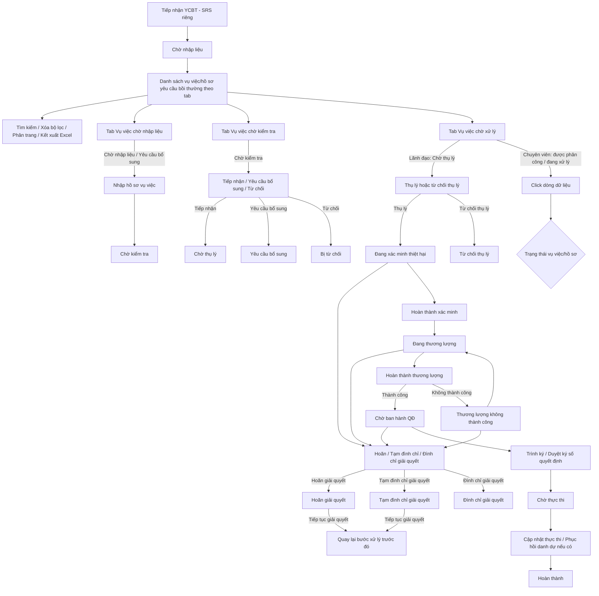

### 4.3.3. Dành cho Cán bộ Công tác bồi thường nhà nước

#### 4.3.3.1. UC431-466 - Giải quyết yêu cầu bồi thường

##### 4.3.3.1.1. Mục đích

\- Cho phép người dùng trên Website quản trị quản lý danh sách vụ việc/hồ sơ yêu cầu bồi thường nhà nước.

\- Cho phép nhập hồ sơ vụ việc từ các vụ việc đã tiếp nhận, kiểm tra hồ sơ, yêu cầu bổ sung, từ chối, thụ lý, từ chối thụ lý, xác minh thiệt hại, thương lượng, hoãn giải quyết, tạm đình chỉ giải quyết, đình chỉ giải quyết, ban hành quyết định, thực thi chi trả và theo dõi phục hồi danh dự.

*a. Phân quyền*

\- Chuyên viên Thụ lý nghiệp vụ: Được tra cứu, nhập/cập nhật hồ sơ thuộc phạm vi được giao, kiểm tra hồ sơ, yêu cầu bổ sung, từ chối hồ sơ ở bước kiểm tra, cập nhật bổ sung, cập nhật xác minh, cập nhật thương lượng, thực hiện hoãn giải quyết/tạm đình chỉ giải quyết/đình chỉ giải quyết từ bước "Đang xác minh thiệt hại" trở đi, cập nhật thực thi và phục hồi danh dự theo trạng thái hồ sơ.

\- Thủ trưởng Cơ quan giải quyết: Được tra cứu, xem chi tiết, thụ lý hồ sơ, từ chối thụ lý, duyệt ký số Quyết định giải quyết bồi thường đối với hồ sơ ở trạng thái phù hợp.

\- Nếu hồ sơ đang được giao cho chuyên viên khác, chuyên viên hiện tại chỉ được xem chi tiết, không được cập nhật dữ liệu hoặc thực hiện thao tác nghiệp vụ.

*b. Điều kiện thực hiện*

\- Người dùng truy cập màn hình `Giải quyết Yêu cầu Bồi thường Nhà nước - Cán bộ` trên Website quản trị.

\- Danh sách vụ việc được nạp từ nguồn dữ liệu nghiệp vụ hiện hành của phân hệ Giải quyết yêu cầu bồi thường. Các vụ việc ở trạng thái "Chờ nhập liệu" được tạo từ SRS Tiếp nhận YCBT.

\- Màn hình danh sách được chia thành các tab nghiệp vụ: `Vụ việc chờ nhập liệu`, `Vụ việc chờ kiểm tra`, `Vụ việc chờ xử lý`. Dữ liệu trong từng tab được lọc theo trạng thái và vai trò người dùng.

\- Các vụ việc đã kết thúc vòng đời xử lý như `Hoàn thành`, `Bị từ chối`, `Từ chối thụ lý`, `Đình chỉ giải quyết` được tra cứu tập trung tại SRS `Tra cứu vụ việc`, không ưu tiên hiển thị trong các tab xử lý nghiệp vụ của module này.

\- Trạng thái vụ việc yêu cầu bồi thường Tham chiếu Danh mục Trạng thái vụ việc yêu cầu bồi thường [DM_24].

---

##### 4.3.3.1.2. Sơ đồ luồng nghiệp vụ theo giao diện

---

##### 4.3.3.1.3. MH01 - Màn hình Danh sách vụ việc/hồ sơ yêu cầu bồi thường

###### 4.3.3.1.3.1. Màn hình

###### 4.3.3.1.3.2. Mô tả thông tin trên màn hình

| Trường thông tin | Kiểu dữ liệu | Bắt buộc | Mặc định | Mô tả |
| :--- | :--- | :--- | :--- | :--- |
| **Tab nghiệp vụ** | Enum(String(100)) | Có | `Vụ việc chờ nhập liệu` | Control UI: Tabs navigation. - Tab 1: "Vụ việc chờ nhập liệu" - Hiển thị các vụ việc ở trạng thái: "Chờ nhập liệu", "Yêu cầu bổ sung". - Tab 2: "Vụ việc chờ kiểm tra" - Hiển thị các vụ việc ở trạng thái: "Chờ kiểm tra". - Tab 3: "Vụ việc chờ xử lý" - Hiển thị các vụ việc thuộc các trạng thái tiếp theo gồm: "Chờ thụ lý", "Đang xác minh thiệt hại", "Đang thương lượng", "Thương lượng không thành công", "Chờ ban hành QĐ", "Chờ thực thi", "Hoãn giải quyết", "Tạm đình chỉ giải quyết", "Đình chỉ giải quyết". |
| **Bộ lọc tìm kiếm** | String(255) | - | - | Khối tiêu chí lọc danh sách vụ việc trong tab đang chọn. |
| Mã vụ việc | String(50) | Không | Trống | Tìm gần đúng theo mã vụ việc, tự động trim space. |
| Tên vụ việc | String(255) | Không | Trống | Control UI: Input text. - Tìm gần đúng theo tên vụ việc, không phân biệt hoa thường. - Dữ liệu lấy từ thông tin tiếp nhận YCBT hoặc hồ sơ xác định cơ quan liên thông. |
| Tên người yêu cầu | String(100) | Không | Trống | Tìm gần đúng theo họ tên người yêu cầu, không phân biệt hoa thường. |
| Cơ quan giải quyết | String(255) | Không | Trống | Tìm gần đúng theo tên cơ quan giải quyết. |
| Lĩnh vực phát sinh thiệt hại | Enum(String(100)) | Không | `Tất cả` | Tham chiếu Danh mục Lĩnh vực phát sinh thiệt hại [DM_22]. |
| Trạng thái giải quyết | Enum(String(50)) | Không | `Tất cả` | Tham chiếu Danh mục Trạng thái vụ việc yêu cầu bồi thường [DM_24]. |
| Tiếp nhận: Từ ngày | Date | Không | Trống | Định dạng `dd/mm/yyyy`. Áp dụng rule khoảng ngày [BR-VAL-007]. |
| Tiếp nhận: Đến ngày | Date | Không | Trống | Định dạng `dd/mm/yyyy`. Áp dụng rule khoảng ngày [BR-VAL-007]. |
| Hạn xử lý: Từ ngày | Date | Không | Trống | Định dạng `dd/mm/yyyy`. Áp dụng rule khoảng ngày [BR-VAL-007]. |
| Hạn xử lý: Đến ngày | Date | Không | Trống | Định dạng `dd/mm/yyyy`. Áp dụng rule khoảng ngày [BR-VAL-007]. |
| Hình thức tiếp nhận | Enum(String(50)) | Không | `Tất cả` | Tham chiếu Danh mục Hình thức tiếp nhận hồ sơ bồi thường [DM_25]. |
| Bảng danh sách vụ việc/hồ sơ yêu cầu bồi thường | List(Object) | Không | Danh sách dữ liệu theo tab | Control UI: Data grid. - Hiển thị danh sách vụ việc/hồ sơ theo tab đang chọn, sắp xếp mặc định theo `Ngày tiếp nhận` giảm dần. - Trạng thái có dữ liệu: Hiển thị danh sách các bản ghi kết quả theo cấu trúc các cột quy định. - Trạng thái không có dữ liệu (Empty State): Khi không tìm thấy kết quả phù hợp với điều kiện tìm kiếm, bảng hiển thị duy nhất 01 dòng căn giữa trên toàn bộ chiều rộng bảng (`colspan`), in nghiêng với nội dung: *"Không tìm thấy dữ liệu phù hợp với điều kiện tìm kiếm."* |
| STT | Integer(10) | - | Tự tăng | Căn giữa, tăng theo phân trang. |
| Mã vụ việc | String(50) | - | Theo dữ liệu | Hiển thị mã vụ việc. Người dùng click vào dòng dữ liệu để mở màn hình chi tiết. |
| Tên vụ việc | String(255) | - | Theo dữ liệu | Chỉ đọc. Hiển thị tên vụ việc đã ghi nhận ở bước tiếp nhận YCBT. |
| Tên người yêu cầu | String(100) | - | Theo dữ liệu | Chỉ đọc. Hiển thị tên người yêu cầu bồi thường. |
| Tỉnh/TP | Enum(String(100)) | - | Theo dữ liệu | Chỉ đọc. Hiển thị tỉnh/thành phố của người yêu cầu hoặc địa bàn phát sinh vụ việc. |
| Địa chỉ chi tiết | Text(1000) | - | Theo dữ liệu | Chỉ đọc. Hiển thị địa chỉ chi tiết của người yêu cầu/vụ việc. |
| Hành vi gây thiệt hại | String(255) | - | Theo dữ liệu | Chỉ đọc. Hiển thị tóm tắt hành vi gây thiệt hại của người thi hành công vụ. |
| Lĩnh vực phát sinh thiệt hại | Enum(String(50)) | - | Theo dữ liệu | Chỉ đọc. Hiển thị lĩnh vực phát sinh thiệt hại theo Danh mục Lĩnh vực phát sinh thiệt hại [DM_22]. |
| Cơ quan giải quyết | String(255) | - | Theo dữ liệu | Chỉ đọc. Hiển thị cơ quan giải quyết bồi thường. |
| Cán bộ xử lý | String(255) | - | Theo dữ liệu | Chỉ đọc. Hiển thị cán bộ xử lý được chỉ định. |
| Ngày tiếp nhận | Date | - | Theo dữ liệu | Căn giữa. Cho phép click tiêu đề cột để đảo chiều sắp xếp tăng/giảm. |
| Hạn xử lý | Date | - | Theo dữ liệu | Hiển thị hạn xử lý và trạng thái cảnh báo SLA theo dữ liệu hệ thống. |
| Hình thức tiếp nhận | Enum(String(50)) | - | Theo dữ liệu | Hiển thị hình thức tiếp nhận theo Danh mục Hình thức tiếp nhận hồ sơ bồi thường [DM_25]. |
| Trạng thái | Enum(String(50)) | - | Theo dữ liệu | Hiển thị trạng thái theo Danh mục Trạng thái vụ việc yêu cầu bồi thường [DM_24]. Trạng thái "Hoãn giải quyết" và "Tạm đình chỉ giải quyết" hiển thị badge cảnh báo; trạng thái "Đình chỉ giải quyết" hiển thị badge lỗi/kết thúc. |
| Thao tác | String(255) | - | Theo vai trò/trạng thái | Control UI: Icon buttons. - Đối với vai trò Chuyên viên/Cán bộ: Hiển thị các icon thao tác nghiệp vụ gồm `Nhập hồ sơ`, `Cập nhật hồ sơ`, `Tiếp nhận`, `Yêu cầu bổ sung`, `Từ chối` theo trạng thái và phạm vi xử lý của vụ việc. - Đối với vai trò Lãnh đạo/Thủ trưởng: Hiển thị các icon thao tác nghiệp vụ gồm `Thụ lý hồ sơ`, `Từ chối thụ lý` theo trạng thái và phạm vi xử lý của vụ việc. - Không có nút/icon `Xem chi tiết` riêng biệt trong cột Thao tác. - Người dùng xem chi tiết bằng sự kiện click trực tiếp vào dòng dữ liệu (Row-Click). - Các icon không đủ điều kiện thao tác theo trạng thái, vai trò hoặc phân công xử lý hiển thị dạng khóa mờ (Disabled). |
| Phân trang | String(255) | Không | `20 bản ghi/trang` | Tuân thủ quy chuẩn phân trang chung [BR-UI-001]. |

###### 4.3.3.1.3.3. Chức năng trên màn hình

| STT | Tên chức năng | Định dạng | Mô tả |
| :--- | :--- | :--- | :--- |
| 1 | Chuyển tab | Tab | Hệ thống tải danh sách vụ việc theo tab được chọn và đặt lại trang hiện tại về trang 1. Bộ lọc đang nhập có thể được giữ nguyên nếu cùng trường dữ liệu hoặc xóa theo thao tác `Xóa bộ lọc`. |
| 2 | Tìm kiếm | Button | Khi người dùng click nút, hệ thống kiểm tra dữ liệu và xử lý theo các trường hợp bên dưới. |
|  |  |  | **TH1 - Khoảng ngày không hợp lệ**: Nếu khoảng ngày không hợp lệ, áp dụng [BR-VAL-007] và không thực hiện tìm kiếm. |
|  |  |  | **TH2 - Không có dữ liệu trả về**: Bảng kết quả hiển thị dòng thông báo rỗng *"Không tìm thấy dữ liệu phù hợp với điều kiện tìm kiếm."* ở giữa bảng; thanh phân trang hiển thị *"Hiển thị 0-0 của 0 bản ghi"* và các nút điều hướng trang ở trạng thái ẩn/khóa mờ; nút "Kết xuất Excel" ở trạng thái khóa mờ kèm tooltip *"Không có dữ liệu để kết xuất Excel"*. |
|  |  |  | **TH Hợp lệ**: Hệ thống tìm kiếm vụ việc theo các tiêu chí lọc đang nhập/chọn trong tab hiện hành, hiển thị kết quả lên bảng và đưa về trang 1. |
| 3 | Xóa bộ lọc | Button | Hệ thống xóa các tiêu chí lọc, đặt lại danh sách theo dữ liệu mặc định của tab hiện hành và đưa về trang 1. |
| 4 | Kết xuất Excel | Button | Hệ thống kết xuất dữ liệu thống kê theo danh sách đang hiển thị trong tab hiện hành. |
| 5 | Click dòng dữ liệu | Row click | Hệ thống mở **MH03 - Xem chi tiết và xử lý hồ sơ yêu cầu bồi thường** tương ứng với vụ việc được chọn. Nếu click vào icon thao tác, hệ thống thực hiện chức năng của icon và không kích hoạt row click. |
| 6 | Nhập hồ sơ | Icon button/Button | Khi người dùng click nút, hệ thống kiểm tra dữ liệu và xử lý theo các trường hợp bên dưới. |
|  |  |  | **TH1 - Vụ việc ở trạng thái "Chờ nhập liệu"**: Hệ thống mở **MH02 - Nhập liệu hồ sơ vụ việc**; các thông tin đã nhập ở bước Tiếp nhận YCBT được tự động điền sẵn vào form. |
|  |  |  | **TH2 - Vụ việc ở trạng thái "Yêu cầu bổ sung"**: Hệ thống mở **MH02 - Nhập liệu hồ sơ vụ việc** ở chế độ cập nhật, hiển thị đầy đủ toàn bộ dữ liệu hồ sơ đã nhập liệu trước đó và cho phép sửa lại; tự động focus/cuộn tới khối `Thông tin yêu cầu bổ sung` để Cán bộ nhìn thấy ngay nội dung cần bổ sung. |
| 7 | Tiếp nhận | Icon button/Button | Hiển thị tại tab `Vụ việc chờ kiểm tra` khi vụ việc ở trạng thái "Chờ kiểm tra". Hệ thống xác nhận hồ sơ hợp lệ, chuyển vụ việc sang trạng thái "Chờ thụ lý", cập nhật timeline xử lý. |
| 8 | Yêu cầu bổ sung | Icon button/Button | Hiển thị tại tab `Vụ việc chờ kiểm tra` khi vụ việc ở trạng thái "Chờ kiểm tra". Hệ thống mở **Popup Yêu cầu bổ sung / Từ chối hồ sơ** để nhập nội dung yêu cầu bổ sung hồ sơ. |
| 9 | Từ chối | Icon button/Button | Hiển thị tại tab `Vụ việc chờ kiểm tra` khi vụ việc ở trạng thái "Chờ kiểm tra". Hệ thống mở **Popup Yêu cầu bổ sung / Từ chối hồ sơ** để nhập lý do từ chối. Sau khi xác nhận, vụ việc chuyển sang trạng thái "Bị từ chối". |
| 10 | Thụ lý hồ sơ | Icon button/Button | Hiển thị tại tab `Vụ việc chờ xử lý` với Lãnh đạo khi vụ việc ở trạng thái "Chờ thụ lý". Hệ thống mở popup nhập thông tin cử người giải quyết hồ sơ; không chọn cán bộ từ danh sách người dùng/cán bộ trên hệ thống. Sau khi nhập hợp lệ, hệ thống cập nhật hồ sơ sang trạng thái "Đang xác minh thiệt hại". |
| 11 | Từ chối thụ lý | Icon button/Button | Hiển thị tại tab `Vụ việc chờ xử lý` với Lãnh đạo khi vụ việc ở trạng thái "Chờ thụ lý". Hệ thống mở **Popup Yêu cầu bổ sung / Từ chối hồ sơ** để nhập lý do từ chối thụ lý. |

---

##### 4.3.3.1.4. MH02 - Màn hình Nhập liệu hồ sơ vụ việc

###### 4.3.3.1.4.1. Màn hình

###### 4.3.3.1.4.2. Mô tả thông tin trên màn hình

| Trường thông tin | Kiểu dữ liệu | Bắt buộc | Mặc định | Mô tả |
| :--- | :--- | :--- | :--- | :--- |
| Tiêu đề màn hình | String(255) | - | Theo ngữ cảnh | Chỉ đọc. Hiển thị động theo trạng thái vụ việc khi mở màn hình: + Vụ việc ở trạng thái "Chờ nhập liệu": `NHẬP LIỆU HỒ SƠ VỤ VIỆC`. + Vụ việc ở trạng thái "Yêu cầu bổ sung": `BỔ SUNG HỒ SƠ VỤ VIỆC`. + Các trạng thái khác (mở lại để cập nhật/trình lại): `CẬP NHẬT HỒ SƠ VỤ VIỆC`. |
| Mã vụ việc | String(50) | - | Theo dữ liệu tiếp nhận | Chỉ đọc. Tự động điền từ vụ việc đã tiếp nhận. |
| Thời điểm tiếp nhận | Datetime | - | Theo dữ liệu tiếp nhận | Chỉ đọc. Tự động điền từ vụ việc đã tiếp nhận. |
| Tên vụ việc | String(255) | - | Theo dữ liệu tiếp nhận | Control UI: Input text. - Tự động điền từ bước tiếp nhận YCBT hoặc hồ sơ xác định cơ quan liên thông. - Cho phép điều chỉnh nếu cần chuẩn hóa hồ sơ. |
| Tỉnh/TP | Enum(String(100)) | Có | Theo dữ liệu tiếp nhận | Control UI: Combobox. - Tự động điền từ bước tiếp nhận YCBT. - Cho phép điều chỉnh nếu cần chuẩn hóa địa bàn vụ việc. - Tham chiếu Danh mục Tỉnh/Thành phố [DM_13]. |
| Địa chỉ chi tiết | Text(1000) | Có | Theo dữ liệu tiếp nhận | Control UI: Textarea. - Tự động điền từ bước tiếp nhận YCBT. - Cho phép điều chỉnh nếu cần chuẩn hóa địa chỉ vụ việc. - Áp dụng quy tắc bắt buộc [BR-VAL-001]. |
| Tìm nhanh từ vụ việc xác định cơ quan | String(50) | Không | Trống | Control UI: Input text. - Cho phép nhập mã vụ việc xác định cơ quan để tìm nhanh hồ sơ liên quan. - Khi thực hiện chức năng `Tìm kiếm`, hệ thống mở popup tìm kiếm và tự điền giá trị ô này vào trường `Mã vụ việc` trên popup để cán bộ chọn hồ sơ phù hợp. - Chức năng `Tìm kiếm nâng cao` được đặc tả tại Bảng Chức năng trên màn hình. |
| Liên kết hồ sơ xác định cơ quan | String(255) | Không | Ẩn | Control UI: Text link (Hyperlink). - Chỉ hiển thị sau khi cán bộ chọn một hồ sơ xác định cơ quan từ popup tìm kiếm hoặc khi mở lại hồ sơ đã lưu liên kết. - Khi người dùng click vào liên kết: Hệ thống mở màn hình **Chi tiết yêu cầu xác định cơ quan giải quyết bồi thường** thuộc nhóm tính năng **Xác định cơ quan giải quyết bồi thường** ở chế độ chỉ xem trong cùng tab làm việc. - Cho phép cán bộ xem lại toàn bộ thông tin kết quả xác định thẩm quyền của vụ việc mà không làm ảnh hưởng đến dữ liệu đang nhập trên form hiện tại. |
| Thông tin yêu cầu bổ sung | String(255) | - | Ẩn | Chỉ hiển thị khi vụ việc ở trạng thái "Yêu cầu bổ sung". Hiển thị nội dung yêu cầu bổ sung do Cán bộ kiểm tra đã nhập tại **Popup Yêu cầu bổ sung / Từ chối hồ sơ**. Khi mở màn hình ở trạng thái này, hệ thống tự động focus/cuộn tới khối này để Cán bộ nhìn thấy ngay nội dung cần bổ sung; toàn bộ dữ liệu hồ sơ đã nhập liệu trước đó vẫn hiển thị đầy đủ trên form và cho phép sửa lại, không bị khóa. |
| Thông tin từ chối thụ lý | String(255) | - | Ẩn | Chỉ hiển thị khi cập nhật hồ sơ ở trạng thái "Từ chối thụ lý". |
| Nội dung giải trình / Điều chỉnh hồ sơ | Text(2000) | Có theo trạng thái | Trống | Hiển thị khi hồ sơ bị từ chối thụ lý hoặc cần trình lại; áp dụng rule bắt buộc [BR-VAL-001]. |
| Loại yêu cầu giải quyết bồi thường | Enum(String(100)) | Có | `Yêu cầu cả hai (Bồi thường tiền & Phục hồi danh dự)` | Control UI: Radio button. Giá trị gồm: + `Yêu cầu cả hai (Bồi thường tiền & Phục hồi danh dự)` + `Chỉ yêu cầu bồi thường thiệt hại bằng tiền` + `Chỉ yêu cầu phục hồi danh dự` |
| Tình trạng pháp lý hồ sơ | Enum(String(50)) | Có | `Yêu cầu chưa có Bản án/Quyết định của Tòa án` | Giá trị gồm: + `Yêu cầu chưa có Bản án/Quyết định của Tòa án` + `Đã có Bản án/Quyết định của Tòa án` |
| **Thông tin bản án gốc** | String(255) | - | Ẩn | Chỉ hiển thị khi chọn `Đã có Bản án/Quyết định của Tòa án`. |
| Nguồn phát sinh bản án | Enum(String(100)) | Có theo điều kiện | `Khởi kiện vụ án dân sự (Điều 52)` | Giá trị gồm: + `Khởi kiện vụ án dân sự (Điều 52)` + `Giải quyết trong quá trình tố tụng hình sự, tố tụng hành chính (Điều 55)` |
| Trường hợp khởi kiện | Enum(String(255)) | Có theo điều kiện | `Đã yêu cầu cơ quan giải quyết trước khi khởi kiện (điểm b khoản 1 và khoản 2 Điều 52)` | Chỉ hiển thị khi `Nguồn phát sinh bản án` là `Khởi kiện vụ án dân sự (Điều 52)`. Cán bộ chọn theo đúng căn cứ thụ lý đã nêu trong bản án/hồ sơ vụ án của Tòa án gửi về; **không** suy ra từ việc tìm/không tìm thấy hồ sơ gốc trên hệ thống ở trường bên dưới. Giá trị gồm: + `Khởi kiện thẳng ra Tòa án, chưa từng yêu cầu cơ quan giải quyết (điểm a khoản 1 Điều 52)` + `Đã yêu cầu cơ quan giải quyết trước khi khởi kiện — rút yêu cầu hoặc không đồng ý/thương lượng không thành (điểm b khoản 1 và khoản 2 Điều 52)` |
| Vụ việc yêu cầu bồi thường gốc liên quan | String(255) | Không | Trống | Control UI: Input text. - Chỉ hiển thị khi `Trường hợp khởi kiện` là `điểm b khoản 1 và khoản 2 Điều 52`. - Không hiển thị khi chọn điểm a khoản 1 Điều 52 vì trường hợp này chưa từng có vụ việc gốc tại cơ quan. - Cho phép nhập `Mã vụ việc gốc` để tìm nhanh vụ việc/hồ sơ gốc liên quan. - Khi thực hiện chức năng `Tìm kiếm`, hệ thống mở popup tìm kiếm và tự điền giá trị ô này vào trường `Mã vụ việc/Số quyết định` trên popup để cán bộ chọn vụ việc gốc phù hợp. - Nếu không tìm được vụ việc gốc phù hợp, cán bộ chọn `Không có vụ việc gốc trên hệ thống` ở trường bên dưới. |
| Liên kết hồ sơ gốc | String(255) | Không | Ẩn | Control UI: Text link (Read-only). - Chỉ hiển thị sau khi cán bộ đã chọn một vụ việc gốc từ popup tìm kiếm hoặc khi mở lại hồ sơ đã có dữ liệu liên kết gốc. - Vị trí: Hiển thị ngay dưới trường `Vụ việc yêu cầu bồi thường gốc liên quan`. - Điều kiện hiển thị: Chỉ hiển thị khi `Trường hợp khởi kiện` là `điểm b khoản 1 và khoản 2 Điều 52` và không chọn `Không có hồ sơ gốc trên hệ thống`. - Khi người dùng click vào liên kết: Hệ thống mở màn hình **MH03 - Xem chi tiết và xử lý hồ sơ yêu cầu bồi thường** ở chế độ chỉ xem trong cùng tab làm việc. |
| Không có hồ sơ gốc trên hệ thống | Boolean | Không | Chưa chọn | Chỉ hiển thị khi `Trường hợp khởi kiện` là `điểm b khoản 1 và khoản 2 Điều 52`. Khi tick, hiển thị 3 trường bắt buộc thay thế ngay dưới đây để lưu vết căn cứ pháp lý dù không liên kết được hồ sơ gốc trên hệ thống. |
| Số quyết định/biên bản/đơn xin rút yêu cầu gốc | String(100) | Có theo điều kiện | Trống | Chỉ hiển thị và bắt buộc khi tick `Không có hồ sơ gốc trên hệ thống`. Lấy theo nội dung bản án/hồ sơ vụ án của Tòa án đã trích dẫn (tùy tình huống: số quyết định giải quyết bồi thường, số biên bản thương lượng không thành, hoặc số đơn xin rút yêu cầu). Áp dụng rule bắt buộc [BR-VAL-001]. |
| Ngày ban hành (hồ sơ gốc) | Date | Có theo điều kiện | Trống | Chỉ hiển thị và bắt buộc khi tick `Không có hồ sơ gốc trên hệ thống`. Áp dụng rule bắt buộc [BR-VAL-001]. |
| Cơ quan đã giải quyết trước đó | String(255) | Có theo điều kiện | Trống | Chỉ hiển thị và bắt buộc khi tick `Không có hồ sơ gốc trên hệ thống`. Áp dụng rule bắt buộc [BR-VAL-001]. |
| Số Bản án/Quyết định | String(50) | Có theo điều kiện | Trống | Áp dụng rule bắt buộc [BR-VAL-001]. |
| Ngày Bản án/Quyết định có hiệu lực | Date | Có theo điều kiện | Trống | Áp dụng rule bắt buộc [BR-VAL-001]. |
| Hình thức tiếp nhận hồ sơ | Enum(String(50)) | Không | Theo dữ liệu tiếp nhận | Tự động điền từ bước tiếp nhận YCBT, Tham chiếu Danh mục Hình thức tiếp nhận hồ sơ bồi thường [DM_25]. Khi hồ sơ đã có bản án, UI tự động khóa/đặt theo luồng cán bộ chủ động nhập theo tố tụng/thi hành án. |
| Lĩnh vực phát sinh thiệt hại | Enum(String(100)) | Có | Theo dữ liệu tiếp nhận | Tự động điền từ bước tiếp nhận YCBT, Tham chiếu Danh mục Lĩnh vực phát sinh thiệt hại [DM_22]. |
| Ngày văn bản yêu cầu bồi thường | Date | Có | Trống | Nhập ngày ghi trên đơn/văn bản yêu cầu bồi thường của người yêu cầu. Trường được nhập tại màn `Nhập liệu hồ sơ vụ việc`, không nhập ở màn Tiếp nhận YCBT. Control UI: DatePicker. Định dạng hiển thị trên UI `mm/dd/yyyy`. Áp dụng rule bắt buộc [BR-VAL-001] và rule ngày quá khứ [BR-VAL-008]. Phục vụ tổng hợp báo cáo theo Mẫu số 01/03 Thông tư 08/2019/TT-BTP. |
| Pháp luật áp dụng để giải quyết bồi thường | Enum(String(100)) | Có | Theo danh mục | Control UI: Combobox. - Trường được nhập tại màn `Nhập liệu hồ sơ vụ việc`, không nhập ở màn Tiếp nhận YCBT. - Tham chiếu Danh mục Pháp luật áp dụng để giải quyết bồi thường [DM_28]. - Xác định căn cứ theo thời điểm phát sinh vụ việc và ngày văn bản yêu cầu bồi thường. - Phục vụ tổng hợp báo cáo theo Mẫu số 01 Thông tư 08/2019/TT-BTP. |
| Cơ quan giải quyết bồi thường | Enum(String(255)) | Không | Trống | Control UI: Ô chọn có tìm kiếm (combobox). Tham chiếu Danh mục Cơ quan, Đơn vị giải quyết [DM_DON_VI]. Cho phép tìm kiếm nhanh theo `Mã đơn vị` hoặc `Tên đơn vị`; áp dụng tìm gần đúng (chứa chuỗi nhập, không phân biệt hoa/thường và dấu tiếng Việt). |
| **Thông tin người yêu cầu bồi thường** | String(100) | - | - | Khối thông tin nhân thân/tổ chức của người yêu cầu. |
| Họ và tên người yêu cầu bồi thường | String(100) | Có | Theo dữ liệu tiếp nhận | Tự động điền từ bước tiếp nhận YCBT; áp dụng rule bắt buộc [BR-VAL-001]. |
| Tư cách người yêu cầu bồi thường | Enum(String(100)) | Có | `Người bị thiệt hại` | Tham chiếu Danh mục Tư cách người yêu cầu bồi thường [DM_26]. |
| Giới tính | Enum(String(20)) | Có | `Nam` | Tham chiếu Danh mục Giới tính [DM_23]. |
| Ngày tháng năm sinh | Date | Có | Trống | Định dạng `dd/mm/yyyy`. Áp dụng rule bắt buộc [BR-VAL-001] và rule ngày quá khứ [BR-VAL-008]. |
| Trạng thái người bị thiệt hại | Enum(String(50)) | Có | `Còn sống` | Giá trị gồm: + `Còn sống` + `Đã chết` |
| Số điện thoại liên hệ | String(20) | Có | Trống | Áp dụng rule số điện thoại [BR-VAL-003]. |
| Địa chỉ Email | String(255) | Không | Trống | Control UI: Input text. - Cho phép nhập địa chỉ email liên hệ của người yêu cầu bồi thường. - Nếu có dữ liệu, áp dụng quy tắc Email [BR-VAL-002]. |
| Loại giấy tờ thân nhân | Enum(String(50)) | Có | `Căn cước công dân (CCCD)` | Tham chiếu Danh mục Loại giấy tờ pháp lý/thân nhân [DM_10]. |
| Số giấy tờ thân nhân | String(20) | Có | Trống | Nếu loại giấy tờ là CCCD, áp dụng rule [BR-VAL-004]. |
| Ngày cấp | Date | Có | Trống | Áp dụng rule ngày quá khứ [BR-VAL-008]. |
| Nơi cấp | String(255) | Có | Trống | Áp dụng rule bắt buộc [BR-VAL-001]. |
| Quốc gia | Enum(String(100)) | Có | `Việt Nam` | Tham chiếu Danh mục Quốc tịch / Quốc gia [DM_09]. Nếu chọn `Quốc gia khác`, UI chuyển phần tỉnh/thành sang nhập tự do. |
| Tỉnh/TP | Enum(String(100)) | Có | Theo quốc gia | Tham chiếu Danh mục Tỉnh/Thành phố [DM_13] khi Quốc gia là Việt Nam [DM_09]. |
| Địa chỉ chi tiết | Text(1000) | Có | Theo dữ liệu tiếp nhận | Tự động điền từ `Địa chỉ người yêu cầu` ở bước tiếp nhận YCBT; áp dụng rule bắt buộc [BR-VAL-001]. |
| Hành vi gây thiệt hại của người thi hành công vụ | Text(2000) | Có | Trống | Áp dụng rule bắt buộc [BR-VAL-001]. |
| Mối quan hệ nhân quả giữa thiệt hại thực tế xảy ra và hành vi gây thiệt hại | Text(2000) | Có | Trống | Áp dụng rule bắt buộc [BR-VAL-001]. |
| Bảng thiệt hại yêu cầu bồi thường | List(Object) | Không | Các dòng mặc định | Control UI: Data grid. - Tham chiếu danh mục loại thiệt hại [DM_27]. |
| STT | Integer(10) | - | Tự tăng | Căn giữa. |
| Mục thiệt hại yêu cầu bồi thường | Boolean | - | Chưa chọn | Chỉ đọc. Tick để mở nhập `Cách tính / Diễn giải công thức áp dụng` và `Số tiền yêu cầu bồi thường`. |
| Cách tính / Diễn giải công thức áp dụng | Text(2000) | Có khi chọn dòng | Disabled khi chưa chọn | Áp dụng rule bắt buộc [BR-VAL-001] khi dòng thiệt hại được tick. |
| Số tiền yêu cầu bồi thường (đồng) | Decimal(18,0) | Có khi chọn dòng | Disabled khi chưa chọn | Áp dụng rule số tiền dương [BR-VAL-010] khi dòng thiệt hại được tick. |
| Đề nghị tạm ứng kinh phí | Boolean | Không | Chưa chọn | Hiển thị khối tạm ứng khi được tick; khối này ẩn khi hồ sơ theo luồng đã có bản án. |
| Tạm ứng Thiệt hại tinh thần (đồng) | Decimal(18,0) | Không | Trống | Chỉ nhập khi có đề nghị tạm ứng và loại thiệt hại tinh thần phù hợp được chọn. |
| Tài liệu đính kèm kèm tạm ứng tinh thần | File | Không | Trống | Cho phép chọn file đính kèm. |
| Tạm ứng Thiệt hại khác tính được ngay | Enum(String(100)) | Không | Trống | Tham chiếu Danh mục Loại thiệt hại yêu cầu bồi thường [DM_27]. |
| Tài liệu đính kèm kèm tạm ứng thiệt hại khác | File | Không | Trống | Cho phép chọn file đính kèm. |
| Họ và tên người nhận | String(100) | Có khi hiển thị | Trống | Thuộc khối thông tin người nhận tiền. |
| Giấy tờ thân nhân | String(50) | Có khi hiển thị | Trống | Thuộc khối thông tin người nhận tiền. |
| Địa chỉ chi tiết | Text(1000) | Có khi hiển thị | Trống | Thuộc khối thông tin người nhận tiền. |
| Phương thức nhận tiền | Enum(String(50)) | Có khi hiển thị | `Nhận tiền mặt` | Tham chiếu Danh mục Phương thức nhận tiền bồi thường/tạm ứng [DM_28]. |
| Số biên lai nhận tiền mặt | String(50) | Không | Trống | Chỉ hiển thị khi phương thức nhận tiền là `Nhận tiền mặt`. |
| Chủ tài khoản | String(100) | Có theo điều kiện | Trống | Chỉ hiển thị khi phương thức nhận tiền là `Nhận qua chuyển khoản`. |
| Số tài khoản | String(50) | Có theo điều kiện | Trống | Chỉ hiển thị khi phương thức nhận tiền là `Nhận qua chuyển khoản`. |
| Tên ngân hàng | String(255) | Có theo điều kiện | Trống | Chỉ hiển thị khi phương thức nhận tiền là `Nhận qua chuyển khoản`. |
| Chi nhánh | String(255) | Có theo điều kiện | Trống | Chỉ hiển thị khi phương thức nhận tiền là `Nhận qua chuyển khoản`. |
| Đề nghị phục hồi danh dự | Boolean | Không | Theo loại yêu cầu | Bắt buộc tick và disabled khi loại yêu cầu là `Chỉ yêu cầu phục hồi danh dự`. |
| Trực tiếp xin lỗi và cải chính công khai | Boolean | Không | Checked | Hình thức phục hồi danh dự. |
| Đăng báo xin lỗi và cải chính công khai | Boolean | Không | Chưa chọn | Hình thức phục hồi danh dự. |
| Yêu cầu khôi phục quyền, lợi ích hợp pháp khác | Boolean | Không | Chưa chọn | Nếu tick, nhập mô tả nội dung khôi phục khác. |
| Địa điểm lập đơn | String(255) | Có | Trống | Áp dụng rule bắt buộc [BR-VAL-001]. |
| Ngày lập đơn | Date | Có | Trống | Áp dụng rule bắt buộc [BR-VAL-001]. |
| Bảng tài liệu đính kèm hồ sơ | List(Object) | Không | Danh mục tài liệu theo tư cách người yêu cầu | Control UI: Data grid. - Danh sách tài liệu thay đổi theo `Tư cách người yêu cầu bồi thường`. - Các tài liệu đã đính kèm ở bước tiếp nhận YCBT được hiển thị sẵn để người dùng xem, xóa hoặc bổ sung thêm. |
| STT | Integer(10) | - | Tự tăng | Căn giữa. |
| Tên tài liệu | String(255) | - | Theo danh mục | Hiển thị tên tài liệu cần đính kèm. |
| File đính kèm | File | - | Theo dữ liệu | Hiển thị tên file đã chọn hoặc trạng thái chưa có file. |
| Thao tác | String(255) | - | Theo dữ liệu | Gồm `Tải lên`, `Xem file`, `Xóa`. |

###### 4.3.3.1.4.3. Chức năng trên màn hình

| STT | Tên chức năng | Định dạng | Mô tả |
| :--- | :--- | :--- | :--- |
| 1 | Tìm kiếm | Button | Khi người dùng click nút, hệ thống kiểm tra dữ liệu và xử lý theo các trường hợp bên dưới. |
|  |  |  | **TH1 - Có hồ sơ phù hợp**: Có hồ sơ xác định cơ quan trùng với mã tìm kiếm, đang ở trạng thái "Hoàn thành" và chưa gắn với hồ sơ yêu cầu bồi thường khác; hệ thống mở **Popup Tìm kiếm Vụ việc xác định cơ quan giải quyết bồi thường**, tự điền `Mã vụ việc`, tự thực hiện tìm kiếm và hiển thị danh sách kết quả để cán bộ chọn hồ sơ phù hợp. |
|  |  |  | **TH Không có dữ liệu trả về**: Bảng kết quả hiển thị dòng thông báo rỗng *"Không tìm thấy dữ liệu phù hợp với điều kiện tìm kiếm."* ở giữa bảng; thanh phân trang hiển thị *"Hiển thị 0-0 của 0 bản ghi"* và các nút điều hướng trang ở trạng thái ẩn/khóa mờ. |
|  |  |  | **TH2 - Không tìm thấy hồ sơ phù hợp**: Hệ thống vẫn mở popup tìm kiếm, tự điền `Mã vụ việc` bằng giá trị đã nhập, hiển thị `Bảng kết quả tìm kiếm` trống; trong phần thân bảng hiển thị một dòng thông báo [MSG-INF-BTNN-GQBT-001] căn giữa, không hiển thị Toast và không thay đổi dữ liệu đang có trên form. |
| 2 | Tìm kiếm nâng cao | Button | Hệ thống mở **Popup Tìm kiếm Vụ việc xác định cơ quan giải quyết bồi thường** để tìm theo nhiều tiêu chí khi không nhớ chính xác mã. |
|  |  |  | **TH Không có dữ liệu trả về**: Bảng kết quả hiển thị dòng thông báo rỗng *"Không tìm thấy dữ liệu phù hợp với điều kiện tìm kiếm."* ở giữa bảng; thanh phân trang hiển thị *"Hiển thị 0-0 của 0 bản ghi"* và các nút điều hướng trang ở trạng thái ẩn/khóa mờ. |
| 3 | Liên kết hồ sơ xác định cơ quan | Link | Chỉ hiển thị sau khi cán bộ chọn hồ sơ xác định cơ quan từ popup tìm kiếm hoặc khi mở lại hồ sơ đã lưu thông tin liên kết. - Khi click vào liên kết, hệ thống mở màn hình **Chi tiết yêu cầu xác định cơ quan giải quyết bồi thường** thuộc nhóm tính năng **Xác định cơ quan giải quyết bồi thường** ở chế độ chỉ xem trong cùng tab làm việc. - Thao tác này không làm thay đổi dữ liệu đang nhập trên **MH02 - Nhập liệu hồ sơ vụ việc**. |
| 4 | Tìm kiếm | Button | Khi người dùng click nút, hệ thống kiểm tra dữ liệu và xử lý theo các trường hợp bên dưới. |
|  |  |  | **TH1 - Có vụ việc phù hợp**: Có vụ việc gốc trùng mã và đang ở một trong các trạng thái hợp lệ để liên kết theo Danh mục Trạng thái vụ việc yêu cầu bồi thường [DM_24]; hệ thống mở **Popup chuẩn Tìm kiếm vụ việc/hồ sơ gốc liên quan**, tự điền `Mã vụ việc/Số quyết định`, tự thực hiện tìm kiếm và hiển thị danh sách kết quả để cán bộ chọn vụ việc phù hợp. |
|  |  |  | **TH Không có dữ liệu trả về**: Bảng kết quả hiển thị dòng thông báo rỗng *"Không tìm thấy dữ liệu phù hợp với điều kiện tìm kiếm."* ở giữa bảng; thanh phân trang hiển thị *"Hiển thị 0-0 của 0 bản ghi"* và các nút điều hướng trang ở trạng thái ẩn/khóa mờ. |
|  |  |  | **TH2 - Không tìm thấy vụ việc phù hợp hoặc vụ việc không ở trạng thái hợp lệ để liên kết**: Hệ thống vẫn mở popup tìm kiếm, tự điền `Mã vụ việc` bằng giá trị đã nhập, hiển thị `Bảng kết quả tìm kiếm` trống; trong phần thân bảng hiển thị một dòng thông báo [MSG-INF-BTNN-GQBT-002] căn giữa, không hiển thị Toast và không thay đổi dữ liệu đang có trên form. |
| 5 | Tìm kiếm nâng cao | Button | Hệ thống mở **Popup chuẩn Tìm kiếm vụ việc/hồ sơ gốc liên quan** để tìm theo nhiều tiêu chí khi không nhớ chính xác mã. |
|  |  |  | **TH Không có dữ liệu trả về**: Bảng kết quả hiển thị dòng thông báo rỗng *"Không tìm thấy dữ liệu phù hợp với điều kiện tìm kiếm."* ở giữa bảng; thanh phân trang hiển thị *"Hiển thị 0-0 của 0 bản ghi"* và các nút điều hướng trang ở trạng thái ẩn/khóa mờ. |
| 6 | Liên kết hồ sơ gốc | Link | Chỉ hiển thị sau khi cán bộ chọn vụ việc gốc từ popup tìm kiếm hoặc khi mở lại hồ sơ đã lưu thông tin liên kết gốc. - Khi click vào liên kết tại trường `Vụ việc yêu cầu bồi thường gốc liên quan`, hệ thống mở **MH03 - Xem chi tiết và xử lý hồ sơ yêu cầu bồi thường** ở chế độ chỉ xem trong cùng tab làm việc. - Thao tác này không làm thay đổi dữ liệu đang nhập trên **MH02 - Nhập liệu hồ sơ vụ việc**. |
| 7 | Hủy bỏ | Button | Hệ thống đóng form nhập liệu hồ sơ vụ việc và quay lại danh sách. |
| 8 | Lưu nháp | Button | Khi người dùng click nút, hệ thống kiểm tra dữ liệu và xử lý theo các trường hợp bên dưới. |
|  |  |  | **TH1 - Nhập liệu từ vụ việc**: Hệ thống lưu dữ liệu đang nhập, giữ trạng thái "Chờ nhập liệu" và hiển thị thông báo [MSG-SUC-SYS-001]. |
|  |  |  | **TH2 - Cập nhật**: Hệ thống cập nhật dữ liệu hồ sơ hiện tại, giữ trạng thái hiện hành và hiển thị thông báo [MSG-SUC-SYS-002]. |
| 9 | Lưu thông tin | Button | Khi người dùng click nút, hệ thống kiểm tra dữ liệu và xử lý theo các trường hợp bên dưới. |
|  |  |  | **TH1 - Bỏ trống trường bắt buộc, bao gồm `Tên vụ việc`, `Tỉnh/TP`, `Địa chỉ chi tiết`, `Ngày văn bản yêu cầu bồi thường`, `Pháp luật áp dụng để giải quyết bồi thường`**: Vi phạm quy tắc [BR-VAL-001]. Hệ thống tô viền đỏ ô trống đầu tiên và hiển thị cảnh báo lỗi [MSG-ERR-VAL-001]. Không cho phép lưu thông tin. |
|  |  |  | **TH2 - `Số điện thoại liên hệ` không đúng định dạng**: Vi phạm [BR-VAL-003], hiển thị [MSG-ERR-VAL-003]. Không cho phép lưu thông tin. |
|  |  |  | **TH3 - Địa chỉ Email không đúng định dạng**: Nếu `Địa chỉ Email` có dữ liệu nhưng không đúng định dạng, vi phạm [BR-VAL-002], hệ thống hiển thị [MSG-ERR-VAL-002]. Không cho phép lưu thông tin. |
|  |  |  | **TH4 - `Số giấy tờ thân nhân` là CCCD nhưng không đúng 12 chữ số**: Vi phạm [BR-VAL-004], hiển thị [MSG-ERR-VAL-004]. Không cho phép lưu thông tin. |
|  |  |  | **TH5 - `Ngày văn bản yêu cầu bồi thường`, `Ngày tháng năm sinh`, `Ngày cấp` lớn hơn ngày hiện tại**: Vi phạm [BR-VAL-008], hiển thị [MSG-ERR-VAL-008]. Không cho phép lưu thông tin. |
|  |  |  | **TH6 - Dòng thiệt hại được tick nhưng chưa nhập cách tính hoặc số tiền không lớn hơn 0**: Vi phạm [BR-VAL-001]/[BR-VAL-010], hiển thị [MSG-ERR-VAL-001]/[MSG-ERR-VAL-012]. Không cho phép lưu thông tin. |
|  |  |  | **TH7 - Hợp lệ**: Hệ thống sinh/cập nhật mã vụ việc theo quy tắc hiện hành, lưu toàn bộ thông tin hồ sơ vụ việc, chuyển trạng thái sang `Chờ kiểm tra`, cập nhật timeline và hiển thị thông báo [MSG-SUC-SYS-003]. |
|  |  |  | **TH8 - Hồ sơ có bản án/quyết định**: Hệ thống vẫn lưu thông tin đã nhập theo luồng hiện hành; trạng thái sau nhập liệu ưu tiên chuyển sang `Chờ kiểm tra` để cán bộ kiểm tra trước khi xử lý các bước tiếp theo. |
| 10 | Từ chối thụ lý | Button | Khi người dùng click nút, hệ thống kiểm tra dữ liệu và xử lý theo các trường hợp bên dưới. |
|  |  |  | **TH1 - Chưa nhập nội dung giải trình/điều chỉnh khi UI yêu cầu**: Vi phạm [BR-VAL-001], hiển thị [MSG-ERR-VAL-001]. Không cho phép thực hiện. |
|  |  |  | **TH2 - Hợp lệ**: Hệ thống mở **Popup Yêu cầu bổ sung / Từ chối hồ sơ** để nhập lý do từ chối, sau khi xác nhận chuyển hồ sơ sang trạng thái "Từ chối thụ lý" theo logic UI và cập nhật timeline. |
| 11 | Gửi lại hồ sơ | Button | Khi người dùng click nút, hệ thống kiểm tra dữ liệu và xử lý theo các trường hợp bên dưới. |
|  |  |  | **TH1 - Chưa nhập nội dung giải trình/điều chỉnh khi UI yêu cầu**: Vi phạm [BR-VAL-001], hiển thị [MSG-ERR-VAL-001]. Không cho phép gửi lại. |
|  |  |  | **TH2 - Hợp lệ, ngữ cảnh từ chối thụ lý/trình lại**: Hệ thống cập nhật dữ liệu hồ sơ, chuyển trạng thái sang `Chờ kiểm tra` để cán bộ kiểm tra lại hồ sơ và hiển thị thông báo [MSG-SUC-SYS-002]. |
| 12 | Tải lên | Button | Hệ thống mở trình chọn file cho dòng tài liệu tương ứng. |
| 13 | Xem file | Link | Cho phép xem file tại một tab riêng. |
| 14 | Xóa | Link/Icon | Khi người dùng click nút, hệ thống kiểm tra dữ liệu và xử lý theo các trường hợp bên dưới. |
|  |  |  | **TH1 - Người dùng xác nhận xóa file**: Hệ thống mở **Popup Xác nhận** với nội dung [MSG-CFM-SYS-001]. Nếu xác nhận, hệ thống gỡ file khỏi dòng tài liệu. |
|  |  |  | **TH2 - Người dùng hủy thao tác**: Hệ thống đóng popup xác nhận và giữ nguyên file. |

---

##### 4.3.3.1.5. MH03 - Màn hình Xem chi tiết và xử lý hồ sơ yêu cầu bồi thường

###### 4.3.3.1.5.1. Màn hình

###### 4.3.3.1.5.2. Mô tả thông tin trên màn hình

| Trường thông tin | Kiểu dữ liệu | Bắt buộc | Mặc định | Mô tả |
| :--- | :--- | :--- | :--- | :--- |
| Tiêu đề màn hình | String(255) | - | - | Chỉ đọc. Hiển thị `CHI TIẾT HỒ SƠ` hoặc `CẬP NHẬT HỒ SƠ` theo chế độ mở. |
| Badge trạng thái | Enum(String(50)) | - | Theo hồ sơ | Hiển thị trạng thái hồ sơ theo Danh mục Trạng thái vụ việc yêu cầu bồi thường [DM_24]. |
| Tab Thông tin chung | String(255) | - | Active | Hiển thị thông tin chi tiết hồ sơ ở dạng chỉ đọc. |
| Tab Kết quả xử lý | Text(2000) | - | Theo trạng thái | Hiển thị các khối nghiệp vụ có thể mở rộng/thu gọn. - Ẩn với vụ việc ở trạng thái "Chờ nhập liệu" chưa có hồ sơ chi tiết. |
| Tab Phục hồi danh dự | String(255) | - | Theo hồ sơ | Hiển thị khi hồ sơ có yêu cầu phục hồi danh dự và trạng thái thuộc nhóm từ "Chờ ban hành QĐ" trở đi. |
| Thông tin chung vụ việc | String(255) | - | Theo vụ việc | Chỉ đọc. Hiển thị mã vụ việc, tên vụ việc, người yêu cầu, Tỉnh/TP, địa chỉ chi tiết, căn cứ yêu cầu, hành vi gây thiệt hại, mối quan hệ nhân quả, lĩnh vực, cơ quan giải quyết, cán bộ xử lý, danh sách file đính kèm và danh sách thiệt hại. |
| Khối thông tin thu gọn Thụ lý hồ sơ | String(255) | - | Theo trạng thái | Control UI: Khối nghiệp vụ có thể mở rộng/thu gọn. - Hiển thị kênh tiếp nhận, ngày tiếp nhận, hạn xử lý và đơn vị giải quyết. - Hiển thị thông tin người được cử giải quyết, thông tin Quyết định cử người giải quyết và thông tin từ chối/thụ lý nếu có. |
| Họ và tên cán bộ giải quyết | String(100) | Có khi thụ lý | Trống | Lãnh đạo nhập trực tiếp họ và tên cán bộ được cử giải quyết hồ sơ; không chọn từ danh sách cán bộ trên hệ thống. |
| Chức vụ cán bộ giải quyết | String(100) | Có khi thụ lý | Trống | Lãnh đạo nhập chức vụ của cán bộ được cử giải quyết hồ sơ. |
| Đơn vị cán bộ giải quyết | Enum(Tree) | Có khi thụ lý | Trống | Lãnh đạo chọn đơn vị của cán bộ được cử giải quyết trên cây đơn vị của cơ quan. |
| Đơn vị ban hành QĐ cử người giải quyết | Enum(String(255)) | Có khi thụ lý | Theo cơ quan giải quyết | Đơn vị ban hành quyết định cử người giải quyết. |
| Số QĐ cử người giải quyết | String(50) | Có khi thụ lý | Trống | Nhập số Quyết định cử người giải quyết hồ sơ yêu cầu bồi thường; hệ thống kiểm tra trùng số quyết định theo đơn vị ban hành/năm nếu có cấu hình kiểm tra trùng. |
| Ngày QĐ cử người giải quyết | Date | Có khi thụ lý | Ngày hiện tại | Nhập/chọn ngày ban hành Quyết định cử người giải quyết bằng datepicker; áp dụng quy tắc kiểm tra ngày hợp lệ [BR-VAL-008]. |
| Người ký/Chức vụ người ký QĐ | String(255) | Không | Trống | Ghi nhận người ký và chức vụ trên quyết định cử người giải quyết nếu có. |
| Tài liệu QĐ cử người giải quyết đính kèm | File | Có khi thụ lý | Trống | Khối tài liệu đặt dưới phần thông tin quyết định; cho phép đính kèm tài liệu Quyết định cử người giải quyết, sau khi chọn file hiển thị tên file và liên kết Xem file, Xóa. Đây là file QĐ đã ký bên ngoài, module này không thực hiện trình ký số riêng cho QĐ cử người giải quyết. |
| Nội dung giải trình / Điều chỉnh hồ sơ | Text(2000) | Có theo trạng thái | Trống | Hiển thị trong khối chỉnh sửa khi hồ sơ cần giải trình sau từ chối thụ lý. |
| Tài liệu đính kèm kèm theo | File | Không | Trống | Hiển thị trong khối chỉnh sửa sau từ chối thụ lý. |
| Khối thông tin thu gọn Bổ sung hồ sơ | String(255) | - | Theo trạng thái | Control UI: Khối nghiệp vụ có thể mở rộng/thu gọn. - Hiển thị nội dung yêu cầu bổ sung. - Cho phép nhập thông tin bổ sung khi ở chế độ cập nhật. |
| Nhập thông tin đã bổ sung | Text(2000) | Có theo trạng thái | Trống | Áp dụng [BR-VAL-001] khi cập nhật kết quả bổ sung. |
| File đính kèm bổ sung | File | Không | Trống | Cho phép đính kèm file bổ sung. |
| Khối thông tin thu gọn Xác minh thiệt hại | String(255) | - | Theo trạng thái | Control UI: Khối nghiệp vụ có thể mở rộng/thu gọn. - Hiển thị thông tin xác minh thiệt hại. |
| Bảng xác minh thiệt hại | List(Object) | Không | Theo hồ sơ | Control UI: Data grid. - Gồm các cột `STT`, `Mục thiệt hại yêu cầu`, `Tiền yêu cầu (đ)`, `Đề xuất mức bồi thường (đ)`, `Ghi chú xác minh`, `Chi tiết`. |
| Thỏa thuận việc kéo dài thời gian xác minh | Text(2000) | Không | Trống | Ghi nhận thỏa thuận kéo dài thời gian xác minh nếu có. |
| Các nội dung khác liên quan đến quá trình xác minh thiệt hại | Text(2000) | Không | Trống | Ghi nhận thông tin bổ sung trong quá trình xác minh. |
| Tải lên Báo cáo kết quả xác minh | File | Không | Trống | Cho phép tải nhiều file báo cáo/biên bản định giá/giám định. |
| Khối thông tin thu gọn Thương lượng bồi thường | String(255) | - | Theo trạng thái | Control UI: Khối nghiệp vụ có thể mở rộng/thu gọn. - Hiển thị thông tin phiên thương lượng. - Cho phép cập nhật thông tin phiên thương lượng theo trạng thái hồ sơ và phân quyền người dùng. |
| Thời gian dự kiến | Datetime | Không | Trống | Thời gian dự kiến tổ chức thương lượng. |
| Địa điểm dự kiến | String(255) | Không | Trống | Địa điểm dự kiến tổ chức thương lượng. |
| Thành phần dự kiến | Text(1000) | Không | Trống | Thành phần dự kiến tham gia thương lượng. |
| Thời gian thực tế | Datetime | Có khi hoàn thành thương lượng | Trống | Áp dụng [BR-VAL-001] khi bấm `Hoàn thành thương lượng`. |
| Địa điểm thực tế | String(255) | Có khi hoàn thành thương lượng | Trống | Áp dụng [BR-VAL-001] khi bấm `Hoàn thành thương lượng`. |
| Thành phần thực tế | Text(1000) | Có khi hoàn thành thương lượng | Trống | Áp dụng [BR-VAL-001] khi bấm `Hoàn thành thương lượng`. |
| Kết quả thương lượng | Enum(String(50)) | Có khi hoàn thành thương lượng | `Thương lượng thành công` | Giá trị gồm: + `Thương lượng thành công` + `Thương lượng không thành công` |
| Biên bản họp thương lượng đính kèm | File | Có khi hoàn thành thương lượng | Trống | Áp dụng [BR-VAL-001] khi bấm `Hoàn thành thương lượng`. |
| Diễn giải nội dung thương lượng / mô tả chi tiết | Text(2000) | Không | Trống | Ghi nhận mô tả chi tiết kết quả thương lượng. |
| Khối thông tin thu gọn Quyết định giải quyết bồi thường | String(255) | - | Theo trạng thái | Control UI: Khối nghiệp vụ có thể mở rộng/thu gọn. - Hiển thị thông tin quyết định bồi thường đã có. - Cho phép nhập thông tin quyết định bồi thường khi hồ sơ ở trạng thái phù hợp. |
| Số quyết định bồi thường | String(50) | Có khi lập quyết định | Trống | Áp dụng [BR-VAL-001]. |
| Ngày ký ban hành | Date | Có khi lập quyết định | Trống | Áp dụng [BR-VAL-001]. |
| Số tiền bồi thường quyết định (đ) | Decimal(18,0) | Có khi lập quyết định | Trống | Áp dụng [BR-VAL-010]. |
| Tóm tắt nội dung Quyết định bồi thường | Text(2000) | Không | Trống | Ghi tóm tắt nội dung quyết định. |
| Tài liệu Quyết định đã đóng dấu (Scan PDF) | File | Có khi lưu quyết định | Trống | Chấp nhận file PDF theo [BR-FILE-010]. |
| Khối thông tin thu gọn Thực thi giải quyết bồi thường | String(255) | - | Theo trạng thái | Control UI: Khối nghiệp vụ có thể mở rộng/thu gọn. - Hiển thị kết quả chi trả. - Cho phép cập nhật kết quả chi trả khi hồ sơ ở trạng thái phù hợp. |
| Ngày chi trả thực tế | Date | Có khi hoàn thành thực thi | Trống | Áp dụng [BR-VAL-001]. |
| Chứng từ giao nhận/chuyển khoản chi trả | File | Có khi hoàn thành thực thi | Trống | Chấp nhận file đính kèm theo [BR-FILE-010]. |
| Ghi chú thực thi bồi thường | Text(2000) | Không | Trống | Ghi chú quá trình chi trả/thực thi. |
| Khối thông tin thu gọn Đề nghị kinh phí liên quan | Decimal(18,0) | - | Ẩn/hiện theo hồ sơ | Control UI: Khối nghiệp vụ có thể mở rộng/thu gọn. - Hiển thị danh sách đề nghị kinh phí/tạm ứng liên quan nếu hồ sơ có dữ liệu đề nghị kinh phí. |
| Khối thông tin thu gọn Khó khăn, vướng mắc | String(255) | - | Theo hồ sơ | Control UI: Khối nghiệp vụ có thể mở rộng/thu gọn. - Hiển thị khi hồ sơ thuộc nhóm từ "Đang xác minh thiệt hại" trở đi. - Liệt kê các lần ghi nhận khó khăn, vướng mắc phát sinh trong quá trình giải quyết yêu cầu bồi thường, chi trả tiền bồi thường của vụ việc. - Nếu chưa ghi nhận lần nào thì hiển thị rỗng. - Dữ liệu của khối là nguồn cho cột `Khó khăn, vướng mắc` của báo cáo Mẫu số 01 Thông tư 08/2019/TT-BTP. |
| Danh sách khó khăn, vướng mắc | List(Object) | - | Theo hồ sơ | Mỗi dòng gồm các trường mô tả bên dưới, sắp xếp theo `Ngày ghi nhận` giảm dần. |
| Loại vướng mắc | Enum(String(100)) | Có khi thêm mới | Trống | \- Giá trị gồm: + Khó xác minh thiệt hại + Người bị thiệt hại không hợp tác/khiếu kiện kéo dài + Thiếu/chậm kinh phí tạm ứng + Vướng mắc căn cứ pháp lý + Cơ quan liên quan chậm phối hợp + Khác |
| Giai đoạn phát sinh | Enum(String(50)) | Có khi thêm mới | Trống | \- Giá trị gồm: + Xác minh thiệt hại + Thương lượng bồi thường + Ban hành quyết định + Chi trả tiền bồi thường + Khác |
| Ngày ghi nhận | Date | Có khi thêm mới | Ngày hiện tại | Áp dụng rule ngày quá khứ [BR-VAL-008]. |
| Mô tả chi tiết | Text(2000) | Không | Trống | Ghi mô tả cụ thể nội dung khó khăn, vướng mắc. |
| Khối thông tin thu gọn Hoãn / Tạm đình chỉ / Đình chỉ giải quyết | String(255) | - | Theo trạng thái | Control UI: Khối nghiệp vụ có thể mở rộng/thu gọn. - Hiển thị khi hồ sơ thuộc nhóm từ "Đang xác minh thiệt hại" trở đi hoặc đã phát sinh lịch sử hoãn/tạm đình chỉ/đình chỉ. - Khi ở chế độ chỉ xem, hiển thị lịch sử xử lý đặc biệt. - Khi thực hiện chức năng `Hoãn giải quyết`, hệ thống mở khối cập nhật trong khối nghiệp vụ này. |
| Lịch sử Hoãn / Tạm đình chỉ / Đình chỉ / Tiếp tục giải quyết | List(Object) | - | Theo hồ sơ | Hiển thị từng lần phát sinh gồm: loại xử lý, số quyết định, ngày quyết định, ngày bắt đầu áp dụng, ngày kết thúc dự kiến nếu có, bước xử lý trước đó, căn cứ/lý do, ghi chú và danh sách tài liệu liên quan. |
| Loại xử lý | Enum(String(50)) | Có khi cập nhật | `Hoãn giải quyết` | Radio chọn một trong các giá trị: + `Hoãn giải quyết` + `Tạm đình chỉ giải quyết` + `Đình chỉ giải quyết` |
| Đơn vị nhập liệu | String(255) | Không | Theo tài khoản đăng nhập | Chỉ đọc. Ghi nhận đơn vị đang nhập/thao tác trên hệ thống. |
| Đơn vị ban hành | Enum(String(255)) | Có khi cập nhật | Theo vụ việc/cơ quan giải quyết | Đơn vị có thẩm quyền ban hành quyết định hoãn/tạm đình chỉ/đình chỉ. |
| Sổ văn bản áp dụng | Enum(String(255)) | Có khi cập nhật | Tự động theo đơn vị ban hành | Hệ thống xác định theo `Đơn vị ban hành + Loại quyết định/văn bản + Năm sổ`. |
| Hình thức ban hành | Enum(String(50)) | Có khi cập nhật | `Ký bên ngoài` | Gồm `Ký số trên hệ thống` và `Ký bên ngoài`. Với ký số, trình lãnh đạo thuộc đơn vị ban hành; với ký bên ngoài, ghi nhận số/ngày/file quyết định đã ký. |
| Lãnh đạo ký ban hành | Enum(String(255)) | Có khi `Hình thức ban hành` = `Ký số trên hệ thống` | Trống | Chỉ hiển thị lãnh đạo thuộc `Đơn vị ban hành` hoặc phạm vi được ủy quyền. |
| Số quyết định | String(50) | Có khi cập nhật | Trống | Với ký số, hệ thống cấp số khi lãnh đạo phê duyệt/ký thành công. Với ký bên ngoài, cán bộ nhập số quyết định đã ký; hệ thống kiểm tra trùng số và cảnh báo tính tuần tự theo sổ. Placeholder thay đổi theo loại xử lý, ví dụ `13/QĐ-HGQBT`, `15/QĐ-TĐCGQBT`, `16/QĐ-ĐCGQBT`. |
| Ngày quyết định | Date | Có khi cập nhật | Trống | Với ký số, hệ thống ghi nhận ngày ban hành khi ký thành công. Với ký bên ngoài, cán bộ nhập ngày quyết định bằng datepicker. |
| Người ký/Chức vụ người ký | String(255) | Có khi `Hình thức ban hành` = `Ký bên ngoài` | Trống | Ghi nhận người ký và chức vụ trên quyết định đã ký bên ngoài. |
| Ngày bắt đầu áp dụng | Date | Có khi cập nhật | Trống | Định dạng `dd/mm/yyyy`. Áp dụng [BR-VAL-001]. |
| Ngày kết thúc dự kiến | Date | Không | Trống | Định dạng `dd/mm/yyyy`. Hiển thị với `Hoãn giải quyết` và `Tạm đình chỉ giải quyết`; ẩn với `Đình chỉ giải quyết`. |
| Bước xử lý trước khi áp dụng | Enum(String(50)) | - | Theo trạng thái hiện tại | Chỉ đọc. Ghi nhận trạng thái/bước xử lý hiện hành trước khi chuyển sang hoãn/tạm đình chỉ/đình chỉ. |
| Căn cứ/Lý do | Text(2000) | Có khi cập nhật | Trống | Áp dụng [BR-VAL-001]. |
| Ghi chú | Text(2000) | Không | Trống | Ghi chú nội bộ cho cán bộ xử lý. |
| Tài liệu liên quan | File/List(File) | Có khi `Hình thức ban hành` = `Ký bên ngoài` | Trống | Với ký bên ngoài, bắt buộc đính kèm file quyết định đã ký; cho phép đính kèm thêm nhiều file căn cứ. Sau khi chọn file, UI hiển thị tên file, dung lượng, link `Xem file` và link `Xóa`. |
| Popup Tiếp tục giải quyết | String(255) | - | Ẩn | Hiển thị khi người dùng bấm `Tiếp tục giải quyết` đối với vụ việc đang `Hoãn giải quyết` hoặc `Tạm đình chỉ giải quyết`. |
| Số quyết định tiếp tục giải quyết | String(50) | Có khi tiếp tục giải quyết | Trống | Số quyết định/văn bản cho phép tiếp tục giải quyết vụ việc; áp dụng cùng nguyên tắc `Đơn vị ban hành + Sổ văn bản áp dụng + Hình thức ban hành` như quyết định hoãn/tạm đình chỉ/đình chỉ. |
| Ngày quyết định tiếp tục giải quyết | Date | Có khi tiếp tục giải quyết | Trống | Định dạng `dd/mm/yyyy`. Áp dụng [BR-VAL-001]. |
| Lý do/Nội dung tiếp tục giải quyết | Text(2000) | Có khi tiếp tục giải quyết | Trống | Ghi nhận căn cứ hoặc nội dung cho phép tiếp tục giải quyết. |
| Tài liệu tiếp tục giải quyết | File/List(File) | Không | Trống | Cho phép đính kèm nhiều file, hỗ trợ `Xem file` và `Xóa`. |
| Timeline xử lý | List(Object) | - | Theo hồ sơ | Hiển thị theo thứ tự thời gian toàn bộ lịch sử xử lý của vụ việc; mỗi dòng lịch sử gồm các trường mô tả bên dưới. |
| Thời điểm thao tác | Datetime | - | Theo dữ liệu | Chỉ đọc. Định dạng `dd/mm/yyyy HH:mm`. |
| Người thực hiện | String(255) | - | Theo dữ liệu | Chỉ đọc. Họ tên người thực hiện thao tác. |
| Vai trò | String(100) | - | Theo dữ liệu | Chỉ đọc. Vai trò của người thực hiện (Cán bộ/Chuyên viên/Thủ trưởng). |
| Hành động | String(255) | - | Theo dữ liệu | Chỉ đọc. Tên thao tác nghiệp vụ đã thực hiện, ví dụ `Tiếp nhận YCBT`, `Nhập liệu hồ sơ`, `Kiểm tra hồ sơ`, `Yêu cầu bổ sung`, `Từ chối`, `Thụ lý`, `Từ chối thụ lý`, `Hoàn thành xác minh`, `Hoàn thành thương lượng`, `Hoãn/Tạm đình chỉ/Đình chỉ giải quyết`, `Tiếp tục giải quyết`, `Trình ký QĐ`, `Duyệt ký số QĐ`, `Hoàn thành thực thi`, cập nhật phục hồi danh dự. |
| Trạng thái trước | Enum(String(50)) | - | Theo dữ liệu | Chỉ đọc. Trạng thái vụ việc trước khi thực hiện thao tác, Tham chiếu Danh mục Trạng thái vụ việc yêu cầu bồi thường [DM_24]. |
| Trạng thái sau | Enum(String(50)) | - | Theo dữ liệu | Chỉ đọc. Trạng thái vụ việc sau khi thực hiện thao tác, Tham chiếu Danh mục Trạng thái vụ việc yêu cầu bồi thường [DM_24]. |
| Nội dung/Lý do | Text(2000) | - | Theo dữ liệu | Chỉ đọc. Nội dung giải trình, lý do từ chối/yêu cầu bổ sung, hoặc căn cứ/lý do hoãn/tạm đình chỉ/đình chỉ nếu thao tác có nhập. |
| Thanh thao tác cuối màn hình | String(255) | - | Theo phân quyền/trạng thái | Render động theo trạng thái hồ sơ, quyền người dùng và cán bộ được giao. |

###### 4.3.3.1.5.3. Chức năng trên màn hình

| STT | Tên chức năng | Định dạng | Mô tả |
| :--- | :--- | :--- | :--- |
| 1 | Đóng | Button | Hệ thống đóng màn hình chi tiết và quay về danh sách hồ sơ. |
| 2 | Cập nhật | Button | Khi người dùng click nút, hệ thống kiểm tra dữ liệu và xử lý theo các trường hợp bên dưới. |
|  |  |  | **TH1 - Hồ sơ ở trạng thái cho phép cập nhật và người dùng có quyền**: Hệ thống chuyển **MH03 - Xem chi tiết và xử lý hồ sơ yêu cầu bồi thường** sang chế độ cập nhật tại đúng khối nghiệp vụ có thể mở rộng/thu gọn hiện hành. |
|  |  |  | **TH2 - Hồ sơ được giao cho cán bộ khác**: Hệ thống chỉ cho xem chi tiết, không cho cập nhật. |
| 3 | Tiếp nhận | Button | Khi người dùng click nút, hệ thống kiểm tra dữ liệu và xử lý theo các trường hợp bên dưới. |
|  |  |  | **TH1 - Vai trò Cán bộ, trạng thái "Chờ kiểm tra"**: Hệ thống xác nhận hồ sơ hợp lệ, chuyển hồ sơ sang trạng thái "Chờ thụ lý" và cập nhật timeline. |
|  |  |  | **TH2 - Không đủ điều kiện**: Nút không hiển thị hoặc không cho thao tác. |
| 4 | Yêu cầu bổ sung | Button | Hệ thống mở **Popup Yêu cầu bổ sung / Từ chối hồ sơ** ở ngữ cảnh yêu cầu bổ sung hồ sơ. |
| 5 | Từ chối | Button | Hệ thống mở **Popup Yêu cầu bổ sung / Từ chối hồ sơ** để nhập lý do từ chối. Sau khi xác nhận, vụ việc chuyển sang trạng thái "Bị từ chối". |
| 6 | Thụ lý | Button | Khi người dùng click nút, hệ thống kiểm tra dữ liệu và xử lý theo các trường hợp bên dưới. |
|  |  |  | **TH1 - Vai trò Thủ trưởng, trạng thái "Chờ thụ lý"**: Hệ thống mở popup nhập thông tin cử người giải quyết, gồm `Họ và tên cán bộ`, `Chức vụ`, `Đơn vị` chọn trên cây đơn vị, `Đơn vị ban hành QĐ`, `Số QĐ`, `Ngày QĐ`, `Người ký/Chức vụ người ký`, `Tài liệu đính kèm`. Khối `Tài liệu đính kèm` hiển thị dưới phần thông tin QĐ; sau khi chọn file hiển thị tên file và liên kết `Xem file`, `Xóa`. |
|  |  |  | **TH1.1 - Bỏ trống trường bắt buộc**: Vi phạm [BR-VAL-001], hệ thống tô viền đỏ trường thiếu dữ liệu và không cho xác nhận thụ lý. |
|  |  |  | **TH1.2 - Hợp lệ**: Hệ thống lưu thông tin người được cử giải quyết và thông tin QĐ cử người giải quyết, chuyển hồ sơ sang trạng thái "Đang xác minh thiệt hại", cập nhật người được cử giải quyết, timeline và hiển thị [MSG-SUC-SYS-002]. |
|  |  |  | **TH2 - Không đủ điều kiện**: Nút không hiển thị hoặc không cho thao tác. |
| 7 | Từ chối thụ lý | Button | Hệ thống mở **Popup Yêu cầu bổ sung / Từ chối hồ sơ** để nhập lý do từ chối thụ lý. |
| 8 | Cập nhật kết quả bổ sung | Button | Khi người dùng click nút, hệ thống kiểm tra dữ liệu và xử lý theo các trường hợp bên dưới. |
|  |  |  | **TH1 - Bỏ trống trường bắt buộc**: Vi phạm [BR-VAL-001], hiển thị [MSG-ERR-VAL-001]. Không cho phép cập nhật. |
|  |  |  | **TH2 - Hợp lệ**: Hệ thống lưu nội dung đã bổ sung, chuyển hồ sơ sang trạng thái "Chờ kiểm tra", cập nhật timeline và hiển thị [MSG-SUC-SYS-002]. |
| 9 | Hoàn thành xác minh | Button | Hệ thống lưu kết quả xác minh thiệt hại, chuyển hồ sơ sang trạng thái "Đang thương lượng", cập nhật timeline và hiển thị [MSG-SUC-SYS-002]. |
| 10 | Lưu tạm thương lượng | Button | Hệ thống lưu thông tin dự kiến phiên thương lượng và giữ nguyên trạng thái hồ sơ. |
| 11 | Hoàn thành thương lượng | Button | Khi người dùng click nút, hệ thống kiểm tra dữ liệu và xử lý theo các trường hợp bên dưới. |
|  |  |  | **TH1 - Bỏ trống trường bắt buộc**: Vi phạm [BR-VAL-001], hiển thị [MSG-ERR-VAL-001]. Không cho phép hoàn thành thương lượng. |
|  |  |  | **TH2 - Kết quả là `Thương lượng thành công`**: Hệ thống chuyển hồ sơ sang trạng thái "Chờ ban hành QĐ", cập nhật timeline và hiển thị [MSG-SUC-SYS-002]. |
|  |  |  | **TH3 - Kết quả là `Thương lượng không thành công`**: Hệ thống chuyển hồ sơ sang trạng thái "Thương lượng không thành công", cập nhật timeline và hiển thị [MSG-SUC-SYS-002]. |
| 12 | Cập nhật lại kết quả thương lượng | Button | Hệ thống thiết lập lại trạng thái hồ sơ về "Đang thương lượng" để cập nhật phiên thương lượng tiếp theo. |
| 13 | Tạo mới Quyết định | Button | Hệ thống hiển thị form nhập thông tin Quyết định giải quyết bồi thường trong khối nghiệp vụ Quyết định giải quyết bồi thường. |
| 14 | Xem trước QĐ | Button | Hệ thống mở xem trước nội dung quyết định theo dữ liệu đang nhập. |
| 15 | Lưu nháp QĐ | Button | Hệ thống lưu dự thảo quyết định với trạng thái quyết định "Lưu nháp" và giữ nguyên trạng thái hồ sơ. |
| 16 | Trình ký QĐ | Button | Chỉ áp dụng khi `Hình thức ban hành` của quyết định là `Ký số trên hệ thống`. |
|  |  |  | **TH1 - Bỏ trống trường bắt buộc, chưa chọn Lãnh đạo ký ban hành thuộc đơn vị ban hành hoặc số tiền quyết định không lớn hơn 0**: Vi phạm [BR-VAL-001]/[BR-VAL-010], hiển thị [MSG-ERR-VAL-001]/[MSG-ERR-VAL-012]. Không cho phép trình ký. |
|  |  |  | **TH2 - Hợp lệ**: Hệ thống lưu quyết định với trạng thái quyết định "Chờ ký", ghi nhận Lãnh đạo ký ban hành đã chọn thuộc `Đơn vị ban hành`, chuyển quyết định đến đúng Lãnh đạo đã chọn, cập nhật hồ sơ và hiển thị [MSG-SUC-SYS-002]. |
| 17 | Duyệt ký số QĐ | Button | Khi người dùng click nút, hệ thống kiểm tra dữ liệu và xử lý theo các trường hợp bên dưới. |
|  |  |  | **TH1 - Vai trò Thủ trưởng thuộc phạm vi đơn vị ban hành, quyết định ở trạng thái "Chờ ký"**: Hệ thống mở xác nhận ký duyệt. Nếu xác nhận, hệ thống cấp số/ngày ban hành theo `Sổ văn bản áp dụng`, chuyển quyết định sang "Đã ban hành", chuyển hồ sơ sang trạng thái "Chờ thực thi", cập nhật timeline và hiển thị [MSG-SUC-SYS-002]. |
|  |  |  | **TH2 - Không đủ điều kiện**: Nút không hiển thị hoặc không cho thao tác. |
| 18 | Hoàn thành thực thi | Button | Khi người dùng click nút, hệ thống kiểm tra dữ liệu và xử lý theo các trường hợp bên dưới. |
|  |  |  | **TH1 - Bỏ trống ngày chi trả thực tế**: Vi phạm [BR-VAL-001], hiển thị [MSG-ERR-VAL-001]. Không cho phép hoàn thành thực thi. |
|  |  |  | **TH2 - Hồ sơ có phục hồi danh dự nhưng chưa hoàn tất các bước phục hồi danh dự**: Hệ thống chặn hoàn thành thực thi và giữ nguyên trạng thái hồ sơ. |
|  |  |  | **TH3 - Hợp lệ**: Hệ thống chuyển hồ sơ sang trạng thái "Hoàn thành", cập nhật timeline và hiển thị [MSG-SUC-SYS-002]. |
| 19 | Hoãn giải quyết | Button | Khi người dùng click nút, hệ thống kiểm tra dữ liệu và xử lý theo các trường hợp bên dưới. |
|  |  |  | **TH1 - Hồ sơ ở một trong các trạng thái "Đang xác minh thiệt hại", "Đang thương lượng", "Thương lượng không thành công", "Chờ ban hành QĐ" và người dùng có quyền**: Hệ thống mở tab `Kết quả xử lý`, mở khối nghiệp vụ `Hoãn / Tạm đình chỉ / Đình chỉ giải quyết` và hiển thị form cập nhật. Trên thanh thao tác chỉ hiển thị một nút `Hoãn giải quyết`; trong form người dùng chọn loại xử lý cụ thể là `Hoãn giải quyết`, `Tạm đình chỉ giải quyết` hoặc `Đình chỉ giải quyết`. |
|  |  |  | **TH2 - Hồ sơ không thuộc nhóm trạng thái cho phép hoặc được giao cho cán bộ khác**: Nút không hiển thị hoặc hệ thống chỉ cho xem chi tiết. |
| 20 | Xác nhận áp dụng | Button | Khi người dùng click nút, hệ thống kiểm tra dữ liệu và xử lý theo các trường hợp bên dưới. |
|  |  |  | **TH1 - Bỏ trống trường bắt buộc theo hình thức ban hành, `Ngày bắt đầu áp dụng` hoặc `Căn cứ/Lý do`**: Vi phạm [BR-VAL-001], hệ thống tô viền đỏ trường bắt buộc và không cho lưu. |
|  |  |  | **TH2 - `Ký bên ngoài` nhưng trùng số quyết định trong cùng sổ/năm**: Hệ thống không cho lưu và hiển thị cảnh báo theo MessageList chung. |
|  |  |  | **TH3 - `Ký bên ngoài` và số quyết định không liền kề số hiện tại của sổ**: Hệ thống cảnh báo và yêu cầu nhập lý do ghi nhận số ngoài không tuần tự; nếu không nhập lý do thì không cho lưu. |
|  |  |  | **TH4 - `Ký số trên hệ thống`**: Hệ thống chuyển quyết định sang trạng thái `Chờ ký` và trình lãnh đạo thuộc `Đơn vị ban hành`; sau khi lãnh đạo phê duyệt/ký thành công, hệ thống cấp số/ngày ban hành, lưu lịch sử xử lý đặc biệt, chuyển trạng thái hồ sơ theo loại xử lý đã chọn, cập nhật SLA/timeline và hiển thị thông báo thành công. |
|  |  |  | **TH5 - `Ký bên ngoài` hợp lệ**: Hệ thống ghi nhận `Đơn vị nhập liệu`, `Đơn vị ban hành`, `Sổ văn bản áp dụng`, số/ngày/file quyết định đã ký ngoài, lưu lịch sử xử lý đặc biệt, chuyển trạng thái hồ sơ theo loại xử lý đã chọn, cập nhật SLA/timeline và hiển thị thông báo thành công. |
| 21 | Tiếp tục giải quyết | Button | Khi người dùng click nút, hệ thống kiểm tra dữ liệu và xử lý theo các trường hợp bên dưới. |
|  |  |  | **TH1 - Hồ sơ ở trạng thái "Hoãn giải quyết" hoặc "Tạm đình chỉ giải quyết"**: Hệ thống mở popup/form `Tiếp tục giải quyết`, cho phép nhập thông tin đơn vị ban hành, sổ văn bản, hình thức ban hành, `Số quyết định tiếp tục giải quyết`, `Ngày quyết định tiếp tục giải quyết`, `Lý do/Nội dung tiếp tục giải quyết` và đính kèm nhiều tài liệu liên quan. |
|  |  |  | **TH2 - Bỏ trống trường bắt buộc**: Vi phạm [BR-VAL-001], hệ thống tô viền đỏ trường bắt buộc và không cho lưu. |
|  |  |  | **TH3 - Hợp lệ**: Hệ thống chuyển hồ sơ về bước xử lý trước khi hoãn/tạm đình chỉ, cập nhật SLA về trạng thái xử lý bình thường, ghi nhận lịch sử `Tiếp tục giải quyết` kèm số quyết định/ngày quyết định/tài liệu, cập nhật timeline và hiển thị thông báo thành công. |
|  |  |  | **TH4 - Người dùng hủy thao tác**: Hệ thống đóng popup/form và giữ nguyên trạng thái hồ sơ. |
| 22 | Xem file | Link | Cho phép xem file tại một tab riêng. |
| 23 | Thêm khó khăn, vướng mắc | Button | Chỉ hiển thị khi hồ sơ ở trạng thái từ "Đang xác minh thiệt hại" trở đi và người dùng có quyền cập nhật. - Hệ thống mở form nhập trong khối nghiệp vụ `Khó khăn, vướng mắc` gồm `Loại vướng mắc`, `Giai đoạn phát sinh`, `Ngày ghi nhận`, `Mô tả chi tiết`. |
|  |  |  | **TH1 - Bỏ trống trường bắt buộc**: Vi phạm [BR-VAL-001], hiển thị [MSG-ERR-VAL-001]. Không cho phép lưu. |
|  |  |  | **TH2 - `Ngày ghi nhận` lớn hơn ngày hiện tại**: Vi phạm [BR-VAL-008], hiển thị [MSG-ERR-VAL-008]. Không cho phép lưu. |
|  |  |  | **TH3 - Hợp lệ**: Hệ thống thêm dòng khó khăn, vướng mắc vào `Danh sách khó khăn, vướng mắc`, cập nhật timeline và hiển thị [MSG-SUC-SYS-002]. |
| 24 | Xóa khó khăn, vướng mắc | Icon button | Chỉ hiển thị với dòng do cán bộ đang đăng nhập ghi nhận. Hệ thống mở **Popup Xác nhận** với nội dung [MSG-CFM-SYS-001]. Nếu xác nhận, hệ thống gỡ dòng khỏi `Danh sách khó khăn, vướng mắc` và hiển thị [MSG-SUC-SYS-002]. |

---

##### 4.3.3.1.6. MH04 - Tab Phục hồi danh dự

###### 4.3.3.1.6.1. Màn hình

###### 4.3.3.1.6.2. Mô tả thông tin trên màn hình

| Trường thông tin | Kiểu dữ liệu | Bắt buộc | Mặc định | Mô tả |
| :--- | :--- | :--- | :--- | :--- |
| Thẻ thông tin phục hồi danh dự | String(255) | - | Theo hồ sơ | Hiển thị căn cứ pháp lý, cơ quan giải quyết, ngày lập văn bản, hình thức phục hồi danh dự, trạng thái phục hồi danh dự, SLA và ngày bắt đầu. |
| Stepper phục hồi danh dự | String(255) | - | Theo hồ sơ | Gồm 04 bước: thông báo tổ chức phục hồi danh dự, ý kiến người bị thiệt hại, quyết định tổ chức phục hồi danh dự, kết quả thực hiện phục hồi danh dự. |
| **Bước 1 - Thông báo tổ chức phục hồi danh dự** | String(255) | - | Theo dữ liệu | Nhập thông báo tổ chức phục hồi danh dự. |
| Số thông báo | String(50) | Có | Trống | Áp dụng [BR-VAL-001]. |
| Ngày ban hành | Date | Có | Trống | Áp dụng [BR-VAL-001]. |
| Ngày gửi thông báo | Date | Có | Trống | Áp dụng [BR-VAL-001]. |
| Người ký | String(100) | Có | Trống | Áp dụng [BR-VAL-001]. |
| Chức vụ | String(100) | Có | Trống | Áp dụng [BR-VAL-001]. |
| Cơ quan tổ chức dự kiến | String(255) | Không | Trống | Hiển thị theo hình thức phục hồi danh dự. |
| Ngày tổ chức dự kiến | Date | Không | Trống | Hiển thị theo hình thức phục hồi danh dự. |
| Địa điểm tổ chức dự kiến | String(255) | Không | Trống | Hiển thị theo hình thức phục hồi danh dự. |
| Thành phần tham gia dự kiến | Boolean | Không | Theo UI | Gồm: + `Đại diện cơ quan tiến hành tố tụng/cơ quan quản lý` + `Đại diện cơ quan giải quyết bồi thường` + `Cá nhân khác có liên quan` |
| Thông tin cá nhân khác tham gia dự kiến | Text(1000) | Có theo điều kiện | Trống | Hiển thị khi tick `Cá nhân khác có liên quan`. |
| Cấp cơ quan quản lý báo chí dự kiến | Enum(String(100)) | Không | `Trung ương` | Giá trị gồm: + `Trung ương` + `Địa phương` |
| Tên tờ báo Trung ương dự kiến | String(255) | Theo điều kiện | Trống | Hiển thị theo cấp cơ quan quản lý báo chí. |
| Tên báo Địa phương nơi cư trú/đặt trụ sở dự kiến | String(255) | Theo điều kiện | Trống | Hiển thị theo cấp cơ quan quản lý báo chí. |
| Số số báo phát hành liên tiếp dự kiến | Integer(3) | Không | Trống | Ghi số kỳ báo dự kiến. |
| Đăng tải trên Cổng thông tin điện tử | Boolean | Không | Checked | Hình thức công bố trên cổng thông tin. |
| Thông tin niêm yết tại UBND cấp xã | Boolean | Không | Chưa chọn | Nếu tick, nhập thông tin UBND cấp xã. |
| Nơi nhận | Boolean | Có | Theo UI | Gồm người bị thiệt hại, UBND cấp xã, cơ quan liên quan, nơi nhận khác. |
| Tên UBND cấp xã | String(255) | Có theo điều kiện | Trống | Hiển thị khi chọn nơi nhận UBND cấp xã. |
| Địa chỉ UBND cấp xã | String(500) | Có theo điều kiện | Trống | Hiển thị khi chọn nơi nhận UBND cấp xã. |
| Nhập Tên cơ quan liên quan | String(255) | Có theo điều kiện | Trống | Hiển thị khi chọn cơ quan liên quan. |
| Nhập thông tin Nơi nhận khác | String(500) | Có theo điều kiện | Trống | Hiển thị khi chọn nơi nhận khác. |
| Tài liệu đính kèm thông báo | File | Có | Trống | Áp dụng [BR-FILE-010]. |
| **Bước 2 - Ý kiến người bị thiệt hại** | String(100) | - | Theo dữ liệu | Ghi nhận ý kiến của người bị thiệt hại hoặc người đại diện. |
| Ngày nhận văn bản đồng ý/yêu cầu của người bị thiệt hại | Date | Không | Trống | Hiển thị trên UI. |
| Ý kiến của người bị thiệt hại | Enum(String(50)) | Có | `Đồng ý thực hiện` | Giá trị gồm: + `Đồng ý thực hiện` + `Không đồng ý` + `Đề nghị tạm hoãn` + `Từ chối` |
| Nội dung đề xuất điều chỉnh | Text(2000) | Có theo điều kiện | Trống | Hiển thị khi ý kiến có đề xuất điều chỉnh. |
| Lý do đề nghị tạm hoãn | Text(2000) | Có theo điều kiện | Trống | Hiển thị khi chọn `Đề nghị tạm hoãn`. |
| Văn bản / Biên bản từ chối đính kèm | File | Có theo điều kiện | Trống | Hiển thị khi chọn `Từ chối`. |
| **Bước 3 - Quyết định/Tổ chức phục hồi danh dự** | String(255) | - | Theo dữ liệu | Ghi nhận thông tin tổ chức phục hồi danh dự. |
| Cơ quan tổ chức | String(255) | Có | Trống | Áp dụng [BR-VAL-001]. |
| Ngày tổ chức thực tế | Date | Có | Trống | Áp dụng [BR-VAL-001]. |
| Địa điểm tổ chức | String(255) | Có theo hình thức | Trống | Hiển thị với hình thức trực tiếp xin lỗi. |
| Thành phần tham gia | Boolean | Có theo hình thức | Trống | Hiển thị với hình thức trực tiếp xin lỗi. |
| Cấp cơ quan quản lý | Enum(String(100)) | Có theo hình thức | `Trung ương` | Hiển thị với hình thức đăng báo. |
| Tên tờ báo Trung ương | String(255) | Có theo điều kiện | Trống | Hiển thị khi chọn cấp Trung ương. |
| Tên báo Địa phương nơi cư trú/đặt trụ sở | String(255) | Có theo điều kiện | Trống | Hiển thị khi chọn cấp Địa phương. |
| Tên tờ báo cấp tỉnh | String(255) | Có theo điều kiện | Trống | Hiển thị theo UI. |
| Số số báo phát hành liên tiếp | Integer(3) | Có theo điều kiện | Trống | Hiển thị theo UI. |
| Thông tin các số báo phát hành | Text(2000) | Có theo điều kiện | Trống | Hiển thị theo UI. |
| Đường dẫn bài viết trên Cổng thông tin điện tử | String(500) | Không | Trống | Hiển thị khi tick đăng tải cổng thông tin. |
| Ngày gửi tờ báo niêm yết | Date | Có theo điều kiện | Trống | Hiển thị khi tick thông tin niêm yết tại UBND cấp xã. |
| Tài liệu phục hồi danh dự | File | Có theo bước | Trống | Áp dụng [BR-FILE-010]. |

###### 4.3.3.1.6.3. Chức năng trên màn hình

| STT | Tên chức năng | Định dạng | Mô tả |
| :--- | :--- | :--- | :--- |
| 1 | Hủy bỏ | Button | Hệ thống hủy chế độ nhập/cập nhật phục hồi danh dự và quay về màn hình chi tiết hồ sơ. |
| 2 | Lưu nháp | Button | Hệ thống lưu tạm dữ liệu của bước phục hồi danh dự đang nhập và giữ nguyên trạng thái bước. |
| 3 | Ban hành thông báo / Hoàn thành bước | Button | Khi người dùng click nút, hệ thống kiểm tra dữ liệu và xử lý theo các trường hợp bên dưới. |
|  |  |  | **TH1 - Bỏ trống trường bắt buộc theo bước**: Vi phạm [BR-VAL-001], hiển thị [MSG-ERR-VAL-001]. Không cho phép hoàn thành bước. |
|  |  |  | **TH2 - Thiếu file bắt buộc**: Vi phạm [BR-FILE-010], hiển thị [MSG-ERR-FILE-001] hoặc [MSG-ERR-FILE-002]. Không cho phép hoàn thành bước. |
|  |  |  | **TH3 - Hợp lệ**: Hệ thống lưu dữ liệu bước phục hồi danh dự, cập nhật stepper và hiển thị [MSG-SUC-SYS-002]. |
| 4 | Xem trước Mẫu 17 | Button | Hệ thống mở xem trước mẫu thông báo phục hồi danh dự. |
| 5 | Cập nhật | Button | Hệ thống mở lại dữ liệu bước phục hồi danh dự đã lưu ở chế độ cập nhật. |
| 6 | Xem file | Link | Cho phép xem file tại một tab riêng. |

---

##### 4.3.3.1.7. Popup Yêu cầu bổ sung / Từ chối hồ sơ

###### 4.3.3.1.7.1. Màn hình

###### 4.3.3.1.7.2. Mô tả thông tin trên màn hình

| Trường thông tin | Kiểu dữ liệu | Bắt buộc | Mặc định | Mô tả |
| :--- | :--- | :--- | :--- | :--- |
| Tiêu đề popup | String(255) | - | Theo thao tác | Chỉ đọc. Giá trị hiển thị động: + `Yêu cầu bổ sung hồ sơ` + `Yêu cầu nhập lý do từ chối` + `Yêu cầu nhập lý do từ chối thụ lý` |
| Nội dung yêu cầu bổ sung hồ sơ / Nội dung lý do từ chối | Text(2000) | Có | Trống | Label và placeholder thay đổi theo loại thao tác. Áp dụng [BR-VAL-001]. |

###### 4.3.3.1.7.3. Chức năng trên màn hình

| STT | Tên chức năng | Định dạng | Mô tả |
| :--- | :--- | :--- | :--- |
| 1 | Hủy bỏ | Button | Hệ thống đóng popup và giữ nguyên dữ liệu hồ sơ. |
| 2 | Gửi yêu cầu / Xác nhận từ chối | Button | Khi người dùng click nút, hệ thống kiểm tra dữ liệu và xử lý theo các trường hợp bên dưới. |
|  |  |  | **TH1 - Bỏ trống trường bắt buộc**: Vi phạm [BR-VAL-001], hiển thị [MSG-ERR-VAL-001]. Không cho phép xác nhận. |
|  |  |  | **TH2 - Hợp lệ - yêu cầu bổ sung**: Hệ thống lưu nội dung yêu cầu bổ sung, chuyển hồ sơ sang trạng thái "Yêu cầu bổ sung" để cán bộ nhập liệu thực hiện bổ sung hồ sơ, cập nhật timeline và hiển thị [MSG-SUC-SYS-002]. |
|  |  |  | **TH3 - Hợp lệ - từ chối**: Hệ thống lưu lý do từ chối, chuyển hồ sơ sang trạng thái "Bị từ chối", cập nhật timeline và hiển thị [MSG-SUC-SYS-002]. |
|  |  |  | **TH4 - Hợp lệ - từ chối thụ lý**: Hệ thống lưu lý do từ chối, chuyển hồ sơ sang trạng thái "Từ chối thụ lý", cập nhật timeline và hiển thị [MSG-SUC-SYS-002]. |

---

##### 4.3.3.1.8. Popup chuẩn Tìm kiếm vụ việc/hồ sơ gốc liên quan

###### 4.3.3.1.8.1. Màn hình

Popup này là màn hình chuẩn dùng chung cho các chức năng cần tìm kiếm và liên kết vụ việc/hồ sơ gốc trong phân hệ Bồi thường nhà nước. Các module khác chỉ tham chiếu lại mục này, không mô tả lại cấu trúc popup. Tùy nghiệp vụ gọi popup, hệ thống cấu hình lại tiêu đề, nguồn dữ liệu, nhãn cột và màn chi tiết được mở từ liên kết.

###### 4.3.3.1.8.2. Mô tả thông tin trên màn hình

| Trường thông tin | Kiểu dữ liệu | Bắt buộc | Mặc định | Mô tả |
| :--- | :--- | :--- | :--- | :--- |
| Tiêu đề popup | String(255) | - | Theo nghiệp vụ gọi popup | Chỉ đọc. Ví dụ: `Tìm kiếm vụ việc yêu cầu bồi thường gốc`, `Tìm kiếm vụ việc/Quyết định liên quan`, `Tìm kiếm vụ việc hoàn trả liên quan`. |
| Mã vụ việc/Số quyết định | String(100) | Không | Trống hoặc tự điền từ ô tìm nhanh của màn gọi popup | Một trong các tiêu chí tìm kiếm; áp dụng tìm gần đúng (chứa chuỗi nhập). |
| Tên vụ việc/Nội dung liên quan | String(255) | Không | Trống | Một trong các tiêu chí tìm kiếm; áp dụng tìm gần đúng. |
| Người yêu cầu/Cán bộ liên quan | String(100) | Không | Trống | Một trong các tiêu chí tìm kiếm; áp dụng tìm gần đúng theo người yêu cầu bồi thường hoặc cán bộ liên quan tùy nguồn dữ liệu. |
| Số giấy tờ/Số quyết định | String(100) | Không | Trống | Một trong các tiêu chí tìm kiếm; áp dụng tìm đúng hoặc gần đúng theo cấu hình nguồn dữ liệu. |
| Số văn bản/quyết định gốc | String(100) | Không | Trống | Một trong các tiêu chí tìm kiếm; áp dụng tìm gần đúng. |
| Khối Bảng kết quả tìm kiếm | List(Object) | Không | Trống (chưa tìm kiếm) | Control UI: Data grid. - Hiển thị sau khi thực hiện chức năng `Tìm kiếm`. - Hover vào dòng sẽ tô nổi bật để làm rõ dòng đang được thao tác. - Người dùng chọn vụ việc gốc bằng chức năng `Chọn` hoặc click trực tiếp vào dòng kết quả tương ứng. |
| Mã vụ việc/Số quyết định | String(100) | - | Theo dữ liệu | Hiển thị dạng liên kết. Bấm để mở màn hình xem chi tiết hồ sơ gốc tương ứng ở cùng tab, chế độ chỉ xem; bắt buộc hiển thị do là tiêu chí tìm kiếm. |
| Tên vụ việc/Nội dung liên quan | String(255) | - | Theo dữ liệu | Chỉ đọc. Hiển thị tên vụ việc hoặc nội dung liên quan; bắt buộc hiển thị do là tiêu chí tìm kiếm. |
| Người yêu cầu/Cán bộ liên quan | String(100) | - | Theo dữ liệu | Chỉ đọc. Hiển thị người yêu cầu bồi thường hoặc cán bộ liên quan; bắt buộc hiển thị do là tiêu chí tìm kiếm. |
| Số giấy tờ/Số quyết định | String(100) | - | Theo dữ liệu | Chỉ đọc. Hiển thị số giấy tờ thân nhân hoặc số quyết định liên quan; bắt buộc hiển thị do là tiêu chí tìm kiếm. |
| Số văn bản/quyết định gốc | String(100) | - | Theo dữ liệu | Chỉ đọc. Hiển thị số văn bản/quyết định gốc dùng để đối chiếu; bắt buộc hiển thị do là tiêu chí tìm kiếm. |
| Trạng thái | Enum(String(100)) | - | Theo dữ liệu | Chỉ đọc. Hiển thị trạng thái hiện tại của bản ghi gốc; chỉ các trạng thái hợp lệ để liên kết mới được hiển thị. |
| Ngày phát sinh | Date | - | Theo dữ liệu | Chỉ đọc. Hiển thị ngày nộp, ngày tiếp nhận, ngày ban hành quyết định hoặc ngày phát sinh nghiệp vụ theo nguồn dữ liệu. |
| Thao tác | - | - | - | Hiển thị nút `Chọn` ở cột cuối dòng. |

###### 4.3.3.1.8.3. Chức năng trên màn hình

| STT | Tên chức năng | Định dạng | Mô tả |
| :--- | :--- | :--- | :--- |
| 1 | Tìm kiếm | Button | Khi người dùng click nút, hệ thống kiểm tra dữ liệu và xử lý theo các trường hợp bên dưới. |
|  |  |  | **TH1 - Không nhập tiêu chí nào**: Vi phạm [BR-VAL-001] (yêu cầu nhập tối thiểu 1 tiêu chí), hiển thị [MSG-ERR-VAL-001]. Không thực hiện tìm kiếm. |
|  |  |  | **TH Không có dữ liệu trả về**: Bảng kết quả hiển thị dòng thông báo rỗng *"Không tìm thấy dữ liệu phù hợp với điều kiện tìm kiếm."* ở giữa bảng; thanh phân trang hiển thị *"Hiển thị 0-0 của 0 bản ghi"* và các nút điều hướng trang ở trạng thái ẩn/khóa mờ. |
|  |  |  | **TH2 - Có kết quả**: Hệ thống tìm kiếm theo các tiêu chí đã nhập (kết hợp AND các tiêu chí có dữ liệu), chỉ lấy các vụ việc đang ở một trong các trạng thái hợp lệ để liên kết (Tham chiếu Danh mục Trạng thái vụ việc yêu cầu bồi thường [DM_24]): `Đình chỉ giải quyết` (ứng với rút yêu cầu), `Thương lượng không thành công`, `Chờ ban hành QĐ`, `Hoàn thành` (đã có quyết định giải quyết bồi thường); các trạng thái khác không hợp lệ để liên kết. Hiển thị kết quả tại `Bảng kết quả tìm kiếm`. |
|  |  |  | **TH3 - Không có kết quả**: Hệ thống hiển thị `Bảng kết quả tìm kiếm` trống; trong phần thân bảng hiển thị một dòng thông báo [MSG-INF-BTNN-GQBT-002] căn giữa, không hiển thị Toast. |
| 2 | Chọn (trên dòng kết quả) | Button/Row Click | Hệ thống lấy dữ liệu vụ việc/hồ sơ gốc được chọn, tự động điền (autofill) vào các trường liên quan trên màn hình gọi popup, chuyển hiển thị trường liên kết sang dạng liên kết (hyperlink) đến hồ sơ gốc, và tự động đóng popup. |
| 3 | Hủy bỏ | Button | Hệ thống đóng popup, không thay đổi dữ liệu đang có trên màn hình gọi popup. |

---

##### 4.3.3.1.9. Popup Tìm kiếm Vụ việc xác định cơ quan giải quyết bồi thường

###### 4.3.3.1.9.1. Màn hình

###### 4.3.3.1.9.2. Mô tả thông tin trên màn hình

| Trường thông tin | Kiểu dữ liệu | Bắt buộc | Mặc định | Mô tả |
| :--- | :--- | :--- | :--- | :--- |
| Tiêu đề popup | String(255) | - | - | Chỉ đọc. `Tìm kiếm vụ việc xác định cơ quan giải quyết bồi thường`. |
| Mã vụ việc | String(50) | Không | Trống | Một trong các tiêu chí tìm kiếm; áp dụng tìm gần đúng (chứa chuỗi nhập). |
| Tên vụ việc | String(255) | Không | Trống | Control UI: Input text. - Một trong các tiêu chí tìm kiếm; áp dụng tìm gần đúng. - Hồ sơ xác định cơ quan lưu trực tiếp trường `Tên vụ việc`; với dữ liệu cũ chưa có trường riêng, hệ thống so khớp theo tên vụ việc được sinh tự động theo quy tắc `Vụ việc yêu cầu bồi thường của [Họ và tên người yêu cầu]`. |
| Họ và tên người yêu cầu bồi thường | String(100) | Không | Trống | Một trong các tiêu chí tìm kiếm; áp dụng tìm gần đúng. |
| Tỉnh/Thành phố | Enum(String(100)) | Không | Trống | Một trong các tiêu chí tìm kiếm; Tham chiếu Danh mục Tỉnh/Thành phố [DM_13]. |
| Địa chỉ chi tiết | String(500) | Không | Trống | Một trong các tiêu chí tìm kiếm; áp dụng tìm gần đúng. |
| Khối Bảng kết quả tìm kiếm | List(Object) | Không | Trống (chưa tìm kiếm) | Control UI: Data grid. - Hiển thị sau khi thực hiện chức năng `Tìm kiếm`. - Hover vào dòng sẽ tô nổi bật để làm rõ dòng đang được thao tác. - Người dùng chọn hồ sơ xác định cơ quan bằng chức năng `Chọn` hoặc click trực tiếp vào dòng kết quả tương ứng, trừ liên kết `Mã vụ việc`. |
| Mã vụ việc | String(50) | - | Theo dữ liệu | Hiển thị dạng liên kết. Bấm vào liên kết mở màn hình **Xem chi tiết Yêu cầu xác định cơ quan giải quyết bồi thường** ở chế độ chỉ xem trong cùng tab làm việc; menu trái active vào `Xác định cơ quan giải quyết bồi thường`. Khi đóng màn chi tiết, hệ thống quay lại menu `Giải quyết bồi thường/Giải quyết yêu cầu bồi thường`; bắt buộc hiển thị do là tiêu chí tìm kiếm. |
| Tên vụ việc | String(255) | - | Theo dữ liệu | Chỉ đọc. Hiển thị trường `Tên vụ việc` của hồ sơ xác định cơ quan; với dữ liệu cũ chưa có trường riêng, hiển thị theo quy tắc `Vụ việc yêu cầu bồi thường của [Họ và tên người yêu cầu]`. |
| Họ và tên người yêu cầu bồi thường | String(100) | - | Theo dữ liệu | Chỉ đọc. Hiển thị họ tên người yêu cầu bồi thường; bắt buộc hiển thị do là tiêu chí tìm kiếm. |
| Tỉnh/Thành phố | Enum(String(100)) | - | Theo dữ liệu | Chỉ đọc. Hiển thị Tỉnh/Thành phố của người yêu cầu; bắt buộc hiển thị do là tiêu chí tìm kiếm. |
| Địa chỉ chi tiết | String(500) | - | Theo dữ liệu | Chỉ đọc. Hiển thị địa chỉ chi tiết của người yêu cầu; bắt buộc hiển thị do là tiêu chí tìm kiếm. |
| Ngày tiếp nhận | Date | - | Theo dữ liệu | Chỉ đọc. Hiển thị ngày tiếp nhận vụ việc xác định cơ quan. |
| Thao tác | String(50) | - | Hiển thị | Chỉ đọc. Hiển thị nút `Chọn` ở cột cuối dòng. |

###### 4.3.3.1.9.3. Chức năng trên màn hình

| STT | Tên chức năng | Định dạng | Mô tả |
| :--- | :--- | :--- | :--- |
| 1 | Tìm kiếm | Button | Khi người dùng click nút, hệ thống kiểm tra dữ liệu và xử lý theo các trường hợp bên dưới. |
|  |  |  | **TH1 - Không nhập tiêu chí nào**: Vi phạm [BR-VAL-001] (yêu cầu nhập tối thiểu 1 tiêu chí), hiển thị [MSG-ERR-VAL-001]. Không thực hiện tìm kiếm. |
|  |  |  | **TH Không có dữ liệu trả về**: Bảng kết quả hiển thị dòng thông báo rỗng *"Không tìm thấy dữ liệu phù hợp với điều kiện tìm kiếm."* ở giữa bảng; thanh phân trang hiển thị *"Hiển thị 0-0 của 0 bản ghi"* và các nút điều hướng trang ở trạng thái ẩn/khóa mờ. |
|  |  |  | **TH2 - Có kết quả**: Hệ thống tìm kiếm theo các tiêu chí đã nhập (kết hợp AND các tiêu chí có dữ liệu), chỉ lấy các hồ sơ xác định cơ quan đang ở trạng thái "Hoàn thành" và chưa được gắn với vụ việc yêu cầu bồi thường khác (`Mã vụ việc YCBT` đang là `-`). Hiển thị kết quả tại `Bảng kết quả tìm kiếm`. |
|  |  |  | **TH3 - Không có kết quả**: Hệ thống hiển thị `Bảng kết quả tìm kiếm` trống; trong phần thân bảng hiển thị một dòng thông báo [MSG-INF-BTNN-GQBT-001] căn giữa, không hiển thị Toast. |
| 2 | Mở chi tiết Mã vụ việc | Link | Hệ thống mở màn hình **Xem chi tiết Yêu cầu xác định cơ quan giải quyết bồi thường** của vụ việc được chọn ở chế độ chỉ xem trong cùng tab làm việc; menu trái active vào `Xác định cơ quan giải quyết bồi thường`. Khi người dùng bấm `Đóng` tại màn chi tiết, hệ thống quay lại menu `Giải quyết bồi thường/Giải quyết yêu cầu bồi thường`. Thao tác này không làm thay đổi dữ liệu đang có trên **MH02 - Nhập liệu hồ sơ vụ việc**. |
| 3 | Chọn (trên dòng kết quả) | Button/Row Click | Hệ thống lấy dữ liệu hồ sơ xác định cơ quan được chọn, tự động điền (autofill) thông tin người yêu cầu, tên vụ việc, Tỉnh/TP, địa chỉ chi tiết, hành vi gây thiệt hại, cơ quan giải quyết và lĩnh vực phát sinh thiệt hại vào các trường liên quan trên **MH02 - Nhập liệu hồ sơ vụ việc**, chuyển hiển thị trường `Tìm nhanh từ vụ việc xác định cơ quan` sang dạng liên kết (hyperlink) đến màn hình **Xem chi tiết Yêu cầu xác định cơ quan giải quyết bồi thường**, và tự động đóng popup. |
| 4 | Hủy bỏ | Button | Hệ thống đóng popup, không thay đổi dữ liệu đang có trên **MH02 - Nhập liệu hồ sơ vụ việc**. |

---

##### 4.3.3.1.10. Popup Xác nhận

###### 4.3.3.1.10.1. Màn hình

###### 4.3.3.1.10.2. Mô tả thông tin trên màn hình

| Trường thông tin | Kiểu dữ liệu | Bắt buộc | Mặc định | Mô tả |
| :--- | :--- | :--- | :--- | :--- |
| Tiêu đề popup | String(255) | - | Theo thao tác | Chỉ đọc. Hiển thị icon cảnh báo và nội dung xác nhận theo thao tác đang thực hiện. |
| Nội dung xác nhận | Text(2000) | - | Theo thao tác | Chỉ đọc. Áp dụng message xác nhận [MSG-CFM-SYS-001] hoặc nội dung xác nhận tương ứng thao tác. |

###### 4.3.3.1.10.3. Chức năng trên màn hình

| STT | Tên chức năng | Định dạng | Mô tả |
| :--- | :--- | :--- | :--- |
| 1 | Hủy bỏ | Button | Hệ thống đóng popup xác nhận và không thực hiện thao tác. |
| 2 | Đồng ý | Button | Hệ thống đóng popup xác nhận và thực hiện callback tương ứng, ví dụ gỡ file đính kèm hoặc duyệt ký số quyết định. |

---
