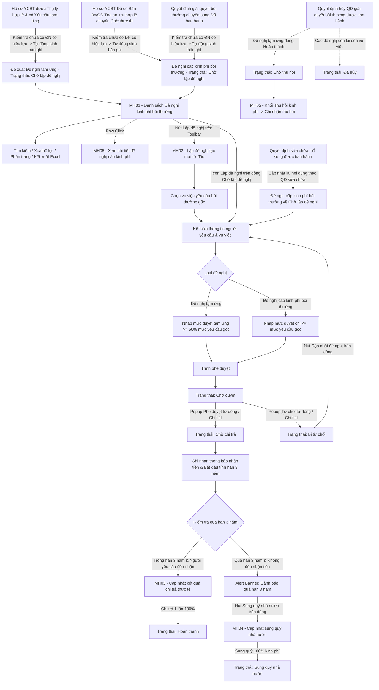

### 4.3.3. Dành cho Cán bộ Công tác bồi thường nhà nước

#### 4.3.3.2. Quản lý kinh phí bồi thường

##### 4.3.3.2.1. Mục đích
Quản lý toàn diện vòng đời của hồ sơ kinh phí bồi thường nhà nước và tạm ứng kinh phí nhằm chuẩn hóa quy trình lập tờ trình, phê duyệt ngân sách, giải ngân chi trả thực tế một lần duy nhất và theo dõi xử lý nghĩa vụ tài chính sau bồi thường, bao gồm:
- Tra cứu và quản lý danh sách đề xuất tạm ứng kinh phí, đề nghị cấp kinh phí bồi thường theo phân trang, hỗ trợ tìm kiếm đa tiêu chí theo mã đề xuất, mã vụ việc, loại đề nghị, trạng thái và khoảng thời gian.
- Thống kê chỉ số kinh phí bồi thường tập trung: Tự động tổng hợp kinh phí đã cấp phát thực tế (Hoàn thành), kinh phí chờ chi trả và kinh phí đã sung quỹ nhà nước.
- Cảnh báo tự động các khoản chi quá hạn 03 năm kể từ ngày người yêu cầu nhận thông báo chi trả mà không đến nhận tiền, kịp thời kích hoạt luồng thủ tục sung quỹ nhà nước theo đúng quy định pháp luật.
- Lập tờ trình đề nghị cấp kinh phí bồi thường hoặc tạm ứng kinh phí mới với cơ chế tự động kế thừa và ánh xạ dữ liệu từ hồ sơ vụ việc yêu cầu bồi thường gốc; tiếp nhận tự động bản ghi "Đề nghị tạm ứng" ở trạng thái `Chờ lập đề nghị` ngay khi hồ sơ yêu cầu bồi thường có yêu cầu tạm ứng kinh phí được xác nhận thụ lý hợp lệ (sau khi hệ thống đã kiểm tra điều kiện trùng lặp đảm bảo vụ việc chưa tồn tại đề nghị có hiệu lực); tiếp nhận tự động bản ghi "Đề nghị cấp kinh phí bồi thường" ở trạng thái `Chờ lập đề nghị` khi hồ sơ Đã có Bản án/Quyết định của Tòa án chuyển sang Chờ thực thi (sau khi hệ thống đã kiểm tra điều kiện trùng lặp đảm bảo vụ việc chưa tồn tại đề nghị cấp kinh phí có hiệu lực); kiểm soát chặt chẽ định mức tạm ứng (tối thiểu 50% mức yêu cầu của từng loại thiệt hại) và hạn mức cấp kinh phí bồi thường (không vượt quá mức yêu cầu bồi thường gốc).
- Tiếp nhận tự động bản ghi "Đề nghị cấp kinh phí bồi thường" ở trạng thái `Chờ lập đề nghị` khi một Quyết định giải quyết bồi thường chuyển sang trạng thái `Đã ban hành` tại Module Quyết định giải quyết bồi thường (sau khi hệ thống đã kiểm tra điều kiện trùng lặp đảm bảo vụ việc chưa tồn tại đề nghị cấp kinh phí có hiệu lực); dữ liệu bản ghi được ánh xạ theo thông tin trên Quyết định đã ban hành.
- Xử lý liên thông khi Quyết định giải quyết bồi thường bị hủy hoặc bị sửa chữa, bổ sung: Tự động chuyển các đề nghị kinh phí liên quan sang trạng thái `Đã hủy` hoặc `Chờ thu hồi`, hoặc đưa về `Chờ lập đề nghị` để lập lại theo nội dung đã điều chỉnh; lưu đầy đủ căn cứ để đối chiếu.
- Ghi nhận thu hồi kinh phí đã tạm ứng đối với các khoản chuyển sang trạng thái `Chờ thu hồi` do Quyết định giải quyết bồi thường bị hủy.
- **Định nghĩa "đề nghị có hiệu lực"** dùng cho toàn bộ quy tắc kiểm tra trùng lặp: gồm các trạng thái `Chờ lập đề nghị`, `Chờ duyệt`, `Chờ chi trả`, `Chờ thu hồi`, `Hoàn thành`, `Sung quỹ nhà nước`. Hai trạng thái `Bị từ chối` và `Đã hủy` KHÔNG còn hiệu lực, do đó vụ việc có đề nghị ở hai trạng thái này vẫn được phép khởi tạo đề nghị mới.
- Xét duyệt tờ trình kinh phí: Cho phép phê duyệt hoặc từ chối cấp phát kinh phí kèm ý kiến chỉ đạo.
- Cập nhật kết quả chi trả thực tế: Thực hiện giải ngân chi trả 1 lần duy nhất toàn bộ 100% số tiền bồi thường được duyệt (qua chuyển khoản ngân hàng hoặc chi tiền mặt) kèm chứng từ giải ngân, hoàn thành dứt điểm hồ sơ kinh phí.
- Ghi nhận thông báo chi trả và theo dõi hạn 03 năm: Trong giai đoạn chờ chi trả, ghi nhận mốc thời gian người yêu cầu nhận thông báo nhận kinh phí kèm văn bản/chứng từ chứng minh để kích hoạt đồng hồ theo dõi hạn 03 năm.
- Lập và hoàn thành thủ tục Sung quỹ nhà nước đối với các khoản kinh phí bồi thường quá hạn 03 năm không có người đến nhận, sung quỹ 100% toàn bộ khoản kinh phí vào ngân sách nhà nước.

a. Phân quyền
Hệ thống phân quyền thao tác theo các quyền nghiệp vụ được cấp:
- **Xem**: Tra cứu danh sách đề xuất kinh phí, xem chi tiết đề nghị kinh phí/tạm ứng (thông qua click dòng dữ liệu), xem thông tin theo dõi hạn 3 năm, xem và tải tài liệu/chứng từ liên quan.
- **Lập đề nghị**: Tạo mới đề xuất tạm ứng kinh phí hoặc đề xuất cấp kinh phí bồi thường từ vụ việc yêu cầu bồi thường gốc; hoặc chủ động hoàn thiện đề nghị từ bản ghi được hệ thống tự động khởi tạo ở trạng thái `Chờ lập đề nghị` (sau khi kiểm tra trùng lặp đảm bảo chưa tồn tại đề nghị có hiệu lực) khi: (1) hồ sơ yêu cầu bồi thường có yêu cầu tạm ứng được xác nhận thụ lý hợp lệ; hoặc (2) hồ sơ Đã có Bản án/Quyết định của Tòa án chuyển sang Chờ thực thi.
- **Chỉnh sửa**: Cập nhật thông tin đề xuất kinh phí ở trạng thái `Bị từ chối`.
- **Phê duyệt**: Xét duyệt chấp thuận cấp phát kinh phí bồi thường/tạm ứng cho tờ trình đề xuất.
- **Từ chối**: Từ chối phê duyệt tờ trình đề xuất cấp kinh phí kèm nội dung lý do chỉ đạo.
- **Cập nhật chi trả**: Ghi nhận kết quả giải ngân chi trả thực tế 1 lần duy nhất toàn bộ 100% kinh phí kèm chứng từ giải ngân.
- **Sung quỹ nhà nước**: Lập hồ sơ và xác nhận hoàn thành thủ tục sung quỹ nhà nước đối với các khoản kinh phí quá hạn 03 năm không có người đến nhận tiền.
- **Xóa**: Xóa đề xuất kinh phí ở trạng thái `Chờ lập đề nghị`.

b. Điều kiện thực hiện
- Người dùng đã đăng nhập vào hệ thống thành công.
- Người dùng được phân quyền truy cập chức năng "Quản lý kinh phí bồi thường".

##### 4.3.3.2.2. Sơ đồ luồng nghiệp vụ theo giao diện

---

##### 4.3.3.2.3. MH01 - Màn hình Danh sách Cấp kinh phí

###### 4.3.3.2.3.1. Màn hình

###### 4.3.3.2.3.2. Mô tả thông tin trên màn hình

| Trường thông tin | Kiểu dữ liệu | Bắt buộc | Mặc định | Mô tả |
| :--- | :--- | :--- | :--- | :--- |
| **Tiêu đề màn hình** | String(200) | Không | `Quản lý kinh phí bồi thường Nhà nước` | Control UI: Thanh tiêu đề trang. - Hiển thị tên màn hình tại vùng tiêu đề trang. |
| **Khối chỉ số ngân sách** | Section | - | - | Control UI: 03 thẻ thống kê đặt phía trên bộ lọc tìm kiếm. |
| Đã cấp phát thực tế | Decimal(18,0) | - | - | Chỉ đọc. Tự động tính tổng số tiền các khoản kinh phí ở trạng thái "Hoàn thành". Định dạng phân cách hàng nghìn bằng dấu chấm (VNĐ). |
| Chờ chi trả | Decimal(18,0) | - | - | Chỉ đọc. Tự động tính tổng số tiền các khoản kinh phí ở trạng thái "Chờ chi trả". Định dạng phân cách hàng nghìn bằng dấu chấm (VNĐ). |
| Sung quỹ nhà nước | Decimal(18,0) | - | - | Chỉ đọc. Tự động tính tổng số tiền các khoản kinh phí ở trạng thái "Sung quỹ nhà nước". Định dạng phân cách hàng nghìn bằng dấu chấm (VNĐ). |
| **Cảnh báo khoản chi quá hạn** | Alert Banner | - | Ẩn | Control UI: Alert Banner. - **Điều kiện hiển thị**: Tự động hiển thị phía trên bảng dữ liệu khi trên hệ thống có ít nhất 01 khoản chi thỏa mãn đồng thời cả 3 điều kiện:   1. Trạng thái đề xuất là `Chờ chi trả`.   2. Đã có thông tin `Ngày người yêu cầu nhận thông báo nhận kinh phí`.   3. Thời điểm hiện tại đã quá hạn 03 năm kể từ ngày nhận thông báo (`Ngày hiện tại > Ngày nhận thông báo + 3 năm`) mà chưa thực hiện chi trả. - **Nội dung thông báo**: *"Có [X] khoản chi quá hạn 03 năm chưa đến nhận tiền với tổng số tiền [Y] VNĐ đủ điều kiện làm thủ tục sung quỹ nhà nước."* kèm nút bấm tác vụ nhanh **"Xem khoản cần xử lý"**. - **Trong đó**:   + **[X]**: Tổng số lượng các khoản chi thỏa mãn đồng thời cả 3 điều kiện nêu trên.   + **[Y]**: Tổng số tiền kinh phí của toàn bộ [X] khoản chi quá hạn nêu trên, định dạng phân cách hàng nghìn bằng dấu chấm (ví dụ: `250.000.000`). |
| **Khối Bộ lọc tìm kiếm** | Section | - | - | Khối tiêu chí tìm kiếm và lọc danh sách đề xuất kinh phí. |
| Mã đề xuất | String(50) | Không | Trống | Cho phép nhập mã đề xuất kinh phí để tìm kiếm gần đúng, không phân biệt hoa thường, tự động trim space. |
| Loại đề nghị | Enum(String(50)) | Không | `Tất cả` | Control UI: Dropdown/Select. Gồm: + Tất cả + Đề nghị tạm ứng + Đề nghị cấp kinh phí bồi thường |
| Mã vụ việc gốc | String(50) | Không | Trống | Cho phép nhập mã vụ việc yêu cầu bồi thường liên kết để tìm kiếm gần đúng, không phân biệt hoa thường, tự động trim space. |
| Trạng thái | Enum(String(50)) | Không | `Tất cả` | Control UI: Dropdown/Select. Gồm: + Tất cả + Chờ lập đề nghị + Chờ duyệt + Chờ chi trả + Hoàn thành + Sung quỹ nhà nước + Bị từ chối + Chờ thu hồi + Đã hủy |
| Người yêu cầu | String(100) | Không | Trống | Cho phép nhập họ tên người yêu cầu bồi thường để tìm kiếm gần đúng. |
| Từ ngày | Date | Không | Ngày đầu tháng | Định dạng `dd/mm/yyyy`. Ô nhập ngày có icon lịch. Mặc định là ngày đầu tháng hiện tại. Tìm kiếm theo ngày đề nghị bắt đầu. Kiểm tra logic khoảng ngày theo [BR-VAL-007]. |
| Đến ngày | Date | Không | Ngày hiện tại | Định dạng `dd/mm/yyyy`. Ô nhập ngày có icon lịch. Mặc định là ngày hiện tại. Tìm kiếm theo ngày đề nghị kết thúc. Kiểm tra logic khoảng ngày theo [BR-VAL-007]. |
| **Bảng danh sách đề xuất kinh phí** | List(Object) | Không | 20 bản ghi/trang | Control UI: Data grid. - Khi người dùng truy cập màn hình, hệ thống tự động tải trang đầu tiên (Trang 1) với số lượng mặc định 20 bản ghi. - Sắp xếp mặc định: Sắp xếp theo "Ngày đề nghị" giảm dần (mới nhất lên đầu). Cho phép click tiêu đề cột Ngày đề nghị để đảo chiều sắp xếp tăng/giảm. - Xem chi tiết: Sử dụng thao tác Click vào dòng dữ liệu (Row click), không bố trí nút Xem chi tiết trên cột Thao tác. - Trạng thái có dữ liệu: Hiển thị danh sách các bản ghi kết quả theo cấu trúc các cột quy định. - Trạng thái không có dữ liệu (Empty State): Khi không tìm thấy kết quả phù hợp, bảng hiển thị duy nhất 01 dòng căn giữa trên toàn bộ chiều rộng bảng (`colspan`), in nghiêng với nội dung theo MessageList dùng chung [MSG-INF-SYS-001]. |
| STT | Integer(10) | - | Tự tăng | Căn giữa, tăng dần theo phân trang. |
| Mã đề xuất | String(50) | - | Theo dữ liệu | Hiển thị mã đề xuất kinh phí (ví dụ: `KP-2026-001`). |
| Loại đề nghị | Enum(String(50)) | - | Theo dữ liệu | Control UI: Badge. Gồm: + Đề nghị tạm ứng + Đề nghị cấp kinh phí bồi thường |
| Mã vụ việc | String(50) | - | Theo dữ liệu | Control UI: Text link (Hyperlink). Cho phép click mở màn hình Chi tiết vụ việc yêu cầu bồi thường liên kết tại module Giải quyết yêu cầu bồi thường. |
| Tên người yêu cầu | String(100) | - | Theo dữ liệu | Hiển thị họ tên người yêu cầu bồi thường. |
| Tư cách người yêu cầu | Enum(String(100)) | - | Theo dữ liệu | Chỉ đọc. Tham chiếu danh mục Tư cách người yêu cầu. |
| Số tiền đề nghị (VNĐ) | Decimal(18,0) | - | Theo dữ liệu | Chỉ đọc. Căn lề phải. Định dạng phân cách hàng nghìn bằng dấu chấm (ví dụ: `150.000.000 VNĐ`). |
| Cán bộ xử lý | String(255) | - | Theo dữ liệu | Hiển thị họ tên cán bộ lập hoặc xử lý đề nghị gần nhất. |
| Ngày đề nghị | Date | - | Theo dữ liệu | Hiển thị ngày lập đề nghị theo định dạng `dd/mm/yyyy`. |
| Hạn nhận / Sung quỹ | String(255) | - | Theo dữ liệu | Hiển thị thông tin hạn nhận kinh phí hoặc tình trạng sung quỹ trực quan theo từng trường hợp hồ sơ: - **Hồ sơ ở trạng thái `Sung quỹ nhà nước`**: Hiển thị 02 dòng gồm:   + Dòng 1: Biểu tượng tòa nhà kèm chữ in đậm màu tím: **Đã sung quỹ**.   + Dòng 2: Hiển thị ngày sung quỹ với tiền tố "Ngày:" theo định dạng `Ngày: dd/mm/yyyy` (ví dụ: *Ngày: 18/07/2026*). - **Hồ sơ ở trạng thái `Hoàn thành`**: Hiển thị 02 dòng gồm:   + Dòng 1: Biểu tượng tích xanh kèm chữ in đậm màu xanh lá: **Đã chi trả đủ**.   + Dòng 2: Hiển thị ngày chi trả thực tế với tiền tố "Ngày:" theo định dạng `Ngày: dd/mm/yyyy` (ví dụ: *Ngày: 05/05/2026*). - **Chưa có thông báo hoặc chưa đến bước chi trả** (hồ sơ ở trạng thái `Chờ lập đề nghị`, `Chờ duyệt`, `Bị từ chối` hoặc chưa nhập ngày nhận thông báo): Hiển thị duy nhất 01 ký tự `-` căn giữa, màu chữ xám nhạt. - **Hồ sơ `Chờ chi trả` - Đã quá hạn 03 năm chưa chi trả (đủ điều kiện sung quỹ)**: Hiển thị 02 dòng gồm:   + Dòng 1: Biểu tượng cảnh báo kèm chữ in đậm màu đỏ: **Quá hạn X ngày** (với X là số ngày đã quá hạn 03 năm tính từ ngày nhận thông báo).   + Dòng 2: Mốc hạn nhận với tiền tố "Hạn nhận:" theo định dạng `Hạn nhận: dd/mm/yyyy`. - **Hồ sơ `Chờ chi trả` - Chưa quá hạn 03 năm**: Hiển thị 02 dòng gồm:   + Dòng 1: Biểu tượng đồng hồ kèm chữ in đậm: **Còn X ngày** (với X là số ngày còn lại đến hạn 03 năm tính từ ngày nhận thông báo).   + Dòng 2: Mốc hạn nhận với tiền tố "Hạn nhận:" theo định dạng `Hạn nhận: dd/mm/yyyy`. |
| Trạng thái | Enum(String(50)) | - | Theo dữ liệu | Control UI: Badge trạng thái|
| Thao tác | Action Buttons | - | Theo trạng thái | Control UI: Action Buttons. - **Hiển thị dạng mờ, không cho phép click đối với thao tác không được phép** tại trạng thái hồ sơ hiện tại. - **Lập đề nghị**: Chỉ hiển thị khi đề nghị ở trạng thái `Chờ lập đề nghị`. - **Cập nhật đề nghị**: Chỉ hiển thị khi đề nghị ở trạng thái `Bị từ chối`. - **Phê duyệt**: Chỉ hiển thị khi đề nghị ở trạng thái `Chờ duyệt`. - **Từ chối**: Chỉ hiển thị khi đề nghị ở trạng thái `Chờ duyệt`. - **Cập nhật chi trả**: Chỉ hiển thị khi đề nghị ở trạng thái `Chờ chi trả` (khi còn trong hạn 03 năm). - **Sung quỹ nhà nước**: Chỉ hiển thị khi đề nghị ở trạng thái `Chờ chi trả` ĐỒNG THỜI đã quá hạn 03 năm tính từ ngày nhận thông báo mà chưa chi trả. - **Xóa**: Chỉ hiển thị khi đề nghị ở trạng thái `Chờ lập đề nghị`. |

###### 4.3.3.2.3.3. Chức năng trên màn hình

| STT | Tên chức năng | Định dạng | Mô tả |
| :--- | :--- | :--- | :--- |
| 1 | Xóa bộ lọc | Button | Xóa toàn bộ điều kiện tìm kiếm/lọc đã nhập, đưa các trường nhập về giá trị mặc định (`Từ ngày` là ngày đầu tháng hiện tại, `Đến ngày` là ngày hiện tại) và tải lại danh sách ở Trang 1. |
| 2 | Tìm kiếm | Button | Khi người dùng click nút, hệ thống kiểm tra điều kiện dữ liệu và thực hiện tìm kiếm: - **TH1 - Khoảng ngày không hợp lệ**: Nếu `Từ ngày` lớn hơn `Đến ngày`, vi phạm [BR-VAL-007], hệ thống hiển thị cảnh báo lỗi [MSG-ERR-VAL-007] và không thực hiện tìm kiếm. - **TH Hợp lệ**: Hệ thống lọc và hiển thị danh sách các bản ghi thỏa mãn đồng thời các tiêu chí tìm kiếm/lọc đã chọn, đưa kết quả về Trang 1. - **TH Không có dữ liệu trả về**: Bảng kết quả hiển thị duy nhất 01 dòng căn giữa trên toàn bộ chiều rộng bảng, in nghiêng với nội dung theo MessageList dùng chung [MSG-INF-SYS-001]; thanh phân trang hiển thị *"Hiển thị 0-0 của 0 bản ghi"*, các nút điều hướng trang ở trạng thái khóa mờ; nút "Kết xuất Excel" ở trạng thái khóa mờ kèm tooltip *"Không có dữ liệu để kết xuất Excel"*. |
| 3 | Xem khoản cần xử lý | Button trên Alert Banner | Khi người dùng click nút "Xem khoản cần xử lý" trên Alert Banner, hệ thống xử lý theo 02 trường hợp: - **TH Có dữ liệu phù hợp**: Hệ thống tự động thiết lập bộ lọc hiển thị danh sách các bản ghi thỏa mãn đồng thời: Trạng thái là `Chờ chi trả` và đã quá hạn 03 năm kể từ ngày nhận thông báo chưa được chi trả để người dùng kịp thời thực hiện thủ tục Sung quỹ nhà nước. - **TH Không có dữ liệu trả về**: Bảng kết quả hiển thị duy nhất 01 dòng căn giữa trên toàn bộ chiều rộng bảng, in nghiêng với nội dung theo MessageList dùng chung [MSG-INF-SYS-001]; thanh phân trang hiển thị *"Hiển thị 0-0 của 0 bản ghi"*, các nút điều hướng trang ở trạng thái khóa mờ; nút "Kết xuất Excel" ở trạng thái khóa mờ kèm tooltip *"Không có dữ liệu để kết xuất Excel"*. |
| 4 | Lập đề nghị | Button (Toolbar) | Khi người dùng click vào nút "Lập đề nghị" trên thanh công cụ phía trên bảng danh sách. - Hệ thống mở màn hình **MH02 - Màn hình Lập/Cập nhật đề nghị cấp kinh phí** ở chế độ tạo mới từ đầu. - Trên form hiển thị trường `Mã vụ việc gốc` kèm nút `Tìm kiếm` và liên kết `Tìm kiếm nâng cao` để người dùng thực hiện tìm kiếm, lựa chọn vụ việc yêu cầu bồi thường gốc. |
| 5 | Kết xuất Excel | Button | Kết xuất danh sách đề xuất kinh phí bồi thường ra file Excel theo đúng điều kiện tìm kiếm/lọc hiện hành theo quy chuẩn [BR-EXP-040]. |
| 6 | Click dòng dữ liệu (Row click) | Row click | Mở màn hình **MH05 - Màn hình Xem chi tiết đề nghị cấp kinh phí** tương ứng với bản ghi được chọn ở chế độ chỉ đọc. - Nếu click vào icon thao tác hoặc liên kết `Mã vụ việc`, hệ thống thực hiện chức năng riêng của icon/liên kết đó và không kích hoạt Row click. |
| 7 | Mã vụ việc | Link | Điều hướng sang màn hình Chi tiết vụ việc yêu cầu bồi thường liên kết trong Module Giải quyết yêu cầu bồi thường. |
| 8 | Lập đề nghị | Icon button (Dòng) | Mở màn hình **MH02 - Màn hình Lập/Cập nhật đề nghị cấp kinh phí**, tự động nạp sẵn mã vụ việc gốc, thông tin người yêu cầu bồi thường và các khoản thiệt hại / số tiền bồi thường từ chính bản ghi `Chờ lập đề nghị` (được hệ thống tự động khởi tạo sau khi kiểm tra điều kiện trùng lặp khi hồ sơ YCBT có yêu cầu tạm ứng được xác nhận thụ lý, hoặc khi hồ sơ Đã có Bản án/Quyết định của Tòa án chuyển sang Chờ thực thi), ẩn nút Tìm kiếm và khóa chỉ đọc trường `Mã vụ việc gốc` để Cán bộ thụ lý/giải quyết chủ động hoàn thiện tờ trình. |
| 9 | Cập nhật đề nghị | Icon button (Dòng) | Mở màn hình **MH02 - Màn hình Lập/Cập nhật đề nghị cấp kinh phí** ở chế độ cập nhật, nạp lại toàn bộ dữ liệu đã lưu và tự động hiển thị **Khối Lý do bị từ chối / Ý kiến chỉ đạo** ở phía trên form để chỉnh sửa lại dữ liệu. |
| 10 | Phê duyệt | Icon button (Dòng) | Mở Custom Confirmation Modal xác nhận phê duyệt cấp kinh phí với các thông tin chi tiết: - **Tiêu đề popup**: *"Xác nhận phê duyệt cấp kinh phí bồi thường"*. - **Thông tin hiển thị đối chiếu trên popup**: Mã đề xuất (`[Mã đề xuất]`), Người yêu cầu (`[Tên người yêu cầu]`), Loại đề nghị (`[Loại đề nghị]`), Số tiền duyệt cấp (**`[Số tiền duyệt cấp] VNĐ`**, kèm số tiền viết bằng chữ). - **Ô nhập dữ liệu**: `Ý kiến phê duyệt` (Control UI: Textarea, tối đa 2000 ký tự, không bắt buộc). - **Khi người dùng bấm "Phê duyệt"**: Hệ thống đóng popup modal, chuyển trạng thái đề xuất sang `Chờ chi trả`, lưu ý kiến phê duyệt và lịch sử xét duyệt vào hệ thống, hiển thị thông báo thành công [MSG-SUC-BTNN-KP-001] (*"Phê duyệt cấp kinh phí bồi thường thành công!"*) và làm mới danh sách tại MH01. - **Khi người dùng bấm "Hủy bỏ"**: Đóng popup modal và giữ nguyên trạng thái hồ sơ. |
| 11 | Từ chối | Icon button (Dòng) | Mở Custom Modal từ chối phê duyệt tờ trình với các thông tin chi tiết: - **Tiêu đề popup**: *"Từ chối phê duyệt cấp kinh phí bồi thường"*. - **Thông tin hiển thị đối chiếu trên popup**: Mã đề xuất (`[Mã đề xuất]`), Người yêu cầu (`[Tên người yêu cầu]`), Loại đề nghị (`[Loại đề nghị]`), Số tiền đề nghị (**`[Số tiền đề nghị] VNĐ`**). - **Ô nhập dữ liệu**: `Lý do từ chối / Ý kiến chỉ đạo` (Control UI: Textarea, tối đa 2000 ký tự, bắt buộc nhập). - **Kiểm tra dữ liệu**: Nếu bỏ trống ô lý do từ chối, vi phạm [BR-VAL-001], tô đỏ viền ô trống `.is-invalid`, hiển thị cảnh báo đỏ *"Đây là trường bắt buộc"* ngay dưới ô nhập và auto-focus con trỏ. Không thực hiện từ chối. - **Khi người dùng bấm "Xác nhận từ chối"**: Hệ thống đóng popup modal, chuyển trạng thái đề xuất sang `Bị từ chối`, lưu nội dung lý do từ chối vào hệ thống (để hiển thị tại Khối Lý do bị từ chối khi Cán bộ cập nhật lại tờ trình), hiển thị thông báo thành công [MSG-SUC-BTNN-KP-002] (*"Đã từ chối phê duyệt tờ trình cấp kinh phí!"*) và làm mới danh sách tại MH01. - **Khi người dùng bấm "Hủy bỏ"**: Đóng popup modal và giữ nguyên trạng thái hồ sơ. |
| 12 | Cập nhật chi trả | Icon button (Dòng) | Mở màn hình **MH03 - Màn hình Cập nhật kết quả chi trả thực tế**, tự động cuộn và focus tới **Khối Thông tin Kết quả chi trả thực tế** ở chế độ nhập liệu để ghi nhận giải ngân 1 lần toàn bộ 100% kinh phí bồi thường. |
| 13 | Sung quỹ nhà nước | Icon button (Dòng) | Mở màn hình **MH04 - Màn hình Cập nhật sung quỹ nhà nước**, tự động cuộn và focus tới **Khối Thông tin sung quỹ Nhà nước** ở chế độ nhập liệu để thực hiện thủ tục nộp tiền vào ngân sách nhà nước. |
| 14 | Xóa | Icon button (Dòng) | Mở Custom Confirmation Modal với nội dung [MSG-CFM-SYS-001]. - Khi người dùng chọn "Đồng ý": Hệ thống thực hiện xóa bản ghi đề xuất lưu nháp khỏi danh sách, cập nhật lại khối chỉ số ngân sách và hiển thị thông báo thành công [MSG-SUC-SYS-004]. - Khi người dùng chọn "Hủy bỏ": Đóng modal và giữ nguyên dữ liệu. |

---

##### 4.3.3.2.4. MH02 - Màn hình Lập/Cập nhật đề nghị cấp kinh phí

###### 4.3.3.2.4.1. Màn hình

###### 4.3.3.2.4.2. Mô tả thông tin trên màn hình

| Trường thông tin | Kiểu dữ liệu | Bắt buộc | Mặc định | Mô tả |
| :--- | :--- | :--- | :--- | :--- |
| **Tiêu đề form** | String(200) | Không | Theo ngữ cảnh | Hiển thị động theo chế độ: - Khi tạo mới: `LẬP ĐỀ NGHỊ CẤP KINH PHÍ BỒI THƯỜNG / TẠM ỨNG MỚI`. - Khi cập nhật bị từ chối: `CẬP NHẬT ĐỀ NGHỊ CẤP KINH PHÍ BỒI THƯỜNG / TẠM ỨNG`. |
| **Khối Lý do bị từ chối** | Section | - | Ẩn | Khối thông báo đặt ở phía trên cùng của form; chỉ hiển thị khi mở màn hình đối với đề xuất ở trạng thái `Bị từ chối`. Bao gồm các trường thông tin chỉ đọc dưới đây: |
| Ngày từ chối | Date | Không | Theo dữ liệu | Chỉ đọc. Định dạng `dd/mm/yyyy`. Hiển thị ngày cấp có thẩm quyền thực hiện từ chối phê duyệt tờ trình. |
| Người từ chối | String(100) | Không | Theo dữ liệu | Chỉ đọc. Hiển thị họ và tên người đã thực hiện từ chối phê duyệt tờ trình. |
| Nội dung ý kiến chỉ đạo / Lý do từ chối | Text(2000) | Không | Theo dữ liệu | Chỉ đọc. Hiển thị chi tiết nội dung lý do từ chối và ý kiến chỉ đạo điều chỉnh của cấp phê duyệt. |
| **Khối Thông tin chung tờ trình** | Section | - | - | Khối thông tin liên kết và hành chính đề xuất. |
| Mã đề xuất kinh phí | String(50) | Có | Hệ thống tự sinh | *Hệ thống tự sinh.* Định dạng `KP-YYYY-XXX` (YYYY: Năm hiện tại, XXX: Số tăng dần). Khóa chỉ đọc. |
| Ngày lập đề nghị | Date | Có | Ngày hiện tại | *Hệ thống tự sinh.* Định dạng `dd/mm/yyyy`. Khóa chỉ đọc. - Với bản ghi tự động khởi tạo từ Quyết định giải quyết bồi thường: lấy Ngày ban hành Quyết định. - Với bản ghi tự động khởi tạo từ yêu cầu tạm ứng: lấy Ngày xác nhận thụ lý hồ sơ. |
| Cán bộ đề xuất xử lý | String(255) | Có | Tên tài khoản | *Cán bộ nhập.* Gán theo tài khoản người mở form lập đề nghị; không gán tại thời điểm hệ thống tự động khởi tạo bản ghi. Tên cán bộ đang đăng nhập hệ thống. Khóa chỉ đọc. |
| Loại đề nghị | Enum(String(50)) | Có | `Đề nghị tạm ứng` | Control UI: Radio button. Gồm: + Đề nghị tạm ứng + Đề nghị cấp kinh phí bồi thường - Khi thay đổi loại đề nghị, hệ thống tự động chuyển đổi bảng phân rã nội dung tương ứng (Khối Bảng tạm ứng hoặc Khối Bảng cấp kinh phí bồi thường). - Nếu form đã chọn sẵn Mã vụ việc gốc: Hệ thống tự động kiểm tra lại tính tương thích của vụ việc với Loại đề nghị mới. Nếu vụ việc không thỏa mãn điều kiện (vi phạm trạng thái hoặc đã tồn tại Đề nghị cấp kinh phí bồi thường), hệ thống hiển thị popup cảnh báo và tự động xóa trắng thông tin vụ việc đã chọn để người dùng chọn lại (chi tiết tại STT 3 bảng Chức năng). |
| Cơ quan cấp phát kinh phí | Enum(String(255)) | Có | Trống | *Cán bộ nhập.* Để trống tại thời điểm khởi tạo bản ghi. Control UI: Combobox có tìm kiếm. Gồm: + [Mã đơn vị] - [Tên đơn vị] (lấy theo danh mục đơn vị [DM_DON_VI]) Người dùng chọn cơ quan tài chính có thẩm quyền cấp phát kinh phí. |
| Mã vụ việc gốc | String(50) | Có | Trống / Theo bản ghi chọn | Control UI: Input text kết hợp Text link xem chi tiết. - **Khi lập đề nghị từ Toolbar ngoài lưới**: Hiển thị ô nhập kèm nút `Tìm kiếm` và liên kết `Tìm kiếm nâng cao`. Popup được mở khác nhau theo `Loại đề nghị`:   + `Đề nghị tạm ứng`: Mở [Popup chuẩn Tìm kiếm vụ việc/hồ sơ gốc liên quan](SRS_BTNN_GiaiQuyetBT_GiaiQuyet_YCBT.md#433110-popup-chuẩn-tìm-kiếm-vụ-việchồ-sơ-gốc-liên-quan) (Nguồn 4: Phân hệ Cấp kinh phí bồi thường)    + `Đề nghị cấp kinh phí bồi thường`: Mở [Popup Tìm kiếm Quyết định giải quyết bồi thường](#popup-tim-kiem-quyet-dinh-gqbt), tìm trên danh sách Quyết định ở trạng thái `Đã ban hành`. - Sau khi chọn trên Popup, hệ thống tự động điền mã vụ việc và kế thừa dữ liệu theo đúng nguồn của từng loại đề nghị. - **Khi lập từ icon dòng hoặc Cập nhật đề nghị**: Tự động hiển thị mã vụ việc ở chế độ Chỉ đọc, ẩn nút `Tìm kiếm` và `Tìm kiếm nâng cao`. |
| Số Quyết định làm căn cứ | String(50) | Có khi `Loại đề nghị` là `Đề nghị cấp kinh phí bồi thường` | Theo Quyết định được chọn | Control UI: Text link. - Chỉ đọc. Hiển thị Số quyết định của Quyết định giải quyết bồi thường làm căn cứ lập đề nghị. - Khi người dùng click, hệ thống mở màn hình Chi tiết Quyết định giải quyết bồi thường tương ứng ở chế độ chỉ xem. - **Ẩn hoàn toàn khi `Loại đề nghị` là `Đề nghị tạm ứng`* |
| Ngày Quyết định làm căn cứ | Date | Có khi `Loại đề nghị` là `Đề nghị cấp kinh phí bồi thường` | Theo Quyết định được chọn | Control UI: Text. - Chỉ đọc. Hiển thị Ngày quyết định của Quyết định giải quyết bồi thường làm căn cứ lập đề nghị. - Định dạng `dd/mm/yyyy`. - **Ẩn hoàn toàn khi `Loại đề nghị` là `Đề nghị tạm ứng`**. |
| Tên vụ việc | String(255) | Không | Theo vụ việc / Quyết định | Chỉ đọc. Hiển thị tên vụ việc yêu cầu bồi thường liên kết. |
| **Khối Chi tiết thông tin người yêu cầu bồi thường** | Section | - | - | Control UI: 02 khối thẻ hiển thị song song, tự động kế thừa từ hồ sơ vụ việc gốc (đối với Đề nghị tạm ứng) hoặc từ Quyết định giải quyết bồi thường đã ban hành (đối với Đề nghị cấp kinh phí bồi thường) ở chế độ Chỉ đọc. |
| Họ và tên người yêu cầu bồi thường | String(255) | Có | Pre-fill theo nguồn | Chỉ đọc. Với `Đề nghị cấp kinh phí bồi thường`: lấy theo Quyết định giải quyết bồi thường đã ban hành. Với `Đề nghị tạm ứng`: lấy theo thông tin hồ sơ vụ việc. |
| Tỉnh/Thành phố | Enum(String(100)) | Có | Pre-fill theo nguồn | Chỉ đọc. Với `Đề nghị cấp kinh phí bồi thường`: lấy theo Quyết định giải quyết bồi thường đã ban hành. Với `Đề nghị tạm ứng`: lấy theo thông tin hồ sơ vụ việc. |
| Phường/Xã | Enum(String(100)) | Có | Pre-fill theo nguồn | Chỉ đọc. Với `Đề nghị cấp kinh phí bồi thường`: lấy theo Quyết định giải quyết bồi thường đã ban hành. Với `Đề nghị tạm ứng`: lấy theo thông tin hồ sơ vụ việc. |
| Địa chỉ chi tiết | Text(1000) | Có | Pre-fill theo nguồn | Chỉ đọc. Với `Đề nghị cấp kinh phí bồi thường`: lấy theo Quyết định giải quyết bồi thường đã ban hành. Với `Đề nghị tạm ứng`: lấy theo thông tin hồ sơ vụ việc. |
| **Khối Bảng nội dung đề xuất cấp tạm ứng** | Section | - | - | Chỉ hiển thị khi `Loại đề nghị` là "Đề nghị tạm ứng". |
| STT | Integer(10) | - | Tự tăng | Chỉ đọc. Số thứ tự dòng. |
| Nội dung tạm ứng | Enum(String(255)) | - | Theo hồ sơ gốc | Control UI: Label.Chỉ đọc. Hiển thị loại thiệt hại có yêu cầu bồi thường trong hồ sơ gốc liên kết. |
| Mức đề nghị trong hồ sơ gốc (VNĐ) | Decimal(18,0) | - | Theo hồ sơ gốc | Control UI: Label.Chỉ đọc. Căn lề phải. Định dạng phân cách hàng nghìn bằng dấu chấm (VNĐ). |
| Số tiền duyệt cấp tạm ứng (VNĐ) | Decimal(18,0) | Có | Trống | Control UI: Label. Chỉ đọc . Căn lề phải. Định dạng phân cách hàng nghìn bằng dấu chấm (VNĐ). Quy tắc: Mức duyệt tạm ứng phải đạt tối thiểu 50% mức yêu cầu trong hồ sơ gốc. |
| Tổng cộng tạm ứng | Decimal(18,0) | - | Hệ thống tính | Chỉ đọc. Căn lề phải. Định dạng phân cách hàng nghìn bằng dấu chấm (VNĐ). Tự động tính tổng tiền tạm ứng và hiển thị số tiền bằng chữ ngay phía dưới. |
| **Khối Bảng nội dung đề xuất cấp kinh phí bồi thường** | Section | - | - | Chỉ hiển thị khi `Loại đề nghị` là "Đề nghị cấp kinh phí bồi thường". |
| STT | Integer(10) | - | Tự tăng | Chỉ đọc. Số thứ tự dòng. |
| Loại thiệt hại được yêu cầu | Enum(String(255)) | - | Theo QĐ | Control UI: Label   Chỉ đọc. Hiển thị các loại thiệt hại theo Quyết định giải quyết bồi thường.   Lưu ý chỉ hiển thị các loại thiệt lại có số tiền bồi thường > 0|
| Mức đề nghị trong hồ sơ gốc (VNĐ) | Decimal(18,0) | - | Theo QĐ | Control UI: Label   Chỉ đọc. Căn lề phải. Định dạng phân cách hàng nghìn bằng dấu chấm (VNĐ). Lấy theo thông tin trong quyết định đã ban hành|
| Số tiền duyệt cấp bồi thường (VNĐ) | Decimal(18,0) | - | Theo QĐ | Control UI: Label.  Căn lề phải. Định dạng phân cách hàng nghìn bằng dấu chấm (VNĐ).   |
| Tổng kinh phí duyệt cấp | Decimal(18,0) | - | Hệ thống tính | Control UI: Label   Chỉ đọc. Căn lề phải. Định dạng phân cách hàng nghìn bằng dấu chấm (VNĐ). Tự động tính tổng tiền duyệt cấp và hiển thị bằng chữ. |
| Số tiền bồi thường đã tạm ứng | Decimal(18,0) | - | Theo hồ sơ gốc | Control UI: Label. Chỉ đọc. Căn lề phải. Định dạng phân cách hàng nghìn bằng dấu chấm (VNĐ). Lấy theo thông tin Quyết định giải quyết bồi thường|
| Số tiền thực nhận còn lại | Decimal(18,0) | - | Hệ thống tính | Control UI: Label. Chỉ đọc. Căn lề phải. Định dạng phân cách hàng nghìn bằng dấu chấm (VNĐ). Bằng Tổng kinh phí duyệt cấp trừ đi Số tiền tạm ứng đã cấp. Đây là số tiền sẽ được giải ngân chi trả 1 lần duy nhất. |
| **Khối Người nhận bồi thường và Phương thức chi trả** | Section | - | - | Khối thông tin thụ hưởng và chi trả. |
| Họ và tên người nhận | String(100) | Có | Theo QĐ | Control UI: InputText . Lấy theo thông tin trong Quyết định đã ban hành, cho phép chỉnh sửa. |
| Số giấy tờ thân nhân | String(50) | Có | Theo QĐ| Chỉ đọc. - Với `Đề nghị cấp kinh phí bồi thường`: lấy theo Quyết định giải quyết bồi thường đã ban hành. Với `Đề nghị tạm ứng`: lấy theo thông tin hồ sơ vụ việc. - Dùng để đối chiếu, xác minh danh tính người nhận tiền tại thời điểm chi trả. |
| Địa chỉ | String(500) | Có | Pre-fill từ hồ sơ | Chỉ đọc. Hiển thị địa chỉ liên lạc của người nhận tiền. |
| Phương thức chi trả tiền bồi thường | Enum(String(100)) | Có | Pre-fill từ hồ sơ | Control UI: Radio button. Gồm: + Chi trả trực tiếp bằng tiền mặt + Chi trả qua chuyển khoản |
| Chủ tài khoản | String(255) | Có tùy điều kiện | Pre-fill | Chỉ hiển thị khi Phương thức chi trả tiền bồi thường là "Chi trả qua chuyển khoản". Chủ tài khoản thụ hưởng nhận tiền bồi thường. |
| Số tài khoản | String(50) | Có tùy điều kiện | Pre-fill | Chỉ hiển thị khi Phương thức chi trả tiền bồi thường là "Chi trả qua chuyển khoản". Số tài khoản ngân hàng của người thụ hưởng. |
| Tên ngân hàng | String(255) | Có tùy điều kiện | Pre-fill | Chỉ hiển thị khi Phương thức chi trả tiền bồi thường là "Chi trả qua chuyển khoản". Tên ngân hàng thụ hưởng nhận tiền. |
| Chi nhánh | String(255) | Có tùy điều kiện | Pre-fill | Chỉ hiển thị khi Phương thức chi trả tiền bồi thường là "Chi trả qua chuyển khoản". Tên chi nhánh ngân hàng thụ hưởng. |
| **Khối Nội dung tờ trình và Tài liệu gửi kèm** | Section | - | - | Khối thông tin nội dung tờ trình và hồ sơ tài liệu gửi kèm. |
| Ý kiến đề xuất / Trích yếu nội dung tờ trình | Text(2000) | Có | Trống | Control UI: Textarea. Nhập nội dung tờ trình tóm tắt căn cứ cấp phát kinh phí bồi thường. Tối đa 2000 ký tự. |
| Bảng danh mục tài liệu gửi kèm | List(Object) | Không | Danh mục tài liệu theo loại đề nghị | Control UI: Data grid. Bao gồm nút **`+ Thêm tài liệu`** cho phép bổ sung thêm dòng tài liệu ngoài danh mục mặc định. |
| STT | Integer(10) | - | Tự tăng | Căn giữa. |
| Tên tài liệu | String(255) | Có khi thêm dòng | Theo danh mục / Trống | Tên tài liệu theo danh mục hoặc ô nhập text cho phép nhập tên tài liệu bổ sung. |
| File đính kèm | File | - | Theo dữ liệu | Hiển thị tên file đã tải lên (.pdf tối đa 20MB) kèm dung lượng hoặc trạng thái chưa có file. |
| Thao tác | String(255) | - | Theo dữ liệu | Gồm các nút: `Tải lên`, liên kết `Xem file` (mở tab mới), `Xóa` (kèm Custom Modal xác nhận). |

###### 4.3.3.2.4.3. Chức năng trên màn hình

| STT | Tên chức năng | Định dạng | Mô tả |
| :--- | :--- | :--- | :--- |
| 1 | Tìm kiếm (tại trường Mã vụ việc gốc) | Button | - **TH1 - Chưa nhập dữ liệu tại ô tìm kiếm**: Vi phạm quy tắc [BR-VAL-001], hệ thống hiển thị Custom Modal cảnh báo [MSG-ERR-VAL-001] (*"Vui lòng nhập ít nhất một tiêu chí tìm kiếm!"*) và không mở popup. - **TH2 - Có nhập dữ liệu**: Hệ thống mở popup tìm kiếm tương ứng với `Loại đề nghị` đang chọn: + `Đề nghị tạm ứng`: Mở [Popup chuẩn Tìm kiếm vụ việc/hồ sơ gốc liên quan](SRS_BTNN_GiaiQuyetBT_GiaiQuyet_YCBT.md#433110-popup-chuẩn-tìm-kiếm-vụ-việchồ-sơ-gốc-liên-quan) (Nguồn 4: Phân hệ Cấp kinh phí bồi thường). + `Đề nghị cấp kinh phí bồi thường`: Mở [Popup Tìm kiếm Quyết định giải quyết bồi thường](#popup-tim-kiem-quyet-dinh-gqbt). + Hệ thống tự động điền giá trị đang nhập vào trường tìm kiếm tương ứng trên Popup và kích hoạt tìm kiếm theo đúng cấu hình lọc và loại trừ của `Loại đề nghị` đang chọn. - **Khi chọn vụ việc trên Popup**: Hệ thống tự động điền mã vụ việc vào form chính, đồng thời kế thừa toàn bộ thông tin tại Khối Chi tiết thông tin người yêu cầu bồi thường và nạp mức đề nghị gốc vào bảng phân rã kinh phí tương ứng. |
| 2 | Tìm kiếm nâng cao (tại trường Mã vụ việc gốc) | Button | - Hệ thống mở popup tìm kiếm tương ứng với `Loại đề nghị` đang chọn ở chế độ mở rộng đầy đủ các tiêu chí lọc: + `Đề nghị tạm ứng`: Mở [Popup chuẩn Tìm kiếm vụ việc/hồ sơ gốc liên quan](SRS_BTNN_GiaiQuyetBT_GiaiQuyet_YCBT.md#433110-popup-chuẩn-tìm-kiếm-vụ-việchồ-sơ-gốc-liên-quan) (Nguồn 4: Phân hệ Cấp kinh phí bồi thường). + `Đề nghị cấp kinh phí bồi thường`: Mở [Popup Tìm kiếm Quyết định giải quyết bồi thường](#popup-tim-kiem-quyet-dinh-gqbt). - Tự động kế thừa giá trị mã vụ việc đang nhập ở form chính (nếu có). - Cho phép Cán bộ nhập thêm các tiêu chí lọc và bấm nút `Tìm kiếm` trên Popup; việc lọc và loại trừ dữ liệu tuân thủ theo đúng cấu hình Nguồn 4 trên Popup chuẩn. - Khi người dùng chọn vụ việc trên Popup: Hệ thống tự động điền mã vụ việc vào form chính, đồng thời kế thừa toàn bộ thông tin người yêu cầu và nạp mức đề nghị gốc vào bảng phân rã kinh phí. |
| 3 | Thay đổi Loại đề nghị (Radio button onChange) | Radio button | Khi Cán bộ thay đổi lựa chọn giữa `Đề nghị tạm ứng` và `Đề nghị cấp kinh phí bồi thường`: - Nếu chưa chọn Mã vụ việc gốc: Hệ thống chuyển đổi hiển thị bảng phân rã nội dung tương ứng (Khối Bảng tạm ứng hoặc Khối Bảng cấp kinh phí bồi thường). - Nếu đã chọn Mã vụ việc gốc trước đó: Hệ thống tự động kiểm tra lại tính tương thích của vụ việc với loại đề nghị mới:   + **TH1 - Chuyển sang "Đề nghị tạm ứng" nhưng không thỏa mãn điều kiện**: Nếu vụ việc đã chọn có trạng thái không thuộc giai đoạn tạm ứng (ví dụ vụ việc ở trạng thái `Chờ thực thi`) HOẶC vụ việc đó đã tồn tại Đề nghị cấp kinh phí bồi thường trên hệ thống: Hệ thống mở Custom Modal cảnh báo [MSG-WRN-BTNN-KP-001] (*"Vụ việc đã chọn không thỏa mãn điều kiện lập Đề nghị tạm ứng (do trạng thái không hợp lệ hoặc đã tồn tại Đề nghị cấp kinh phí bồi thường). Thông tin vụ việc đã chọn sẽ được xóa để bạn chọn lại!"*), đồng thời tự động xóa trắng thông tin vụ việc đã chọn và các dữ liệu kế thừa liên quan trên form.   + **TH2 - Chuyển sang "Đề nghị cấp kinh phí bồi thường" nhưng không thỏa mãn điều kiện**: Nếu vụ việc đã chọn chưa có Quyết định giải quyết bồi thường có hiệu lực (trạng thái chưa đạt `Chờ thực thi`) HOẶC vụ việc đã tồn tại Đề nghị cấp kinh phí bồi thường: Hệ thống mở Custom Modal cảnh báo [MSG-WRN-BTNN-KP-002] (*"Vụ việc đã chọn chưa có Quyết định giải quyết bồi thường (trạng thái chưa đạt 'Chờ thực thi') hoặc đã tồn tại Đề nghị cấp kinh phí bồi thường. Thông tin vụ việc đã chọn sẽ được xóa để bạn chọn lại!"*), đồng thời tự động xóa trắng thông tin vụ việc đã chọn và các dữ liệu kế thừa liên quan trên form.   + **TH3 - Hợp lệ**: Giữ nguyên thông tin vụ việc đã chọn và chuyển đổi hiển thị bảng phân rã kinh phí tương ứng. |
| 4 | Liên kết Mã vụ việc gốc | Link | Mở màn hình [MH05 - Màn hình Xem chi tiết hồ sơ yêu cầu bồi thường](SRS_BTNN_GiaiQuyetBT_GiaiQuyet_YCBT.md#43317-mh05---màn-hình-xem-chi-tiết-hồ-sơ-yêu-cầu-bồi-thường) (thuộc Module Giải quyết yêu cầu bồi thường) trong một tab trình duyệt mới ở chế độ Chỉ xem. |
| 5 | + Thêm tài liệu | Button | Chèn thêm 01 dòng trống vào cuối bảng danh mục tài liệu gửi kèm. |
| 6 | Tải lên | Button (Dòng tài liệu) | Khi người dùng click nút "Tải lên" tại dòng tài liệu, hệ thống mở hộp thoại chọn tệp tin từ thiết bị và thực hiện kiểm tra: - **TH1 - Sai định dạng file**: Nếu tệp tin không đúng định dạng `.pdf`, vi phạm quy chuẩn [BR-FILE-010], hệ thống hiển thị thông báo lỗi [MSG-ERR-FILE-001] và không tiếp nhận tệp. - **TH2 - File quá dung lượng**: Nếu dung lượng tệp tin vượt quá 20MB, vi phạm quy chuẩn [BR-FILE-010], hệ thống hiển thị thông báo lỗi [MSG-ERR-FILE-002] và không tiếp nhận tệp. - **TH3 - Hợp lệ**: Hệ thống tải tệp tin lên thành công, cập nhật cột `File đính kèm` hiển thị tên tệp tin kèm dung lượng, kích hoạt liên kết `Xem file` và nút `Xóa` tại cột Thao tác, đồng thời hiển thị thông báo thành công [MSG-SUC-BTNN-KP-008]. |
| 7 | Xem file | Link (Dòng tài liệu) | Mở xem nội dung tệp tin đính kèm tại tab trình duyệt mới. |
| 8 | Xóa (tại dòng tài liệu) | Icon/Button | Mở Custom Confirmation Modal xác nhận trước khi gỡ file hoặc xóa dòng tài liệu tự bổ sung. |
| 9 | Trình phê duyệt | Button (Footer) | Hệ thống kiểm tra tính hợp lệ của dữ liệu trước khi lưu: - **TH1 - Bỏ trống trường bắt buộc hoặc thiếu tài liệu đính kèm**: Vi phạm quy tắc [BR-VAL-001] hoặc [BR-FILE-010], tô viền đỏ `.is-invalid` ô trống đầu tiên, hiển thị thông báo lỗi "Đây là trường bắt buộc" ngay dưới ô nhập và tự động focus con trỏ vào ô lỗi đó. Không lưu dữ liệu. - **TH2 - Trùng lặp Đề nghị cấp kinh phí bồi thường khi lập Đề nghị tạm ứng**: Nếu `Loại đề nghị` là "Đề nghị tạm ứng" mà vụ việc liên kết đã tồn tại Đề nghị cấp kinh phí bồi thường trên hệ thống ở các trạng thái có hiệu lực (`Chờ lập đề nghị`, `Chờ duyệt`, `Chờ chi trả`, `Chờ thu hồi`, `Hoàn thành`, `Sung quỹ nhà nước`), vi phạm quy tắc [BR-KP-DUP-002], hệ thống chặn lưu, mở Custom Modal cảnh báo lỗi [MSG-ERR-BTNN-KP-009] (*"Vụ việc đã tồn tại Đề nghị cấp kinh phí bồi thường. Không được phép lập mới Đề nghị tạm ứng kinh phí!"*) và giữ nguyên form. - **TH3 - Trùng lặp đề nghị cùng loại đã tồn tại**: Nếu vụ việc liên kết đã tồn tại đề nghị cùng loại (`Đề nghị tạm ứng` hoặc `Đề nghị cấp kinh phí bồi thường`) đang trong vòng đời xử lý có hiệu lực (ở các trạng thái: `Chờ lập đề nghị`, `Chờ duyệt`, `Chờ chi trả`, `Chờ thu hồi`, `Hoàn thành` hoặc `Sung quỹ nhà nước`), vi phạm quy tắc [BR-KP-DUP-001], hệ thống chặn lưu, mở Custom Modal cảnh báo lỗi [MSG-ERR-BTNN-KP-010] (*"Vụ việc đã tồn tại đề nghị cấp kinh phí/tạm ứng đang được xử lý. Không được phép tạo trùng lặp!"*) và giữ nguyên form. - **TH4 - Sai lệch trạng thái vụ việc liên kết**: Nếu trạng thái vụ việc gốc không thỏa mãn điều kiện theo [BR-KP-STATUS-001] (ví dụ: lập Đề nghị cấp kinh phí nhưng vụ việc chưa đạt `Chờ thực thi`, hoặc lập Đề nghị tạm ứng nhưng vụ việc chưa tới giai đoạn xác minh thiệt hại), hệ thống chặn lưu, mở Custom Modal cảnh báo lỗi [MSG-ERR-BTNN-KP-011] (*"Trạng thái hiện tại của vụ việc không thỏa mãn điều kiện để lập đề nghị!"*). - **TH5 - Mức duyệt kinh phí không hợp lệ**: Nếu là Đề nghị tạm ứng mà mức duyệt nhỏ hơn 50% mức yêu cầu gốc, hoặc Đề nghị cấp kinh phí mà mức duyệt vượt quá mức yêu cầu gốc trong hồ sơ vụ việc, vi phạm [BR-VAL-010], tô viền đỏ ô nhập số tiền bị vi phạm, hiển thị thông báo lỗi [MSG-ERR-BTNN-KP-001] ngay dưới ô nhập và tự động focus con trỏ. Không lưu dữ liệu. - **TH Hợp lệ**: Hệ thống thực hiện lưu dữ liệu và điều chuyển trạng thái theo ngữ cảnh:   + *Trường hợp Lập mới đề nghị*: Lưu bản ghi đề xuất mới vào CSDL, tự động cấp mã đề xuất mới `KP-YYYY-XXX`, chuyển trạng thái đề xuất thành `Chờ duyệt`, ghi log lịch xử lý tờ trình vào nhật ký hệ thống, đóng modal form, hiển thị thông báo thành công [MSG-SUC-BTNN-KP-003] và tải lại bảng danh sách đề xuất.   + *Trường hợp Cập nhật đề nghị (khi hồ sơ ở trạng thái `Bị từ chối`)*: Cập nhật nội dung tờ trình đã chỉnh sửa, chuyển trạng thái đề xuất từ `Bị từ chối` sang `Chờ duyệt`, ghi log lịch sử chỉnh sửa và trình lại tờ trình, đóng modal form, hiển thị thông báo thành công [MSG-SUC-BTNN-KP-007] và tải lại bảng danh sách đề xuất. |
| 10 | Hủy | Button (Footer) | Mở Custom Confirmation Modal với tiêu đề *"Xác nhận hủy bỏ"*, nội dung *"Bạn có chắc chắn muốn hủy bỏ các thay đổi đang nhập và đóng biểu mẫu không?"*. - Khi người dùng chọn "Đồng ý": Hệ thống đóng màn hình và hủy bỏ các thay đổi đang nhập. - Khi người dùng chọn "Hủy bỏ": Đóng modal xác nhận và giữ nguyên màn hình cùng dữ liệu đang nhập. |

---

##### 4.3.3.2.5. MH03 - Màn hình Cập nhật kết quả chi trả thực tế

###### 4.3.3.2.5.1. Màn hình

###### 4.3.3.2.5.2. Mô tả thông tin trên màn hình

| Trường thông tin | Kiểu dữ liệu | Bắt buộc | Mặc định | Mô tả |
| :--- | :--- | :--- | :--- | :--- |
| **1. Khối Thông tin chung đề nghị kinh phí** | Section | - | Thu gọn | Mặc định ở trạng thái Thu gọn (Collapsed). Cho phép click tiêu đề để mở rộng xem lại thông tin. |
| Mã đề xuất kinh phí | String(50) | Không | Theo đề nghị | Dạng chỉ đọc - theo thông tin đề nghị. |
| Loại đề nghị cấp kinh phí | Enum(String(100)) | Không | Theo đề nghị | Dạng chỉ đọc - theo thông tin đề nghị. |
| Ngày lập đề nghị | Date | Không | Theo đề nghị | Dạng chỉ đọc - theo thông tin đề nghị. |
| Cán bộ đề xuất xử lý | String(255) | Không | Theo đề nghị | Dạng chỉ đọc - theo thông tin đề nghị. |
| Cơ quan cấp phát kinh phí | Enum(String(255)) | Không | Theo đề nghị | Dạng chỉ đọc - theo thông tin đề nghị. |
| Trạng thái đề nghị | Enum(String(50)) | Không | `Chờ chi trả` | Control UI: Badge trạng thái. Dạng chỉ đọc - theo thông tin đề nghị. |
| Mã vụ việc gốc | String(50) | Không | Theo vụ việc | Dạng chỉ đọc - theo thông tin đề nghị. Hỗ trợ liên kết xem chi tiết vụ việc gốc. |
| Tên vụ việc | String(255) | Không | Theo vụ việc | Dạng chỉ đọc - theo thông tin đề nghị. |
| Cơ quan chịu trách nhiệm | String(255) | Không | Theo vụ việc | Dạng chỉ đọc - theo thông tin đề nghị. |
| Số tiền gốc theo vụ việc (VNĐ) | Decimal(18,0) | Không | Theo vụ việc | Dạng chỉ đọc - theo thông tin đề nghị. Căn lề phải, định dạng phân cách hàng nghìn (VNĐ). |
| **2. Khối Thông tin người yêu cầu bồi thường** | Section | - | Thu gọn | Mặc định ở trạng thái Thu gọn (Collapsed). Cho phép click tiêu đề để mở rộng xem lại thông tin. |
| Họ và tên người yêu cầu bồi thường | String(255) | Không | Theo vụ việc | Dạng chỉ đọc - theo thông tin đề nghị. |
| Tỉnh/Thành phố | Enum(String(100)) | Không | Theo vụ việc | Dạng chỉ đọc - theo thông tin đề nghị. |
| Phường/Xã | Enum(String(100)) | Không | Theo vụ việc | Dạng chỉ đọc - theo thông tin đề nghị. |
| Địa chỉ chi tiết | Text(1000) | Không | Theo vụ việc | Dạng chỉ đọc - theo thông tin đề nghị. |
| **3. Khối Bảng nội dung cấp tạm ứng** | Section | - | Thu gọn | Hiển thị khi Loại đề nghị là "Đề nghị tạm ứng". Mặc định ở trạng thái Thu gọn (Collapsed). |
| STT | Integer(10) | - | - | Dạng chỉ đọc - theo thông tin đề nghị. |
| Nội dung tạm ứng | String(500) | - | - | Dạng chỉ đọc - theo thông tin đề nghị. |
| Mức đề nghị trong hồ sơ gốc (VNĐ) | Decimal(18,0) | - | - | Dạng chỉ đọc - theo thông tin đề nghị. Căn lề phải, định dạng phân cách hàng nghìn (VNĐ). |
| Số tiền duyệt cấp tạm ứng (VNĐ) | Decimal(18,0) | - | - | Dạng chỉ đọc - theo thông tin đề nghị. Căn lề phải, định dạng phân cách hàng nghìn (VNĐ). |
| Tổng cộng tạm ứng (VNĐ) | Decimal(18,0) | - | - | Dạng chỉ đọc - theo thông tin đề nghị. Căn lề phải, định dạng phân cách hàng nghìn (VNĐ). |
| **4. Khối Bảng nội dung cấp kinh phí bồi thường** | Section | - | Thu gọn | Hiển thị khi Loại đề nghị là "Đề nghị cấp kinh phí bồi thường". Mặc định ở trạng thái Thu gọn (Collapsed). |
| STT | Integer(10) | - | - | Dạng chỉ đọc - theo thông tin đề nghị. |
| Loại thiệt hại được yêu cầu | Enum(String(255)) | - | - | Dạng chỉ đọc - theo thông tin đề nghị. |
| Mức đề nghị trong hồ sơ gốc (VNĐ) | Decimal(18,0) | - | - | Dạng chỉ đọc - theo thông tin đề nghị. Căn lề phải, định dạng phân cách hàng nghìn (VNĐ). |
| Số tiền duyệt cấp bồi thường (VNĐ) | Decimal(18,0) | - | - | Dạng chỉ đọc - theo thông tin đề nghị. Căn lề phải, định dạng phân cách hàng nghìn (VNĐ). |
| Tổng kinh phí duyệt cấp (VNĐ) | Decimal(18,0) | - | - | Dạng chỉ đọc - theo thông tin đề nghị. Căn lề phải, định dạng phân cách hàng nghìn (VNĐ). |
| Số tiền tạm ứng đã cấp (VNĐ) | Decimal(18,0) | - | - | Dạng chỉ đọc - theo thông tin đề nghị. Căn lề phải, định dạng phân cách hàng nghìn (VNĐ). |
| Số tiền thực nhận còn lại (VNĐ) | Decimal(18,0) | - | - | Dạng chỉ đọc - theo thông tin đề nghị. Căn lề phải, định dạng phân cách hàng nghìn (VNĐ). |
| **5. Khối Người nhận bồi thường và Phương thức chi trả** | Section | - | Thu gọn | Mặc định ở trạng thái Thu gọn (Collapsed). Cho phép click tiêu đề để mở rộng xem lại thông tin. |
| Họ và tên người nhận bồi thường | String(255) | - | - | Dạng chỉ đọc - theo thông tin đề nghị. |
| Số giấy tờ thân nhân | String(50) | - | - | Dạng chỉ đọc - theo thông tin đề nghị. |
| Địa chỉ người nhận bồi thường | Text(1000) | - | - | Dạng chỉ đọc - theo thông tin đề nghị. |
| Phương thức chi trả tiền bồi thường | Enum(String(100)) | - | - | Dạng chỉ đọc - theo thông tin đề nghị. |
| Số tài khoản chuyển | String(255) | - | - | Dạng chỉ đọc - theo thông tin đề nghị. Hiển thị khi phương thức là chuyển khoản. |
| Tên chủ tài khoản nhận | String(255) | - | - | Dạng chỉ đọc - theo thông tin đề nghị. Hiển thị khi phương thức là chuyển khoản. |
| Tên ngân hàng | String(255) | - | - | Dạng chỉ đọc - theo thông tin đề nghị. Hiển thị khi phương thức là chuyển khoản. |
| Chi nhánh | String(255) | - | - | Dạng chỉ đọc - theo thông tin đề nghị. Hiển thị khi phương thức là chuyển khoản. |
| **6. Khối Nội dung tờ trình và Tài liệu gửi kèm** | Section | - | Thu gọn | Mặc định ở trạng thái Thu gọn (Collapsed). Cho phép click tiêu đề để mở rộng xem lại thông tin. |
| Ý kiến đề xuất / Trích yếu nội dung tờ trình | Text(2000) | - | - | Dạng chỉ đọc - theo thông tin đề nghị. |
| Bảng danh mục tài liệu gửi kèm | List(Object) | - | - | Control UI: Data grid. Dạng chỉ đọc - theo thông tin đề nghị. |
| STT (trong bảng tài liệu) | Integer(10) | - | - | Dạng chỉ đọc - theo thông tin đề nghị. |
| Tên loại tài liệu | String(255) | - | - | Dạng chỉ đọc - theo thông tin đề nghị. |
| Tệp tin đính kèm | File | - | - | Dạng chỉ đọc - theo thông tin đề nghị. |
| Thao tác tệp | String(100) | - | - | Dạng chỉ đọc - theo thông tin đề nghị. Hỗ trợ liên kết "Xem file" và "Tải file". |
| **7. Khối Thông tin xét duyệt tờ trình** | Section | - | Thu gọn | Mặc định ở trạng thái Thu gọn (Collapsed). Cho phép click tiêu đề để mở rộng xem lại thông tin. |
| Ý kiến phê duyệt tờ trình | Text(2000) | - | Theo dữ liệu | Dạng chỉ đọc - theo thông tin đề nghị. |
| Lịch sử ý kiến phê duyệt | Text(4000) | - | Theo dữ liệu | Dạng chỉ đọc - theo thông tin đề nghị. |
| Thời gian xét duyệt | Datetime | - | Theo dữ liệu | Dạng chỉ đọc - theo thông tin đề nghị. Định dạng `dd/mm/yyyy HH:mm`. |
| Người xét duyệt | String(255) | - | Theo dữ liệu | Dạng chỉ đọc - theo thông tin đề nghị. |
| **8. Khối Thông tin thông báo nhận kinh phí và hạn 3 năm** | Section | - | Thu gọn | Mặc định ở trạng thái Thu gọn (Collapsed). Cho phép click tiêu đề để mở rộng xem lại thông tin hoặc thực hiện Lưu/Cập nhật thông báo nhận tiền. |
| Ngày người yêu cầu nhận thông báo | Date | Có tùy điều kiện | Trống hoặc theo dữ liệu | Control UI: DatePicker `dd/mm/yyyy`. Ngày người yêu cầu nhận được thông báo chi trả kinh phí. Không được lớn hơn ngày hiện tại theo [BR-VAL-008]. Bắt buộc khi bấm "Lưu thông báo" tại khối (không bắt buộc đối với thao tác hoàn thành chi trả tại Khối 10). |
| Hạn nhận kinh phí | Date | Không | Hệ thống tính | Chỉ đọc. Định dạng `dd/mm/yyyy`. Hệ thống tự động tính bằng Ngày người yêu cầu nhận thông báo cộng 03 năm (nếu đã có ngày nhận thông báo). |
| Tệp chứng minh đã thông báo | File | Có tùy điều kiện | Trống hoặc theo dữ liệu | Control UI: Upload file. Tải lên file văn bản/phiếu báo phát có chữ ký xác nhận của người nhận bồi thường. Định dạng tệp tin cho phép: `.pdf`, dung lượng tối đa 20MB theo [BR-FILE-010]. - **TH1 - Sai định dạng file**: Nếu tệp tin không đúng định dạng `.pdf`, vi phạm quy chuẩn [BR-FILE-010], hệ thống hiển thị cảnh báo lỗi [MSG-ERR-FILE-001] và không tiếp nhận tệp. - **TH2 - File quá dung lượng**: Nếu dung lượng tệp tin vượt quá 20MB, vi phạm quy chuẩn [BR-FILE-010], hệ thống hiển thị cảnh báo lỗi [MSG-ERR-FILE-002] và không tiếp nhận tệp. - **TH3 - Hợp lệ**: Tải tệp tin lên thành công, hiển thị tên file kèm liên kết "Xem file" (mở tab mới) và nút "Xóa". Bắt buộc khi bấm "Lưu thông báo" tại khối. |
| Ghi chú thông báo | Text(1000) | Không | Trống hoặc theo dữ liệu | Control UI: Textarea. Nhập ghi chú chi tiết quá trình gửi và nhận thông báo. Tối đa 1000 ký tự. |
| Lưu thông báo | Button | - | - | Hiển thị tại khối khi hồ sơ chưa có dữ liệu thông báo hoặc khi đang ở chế độ chỉnh sửa thông báo (sau khi bấm "Cập nhật thông báo"). |
| Cập nhật thông báo | Button | - | - | Hiển thị tại khối khi ĐÃ CÓ dữ liệu thông báo trước đó ở chế độ xem. Cho phép mở lại các ô nhập tại Khối 8 để Cán bộ điều chỉnh. |
| Hủy | Button | - | - | Hiển thị khi đang ở chế độ chỉnh sửa thông báo tại Khối 8. Khôi phục lại dữ liệu thông báo đã lưu gần nhất và đóng chế độ sửa. |
| **9. Khối Theo dõi hạn nhận kinh phí / Sung quỹ** | Section | - | Thu gọn | Mặc định ở trạng thái Thu gọn (Collapsed). Cho phép click tiêu đề để mở rộng xem lại thông tin. Căn cứ Điều 45 Luật Trách nhiệm bồi thường của Nhà nước. |
| Số tiền kinh phí chưa đến nhận (VNĐ) | Decimal(18,0) | - | Theo dữ liệu | Dạng chỉ đọc - theo thông tin đề nghị. Căn lề phải, định dạng phân cách hàng nghìn (VNĐ). |
| Tình trạng hạn nhận kinh phí | Enum(String(100)) | - | Hệ thống tính | Control UI: Badge/Text. Dạng chỉ đọc - hệ thống tự động tính toán. Gồm: + Trong thời hạn 3 năm + Sắp đến hạn 3 năm + Đã quá hạn 3 năm (Đủ điều kiện sung quỹ) + Đã sung quỹ nhà nước |
| Thời gian còn lại / Số ngày quá hạn | Integer(10) | - | Hệ thống tính | Dạng chỉ đọc - hệ thống tính toán. Căn lề phải. Hiển thị "Còn X ngày" (nếu trong hạn) hoặc "Quá hạn X ngày" (chữ đỏ nổi bật nếu đã quá hạn 03 năm theo Điều 45 Luật TNBTCNN). |
| **10. Khối Thông tin Kết quả chi trả thực tế** | Section | - | Mở rộng | Mặc định ở trạng thái Mở rộng (Expanded) và tự động focus để Cán bộ nhập liệu kết quả chi trả 1 lần duy nhất toàn bộ 100% kinh phí. |
| Ngày thực hiện chi trả | Date | Có | Ngày hiện tại | Control UI: DatePicker `dd/mm/yyyy`. Ngày thực tế giải ngân tiền bồi thường. Bắt buộc nhập, không được lớn hơn ngày hiện tại [BR-VAL-008]. |
| Số tiền thực tế chi trả (VNĐ) | Decimal(18,0) | Có | 100% số tiền thực nhận | Chỉ đọc. Căn lề phải. Định dạng phân cách hàng nghìn bằng dấu chấm (VNĐ). Hệ thống tự động hiển thị và cố định chính xác bằng 100% Số tiền thực nhận được duyệt cấp chi trả. Áp dụng quy tắc chi trả một lần trọn gói (không chi trả nhiều đợt). |
| Phương thức chi trả thực tế | Enum(String(100)) | Có | Theo đề xuất | Control UI: Radio button. Gồm: + Chi trả qua chuyển khoản + Chi trả trực tiếp bằng tiền mặt |
| Số tài khoản chuyển | String(255) | Có tùy điều kiện | Trống | Chỉ hiển thị khi Phương thức chi trả thực tế là "Chi trả qua chuyển khoản". Nhập số tài khoản ngân hàng của cơ quan thực hiện chuyển tiền bồi thường. |
| Tên chủ tài khoản nhận | String(255) | Có tùy điều kiện | Tên người nhận | Chỉ hiển thị khi Phương thức chi trả thực tế là "Chi trả qua chuyển khoản". Họ và tên chủ tài khoản thụ hưởng nhận tiền bồi thường. |
| Tên ngân hàng nhận | String(255) | Có tùy điều kiện | Trống | Chỉ hiển thị khi Phương thức chi trả thực tế là "Chi trả qua chuyển khoản". Tên ngân hàng thụ hưởng nhận tiền. |
| Chi nhánh ngân hàng nhận | String(255) | Có tùy điều kiện | Trống | Chỉ hiển thị khi Phương thức chi trả thực tế là "Chi trả qua chuyển khoản". Tên chi nhánh ngân hàng thụ hưởng nhận tiền. |
| Số biên lai nhận tiền mặt | String(100) | Có tùy điều kiện | Trống | Chỉ hiển thị khi Phương thức chi trả thực tế là "Chi trả trực tiếp bằng tiền mặt". Nhập số hiệu biên lai/phiếu chi tiền mặt đã ký nhận bồi thường. |
| Ý kiến / Nội dung thực hiện chi trả | Text(1000) | Không | Trống | Control UI: Textarea. Nhập ghi chú chi tiết quá trình chi trả tiền bồi thường. Tối đa 1000 ký tự. |
| Tài liệu kèm theo | File | Có | Trống | Control UI: Upload file. Tải lên file chứng từ giải ngân/ủy nhiệm chi/phiếu chi có chữ ký xác nhận. Định dạng tệp tin cho phép: `.pdf`, dung lượng tối đa 20MB theo [BR-FILE-010]. - **TH1 - Sai định dạng file**: Nếu tệp tin không đúng định dạng `.pdf`, vi phạm quy chuẩn [BR-FILE-010], hệ thống hiển thị cảnh báo lỗi [MSG-ERR-FILE-001] và không tiếp nhận tệp. - **TH2 - File quá dung lượng**: Nếu dung lượng tệp tin vượt quá 20MB, vi phạm quy chuẩn [BR-FILE-010], hệ thống hiển thị cảnh báo lỗi [MSG-ERR-FILE-002] và không tiếp nhận tệp. - **TH3 - Hợp lệ**: Tải tệp tin lên thành công, hiển thị tên file kèm liên kết "Xem file" (mở tab mới) và nút "Xóa". |

###### 4.3.3.2.5.3. Chức năng trên màn hình

| STT | Tên chức năng | Định dạng | Mô tả |
| :--- | :--- | :--- | :--- |
| 1 | Hoàn thành chi trả | Button (Footer) | Hệ thống kiểm tra dữ liệu chi trả tại Khối 10 (không bắt buộc nhập thông tin thông báo tại Khối 8): - **TH1 - Bỏ trống trường bắt buộc hoặc thiếu tài liệu kèm theo**: Vi phạm [BR-VAL-001] hoặc [BR-FILE-010], tô đỏ viền ô trống `.is-invalid`, hiển thị thông báo lỗi "Đây là trường bắt buộc" ngay dưới ô nhập và auto-focus con trỏ. Không lưu chi trả. - **TH2 - Ngày chi trả lớn hơn ngày hiện tại**: Vi phạm [BR-VAL-008], tô đỏ viền ô nhập ngày, báo lỗi và focus con trỏ. - **TH3 - Hợp lệ**: Hệ thống mở Custom Confirmation Modal xác nhận giải ngân với các thông tin và nội dung chi tiết:   + **Tiêu đề popup**: *"Xác nhận hoàn thành chi trả kinh phí bồi thường"*.   + **Thông tin đối chiếu hiển thị trên popup**: Mã đề xuất kinh phí (`[Mã đề xuất]`), Họ và tên người nhận (`[Họ và tên người nhận]`), Phương thức chi trả (kèm số tài khoản/ngân hàng nếu chuyển khoản, hoặc số biên lai nếu chi tiền mặt), Ngày chi trả (`dd/mm/yyyy`) và Số tiền thực tế chi trả (**`[Số tiền thực tế chi trả] VNĐ`**, kèm số tiền viết bằng chữ).   + **Nội dung cảnh báo xác nhận**: *"Bạn có chắc chắn muốn xác nhận hoàn thành chi trả số tiền **[Số tiền thực tế chi trả] VNĐ** cho người nhận **[Họ và tên người nhận bồi thường]** không? Lưu ý: Hệ thống áp dụng quy tắc chi trả một lần trọn gói toàn bộ 100% kinh phí. Sau khi xác nhận, đề xuất cấp kinh phí sẽ chuyển sang trạng thái **Hoàn thành** và không thể điều chỉnh hoặc hoàn tác."*   + **Khi người dùng chọn "Đồng ý"**: Hệ thống đóng popup xác nhận, lưu kết quả chi trả 100% kinh phí vào CSDL (đồng thời tự động lưu dữ liệu thông báo tại Khối 8 nếu Cán bộ có nhập hợp lệ), chuyển trạng thái đề xuất sang `Hoàn thành`, ghi nhật ký xử lý hệ thống, đóng modal cập nhật chi trả (MH03), hiển thị thông báo thành công [MSG-SUC-BTNN-KP-005] (*"Cập nhật kết quả chi trả kinh phí bồi thường thành công!"*) và làm mới danh sách tại MH01.   + **Khi người dùng chọn "Hủy bỏ"**: Đóng popup xác nhận, không lưu dữ liệu và giữ nguyên màn hình MH03 cùng các dữ liệu đang nhập để Cán bộ tiếp tục rà soát. |
| 2 | Lưu thông báo | Button (Khối 8) | Khi Cán bộ click nút "Lưu thông báo" tại Khối 8, hệ thống kiểm tra dữ liệu thông báo: - **TH1 - Bỏ trống ngày nhận hoặc thiếu tệp đính kèm**: Vi phạm [BR-VAL-001] hoặc [BR-FILE-010], tô đỏ viền ô trống `.is-invalid`, hiển thị "Đây là trường bắt buộc" và auto-focus. - **TH2 - Ngày nhận thông báo lớn hơn ngày hiện tại**: Vi phạm [BR-VAL-008], báo lỗi và focus con trỏ. - **TH3 - Hợp lệ**: Hệ thống lưu mốc thời gian nhận thông báo và tệp chứng minh vào CSDL, tự động tính hạn nhận kinh phí 03 năm, hiển thị thông báo thành công [MSG-SUC-BTNN-KP-006] (*"Lưu thông tin thông báo nhận kinh phí thành công!"*), khóa các trường tại Khối 8 về chế độ xem và hiển thị nút "Cập nhật thông báo". |
| 3 | Cập nhật thông báo | Button (Khối 8) | Mở lại các ô nhập tại Khối 8 cho phép Cán bộ điều chỉnh ngày nhận thông báo, tải lại tệp chứng minh hoặc ghi chú; đồng thời ẩn nút "Cập nhật thông báo" và hiển thị 02 nút "Lưu thông báo" và "Hủy". |
| 4 | Hủy | Button (Khối 8) | Đóng chế độ chỉnh sửa thông báo tại Khối 8, khôi phục lại dữ liệu thông báo đã lưu gần nhất và chuyển khối về chế độ xem. |
| 5 | Xem file | Link (Tệp đính kèm) | Mở xem nội dung tệp tin đã tải lên tại một tab trình duyệt mới. |
| 6 | Xóa | Button (Tệp đính kèm) | Mở Custom Confirmation Modal xác nhận gỡ bỏ tệp tin đã tải lên với nội dung [MSG-CFM-SYS-001] (*"Bạn có chắc chắn muốn xóa tệp tin này không?"*): - Khi chọn "Đồng ý": Hệ thống xóa tệp tin khỏi biểu mẫu, đưa trường về trạng thái chưa có file. - Khi chọn "Hủy bỏ": Đóng modal xác nhận và giữ nguyên tệp tin. |
| 7 | Đóng | Button (Footer) | Đóng modal cập nhật chi trả ngay lập tức, hủy bỏ các thay đổi đang nhập tạm. |

---

##### 4.3.3.2.6. MH04 - Màn hình Cập nhật sung quỹ nhà nước

###### 4.3.3.2.6.1. Màn hình

###### 4.3.3.2.6.2. Mô tả thông tin trên màn hình

| Trường thông tin | Kiểu dữ liệu | Bắt buộc | Mặc định | Mô tả |
| :--- | :--- | :--- | :--- | :--- |
| **1. Khối Thông tin chung đề nghị kinh phí** | Section | - | Thu gọn | Mặc định ở trạng thái Thu gọn (Collapsed). Cho phép click tiêu đề để mở rộng xem lại thông tin. |
| Mã đề xuất kinh phí | String(50) | Không | Theo đề nghị | Dạng chỉ đọc - theo thông tin đề nghị. |
| Loại đề nghị cấp kinh phí | Enum(String(100)) | Không | Theo đề nghị | Dạng chỉ đọc - theo thông tin đề nghị. |
| Ngày lập đề nghị | Date | Không | Theo đề nghị | Dạng chỉ đọc - theo thông tin đề nghị. |
| Cán bộ đề xuất xử lý | String(255) | Không | Theo đề nghị | Dạng chỉ đọc - theo thông tin đề nghị. |
| Cơ quan cấp phát kinh phí | Enum(String(255)) | Không | Theo đề nghị | Dạng chỉ đọc - theo thông tin đề nghị. |
| Trạng thái đề nghị | Enum(String(50)) | Không | `Chờ chi trả` | Control UI: Badge trạng thái. Dạng chỉ đọc - theo thông tin đề nghị. |
| Mã vụ việc gốc | String(50) | Không | Theo vụ việc | Dạng chỉ đọc - theo thông tin đề nghị. Hỗ trợ liên kết xem chi tiết vụ việc gốc. |
| Tên vụ việc | String(255) | Không | Theo vụ việc | Dạng chỉ đọc - theo thông tin đề nghị. |
| Cơ quan chịu trách nhiệm | String(255) | Không | Theo vụ việc | Dạng chỉ đọc - theo thông tin đề nghị. |
| Số tiền gốc theo vụ việc (VNĐ) | Decimal(18,0) | Không | Theo vụ việc | Dạng chỉ đọc - theo thông tin đề nghị. Căn lề phải, định dạng phân cách hàng nghìn (VNĐ). |
| **2. Khối Thông tin người yêu cầu bồi thường** | Section | - | Thu gọn | Mặc định ở trạng thái Thu gọn (Collapsed). Cho phép click tiêu đề để mở rộng xem lại thông tin. |
| Họ và tên người yêu cầu bồi thường | String(255) | Không | Theo vụ việc | Dạng chỉ đọc - theo thông tin đề nghị. |
| Tỉnh/Thành phố | Enum(String(100)) | Không | Theo vụ việc | Dạng chỉ đọc - theo thông tin đề nghị. |
| Phường/Xã | Enum(String(100)) | Không | Theo vụ việc | Dạng chỉ đọc - theo thông tin đề nghị. |
| Địa chỉ chi tiết | Text(1000) | Không | Theo vụ việc | Dạng chỉ đọc - theo thông tin đề nghị. |
| **3. Khối Bảng nội dung cấp tạm ứng** | Section | - | Thu gọn | Hiển thị khi Loại đề nghị là "Đề nghị tạm ứng". Mặc định ở trạng thái Thu gọn (Collapsed). |
| STT | Integer(10) | - | - | Dạng chỉ đọc - theo thông tin đề nghị. |
| Nội dung tạm ứng | String(500) | - | - | Dạng chỉ đọc - theo thông tin đề nghị. |
| Mức đề nghị trong hồ sơ gốc (VNĐ) | Decimal(18,0) | - | - | Dạng chỉ đọc - theo thông tin đề nghị. Căn lề phải, định dạng phân cách hàng nghìn (VNĐ). |
| Số tiền duyệt cấp tạm ứng (VNĐ) | Decimal(18,0) | - | - | Dạng chỉ đọc - theo thông tin đề nghị. Căn lề phải, định dạng phân cách hàng nghìn (VNĐ). |
| Tổng cộng tạm ứng (VNĐ) | Decimal(18,0) | - | - | Dạng chỉ đọc - theo thông tin đề nghị. Căn lề phải, định dạng phân cách hàng nghìn (VNĐ). |
| **4. Khối Bảng nội dung cấp kinh phí bồi thường** | Section | - | Thu gọn | Hiển thị khi Loại đề nghị là "Đề nghị cấp kinh phí bồi thường". Mặc định ở trạng thái Thu gọn (Collapsed). |
| STT | Integer(10) | - | - | Dạng chỉ đọc - theo thông tin đề nghị. |
| Loại thiệt hại được yêu cầu | Enum(String(255)) | - | - | Dạng chỉ đọc - theo thông tin đề nghị. |
| Mức đề nghị trong hồ sơ gốc (VNĐ) | Decimal(18,0) | - | - | Dạng chỉ đọc - theo thông tin đề nghị. Căn lề phải, định dạng phân cách hàng nghìn (VNĐ). |
| Số tiền duyệt cấp bồi thường (VNĐ) | Decimal(18,0) | - | - | Dạng chỉ đọc - theo thông tin đề nghị. Căn lề phải, định dạng phân cách hàng nghìn (VNĐ). |
| Tổng kinh phí duyệt cấp (VNĐ) | Decimal(18,0) | - | - | Dạng chỉ đọc - theo thông tin đề nghị. Căn lề phải, định dạng phân cách hàng nghìn (VNĐ). |
| Số tiền tạm ứng đã cấp (VNĐ) | Decimal(18,0) | - | - | Dạng chỉ đọc - theo thông tin đề nghị. Căn lề phải, định dạng phân cách hàng nghìn (VNĐ). |
| Số tiền thực nhận còn lại (VNĐ) | Decimal(18,0) | - | - | Dạng chỉ đọc - theo thông tin đề nghị. Căn lề phải, định dạng phân cách hàng nghìn (VNĐ). |
| **5. Khối Người nhận bồi thường và Phương thức chi trả** | Section | - | Thu gọn | Mặc định ở trạng thái Thu gọn (Collapsed). Cho phép click tiêu đề để mở rộng xem lại thông tin. |
| Họ và tên người nhận bồi thường | String(255) | - | - | Dạng chỉ đọc - theo thông tin đề nghị. |
| Số giấy tờ thân nhân | String(50) | - | - | Dạng chỉ đọc - theo thông tin đề nghị. |
| Địa chỉ người nhận bồi thường | Text(1000) | - | - | Dạng chỉ đọc - theo thông tin đề nghị. |
| Phương thức chi trả tiền bồi thường | Enum(String(100)) | - | - | Dạng chỉ đọc - theo thông tin đề nghị. |
| Số tài khoản chuyển | String(255) | - | - | Dạng chỉ đọc - theo thông tin đề nghị. Hiển thị khi phương thức là chuyển khoản. |
| Tên chủ tài khoản nhận | String(255) | - | - | Dạng chỉ đọc - theo thông tin đề nghị. Hiển thị khi phương thức là chuyển khoản. |
| Tên ngân hàng | String(255) | - | - | Dạng chỉ đọc - theo thông tin đề nghị. Hiển thị khi phương thức là chuyển khoản. |
| Chi nhánh | String(255) | - | - | Dạng chỉ đọc - theo thông tin đề nghị. Hiển thị khi phương thức là chuyển khoản. |
| **6. Khối Nội dung tờ trình và Tài liệu gửi kèm** | Section | - | Thu gọn | Mặc định ở trạng thái Thu gọn (Collapsed). Cho phép click tiêu đề để mở rộng xem lại thông tin. |
| Ý kiến đề xuất / Trích yếu nội dung tờ trình | Text(2000) | - | - | Dạng chỉ đọc - theo thông tin đề nghị. |
| Bảng danh mục tài liệu gửi kèm | List(Object) | - | - | Control UI: Data grid. Dạng chỉ đọc - theo thông tin đề nghị. |
| STT (trong bảng tài liệu) | Integer(10) | - | - | Dạng chỉ đọc - theo thông tin đề nghị. |
| Tên loại tài liệu | String(255) | - | - | Dạng chỉ đọc - theo thông tin đề nghị. |
| Tệp tin đính kèm | File | - | - | Dạng chỉ đọc - theo thông tin đề nghị. |
| Thao tác tệp | String(100) | - | - | Dạng chỉ đọc - theo thông tin đề nghị. Hỗ trợ liên kết "Xem file" và "Tải file". |
| **7. Khối Thông tin xét duyệt tờ trình** | Section | - | Thu gọn | Mặc định ở trạng thái Thu gọn (Collapsed). Cho phép click tiêu đề để mở rộng xem lại thông tin. |
| Ý kiến phê duyệt tờ trình | Text(2000) | - | Theo dữ liệu | Dạng chỉ đọc - theo thông tin đề nghị. |
| Lịch sử ý kiến phê duyệt | Text(4000) | - | Theo dữ liệu | Dạng chỉ đọc - theo thông tin đề nghị. |
| Thời gian xét duyệt | Datetime | - | Theo dữ liệu | Dạng chỉ đọc - theo thông tin đề nghị. Định dạng `dd/mm/yyyy HH:mm`. |
| Người xét duyệt | String(255) | - | Theo dữ liệu | Dạng chỉ đọc - theo thông tin đề nghị. |
| **8. Khối Thông tin thông báo nhận kinh phí và hạn 3 năm** | Section | - | Thu gọn | Mặc định ở trạng thái Thu gọn (Collapsed). Cho phép click tiêu đề để mở rộng xem lại thông tin. |
| Ngày người yêu cầu nhận thông báo | Date | - | Theo dữ liệu | Dạng chỉ đọc - theo thông tin đề nghị. Định dạng `dd/mm/yyyy`. |
| Hạn nhận kinh phí | Date | - | Hệ thống tính | Dạng chỉ đọc - theo thông tin đề nghị. Định dạng `dd/mm/yyyy`. |
| Tệp chứng minh đã thông báo | File | - | Theo dữ liệu | Dạng chỉ đọc - theo thông tin đề nghị. Hỗ trợ liên kết "Xem file" và "Tải file". |
| Ghi chú thông báo | Text(1000) | - | Theo dữ liệu | Dạng chỉ đọc - theo thông tin đề nghị. |
| **9. Khối Theo dõi hạn nhận kinh phí / Sung quỹ** | Section | - | Thu gọn | Mặc định ở trạng thái Thu gọn (Collapsed). Cho phép click tiêu đề để mở rộng xem lại thông tin. Căn cứ Điều 45 Luật Trách nhiệm bồi thường của Nhà nước. |
| Số tiền kinh phí chưa đến nhận (VNĐ) | Decimal(18,0) | - | Theo dữ liệu | Dạng chỉ đọc - theo thông tin đề nghị. Căn lề phải, định dạng phân cách hàng nghìn (VNĐ). |
| Tình trạng hạn nhận kinh phí | Enum(String(100)) | - | Hệ thống tính | Control UI: Badge/Text. Dạng chỉ đọc - hệ thống tự động tính toán. Gồm: + Trong thời hạn 3 năm + Sắp đến hạn 3 năm + Đã quá hạn 3 năm (Đủ điều kiện sung quỹ) + Đã sung quỹ nhà nước |
| Thời gian còn lại / Số ngày quá hạn | Integer(10) | - | Hệ thống tính | Dạng chỉ đọc - hệ thống tính toán. Căn lề phải. Hiển thị "Quá hạn X ngày" (chữ đỏ nổi bật theo Điều 45 Luật TNBTCNN). |
| **10. Khối Thông tin sung quỹ Nhà nước** | Section | - | Mở rộng | Mặc định ở trạng thái Mở rộng (Expanded) và tự động focus để Cán bộ thực hiện lập hồ sơ và hoàn thành thủ tục nộp toàn bộ 100% số tiền bồi thường vào ngân sách nhà nước. |
| Số chứng từ / quyết định sung quỹ | String(100) | Có | Trống | Control UI: Input text. Nhập số hiệu văn bản quyết định hoặc chứng từ nộp tiền vào ngân sách nhà nước. Bắt buộc nhập. |
| Ngày sung quỹ | Date | Có | Ngày hiện tại | Control UI: DatePicker `dd/mm/yyyy`. Ngày thực hiện nộp tiền sung quỹ. Bắt buộc nhập, không được lớn hơn ngày hiện tại [BR-VAL-008]. |
| Số tiền sung quỹ (VNĐ) | Decimal(18,0) | Có | 100% số tiền chưa nhận | Chỉ đọc. Căn lề phải. Định dạng phân cách hàng nghìn bằng dấu chấm (VNĐ). Hệ thống tự động gán và cố định bằng chính xác 100% số tiền kinh phí chưa được chi trả. Khóa chỉ đọc. |
| Căn cứ / lý do sung quỹ | Text(2000) | Có | Gợi ý hệ thống | Control UI: Textarea. Gợi ý nội dung: *"Người yêu cầu bồi thường đã quá thời hạn 03 năm kể từ ngày nhận thông báo chi trả kinh phí nhưng không đến nhận tiền bồi thường theo quy định của Luật Trách nhiệm bồi thường của Nhà nước."* Cho phép Cán bộ bổ sung thêm căn cứ pháp lý cụ thể. |
| Tài liệu chứng từ nộp ngân sách | File | Có | Trống | Control UI: Upload file. Tải lên file quyết định sung quỹ/giấy nộp tiền vào ngân sách nhà nước. Định dạng tệp tin cho phép: `.pdf`, dung lượng tối đa 20MB theo [BR-FILE-010]. - **TH1 - Sai định dạng file**: Nếu tệp tin không đúng định dạng `.pdf`, vi phạm quy chuẩn [BR-FILE-010], hệ thống hiển thị cảnh báo lỗi [MSG-ERR-FILE-001] và không tiếp nhận tệp. - **TH2 - File quá dung lượng**: Nếu dung lượng tệp tin vượt quá 20MB, vi phạm quy chuẩn [BR-FILE-010], hệ thống hiển thị cảnh báo lỗi [MSG-ERR-FILE-002] và không tiếp nhận tệp. - **TH3 - Hợp lệ**: Tải tệp tin lên thành công, hiển thị tên file kèm liên kết "Xem file" (mở tab mới) và nút "Xóa". |

###### 4.3.3.2.6.3. Chức năng trên màn hình

| STT | Tên chức năng | Định dạng | Mô tả |
| :--- | :--- | :--- | :--- |
| 1 | Hoàn thành sung quỹ | Button (Footer) | Kiểm tra dữ liệu sung quỹ trước khi lưu: - **TH1 - Bỏ trống trường bắt buộc hoặc thiếu chứng từ nộp tiền**: Vi phạm [BR-VAL-001] hoặc [BR-FILE-010], tô đỏ viền ô trống `.is-invalid`, hiển thị thông báo lỗi "Đây là trường bắt buộc" ngay dưới ô nhập và auto-focus con trỏ. Không lưu dữ liệu. - **TH2 - Hợp lệ**: Hệ thống mở Custom Confirmation Modal xác nhận nộp ngân sách với các thông tin và nội dung chi tiết:   + **Tiêu đề popup**: *"Xác nhận hoàn thành thủ tục sung quỹ nhà nước"*.   + **Thông tin đối chiếu hiển thị trên popup**: Mã đề xuất kinh phí (`[Mã đề xuất]`), Tên vụ việc liên kết (`[Tên vụ việc]`), Số chứng từ/quyết định sung quỹ, Ngày sung quỹ (`dd/mm/yyyy`) và Số tiền sung quỹ (**`[Số tiền sung quỹ] VNĐ`**, kèm số tiền viết bằng chữ).   + **Nội dung cảnh báo xác nhận**: *"Bạn có chắc chắn muốn xác nhận hoàn thành thủ tục nộp toàn bộ số tiền **[Số tiền sung quỹ] VNĐ** vào ngân sách nhà nước không? Lưu ý: Sau khi xác nhận, đề xuất cấp kinh phí và Vụ việc bồi thường gốc liên kết sẽ chuyển sang trạng thái **Sung quỹ nhà nước** và không thể điều chỉnh hoặc hoàn tác."*   + **Khi người dùng chọn "Đồng ý"**: Hệ thống đóng popup xác nhận, lưu thông tin sung quỹ vào CSDL, chuyển trạng thái đề xuất thành `Sung quỹ nhà nước`, đồng thời cập nhật trạng thái của Vụ việc bồi thường gốc liên kết sang `Sung quỹ nhà nước`, ghi nhật ký xử lý hệ thống, đóng modal cập nhật sung quỹ (MH04), hiển thị thông báo thành công [MSG-SUC-BTNN-KP-004] (*"Cập nhật sung quỹ nhà nước thành công!"*) và làm mới danh sách tại MH01.   + **Khi người dùng chọn "Hủy bỏ"**: Đóng popup xác nhận, không lưu dữ liệu và giữ nguyên màn hình MH04 để Cán bộ tiếp tục rà soát. |
| 2 | Xem file | Link (Tệp đính kèm) | Mở xem nội dung tệp tin đã tải lên tại tab trình duyệt mới. |
| 3 | Xóa | Button (Tệp đính kèm) | Mở Custom Confirmation Modal xác nhận gỡ bỏ tệp tin đã tải lên với nội dung [MSG-CFM-SYS-001] (*"Bạn có chắc chắn muốn xóa tệp tin này không?"*): - Khi chọn "Đồng ý": Hệ thống xóa tệp tin khỏi biểu mẫu, đưa trường về trạng thái chưa có file. - Khi chọn "Hủy bỏ": Đóng modal xác nhận và giữ nguyên tệp tin. |
| 4 | Đóng | Button (Footer) | Đóng modal cập nhật sung quỹ ngay lập tức, hủy bỏ các thay đổi đang nhập tạm. |

---

##### 4.3.3.2.7. MH05 - Màn hình Xem chi tiết đề nghị cấp kinh phí

###### 4.3.3.2.7.1. Màn hình

###### 4.3.3.2.7.2. Mô tả thông tin trên màn hình

Toàn bộ thông tin hiển thị tại màn hình Xem chi tiết ở chế độ **Chỉ đọc (Read-only)**, ngoại trừ trường hợp Cán bộ thực hiện cập nhật thông tin thông báo tại Khối 8 khi hồ sơ ở trạng thái `Chờ chi trả`.

| Trường thông tin | Kiểu dữ liệu | Bắt buộc | Mặc định | Mô tả |
| :--- | :--- | :--- | :--- | :--- |
| **Khối Lý do bị từ chối** | Section | - | Ẩn | Khối thông báo nổi bật đặt ở phía trên cùng của màn hình chi tiết; chỉ hiển thị khi mở màn hình đối với đề xuất ở trạng thái `Bị từ chối`. |
| Ngày từ chối | Date | Không | Theo dữ liệu | Dạng chỉ đọc - theo thông tin đề nghị. Định dạng `dd/mm/yyyy`. |
| Người từ chối | String(100) | Không | Theo dữ liệu | Dạng chỉ đọc - theo thông tin đề nghị. |
| Nội dung ý kiến chỉ đạo / Lý do từ chối | Text(2000) | Không | Theo dữ liệu | Dạng chỉ đọc - theo thông tin đề nghị. |
| **1. Khối Thông tin chung đề nghị kinh phí** | Section | - | Mở rộng | Mặc định ở trạng thái Mở rộng (Expanded). Cho phép click tiêu đề để thu gọn/mở rộng xem thông tin. |
| Mã đề xuất kinh phí | String(50) | Không | Theo đề nghị | Dạng chỉ đọc - theo thông tin đề nghị. |
| Loại đề nghị cấp kinh phí | Enum(String(100)) | Không | Theo đề nghị | Dạng chỉ đọc - theo thông tin đề nghị. |
| Ngày lập đề nghị | Date | Không | Theo đề nghị | Dạng chỉ đọc - theo thông tin đề nghị. |
| Cán bộ đề xuất xử lý | String(255) | Không | Theo đề nghị | Dạng chỉ đọc - theo thông tin đề nghị. |
| Cơ quan cấp phát kinh phí | Enum(String(255)) | Không | Theo đề nghị | Dạng chỉ đọc - theo thông tin đề nghị. |
| Trạng thái đề nghị | Enum(String(50)) | Không | Theo đề nghị | Control UI: Badge trạng thái. Dạng chỉ đọc - theo thông tin đề nghị. |
| Mã vụ việc gốc | String(50) | Không | Theo vụ việc | Dạng chỉ đọc - theo thông tin đề nghị. Hỗ trợ liên kết xem chi tiết vụ việc gốc. |
| Tên vụ việc | String(255) | Không | Theo vụ việc | Dạng chỉ đọc - theo thông tin đề nghị. |
| Cơ quan chịu trách nhiệm | String(255) | Không | Theo vụ việc | Dạng chỉ đọc - theo thông tin đề nghị. |
| Số tiền gốc theo vụ việc (VNĐ) | Decimal(18,0) | Không | Theo vụ việc | Dạng chỉ đọc - theo thông tin đề nghị. Căn lề phải, định dạng phân cách hàng nghìn (VNĐ). |
| **2. Khối Thông tin người yêu cầu bồi thường** | Section | - | Mở rộng | Mặc định ở trạng thái Mở rộng (Expanded). Cho phép click tiêu đề để thu gọn/mở rộng xem thông tin. |
| Họ và tên người yêu cầu bồi thường | String(255) | Không | Theo vụ việc | Dạng chỉ đọc - theo thông tin đề nghị. |
| Tỉnh/Thành phố | Enum(String(100)) | Không | Theo vụ việc | Dạng chỉ đọc - theo thông tin đề nghị. |
| Phường/Xã | Enum(String(100)) | Không | Theo vụ việc | Dạng chỉ đọc - theo thông tin đề nghị. |
| Địa chỉ chi tiết | Text(1000) | Không | Theo vụ việc | Dạng chỉ đọc - theo thông tin đề nghị. |
| **3. Khối Bảng nội dung cấp tạm ứng** | Section | - | Tùy loại đề nghị | Chỉ hiển thị khi Loại đề nghị là "Đề nghị tạm ứng" (từ trạng thái Chờ duyệt trở đi). Mặc định ở trạng thái Mở rộng (Expanded). |
| STT | Integer(10) | - | - | Dạng chỉ đọc - theo thông tin đề nghị. |
| Nội dung tạm ứng | String(500) | - | - | Dạng chỉ đọc - theo thông tin đề nghị. |
| Mức đề nghị trong hồ sơ gốc (VNĐ) | Decimal(18,0) | - | - | Dạng chỉ đọc - theo thông tin đề nghị. Căn lề phải, định dạng phân cách hàng nghìn (VNĐ). |
| Số tiền duyệt cấp tạm ứng (VNĐ) | Decimal(18,0) | - | - | Dạng chỉ đọc - theo thông tin đề nghị. Căn lề phải, định dạng phân cách hàng nghìn (VNĐ). |
| Tổng cộng tạm ứng (VNĐ) | Decimal(18,0) | - | - | Dạng chỉ đọc - theo thông tin đề nghị. Căn lề phải, định dạng phân cách hàng nghìn (VNĐ). |
| **4. Khối Bảng nội dung cấp kinh phí bồi thường** | Section | - | Tùy loại đề nghị | Chỉ hiển thị khi Loại đề nghị là "Đề nghị cấp kinh phí bồi thường" (từ trạng thái Chờ duyệt trở đi). Mặc định ở trạng thái Mở rộng (Expanded). |
| STT | Integer(10) | - | - | Dạng chỉ đọc - theo thông tin đề nghị. |
| Loại thiệt hại được yêu cầu | Enum(String(255)) | - | - | Dạng chỉ đọc - theo thông tin đề nghị. |
| Mức đề nghị trong hồ sơ gốc (VNĐ) | Decimal(18,0) | - | - | Dạng chỉ đọc - theo thông tin đề nghị. Căn lề phải, định dạng phân cách hàng nghìn (VNĐ). |
| Số tiền duyệt cấp bồi thường (VNĐ) | Decimal(18,0) | - | - | Dạng chỉ đọc - theo thông tin đề nghị. Căn lề phải, định dạng phân cách hàng nghìn (VNĐ). |
| Tổng kinh phí duyệt cấp (VNĐ) | Decimal(18,0) | - | - | Dạng chỉ đọc - theo thông tin đề nghị. Căn lề phải, định dạng phân cách hàng nghìn (VNĐ). |
| Số tiền tạm ứng đã cấp (VNĐ) | Decimal(18,0) | - | - | Dạng chỉ đọc - theo thông tin đề nghị. Căn lề phải, định dạng phân cách hàng nghìn (VNĐ). |
| Số tiền thực nhận còn lại (VNĐ) | Decimal(18,0) | - | - | Dạng chỉ đọc - theo thông tin đề nghị. Căn lề phải, định dạng phân cách hàng nghìn (VNĐ). |
| **5. Khối Người nhận bồi thường và Phương thức chi trả** | Section | - | Tùy trạng thái | Chỉ hiển thị từ trạng thái Chờ duyệt trở đi. Mặc định ở trạng thái Mở rộng (Expanded). Cho phép click tiêu đề để thu gọn/mở rộng xem thông tin. |
| Họ và tên người nhận bồi thường | String(255) | - | - | Dạng chỉ đọc - theo thông tin đề nghị. |
| Số giấy tờ thân nhân | String(50) | - | - | Dạng chỉ đọc - theo thông tin đề nghị. |
| Địa chỉ người nhận bồi thường | Text(1000) | - | - | Dạng chỉ đọc - theo thông tin đề nghị. |
| Phương thức chi trả tiền bồi thường | Enum(String(100)) | - | - | Dạng chỉ đọc - theo thông tin đề nghị. |
| Số tài khoản chuyển | String(255) | - | - | Dạng chỉ đọc - theo thông tin đề nghị. Hiển thị khi chuyển khoản. |
| Tên chủ tài khoản nhận | String(255) | - | - | Dạng chỉ đọc - theo thông tin đề nghị. Hiển thị khi chuyển khoản. |
| Tên ngân hàng | String(255) | - | - | Dạng chỉ đọc - theo thông tin đề nghị. Hiển thị khi chuyển khoản. |
| Chi nhánh | String(255) | - | - | Dạng chỉ đọc - theo thông tin đề nghị. Hiển thị khi chuyển khoản. |
| **6. Khối Nội dung tờ trình và Tài liệu gửi kèm** | Section | - | Tùy trạng thái | Chỉ hiển thị từ trạng thái Chờ duyệt trở đi. Mặc định ở trạng thái Mở rộng (Expanded). Cho phép click tiêu đề để thu gọn/mở rộng xem thông tin. |
| Ý kiến đề xuất / Trích yếu nội dung tờ trình | Text(2000) | - | - | Dạng chỉ đọc - theo thông tin đề nghị. |
| Bảng danh mục tài liệu gửi kèm | List(Object) | - | - | Control UI: Data grid. Dạng chỉ đọc - theo thông tin đề nghị. |
| STT (trong bảng tài liệu) | Integer(10) | - | - | Dạng chỉ đọc - theo thông tin đề nghị. |
| Tên loại tài liệu | String(255) | - | - | Dạng chỉ đọc - theo thông tin đề nghị. |
| Tệp tin đính kèm | File | - | - | Dạng chỉ đọc - theo thông tin đề nghị. |
| Thao tác tệp | String(100) | - | - | Dạng chỉ đọc - theo thông tin đề nghị. Hỗ trợ liên kết "Xem file" và "Tải file". |
| **7. Khối Thông tin xét duyệt tờ trình** | Section | - | Tùy trạng thái | Chỉ hiển thị khi đề xuất đã qua xét duyệt (ở trạng thái `Bị từ chối`, `Chờ chi trả`, `Hoàn thành`, `Sung quỹ nhà nước`). Mặc định ở trạng thái Mở rộng (Expanded) để xem ý kiến phê duyệt/lý do từ chối. |
| Ý kiến phê duyệt / Lý do từ chối tờ trình | Text(2000) | Không | Theo dữ liệu | Dạng chỉ đọc - theo thông tin đề nghị. |
| Lịch sử ý kiến phê duyệt | Text(4000) | Không | Theo dữ liệu | Dạng chỉ đọc - theo thông tin đề nghị. |
| Thời gian xử lý | Datetime | Không | Theo dữ liệu | Dạng chỉ đọc - theo thông tin đề nghị. Định dạng `dd/mm/yyyy HH:mm`. |
| Người xử lý | String(255) | Không | Theo dữ liệu | Dạng chỉ đọc - theo thông tin đề nghị. |
| **8. Khối Thông tin thông báo nhận kinh phí và hạn 3 năm** | Section | - | Tùy trạng thái | Chỉ hiển thị khi hồ sơ ở trạng thái `Chờ chi trả`, `Sung quỹ nhà nước` hoặc `Hoàn thành`. Mặc định ở trạng thái Mở rộng (Expanded) khi ở trạng thái `Chờ chi trả` (để theo dõi/cập nhật thông báo); Mặc định ở trạng thái Thu gọn (Collapsed) khi ở trạng thái `Hoàn thành` hoặc `Sung quỹ nhà nước`. |
| Ngày người yêu cầu nhận thông báo | Date | Có khi lưu/cập nhật | Trống hoặc theo dữ liệu | Định dạng `dd/mm/yyyy`. Ngày người yêu cầu nhận thông báo chi trả, làm mốc bắt đầu tính hạn 03 năm. - Khi ở trạng thái `Chờ chi trả`: Cho phép nhập hoặc chỉnh sửa ngày nhận thông báo (không được lớn hơn ngày hiện tại theo [BR-VAL-008]). - Khi ở trạng thái `Hoàn thành` hoặc `Sung quỹ nhà nước`: Dạng chỉ đọc - theo thông tin đề nghị. |
| Hạn nhận kinh phí | Date | Không | Hệ thống tính | Dạng chỉ đọc - theo thông tin đề nghị. Định dạng `dd/mm/yyyy`. Hệ thống tự động tính bằng Ngày người yêu cầu nhận thông báo cộng 03 năm. |
| Tệp chứng minh đã thông báo | File | Có khi lưu/cập nhật | Trống hoặc theo dữ liệu | Tải lên tệp văn bản/phiếu báo phát có chữ ký xác nhận của người nhận bồi thường (.pdf tối đa 20MB theo [BR-FILE-010]). - Khi ở trạng thái `Chờ chi trả`: Cho phép tải lên, hỗ trợ `Xem file` và `Xóa file`. - Khi ở trạng thái `Hoàn thành` hoặc `Sung quỹ nhà nước`: Dạng chỉ đọc - theo thông tin đề nghị. |
| Ghi chú thông báo | Text(1000) | Không | Trống hoặc theo dữ liệu | Nhập ghi chú chi tiết quá trình gửi và nhận thông báo. - Khi ở trạng thái `Chờ chi trả`: Cho phép nhập/chỉnh sửa. - Khi ở trạng thái khác: Dạng chỉ đọc - theo thông tin đề nghị. |
| Lưu thông báo | Button | - | - | Chỉ hiển thị tại khối khi hồ sơ ở trạng thái `Chờ chi trả` (khi chưa có dữ liệu thông báo hoặc khi đang ở chế độ chỉnh sửa). Giống với chức năng Lưu thông báo (STT 2) tại MH03 - Màn hình Cập nhật kết quả chi trả thực tế. |
| Cập nhật thông báo | Button | - | - | Chỉ hiển thị tại khối khi hồ sơ ở trạng thái `Chờ chi trả` ĐÃ CÓ dữ liệu thông báo trước đó. Giống với chức năng Cập nhật thông báo (STT 3) tại MH03 - Màn hình Cập nhật kết quả chi trả thực tế. |
| Hủy | Button | - | - | Chỉ hiển thị khi đang ở chế độ chỉnh sửa thông báo tại trạng thái `Chờ chi trả`. Giống với chức năng Hủy (STT 4) tại MH03 - Màn hình Cập nhật kết quả chi trả thực tế. |
| **9. Khối Theo dõi hạn nhận kinh phí / Sung quỹ** | Section | - | Tùy trạng thái | Chỉ hiển thị khi đã có ngày nhận thông báo tại trạng thái `Chờ chi trả` hoặc `Sung quỹ nhà nước`. Mặc định ở trạng thái Mở rộng (Expanded) để theo dõi đếm hạn. Căn cứ Điều 45 Luật Trách nhiệm bồi thường của Nhà nước. |
| Số tiền kinh phí chưa đến nhận (VNĐ) | Decimal(18,0) | Không | Hệ thống tính | Dạng chỉ đọc - theo thông tin đề nghị. Căn lề phải, định dạng phân cách hàng nghìn (VNĐ). |
| Tình trạng hạn nhận kinh phí | Enum(String(100)) | Không | Hệ thống tính | Control UI: Badge/Text. Dạng chỉ đọc - hệ thống tự động tính toán. Gồm: + Trong thời hạn 3 năm + Sắp đến hạn 3 năm + Đã quá hạn 3 năm (Đủ điều kiện sung quỹ) + Đã sung quỹ nhà nước |
| Thời gian còn lại / Số ngày quá hạn | Integer(10) | Không | Hệ thống tính | Dạng chỉ đọc - hệ thống tính toán. Căn lề phải. Hiển thị "Còn X ngày" (nếu trong hạn) hoặc "Quá hạn X ngày" (chữ đỏ nổi bật nếu đã quá hạn 03 năm theo Điều 45 Luật TNBTCNN). |
| **Khối Căn cứ thay đổi trạng thái theo Quyết định** | Section | - | Ẩn | Control UI: Alert Box đặt phía trên cùng màn hình, song song với Khối Lý do bị từ chối. - Chỉ hiển thị khi đề nghị đã bị hệ thống tự động thay đổi trạng thái do Quyết định giải quyết bồi thường bị hủy hoặc bị sửa chữa, bổ sung, tức khi đề nghị ở trạng thái `Đã hủy`, `Chờ thu hồi`, hoặc khi đề nghị đã bị đưa về `Chờ lập đề nghị` do Quyết định giải quyết bồi thường bị sửa chữa, bổ sung. - Nội dung hiển thị chỉ đọc gồm: + Loại quyết định tác động: `Quyết định hủy` hoặc `Quyết định sửa chữa, bổ sung` + Số quyết định và Ngày quyết định làm căn cứ, hiển thị dạng liên kết mở Chi tiết Quyết định + Lý do hủy hoặc Nội dung sửa chữa, bổ sung + Số tiền trước điều chỉnh và Số tiền sau điều chỉnh (chỉ với trường hợp sửa chữa, bổ sung) + Thời điểm hệ thống tự động thay đổi trạng thái, định dạng `dd/mm/yyyy HH:mm` + Trạng thái trước và sau khi thay đổi |
| **Khối Thu hồi kinh phí** | Section | - | Ẩn | Control UI: Khối nghiệp vụ có thể mở rộng/thu gọn. - Chỉ hiển thị khi đề nghị ở trạng thái `Chờ thu hồi`. Mặc định mở rộng. |
| Căn cứ thu hồi | String(255) | - | Theo dữ liệu | Chỉ đọc. Hiển thị Số và Ngày Quyết định là căn cứ phát sinh nghĩa vụ thu hồi, dạng liên kết mở Chi tiết Quyết định. Có 02 căn cứ: - `Quyết định hủy quyết định giải quyết bồi thường`: Vụ việc bị đình chỉ giải quyết nên toàn bộ khoản đã tạm ứng phải thu hồi. - `Quyết định sửa chữa, bổ sung quyết định giải quyết bồi thường`: Số tiền bồi thường sau sửa chữa nhỏ hơn số tiền đã tạm ứng, phần chi thừa phải thu hồi. |
| Số tiền phải thu hồi (VNĐ) | Decimal(18,0) | - | Hệ thống tính | Chỉ đọc. Căn lề phải, định dạng phân cách hàng nghìn bằng dấu chấm. Cách tính theo từng căn cứ thu hồi: - Căn cứ là `Quyết định hủy`: Bằng toàn bộ số tiền tạm ứng đã chi trả thực tế cho người yêu cầu bồi thường. - Căn cứ là `Quyết định sửa chữa, bổ sung`: Bằng `Số tiền tạm ứng đã chi trả thực tế` trừ `Tổng số tiền bồi thường sau sửa chữa, bổ sung`. |
| Ngày ghi nhận thu hồi | Date | Có khi ghi nhận thu hồi | Ngày hiện tại | Control UI: Datepicker. Định dạng `dd/mm/yyyy`. Không cho phép chọn ngày lớn hơn ngày hiện tại. |
| Số tiền đã thu hồi (VNĐ) | Decimal(18,0) | Có khi ghi nhận thu hồi | Trống | Control UI: Input number. - Chỉ nhận số nguyên không âm, không vượt quá `Số tiền phải thu hồi`. - Áp dụng [BR-VAL-001]. |
| Số tiền còn phải thu hồi (VNĐ) | Decimal(18,0) | - | Hệ thống tính | Chỉ đọc. Bằng `Số tiền phải thu hồi` trừ `Số tiền đã thu hồi`. |
| Ghi chú thu hồi | Text(1000) | Không | Trống | Control UI: Textarea. Ghi nhận diễn giải quá trình thu hồi, phương thức hoàn trả ngân sách. |
| Tài liệu đính kèm chứng từ thu hồi | File | Không | Trống | Cho phép đính kèm chứng từ hoàn trả theo quy chuẩn [BR-FILE-010]. Hiển thị các thao tác `Tải lên`, `Xem file`, `Xóa`. |
| Nút: Ghi nhận thu hồi | Button | Không | Hiển thị | Control UI: Button. Chỉ hiển thị khi đề nghị ở trạng thái `Chờ thu hồi`. |
| **10. Khối Thông tin Kết quả chi trả thực tế** | Section | - | Tùy trạng thái | Chỉ hiển thị khi hồ sơ ở trạng thái `Hoàn thành`. Mặc định ở trạng thái Mở rộng (Expanded) để đối chiếu kết quả chi trả thực tế. |
| Ngày thực hiện chi trả | Date | Không | Theo dữ liệu | Dạng chỉ đọc - theo thông tin đề nghị. Định dạng `dd/mm/yyyy`. |
| Số tiền thực tế chi trả (VNĐ) | Decimal(18,0) | Không | Theo dữ liệu | Dạng chỉ đọc - theo thông tin đề nghị. Căn lề phải, định dạng phân cách hàng nghìn (VNĐ). |
| Phương thức chi trả thực tế | Enum(String(100)) | Không | Theo dữ liệu | Dạng chỉ đọc - theo thông tin đề nghị. |
| Số tài khoản chuyển | String(255) | Không | Theo dữ liệu | Dạng chỉ đọc - theo thông tin đề nghị. Chỉ hiển thị khi Phương thức chi trả thực tế là "Chi trả qua chuyển khoản". |
| Tên chủ tài khoản nhận | String(255) | Không | Theo dữ liệu | Dạng chỉ đọc - theo thông tin đề nghị. Chỉ hiển thị khi Phương thức chi trả thực tế là "Chi trả qua chuyển khoản". |
| Tên ngân hàng nhận | String(255) | Không | Theo dữ liệu | Dạng chỉ đọc - theo thông tin đề nghị. Chỉ hiển thị khi Phương thức chi trả thực tế là "Chi trả qua chuyển khoản". |
| Chi nhánh ngân hàng nhận | String(255) | Không | Theo dữ liệu | Dạng chỉ đọc - theo thông tin đề nghị. Chỉ hiển thị khi Phương thức chi trả thực tế là "Chi trả qua chuyển khoản". |
| Số biên lai nhận tiền mặt | String(100) | Không | Theo dữ liệu | Dạng chỉ đọc - theo thông tin đề nghị. Chỉ hiển thị khi Phương thức chi trả thực tế là "Chi trả trực tiếp bằng tiền mặt". |
| Ý kiến / Nội dung thực hiện chi trả | Text(1000) | Không | Theo dữ liệu | Dạng chỉ đọc - theo thông tin đề nghị. |
| Tài liệu kèm theo | File | Không | Theo dữ liệu | Dạng chỉ đọc - theo thông tin đề nghị. Hỗ trợ liên kết "Xem file" và "Tải file". |
| **11. Khối Thông tin sung quỹ Nhà nước** | Section | - | Tùy trạng thái | Chỉ hiển thị khi hồ sơ ở trạng thái `Sung quỹ nhà nước`. Mặc định ở trạng thái Mở rộng (Expanded) để đối chiếu quyết định và chứng từ nộp ngân sách. |
| Số chứng từ / quyết định sung quỹ | String(100) | Không | Theo dữ liệu | Dạng chỉ đọc - theo thông tin đề nghị. |
| Ngày sung quỹ | Date | Không | Theo dữ liệu | Dạng chỉ đọc - theo thông tin đề nghị. Định dạng `dd/mm/yyyy`. |
| Số tiền sung quỹ (VNĐ) | Decimal(18,0) | Không | Theo dữ liệu | Dạng chỉ đọc - theo thông tin đề nghị. Căn lề phải, định dạng phân cách hàng nghìn (VNĐ). |
| Căn cứ / lý do sung quỹ | Text(2000) | Không | Theo dữ liệu | Dạng chỉ đọc - theo thông tin đề nghị. |
| Tài liệu chứng từ nộp ngân sách | File | Không | Theo dữ liệu | Dạng chỉ đọc - theo thông tin đề nghị. Hỗ trợ liên kết "Xem file" và "Tải file". |

###### 4.3.3.2.7.3. Chức năng trên màn hình

| STT | Tên chức năng | Định dạng | Mô tả |
| :--- | :--- | :--- | :--- |
| 1 | Lập đề nghị | Button (Footer) | - *Điều kiện hiển thị*: Chỉ hiển thị khi hồ sơ ở trạng thái `Chờ lập đề nghị`. - Mở **MH02 - Màn hình Lập/Cập nhật đề nghị cấp kinh phí** để tiếp tục hoàn thiện tờ trình. |
| 2 | Cập nhật đề nghị | Button (Footer) | - *Điều kiện hiển thị*: Chỉ hiển thị khi hồ sơ ở trạng thái `Bị từ chối`. - Mở **MH02 - Màn hình Lập/Cập nhật đề nghị cấp kinh phí** để chỉnh sửa lại thông tin theo ý kiến chỉ đạo. |
| 3 | Phê duyệt | Button (Footer) | - *Điều kiện hiển thị*: Chỉ hiển thị khi hồ sơ ở trạng thái `Chờ duyệt`. - *Mô tả*: Mở Custom Confirmation Modal xác nhận phê duyệt cấp kinh phí (giống với chức năng Phê duyệt - STT 10 tại MH01 - Màn hình Danh sách Cấp kinh phí). Khi Lãnh đạo xác nhận "Phê duyệt", hệ thống cập nhật trạng thái đề xuất thành `Chờ chi trả`, lưu ý kiến phê duyệt và lịch sử xét duyệt vào hệ thống, làm mới giao diện màn hình chi tiết sang trạng thái `Chờ chi trả` (hiển thị Khối 8 Thông tin thông báo và cập nhật lại các nút thao tác tương ứng) và hiển thị thông báo thành công [MSG-SUC-BTNN-KP-001]. |
| 4 | Từ chối | Button (Footer) | - *Điều kiện hiển thị*: Chỉ hiển thị khi hồ sơ ở trạng thái `Chờ duyệt`. - *Mô tả*: Mở Custom Modal từ chối phê duyệt tờ trình (giống với chức năng Từ chối - STT 11 tại MH01 - Màn hình Danh sách Cấp kinh phí). Lãnh đạo bắt buộc nhập `Lý do từ chối / Ý kiến chỉ đạo` (áp dụng kiểm tra [BR-VAL-001], tô viền đỏ `.is-invalid` nếu bỏ trống). Khi xác nhận "Xác nhận từ chối", hệ thống chuyển trạng thái đề xuất thành `Bị từ chối`, lưu nội dung lý do từ chối vào hệ thống, làm mới giao diện màn hình chi tiết sang trạng thái `Bị từ chối` và hiển thị thông báo thành công [MSG-SUC-BTNN-KP-002]. |
| 5 | Cập nhật chi trả | Button (Footer) | - *Điều kiện hiển thị*: Chỉ hiển thị khi hồ sơ ở trạng thái `Chờ chi trả` (khi còn trong hạn 03 năm). - Mở **MH03 - Màn hình Cập nhật kết quả chi trả thực tế**, tự động focus vào Khối Thông tin Kết quả chi trả thực tế. |
| 6 | Sung quỹ nhà nước | Button (Footer) | - *Điều kiện hiển thị*: Chỉ hiển thị khi hồ sơ ở trạng thái `Chờ chi trả` ĐỒNG THỜI đã quá hạn 03 năm kể từ ngày người yêu cầu nhận thông báo mà chưa chi trả. - Mở **MH04 - Màn hình Cập nhật sung quỹ nhà nước**, tự động focus vào Khối Thông tin sung quỹ Nhà nước. |
| 7 | Lưu thông báo | Button (Khối thông báo) | - *Điều kiện hiển thị*: Chỉ hiển thị tại **Khối Thông tin thông báo nhận kinh phí và hạn 3 năm** khi hồ sơ ở trạng thái `Chờ chi trả`. - *Mô tả*: Giống với chức năng Lưu thông báo (STT 2) tại **MH03 - Màn hình Cập nhật kết quả chi trả thực tế**. |
| 8 | Cập nhật thông báo | Button (Khối thông báo) | - *Điều kiện hiển thị*: Chỉ hiển thị tại **Khối Thông tin thông báo nhận kinh phí và hạn 3 năm** khi hồ sơ ở trạng thái `Chờ chi trả` VÀ đã có dữ liệu thông báo trước đó. - *Mô tả*: Giống với chức năng Cập nhật thông báo (STT 3) tại **MH03 - Màn hình Cập nhật kết quả chi trả thực tế**. |
| 9 | Hủy | Button (Khối thông báo) | - *Điều kiện hiển thị*: Hiển thị khi đang chỉnh sửa thông báo tại trạng thái `Chờ chi trả`. - *Mô tả*: Giống với chức năng Hủy (STT 4) tại **MH03 - Màn hình Cập nhật kết quả chi trả thực tế**. |
| 10 | Xem file | Link (Dòng tài liệu / Tệp) | Mở xem nội dung tệp tin đính kèm tại một tab trình duyệt mới. |
| 11 | Tải file | Link/Button | Tải tệp tin đính kèm về thiết bị. |
| 12 | Ghi nhận thu hồi | Button (Khối Thu hồi kinh phí) | - *Điều kiện hiển thị*: Chỉ hiển thị khi đề nghị ở trạng thái `Chờ thu hồi`. - **TH1 - Bỏ trống trường bắt buộc**: Nếu thiếu `Ngày ghi nhận thu hồi` hoặc `Số tiền đã thu hồi`, vi phạm [BR-VAL-001], hệ thống highlight viền đỏ ô lỗi, hiển thị cảnh báo ngay dưới ô đó và tự động focus con trỏ vào ô lỗi đầu tiên. - **TH2 - Số tiền đã thu hồi vượt quá số tiền phải thu hồi**: Hệ thống hiển thị cảnh báo [MSG-WRN-SYS-001] và không cho phép lưu. - **TH3 - Thu hồi chưa đủ**: Nếu `Số tiền đã thu hồi` nhỏ hơn `Số tiền phải thu hồi`, hệ thống lưu thông tin, cập nhật `Số tiền còn phải thu hồi`, giữ nguyên trạng thái `Chờ thu hồi`, ghi lịch sử xử lý và hiển thị thông báo thành công. - **TH4 - Thu hồi đủ 100%**: Hệ thống lưu thông tin, chuyển đề nghị sang trạng thái `Đã hủy`, ghi lịch sử xử lý kèm căn cứ Quyết định hủy và hiển thị thông báo thành công. |
| 13 | Đóng | Button (Footer) | Đóng màn hình xem chi tiết và quay về danh sách đề xuất kinh phí. Luôn hiển thị trên mọi trạng thái. |

---

##### 4.3.3.2.8. Popup Tìm kiếm Quyết định giải quyết bồi thường

Popup này chỉ áp dụng khi `Loại đề nghị` là `Đề nghị cấp kinh phí bồi thường`. Đối tượng tìm kiếm là Quyết định giải quyết bồi thường, không phải Vụ việc, nên bảng lưới kết quả khác hoàn toàn với Popup chuẩn Tìm kiếm vụ việc/hồ sơ gốc liên quan và được đặc tả riêng tại mục này.

###### 4.3.3.2.8.1. Màn hình

###### 4.3.3.2.8.2. Mô tả thông tin trên màn hình

| Trường thông tin | Kiểu dữ liệu | Bắt buộc | Mặc định | Mô tả |
| :--- | :--- | :--- | :--- | :--- |
| Tiêu đề popup | String(255) | - | - | Control UI: Modal Header (Sticky). Chỉ đọc. `Tìm kiếm Quyết định giải quyết bồi thường`. Khung modal chiều rộng `900px`, padding chuẩn `24px`. |
| Số quyết định | String(50) | Không | Trống | Control UI: Textbox. Tìm kiếm tương đối, không phân biệt chữ hoa chữ thường, tự động cắt khoảng trắng thừa. |
| Mã vụ việc | String(50) | Không | Trống | Control UI: Textbox. Tìm kiếm tương đối theo mã vụ việc yêu cầu bồi thường liên kết. |
| Họ và tên người yêu cầu | String(100) | Không | Trống | Control UI: Textbox. Tìm kiếm tương đối, không phân biệt chữ hoa chữ thường. |
| Cơ quan ban hành | Enum(String(255)) | Không | Theo phạm vi phân quyền | Control UI: Combobox có tìm kiếm. Tham chiếu Danh mục Cơ quan, Đơn vị giải quyết [DM_DON_VI]. |
| Ngày quyết định từ ngày | Date | Không | Trống | Control UI: Datepicker. Định dạng `dd/mm/yyyy`. |
| Ngày quyết định đến ngày | Date | Không | Trống | Control UI: Datepicker. Định dạng `dd/mm/yyyy`. Không được nhỏ hơn `Ngày quyết định từ ngày`. |
| Nút: Tìm kiếm | Button | Không | Hiển thị | Control UI: Button (icon `fa-magnifying-glass`). Luôn hiển thị khả dụng. |
| Nút: Xóa bộ lọc | Button | Không | Hiển thị | Control UI: Button (icon `fa-filter-circle-xmark`). Luôn hiển thị khả dụng. |
| **Bảng danh sách Quyết định khả dụng** | List(Object) | - | 10 bản ghi/trang | Control UI: Data grid. - **Phạm vi dữ liệu**: Chỉ hiển thị Quyết định có `Loại quyết định` là `Quyết định giải quyết bồi thường` và ở trạng thái `Đã ban hành`. - **Loại trừ**: Không hiển thị các Quyết định mà Vụ việc đã tồn tại `Đề nghị cấp kinh phí bồi thường` ở một trong 06 trạng thái `Chờ lập đề nghị`, `Chờ duyệt`, `Chờ chi trả`, `Chờ thu hồi`, `Hoàn thành`, `Sung quỹ nhà nước`, nhằm tránh lập trùng đề nghị. - Không tự động tải dữ liệu khi mở popup; chỉ tải sau khi người dùng bấm `Tìm kiếm`. - Trạng thái không có dữ liệu: Hiển thị 01 dòng căn giữa `colspan="7"` theo [MSG-INF-SYS-001]. |
| Cột: STT | Integer(10) | - | Tự tăng | Control UI: Text. Chỉ đọc. Căn giữa. Đánh số thứ tự từ 1 đến hết trang. |
| Cột: Mã vụ việc | String(50) | - | Theo dữ liệu | Control UI: Text link. Khi người dùng click, hệ thống mở màn hình Xem chi tiết vụ việc yêu cầu bồi thường tương ứng tại một tab trình duyệt mới ở chế độ chỉ xem. |
| Cột: Số quyết định | String(50) | - | Theo dữ liệu | Control UI: Text. Chỉ đọc. |
| Cột: Ngày quyết định | Date | - | Theo dữ liệu | Control UI: Text. Chỉ đọc. Định dạng `dd/mm/yyyy`. |
| Cột: Họ và tên người yêu cầu | String(100) | - | Theo dữ liệu | Control UI: Text. Chỉ đọc. Căn trái. |
| Cột: Trạng thái | Enum(String(50)) | - | Theo dữ liệu | Control UI: Badge trạng thái Quyết định. Chỉ đọc. |
| Cột: Thao tác | Action button | - | Theo dòng | Control UI: Button `Chọn`. Chỉ cho phép chọn 01 Quyết định trên một lần thao tác. |
| Thanh phân trang | Panel | - | 10 bản ghi/trang | Control UI: Pagination bar. Cho phép chọn số lượng bản ghi trên trang gồm các giá trị: + 10 + 20 + 50 + 100 |
| Nút: Đóng | Button | Không | Hiển thị | Control UI: Button đặt tại Footer (Sticky). |

###### 4.3.3.2.8.3. Chức năng trên màn hình

| STT | Tên chức năng | Định dạng | Mô tả |
| :--- | :--- | :--- | :--- |
| 1 | Tìm kiếm | Button | Khi người dùng click nút, hệ thống kiểm tra điều kiện dữ liệu và thực hiện tìm kiếm: - **TH1 - Khoảng ngày không hợp lệ**: Nếu `Ngày quyết định đến ngày` nhỏ hơn `Ngày quyết định từ ngày`, hệ thống hiển thị cảnh báo [MSG-ERR-VAL-001] và không thực hiện tìm kiếm. - **TH Hợp lệ**: Hệ thống lọc danh sách Quyết định theo các tiêu chí đã nhập, áp dụng đồng thời điều kiện chỉ lấy Quyết định `Đã ban hành` và loại trừ các Quyết định đã có đề nghị cấp kinh phí bồi thường có hiệu lực; hiển thị kết quả tại Trang 1. Nếu không có bản ghi phù hợp thì hiển thị thông báo [MSG-INF-SYS-001]. |
| 2 | Xóa bộ lọc | Button | Hệ thống đặt lại toàn bộ tiêu chí tìm kiếm về giá trị mặc định và xóa kết quả đang hiển thị trên lưới. |
| 3 | Click Mã vụ việc | Link | Hệ thống mở màn hình Xem chi tiết vụ việc yêu cầu bồi thường tương ứng tại một tab trình duyệt mới ở chế độ chỉ xem. |
| 4 | Chọn | Button (Dòng) | Hệ thống lấy Quyết định được chọn, đóng popup và tự động điền dữ liệu về màn hình **MH02 - Lập/Cập nhật đề nghị cấp kinh phí** theo đúng Bảng ánh xạ dữ liệu sinh Đề nghị cấp kinh phí bồi thường mô tả tại Khối Chi tiết thông tin người yêu cầu bồi thường và các khối liên quan của màn hình này; đồng thời điền 02 trường `Số Quyết định làm căn cứ` và `Ngày Quyết định làm căn cứ`. |
| 5 | Thanh phân trang | Panel | Khi người dùng chọn lại số lượng bản ghi trên trang, hệ thống áp dụng số lượng mới và đưa về Trang 1. Khi người dùng click nút số trang, `Trang trước` hoặc `Trang sau`, hệ thống tải lại kết quả theo đúng trang được chọn, giữ nguyên toàn bộ điều kiện lọc hiện hành. |
| 6 | Đóng | Button | Hệ thống đóng popup, không thực hiện chọn Quyết định và giữ nguyên dữ liệu đang nhập trên form lập đề nghị. |
