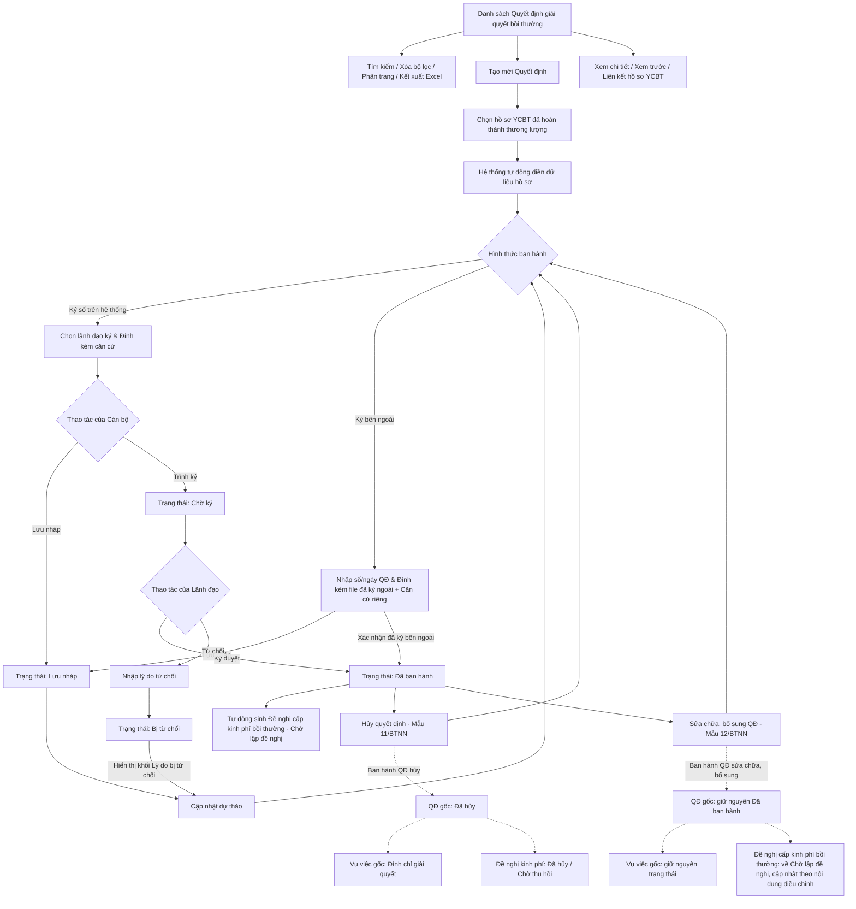

### 4.3.3. Dành cho Cán bộ Công tác bồi thường nhà nước

#### 4.3.3.3. Quyết định giải quyết bồi thường

##### 4.3.3.3.1. Mục đích
Quản lý toàn bộ vòng đời của Quyết định giải quyết bồi thường nhằm chuẩn hóa quy trình ban hành, ký số và quản lý hồ sơ bồi thường nhà nước tập trung, bao gồm:
- Tra cứu và quản lý danh sách quyết định theo phân trang, hỗ trợ tìm kiếm nâng cao đa tiêu chí theo số quyết định, vụ việc, trạng thái và khoảng thời gian ban hành.
- Lập dự thảo quyết định giải quyết bồi thường mới với cơ chế tự động kế thừa và ánh xạ dữ liệu từ kết quả thương lượng của hồ sơ vụ việc YCBT gốc (thông tin người yêu cầu, số tiền bồi thường, phương thức chi trả tiền mặt hoặc tài khoản ngân hàng).
- Xem trước dự thảo quyết định toàn trang chuẩn khổ A4 theo đúng Biểu mẫu 09/BTNN (Thông tư 04/2018/TT-BTP) tại tab trình duyệt mới trước khi trình ký.
- Quản lý luồng phê duyệt và hình thức ban hành linh hoạt:
  + Ký số trên hệ thống: Tự động chuyển đến Lãnh đạo ký số, tích hợp USB Token/chứng thư số và tự động cấp số/ngày từ Sổ văn bản điện tử.
  + Ký bên ngoài: Cho phép cập nhật số/ngày quyết định ký ngoài và đính kèm tệp PDF đã ký đóng dấu giấy.
- Quản lý các quyết định phát sinh sau ban hành: Lập Quyết định hủy (Mẫu 11/BTNN) hoặc Quyết định sửa chữa, bổ sung (Mẫu 12/BTNN) liên kết chặt chẽ với quyết định gốc.
.

a. Phân quyền
Hệ thống phân quyền thao tác theo vai trò và quyền hạn được cấp:
- Xem: Tra cứu danh sách quyết định, xem chi tiết quyết định, xem trước dự thảo, tải file quyết định.
- Tạo mới Quyết đinh: Lập dự thảo quyết định, hoặc Ban hành Quyết định đã ký số bên ngoài.
- Chỉnh sửa: Cập nhật thông tin quyết định ở trạng thái Lưu nháp hoặc Bị từ chối.
- Xóa: Xóa quyết định ở trạng thái Lưu nháp.
- Trình ký / Ban hành: Cán bộ thực hiện trình Lãnh đạo ký số hoặc xác nhận ban hành quyết định ký ngoài.
- Ký duyệt/Từ chối: Lãnh đạo thực hiện ký số điện tử phê duyệt quyết định hoặc từ chối yêu cầu hiệu chỉnh.

b. Điều kiện thực hiện
- Người dùng đã đăng nhập hệ thống.
- Người dùng được cấp quyền truy cập chức năng "Quyết định giải quyết bồi thường".
- Đối với thao tác tạo mới Quyết định: Vụ việc YCBT liên quan phải có Biên bản kết quả thương lượng thành công.
##### 4.3.3.3.2. Sơ đồ luồng nghiệp vụ theo giao diện

---

##### 4.3.3.3.3. MH01 - Màn hình Danh sách Quyết định giải quyết bồi thường

###### 4.3.3.3.3.1. Màn hình

###### 4.3.3.3.3.2. Mô tả thông tin trên màn hình

| Trường thông tin | Kiểu dữ liệu | Bắt buộc | Mặc định | Mô tả |
| :--- | :--- | :--- | :--- | :--- |
| **Tiêu đề màn hình** | String(200) | Không | `Quyết định giải quyết bồi thường` | Hiển thị tên màn hình tại vùng tiêu đề trang. |
| **Khối Bộ lọc tìm kiếm** | Section | - | - | Khối tiêu chí tìm kiếm và lọc danh sách quyết định. |
| Số quyết định | String(50) | Không | Trống | Cho phép nhập số quyết định để tìm kiếm gần đúng, không phân biệt hoa thường, tự động trim space. |
| Mã vụ việc | String(50) | Không | Trống | Cho phép nhập mã vụ việc để tìm kiếm gần đúng, không phân biệt hoa thường, tự động trim space. |
| Tên vụ việc | String(255) | Không | Trống | Cho phép nhập tên vụ việc để tìm kiếm gần đúng, không phân biệt hoa thường, tự động trim space. |
| Loại quyết định | Enum(String(100)) | Không | `Tất cả` | Control UI: Dropdown/Select. Danh sách lựa chọn gồm: - `Tất cả` - `Quyết định giải quyết bồi thường` - `Quyết định hủy quyết định giải quyết bồi thường` - `Quyết định sửa chữa, bổ sung quyết định giải quyết bồi thường` |
| Người ký quyết định | String(100) | Không | Trống | Cho phép nhập tên người ký quyết định để tìm kiếm gần đúng. |
| Trạng thái quyết định | Enum(String(50)) | Không | `Tất cả` | Control UI: Dropdown/Select. Danh sách giá trị theo Danh mục [DM_30]: - `Tất cả` - `Lưu nháp` - `Chờ ký` - `Bị từ chối` - `Đã ban hành` - `Đã hủy` |
| Hình thức ban hành | Enum(String(50)) | Không | `Tất cả` | Control UI: Dropdown/Select. Gồm: `Tất cả`, `Ký số trên hệ thống`, `Ký bên ngoài`. |
| Đơn vị ban hành | Enum(String(255)) | Không | `Tất cả` | Control UI: Dropdown/Select có tìm kiếm. Lọc theo đơn vị có thẩm quyền ban hành quyết định; giá trị lấy từ danh mục đơn vị [DM_DON_VI]. |
| Ban hành: Từ ngày | Date | Không | Trống | Định dạng `dd/mm/yyyy`. Ngày bắt đầu khoảng thời gian ban hành. Kiểm tra logic khoảng ngày theo [BR-VAL-007]. |
| Ban hành: Đến ngày | Date | Không | Trống | Định dạng `dd/mm/yyyy`. Ngày kết thúc khoảng thời gian ban hành. Kiểm tra logic khoảng ngày theo [BR-VAL-007]. |
| **Bảng danh sách quyết định** | List(Object) | Không | 20 bản ghi/trang | Control UI: Data grid. - Khi người dùng truy cập màn hình, hệ thống tự động tải trang đầu tiên (Trang 1) với số lượng mặc định 20 bản ghi. - Sắp xếp mặc định: Sắp xếp theo "Ngày ban hành" giảm dần.   - Cho phép click tiêu đề cột Ngày ban hành để đảo chiều sắp xếp tăng/giảm. - Xem chi tiết bằng sự kiện click trực tiếp vào dòng dữ liệu (Row-Click) để mở **MH03 - Chi tiết Quyết định giải quyết bồi thường**, trừ khi click vào icon thao tác hoặc liên kết Mã vụ việc. - Trạng thái có dữ liệu: Hiển thị danh sách các bản ghi kết quả theo cấu trúc các cột quy định. - Trạng thái không có dữ liệu (Empty State): Khi không tìm thấy kết quả phù hợp với điều kiện tìm kiếm, bảng hiển thị duy nhất 01 dòng căn giữa trên toàn bộ chiều rộng bảng, in nghiêng với nội dung theo MessageList dùng chung [MSG-INF-SYS-001]. |
| STT | Integer(10) | - | Tự tăng | Căn giữa, tăng theo phân trang. |
| Số quyết định | String(50) | - | Theo dữ liệu | Hiển thị số quyết định. Trường hợp chưa được cấp số (dự thảo), hiển thị ký hiệu tương ứng của dữ liệu dự thảo. |
| Ngày ban hành | Date | - | Theo dữ liệu | Hiển thị ngày ban hành (định dạng `dd/mm/yyyy`); trường hợp chưa ban hành hiển thị gạch ngang `-`. |
| Loại quyết định | Enum(String(100)) | - | Theo dữ liệu | Hiển thị tên loại quyết định tương ứng. |
| Người ký | String(100) | - | Theo dữ liệu | Hiển thị họ tên lãnh đạo/người ký ban hành quyết định. |
| Cán bộ xử lý | String(100) | - | Theo dữ liệu | Hiển thị họ tên cán bộ phụ trách xử lý/lập quyết định. |
| Hình thức ban hành | Enum(String(50)) | - | Theo dữ liệu | Hiển thị `Ký số trên hệ thống` hoặc `Ký bên ngoài`. |
| Đơn vị ban hành | String(255) | - | Theo dữ liệu | Hiển thị đơn vị sở hữu sổ văn bản và có thẩm quyền ban hành quyết định. |
| Trích yếu quyết định | String(500) | - | Theo dữ liệu | Hiển thị tóm tắt trích yếu nội dung quyết định giải quyết bồi thường theo cú pháp "Quyết định giải quyết bồi thường đối với " + [Họ và tên người yêu cầu bồi thường |
| Mã vụ việc | String(50) | - | Theo dữ liệu | Control UI: Text link (Hyperlink). Cho phép click mở màn hình Chi tiết vụ việc yêu cầu bồi thường liên kết. |
| Tên vụ việc | String(255) | - | Theo dữ liệu | Hiển thị tên vụ việc bồi thường liên kết. |
| Trạng thái | Enum(String(50)) | - | Theo dữ liệu | Control UI: Text hiển thị kèm Badge màu theo trạng thái quyết định [DM_30]. |
| Thao tác | Action Buttons | - | Theo trạng thái | Control UI: Fixed-slot Action Column. Mỗi thao tác hiển thị trên 01 dòng riêng biệt theo điều kiện trạng thái hồ sơ: - **Cập nhật**: Chỉ hiển thị với Quyết định ở trạng thái `Lưu nháp` hoặc `Bị từ chối`. - **Xóa**: Chỉ hiển thị với Quyết định ở trạng thái `Lưu nháp`. - **Ký số**: Chỉ hiển thị với Quyết định ở trạng thái `Chờ ký`. - **Từ chối**: Chỉ hiển thị với Quyết định ở trạng thái `Chờ ký`. - **Hủy quyết định**: Chỉ hiển thị với Quyết định ở trạng thái `Đã ban hành`. - **Sửa chữa, bổ sung**: Chỉ hiển thị với Quyết định ở trạng thái `Đã ban hành`. - Các thao tác không thỏa mãn điều kiện theo trạng thái hồ sơ sẽ hiển thị ở dạng mờ/khóa, không cho phép thao tác. |
| Phân trang | Pagination | Không | 20 bản ghi/trang | Control UI: Pagination. - Cho phép chọn cấu hình số lượng bản ghi hiển thị trên mỗi trang gồm: 10, 20, 50, 100 bản ghi/trang; mặc định chọn sẵn 20 bản ghi/trang. - Đầy đủ các nút điều hướng trang: Đầu (&#124;&lt;&lt;), Trước (&lt;), các số trang, Sau (&gt;), Cuối (&gt;&gt;&#124;). - Hiển thị dải bản ghi: "Hiển thị [từ] - [đến] của [tổng số] bản ghi". |

###### 4.3.3.3.3.3. Chức năng trên màn hình

| STT | Tên chức năng | Định dạng | Mô tả |
| :--- | :--- | :--- | :--- |
| 1 | Xóa bộ lọc | Button | Xóa toàn bộ điều kiện tìm kiếm/lọc, đưa các trường nhập về giá trị mặc định và tải lại danh sách ở Trang 1. |
| 2 | Tìm kiếm | Button | Khi người dùng click nút, hệ thống kiểm tra điều kiện dữ liệu và thực hiện tìm kiếm: - **TH1 - Khoảng ngày không hợp lệ**: Nếu `Từ ngày` lớn hơn `Đến ngày`, vi phạm [BR-VAL-007], hệ thống hiển thị cảnh báo lỗi [MSG-ERR-VAL-007] và không thực hiện tìm kiếm. - **TH Hợp lệ**: Hệ thống lọc và hiển thị danh sách các bản ghi thỏa mãn đồng thời các tiêu chí tìm kiếm/lọc đã nhập/chọn, hiển thị kết quả lên bảng và đưa về Trang 1. - **TH Không có dữ liệu trả về**: Bảng kết quả hiển thị duy nhất 01 dòng căn giữa trên toàn bộ chiều rộng bảng, in nghiêng với nội dung theo MessageList dùng chung [MSG-INF-SYS-001]; thanh phân trang hiển thị *"Hiển thị 0-0 của 0 bản ghi"*, các nút điều hướng trang ở trạng thái khóa mờ (Disabled); nút "Kết xuất Excel" ở trạng thái khóa mờ kèm tooltip *"Không có dữ liệu để kết xuất Excel"*. |
| 3 | Tạo mới Quyết định | Button | Mở màn hình **MH02 - Trình ký/Cập nhật Quyết định giải quyết bồi thường** ở chế độ tạo mới để Cán bộ lập dự thảo quyết định. |
| 4 | Kết xuất Excel | Button | - **TH Không có dữ liệu**: Nếu danh sách kết quả hiện hành không có bản ghi, vi phạm [BR-EXP-040], hệ thống khóa mờ nút kết xuất và hiển thị thông báo [MSG-WRN-SYS-001]. - **TH Hợp lệ**: Kết xuất danh sách Quyết định giải quyết bồi thường ra file Excel theo đúng kết quả tìm kiếm/lọc hiện hành theo quy chuẩn [BR-EXP-040]. |
| 5 | Click dòng dữ liệu | Row click | Mở màn hình **MH03 - Chi tiết Quyết định giải quyết bồi thường** tương ứng với bản ghi được chọn. Nếu click vào icon thao tác hoặc liên kết `Mã vụ việc`, hệ thống thực hiện chức năng của icon/liên kết và không kích hoạt row click. |
| 6 | Cập nhật | Icon button | Khi người dùng click icon Cập nhật, hệ thống xử lý theo 02 trường hợp: - **TH1 - Quyết định ở trạng thái `Lưu nháp`**: Hệ thống mở màn hình **MH02 - Trình ký/Cập nhật Quyết định giải quyết bồi thường** để Cán bộ tiếp tục chỉnh sửa và hoàn thiện thông tin quyết định. - **TH2 - Quyết định ở trạng thái `Bị từ chối`**: Hệ thống mở màn hình **MH02 - Trình ký/Cập nhật Quyết định giải quyết bồi thường** ở chế độ cập nhật, tự động hiển thị thêm **Khối Lý do bị từ chối** ở phía trên cùng form để Cán bộ nắm bắt ý kiến chỉ đạo của Lãnh đạo và chỉnh sửa lại dữ liệu. |
| 7 | Xóa | Icon button | - Mở **[POPUP-CFM-001]** với nội dung [MSG-CFM-SYS-001]. - Khi người dùng chọn "Đồng ý": Hệ thống thực hiện xóa bản ghi quyết định lưu nháp khỏi danh sách và hiển thị thông báo thành công [MSG-SUC-BTNN-QD-004]. - Khi người dùng chọn "Hủy bỏ": Đóng popup và giữ nguyên dữ liệu. |
| 8 | Ký số | Icon button | Mở **[POPUP-SIGN-001]** để Lãnh đạo thực hiện ký số điện tử phê duyệt dự thảo quyết định: - **TH Thất bại hoặc Hủy ký**: Giữ nguyên trạng thái `Chờ ký`, không cấp số/ngày từ sổ văn bản và hiển thị thông báo lỗi [MSG-ERR-BTNN-QD-004]. - **TH Ký số thành công**: Tự động cấp số và ngày quyết định từ Sổ văn bản điện tử áp dụng, đóng dấu thời gian, lưu tệp PDF quyết định chính thức đã ký số, chuyển trạng thái sang `Đã ban hành`, ghi nhận lịch sử xử lý, cập nhật danh sách và hiển thị thông báo thành công [MSG-SUC-BTNN-QD-002]. Sau đó hệ thống xử lý liên kết dữ liệu theo `Loại quyết định` giống hệt các trường hợp mô tả tại chức năng `Ký duyệt` của **MH02 - Màn hình Trình ký/Cập nhật Quyết định giải quyết bồi thường**, bao gồm cả việc ánh xạ dữ liệu theo [Bảng ánh xạ dữ liệu liên thông sang Module Quản lý kinh phí bồi thường](#bang-anh-xa-lien-thong-kinh-phi). |
| 9 | Từ chối | Icon button | Mở **[POPUP-REJ-001]** (Tiêu đề: *"Từ chối quyết định"*) để Lãnh đạo nhập lý do từ chối phê duyệt. Khi xác nhận từ chối hợp lệ, hệ thống chuyển trạng thái quyết định sang `Bị từ chối`, lưu lý do vào lịch sử xử lý và hiển thị thông báo [MSG-SUC-BTNN-QD-003]. |
| 10 | Mã vụ việc | Link | Điều hướng sang màn hình Chi tiết vụ việc yêu cầu bồi thường liên kết trong Module Giải quyết yêu cầu bồi thường. |
| 11 | Hủy quyết định | Icon/Button | - Mở màn hình **MH05 - Hủy/Sửa chữa, bổ sung Quyết định giải quyết bồi thường** ở chế độ `Hủy quyết định giải quyết bồi thường`; hệ thống kế thừa thông tin quyết định gốc để lập văn bản theo `Mẫu 11/BTNN`. |
| 12 | Sửa chữa, bổ sung | Icon/Button | - Mở màn hình **MH05 - Hủy/Sửa chữa, bổ sung Quyết định giải quyết bồi thường** ở chế độ `Sửa chữa, bổ sung quyết định giải quyết bồi thường`; hệ thống kế thừa thông tin quyết định gốc để lập văn bản theo `Mẫu 12/BTNN`. |

---

##### 4.3.3.3.4. MH02 - Màn hình Trình ký/Cập nhật Quyết định giải quyết bồi thường

###### 4.3.3.3.4.1. Màn hình

###### 4.3.3.3.4.2. Mô tả thông tin trên màn hình

| Trường thông tin | Kiểu dữ liệu | Bắt buộc | Mặc định | Mô tả |
| :--- | :--- | :--- | :--- | :--- |
| **Tiêu đề form** | String(200) | Không | Theo ngữ cảnh | Hiển thị động theo trạng thái: - Khi tạo mới: `LẬP QUYẾT ĐỊNH GIẢI QUYẾT BỒI THƯỜNG MỚI`. - Khi cập nhật lưu nháp: `CẬP NHẬT DỰ THẢO QUYẾT ĐỊNH`. - Khi cập nhật bị từ chối: `CẬP NHẬT DỰ THẢO QUYẾT ĐỊNH BỊ TỪ CHỐI`. |
| **Khối Lý do bị từ chối** | Section | - | Ẩn | Khối thông báo nổi bật đặt ở phía trên cùng của form; chỉ hiển thị khi mở màn hình đối với Quyết định ở trạng thái `Bị từ chối`. Bao gồm các trường thông tin chỉ đọc dưới đây: |
| Ngày từ chối | Date | - | Theo dữ liệu | Chỉ đọc. Ngày Lãnh đạo thực hiện từ chối phê duyệt dự thảo quyết định (định dạng `dd/mm/yyyy`). |
| Người từ chối | String(100) | - | Theo dữ liệu | Chỉ đọc. Họ và tên Lãnh đạo đã từ chối phê duyệt. |
| Nội dung ý kiến chỉ đạo / Lý do từ chối | Text(2000) | - | Theo dữ liệu | Chỉ đọc. Nội dung ý kiến chỉ đạo chỉnh sửa, bổ sung của Lãnh đạo để Cán bộ nắm bắt và hoàn thiện lại dự thảo. |
| **Khối Thông tin chung hồ sơ** | Section | - | - | Khối thông tin liên kết và hành chính ban hành. |
| Mã vụ việc | String(50) | Có | Trống | - Control UI:   + InputText: Nếu Tạo mới QĐ hoặc QĐ đang ở trạng thái Lưu nháp   + Label. Hiển thị dạng HyperLink: Trong các trường hợp còn lại |
| Tìm kiếm | Button | - | - | Chỉ hiển thị khi tạo mới Quyết định hoặc Quyết định đang ở trạng thái Lưu nháp|
| Tìm kiếm nâng cao | Button | - | - | Chỉ hiển thị khi tạo mới Quyết định hoặc Quyết định đang ở trạng thái Lưu nháp|
| Đơn vị ban hành | Enum(String(255)) | Có | Theo vụ việc | Đơn vị có thẩm quyền ban hành quyết định.  - Giá trị lấy từ danh mục đơn vị [DM_DON_VI].   - Cho phép tìm kiếm theo Mã hoặc theo tên đơn vị. Danh mục hiển thị dạng cây cấp cha con dạng **[Mã đơn vị] - [Tên đơn vị]** |
| Hình thức ban hành | Enum(String(50)) | Có | `Ký số trên hệ thống` | Control UI: Radio button gồm   -`Ký số trên hệ thống`   -`Ký bên ngoài` |
| Sổ văn bản áp dụng | Enum(String(255)) | Có | Tự động theo đơn vị |   - Hệ thống tự xác định theo `Đơn vị ban hành + Loại quyết định + Năm sổ`; cho phép chọn lại trong danh sách sổ còn hiệu lực của đơn vị. |
| Lãnh đạo ký ban hành | Enum(String(255)) | Có tùy điền kiện | Chọn lãnh đạo | Control UI: Dropdown/Select.   - Bắt buộc chọn khi Hình thức ban hành là `Ký số trên hệ thống`.   - Chỉ hiển thị danh sách lãnh đạo có thẩm quyền thuộc `Đơn vị ban hành`. |
| Số quyết định | String(50) | Có tùy điền kiện | Trống | - Chỉ hiển thị và bắt buộc khi Hình thức ban hành là `Ký bên ngoài`.   - Cán bộ nhập số quyết định đã ký ngoài; hệ thống kiểm tra trùng số trong sổ và kiểm tra tính liền kề của số theo `Sổ văn bản áp dụng`.  |
| Ngày quyết định  | Date | Có tùy điền kiện | Ngày hiện tại | Định dạng `dd/mm/yyyy`. Chỉ hiển thị và bắt buộc khi Hình thức ban hành là `Ký bên ngoài`. |
| Tệp quyết định | File | Có tùy điều kiện | Trống | Control UI: File. Nội dung tệp khác nhau theo `Hình thức ban hành`: - **`Ký bên ngoài`**: Bắt buộc đính kèm. Là tệp PDF quyết định đã được ký và đóng dấu chính thức bên ngoài hệ thống. - **`Ký số trên hệ thống`**: Cán bộ không đính kèm. Hệ thống tự động sinh tệp PDF dự thảo khi thực hiện `Trình ký` và gán vào trường này để Lãnh đạo mở xem tại **[POPUP-SIGN-001]** trước khi ký số. Sau khi ký số thành công, hệ thống thay thế bằng tệp PDF quyết định chính thức đã ký số. |
| **Khối Chi tiết nội dung quyết định** | Section | - | - | Khối nội dung chi tiết quyết định bồi thường (tự động điền từ hồ sơ vụ việc đã chọn và cho phép cán bộ chỉnh sửa). |
| ***Khối Chi tiết thông tin người yêu cầu bồi thường*** | Section | - | - | |
| Họ và tên người yêu cầu bồi thường | String(255) | Có | Theo vụ việc đã chọn |  |
| Tỉnh/Thành phố | Enum(String(100)) | Có | Theo vụ việc | Control UI: Combobox. Tham chiếu Danh mục đơn vị hành chính.   Tự động lấy từ hồ sơ vụ việc YCBT được chọn, cho phép chỉnh sửa. |
| Phường/Xã | Enum(String(100)) | Có | Theo vụ việc | Control UI: Combobox. Tham chiếu Danh mục đơn vị hành chính.   Tự động lấy từ hồ sơ vụ việc YCBT được chọn., cho phép chỉnh sửa. |
| Địa chỉ chi tiết | Text(1000) | Có | Theo vụ việc | Control UI: Textarea.   Tự động lấy từ hồ sơ vụ việc YCBT được chọn., cho phép chỉnh sửa.|
| ***Khối Bảng nội dung đề xuất cấp kinh phí bồi thường*** | Section | - | - |  |
| STT | Integer(10) | - | Tự tăng | Chỉ đọc. Số thứ tự dòng. |
| Loại thiệt hại được yêu cầu | Enum(String(255)) | - | Theo vụ việc | Control UI: Data grid. - Tham chiếu Danh mục Loại thiệt hại yêu cầu bồi thường [DM_27].   Luôn luôn hiển thị đầy đủ danh mục Loại thiệt hại|
| Mức đề nghị trong hồ sơ gốc (VNĐ) | Decimal(18,0) | - | Theo vụ việc | Control UI: Label   Chỉ đọc. Căn lề phải. Định dạng phân cách hàng nghìn bằng dấu chấm (VNĐ). Lấy theo thông tin **[Số tiền yêu cầu bồi thường]** trong vụ việc gốc đã chọn, Nếu vụ việc không không có thì hiển thị = 0|
| Số tiền duyệt cấp bồi thường (VNĐ) | Decimal(18,0) | - | Theo vụ việc | Control UI: InputText.  Căn lề phải. Định dạng phân cách hàng nghìn bằng dấu chấm (VNĐ).   Tự động lấy theo thông tin **[Đề xuất mức bồi thường]** trong hồ sơ gốc ở khối thông tin Thương lượng, cho phép chỉnh sửa|
| Tổng số tiền bồi thường | Decimal(18,0) | - | Hệ thống tính | Control UI: Label   Chỉ đọc. Căn lề phải. Định dạng phân cách hàng nghìn bằng dấu chấm (VNĐ). Tự động tính tổng tiền duyệt cấp bồi thường |
| Tổng số tiền bồi thường bằng chữ | String (200) | - | - | Control UI: Label   chỉ hiển thị nếu Tổng số tiền bồi thường  > 0. Hiển thị theo định dạng : "(Viết bằng chữ: [Đọc số tiền bằng chữ của Tổng số tiền bồi thường])" |
| Số tiền bồi thường đã tạm ứng | Decimal(18,0) | - | Theo vụ việc| Control UI: InputText. Căn lề phải. Định dạng phân cách hàng nghìn bằng dấu chấm (VNĐ). Lấy theo thông tin **[Tổng số tiền đề nghị tạm ứng]** trong vụ việc gốc đã chọn, cho phép chỉnh sửa|
| Số tiền bồi thường còn lại sau khi đã tạm ứng | Decimal(18,0) | - | Hệ thống tính | Control UI: Label. Chỉ đọc. Căn lề phải. Định dạng phân cách hàng nghìn bằng dấu chấm (VNĐ). Bằng Tổng số tiền bồi thường trừ đi Số tiền bồi thường đã tạm ứng.|
| Phương thức chi trả tiền bồi thường | Enum(String(100)) | Có | Theo vụ việc  | Control UI: Combobox. Bao gồm: - `Chi trả trực tiếp bằng tiền mặt` - `Chi trả qua chuyển khoản`  Theo thông tin vụ việc đã chọn. Cho phép chỉnh sửa|
| Họ và tên người nhận| String(100) | - | Theo vụ việc  | Control UI: Input text.   Theo thông tin vụ việc đã chọn. Cho phép chỉnh sửa|
| Số giấy tờ thân nhân người nhận | String(50) | - | Theo vụ việc  | Control UI: Input text.   Theo thông tin vụ việc đã chọn. Cho phép chỉnh sửa|
| Địa chỉ chi tiết người nhận | Text(1000) | - | Theo vụ việc  | Control UI: Textarea   Theo thông tin vụ việc đã chọn. Cho phép chỉnh sửa |
| Số tài khoản | String(50) | Có theo điều kiện | Theo vụ việc | Control UI: Input text. - Chỉ hiển thị và bắt buộc khi Phương thức chi trả là *"Chi trả qua chuyển khoản"*. -   Theo thông tin vụ việc đã chọn. Cho phép chỉnh sửa. - Áp dụng quy tắc bắt buộc [BR-VAL-001]. |
| Chủ tài khoản | String(100) | Có theo điều kiện | Theo vụ việc | Control UI: Input text. - Chỉ hiển thị và bắt buộc khi Phương thức chi trả là *"Chi trả qua chuyển khoản"*. -   Theo thông tin vụ việc đã chọn. Cho phép chỉnh sửa. - Áp dụng quy tắc bắt buộc [BR-VAL-001]. |
| Tên ngân hàng | String(255) | Có theo điều kiện | Theo vụ việc | Control UI: Combobox có tìm kiếm / Input text. - Chỉ hiển thị và bắt buộc khi Phương thức chi trả là *"Chi trả qua chuyển khoản"*. -   Theo thông tin vụ việc đã chọn. Cho phép chỉnh sửa. - Áp dụng quy tắc bắt buộc [BR-VAL-001]. |
| Chi nhánh ngân hàng | String(255) | Có theo điều kiện | Theo vụ việc | Control UI: Input text. - Chỉ hiển thị và bắt buộc khi Phương thức chi trả là *"Chi trả qua chuyển khoản"*. -   Theo thông tin vụ việc đã chọn. Cho phép chỉnh sửa. - Áp dụng quy tắc bắt buộc [BR-VAL-001]. |
| Cảnh báo chênh lệch số liệu | String(255) | Không | Ẩn | Hiển thị cảnh báo màu vàng khi `Tổng số tiền bồi thường` được điều chỉnh khác **[Tổng số tiền bồi thường thống nhất]**ở trong vụ việc được chọn. |
| Lý do điều chỉnh số liệu kinh phí | Text(2000) | Có khi có chênh lệch | Trống | Bắt buộc nhập khi có cảnh báo chênh lệch số liệu giữa quyết định và kết quả thương lượng gốc.   - Hệ thống sẽ có cơ chế tự kiểm tra, Nếu số tiền bồi thường trong quyết định khác **[Tổng số tiền bồi thường thống nhất]** thì hiện cảnh báo và yêu cầu nhập lý do. |
| **Bảng Văn bản căn cứ** | List(Object) | Không | Các dòng căn cứ | Khối đính kèm tài liệu căn cứ liên quan. Gồm nút **`+ Thêm văn bản`** để thêm dòng mới. |
| STT | Integer(10) | - | Tự tăng | Căn giữa. |
| Tên văn bản | String(500) | Có khi thêm dòng | Trống/Theo dữ liệu | Nhập tên văn bản hoặc căn cứ pháp lý liên quan. |
| Ngày văn bản | Date | Có khi thêm dòng | Ngày hiện tại | Định dạng `dd/mm/yyyy`. Ngày ban hành của văn bản căn cứ. |
| File đính kèm | File | Có khi thêm dòng | Trống | Cho phép chọn tệp đính kèm theo quy chuẩn [BR-FILE-010]. |
| Thao tác | Action Links | - | Theo dòng | Gồm các thao tác:   - `Tải lên`   -`Xem file`: Chỉ hiển thị nếu đã tải lên file thành công  - `Xóa`: Chỉ hiển thị nếu đã tải lên file thành công |

###### 4.3.3.3.4.3. Chức năng trên màn hình

| STT | Tên chức năng | Định dạng | Mô tả |
| :--- | :--- | :--- | :--- |
| 1 | Tìm kiếm | Button | - Nếu chưa nhập dữ liệu tại ô tìm kiếm: Vi phạm quy tắc [BR-VAL-001], hệ thống hiển thị thông báo lỗi [MSG-ERR-VAL-001]  - Nếu đã nhập dữ liệu: Hệ thống mở [Popup chuẩn Tìm kiếm vụ việc/hồ sơ gốc liên quan](SRS_BTNN_GiaiQuyetBT_GiaiQuyet_YCBT.md#433110-popup-chuẩn-tìm-kiếm-vụ-việchồ-sơ-gốc-liên-quan) (thuộc Module Giải quyết yêu cầu bồi thường), tự động điền giá trị đang nhập vào trường `Mã vụ việc` trên Popup và kích hoạt tìm kiếm. |
| 2 | Tìm kiếm nâng cao | Button | - Hệ thống mở [Popup chuẩn Tìm kiếm vụ việc/hồ sơ gốc liên quan](SRS_BTNN_GiaiQuyetBT_GiaiQuyet_YCBT.md#433110-popup-chuẩn-tìm-kiếm-vụ-việchồ-sơ-gốc-liên-quan) (thuộc Module Giải quyết yêu cầu bồi thường) ở chế độ mở rộng đầy đủ các tiêu chí lọc. - Tự động kế thừa giá trị mã vụ việc đã nhập. - Cho phép Cán bộ nhập thêm các tiêu chí lọc và bấm nút `Tìm kiếm` trên Popup. |
| 3 | + Thêm văn bản | Button | Thêm 01 dòng tài liệu mới vào bảng danh sách tài liệu căn cứ liên quan, tự động tăng STT, để trống các trường khác trong lưới |
| 4 | Tải lên | Button (Dòng tài liệu) | Khi người dùng click nút "Tải lên" tại dòng tài liệu, hệ thống mở hộp thoại chọn tệp tin từ thiết bị và thực hiện kiểm tra: - **TH1 - Sai định dạng file**: Nếu tệp tin không đúng định dạng vi phạm [BR-FILE-010], hệ thống hiển thị thông báo lỗi [MSG-ERR-FILE-001] và không tiếp nhận tệp. - **TH2 - File quá dung lượng**: Nếu dung lượng tệp vi phạm [BR-FILE-010], hệ thống hiển thị thông báo lỗi [MSG-ERR-FILE-002] và không tiếp nhận tệp. - **TH3 - Hợp lệ**: Hệ thống tải tệp tin lên thành công, cập nhật cột `File đính kèm` hiển thị tên tệp tin kèm dung lượng, kích hoạt liên kết `Xem file` và nút `Xóa` tại cột Thao tác, đồng thời hiển thị thông báo thành công [MSG-SUC-BTNN-QD-004]. |
| 5 | Xem file | Link (Dòng tài liệu) | Mở xem nội dung tệp tin đính kèm tại một tab trình duyệt mới. |
| 6 | Xóa | Icon button | Mở popup xác nhận [POPUP-CFM-001] với nội dung [MSG-CFM-BTNN-XDCQ-002]. - Khi người dùng chọn "Đồng ý": Hệ thống gỡ bỏ file đính kèm và xóa dòng tài liệu căn cứ tương ứng khỏi bảng danh sách. - Khi người dùng chọn "Hủy bỏ": Đóng popup và giữ nguyên dữ liệu. |
| 7 | Xem Trước Quyết định | Button | - *Điều kiện hiển thị*: Chỉ hiển thị khi `Hình thức ban hành` là `Ký số trên hệ thống`   **TH1 - Chưa chọn vụ việc YCBT**: Vi phạm [BR-VAL-001], hiển thị cảnh báo [MSG-ERR-VAL-001] và không mở xem trước. - **TH Hợp lệ**: Hiển thị dự thảo quyết định theo biểu mẫu `Mẫu 09/BTNN` của Thông tư 04/2018/TT-BTP tại **MH04 - Xem trước Quyết định Giải quyết yêu cầu bồi thường**, mở trong một tab trình duyệt mới (khổ A4). Nội dung bản xem trước được dựng từ dữ liệu đang nhập trên form theo đúng [Bảng 1 - Ánh xạ sinh Quyết định giải quyết bồi thường (Mẫu 09/BTNN)](#bang-anh-xa-sinh-qd-gqbt-mau09). |
| 8 | Lưu nháp | Button | - *Điều kiện hiển thị*: Chỉ hiển thị khi đã chọn vụ việc gốc liên quan (Đã có thông tin ở trường Mã vụ việc).   *Xử lý*: Hệ thống Lưu lại các thông tin quyết định đã nhập ở trạng thái `Lưu nháp`, hiển thị thông báo thành công [MSG-SUC-SYS-001] và đóng màn hình nhập liệu. |
| 9 | Trình ký | Button | - *Điều kiện hiển thị*: Chỉ hiển thị khi chọn `Hình thức ban hành` = `Ký số trên hệ thống`. - **TH1 - Bỏ trống trường bắt buộc**: Vi phạm [BR-VAL-001], highlight đỏ ô lỗi và cảnh báo [MSG-ERR-VAL-001]. - **TH Hợp lệ**: Hệ thống thực hiện tuần tự các bước bên dưới: + Bước 1: Lưu thông tin quyết định đã nhập trên form. + Bước 2: Tự động sinh file PDF dự thảo theo `Mẫu 09/BTNN` của Thông tư 04/2018/TT-BTP, nội dung dựng theo [Bảng 1 - Ánh xạ sinh Quyết định giải quyết bồi thường (Mẫu 09/BTNN)](#bang-anh-xa-sinh-qd-gqbt-mau09). + Bước 3: Gán file PDF dự thảo vừa sinh vào trường `Tệp quyết định` của bản ghi quyết định, để Lãnh đạo mở xem trực tiếp tại **[POPUP-SIGN-001]** trước khi thực hiện ký số. + Bước 4: Chuyển trạng thái quyết định sang `Chờ ký`. + Bước 5: Gửi thông báo tác nghiệp đến Lãnh đạo đã chọn thuộc `Đơn vị ban hành`. + Bước 6: Ghi nhận lịch sử xử lý và hiển thị thông báo thành công [MSG-SUC-BTNN-QD-001]. |
| 10 | Ban hành QĐ | Button | - *Điều kiện hiển thị*: Chỉ hiển thị khi `Hình thức ban hành` là `Ký bên ngoài`.   **TH1 - Bỏ trống trường bắt buộc**: Vi phạm [BR-VAL-001], highlight đỏ ô lỗi và cảnh báo [MSG-ERR-VAL-001]. - **TH2 - Trùng số quyết định trong cùng sổ quyết định**: Hệ thống cảnh báo trùng số và không cho lưu. - **TH3 - Số quyết định không liền kề**: Áp dụng khi `Số quyết định` nhập vào không phải là số liền kề  so với số đã ban hành gần nhất trong Sổ quyết định đã chọn. + Hệ thống hiển thị thông báo lỗi [MSG-ERR-BTNN-QD-003], nêu rõ số hợp lệ tiếp theo. + Highlight viền đỏ và focus con trỏ vào ô `Số quyết định`. + Không cho phép ban hành. + Cán bộ phải nhập lại đúng số liền kề mới thực hiện được thao tác. - **TH Hợp lệ**: Lưu thông tin, chuyển trạng thái quyết định sang `Đã ban hành`, ghi nhận lịch sử và hiển thị thông báo thành công [MSG-SUC-BTNN-QD-002]. |
| 11 | Hủy bỏ | Button | Đóng form nhập liệu quyết định và quay lại danh sách tra cứu, không lưu bất cứ thông tin gì. |

---

##### 4.3.3.3.5. MH03 - Màn hình Chi tiết Quyết định giải quyết bồi thường

###### 4.3.3.3.5.1. Màn hình

###### 4.3.3.3.5.2. Mô tả thông tin trên màn hình

| Trường thông tin | Kiểu dữ liệu | Bắt buộc | Mặc định | Mô tả |
| :--- | :--- | :--- | :--- | :--- |
| **Tiêu đề** | - | - | - | Control UI: Label.   Hiển thị cố định `CHI TIẾT QUYẾT ĐỊNH GIẢI QUYẾT BỒI THƯỜNG` |
| Trạng thái quyết định | - | - | - | Hiển thị Badge trạng thái của Quyết định. |
| Mã vụ việc |- | - | - | Control UI: Label. Hiển thị dạng HyperLink |
| Lý do bị từ chối | - | - | Ẩn | Chỉ hiển thị khi quyết định ở trạng thái `Bị từ chối`.   Hiển thị lý do từ chối |
| Loại quyết định |   - | - | - | Control UI: Label. Chỉ đọc   Lấy theo dữ liệu bản ghi|
| Số quyết định | - | - | - | Hiển thị số quyết định đã ban hành;   Nếu chưa ban hành hiển thị `-`. |
| Ngày quyết định | - | - | - | Control UI: Label.   Hiển thị ngày quyết định (định dạng `dd/mm/yyyy`);   Nếu chưa ban hành hiển thị `-`. |
| Người ký | - | - | - | Control UI: Label.   Hiển thị họ tên lãnh đạo/người ký quyết định. |
| Hình thức ban hành |  - | - | - | Control UI: Label. Chỉ đọc   Lấy theo dữ liệu bản ghi|
| Cơ quan ban hành |  - | - | - | Control UI: Label. Chỉ đọc  Lấy theo dữ liệu bản ghi|
| Quyết định gốc liên quan | - | - | - | Control UI: Label.  - Chỉ hiển thị khi là Quyết định hủy hoặc Quyết định sửa chữa/bổ sung. - Hiển thị Số quyết định gốc liên kết dạng Hyperlink. - Khi người dùng click vào liên kết, hệ thống mở màn hình **MH03 - Chi tiết Quyết định giải quyết bồi thường** của Quyết định gốc tương ứng. |
| Quyết định hủy / Sửa chữa, bổ sung liên quan | - | - | - | Control UI: Label.  - Chỉ hiển thị trên Quyết định gốc khi đã có Quyết định hủy hoặc Quyết định sửa chữa/bổ sung được ban hành. - Hiển thị Số quyết định dạng Hyperlink. - Khi người dùng click vào liên kết, hệ thống mở màn hình **MH03 - Chi tiết Quyết định giải quyết bồi thường** của Quyết định hủy hoặc Quyết định sửa chữa, bổ sung tương ứng. |
| Tệp quyết định | File | Có tùy điền kiện | Trống | Control UI: File.   - Cho phép thực hiện Xem file hoặc Tải file   - Với Quyết định Đã ban hành, hiển thị thông tin file PDF đã được ký số ban hành   - Với quyết định Chờ ký/Bị từ chối/Lưu nháp thì hiển thị thông tin Dự thảo QĐ PDF đã sinh từ hệ thống|
| **Khối Chi tiết nội dung quyết định** | - | - | - |  |
| ***Khối Chi tiết thông tin người yêu cầu bồi thường*** | - | - | - | |
| Họ và tên người yêu cầu bồi thường | - | - | - | Control UI: Label. Chỉ đọc  Lấy theo dữ liệu bản ghi|
| Tỉnh/Thành phố | - | - | - | Control UI: Label. Chỉ đọc  Lấy theo dữ liệu bản ghi|
| Phường/Xã | - | - | - | Control UI: Label. Chỉ đọc  Lấy theo dữ liệu bản ghi|
| Địa chỉ chi tiết | - | - | - | Control UI: Label. Chỉ đọc  Lấy theo dữ liệu bản ghi|
| Cơ quan quản lý người thi hành công vụ |  - | - | - | Control UI: Label. Chỉ đọc  Lấy theo dữ liệu bản ghi|
| Ngày thương lượng |  - | - | - | Control UI: Label. Chỉ đọc  Lấy theo dữ liệu bản ghi|
| ***Khối Bảng nội dung đề xuất cấp kinh phí bồi thường*** | - | - | - |  |
| STT | - | - | - | Control UI: Label. Chỉ đọc  Lấy theo dữ liệu bản ghi|
| Loại thiệt hại được yêu cầu | - | - | - | Control UI: Label. Chỉ đọc  Lấy theo dữ liệu bản ghi|
| Mức đề nghị trong hồ sơ gốc (VNĐ) | - | - | - | Control UI: Label. Chỉ đọc  Lấy theo dữ liệu bản ghi|
| Số tiền duyệt cấp bồi thường (VNĐ) | - | - | - | Control UI: Label. Chỉ đọc  Lấy theo dữ liệu bản ghi|
| Tổng số tiền bồi thường | - | - | - | Control UI: Label. Chỉ đọc  Lấy theo dữ liệu bản ghi|
| Tổng số tiền bồi thường bằng chữ | - | - | - | Control UI: Label. Chỉ đọc  Lấy theo dữ liệu bản ghi|
| Số tiền bồi thường đã tạm ứng | - | - | - | Control UI: Label. Chỉ đọc  Lấy theo dữ liệu bản ghi|
| Số tiền bồi thường còn lại sau khi đã tạm ứng | - | - | - | Control UI: Label. Chỉ đọc  Lấy theo dữ liệu bản ghi|
| Phương thức chi trả tiền bồi thường | - | - | - | Control UI: Label. Chỉ đọc  Lấy theo dữ liệu bản ghi|
| Họ và tên người nhận| - | - | - | Control UI: Label. Chỉ đọc  Lấy theo dữ liệu bản ghi|
| Số giấy tờ thân nhân người nhận | - | - | - | Control UI: Label. Chỉ đọc  Lấy theo dữ liệu bản ghi|
| Địa chỉ chi tiết người nhận | - | - | - | Control UI: Label. Chỉ đọc  Lấy theo dữ liệu bản ghi|
| Số tài khoản |- | - | - | Control UI: Label. Chỉ đọc  Lấy theo dữ liệu bản ghi|
| Chủ tài khoản | - | - | - | Control UI: Label. Chỉ đọc  Lấy theo dữ liệu bản ghi|
| Tên ngân hàng |- | - | - | Control UI: Label. Chỉ đọc  Lấy theo dữ liệu bản ghi|
| Chi nhánh ngân hàng | - | - | - | Control UI: Label. Chỉ đọc  Lấy theo dữ liệu bản ghi|
| Cảnh báo chênh lệch số liệu | - | - | - | Control UI: Label. Chỉ đọc  Lấy theo dữ liệu bản ghi|
| Lý do điều chỉnh số liệu kinh phí | - | - | - | Control UI: Label. Chỉ đọc  Lấy theo dữ liệu bản ghi|
| **Bảng Văn bản căn cứ** | - | - | - | Control UI: Label. Chỉ đọc  Lấy theo dữ liệu bản ghi|
| STT |- | - | - | Control UI: Label. Chỉ đọc  Lấy theo dữ liệu bản ghi|
| Tên văn bản | - | - | - | Control UI: Label. Chỉ đọc  Lấy theo dữ liệu bản ghi|
| Ngày văn bản | - | - | - | Control UI: Label. Chỉ đọc  Lấy theo dữ liệu bản ghi|
| File đính kèm | - | - | - | Control UI: Label. Chỉ đọc  Lấy theo dữ liệu bản ghi|
| Thao tác | Action Links | - | Theo dòng | Gồm các thao tác:  - `Xem file` - `Tải file`|
| **Khối Lịch sử xử lý** | Section | - | - | Hiển thị bảng/danh sách lịch sử các bước xử lý quyết định theo thứ tự thời gian (Lập dự thảo, Trình ký, Từ chối, Phê duyệt/ký số...). Bao gồm các trường thông tin chỉ đọc dưới đây: |
| Ngày thực hiện | Datetime | - | Theo dữ liệu | Control UI: Label. Chỉ đọc.   Thời điểm thực hiện thao tác/xử lý hồ sơ quyết định (định dạng `dd/mm/yyyy HH:mm`). |
| Người thực hiện | String(100) | - | Theo dữ liệu | Control UI: Label. Chỉ đọc.   Họ và tên Cán bộ hoặc Lãnh đạo thực hiện thao tác. |
| Nội dung / Lý do bị từ chối | -| - | Theo dữ liệu| Chỉ đọc. Nội dung ghi chú quá trình xử lý hoặc ý kiến chỉ đạo, lý do từ chối của Lãnh đạo (nếu có). |

###### 4.3.3.3.5.3. Chức năng trên màn hình

| STT | Tên chức năng | Định dạng | Mô tả |
| :--- | :--- | :--- | :--- |
| 1 | Đóng | Button | Luôn hiển thị   Đóng màn hình xem chi tiết và quay lại danh sách Quyết định giải quyết bồi thường. Giữ nguyên bộ lọc trước đó nếu có. |
| 2 | Xem file | Button/Link |  Mở file tại một tab trình duyệt mới. |
| 3 | Tải file | Button/Link |  Tải tệp PDF về máy tính cá nhân. |
| 4 | Ký số | Button | - *Điều kiện hiển thị*: Chỉ hiển thị khi Quyết định ở trạng thái `Chờ ký` và người dùng được phân quyền. - *Xử lý*: Giống hệt chức năng `Ký số` mô tả tại [Chức năng trên màn hình - MH01 Danh sách Quyết định giải quyết bồi thường](#mh01-chuc-nang-danh-sach-quyet-dinh). |
| 5 | Từ chối | Button | - *Điều kiện hiển thị*: Chỉ hiển thị khi Quyết định ở trạng thái `Chờ ký` và người dùng được phân quyền. - *Xử lý*: Giống hệt chức năng `Từ chối` mô tả tại [Chức năng trên màn hình - MH01 Danh sách Quyết định giải quyết bồi thường](#mh01-chuc-nang-danh-sach-quyet-dinh). |
| 6 | Cập nhật | Button | - *Điều kiện hiển thị*: Chỉ hiển thị khi Quyết định ở trạng thái `Lưu nháp` hoặc `Bị từ chối`, và người dùng có quyền `Chỉnh sửa`.  - *Xử lý*: Giống hệt chức năng `Cập nhật` mô tả tại [Chức năng trên màn hình - MH01 Danh sách Quyết định giải quyết bồi thường](#mh01-chuc-nang-danh-sach-quyet-dinh). |
| 7 | Xóa | Button | - *Điều kiện hiển thị*: Chỉ hiển thị khi Quyết định ở trạng thái `Lưu nháp` và do chính người dùng tạo, người dùng có quyền `Xóa`. Ẩn hoàn toàn với các trạng thái còn lại. - *Xử lý*: Giống hệt chức năng `Xóa` mô tả tại [Chức năng trên màn hình - MH01 Danh sách Quyết định giải quyết bồi thường](#mh01-chuc-nang-danh-sach-quyet-dinh). Sau khi xóa thành công, hệ thống đóng màn hình chi tiết và quay về màn hình danh sách. |
| 8 | Hủy quyết định | Button | - *Điều kiện hiển thị*: Chỉ hiển thị khi đồng thời thỏa mãn: + `Loại quyết định` là `Quyết định giải quyết bồi thường`. + Quyết định ở trạng thái `Đã ban hành`. - *Xử lý*: Giống hệt chức năng `Hủy quyết định` mô tả tại [Chức năng trên màn hình - MH01 Danh sách Quyết định giải quyết bồi thường](#mh01-chuc-nang-danh-sach-quyet-dinh). |
| 9 | Sửa chữa, bổ sung | Button | - *Điều kiện hiển thị*: Chỉ hiển thị khi đồng thời thỏa mãn: + `Loại quyết định` là `Quyết định giải quyết bồi thường`. + Quyết định ở trạng thái `Đã ban hành`.*Xử lý*: Giống hệt chức năng `Sửa chữa, bổ sung` mô tả tại [Chức năng trên màn hình - MH01 Danh sách Quyết định giải quyết bồi thường](#mh01-chuc-nang-danh-sach-quyet-dinh). |

---

##### 4.3.3.3.6. MH04 - Xem trước Quyết định Giải quyết yêu cầu bồi thường (mở tab trình duyệt mới)

> Ghi chú thiết kế: Màn hình này được hiển thị trong một **tab trình duyệt mới** (không phải modal nội tuyến) — cho phép xem toàn trang khổ A4 và sử dụng trực tiếp chức năng in/tải PDF của trình duyệt.

###### 4.3.3.3.6.1. Màn hình

###### 4.3.3.3.6.2. Mô tả thông tin trên màn hình

| Trường thông tin | Kiểu dữ liệu | Bắt buộc | Mặc định | Mô tả |
| :--- | :--- | :--- | :--- | :--- |
| Tiêu đề tab trình duyệt | String(200) | Không | `Xem trước Quyết định Giải quyết yêu cầu bồi thường` | Hiển thị tại thanh tiêu đề (title) và thanh công cụ trên cùng của tab trình duyệt. |
| Nội dung quyết định | Text(2000) | Không | Theo dữ liệu form/bản ghi | Hiển thị dạng xem trước Quyết định ở 1 tab mới trình duyệt, hiển thị dạng Preview file PDF dựa trên Dự thảo/Từ chối hoặc QĐ PDF bản đã ký số |
| Dấu trạng thái | Enum(String(50)) | Không | Theo trạng thái | - Nếu chưa ký: Hiển thị watermark chìm `DỰ THẢO`. - Nếu đã ký số: Hiển thị dấu ký số điện tử hợp lệ. - Nếu bị từ chối: Hiển thị watermark `BỊ TỪ CHỐI` kèm ý kiến chỉ đạo. |
| In/Tải PDF | Button | Không | Hiển thị trên thanh công cụ | Cho phép in hoặc tải file PDF trực tiếp từ trình duyệt. |

###### 4.3.3.3.6.3. Chức năng trên màn hình

| STT | Tên chức năng | Định dạng | Mô tả |
| :--- | :--- | :--- | :--- |
| 1 | In/Tải PDF | Button | Kích hoạt chức năng in của trình duyệt trên nội dung bản xem trước để người dùng in ra giấy hoặc lưu thành file PDF. |
| 2 | Đóng | Đóng tab | Người dùng đóng tab trình duyệt |

---

##### 4.3.3.3.7. MH05 - Màn hình Hủy/Sửa chữa, bổ sung Quyết định giải quyết bồi thường

###### 4.3.3.3.7.1. Màn hình

###### 4.3.3.3.7.2. Mô tả thông tin trên màn hình

| Trường thông tin | Kiểu dữ liệu | Bắt buộc | Mặc định | Mô tả |
| :--- | :--- | :--- | :--- | :--- |
| **Tiêu đề form** | - | - | Theo ngữ cảnh | Hiển thị động theo loại nghiệp vụ: - `HỦY QUYẾT ĐỊNH GIẢI QUYẾT BỒI THƯỜNG` (sinh văn bản theo Mẫu 11/BTNN). - `SỬA CHỮA, BỔ SUNG QUYẾT ĐỊNH GIẢI QUYẾT BỒI THƯỜNG` (sinh văn bản theo Mẫu 12/BTNN). |
| Loại quyết định | - | - | Theo thao tác mở form | Control UI: Lable. Chỉ đọc. Hệ thống tự gán theo thao tác mở form, cụ thể: + `Quyết định hủy quyết định giải quyết bồi thường`: Nếu chọn thao tác **Hủy quyết định** trên lưới  + `Quyết định sửa chữa, bổ sung quyết định giải quyết bồi thường`: Nếu chọn thao tác **Sửa chữa, bổ sung** trên lưới |
| Mã vụ việc | String(50) | Có | Trống | Control UI: Text link (HyperLink). - Chỉ đọc. Kế thừa theo Quyết định gốc. - Khi người dùng click, hệ thống mở Màn hình Xem chi tiết vụ việc yêu cầu bồi thường tương ứng ngay trong cùng tab trình duyệt ở chế độ chỉ xem. |
| Quyết định gốc | - | - | Theo bản ghi được chọn | Control UI: Text link (HyperLink). Chỉ đọc   Hiển thị theo thông tin Bản ghi đã chọn. - Hiển thị mỗi thông tin trên 01 dòng riêng, gồm: + Số quyết định gốc: hiển thị dạng liên kết (HyperLink). Khi người dùng click, hệ thống mở **MH03 - Màn hình Chi tiết Quyết định giải quyết bồi thường** của Quyết định gốc ngay trong cùng tab trình duyệt ở chế độ chỉ xem. + Ngày ban hành: Hiển thị theo định dạng `dd/mm/yyyy` + Trạng thái quyết định: hiển thị dạng Badge + Cơ quan ban hành |
| **Khối Lý do bị từ chối** | Section | - | Ẩn | Khối thông báo nổi bật đặt ở phía trên cùng của form; chỉ hiển thị khi mở màn hình đối với Quyết định ở trạng thái `Bị từ chối`. Bao gồm các trường thông tin chỉ đọc dưới đây: |
| Ngày từ chối | Date | - | Theo dữ liệu | Chỉ đọc. Ngày Lãnh đạo thực hiện từ chối phê duyệt dự thảo quyết định (định dạng `dd/mm/yyyy`). |
| Người từ chối | String(100) | - | Theo dữ liệu | Chỉ đọc. Họ và tên Lãnh đạo đã từ chối phê duyệt. |
| Nội dung ý kiến chỉ đạo / Lý do từ chối | Text(2000) | - | Theo dữ liệu | Chỉ đọc. Nội dung ý kiến chỉ đạo chỉnh sửa, bổ sung của Lãnh đạo để Cán bộ nắm bắt và hoàn thiện lại dự thảo. |
| **Khối Thông tin chung hồ sơ** | Section | - | - | - |
| Đơn vị ban hành | Enum(String(255)) | Có | Theo vụ việc | Đơn vị có thẩm quyền ban hành quyết định.  - Giá trị lấy từ danh mục đơn vị [DM_DON_VI].   - Cho phép tìm kiếm theo Mã hoặc theo tên đơn vị. Danh mục hiển thị dạng cây cấp cha con dạng **[Mã đơn vị] - [Tên đơn vị]** |
| Hình thức ban hành | Enum(String(50)) | Có | `Ký số trên hệ thống` | Control UI: Radio button gồm   -`Ký số trên hệ thống`   -`Ký bên ngoài` |
| Sổ văn bản áp dụng | Enum(String(255)) | Có | Tự động theo đơn vị |   - Hệ thống tự xác định theo `Đơn vị ban hành + Loại quyết định + Năm sổ`; cho phép chọn lại trong danh sách sổ còn hiệu lực của đơn vị. |
| Lãnh đạo ký ban hành | Enum(String(255)) | Có tùy điền kiện | Chọn lãnh đạo | Control UI: Dropdown/Select.   - Bắt buộc chọn khi Hình thức ban hành là `Ký số trên hệ thống`.   - Chỉ hiển thị danh sách lãnh đạo có thẩm quyền thuộc `Đơn vị ban hành`. |
| Số quyết định | String(50) | Có tùy điền kiện | Trống | - Chỉ hiển thị và bắt buộc khi Hình thức ban hành là `Ký bên ngoài`.   - Cán bộ nhập số quyết định đã ký ngoài|
| Ngày quyết định  | Date | Có tùy điền kiện | Ngày hiện tại | Định dạng `dd/mm/yyyy`. Chỉ hiển thị và bắt buộc khi Hình thức ban hành là `Ký bên ngoài`. |
| Tệp quyết định | File | Có tùy điều kiện | Trống | Control UI: File. Nội dung tệp khác nhau theo `Hình thức ban hành`: - **`Ký bên ngoài`**: Bắt buộc đính kèm. Là tệp PDF quyết định đã được ký và đóng dấu chính thức bên ngoài hệ thống. - **`Ký số trên hệ thống`**: Cán bộ không đính kèm. Hệ thống tự động sinh tệp PDF dự thảo khi thực hiện `Trình ký` và gán vào trường này để Lãnh đạo mở xem tại **[POPUP-SIGN-001]** trước khi ký số. Sau khi ký số thành công, hệ thống thay thế bằng tệp PDF quyết định chính thức đã ký số. |
| **Khối Chi tiết nội dung quyết định** | Section | - | - | Control UI: Khối nhập liệu. - Luôn hiển thị với cả 02 Loại quyết định. Toàn bộ trường trong khối được hệ thống kế thừa đầy đủ giá trị từ Quyết định gốc. - Chế độ hiển thị của toàn bộ trường trong khối thay đổi theo `Loại quyết định`: + **Khi `Loại quyết định` là `Quyết định sửa chữa, bổ sung quyết định giải quyết bồi thường`**: Toàn bộ trường ở chế độ **cho phép chỉnh sửa**. Cán bộ cập nhật lại các nội dung cần sửa chữa, bổ sung so với Quyết định gốc. + **Khi `Loại quyết định` là `Quyết định hủy quyết định giải quyết bồi thường`**: Toàn bộ trường ở chế độ **chỉ xem (Read-only)**, khóa mờ, không cho phép chỉnh sửa. - Riêng với `Quyết định sửa chữa, bổ sung`, hệ thống tự động đánh dấu (highlight) các trường có giá trị khác với Quyết định gốc, phục vụ dựng nội dung "nội dung cũ - nội dung sửa đổi, bổ sung" của `Mẫu 12/BTNN` và làm căn cứ cập nhật liên thông sang Module Quản lý kinh phí bồi thường khi ban hành quyết định|
| ***Khối Chi tiết thông tin người yêu cầu bồi thường*** | Section | - | - | |
| Họ và tên người yêu cầu bồi thường | String(255) | Có | Theo Quyết định gốc | Control UI: Input text. Tự động lấy theo Quyết định gốc, cho phép chỉnh sửa; áp dụng [BR-VAL-001]. |
| Tỉnh/Thành phố | Enum(String(100)) | Có | Theo Quyết định gốc | Control UI: Combobox. Tham chiếu Danh mục đơn vị hành chính.   Tự động lấy từ Theo Quyết định gốc, cho phép chỉnh sửa. |
| Phường/Xã | Enum(String(100)) | Có | Theo Quyết định gốc | Control UI: Combobox. Tham chiếu Danh mục đơn vị hành chính.   Tự động lấy Theo Quyết định gốc, cho phép chỉnh sửa. |
| Địa chỉ chi tiết | Text(1000) | Có | Theo Quyết định gốc | Control UI: Textarea.   Tự động lấy Theo Quyết định gốc, cho phép chỉnh sửa.|
| ***Khối Bảng nội dung đề xuất cấp kinh phí bồi thường*** | Section | - | - |  |
| STT | Integer(10) | - | Tự tăng | Chỉ đọc. Số thứ tự dòng. |
| Loại thiệt hại được yêu cầu | Enum(String(255)) | - | Theo Quyết định gốc| Control UI: Data grid. - Tham chiếu Danh mục Loại thiệt hại yêu cầu bồi thường [DM_27].   Luôn luôn hiển thị đầy đủ danh mục Loại thiệt hại|
| Mức đề nghị trong hồ sơ gốc (VNĐ) | Decimal(18,0) | - | Theo Quyết định gốc | Control UI: Label. Chỉ đọc. Căn lề phải.Định dạng phân cách hàng nghìn bằng dấu chấm (VNĐ).  Lấy Theo Quyết định gốc|
| Số tiền duyệt cấp bồi thường (VNĐ) | Decimal(18,0) | - | Theo Quyết định gốc | Control UI: InputText.  Căn lề phải. Định dạng phân cách hàng nghìn bằng dấu chấm (VNĐ).   Tự động lấy theo Theo Quyết định gốc, cho phép chỉnh sửa|
| Tổng số tiền bồi thường | Decimal(18,0) | - | Hệ thống tính | Control UI: Label. Chỉ đọc. Căn lề phải. Định dạng phân cách hàng nghìn bằng dấu chấm (VNĐ). Tự động tính tổng tiền duyệt cấp bồi thường |
| Tổng số tiền bồi thường bằng chữ | String (200) | - | - | Control UI: Label   chỉ hiển thị nếu Tổng số tiền bồi thường  > 0.   Hiển thị theo định dạng : "(Viết bằng chữ: [Đọc số tiền bằng chữ của Tổng số tiền bồi thường])" |
| Số tiền bồi thường đã tạm ứng | Decimal(18,0) | - | Theo Quyết định gốc| Control UI: InputText. Căn lề phải. Định dạng phân cách hàng nghìn bằng dấu chấm (VNĐ). Lấy Theo Quyết định gốc, cho phép chỉnh sửa|
| Số tiền bồi thường còn lại sau khi đã tạm ứng | Decimal(18,0) | - | Hệ thống tính | Control UI: Label. Chỉ đọc. Căn lề phải. Định dạng phân cách hàng nghìn bằng dấu chấm (VNĐ).   Bằng Tổng số tiền bồi thường trừ đi Số tiền bồi thường đã tạm ứng.|
| Phương thức chi trả tiền bồi thường | Enum(String(100)) | Có | Theo Quyết định gốc | Control UI: Combobox. Bao gồm: - `Chi trả trực tiếp bằng tiền mặt` - `Chi trả qua chuyển khoản`  Theo Quyết định gốc. Cho phép chỉnh sửa|
| Họ và tên người nhận| String(100) | - | Theo Quyết định gốc  | Control UI: Input text.   Theo Quyết định gốc. Cho phép chỉnh sửa|
| Số giấy tờ thân nhân người nhận | String(50) | - | Theo Quyết định gốc | Control UI: Input text.   Theo Quyết định gốc. Cho phép chỉnh sửa|
| Địa chỉ chi tiết người nhận | Text(1000) | - | Theo Quyết định gốc | Control UI: Textarea   Theo Quyết định gốc. Cho phép chỉnh sửa |
| Số tài khoản | String(50) | Có theo điều kiện | Theo Quyết định gốc| Control UI: Input text. - Chỉ hiển thị và bắt buộc khi Phương thức chi trả là *"Chi trả qua chuyển khoản"*.  Theo Quyết định gốc. Cho phép chỉnh sửa. - Áp dụng quy tắc bắt buộc [BR-VAL-001]. |
| Chủ tài khoản | String(100) | Có theo điều kiện | Theo Quyết định gốc | Control UI: Input text. - Chỉ hiển thị và bắt buộc khi Phương thức chi trả là *"Chi trả qua chuyển khoản"*.  Theo Quyết định gốc. Cho phép chỉnh sửa. - Áp dụng quy tắc bắt buộc [BR-VAL-001]. |
| Tên ngân hàng | String(255) | Có theo điều kiện | Theo Quyết định gốc | Control UI: Combobox có tìm kiếm / Input text. - Chỉ hiển thị và bắt buộc khi Phương thức chi trả là *"Chi trả qua chuyển khoản"*.  Theo Quyết định gốc. - Áp dụng quy tắc bắt buộc [BR-VAL-001]. |
| Chi nhánh ngân hàng | String(255) | Có theo điều kiện | Theo Quyết định gốc | Control UI: Input text. - Chỉ hiển thị và bắt buộc khi Phương thức chi trả là *"Chi trả qua chuyển khoản"*.  Theo Quyết định gốc. Cho phép chỉnh sửa. - Áp dụng quy tắc bắt buộc [BR-VAL-001]. |
| Cảnh báo chênh lệch số liệu | String(255) | Không | Ẩn | Hiển thị cảnh báo màu vàng khi `Tổng số tiền bồi thường` được điều chỉnh khác **[Tổng số tiền bồi thường thống nhất]**ở trong vụ việc được chọn. |
| Lý do điều chỉnh số liệu kinh phí | Text(2000) | Có khi có chênh lệch | Trống | Bắt buộc nhập khi có cảnh báo chênh lệch số liệu giữa quyết định và kết quả thương lượng gốc.   - Hệ thống sẽ có cơ chế tự kiểm tra, Nếu số tiền bồi thường trong quyết định khác **[Tổng số tiền bồi thường thống nhất]** thì hiện cảnh báo và yêu cầu nhập lý do. |
| Lý do hủy quyết định | Text(2000) | Có tùy điều kiện | Trống | Control UI: Textarea. - Chỉ hiển thị và bắt buộc nhập khi `Loại quyết định` là `Quyết định hủy quyết định giải quyết bồi thường`. - Nội dung này được in vào văn bản `Mẫu 11/BTNN` và được lưu làm căn cứ hiển thị tại các bản ghi đề nghị kinh phí bị tác động. - Áp dụng [BR-VAL-001]. |
| Nội dung sửa chữa, bổ sung | Text(4000) | Có tùy điều kiện| Trống | Control UI: Textarea. - Chỉ hiển thị và bắt buộc nhập khi `Loại quyết định` là `Quyết định sửa chữa, bổ sung quyết định giải quyết bồi thường`. - Nếu Hình thức ban hành là `Ký số trên hệ thống`: Hệ thống tự động sinh ra nội dung sửa chữa, bổ sung theo cú pháp: Nội dung cũ - Nội dung thay đổi Dựa trên các thông tin người dùng nhập trên các trường thông tin. cho phép người dùng có thể chỉnh sửa lại   - Trường hợp Hình thức ban hành là `Ký số ngoài`: Người dùng Nhập rõ điều khoản được sửa chữa, bổ sung theo các nội dung sửa chữa, bổ sung thực tế  - Áp dụng [BR-VAL-001]. |
| **Bảng Văn bản căn cứ** | List(Object) | Không | Các dòng căn cứ | Khối đính kèm tài liệu căn cứ liên quan. Gồm nút **`+ Thêm văn bản`** để thêm dòng mới.  -  Mặc định lấy theo Danh sách Văn bản căn cứ trong Quyết định gốc đã nhập. cho phép điều chỉnh lại  |
| STT | Integer(10) | - | Tự tăng | Căn giữa. |
| Tên văn bản | String(500) | Có khi thêm dòng | Trống/Theo dữ liệu | Nhập tên văn bản hoặc căn cứ pháp lý liên quan. |
| Ngày văn bản | Date | Có khi thêm dòng | Ngày hiện tại | Định dạng `dd/mm/yyyy`. Ngày ban hành của văn bản căn cứ. |
| File đính kèm | File | Có khi thêm dòng | Trống | Cho phép chọn tệp đính kèm theo quy chuẩn [BR-FILE-010]. |
| Thao tác | Action Links | - | Theo dòng | Gồm các thao tác:   - `Tải lên`   -`Xem file`: Chỉ hiển thị nếu đã tải lên file thành công  - `Xóa`: Chỉ hiển thị nếu đã tải lên file thành công |
###### 4.3.3.3.7.3. Chức năng trên màn hình

| STT | Tên chức năng | Định dạng | Mô tả |
| :--- | :--- | :--- | :--- |
| 1 | Số quyết định (HyperLink) | HyperLink | Khi người dùng click vào liên kết `Số quyết định` tại trường `Quyết định gốc`, hệ thống mở **MH03 - Màn hình Chi tiết Quyết định giải quyết bồi thường** của Quyết định gốc **ngay trong cùng tab trình duyệt** ở chế độ chỉ xem. Trước khi điều hướng, hệ thống lưu tạm dữ liệu đang nhập trên form để người dùng quay lại không bị mất dữ liệu. |
| 2 | Mã vụ việc (HyperLink) | HyperLink | Khi người dùng click vào liên kết `Mã vụ việc`, hệ thống mở **Màn hình Xem chi tiết vụ việc yêu cầu bồi thường** tương ứng tại Module Giải quyết yêu cầu bồi thường **ngay trong cùng tab trình duyệt** ở chế độ chỉ xem. Trước khi điều hướng, hệ thống lưu tạm dữ liệu đang nhập trên form để người dùng quay lại không bị mất dữ liệu. |
| 3 | + Thêm văn bản | Button | Thêm 01 dòng tài liệu mới vào bảng danh sách tài liệu căn cứ liên quan (STT tự tăng, ô nhập Tên văn bản / Căn cứ, Ngày văn bản mặc định là ngày hiện tại, cột File đính kèm ở trạng thái chưa có file và hiển thị nút "Tải lên", icon "Xóa"). |
| 4 | Tải lên | Button (Dòng tài liệu) | Khi người dùng click nút "Tải lên" tại dòng tài liệu, hệ thống mở hộp thoại chọn tệp tin từ thiết bị và thực hiện kiểm tra: - **TH1 - Sai định dạng file**: Nếu tệp tin không đúng định dạng `.pdf`, vi phạm [BR-FILE-010], hệ thống hiển thị thông báo lỗi [MSG-ERR-FILE-001] và không tiếp nhận tệp. - **TH2 - File quá dung lượng**: Nếu dung lượng tệp tin vượt quá 20MB, vi phạm [BR-FILE-010], hệ thống hiển thị thông báo lỗi [MSG-ERR-FILE-002] và không tiếp nhận tệp. - **TH3 - Hợp lệ**: Hệ thống tải tệp tin lên thành công, cập nhật cột `File đính kèm` hiển thị tên tệp tin kèm dung lượng, kích hoạt liên kết `Xem file` và nút `Xóa` tại cột Thao tác, đồng thời hiển thị thông báo thành công [MSG-SUC-BTNN-QD-004]. |
| 5 | Xem file | Link (Dòng tài liệu) | Mở xem nội dung tệp tin đính kèm tại một tab trình duyệt riêng. |
| 6 | Xóa | Icon/Button (Dòng tài liệu) | Mở popup xác nhận [POPUP-CFM-001] với nội dung [MSG-CFM-BTNN-XDCQ-002]. - Khi người dùng chọn "Đồng ý": Hệ thống gỡ bỏ file đính kèm và xóa dòng tài liệu căn cứ tương ứng khỏi bảng danh sách. - Khi người dùng chọn "Hủy bỏ": Đóng popup và giữ nguyên dữ liệu. |
| 7 | Xem trước QĐ | Button | - Điều kiện hiển thị: Chỉ hiển thị nếu `Hình thức ban hành` là `Ký số trên hệ thống`   Xử lý:  **TH1 - Thiếu dữ liệu bắt buộc**: Vi phạm [BR-VAL-001], hiển thị thông báo lỗi [MSG-ERR-VAL-001] và không sinh bản xem trước. - **TH Hợp lệ**: Sinh bản xem trước dự thảo mở trong một tab trình duyệt mới (khổ A4), nội dung được dựng từ dữ liệu đang nhập trên form theo đúng bảng ánh xạ tương ứng tại mục [Ánh xạ dữ liệu sinh văn bản Quyết định](#anh-xa-sinh-van-ban-quyet-dinh): + `Quyết định hủy quyết định giải quyết bồi thường`: Dựng theo **Bảng 2 - Ánh xạ sinh Quyết định hủy quyết định giải quyết bồi thường (Mẫu 11/BTNN)**. + `Quyết định sửa chữa, bổ sung quyết định giải quyết bồi thường`: Dựng theo **Bảng 3 - Ánh xạ sinh Quyết định sửa chữa, bổ sung quyết định giải quyết bồi thường (Mẫu 12/BTNN)**. |
| 8 | Lưu nháp | Button | Kiểm tra dữ liệu bắt buộc tối thiểu, lưu bản dự thảo ở trạng thái `Lưu nháp`, giữ liên kết với quyết định gốc, ghi lịch sử xử lý và mở màn hình chi tiết. |
| 9 | Trình ký | Button | - *Điều kiện hiển thị*: Chỉ hiển thị khi chọn `Hình thức ban hành` = `Ký số trên hệ thống`. - **TH1 - Thiếu lãnh đạo ký hoặc thiếu dữ liệu bắt buộc**: Vi phạm [BR-VAL-001], hệ thống hiển thị thông báo lỗi [MSG-ERR-VAL-001], không cho phép trình ký. Quyết định giữ nguyên trạng thái `Lưu nháp`. - **TH2 - Kinh phí bồi thường đã tất toán**:   Nếu Vụ việc gốc đã tồn tại `Đề nghị cấp kinh phí bồi thường` ở trạng thái `Hoàn thành` hoặc `Sung quỹ nhà nước` tại Module Quản lý kinh phí bồi thường, hệ thống hiển thị thông báo [MSG-WRN-BTNN-QD-001] và **không cho phép trình ký**.  - **TH3 - Sửa chữa, bổ sung làm giảm số tiền bồi thường xuống thấp hơn số tiền đã tạm ứng**: Chỉ áp dụng với `Quyết định sửa chữa, bổ sung quyết định giải quyết bồi thường`. + *Điều kiện phát sinh*: `Tổng số tiền bồi thường` nhập tại Khối Chi tiết nội dung quyết định sau sửa chữa, bổ sung **nhỏ hơn** `Số tiền bồi thường đã tạm ứng` mà đơn vị đã chi trả hoàn thành cho người yêu cầu bồi thường. *Công thức*: `Số tiền phải thu hồi` = `Số tiền bồi thường đã tạm ứng` − `Tổng số tiền bồi thường sau sửa chữa, bổ sung`. + *Xử lý*: Hệ thống hiển thị thông báo xác nhận [MSG-CFM-BTNN-QD-002] *Kết quả theo lựa chọn của người dùng*:   ~ Chọn "Đồng ý": Hệ thống tiếp tục thực hiện trình ký và cập nhật các trạng thái sau:  Quyết định sửa chữa, bổ sung: Chuyển sang `Chờ ký`. Quyết định gốc: Giữ nguyên `Đã ban hành`. Vụ việc gốc: Giữ nguyên trạng thái hiện hành.   ~ Chọn "Hủy": Hệ thống Đóng popup xác nhận. Không thực hiện trình ký.   Giữ nguyên toàn bộ dữ liệu đang nhập trên form. - **TH Hợp lệ** :   Nếu `Loại quyết định` là `Quyết định hủy quyết định giải quyết bồi thường`, hệ thống hiển thị thông báo xác nhận [MSG-CFM-BTNN-QD-004] Yêu cầu người dùng xác nhận trước khi Hủy. + Chọn "Hủy": Đóng popup, không thực hiện trình ký, giữ nguyên dữ liệu đang nhập trên form. + Chọn "Đồng ý": Hệ thống tiếp tục thực hiện trình ký. - Hệ thống thực hiện tuần tự các bước bên dưới: + Bước 1: Lưu thông tin quyết định đã nhập trên form. + Bước 2: Tự động sinh file PDF dự thảo theo đúng biểu mẫu tương ứng với `Loại quyết định`:   ~ `Quyết định hủy quyết định giải quyết bồi thường`: Sinh theo `Mẫu 11/BTNN`, nội dung dựng theo [Bảng 2 - Ánh xạ sinh Quyết định hủy quyết định giải quyết bồi thường (Mẫu 11/BTNN)](#bang-anh-xa-sinh-qd-huy-mau11).   ~ `Quyết định sửa chữa, bổ sung quyết định giải quyết bồi thường`: Sinh theo `Mẫu 12/BTNN`, nội dung dựng theo [Bảng 3 - Ánh xạ sinh Quyết định sửa chữa, bổ sung quyết định giải quyết bồi thường (Mẫu 12/BTNN)](#bang-anh-xa-sinh-qd-sua-chua-mau12). + Bước 3: Gán file PDF dự thảo vừa sinh vào trường `Tệp quyết định` của bản ghi quyết định, để Lãnh đạo mở xem trực tiếp tại **[POPUP-SIGN-001]** trước khi thực hiện ký số. + Bước 4: Chuyển trạng thái quyết định sang `Chờ ký`. + Bước 5: Gửi thông báo tác nghiệp đến Lãnh đạo đã chọn thuộc `Đơn vị ban hành`. + Bước 6: Ghi nhận lịch sử xử lý và hiển thị thông báo thành công [MSG-SUC-BTNN-QD-001]. |
| 10 | Ban hành QĐ | Button | - *Điều kiện hiển thị*: Chỉ hiển thị khi chọn `Hình thức ban hành` = `Ký bên ngoài`. - **TH1 - Bỏ trống trường bắt buộc**: Áp dụng khi thiếu `Số quyết định`, `Ngày quyết định` hoặc thiếu `Tệp quyết định ký bên ngoài`. + Vi phạm [BR-VAL-001] và [BR-FILE-010]. + Hệ thống hiển thị thông báo lỗi [MSG-ERR-VAL-001] và highlight viền đỏ ô lỗi đầu tiên. + Không cho phép ban hành.. - **TH2 - Trùng số quyết định**: Áp dụng khi `Số quyết định` đã tồn tại trong phạm vi cùng `Đơn vị ban hành`, cùng `Loại quyết định` và cùng Năm ban hành. + Hệ thống hiển thị thông báo lỗi [MSG-ERR-BTNN-QD-002]. + Highlight viền đỏ và focus con trỏ vào ô `Số quyết định`. + Không cho phép ban hành. - **TH3 - Số quyết định không liền kề**: Áp dụng khi `Số quyết định` nhập vào bị nhảy số so với số đã ban hành gần nhất trong phạm vi cùng `Đơn vị ban hành`, cùng `Loại quyết định` và cùng Năm ban hành. + Hệ thống hiển thị thông báo lỗi [MSG-ERR-BTNN-QD-003], nêu rõ số hợp lệ tiếp theo. + Highlight viền đỏ và focus con trỏ vào ô `Số quyết định`. + Không cho phép ban hành. + Cán bộ phải nhập lại đúng số liền kề mới thực hiện được thao tác. - **TH4 - Kinh phí bồi thường đã tất toán**: Áp dụng khi Vụ việc gốc đã tồn tại `Đề nghị cấp kinh phí bồi thường` ở trạng thái `Hoàn thành` hoặc `Sung quỹ nhà nước` tại Module Quản lý kinh phí bồi thường. + Điều kiện này chỉ xét `Loại đề nghị` là `Đề nghị cấp kinh phí bồi thường`, không xét `Đề nghị tạm ứng`. + Hệ thống hiển thị thông báo [MSG-WRN-BTNN-QD-001]. + Không cho phép ban hành. + Quyết định gốc và Vụ việc gốc không thay đổi trạng thái. - **TH5 - Tồn tại Đề nghị tạm ứng đã Hoàn thành**: Chỉ áp dụng với `Quyết định hủy quyết định giải quyết bồi thường`. + *Điều kiện phát sinh*: Vụ việc gốc đã tồn tại `Đề nghị tạm ứng` ở trạng thái `Hoàn thành`, tức đã chi trả tiền tạm ứng thực tế cho người yêu cầu bồi thường. + *Xử lý*: Hệ thống hiển thị thông báo xác nhận [MSG-CFM-BTNN-QD-001], nêu rõ số tiền đã tạm ứng. + *Kết quả theo lựa chọn của người dùng*:   ~ Chọn "Đồng ý": Hệ thống tiếp tục thực hiện ban hành và cập nhật các trạng thái sau:     · Quyết định hủy: Chuyển sang `Đã ban hành`.     · Quyết định gốc: Chuyển sang `Đã hủy`.     · Vụ việc gốc: Chuyển sang `Đình chỉ giải quyết`.     · `Đề nghị tạm ứng` đang ở `Hoàn thành`: Chuyển sang `Chờ thu hồi`.   ~ Chọn "Hủy": Hệ thống xử lý như sau:     · Đóng popup xác nhận.     · Không thực hiện ban hành.     · Giữ nguyên toàn bộ dữ liệu đang nhập trên form. - **TH6 - Sửa chữa, bổ sung làm giảm số tiền bồi thường xuống thấp hơn số tiền đã tạm ứng**: Chỉ áp dụng với `Quyết định sửa chữa, bổ sung quyết định giải quyết bồi thường`. + *Điều kiện phát sinh*: `Tổng số tiền bồi thường` nhập tại Khối Chi tiết nội dung quyết định sau sửa chữa, bổ sung **nhỏ hơn** `Số tiền bồi thường đã tạm ứng` mà đơn vị đã chi trả xong cho người yêu cầu bồi thường. + *Công thức*: `Số tiền phải thu hồi` = `Số tiền bồi thường đã tạm ứng` − `Tổng số tiền bồi thường sau sửa chữa, bổ sung`. + *Xử lý*: Hệ thống hiển thị thông báo xác nhận [MSG-CFM-BTNN-QD-002], nêu đồng thời 03 số liệu gồm Số tiền bồi thường đã tạm ứng, Tổng số tiền bồi thường sau sửa chữa, bổ sung và Số tiền phải thu hồi. *Kết quả theo lựa chọn của người dùng*:   ~ Chọn "Đồng ý": Hệ thống tiếp tục thực hiện ban hành và cập nhật các trạng thái sau:     · Quyết định sửa chữa, bổ sung: Chuyển sang `Đã ban hành`.     · Quyết định gốc: Giữ nguyên `Đã ban hành`.     · Vụ việc gốc: Giữ nguyên trạng thái hiện hành.     · `Đề nghị tạm ứng` đang ở `Hoàn thành`: Chuyển sang `Chờ thu hồi`.     · `Đề nghị cấp kinh phí bồi thường`: Chuyển về `Chờ lập đề nghị`.   ~ Chọn "Hủy": Hệ thống xử lý như sau:     · Đóng popup xác nhận.     · Không thực hiện ban hành.     · Quyết định sửa chữa, bổ sung giữ nguyên trạng thái `Lưu nháp`.     · Giữ nguyên toàn bộ dữ liệu đang nhập trên form. - **TH Hợp lệ - Bước xác nhận bắt buộc đối với Quyết định hủy**: Trước khi thực hiện ban hành, nếu `Loại quyết định` là `Quyết định hủy quyết định giải quyết bồi thường`, hệ thống hiển thị thông báo xác nhận [MSG-CFM-BTNN-QD-004] cảnh báo hệ quả của việc hủy quyết định, gồm: Quyết định gốc sẽ chuyển sang `Đã hủy`, Vụ việc gốc sẽ chuyển sang `Đình chỉ giải quyết` và các đề nghị kinh phí liên quan sẽ bị hủy hoặc chuyển sang chờ thu hồi. + Chọn "Hủy": Đóng popup, không thực hiện ban hành, giữ nguyên dữ liệu đang nhập trên form. + Chọn "Đồng ý": Hệ thống tiếp tục thực hiện ban hành theo các bước bên dưới. - **TH Hợp lệ**: Hệ thống thực hiện tuần tự các bước bên dưới.   * Bước 1: Lưu thông tin quyết định đã nhập trên form.   * Bước 2: Lưu tệp quyết định đã ký bên ngoài và tài liệu căn cứ liên quan thành 02 khối riêng biệt.   * Bước 3: Chuyển trạng thái quyết định này sang `Đã ban hành`.   * Bước 4: Ghi nhận lịch sử xử lý của quyết định.   * Bước 5: Xử lý liên kết dữ liệu theo `Loại quyết định`, chi tiết tại 02 trường hợp bên dưới.   * Bước 6: Hiển thị thông báo thành công [MSG-SUC-BTNN-QD-005] và mở màn hình Chi tiết. + **Nếu là Quyết định hủy**, hệ thống thực hiện tuần tự:   * Chuyển trạng thái Quyết định gốc sang `Đã hủy`.   * Gắn liên kết hai chiều giữa Quyết định hủy và Quyết định gốc.   * Chuyển trạng thái Vụ việc gốc sang `Đình chỉ giải quyết`.   * Ghi mốc xử lý vào Lịch sử xử lý của cả Quyết định gốc và Vụ việc gốc.   * Xử lý các bản ghi tại Module Quản lý kinh phí bồi thường của Vụ việc gốc theo 03 nhánh bên dưới.   * `Đề nghị tạm ứng` ở trạng thái `Hoàn thành`: Chuyển sang trạng thái `Chờ thu hồi`, ghi nhận `Số tiền phải thu hồi` bằng toàn bộ số tiền tạm ứng đã chi trả thực tế.   * `Đề nghị tạm ứng` ở các trạng thái còn lại: Chuyển sang trạng thái `Đã hủy`.   * `Đề nghị cấp kinh phí bồi thường` ở các trạng thái `Chờ lập đề nghị`, `Chờ duyệt`, `Chờ chi trả`: Chuyển sang trạng thái `Đã hủy`.   * Mọi bản ghi bị chuyển trạng thái đều lưu căn cứ gồm Số và Ngày Quyết định hủy, Lý do hủy quyết định và thời điểm hệ thống tự động chuyển, để hiển thị tại màn hình Xem chi tiết đề nghị cấp kinh phí. + **Nếu là Quyết định sửa chữa, bổ sung**, hệ thống thực hiện tuần tự:   * Giữ nguyên trạng thái `Đã ban hành` của Quyết định gốc.   * Giữ nguyên trạng thái hiện hành của Vụ việc gốc.   * Gắn liên kết hai chiều giữa Quyết định sửa chữa, bổ sung và Quyết định gốc.   * Ghi mốc xử lý vào Lịch sử xử lý của cả Quyết định gốc và Vụ việc gốc.   * Chuyển toàn bộ `Đề nghị cấp kinh phí bồi thường` đang tồn tại của Vụ việc gốc về trạng thái `Chờ lập đề nghị`.   * Cập nhật lại nội dung các bản ghi đề nghị cấp kinh phí theo [Bảng ánh xạ dữ liệu liên thông sang Module Quản lý kinh phí bồi thường](#bang-anh-xa-lien-thong-kinh-phi), cột `Quy tắc khi cập nhật theo Quyết định sửa chữa, bổ sung`. Bảng này quy định rõ từng trường được cập nhật, trường nào giữ nguyên và cách xử lý khi số tiền bồi thường giảm xuống thấp hơn số tiền đã tạm ứng. |
| 11 | Hủy bỏ | Button | Đóng form và quay lại danh sách tra cứu, không lưu các thay đổi chưa lưu. |

---

##### 4.3.3.3.8. Ánh xạ dữ liệu liên thông sang Module Quản lý kinh phí bồi thường

Bảng dưới đây quy định chi tiết cách ánh xạ từng trường dữ liệu sang **MH02 - Màn hình Lập/Cập nhật đề nghị cấp kinh phí** của tài liệu Cấp kinh phí bồi thường, áp dụng cho cả 02 nghiệp vụ và được tham chiếu từ chức năng `Ký số` (MH01), `Ký duyệt` (MH02) và `Ban hành QĐ` (MH05):

- **Khởi tạo mới**: Khi một `Quyết định giải quyết bồi thường` chuyển sang trạng thái `Đã ban hành` và thỏa mãn điều kiện khởi tạo, hệ thống tạo mới 01 bản ghi `Đề nghị cấp kinh phí bồi thường` ở trạng thái `Chờ lập đề nghị`.
- **Cập nhật theo Quyết định sửa chữa, bổ sung**: Khi một `Quyết định sửa chữa, bổ sung quyết định giải quyết bồi thường` chuyển sang trạng thái `Đã ban hành`, hệ thống cập nhật lại các bản ghi `Đề nghị cấp kinh phí bồi thường` đang tồn tại của Vụ việc gốc. Các trường ghi `Giữ nguyên` sẽ không bị ghi đè.

Tên trường tại cột đầu tiên được viết đúng theo tên và thứ tự các khối thông tin của MH02 - Màn hình Lập/Cập nhật đề nghị cấp kinh phí.

| Trường thông tin trên Đề nghị cấp kinh phí | Nguồn dữ liệu khi khởi tạo mới | Quy tắc khi cập nhật theo Quyết định sửa chữa, bổ sung |
| :--- | :--- | :--- |
| **Khối Thông tin chung tờ trình** | | |
| Mã đề xuất kinh phí | Hệ thống tự sinh theo định dạng `KP-YYYY-XXX`, trong đó `YYYY` là năm ban hành Quyết định | Giữ nguyên |
| Ngày lập đề nghị | Ngày quyết định của Quyết định giải quyết bồi thường vừa ban hành | Giữ nguyên |
| Cán bộ đề xuất xử lý | Để trống tại thời điểm khởi tạo. Gán theo tài khoản người mở form lập đề nghị | Giữ nguyên |
| Loại đề nghị | Gán cố định `Đề nghị cấp kinh phí bồi thường`, khóa chỉ đọc | Giữ nguyên |
| Cơ quan cấp phát kinh phí | Để trống. Cán bộ nhập khi mở form lập đề nghị | Giữ nguyên |
| Mã vụ việc gốc | Mã vụ việc trên Quyết định giải quyết bồi thường | Giữ nguyên |
| Số Quyết định làm căn cứ | Số quyết định của Quyết định giải quyết bồi thường vừa ban hành | Giữ nguyên Số quyết định gốc. Số Quyết định sửa chữa, bổ sung được ghi nhận tại Khối Căn cứ thay đổi trạng thái theo Quyết định |
| Ngày Quyết định làm căn cứ | Ngày quyết định của Quyết định giải quyết bồi thường vừa ban hành | Giữ nguyên Ngày quyết định gốc. Ngày Quyết định sửa chữa, bổ sung được ghi nhận tại Khối Căn cứ thay đổi trạng thái theo Quyết định |
| Tên vụ việc | Trường `Tên vụ việc` trên Quyết định | Cập nhật theo giá trị mới nếu bị thay đổi |
| Trạng thái đề nghị | Gán cố định `Chờ lập đề nghị` | Chuyển về `Chờ lập đề nghị` bất kể trạng thái trước đó. Nếu trạng thái trước đó là `Chờ chi trả` thì phê duyệt cũ bị thu hồi, Lãnh đạo bắt buộc phải phê duyệt lại theo số liệu mới |
| **Khối Chi tiết thông tin người yêu cầu bồi thường** | | |
| Họ và tên người yêu cầu bồi thường | Trường `Người yêu cầu bồi thường` trên Quyết định | Cập nhật theo giá trị mới nếu bị thay đổi |
| Tỉnh/Thành phố | Trường `Tỉnh/Thành phố` trên Quyết định | Cập nhật theo giá trị mới nếu bị thay đổi |
| Phường/Xã | Trường `Phường/Xã` trên Quyết định | Cập nhật theo giá trị mới nếu bị thay đổi |
| Địa chỉ chi tiết | Trường `Địa chỉ chi tiết` trên Quyết định | Cập nhật theo giá trị mới nếu bị thay đổi |
| **Khối Bảng nội dung đề xuất cấp kinh phí bồi thường** | | |
| Loại thiệt hại được yêu cầu | Lấy theo các Loại thiệt hại được yêu cầu trong Quyết định. Chỉ lấy ra các thiệt hại có đề nghị bồi thường bằng tiền | Cập nhật theo thông tin thay đổi nếu có |
| Mức đề nghị trong hồ sơ gốc (VNĐ) | Mức yêu cầu bồi thường theo từng loại thiệt hại trên hồ sơ vụ việc gốc | Giữ nguyên |
| Số tiền duyệt cấp bồi thường (VNĐ) | Điền sẵn theo `Tổng số tiền bồi thường` trên Quyết định, phân bổ theo từng loại thiệt hại. | Cập nhật theo `Tổng số tiền bồi thường` sau sửa chữa, bổ sung, phân bổ lại theo từng loại thiệt hại  nếu có thay đổi|
| Tổng kinh phí duyệt cấp | Hệ thống tự tính theo tổng các dòng `Số tiền duyệt cấp bồi thường` | Hệ thống tự tính lại theo số tiền mới |
| Số tiền tạm ứng đã cấp | Trường `Số tiền bồi thường đã tạm ứng` trên Quyết định | Giữ nguyên. Đây là số tiền đã chi trả thực tế, không thay đổi theo quyết định sửa chữa, bổ sung |
| Số tiền thực nhận còn lại | Trường `Số tiền bồi thường còn lại` trên Quyết định | Tính lại bằng `Tổng kinh phí duyệt cấp` trừ `Số tiền tạm ứng đã cấp`. Trường hợp kết quả nhỏ hơn 0 thì gán bằng `0` và phát sinh nghĩa vụ thu hồi: chuyển bản ghi `Đề nghị tạm ứng` ở trạng thái `Hoàn thành` của Vụ việc gốc sang `Chờ thu hồi`, ghi nhận `Số tiền phải thu hồi` bằng phần chênh lệch |
| **Khối Người nhận bồi thường và Phương thức chi trả** | | |
| Họ và tên người nhận | Trường `Người yêu cầu bồi thường` trên Quyết định | Cập nhật theo giá trị mới nếu bị thay đổi |
| Số giấy tờ thân nhân | Số giấy tờ thân nhân của người yêu cầu bồi thường trên hồ sơ vụ việc gốc | Giữ nguyên |
| Địa chỉ | Địa chỉ người yêu cầu bồi thường trên Quyết định | Cập nhật theo giá trị mới nếu bị thay đổi |
| Phương thức chi trả tiền bồi thường | Trường `Phương thức chi trả tiền bồi thường` trên Quyết định | Cập nhật theo giá trị mới nếu bị thay đổi |
| Chủ tài khoản | Trường `Chủ tài khoản` trên Quyết định. Chỉ ánh xạ khi phương thức chi trả là chuyển khoản | Cập nhật theo giá trị mới nếu bị thay đổi. Nếu phương thức chi trả đổi từ chuyển khoản sang tiền mặt thì xóa giá trị |
| Số tài khoản | Trường `Số tài khoản` trên Quyết định. Chỉ ánh xạ khi phương thức chi trả là chuyển khoản | Cập nhật theo giá trị mới nếu bị thay đổi. Nếu phương thức chi trả đổi từ chuyển khoản sang tiền mặt thì xóa giá trị |
| Tên ngân hàng | Trường `Tên ngân hàng` trên Quyết định. Chỉ ánh xạ khi phương thức chi trả là chuyển khoản | Cập nhật theo giá trị mới nếu bị thay đổi. Nếu phương thức chi trả đổi từ chuyển khoản sang tiền mặt thì xóa giá trị |
| Chi nhánh | Trường `Chi nhánh ngân hàng` trên Quyết định. Chỉ ánh xạ khi phương thức chi trả là chuyển khoản | Cập nhật theo giá trị mới nếu bị thay đổi. Nếu phương thức chi trả đổi từ chuyển khoản sang tiền mặt thì xóa giá trị |
| **Khối Nội dung tờ trình và Tài liệu gửi kèm** | | |
| Ý kiến đề xuất / Trích yếu nội dung tờ trình | Để trống. Cán bộ nhập khi mở form lập đề nghị | Giữ nguyên giá trị cán bộ đã nhập trước đó |
| Bảng danh mục tài liệu gửi kèm - dòng `Quyết định giải quyết bồi thường` | Hệ thống tự động đính kèm tệp PDF Quyết định đã ký số hoặc tệp Quyết định đã ký bên ngoài | Giữ nguyên |
| Bảng danh mục tài liệu gửi kèm - các dòng còn lại | Để trống. Cán bộ đính kèm khi mở form lập đề nghị | Giữ nguyên các tài liệu đã có, đồng thời bổ sung thêm 01 dòng đính kèm tệp Quyết định sửa chữa, bổ sung |
| **Khối Căn cứ thay đổi trạng thái theo Quyết định** | | |
| Khối Căn cứ thay đổi trạng thái theo Quyết định | Không phát sinh | Ghi nhận mới, gồm: Loại quyết định tác động, Số và Ngày Quyết định sửa chữa bổ sung, Nội dung sửa chữa bổ sung, Số tiền trước và sau điều chỉnh, Trạng thái trước và sau khi thay đổi, Thời điểm hệ thống tự động cập nhật |

---

##### 4.3.3.3.9. Ánh xạ dữ liệu sinh văn bản Quyết định

Mục này quy định chi tiết nguồn dữ liệu của từng thành phần trên văn bản quyết định, áp dụng cho cả 03 chức năng:
- Chức năng `Xem trước` tại **MH02** và **MH05**: Bản xem trước được dựng đúng theo bảng ánh xạ của `Loại quyết định` tương ứng bên dưới, không dựng theo bố cục khác.
- Chức năng `Trình ký`: Tệp PDF dự thảo sinh tự động theo bảng ánh xạ tương ứng.
- Chức năng `Ký duyệt` và `Ban hành QĐ`: Tệp PDF quyết định chính thức sinh tự động theo bảng ánh xạ tương ứng.

Nguyên tắc chung áp dụng cho cả 03 biểu mẫu:
- Mọi bảng chi tiết trên văn bản chỉ in các dòng có phát sinh giá trị. Dòng có số tiền bằng 0 hoặc để trống thì không in ra văn bản, và số thứ tự được đánh lại liên tục từ 1 theo các dòng thực tế được in.
- Trường nào chưa có giá trị trên form thì phần tương ứng trên văn bản để trống, không in chuỗi `null` hoặc `undefined`.
- Mọi trường ngày hiển thị theo định dạng `ngày [dd] tháng [mm] năm [yyyy]`.
- Mọi trường số tiền hiển thị phân cách hàng nghìn bằng dấu chấm, kèm dòng ghi số tiền bằng chữ ngay sau.
- Khi quyết định chưa được cấp số, phần Số quyết định trên bản xem trước hiển thị `..../QĐ-...` theo đúng ký hiệu của loại quyết định.

**Bảng 1 - Ánh xạ sinh Quyết định giải quyết bồi thường (Mẫu 09/BTNN)**

Nguồn dữ liệu là các trường trên **MH02 - Màn hình Trình ký/Cập nhật Quyết định giải quyết bồi thường**.

| Thành phần trên văn bản | Trường nguồn trên form |
| :--- | :--- |
| Cơ quan chủ quản (góc trên bên trái) | `Cơ quan cấp trên` |
| Tên cơ quan ban hành (góc trên bên trái) | `Đơn vị ban hành` |
| Số, ký hiệu văn bản | `Số quyết định` + ký hiệu `/QĐ-GQBT` + `Chữ viết tắt tên cơ quan` |
| Địa danh, ngày tháng năm ban hành (góc trên bên phải) | Tỉnh/Thành phố của `Đơn vị ban hành` + `Ngày quyết định` |
| Tên loại và trích yếu nội dung văn bản | Cố định `QUYẾT ĐỊNH` / `Về việc giải quyết bồi thường` |
| Thẩm quyền ban hành (dòng chức danh trước phần Căn cứ) | `Chức vụ của người đứng đầu` + `Đơn vị ban hành` |
| Khối Căn cứ ban hành | Toàn bộ dòng của `Bảng Văn bản căn cứ`, mỗi văn bản là 01 gạch đầu dòng theo định dạng `Căn cứ [Tên văn bản] ngày [Ngày văn bản];` |
| Căn cứ bổ sung | `Căn cứ ban hành` (nội dung cán bộ nhập thêm) |
| Điều 1 - Họ và tên người được bồi thường | `Họ và tên người yêu cầu bồi thường` |
| Điều 1 - Địa chỉ người được bồi thường | `Địa chỉ chi tiết` + `Phường/Xã` + `Tỉnh/Thành phố` |
| Điều 1 - Bảng chi tiết các khoản thiệt hại được bồi thường | Lấy từ `Khối Bảng nội dung đề xuất cấp kinh phí bồi thường`, gồm `Loại thiệt hại được yêu cầu` và `Số tiền duyệt cấp bồi thường (VNĐ)`. - **Chỉ in ra văn bản các dòng có `Số tiền duyệt cấp bồi thường (VNĐ)` lớn hơn 0.** Các loại thiệt hại có giá trị bằng 0 hoặc để trống thì không in. - Số thứ tự trên văn bản được đánh lại liên tục từ 1 theo các dòng thực tế được in, không giữ số thứ tự gốc trên form. - Trường hợp toàn bộ các dòng đều bằng 0, không in bảng chi tiết, chỉ in dòng `Tổng số tiền bồi thường`. |
| Điều 1 - Tổng số tiền bồi thường | `Tổng số tiền bồi thường` |
| Điều 1 - Tổng số tiền bồi thường bằng chữ | `Tổng số tiền bồi thường bằng chữ` |
| Điều 1 - Số tiền bồi thường đã tạm ứng | `Số tiền bồi thường đã tạm ứng`. Chỉ in dòng này khi giá trị lớn hơn 0 |
| Điều 1 - Số tiền bồi thường còn lại sau khi đã tạm ứng | `Số tiền bồi thường còn lại sau khi đã tạm ứng`. Chỉ in dòng này khi có phát sinh tạm ứng |
| Điều 2 - Phương thức chi trả | `Phương thức chi trả tiền bồi thường` |
| Điều 2 - Thông tin người nhận | `Họ và tên người nhận`, `Số giấy tờ thân nhân người nhận`, `Địa chỉ chi tiết người nhận` |
| Điều 2 - Thông tin tài khoản nhận tiền | `Chủ tài khoản`, `Số tài khoản`, `Tên ngân hàng`, `Chi nhánh ngân hàng`. Chỉ in khối này khi `Phương thức chi trả tiền bồi thường` là `Chi trả qua chuyển khoản` |
| Điều 3 - Ngày có hiệu lực thi hành | `Ngày có hiệu lực thi hành quyết định` |
| Điều 4 - Trách nhiệm thi hành | Sinh theo mẫu cố định, chèn tên `Đơn vị ban hành` và `Họ và tên người yêu cầu bồi thường` |
| Nơi nhận | Sinh theo mẫu cố định, chèn `Họ và tên người yêu cầu bồi thường` và `Đơn vị ban hành` |
| Khối chữ ký (góc dưới bên phải) | `Chức vụ của người đứng đầu` và `Lãnh đạo ký ban hành` |

**Bảng 2 - Ánh xạ sinh Quyết định hủy quyết định giải quyết bồi thường (Mẫu 11/BTNN)**

Nguồn dữ liệu là các trường trên **MH05 - Màn hình Hủy/Sửa chữa, bổ sung Quyết định giải quyết bồi thường** ở chế độ `Hủy quyết định`.

| Thành phần trên văn bản | Trường nguồn trên form |
| :--- | :--- |
| Cơ quan chủ quản | `Cơ quan cấp trên` |
| Tên cơ quan ban hành | `Đơn vị ban hành` |
| Số, ký hiệu văn bản | `Số quyết định` + ký hiệu `/QĐ-HQĐGQBT` + `Chữ viết tắt tên cơ quan` |
| Địa danh, ngày tháng năm ban hành | Tỉnh/Thành phố của `Đơn vị ban hành` + `Ngày quyết định` |
| Tên loại và trích yếu nội dung văn bản | Cố định `QUYẾT ĐỊNH` / `Về việc hủy Quyết định giải quyết bồi thường` |
| Thẩm quyền ban hành | `Chức vụ của người đứng đầu` + `Đơn vị ban hành` |
| Khối Căn cứ ban hành | Toàn bộ dòng của `Bảng Văn bản căn cứ` và nội dung `Căn cứ ban hành` |
| Điều 1 - Số và ngày Quyết định bị hủy | Số quyết định và Ngày ban hành lấy tại trường `Quyết định gốc` |
| Điều 1 - Cơ quan đã ban hành Quyết định bị hủy | Cơ quan ban hành lấy tại trường `Quyết định gốc` |
| Điều 1 - Trích yếu Quyết định bị hủy | Sinh theo mẫu cố định kèm `Họ và tên người yêu cầu bồi thường` và `Mã vụ việc` |
| Điều 2 - Lý do hủy quyết định | `Lý do hủy quyết định` |
| Điều 3 - Ngày có hiệu lực thi hành | `Ngày quyết định` |
| Điều 4 - Trách nhiệm thi hành | Sinh theo mẫu cố định, chèn tên `Đơn vị ban hành` và `Họ và tên người yêu cầu bồi thường` |
| Nơi nhận | Sinh theo mẫu cố định |
| Khối chữ ký | `Chức vụ của người đứng đầu` và `Lãnh đạo ký` |

**Bảng 3 - Ánh xạ sinh Quyết định sửa chữa, bổ sung quyết định giải quyết bồi thường (Mẫu 12/BTNN)**

Nguồn dữ liệu là các trường trên **MH05 - Màn hình Hủy/Sửa chữa, bổ sung Quyết định giải quyết bồi thường** ở chế độ `Sửa chữa, bổ sung quyết định`.

| Thành phần trên văn bản | Trường nguồn trên form |
| :--- | :--- |
| Cơ quan chủ quản | `Cơ quan cấp trên` |
| Tên cơ quan ban hành | `Đơn vị ban hành` |
| Số, ký hiệu văn bản | `Số quyết định` + ký hiệu `/QĐ-SCBSGQBT` + `Chữ viết tắt tên cơ quan` |
| Địa danh, ngày tháng năm ban hành | Tỉnh/Thành phố của `Đơn vị ban hành` + `Ngày quyết định` |
| Tên loại và trích yếu nội dung văn bản | Cố định `QUYẾT ĐỊNH` / `Về việc sửa chữa, bổ sung Quyết định giải quyết bồi thường` |
| Thẩm quyền ban hành | `Chức vụ của người đứng đầu` + `Đơn vị ban hành` |
| Khối Căn cứ ban hành | Toàn bộ dòng của `Bảng Văn bản căn cứ` và nội dung `Căn cứ ban hành` |
| Điều 1 - Số và ngày Quyết định được sửa chữa, bổ sung | Số quyết định và Ngày ban hành lấy tại trường `Quyết định gốc` |
| Điều 1 - Nội dung sửa chữa, bổ sung | `Nội dung sửa chữa, bổ sung` |
| Điều 1 - Bảng đối chiếu nội dung cũ và nội dung mới | Sinh tự động từ các trường được hệ thống đánh dấu thay đổi tại `Khối Chi tiết nội dung quyết định`. Mỗi trường thay đổi là 01 dòng gồm: Tên trường, Giá trị theo Quyết định gốc, Giá trị sau sửa chữa, bổ sung. - **Chỉ in ra văn bản các trường thực sự có thay đổi giá trị so với Quyết định gốc.** Trường giữ nguyên giá trị thì không in. - Riêng các dòng thuộc nhóm loại thiệt hại: chỉ in dòng có `Số tiền duyệt cấp bồi thường (VNĐ)` lớn hơn 0 ở ít nhất một trong hai cột Giá trị cũ hoặc Giá trị mới. - Số thứ tự trên văn bản được đánh lại liên tục từ 1 theo các dòng thực tế được in. |
| Điều 1 - Tổng số tiền bồi thường sau sửa chữa, bổ sung | `Tổng số tiền bồi thường`. Chỉ in khi giá trị khác với Quyết định gốc |
| Điều 1 - Tổng số tiền bồi thường bằng chữ | `Tổng số tiền bồi thường bằng chữ`. Chỉ in kèm dòng trên |
| Điều 2 - Phần nội dung không bị sửa chữa, bổ sung | Sinh theo mẫu cố định, nêu rõ các nội dung còn lại của Quyết định gốc vẫn giữ nguyên hiệu lực |
| Điều 3 - Ngày có hiệu lực thi hành | `Ngày quyết định` |
| Điều 4 - Trách nhiệm thi hành | Sinh theo mẫu cố định, chèn tên `Đơn vị ban hành` và `Họ và tên người yêu cầu bồi thường` |
| Nơi nhận | Sinh theo mẫu cố định |
| Khối chữ ký | `Chức vụ của người đứng đầu` và `Lãnh đạo ký` |
