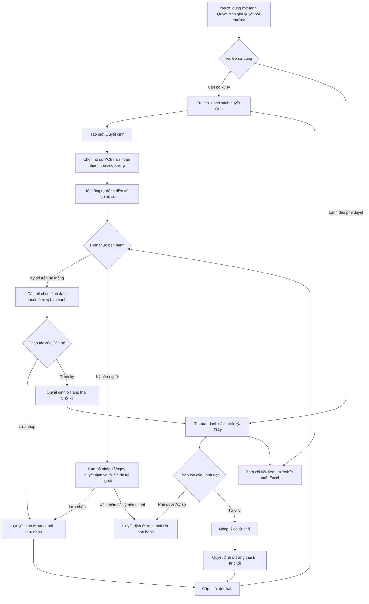

### 4.3.3. Dành cho Cán bộ Công tác bồi thường nhà nước

#### 4.3.3.3. UC465-466 - Quyết định giải quyết bồi thường

##### 4.3.3.3.1. Mục đích

\- Cho phép Cán bộ xử lý lập dự thảo, lưu nháp, trình ký và cập nhật lại dự thảo Quyết định giải quyết bồi thường trên cơ sở hồ sơ yêu cầu bồi thường đã hoàn thành thương lượng.

\- Cho phép quản lý ban hành Quyết định giải quyết bồi thường theo hai hình thức: `Ký số trên hệ thống` hoặc `Ký bên ngoài`. Với `Ký số trên hệ thống`, hệ thống trình lãnh đạo của đơn vị ban hành phê duyệt/ký; với `Ký bên ngoài`, hệ thống không trình lãnh đạo mà ghi nhận thông tin quyết định đã ký ngoài, file quyết định đã ký và dữ liệu sổ văn bản tương ứng.

\- Cho phép Lãnh đạo phê duyệt hoặc từ chối dự thảo Quyết định giải quyết bồi thường trong trường hợp chọn hình thức `Ký số trên hệ thống`; trường hợp phê duyệt/ký thành công, hệ thống ghi nhận trạng thái ký và thông tin ban hành theo giao diện.

\- Cho phép người dùng tra cứu, xem chi tiết, xem trước văn bản quyết định và liên kết xem hồ sơ yêu cầu bồi thường gốc.

\- Cho phép quản lý nghiệp vụ `Hủy quyết định giải quyết bồi thường` đối với Quyết định giải quyết bồi thường đã ký/đã ban hành; sinh văn bản theo `Mẫu 11/BTNN`, hỗ trợ tải xuống Word/PDF và quản lý theo hai hình thức ban hành: `Ký số trên hệ thống` hoặc `Ký bên ngoài`.

\- Cho phép quản lý nghiệp vụ `Sửa chữa, bổ sung quyết định giải quyết bồi thường` đối với Quyết định giải quyết bồi thường đã ký/đã ban hành; sinh văn bản theo `Mẫu 12/BTNN`, hỗ trợ tải xuống Word/PDF và quản lý theo hai hình thức ban hành: `Ký số trên hệ thống` hoặc `Ký bên ngoài`.

*a. Phân quyền*:

\- Cán bộ xử lý: Được tra cứu danh sách, tạo mới quyết định, lưu nháp, trình ký đối với hình thức `Ký số trên hệ thống`, ghi nhận quyết định `Ký bên ngoài`, cập nhật dự thảo ở trạng thái "Lưu nháp" hoặc "Bị từ chối", xóa quyết định ở trạng thái "Lưu nháp", lập dự thảo hủy quyết định, lập dự thảo sửa chữa/bổ sung quyết định, xem chi tiết bằng cách click dòng dữ liệu và kết xuất Excel.

\- Lãnh đạo phê duyệt: Được tra cứu danh sách quyết định thuộc phạm vi phê duyệt của đơn vị ban hành, xem chi tiết quyết định bằng cách click dòng dữ liệu, phê duyệt hoặc từ chối quyết định ở trạng thái "Chờ ký" đối với hình thức `Ký số trên hệ thống`.

*b. Điều kiện thực hiện*:

\- Người dùng đã đăng nhập Website Quản trị và được phân quyền truy cập nhóm chức năng Công tác bồi thường nhà nước.

\- Hồ sơ yêu cầu bồi thường dùng để lập quyết định thuộc danh sách hồ sơ đã hoàn thành thương lượng và đủ điều kiện ban hành quyết định.

\- Hệ thống phân biệt `Đơn vị nhập liệu` và `Đơn vị ban hành`. Trường hợp BTP/STP nhập thay cho đơn vị cấp dưới, số quyết định và lãnh đạo ký vẫn xác định theo `Đơn vị ban hành`, không xác định theo đơn vị nhập liệu.

\- Mỗi quyết định phải gắn với một `Sổ văn bản áp dụng` theo tổ hợp `Đơn vị ban hành + Loại văn bản/quyết định + Năm sổ`. Quyết định ký số và quyết định ký bên ngoài dùng chung sổ, không tách sổ riêng theo hình thức ký.

\- Với `Ký số trên hệ thống`, hệ thống cấp số/ngày ban hành từ sổ văn bản khi lãnh đạo đơn vị ban hành phê duyệt/ký thành công. Với `Ký bên ngoài`, cán bộ nhập/ghi nhận số, ngày quyết định đã ký ngoài; hệ thống kiểm tra trùng số trong cùng sổ/năm và cảnh báo nếu số không liền kề số hiện tại của sổ.

\- Các trạng thái Quyết định giải quyết bồi thường Tham chiếu Danh mục DM_30 [DM_30].

\- Loại quyết định Tham chiếu Danh mục Hình thức phục hồi danh dự [DM_31].

##### 4.3.3.3.2. Sơ đồ luồng nghiệp vụ theo giao diện

##### 4.3.3.3.3. MH01 - Màn hình Danh sách Quyết định giải quyết bồi thường

###### 4.3.3.3.3.1. Màn hình

###### 4.3.3.3.3.2. Mô tả thông tin trên màn hình

| Trường thông tin | Kiểu dữ liệu | Bắt buộc | Mặc định | Mô tả |
| :--- | :--- | :--- | :--- | :--- |
| Tiêu đề màn hình | String(200) | Không | Quyết định giải quyết bồi thường | Hiển thị tên màn hình tại vùng tiêu đề trang. |
| Góc nhìn người dùng | String(100) | Có | Cán bộ xử lý | Gồm: + Cán bộ xử lý + Lãnh đạo phê duyệt Khi chọn "Lãnh đạo phê duyệt", ẩn nút "Tạo mới Quyết định" và mặc định lọc trạng thái "Chờ ký". |
| Số quyết định bồi thường | String(50) | Không | Trống | Cho phép nhập số quyết định để tìm kiếm gần đúng, không phân biệt hoa thường, tự động trim space. |
| Mã vụ việc | String(50) | Không | Trống | Cho phép nhập mã vụ việc để tìm kiếm gần đúng, không phân biệt hoa thường, tự động trim space. |
| Tên vụ việc | String(255) | Không | Trống | Cho phép nhập tên vụ việc để tìm kiếm gần đúng, không phân biệt hoa thường, tự động trim space. |
| Loại quyết định | Enum(String(100)) | Không | Tất cả | Danh sách giá trị theo Danh mục Hình thức phục hồi danh dự [DM_31], giao diện hiển thị: `Tất cả`, `Quyết định giải quyết bồi thường`, `Quyết định hủy quyết định giải quyết bồi thường`, `Quyết định sửa chữa, bổ sung quyết định giải quyết bồi thường`. |
| Người ký quyết định | String(100) | Không | Trống | Cho phép nhập tên người ký quyết định để tìm kiếm gần đúng ở góc nhìn Cán bộ xử lý. Ở góc nhìn Lãnh đạo, cột danh sách hiển thị "Cán bộ xử lý". |
| Trạng thái quyết định | Enum(String(50)) | Không | Tất cả | Danh sách giá trị theo Danh mục DM_30 [DM_30]. Control UI: Dropdown/Select. - Tất cả - Lưu nháp - Chờ ký - Bị từ chối - Đã ban hành - Đã hủy |
| Hình thức ban hành | Enum(String(50)) | Không | Tất cả | Control UI: Dropdown/Select. Gồm: `Tất cả`, `Ký số trên hệ thống`, `Ký bên ngoài`. |
| Đơn vị ban hành | Enum(String(255)) | Không | Tất cả | Control UI: Dropdown/Select. Lọc theo đơn vị có thẩm quyền ban hành quyết định; giá trị lấy từ danh mục đơn vị. |
| Ban hành: Từ ngày | - | Không | Trống | Ngày bắt đầu khoảng thời gian ban hành. Kiểm tra logic khoảng ngày theo [BR-VAL-007]. |
| Ban hành: Đến ngày | - | Không | Trống | Ngày kết thúc khoảng thời gian ban hành. Kiểm tra logic khoảng ngày theo [BR-VAL-007]. |
| Bảng danh sách quyết định | - | Không | 20 bản ghi/trang | Control UI: Data grid. - Khi người dùng truy cập màn hình, hệ thống tự động tải trang đầu tiên (Trang 1) với số lượng mặc định 20 bản ghi. - Sắp xếp mặc định: Sắp xếp theo "Ngày tạo" giảm dần (mới nhất hiển thị lên đầu). - Hiển thị danh sách quyết định theo bộ lọc và vai trò người dùng. Click trực tiếp vào dòng dữ liệu mở **MH03 - Chi tiết Quyết định giải quyết bồi thường**, trừ khi click vào icon thao tác hoặc liên kết Mã vụ việc. - Trạng thái có dữ liệu: Hiển thị danh sách các bản ghi kết quả theo cấu trúc các cột quy định. - Trạng thái không có dữ liệu (Empty State): Khi không tìm thấy kết quả phù hợp với điều kiện tìm kiếm, bảng hiển thị duy nhất 01 dòng căn giữa trên toàn bộ chiều rộng bảng (`colspan`), in nghiêng với nội dung theo MessageList dùng chung [MSG-INF-SYS-001]. |
| STT | Integer(10) | Không | Tự tăng | Hiển thị số thứ tự bản ghi trong danh sách. |
| Số quyết định | String(50) | Không | Theo dữ liệu | Hiển thị số quyết định. Trường hợp chưa được cấp số, hiển thị giá trị tương ứng của dữ liệu dự thảo. |
| Ngày ban hành | Date | Không | Theo dữ liệu | Hiển thị ngày ban hành nếu đã có dữ liệu; trường hợp chưa ban hành hiển thị trạng thái dữ liệu tương ứng. |
| Ngày hiệu lực | Date | Không | Theo dữ liệu | Hiển thị ngày có hiệu lực của quyết định. |
| Loại quyết định | Enum(String(100)) | Không | Theo dữ liệu | Hiển thị loại quyết định theo Danh mục Hình thức phục hồi danh dự [DM_31]. |
| Người ký | String(100) | Không | Theo dữ liệu | Hiển thị ở góc nhìn Cán bộ xử lý. |
| Cán bộ xử lý | String(100) | Không | Theo dữ liệu | Hiển thị ở góc nhìn Lãnh đạo phê duyệt thay cho cột Người ký. |
| Hình thức ban hành | Enum(String(50)) | Không | Theo dữ liệu | Hiển thị `Ký số trên hệ thống` hoặc `Ký bên ngoài`. |
| Đơn vị ban hành | String(255) | Không | Theo dữ liệu | Hiển thị đơn vị sở hữu sổ văn bản và có thẩm quyền ban hành quyết định. |
| Trích yếu quyết định | String(500) | Không | Theo dữ liệu | Hiển thị trích yếu quyết định giải quyết bồi thường. |
| Mã vụ việc | String(50) | Không | Theo dữ liệu | Hiển thị dạng Link. Cho phép mở màn hình **MH06 - Hồ sơ yêu cầu bồi thường liên kết** trong cùng tab/màn làm việc theo luồng liên kết của hệ thống. |
| Tên vụ việc | String(255) | Không | Theo dữ liệu | Hiển thị tên vụ việc bồi thường liên kết. |
| Trạng thái | Enum(String(50)) | Không | Theo dữ liệu | Hiển thị dạng Badge. Hiển thị trạng thái quyết định theo Danh mục DM_30 [DM_30]. |
| Thao tác | - | Không | Theo vai trò/trạng thái | Không hiển thị row click xem chi tiết; người dùng xem chi tiết bằng cách click vào dòng dữ liệu. Với Cán bộ xử lý hiển thị các icon hợp lệ theo trạng thái: `Sửa`, `Xóa`, `Hủy quyết định`, `Sửa chữa, bổ sung`. Với Lãnh đạo phê duyệt hiển thị các icon: `Phê duyệt`, `Từ chối`. Các thao tác không hợp lệ theo trạng thái hiển thị dạng mờ/không cho bấm. |
| Phân trang | String(255) | Không | 20 bản ghi/trang | Control UI: Pagination. - Cho phép chọn cấu hình số lượng bản ghi hiển thị trên mỗi trang gồm: 10, 20, 50, 100 bản ghi/trang; mặc định chọn sẵn 20 bản ghi/trang. - Đầy đủ các nút điều hướng trang: Đầu (&#124;&lt;&lt;), Trước (&lt;), các số trang, Sau (&gt;), Cuối (&gt;&gt;&#124;). - Hiển thị dải bản ghi: "Hiển thị [từ] - [đến] của [tổng số] bản ghi". |

###### 4.3.3.3.3.3. Chức năng trên màn hình

| STT | Tên chức năng | Định dạng | Mô tả |
| :--- | :--- | :--- | :--- |
| 1 | Cán bộ xử lý | Tab | Chuyển danh sách sang góc nhìn Cán bộ xử lý; hiển thị nút "Tạo mới Quyết định" và danh sách thao tác của Cán bộ. |
| 2 | Lãnh đạo phê duyệt | Tab | Chuyển danh sách sang góc nhìn Lãnh đạo phê duyệt; ẩn nút "Tạo mới Quyết định", mặc định lọc trạng thái "Chờ ký" và chỉ hiển thị các quyết định thuộc phạm vi phê duyệt. |
| 3 | Xóa bộ lọc | Button | Xóa toàn bộ điều kiện tìm kiếm/lọc, đưa màn hình về dữ liệu mặc định theo vai trò hiện tại. |
| 4 | Tìm kiếm | Button | Khi người dùng click nút, hệ thống kiểm tra điều kiện dữ liệu và thực hiện tìm kiếm theo các trường hợp bên dưới: |
|  |  |  | **TH1 - Khoảng ngày không hợp lệ**: Nếu `Từ ngày` lớn hơn `Đến ngày`, vi phạm [BR-VAL-007], hệ thống hiển thị cảnh báo lỗi [MSG-ERR-VAL-007] và không thực hiện tìm kiếm. |
|  |  |  | **TH Hợp lệ (Có dữ liệu phù hợp)**: Hệ thống lọc và hiển thị danh sách các bản ghi thỏa mãn đồng thời các tiêu chí tìm kiếm/lọc đã nhập/chọn, hiển thị kết quả lên bảng và đưa về Trang 1. |
|  |  |  | **TH Không có dữ liệu trả về**: Bảng kết quả hiển thị duy nhất 01 dòng căn giữa trên toàn bộ chiều rộng bảng (`colspan`), in nghiêng với nội dung theo MessageList dùng chung [MSG-INF-SYS-001]; thanh phân trang hiển thị *"Hiển thị 0-0 của 0 bản ghi"*, các nút điều hướng trang ở trạng thái ẩn hoặc khóa mờ (Disabled); nút "Kết xuất Excel" (nếu có) ở trạng thái khóa mờ kèm tooltip *"Không có dữ liệu để kết xuất Excel"*. |
| 5 | Tạo mới Quyết định | Button | Chỉ hiển thị ở góc nhìn Cán bộ xử lý (ẩn ở góc nhìn Lãnh đạo phê duyệt). Mở **MH02 - Trình ký/Cập nhật Quyết định giải quyết bồi thường** ở chế độ tạo mới để Cán bộ lập dự thảo quyết định. |
| 6 | Kết xuất Excel | Button | TH1 (Không có dữ liệu): Nếu danh sách kết quả hiện hành không có bản ghi, vi phạm quy chuẩn export [BR-EXP-040], hệ thống không kết xuất dữ liệu và hiển thị [MSG-WRN-SYS-001]. |
|  |  |  | TH Hợp lệ: Kết xuất danh sách Quyết định giải quyết bồi thường ra file Excel theo đúng kết quả tìm kiếm/lọc hiện hành theo [BR-EXP-040]. |
| 7 | Click dòng dữ liệu | Row click | Mở **MH03 - Chi tiết Quyết định giải quyết bồi thường** tương ứng với bản ghi được chọn. Nếu click vào icon thao tác hoặc liên kết `Mã vụ việc`, hệ thống thực hiện chức năng của icon/liên kết và không kích hoạt row click. |
| 8 | Sửa | Icon | TH1 (Trạng thái không hợp lệ): Nếu quyết định không ở trạng thái "Lưu nháp" hoặc "Bị từ chối", icon hiển thị dạng mờ và không cho bấm. |
|  |  |  | TH Hợp lệ: Mở **MH02 - Trình ký/Cập nhật Quyết định giải quyết bồi thường** ở chế độ cập nhật với dữ liệu đã lưu của bản ghi được chọn. |
| 9 | Xóa | Icon | TH1 (Trạng thái không hợp lệ): Nếu quyết định không ở trạng thái "Lưu nháp", icon hiển thị dạng mờ và không cho bấm. |
|  |  |  | TH2 (Người dùng hủy xác nhận): Hệ thống đóng popup xác nhận, không xóa bản ghi. |
|  |  |  | TH Hợp lệ: Hiển thị popup xác nhận [MSG-CFM-SYS-001]. Khi người dùng xác nhận, hệ thống xóa quyết định lưu nháp khỏi danh sách và hiển thị [MSG-SUC-BTNN-QD-004]. |
| 10 | Phê duyệt | Icon | TH1 (Trạng thái không hợp lệ): Nếu quyết định không ở trạng thái "Chờ ký", icon hiển thị dạng mờ và không cho bấm. |
|  |  |  | TH Hợp lệ: Lãnh đạo xác nhận phê duyệt/ký số; hệ thống cấp số quyết định/ngày ban hành từ `Sổ văn bản áp dụng`, cập nhật trạng thái quyết định thành "Đã ban hành", ghi nhận lịch sử xử lý, cập nhật danh sách và hiển thị [MSG-SUC-BTNN-QD-002]. |
| 11 | Từ chối | Icon | TH1 (Trạng thái không hợp lệ): Nếu quyết định không ở trạng thái "Chờ ký", icon hiển thị dạng mờ và không cho bấm. |
|  |  |  | TH Hợp lệ: Mở **Popup Yêu cầu hiệu chỉnh dự thảo Quyết định** để Lãnh đạo nhập lý do từ chối. |
| 12 | Mã vụ việc | Link | Điều hướng sang màn hình **MH06 - Hồ sơ yêu cầu bồi thường liên kết** trong cùng tab/khung làm việc (kèm tham số đường dẫn quay về); khi đóng/rời màn hồ sơ gốc, quay lại đúng màn Quyết định giải quyết bồi thường. |
| 13 | Hủy quyết định | Icon/Button | TH1 (Quyết định chưa ở trạng thái "Đã ký" hoặc "Đã ban hành"): Icon hiển thị dạng mờ và không cho bấm. |
|  |  |  | TH Hợp lệ: Mở **MH08 - Hủy/Sửa chữa, bổ sung Quyết định giải quyết bồi thường** ở chế độ `Hủy quyết định giải quyết bồi thường`; hệ thống kế thừa thông tin quyết định gốc để lập văn bản theo `Mẫu 11/BTNN`. |
| 14 | Sửa chữa, bổ sung | Icon/Button | TH1 (Quyết định chưa ở trạng thái "Đã ký" hoặc "Đã ban hành"): Icon hiển thị dạng mờ và không cho bấm. |
|  |  |  | TH Hợp lệ: Mở **MH08 - Hủy/Sửa chữa, bổ sung Quyết định giải quyết bồi thường** ở chế độ `Sửa chữa, bổ sung quyết định giải quyết bồi thường`; hệ thống kế thừa thông tin quyết định gốc để lập văn bản theo `Mẫu 12/BTNN`. |

##### 4.3.3.3.4. MH02 - Màn hình Trình ký/Cập nhật Quyết định giải quyết bồi thường

###### 4.3.3.3.4.1. Màn hình

###### 4.3.3.3.4.2. Mô tả thông tin trên màn hình

| Trường thông tin | Kiểu dữ liệu | Bắt buộc | Mặc định | Mô tả |
| :--- | :--- | :--- | :--- | :--- |
| Tiêu đề form | String(200) | Không | Theo ngữ cảnh | Khi tạo mới hiển thị "LẬP QUYẾT ĐỊNH GIẢI QUYẾT BỒI THƯỜNG MỚI". Khi sửa hiển thị "CẬP NHẬT DỰ THẢO QUYẾT ĐỊNH: [Số quyết định]". |
| Đóng | - | Không | Hiển thị | Chi tiết nghiệp vụ xem ở bảng Chức năng trên màn hình. |
| Mã vụ việc | String(50) | Có | Trống | Cho phép nhập mã vụ việc YCBT đủ điều kiện lập quyết định. Khi chọn vụ việc từ popup, hệ thống tự động điền mã vụ việc vào trường này. |
| Tìm kiếm | - | Không | Hiển thị cạnh trường Mã vụ việc | Chi tiết nghiệp vụ xem ở bảng Chức năng trên màn hình. |
| Tìm kiếm nâng cao | - | Không | Hiển thị cạnh trường Mã vụ việc | Mở popup chuẩn **Popup chuẩn Tìm kiếm vụ việc/hồ sơ gốc liên quan** với tiêu đề `Tìm kiếm vụ việc yêu cầu bồi thường đủ điều kiện lập quyết định`; nguồn dữ liệu chỉ gồm các vụ việc đủ điều kiện lập Quyết định giải quyết bồi thường. |
| Cơ quan cấp trên | String(255) | Không | BỘ TƯ PHÁP | Lưu dưới dạng trường ẩn, không hiển thị ô nhập chỉ đọc riêng ở cột trái; giá trị được dùng để dựng bản xem trước/văn bản quyết định, tránh trùng lặp hiển thị thông tin (thiết kế có chủ đích). |
| Đơn vị nhập liệu | String(255) | Không | Theo tài khoản đăng nhập | Chỉ đọc. Ghi nhận đơn vị đang thực hiện nhập/thao tác trên hệ thống; không dùng để cấp số quyết định nếu khác đơn vị ban hành. |
| Đơn vị ban hành | Enum(String(255)) | Có | Theo vụ việc/giá trị đầu tiên | Đơn vị có thẩm quyền ban hành quyết định. Giá trị lấy từ danh mục đơn vị; cho phép BTP/STP nhập thay nhưng phải chọn đúng đơn vị ban hành thực tế. |
| Sổ văn bản áp dụng | Enum(String(255)) | Có | Tự động theo đơn vị ban hành | Hệ thống tự xác định theo `Đơn vị ban hành + Loại quyết định + Năm sổ`; cho phép chọn lại trong danh sách sổ còn hiệu lực nếu đơn vị có nhiều sổ phù hợp. |
| Hình thức ban hành | Enum(String(50)) | Có | `Ký số trên hệ thống` | Gồm `Ký số trên hệ thống` và `Ký bên ngoài`. Khi chọn `Ký số trên hệ thống`, hiển thị trường Lãnh đạo ký ban hành và nút `Trình ký`. Khi chọn `Ký bên ngoài`, ẩn trường Lãnh đạo ký ban hành, hiển thị nhóm thông tin số/ngày/file quyết định đã ký ngoài và nút `Xác nhận đã ký bên ngoài`. |
| Chữ viết tắt tên cơ quan | String(20) | Có | Trống | Cán bộ nhập chữ viết tắt tên cơ quan để hiển thị trên văn bản quyết định. |
| Chức vụ của người đứng đầu | String(100) | Có | Trống | Cán bộ nhập chức vụ của người ký/đứng đầu cơ quan ban hành. |
| Lãnh đạo ký ban hành | Enum(String(255)) | Có khi `Hình thức ban hành` = `Ký số trên hệ thống` | Chọn lãnh đạo ký | \- Control UI: Dropdown/Select thường (không có ô tìm kiếm riêng, do danh sách lãnh đạo đủ thẩm quyền ký của một đơn vị ban hành thường dưới 10 người nên không cần thêm ô tìm kiếm). - Bắt buộc chọn trước khi trình ký. - Chỉ hiển thị lãnh đạo còn hiệu lực, thuộc `Đơn vị ban hành` hoặc phạm vi được ủy quyền ký cho đơn vị ban hành. - Không lấy danh sách lãnh đạo theo `Đơn vị nhập liệu` nếu cán bộ đang nhập thay. |
| Số văn bản | String(50) | Có điều kiện | Trống | Với `Ký số trên hệ thống`: hệ thống cấp số từ `Sổ văn bản áp dụng` khi lãnh đạo phê duyệt/ký thành công; giá trị lưu ẩn (hidden) trên form, không hiển thị ô chỉ đọc riêng ở cột trái (thiết kế có chủ đích, tránh trùng lặp vì số quyết định sau khi cấp đã hiển thị tại màn hình Chi tiết MH03 và trên bản xem trước/văn bản chính thức). Với `Ký bên ngoài`: cán bộ nhập số quyết định đã ký ngoài vào nhóm trường hiển thị riêng (Số quyết định/Ngày quyết định/Người ký/Chức vụ người ký); hệ thống kiểm tra trùng số trong cùng sổ/năm ([BR-VAL-007]-tương đương) và cảnh báo, yêu cầu nhập lý do vào ô "Lý do nhập số chưa tuần tự" nếu số không liền kề số hiện tại của sổ. |
| Ngày quyết định | Date | Có khi `Hình thức ban hành` = `Ký bên ngoài` | Trống | Ngày quyết định đã ký ngoài; dùng datepicker, không được lớn hơn ngày hiện tại. Với ký số, hệ thống ghi nhận ngày ban hành theo thời điểm ký/phê duyệt thành công. |
| Tệp quyết định ký bên ngoài | File | Có khi `Hình thức ban hành` = `Ký bên ngoài` | Trống | Đính kèm file quyết định đã ký/đóng dấu bên ngoài hệ thống; file này được lưu là bản ban hành chính thức. |
| Địa điểm ban hành | String(100) | Không | Hà Nội | Lưu ẩn; dùng để dựng bản xem trước/văn bản, không hiển thị ô chỉ đọc riêng ở cột trái (tránh trùng lặp hiển thị). |
| Mã vụ việc | String(50) | Có | Theo vụ việc được chọn | Chỉ đọc, hiển thị tại trường "Mã vụ việc" đầu form (mục tìm kiếm/chọn vụ việc); không lặp lại thêm một ô chỉ đọc khác ở cột trái. |
| Tên vụ việc | String(255) | Không | Theo vụ việc được chọn | Không lưu thành trường dữ liệu riêng trên form; hệ thống suy ra tên vụ việc theo quy ước "Vụ việc yêu cầu bồi thường của [Người yêu cầu]" khi hiển thị ở danh sách, màn Chi tiết (MH03) và bản xem trước, tránh trùng lặp nhập liệu. |
| Người yêu cầu bồi thường | String(100) | Không | Theo vụ việc được chọn | Lưu ẩn; dùng để dựng bản xem trước/văn bản, không hiển thị ô chỉ đọc riêng ở cột trái. |
| Tỉnh/Thành phố | Enum(String(100)) / String(100) | Không | Theo vụ việc được chọn | Control UI: Combobox có tìm kiếm / Input text. - Nếu `Quốc gia` = `Việt Nam`: Tham chiếu Danh mục Tỉnh/Thành phố [DM_13]. Cho phép gõ tìm kiếm theo Mã hoặc Tên. - Nếu `Quốc gia` khác `Việt Nam`: Hiển thị ô nhập văn bản để người dùng tự do nhập. |
| Phường/Xã | Enum(String(100)) / String(100) | Không | Theo vụ việc được chọn | Control UI: Combobox có tìm kiếm / Input text. - Phụ thuộc vào `Tỉnh/Thành phố` đã chọn. - Nếu `Quốc gia` = `Việt Nam`: Tham chiếu Danh mục Xã/Phường/Thị trấn [DM_15] (lọc động theo Tỉnh/Thành phố đã chọn). Cho phép gõ tìm kiếm theo Mã hoặc Tên. Nếu chưa chọn Tỉnh/Thành phố thì khóa mờ (Disabled) kèm placeholder *"Vui lòng chọn Tỉnh/Thành phố trước"*. - Nếu `Quốc gia` khác `Việt Nam`: Hiển thị ô nhập văn bản (Input text) để người dùng tự do nhập. |
| Địa chỉ chi tiết | Text(1000) / String(500) | Không | Theo vụ việc được chọn | Control UI: Textarea / Input text. - Nhập/hiển thị số nhà, tên đường/phố, thôn/xóm/ấp... |
| Cán bộ/Người thi hành công vụ gây thiệt hại | String(100) | Không | Theo vụ việc được chọn | Lưu ẩn; dùng để dựng bản xem trước/văn bản, không hiển thị ô chỉ đọc riêng ở cột trái. |
| Căn cứ văn bản | String(500) | Không | Theo vụ việc được chọn | Lưu ẩn; dùng để dựng bản xem trước/văn bản (mục "Căn cứ"), không hiển thị ô chỉ đọc riêng ở cột trái. |
| Cơ quan quản lý người thi hành công vụ | String(255) | Không | Sở Tư pháp Thành phố Hà Nội | Lưu ẩn; dùng để dựng bản xem trước/văn bản, không hiển thị ô chỉ đọc riêng ở cột trái. |
| Ngày thương lượng | Date | Không | Theo vụ việc được chọn | Lưu ẩn; dùng để dựng bản xem trước/văn bản (căn cứ Biên bản thương lượng), không hiển thị ô chỉ đọc riêng ở cột trái. |
| Phương thức chi trả | String(255) | Không | chuyển khoản vào tài khoản cá nhân của người yêu cầu | Lưu ẩn; dùng để dựng bản xem trước/văn bản (Điều 2), không hiển thị ô chỉ đọc riêng ở cột trái. Nếu chuẩn hóa danh mục, Tham chiếu Danh mục Phương thức nhận tiền bồi thường/tạm ứng [DM_28]. |
| Các căn cứ ban hành khác | Text(2000) | Không | Trống | Cho phép nhập thêm nhiều dòng căn cứ ban hành khác; mỗi dòng được hiển thị thành một căn cứ trên bản xem trước. |
| Cảnh báo chênh lệch số liệu | String(255) | Không | Ẩn | Hiển thị khi tổng số tiền tính toán từ cấu phần thiệt hại khác tổng số tiền đã xác minh của hồ sơ YCBT. |
| Lý do điều chỉnh số liệu kinh phí | Text(2000) | Có khi có cảnh báo chênh lệch | Trống | Chỉ hiển thị/bắt buộc khi cảnh báo chênh lệch số liệu hiển thị. Kiểm tra bắt buộc theo [BR-VAL-001]. |
| Các quyền, lợi ích hợp pháp khác được khôi phục (nếu có) | Text(2000) | Không | Trống | Cho phép nhập nội dung quyền/lợi ích hợp pháp khác được khôi phục. |
| Ngày có hiệu lực thi hành quyết định | Date | Có | Trống | Cán bộ chọn ngày có hiệu lực của quyết định. Kiểm tra bắt buộc theo [BR-VAL-001]. |
| Nhóm số tiền thiệt hại | Decimal(18,0) | Không | Theo hồ sơ được chọn | Tham chiếu Danh mục Loại thiệt hại yêu cầu bồi thường [DM_27]. |
| Tổng số tiền bồi thường | Decimal(18,0) | Không | Theo hồ sơ được chọn | Tự động tính/tự động điền từ hồ sơ YCBT. Kiểm tra giá trị tiền theo [BR-VAL-010] khi phát sinh nhập/chỉnh sửa ở nguồn dữ liệu. |
| Số tiền bồi thường đã tạm ứng | Decimal(18,0) | Không | Theo hồ sơ được chọn | Tự động điền từ hồ sơ YCBT. |
| Số tiền bồi thường còn lại sau khi đã tạm ứng | Decimal(18,0) | Không | Theo hồ sơ được chọn | Tự động tính bằng tổng số tiền bồi thường trừ số tiền đã tạm ứng. |
| Tài liệu đính kèm văn bản pháp lý | - | Không | Có dòng theo dữ liệu | Cho phép quản lý danh sách tài liệu căn cứ pháp lý đính kèm. Kiểm tra file theo [BR-FILE-010]. |
| STT | Integer(10) | Không | Tự tăng | Số thứ tự dòng tài liệu. |
| Tên văn bản / Căn cứ | String(500) | Không | Trống/Theo dữ liệu | Nhập tên văn bản hoặc căn cứ pháp lý. |
| File đính kèm | File | Không | Trống/Theo dữ liệu | Cho phép chọn tệp PDF theo [BR-FILE-010]. |
| Thao tác | String(255) | Không | Theo dòng | Chỉ đọc. Gồm: + Chọn tệp + Xem file + Xóa dòng Với "Xem file": Cho phép xem file tại một tab riêng. |
| Thêm dòng tài liệu | - | Không | Hiển thị | Chi tiết nghiệp vụ xem ở bảng Chức năng trên màn hình. |
| Lịch sử xử lý | - | Không | Ẩn khi chưa có dữ liệu | Hiển thị khi quyết định có lịch sử xử lý, đặc biệt khi trạng thái "Bị từ chối". |
| Thời gian | Datetime | Không | Theo dữ liệu | Chỉ đọc. Hiển thị thời điểm phát sinh lịch sử. |
| Người thực hiện | String(100) | Không | Theo dữ liệu | Hiển thị người thực hiện thao tác. |
| Thao tác | String(100) | Không | Theo dữ liệu | Hiển thị thao tác: Trình ký duyệt, Từ chối phê duyệt, Phê duyệt. |
| Nội dung / Lý do | Text(2000) | Không | Theo dữ liệu | Hiển thị nội dung xử lý hoặc lý do từ chối. |
| Khung xem trước trực quan | String(255) | Không | Dự thảo quyết định | Không hiển thị dưới dạng cột/khung trực quan cố định bên cạnh form nhập liệu; bản dựng quyết định theo dữ liệu form hiện tại chỉ được sinh khi người dùng bấm nút "Xem Trước Quyết định" (xem STT8 bảng Chức năng), mở trong một tab trình duyệt mới thay vì popup nội tuyến, cho phép xem toàn trang khổ A4 và in/tải PDF trực tiếp bằng chức năng in của trình duyệt (thiết kế có chủ đích, tránh vừa dựng trước liên tục vừa mở tab riêng, đồng thời tái sử dụng cùng cơ chế với "Tải Word/Tải PDF"). |
| Xem Trước Quyết định | - | Không | Hiển thị | Chi tiết nghiệp vụ xem ở bảng Chức năng trên màn hình. |
| Lưu nháp | - | Không | Hiển thị | Chi tiết nghiệp vụ xem ở bảng Chức năng trên màn hình. |
| Trình ký | - | Không | Hiển thị khi `Hình thức ban hành` = `Ký số trên hệ thống` | Chi tiết nghiệp vụ xem ở bảng Chức năng trên màn hình. |
| Xác nhận đã ký bên ngoài | - | Không | Hiển thị khi `Hình thức ban hành` = `Ký bên ngoài` | Chi tiết nghiệp vụ xem ở bảng Chức năng trên màn hình. |
| Hủy bỏ | - | Không | Hiển thị cuối thanh chức năng (footer) | Control UI: Button phụ (btn-secondary), tách biệt với nút "Đóng" ở góc trên bên phải form. - Vị trí: cuối thanh chức năng, cạnh nút "Lưu nháp"/"Trình ký"/"Xác nhận đã ký bên ngoài". - Hiển thị ở cả chế độ tạo mới và cập nhật. Chi tiết nghiệp vụ xem ở bảng Chức năng trên màn hình. |

###### 4.3.3.3.4.3. Chức năng trên màn hình

| STT | Tên chức năng | Định dạng | Mô tả |
| :--- | :--- | :--- | :--- |
| 1 | Đóng | Button | Đóng form tạo/cập nhật quyết định và quay lại danh sách, không tự động lưu dữ liệu đang nhập. |
| 2 | Tìm kiếm | Button | Khi người dùng click nút, hệ thống kiểm tra điều kiện dữ liệu và thực hiện tìm kiếm hồ sơ liên quan theo các trường hợp bên dưới: |
|  |  |  | **TH1 - Thiếu tiêu chí bắt buộc**: Nếu người dùng chưa nhập giá trị tại trường tìm nhanh liên quan, vi phạm [BR-VAL-001], hệ thống hiển thị cảnh báo lỗi [MSG-ERR-VAL-001] và không thực hiện tìm kiếm. |
|  |  |  | **TH Hợp lệ (Có dữ liệu phù hợp)**: Hệ thống mở popup tìm kiếm hồ sơ liên quan, tự điền giá trị đang nhập vào tiêu chí tìm kiếm tương ứng và hiển thị danh sách bản ghi phù hợp để người dùng lựa chọn. |
|  |  |  | **TH Không có dữ liệu trả về**: Bảng kết quả hiển thị duy nhất 01 dòng căn giữa trên toàn bộ chiều rộng bảng (`colspan`), in nghiêng với nội dung theo MessageList dùng chung [MSG-INF-SYS-001]; thanh phân trang hiển thị *"Hiển thị 0-0 của 0 bản ghi"*, các nút điều hướng trang ở trạng thái ẩn hoặc khóa mờ (Disabled); nút "Kết xuất Excel" (nếu có) ở trạng thái khóa mờ kèm tooltip *"Không có dữ liệu để kết xuất Excel"*. |
| 3 | Tìm kiếm nâng cao | Button | Khi người dùng click nút, hệ thống mở popup tìm kiếm nâng cao; khi thực hiện tìm kiếm trên popup, hệ thống kiểm tra điều kiện dữ liệu và xử lý theo các trường hợp bên dưới: |
|  |  |  | **TH1 - Khoảng ngày không hợp lệ**: Nếu `Từ ngày` lớn hơn `Đến ngày`, vi phạm [BR-VAL-007], hệ thống hiển thị cảnh báo lỗi [MSG-ERR-VAL-007] và không thực hiện tìm kiếm. |
|  |  |  | **TH Hợp lệ (Có dữ liệu phù hợp)**: Hệ thống lọc và hiển thị danh sách các bản ghi thỏa mãn đồng thời các tiêu chí tìm kiếm/lọc đã nhập/chọn trên popup, hiển thị kết quả lên bảng và đưa về Trang 1. |
|  |  |  | **TH Không có dữ liệu trả về**: Bảng kết quả hiển thị duy nhất 01 dòng căn giữa trên toàn bộ chiều rộng bảng (`colspan`), in nghiêng với nội dung theo MessageList dùng chung [MSG-INF-SYS-001]; thanh phân trang hiển thị *"Hiển thị 0-0 của 0 bản ghi"*, các nút điều hướng trang ở trạng thái ẩn hoặc khóa mờ (Disabled); nút "Kết xuất Excel" (nếu có) ở trạng thái khóa mờ kèm tooltip *"Không có dữ liệu để kết xuất Excel"*. |
| 4 | Thêm dòng tài liệu | Button | Thêm một dòng tài liệu mới vào bảng "Tài liệu đính kèm văn bản pháp lý" để Cán bộ nhập tên căn cứ và chọn file. |
| 5 | Chọn tệp | File button | Cho phép chọn tệp PDF đính kèm cho dòng tài liệu tương ứng. Kiểm tra định dạng và dung lượng theo [BR-FILE-010], hiển thị [MSG-ERR-FILE-001] hoặc [MSG-ERR-FILE-002] nếu không hợp lệ. |
| 6 | Xem file | Link | Cho phép xem file tại một tab riêng. |
| 7 | Xóa dòng | Icon | Xóa dòng tài liệu tương ứng khỏi bảng tài liệu đính kèm văn bản pháp lý. |
| 8 | Xem Trước Quyết định | Button | TH1 (Chưa có dữ liệu hồ sơ YCBT): Vi phạm quy tắc [BR-VAL-001]. Hệ thống hiển thị cảnh báo lỗi [MSG-ERR-VAL-001] và không mở màn hình **MH04 - Xem trước Quyết định Giải quyết yêu cầu bồi thường**. |
|  |  |  | TH Hợp lệ: Sinh nội dung quyết định tại màn hình **MH04 - Xem trước Quyết định Giải quyết yêu cầu bồi thường** từ dữ liệu đang có trên form và mở trong một tab trình duyệt mới (không phải popup nội tuyến), kèm nút "In/Tải PDF" ngay trên thanh công cụ của tab. |
| 9 | Lưu nháp | Button | TH1 (Bỏ trống trường bắt buộc): Vi phạm quy tắc [BR-VAL-001]. Hệ thống tô viền đỏ ô trống đầu tiên và hiển thị cảnh báo lỗi [MSG-ERR-VAL-001] màu đỏ. Không cho phép lưu. |
|  |  |  | TH2 (Dữ liệu không hợp lệ): Kiểm tra và phát hiện lỗi: + Nếu "Lý do điều chỉnh số liệu kinh phí" bắt buộc nhưng để trống khi có cảnh báo chênh lệch: vi phạm [BR-VAL-001], hiển thị [MSG-ERR-VAL-001], không cho phép lưu. + Nếu file tài liệu đính kèm không đúng định dạng `.pdf`: vi phạm [BR-FILE-010], hiển thị [MSG-ERR-FILE-001], không cho phép lưu. + Nếu file tài liệu đính kèm vượt quá 20MB: vi phạm [BR-FILE-010], hiển thị [MSG-ERR-FILE-002], không cho phép lưu. |
|  |  |  | TH Hợp lệ: Hệ thống lưu/cập nhật quyết định ở trạng thái "Lưu nháp", hiển thị [MSG-SUC-SYS-001] hoặc [MSG-SUC-SYS-002], cập nhật danh sách và mở **MH03 - Chi tiết Quyết định giải quyết bồi thường** của bản ghi vừa lưu. |
| 10 | Trình ký | Button | TH0 (Hình thức ban hành khác `Ký số trên hệ thống`): Nút không hiển thị. |
|  |  |  | TH1 (Bỏ trống trường bắt buộc): Vi phạm quy tắc [BR-VAL-001]. Hệ thống tô viền đỏ ô trống đầu tiên và hiển thị cảnh báo lỗi [MSG-ERR-VAL-001] màu đỏ. Không cho phép trình ký. |
|  |  |  | TH2 (Dữ liệu không hợp lệ): Kiểm tra và phát hiện lỗi: + Nếu "Lý do điều chỉnh số liệu kinh phí" bắt buộc nhưng để trống khi có cảnh báo chênh lệch: vi phạm [BR-VAL-001], hiển thị [MSG-ERR-VAL-001], không cho phép trình ký. + Nếu file tài liệu đính kèm không đúng định dạng `.pdf`: vi phạm [BR-FILE-010], hiển thị [MSG-ERR-FILE-001], không cho phép trình ký. + Nếu file tài liệu đính kèm vượt quá 20MB: vi phạm [BR-FILE-010], hiển thị [MSG-ERR-FILE-002], không cho phép trình ký. |
|  |  |  | TH3 (Lãnh đạo ký không thuộc phạm vi đơn vị ban hành): Hệ thống không cho trình ký và hiển thị cảnh báo theo MessageList chung. |
|  |  |  | TH Hợp lệ: Hệ thống lưu quyết định ở trạng thái "Chờ ký", ghi nhận Lãnh đạo ký ban hành đã chọn thuộc `Đơn vị ban hành`, chuyển quyết định đến đúng Lãnh đạo đã chọn, ghi nhận lịch sử "Trình ký duyệt", cập nhật danh sách, mở **MH03 - Chi tiết Quyết định giải quyết bồi thường** của bản ghi vừa trình ký và hiển thị [MSG-SUC-BTNN-QD-001]. |
| 11 | Xác nhận đã ký bên ngoài | Button | TH0 (Hình thức ban hành khác `Ký bên ngoài`): Nút không hiển thị. |
|  |  |  | TH1 (Thiếu số quyết định, ngày quyết định hoặc tệp quyết định ký bên ngoài): Vi phạm [BR-VAL-001]/[BR-FILE-010], hệ thống không cho xác nhận. |
|  |  |  | TH2 (Trùng số quyết định trong cùng sổ/năm): Hệ thống không cho xác nhận và hiển thị cảnh báo theo MessageList chung. |
|  |  |  | TH3 (Số quyết định không liền kề số hiện tại của sổ): Hệ thống hiển thị cảnh báo và yêu cầu nhập lý do ghi nhận số ngoài không tuần tự; nếu người dùng không nhập lý do thì không cho xác nhận. |
|  |  |  | TH Hợp lệ: Hệ thống lưu quyết định ở trạng thái "Đã ban hành", ghi nhận `Đơn vị nhập liệu`, `Đơn vị ban hành`, `Sổ văn bản áp dụng`, số/ngày quyết định, file đã ký bên ngoài, lý do nếu số không tuần tự, cập nhật danh sách và hiển thị thông báo thành công theo MessageList. |
| 12 | Hủy bỏ | Button | Đóng form tạo/cập nhật quyết định và quay lại danh sách, không lưu dữ liệu đang nhập; tương đương chức năng nút "Đóng" ở góc trên bên phải form. |

##### 4.3.3.3.5. MH03 - Màn hình Chi tiết Quyết định giải quyết bồi thường

###### 4.3.3.3.5.1. Màn hình

###### 4.3.3.3.5.2. Mô tả thông tin trên màn hình

| Trường thông tin | Kiểu dữ liệu | Bắt buộc | Mặc định | Mô tả |
| :--- | :--- | :--- | :--- | :--- |
| Tiêu đề | String(200) | Không | CHI TIẾT QUYẾT ĐỊNH GIẢI QUYẾT BỒI THƯỜNG | Hiển thị tiêu đề modal chi tiết. |
| Đóng | - | Không | Hiển thị | Chi tiết nghiệp vụ xem ở bảng Chức năng trên màn hình. |
| Trạng thái quyết định | Enum(String(50)) | Không | Theo dữ liệu | Hiển thị trạng thái theo Danh mục DM_30 [DM_30]. |
| Loại quyết định | Enum(String(100)) | Không | Quyết định giải quyết bồi thường | Hiển thị loại quyết định theo Danh mục Hình thức phục hồi danh dự [DM_31]; tiêu đề màn hình và tiêu đề khối "Quyết định đã ký số" cũng thay đổi tương ứng khi loại là hủy/sửa chữa, bổ sung. |
| Số văn bản | String(50) | Không | Theo dữ liệu | Hiển thị số quyết định/văn bản. |
| Người ký ban hành | String(100) | Không | Theo dữ liệu | Hiển thị lãnh đạo ký ban hành. |
| Ngày ban hành | Date | Không | Theo dữ liệu | Hiển thị ngày ban hành quyết định. |
| Cơ quan ban hành | String(255) | Không | Theo dữ liệu | Hiển thị cơ quan ban hành quyết định. |
| Đơn vị nhập liệu | String(255) | Không | Theo dữ liệu | Hiển thị đơn vị đã thực hiện nhập/thao tác quyết định trên hệ thống (có thể khác Cơ quan ban hành khi BTP/STP nhập thay). |
| Sổ văn bản áp dụng | String(255) | Không | Theo dữ liệu | Hiển thị sổ văn bản đã áp dụng để cấp số quyết định. |
| Ngày có hiệu lực | Date | Không | Theo dữ liệu | Hiển thị ngày có hiệu lực thi hành quyết định. |
| Quyết định gốc | String(50) | Không | Ẩn nếu không có | Chỉ hiển thị khi bản ghi đang xem là quyết định hủy hoặc sửa chữa, bổ sung; hiển thị số quyết định gốc liên quan. |
| File quyết định | String(255) | Không | Quyet_dinh_09_BTNN.pdf | Hiển thị tên file quyết định theo dữ liệu. |
| Tải file | - | Không | Hiển thị khi trạng thái "Đã ký" hoặc "Đã ban hành" | Cho phép tải file quyết định đã ký/ban hành. |
| Xem Quyết định | - | Không | Hiển thị khi trạng thái "Đã ký" hoặc "Đã ban hành" | Chi tiết nghiệp vụ xem ở bảng Chức năng trên màn hình. |
| Xem Trước Quyết định | - | Không | Hiển thị khi chưa ký/ban hành | Chi tiết nghiệp vụ xem ở bảng Chức năng trên màn hình. |
| Bảng căn cứ pháp lý/tài liệu | - | Không | Theo dữ liệu | Hiển thị danh sách văn bản căn cứ của quyết định. |
| STT | Integer(10) | Không | Tự tăng | Số thứ tự văn bản/tài liệu. |
| Tên văn bản / Căn cứ pháp lý | String(500) | Không | Theo dữ liệu | Hiển thị tên văn bản/căn cứ. |
| Ngày ban hành/Lập | Date | Không | Theo dữ liệu | Hiển thị ngày ban hành/lập văn bản căn cứ. |
| Thao tác | - | Không | Theo dữ liệu | Gồm thao tác xem file/tài liệu. Với "Xem file": Cho phép xem file tại một tab riêng. |
| Ý kiến hiệu chỉnh từ Lãnh đạo | Text(2000) | Không | Hiển thị khi trạng thái "Bị từ chối" | Hiển thị lý do từ chối để Cán bộ cập nhật lại dự thảo. |
| Từ chối | - | Không | Chỉ hiển thị với Lãnh đạo khi trạng thái "Chờ ký" | Chi tiết nghiệp vụ xem ở bảng Chức năng trên màn hình. |
| Phê duyệt | - | Không | Chỉ hiển thị với Lãnh đạo khi trạng thái "Chờ ký" | Chi tiết nghiệp vụ xem ở bảng Chức năng trên màn hình. |

###### 4.3.3.3.5.3. Chức năng trên màn hình

| STT | Tên chức năng | Định dạng | Mô tả |
| :--- | :--- | :--- | :--- |
| 1 | Đóng | Button/Icon | Đóng màn hình chi tiết và quay lại danh sách Quyết định giải quyết bồi thường. |
| 2 | Tải file | Button/Link | Tải file quyết định đã ký/ban hành về máy người dùng. |
| 3 | Xem Quyết định | Button/Link | Cho phép xem file tại một tab riêng. |
| 4 | Xem Trước Quyết định | Button/Link | Sinh nội dung tại màn hình **MH04 - Xem trước Quyết định Giải quyết yêu cầu bồi thường** từ dữ liệu hiện tại của bản ghi và mở trong một tab trình duyệt mới. |
| 5 | Xem file | Link | Cho phép xem file tại một tab riêng. |
| 6 | Từ chối | Button | Mở **Popup Yêu cầu hiệu chỉnh dự thảo Quyết định** để Lãnh đạo nhập lý do từ chối phê duyệt. |
| 7 | Phê duyệt | Button | TH1 (Trạng thái không hợp lệ): Nếu quyết định không ở trạng thái "Chờ ký", hệ thống không hiển thị nút hoặc không cho thực hiện thao tác. |
|  |  |  | TH Hợp lệ: Lãnh đạo xác nhận phê duyệt/ký số; hệ thống cấp số/ngày ban hành từ `Sổ văn bản áp dụng`, cập nhật trạng thái quyết định thành "Đã ban hành", ghi lịch sử xử lý, cập nhật danh sách và hiển thị [MSG-SUC-BTNN-QD-002]. |

##### 4.3.3.3.6. MH04 - Xem trước Quyết định Giải quyết yêu cầu bồi thường (mở tab trình duyệt mới)

> Ghi chú thiết kế: Màn hình này được triển khai dưới dạng nội dung mở trong một **tab trình duyệt mới** (không phải popup/modal nội tuyến trong trang) — cho phép xem toàn trang khổ A4 và sử dụng trực tiếp chức năng in/tải PDF của trình duyệt, đồng nhất cách triển khai với "Tải Word"/"Tải PDF" ở MH08. Nội dung, watermark trạng thái và các quy tắc nghiệp vụ mô tả bên dưới không thay đổi.

###### 4.3.3.3.6.1. Màn hình

###### 4.3.3.3.6.2. Mô tả thông tin trên màn hình

| Trường thông tin | Kiểu dữ liệu | Bắt buộc | Mặc định | Mô tả |
| :--- | :--- | :--- | :--- | :--- |
| Tiêu đề tab trình duyệt | String(200) | Không | Xem trước Quyết định Giải quyết yêu cầu bồi thường | Hiển thị tại thanh tiêu đề (title) và thanh công cụ sticky trên cùng của tab trình duyệt mới. |
| Nội dung quyết định | Text(2000) | Không | Theo dữ liệu form/bản ghi | Hiển thị bản xem trước gồm phần cơ quan ban hành, quốc hiệu/tiêu ngữ, số quyết định, địa điểm/ngày tháng, căn cứ, các điều khoản bồi thường, số tiền, phương thức chi trả, khôi phục quyền lợi, hiệu lực, nơi nhận và vùng chữ ký. |
| Dấu trạng thái dự thảo/đã ký/bị từ chối | Enum(String(50)) | Không | Theo trạng thái | Nếu chưa ký hiển thị watermark dự thảo. Nếu đã ký hiển thị dấu ký số. Nếu bị từ chối hiển thị ý kiến hiệu chỉnh của Lãnh đạo trong nội dung xem trước. |
| In/Tải PDF | - | Không | Hiển thị trên thanh công cụ của tab | Chi tiết nghiệp vụ xem ở bảng Chức năng trên màn hình. |

###### 4.3.3.3.6.3. Chức năng trên màn hình

| STT | Tên chức năng | Định dạng | Mô tả |
| :--- | :--- | :--- | :--- |
| 1 | In/Tải PDF | Button | Gọi chức năng in của trình duyệt trên nội dung bản xem trước để người dùng in hoặc lưu thành PDF. |
| 2 | Đóng | Đóng tab trình duyệt | Người dùng đóng tab trình duyệt hiện tại (thao tác trình duyệt, không phải nút trong trang) để quay lại màn hình trước đó, vẫn còn nguyên trạng thái do được mở ở tab riêng. |

##### 4.3.3.3.7. MH05 - Popup Yêu cầu hiệu chỉnh dự thảo Quyết định

###### 4.3.3.3.7.1. Màn hình

###### 4.3.3.3.7.2. Mô tả thông tin trên màn hình

| Trường thông tin | Kiểu dữ liệu | Bắt buộc | Mặc định | Mô tả |
| :--- | :--- | :--- | :--- | :--- |
| Tiêu đề popup | String(200) | Không | Yêu cầu hiệu chỉnh dự thảo Quyết định | Hiển thị tiêu đề popup từ chối phê duyệt. |
| Lý do từ chối phê duyệt (Yêu cầu cán bộ chỉnh sửa) | Text(2000) | Có | Trống | Lãnh đạo nhập lý do từ chối/yêu cầu hiệu chỉnh. Kiểm tra bắt buộc theo [BR-VAL-001]. |
| Hủy bỏ | - | Không | Hiển thị | Chi tiết nghiệp vụ xem ở bảng Chức năng trên màn hình. |
| Xác nhận từ chối | - | Không | Hiển thị | Chi tiết nghiệp vụ xem ở bảng Chức năng trên màn hình. |

###### 4.3.3.3.7.3. Chức năng trên màn hình

| STT | Tên chức năng | Định dạng | Mô tả |
| :--- | :--- | :--- | :--- |
| 1 | Hủy bỏ | Button | Đóng popup từ chối, không cập nhật trạng thái quyết định và không ghi nhận lý do từ chối. |
| 2 | Xác nhận từ chối | Button | TH1 (Bỏ trống trường bắt buộc): Vi phạm quy tắc [BR-VAL-001]. Hệ thống tô viền đỏ ô trống đầu tiên và hiển thị cảnh báo lỗi [MSG-ERR-VAL-001] màu đỏ. Không cho phép xác nhận từ chối. |
|  |  |  | TH Hợp lệ: Hệ thống cập nhật trạng thái quyết định thành "Bị từ chối", lưu lý do từ chối vào lịch sử xử lý, đóng popup, cập nhật danh sách và hiển thị [MSG-SUC-BTNN-QD-003]. |

##### 4.3.3.3.8. MH06 - Hồ sơ yêu cầu bồi thường liên kết (điều hướng sang màn hình quản lý hồ sơ gốc)

> Ghi chú thiết kế: Thay vì mở một popup tóm tắt riêng, hệ thống điều hướng trực tiếp (trong cùng tab/khung làm việc, kèm tham số đường dẫn quay về) sang màn hình quản lý Hồ sơ yêu cầu bồi thường gốc — cho phép người dùng xem đầy đủ nghiệp vụ và thao tác trên chính hồ sơ gốc thay vì chỉ xem một bản tóm tắt không thao tác được, đồng thời vẫn đảm bảo quay lại đúng màn Quyết định giải quyết bồi thường khi rời khỏi. Các trường thông tin bên dưới là thông tin tối thiểu cần có tại màn hình được điều hướng tới.

###### 4.3.3.3.8.1. Màn hình

###### 4.3.3.3.8.2. Mô tả thông tin trên màn hình

| Trường thông tin | Kiểu dữ liệu | Bắt buộc | Mặc định | Mô tả |
| :--- | :--- | :--- | :--- | :--- |
| Tiêu đề màn hình | String(200) | Không | Vụ việc Yêu cầu bồi thường liên kết: [Mã vụ việc] | Hiển thị mã vụ việc YCBT được điều hướng tới từ liên kết Mã vụ việc. |
| Mã vụ việc | String(50) | Không | Theo dữ liệu | Hiển thị mã vụ việc yêu cầu bồi thường. |
| Tên vụ việc | String(255) | Không | Theo dữ liệu | Hiển thị tên vụ việc yêu cầu bồi thường. |
| Lĩnh vực phát sinh | Enum(String(100)) | Không | Theo dữ liệu | Hiển thị lĩnh vực phát sinh thiệt hại, Tham chiếu Danh mục Lĩnh vực phát sinh thiệt hại [DM_22] khi chuẩn hóa dữ liệu. |
| Họ tên người yêu cầu | String(100) | Không | Theo dữ liệu | Hiển thị người yêu cầu bồi thường. |
| Tỉnh/Thành phố | Enum(String(100)) / String(100) | Không | Theo dữ liệu | Control UI: Combobox có tìm kiếm / Input text. - Nếu `Quốc gia` = `Việt Nam`: Tham chiếu Danh mục Tỉnh/Thành phố [DM_13]. Cho phép gõ tìm kiếm theo Mã hoặc Tên. - Nếu `Quốc gia` khác `Việt Nam`: Hiển thị ô nhập văn bản để người dùng tự do nhập. |
| Phường/Xã | Enum(String(100)) / String(100) | Không | Theo dữ liệu | Control UI: Combobox có tìm kiếm / Input text. - Phụ thuộc vào `Tỉnh/Thành phố` đã chọn. - Nếu `Quốc gia` = `Việt Nam`: Tham chiếu Danh mục Xã/Phường/Thị trấn [DM_15] (lọc động theo Tỉnh/Thành phố đã chọn). Cho phép gõ tìm kiếm theo Mã hoặc Tên. Nếu chưa chọn Tỉnh/Thành phố thì khóa mờ (Disabled) kèm placeholder *"Vui lòng chọn Tỉnh/Thành phố trước"*. - Nếu `Quốc gia` khác `Việt Nam`: Hiển thị ô nhập văn bản (Input text) để người dùng tự do nhập. |
| Địa chỉ chi tiết | Text(1000) / String(500) | Không | Theo dữ liệu | Control UI: Textarea / Input text. - Nhập/hiển thị số nhà, tên đường/phố, thôn/xóm/ấp... |
| Cơ quan giải quyết | String(255) | Không | Theo dữ liệu | Hiển thị cơ quan giải quyết hồ sơ bồi thường. |
| Ngày nộp hồ sơ | Date | Không | Theo dữ liệu | Hiển thị ngày nộp hồ sơ. |
| Trạng thái vụ việc | Enum(String(50)) | Không | Chờ ban hành QĐ | Hiển thị dạng Badge. Hiển thị trạng thái hồ sơ YCBT theo Danh mục Trạng thái vụ việc yêu cầu bồi thường [DM_24]. |
| Tổng số tiền bồi thường được xác minh | Decimal(18,0) | Không | Theo dữ liệu | Hiển thị tổng số tiền bồi thường đã xác minh. |
| Tài liệu đính kèm liên quan | File | Không | Theo dữ liệu | Hiển thị danh sách tài liệu liên quan của hồ sơ YCBT. |

###### 4.3.3.3.8.3. Chức năng trên màn hình

| STT | Tên chức năng | Định dạng | Mô tả |
| :--- | :--- | :--- | :--- |
| 1 | Xem file | Link | Cho phép xem file tại một tab riêng. |
| 2 | Đóng/Quay lại | Điều hướng | Người dùng rời màn hình quản lý hồ sơ gốc (nút quay lại của màn đó); hệ thống điều hướng về đúng màn Quyết định giải quyết bồi thường theo tham số đường dẫn quay về đã truyền khi mở liên kết. |

##### 4.3.3.3.9. MH07 - Popup Xác nhận

###### 4.3.3.3.9.1. Màn hình

###### 4.3.3.3.9.2. Mô tả thông tin trên màn hình

| Trường thông tin | Kiểu dữ liệu | Bắt buộc | Mặc định | Mô tả |
| :--- | :--- | :--- | :--- | :--- |
| Tiêu đề popup | String(200) | Không | Theo thao tác | Hiển thị tiêu đề xác nhận phù hợp với thao tác xóa hoặc phê duyệt. |
| Nội dung xác nhận | Text(1000) | Không | Theo thao tác | Với thao tác xóa, tham chiếu [MSG-CFM-SYS-001]. |
| Hủy bỏ | - | Không | Hiển thị | Chi tiết nghiệp vụ xem ở bảng Chức năng trên màn hình. |
| Đồng ý | - | Không | Hiển thị | Chi tiết nghiệp vụ xem ở bảng Chức năng trên màn hình. |

###### 4.3.3.3.9.3. Chức năng trên màn hình

| STT | Tên chức năng | Định dạng | Mô tả |
| :--- | :--- | :--- | :--- |
| 1 | Hủy bỏ | Button | Đóng popup xác nhận và không thực hiện thao tác đang chờ xác nhận. |
| 2 | Đồng ý | Button | Thực hiện thao tác đã được xác nhận theo ngữ cảnh trước đó, sau đó đóng popup và cập nhật dữ liệu màn hình liên quan. |

##### 4.3.3.3.10. MH08 - Màn hình Hủy/Sửa chữa, bổ sung Quyết định giải quyết bồi thường

###### 4.3.3.3.10.1. Màn hình

###### 4.3.3.3.10.2. Mô tả thông tin trên màn hình

| Trường thông tin | Kiểu dữ liệu | Bắt buộc | Mặc định | Mô tả |
| :--- | :--- | :--- | :--- | :--- |
| Tiêu đề form | String(255) | Không | Theo ngữ cảnh | Hiển thị `HỦY QUYẾT ĐỊNH GIẢI QUYẾT BỒI THƯỜNG` khi lập quyết định theo `Mẫu 11/BTNN`; hiển thị `SỬA CHỮA, BỔ SUNG QUYẾT ĐỊNH GIẢI QUYẾT BỒI THƯỜNG` khi lập quyết định theo `Mẫu 12/BTNN`. |
| Loại quyết định | Enum(String(100)) | Có | Theo thao tác mở form | Chỉ đọc sau khi mở form. Giá trị: `Quyết định hủy quyết định giải quyết bồi thường` hoặc `Quyết định sửa chữa, bổ sung quyết định giải quyết bồi thường`. |
| Hình thức ban hành | Enum(String(50)) | Có | `Ký số trên hệ thống` | Gồm `Ký số trên hệ thống` và `Ký bên ngoài`. Khi chọn `Ký số trên hệ thống`, bắt buộc chọn lãnh đạo ký thuộc đơn vị ban hành và trình ký trên hệ thống. Khi chọn `Ký bên ngoài`, không trình lãnh đạo trên hệ thống, bắt buộc nhập số/ngày văn bản đã ký và đính kèm file ký đóng dấu. |
| Quyết định gốc | String(50) | Có | Theo bản ghi được chọn | Chỉ đọc. Hiển thị số quyết định gốc, ngày ban hành, ngày hiệu lực, trạng thái, cơ quan ban hành. |
| Mã vụ việc | String(50) | Có | Theo quyết định gốc | Chỉ đọc. Hiển thị mã vụ việc bồi thường liên kết. |
| Tên vụ việc | String(255) | Không | Theo quyết định gốc | Chỉ đọc. Hiển thị tên vụ việc bồi thường liên kết. |
| Người yêu cầu bồi thường | String(255) | Không | Theo quyết định gốc | Chỉ đọc. |
| Đơn vị nhập liệu | String(255) | Không | Theo tài khoản đăng nhập | Chỉ đọc. Ghi nhận đơn vị đang nhập/thao tác, có thể khác đơn vị ban hành khi BTP/STP nhập thay. |
| Đơn vị ban hành | Enum(String(255)) | Có | Theo quyết định gốc | Đơn vị có thẩm quyền ban hành quyết định hủy hoặc sửa chữa/bổ sung. Cho phép điều chỉnh nếu đơn vị ban hành văn bản hủy/sửa đổi khác đơn vị ban hành quyết định gốc theo cấu hình thẩm quyền. |
| Sổ văn bản áp dụng | Enum(String(255)) | Có | Tự động theo đơn vị ban hành | Hệ thống xác định theo `Đơn vị ban hành + Loại quyết định + Năm sổ`; dùng chung cho quyết định ký số và quyết định ký bên ngoài. |
| Chữ viết tắt tên cơ quan | String(20) | Có | Theo quyết định gốc | Dùng để sinh số/ký hiệu văn bản. |
| Lãnh đạo ký ban hành | Enum(String(255)) | Có khi `Hình thức ban hành` = `Ký số trên hệ thống` | Trống | Control UI: Dropdown/Select thường (không có ô tìm kiếm riêng, do danh sách lãnh đạo đủ thẩm quyền ký của một đơn vị ban hành thường dưới 10 người). Chỉ hiển thị lãnh đạo còn hiệu lực, thuộc `Đơn vị ban hành` hoặc phạm vi được ủy quyền ký cho đơn vị ban hành. |
| Số quyết định | String(100) | Có điều kiện | Trống | Với `Ký số trên hệ thống`, hệ thống cấp số từ `Sổ văn bản áp dụng` khi lãnh đạo phê duyệt/ký thành công. Với `Ký bên ngoài`, cán bộ nhập số quyết định đã ký; hệ thống kiểm tra trùng số trong cùng sổ/năm và cảnh báo nếu số không liền kề số hiện tại của sổ. |
| Ngày quyết định | Date | Có khi `Hình thức ban hành` = `Ký bên ngoài` | Trống | Với `Ký số trên hệ thống`, hệ thống ghi nhận ngày ban hành sau khi phê duyệt/ký thành công; với `Ký bên ngoài`, cán bộ nhập ngày quyết định đã ký bằng datepicker. |
| Căn cứ ban hành | Text(2000) | Có | Theo quyết định gốc | Cho phép bổ sung căn cứ pháp lý để sinh văn bản Mẫu 11/Mẫu 12. |
| Lý do hủy quyết định | Text(2000) | Có khi loại là `Quyết định hủy quyết định giải quyết bồi thường` | Trống | Nội dung lý do/căn cứ hủy quyết định. |
| Nội dung sửa chữa, bổ sung | Text(4000) | Có khi loại là `Quyết định sửa chữa, bổ sung quyết định giải quyết bồi thường` | Trống | Nhập rõ điều khoản, nội dung cũ và nội dung sửa chữa/bổ sung để sinh văn bản Mẫu 12/BTNN. |
| Hiệu lực văn bản | Date | Có | Trống | Ngày có hiệu lực của quyết định hủy hoặc quyết định sửa chữa, bổ sung. |
| Tài liệu căn cứ | File/List(File) | Không | Trống | Cho phép đính kèm nhiều tài liệu căn cứ, hỗ trợ `Xem file` tại tab riêng và `Xóa` file khỏi danh sách. |
| Tệp quyết định ký bên ngoài | File | Có khi `Hình thức ban hành` = `Ký bên ngoài` | Trống | Đính kèm file quyết định đã ký/đóng dấu. |
| Khung xem trước văn bản | Text | Không | Theo dữ liệu nhập | Hiển thị bản dựng theo đúng bố cục Mẫu 11/BTNN hoặc Mẫu 12/BTNN tương ứng loại quyết định. |
| Xem trước | Button | Không | Hiển thị | Chi tiết nghiệp vụ xem tại bảng Chức năng trên màn hình. |
| Tải Word | Button | Không | Hiển thị khi đã có dữ liệu hợp lệ | Tải văn bản sinh ra dưới định dạng Word. |
| Tải PDF | Button | Không | Hiển thị khi đã có dữ liệu hợp lệ | Tải văn bản sinh ra dưới định dạng PDF. |
| Lưu nháp | Button | Không | Hiển thị | Chi tiết nghiệp vụ xem tại bảng Chức năng trên màn hình. |
| Trình ký | Button | Không | Hiển thị khi `Hình thức ban hành` = `Ký số trên hệ thống` | Chi tiết nghiệp vụ xem tại bảng Chức năng trên màn hình. |
| Xác nhận đã ký bên ngoài | Button | Không | Hiển thị khi `Hình thức ban hành` = `Ký bên ngoài` | Chi tiết nghiệp vụ xem tại bảng Chức năng trên màn hình. |

###### 4.3.3.3.10.3. Chức năng trên màn hình

| STT | Tên chức năng | Định dạng | Mô tả |
| :--- | :--- | :--- | :--- |
| 1 | Xem trước | Button | TH1 (Thiếu dữ liệu bắt buộc theo loại quyết định): Vi phạm [BR-VAL-001], hệ thống hiển thị cảnh báo và không sinh xem trước. |
|  |  |  | TH Hợp lệ: Hệ thống sinh bản xem trước theo `Mẫu 11/BTNN` đối với hủy quyết định hoặc `Mẫu 12/BTNN` đối với sửa chữa, bổ sung quyết định. |
| 2 | Tải Word | Button | Hệ thống sinh và tải văn bản hiện hành dưới định dạng Word theo đúng mẫu tương ứng. |
| 3 | Tải PDF | Button | Hệ thống sinh và tải văn bản hiện hành dưới định dạng PDF theo đúng mẫu tương ứng. |
| 4 | Lưu nháp | Button | Hệ thống kiểm tra dữ liệu bắt buộc tối thiểu, lưu bản dự thảo ở trạng thái `Lưu nháp`, giữ liên kết với quyết định gốc và ghi lịch sử xử lý. |
| 5 | Trình ký | Button | TH1 (Hình thức ban hành khác `Ký số trên hệ thống`): Nút không hiển thị. |
|  |  |  | TH2 (Thiếu lãnh đạo ký hoặc thiếu dữ liệu bắt buộc): Vi phạm [BR-VAL-001], hệ thống không cho trình ký. |
|  |  |  | TH3 (Lãnh đạo ký không thuộc phạm vi đơn vị ban hành): Hệ thống không cho trình ký và hiển thị cảnh báo theo MessageList chung. |
|  |  |  | TH Hợp lệ: Hệ thống lưu quyết định ở trạng thái `Chờ ký`, chuyển đến lãnh đạo ký thuộc `Đơn vị ban hành` đã chọn và ghi lịch sử xử lý. |
| 6 | Xác nhận đã ký bên ngoài | Button | TH1 (Hình thức ban hành khác `Ký bên ngoài`): Nút không hiển thị. |
|  |  |  | TH2 (Thiếu số quyết định, ngày quyết định hoặc tệp quyết định ký bên ngoài): Vi phạm [BR-VAL-001]/[BR-FILE-010], hệ thống không cho xác nhận. |
|  |  |  | TH3 (Trùng số quyết định trong cùng sổ/năm): Hệ thống không cho xác nhận và hiển thị cảnh báo theo MessageList chung. |
|  |  |  | TH4 (Số quyết định không liền kề số hiện tại của sổ): Hệ thống hiển thị cảnh báo và yêu cầu nhập lý do ghi nhận số ngoài không tuần tự; nếu người dùng không nhập lý do thì không cho xác nhận. |
|  |  |  | TH Hợp lệ: Hệ thống cập nhật quyết định sang trạng thái `Đã ban hành`, lưu `Đơn vị nhập liệu`, `Đơn vị ban hành`, `Sổ văn bản áp dụng`, số/ngày/file đã ký, ghi lịch sử xử lý và cập nhật quyết định gốc theo nghiệp vụ hủy hoặc sửa chữa, bổ sung. |
| 7 | Phê duyệt/ký số | Button/Icon | Lãnh đạo phê duyệt/ký quyết định ở trạng thái `Chờ ký`. Hệ thống cấp số/ngày ban hành từ `Sổ văn bản áp dụng`, chuyển quyết định sang `Đã ban hành`. Với loại hủy quyết định, hệ thống cập nhật quyết định gốc sang trạng thái `Đã hủy`. Với loại sửa chữa, bổ sung, hệ thống gắn hiệu lực văn bản sửa chữa/bổ sung vào quyết định gốc. |
| 8 | Từ chối | Button/Icon | Lãnh đạo nhập lý do từ chối; hệ thống chuyển quyết định sang trạng thái `Bị từ chối`, lưu lý do vào lịch sử để cán bộ cập nhật và trình lại. |

##### 4.3.3.3.11. Ma trận trạng thái và quyền thao tác

| Vai trò | Trạng thái quyết định | Xem bằng row click | Sửa/Cập nhật | Xóa | Hủy quyết định | Sửa chữa, bổ sung | Trình ký | Phê duyệt | Từ chối | Ghi chú |
| :--- | :--- | :---: | :---: | :---: | :---: | :---: | :---: | :---: | :---: | :--- |
| Cán bộ xử lý | "Lưu nháp" | Có | Có | Có | Không | Không | Có | Không | Không | Cho phép hoàn thiện dự thảo và trình ký. |
| Cán bộ xử lý | "Chờ ký" | Có | Không | Không | Không | Không | Không | Không | Không | Chỉ theo dõi trạng thái, chờ Lãnh đạo xử lý. |
| Cán bộ xử lý | "Bị từ chối" | Có | Có | Không | Không | Không | Có | Không | Không | Cho phép cập nhật lại dự thảo theo lý do từ chối và trình ký lại. |
| Cán bộ xử lý | "Đã ký" | Có | Không | Không | Có | Có | Không | Không | Không | Cho phép lập quyết định hủy theo Mẫu 11/BTNN hoặc sửa chữa, bổ sung theo Mẫu 12/BTNN. |
| Cán bộ xử lý | "Đã ban hành" | Có | Không | Không | Có | Có | Không | Không | Không | Cho phép lập quyết định hủy theo Mẫu 11/BTNN hoặc sửa chữa, bổ sung theo Mẫu 12/BTNN. |
| Cán bộ xử lý | "Đã hủy" | Có | Không | Không | Không | Không | Không | Không | Không | Chỉ xem/tải văn bản đã hủy và lịch sử liên quan. |
| Lãnh đạo phê duyệt | "Chờ ký" | Có | Không | Không | Không | Không | Không | Có | Có | Cho phép phê duyệt hoặc từ chối dự thảo. |
| Lãnh đạo phê duyệt | "Đã ký" | Có | Không | Không | Không | Không | Không | Không | Không | Chỉ xem quyết định đã xử lý. |
| Lãnh đạo phê duyệt | "Đã ban hành" | Có | Không | Không | Không | Không | Không | Không | Không | Chỉ xem quyết định đã ban hành. |
| Lãnh đạo phê duyệt | "Đã hủy" | Có | Không | Không | Không | Không | Không | Không | Không | Chỉ xem quyết định đã hủy. |

##### 4.3.3.3.12. Ghi chú ràng buộc dữ liệu và liên kết nghiệp vụ

\- Số quyết định được quản lý theo `Sổ văn bản áp dụng`. Với `Ký số trên hệ thống`, hệ thống tự động cấp số/ngày ban hành sau khi Lãnh đạo của `Đơn vị ban hành` phê duyệt/ký thành công; Cán bộ không nhập trực tiếp trường số. Với `Ký bên ngoài`, Cán bộ nhập số/ngày quyết định đã ký ngoài, hệ thống kiểm tra trùng số, cảnh báo tính tuần tự và lưu lý do nếu số không liền kề.

\- `Đơn vị nhập liệu` chỉ dùng để ghi nhận nơi thao tác trên hệ thống. `Đơn vị ban hành` là căn cứ xác định lãnh đạo ký, sổ văn bản, số quyết định và trách nhiệm ban hành.

\- Quyết định ở trạng thái "Bị từ chối" phải hiển thị lý do từ chối để Cán bộ cập nhật lại dự thảo và trình ký lại.

\- Liên kết Mã vụ việc trên danh sách Quyết định điều hướng sang màn hình **MH06 - Hồ sơ yêu cầu bồi thường liên kết** trong cùng tab/màn làm việc, đảm bảo khi quay lại vẫn trở về đúng màn Quyết định giải quyết bồi thường.

\- File đính kèm văn bản pháp lý tuân thủ [BR-FILE-010]; chức năng "Xem file" được mô tả thống nhất là cho phép xem file tại một tab riêng.
