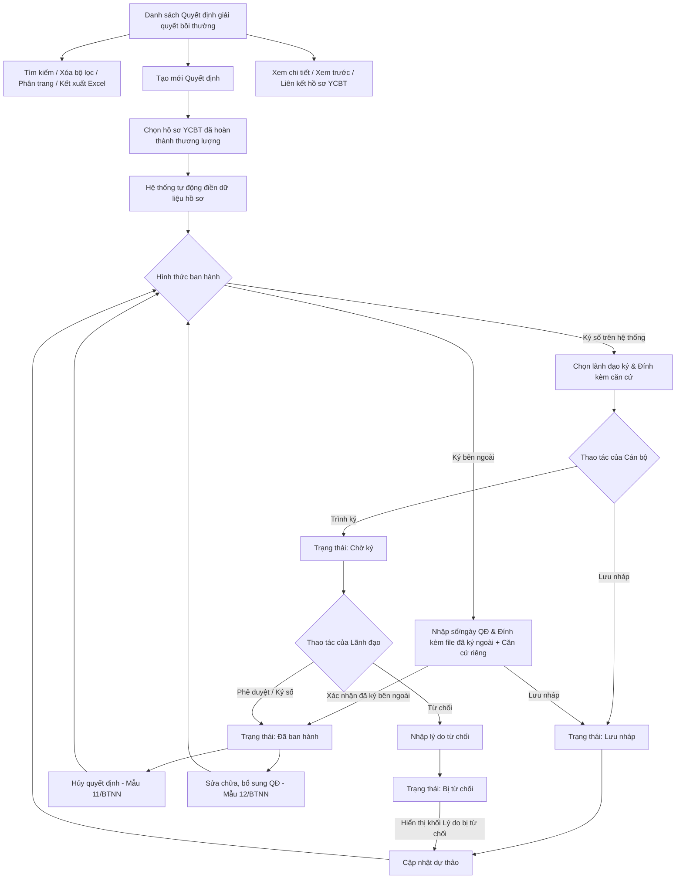

### 4.3.3. Dành cho Cán bộ Công tác bồi thường nhà nước

#### 4.3.3.3. Quyết định giải quyết bồi thường

##### 4.3.3.3.1. Mục đích
Quản lý toàn bộ vòng đời của Quyết định giải quyết bồi thường nhằm chuẩn hóa quy trình ban hành, ký số và quản lý hồ sơ bồi thường nhà nước tập trung, bao gồm:
- Tra cứu và quản lý danh sách quyết định theo phân trang, hỗ trợ tìm kiếm nâng cao đa tiêu chí theo số quyết định, vụ việc, trạng thái và khoảng thời gian ban hành.
- Lập dự thảo quyết định giải quyết bồi thường mới với cơ chế tự động kế thừa và ánh xạ dữ liệu từ kết quả thương lượng của hồ sơ vụ việc YCBT gốc (thông tin người yêu cầu, số tiền bồi thường, phương thức chi trả tiền mặt hoặc tài khoản ngân hàng).
- Xem trước dự thảo quyết định toàn trang chuẩn khổ A4 theo đúng Biểu mẫu 09/BTNN (Thông tư 04/2018/TT-BTP) tại tab trình duyệt mới trước khi trình ký.
- Quản lý luồng phê duyệt và hình thức ban hành linh hoạt:
  + Ký số trên hệ thống: Tự động chuyển đến Lãnh đạo ký số, tích hợp USB Token/chứng thư số và tự động cấp số/ngày từ Sổ văn bản điện tử.
  + Ký bên ngoài: Cho phép cập nhật số/ngày quyết định ký ngoài và đính kèm tệp PDF đã ký đóng dấu giấy.
- Quản lý các quyết định phát sinh sau ban hành: Lập Quyết định hủy (Mẫu 11/BTNN) hoặc Quyết định sửa chữa, bổ sung (Mẫu 12/BTNN) liên kết chặt chẽ với quyết định gốc.
.

a. Phân quyền
Hệ thống phân quyền thao tác theo vai trò và quyền hạn được cấp:
- Xem: Tra cứu danh sách quyết định, xem chi tiết quyết định, xem trước dự thảo, tải file quyết định.
- Tạo mới Quyết đinh: Lập dự thảo quyết định, hoặc Ban hành Quyết định đã ký số bên ngoài.
- Chỉnh sửa: Cập nhật thông tin quyết định ở trạng thái Lưu nháp hoặc Bị từ chối.
- Xóa: Xóa quyết định ở trạng thái Lưu nháp.
- Trình ký / Ban hành: Cán bộ thực hiện trình Lãnh đạo ký số hoặc xác nhận ban hành quyết định ký ngoài.
- Phê duyệt / Ký số: Lãnh đạo thực hiện ký số điện tử phê duyệt quyết định hoặc từ chối yêu cầu hiệu chỉnh.

b. Điều kiện thực hiện
- Người dùng đã đăng nhập hệ thống.
- Người dùng được cấp quyền truy cập chức năng "Quyết định giải quyết bồi thường".
- Đối với thao tác tạo mới Quyết định: Vụ việc YCBT liên quan phải có Biên bản kết quả thương lượng thành công.
##### 4.3.3.3.2. Sơ đồ luồng nghiệp vụ theo giao diện

---

##### 4.3.3.3.3. MH01 - Màn hình Danh sách Quyết định giải quyết bồi thường

###### 4.3.3.3.3.1. Màn hình

###### 4.3.3.3.3.2. Mô tả thông tin trên màn hình

| Trường thông tin | Kiểu dữ liệu | Bắt buộc | Mặc định | Mô tả |
| :--- | :--- | :--- | :--- | :--- |
| **Tiêu đề màn hình** | String(200) | Không | `Quyết định giải quyết bồi thường` | Hiển thị tên màn hình tại vùng tiêu đề trang. |
| **Khối Bộ lọc tìm kiếm** | Section | - | - | Khối tiêu chí tìm kiếm và lọc danh sách quyết định. |
| Số quyết định | String(50) | Không | Trống | Cho phép nhập số quyết định để tìm kiếm gần đúng, không phân biệt hoa thường, tự động trim space. |
| Mã vụ việc | String(50) | Không | Trống | Cho phép nhập mã vụ việc để tìm kiếm gần đúng, không phân biệt hoa thường, tự động trim space. |
| Tên vụ việc | String(255) | Không | Trống | Cho phép nhập tên vụ việc để tìm kiếm gần đúng, không phân biệt hoa thường, tự động trim space. |
| Loại quyết định | Enum(String(100)) | Không | `Tất cả` | Control UI: Dropdown/Select. Danh sách lựa chọn gồm: - `Tất cả` - `Quyết định giải quyết bồi thường` - `Quyết định hủy quyết định giải quyết bồi thường` - `Quyết định sửa chữa, bổ sung quyết định giải quyết bồi thường` |
| Người ký quyết định | String(100) | Không | Trống | Cho phép nhập tên người ký quyết định để tìm kiếm gần đúng. |
| Trạng thái quyết định | Enum(String(50)) | Không | `Tất cả` | Control UI: Dropdown/Select. Danh sách giá trị theo Danh mục [DM_30]: - `Tất cả` - `Lưu nháp` - `Chờ ký` - `Bị từ chối` - `Đã ban hành` - `Đã hủy` |
| Hình thức ban hành | Enum(String(50)) | Không | `Tất cả` | Control UI: Dropdown/Select. Gồm: `Tất cả`, `Ký số trên hệ thống`, `Ký bên ngoài`. |
| Đơn vị ban hành | Enum(String(255)) | Không | `Tất cả` | Control UI: Dropdown/Select có tìm kiếm. Lọc theo đơn vị có thẩm quyền ban hành quyết định; giá trị lấy từ danh mục đơn vị [DM_DON_VI]. |
| Ban hành: Từ ngày | Date | Không | Trống | Định dạng `dd/mm/yyyy`. Ngày bắt đầu khoảng thời gian ban hành. Kiểm tra logic khoảng ngày theo [BR-VAL-007]. |
| Ban hành: Đến ngày | Date | Không | Trống | Định dạng `dd/mm/yyyy`. Ngày kết thúc khoảng thời gian ban hành. Kiểm tra logic khoảng ngày theo [BR-VAL-007]. |
| **Bảng danh sách quyết định** | List(Object) | Không | 20 bản ghi/trang | Control UI: Data grid. - Khi người dùng truy cập màn hình, hệ thống tự động tải trang đầu tiên (Trang 1) với số lượng mặc định 20 bản ghi. - Sắp xếp mặc định: Sắp xếp theo "Ngày ban hành" giảm dần.   - Cho phép click tiêu đề cột Ngày ban hành để đảo chiều sắp xếp tăng/giảm. - Xem chi tiết bằng sự kiện click trực tiếp vào dòng dữ liệu (Row-Click) để mở **MH03 - Chi tiết Quyết định giải quyết bồi thường**, trừ khi click vào icon thao tác hoặc liên kết Mã vụ việc. - Trạng thái có dữ liệu: Hiển thị danh sách các bản ghi kết quả theo cấu trúc các cột quy định. - Trạng thái không có dữ liệu (Empty State): Khi không tìm thấy kết quả phù hợp với điều kiện tìm kiếm, bảng hiển thị duy nhất 01 dòng căn giữa trên toàn bộ chiều rộng bảng, in nghiêng với nội dung theo MessageList dùng chung [MSG-INF-SYS-001]. |
| STT | Integer(10) | - | Tự tăng | Căn giữa, tăng theo phân trang. |
| Số quyết định | String(50) | - | Theo dữ liệu | Hiển thị số quyết định. Trường hợp chưa được cấp số (dự thảo), hiển thị ký hiệu tương ứng của dữ liệu dự thảo. |
| Ngày ban hành | Date | - | Theo dữ liệu | Hiển thị ngày ban hành (định dạng `dd/mm/yyyy`); trường hợp chưa ban hành hiển thị gạch ngang `-`. |
| Loại quyết định | Enum(String(100)) | - | Theo dữ liệu | Hiển thị tên loại quyết định tương ứng. |
| Người ký | String(100) | - | Theo dữ liệu | Hiển thị họ tên lãnh đạo/người ký ban hành quyết định. |
| Cán bộ xử lý | String(100) | - | Theo dữ liệu | Hiển thị họ tên cán bộ phụ trách xử lý/lập quyết định. |
| Hình thức ban hành | Enum(String(50)) | - | Theo dữ liệu | Hiển thị `Ký số trên hệ thống` hoặc `Ký bên ngoài`. |
| Đơn vị ban hành | String(255) | - | Theo dữ liệu | Hiển thị đơn vị sở hữu sổ văn bản và có thẩm quyền ban hành quyết định. |
| Trích yếu quyết định | String(500) | - | Theo dữ liệu | Hiển thị tóm tắt trích yếu nội dung quyết định giải quyết bồi thường. |
| Mã vụ việc | String(50) | - | Theo dữ liệu | Control UI: Text link (Hyperlink). Cho phép click mở màn hình Chi tiết vụ việc yêu cầu bồi thường liên kết. |
| Tên vụ việc | String(255) | - | Theo dữ liệu | Hiển thị tên vụ việc bồi thường liên kết. |
| Trạng thái | Enum(String(50)) | - | Theo dữ liệu | Control UI: Text hiển thị kèm Badge màu theo trạng thái quyết định [DM_30]. |
| Thao tác | Action Buttons | - | Theo trạng thái | Control UI: Fixed-slot Action Column. Mỗi thao tác hiển thị trên 01 dòng riêng biệt theo điều kiện trạng thái hồ sơ: - **Cập nhật**: Chỉ hiển thị với Quyết định ở trạng thái `Lưu nháp` hoặc `Bị từ chối`. - **Xóa**: Chỉ hiển thị với Quyết định ở trạng thái `Lưu nháp`. - **Ký số**: Chỉ hiển thị với Quyết định ở trạng thái `Chờ ký`. - **Từ chối**: Chỉ hiển thị với Quyết định ở trạng thái `Chờ ký`. - **Hủy quyết định**: Chỉ hiển thị với Quyết định ở trạng thái `Đã ban hành`. - **Sửa chữa, bổ sung**: Chỉ hiển thị với Quyết định ở trạng thái `Đã ban hành`. - Các thao tác không thỏa mãn điều kiện theo trạng thái hồ sơ sẽ hiển thị ở dạng mờ/khóa, không cho phép thao tác. |
| Phân trang | Pagination | Không | 20 bản ghi/trang | Control UI: Pagination. - Cho phép chọn cấu hình số lượng bản ghi hiển thị trên mỗi trang gồm: 10, 20, 50, 100 bản ghi/trang; mặc định chọn sẵn 20 bản ghi/trang. - Đầy đủ các nút điều hướng trang: Đầu (&#124;&lt;&lt;), Trước (&lt;), các số trang, Sau (&gt;), Cuối (&gt;&gt;&#124;). - Hiển thị dải bản ghi: "Hiển thị [từ] - [đến] của [tổng số] bản ghi". |

###### 4.3.3.3.3.3. Chức năng trên màn hình

| STT | Tên chức năng | Định dạng | Mô tả |
| :--- | :--- | :--- | :--- |
| 1 | Xóa bộ lọc | Button | Xóa toàn bộ điều kiện tìm kiếm/lọc, đưa các trường nhập về giá trị mặc định và tải lại danh sách ở Trang 1. |
| 2 | Tìm kiếm | Button | Khi người dùng click nút, hệ thống kiểm tra điều kiện dữ liệu và thực hiện tìm kiếm: - **TH1 - Khoảng ngày không hợp lệ**: Nếu `Từ ngày` lớn hơn `Đến ngày`, vi phạm [BR-VAL-007], hệ thống hiển thị cảnh báo lỗi [MSG-ERR-VAL-007] và không thực hiện tìm kiếm. - **TH Hợp lệ**: Hệ thống lọc và hiển thị danh sách các bản ghi thỏa mãn đồng thời các tiêu chí tìm kiếm/lọc đã nhập/chọn, hiển thị kết quả lên bảng và đưa về Trang 1. - **TH Không có dữ liệu trả về**: Bảng kết quả hiển thị duy nhất 01 dòng căn giữa trên toàn bộ chiều rộng bảng, in nghiêng với nội dung theo MessageList dùng chung [MSG-INF-SYS-001]; thanh phân trang hiển thị *"Hiển thị 0-0 của 0 bản ghi"*, các nút điều hướng trang ở trạng thái khóa mờ (Disabled); nút "Kết xuất Excel" ở trạng thái khóa mờ kèm tooltip *"Không có dữ liệu để kết xuất Excel"*. |
| 3 | Tạo mới Quyết định | Button | Mở màn hình **MH02 - Trình ký/Cập nhật Quyết định giải quyết bồi thường** ở chế độ tạo mới để Cán bộ lập dự thảo quyết định. |
| 4 | Kết xuất Excel | Button | - **TH Không có dữ liệu**: Nếu danh sách kết quả hiện hành không có bản ghi, vi phạm [BR-EXP-040], hệ thống khóa mờ nút kết xuất và hiển thị thông báo [MSG-WRN-SYS-001]. - **TH Hợp lệ**: Kết xuất danh sách Quyết định giải quyết bồi thường ra file Excel theo đúng kết quả tìm kiếm/lọc hiện hành theo quy chuẩn [BR-EXP-040]. |
| 5 | Click dòng dữ liệu | Row click | Mở màn hình **MH03 - Chi tiết Quyết định giải quyết bồi thường** tương ứng với bản ghi được chọn. Nếu click vào icon thao tác hoặc liên kết `Mã vụ việc`, hệ thống thực hiện chức năng của icon/liên kết và không kích hoạt row click. |
| 6 | Cập nhật | Icon button | Khi người dùng click icon Cập nhật, hệ thống xử lý theo 02 trường hợp: - **TH1 - Quyết định ở trạng thái `Lưu nháp`**: Hệ thống mở màn hình **MH02 - Trình ký/Cập nhật Quyết định giải quyết bồi thường** để Cán bộ tiếp tục chỉnh sửa và hoàn thiện thông tin quyết định. - **TH2 - Quyết định ở trạng thái `Bị từ chối`**: Hệ thống mở màn hình **MH02 - Trình ký/Cập nhật Quyết định giải quyết bồi thường** ở chế độ cập nhật, tự động hiển thị thêm **Khối Lý do bị từ chối** ở phía trên cùng form để Cán bộ nắm bắt ý kiến chỉ đạo của Lãnh đạo và chỉnh sửa lại dữ liệu. |
| 7 | Xóa | Icon button | - Mở **[POPUP-CFM-001]** với nội dung [MSG-CFM-SYS-001]. - Khi người dùng chọn "Đồng ý": Hệ thống thực hiện xóa bản ghi quyết định lưu nháp khỏi danh sách và hiển thị thông báo thành công [MSG-SUC-BTNN-QD-004]. - Khi người dùng chọn "Hủy bỏ": Đóng popup và giữ nguyên dữ liệu. |
| 8 | Ký số | Icon button | Mở **[POPUP-SIGN-001]** để Lãnh đạo thực hiện ký số điện tử phê duyệt dự thảo quyết định: - **TH Thất bại hoặc Hủy ký**: Giữ nguyên trạng thái `Chờ ký`, không cấp số/ngày từ sổ văn bản và hiển thị cảnh báo lỗi tương ứng [MSG-ERR-SYS-001]. - **TH Ký số thành công**: Tự động cấp số và ngày quyết định từ Sổ văn bản điện tử áp dụng, đóng dấu thời gian, lưu tệp PDF quyết định chính thức đã ký số, chuyển trạng thái sang `Đã ban hành`, ghi nhận lịch sử xử lý, cập nhật danh sách và hiển thị thông báo thành công [MSG-SUC-BTNN-QD-002]. |
| 9 | Từ chối | Icon button | Mở **[POPUP-REJ-001]** (Tiêu đề: *"Từ chối quyết định"*) để Lãnh đạo nhập lý do từ chối phê duyệt. Khi xác nhận từ chối hợp lệ, hệ thống chuyển trạng thái quyết định sang `Bị từ chối`, lưu lý do vào lịch sử xử lý và hiển thị thông báo [MSG-SUC-BTNN-QD-003]. |
| 10 | Mã vụ việc | Link | Điều hướng sang màn hình Chi tiết vụ việc yêu cầu bồi thường liên kết trong Module Giải quyết yêu cầu bồi thường. |
| 11 | Hủy quyết định | Icon/Button | Mở màn hình **MH05 - Hủy/Sửa chữa, bổ sung Quyết định giải quyết bồi thường** ở chế độ `Hủy quyết định giải quyết bồi thường`; hệ thống kế thừa thông tin quyết định gốc để lập văn bản theo `Mẫu 11/BTNN`. |
| 12 | Sửa chữa, bổ sung | Icon/Button | Mở màn hình **MH05 - Hủy/Sửa chữa, bổ sung Quyết định giải quyết bồi thường** ở chế độ `Sửa chữa, bổ sung quyết định giải quyết bồi thường`; hệ thống kế thừa thông tin quyết định gốc để lập văn bản theo `Mẫu 12/BTNN`. |

---

##### 4.3.3.3.4. MH02 - Màn hình Trình ký/Cập nhật Quyết định giải quyết bồi thường

###### 4.3.3.3.4.1. Màn hình

###### 4.3.3.3.4.2. Mô tả thông tin trên màn hình

| Trường thông tin | Kiểu dữ liệu | Bắt buộc | Mặc định | Mô tả |
| :--- | :--- | :--- | :--- | :--- |
| **Tiêu đề form** | String(200) | Không | Theo ngữ cảnh | Hiển thị động theo trạng thái: - Khi tạo mới: `LẬP QUYẾT ĐỊNH GIẢI QUYẾT BỒI THƯỜNG MỚI`. - Khi cập nhật lưu nháp: `CẬP NHẬT DỰ THẢO QUYẾT ĐỊNH`. - Khi cập nhật bị từ chối: `CẬP NHẬT DỰ THẢO QUYẾT ĐỊNH BỊ TỪ CHỐI`. |
| **Khối Lý do bị từ chối** | Section | - | Ẩn | Khối thông báo nổi bật đặt ở phía trên cùng của form; chỉ hiển thị khi mở màn hình đối với Quyết định ở trạng thái `Bị từ chối`. Bao gồm các trường thông tin chỉ đọc dưới đây: |
| Ngày từ chối | Date | - | Theo dữ liệu | Chỉ đọc. Ngày Lãnh đạo thực hiện từ chối phê duyệt dự thảo quyết định (định dạng `dd/mm/yyyy`). |
| Người từ chối | String(100) | - | Theo dữ liệu | Chỉ đọc. Họ và tên Lãnh đạo đã từ chối phê duyệt. |
| Nội dung ý kiến chỉ đạo / Lý do từ chối | Text(2000) | - | Theo dữ liệu | Chỉ đọc. Nội dung ý kiến chỉ đạo chỉnh sửa, bổ sung của Lãnh đạo để Cán bộ nắm bắt và hoàn thiện lại dự thảo. |
| **Khối Thông tin chung hồ sơ** | Section | - | - | Khối thông tin liên kết và hành chính ban hành. |
| Mã vụ việc | String(50) | Có | Trống | Control UI: Input text kèm nút `Tìm kiếm` (kính lúp) và liên kết `Tìm kiếm nâng cao`. Cho phép nhập mã vụ việc YCBT đã hoàn thành thương lượng để lập quyết định. |
| Cơ quan cấp trên | String(255) | Không | BỘ TƯ PHÁP | Lưu ẩn; dùng để dựng bản xem trước/văn bản quyết định. |
| Đơn vị nhập liệu | String(255) | Không | Theo tài khoản đăng nhập | Chỉ đọc. Ghi nhận đơn vị đang thực hiện thao tác trên hệ thống. |
| Đơn vị ban hành | Enum(String(255)) | Có | Theo vụ việc | Đơn vị có thẩm quyền ban hành quyết định.  - Giá trị lấy từ danh mục đơn vị [DM_DON_VI].   - Cho phép tìm kiếm theo Mã hoặc theo tên đơn vị. Danh mục hiển thị dạng cây cấp cha con dạng **[Mã đơn vị] - [Tên đơn vị]** |
| Hình thức ban hành | Enum(String(50)) | Có | `Ký số trên hệ thống` | Control UI: Radio button gồm `Ký số trên hệ thống` và `Ký bên ngoài`. - **Khi chọn `Ký số trên hệ thống`**: Bắt buộc chọn trường *Lãnh đạo ký ban hành*, hệ thống tự động sinh dự thảo PDF và hiển thị nút **`Trình ký`**. - **Khi chọn `Ký bên ngoài`**: Ẩn trường chọn Lãnh đạo ký, hiển thị các trường nhập Số quyết định, Ngày quyết định, bắt buộc đính kèm *Tệp quyết định ký bên ngoài* và hiển thị nút **`Xác nhận đã ký bên ngoài`**. |
| Sổ văn bản áp dụng | Enum(String(255)) | Có | Tự động theo đơn vị |   - Hệ thống tự xác định theo `Đơn vị ban hành + Loại quyết định + Năm sổ`; cho phép chọn lại trong danh sách sổ còn hiệu lực của đơn vị. |
| Lãnh đạo ký ban hành | Enum(String(255)) | Có khi Ký số | Chọn lãnh đạo | Control UI: Dropdown/Select.   - Bắt buộc chọn khi Hình thức ban hành là `Ký số trên hệ thống`.   - Chỉ hiển thị danh sách lãnh đạo có thẩm quyền thuộc `Đơn vị ban hành`. |
| Số quyết định | String(50) | Có khi Ký ngoài | Trống | Chỉ hiển thị và bắt buộc khi chọn `Ký bên ngoài`.   - Cán bộ nhập số quyết định đã ký ngoài; hệ thống kiểm tra trùng số trong sổ và cảnh báo nếu số không liền kề. |
| Ngày quyết định  | Date | Có khi Ký ngoài | Ngày hiện tại | Định dạng `dd/mm/yyyy`. Chỉ hiển thị và bắt buộc khi chọn `Ký bên ngoài`.   - Không được lớn hơn ngày hiện tại. |
| Tệp quyết định ký bên ngoài | File | Có khi Ký ngoài | Trống | Bắt buộc đính kèm khi chọn `Ký bên ngoài`. Tệp tin PDF quyết định đã được ký và đóng dấu chính thức bên ngoài hệ thống. Tách riêng biệt với khối tài liệu căn cứ liên quan. |
| **Khối Chi tiết nội dung quyết định** | Section | - | - | Khối nội dung chi tiết quyết định bồi thường (tự động điền từ hồ sơ vụ việc đã thương lượng và cho phép cán bộ chỉnh sửa). |
| Tên vụ việc | String(255) | Có | Theo vụ việc | Tự động lấy từ hồ sơ vụ việc YCBT được chọn; cho phép chỉnh sửa. |
| Người yêu cầu bồi thường | String(100) | Có | Theo vụ việc | Họ và tên người yêu cầu bồi thường; tự động lấy từ hồ sơ vụ việc, cho phép chỉnh sửa. |
| Địa chỉ người yêu cầu | String(500) | Có | Theo vụ việc | Địa chỉ nơi cư trú của người yêu cầu theo cấu trúc: Địa chỉ chi tiết, Phường/Xã, Tỉnh/Thành phố; tự động lấy từ hồ sơ vụ việc, cho phép chỉnh sửa. |
| Cơ quan quản lý người thi hành công vụ | String(255) | Có | Theo vụ việc | Tên cơ quan quản lý người thi hành công vụ gây thiệt hại; tự động lấy từ hồ sơ vụ việc, cho phép chỉnh sửa. |
| Ngày thương lượng | Date | Có | Theo vụ việc | Định dạng `dd/mm/yyyy`. Ngày lập Biên bản kết quả thương lượng thành công; tự động lấy từ hồ sơ vụ việc, cho phép chỉnh sửa. |
| Phương thức chi trả tiền bồi thường | String(500) | Có | Theo vụ việc | Control UI: Input text / Textarea. - Tự động lấy theo phương thức thỏa thuận từ kết quả thương lượng của hồ sơ vụ việc. - Nếu là tiền mặt: Tự động điền `Chi trả trực tiếp bằng tiền mặt tại [Tên Cơ quan giải quyết bồi thường]`. - Nếu là chuyển khoản: Hiển thị `Chi trả qua chuyển khoản` và tự động hiển thị các trường thông tin tài khoản ngân hàng bên dưới. - Cho phép Cán bộ chỉnh sửa lại nội dung này. |
| Số tài khoản | String(50) | Có theo điều kiện | Theo vụ việc | Control UI: Input text. - Chỉ hiển thị và bắt buộc khi Phương thức chi trả là *"Chi trả qua chuyển khoản"*. - Tự động lấy từ kết quả thương lượng của hồ sơ vụ việc, cho phép chỉnh sửa. - Áp dụng quy tắc bắt buộc [BR-VAL-001]. |
| Chủ tài khoản | String(100) | Có theo điều kiện | Theo vụ việc | Control UI: Input text. - Chỉ hiển thị và bắt buộc khi Phương thức chi trả là *"Chi trả qua chuyển khoản"*. - Tự động lấy từ kết quả thương lượng của hồ sơ vụ việc, cho phép chỉnh sửa. - Áp dụng quy tắc bắt buộc [BR-VAL-001]. |
| Tên ngân hàng | String(255) | Có theo điều kiện | Theo vụ việc | Control UI: Combobox có tìm kiếm / Input text. - Chỉ hiển thị và bắt buộc khi Phương thức chi trả là *"Chi trả qua chuyển khoản"*. - Tự động lấy từ kết quả thương lượng của hồ sơ vụ việc, cho phép chỉnh sửa. - Áp dụng quy tắc bắt buộc [BR-VAL-001]. |
| Chi nhánh ngân hàng | String(255) | Có theo điều kiện | Theo vụ việc | Control UI: Input text. - Chỉ hiển thị và bắt buộc khi Phương thức chi trả là *"Chi trả qua chuyển khoản"*. - Tự động lấy từ kết quả thương lượng của hồ sơ vụ việc, cho phép chỉnh sửa. - Áp dụng quy tắc bắt buộc [BR-VAL-001]. |
| Các quyền, lợi ích hợp pháp khác được khôi phục | Text(2000) | Không | Trống |Chỉ hiển thị nếu Vụ việc có yêu cầu.  - Tự động lấy từ kết quả thương lượng của hồ sơ vụ việc. |
| Tổng số tiền bồi thường | Decimal(18,0) | Có | Theo vụ việc | Tự động lấy từ tổng số tiền thương lượng thành công của hồ sơ YCBT; cho phép Cán bộ nhập chỉnh sửa lại số tiền. Áp dụng quy tắc số dương [BR-VAL-010]. |
| Số tiền bồi thường đã tạm ứng | Decimal(18,0) | Không | Theo vụ việc | Tự động lấy từ số tiền tạm ứng kinh phí đã nhận từ hồ sơ vụ việc; cho phép chỉnh sửa. |
| Số tiền bồi thường còn lại | Decimal(18,0) | Không | Tự động tính | Chỉ đọc. Hệ thống tự động tính bằng: `Tổng số tiền bồi thường` - `Số tiền bồi thường đã tạm ứng`. |
| Cảnh báo chênh lệch số liệu | String(255) | Không | Ẩn | Hiển thị cảnh báo màu vàng khi `Tổng số tiền bồi thường` được điều chỉnh khác với số tiền thương lượng gốc của hồ sơ vụ việc. |
| Lý do điều chỉnh số liệu kinh phí | Text(2000) | Có khi có chênh lệch | Trống | Bắt buộc nhập khi có cảnh báo chênh lệch số liệu giữa quyết định và kết quả thương lượng gốc.   - Hệ thống sẽ có cơ chế tự kiểm tra, Nếu số tiền bồi thường trong quyết định khác với số tiền thương lượng thì hiện cảnh báo và yêu cầu nhập lý do. |
| **Bảng Văn bản căn cứ** | List(Object) | Không | Các dòng căn cứ | Khối đính kèm tài liệu căn cứ liên quan. Gồm nút **`+ Thêm văn bản`** để thêm dòng mới. |
| STT | Integer(10) | - | Tự tăng | Căn giữa. |
| Tên văn bản / Căn cứ | String(500) | Có khi thêm dòng | Trống/Theo dữ liệu | Nhập tên văn bản hoặc căn cứ pháp lý liên quan. |
| Ngày văn bản | Date | Có khi thêm dòng | Ngày hiện tại | Định dạng `dd/mm/yyyy`. Ngày ban hành của văn bản căn cứ. |
| File đính kèm | File | Có khi thêm dòng | Trống | Cho phép chọn tệp đính kèm theo quy chuẩn [BR-FILE-010]. |
| Thao tác | Action Links | - | Theo dòng | Gồm liên kết **`Xem file`** (mở tab mới) và liên kết **`Xóa`** dòng tài liệu. |
| **Khối Lịch sử xử lý** | Section / List(Object) | Không | Ẩn khi tạo mới | Hiển thị bảng/danh sách lịch sử các bước xử lý quyết định theo thứ tự thời gian (Lập dự thảo, Trình ký, Từ chối, Phê duyệt/ký số...). Bao gồm các trường thông tin chỉ đọc dưới đây: |
| Ngày thực hiện | Datetime | - | Theo dữ liệu | Chỉ đọc. Thời điểm thực hiện thao tác/xử lý hồ sơ quyết định (định dạng `dd/mm/yyyy HH:mm`). |
| Người thực hiện | String(100) | - | Theo dữ liệu | Chỉ đọc. Họ và tên Cán bộ hoặc Lãnh đạo thực hiện thao tác. |
| Nội dung / Lý do bị từ chối | Text(2000) | - | Theo dữ liệu | Chỉ đọc. Nội dung ghi chú quá trình xử lý hoặc ý kiến chỉ đạo, lý do từ chối của Lãnh đạo (nếu có). |

###### 4.3.3.3.4.3. Chức năng trên màn hình

| STT | Tên chức năng | Định dạng | Mô tả |
| :--- | :--- | :--- | :--- |
| 1 | Tìm kiếm (tại trường Mã vụ việc) | Button | - Nếu chưa nhập dữ liệu tại ô tìm kiếm: Vi phạm quy tắc [BR-VAL-001], hệ thống hiển thị thông báo cảnh báo lỗi [MSG-ERR-VAL-001] (*"Vui lòng nhập Mã vụ việc để tìm kiếm"*) và không mở popup. - Nếu đã nhập dữ liệu: Hệ thống mở [Popup chuẩn Tìm kiếm vụ việc/hồ sơ gốc liên quan](SRS_BTNN_GiaiQuyetBT_GiaiQuyet_YCBT.md#433110-popup-chuẩn-tìm-kiếm-vụ-việchồ-sơ-gốc-liên-quan) (thuộc Module Giải quyết yêu cầu bồi thường), tự động điền giá trị đang nhập vào trường `Mã vụ việc` trên Popup và kích hoạt tìm kiếm. |
| 2 | Tìm kiếm nâng cao (tại trường Mã vụ việc) | Button | - Hệ thống mở [Popup chuẩn Tìm kiếm vụ việc/hồ sơ gốc liên quan](SRS_BTNN_GiaiQuyetBT_GiaiQuyet_YCBT.md#433110-popup-chuẩn-tìm-kiếm-vụ-việchồ-sơ-gốc-liên-quan) (thuộc Module Giải quyết yêu cầu bồi thường) ở chế độ mở rộng đầy đủ các tiêu chí lọc. - Tự động kế thừa giá trị mã vụ việc đang nhập ở form chính (nếu có). - Cho phép Cán bộ nhập thêm các tiêu chí lọc và bấm nút `Tìm kiếm` trên Popup. |
| 3 | + Thêm văn bản | Button | Thêm 01 dòng tài liệu mới vào bảng danh sách tài liệu căn cứ liên quan. |
| 4 | Xem file | Link | Cho phép xem tệp tài liệu căn cứ đính kèm tại một tab trình duyệt riêng. |
| 5 | Xóa dòng tài liệu | Icon | - Mở **[POPUP-CFM-001]** với nội dung [MSG-CFM-BTNN-XDCQ-002]. - Khi người dùng chọn "Đồng ý": Gỡ dòng tài liệu căn cứ tương ứng khỏi bảng danh sách. - Khi người dùng chọn "Hủy bỏ": Đóng popup và giữ nguyên dữ liệu. |
| 6 | Xem Trước Quyết định | Button | - **TH1 - Chưa chọn vụ việc YCBT**: Vi phạm [BR-VAL-001], hiển thị cảnh báo [MSG-ERR-VAL-001] và không mở xem trước. - **TH Hợp lệ**: Sinh nội dung dự thảo quyết định theo biểu mẫu 09/BTNN của Thông tư 04/2018/TT-BTP tại **MH04 - Xem trước Quyết định Giải quyết yêu cầu bồi thường** từ dữ liệu đang nhập trên form và mở trong một tab trình duyệt mới (khổ A4), kèm nút "In/Tải PDF". |
| 7 | Lưu nháp | Button | - Lưu lại các thông tin quyết định đã nhập ở trạng thái `Lưu nháp`, hiển thị thông báo thành công [MSG-SUC-SYS-001] và đóng màn hình nhập liệu. |
| 8 | Trình ký | Button | - *Điều kiện hiển thị*: Chỉ hiển thị khi chọn `Hình thức ban hành` = `Ký số trên hệ thống`. - **TH1 - Bỏ trống trường bắt buộc hoặc chưa chọn Lãnh đạo ký**: Vi phạm [BR-VAL-001], highlight đỏ ô lỗi và cảnh báo [MSG-ERR-VAL-001]. - **TH Hợp lệ**: Lưu thông tin, tự động sinh file dự thảo PDF, chuyển trạng thái quyết định sang `Chờ ký`, gửi đến Lãnh đạo đã chọn, ghi nhận lịch sử xử lý và hiển thị thông báo thành công [MSG-SUC-BTNN-QD-001]. |
| 9 | Ban hành QĐ | Button | - *Điều kiện hiển thị*: Chỉ hiển thị khi chọn `Hình thức ban hành` = `Ký bên ngoài`. - **TH1 - Thiếu số QĐ, ngày QĐ hoặc thiếu tệp quyết định đã ký ngoài**: Vi phạm [BR-VAL-001]/[BR-FILE-010], không cho phép xác nhận. - **TH2 - Trùng số quyết định trong cùng sổ/năm**: Hệ thống cảnh báo trùng số và không cho lưu. - **TH3 - Số quyết định không liền kề**: Cảnh báo và yêu cầu nhập lý do số ngoài không tuần tự. - **TH Hợp lệ**: Lưu thông tin, lưu tệp QĐ đã ký và các tệp căn cứ riêng biệt, chuyển trạng thái quyết định sang `Đã ban hành`, ghi nhận lịch sử và hiển thị thông báo thành công [MSG-SUC-BTNN-QD-002]. |
| 10 | Hủy bỏ | Button | Đóng form nhập liệu quyết định và quay lại danh sách tra cứu, không lưu các thay đổi chưa lưu. |

---

##### 4.3.3.3.5. MH03 - Màn hình Chi tiết Quyết định giải quyết bồi thường

###### 4.3.3.3.5.1. Màn hình

###### 4.3.3.3.5.2. Mô tả thông tin trên màn hình

| Trường thông tin | Kiểu dữ liệu | Bắt buộc | Mặc định | Mô tả |
| :--- | :--- | :--- | :--- | :--- |
| **Tiêu đề** | String(200) | Không | `CHI TIẾT QUYẾT ĐỊNH GIẢI QUYẾT BỒI THƯỜNG` | Hiển thị tiêu đề màn hình chi tiết. |
| Trạng thái quyết định | Enum(String(50)) | Không | Theo dữ liệu | Hiển thị Badge trạng thái theo Danh mục [DM_30]. |
| Lý do bị từ chối | Text(2000) | Không | Ẩn | Chỉ hiển thị khi quyết định ở trạng thái `Bị từ chối`. Hiển thị lý do từ chối để Cán bộ nắm bắt cập nhật lại. |
| Loại quyết định | Enum(String(100)) | Không | Theo dữ liệu | Hiển thị tên loại quyết định tương ứng. |
| Số quyết định | String(50) | Không | Theo dữ liệu | Hiển thị số quyết định đã ban hành; nếu chưa ban hành hiển thị `-`. |
| Ngày quyết định | Date | Không | Theo dữ liệu | Hiển thị ngày quyết định (định dạng `dd/mm/yyyy`); nếu chưa ban hành hiển thị `-`. |
| Người ký | String(100) | Không | Theo dữ liệu | Hiển thị họ tên lãnh đạo/người ký quyết định. |
| Hình thức ban hành | String(50) | Không | Theo dữ liệu | Hiển thị `Ký số trên hệ thống` hoặc `Ký bên ngoài`. |
| Cơ quan ban hành | String(255) | Không | Theo dữ liệu | Hiển thị tên cơ quan ban hành quyết định. |
| Đơn vị nhập liệu | String(255) | Không | Theo dữ liệu | Hiển thị đơn vị thực hiện nhập/thao tác quyết định trên hệ thống. |
| Quyết định gốc liên quan | String(50) | Không | Ẩn nếu không có | - Chỉ hiển thị khi là Quyết định hủy hoặc Quyết định sửa chữa/bổ sung. - Hiển thị Số quyết định gốc liên kết dạng Hyperlink. - Khi người dùng click vào liên kết, hệ thống mở màn hình **MH03 - Chi tiết Quyết định giải quyết bồi thường** của Quyết định gốc tương ứng. |
| Quyết định hủy / Sửa chữa, bổ sung liên quan | String(50) | Không | Ẩn nếu không có | - Chỉ hiển thị trên Quyết định gốc khi đã có Quyết định hủy hoặc Quyết định sửa chữa/bổ sung được ban hành. - Hiển thị Số quyết định liên quan dạng Hyperlink. - Khi người dùng click vào liên kết, hệ thống mở màn hình **MH03 - Chi tiết Quyết định giải quyết bồi thường** của Quyết định hủy hoặc Quyết định sửa chữa, bổ sung tương ứng. |
| Tệp văn bản quyết định | String(255) | Không | Theo dữ liệu | - Nếu trạng thái là `Đã ban hành`: Hiển thị tên file *Quyết định đã ký số* (hoặc tệp ký ngoài) kèm liên kết **`Xem file`** và **`Tải file`**. - Nếu trạng thái chưa ban hành (`Lưu nháp`, `Chờ ký`, `Bị từ chối`): Hiển thị tên file *Dự thảo quyết định* kèm liên kết **`Xem file`** và **`Tải file`**. |
| **Bảng Văn bản căn cứ** | List(Object) | Không | Theo dữ liệu | Hiển thị danh sách các văn bản căn cứ pháp lý liên quan của quyết định ở chế độ chỉ xem. |
| STT | Integer(10) | - | Tự tăng | Căn giữa. |
| Tên văn bản / Căn cứ | String(500) | - | Theo dữ liệu | Hiển thị tên văn bản hoặc căn cứ pháp lý liên quan. |
| Ngày văn bản | Date | - | Theo dữ liệu | Hiển thị ngày ban hành của văn bản căn cứ (định dạng `dd/mm/yyyy`). |
| File đính kèm | File | - | Theo dữ liệu | Hiển thị tên tệp đính kèm căn cứ. |
| Thao tác | Action Link | - | Theo dữ liệu | Hiển thị liên kết **`Xem file`** để mở xem tài liệu căn cứ tại một tab riêng. |
| **Lịch sử quá trình xử lý** | Section / List(Object) | Không | Theo dữ liệu | Hiển thị danh sách lịch sử các mốc xử lý quyết định theo thứ tự thời gian. Bao gồm các trường thông tin chỉ đọc dưới đây: |
| Ngày thực hiện | Datetime | - | Theo dữ liệu | Chỉ đọc. Thời điểm thực hiện thao tác (định dạng `dd/mm/yyyy HH:mm`). |
| Người thực hiện | String(100) | - | Theo dữ liệu | Chỉ đọc. Họ và tên người thực hiện thao tác. |
| Nội dung / Lý do bị từ chối | Text(2000) | - | Theo dữ liệu | Chỉ đọc. Nội dung ghi chú xử lý hoặc ý kiến chỉ đạo, lý do từ chối (nếu có). |

###### 4.3.3.3.5.3. Chức năng trên màn hình

| STT | Tên chức năng | Định dạng | Mô tả |
| :--- | :--- | :--- | :--- |
| 1 | Đóng | Button | Luôn hiển thị. Đóng màn hình xem chi tiết và quay lại danh sách Quyết định giải quyết bồi thường. |
| 2 | Xem file | Button/Link | Luôn hiển thị. Mở xem tệp PDF (Dự thảo quyết định nếu chưa ban hành, hoặc Quyết định đã ký số/ký ngoài nếu đã ban hành) tại một tab trình duyệt mới. |
| 3 | Tải file | Button/Link | Luôn hiển thị. Tải tệp PDF (Dự thảo quyết định hoặc Quyết định đã ban hành) về máy tính cá nhân. |
| 4 | Phê duyệt | Button | - *Điều kiện hiển thị*: Chỉ hiển thị khi Quyết định ở trạng thái `Chờ ký`. - *Xử lý*: Mở **[POPUP-SIGN-001]** để Lãnh đạo thực hiện ký số điện tử trên dự thảo quyết định: + **TH Thất bại hoặc Hủy ký**: Giữ nguyên trạng thái `Chờ ký`, không cấp số/ngày từ sổ văn bản và hiển thị cảnh báo lỗi [MSG-ERR-SYS-001]. + **TH Ký số thành công**: Hệ thống tự động cấp số và ngày quyết định từ Sổ văn bản điện tử áp dụng, đóng dấu thời gian, lưu tệp PDF đã ký số, chuyển trạng thái quyết định sang `Đã ban hành`, ghi nhận lịch sử xử lý và thực hiện cập nhật liên kết theo từng Loại quyết định:   * *Nếu là Quyết định giải quyết bồi thường*: Chuyển trạng thái sang `Đã ban hành`, hoàn tất quy trình ban hành quyết định gốc.   * *Nếu là Quyết định hủy quyết định giải quyết bồi thường*: Chuyển trạng thái QĐ hủy sang `Đã ban hành`, đồng thời tự động cập nhật trạng thái của Quyết định gốc sang `Đã hủy` và gắn liên kết QĐ hủy vào hồ sơ quyết định gốc.   * *Nếu là Quyết định sửa chữa, bổ sung quyết định giải quyết bồi thường*: Chuyển trạng thái QĐ sửa chữa/bổ sung sang `Đã ban hành`, đồng thời gắn liên kết QĐ sửa chữa/bổ sung vào hồ sơ Quyết định gốc.   * Hiển thị thông báo thành công [MSG-SUC-BTNN-QD-002]. |
| 5 | Từ chối | Button | - *Điều kiện hiển thị*: Chỉ hiển thị khi Quyết định ở trạng thái `Chờ ký`. - *Xử lý*: Mở **[POPUP-REJ-001]** (Tiêu đề: *"Từ chối quyết định"*) để nhập lý do từ chối; sau khi xác nhận từ chối hợp lệ, hệ thống chuyển trạng thái quyết định sang `Bị từ chối`, lưu lý do vào lịch sử xử lý và hiển thị thông báo [MSG-SUC-SYS-002]. |

---

##### 4.3.3.3.6. MH04 - Xem trước Quyết định Giải quyết yêu cầu bồi thường (mở tab trình duyệt mới)

> Ghi chú thiết kế: Màn hình này được hiển thị trong một **tab trình duyệt mới** (không phải modal nội tuyến) — cho phép xem toàn trang khổ A4 và sử dụng trực tiếp chức năng in/tải PDF của trình duyệt.

###### 4.3.3.3.6.1. Màn hình

###### 4.3.3.3.6.2. Mô tả thông tin trên màn hình

| Trường thông tin | Kiểu dữ liệu | Bắt buộc | Mặc định | Mô tả |
| :--- | :--- | :--- | :--- | :--- |
| Tiêu đề tab trình duyệt | String(200) | Không | `Xem trước Quyết định Giải quyết yêu cầu bồi thường` | Hiển thị tại thanh tiêu đề (title) và thanh công cụ trên cùng của tab trình duyệt. |
| Nội dung quyết định | Text(2000) | Không | Theo dữ liệu form/bản ghi | Hiển thị bản dựng quyết định gồm: Quốc hiệu/Tiêu ngữ, Cơ quan ban hành, Số quyết định, Địa điểm/Ngày tháng, Căn cứ pháp lý, Các điều khoản bồi thường, Số tiền, Phương thức chi trả, Khôi phục quyền lợi, Hiệu lực thi hành, Nơi nhận và Vùng chữ ký. |
| Dấu trạng thái | Enum(String(50)) | Không | Theo trạng thái | - Nếu chưa ký: Hiển thị watermark chìm `DỰ THẢO`. - Nếu đã ký số: Hiển thị dấu ký số điện tử hợp lệ. - Nếu bị từ chối: Hiển thị watermark `BỊ TỪ CHỐI` kèm ý kiến chỉ đạo. |
| In/Tải PDF | Button | Không | Hiển thị trên thanh công cụ | Cho phép in hoặc tải file PDF trực tiếp từ trình duyệt. |

###### 4.3.3.3.6.3. Chức năng trên màn hình

| STT | Tên chức năng | Định dạng | Mô tả |
| :--- | :--- | :--- | :--- |
| 1 | In/Tải PDF | Button | Kích hoạt chức năng in của trình duyệt trên nội dung bản xem trước để người dùng in ra giấy hoặc lưu thành file PDF. |
| 2 | Đóng | Đóng tab | Người dùng đóng tab trình duyệt để quay lại màn hình làm việc trước đó. |

---

##### 4.3.3.3.7. MH05 - Màn hình Hủy/Sửa chữa, bổ sung Quyết định giải quyết bồi thường

###### 4.3.3.3.7.1. Màn hình

###### 4.3.3.3.7.2. Mô tả thông tin trên màn hình

| Trường thông tin | Kiểu dữ liệu | Bắt buộc | Mặc định | Mô tả |
| :--- | :--- | :--- | :--- | :--- |
| **Tiêu đề form** | String(255) | Không | Theo ngữ cảnh | Hiển thị động theo loại nghiệp vụ: - `HỦY QUYẾT ĐỊNH GIẢI QUYẾT BỒI THƯỜNG` (sinh văn bản theo Mẫu 11/BTNN). - `SỬA CHỮA, BỔ SUNG QUYẾT ĐỊNH GIẢI QUYẾT BỒI THƯỜNG` (sinh văn bản theo Mẫu 12/BTNN). |
| Loại quyết định | Enum(String(100)) | Có | Theo thao tác mở form | Chỉ đọc. Giá trị: `Quyết định hủy quyết định giải quyết bồi thường` hoặc `Quyết định sửa chữa, bổ sung quyết định giải quyết bồi thường`. |
| Quyết định gốc | String(50) | Có | Theo bản ghi được chọn | Chỉ đọc. Hiển thị số quyết định gốc, ngày ban hành, trạng thái, cơ quan ban hành. |
| Mã vụ việc | String(50) | Có | Theo quyết định gốc | Chỉ đọc. Hiển thị mã vụ việc bồi thường liên kết. |
| Tên vụ việc | String(255) | Không | Theo quyết định gốc | Chỉ đọc. Hiển thị tên vụ việc bồi thường liên kết. |
| Người yêu cầu bồi thường | String(255) | Không | Theo quyết định gốc | Chỉ đọc. |
| Đơn vị nhập liệu | String(255) | Không | Theo tài khoản đăng nhập | Chỉ đọc. Ghi nhận đơn vị đang thực hiện thao tác. |
| Đơn vị ban hành | Enum(String(255)) | Có | Theo quyết định gốc | Đơn vị có thẩm quyền ban hành quyết định hủy hoặc sửa chữa/bổ sung. Cho phép điều chỉnh nếu đơn vị ban hành khác đơn vị gốc theo thẩm quyền. |
| Sổ văn bản áp dụng | Enum(String(255)) | Có | Tự động theo đơn vị | Hệ thống xác định theo `Đơn vị ban hành + Loại quyết định + Năm sổ`; dùng chung cho cả ký số và ký bên ngoài. |
| Chữ viết tắt tên cơ quan | String(20) | Có | Theo quyết định gốc | Dùng để sinh số/ký hiệu văn bản. |
| Chức vụ của người đứng đầu | Enum(String(100)) | Có | Theo đơn vị ban hành | Control UI: Dropdown / Combobox. Chọn từ Danh mục dùng chung Chức vụ người đứng đầu [DM_CHUC_VU_NGUOI_DUNG_DAU] (Ví dụ: *Bộ trưởng, Chủ tịch UBND, Cục trưởng...*). |
| Hình thức ban hành | Enum(String(50)) | Có | `Ký số trên hệ thống` | Control UI: Radio button gồm `Ký số trên hệ thống` và `Ký bên ngoài`. - **Khi chọn `Ký số trên hệ thống`**: Bắt buộc chọn trường *Lãnh đạo ký*, hệ thống tự động sinh file PDF dự thảo (theo Mẫu 11/BTNN hoặc Mẫu 12/BTNN) và hiển thị nút **`Trình ký`**. - **Khi chọn `Ký bên ngoài`**: Ẩn trường chọn Lãnh đạo ký, hiển thị các trường nhập Số quyết định, Ngày quyết định, bắt buộc đính kèm *Tệp quyết định ký bên ngoài* và hiển thị nút **`Ban hành QĐ`**. |
| Lãnh đạo ký | Enum(String(255)) | Có khi Ký số | Chọn lãnh đạo | Control UI: Dropdown/Select. Bắt buộc chọn khi Hình thức ban hành là `Ký số trên hệ thống`. Chỉ hiển thị danh sách lãnh đạo có thẩm quyền thuộc `Đơn vị ban hành`. |
| Số quyết định | String(100) | Có khi Ký ngoài | Trống | Chỉ hiển thị và bắt buộc khi chọn `Ký bên ngoài`. Cán bộ nhập số quyết định đã ký ngoài; hệ thống kiểm tra trùng số và tính tuần tự. |
| Ngày quyết định | Date | Có khi Ký ngoài | Ngày hiện tại | Định dạng `dd/mm/yyyy`. Chỉ hiển thị và bắt buộc khi chọn `Ký bên ngoài`. |
| Tệp quyết định ký bên ngoài | File | Có khi Ký ngoài | Trống | Bắt buộc đính kèm khi chọn `Ký bên ngoài`. Tệp tin PDF quyết định hủy hoặc sửa đổi/bổ sung đã ký đóng dấu chính thức bên ngoài. Tách riêng biệt với khối tài liệu căn cứ liên quan. |
| Căn cứ ban hành | Text(2000) | Có | Theo quyết định gốc | Cho phép bổ sung căn cứ pháp lý để sinh văn bản Mẫu 11/BTNN hoặc Mẫu 12/BTNN. |
| Lý do hủy quyết định | Text(2000) | Có khi là Hủy QĐ | Trống | Bắt buộc nhập khi Loại quyết định là `Quyết định hủy quyết định giải quyết bồi thường`. |
| Nội dung sửa chữa, bổ sung | Text(4000) | Có khi là Sửa chữa/Bổ sung | Trống | Bắt buộc nhập khi Loại quyết định là `Quyết định sửa chữa, bổ sung quyết định giải quyết bồi thường`. Nhập rõ điều khoản, nội dung cũ và nội dung sửa đổi/bổ sung. |
| **Bảng Căn cứ pháp lý / Tài liệu đính kèm liên quan** | List(Object) | Không | Các dòng căn cứ | Khối đính kèm tài liệu căn cứ liên quan (tách riêng biệt với tệp quyết định đã ký ngoài). Gồm nút **`+ Thêm văn bản`** để thêm dòng mới. |
| STT | Integer(10) | - | Tự tăng | Căn giữa. |
| Tên văn bản / Căn cứ | String(500) | Có khi thêm dòng | Trống/Theo dữ liệu | Nhập tên văn bản hoặc căn cứ pháp lý liên quan. |
| Ngày văn bản | Date | Có khi thêm dòng | Ngày hiện tại | Định dạng `dd/mm/yyyy`. Ngày ban hành của văn bản căn cứ. |
| File đính kèm | File | Có khi thêm dòng | Trống | Cho phép chọn tệp đính kèm theo quy chuẩn [BR-FILE-010]. |
| Thao tác | Action Links | - | Theo dòng | Gồm liên kết **`Xem file`** (mở tab mới) và liên kết **`Xóa`** dòng tài liệu. |

###### 4.3.3.3.7.3. Chức năng trên màn hình

| STT | Tên chức năng | Định dạng | Mô tả |
| :--- | :--- | :--- | :--- |
| 1 | + Thêm văn bản | Button | Thêm 01 dòng tài liệu mới vào bảng danh sách tài liệu căn cứ liên quan. |
| 2 | Xem file | Link | Cho phép xem tệp tài liệu căn cứ đính kèm tại một tab trình duyệt riêng. |
| 3 | Xóa dòng tài liệu | Icon | - Mở **[POPUP-CFM-001]** với nội dung [MSG-CFM-BTNN-XDCQ-002]. - Khi người dùng chọn "Đồng ý": Gỡ dòng tài liệu căn cứ tương ứng khỏi bảng danh sách. - Khi người dùng chọn "Hủy bỏ": Đóng popup và giữ nguyên dữ liệu. |
| 4 | Xem trước | Button | - **TH1 - Thiếu dữ liệu bắt buộc**: Vi phạm [BR-VAL-001], hiển thị cảnh báo và không sinh xem trước. - **TH Hợp lệ**: Sinh bản xem trước dự thảo theo `Mẫu 11/BTNN` (đối với Hủy QĐ) hoặc `Mẫu 12/BTNN` (đối với Sửa chữa, bổ sung QĐ) mở trong một tab trình duyệt mới. |
| 5 | Tải Word | Button | Hệ thống sinh và tải văn bản hiện hành dưới định dạng Word theo đúng mẫu quy định. |
| 6 | Tải PDF | Button | Hệ thống sinh và tải văn bản hiện hành dưới định dạng PDF theo đúng mẫu quy định. |
| 7 | Lưu nháp | Button | Kiểm tra dữ liệu bắt buộc tối thiểu, lưu bản dự thảo ở trạng thái `Lưu nháp`, giữ liên kết với quyết định gốc, ghi lịch sử xử lý và mở màn hình chi tiết. |
| 8 | Trình ký | Button | - *Điều kiện hiển thị*: Chỉ hiển thị khi chọn `Hình thức ban hành` = `Ký số trên hệ thống`. - **TH1 - Thiếu lãnh đạo ký hoặc thiếu dữ liệu bắt buộc**: Vi phạm [BR-VAL-001], không cho phép trình ký. - **TH Hợp lệ**: Tự động sinh file PDF dự thảo (Mẫu 11/BTNN hoặc Mẫu 12/BTNN), chuyển trạng thái quyết định sang `Chờ ký`, gửi đến Lãnh đạo đã chọn thuộc `Đơn vị ban hành` và ghi lịch sử xử lý. |
| 9 | Ban hành QĐ | Button | - *Điều kiện hiển thị*: Chỉ hiển thị khi chọn `Hình thức ban hành` = `Ký bên ngoài`. - **TH1 - Bỏ trống trường bắt buộc**: Nếu thiếu Số quyết định, Ngày quyết định hoặc thiếu tệp quyết định đã ký ngoài, vi phạm [BR-VAL-001]/[BR-FILE-010], highlight đỏ ô lỗi và không cho phép ban hành. - **TH2 - Trùng số hoặc không tuần tự**: Cảnh báo trùng số hoặc yêu cầu nhập lý do số ngoài không tuần tự. - **TH Hợp lệ**: Hệ thống lưu thông tin, lưu tệp quyết định đã ký ngoài và tài liệu căn cứ riêng biệt, chuyển trạng thái quyết định này sang `Đã ban hành`, ghi lịch sử xử lý và xử lý liên kết dữ liệu theo 02 trường hợp: + **Nếu là Quyết định hủy**: Hệ thống tự động chuyển trạng thái của Quyết định gốc tương ứng sang `Đã hủy`, đồng thời gắn liên kết Quyết định hủy vào hồ sơ quyết định gốc. + **Nếu là Quyết định sửa chữa, bổ sung**: Quyết định gốc vẫn giữ nguyên trạng thái `Đã ban hành`, hệ thống tự động gắn liên kết Quyết định sửa đổi, bổ sung vào hồ sơ quyết định gốc. + Hiển thị thông báo thành công [MSG-SUC-BTNN-QD-002] và mở màn hình Chi tiết. |
| 10 | Hủy bỏ | Button | Đóng form và quay lại danh sách tra cứu, không lưu các thay đổi chưa lưu. |
