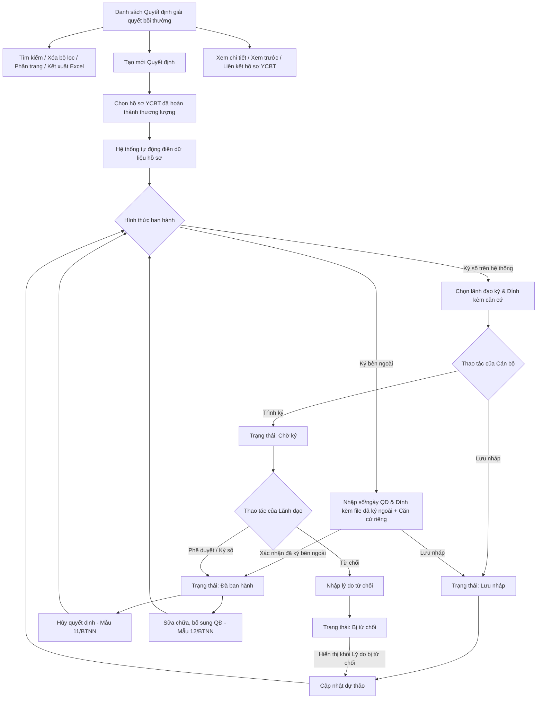

### 4.3.3. Dành cho Cán bộ Công tác bồi thường nhà nước

#### 4.3.3.3. Quyết định giải quyết bồi thường

##### 4.3.3.3.1. Mục đích

- Quản lý danh sách, lập dự thảo, cập nhật, trình ký số hoặc ghi nhận ban hành ngoài đối với Quyết định giải quyết bồi thường trên cơ sở hồ sơ yêu cầu bồi thường đã hoàn thành thương lượng.
- Quản lý nghiệp vụ Hủy quyết định (theo Mẫu 11/BTNN) và Sửa chữa, bổ sung quyết định (theo Mẫu 12/BTNN) đối với các Quyết định giải quyết bồi thường đã ban hành.
- Cho phép tra cứu, xem chi tiết, xem trước văn bản quyết định và liên kết xem hồ sơ yêu cầu bồi thường gốc.

*a. Phân quyền*:

- Cán bộ xử lý: Lập dự thảo quyết định, cập nhật dự thảo, xóa quyết định ở trạng thái Lưu nháp, trình ký số trên hệ thống hoặc ghi nhận quyết định ký bên ngoài, lập dự thảo hủy quyết định, lập dự thảo sửa chữa/bổ sung quyết định, xem chi tiết và kết xuất Excel.
- Lãnh đạo phê duyệt: Tra cứu danh sách quyết định thuộc phạm vi phê duyệt của đơn vị ban hành, xem chi tiết quyết định, phê duyệt/ký số hoặc từ chối quyết định ở trạng thái Chờ ký đối với hình thức Ký số trên hệ thống.

*b. Điều kiện thực hiện*:

- Người dùng đã đăng nhập Website Quản trị và được phân quyền truy cập nhóm chức năng Công tác bồi thường nhà nước.
- Hồ sơ yêu cầu bồi thường dùng để lập quyết định đã hoàn thành thương lượng và đủ điều kiện ban hành quyết định.
- Hệ thống phân biệt `Đơn vị nhập liệu` và `Đơn vị ban hành`. Trường hợp BTP/STP nhập thay cho đơn vị cấp dưới, số quyết định và lãnh đạo ký vẫn xác định theo `Đơn vị ban hành`, không xác định theo đơn vị nhập liệu.
- Mỗi quyết định phải gắn với một `Sổ văn bản áp dụng` theo tổ hợp `Đơn vị ban hành + Loại văn bản/quyết định + Năm sổ`. Quyết định ký số và quyết định ký bên ngoài dùng chung sổ, không tách sổ riêng theo hình thức ký.
- Với `Ký số trên hệ thống`, hệ thống cấp số/ngày ban hành từ sổ văn bản khi lãnh đạo đơn vị ban hành phê duyệt/ký thành công. Với `Ký bên ngoài`, cán bộ nhập/ghi nhận số, ngày quyết định đã ký ngoài; hệ thống kiểm tra trùng số trong cùng sổ/năm và cảnh báo nếu số không liền kề số hiện tại của sổ.
- Các trạng thái Quyết định giải quyết bồi thường Tham chiếu Danh mục Trạng thái quyết định [DM_30].

##### 4.3.3.3.2. Sơ đồ luồng nghiệp vụ theo giao diện

---

##### 4.3.3.3.3. MH01 - Màn hình Danh sách Quyết định giải quyết bồi thường

###### 4.3.3.3.3.1. Màn hình

###### 4.3.3.3.3.2. Mô tả thông tin trên màn hình

| Trường thông tin | Kiểu dữ liệu | Bắt buộc | Mặc định | Mô tả |
| :--- | :--- | :--- | :--- | :--- |
| **Tiêu đề màn hình** | String(200) | Không | `Quyết định giải quyết bồi thường` | Hiển thị tên màn hình tại vùng tiêu đề trang. |
| **Khối Bộ lọc tìm kiếm** | Section | - | - | Khối tiêu chí tìm kiếm và lọc danh sách quyết định. |
| Số quyết định | String(50) | Không | Trống | Cho phép nhập số quyết định để tìm kiếm gần đúng, không phân biệt hoa thường, tự động trim space. |
| Mã vụ việc | String(50) | Không | Trống | Cho phép nhập mã vụ việc để tìm kiếm gần đúng, không phân biệt hoa thường, tự động trim space. |
| Tên vụ việc | String(255) | Không | Trống | Cho phép nhập tên vụ việc để tìm kiếm gần đúng, không phân biệt hoa thường, tự động trim space. |
| Loại quyết định | Enum(String(100)) | Không | `Tất cả` | Control UI: Dropdown/Select. Danh sách lựa chọn gồm: - `Tất cả` - `Quyết định giải quyết bồi thường` - `Quyết định hủy quyết định giải quyết bồi thường` - `Quyết định sửa chữa, bổ sung quyết định giải quyết bồi thường` |
| Người ký quyết định | String(100) | Không | Trống | Cho phép nhập tên người ký quyết định để tìm kiếm gần đúng. |
| Trạng thái quyết định | Enum(String(50)) | Không | `Tất cả` | Control UI: Dropdown/Select. Danh sách giá trị theo Danh mục [DM_30]: - `Tất cả` - `Lưu nháp` - `Chờ ký` - `Bị từ chối` - `Đã ban hành` - `Đã hủy` |
| Hình thức ban hành | Enum(String(50)) | Không | `Tất cả` | Control UI: Dropdown/Select. Gồm: `Tất cả`, `Ký số trên hệ thống`, `Ký bên ngoài`. |
| Đơn vị ban hành | Enum(String(255)) | Không | `Tất cả` | Control UI: Dropdown/Select có tìm kiếm. Lọc theo đơn vị có thẩm quyền ban hành quyết định; giá trị lấy từ danh mục đơn vị [DM_DON_VI]. |
| Ban hành: Từ ngày | Date | Không | Trống | Định dạng `dd/mm/yyyy`. Ngày bắt đầu khoảng thời gian ban hành. Kiểm tra logic khoảng ngày theo [BR-VAL-007]. |
| Ban hành: Đến ngày | Date | Không | Trống | Định dạng `dd/mm/yyyy`. Ngày kết thúc khoảng thời gian ban hành. Kiểm tra logic khoảng ngày theo [BR-VAL-007]. |
| **Bảng danh sách quyết định** | List(Object) | Không | 20 bản ghi/trang | Control UI: Data grid. - Khi người dùng truy cập màn hình, hệ thống tự động tải trang đầu tiên (Trang 1) với số lượng mặc định 20 bản ghi. - Sắp xếp mặc định: Sắp xếp theo "Ngày ban hành" giảm dần (mới nhất hiển thị lên đầu). Cho phép click tiêu đề các cột Ngày ban hành, Ngày hiệu lực để đảo chiều sắp xếp tăng/giảm. - Xem chi tiết bằng sự kiện click trực tiếp vào dòng dữ liệu (Row-Click) để mở **MH03 - Chi tiết Quyết định giải quyết bồi thường**, trừ khi click vào icon thao tác hoặc liên kết Mã vụ việc. - Trạng thái có dữ liệu: Hiển thị danh sách các bản ghi kết quả theo cấu trúc các cột quy định. - Trạng thái không có dữ liệu (Empty State): Khi không tìm thấy kết quả phù hợp với điều kiện tìm kiếm, bảng hiển thị duy nhất 01 dòng căn giữa trên toàn bộ chiều rộng bảng, in nghiêng với nội dung theo MessageList dùng chung [MSG-INF-SYS-001]. |
| STT | Integer(10) | - | Tự tăng | Căn giữa, tăng theo phân trang. |
| Số quyết định | String(50) | - | Theo dữ liệu | Hiển thị số quyết định. Trường hợp chưa được cấp số (dự thảo), hiển thị ký hiệu tương ứng của dữ liệu dự thảo. |
| Ngày ban hành | Date | - | Theo dữ liệu | Hiển thị ngày ban hành (định dạng `dd/mm/yyyy`); trường hợp chưa ban hành hiển thị gạch ngang `-`. |
| Ngày hiệu lực | Date | - | Theo dữ liệu | Hiển thị ngày có hiệu lực của quyết định (định dạng `dd/mm/yyyy`). |
| Loại quyết định | Enum(String(100)) | - | Theo dữ liệu | Hiển thị tên loại quyết định tương ứng. |
| Người ký | String(100) | - | Theo dữ liệu | Hiển thị họ tên lãnh đạo/người ký ban hành quyết định. |
| Cán bộ xử lý | String(100) | - | Theo dữ liệu | Hiển thị họ tên cán bộ phụ trách xử lý/lập quyết định. |
| Hình thức ban hành | Enum(String(50)) | - | Theo dữ liệu | Hiển thị `Ký số trên hệ thống` hoặc `Ký bên ngoài`. |
| Đơn vị ban hành | String(255) | - | Theo dữ liệu | Hiển thị đơn vị sở hữu sổ văn bản và có thẩm quyền ban hành quyết định. |
| Trích yếu quyết định | String(500) | - | Theo dữ liệu | Hiển thị tóm tắt trích yếu nội dung quyết định giải quyết bồi thường. |
| Mã vụ việc | String(50) | - | Theo dữ liệu | Control UI: Text link (Hyperlink). Cho phép click mở màn hình **MH06 - Hồ sơ yêu cầu bồi thường liên kết** trong cùng tab làm việc. |
| Tên vụ việc | String(255) | - | Theo dữ liệu | Hiển thị tên vụ việc bồi thường liên kết. |
| Trạng thái | Enum(String(50)) | - | Theo dữ liệu | Control UI: Text hiển thị kèm Badge màu theo trạng thái quyết định [DM_30]. |
| Thao tác | Action Buttons | - | Theo trạng thái | Control UI: Fixed-slot Action Column. Mỗi thao tác hiển thị trên 01 dòng riêng biệt theo điều kiện trạng thái hồ sơ: - **Cập nhật**: Chỉ hiển thị với Quyết định ở trạng thái `Lưu nháp` hoặc `Bị từ chối`. - **Xóa**: Chỉ hiển thị với Quyết định ở trạng thái `Lưu nháp`. - **Ký số**: Chỉ hiển thị với Quyết định ở trạng thái `Chờ ký`. - **Từ chối**: Chỉ hiển thị với Quyết định ở trạng thái `Chờ ký`. - **Hủy quyết định**: Chỉ hiển thị với Quyết định ở trạng thái `Đã ban hành`. - **Sửa chữa, bổ sung**: Chỉ hiển thị với Quyết định ở trạng thái `Đã ban hành`. - Các thao tác không thỏa mãn điều kiện theo trạng thái hồ sơ sẽ hiển thị ở dạng mờ/khóa, không cho phép thao tác. |
| Phân trang | Pagination | Không | 20 bản ghi/trang | Control UI: Pagination. - Cho phép chọn cấu hình số lượng bản ghi hiển thị trên mỗi trang gồm: 10, 20, 50, 100 bản ghi/trang; mặc định chọn sẵn 20 bản ghi/trang. - Đầy đủ các nút điều hướng trang: Đầu (&#124;&lt;&lt;), Trước (&lt;), các số trang, Sau (&gt;), Cuối (&gt;&gt;&#124;). - Hiển thị dải bản ghi: "Hiển thị [từ] - [đến] của [tổng số] bản ghi". |

###### 4.3.3.3.3.3. Chức năng trên màn hình

| STT | Tên chức năng | Định dạng | Mô tả |
| :--- | :--- | :--- | :--- |
| 1 | Xóa bộ lọc | Button | Xóa toàn bộ điều kiện tìm kiếm/lọc, đưa các trường nhập về giá trị mặc định và tải lại danh sách ở Trang 1. |
| 2 | Tìm kiếm | Button | Khi người dùng click nút, hệ thống kiểm tra điều kiện dữ liệu và thực hiện tìm kiếm: - **TH1 - Khoảng ngày không hợp lệ**: Nếu `Từ ngày` lớn hơn `Đến ngày`, vi phạm [BR-VAL-007], hệ thống hiển thị cảnh báo lỗi [MSG-ERR-VAL-007] và không thực hiện tìm kiếm. - **TH Hợp lệ**: Hệ thống lọc và hiển thị danh sách các bản ghi thỏa mãn đồng thời các tiêu chí tìm kiếm/lọc đã nhập/chọn, hiển thị kết quả lên bảng và đưa về Trang 1. - **TH Không có dữ liệu trả về**: Bảng kết quả hiển thị duy nhất 01 dòng căn giữa trên toàn bộ chiều rộng bảng, in nghiêng với nội dung theo MessageList dùng chung [MSG-INF-SYS-001]; thanh phân trang hiển thị *"Hiển thị 0-0 của 0 bản ghi"*, các nút điều hướng trang ở trạng thái khóa mờ (Disabled); nút "Kết xuất Excel" ở trạng thái khóa mờ kèm tooltip *"Không có dữ liệu để kết xuất Excel"*. |
| 3 | Tạo mới Quyết định | Button | Mở màn hình **MH02 - Trình ký/Cập nhật Quyết định giải quyết bồi thường** ở chế độ tạo mới để Cán bộ lập dự thảo quyết định. |
| 4 | Kết xuất Excel | Button | - **TH Không có dữ liệu**: Nếu danh sách kết quả hiện hành không có bản ghi, vi phạm [BR-EXP-040], hệ thống khóa mờ nút kết xuất và hiển thị thông báo [MSG-WRN-SYS-001]. - **TH Hợp lệ**: Kết xuất danh sách Quyết định giải quyết bồi thường ra file Excel theo đúng kết quả tìm kiếm/lọc hiện hành theo quy chuẩn [BR-EXP-040]. |
| 5 | Click dòng dữ liệu | Row click | Mở màn hình **MH03 - Chi tiết Quyết định giải quyết bồi thường** tương ứng với bản ghi được chọn. Nếu click vào icon thao tác hoặc liên kết `Mã vụ việc`, hệ thống thực hiện chức năng của icon/liên kết và không kích hoạt row click. |
| 6 | Cập nhật | Icon button | Khi người dùng click icon Cập nhật, hệ thống xử lý theo 02 trường hợp: - **TH1 - Quyết định ở trạng thái `Lưu nháp`**: Hệ thống mở màn hình **MH02 - Trình ký/Cập nhật Quyết định giải quyết bồi thường** để Cán bộ tiếp tục chỉnh sửa và hoàn thiện thông tin quyết định. - **TH2 - Quyết định ở trạng thái `Bị từ chối`**: Hệ thống mở màn hình **MH02 - Trình ký/Cập nhật Quyết định giải quyết bồi thường** ở chế độ cập nhật, tự động hiển thị thêm **Khối Lý do bị từ chối** ở phía trên cùng form để Cán bộ nắm bắt ý kiến chỉ đạo của Lãnh đạo và chỉnh sửa lại dữ liệu. |
| 7 | Xóa | Icon button | Mở Popup Xác nhận với nội dung [MSG-CFM-SYS-001]. Khi người dùng chọn `Đồng ý`, hệ thống xóa bản ghi quyết định lưu nháp khỏi danh sách và hiển thị thông báo thành công [MSG-SUC-BTNN-QD-004]. |
| 8 | Ký số | Icon button | Lãnh đạo xác nhận phê duyệt/ký số; hệ thống tự động cấp số quyết định và ngày ban hành từ `Sổ văn bản áp dụng`, cập nhật trạng thái quyết định thành "Đã ban hành", ghi nhận lịch sử xử lý, cập nhật danh sách và hiển thị thông báo thành công [MSG-SUC-BTNN-QD-002]. |
| 9 | Từ chối | Icon button | Mở **Popup Yêu cầu hiệu chỉnh dự thảo Quyết định** để Lãnh đạo nhập lý do từ chối phê duyệt. |
| 10 | Mã vụ việc | Link | Điều hướng sang màn hình **MH06 - Hồ sơ yêu cầu bồi thường liên kết** trong cùng tab làm việc (kèm tham số đường dẫn quay về); khi đóng màn hình hồ sơ gốc, hệ thống quay lại đúng màn hình Quyết định giải quyết bồi thường. |
| 11 | Hủy quyết định | Icon/Button | Mở màn hình **MH08 - Hủy/Sửa chữa, bổ sung Quyết định giải quyết bồi thường** ở chế độ `Hủy quyết định giải quyết bồi thường`; hệ thống kế thừa thông tin quyết định gốc để lập văn bản theo `Mẫu 11/BTNN`. |
| 12 | Sửa chữa, bổ sung | Icon/Button | Mở màn hình **MH08 - Hủy/Sửa chữa, bổ sung Quyết định giải quyết bồi thường** ở chế độ `Sửa chữa, bổ sung quyết định giải quyết bồi thường`; hệ thống kế thừa thông tin quyết định gốc để lập văn bản theo `Mẫu 12/BTNN`. |

---

##### 4.3.3.3.4. MH02 - Màn hình Trình ký/Cập nhật Quyết định giải quyết bồi thường

###### 4.3.3.3.4.1. Màn hình

###### 4.3.3.3.4.2. Mô tả thông tin trên màn hình

| Trường thông tin | Kiểu dữ liệu | Bắt buộc | Mặc định | Mô tả |
| :--- | :--- | :--- | :--- | :--- |
| **Tiêu đề form** | String(200) | Không | Theo ngữ cảnh | Hiển thị động theo trạng thái: - Khi tạo mới: `LẬP QUYẾT ĐỊNH GIẢI QUYẾT BỒI THƯỜNG MỚI`. - Khi cập nhật lưu nháp: `CẬP NHẬT DỰ THẢO QUYẾT ĐỊNH`. - Khi cập nhật bị từ chối: `CẬP NHẬT DỰ THẢO QUYẾT ĐỊNH BỊ TỪ CHỐI`. |
| **Khối Lý do bị từ chối** | Section | - | Ẩn | Khối thông báo nổi bật đặt ở phía trên cùng của form; chỉ hiển thị khi mở màn hình đối với Quyết định ở trạng thái `Bị từ chối`. Bao gồm các trường thông tin chỉ đọc dưới đây: |
| Ngày từ chối | Date | - | Theo dữ liệu | Chỉ đọc. Ngày Lãnh đạo thực hiện từ chối phê duyệt dự thảo quyết định (định dạng `dd/mm/yyyy`). |
| Người từ chối | String(100) | - | Theo dữ liệu | Chỉ đọc. Họ và tên Lãnh đạo đã từ chối phê duyệt. |
| Nội dung ý kiến chỉ đạo / Lý do từ chối | Text(2000) | - | Theo dữ liệu | Chỉ đọc. Nội dung ý kiến chỉ đạo chỉnh sửa, bổ sung của Lãnh đạo để Cán bộ nắm bắt và hoàn thiện lại dự thảo. |
| **Khối Thông tin chung hồ sơ** | Section | - | - | Khối thông tin liên kết và hành chính ban hành. |
| Mã vụ việc | String(50) | Có (*) | Trống | Control UI: Input text kèm nút `Tìm kiếm` (kính lúp) và liên kết `Tìm kiếm nâng cao`. Cho phép nhập mã vụ việc YCBT đã hoàn thành thương lượng để lập quyết định. |
| Cơ quan cấp trên | String(255) | Không | BỘ TƯ PHÁP | Lưu ẩn; dùng để dựng bản xem trước/văn bản quyết định. |
| Đơn vị nhập liệu | String(255) | Không | Theo tài khoản đăng nhập | Chỉ đọc. Ghi nhận đơn vị đang thực hiện thao tác trên hệ thống. |
| Đơn vị ban hành | Enum(String(255)) | Có (*) | Theo vụ việc | Đơn vị có thẩm quyền ban hành quyết định. Giá trị lấy từ danh mục đơn vị [DM_DON_VI]. |
| Sổ văn bản áp dụng | Enum(String(255)) | Có (*) | Tự động theo đơn vị | Hệ thống tự xác định theo `Đơn vị ban hành + Loại quyết định + Năm sổ`; cho phép chọn lại trong danh sách sổ còn hiệu lực của đơn vị. |
| Chữ viết tắt tên cơ quan | String(20) | Có (*) | Trống | Nhập chữ viết tắt tên cơ quan để sinh số/ký hiệu quyết định. |
| Chức vụ của người đứng đầu | String(100) | Có (*) | Trống | Nhập chức vụ của người ký/đứng đầu cơ quan ban hành (ví dụ: Giám đốc, Cục trưởng...). |
| Hình thức ban hành | Enum(String(50)) | Có (*) | `Ký số trên hệ thống` | Control UI: Radio button gồm `Ký số trên hệ thống` và `Ký bên ngoài`. - **Khi chọn `Ký số trên hệ thống`**: Bắt buộc chọn trường *Lãnh đạo ký ban hành*, hệ thống tự động sinh dự thảo PDF và hiển thị nút **`Trình ký`**. - **Khi chọn `Ký bên ngoài`**: Ẩn trường chọn Lãnh đạo ký, hiển thị các trường nhập Số quyết định, Ngày quyết định, bắt buộc đính kèm *Tệp quyết định ký bên ngoài* và hiển thị nút **`Xác nhận đã ký bên ngoài`**. |
| Lãnh đạo ký ban hành | Enum(String(255)) | Có khi Ký số | Chọn lãnh đạo | Control UI: Dropdown/Select. Bắt buộc chọn khi Hình thức ban hành là `Ký số trên hệ thống`. Chỉ hiển thị danh sách lãnh đạo có thẩm quyền thuộc `Đơn vị ban hành`. |
| Số quyết định (ký ngoài) | String(50) | Có khi Ký ngoài | Trống | Chỉ hiển thị và bắt buộc khi chọn `Ký bên ngoài`. Cán bộ nhập số quyết định đã ký ngoài; hệ thống kiểm tra trùng số trong sổ và cảnh báo nếu số không liền kề. |
| Ngày quyết định (ký ngoài) | Date | Có khi Ký ngoài | Ngày hiện tại | Định dạng `dd/mm/yyyy`. Chỉ hiển thị và bắt buộc khi chọn `Ký bên ngoài`. Không được lớn hơn ngày hiện tại. |
| Tệp quyết định ký bên ngoài | File | Có khi Ký ngoài | Trống | Bắt buộc đính kèm khi chọn `Ký bên ngoài`. Tệp tin PDF quyết định đã được ký và đóng dấu chính thức bên ngoài hệ thống. Tách riêng biệt với khối tài liệu căn cứ liên quan. |
| **Khối Chi tiết nội dung quyết định** | Section | - | - | Khối nội dung giải quyết bồi thường (tự động kế thừa từ hồ sơ vụ việc đã thương lượng). |
| Tên vụ việc | String(255) | Không | Theo vụ việc | Chỉ đọc. Tên vụ việc yêu cầu bồi thường liên kết. |
| Người yêu cầu bồi thường | String(100) | Không | Theo vụ việc | Chỉ đọc. Họ và tên người yêu cầu bồi thường. |
| Địa chỉ người yêu cầu | String(500) | Không | Theo vụ việc | Chỉ đọc. Địa chỉ nơi cư trú của người yêu cầu. |
| Người thi hành công vụ gây thiệt hại | String(100) | Không | Theo vụ việc | Chỉ đọc. Họ và tên người thi hành công vụ gây thiệt hại. |
| Cơ quan quản lý người thi hành công vụ | String(255) | Không | Theo vụ việc | Chỉ đọc. Tên cơ quan quản lý người thi hành công vụ. |
| Ngày thương lượng | Date | Không | Theo vụ việc | Chỉ đọc. Ngày lập Biên bản kết quả thương lượng thành công. |
| Phương thức chi trả | String(255) | Không | Theo vụ việc | Chỉ đọc. Phương thức nhận tiền bồi thường đã thỏa thuận (Tiền mặt / Chuyển khoản). |
| Các quyền, lợi ích hợp pháp khác được khôi phục | Text(2000) | Không | Trống | Cho phép nhập nội dung quyền/lợi ích hợp pháp khác được khôi phục nếu có. |
| Ngày có hiệu lực thi hành quyết định | Date | Có (*) | Ngày hiện tại | Định dạng `dd/mm/yyyy`. Ngày quyết định bắt đầu có hiệu lực thi hành. |
| Tổng số tiền bồi thường | Decimal(18,0) | Không | Theo vụ việc | Chỉ đọc. Tự động lấy từ kết quả thương lượng thành công của hồ sơ YCBT. |
| Số tiền bồi thường đã tạm ứng | Decimal(18,0) | Không | Theo vụ việc | Chỉ đọc. Số tiền tạm ứng kinh phí đã nhận (nếu có). |
| Số tiền bồi thường còn lại | Decimal(18,0) | Không | Tự động tính | Chỉ đọc. Bằng `Tổng số tiền bồi thường` trừ `Số tiền bồi thường đã tạm ứng`. |
| Cảnh báo chênh lệch số liệu | String(255) | Không | Ẩn | Hiển thị cảnh báo màu vàng khi số tiền điều chỉnh khác số tiền thương lượng gốc. |
| Lý do điều chỉnh số liệu kinh phí | Text(2000) | Có khi có chênh lệch | Trống | Bắt buộc nhập khi có cảnh báo chênh lệch số liệu. |
| **Bảng Căn cứ pháp lý / Tài liệu đính kèm liên quan** | List(Object) | Không | Các dòng căn cứ | Khối đính kèm tài liệu căn cứ liên quan (tách riêng biệt với tệp quyết định đã ký ngoài). Gồm nút **`+ Thêm văn bản`** để thêm dòng mới. |
| STT | Integer(10) | - | Tự tăng | Căn giữa. |
| Tên văn bản / Căn cứ | String(500) | Có khi thêm dòng | Trống/Theo dữ liệu | Nhập tên văn bản hoặc căn cứ pháp lý liên quan. |
| Ngày văn bản | Date | Có khi thêm dòng | Ngày hiện tại | Định dạng `dd/mm/yyyy`. Ngày ban hành của văn bản căn cứ. |
| File đính kèm | File | Có khi thêm dòng | Trống | Cho phép chọn tệp đính kèm theo quy chuẩn [BR-FILE-010]. |
| Thao tác | Action Links | - | Theo dòng | Gồm liên kết **`Xem file`** (mở tab mới) và liên kết **`Xóa`** dòng tài liệu. |
| **Lịch sử xử lý** | List(Object) | Không | Ẩn khi tạo mới | Hiển thị lịch sử trình ký, từ chối, phê duyệt kèm thời gian, người thực hiện và nội dung/lý do. |

###### 4.3.3.3.4.3. Chức năng trên màn hình

| STT | Tên chức năng | Định dạng | Mô tả |
| :--- | :--- | :--- | :--- |
| 1 | Tìm kiếm vụ việc | Button | Mở popup tìm kiếm nhanh hồ sơ YCBT đã hoàn thành thương lượng để lấy dữ liệu đưa vào quyết định. |
| 2 | Tìm kiếm nâng cao vụ việc | Button | Mở **Popup chuẩn Tìm kiếm vụ việc/hồ sơ gốc liên quan** ở chế độ mở rộng đầy đủ các tiêu chí lọc. |
| 3 | + Thêm văn bản | Button | Thêm 01 dòng tài liệu mới vào bảng danh sách tài liệu căn cứ liên quan. |
| 4 | Xem file | Link | Cho phép xem tệp tài liệu căn cứ đính kèm tại một tab trình duyệt riêng. |
| 5 | Xóa dòng tài liệu | Icon | Gỡ dòng tài liệu căn cứ tương ứng khỏi bảng danh sách. |
| 6 | Xem Trước Quyết định | Button | - **TH1 - Chưa chọn vụ việc YCBT**: Vi phạm [BR-VAL-001], hiển thị cảnh báo [MSG-ERR-VAL-001] và không mở xem trước. - **TH Hợp lệ**: Sinh nội dung dự thảo quyết định tại **MH04 - Xem trước Quyết định Giải quyết yêu cầu bồi thường** từ dữ liệu đang nhập trên form và mở trong một tab trình duyệt mới (khổ A4), kèm nút "In/Tải PDF". |
| 7 | Lưu nháp | Button | - **TH1 - Bỏ trống trường bắt buộc**: Vi phạm [BR-VAL-001], tô viền đỏ ô lỗi đầu tiên và hiển thị cảnh báo lỗi. - **TH2 - File đính kèm không hợp lệ**: Vi phạm [BR-FILE-010], hiển thị cảnh báo định dạng/dung lượng. - **TH Hợp lệ**: Lưu thông tin quyết định ở trạng thái `Lưu nháp`, hiển thị thông báo thành công [MSG-SUC-SYS-001] và mở **MH03 - Chi tiết Quyết định giải quyết bồi thường**. |
| 8 | Trình ký | Button | - *Điều kiện hiển thị*: Chỉ hiển thị khi chọn `Hình thức ban hành` = `Ký số trên hệ thống`. - **TH1 - Bỏ trống trường bắt buộc hoặc chưa chọn Lãnh đạo ký**: Vi phạm [BR-VAL-001], highlight đỏ ô lỗi và cảnh báo [MSG-ERR-VAL-001]. - **TH Hợp lệ**: Lưu thông tin, tự động sinh file dự thảo PDF, chuyển trạng thái quyết định sang `Chờ ký`, gửi đến Lãnh đạo đã chọn, ghi nhận lịch sử xử lý và hiển thị thông báo thành công [MSG-SUC-BTNN-QD-001]. |
| 9 | Xác nhận đã ký bên ngoài | Button | - *Điều kiện hiển thị*: Chỉ hiển thị khi chọn `Hình thức ban hành` = `Ký bên ngoài`. - **TH1 - Thiếu số QĐ, ngày QĐ hoặc thiếu tệp quyết định đã ký ngoài**: Vi phạm [BR-VAL-001]/[BR-FILE-010], không cho phép xác nhận. - **TH2 - Trùng số quyết định trong cùng sổ/năm**: Hệ thống cảnh báo trùng số và không cho lưu. - **TH3 - Số quyết định không liền kề**: Cảnh báo và yêu cầu nhập lý do số ngoài không tuần tự. - **TH Hợp lệ**: Lưu thông tin, lưu tệp QĐ đã ký và các tệp căn cứ riêng biệt, chuyển trạng thái quyết định sang `Đã ban hành`, ghi nhận lịch sử và hiển thị thông báo thành công [MSG-SUC-BTNN-QD-002]. |
| 10 | Hủy bỏ | Button | Đóng form nhập liệu quyết định và quay lại danh sách tra cứu, không lưu các thay đổi chưa lưu. |

---

##### 4.3.3.3.5. MH03 - Màn hình Chi tiết Quyết định giải quyết bồi thường

###### 4.3.3.3.5.1. Màn hình

###### 4.3.3.3.5.2. Mô tả thông tin trên màn hình

| Trường thông tin | Kiểu dữ liệu | Bắt buộc | Mặc định | Mô tả |
| :--- | :--- | :--- | :--- | :--- |
| **Tiêu đề** | String(200) | Không | `CHI TIẾT QUYẾT ĐỊNH GIẢI QUYẾT BỒI THƯỜNG` | Hiển thị tiêu đề màn hình chi tiết. |
| Trạng thái quyết định | Enum(String(50)) | Không | Theo dữ liệu | Hiển thị Badge trạng thái theo Danh mục [DM_30]. |
| Loại quyết định | Enum(String(100)) | Không | Theo dữ liệu | Hiển thị tên loại quyết định tương ứng. |
| Số văn bản | String(50) | Không | Theo dữ liệu | Hiển thị số quyết định chính thức (hoặc ký hiệu dự thảo nếu chưa ban hành). |
| Người ký ban hành | String(100) | Không | Theo dữ liệu | Hiển thị lãnh đạo/người ký ban hành quyết định. |
| Ngày ban hành | Date | Không | Theo dữ liệu | Hiển thị ngày ban hành quyết định (định dạng `dd/mm/yyyy`). |
| Cơ quan ban hành | String(255) | Không | Theo dữ liệu | Hiển thị tên cơ quan ban hành quyết định. |
| Đơn vị nhập liệu | String(255) | Không | Theo dữ liệu | Hiển thị đơn vị thực hiện nhập/thao tác quyết định trên hệ thống. |
| Sổ văn bản áp dụng | String(255) | Không | Theo dữ liệu | Hiển thị sổ văn bản đã áp dụng để cấp số quyết định. |
| Ngày có hiệu lực | Date | Không | Theo dữ liệu | Hiển thị ngày có hiệu lực thi hành quyết định. |
| Quyết định gốc liên quan | String(50) | Không | Ẩn nếu không có | Chỉ hiển thị khi là quyết định hủy hoặc sửa chữa/bổ sung; hiển thị số quyết định gốc liên kết. |
| File quyết định | String(255) | Không | Theo dữ liệu | Hiển thị tên file quyết định đã ký/ban hành kèm liên kết `Xem Quyết định` và `Tải file`. |
| **Bảng căn cứ pháp lý / Tài liệu liên quan** | List(Object) | Không | Theo dữ liệu | Hiển thị danh sách các văn bản căn cứ của quyết định ở chế độ chỉ xem. |
| STT | Integer(10) | - | Tự tăng | Căn giữa. |
| Tên văn bản / Căn cứ pháp lý | String(500) | - | Theo dữ liệu | Hiển thị tên văn bản/căn cứ. |
| Ngày ban hành/Lập | Date | - | Theo dữ liệu | Hiển thị ngày văn bản căn cứ (định dạng `dd/mm/yyyy`). |
| Thao tác | Action Link | - | Theo dữ liệu | Hiển thị liên kết **`Xem file`** để mở xem tài liệu căn cứ tại một tab riêng. |
| Ý kiến hiệu chỉnh từ Lãnh đạo | Text(2000) | Không | Ẩn | Chỉ hiển thị khi quyết định ở trạng thái `Bị từ chối`. Hiển thị lý do từ chối để Cán bộ nắm bắt cập nhật lại. |
| **Lịch sử quá trình xử lý** | List(Object) | Không | Theo dữ liệu | Hiển thị theo thứ tự thời gian các mốc xử lý: Lập dự thảo, Trình ký, Từ chối, Phê duyệt/ký số, Ban hành ngoài. |

###### 4.3.3.3.5.3. Chức năng trên màn hình

| STT | Tên chức năng | Định dạng | Mô tả |
| :--- | :--- | :--- | :--- |
| 1 | Đóng | Button | Đóng màn hình chi tiết và quay lại danh sách Quyết định giải quyết bồi thường. |
| 2 | Tải file | Button/Link | Tải file quyết định đã ký/ban hành về máy người dùng. |
| 3 | Xem Quyết định | Button/Link | Mở tệp PDF quyết định đã ký/ban hành tại một tab trình duyệt mới. |
| 4 | Xem Trước Quyết định | Button/Link | Chỉ hiển thị khi quyết định chưa ban hành. Mở **MH04 - Xem trước Quyết định Giải quyết yêu cầu bồi thường** trong tab mới. |
| 5 | Xem file | Link | Cho phép xem tệp tài liệu căn cứ tương ứng tại một tab riêng. |
| 6 | Phê duyệt | Button | Chỉ hiển thị với Lãnh đạo khi quyết định ở trạng thái `Chờ ký`. Lãnh đạo xác nhận ký số; hệ thống cấp số/ngày từ sổ, chuyển sang `Đã ban hành` và thông báo thành công. |
| 7 | Từ chối | Button | Chỉ hiển thị với Lãnh đạo khi quyết định ở trạng thái `Chờ ký`. Mở **Popup Yêu cầu hiệu chỉnh dự thảo Quyết định** để nhập lý do từ chối. |

---

##### 4.3.3.3.6. MH04 - Xem trước Quyết định Giải quyết yêu cầu bồi thường (mở tab trình duyệt mới)

> Ghi chú thiết kế: Màn hình này được hiển thị trong một **tab trình duyệt mới** (không phải modal nội tuyến) — cho phép xem toàn trang khổ A4 và sử dụng trực tiếp chức năng in/tải PDF của trình duyệt.

###### 4.3.3.3.6.1. Màn hình

###### 4.3.3.3.6.2. Mô tả thông tin trên màn hình

| Trường thông tin | Kiểu dữ liệu | Bắt buộc | Mặc định | Mô tả |
| :--- | :--- | :--- | :--- | :--- |
| Tiêu đề tab trình duyệt | String(200) | Không | `Xem trước Quyết định Giải quyết yêu cầu bồi thường` | Hiển thị tại thanh tiêu đề (title) và thanh công cụ trên cùng của tab trình duyệt. |
| Nội dung quyết định | Text(2000) | Không | Theo dữ liệu form/bản ghi | Hiển thị bản dựng quyết định gồm: Quốc hiệu/Tiêu ngữ, Cơ quan ban hành, Số quyết định, Địa điểm/Ngày tháng, Căn cứ pháp lý, Các điều khoản bồi thường, Số tiền, Phương thức chi trả, Khôi phục quyền lợi, Hiệu lực thi hành, Nơi nhận và Vùng chữ ký. |
| Dấu trạng thái | Enum(String(50)) | Không | Theo trạng thái | - Nếu chưa ký: Hiển thị watermark chìm `DỰ THẢO`. - Nếu đã ký số: Hiển thị dấu ký số điện tử hợp lệ. - Nếu bị từ chối: Hiển thị watermark `BỊ TỪ CHỐI` kèm ý kiến chỉ đạo. |
| In/Tải PDF | Button | Không | Hiển thị trên thanh công cụ | Cho phép in hoặc tải file PDF trực tiếp từ trình duyệt. |

###### 4.3.3.3.6.3. Chức năng trên màn hình

| STT | Tên chức năng | Định dạng | Mô tả |
| :--- | :--- | :--- | :--- |
| 1 | In/Tải PDF | Button | Kích hoạt chức năng in của trình duyệt trên nội dung bản xem trước để người dùng in ra giấy hoặc lưu thành file PDF. |
| 2 | Đóng | Đóng tab | Người dùng đóng tab trình duyệt để quay lại màn hình làm việc trước đó. |

---

##### 4.3.3.3.7. MH05 - Popup Yêu cầu hiệu chỉnh dự thảo Quyết định

###### 4.3.3.3.7.1. Màn hình

###### 4.3.3.3.7.2. Mô tả thông tin trên màn hình

| Trường thông tin | Kiểu dữ liệu | Bắt buộc | Mặc định | Mô tả |
| :--- | :--- | :--- | :--- | :--- |
| Tiêu đề popup | String(200) | Không | `Yêu cầu hiệu chỉnh dự thảo Quyết định` | Hiển thị tiêu đề popup từ chối phê duyệt. |
| Lý do từ chối phê duyệt (Yêu cầu hiệu chỉnh) | Text(2000) | Có (*) | Trống | Lãnh đạo nhập nội dung yêu cầu Cán bộ chỉnh sửa, hoàn thiện lại dự thảo. Áp dụng quy tắc bắt buộc [BR-VAL-001]. |

###### 4.3.3.3.7.3. Chức năng trên màn hình

| STT | Tên chức năng | Định dạng | Mô tả |
| :--- | :--- | :--- | :--- |
| 1 | Hủy bỏ | Button | Đóng popup, giữ nguyên trạng thái `Chờ ký` của quyết định. |
| 2 | Xác nhận từ chối | Button | - **TH1 - Bỏ trống lý do**: Vi phạm [BR-VAL-001], highlight đỏ ô nhập và hiển thị cảnh báo lỗi. - **TH Hợp lệ**: Cập nhật trạng thái quyết định thành `Bị từ chối`, lưu lý do từ chối vào lịch sử xử lý, đóng popup, cập nhật danh sách và hiển thị thông báo [MSG-SUC-BTNN-QD-003]. |

---

##### 4.3.3.3.8. MH06 - Hồ sơ yêu cầu bồi thường liên kết

###### 4.3.3.3.8.1. Màn hình

###### 4.3.3.3.8.2. Mô tả thông tin trên màn hình

| Trường thông tin | Kiểu dữ liệu | Bắt buộc | Mặc định | Mô tả |
| :--- | :--- | :--- | :--- | :--- |
| Tiêu đề màn hình | String(200) | Không | `Vụ việc Yêu cầu bồi thường liên kết: [Mã vụ việc]` | Hiển thị mã vụ việc YCBT được điều hướng tới từ liên kết Mã vụ việc. |
| Mã vụ việc | String(50) | Không | Theo dữ liệu | Hiển thị mã vụ việc yêu cầu bồi thường. |
| Tên vụ việc | String(255) | Không | Theo dữ liệu | Hiển thị tên vụ việc yêu cầu bồi thường. |
| Lĩnh vực phát sinh | Enum(String(100)) | Không | Theo dữ liệu | Hiển thị lĩnh vực phát sinh thiệt hại theo Danh mục [DM_22]. |
| Họ tên người yêu cầu | String(100) | Không | Theo dữ liệu | Hiển thị họ tên người yêu cầu bồi thường. |
| Tỉnh/Thành phố | String(100) | Không | Theo dữ liệu | Hiển thị Tỉnh/Thành phố nơi cư trú. |
| Địa chỉ chi tiết | String(500) | Không | Theo dữ liệu | Hiển thị địa chỉ chi tiết nơi cư trú. |
| Cơ quan giải quyết | String(255) | Không | Theo dữ liệu | Hiển thị tên cơ quan giải quyết bồi thường. |
| Ngày nộp hồ sơ | Date | Không | Theo dữ liệu | Hiển thị ngày nộp/tiếp nhận hồ sơ (`dd/mm/yyyy`). |
| Trạng thái vụ việc | Enum(String(50)) | Không | Theo dữ liệu | Hiển thị Badge trạng thái hồ sơ YCBT theo Danh mục [DM_24]. |
| Tổng số tiền bồi thường được xác minh | Decimal(18,0) | Không | Theo dữ liệu | Hiển thị tổng số tiền bồi thường đã xác minh/thương lượng. |
| Tài liệu đính kèm liên quan | List(File) | Không | Theo dữ liệu | Hiển thị danh sách tài liệu đính kèm của hồ sơ YCBT kèm liên kết xem file. |

###### 4.3.3.3.8.3. Chức năng trên màn hình

| STT | Tên chức năng | Định dạng | Mô tả |
| :--- | :--- | :--- | :--- |
| 1 | Xem file | Link | Cho phép xem file đính kèm tại một tab riêng. |
| 2 | Đóng/Quay lại | Button/Link | Điều hướng quay trở lại đúng màn hình Quyết định giải quyết bồi thường theo tham số đường dẫn quay về. |

---

##### 4.3.3.3.9. MH07 - Popup Xác nhận

###### 4.3.3.3.9.1. Màn hình

###### 4.3.3.3.9.2. Mô tả thông tin trên màn hình

| Trường thông tin | Kiểu dữ liệu | Bắt buộc | Mặc định | Mô tả |
| :--- | :--- | :--- | :--- | :--- |
| Tiêu đề popup | String(200) | Không | Theo thao tác | Hiển thị tiêu đề xác nhận phù hợp với thao tác xóa hoặc phê duyệt. |
| Nội dung xác nhận | Text(1000) | Không | Theo thao tác | Áp dụng message xác nhận chuẩn [MSG-CFM-SYS-001] hoặc nội dung tương ứng thao tác. |

###### 4.3.3.3.9.3. Chức năng trên màn hình

| STT | Tên chức năng | Định dạng | Mô tả |
| :--- | :--- | :--- | :--- |
| 1 | Hủy bỏ | Button | Đóng popup xác nhận và không thực hiện thao tác đang chờ. |
| 2 | Đồng ý | Button | Thực hiện thao tác đã xác nhận (xóa bản ghi hoặc phê duyệt ký số), đóng popup và cập nhật dữ liệu. |

---

##### 4.3.3.3.10. MH08 - Màn hình Hủy/Sửa chữa, bổ sung Quyết định giải quyết bồi thường

###### 4.3.3.3.10.1. Màn hình

###### 4.3.3.3.10.2. Mô tả thông tin trên màn hình

| Trường thông tin | Kiểu dữ liệu | Bắt buộc | Mặc định | Mô tả |
| :--- | :--- | :--- | :--- | :--- |
| **Tiêu đề form** | String(255) | Không | Theo ngữ cảnh | Hiển thị động theo loại nghiệp vụ: - `HỦY QUYẾT ĐỊNH GIẢI QUYẾT BỒI THƯỜNG` (sinh văn bản theo Mẫu 11/BTNN). - `SỬA CHỮA, BỔ SUNG QUYẾT ĐỊNH GIẢI QUYẾT BỒI THƯỜNG` (sinh văn bản theo Mẫu 12/BTNN). |
| Loại quyết định | Enum(String(100)) | Có (*) | Theo thao tác mở form | Chỉ đọc. Giá trị: `Quyết định hủy quyết định giải quyết bồi thường` hoặc `Quyết định sửa chữa, bổ sung quyết định giải quyết bồi thường`. |
| Quyết định gốc | String(50) | Có (*) | Theo bản ghi được chọn | Chỉ đọc. Hiển thị số quyết định gốc, ngày ban hành, ngày hiệu lực, trạng thái, cơ quan ban hành. |
| Mã vụ việc | String(50) | Có (*) | Theo quyết định gốc | Chỉ đọc. Hiển thị mã vụ việc bồi thường liên kết. |
| Tên vụ việc | String(255) | Không | Theo quyết định gốc | Chỉ đọc. Hiển thị tên vụ việc bồi thường liên kết. |
| Người yêu cầu bồi thường | String(255) | Không | Theo quyết định gốc | Chỉ đọc. |
| Đơn vị nhập liệu | String(255) | Không | Theo tài khoản đăng nhập | Chỉ đọc. Ghi nhận đơn vị đang thực hiện thao tác. |
| Đơn vị ban hành | Enum(String(255)) | Có (*) | Theo quyết định gốc | Đơn vị có thẩm quyền ban hành quyết định hủy hoặc sửa chữa/bổ sung. Cho phép điều chỉnh nếu đơn vị ban hành khác đơn vị gốc theo thẩm quyền. |
| Sổ văn bản áp dụng | Enum(String(255)) | Có (*) | Tự động theo đơn vị | Hệ thống xác định theo `Đơn vị ban hành + Loại quyết định + Năm sổ`; dùng chung cho cả ký số và ký bên ngoài. |
| Chữ viết tắt tên cơ quan | String(20) | Có (*) | Theo quyết định gốc | Dùng để sinh số/ký hiệu văn bản. |
| Chức vụ của người đứng đầu | String(100) | Có (*) | Trống | Nhập chức vụ của người ký/đứng đầu cơ quan ban hành. |
| Hình thức ban hành | Enum(String(50)) | Có (*) | `Ký số trên hệ thống` | Control UI: Radio button gồm `Ký số trên hệ thống` và `Ký bên ngoài`. - **Khi chọn `Ký số trên hệ thống`**: Bắt buộc chọn trường *Lãnh đạo ký ban hành*, hệ thống tự động sinh file PDF dự thảo (theo Mẫu 11/BTNN hoặc Mẫu 12/BTNN) và hiển thị nút **`Trình ký`**. - **Khi chọn `Ký bên ngoài`**: Ẩn trường chọn Lãnh đạo ký, hiển thị các trường nhập Số quyết định, Ngày quyết định, bắt buộc đính kèm *Tệp quyết định ký bên ngoài* và hiển thị nút **`Xác nhận đã ký bên ngoài`**. |
| Lãnh đạo ký ban hành | Enum(String(255)) | Có khi Ký số | Trống | Control UI: Dropdown/Select. Bắt buộc chọn khi Hình thức ban hành là `Ký số trên hệ thống`. Chỉ hiển thị lãnh đạo có thẩm quyền thuộc `Đơn vị ban hành`. |
| Số quyết định (ký ngoài) | String(100) | Có khi Ký ngoài | Trống | Chỉ hiển thị và bắt buộc khi chọn `Ký bên ngoài`. Cán bộ nhập số quyết định đã ký ngoài; hệ thống kiểm tra trùng số và tính tuần tự. |
| Ngày quyết định (ký ngoài) | Date | Có khi Ký ngoài | Ngày hiện tại | Định dạng `dd/mm/yyyy`. Chỉ hiển thị và bắt buộc khi chọn `Ký bên ngoài`. |
| Tệp quyết định ký bên ngoài | File | Có khi Ký ngoài | Trống | Bắt buộc đính kèm khi chọn `Ký bên ngoài`. Tệp tin PDF quyết định hủy hoặc sửa đổi/bổ sung đã ký đóng dấu chính thức bên ngoài. Tách riêng biệt với khối tài liệu căn cứ liên quan. |
| Căn cứ ban hành | Text(2000) | Có (*) | Theo quyết định gốc | Cho phép bổ sung căn cứ pháp lý để sinh văn bản Mẫu 11/BTNN hoặc Mẫu 12/BTNN. |
| Lý do hủy quyết định | Text(2000) | Có khi là Hủy QĐ | Trống | Bắt buộc nhập khi Loại quyết định là `Quyết định hủy quyết định giải quyết bồi thường`. |
| Nội dung sửa chữa, bổ sung | Text(4000) | Có khi là Sửa chữa/Bổ sung | Trống | Bắt buộc nhập khi Loại quyết định là `Quyết định sửa chữa, bổ sung quyết định giải quyết bồi thường`. Nhập rõ điều khoản, nội dung cũ và nội dung sửa đổi/bổ sung. |
| Hiệu lực văn bản | Date | Có (*) | Ngày hiện tại | Định dạng `dd/mm/yyyy`. Ngày có hiệu lực của quyết định hủy hoặc sửa chữa, bổ sung. |
| **Bảng Căn cứ pháp lý / Tài liệu đính kèm liên quan** | List(Object) | Không | Các dòng căn cứ | Khối đính kèm tài liệu căn cứ liên quan (tách riêng biệt với tệp quyết định đã ký ngoài). Gồm nút **`+ Thêm văn bản`** để thêm dòng mới. |
| STT | Integer(10) | - | Tự tăng | Căn giữa. |
| Tên văn bản / Căn cứ | String(500) | Có khi thêm dòng | Trống/Theo dữ liệu | Nhập tên văn bản hoặc căn cứ pháp lý liên quan. |
| Ngày văn bản | Date | Có khi thêm dòng | Ngày hiện tại | Định dạng `dd/mm/yyyy`. Ngày ban hành của văn bản căn cứ. |
| File đính kèm | File | Có khi thêm dòng | Trống | Cho phép chọn tệp đính kèm theo quy chuẩn [BR-FILE-010]. |
| Thao tác | Action Links | - | Theo dòng | Gồm liên kết **`Xem file`** (mở tab mới) và liên kết **`Xóa`** dòng tài liệu. |

###### 4.3.3.3.10.3. Chức năng trên màn hình

| STT | Tên chức năng | Định dạng | Mô tả |
| :--- | :--- | :--- | :--- |
| 1 | + Thêm văn bản | Button | Thêm 01 dòng tài liệu mới vào bảng danh sách tài liệu căn cứ liên quan. |
| 2 | Xem file | Link | Cho phép xem tệp tài liệu căn cứ đính kèm tại một tab trình duyệt riêng. |
| 3 | Xóa dòng tài liệu | Icon | Gỡ dòng tài liệu căn cứ tương ứng khỏi bảng danh sách. |
| 4 | Xem trước | Button | - **TH1 - Thiếu dữ liệu bắt buộc**: Vi phạm [BR-VAL-001], hiển thị cảnh báo và không sinh xem trước. - **TH Hợp lệ**: Sinh bản xem trước dự thảo theo `Mẫu 11/BTNN` (đối với Hủy QĐ) hoặc `Mẫu 12/BTNN` (đối với Sửa chữa, bổ sung QĐ) mở trong một tab trình duyệt mới. |
| 5 | Tải Word | Button | Hệ thống sinh và tải văn bản hiện hành dưới định dạng Word theo đúng mẫu quy định. |
| 6 | Tải PDF | Button | Hệ thống sinh và tải văn bản hiện hành dưới định dạng PDF theo đúng mẫu quy định. |
| 7 | Lưu nháp | Button | Kiểm tra dữ liệu bắt buộc tối thiểu, lưu bản dự thảo ở trạng thái `Lưu nháp`, giữ liên kết với quyết định gốc, ghi lịch sử xử lý và mở màn hình chi tiết. |
| 8 | Trình ký | Button | - *Điều kiện hiển thị*: Chỉ hiển thị khi chọn `Hình thức ban hành` = `Ký số trên hệ thống`. - **TH1 - Thiếu lãnh đạo ký hoặc thiếu dữ liệu bắt buộc**: Vi phạm [BR-VAL-001], không cho phép trình ký. - **TH Hợp lệ**: Tự động sinh file PDF dự thảo (Mẫu 11/BTNN hoặc Mẫu 12/BTNN), chuyển trạng thái quyết định sang `Chờ ký`, gửi đến Lãnh đạo đã chọn thuộc `Đơn vị ban hành` và ghi lịch sử xử lý. |
| 9 | Xác nhận đã ký bên ngoài | Button | - *Điều kiện hiển thị*: Chỉ hiển thị khi chọn `Hình thức ban hành` = `Ký bên ngoài`. - **TH1 - Thiếu số QĐ, ngày QĐ hoặc thiếu tệp quyết định đã ký ngoài**: Vi phạm [BR-VAL-001]/[BR-FILE-010], không cho phép xác nhận. - **TH2 - Trùng số hoặc không tuần tự**: Cảnh báo trùng số hoặc yêu cầu nhập lý do số ngoài không tuần tự. - **TH Hợp lệ**: Cập nhật quyết định sang trạng thái `Đã ban hành`, lưu tệp đã ký ngoài và các tệp căn cứ riêng biệt, cập nhật quyết định gốc (chuyển sang `Đã hủy` đối với Hủy QĐ, hoặc gắn hiệu lực sửa đổi đối với Sửa chữa/bổ sung QĐ), ghi lịch sử xử lý và thông báo thành công. |
| 10 | Hủy bỏ | Button | Đóng form và quay lại danh sách tra cứu, không lưu các thay đổi chưa lưu. |

---

##### 4.3.3.3.11. Ma trận trạng thái và quyền thao tác

| Trạng thái quyết định | Xem chi tiết (Row click) | Cập nhật | Xóa | Ký số | Từ chối | Hủy quyết định | Sửa chữa, bổ sung | Ghi chú |
| :--- | :---: | :---: | :---: | :---: | :---: | :---: | :---: | :--- |
| **Lưu nháp** | Có | Có | Có | Không | Không | Không | Không | Cho phép tiếp tục hoàn thiện dự thảo hoặc xóa bản ghi nháp. |
| **Chờ ký** | Có | Không | Không | Có | Có | Không | Không | Dành cho Lãnh đạo phê duyệt/ký số hoặc từ chối dự thảo. |
| **Bị từ chối** | Có | Có | Không | Không | Không | Không | Không | Cho phép Cán bộ xem lý do từ chối, cập nhật lại dự thảo và trình ký lại. |
| **Đã ban hành** | Có | Không | Không | Không | Không | Có | Có | Quyết định đã có hiệu lực chính thức; cho phép lập quyết định hủy hoặc sửa đổi/bổ sung. |
| **Đã hủy** | Có | Không | Không | Không | Không | Không | Không | Quyết định đã bị hủy bỏ hiệu lực; chỉ cho phép xem chi tiết và tải file lưu trữ. |

---

##### 4.3.3.3.12. Ghi chú ràng buộc dữ liệu và liên kết nghiệp vụ

- **Quản lý Sổ văn bản và Cấp số quyết định**: Số quyết định được quản lý theo `Sổ văn bản áp dụng`. Với `Ký số trên hệ thống`, hệ thống tự động cấp số và ngày ban hành từ sổ sau khi Lãnh đạo của `Đơn vị ban hành` phê duyệt/ký số thành công; Cán bộ không nhập trực tiếp trường số. Với `Ký bên ngoài`, Cán bộ nhập số và ngày quyết định đã ký ngoài, hệ thống kiểm tra trùng số trong cùng sổ/năm, cảnh báo tính tuần tự và lưu lý do nếu số không liền kề.
- **Đơn vị nhập liệu vs Đơn vị ban hành**: `Đơn vị nhập liệu` chỉ dùng để ghi nhận nơi thao tác trên hệ thống. `Đơn vị ban hành` là căn cứ duy nhất để xác định thẩm quyền lãnh đạo ký, sổ văn bản áp dụng, số quyết định và giá trị pháp lý ban hành.
- **Quy trình xử lý khi Bị từ chối**: Quyết định ở trạng thái `Bị từ chối` khi mở Cập nhật sẽ tự động hiển thị **Khối Lý do bị từ chối** ở phía trên cùng form để Cán bộ nắm bắt rõ ý kiến chỉ đạo của Lãnh đạo trước khi chỉnh sửa và trình ký lại.
- **Liên kết hồ sơ gốc**: Liên kết Mã vụ việc trên danh sách Quyết định điều hướng sang màn hình **MH06 - Hồ sơ yêu cầu bồi thường liên kết** trong cùng tab làm việc, đảm bảo khi bấm quay lại vẫn trở về đúng màn hình Quyết định giải quyết bồi thường.
- **Quy chuẩn tệp tin đính kèm**: Toàn bộ tệp tin đính kèm tuân thủ quy chuẩn [BR-FILE-010] (định dạng PDF, dung lượng tối đa 20MB); tệp quyết định đã ký ngoài được quản lý tách riêng với danh sách tệp tài liệu căn cứ liên quan; chức năng "Xem file" luôn mở tệp tại một tab trình duyệt mới.
