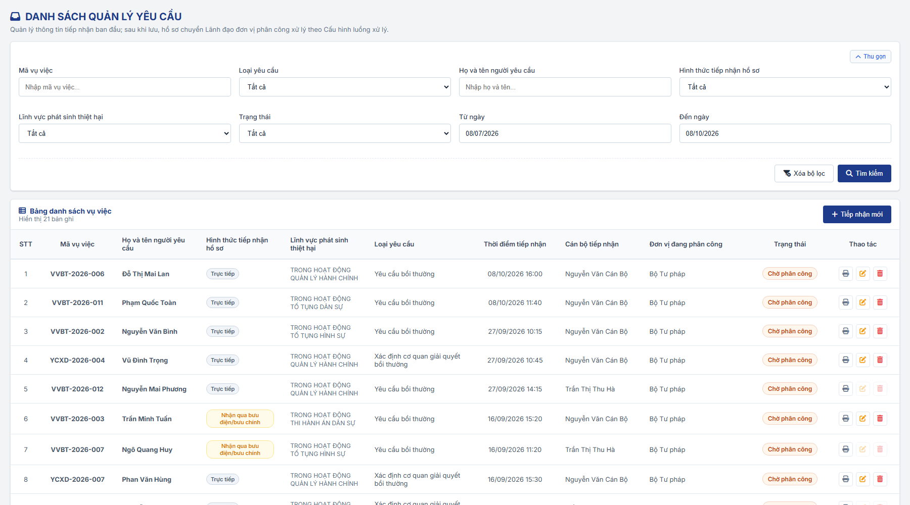
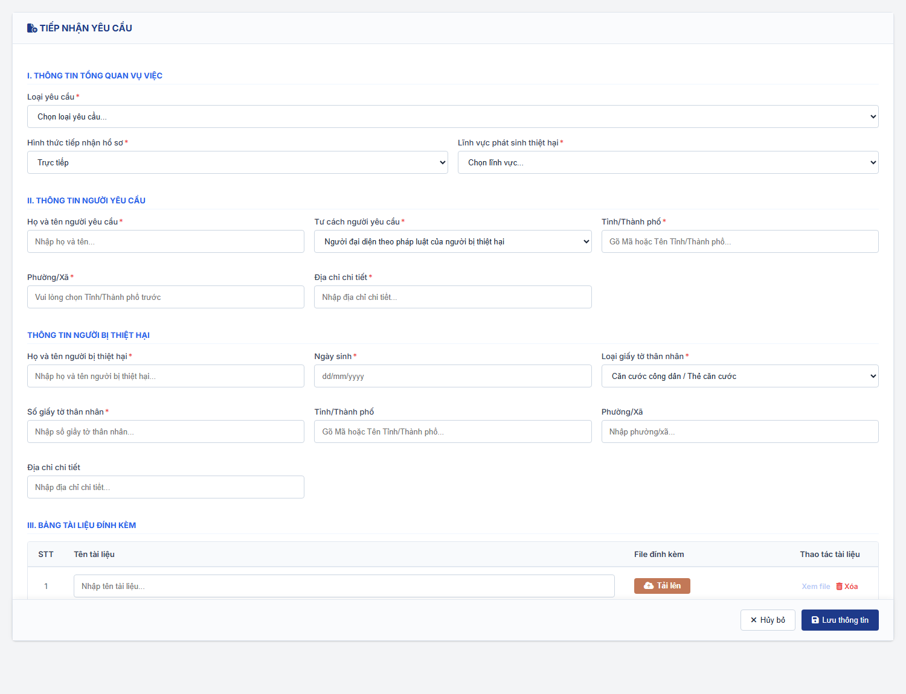
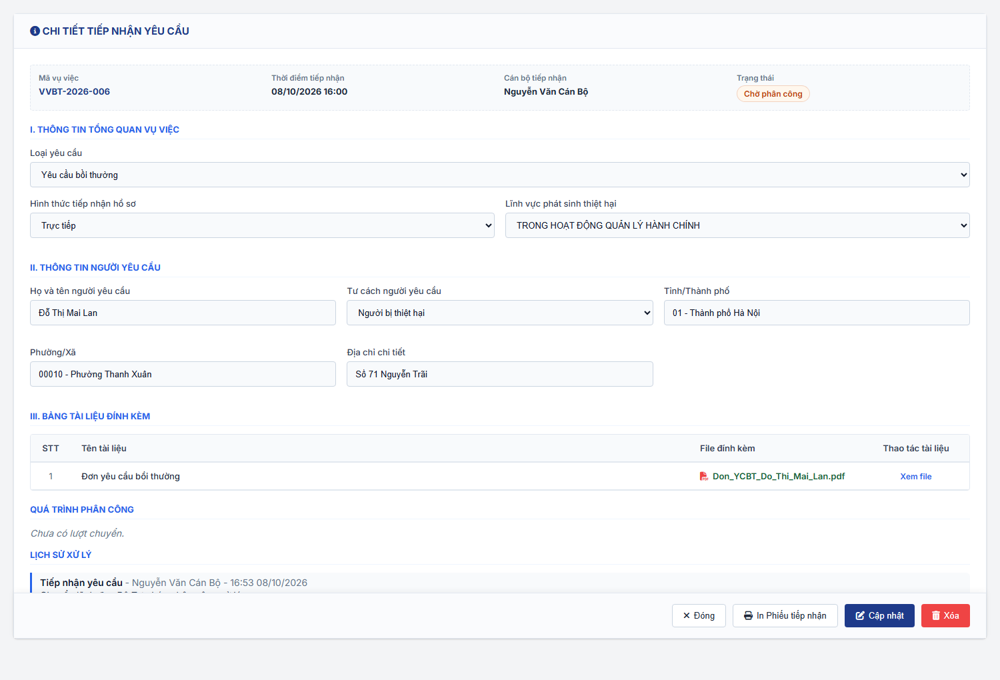
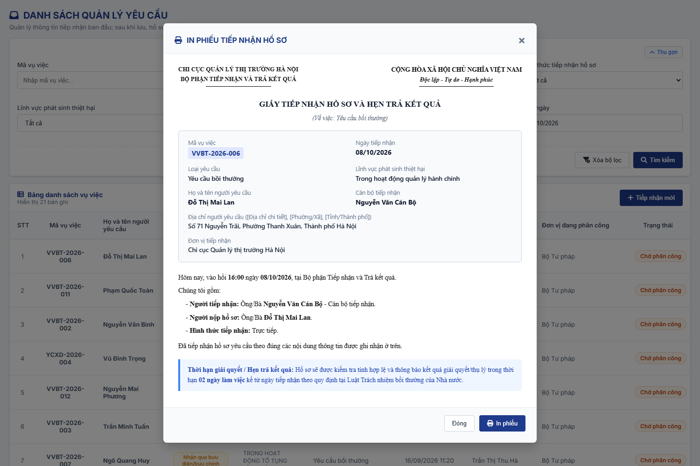

### 4.3.3. Dành cho Cán bộ Công tác bồi thường nhà nước

#### 4.3.3.1. Tiếp nhận yêu cầu

##### 4.3.3.1.1. Mục đích
Quản lý tập trung quy trình tiếp nhận ban đầu các yêu cầu bồi thường nhà nước và yêu cầu xác định cơ quan giải quyết bồi thường, bao gồm:
- Tra cứu và quản lý danh sách các yêu cầu đã tiếp nhận đang chờ lãnh đạo phân công, hỗ trợ tìm kiếm và lọc đa tiêu chí theo mã vụ việc, loại yêu cầu, người yêu cầu, hình thức tiếp nhận, lĩnh vực phát sinh, trạng thái và khoảng thời gian tiếp nhận. Hồ sơ được nhận diện bằng `Mã vụ việc` và `Họ và tên người yêu cầu`.
- Tiếp nhận mới yêu cầu: Ghi nhận thông tin tổng quan vụ việc (loại yêu cầu, hình thức tiếp nhận hồ sơ, lĩnh vực phát sinh thiệt hại), thông tin người yêu cầu (họ tên, tư cách người yêu cầu, địa chỉ), thông tin người bị thiệt hại (khi người yêu cầu không phải là người bị thiệt hại) và đính kèm các tài liệu/hồ sơ ban đầu.
- Chuyển lãnh đạo phân công sau tiếp nhận: Sau khi lưu, hồ sơ ở trạng thái `Chờ phân công` và được chuyển đến Lãnh đạo đơn vị gốc của cán bộ tiếp nhận để phân công tại [Màn hình Việc chờ lãnh đạo xử lý - Việc chờ lãnh đạo xử lý - Công tác bồi thường nhà nước (Website Quản trị)](SRS_BTNN_ViecChoLanhDaoXuLy.md), theo [Cấu hình luồng xử lý - Cấu hình luồng xử lý - Quản trị hệ thống (Website Quản trị)](../01_Quan_tri_he_thong/Cau_hinh_luong_xu_ly.md). Hệ thống không tạo hồ sơ trực tiếp tại phân hệ xử lý; hồ sơ chỉ xuất hiện tại phân hệ **Xác định cơ quan giải quyết bồi thường** hoặc phân hệ **Giải quyết yêu cầu bồi thường** (trạng thái `Chờ tiếp nhận`) khi lãnh đạo phân công cán bộ.
- Theo dõi hồ sơ ở trạng thái `Chờ phân công`, `Đang phân công` của đơn vị gốc của người dùng; chỉnh sửa thông tin tiếp nhận hoặc xóa bản ghi do chính người dùng tiếp nhận khi hồ sơ còn `Chờ phân công` và chưa có lãnh đạo nào thao tác.

a. Phân quyền
Hệ thống phân quyền thao tác theo các quyền nghiệp vụ được cấp:
- **Xem**: Tra cứu danh sách yêu cầu tiếp nhận, xem chi tiết vụ việc, xem tài liệu đính kèm, quá trình phân công và lịch sử xử lý.
- **Tạo mới**: Tiếp nhận yêu cầu mới, nhập thông tin tiếp nhận ban đầu và đính kèm tài liệu.
- **Chỉnh sửa**: Cập nhật thông tin tiếp nhận ban đầu khi bản ghi do chính người dùng tiếp nhận, hồ sơ ở trạng thái `Chờ phân công` và chưa có lãnh đạo nào thao tác (chưa có lượt chuyển/phân công).
- **Xóa**: Xóa bản ghi tiếp nhận theo cùng điều kiện với quyền Chỉnh sửa.
- **Loại yêu cầu theo đơn vị**: Ô chọn và bộ lọc `Loại yêu cầu` chỉ hiển thị các giá trị của [Danh mục Loại yêu cầu - Quản lý danh mục - Quản trị hệ thống (Website Quản trị)](../01_Quan_tri_he_thong/Quan_ly_danh_muc.md) [DM_54] có `Đơn vị áp dụng` chứa đơn vị của người dùng (tính cả đơn vị cha: chọn đơn vị cha thì áp dụng cho toàn bộ đơn vị trực thuộc). Giá trị `Xác định cơ quan giải quyết bồi thường` chỉ áp dụng cho Bộ Tư pháp và các Sở Tư pháp.

b. Điều kiện thực hiện
- Người dùng đã đăng nhập vào hệ thống thành công (Website quản trị).
- Người dùng được phân quyền truy cập chức năng "Tiếp nhận yêu cầu".

c. Trạng thái hồ sơ tại màn hình Tiếp nhận yêu cầu
- `Chờ phân công`: hồ sơ vừa được lưu, đang chờ lãnh đạo đơn vị gốc phân công hoặc đã được thu hồi về đơn vị gốc.
- `Đang phân công`: lãnh đạo đã chuyển hồ sơ cho đơn vị cấp dưới, đang chờ lãnh đạo đơn vị nhận phân công tiếp.
- Khi lãnh đạo phân công cán bộ chủ trì, hồ sơ chuyển `Chờ tiếp nhận` tại phân hệ xử lý tương ứng với `Loại yêu cầu` và không còn hiển thị tại màn hình này.

---

##### 4.3.3.1.2. MH01 - Màn hình Danh sách quản lý các Yêu cầu

###### 4.3.3.1.2.1. Màn hình

###### 4.3.3.1.2.2. Mô tả thông tin trên màn hình

| Trường thông tin | Kiểu dữ liệu | Bắt buộc | Mặc định | Mô tả |
| :--- | :--- | :--- | :--- | :--- |
| Tiêu đề màn hình | String(255) | - | - | Control UI: Text heading (Read-only). - Hiển thị `DANH SÁCH QUẢN LÝ YÊU CẦU`. - Dòng mô tả dưới tiêu đề: *"Quản lý thông tin tiếp nhận ban đầu; sau khi lưu, hồ sơ chuyển Lãnh đạo đơn vị phân công xử lý theo Cấu hình luồng xử lý."* |
| **I. Bộ lọc tìm kiếm** | Section | - | - | Control UI: Filter panel dạng thu gọn/mở rộng (Accordion). - Hiển thị phía trên bảng danh sách. - Các tiêu chí có dữ liệu được kết hợp theo điều kiện AND. - Mặc định hiển thị dạng mở rộng. - Cho phép thu gọn/mở rộng khi click vào nút "Thu gọn"/"Mở rộng" ở góc phải khối; khi thu gọn, các giá trị lọc đã nhập được giữ nguyên. |
| Mã vụ việc | String(50) | Không | Trống | Control UI: Input text. - Placeholder: `Nhập mã vụ việc...`. - Tìm kiếm gần đúng, không phân biệt hoa thường theo `Mã vụ việc`. |
| Loại yêu cầu | Enum(String(100)) | Không | `Tất cả` | Control UI: Combobox. - Lọc theo loại yêu cầu tiếp nhận. - Giá trị lấy theo Danh mục Loại yêu cầu [DM_54], chỉ gồm các giá trị có `Đơn vị áp dụng` chứa đơn vị của người dùng (gồm `Xác định cơ quan giải quyết bồi thường`, `Yêu cầu bồi thường`). |
| Họ và tên người yêu cầu | String(100) | Không | Trống | Control UI: Input text. - Placeholder: `Nhập họ và tên...`. - Tìm kiếm gần đúng, không phân biệt hoa thường theo `Họ và tên người yêu cầu`. |
| Hình thức tiếp nhận hồ sơ | Enum(String(50)) | Không | `Tất cả` | Control UI: Combobox. - Giá trị gồm: + `Tất cả` + `Trực tiếp` + `Nhận qua bưu điện/bưu chính` |
| Lĩnh vực phát sinh thiệt hại | Enum(String(100)) | Không | `Tất cả` | Control UI: Combobox. - Tham chiếu danh mục Lĩnh vực phát sinh thiệt hại [DM_22]. |
| Trạng thái | Enum(String(50)) | Không | `Tất cả` | Control UI: Combobox. - Giá trị gồm: + `Tất cả` + `Chờ phân công` + `Đang phân công` |
| Từ ngày | Date | Không | Ngày hiện tại lùi 03 tháng | Control UI: DatePicker (chọn ngày trên lịch hoặc nhập trực tiếp), định dạng `dd/mm/yyyy`. - Mặc định lấy dữ liệu trong 03 tháng gần nhất: Từ ngày là cùng ngày của 03 tháng trước ngày hiện tại (VD: ngày hiện tại 07/10/2026 thì Từ ngày là 07/07/2026). - Lọc theo `Thời điểm tiếp nhận`. - `Từ ngày` không được lớn hơn `Đến ngày`. |
| Đến ngày | Date | Không | Ngày hiện tại | Control UI: DatePicker (chọn ngày trên lịch hoặc nhập trực tiếp), định dạng `dd/mm/yyyy`. - Lọc theo `Thời điểm tiếp nhận`. - `Đến ngày` không được nhỏ hơn `Từ ngày`. |
| **II. Bảng danh sách vụ việc** | Section | - | 20 bản ghi/trang | Control UI: Data grid. - Khi người dùng truy cập màn hình, hệ thống tự động tải trang đầu tiên (Trang 1) với số lượng mặc định 20 bản ghi. - Phía trên bảng hiển thị số bản ghi: *"Hiển thị [tổng số] bản ghi"*. - Sắp xếp mặc định: Sắp xếp theo "Thời điểm tiếp nhận" giảm dần (mới nhất hiển thị lên đầu). - **Phạm vi dữ liệu**: Màn hình chỉ hiển thị hồ sơ do đơn vị gốc của người dùng tiếp nhận, ở trạng thái `Chờ phân công` hoặc `Đang phân công`, có `Loại yêu cầu` thuộc các giá trị được áp dụng cho đơn vị của người dùng. Hồ sơ đã được lãnh đạo phân công cán bộ (từ `Chờ tiếp nhận` trở đi) không còn hiển thị tại màn hình này mà được theo dõi tại phân hệ xử lý tương ứng. - Trạng thái có dữ liệu: Hiển thị danh sách các bản ghi kết quả theo cấu trúc các cột quy định. - Trạng thái không có dữ liệu (Empty State): Khi không tìm thấy kết quả phù hợp với điều kiện tìm kiếm, bảng hiển thị duy nhất 01 dòng căn giữa trên toàn bộ chiều rộng bảng (`colspan`), in nghiêng với nội dung theo MessageList dùng chung [MSG-INF-SYS-001]. |
| STT | Integer(10) | Không | Tự tăng | Số thứ tự dòng dữ liệu trên trang hiện tại. |
| Mã vụ việc | String(50) | Có | Theo dữ liệu | Chỉ đọc. Hiển thị đậm, ví dụ `VVBT-2026-xxx`. |
| Họ và tên người yêu cầu | String(100) | Có | Theo dữ liệu | Chỉ đọc. Hiển thị đậm. |
| Hình thức tiếp nhận hồ sơ | Enum(String(50)) | Có | Theo dữ liệu | Chỉ đọc. Hiển thị dạng badge `Trực tiếp` hoặc `Nhận qua bưu điện/bưu chính`. |
| Lĩnh vực phát sinh thiệt hại | Enum(String(100)) | Có | Theo dữ liệu | Chỉ đọc. Tham chiếu Danh mục Lĩnh vực phát sinh thiệt hại [DM_22]. |
| Loại yêu cầu | Enum(String(100)) | Có | Theo dữ liệu | Control UI: Text hiển thị (Read-only). - Hiển thị loại yêu cầu đã chọn ở bước tiếp nhận (`Xác định cơ quan giải quyết bồi thường` hoặc `Yêu cầu bồi thường`). |
| Thời điểm tiếp nhận | DateTime | Có | Theo dữ liệu | Chỉ đọc. Định dạng `dd/mm/yyyy HH:mm`. |
| Cán bộ tiếp nhận | String(255) | Không | Theo dữ liệu | Chỉ đọc. Người đã tiếp nhận vụ việc. |
| Đơn vị đang phân công | String(255) | Có | Theo dữ liệu | Chỉ đọc. Đơn vị mà Nhóm lãnh đạo đang giữ hồ sơ để phân công: đơn vị gốc khi hồ sơ `Chờ phân công`; đơn vị cấp dưới đã được chuyển khi hồ sơ `Đang phân công`. |
| Trạng thái | Enum(String(50)) | Có | Theo dữ liệu | Hiển thị badge `Chờ phân công` hoặc `Đang phân công`. |
| Thao tác | Action Buttons | Không | Theo quyền/trạng thái | Control UI: Icon buttons (Fixed-slot Action Column). - Gồm các icon thao tác: + **In Phiếu tiếp nhận**: Khả dụng đối với hồ sơ ở trạng thái `Chờ phân công` hoặc `Đang phân công`. + **Cập nhật**: Chỉ khả dụng khi hồ sơ ở trạng thái `Chờ phân công`, lãnh đạo chưa thao tác (chưa có lượt chuyển/phân công) và do người dùng hiện tại tiếp nhận. + **Xóa**: Cùng điều kiện với **Cập nhật**. - Các thao tác không khả dụng hiển thị ở dạng mờ (disabled) theo quy chuẩn giao diện, không cho phép click; rê chuột hiển thị điều kiện khả dụng (ví dụ *"Chỉ khả dụng khi hồ sơ ở trạng thái Chờ phân công, lãnh đạo chưa thao tác và do người dùng hiện tại tiếp nhận"*).|

###### 4.3.3.1.2.3. Chức năng trên màn hình

| STT | Tên chức năng | Định dạng | Mô tả |
| :--- | :--- | :--- | :--- |
| 1 | Tìm kiếm | Button | Khi người dùng click nút, hệ thống kiểm tra điều kiện dữ liệu và thực hiện tìm kiếm theo các trường hợp bên dưới: - **TH1 - Khoảng ngày không hợp lệ**: Nếu `Từ ngày` lớn hơn `Đến ngày`, hệ thống hiển thị cảnh báo lỗi [MSG-ERR-VAL-007] và không thực hiện tìm kiếm. - **TH Hợp lệ (Có dữ liệu phù hợp)**: Hệ thống lọc và hiển thị danh sách các bản ghi thuộc phạm vi dữ liệu của người dùng, thỏa mãn đồng thời các tiêu chí tìm kiếm/lọc đã nhập/chọn, hiển thị kết quả lên bảng và đưa về Trang 1. - **TH Không có dữ liệu trả về**: Bảng kết quả hiển thị duy nhất 01 dòng căn giữa trên toàn bộ chiều rộng bảng (`colspan`), in nghiêng với nội dung theo MessageList dùng chung [MSG-INF-SYS-001]; thanh phân trang hiển thị *"Hiển thị 0-0 trong tổng số 0 bản ghi"*, các nút điều hướng trang ở trạng thái khóa mờ (Disabled). |
| 2 | Xóa bộ lọc | Button | Hệ thống xóa các điều kiện lọc (gồm cả `Trạng thái`), đưa Từ ngày, Đến ngày về khoảng 03 tháng gần nhất, tải lại danh sách theo điều kiện mặc định. |
| 3 | Tiếp nhận mới | Button | Nút nằm phía trên bên phải bảng danh sách. Khi người dùng click nút, hệ thống mở [MH02 - Màn hình Tiếp nhận yêu cầu](#43313-mh02---màn-hình-tiếp-nhận-yêu-cầu) ở trạng thái rỗng để nhập mới. |
| 4 | Click dòng dữ liệu | Row click | Khi người dùng click vào dòng dữ liệu trên bảng (ngoại trừ click trực tiếp vào icon trong cột `Thao tác`), hệ thống mở [MH03 - Màn hình Xem chi tiết Tiếp nhận Yêu cầu bồi thường](#43314-mh03---màn-hình-xem-chi-tiết-tiếp-nhận-yêu-cầu-bồi-thường) tương ứng với bản ghi được chọn. Nếu người dùng click vào icon trong cột `Thao tác`, hệ thống thực hiện đúng chức năng của icon được click và không kích hoạt row click. |
| 5 | In Phiếu tiếp nhận | Icon button | - Khi người dùng click icon, hệ thống mở [MH04 - Popup In Phiếu tiếp nhận yêu cầu](#43315-mh04---popup-in-phiếu-tiếp-nhận-yêu-cầu) để xem trước và thực hiện in Phiếu tiếp nhận hồ sơ theo mẫu quy định. |
| 6 | Cập nhật | Icon button | -  Khi người dùng click icon, hệ thống mở [MH02 - Màn hình Tiếp nhận yêu cầu](#43313-mh02---màn-hình-tiếp-nhận-yêu-cầu) ở chế độ chỉnh sửa và tự động điền dữ liệu của bản ghi đó. |
| 7 | Xóa | Icon button | Khi người dùng click icon Xóa, hệ thống xử lý theo các trường hợp bên dưới: - **TH1 - Mở popup xác nhận**: Hệ thống hiển thị Custom Confirmation Modal xác nhận xóa [MSG-CFM-SYS-001] với nội dung: *"Bạn có chắc chắn muốn xóa bản ghi [Mã vụ việc] - [Họ và tên người yêu cầu] không?"*. - **TH2 - Người dùng chọn "Đồng ý"**: Hệ thống thực hiện **xóa mềm** (cập nhật cờ/trạng thái đã xóa trong CSDL, không xóa vật lý bản ghi) để lưu vết phục vụ audit log và thanh tra; hồ sơ đồng thời được gỡ khỏi danh sách `Chờ phân công` của lãnh đạo; bản ghi không còn hiển thị trên danh sách quản lý và hiển thị thông báo thành công [MSG-SUC-BTNN-TN-001] (*"Đã xóa bản ghi khỏi danh sách quản lý!"*). - **TH3 - Người dùng chọn "Hủy bỏ"**: Hệ thống đóng popup xác nhận, không xóa vụ việc. |

---

##### 4.3.3.1.3. MH02 - Màn hình Tiếp nhận yêu cầu

###### 4.3.3.1.3.1. Màn hình

###### 4.3.3.1.3.2. Mô tả thông tin trên màn hình

| Trường thông tin | Kiểu dữ liệu | Bắt buộc | Mặc định | Mô tả |
| :--- | :--- | :--- | :--- | :--- |
| Tiêu đề màn hình | String(255) | - | Theo ngữ cảnh | Control UI: Text heading (Read-only). - Khi thêm mới hiển thị `TIẾP NHẬN YÊU CẦU`. - Khi mở từ danh sách để chỉnh sửa bản ghi `Chờ phân công`, hiển thị `CHỈNH SỬA THÔNG TIN TIẾP NHẬN`. |
| Mã vụ việc | String(50) | - | Tự sinh | Chỉ đọc. **Không hiển thị khi thêm mới** (vì mã vụ việc chỉ được sinh sau khi lưu thành công). Chỉ hiển thị khi mở lại bản ghi đã tồn tại, hiển thị đúng mã đã sinh, ví dụ `VVBT-2026-xxx`. |
| Thời điểm tiếp nhận | DateTime | - | Tự sinh | Chỉ đọc. **Không hiển thị khi thêm mới** (vì thời điểm tiếp nhận chỉ được ghi nhận sau khi lưu thành công). Chỉ hiển thị khi mở lại vụ việc đã tồn tại, theo thời điểm người dùng đã bấm `Lưu thông tin` lần đầu. Định dạng hiển thị `dd/mm/yyyy HH:mm`. |
| Cán bộ tiếp nhận | String(255) | - | Theo dữ liệu | Chỉ đọc. **Không hiển thị khi thêm mới**. Họ tên cán bộ đã tiếp nhận vụ việc. |
| Trạng thái | Enum(String(50)) | - | Theo dữ liệu | Chỉ đọc. **Không hiển thị khi thêm mới**. Badge trạng thái hiện tại của hồ sơ. |
| **I. Thông tin tổng quan vụ việc** | Section | - | - | Control UI: Section header. |
| Loại yêu cầu | Enum(String(100)) | Có | Trống | Control UI: Combobox. - Placeholder: `Chọn loại yêu cầu...`. - Giá trị lấy theo Danh mục Loại yêu cầu [DM_54], chỉ gồm các giá trị có `Đơn vị áp dụng` chứa đơn vị của người dùng (gồm `Xác định cơ quan giải quyết bồi thường`, `Yêu cầu bồi thường`). - Loại yêu cầu quyết định phân hệ xử lý hồ sơ sau khi lãnh đạo phân công cán bộ. |
| Hình thức tiếp nhận hồ sơ | Enum(String(50)) | Có | `Trực tiếp` | Control UI: Combobox. - Giá trị gồm: + `Trực tiếp` + `Nhận qua bưu điện/bưu chính` |
| Lĩnh vực phát sinh thiệt hại | Enum(String(100)) | Có | Trống | Control UI: Combobox. - Placeholder: `Chọn lĩnh vực...`. - Tham chiếu danh mục Lĩnh vực phát sinh thiệt hại [DM_22]. |
| **II. Thông tin người yêu cầu** | Section | - | - | Control UI: Section header. |
| Họ và tên người yêu cầu | String(100) | Có | Trống | Control UI: Input text. - Placeholder: `Nhập họ và tên...`. - Nhập họ tên cá nhân/người đại diện/tổ chức yêu cầu bồi thường. |
| Tư cách người yêu cầu | Enum(String(100)) | Có | `Người bị thiệt hại` | Control UI: Combobox. - Giá trị gồm: + `Người bị thiệt hại` + `Người thừa kế của người bị thiệt hại` + `Tổ chức kế thừa quyền, nghĩa vụ của tổ chức bị thiệt hại đã chấm dứt tồn tại` + `Người đại diện theo pháp luật của người bị thiệt hại` + `Cá nhân, pháp nhân được ủy quyền hợp pháp` - Khi chọn giá trị khác `Người bị thiệt hại`, hệ thống hiển thị khối `Thông tin người bị thiệt hại`; khi chọn lại `Người bị thiệt hại`, khối được ẩn và dữ liệu trong khối không được lưu. |
| Tỉnh/Thành phố | Enum(String(100)) / String(100) | Có | Trống | Control UI: Combobox có tìm kiếm / Input text. - Placeholder: `Gõ Mã hoặc Tên Tỉnh/Thành phố...`. - Nếu `Quốc gia` = `Việt Nam`: Tham chiếu Danh mục Tỉnh/Thành phố [DM_13]. Cho phép gõ tìm kiếm theo Mã hoặc Tên. - Nếu `Quốc gia` khác `Việt Nam`: Hiển thị ô nhập văn bản để người dùng tự do nhập. |
| Phường/Xã | Enum(String(100)) / String(100) | Có | Trống | Control UI: Combobox có tìm kiếm / Input text. - Phụ thuộc vào `Tỉnh/Thành phố` đã chọn. - Nếu `Quốc gia` = `Việt Nam`: Tham chiếu Danh mục Xã/Phường/Thị trấn [DM_15] (lọc động theo Tỉnh/Thành phố đã chọn). Cho phép gõ tìm kiếm theo Mã hoặc Tên. Nếu chưa chọn Tỉnh/Thành phố thì khóa mờ (Disabled) kèm placeholder *"Vui lòng chọn Tỉnh/Thành phố trước"*. - Nếu `Quốc gia` khác `Việt Nam`: Hiển thị ô nhập văn bản (Input text) để người dùng tự do nhập. |
| Địa chỉ chi tiết | Text(1000) / String(500) | Có | Trống | Control UI: Input text. - Placeholder: `Nhập địa chỉ chi tiết...`. - Nhập số nhà, tên đường/phố, thôn/xóm/ấp... |
| **Thông tin người bị thiệt hại** | Section | - | Ẩn | Control UI: Section header. - Chỉ hiển thị khi `Tư cách người yêu cầu` khác `Người bị thiệt hại`. - Chỉ 04 trường `Họ và tên người bị thiệt hại`, `Ngày sinh`, `Loại giấy tờ thân nhân`, `Số giấy tờ thân nhân` là bắt buộc. |
| Họ và tên người bị thiệt hại | String(100) | Có | Trống | Control UI: Input text. - Placeholder: `Nhập họ và tên người bị thiệt hại...`. |
| Ngày sinh | Date | Có | Trống | Control UI: Input date, định dạng `dd/mm/yyyy`. |
| Loại giấy tờ thân nhân | Enum(String(50)) | Có | `CCCD` | Control UI: Combobox. - Tham chiếu danh mục loại giấy tờ pháp lý [DM_10] (`Căn cước công dân / Thẻ căn cước`, `Chứng minh nhân dân`, `Hộ chiếu`). |
| Số giấy tờ thân nhân | String(50) | Có | Trống | Control UI: Input text. - Placeholder: `Nhập số giấy tờ thân nhân...`. |
| Tỉnh/Thành phố | Enum(String(100)) | Không | Trống | Control UI: Combobox có tìm kiếm. - Tham chiếu Danh mục Tỉnh/Thành phố [DM_13]; placeholder `Gõ Mã hoặc Tên Tỉnh/Thành phố...`. |
| Phường/Xã | String(100) | Không | Trống | Control UI: Input text. - Placeholder: `Nhập phường/xã...`. |
| Địa chỉ chi tiết | String(500) | Không | Trống | Control UI: Input text. - Placeholder: `Nhập địa chỉ chi tiết...`. |
| **III. VĂN BẢN LÀM CĂN CỨ YÊU CẦU BỒI THƯỜNG** | Section | Không | - | Control UI: Section header. - Khối thông tin văn bản làm căn cứ yêu cầu bồi thường (không bắt buộc). - Tự động kế thừa từ hồ sơ Xác định cơ quan giải quyết bồi thường tương ứng nếu đã được nhập trước đó. - Cho phép cán bộ tiếp nhận nhập tên văn bản căn cứ và đính kèm file tài liệu. |
| Tên văn bản làm căn cứ yêu cầu bồi thường | String(255) | Không | Trống / Kế thừa | Control UI: Input text. - Placeholder: `Nhập tên văn bản làm căn cứ...`. |
| File văn bản căn cứ | File | Không | Trống / Kế thừa | Control UI: File upload trigger (`Tải lên`). Cho phép chọn file văn bản căn cứ (định dạng `.pdf`, `.doc`, `.docx`, `.jpg`, `.png`; tối đa 20MB/file). Hiển thị tên file kèm nút `Xem file` và `Xóa`. |
| **IV. Bảng tài liệu đính kèm** | List(Object) | Không | Trống | Cho phép nhập nhiều tài liệu liên quan đến bước tiếp nhận. Mỗi dòng gồm tên tài liệu và file đính kèm. |
| STT | Integer(10) | - | Tự tăng | Căn giữa, tăng theo số dòng tài liệu. |
| Tên tài liệu | String(255) | Có khi thêm dòng | Trống | Người dùng nhập tên tài liệu (placeholder `Nhập tên tài liệu...`). Bắt buộc khi dòng tài liệu có file. Khi tải file lên mà chưa nhập tên, hệ thống lấy tên file (bỏ phần mở rộng) làm tên tài liệu. |
| File đính kèm | File | Không | Trống | Cho phép chọn file tài liệu liên quan theo quy tắc file dùng chung (định dạng `.pdf`, `.doc`, `.docx`, `.jpg`, `.png`; tối đa 20MB/file). |
| Thao tác tài liệu | Action Links | - | Theo dòng | Control UI: Buttons / Links / Icons. - Gồm các thao tác: + **Thêm dòng** + **Tải lên** + **Xem file** + **Xóa** |
| **Quá trình phân công** | List(Object) | - | Ẩn khi thêm mới | Control UI: Data grid (Read-only). - Chỉ hiển thị khi mở lại bản ghi đã tồn tại. - Cột: `STT`, `Lượt chuyển` (người chuyển, đơn vị chuyển, đơn vị/cán bộ nhận, kèm `Ý kiến chỉ đạo` nếu có), `Thời điểm`, `Tình trạng` (`Đã xử lý`, `Chưa xử lý - Chưa xem` hoặc `Chưa xử lý - Đã xem lúc [hh:mm dd/mm/yyyy]`). - Chưa có lượt chuyển thì hiển thị *"Chưa có lượt chuyển."* |
| **Lịch sử xử lý** | List(Object) | - | Ẩn khi thêm mới | Control UI: Timeline (Read-only). - Chỉ hiển thị khi mở lại bản ghi đã tồn tại. - Sắp xếp mới nhất lên đầu; mỗi dòng gồm `[Hành động] - [Người thực hiện] - [Thời điểm]` và nội dung (ví dụ `Tiếp nhận yêu cầu`, `Cập nhật thông tin tiếp nhận`, `Chuyển đơn vị`, `Thu hồi`). |

###### 4.3.3.1.3.3. Chức năng trên màn hình

| STT | Tên chức năng | Định dạng | Mô tả |
| :--- | :--- | :--- | :--- |
| 1 | Hủy bỏ | Button | Hệ thống đóng màn hình tiếp nhận và quay về [MH01 - Màn hình Danh sách quản lý các Yêu cầu](#43312-mh01---màn-hình-danh-sách-quản-lý-các-yêu-cầu). |
| 2 | Thêm dòng tài liệu | Button/Icon | Nút `Thêm dòng`. Hệ thống thêm một dòng tài liệu mới để người dùng nhập `Tên tài liệu` và chọn file đính kèm. |
| 3 | Tải lên | Button/Icon | Khi người dùng chọn tệp tin tải lên cho dòng tài liệu, hệ thống kiểm tra và xử lý theo các trường hợp bên dưới: - **TH1 - File sai định dạng**: Nếu tệp tin không đúng định dạng cho phép (`.pdf`, `.doc`, `.docx`, `.jpg`, `.png`), hệ thống hiển thị cảnh báo lỗi [MSG-ERR-FILE-001] và không tiếp nhận tệp. - **TH2 - File quá dung lượng**: Nếu dung lượng tệp tin vượt quá 20MB/file, hệ thống hiển thị cảnh báo lỗi [MSG-ERR-FILE-002] và không tiếp nhận tệp. - **TH3 - Hợp lệ**: Hệ thống tải tệp tin lên thành công, hiển thị tên tệp tin kèm liên kết "Xem file" và nút "Xóa". |
| 4 | Xem file | Link | Mở xem nội dung tệp tin đã tải lên tại tab trình duyệt mới. |
| 5 | Xóa | Link/Icon | Mở Custom Confirmation Modal xác nhận gỡ bỏ tệp tin/dòng tài liệu đã tải lên với nội dung [MSG-CFM-SYS-001] (*"Bạn có chắc chắn muốn xóa tài liệu này không?"*): - Khi người dùng chọn "Đồng ý": Hệ thống gỡ dòng tài liệu hoặc tệp tin đính kèm khỏi biểu mẫu. - Khi người dùng chọn "Hủy bỏ": Đóng popup xác nhận và giữ nguyên tài liệu. |
| 6 | Lưu thông tin | Button | Khi người dùng click nút, hệ thống kiểm tra dữ liệu và xử lý theo các trường hợp bên dưới: - **TH1 - Bỏ trống trường bắt buộc**: Nếu bỏ trống một trong các trường bắt buộc đang hiển thị (gồm các trường bắt buộc của khối `Thông tin người bị thiệt hại` khi khối đang hiển thị) hoặc dòng tài liệu có file nhưng chưa có tên, hệ thống tô viền đỏ các trường lỗi, hiển thị [MSG-ERR-VAL-001] dưới ô nhập, hiển thị thông báo *"Vui lòng nhập đầy đủ thông tin bắt buộc!"*, focus vào trường lỗi đầu tiên và không cho lưu. - **TH2 - Thêm mới, dữ liệu hợp lệ** (áp dụng cho cả hai loại yêu cầu): Hệ thống tự động sinh `Mã vụ việc`, ghi nhận `Thời điểm tiếp nhận` và cán bộ tiếp nhận, lưu thông tin tổng quan, thông tin người yêu cầu, người bị thiệt hại và tài liệu đính kèm; hồ sơ ở trạng thái `Chờ phân công`, đơn vị tiếp nhận là đơn vị gốc của cán bộ tiếp nhận; hồ sơ được chuyển đến tab `Chờ phân công` của Lãnh đạo đơn vị gốc tại [Màn hình Việc chờ lãnh đạo xử lý - Việc chờ lãnh đạo xử lý - Công tác bồi thường nhà nước (Website Quản trị)](SRS_BTNN_ViecChoLanhDaoXuLy.md); ghi Lịch sử xử lý `Tiếp nhận yêu cầu`; hiển thị thông báo *"Đã lưu thông tin. Hồ sơ [Mã vụ việc] chuyển Lãnh đạo [Tên đơn vị gốc] phân công [Chờ phân công]!"* và quay về [MH01 - Màn hình Danh sách quản lý các Yêu cầu](#43312-mh01---màn-hình-danh-sách-quản-lý-các-yêu-cầu). Khi lãnh đạo phân công cán bộ, hồ sơ chuyển `Chờ tiếp nhận` tại phân hệ **Xác định cơ quan giải quyết bồi thường** (Loại yêu cầu = `Xác định cơ quan giải quyết bồi thường`) hoặc phân hệ **Giải quyết yêu cầu bồi thường** (Loại yêu cầu = `Yêu cầu bồi thường`). - **TH3 - Chỉnh sửa, lãnh đạo đã thao tác**: Khi lưu, hệ thống kiểm tra lại tại máy chủ; nếu hồ sơ không còn `Chờ phân công` hoặc lãnh đạo đã chuyển/phân công trong lúc đang cập nhật, hệ thống hiển thị *"Hồ sơ đã được lãnh đạo phân công, không thể cập nhật!"*, không lưu và quay về [MH01 - Màn hình Danh sách quản lý các Yêu cầu](#43312-mh01---màn-hình-danh-sách-quản-lý-các-yêu-cầu). - **TH4 - Chỉnh sửa, dữ liệu hợp lệ**: Hệ thống ghi nhận thông tin cập nhật, giữ nguyên trạng thái `Chờ phân công`, ghi Lịch sử xử lý `Cập nhật thông tin tiếp nhận`, hiển thị thông báo *"Đã cập nhật thông tin tiếp nhận!"* và quay về [MH01 - Màn hình Danh sách quản lý các Yêu cầu](#43312-mh01---màn-hình-danh-sách-quản-lý-các-yêu-cầu). |
| 7 | In Phiếu tiếp nhận | Button | - **Điều kiện hiển thị**: Chỉ hiển thị khi chỉnh sửa bản ghi đã tồn tại ở trạng thái `Chờ phân công` hoặc `Đang phân công`. - Khi người dùng click nút, hệ thống mở [MH04 - Popup In Phiếu tiếp nhận yêu cầu](#43315-mh04---popup-in-phiếu-tiếp-nhận-yêu-cầu) để xem trước và thực hiện in Phiếu tiếp nhận hồ sơ. |

---

##### 4.3.3.1.4. MH03 - Màn hình Xem chi tiết Tiếp nhận Yêu cầu bồi thường

###### 4.3.3.1.4.1. Màn hình

###### 4.3.3.1.4.2. Mô tả thông tin trên màn hình

| Trường thông tin | Kiểu dữ liệu | Bắt buộc | Mặc định | Mô tả |
| :--- | :--- | :--- | :--- | :--- |
| Tiêu đề màn hình | String(255) | - | - | Control UI: Text heading (Read-only). - Hiển thị `CHI TIẾT TIẾP NHẬN YÊU CẦU`. |
| Mã vụ việc | String(50) | - | Theo dữ liệu | Control UI: Text (Read-only). - Hiển thị theo dữ liệu bản ghi (ví dụ: `VVBT-2026-xxx`). |
| Thời điểm tiếp nhận | DateTime | - | Theo dữ liệu | Control UI: Text (Read-only). - Hiển thị theo dữ liệu bản ghi (định dạng `dd/mm/yyyy HH:mm`). |
| Cán bộ tiếp nhận | String(255) | - | Theo dữ liệu | Control UI: Text (Read-only). - Hiển thị theo dữ liệu bản ghi. |
| Trạng thái | Enum(String(50)) | - | Theo dữ liệu | Control UI: Badge (Read-only). - `Chờ phân công` hoặc `Đang phân công`. |
| Loại yêu cầu | Enum(String(100)) | - | Theo dữ liệu | Control UI: Text (Read-only). - Hiển thị theo dữ liệu bản ghi (`Xác định cơ quan giải quyết bồi thường` hoặc `Yêu cầu bồi thường`). |
| Hình thức tiếp nhận hồ sơ | Enum(String(50)) | - | Theo dữ liệu | Control UI: Text (Read-only). - Hiển thị `Trực tiếp` hoặc `Nhận qua bưu điện/bưu chính`. |
| Lĩnh vực phát sinh thiệt hại | Enum(String(100)) | - | Theo dữ liệu | Control UI: Text (Read-only). - Hiển thị theo dữ liệu bản ghi. |
| Họ và tên người yêu cầu | String(100) | - | Theo dữ liệu | Control UI: Text (Read-only). - Hiển thị theo dữ liệu bản ghi. |
| Tư cách người yêu cầu | Enum(String(100)) | - | Theo dữ liệu | Control UI: Text (Read-only). - Hiển thị theo dữ liệu bản ghi. |
| Tỉnh/Thành phố | String(100) | - | Theo dữ liệu | Control UI: Text (Read-only). - Hiển thị theo dữ liệu bản ghi. |
| Phường/Xã | String(100) | - | Theo dữ liệu | Control UI: Text (Read-only). - Hiển thị theo dữ liệu bản ghi. |
| Địa chỉ chi tiết | String(500) | - | Theo dữ liệu | Control UI: Text (Read-only). - Hiển thị theo dữ liệu bản ghi. |
| Thông tin người bị thiệt hại | Object | - | Ẩn | Control UI: Nhóm Text (Read-only). - Chỉ hiển thị khi `Tư cách người yêu cầu` khác `Người bị thiệt hại`. - Gồm: `Họ và tên người bị thiệt hại`, `Ngày sinh`, `Loại giấy tờ thân nhân`, `Số giấy tờ thân nhân`, `Tỉnh/Thành phố`, `Phường/Xã`, `Địa chỉ chi tiết`. |
| Văn bản làm căn cứ yêu cầu bồi thường | Object | Không | Theo hồ sơ | Control UI: Text + Link (Read-only). - Hiển thị tên văn bản làm căn cứ yêu cầu bồi thường kèm liên kết `Xem file` và `Tải xuống` (nếu có file đính kèm); chưa có thì hiển thị `--`. |
| Bảng tài liệu đính kèm | List(Object) | - | Theo dữ liệu | Danh sách các tài liệu ban đầu đã đính kèm theo vụ việc ở dạng chỉ đọc. Không có tài liệu thì hiển thị *"Không có tài liệu đính kèm nào."* |
| STT | Integer(10) | - | Tự tăng | Số thứ tự dòng tài liệu. |
| Tên tài liệu | String(255) | - | Theo dữ liệu | Control UI: Text (Read-only). - Hiển thị tên tài liệu theo dữ liệu bản ghi. |
| File đính kèm | File | - | Theo dữ liệu | Control UI: Text link (Read-only). - Hiển thị tên file kèm liên kết `Xem file` (mở tab mới). |
| Quá trình phân công | List(Object) | - | Theo dữ liệu | Control UI: Data grid (Read-only). - Cột: `STT`, `Lượt chuyển`, `Thời điểm`, `Tình trạng`; mô tả như tại [MH02 - Màn hình Tiếp nhận yêu cầu](#43313-mh02---màn-hình-tiếp-nhận-yêu-cầu). |
| Lịch sử xử lý | List(Object) | - | Theo dữ liệu | Control UI: Timeline (Read-only). - Mô tả như tại [MH02 - Màn hình Tiếp nhận yêu cầu](#43313-mh02---màn-hình-tiếp-nhận-yêu-cầu). |
| Thanh thao tác cuối màn hình | Section | - | Theo trạng thái | Control UI: Action bar. - Hiển thị các nút thao tác tương ứng theo trạng thái hồ sơ quy định tại bảng Chức năng trên màn hình bên dưới. |

###### 4.3.3.1.4.3. Chức năng trên màn hình

| STT | Tên chức năng | Định dạng | Mô tả |
| :--- | :--- | :--- | :--- |
| 1 | Đóng | Button | Khi người dùng click nút, hệ thống đóng màn hình xem chi tiết và quay về [MH01 - Màn hình Danh sách quản lý các Yêu cầu](#43312-mh01---màn-hình-danh-sách-quản-lý-các-yêu-cầu). |
| 2 | In Phiếu tiếp nhận | Button | - **Điều kiện hiển thị/khả dụng**: Hiển thị đối với hồ sơ ở trạng thái `Chờ phân công` hoặc `Đang phân công`. - **Hành vi**: Khi người dùng click nút, hệ thống mở [MH04 - Popup In Phiếu tiếp nhận yêu cầu](#43315-mh04---popup-in-phiếu-tiếp-nhận-yêu-cầu). Hành vi xử lý chi tiết theo mô tả tại chức năng [In Phiếu tiếp nhận (STT 5 của MH01)](#433123-chức-năng-trên-màn-hình) hoặc [In Phiếu tiếp nhận (STT 7 của MH02)](#433133-chức-năng-trên-màn-hình). |
| 3 | Cập nhật| Button | - **Điều kiện hiển thị/khả dụng**: Chỉ hiển thị khi hồ sơ ở trạng thái `Chờ phân công`, lãnh đạo chưa thao tác (chưa có lượt chuyển/phân công) và do chính người dùng hiện tại tiếp nhận. - **Hành vi**: Khi người dùng click nút, hệ thống mở [MH02 - Màn hình Tiếp nhận yêu cầu](#43313-mh02---màn-hình-tiếp-nhận-yêu-cầu) ở chế độ chỉnh sửa. Hành vi xử lý chi tiết theo mô tả tại chức năng [Cập nhật (STT 6 của MH01)](#433123-chức-năng-trên-màn-hình). |
| 4 | Xóa | Button | - **Điều kiện hiển thị/khả dụng**: Cùng điều kiện với nút `Cập nhật`. - **Hành vi**: Khi người dùng click nút, hệ thống mở popup xác nhận xóa và xử lý xóa mềm. Hành vi xử lý chi tiết theo mô tả tại chức năng [Xóa (STT 7 của MH01)](#433123-chức-năng-trên-màn-hình). Sau khi xóa thành công, hệ thống điều hướng quay về [MH01 - Màn hình Danh sách quản lý các Yêu cầu](#43312-mh01---màn-hình-danh-sách-quản-lý-các-yêu-cầu). |

---

##### 4.3.3.1.5. MH04 - Popup In Phiếu tiếp nhận yêu cầu

###### 4.3.3.1.5.1. Màn hình

Popup mở ra khi người dùng click thao tác `In Phiếu tiếp nhận` tại [MH01 - Màn hình Danh sách quản lý các Yêu cầu](#43312-mh01---màn-hình-danh-sách-quản-lý-các-yêu-cầu), click nút `In Phiếu tiếp nhận` tại [MH02 - Màn hình Tiếp nhận yêu cầu](#43313-mh02---màn-hình-tiếp-nhận-yêu-cầu) hoặc click nút `In Phiếu tiếp nhận` tại [MH03 - Màn hình Xem chi tiết Tiếp nhận Yêu cầu bồi thường](#43314-mh03---màn-hình-xem-chi-tiết-tiếp-nhận-yêu-cầu-bồi-thường) đối với các hồ sơ ở trạng thái `Chờ phân công` hoặc `Đang phân công`. Popup cho phép cán bộ kiểm tra thông tin tiếp nhận trước khi thực hiện in Giấy tiếp nhận hồ sơ và hẹn trả kết quả theo mẫu quy định.

###### 4.3.3.1.5.2. Mô tả thông tin trên màn hình

| Trường thông tin | Kiểu dữ liệu | Bắt buộc | Mặc định | Mô tả |
| :--- | :--- | :--- | :--- | :--- |
| Tiêu đề popup | String(255) | - | `IN PHIẾU TIẾP NHẬN HỒ SƠ` | Control UI: Heading text (Chỉ đọc). - Tiêu đề văn bản: `GIẤY TIẾP NHẬN HỒ SƠ VÀ HẸN TRẢ KẾT QUẢ`, dòng phụ `(Về việc: [Loại yêu cầu])`. |
| Mã vụ việc | String(50) | - | Theo dữ liệu | Control UI: Text (Chỉ đọc). Mã vụ việc đã được hệ thống tự động sinh (ví dụ: `VVBT-2026-001`). |
| Loại yêu cầu | Enum(String(100)) | - | Theo dữ liệu | Control UI: Text (Chỉ đọc). |
| Lĩnh vực phát sinh thiệt hại | Enum(String(100)) | - | Theo dữ liệu | Control UI: Text (Chỉ đọc). |
| Thông tin người yêu cầu | Object | - | Theo dữ liệu | Nhóm thông tin nhân thân của người yêu cầu bồi thường (Chỉ đọc). Gồm: + **Họ và tên người yêu cầu**: String(100), Chỉ đọc. Họ tên cá nhân / người đại diện / tổ chức nộp hồ sơ yêu cầu bồi thường. + **Địa chỉ**: String(500), Chỉ đọc. Cấu trúc hiển thị đầy đủ theo các trường thông tin địa chỉ đã nhập ở Tiếp nhận hồ sơ, gồm: `Địa chỉ chi tiết`, `Phường/Xã`, `Tỉnh/Thành phố` (Định dạng hiển thị: `[Địa chỉ chi tiết], [Phường/Xã], [Tỉnh/Thành phố]`). |
| Ngày tiếp nhận | Date | - | Theo dữ liệu | Control UI: Text (Chỉ đọc). Hiển thị Ngày tiếp nhận theo thông tin đã ghi nhận ở Tiếp nhận hồ sơ (định dạng `dd/mm/yyyy`). |
| Đơn vị tiếp nhận | String(255) | - | Theo dữ liệu | Control UI: Text (Chỉ đọc). |
| Cán bộ tiếp nhận | String(100) | - | Theo dữ liệu | Control UI: Text (Chỉ đọc). Họ và tên cán bộ đã thực hiện tiếp nhận hồ sơ. |
| Hình thức tiếp nhận | Enum(String(50)) | - | Theo dữ liệu | Control UI: Text (Chỉ đọc). `Trực tiếp` hoặc `Nhận qua bưu điện/bưu chính`, hiển thị trong phần nội dung Phiếu. |
| Văn bản làm căn cứ yêu cầu bồi thường | String(255) | - | Theo dữ liệu | Control UI: Text (Chỉ đọc). Hiển thị tên văn bản làm căn cứ yêu cầu bồi thường (nếu có); trường hợp không có thì hiển thị `Không có`. |

###### 4.3.3.1.5.3. Chức năng trên màn hình

| STT | Tên chức năng | Định dạng | Mô tả |
| :--- | :--- | :--- | :--- |
| 1 | In phiếu | Button | Khi người dùng click nút, hệ thống kết xuất nội dung Giấy tiếp nhận hồ sơ và hẹn trả kết quả theo đúng mẫu quy định và kích hoạt hộp thoại in của trình duyệt (Window Print) để in trực tiếp hoặc lưu dưới dạng file PDF. |
| 2 | Đóng | Button | Hệ thống đóng popup và giữ nguyên màn hình làm việc hiện tại ([MH01](#43312-mh01---màn-hình-danh-sách-quản-lý-các-yêu-cầu), [MH02](#43313-mh02---màn-hình-tiếp-nhận-yêu-cầu) hoặc [MH03](#43314-mh03---màn-hình-xem-chi-tiết-tiếp-nhận-yêu-cầu-bồi-thường)). |

---

