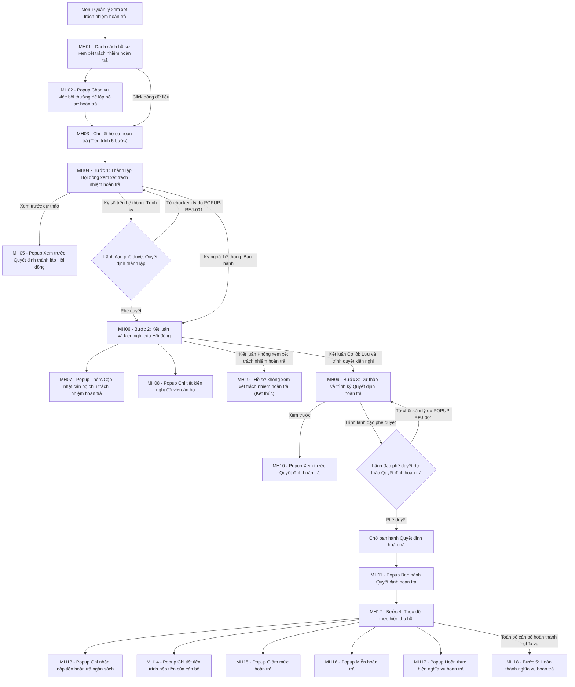

### 4.3.3. Dành cho Cán bộ Công tác bồi thường nhà nước

#### 4.3.3.5. Quản lý xem xét trách nhiệm hoàn trả

##### 4.3.3.5.1. Mục đích

Cho phép quản lý toàn bộ tiến trình xem xét trách nhiệm hoàn trả kinh phí bồi thường của người thi hành công vụ gây thiệt hại trên Website quản trị, từ khi vụ việc bồi thường hoàn tất chi trả đến khi thu hồi đủ tiền vào ngân sách nhà nước, bao gồm:

\- Khởi tạo hồ sơ xem xét trách nhiệm hoàn trả từ vụ việc bồi thường nhà nước đã hoàn tất chi trả.

\- Thành lập Hội đồng xem xét trách nhiệm hoàn trả: nhập thành phần Hội đồng, sinh dự thảo, trình lãnh đạo ký duyệt hoặc ghi nhận Quyết định ký ngoài hệ thống.

\- Ghi nhận kết luận và kiến nghị của Hội đồng đối với từng người thi hành công vụ chịu trách nhiệm hoàn trả (mức độ lỗi, số tiền phải hoàn trả, phương thức thực hiện).

\- Kết thúc sớm hồ sơ khi Hội đồng kết luận không xem xét trách nhiệm hoàn trả.

\- Dự thảo, trình ký, phê duyệt và ban hành Quyết định hoàn trả kinh phí bồi thường.

\- Theo dõi và ghi nhận tiến độ nộp tiền hoàn trả thực tế theo từng cán bộ, từng đợt nộp kèm biên lai/chứng từ Kho bạc.

\- Điều chỉnh nghĩa vụ hoàn trả theo quyết định của người có thẩm quyền: giảm mức hoàn trả, miễn hoàn trả, hoãn thực hiện nghĩa vụ hoàn trả.

\- Tra cứu, theo dõi tiến độ thu hồi và kết xuất danh sách hồ sơ hoàn trả ra tệp Excel phục vụ báo cáo, thống kê.

*a. Phân quyền*

\- **Cán bộ xử lý (Chuyên viên công tác bồi thường nhà nước)**: khởi tạo hồ sơ, nhập/cập nhật thành phần Hội đồng, trình ký Quyết định thành lập Hội đồng, ghi nhận kết luận và kiến nghị của Hội đồng, dự thảo và trình ký Quyết định hoàn trả, ban hành Quyết định hoàn trả, ghi nhận nộp tiền, lưu quyết định giảm mức/miễn/hoãn hoàn trả, xóa hồ sơ chưa thành lập Hội đồng, kết xuất Excel.

\- **Lãnh đạo phê duyệt**: xem toàn bộ hồ sơ; phê duyệt hoặc từ chối kèm lý do đối với Quyết định thành lập Hội đồng và dự thảo Quyết định hoàn trả. Không được nhập liệu, không được ghi nhận nộp tiền, không được điều chỉnh nghĩa vụ hoàn trả.

\- **Người dùng chỉ có quyền tra cứu công tác bồi thường nhà nước**: chỉ xem danh sách và chi tiết hồ sơ hoàn trả, kết xuất Excel; toàn bộ nút tác nghiệp bị khóa mờ.

\- Phạm vi dữ liệu hiển thị theo cơ quan/đơn vị được phân quyền của người dùng đăng nhập.

*b. Điều kiện thực hiện*

\- Người dùng đã đăng nhập Website quản trị thành công và hệ thống hoạt động bình thường.

\- Người dùng được phân quyền truy cập chức năng `Quản lý xem xét trách nhiệm hoàn trả`.

\- Vụ việc bồi thường nhà nước gốc đã hoàn tất chi trả kinh phí bồi thường theo `SRS_BTNN_GiaiQuyetBT_KinhPhi_BT.md` và chưa có hồ sơ xem xét trách nhiệm hoàn trả, tuân thủ [BR-BTNN-HT-001].

\- Danh mục cán bộ, đơn vị ban hành, sổ văn bản áp dụng và chứng thư số của người ký đã được khai báo trên hệ thống.

---

##### 4.3.3.5.2. Sơ đồ luồng nghiệp vụ theo giao diện

---

##### 4.3.3.5.3. MH01 - Màn hình Danh sách hồ sơ xem xét trách nhiệm hoàn trả

###### 4.3.3.5.3.1. Màn hình

###### 4.3.3.5.3.2. Mô tả thông tin trên màn hình

| Trường thông tin | Kiểu dữ liệu | Bắt buộc | Mặc định | Mô tả |
| :--- | :--- | :--- | :--- | :--- |
| **I. Khối thông tin chung màn hình** | Section | - | - | Vùng tiêu đề và số liệu tổng quan phía trên màn hình. |
| Tiêu đề màn hình | String(255) | - | - | Control UI: Text heading (Read-only). - Hiển thị `Quản lý xem xét trách nhiệm hoàn trả`. |
| Số hồ sơ hoàn trả | Integer(10) | - | Theo dữ liệu | Control UI: Stat card (Read-only). - Đếm số hồ sơ thỏa mãn điều kiện lọc hiện tại. |
| Tổng số tiền phải hoàn trả | Decimal(18,0) | - | Theo dữ liệu | Control UI: Stat card (Read-only). - Tổng `Số tiền phải hoàn trả` của các hồ sơ thỏa mãn điều kiện lọc hiện tại. - Định dạng số có dấu phân cách hàng nghìn, đơn vị `đ`. |
| Số tiền đã thu hồi thực tế | Decimal(18,0) | - | Theo dữ liệu | Control UI: Stat card (Read-only). - Tổng số tiền đã nộp thực tế ghi nhận trên sổ giao dịch của các hồ sơ thỏa mãn điều kiện lọc hiện tại. - Định dạng số có dấu phân cách hàng nghìn, đơn vị `đ`. |
| **II. Khối bộ lọc tìm kiếm** | Section | - | - | Control UI: Filter panel. - Hiển thị phía trên bảng kết quả. |
| Tìm kiếm nhanh | String(255) | Không | Trống | Control UI: Input text. - Placeholder: `Nhập mã hồ sơ hoàn trả, mã hồ sơ bồi thường, tên cán bộ...`. - Tìm kiếm gần đúng, không phân biệt hoa thường, không phân biệt dấu. - Phạm vi tìm kiếm gồm: `Mã hồ sơ hoàn trả`, `Hồ sơ YCBT liên quan` và họ tên của toàn bộ cán bộ chịu trách nhiệm hoàn trả thuộc hồ sơ. |
| Cơ quan công tác | String(255) | Không | Trống | Control UI: Input text. - Placeholder: `Nhập cơ quan công tác của cán bộ...`. - Tìm kiếm gần đúng trên cơ quan công tác của các cán bộ chịu trách nhiệm hoàn trả thuộc hồ sơ. |
| Trạng thái tiến trình | Enum(String(50)) | Không | `Tất cả tiến trình` | Control UI: Combobox. - Tham chiếu Danh mục Trạng thái hồ sơ xem xét trách nhiệm hoàn trả [DM_47]. - Bổ sung giá trị `Tất cả tiến trình` để bỏ lọc theo trạng thái. |
| Số tiền cần thu hồi | Enum(String(50)) | Không | `Tất cả số tiền` | Control UI: Combobox. - Lọc theo khoảng `Số tiền phải hoàn trả` của hồ sơ. Các giá trị cố định trên màn hình: + `Tất cả số tiền` + `Dưới 50 triệu` + `Từ 50 triệu - 200 triệu` + `Trên 200 triệu` |
| Ngày quyết định từ ngày | Date | Không | Trống | Control UI: Datepicker `dd/mm/yyyy`. - Lọc theo `Ngày ban hành Quyết định hoàn trả`. - Tuân thủ [BR-VAL-007]. |
| Ngày quyết định đến ngày | Date | Không | Trống | Control UI: Datepicker `dd/mm/yyyy`. - Lọc theo `Ngày ban hành Quyết định hoàn trả`. - Tuân thủ [BR-VAL-007]. |
| Xóa bộ lọc | Button | Không | - | Control UI: Button. - Luôn hiển thị và cho phép click. |
| Tìm kiếm | Button | Không | - | Control UI: Button. - Luôn hiển thị và cho phép click. |
| **III. Khối bảng kết quả tìm kiếm** | Section | - | 10 bản ghi/trang | Control UI: Data grid. - Khi truy cập màn hình, hệ thống tự động tải toàn bộ hồ sơ hoàn trả thuộc phạm vi dữ liệu được phân quyền, sắp xếp mặc định theo ngày khởi tạo hồ sơ giảm dần. - Phân trang tuân thủ [BR-UI-001]. |
| Lập hồ sơ hoàn trả mới | Button | Không | - | Control UI: Button. - Hiển thị và cho phép click với người dùng có quyền tác nghiệp hồ sơ hoàn trả. - Khóa mờ (Disabled) kèm tooltip `Bạn không có quyền lập hồ sơ hoàn trả` đối với người dùng chỉ có quyền tra cứu. |
| Kết xuất Excel | Button | Không | - | Control UI: Button. - Hiển thị và cho phép click khi bảng kết quả có dữ liệu. - Khóa mờ (Disabled) kèm tooltip `Không có dữ liệu để kết xuất` khi bảng kết quả rỗng. |
| STT | Integer(10) | Không | Tự tăng | Control UI: Text (Read-only). - Số thứ tự dòng dữ liệu trên trang hiện tại. |
| Mã hồ sơ HT | String(50) | Có | Theo dữ liệu | Control UI: Text (Read-only). - Hiển thị mã hồ sơ hoàn trả in đậm, ví dụ `HT-2026-001`. - Mã do hệ thống tự sinh khi khởi tạo hồ sơ. |
| Cán bộ gây sai phạm | String(500) | Không | Theo dữ liệu | Control UI: Text kèm Popover (Read-only). - Hiển thị tối đa 02 cán bộ đầu tiên gồm họ tên và chức vụ; nếu hồ sơ có nhiều hơn 02 cán bộ thì hiển thị thêm badge `+ N người khác`. - Khi trỏ chuột vào ô, hiển thị popover danh sách đầy đủ cán bộ nhóm theo cơ quan công tác kèm số lượng cán bộ của từng cơ quan. - Hiển thị `Chưa xác định` khi hồ sơ chưa ghi nhận cán bộ chịu trách nhiệm. |
| Cơ quan công tác | String(255) | Không | Theo dữ liệu | Control UI: Text (Read-only). - Trường hợp toàn bộ cán bộ thuộc 01 cơ quan: hiển thị tên cơ quan đó. - Trường hợp thuộc 02 cơ quan: hiển thị tên 02 cơ quan phân tách bởi ký tự `&`. - Trường hợp thuộc từ 03 cơ quan trở lên: hiển thị `Liên ngành`. |
| Hồ sơ YCBT liên quan | String(50) | Có | Theo dữ liệu | Control UI: Text link (Read-only). - Hiển thị mã vụ việc bồi thường nhà nước gốc, ví dụ `BT-2026-001`. |
| Tiền bồi thường (đ) | Decimal(18,0) | Có | Theo dữ liệu | Control UI: Text (Read-only). - Tổng số tiền Nhà nước đã chi trả bồi thường của vụ việc gốc. - Căn phải, định dạng số có dấu phân cách hàng nghìn. |
| Tiền phải hoàn trả (đ) | Decimal(18,0) | Không | Theo dữ liệu | Control UI: Text (Read-only). - Tổng số tiền phải hoàn trả của toàn bộ cán bộ theo Quyết định hoàn trả, đã trừ số tiền được giảm/miễn. - Hiển thị `--` khi hồ sơ chưa ban hành Quyết định hoàn trả. |
| Tiến độ thu hồi | Decimal(5,2) | Không | Theo dữ liệu | Control UI: Progress bar (Read-only). - Hiển thị số tiền đã thu và tỷ lệ phần trăm `Đã thu / Tiền phải hoàn trả`. - Hiển thị `Chưa ban hành QĐ` khi hồ sơ chưa ban hành Quyết định hoàn trả. |
| Trạng thái | Enum(String(50)) | Có | Theo dữ liệu | Control UI: Badge (Read-only). - Tham chiếu Danh mục Trạng thái hồ sơ xem xét trách nhiệm hoàn trả [DM_47]. |
| Cập nhật kết quả | Icon button | Không | - | Control UI: Icon button (biểu tượng bút). - Hiển thị và cho phép click khi hồ sơ ở trạng thái cho phép cập nhật kết quả bước hiện tại theo [BR-BTNN-HT-002] và người dùng có quyền tác nghiệp. - Khóa mờ (Disabled) kèm tooltip `Không có kết quả cần cập nhật ở bước này` trong các trường hợp còn lại. |
| Thao tác khác | Icon button | Không | - | Control UI: Icon button (biểu tượng ba dấu chấm) kèm menu thả xuống gồm `Giảm mức hoàn trả`, `Miễn hoàn trả`, `Hoãn hoàn trả`. - Hiển thị và cho phép click khi hồ sơ đã ban hành Quyết định hoàn trả và còn cán bộ chưa hoàn thành nghĩa vụ. - Khóa mờ (Disabled) kèm tooltip `Chỉ thực hiện khi đã ban hành Quyết định hoàn trả` trong các trường hợp còn lại. |
| Xóa | Icon button | Không | - | Control UI: Icon button (biểu tượng thùng rác). - Hiển thị và cho phép click khi hồ sơ ở trạng thái `Chờ thành lập Hội đồng` theo [BR-BTNN-HT-012]. - Khóa mờ (Disabled) kèm tooltip `Hồ sơ đã thành lập Hội đồng không thể xóa` trong các trường hợp còn lại. |

###### 4.3.3.5.3.3. Chức năng trên màn hình

| STT | Tên chức năng | Định dạng | Mô tả |
| :--- | :--- | :--- | :--- |
| 1 | Tìm kiếm | Button | Khi người dùng click nút Tìm kiếm, hệ thống kiểm tra tính hợp lệ của các tiêu chí và lọc dữ liệu theo điều kiện đã nhập/chọn. - **TH Dữ liệu lọc không hợp lệ**: `Ngày quyết định từ ngày` lớn hơn `Ngày quyết định đến ngày` — hệ thống highlight viền đỏ cặp trường ngày, hiển thị cảnh báo theo [BR-VAL-007] kèm thông báo [MSG-ERR-VAL-007], không thực hiện tìm kiếm. - **TH Không trả về dữ liệu**: Bảng kết quả hiển thị 01 dòng thông báo [MSG-INF-SYS-001]; thanh phân trang hiển thị `0-0 của 0 bản ghi`; 03 thẻ số liệu tổng quan hiển thị giá trị `0`; nút `Kết xuất Excel` khóa mờ kèm tooltip `Không có dữ liệu để kết xuất`. - **TH Trả về dữ liệu**: Hệ thống hiển thị danh sách hồ sơ hoàn trả theo phân trang, cập nhật lại 03 thẻ số liệu tổng quan theo đúng tập dữ liệu sau lọc và đưa con trỏ phân trang về trang 1. |
| 2 | Xóa bộ lọc | Button | Khi người dùng click nút Xóa bộ lọc, hệ thống xóa toàn bộ giá trị đã nhập/chọn trên khối bộ lọc, khôi phục giá trị mặc định của các combobox, tải lại danh sách mặc định theo phạm vi dữ liệu được phân quyền và đưa con trỏ phân trang về trang 1. |
| 3 | Lập hồ sơ hoàn trả mới | Button | Khi người dùng click nút Lập hồ sơ hoàn trả mới, hệ thống mở `MH02 - Popup Chọn vụ việc bồi thường để lập hồ sơ hoàn trả` và tải danh sách vụ việc bồi thường đủ điều kiện theo [BR-BTNN-HT-001]. |
| 4 | Kết xuất Excel | Button | Khi người dùng click nút Kết xuất Excel, hệ thống kết xuất dữ liệu ra tệp `.xlsx` tuân thủ quy chuẩn tại Mục 5.5 của `04_Danh_muc_va_Phu_luc.md` (font `Times New Roman`, quy cách đặt tên tệp `yyyyMMdd_Quan_ly_xem_xet_trach_nhiem_hoan_tra.xlsx`, quy chuẩn cỡ chữ và căn lề). - Phạm vi kết xuất: toàn bộ bản ghi thỏa mãn điều kiện lọc hiện tại, không giới hạn theo trang đang xem. - Cột dữ liệu kết xuất: hệ thống tự động lấy theo đúng các cột đang hiển thị trên bảng kết quả (STT, Mã hồ sơ HT, Cán bộ gây sai phạm, Cơ quan công tác, Hồ sơ YCBT liên quan, Tiền bồi thường, Tiền phải hoàn trả, Đã thu hồi, Tỷ lệ thu hồi, Trạng thái). - **TH Không có dữ liệu**: Nút khóa mờ kèm tooltip, người dùng không thực hiện được thao tác. - **TH Hợp lệ**: Hệ thống sinh tệp, ghi Audit Log thao tác kết xuất và hiển thị thông báo [MSG-SUC-SYS-005]. |
| 5 | Click dòng dữ liệu | Row click | Khi người dùng click vào bất kỳ vị trí nào trên dòng dữ liệu (ngoại trừ cột Thao tác và liên kết `Hồ sơ YCBT liên quan`), hệ thống điều hướng sang `MH03 - Chi tiết hồ sơ hoàn trả`, tự động mở đúng bước tiến trình tương ứng trạng thái hiện tại của hồ sơ theo [BR-BTNN-HT-002]. |
| 6 | Hồ sơ YCBT liên quan | Text link | Khi người dùng click vào mã vụ việc bồi thường, hệ thống mở màn hình chi tiết vụ việc bồi thường nhà nước gốc tại `SRS_BTNN_GiaiQuyetBT_GiaiQuyet_YCBT.md` trên một tab trình duyệt mới, đồng thời giữ nguyên trạng thái bộ lọc và trang hiện tại của màn hình danh sách. |
| 7 | Cập nhật kết quả | Icon button | Khi người dùng click biểu tượng Cập nhật kết quả, hệ thống điều hướng sang `MH03 - Chi tiết hồ sơ hoàn trả` và mở trực tiếp bước cần cập nhật theo trạng thái hồ sơ: - Trạng thái `Chờ thành lập Hội đồng`, `Chờ duyệt QĐ thành lập`, `Từ chối duyệt QĐ thành lập`: mở `MH04 - Bước 1`. - Trạng thái `Đang họp Hội đồng`: mở `MH06 - Bước 2`. - Trạng thái `Chờ trình ký QĐ hoàn trả`, `Chờ duyệt QĐ hoàn trả`, `Từ chối duyệt QĐ hoàn trả`, `Chờ ban hành QĐ hoàn trả`: mở `MH09 - Bước 3`. - Trạng thái `Đang thi hành thu hồi`: mở `MH12 - Bước 4`. |
| 8 | Thao tác khác | Icon button | Khi người dùng click biểu tượng Thao tác khác, hệ thống hiển thị menu thả xuống gồm 03 mục `Giảm mức hoàn trả`, `Miễn hoàn trả`, `Hoãn hoàn trả`. Khi người dùng chọn 01 mục, hệ thống điều hướng sang `MH12 - Bước 4: Theo dõi thực hiện thu hồi` của hồ sơ tương ứng để người dùng chọn đúng cán bộ cần điều chỉnh nghĩa vụ hoàn trả, do các quyết định điều chỉnh được ban hành theo từng cán bộ theo [BR-BTNN-HT-009], [BR-BTNN-HT-010] và [BR-BTNN-HT-011]. |
| 9 | Xóa | Icon button | Khi người dùng click biểu tượng Xóa, hệ thống mở [POPUP-CFM-001] với tham số `Loại thao tác` = `Xóa` và nội dung xác nhận [MSG-CFM-SYS-001]. - **TH Người dùng chọn Hủy bỏ**: Hệ thống đóng popup, không thay đổi dữ liệu. - **TH Người dùng chọn Đồng ý**: Hệ thống kiểm tra lại điều kiện xóa theo [BR-BTNN-HT-012]; nếu hợp lệ thì xóa hồ sơ hoàn trả, ghi Audit Log, hiển thị thông báo [MSG-SUC-BTNN-HT-018], làm mới danh sách và cập nhật lại 03 thẻ số liệu tổng quan; nếu không hợp lệ thì hiển thị thông báo [MSG-ERR-BTNN-HT-008] và không thực hiện xóa. |
| 10 | Số dòng hiển thị | Combobox | Khi người dùng chọn lại số dòng hiển thị, hệ thống tải lại bảng kết quả theo số dòng mới và đưa con trỏ phân trang về trang 1, tuân thủ [BR-UI-001]. |
| 11 | Phân trang | Pagination | Khi người dùng click các nút điều hướng trang (`<<`, `<`, số trang, `>`, `>>`), hệ thống tải lại dữ liệu của trang tương ứng, giữ nguyên điều kiện lọc và thứ tự sắp xếp hiện tại, tuân thủ [BR-UI-001]. |

---

##### 4.3.3.5.4. MH02 - Popup Chọn vụ việc bồi thường để lập hồ sơ hoàn trả

###### 4.3.3.5.4.1. Màn hình

###### 4.3.3.5.4.2. Mô tả thông tin trên màn hình

| Trường thông tin | Kiểu dữ liệu | Bắt buộc | Mặc định | Mô tả |
| :--- | :--- | :--- | :--- | :--- |
| Tiêu đề popup | String(255) | - | - | Control UI: Text heading (Read-only). - Hiển thị `Lập hồ sơ hoàn trả: Chọn vụ việc bồi thường`. |
| Nội dung hướng dẫn | Text(500) | - | - | Control UI: Text (Read-only). - Hiển thị nội dung hướng dẫn về phạm vi danh sách: các vụ việc bồi thường nhà nước đã chi trả xong, đủ điều kiện khởi tạo hồ sơ xem xét trách nhiệm hoàn trả. |
| **Bảng danh sách vụ việc đủ điều kiện** | Section | - | - | Control UI: Data grid. - Danh sách vụ việc bồi thường nhà nước thỏa mãn [BR-BTNN-HT-001], thuộc phạm vi dữ liệu được phân quyền của người dùng, sắp xếp theo `Ngày hoàn tất chi trả` giảm dần. |
| Mã hồ sơ | String(50) | Có | Theo dữ liệu | Control UI: Text (Read-only). - Hiển thị mã vụ việc bồi thường nhà nước in đậm. |
| Người yêu cầu | String(255) | Có | Theo dữ liệu | Control UI: Text (Read-only). - Hiển thị họ tên cá nhân/tổ chức yêu cầu bồi thường của vụ việc gốc. |
| Số tiền bồi thường (đ) | Decimal(18,0) | Có | Theo dữ liệu | Control UI: Text (Read-only). - Tổng số tiền Nhà nước đã chi trả bồi thường của vụ việc. - Căn phải, định dạng số có dấu phân cách hàng nghìn. |
| Ngày hoàn tất chi trả | Date | Có | Theo dữ liệu | Control UI: Text (Read-only). - Định dạng `dd/mm/yyyy`. Lấy theo ngày hoàn tất chi trả kinh phí bồi thường của vụ việc gốc. |
| Khởi tạo hồ sơ | Button | Không | - | Control UI: Button. - Hiển thị và cho phép click trên từng dòng vụ việc đủ điều kiện. |
| Đóng | Button | Không | - | Control UI: Button. - Luôn hiển thị và cho phép click. |

###### 4.3.3.5.4.3. Chức năng trên màn hình

| STT | Tên chức năng | Định dạng | Mô tả |
| :--- | :--- | :--- | :--- |
| 1 | Khởi tạo hồ sơ | Button | Khi người dùng click nút Khởi tạo hồ sơ trên một dòng vụ việc, hệ thống thực hiện tuần tự: - **TH Vụ việc không còn đủ điều kiện** (đã có hồ sơ hoàn trả do người dùng khác vừa khởi tạo): Hệ thống hiển thị thông báo [MSG-ERR-BTNN-HT-009], làm mới lại danh sách trong popup và không khởi tạo hồ sơ. - **TH Hợp lệ (Tuần tự các bước)**: (1) Hệ thống tự sinh `Mã hồ sơ HT` theo quy tắc `HT-<năm>-<số thứ tự 3 chữ số>`; (2) Lưu hồ sơ hoàn trả vào CSDL ở trạng thái `Chờ thành lập Hội đồng`, kế thừa tự động các thông tin của vụ việc gốc gồm mã vụ việc, nội dung vụ việc, đơn vị chi trả bồi thường, tổng số tiền đã chi trả và ngày hoàn tất chi trả; (3) Ghi Audit Log thao tác khởi tạo hồ sơ; (4) Hiển thị thông báo [MSG-SUC-BTNN-HT-001]; (5) Đóng popup và điều hướng sang `MH03 - Chi tiết hồ sơ hoàn trả` tại `MH04 - Bước 1: Thành lập Hội đồng xem xét trách nhiệm hoàn trả`. |
| 2 | Đóng | Button | Khi người dùng click nút Đóng hoặc biểu tượng `×` trên tiêu đề popup, hệ thống đóng popup và quay lại `MH01 - Màn hình Danh sách hồ sơ xem xét trách nhiệm hoàn trả`, không thay đổi dữ liệu. |

---

##### 4.3.3.5.5. MH03 - Màn hình Chi tiết hồ sơ xem xét trách nhiệm hoàn trả

###### 4.3.3.5.5.1. Màn hình

###### 4.3.3.5.5.2. Mô tả thông tin trên màn hình

| Trường thông tin | Kiểu dữ liệu | Bắt buộc | Mặc định | Mô tả |
| :--- | :--- | :--- | :--- | :--- |
| **I. Khối điều hướng và tiêu đề hồ sơ** | Section | - | - | Vùng thông tin nhận dạng hồ sơ phía trên màn hình chi tiết. |
| Đường dẫn điều hướng | String(255) | - | - | Control UI: Breadcrumb (Read-only). - Hiển thị `Quản lý xem xét trách nhiệm hoàn trả / Chi tiết hồ sơ <Mã hồ sơ HT>`. - Thành phần `Quản lý xem xét trách nhiệm hoàn trả` là liên kết quay lại MH01. |
| Mã hồ sơ hoàn trả | String(50) | Có | Theo dữ liệu | Control UI: Text heading (Read-only). - Hiển thị `Hồ sơ trách nhiệm hoàn trả: <Mã hồ sơ HT>`. |
| Vụ việc bồi thường gốc | String(50) | Có | Theo dữ liệu | Control UI: Text link (Read-only). - Hiển thị mã vụ việc bồi thường nhà nước gốc kèm nhãn `[Xem hồ sơ gốc]` và tên vụ việc. |
| Đóng | Button | Không | - | Control UI: Button. - Luôn hiển thị và cho phép click. |
| **II. Khối thanh tiến trình xử lý hồ sơ** | Section | - | - | Control UI: Progress tracker (Stepper). - Hiển thị 05 bước cố định của tiến trình: `Thành lập Hội đồng`, `Có kiến nghị`, `Ban hành QĐ`, `Thực hiện thu hồi`, `Hoàn thành`. |
| Bước tiến trình | Enum(String(50)) | - | Theo dữ liệu | Control UI: Step node (Read-only). - Trạng thái hiển thị của từng bước gồm các giá trị cố định: + `Đã hoàn thành`: bước có thứ tự nhỏ hơn bước hiện tại của hồ sơ, hiển thị biểu tượng dấu tích, cho phép click để xem lại ở chế độ chỉ đọc + `Đang xử lý`: bước hiện tại của hồ sơ theo [BR-BTNN-HT-002], được đánh dấu nổi bật + `Chưa mở khóa`: bước có thứ tự lớn hơn bước hiện tại, hiển thị mờ và không cho phép click + `Kết thúc do không xem xét`: áp dụng cho hồ sơ ở trạng thái `Không xem xét trách nhiệm hoàn trả`, bước 2 hiển thị biểu tượng dấu `×` màu đỏ và các bước 3, 4, 5 hiển thị mờ |
| Tỷ lệ hoàn thành tiến trình | Decimal(5,2) | - | Theo dữ liệu | Control UI: Progress bar (Read-only). - Tính theo số bước đã hoàn thành trên tổng 05 bước của tiến trình. |
| **III. Khối thông tin vụ việc bồi thường gốc** | Section | - | - | Control UI: Info card (Read-only). - Hiển thị tại bước 1 và giữ nguyên nội dung ở chế độ chỉ đọc tại các bước sau. |
| Mã hồ sơ bồi thường | String(50) | Có | Theo dữ liệu | Control UI: Text link (Read-only). - Hiển thị mã vụ việc bồi thường nhà nước gốc. |
| Ngày hoàn tất chi trả bồi thường | Date | Có | Theo dữ liệu | Control UI: Text (Read-only). - Định dạng `dd/mm/yyyy`. Là mốc thời gian căn cứ để xác định điều kiện thành lập Hội đồng theo [BR-BTNN-HT-001]. |
| Nội dung vụ việc sai phạm gây bồi thường | Text(2000) | Có | Theo dữ liệu | Control UI: Text (Read-only). - Hiển thị tên vụ việc và mô tả tóm tắt nội dung sai phạm, kế thừa từ vụ việc gốc. |
| Đơn vị chi trả bồi thường | String(255) | Có | Theo dữ liệu | Control UI: Text (Read-only). - Kế thừa từ vụ việc bồi thường gốc. |
| Tổng số tiền Nhà nước đã chi trả bồi thường | Decimal(18,0) | Có | Theo dữ liệu | Control UI: Text (Read-only). - Định dạng số có dấu phân cách hàng nghìn, đơn vị `đ`. - Là căn cứ kiểm soát trần tổng số tiền hoàn trả theo [BR-BTNN-HT-006]. |

###### 4.3.3.5.5.3. Chức năng trên màn hình

| STT | Tên chức năng | Định dạng | Mô tả |
| :--- | :--- | :--- | :--- |
| 1 | Bước tiến trình | Step node | Khi người dùng click vào một bước trên thanh tiến trình: - **TH Bước chưa mở khóa**: Hệ thống hiển thị thông báo [MSG-INF-BTNN-HT-001] và giữ nguyên bước đang xem. - **TH Bước đã hoàn thành**: Hệ thống hiển thị nội dung của bước đó ở chế độ chỉ đọc, khóa mờ toàn bộ nút tác nghiệp của bước. - **TH Bước hiện tại của hồ sơ**: Hệ thống hiển thị nội dung của bước kèm các nút tác nghiệp tương ứng quyền của người dùng đăng nhập. |
| 2 | Vụ việc bồi thường gốc | Text link | Khi người dùng click vào liên kết vụ việc bồi thường gốc (tại khối tiêu đề hoặc khối thông tin vụ việc gốc), hệ thống mở màn hình chi tiết vụ việc bồi thường nhà nước tại `SRS_BTNN_GiaiQuyetBT_GiaiQuyet_YCBT.md` trên một tab trình duyệt mới, đồng thời giữ nguyên hồ sơ hoàn trả đang xem. |
| 3 | Đóng | Button | Khi người dùng click nút Đóng, hệ thống đóng màn hình chi tiết và quay lại `MH01 - Màn hình Danh sách hồ sơ xem xét trách nhiệm hoàn trả`, giữ nguyên điều kiện lọc và trang đang xem trước đó. |

---

##### 4.3.3.5.6. MH04 - Bước 1: Thành lập Hội đồng xem xét trách nhiệm hoàn trả

###### 4.3.3.5.6.1. Màn hình

###### 4.3.3.5.6.2. Mô tả thông tin trên màn hình

| Trường thông tin | Kiểu dữ liệu | Bắt buộc | Mặc định | Mô tả |
| :--- | :--- | :--- | :--- | :--- |
| **I. Khối cảnh báo Quyết định thành lập bị từ chối** | Section | - | - | Control UI: Alert box. - Chỉ hiển thị khi hồ sơ ở trạng thái `Từ chối duyệt QĐ thành lập`. |
| Người từ chối | String(255) | - | Theo dữ liệu | Control UI: Text (Read-only). - Hiển thị họ tên và chức vụ lãnh đạo đã từ chối phê duyệt. |
| Thời gian từ chối | DateTime | - | Theo dữ liệu | Control UI: Text (Read-only). - Định dạng `dd/mm/yyyy HH:mm`. |
| Lý do từ chối | Text(2000) | - | Theo dữ liệu | Control UI: Text (Read-only). - Hiển thị nguyên văn lý do từ chối lãnh đạo đã nhập tại [POPUP-REJ-001]. |
| **II. Khối khởi tạo Hội đồng** | Section | - | - | Control UI: Call-to-action card. - Chỉ hiển thị khi hồ sơ ở trạng thái `Chờ thành lập Hội đồng` hoặc `Từ chối duyệt QĐ thành lập` và người dùng có quyền tác nghiệp. |
| Tạo hội đồng | Button | Không | - | Control UI: Button. - Hiển thị nhãn `Tạo hội đồng` khi hồ sơ ở trạng thái `Chờ thành lập Hội đồng`; hiển thị nhãn `Cập nhật dự thảo` khi hồ sơ ở trạng thái `Từ chối duyệt QĐ thành lập`. - Khóa mờ (Disabled) kèm tooltip `Bạn không có quyền tác nghiệp hồ sơ` đối với người dùng chỉ có quyền tra cứu và đối với Lãnh đạo phê duyệt. |
| **III. Khối biểu mẫu Tạo mới Hội đồng xem xét trách nhiệm hoàn trả** | Section | - | - | Control UI: Floating form panel. - Chỉ hiển thị sau khi người dùng click nút `Tạo hội đồng`. |
| Hình thức ban hành | Enum(String(50)) | Có | `Ký số trên hệ thống` | Control UI: Radio group. - Tham chiếu Danh mục Hình thức ban hành văn bản [DM_53]. - Chi phối hiển thị các trường theo [BR-BTNN-HT-004]: chọn `Ký số trên hệ thống` thì hiển thị trường `Lãnh đạo ký duyệt` và ẩn `Số quyết định thành lập`, `Đính kèm Quyết định đã ký`; chọn `Ký ngoài hệ thống` thì ẩn `Lãnh đạo ký duyệt` và hiển thị `Số quyết định thành lập`, `Đính kèm Quyết định đã ký`. |
| Đơn vị ban hành | Enum(String(255)) | Có | Đơn vị của người dùng đăng nhập | Control UI: Combobox. - Tham chiếu Danh mục Đơn vị ban hành văn bản được phân quyền của người dùng đăng nhập. |
| Sổ văn bản áp dụng | Enum(String(255)) | Có | Sổ văn bản mặc định của đơn vị ban hành | Control UI: Combobox. - Tham chiếu Danh mục Sổ văn bản của đơn vị ban hành đã chọn, lọc theo năm hiện hành. - Là căn cứ cấp số văn bản tự động theo [BR-BTNN-HT-004]. |
| Lãnh đạo ký duyệt | Enum(String(255)) | Có (khi Hình thức ban hành là `Ký số trên hệ thống`) | Trống | Control UI: Combobox. - Tham chiếu Danh mục Lãnh đạo có thẩm quyền ký ban hành của đơn vị ban hành đã chọn. |
| Số quyết định thành lập | String(50) | Có (khi Hình thức ban hành là `Ký ngoài hệ thống`) | Trống | Control UI: Input text. - Placeholder: `Ví dụ: 45/QĐ-STP`. - Trường hợp `Ký số trên hệ thống`, trường này bị ẩn và số văn bản do hệ thống tự cấp từ sổ văn bản áp dụng khi lãnh đạo phê duyệt theo [BR-BTNN-HT-004]. |
| Ngày ký | Date | Có | Ngày hiện tại | Control UI: Datepicker `dd/mm/yyyy`. - Không được lớn hơn ngày hiện tại, tuân thủ [BR-VAL-008]. - Không được nhỏ hơn `Ngày hoàn tất chi trả bồi thường` của vụ việc gốc theo [BR-BTNN-HT-001]. |
| Ngày hiệu lực | Date | Có | Lấy theo `Ngày ký` | Control UI: Datepicker `dd/mm/yyyy`. - Mặc định đồng bộ theo `Ngày ký`; cho phép người dùng sửa nếu văn bản quy định thời điểm có hiệu lực khác. - Không được nhỏ hơn `Ngày ký`, tuân thủ [BR-VAL-007]. |
| Thông tin hướng dẫn sinh dự thảo | Text(500) | - | - | Control UI: Alert box (Read-only). - Chỉ hiển thị khi Hình thức ban hành là `Ký số trên hệ thống`. - Nội dung thông báo về việc hệ thống tự cấp số văn bản và tự sinh dự thảo Quyết định dạng PDF theo `Mẫu số 20/BTNN` (Thông tư 04/2018/TT-BTP) để rà soát trước khi trình ký. |
| Đính kèm Quyết định đã ký, đóng dấu | File | Có (khi Hình thức ban hành là `Ký ngoài hệ thống`) | Trống | Control UI: File upload (cho phép chọn nhiều tệp). - Tuân thủ [BR-FILE-010] về định dạng và dung lượng tệp. - Danh sách tệp đã đính kèm hiển thị kèm liên kết `Xem file` và `Xóa`. |
| Thêm thành viên | Button | Không | - | Control UI: Button. - Hiển thị và cho phép click khi biểu mẫu đang ở chế độ nhập liệu. |
| **IV. Bảng Thành phần Hội đồng** | Section | - | - | Control UI: Editable data grid. - Bảng nhập liệu động danh sách thành viên Hội đồng, tuân thủ [BR-BTNN-HT-003]. - Khi chưa có thành viên, bảng hiển thị 01 dòng hướng dẫn `Chưa có thành viên hội đồng. Bấm "Thêm thành viên" để thiết lập.` |
| STT | Integer(10) | Không | Tự tăng | Control UI: Text (Read-only). - Số thứ tự dòng thành viên. |
| Họ và tên | String(255) | Có | Trống | Control UI: Combobox tìm kiếm (Autocomplete). - Tham chiếu Danh mục cán bộ của các đơn vị thuộc phạm vi phân quyền; khi chọn cán bộ, hệ thống tự động điền `Chức vụ hiện tại` và `Đơn vị công tác`. - Không được trùng lặp cán bộ giữa các dòng theo [BR-VAL-009]. |
| Chức vụ hiện tại | String(255) | Không | Theo cán bộ đã chọn | Control UI: Input text. - Tự động điền theo cán bộ đã chọn, cho phép sửa. |
| Đơn vị công tác | String(255) | Không | Theo cán bộ đã chọn | Control UI: Input text. - Tự động điền theo cán bộ đã chọn, cho phép sửa. |
| Chức vụ Hội đồng | Enum(String(100)) | Có | `Ủy viên` | Control UI: Combobox. - Tham chiếu Danh mục Nhiệm vụ thành viên Hội đồng hoàn trả [DM_51]. - Khi chọn giá trị `Khác`, hệ thống hiển thị thêm 01 ô nhập text để người dùng nhập tên nhiệm vụ cụ thể. |
| Xóa | Icon button | Không | - | Control UI: Icon button (biểu tượng thùng rác). - Hiển thị và cho phép click khi biểu mẫu đang ở chế độ nhập liệu. |
| Xem trước Quyết định | Button | Không | - | Control UI: Button. - Chỉ hiển thị khi Hình thức ban hành là `Ký số trên hệ thống`. |
| Trình ký Quyết định | Button | Không | - | Control UI: Button. - Hiển thị nhãn `Trình ký Quyết định` khi Hình thức ban hành là `Ký số trên hệ thống` và hồ sơ ở trạng thái `Chờ thành lập Hội đồng`; hiển thị nhãn `Trình ký lại` khi hồ sơ ở trạng thái `Từ chối duyệt QĐ thành lập`; hiển thị nhãn `Ban hành Quyết định` khi Hình thức ban hành là `Ký ngoài hệ thống`. |
| **V. Khối Quyết định thành lập Hội đồng chính thức** | Section | - | - | Control UI: Info card (Read-only). - Chỉ hiển thị khi hồ sơ đã trình ký hoặc đã ban hành Quyết định thành lập Hội đồng. |
| Trạng thái Quyết định thành lập | Enum(String(50)) | - | Theo dữ liệu | Control UI: Badge (Read-only). - Các giá trị cố định trên màn hình: + `Chờ duyệt QĐ thành lập` + `Bị từ chối` + `Đã ban hành` + `Đã hoàn thành` |
| Số quyết định | String(50) | - | Theo dữ liệu | Control UI: Text (Read-only). - Hiển thị `[Dự thảo]` khi Quyết định đang ở trạng thái `Chờ duyệt QĐ thành lập` theo hình thức ký số; hiển thị số văn bản chính thức sau khi lãnh đạo phê duyệt hoặc số văn bản người dùng đã nhập với hình thức ký ngoài hệ thống. |
| Ngày ký ban hành | Date | - | Theo dữ liệu | Control UI: Text (Read-only). - Định dạng `dd/mm/yyyy`. |
| Ngày có hiệu lực | Date | - | Theo dữ liệu | Control UI: Text (Read-only). - Định dạng `dd/mm/yyyy`. |
| Hình thức ban hành | Enum(String(50)) | - | Theo dữ liệu | Control UI: Text (Read-only). - Tham chiếu Danh mục Hình thức ban hành văn bản [DM_53]. |
| Tệp tin quyết định liên kết | File | - | Theo dữ liệu | Control UI: File viewer (Read-only). - Trường hợp `Ký số trên hệ thống`, hiển thị tệp dự thảo PDF kèm badge `Dự thảo` hoặc `Bị từ chối` khi chưa được phê duyệt, và hiển thị tệp Quyết định đã ký số kèm dòng ghi nhận người ký số sau khi được phê duyệt. - Trường hợp `Ký ngoài hệ thống`, hiển thị danh sách tệp Quyết định đã ký, đóng dấu do người dùng đính kèm. - Mỗi tệp hiển thị kèm nút `Xem` và `Tải về`. |
| **VI. Bảng Thành viên Hội đồng đã thành lập** | Section | - | - | Control UI: Data grid (Read-only). - Hiển thị STT, Họ và tên, Chức vụ hiện tại, Đơn vị công tác, Nhiệm vụ Hội đồng của các thành viên theo Quyết định thành lập. |
| **VII. Khối Lịch sử xử lý quyết định** | Section | - | - | Control UI: Timeline (Read-only). - Hiển thị các mốc xử lý theo thời gian giảm dần, mỗi mốc gồm loại tác vụ, người thực hiện, thời điểm và nội dung/lý do. Loại tác vụ gồm các giá trị cố định: + `Trình ký` + `Phê duyệt` + `Từ chối` |
| **VIII. Khối thao tác của Lãnh đạo phê duyệt** | Section | - | - | Control UI: Action card. - Chỉ hiển thị khi người dùng đăng nhập có quyền Lãnh đạo phê duyệt và Quyết định thành lập Hội đồng đang ở trạng thái `Chờ duyệt QĐ thành lập`. |
| Phê duyệt | Button | Không | - | Control UI: Button. - Hiển thị và cho phép click với người dùng có quyền Lãnh đạo phê duyệt khi Quyết định ở trạng thái `Chờ duyệt QĐ thành lập`. |
| Từ chối | Button | Không | - | Control UI: Button. - Hiển thị và cho phép click với người dùng có quyền Lãnh đạo phê duyệt khi Quyết định ở trạng thái `Chờ duyệt QĐ thành lập`. |

###### 4.3.3.5.6.3. Chức năng trên màn hình

| STT | Tên chức năng | Định dạng | Mô tả |
| :--- | :--- | :--- | :--- |
| 1 | Tạo hội đồng | Button | Khi người dùng click nút Tạo hội đồng (hoặc `Cập nhật dự thảo` với hồ sơ bị từ chối), hệ thống mở khối biểu mẫu `Tạo mới Hội đồng xem xét trách nhiệm hoàn trả`, thiết lập giá trị mặc định của `Đơn vị ban hành`, `Sổ văn bản áp dụng`, `Ngày ký`, `Ngày hiệu lực` và hiển thị các trường theo `Hình thức ban hành` đang chọn. Với hồ sơ bị từ chối, hệ thống nạp lại toàn bộ dữ liệu dự thảo và thành phần Hội đồng đã nhập trước đó để người dùng chỉnh sửa. |
| 2 | Hình thức ban hành | Radio group | Khi người dùng chọn lại Hình thức ban hành, hệ thống ẩn/hiện các trường tương ứng theo [BR-BTNN-HT-004], đồng thời cập nhật nhãn nút trình ký/ban hành và ẩn/hiện nút `Xem trước Quyết định`. |
| 3 | Thêm thành viên | Button | Khi người dùng click nút Thêm thành viên, hệ thống bổ sung 01 dòng trống vào cuối bảng Thành phần Hội đồng với `Chức vụ Hội đồng` mặc định là `Ủy viên` và đưa con trỏ vào ô `Họ và tên` của dòng mới. |
| 4 | Xóa | Icon button | Khi người dùng click biểu tượng Xóa trên một dòng thành viên, hệ thống mở [POPUP-CFM-001] với tham số `Loại thao tác` = `Xóa`. - **TH Người dùng chọn Hủy bỏ**: Hệ thống đóng popup, giữ nguyên dòng thành viên. - **TH Người dùng chọn Đồng ý**: Hệ thống xóa dòng thành viên khỏi bảng và đánh số lại STT. |
| 5 | Xem trước Quyết định | Button | Khi người dùng click nút Xem trước Quyết định, hệ thống mở `MH05 - Popup Xem trước Quyết định thành lập Hội đồng`, sinh nội dung dự thảo theo `Mẫu số 20/BTNN` từ dữ liệu đang nhập trên biểu mẫu và danh sách thành viên Hội đồng. |
| 6 | Trình ký Quyết định | Button | Khi người dùng click nút Trình ký Quyết định/Trình ký lại/Ban hành Quyết định, hệ thống kiểm tra dữ liệu và xử lý theo `Hình thức ban hành`: - **TH Bỏ trống trường bắt buộc**: Hệ thống highlight viền đỏ các trường bắt buộc còn trống, hiển thị cảnh báo màu đỏ `Đây là trường bắt buộc` ngay dưới từng trường và đưa con trỏ vào ô lỗi đầu tiên theo [BR-VAL-001]; hiển thị thông báo [MSG-ERR-VAL-001]; không lưu dữ liệu. - **TH Dữ liệu không hợp lệ**: `Ngày ký` lớn hơn ngày hiện tại hoặc nhỏ hơn `Ngày hoàn tất chi trả bồi thường`, hoặc `Ngày hiệu lực` nhỏ hơn `Ngày ký` — hệ thống hiển thị cảnh báo theo [BR-VAL-007], [BR-VAL-008] kèm thông báo [MSG-ERR-VAL-007], không lưu dữ liệu. - **TH Thành phần Hội đồng không hợp lệ**: Bảng Thành phần Hội đồng chưa đủ thành phần tối thiểu hoặc có cán bộ trùng lặp theo [BR-BTNN-HT-003] — hệ thống hiển thị thông báo [MSG-ERR-BTNN-HT-006], không lưu dữ liệu. - **TH Trùng số quyết định**: Với hình thức `Ký ngoài hệ thống`, `Số quyết định thành lập` đã tồn tại trên `Sổ văn bản áp dụng` đã chọn theo [BR-VAL-009] — hệ thống hiển thị thông báo [MSG-ERR-BTNN-HT-005], không lưu dữ liệu. - **TH Hợp lệ với hình thức `Ký số trên hệ thống` (Tuần tự các bước)**: (1) Lưu thông tin ban hành và thành phần Hội đồng vào CSDL; (2) Sinh dự thảo Quyết định thành lập Hội đồng dạng PDF theo `Mẫu số 20/BTNN` và gắn vào hồ sơ; (3) Chuyển hồ sơ sang trạng thái `Chờ duyệt QĐ thành lập`; (4) Gửi email thông báo trình ký đích danh tới lãnh đạo được chọn theo `Mẫu 5` trong Phụ lục 6; (5) Ghi mốc `Trình ký` vào Lịch sử xử lý quyết định và ghi Audit Log; (6) Hiển thị thông báo [MSG-SUC-BTNN-HT-002], đóng biểu mẫu và hiển thị khối `Quyết định thành lập Hội đồng chính thức` ở chế độ chỉ đọc. - **TH Hợp lệ với hình thức `Ký ngoài hệ thống` (Tuần tự các bước)**: (1) Lưu thông tin ban hành, thành phần Hội đồng và tệp Quyết định đã ký vào CSDL; (2) Ghi nhận Quyết định thành lập Hội đồng ở trạng thái `Đã ban hành`; (3) Chuyển hồ sơ sang trạng thái `Đang họp Hội đồng` và mở khóa `MH06 - Bước 2`; (4) Ghi Audit Log; (5) Hiển thị thông báo [MSG-SUC-BTNN-HT-005] và điều hướng sang `MH06 - Bước 2: Kết luận và kiến nghị của Hội đồng`. |
| 7 | Phê duyệt | Button | Khi người dùng có quyền Lãnh đạo phê duyệt click nút Phê duyệt, hệ thống thực hiện tuần tự: (1) Mở [POPUP-SIGN-001] để lãnh đạo thực hiện ký số Quyết định thành lập Hội đồng; (2) Cấp số văn bản chính thức từ `Sổ văn bản áp dụng` theo [BR-BTNN-HT-004] và lưu tệp Quyết định đã ký số; (3) Chuyển hồ sơ sang trạng thái `Đang họp Hội đồng`, mở khóa `MH06 - Bước 2`; (4) Gửi email thông báo kết quả phê duyệt đích danh tới cán bộ xử lý theo `Mẫu 6` trong Phụ lục 6; (5) Ghi mốc `Phê duyệt` vào Lịch sử xử lý quyết định và ghi Audit Log; (6) Hiển thị thông báo [MSG-SUC-BTNN-HT-003] và làm mới màn hình chi tiết hồ sơ. |
| 8 | Từ chối | Button | Khi người dùng có quyền Lãnh đạo phê duyệt click nút Từ chối, hệ thống mở [POPUP-REJ-001] để nhập lý do từ chối. - **TH Bỏ trống lý do từ chối**: Hệ thống highlight viền đỏ ô nhập, hiển thị cảnh báo `Vui lòng nhập lý do từ chối` theo [BR-DK-025] và không thực hiện từ chối. - **TH Hợp lệ (Tuần tự các bước)**: (1) Lưu lý do từ chối, người từ chối và thời điểm từ chối; (2) Chuyển hồ sơ sang trạng thái `Từ chối duyệt QĐ thành lập`; (3) Gửi email thông báo từ chối đích danh tới cán bộ xử lý theo `Mẫu 7` trong Phụ lục 6; (4) Ghi mốc `Từ chối` vào Lịch sử xử lý quyết định và ghi Audit Log; (5) Hiển thị thông báo [MSG-SUC-BTNN-HT-004], đóng popup và hiển thị khối cảnh báo Quyết định thành lập bị từ chối trên màn hình chi tiết. |
| 9 | Xem, Tải về tệp quyết định | Button | Khi người dùng click nút Xem, hệ thống mở tệp Quyết định trên một tab trình duyệt mới. Khi người dùng click nút Tải về, hệ thống tải tệp về máy người dùng và ghi Audit Log thao tác tải tệp. |

---

##### 4.3.3.5.7. MH05 - Popup Xem trước Quyết định thành lập Hội đồng

###### 4.3.3.5.7.1. Màn hình

###### 4.3.3.5.7.2. Mô tả thông tin trên màn hình

| Trường thông tin | Kiểu dữ liệu | Bắt buộc | Mặc định | Mô tả |
| :--- | :--- | :--- | :--- | :--- |
| Tiêu đề popup | String(255) | - | - | Control UI: Text heading (Read-only). - Hiển thị `Xem trước dự thảo Quyết định thành lập Hội đồng xem xét trách nhiệm hoàn trả`. |
| Bản xem trước văn bản | Text | - | Theo dữ liệu | Control UI: Document viewer (Read-only). - Hiển thị bản dự thảo Quyết định định dạng văn bản hành chính theo `Mẫu số 20/BTNN` (Thông tư 04/2018/TT-BTP), font `Times New Roman`, khổ A4. - Nội dung được sinh tự động từ dữ liệu đang nhập trên biểu mẫu tại MH04, gồm các thành phần: + Cơ quan chủ quản và đơn vị ban hành, số quyết định (hiển thị `[Dự thảo]` khi hệ thống chưa cấp số) + Quốc hiệu, tiêu ngữ, địa danh và ngày ký + Tên loại và trích yếu nội dung văn bản + Căn cứ pháp lý ban hành theo Luật Trách nhiệm bồi thường của Nhà nước năm 2017 và Nghị định 68/2018/NĐ-CP + Điều 1 liệt kê danh sách thành viên Hội đồng kèm chức vụ hiện tại, đơn vị công tác và nhiệm vụ trong Hội đồng + Điều 2, Điều 3 về hiệu lực và trách nhiệm thi hành + Khối nơi nhận và khối chữ ký của người ký ban hành - Bản xem trước hiển thị hình chìm `DỰ THẢO` khi Quyết định chưa được phê duyệt. |
| Tải file xuống | Button | Không | - | Control UI: Button. - Luôn hiển thị và cho phép click. |
| Trình ký ngay | Button | Không | - | Control UI: Button. - Chỉ hiển thị khi popup được mở từ biểu mẫu nhập liệu tại MH04 và người dùng có quyền tác nghiệp hồ sơ. - Không hiển thị khi popup được mở từ khối `Quyết định thành lập Hội đồng chính thức` ở chế độ chỉ đọc. |
| Đóng | Button | Không | - | Control UI: Button. - Luôn hiển thị và cho phép click. |

###### 4.3.3.5.7.3. Chức năng trên màn hình

| STT | Tên chức năng | Định dạng | Mô tả |
| :--- | :--- | :--- | :--- |
| 1 | Tải file xuống | Button | Khi người dùng click nút Tải file xuống, hệ thống kết xuất bản dự thảo/Quyết định đang xem ra tệp PDF theo quy cách đặt tên `yyyyMMdd_Quyet_dinh_thanh_lap_Hoi_dong_hoan_tra.pdf`, tải về máy người dùng, ghi Audit Log thao tác tải tệp và hiển thị thông báo [MSG-SUC-SYS-005]. |
| 2 | Trình ký ngay | Button | Khi người dùng click nút Trình ký ngay, hệ thống đóng popup và thực hiện đầy đủ nghiệp vụ của chức năng `Trình ký Quyết định` tại `MH04 - Bước 1` (bao gồm toàn bộ các trường hợp kiểm tra dữ liệu và luồng xử lý khi hợp lệ). |
| 3 | Đóng | Button | Khi người dùng click nút Đóng hoặc biểu tượng `×` trên tiêu đề popup, hệ thống đóng popup và quay lại màn hình trước đó, không thay đổi dữ liệu. |

---

##### 4.3.3.5.8. MH06 - Bước 2: Kết luận và kiến nghị của Hội đồng

###### 4.3.3.5.8.1. Màn hình

###### 4.3.3.5.8.2. Mô tả thông tin trên màn hình

| Trường thông tin | Kiểu dữ liệu | Bắt buộc | Mặc định | Mô tả |
| :--- | :--- | :--- | :--- | :--- |
| **I. Khối Kết luận của Hội đồng** | Section | - | - | Control UI: Form card. - Cho phép nhập liệu khi hồ sơ ở trạng thái `Đang họp Hội đồng` và người dùng có quyền tác nghiệp; hiển thị chế độ chỉ đọc trong các trường hợp còn lại. |
| Kết luận của Hội đồng | Enum(String(200)) | Có | `Có lỗi - Kiến nghị hoàn trả` | Control UI: Combobox. - Các giá trị cố định trên màn hình: + `Có lỗi - Kiến nghị hoàn trả` + `Không xem xét - Người thi hành công vụ không có lỗi` + `Không xem xét - Người thi hành công vụ đã chết trước khi ra quyết định hoàn trả` - Chi phối hiển thị các khối thông tin theo [BR-BTNN-HT-005]: chọn `Có lỗi - Kiến nghị hoàn trả` thì hiển thị khối `Ý kiến kiến nghị của Hội đồng đối với từng cán bộ`; chọn 01 trong 02 giá trị `Không xem xét` thì ẩn khối kiến nghị và hiển thị khối `Xác nhận kết thúc hồ sơ`. |
| Ngày họp / Lập biên bản kiến nghị | Date | Có | Trống | Control UI: Datepicker `dd/mm/yyyy`. - Không được lớn hơn ngày hiện tại, tuân thủ [BR-VAL-008]. - Không được nhỏ hơn `Ngày có hiệu lực` của Quyết định thành lập Hội đồng, tuân thủ [BR-VAL-007]. |
| Biên bản kiến nghị/kết luận đính kèm | File | Không | Trống | Control UI: File upload. - Tuân thủ [BR-FILE-010] về định dạng và dung lượng tệp. - Sau khi đính kèm, hiển thị tên tệp kèm liên kết `Xem file` và `Xóa`. |
| **II. Khối Xác nhận kết thúc hồ sơ** | Section | - | - | Control UI: Action card. - Chỉ hiển thị khi `Kết luận của Hội đồng` là 01 trong 02 giá trị `Không xem xét`. - Hiển thị nội dung cảnh báo về việc hồ sơ sẽ chuyển sang trạng thái `Không xem xét trách nhiệm hoàn trả` và kết thúc tiến trình, bước `Ban hành QĐ` sẽ không được mở. |
| Hủy bỏ | Button | Không | - | Control UI: Button. - Hiển thị và cho phép click khi khối Xác nhận kết thúc hồ sơ đang hiển thị. |
| Lưu kết luận và Kết thúc hồ sơ | Button | Không | - | Control UI: Button. - Hiển thị và cho phép click khi khối Xác nhận kết thúc hồ sơ đang hiển thị và người dùng có quyền tác nghiệp. - Khóa mờ (Disabled) kèm tooltip `Bạn không có quyền tác nghiệp hồ sơ` đối với Lãnh đạo phê duyệt và người dùng chỉ có quyền tra cứu. |
| **III. Khối Ban chuyên trách Hội đồng hoàn trả** | Section | - | - | Control UI: Info card kèm Data grid (Read-only). - Hiển thị số và ngày ban hành Quyết định thành lập Hội đồng; bảng danh sách thành viên gồm Nhiệm vụ Hội đồng, Họ và tên đại diện, Đơn vị/Cơ quan, kế thừa từ Quyết định thành lập tại `MH04 - Bước 1`. |
| **IV. Khối Ý kiến kiến nghị của Hội đồng đối với từng cán bộ** | Section | - | - | Control UI: Data grid. - Chỉ hiển thị khi `Kết luận của Hội đồng` là `Có lỗi - Kiến nghị hoàn trả`. - Khi chưa có cán bộ, bảng hiển thị 01 dòng hướng dẫn `Danh sách cán bộ trống. Vui lòng bấm "Thêm cán bộ chịu trách nhiệm" để ghi nhận.` |
| Thêm cán bộ chịu trách nhiệm | Button | Không | - | Control UI: Button. - Hiển thị và cho phép click khi hồ sơ ở trạng thái `Đang họp Hội đồng` (hoặc trạng thái `Từ chối duyệt QĐ hoàn trả` khi người dùng quay lại cập nhật danh sách cán bộ) và người dùng có quyền tác nghiệp. - Không hiển thị đối với Lãnh đạo phê duyệt và ở chế độ chỉ đọc. |
| STT | Integer(10) | Không | Tự tăng | Control UI: Text (Read-only). - Số thứ tự dòng cán bộ. |
| Cán bộ gây thiệt hại | String(500) | Có | Theo dữ liệu | Control UI: Text (Read-only). - Hiển thị họ tên cán bộ in đậm, dòng dưới hiển thị chức vụ và đơn vị công tác. |
| Mức độ lỗi | Enum(String(100)) | Có | Theo dữ liệu | Control UI: Badge (Read-only). - Tham chiếu Danh mục Mức độ lỗi của người thi hành công vụ [DM_48]. |
| Số tiền hoàn trả (đ) | Decimal(18,0) | Có | Theo dữ liệu | Control UI: Text (Read-only). - Căn phải, định dạng số có dấu phân cách hàng nghìn. |
| Phương thức | Enum(String(50)) | Có | Theo dữ liệu | Control UI: Text (Read-only). - Tham chiếu Danh mục Phương thức thực hiện hoàn trả [DM_49]. |
| Trạng thái hoãn | Enum(String(50)) | Không | Theo dữ liệu | Control UI: Badge (Read-only). - Các giá trị cố định trên màn hình: + `Hoãn`: cán bộ đã được ghi nhận hoãn thực hiện nghĩa vụ hoàn trả tại `MH17` + `-`: cán bộ chưa được ghi nhận hoãn |
| Xem chi tiết kết luận | Icon button | Không | - | Control UI: Icon button (biểu tượng con mắt). - Luôn hiển thị và cho phép click trên từng dòng cán bộ. |
| Chỉnh sửa chi tiết cán bộ | Icon button | Không | - | Control UI: Icon button (biểu tượng bút). - Hiển thị và cho phép click khi hồ sơ ở trạng thái `Đang họp Hội đồng` hoặc `Từ chối duyệt QĐ hoàn trả` và người dùng có quyền tác nghiệp. - Khóa mờ (Disabled) kèm tooltip `Chỉ được xem ở bước hiện tại` trong các trường hợp còn lại. |
| Xóa cán bộ chịu trách nhiệm | Icon button | Không | - | Control UI: Icon button (biểu tượng thùng rác). - Hiển thị và cho phép click khi hồ sơ ở trạng thái `Đang họp Hội đồng` hoặc `Từ chối duyệt QĐ hoàn trả` và người dùng có quyền tác nghiệp. - Khóa mờ (Disabled) kèm tooltip `Chỉ được xem ở bước hiện tại` trong các trường hợp còn lại. |
| Hủy bỏ | Button | Không | - | Control UI: Button. - Hiển thị và cho phép click khi khối kiến nghị đang ở chế độ nhập liệu. |
| Lưu ý kiến hội đồng và Trình duyệt kiến nghị | Button | Không | - | Control UI: Button. - Hiển thị và cho phép click khi hồ sơ ở trạng thái `Đang họp Hội đồng` và người dùng có quyền tác nghiệp. - Không hiển thị đối với Lãnh đạo phê duyệt và ở chế độ chỉ đọc. |

###### 4.3.3.5.8.3. Chức năng trên màn hình

| STT | Tên chức năng | Định dạng | Mô tả |
| :--- | :--- | :--- | :--- |
| 1 | Kết luận của Hội đồng | Combobox | Khi người dùng chọn lại `Kết luận của Hội đồng`, hệ thống ẩn/hiện các khối thông tin theo [BR-BTNN-HT-005]: chọn `Có lỗi - Kiến nghị hoàn trả` thì hiển thị khối `Ý kiến kiến nghị của Hội đồng đối với từng cán bộ` và ẩn khối `Xác nhận kết thúc hồ sơ`; chọn 01 trong 02 giá trị `Không xem xét` thì ẩn khối kiến nghị và hiển thị khối `Xác nhận kết thúc hồ sơ`. |
| 2 | Biên bản kiến nghị/kết luận đính kèm | File upload | Khi người dùng chọn tệp đính kèm, hệ thống kiểm tra tệp theo [BR-FILE-010]. - **TH Tệp không hợp lệ**: Hệ thống hiển thị thông báo [MSG-ERR-FILE-001] hoặc [MSG-ERR-FILE-002] tương ứng lỗi định dạng hoặc lỗi dung lượng và không đính kèm tệp. - **TH Hợp lệ**: Hệ thống hiển thị tên tệp kèm liên kết `Xem file`, `Xóa` và thông báo [MSG-SUC-SYS-004]. Khi người dùng click `Xóa`, hệ thống gỡ tệp khỏi biểu mẫu. |
| 3 | Thêm cán bộ chịu trách nhiệm | Button | Khi người dùng click nút Thêm cán bộ chịu trách nhiệm, hệ thống mở `MH07 - Popup Thêm/Cập nhật cán bộ chịu trách nhiệm hoàn trả` ở chế độ thêm mới với các trường trống và tiêu đề `Thêm cán bộ chịu trách nhiệm`. |
| 4 | Xem chi tiết kết luận | Icon button | Khi người dùng click biểu tượng Xem chi tiết kết luận, hệ thống mở `MH08 - Popup Chi tiết kiến nghị đối với cán bộ` và nạp toàn bộ thông tin kết luận của Hội đồng đối với cán bộ tương ứng ở chế độ chỉ đọc. |
| 5 | Chỉnh sửa chi tiết cán bộ | Icon button | Khi người dùng click biểu tượng Chỉnh sửa chi tiết cán bộ, hệ thống mở `MH07 - Popup Thêm/Cập nhật cán bộ chịu trách nhiệm hoàn trả` ở chế độ cập nhật, nạp sẵn toàn bộ dữ liệu hiện có của cán bộ và đổi tiêu đề popup thành `Cập nhật cán bộ chịu trách nhiệm`. |
| 6 | Xóa cán bộ chịu trách nhiệm | Icon button | Khi người dùng click biểu tượng Xóa cán bộ chịu trách nhiệm, hệ thống mở [POPUP-CFM-001] với tham số `Loại thao tác` = `Xóa` và nội dung xác nhận [MSG-CFM-SYS-001]. - **TH Người dùng chọn Hủy bỏ**: Hệ thống đóng popup, giữ nguyên dữ liệu. - **TH Cán bộ đã phát sinh giao dịch nộp tiền**: Hệ thống hiển thị thông báo [MSG-ERR-BTNN-HT-010] và không thực hiện xóa. - **TH Hợp lệ**: Hệ thống xóa cán bộ khỏi danh sách kiến nghị, tính lại tổng số tiền phải hoàn trả của hồ sơ, ghi Audit Log, hiển thị thông báo [MSG-SUC-BTNN-HT-009] và làm mới bảng kiến nghị. |
| 7 | Hủy bỏ | Button | Khi người dùng click nút Hủy bỏ, hệ thống hủy các thay đổi chưa lưu trên khối Kết luận của Hội đồng, nạp lại dữ liệu đã lưu gần nhất của hồ sơ và giữ nguyên bước đang xem. |
| 8 | Lưu ý kiến hội đồng và Trình duyệt kiến nghị | Button | Khi người dùng click nút Lưu ý kiến hội đồng và Trình duyệt kiến nghị, hệ thống kiểm tra dữ liệu và xử lý: - **TH Bỏ trống trường bắt buộc**: Hệ thống highlight viền đỏ các trường bắt buộc còn trống, hiển thị cảnh báo màu đỏ `Đây là trường bắt buộc` ngay dưới từng trường và đưa con trỏ vào ô lỗi đầu tiên theo [BR-VAL-001]; hiển thị thông báo [MSG-ERR-VAL-001]; không lưu dữ liệu. - **TH Dữ liệu không hợp lệ**: `Ngày họp / Lập biên bản kiến nghị` lớn hơn ngày hiện tại hoặc nhỏ hơn `Ngày có hiệu lực` của Quyết định thành lập Hội đồng — hệ thống hiển thị cảnh báo theo [BR-VAL-007], [BR-VAL-008] kèm thông báo [MSG-ERR-VAL-007], không lưu dữ liệu. - **TH Chưa có cán bộ chịu trách nhiệm**: Bảng `Ý kiến kiến nghị của Hội đồng đối với từng cán bộ` không có dòng dữ liệu — hệ thống hiển thị thông báo [MSG-ERR-BTNN-HT-007], không lưu dữ liệu. - **TH Tổng số tiền hoàn trả vượt số tiền Nhà nước đã chi trả**: Tổng `Số tiền hoàn trả` của toàn bộ cán bộ lớn hơn `Tổng số tiền Nhà nước đã chi trả bồi thường` của vụ việc gốc theo [BR-BTNN-HT-006] — hệ thống hiển thị thông báo [MSG-ERR-BTNN-HT-002], không lưu dữ liệu. - **TH Hợp lệ (Tuần tự các bước)**: (1) Lưu kết luận, ngày họp, biên bản đính kèm và toàn bộ danh sách cán bộ chịu trách nhiệm vào CSDL; (2) Tính và lưu `Tổng số tiền phải hoàn trả` của hồ sơ bằng tổng số tiền hoàn trả của các cán bộ; (3) Chuyển hồ sơ sang trạng thái `Chờ trình ký QĐ hoàn trả` và mở khóa `MH09 - Bước 3`; (4) Ghi Audit Log; (5) Hiển thị thông báo [MSG-SUC-BTNN-HT-006] và điều hướng sang `MH09 - Bước 3: Dự thảo và trình ký Quyết định hoàn trả`. |
| 9 | Lưu kết luận và Kết thúc hồ sơ | Button | Khi người dùng click nút Lưu kết luận và Kết thúc hồ sơ, hệ thống kiểm tra dữ liệu và xử lý: - **TH Bỏ trống trường bắt buộc**: Hệ thống highlight viền đỏ trường `Ngày họp / Lập biên bản kiến nghị` còn trống, hiển thị cảnh báo màu đỏ `Đây là trường bắt buộc` và đưa con trỏ vào ô lỗi theo [BR-VAL-001]; hiển thị thông báo [MSG-ERR-VAL-001]; không lưu dữ liệu. - **TH Dữ liệu không hợp lệ**: `Ngày họp / Lập biên bản kiến nghị` lớn hơn ngày hiện tại hoặc nhỏ hơn `Ngày có hiệu lực` của Quyết định thành lập Hội đồng — hệ thống hiển thị cảnh báo theo [BR-VAL-007], [BR-VAL-008] kèm thông báo [MSG-ERR-VAL-007], không lưu dữ liệu. - **TH Hợp lệ (Tuần tự các bước)**: (1) Hệ thống mở [POPUP-CFM-001] với nội dung xác nhận [MSG-CFM-BTNN-HT-001]; (2) Khi người dùng chọn `Đồng ý`, hệ thống lưu kết luận, ngày họp và biên bản đính kèm vào CSDL; (3) Chuyển hồ sơ sang trạng thái `Không xem xét trách nhiệm hoàn trả`, khóa vĩnh viễn các bước 3, 4, 5 theo [BR-BTNN-HT-005]; (4) Ghi Audit Log; (5) Hiển thị thông báo [MSG-SUC-BTNN-HT-007] và điều hướng sang `MH19 - Hồ sơ không xem xét trách nhiệm hoàn trả`. Khi người dùng chọn `Hủy bỏ`, hệ thống đóng popup và không thay đổi dữ liệu. |

---

##### 4.3.3.5.9. MH07 - Popup Thêm/Cập nhật cán bộ chịu trách nhiệm hoàn trả

###### 4.3.3.5.9.1. Màn hình

###### 4.3.3.5.9.2. Mô tả thông tin trên màn hình

| Trường thông tin | Kiểu dữ liệu | Bắt buộc | Mặc định | Mô tả |
| :--- | :--- | :--- | :--- | :--- |
| Tiêu đề popup | String(255) | - | - | Control UI: Text heading (Read-only). - Hiển thị `Thêm cán bộ chịu trách nhiệm` khi mở ở chế độ thêm mới; hiển thị `Cập nhật cán bộ chịu trách nhiệm` khi mở ở chế độ cập nhật. |
| **I. Thông tin cán bộ gây thiệt hại** | Section | - | - | Vùng thông tin nhận dạng người thi hành công vụ chịu trách nhiệm hoàn trả. |
| Họ và tên cán bộ | String(255) | Có | Trống | Control UI: Combobox tìm kiếm (Autocomplete). - Tham chiếu danh sách người thi hành công vụ gây thiệt hại đã được xác định tại vụ việc bồi thường gốc theo `SRS_BTNN_GiaiQuyetBT_GiaiQuyet_YCBT.md`; cho phép tìm kiếm bổ sung trong Danh mục cán bộ của các đơn vị thuộc phạm vi phân quyền. - Khi chọn cán bộ, hệ thống tự động điền `Chức vụ` và `Đơn vị công tác`. - Không được trùng với cán bộ đã có trong danh sách kiến nghị của hồ sơ theo [BR-VAL-009]. |
| Chức vụ | String(255) | Có | Theo cán bộ đã chọn | Control UI: Input text. - Tự động điền theo cán bộ đã chọn, cho phép sửa. |
| Đơn vị công tác | String(255) | Có | Theo cán bộ đã chọn | Control UI: Input text. - Tự động điền theo cán bộ đã chọn, cho phép sửa. |
| **II. Trách nhiệm hoàn trả và Lỗi** | Section | - | - | Vùng nhập kết luận của Hội đồng đối với cán bộ. |
| Mức độ lỗi | Enum(String(100)) | Có | `Lỗi vô ý gây hậu quả không nghiêm trọng` | Control UI: Combobox. - Tham chiếu Danh mục Mức độ lỗi của người thi hành công vụ [DM_48]. - Là căn cứ xác định trần số tiền phải hoàn trả theo [BR-BTNN-HT-006]. |
| Mức lương làm căn cứ (đ) | Decimal(18,0) | Có (khi Mức độ lỗi là lỗi vô ý) | Trống | Control UI: Input number. - Placeholder: `Nhập mức lương tháng của cán bộ...`. - Chỉ nhận giá trị lớn hơn 0, tuân thủ [BR-VAL-010]. Tự động hiển thị dấu phân cách hàng nghìn khi nhập. - Là căn cứ hệ thống tự tính giá trị gợi ý cho `Số tiền phải hoàn trả` theo [BR-BTNN-HT-006]. |
| Số tiền phải hoàn trả (đ) | Decimal(18,0) | Có | Giá trị hệ thống tự tính theo [BR-BTNN-HT-006] | Control UI: Input number. - Placeholder: `Ví dụ: 50.000.000`. - Hệ thống tự tính giá trị gợi ý theo `Mức độ lỗi` và `Mức lương làm căn cứ`; cho phép người dùng sửa nhưng không được vượt trần theo [BR-BTNN-HT-006]. - Dòng chú thích bên dưới hiển thị số tiền bằng chữ tự động theo giá trị đang nhập. |
| Phương thức thực hiện hoàn trả | Enum(String(50)) | Có | `Nộp một lần` | Control UI: Combobox. - Tham chiếu Danh mục Phương thức thực hiện hoàn trả [DM_49]. |
| Thông tin mô tả khác | Text(2000) | Không | Trống | Control UI: Textarea. - Placeholder: `Nhập các thông tin mô tả khác liên quan đến trách nhiệm hoàn trả của cán bộ (nếu có)...`. |
| Hủy bỏ | Button | Không | - | Control UI: Button. - Luôn hiển thị và cho phép click. |
| Lưu cán bộ | Button | Không | - | Control UI: Button. - Hiển thị và cho phép click khi người dùng có quyền tác nghiệp hồ sơ. |

###### 4.3.3.5.9.3. Chức năng trên màn hình

| STT | Tên chức năng | Định dạng | Mô tả |
| :--- | :--- | :--- | :--- |
| 1 | Họ và tên cán bộ | Combobox | Khi người dùng chọn cán bộ từ danh sách, hệ thống tự động điền `Chức vụ` và `Đơn vị công tác` theo dữ liệu của cán bộ, đồng thời cho phép người dùng sửa lại 02 trường này nếu thông tin thực tế đã thay đổi. |
| 2 | Mức độ lỗi | Combobox | Khi người dùng chọn lại `Mức độ lỗi`, hệ thống tính lại giá trị gợi ý cho `Số tiền phải hoàn trả` theo [BR-BTNN-HT-006] và cập nhật lại số tiền bằng chữ. Trường hợp chọn `Lỗi cố ý`, hệ thống ẩn yêu cầu bắt buộc của trường `Mức lương làm căn cứ` và đặt giá trị gợi ý bằng toàn bộ số tiền Nhà nước đã chi trả bồi thường còn lại chưa phân bổ cho các cán bộ khác. |
| 3 | Mức lương làm căn cứ (đ) | Input number | Khi người dùng nhập hoặc sửa `Mức lương làm căn cứ`, hệ thống tính lại giá trị gợi ý cho `Số tiền phải hoàn trả` theo [BR-BTNN-HT-006] và cập nhật lại số tiền bằng chữ. |
| 4 | Số tiền phải hoàn trả (đ) | Input number | Khi người dùng nhập hoặc sửa `Số tiền phải hoàn trả`, hệ thống định dạng lại số có dấu phân cách hàng nghìn và cập nhật dòng chú thích số tiền bằng chữ tương ứng. |
| 5 | Lưu cán bộ | Button | Khi người dùng click nút Lưu cán bộ, hệ thống kiểm tra dữ liệu và xử lý: - **TH Bỏ trống trường bắt buộc**: Hệ thống highlight viền đỏ các trường bắt buộc còn trống, hiển thị cảnh báo màu đỏ `Đây là trường bắt buộc` ngay dưới từng trường và đưa con trỏ vào ô lỗi đầu tiên theo [BR-VAL-001]; hiển thị thông báo [MSG-ERR-VAL-001]; không lưu dữ liệu. - **TH Dữ liệu không hợp lệ**: `Mức lương làm căn cứ` hoặc `Số tiền phải hoàn trả` nhỏ hơn hoặc bằng 0 — hệ thống hiển thị cảnh báo theo [BR-VAL-010] kèm thông báo [MSG-ERR-VAL-010], không lưu dữ liệu. - **TH Số tiền vượt trần theo mức độ lỗi**: `Số tiền phải hoàn trả` lớn hơn trần tương ứng `Mức độ lỗi` theo [BR-BTNN-HT-006] — hệ thống hiển thị thông báo [MSG-ERR-BTNN-HT-001], highlight viền đỏ trường `Số tiền phải hoàn trả`, không lưu dữ liệu. - **TH Tổng số tiền hoàn trả vượt số tiền Nhà nước đã chi trả**: Tổng `Số tiền phải hoàn trả` của toàn bộ cán bộ trong hồ sơ (bao gồm cán bộ đang nhập) lớn hơn `Tổng số tiền Nhà nước đã chi trả bồi thường` của vụ việc gốc theo [BR-BTNN-HT-006] — hệ thống hiển thị thông báo [MSG-ERR-BTNN-HT-002], không lưu dữ liệu. - **TH Trùng lặp cán bộ**: Cán bộ đang nhập đã tồn tại trong danh sách kiến nghị của hồ sơ theo [BR-VAL-009] — hệ thống hiển thị thông báo [MSG-ERR-VAL-009], không lưu dữ liệu. - **TH Hợp lệ (Tuần tự các bước)**: (1) Lưu hoặc cập nhật thông tin cán bộ chịu trách nhiệm hoàn trả vào CSDL; (2) Tính lại `Tổng số tiền phải hoàn trả` của hồ sơ; (3) Ghi Audit Log; (4) Hiển thị thông báo [MSG-SUC-BTNN-HT-008]; (5) Đóng popup và làm mới bảng `Ý kiến kiến nghị của Hội đồng đối với từng cán bộ`. |
| 6 | Hủy bỏ | Button | Khi người dùng click nút Hủy bỏ hoặc biểu tượng `×` trên tiêu đề popup, hệ thống đóng popup và hủy toàn bộ dữ liệu đang nhập, không thay đổi danh sách cán bộ chịu trách nhiệm của hồ sơ. |

---

##### 4.3.3.5.10. MH08 - Popup Chi tiết kiến nghị đối với cán bộ chịu trách nhiệm

###### 4.3.3.5.10.1. Màn hình

###### 4.3.3.5.10.2. Mô tả thông tin trên màn hình

| Trường thông tin | Kiểu dữ liệu | Bắt buộc | Mặc định | Mô tả |
| :--- | :--- | :--- | :--- | :--- |
| Tiêu đề popup | String(255) | - | - | Control UI: Text heading (Read-only). - Hiển thị `Chi tiết kiến nghị đối với cán bộ chịu trách nhiệm`. |
| **I. Thông tin cán bộ gây thiệt hại** | Section | - | - | Control UI: Info grid (Read-only). - Hiển thị `Họ và tên cán bộ`, `Chức vụ cán bộ`, `Đơn vị công tác` theo dữ liệu đã ghi nhận. |
| **II. Kết luận trách nhiệm hoàn trả** | Section | - | - | Control UI: Info grid (Read-only). |
| Mức độ lỗi | Enum(String(100)) | - | Theo dữ liệu | Control UI: Badge (Read-only). - Tham chiếu Danh mục Mức độ lỗi của người thi hành công vụ [DM_48]. |
| Phương thức thực hiện | Enum(String(50)) | - | Theo dữ liệu | Control UI: Text (Read-only). - Tham chiếu Danh mục Phương thức thực hiện hoàn trả [DM_49]. |
| Mức lương làm căn cứ | Decimal(18,0) | - | Theo dữ liệu | Control UI: Text (Read-only). - Định dạng số có dấu phân cách hàng nghìn, đơn vị `đ`. Hiển thị `—` khi Mức độ lỗi là `Lỗi cố ý`. |
| Số tiền phải hoàn trả | Decimal(18,0) | - | Theo dữ liệu | Control UI: Text (Read-only). - Định dạng số có dấu phân cách hàng nghìn, đơn vị `đ`. - Dòng chú thích bên dưới hiển thị số tiền bằng chữ. |
| Thông tin mô tả khác | Text(2000) | - | Theo dữ liệu | Control UI: Text (Read-only). - Hiển thị `—` khi không có dữ liệu. |
| **III. Phương án hoãn thực hiện hoàn trả** | Section | - | - | Control UI: Info grid (Read-only). - Chỉ hiển thị khi cán bộ đã được ghi nhận hoãn thực hiện nghĩa vụ hoàn trả tại `MH17`. |
| Số, ngày quyết định cho phép hoãn | String(50) | - | Theo dữ liệu | Control UI: Text (Read-only). - Hiển thị số quyết định và ngày quyết định cho phép hoãn. |
| Ngày bắt đầu hoãn | Date | - | Theo dữ liệu | Control UI: Text (Read-only). - Định dạng `dd/mm/yyyy`. |
| Ngày kết thúc hoãn | Date | - | Theo dữ liệu | Control UI: Text (Read-only). - Định dạng `dd/mm/yyyy`. |
| Lý do hoãn chi tiết | Text(2000) | - | Theo dữ liệu | Control UI: Text (Read-only). - Hiển thị lý do hoãn theo Danh mục Lý do hoãn thực hiện nghĩa vụ hoàn trả [DM_52] kèm nội dung diễn giải chi tiết. |
| Quyết định cho phép hoãn đính kèm | File | - | Theo dữ liệu | Control UI: File viewer (Read-only). - Hiển thị tên tệp kèm liên kết `Xem` và `Tải về`. |
| Đóng | Button | Không | - | Control UI: Button. - Luôn hiển thị và cho phép click. |

###### 4.3.3.5.10.3. Chức năng trên màn hình

| STT | Tên chức năng | Định dạng | Mô tả |
| :--- | :--- | :--- | :--- |
| 1 | Xem, Tải về | Text link | Khi người dùng click liên kết `Xem`, hệ thống mở tệp Quyết định cho phép hoãn trên một tab trình duyệt mới. Khi người dùng click liên kết `Tải về`, hệ thống tải tệp về máy người dùng và ghi Audit Log thao tác tải tệp. |
| 2 | Đóng | Button | Khi người dùng click nút Đóng hoặc biểu tượng `×` trên tiêu đề popup, hệ thống đóng popup và quay lại bước đang xem, không thay đổi dữ liệu. |

---

##### 4.3.3.5.11. MH09 - Bước 3: Dự thảo và trình ký Quyết định hoàn trả

###### 4.3.3.5.11.1. Màn hình

###### 4.3.3.5.11.2. Mô tả thông tin trên màn hình

| Trường thông tin | Kiểu dữ liệu | Bắt buộc | Mặc định | Mô tả |
| :--- | :--- | :--- | :--- | :--- |
| **I. Khối Kết quả kiến nghị đã phê duyệt** | Section | - | - | Control UI: Data grid. - Hiển thị danh sách cán bộ chịu trách nhiệm hoàn trả theo kiến nghị của Hội đồng đã lưu tại `MH06 - Bước 2`. |
| Cán bộ | String(500) | Có | Theo dữ liệu | Control UI: Text (Read-only). - Hiển thị họ tên cán bộ in đậm, dòng dưới hiển thị chức vụ. |
| Mức độ lỗi | Enum(String(100)) | Có | Theo dữ liệu | Control UI: Badge (Read-only). - Tham chiếu Danh mục Mức độ lỗi của người thi hành công vụ [DM_48]. |
| Số tiền nộp (đ) | Decimal(18,0) | Có | Theo dữ liệu | Control UI: Text (Read-only). - Căn phải, định dạng số có dấu phân cách hàng nghìn. |
| Số tiền bằng chữ | String(500) | Có | Theo dữ liệu | Control UI: Text (Read-only). - Hệ thống tự động chuyển đổi `Số tiền nộp` sang dạng chữ tiếng Việt. |
| Phương thức hoàn trả | Enum(String(50)) | Có | Theo dữ liệu | Control UI: Text (Read-only). - Tham chiếu Danh mục Phương thức thực hiện hoàn trả [DM_49]. |
| Sửa cán bộ/mức hoàn trả | Icon button | Không | - | Control UI: Icon button (biểu tượng bút). - Hiển thị và cho phép click khi Quyết định hoàn trả ở trạng thái `Từ chối duyệt QĐ hoàn trả` và người dùng có quyền tác nghiệp. - Khóa mờ (Disabled) kèm tooltip `Chỉ được sửa khi dự thảo bị từ chối` trong các trường hợp còn lại. |
| Xóa cán bộ khỏi danh sách dự thảo | Icon button | Không | - | Control UI: Icon button (biểu tượng thùng rác). - Hiển thị và cho phép click khi Quyết định hoàn trả ở trạng thái `Từ chối duyệt QĐ hoàn trả` và người dùng có quyền tác nghiệp. - Khóa mờ (Disabled) kèm tooltip `Chỉ được xóa khi dự thảo bị từ chối` trong các trường hợp còn lại. |
| **II. Khối Ban hành Quyết định hoàn trả chính thức** | Section | - | - | Control UI: Form card. |
| Trạng thái Quyết định hoàn trả | Enum(String(50)) | - | Theo dữ liệu | Control UI: Badge (Read-only). - Các giá trị cố định trên màn hình: + `DỰ THẢO` + `CHỜ KÝ` + `BỊ TỪ CHỐI` + `CHỜ BAN HÀNH` + `ĐÃ BAN HÀNH` |
| Thông tin hướng dẫn quy trình | Text(500) | - | - | Control UI: Alert box (Read-only). - Nội dung thông báo về phạm vi hỗ trợ của hệ thống ở bước này: sinh dự thảo, xem trước và trình lãnh đạo phê duyệt; việc ký ban hành văn bản chính thức được thực hiện tại `MH11 - Popup Ban hành Quyết định hoàn trả` theo `Hình thức ban hành` đã chọn. |
| Khối cảnh báo dự thảo bị từ chối | Section | - | - | Control UI: Alert box (Read-only). - Chỉ hiển thị khi Quyết định hoàn trả ở trạng thái `Từ chối duyệt QĐ hoàn trả`. - Hiển thị lý do từ chối, thời điểm từ chối và họ tên người từ chối theo dữ liệu lãnh đạo đã nhập tại [POPUP-REJ-001]. |
| Lãnh đạo phê duyệt dự thảo | Enum(String(255)) | Có | Trống | Control UI: Combobox. - Tham chiếu Danh mục Lãnh đạo có thẩm quyền phê duyệt của đơn vị người dùng đăng nhập. - Cho phép chọn khi Quyết định ở trạng thái `DỰ THẢO` hoặc `BỊ TỪ CHỐI` và người dùng có quyền tác nghiệp; khóa mờ (Disabled) trong các trường hợp còn lại. |
| Trích yếu / Nội dung ngắn dự thảo | Text(2000) | Có | `Quyết định hoàn trả kinh phí bồi thường theo kiến nghị của Hội đồng xem xét trách nhiệm hoàn trả.` | Control UI: Textarea. - Cho phép nhập khi Quyết định ở trạng thái `DỰ THẢO` hoặc `BỊ TỪ CHỐI` và người dùng có quyền tác nghiệp; khóa mờ (Disabled) trong các trường hợp còn lại. |
| Tệp đính kèm dự thảo / Tài liệu trình | File | Không | Trống | Control UI: File upload. - Chỉ nhận tệp định dạng `.pdf`, `.doc`, `.docx`, tuân thủ [BR-FILE-010]. - Hiển thị và cho phép chọn tệp khi Quyết định ở trạng thái `DỰ THẢO` hoặc `BỊ TỪ CHỐI` và người dùng có quyền tác nghiệp; khóa mờ (Disabled) trong các trường hợp còn lại. - Sau khi đính kèm, hiển thị tên tệp kèm liên kết `Xem file` và `Xóa`. |
| Xem trước Quyết định | Button | Không | - | Control UI: Button. - Luôn hiển thị và cho phép click ở mọi trạng thái của Quyết định hoàn trả. |
| Trình lãnh đạo phê duyệt | Button | Không | - | Control UI: Button. - Chỉ hiển thị khi Quyết định ở trạng thái `DỰ THẢO` và người dùng có quyền tác nghiệp. |
| Cập nhật danh sách cán bộ | Button | Không | - | Control UI: Button. - Chỉ hiển thị khi Quyết định ở trạng thái `BỊ TỪ CHỐI` và người dùng có quyền tác nghiệp. |
| Trình ký lại | Button | Không | - | Control UI: Button. - Chỉ hiển thị khi Quyết định ở trạng thái `BỊ TỪ CHỐI` và người dùng có quyền tác nghiệp. |
| Phê duyệt | Button | Không | - | Control UI: Button. - Chỉ hiển thị khi Quyết định ở trạng thái `CHỜ KÝ` và người dùng đăng nhập có quyền Lãnh đạo phê duyệt. |
| Từ chối | Button | Không | - | Control UI: Button. - Chỉ hiển thị khi Quyết định ở trạng thái `CHỜ KÝ` và người dùng đăng nhập có quyền Lãnh đạo phê duyệt. |
| Ban hành Quyết định | Button | Không | - | Control UI: Button. - Chỉ hiển thị khi Quyết định ở trạng thái `CHỜ BAN HÀNH` và người dùng có quyền tác nghiệp. |
| **III. Khối Lịch sử xử lý Quyết định hoàn trả** | Section | - | - | Control UI: Data grid (Read-only). - Hiển thị các mốc xử lý theo thời gian giảm dần. |
| Thời gian | DateTime | - | Theo dữ liệu | Control UI: Text (Read-only). - Định dạng `dd/mm/yyyy HH:mm`. |
| Người thực hiện | String(255) | - | Theo dữ liệu | Control UI: Text (Read-only). - Hiển thị họ tên người thực hiện, dòng dưới hiển thị đơn vị công tác. |
| Hành động/Tác vụ | Enum(String(50)) | - | Theo dữ liệu | Control UI: Badge (Read-only). - Các giá trị cố định trên màn hình: + `Trình ký` + `Phê duyệt` + `Từ chối` + `Ban hành` |
| Nội dung chi tiết/Lý do từ chối | Text(2000) | - | Theo dữ liệu | Control UI: Text (Read-only). - Hiển thị nội dung tác vụ hoặc nguyên văn lý do từ chối. |
| Tệp đính kèm | File | - | Theo dữ liệu | Control UI: File viewer (Read-only). - Hiển thị tên tệp gắn với mốc xử lý kèm khả năng mở xem; hiển thị `-` khi mốc xử lý không có tệp đính kèm. |

###### 4.3.3.5.11.3. Chức năng trên màn hình

| STT | Tên chức năng | Định dạng | Mô tả |
| :--- | :--- | :--- | :--- |
| 1 | Tệp đính kèm dự thảo / Tài liệu trình | File upload | Khi người dùng chọn tệp đính kèm, hệ thống kiểm tra tệp theo [BR-FILE-010]. - **TH Tệp không hợp lệ**: Hệ thống hiển thị thông báo [MSG-ERR-FILE-001] hoặc [MSG-ERR-FILE-002] tương ứng lỗi định dạng hoặc lỗi dung lượng và không đính kèm tệp. - **TH Hợp lệ**: Hệ thống lưu tệp vào dự thảo, hiển thị tên tệp kèm liên kết `Xem file`, `Xóa` và thông báo [MSG-SUC-SYS-004]. Khi người dùng click `Xóa`, hệ thống gỡ tệp khỏi dự thảo. |
| 2 | Xem trước Quyết định | Button | Khi người dùng click nút Xem trước Quyết định, hệ thống mở `MH10 - Popup Xem trước Quyết định hoàn trả`, sinh nội dung theo `Mẫu số 21/BTNN` từ dữ liệu kiến nghị đã phê duyệt, trích yếu dự thảo và thông tin ban hành hiện có của hồ sơ. |
| 3 | Sửa cán bộ/mức hoàn trả | Icon button | Khi người dùng click biểu tượng Sửa cán bộ/mức hoàn trả, hệ thống mở `MH07 - Popup Thêm/Cập nhật cán bộ chịu trách nhiệm hoàn trả` ở chế độ cập nhật và nạp sẵn dữ liệu của cán bộ tương ứng. Sau khi lưu thành công, hệ thống tính lại tổng số tiền phải hoàn trả của hồ sơ và làm mới bảng `Kết quả kiến nghị đã phê duyệt`. |
| 4 | Xóa cán bộ khỏi danh sách dự thảo | Icon button | Khi người dùng click biểu tượng Xóa cán bộ khỏi danh sách dự thảo, hệ thống mở [POPUP-CFM-001] với tham số `Loại thao tác` = `Xóa` và nội dung xác nhận [MSG-CFM-SYS-001]. - **TH Người dùng chọn Hủy bỏ**: Hệ thống đóng popup, giữ nguyên dữ liệu. - **TH Danh sách chỉ còn 01 cán bộ**: Hệ thống hiển thị thông báo [MSG-ERR-BTNN-HT-007] và không thực hiện xóa. - **TH Hợp lệ**: Hệ thống xóa cán bộ khỏi danh sách kiến nghị, tính lại tổng số tiền phải hoàn trả của hồ sơ, ghi Audit Log, hiển thị thông báo [MSG-SUC-BTNN-HT-009] và làm mới bảng `Kết quả kiến nghị đã phê duyệt`. |
| 5 | Cập nhật danh sách cán bộ | Button | Khi người dùng click nút Cập nhật danh sách cán bộ, hệ thống điều hướng về `MH06 - Bước 2: Kết luận và kiến nghị của Hội đồng` ở chế độ cho phép nhập liệu để người dùng bổ sung, sửa hoặc xóa cán bộ chịu trách nhiệm, sau đó quay lại `MH09 - Bước 3` để trình ký lại. |
| 6 | Trình lãnh đạo phê duyệt | Button | Khi người dùng click nút Trình lãnh đạo phê duyệt, hệ thống kiểm tra dữ liệu và xử lý: - **TH Bỏ trống trường bắt buộc**: Hệ thống highlight viền đỏ trường `Lãnh đạo phê duyệt dự thảo` hoặc `Trích yếu / Nội dung ngắn dự thảo` còn trống, hiển thị cảnh báo màu đỏ `Đây là trường bắt buộc` ngay dưới từng trường và đưa con trỏ vào ô lỗi đầu tiên theo [BR-VAL-001]; hiển thị thông báo [MSG-ERR-VAL-001]; không thực hiện trình ký. - **TH Chưa đủ điều kiện trình ký**: Hồ sơ chưa có cán bộ chịu trách nhiệm hoặc tổng số tiền phải hoàn trả bằng 0 theo [BR-BTNN-HT-007] — hệ thống hiển thị thông báo [MSG-ERR-BTNN-HT-007], không thực hiện trình ký. - **TH Hợp lệ (Tuần tự các bước)**: (1) Lưu lãnh đạo phê duyệt, trích yếu dự thảo và tệp tài liệu trình vào CSDL; (2) Sinh dự thảo Quyết định hoàn trả theo `Mẫu số 21/BTNN` và gắn vào hồ sơ; (3) Chuyển Quyết định sang trạng thái `CHỜ KÝ`, chuyển hồ sơ sang trạng thái `Chờ duyệt QĐ hoàn trả`; (4) Gửi email thông báo trình ký đích danh tới lãnh đạo được chọn theo `Mẫu 5` trong Phụ lục 6; (5) Ghi mốc `Trình ký` vào Lịch sử xử lý Quyết định hoàn trả và ghi Audit Log; (6) Hiển thị thông báo [MSG-SUC-BTNN-HT-010] và làm mới màn hình bước 3 ở chế độ chờ phê duyệt. |
| 7 | Trình ký lại | Button | Khi người dùng click nút Trình ký lại, hệ thống thực hiện đầy đủ các trường hợp kiểm tra dữ liệu và luồng xử lý như chức năng `Trình lãnh đạo phê duyệt`, đồng thời ghi mốc `Trình ký` vào Lịch sử xử lý Quyết định hoàn trả với nội dung ghi rõ cán bộ đã cập nhật dự thảo và trình ký lại. |
| 8 | Phê duyệt | Button | Khi người dùng có quyền Lãnh đạo phê duyệt click nút Phê duyệt, hệ thống thực hiện tuần tự: (1) Chuyển Quyết định hoàn trả sang trạng thái `CHỜ BAN HÀNH`, chuyển hồ sơ sang trạng thái `Chờ ban hành QĐ hoàn trả`; (2) Gửi email thông báo kết quả phê duyệt đích danh tới cán bộ xử lý theo `Mẫu 6` trong Phụ lục 6; (3) Ghi mốc `Phê duyệt` vào Lịch sử xử lý Quyết định hoàn trả và ghi Audit Log; (4) Hiển thị thông báo [MSG-SUC-BTNN-HT-011] và làm mới màn hình bước 3. |
| 9 | Từ chối | Button | Khi người dùng có quyền Lãnh đạo phê duyệt click nút Từ chối, hệ thống mở [POPUP-REJ-001] để nhập lý do từ chối. - **TH Bỏ trống lý do từ chối**: Hệ thống highlight viền đỏ ô nhập, hiển thị cảnh báo `Vui lòng nhập lý do từ chối` theo [BR-DK-025] và không thực hiện từ chối. - **TH Hợp lệ (Tuần tự các bước)**: (1) Lưu lý do từ chối, người từ chối và thời điểm từ chối; (2) Chuyển Quyết định sang trạng thái `BỊ TỪ CHỐI`, chuyển hồ sơ sang trạng thái `Từ chối duyệt QĐ hoàn trả`; (3) Gửi email thông báo từ chối đích danh tới cán bộ xử lý theo `Mẫu 7` trong Phụ lục 6; (4) Ghi mốc `Từ chối` vào Lịch sử xử lý Quyết định hoàn trả và ghi Audit Log; (5) Hiển thị thông báo [MSG-SUC-BTNN-HT-012], đóng popup và hiển thị khối cảnh báo dự thảo bị từ chối. |
| 10 | Ban hành Quyết định | Button | Khi người dùng click nút Ban hành Quyết định, hệ thống mở `MH11 - Popup Ban hành Quyết định hoàn trả` và nạp sẵn trích yếu dự thảo, ngày quyết định mặc định là ngày hiện tại, đơn vị ban hành và sổ văn bản mặc định của người dùng đăng nhập. |

---

##### 4.3.3.5.12. MH10 - Popup Xem trước Quyết định hoàn trả

###### 4.3.3.5.12.1. Màn hình

###### 4.3.3.5.12.2. Mô tả thông tin trên màn hình

| Trường thông tin | Kiểu dữ liệu | Bắt buộc | Mặc định | Mô tả |
| :--- | :--- | :--- | :--- | :--- |
| Tiêu đề popup | String(255) | - | - | Control UI: Text heading (Read-only). - Hiển thị `Xem trước Quyết định hoàn trả (Mẫu số 21/BTNN)`. |
| Bản xem trước văn bản | Text | - | Theo dữ liệu | Control UI: Document viewer (Read-only). - Hiển thị bản Quyết định hoàn trả định dạng văn bản hành chính theo `Mẫu số 21/BTNN`, font `Times New Roman`, khổ A4. - Nội dung được sinh tự động từ dữ liệu hồ sơ, gồm các thành phần: + Cơ quan chủ quản, đơn vị ban hành và số quyết định (hiển thị `[Dự thảo]` khi chưa ban hành) + Quốc hiệu, tiêu ngữ, địa danh và ngày ký + Tên loại và trích yếu `Về việc hoàn trả kinh phí bồi thường` + Căn cứ pháp lý ban hành gồm khoản 3, khoản 4 Điều 66 và Điều 67 Luật Trách nhiệm bồi thường của Nhà nước năm 2017; Nghị định 68/2018/NĐ-CP; Quyết định thành lập Hội đồng xem xét trách nhiệm hoàn trả (số, ngày); Biên bản họp Hội đồng (ngày họp) + Điều 1 liệt kê từng cán bộ chịu trách nhiệm hoàn trả kèm mức độ lỗi, số tiền phải hoàn trả bằng số và bằng chữ, phương thức thực hiện hoàn trả + Điều 2 về hiệu lực của Quyết định + Điều 3 về trách nhiệm thi hành + Khối nơi nhận và khối chữ ký của người ký ban hành - Bản xem trước hiển thị hình chìm `DỰ THẢO` khi Quyết định chưa ban hành. |
| Tải file xuống | Button | Không | - | Control UI: Button. - Luôn hiển thị và cho phép click. |
| Đóng | Button | Không | - | Control UI: Button. - Luôn hiển thị và cho phép click. |

###### 4.3.3.5.12.3. Chức năng trên màn hình

| STT | Tên chức năng | Định dạng | Mô tả |
| :--- | :--- | :--- | :--- |
| 1 | Tải file xuống | Button | Khi người dùng click nút Tải file xuống, hệ thống kết xuất bản dự thảo/Quyết định đang xem ra tệp PDF theo quy cách đặt tên `yyyyMMdd_Quyet_dinh_hoan_tra_kinh_phi_boi_thuong.pdf`, tải về máy người dùng, ghi Audit Log thao tác tải tệp và hiển thị thông báo [MSG-SUC-SYS-005]. |
| 2 | Đóng | Button | Khi người dùng click nút Đóng hoặc biểu tượng `×` trên tiêu đề popup, hệ thống đóng popup và quay lại bước đang xem, không thay đổi dữ liệu. |

---

##### 4.3.3.5.13. MH11 - Popup Ban hành Quyết định hoàn trả

###### 4.3.3.5.13.1. Màn hình

###### 4.3.3.5.13.2. Mô tả thông tin trên màn hình

| Trường thông tin | Kiểu dữ liệu | Bắt buộc | Mặc định | Mô tả |
| :--- | :--- | :--- | :--- | :--- |
| Tiêu đề popup | String(255) | - | - | Control UI: Text heading (Read-only). - Hiển thị `Ban hành Quyết định hoàn trả`. |
| Đơn vị ban hành | Enum(String(255)) | Có | Đơn vị của người dùng đăng nhập | Control UI: Combobox. - Tham chiếu Danh mục Đơn vị ban hành văn bản được phân quyền của người dùng đăng nhập. |
| Sổ văn bản áp dụng | Enum(String(255)) | Có | Sổ văn bản mặc định của đơn vị ban hành | Control UI: Combobox. - Tham chiếu Danh mục Sổ văn bản của đơn vị ban hành đã chọn, lọc theo năm hiện hành. - Là căn cứ cấp số văn bản tự động theo [BR-BTNN-HT-004]. |
| Hình thức ban hành | Enum(String(50)) | Có | `Ký số trên hệ thống` | Control UI: Combobox. - Tham chiếu Danh mục Hình thức ban hành văn bản [DM_53]. - Chi phối hiển thị các trường theo [BR-BTNN-HT-004]: chọn `Ký số trên hệ thống` thì hiển thị `Lãnh đạo ký ban hành`, ẩn `Số quyết định`, `Người ký`, `Chức vụ người ký` và `Đính kèm file Quyết định đã ký`; chọn `Ký ngoài hệ thống` thì ẩn `Lãnh đạo ký ban hành` và hiển thị `Số quyết định`, `Người ký`, `Chức vụ người ký`, `Đính kèm file Quyết định đã ký`. |
| Lãnh đạo ký ban hành | Enum(String(255)) | Có (khi Hình thức ban hành là `Ký số trên hệ thống`) | Lãnh đạo đã phê duyệt dự thảo | Control UI: Combobox. - Tham chiếu Danh mục Lãnh đạo có thẩm quyền ký ban hành của đơn vị ban hành đã chọn. |
| Số quyết định | String(50) | Có (khi Hình thức ban hành là `Ký ngoài hệ thống`) | Trống | Control UI: Input text. - Placeholder: `Ví dụ: 89/QĐ-STP`. - Trường hợp `Ký số trên hệ thống`, trường này bị ẩn và số văn bản do hệ thống tự cấp từ sổ văn bản áp dụng khi ký số thành công theo [BR-BTNN-HT-004]. |
| Người ký | String(255) | Có (khi Hình thức ban hành là `Ký ngoài hệ thống`) | Trống | Control UI: Input text. - Placeholder: `Nhập họ và tên người ký`. |
| Chức vụ người ký | String(255) | Có (khi Hình thức ban hành là `Ký ngoài hệ thống`) | Trống | Control UI: Input text. - Placeholder: `Ví dụ: Giám đốc Sở`. |
| Ngày quyết định | Date | Có | Ngày hiện tại | Control UI: Datepicker `dd/mm/yyyy`. - Không được lớn hơn ngày hiện tại, tuân thủ [BR-VAL-008]. - Không được nhỏ hơn `Ngày họp / Lập biên bản kiến nghị` của Hội đồng, tuân thủ [BR-VAL-007]. |
| Ngày quyết định hoàn trả có hiệu lực | Date | Có | Lấy theo `Ngày quyết định` | Control UI: Datepicker `dd/mm/yyyy`. - Mặc định đồng bộ theo `Ngày quyết định`; cho phép sửa nếu văn bản quy định thời điểm có hiệu lực khác. - Không được nhỏ hơn `Ngày quyết định`, tuân thủ [BR-VAL-007]. - Là mốc đối chiếu điều kiện ghi nhận giao dịch nộp tiền theo [BR-BTNN-HT-008] và là căn cứ tổng hợp báo cáo Mẫu số 04-TT08 tại `SRS_BaoCao_Mau04_TinhHinhHoanTra.md`. - Dòng chú thích bên dưới: `Mặc định lấy theo Ngày quyết định; cho phép sửa nếu văn bản quy định thời điểm có hiệu lực khác.` |
| Trích yếu / Nội dung ngắn | Text(2000) | Có | Trích yếu dự thảo đã nhập tại MH09 | Control UI: Textarea. - Placeholder: `Nhập trích yếu quyết định`. |
| Đính kèm file Quyết định đã ký, đóng dấu | File | Có (khi Hình thức ban hành là `Ký ngoài hệ thống`) | Trống | Control UI: File upload. - Chỉ nhận tệp định dạng `.pdf`, `.doc`, `.docx`, tuân thủ [BR-FILE-010]. - Trường hợp `Ký số trên hệ thống`, trường này bị ẩn do tệp Quyết định đã ký số được hệ thống sinh và lưu tự động theo [BR-BTNN-HT-004]. - Sau khi đính kèm, hiển thị tên tệp kèm liên kết `Xem file` và `Xóa`. |
| Hủy bỏ | Button | Không | - | Control UI: Button. - Luôn hiển thị và cho phép click. |
| Xác nhận Ban hành | Button | Không | - | Control UI: Button. - Hiển thị và cho phép click khi người dùng có quyền tác nghiệp hồ sơ. |

###### 4.3.3.5.13.3. Chức năng trên màn hình

| STT | Tên chức năng | Định dạng | Mô tả |
| :--- | :--- | :--- | :--- |
| 1 | Hình thức ban hành | Combobox | Khi người dùng chọn lại Hình thức ban hành, hệ thống ẩn/hiện các trường tương ứng theo [BR-BTNN-HT-004] và cập nhật lại danh sách trường bắt buộc của biểu mẫu. |
| 2 | Đơn vị ban hành | Combobox | Khi người dùng chọn lại Đơn vị ban hành, hệ thống tải lại danh sách `Sổ văn bản áp dụng` và `Lãnh đạo ký ban hành` tương ứng đơn vị đã chọn, đồng thời xóa giá trị đang chọn của 02 trường này. |
| 3 | Ngày quyết định | Datepicker | Khi người dùng nhập hoặc chọn lại `Ngày quyết định`, hệ thống tự động đồng bộ giá trị sang trường `Ngày quyết định hoàn trả có hiệu lực` nếu người dùng chưa chủ động sửa trường này; nếu người dùng đã sửa thì hệ thống giữ nguyên giá trị người dùng đã nhập. |
| 4 | Đính kèm file Quyết định đã ký, đóng dấu | File upload | Khi người dùng chọn tệp đính kèm, hệ thống kiểm tra tệp theo [BR-FILE-010]. - **TH Tệp không hợp lệ**: Hệ thống hiển thị thông báo [MSG-ERR-FILE-001] hoặc [MSG-ERR-FILE-002] tương ứng lỗi định dạng hoặc lỗi dung lượng và không đính kèm tệp. - **TH Hợp lệ**: Hệ thống hiển thị tên tệp kèm liên kết `Xem file`, `Xóa` và thông báo [MSG-SUC-SYS-004]. Khi người dùng click `Xóa`, hệ thống gỡ tệp khỏi biểu mẫu. |
| 5 | Xác nhận Ban hành | Button | Khi người dùng click nút Xác nhận Ban hành, hệ thống kiểm tra dữ liệu và xử lý: - **TH Bỏ trống trường bắt buộc**: Hệ thống highlight viền đỏ các trường bắt buộc còn trống, hiển thị cảnh báo màu đỏ `Đây là trường bắt buộc` ngay dưới từng trường và đưa con trỏ vào ô lỗi đầu tiên theo [BR-VAL-001]; hiển thị thông báo [MSG-ERR-VAL-001]; không ban hành Quyết định. - **TH Dữ liệu không hợp lệ**: `Ngày quyết định` lớn hơn ngày hiện tại hoặc nhỏ hơn `Ngày họp / Lập biên bản kiến nghị`, hoặc `Ngày quyết định hoàn trả có hiệu lực` nhỏ hơn `Ngày quyết định` — hệ thống hiển thị cảnh báo theo [BR-VAL-007], [BR-VAL-008] kèm thông báo [MSG-ERR-VAL-007], không ban hành Quyết định. - **TH Trùng số quyết định**: Với hình thức `Ký ngoài hệ thống`, `Số quyết định` đã tồn tại trên `Sổ văn bản áp dụng` đã chọn theo [BR-VAL-009] — hệ thống hiển thị thông báo [MSG-ERR-BTNN-HT-005], không ban hành Quyết định. - **TH Hợp lệ với hình thức `Ký số trên hệ thống` (Tuần tự các bước)**: (1) Hệ thống mở [POPUP-SIGN-001] để lãnh đạo được chọn thực hiện ký số Quyết định hoàn trả; (2) Cấp số văn bản chính thức từ `Sổ văn bản áp dụng` theo [BR-BTNN-HT-004], sinh và lưu tệp Quyết định đã ký số vào hồ sơ; (3) Lưu thông tin ban hành gồm số quyết định, ngày quyết định, ngày có hiệu lực, trích yếu, đơn vị ban hành, sổ văn bản, hình thức ban hành và người ký; (4) Chuyển Quyết định sang trạng thái `ĐÃ BAN HÀNH`, chuyển hồ sơ sang trạng thái `Đang thi hành thu hồi` và mở khóa `MH12 - Bước 4`; (5) Gửi email thông báo ban hành Quyết định hoàn trả đích danh tới từng cán bộ chịu trách nhiệm hoàn trả theo `Mẫu 6` trong Phụ lục 6; (6) Ghi mốc `Ban hành` vào Lịch sử xử lý Quyết định hoàn trả và ghi Audit Log; (7) Hiển thị thông báo [MSG-SUC-BTNN-HT-013], đóng popup và điều hướng sang `MH12 - Bước 4: Theo dõi thực hiện thu hồi`. - **TH Hợp lệ với hình thức `Ký ngoài hệ thống` (Tuần tự các bước)**: (1) Lưu thông tin ban hành và tệp Quyết định đã ký, đóng dấu vào CSDL; (2) Ghi nhận số quyết định người dùng đã nhập vào `Sổ văn bản áp dụng`; (3) Chuyển Quyết định sang trạng thái `ĐÃ BAN HÀNH`, chuyển hồ sơ sang trạng thái `Đang thi hành thu hồi` và mở khóa `MH12 - Bước 4`; (4) Gửi email thông báo ban hành Quyết định hoàn trả đích danh tới từng cán bộ chịu trách nhiệm hoàn trả theo `Mẫu 6` trong Phụ lục 6; (5) Ghi mốc `Ban hành` vào Lịch sử xử lý Quyết định hoàn trả và ghi Audit Log; (6) Hiển thị thông báo [MSG-SUC-BTNN-HT-013], đóng popup và điều hướng sang `MH12 - Bước 4: Theo dõi thực hiện thu hồi`. |
| 6 | Hủy bỏ | Button | Khi người dùng click nút Hủy bỏ hoặc biểu tượng `×` trên tiêu đề popup, hệ thống đóng popup và hủy toàn bộ dữ liệu đang nhập, giữ nguyên trạng thái `CHỜ BAN HÀNH` của Quyết định hoàn trả. |

---

##### 4.3.3.5.14. MH12 - Bước 4: Theo dõi thực hiện thu hồi

###### 4.3.3.5.14.1. Màn hình

###### 4.3.3.5.14.2. Mô tả thông tin trên màn hình

| Trường thông tin | Kiểu dữ liệu | Bắt buộc | Mặc định | Mô tả |
| :--- | :--- | :--- | :--- | :--- |
| **I. Khối Quyết định hoàn trả kinh phí bồi thường** | Section | - | - | Control UI: Info card (Read-only). - Hiển thị badge `ĐÃ BAN HÀNH` tại tiêu đề khối. |
| Số quyết định | String(50) | - | Theo dữ liệu | Control UI: Text (Read-only). - Số Quyết định hoàn trả đã ban hành tại `MH11`. |
| Ngày ban hành / hiệu lực | Date | - | Theo dữ liệu | Control UI: Text (Read-only). - Định dạng `dd/mm/yyyy`, hiển thị lần lượt `Ngày quyết định` và `Ngày quyết định hoàn trả có hiệu lực`. |
| Người ký/phê duyệt | String(255) | - | Theo dữ liệu | Control UI: Text (Read-only). - Hiển thị họ tên và chức vụ người ký ban hành Quyết định hoàn trả. |
| Tổng tiền hoàn trả | Decimal(18,0) | - | Theo dữ liệu | Control UI: Text (Read-only). - Tổng số tiền phải hoàn trả của toàn bộ cán bộ theo Quyết định, đã trừ số tiền được giảm/miễn. - Định dạng số có dấu phân cách hàng nghìn, đơn vị `VNĐ`. |
| Nguyên nhân/Căn cứ | Text(2000) | - | Theo dữ liệu | Control UI: Text (Read-only). - Hiển thị trích yếu/nội dung ngắn của Quyết định hoàn trả. |
| File quyết định | File | - | Theo dữ liệu | Control UI: File viewer (Read-only). - Hiển thị tên tệp Quyết định hoàn trả đã ký kèm khả năng mở xem và tải về. |
| **II. Bảng Danh sách cán bộ chịu trách nhiệm hoàn trả theo Quyết định** | Section | - | - | Control UI: Data grid (Read-only). - Hiển thị STT, Họ và tên, Chức vụ, Mức độ lỗi (tham chiếu [DM_48]), Phương thức nộp (tham chiếu [DM_49]), Số tiền (VNĐ) theo đúng nội dung Quyết định hoàn trả đã ban hành. |
| **III. Bảng Theo dõi và cập nhật nộp tiền thực tế theo từng cán bộ** | Section | - | - | Control UI: Data grid. |
| Cán bộ nộp hoàn trả | String(500) | Có | Theo dữ liệu | Control UI: Text (Read-only). - Hiển thị họ tên cán bộ in đậm, dòng dưới hiển thị chức vụ và đơn vị công tác. |
| Hình thức hoàn trả | Enum(String(50)) | Có | Theo dữ liệu | Control UI: Text (Read-only). - Tham chiếu Danh mục Phương thức thực hiện hoàn trả [DM_49]. |
| Số tiền phải nộp (đ) | Decimal(18,0) | Có | Theo dữ liệu | Control UI: Text (Read-only). - Số tiền phải hoàn trả hiện hành của cán bộ, đã trừ số tiền được giảm/miễn theo các quyết định điều chỉnh. - Căn phải, định dạng số có dấu phân cách hàng nghìn. |
| Đã nộp (đ) | Decimal(18,0) | Không | Theo dữ liệu | Control UI: Text (Read-only). - Tổng số tiền đã nộp thực tế của cán bộ, tính từ toàn bộ giao dịch nộp tiền đã ghi nhận trên sổ giao dịch của hồ sơ. - Căn phải, định dạng số có dấu phân cách hàng nghìn. |
| Còn thiếu (đ) | Decimal(18,0) | Không | Theo dữ liệu | Control UI: Text (Read-only). - Bằng `Số tiền phải nộp` trừ `Đã nộp`. - Căn phải, định dạng số có dấu phân cách hàng nghìn. |
| Tiến độ thu hồi tiền | Decimal(5,2) | Không | Theo dữ liệu | Control UI: Progress bar kèm Badge (Read-only). - Thanh tiến độ thể hiện tỷ lệ `Đã nộp / Số tiền phải nộp`. - Badge trạng thái thu nộp của cán bộ gồm các giá trị cố định: + `Đang thu nộp` + `Đã hoàn thành` + `Quá hạn kỳ nộp` + `Đang hoãn` |
| Xem chi tiết tiến trình | Icon button | Không | - | Control UI: Icon button (biểu tượng con mắt). - Luôn hiển thị và cho phép click trên từng dòng cán bộ. |
| Ghi nhận nộp tiền | Icon button | Không | - | Control UI: Icon button (biểu tượng bút). - Hiển thị và cho phép click khi cán bộ còn nghĩa vụ hoàn trả, không ở trạng thái `Đang hoãn`, hồ sơ chưa ở trạng thái `Hoàn thành` và người dùng có quyền tác nghiệp. - Khóa mờ (Disabled) kèm tooltip `Cán bộ đã hoàn thành toàn bộ nghĩa vụ hoàn trả` khi cán bộ đã nộp đủ. - Khóa mờ (Disabled) kèm tooltip `Nghĩa vụ hoàn trả của cán bộ đang được hoãn thực hiện` khi cán bộ ở trạng thái `Đang hoãn`. - Không hiển thị đối với Lãnh đạo phê duyệt, người dùng chỉ có quyền tra cứu và khi hồ sơ đã `Hoàn thành`. |
| Giảm mức hoàn trả | Icon button | Không | - | Control UI: Icon button (biểu tượng mũi tên hướng xuống). - Hiển thị và cho phép click khi cán bộ còn nghĩa vụ hoàn trả, hồ sơ chưa ở trạng thái `Hoàn thành` và người dùng có quyền tác nghiệp. - Khóa mờ (Disabled) kèm tooltip `Cán bộ đã hoàn thành hoặc được miễn toàn bộ nghĩa vụ, không thể giảm mức` trong các trường hợp còn lại. - Không hiển thị đối với Lãnh đạo phê duyệt và người dùng chỉ có quyền tra cứu. |
| Miễn hoàn trả | Icon button | Không | - | Control UI: Icon button (biểu tượng dấu tích trong hình tròn). - Hiển thị và cho phép click khi cán bộ còn nghĩa vụ hoàn trả, hồ sơ chưa ở trạng thái `Hoàn thành` và người dùng có quyền tác nghiệp. - Khóa mờ (Disabled) kèm tooltip `Cán bộ đã hoàn thành hoặc được miễn toàn bộ nghĩa vụ` trong các trường hợp còn lại. - Không hiển thị đối với Lãnh đạo phê duyệt và người dùng chỉ có quyền tra cứu. |
| Hoãn hoàn trả | Icon button | Không | - | Control UI: Icon button (biểu tượng đồng hồ cát). - Hiển thị và cho phép click khi cán bộ còn nghĩa vụ hoàn trả, chưa ở trạng thái `Đang hoãn`, hồ sơ chưa ở trạng thái `Hoàn thành` và người dùng có quyền tác nghiệp. - Khóa mờ (Disabled) kèm tooltip `Cán bộ đã được ghi nhận hoãn thực hiện nghĩa vụ hoàn trả` khi cán bộ đang ở trạng thái `Đang hoãn`. - Không hiển thị đối với Lãnh đạo phê duyệt và người dùng chỉ có quyền tra cứu. |
| **IV. Khối Nhật ký thu hồi tiền** | Section | - | - | Control UI: Timeline (Read-only). - Hiển thị toàn bộ mốc xử lý phát sinh tại bước thực hiện thu hồi theo thời gian giảm dày, gồm: ban hành Quyết định hoàn trả, ghi nhận nộp tiền theo từng cán bộ, ban hành quyết định giảm mức/miễn/hoãn hoàn trả. - Mỗi mốc hiển thị thời điểm và nội dung diễn giải. |
| **V. Khối thông báo hồ sơ đã hoàn thành** | Section | - | - | Control UI: Alert box (Read-only). - Chỉ hiển thị khi hồ sơ ở trạng thái `Hoàn thành`. - Nội dung thông báo hồ sơ đã hoàn thành 100% nghĩa vụ hoàn trả và toàn bộ thông tin các bước 1, 2, 3, 4 chuyển sang chế độ chỉ xem. |

###### 4.3.3.5.14.3. Chức năng trên màn hình

| STT | Tên chức năng | Định dạng | Mô tả |
| :--- | :--- | :--- | :--- |
| 1 | File quyết định | Button | Khi người dùng click nút File quyết định, hệ thống mở tệp Quyết định hoàn trả đã ký trên một tab trình duyệt mới và ghi Audit Log thao tác mở tệp. |
| 2 | Xem chi tiết tiến trình | Icon button | Khi người dùng click biểu tượng Xem chi tiết tiến trình, hệ thống mở `MH14 - Popup Chi tiết tiến trình nộp tiền của cán bộ` và nạp thông tin cán bộ, tình trạng tài chính cùng toàn bộ lịch sử các đợt nộp tiền của cán bộ tương ứng. |
| 3 | Ghi nhận nộp tiền | Icon button | Khi người dùng click biểu tượng Ghi nhận nộp tiền, hệ thống mở `MH13 - Popup Ghi nhận nộp tiền hoàn trả ngân sách`, nạp sẵn họ tên cán bộ, gợi ý `Số tiền nộp đợt này` bằng số tiền còn thiếu, `Ngày nộp thực tế` là ngày hiện tại và hiển thị lịch sử các đợt nộp tiền đã ghi nhận của cán bộ. |
| 4 | Giảm mức hoàn trả | Icon button | Khi người dùng click biểu tượng Giảm mức hoàn trả, hệ thống mở `MH15 - Popup Giảm mức hoàn trả`, nạp sẵn mã hồ sơ hoàn trả, họ tên cán bộ và số tiền phải hoàn trả hiện tại của cán bộ ở chế độ chỉ đọc. |
| 5 | Miễn hoàn trả | Icon button | Khi người dùng click biểu tượng Miễn hoàn trả, hệ thống mở `MH16 - Popup Miễn hoàn trả`, nạp sẵn mã hồ sơ hoàn trả, họ tên cán bộ và số tiền còn phải hoàn trả của cán bộ ở chế độ chỉ đọc. |
| 6 | Hoãn hoàn trả | Icon button | Khi người dùng click biểu tượng Hoãn hoàn trả, hệ thống mở `MH17 - Popup Hoãn thực hiện nghĩa vụ hoàn trả`, nạp sẵn mã hồ sơ hoàn trả, họ tên cán bộ và số tiền còn phải hoàn trả của cán bộ ở chế độ chỉ đọc. |

---

##### 4.3.3.5.15. MH13 - Popup Ghi nhận nộp tiền hoàn trả ngân sách

###### 4.3.3.5.15.1. Màn hình

###### 4.3.3.5.15.2. Mô tả thông tin trên màn hình

| Trường thông tin | Kiểu dữ liệu | Bắt buộc | Mặc định | Mô tả |
| :--- | :--- | :--- | :--- | :--- |
| Tiêu đề popup | String(255) | - | - | Control UI: Text heading (Read-only). - Hiển thị `Ghi nhận nộp tiền hoàn trả ngân sách`. |
| **A. Nhập thông tin nộp tiền đợt này** | Section | - | - | Vùng nhập liệu giao dịch nộp tiền mới của cán bộ. |
| Cán bộ nộp tiền | String(255) | - | Theo cán bộ đã chọn | Control UI: Input text (Disabled). - Hiển thị họ tên cán bộ được chọn từ bảng theo dõi thu hồi tại `MH12`, không cho phép sửa. |
| Số tiền nộp đợt này (đ) | Decimal(18,0) | Có | Số tiền còn thiếu của cán bộ | Control UI: Input number. - Placeholder: `Ví dụ: 5.000.000`. Căn phải, tự động hiển thị dấu phân cách hàng nghìn khi nhập. - Chỉ nhận giá trị lớn hơn 0 và không được lớn hơn số tiền còn thiếu của cán bộ theo [BR-BTNN-HT-008], tuân thủ [BR-VAL-010]. - Dòng chú thích bên dưới hiển thị số tiền bằng chữ tự động theo giá trị đang nhập. |
| Ngày nộp thực tế | Date | Có | Ngày hiện tại | Control UI: Datepicker `dd/mm/yyyy`. - Không được lớn hơn ngày hiện tại, tuân thủ [BR-VAL-008]. - Không được nhỏ hơn `Ngày quyết định hoàn trả có hiệu lực` theo [BR-BTNN-HT-008], tuân thủ [BR-VAL-007]. |
| Nguồn thu / Hình thức nộp | Enum(String(100)) | Có | `Khấu trừ lương tại cơ quan` | Control UI: Combobox. - Tham chiếu Danh mục Hình thức nộp tiền hoàn trả [DM_50]. |
| Số chứng từ Kho bạc / Ủy nhiệm chi | String(50) | Có | Trống | Control UI: Input text. - Placeholder: `Ví dụ: CT-99102`. - Không được trùng với số chứng từ đã ghi nhận trên hồ sơ theo [BR-VAL-009]. |
| Biên lai / Chứng từ đính kèm | File | Có | Trống | Control UI: File upload. - Chỉ nhận tệp ảnh hoặc `.pdf`, tuân thủ [BR-FILE-010]. - Sau khi đính kèm, hiển thị tên tệp kèm liên kết `Xem file` và `Xóa`. |
| **B. Lịch sử các đợt nộp tiền của cán bộ** | Section | - | - | Control UI: Data grid (Read-only). - Hiển thị toàn bộ giao dịch nộp tiền đã ghi nhận của cán bộ, sắp xếp theo `Ngày nộp` tăng dần. - Khi cán bộ chưa có giao dịch, bảng hiển thị 01 dòng thông báo [MSG-INF-SYS-001]. |
| Đợt thu | Integer(10) | - | Tự tăng | Control UI: Text (Read-only). - Số thứ tự đợt nộp tiền của cán bộ. |
| Ngày nộp | Date | - | Theo dữ liệu | Control UI: Text (Read-only). - Định dạng `dd/mm/yyyy`. |
| Số tiền | Decimal(18,0) | - | Theo dữ liệu | Control UI: Text (Read-only). - Căn phải, định dạng số có dấu phân cách hàng nghìn. |
| Hình thức thu | Enum(String(100)) | - | Theo dữ liệu | Control UI: Text (Read-only). - Tham chiếu Danh mục Hình thức nộp tiền hoàn trả [DM_50]. |
| Số chứng từ | String(50) | - | Theo dữ liệu | Control UI: Text (Read-only). |
| Biên lai | File | - | Theo dữ liệu | Control UI: File viewer (Read-only). - Hiển thị tên tệp biên lai kèm liên kết `Xem` và `Tải về`. |
| Hủy bỏ | Button | Không | - | Control UI: Button. - Luôn hiển thị và cho phép click. |
| Lưu lại | Button | Không | - | Control UI: Button. - Hiển thị và cho phép click khi người dùng có quyền tác nghiệp hồ sơ. |

###### 4.3.3.5.15.3. Chức năng trên màn hình

| STT | Tên chức năng | Định dạng | Mô tả |
| :--- | :--- | :--- | :--- |
| 1 | Số tiền nộp đợt này (đ) | Input number | Khi người dùng nhập hoặc sửa `Số tiền nộp đợt này`, hệ thống định dạng lại số có dấu phân cách hàng nghìn và cập nhật dòng chú thích số tiền bằng chữ tương ứng. |
| 2 | Biên lai / Chứng từ đính kèm | File upload | Khi người dùng chọn tệp đính kèm, hệ thống kiểm tra tệp theo [BR-FILE-010]. - **TH Tệp không hợp lệ**: Hệ thống hiển thị thông báo [MSG-ERR-FILE-001] hoặc [MSG-ERR-FILE-002] tương ứng lỗi định dạng hoặc lỗi dung lượng và không đính kèm tệp. - **TH Hợp lệ**: Hệ thống hiển thị tên tệp kèm liên kết `Xem file`, `Xóa` và thông báo [MSG-SUC-SYS-004]. Khi người dùng click `Xóa`, hệ thống gỡ tệp khỏi biểu mẫu. |
| 3 | Xem, Tải về biên lai | Text link | Khi người dùng click liên kết `Xem` trên bảng lịch sử, hệ thống mở tệp biên lai trên một tab trình duyệt mới. Khi người dùng click liên kết `Tải về`, hệ thống tải tệp về máy người dùng và ghi Audit Log thao tác tải tệp. |
| 4 | Lưu lại | Button | Khi người dùng click nút Lưu lại, hệ thống kiểm tra dữ liệu và xử lý: - **TH Bỏ trống trường bắt buộc**: Hệ thống highlight viền đỏ các trường bắt buộc còn trống (bao gồm cả trường đính kèm biên lai), hiển thị cảnh báo màu đỏ `Đây là trường bắt buộc` ngay dưới từng trường và đưa con trỏ vào ô lỗi đầu tiên theo [BR-VAL-001]; hiển thị thông báo [MSG-ERR-VAL-001]; không lưu dữ liệu. - **TH Dữ liệu không hợp lệ**: `Số tiền nộp đợt này` nhỏ hơn hoặc bằng 0 — hệ thống hiển thị cảnh báo theo [BR-VAL-010] kèm thông báo [MSG-ERR-VAL-010]; `Ngày nộp thực tế` lớn hơn ngày hiện tại hoặc nhỏ hơn `Ngày quyết định hoàn trả có hiệu lực` — hệ thống hiển thị cảnh báo theo [BR-VAL-007], [BR-VAL-008] kèm thông báo [MSG-ERR-BTNN-HT-004]; không lưu dữ liệu. - **TH Số tiền nộp vượt số còn phải hoàn trả**: `Số tiền nộp đợt này` lớn hơn số tiền còn thiếu của cán bộ theo [BR-BTNN-HT-008] — hệ thống hiển thị thông báo [MSG-ERR-BTNN-HT-003], highlight viền đỏ trường `Số tiền nộp đợt này`, không lưu dữ liệu. - **TH Trùng lặp dữ liệu**: `Số chứng từ Kho bạc / Ủy nhiệm chi` đã tồn tại trên sổ giao dịch của hồ sơ theo [BR-VAL-009] — hệ thống hiển thị thông báo [MSG-ERR-VAL-009], không lưu dữ liệu. - **TH Hợp lệ (Tuần tự các bước)**: (1) Lưu giao dịch nộp tiền vào sổ giao dịch của hồ sơ, gắn với cán bộ đang ghi nhận kèm tệp biên lai; (2) Tính lại `Đã nộp`, `Còn thiếu` và tiến độ thu hồi của cán bộ; cập nhật trạng thái thu nộp của cán bộ sang `Đã hoàn thành` khi đã nộp đủ; (3) Ghi mốc ghi nhận nộp tiền vào Nhật ký thu hồi tiền và ghi Audit Log; (4) Kiểm tra điều kiện hoàn thành hồ sơ theo [BR-BTNN-HT-013]: nếu toàn bộ cán bộ đã hoàn thành nghĩa vụ thì chuyển hồ sơ sang trạng thái `Hoàn thành` và mở khóa `MH18 - Bước 5`; (5) Hiển thị thông báo [MSG-SUC-BTNN-HT-014]; (6) Đóng popup và làm mới bảng `Theo dõi và cập nhật nộp tiền thực tế theo từng cán bộ`. |
| 5 | Hủy bỏ | Button | Khi người dùng click nút Hủy bỏ hoặc biểu tượng `×` trên tiêu đề popup, hệ thống đóng popup và hủy toàn bộ dữ liệu đang nhập, không thay đổi sổ giao dịch của hồ sơ. |

---

##### 4.3.3.5.16. MH14 - Popup Chi tiết tiến trình nộp tiền của cán bộ

###### 4.3.3.5.16.1. Màn hình

###### 4.3.3.5.16.2. Mô tả thông tin trên màn hình

| Trường thông tin | Kiểu dữ liệu | Bắt buộc | Mặc định | Mô tả |
| :--- | :--- | :--- | :--- | :--- |
| Tiêu đề popup | String(255) | - | - | Control UI: Text heading (Read-only). - Hiển thị `Chi tiết tiến trình nộp tiền cán bộ`. |
| **Phần 1: Thông tin cán bộ hoàn trả** | Section | - | - | Control UI: Info grid (Read-only). |
| Họ tên cán bộ | String(255) | - | Theo dữ liệu | Control UI: Text (Read-only). |
| Chức vụ | String(255) | - | Theo dữ liệu | Control UI: Text (Read-only). |
| Cơ quan công tác | String(255) | - | Theo dữ liệu | Control UI: Text (Read-only). |
| Phương thức thực hiện | Enum(String(50)) | - | Theo dữ liệu | Control UI: Text (Read-only). - Tham chiếu Danh mục Phương thức thực hiện hoàn trả [DM_49]. |
| Số tiền phải nộp | Decimal(18,0) | - | Theo dữ liệu | Control UI: Stat tile (Read-only). - Định dạng số có dấu phân cách hàng nghìn, đơn vị `đ`. |
| Đã nộp | Decimal(18,0) | - | Theo dữ liệu | Control UI: Stat tile (Read-only). - Định dạng số có dấu phân cách hàng nghìn, đơn vị `đ`. |
| Còn thiếu | Decimal(18,0) | - | Theo dữ liệu | Control UI: Stat tile (Read-only). - Định dạng số có dấu phân cách hàng nghìn, đơn vị `đ`. |
| Tiến độ thu hồi | Decimal(5,2) | - | Theo dữ liệu | Control UI: Progress bar (Read-only). - Thể hiện tỷ lệ `Đã nộp / Số tiền phải nộp` kèm giá trị phần trăm. |
| **Phần 2: Chi tiết lịch sử nộp tiền** | Section | - | - | Control UI: Data grid (Read-only). - Hiển thị toàn bộ giao dịch nộp tiền của cán bộ, sắp xếp theo `Ngày nộp thực tế` tăng dần. - Khi cán bộ chưa có giao dịch, bảng hiển thị 01 dòng thông báo [MSG-INF-SYS-001]. |
| Đợt | Integer(10) | - | Tự tăng | Control UI: Text (Read-only). - Số thứ tự đợt nộp tiền. |
| Ngày nộp thực tế | Date | - | Theo dữ liệu | Control UI: Text (Read-only). - Định dạng `dd/mm/yyyy`. |
| Số tiền đã nộp | Decimal(18,0) | - | Theo dữ liệu | Control UI: Text (Read-only). - Căn phải, định dạng số có dấu phân cách hàng nghìn. |
| Số chứng từ | String(50) | - | Theo dữ liệu | Control UI: Text (Read-only). |
| Tài liệu kèm theo | File | - | Theo dữ liệu | Control UI: File viewer (Read-only). - Hiển thị tên tệp biên lai/chứng từ kèm liên kết `Xem` và `Tải về`. |
| Đóng lại | Button | Không | - | Control UI: Button. - Luôn hiển thị và cho phép click. |

###### 4.3.3.5.16.3. Chức năng trên màn hình

| STT | Tên chức năng | Định dạng | Mô tả |
| :--- | :--- | :--- | :--- |
| 1 | Xem, Tải về | Text link | Khi người dùng click liên kết `Xem`, hệ thống mở tệp biên lai/chứng từ trên một tab trình duyệt mới. Khi người dùng click liên kết `Tải về`, hệ thống tải tệp về máy người dùng và ghi Audit Log thao tác tải tệp. |
| 2 | Đóng lại | Button | Khi người dùng click nút Đóng lại hoặc biểu tượng `×` trên tiêu đề popup, hệ thống đóng popup và quay lại `MH12 - Bước 4: Theo dõi thực hiện thu hồi`, không thay đổi dữ liệu. |

---

##### 4.3.3.5.17. MH15 - Popup Giảm mức hoàn trả

###### 4.3.3.5.17.1. Màn hình

###### 4.3.3.5.17.2. Mô tả thông tin trên màn hình

| Trường thông tin | Kiểu dữ liệu | Bắt buộc | Mặc định | Mô tả |
| :--- | :--- | :--- | :--- | :--- |
| Tiêu đề popup | String(255) | - | - | Control UI: Text heading (Read-only). - Hiển thị `Giảm mức hoàn trả`. |
| Mã vụ việc hoàn trả | String(50) | - | Theo dữ liệu | Control UI: Input text (Disabled). - Hiển thị mã hồ sơ hoàn trả, không cho phép sửa. |
| Cán bộ phải hoàn trả | String(255) | - | Theo cán bộ đã chọn | Control UI: Input text (Disabled). - Hiển thị họ tên cán bộ được chọn từ bảng theo dõi thu hồi tại `MH12`, không cho phép sửa. |
| Số tiền phải hoàn trả hiện tại (đ) | Decimal(18,0) | - | Theo dữ liệu | Control UI: Input text (Disabled). - Hiển thị số tiền phải hoàn trả hiện hành của cán bộ, căn phải, định dạng số có dấu phân cách hàng nghìn. |
| Đơn vị ban hành | Enum(String(255)) | Có | Đơn vị của người dùng đăng nhập | Control UI: Combobox. - Tham chiếu Danh mục Đơn vị ban hành văn bản được phân quyền của người dùng đăng nhập. |
| Sổ văn bản áp dụng | Enum(String(255)) | Có | Sổ văn bản mặc định của đơn vị ban hành | Control UI: Combobox. - Tham chiếu Danh mục Sổ văn bản của đơn vị ban hành đã chọn, lọc theo năm hiện hành. |
| Hình thức ban hành | Enum(String(50)) | Có | `Ký ngoài hệ thống` | Control UI: Radio group. - Tham chiếu Danh mục Hình thức ban hành văn bản [DM_53]. - Chi phối hiển thị các trường theo [BR-BTNN-HT-004]: chọn `Ký số trên hệ thống` thì hiển thị `Lãnh đạo ký ban hành`, ẩn `Người ký`, `Chức vụ người ký` và `Tài liệu liên quan`; chọn `Ký ngoài hệ thống` thì ẩn `Lãnh đạo ký ban hành` và hiển thị `Người ký`, `Chức vụ người ký`, `Tài liệu liên quan`. |
| Lãnh đạo ký ban hành | Enum(String(255)) | Có (khi Hình thức ban hành là `Ký số trên hệ thống`) | Trống | Control UI: Combobox. - Tham chiếu Danh mục Lãnh đạo có thẩm quyền ký ban hành của đơn vị ban hành đã chọn. |
| Số quyết định giảm mức hoàn trả | String(50) | Có (khi Hình thức ban hành là `Ký ngoài hệ thống`) | Trống | Control UI: Input text. - Placeholder: `Ví dụ: 05/QĐ-STP`. - Trường hợp `Ký số trên hệ thống`, trường này bị ẩn và số văn bản do hệ thống tự cấp từ sổ văn bản áp dụng khi ký số thành công theo [BR-BTNN-HT-004]. |
| Ngày quyết định | Date | Có | Ngày hiện tại | Control UI: Datepicker `dd/mm/yyyy`. - Không được lớn hơn ngày hiện tại, tuân thủ [BR-VAL-008]. - Không được nhỏ hơn `Ngày quyết định hoàn trả có hiệu lực`, tuân thủ [BR-VAL-007]. |
| Người ký | String(255) | Có (khi Hình thức ban hành là `Ký ngoài hệ thống`) | Trống | Control UI: Input text. - Placeholder: `Nhập họ và tên người ký`. |
| Chức vụ người ký | String(255) | Có (khi Hình thức ban hành là `Ký ngoài hệ thống`) | Trống | Control UI: Input text. - Placeholder: `Ví dụ: Giám đốc Sở`. |
| Số tiền được giảm (đ) | Decimal(18,0) | Có | Trống | Control UI: Input number. - Placeholder: `Ví dụ: 5.000.000`. Căn phải, tự động hiển thị dấu phân cách hàng nghìn khi nhập. - Chỉ nhận giá trị lớn hơn 0 và không được lớn hơn `Số tiền phải hoàn trả hiện tại` trừ số tiền cán bộ đã nộp theo [BR-BTNN-HT-009], tuân thủ [BR-VAL-010]. |
| Số tiền còn phải hoàn trả sau giảm (đ) | Decimal(18,0) | - | Theo dữ liệu | Control UI: Input text (Disabled). - Hệ thống tự tính bằng `Số tiền phải hoàn trả hiện tại` trừ `Số tiền được giảm`, cập nhật ngay khi người dùng nhập số tiền được giảm. |
| Căn cứ/Lý do giảm | Text(2000) | Có | Trống | Control UI: Textarea. - Placeholder: `Nhập căn cứ pháp lý và lý do giảm mức hoàn trả`. |
| Tài liệu liên quan | File | Có (khi Hình thức ban hành là `Ký ngoài hệ thống`) | Trống | Control UI: File upload (cho phép chọn nhiều tệp). - Tuân thủ [BR-FILE-010] về định dạng và dung lượng tệp. - Trường hợp `Ký số trên hệ thống`, trường này bị ẩn do tệp Quyết định đã ký số được hệ thống sinh và lưu tự động. - Danh sách tệp đã đính kèm hiển thị kèm liên kết `Xóa`. |
| Hủy bỏ | Button | Không | - | Control UI: Button. - Luôn hiển thị và cho phép click. |
| Lưu lại | Button | Không | - | Control UI: Button. - Hiển thị và cho phép click khi người dùng có quyền tác nghiệp hồ sơ. |

###### 4.3.3.5.17.3. Chức năng trên màn hình

| STT | Tên chức năng | Định dạng | Mô tả |
| :--- | :--- | :--- | :--- |
| 1 | Hình thức ban hành | Radio group | Khi người dùng chọn lại Hình thức ban hành, hệ thống ẩn/hiện các trường tương ứng theo [BR-BTNN-HT-004] và cập nhật lại danh sách trường bắt buộc của biểu mẫu. |
| 2 | Số tiền được giảm (đ) | Input number | Khi người dùng nhập hoặc sửa `Số tiền được giảm`, hệ thống định dạng lại số có dấu phân cách hàng nghìn và tính lại giá trị của trường `Số tiền còn phải hoàn trả sau giảm`. |
| 3 | Tài liệu liên quan | File upload | Khi người dùng chọn tệp đính kèm, hệ thống kiểm tra tệp theo [BR-FILE-010]. - **TH Tệp không hợp lệ**: Hệ thống hiển thị thông báo [MSG-ERR-FILE-001] hoặc [MSG-ERR-FILE-002] tương ứng lỗi định dạng hoặc lỗi dung lượng và không đính kèm tệp. - **TH Hợp lệ**: Hệ thống bổ sung tệp vào danh sách tài liệu liên quan kèm liên kết `Xóa` và hiển thị thông báo [MSG-SUC-SYS-004]. Khi người dùng click `Xóa`, hệ thống gỡ tệp khỏi danh sách. |
| 4 | Lưu lại | Button | Khi người dùng click nút Lưu lại, hệ thống kiểm tra dữ liệu và xử lý: - **TH Bỏ trống trường bắt buộc**: Hệ thống highlight viền đỏ các trường bắt buộc còn trống (bao gồm cả trường đính kèm tài liệu khi ban hành theo hình thức `Ký ngoài hệ thống`), hiển thị cảnh báo màu đỏ `Đây là trường bắt buộc` ngay dưới từng trường và đưa con trỏ vào ô lỗi đầu tiên theo [BR-VAL-001]; hiển thị thông báo [MSG-ERR-VAL-001]; không lưu dữ liệu. - **TH Dữ liệu không hợp lệ**: `Số tiền được giảm` nhỏ hơn hoặc bằng 0 — hệ thống hiển thị cảnh báo theo [BR-VAL-010] kèm thông báo [MSG-ERR-VAL-010]; `Ngày quyết định` lớn hơn ngày hiện tại hoặc nhỏ hơn `Ngày quyết định hoàn trả có hiệu lực` — hệ thống hiển thị cảnh báo theo [BR-VAL-007], [BR-VAL-008] kèm thông báo [MSG-ERR-VAL-007]; không lưu dữ liệu. - **TH Số tiền được giảm vượt số còn phải hoàn trả**: `Số tiền được giảm` lớn hơn số tiền còn phải hoàn trả của cán bộ theo [BR-BTNN-HT-009] — hệ thống hiển thị thông báo [MSG-ERR-BTNN-HT-011], highlight viền đỏ trường `Số tiền được giảm`, không lưu dữ liệu. - **TH Trùng số quyết định**: Với hình thức `Ký ngoài hệ thống`, `Số quyết định giảm mức hoàn trả` đã tồn tại trên `Sổ văn bản áp dụng` đã chọn theo [BR-VAL-009] — hệ thống hiển thị thông báo [MSG-ERR-BTNN-HT-005], không lưu dữ liệu. - **TH Hợp lệ (Tuần tự các bước)**: (1) Với hình thức `Ký số trên hệ thống`, hệ thống mở [POPUP-SIGN-001] để lãnh đạo được chọn thực hiện ký số Quyết định giảm mức hoàn trả, cấp số văn bản chính thức từ `Sổ văn bản áp dụng` và lưu tệp Quyết định đã ký số; (2) Lưu Quyết định giảm mức hoàn trả vào lịch sử điều chỉnh nghĩa vụ hoàn trả của cán bộ gồm số quyết định, ngày quyết định, số tiền được giảm, căn cứ/lý do và tài liệu liên quan; (3) Trừ `Số tiền được giảm` khỏi số tiền phải hoàn trả của cán bộ và tính lại tổng số tiền phải hoàn trả của hồ sơ; (4) Ghi mốc ban hành Quyết định giảm mức hoàn trả vào Nhật ký thu hồi tiền và ghi Audit Log; (5) Kiểm tra điều kiện hoàn thành hồ sơ theo [BR-BTNN-HT-013]: nếu toàn bộ cán bộ đã hoàn thành nghĩa vụ thì chuyển hồ sơ sang trạng thái `Hoàn thành` và mở khóa `MH18 - Bước 5`; (6) Hiển thị thông báo [MSG-SUC-BTNN-HT-015]; (7) Đóng popup và làm mới bảng `Theo dõi và cập nhật nộp tiền thực tế theo từng cán bộ`. |
| 5 | Hủy bỏ | Button | Khi người dùng click nút Hủy bỏ hoặc biểu tượng `×` trên tiêu đề popup, hệ thống đóng popup và hủy toàn bộ dữ liệu đang nhập, không thay đổi nghĩa vụ hoàn trả của cán bộ. |

---

##### 4.3.3.5.18. MH16 - Popup Miễn hoàn trả

###### 4.3.3.5.18.1. Màn hình

###### 4.3.3.5.18.2. Mô tả thông tin trên màn hình

| Trường thông tin | Kiểu dữ liệu | Bắt buộc | Mặc định | Mô tả |
| :--- | :--- | :--- | :--- | :--- |
| Tiêu đề popup | String(255) | - | - | Control UI: Text heading (Read-only). - Hiển thị `Miễn hoàn trả`. |
| Mã vụ việc hoàn trả | String(50) | - | Theo dữ liệu | Control UI: Input text (Disabled). - Hiển thị mã hồ sơ hoàn trả, không cho phép sửa. |
| Cán bộ phải hoàn trả | String(255) | - | Theo cán bộ đã chọn | Control UI: Input text (Disabled). - Hiển thị họ tên cán bộ được chọn từ bảng theo dõi thu hồi tại `MH12`, không cho phép sửa. |
| Số tiền còn phải hoàn trả (đ) | Decimal(18,0) | - | Theo dữ liệu | Control UI: Input text (Disabled). - Hiển thị số tiền còn phải hoàn trả của cán bộ (đã trừ số tiền đã nộp), căn phải, định dạng số có dấu phân cách hàng nghìn. |
| Đơn vị ban hành | Enum(String(255)) | Có | Đơn vị của người dùng đăng nhập | Control UI: Combobox. - Tham chiếu Danh mục Đơn vị ban hành văn bản được phân quyền của người dùng đăng nhập. |
| Sổ văn bản áp dụng | Enum(String(255)) | Có | Sổ văn bản mặc định của đơn vị ban hành | Control UI: Combobox. - Tham chiếu Danh mục Sổ văn bản của đơn vị ban hành đã chọn, lọc theo năm hiện hành. |
| Hình thức ban hành | Enum(String(50)) | Có | `Ký ngoài hệ thống` | Control UI: Radio group. - Tham chiếu Danh mục Hình thức ban hành văn bản [DM_53]. - Chi phối hiển thị các trường theo [BR-BTNN-HT-004] tương tự `MH15 - Popup Giảm mức hoàn trả`. |
| Lãnh đạo ký ban hành | Enum(String(255)) | Có (khi Hình thức ban hành là `Ký số trên hệ thống`) | Trống | Control UI: Combobox. - Tham chiếu Danh mục Lãnh đạo có thẩm quyền ký ban hành của đơn vị ban hành đã chọn. |
| Số quyết định miễn hoàn trả | String(50) | Có (khi Hình thức ban hành là `Ký ngoài hệ thống`) | Trống | Control UI: Input text. - Placeholder: `Ví dụ: 06/QĐ-STP`. - Trường hợp `Ký số trên hệ thống`, trường này bị ẩn và số văn bản do hệ thống tự cấp từ sổ văn bản áp dụng khi ký số thành công theo [BR-BTNN-HT-004]. |
| Ngày quyết định | Date | Có | Ngày hiện tại | Control UI: Datepicker `dd/mm/yyyy`. - Không được lớn hơn ngày hiện tại, tuân thủ [BR-VAL-008]. - Không được nhỏ hơn `Ngày quyết định hoàn trả có hiệu lực`, tuân thủ [BR-VAL-007]. |
| Người ký | String(255) | Có (khi Hình thức ban hành là `Ký ngoài hệ thống`) | Trống | Control UI: Input text. - Placeholder: `Nhập họ và tên người ký`. |
| Chức vụ người ký | String(255) | Có (khi Hình thức ban hành là `Ký ngoài hệ thống`) | Trống | Control UI: Input text. - Placeholder: `Ví dụ: Giám đốc Sở`. |
| Phạm vi miễn | Enum(String(50)) | Có | `Miễn toàn bộ` | Control UI: Radio group. - Các giá trị cố định trên màn hình: + `Miễn toàn bộ` + `Miễn một phần` - Chọn `Miễn một phần` thì hệ thống hiển thị thêm trường `Số tiền được miễn`; chọn `Miễn toàn bộ` thì ẩn trường này và áp dụng miễn toàn bộ số tiền còn phải hoàn trả của cán bộ theo [BR-BTNN-HT-010]. |
| Số tiền được miễn (đ) | Decimal(18,0) | Có (khi Phạm vi miễn là `Miễn một phần`) | Trống | Control UI: Input number. - Placeholder: `Ví dụ: 5.000.000`. Căn phải, tự động hiển thị dấu phân cách hàng nghìn khi nhập. - Chỉ nhận giá trị lớn hơn 0 và không được lớn hơn `Số tiền còn phải hoàn trả` theo [BR-BTNN-HT-010], tuân thủ [BR-VAL-010]. |
| Căn cứ/Lý do miễn | Text(2000) | Có | Trống | Control UI: Textarea. - Placeholder: `Nhập căn cứ pháp lý và lý do miễn hoàn trả`. |
| Tài liệu liên quan | File | Có (khi Hình thức ban hành là `Ký ngoài hệ thống`) | Trống | Control UI: File upload (cho phép chọn nhiều tệp). - Tuân thủ [BR-FILE-010] về định dạng và dung lượng tệp. - Trường hợp `Ký số trên hệ thống`, trường này bị ẩn do tệp Quyết định đã ký số được hệ thống sinh và lưu tự động. - Danh sách tệp đã đính kèm hiển thị kèm liên kết `Xóa`. |
| Hủy bỏ | Button | Không | - | Control UI: Button. - Luôn hiển thị và cho phép click. |
| Lưu lại | Button | Không | - | Control UI: Button. - Hiển thị và cho phép click khi người dùng có quyền tác nghiệp hồ sơ. |

###### 4.3.3.5.18.3. Chức năng trên màn hình

| STT | Tên chức năng | Định dạng | Mô tả |
| :--- | :--- | :--- | :--- |
| 1 | Hình thức ban hành | Radio group | Khi người dùng chọn lại Hình thức ban hành, hệ thống ẩn/hiện các trường tương ứng theo [BR-BTNN-HT-004] và cập nhật lại danh sách trường bắt buộc của biểu mẫu. |
| 2 | Phạm vi miễn | Radio group | Khi người dùng chọn `Miễn một phần`, hệ thống hiển thị trường `Số tiền được miễn` và đặt trường này ở trạng thái bắt buộc nhập. Khi người dùng chọn `Miễn toàn bộ`, hệ thống ẩn và xóa giá trị của trường `Số tiền được miễn`. |
| 3 | Số tiền được miễn (đ) | Input number | Khi người dùng nhập hoặc sửa `Số tiền được miễn`, hệ thống định dạng lại số có dấu phân cách hàng nghìn. |
| 4 | Tài liệu liên quan | File upload | Khi người dùng chọn tệp đính kèm, hệ thống kiểm tra tệp theo [BR-FILE-010]. - **TH Tệp không hợp lệ**: Hệ thống hiển thị thông báo [MSG-ERR-FILE-001] hoặc [MSG-ERR-FILE-002] tương ứng lỗi định dạng hoặc lỗi dung lượng và không đính kèm tệp. - **TH Hợp lệ**: Hệ thống bổ sung tệp vào danh sách tài liệu liên quan kèm liên kết `Xóa` và hiển thị thông báo [MSG-SUC-SYS-004]. Khi người dùng click `Xóa`, hệ thống gỡ tệp khỏi danh sách. |
| 5 | Lưu lại | Button | Khi người dùng click nút Lưu lại, hệ thống kiểm tra dữ liệu và xử lý: - **TH Bỏ trống trường bắt buộc**: Hệ thống highlight viền đỏ các trường bắt buộc còn trống (bao gồm cả trường đính kèm tài liệu khi ban hành theo hình thức `Ký ngoài hệ thống`), hiển thị cảnh báo màu đỏ `Đây là trường bắt buộc` ngay dưới từng trường và đưa con trỏ vào ô lỗi đầu tiên theo [BR-VAL-001]; hiển thị thông báo [MSG-ERR-VAL-001]; không lưu dữ liệu. - **TH Dữ liệu không hợp lệ**: `Số tiền được miễn` nhỏ hơn hoặc bằng 0 khi `Phạm vi miễn` là `Miễn một phần` — hệ thống hiển thị cảnh báo theo [BR-VAL-010] kèm thông báo [MSG-ERR-VAL-010]; `Ngày quyết định` lớn hơn ngày hiện tại hoặc nhỏ hơn `Ngày quyết định hoàn trả có hiệu lực` — hệ thống hiển thị cảnh báo theo [BR-VAL-007], [BR-VAL-008] kèm thông báo [MSG-ERR-VAL-007]; không lưu dữ liệu. - **TH Số tiền được miễn vượt số còn phải hoàn trả**: `Số tiền được miễn` lớn hơn số tiền còn phải hoàn trả của cán bộ theo [BR-BTNN-HT-010] — hệ thống hiển thị thông báo [MSG-ERR-BTNN-HT-012], highlight viền đỏ trường `Số tiền được miễn`, không lưu dữ liệu. - **TH Trùng số quyết định**: Với hình thức `Ký ngoài hệ thống`, `Số quyết định miễn hoàn trả` đã tồn tại trên `Sổ văn bản áp dụng` đã chọn theo [BR-VAL-009] — hệ thống hiển thị thông báo [MSG-ERR-BTNN-HT-005], không lưu dữ liệu. - **TH Hợp lệ (Tuần tự các bước)**: (1) Với hình thức `Ký số trên hệ thống`, hệ thống mở [POPUP-SIGN-001] để lãnh đạo được chọn thực hiện ký số Quyết định miễn hoàn trả, cấp số văn bản chính thức từ `Sổ văn bản áp dụng` và lưu tệp Quyết định đã ký số; (2) Lưu Quyết định miễn hoàn trả vào lịch sử điều chỉnh nghĩa vụ hoàn trả của cán bộ gồm số quyết định, ngày quyết định, phạm vi miễn, số tiền được miễn, căn cứ/lý do và tài liệu liên quan; (3) Trừ số tiền được miễn khỏi số tiền phải hoàn trả của cán bộ; trường hợp `Miễn toàn bộ`, hệ thống đặt số tiền phải hoàn trả của cán bộ bằng số tiền cán bộ đã nộp và chuyển trạng thái thu nộp của cán bộ sang `Đã hoàn thành`; (4) Tính lại tổng số tiền phải hoàn trả của hồ sơ; (5) Ghi mốc ban hành Quyết định miễn hoàn trả vào Nhật ký thu hồi tiền và ghi Audit Log; (6) Kiểm tra điều kiện hoàn thành hồ sơ theo [BR-BTNN-HT-013]: nếu toàn bộ cán bộ đã hoàn thành nghĩa vụ thì chuyển hồ sơ sang trạng thái `Hoàn thành` và mở khóa `MH18 - Bước 5`; (7) Hiển thị thông báo [MSG-SUC-BTNN-HT-016]; (8) Đóng popup và làm mới bảng `Theo dõi và cập nhật nộp tiền thực tế theo từng cán bộ`. |
| 6 | Hủy bỏ | Button | Khi người dùng click nút Hủy bỏ hoặc biểu tượng `×` trên tiêu đề popup, hệ thống đóng popup và hủy toàn bộ dữ liệu đang nhập, không thay đổi nghĩa vụ hoàn trả của cán bộ. |

---

##### 4.3.3.5.19. MH17 - Popup Hoãn thực hiện nghĩa vụ hoàn trả

###### 4.3.3.5.19.1. Màn hình

###### 4.3.3.5.19.2. Mô tả thông tin trên màn hình

| Trường thông tin | Kiểu dữ liệu | Bắt buộc | Mặc định | Mô tả |
| :--- | :--- | :--- | :--- | :--- |
| Tiêu đề popup | String(255) | - | - | Control UI: Text heading (Read-only). - Hiển thị `Hoãn thực hiện nghĩa vụ hoàn trả`. |
| Mã vụ việc hoàn trả | String(50) | - | Theo dữ liệu | Control UI: Input text (Disabled). - Hiển thị mã hồ sơ hoàn trả, không cho phép sửa. |
| Cán bộ phải hoàn trả | String(255) | - | Theo cán bộ đã chọn | Control UI: Input text (Disabled). - Hiển thị họ tên cán bộ được chọn từ bảng theo dõi thu hồi tại `MH12`, không cho phép sửa. |
| Số tiền còn phải hoàn trả (đ) | Decimal(18,0) | - | Theo dữ liệu | Control UI: Input text (Disabled). - Hiển thị số tiền còn phải hoàn trả của cán bộ, căn phải, định dạng số có dấu phân cách hàng nghìn. |
| Đơn vị ban hành | Enum(String(255)) | Có | Đơn vị của người dùng đăng nhập | Control UI: Combobox. - Tham chiếu Danh mục Đơn vị ban hành văn bản được phân quyền của người dùng đăng nhập. |
| Sổ văn bản áp dụng | Enum(String(255)) | Có | Sổ văn bản mặc định của đơn vị ban hành | Control UI: Combobox. - Tham chiếu Danh mục Sổ văn bản của đơn vị ban hành đã chọn, lọc theo năm hiện hành. |
| Hình thức ban hành | Enum(String(50)) | Có | `Ký ngoài hệ thống` | Control UI: Radio group. - Tham chiếu Danh mục Hình thức ban hành văn bản [DM_53]. - Chi phối hiển thị các trường theo [BR-BTNN-HT-004] tương tự `MH15 - Popup Giảm mức hoàn trả`. |
| Lãnh đạo ký ban hành | Enum(String(255)) | Có (khi Hình thức ban hành là `Ký số trên hệ thống`) | Trống | Control UI: Combobox. - Tham chiếu Danh mục Lãnh đạo có thẩm quyền ký ban hành của đơn vị ban hành đã chọn. |
| Số quyết định hoãn hoàn trả | String(50) | Có (khi Hình thức ban hành là `Ký ngoài hệ thống`) | Trống | Control UI: Input text. - Placeholder: `Ví dụ: 07/QĐ-STP`. - Trường hợp `Ký số trên hệ thống`, trường này bị ẩn và số văn bản do hệ thống tự cấp từ sổ văn bản áp dụng khi ký số thành công theo [BR-BTNN-HT-004]. |
| Ngày quyết định | Date | Có | Ngày hiện tại | Control UI: Datepicker `dd/mm/yyyy`. - Không được lớn hơn ngày hiện tại, tuân thủ [BR-VAL-008]. - Không được nhỏ hơn `Ngày quyết định hoàn trả có hiệu lực`, tuân thủ [BR-VAL-007]. |
| Người ký | String(255) | Có (khi Hình thức ban hành là `Ký ngoài hệ thống`) | Trống | Control UI: Input text. - Placeholder: `Nhập họ và tên người ký`. |
| Chức vụ người ký | String(255) | Có (khi Hình thức ban hành là `Ký ngoài hệ thống`) | Trống | Control UI: Input text. - Placeholder: `Ví dụ: Giám đốc Sở`. |
| Lý do hoãn thi hành quyết định | Enum(String(255)) | Có | Trống | Control UI: Combobox. - Tham chiếu Danh mục Lý do hoãn thực hiện nghĩa vụ hoàn trả [DM_52]. |
| Diễn giải chi tiết lý do hoãn | Text(2000) | Có | Trống | Control UI: Textarea. - Placeholder: `Ghi rõ hoàn cảnh khó khăn hoặc lý do y tế của cán bộ...`. |
| Thời gian tạm hoãn Từ ngày | Date | Có | Trống | Control UI: Datepicker `dd/mm/yyyy`. - Không được nhỏ hơn `Ngày quyết định`, tuân thủ [BR-VAL-007]. |
| Thời gian tạm hoãn Đến ngày | Date | Có | Trống | Control UI: Datepicker `dd/mm/yyyy`. - Không được nhỏ hơn `Thời gian tạm hoãn Từ ngày`, tuân thủ [BR-VAL-007]. |
| Văn bản quyết định cho phép tạm hoãn đính kèm | File | Có | Trống | Control UI: File upload. - Tuân thủ [BR-FILE-010] về định dạng và dung lượng tệp. - Sau khi đính kèm, hiển thị tên tệp kèm liên kết `Xem file` và `Xóa`. |
| Hủy bỏ | Button | Không | - | Control UI: Button. - Luôn hiển thị và cho phép click. |
| Xác nhận Hoãn thi hành | Button | Không | - | Control UI: Button. - Hiển thị và cho phép click khi người dùng có quyền tác nghiệp hồ sơ. |

###### 4.3.3.5.19.3. Chức năng trên màn hình

| STT | Tên chức năng | Định dạng | Mô tả |
| :--- | :--- | :--- | :--- |
| 1 | Hình thức ban hành | Radio group | Khi người dùng chọn lại Hình thức ban hành, hệ thống ẩn/hiện các trường tương ứng theo [BR-BTNN-HT-004] và cập nhật lại danh sách trường bắt buộc của biểu mẫu. |
| 2 | Văn bản quyết định cho phép tạm hoãn đính kèm | File upload | Khi người dùng chọn tệp đính kèm, hệ thống kiểm tra tệp theo [BR-FILE-010]. - **TH Tệp không hợp lệ**: Hệ thống hiển thị thông báo [MSG-ERR-FILE-001] hoặc [MSG-ERR-FILE-002] tương ứng lỗi định dạng hoặc lỗi dung lượng và không đính kèm tệp. - **TH Hợp lệ**: Hệ thống hiển thị tên tệp kèm liên kết `Xem file`, `Xóa` và thông báo [MSG-SUC-SYS-004]. Khi người dùng click `Xóa`, hệ thống gỡ tệp khỏi biểu mẫu. |
| 3 | Xác nhận Hoãn thi hành | Button | Khi người dùng click nút Xác nhận Hoãn thi hành, hệ thống kiểm tra dữ liệu và xử lý: - **TH Bỏ trống trường bắt buộc**: Hệ thống highlight viền đỏ các trường bắt buộc còn trống (bao gồm cả trường đính kèm văn bản quyết định cho phép tạm hoãn), hiển thị cảnh báo màu đỏ `Đây là trường bắt buộc` ngay dưới từng trường và đưa con trỏ vào ô lỗi đầu tiên theo [BR-VAL-001]; hiển thị thông báo [MSG-ERR-VAL-001]; không lưu dữ liệu. - **TH Dữ liệu không hợp lệ**: `Ngày quyết định` lớn hơn ngày hiện tại hoặc nhỏ hơn `Ngày quyết định hoàn trả có hiệu lực`, hoặc `Thời gian tạm hoãn Từ ngày` nhỏ hơn `Ngày quyết định`, hoặc `Thời gian tạm hoãn Đến ngày` nhỏ hơn `Thời gian tạm hoãn Từ ngày` — hệ thống hiển thị cảnh báo theo [BR-VAL-007], [BR-VAL-008] kèm thông báo [MSG-ERR-VAL-007], không lưu dữ liệu. - **TH Cán bộ đang được hoãn**: Cán bộ đã có quyết định hoãn còn hiệu lực theo [BR-BTNN-HT-011] — hệ thống hiển thị thông báo [MSG-ERR-BTNN-HT-013], không lưu dữ liệu. - **TH Trùng số quyết định**: Với hình thức `Ký ngoài hệ thống`, `Số quyết định hoãn hoàn trả` đã tồn tại trên `Sổ văn bản áp dụng` đã chọn theo [BR-VAL-009] — hệ thống hiển thị thông báo [MSG-ERR-BTNN-HT-005], không lưu dữ liệu. - **TH Hợp lệ (Tuần tự các bước)**: (1) Với hình thức `Ký số trên hệ thống`, hệ thống mở [POPUP-SIGN-001] để lãnh đạo được chọn thực hiện ký số Quyết định hoãn hoàn trả, cấp số văn bản chính thức từ `Sổ văn bản áp dụng` và lưu tệp Quyết định đã ký số; (2) Lưu Quyết định hoãn thực hiện nghĩa vụ hoàn trả vào lịch sử điều chỉnh nghĩa vụ hoàn trả của cán bộ gồm số quyết định, ngày quyết định, lý do hoãn, diễn giải chi tiết, thời gian hoãn từ ngày đến ngày và văn bản đính kèm; (3) Chuyển trạng thái thu nộp của cán bộ sang `Đang hoãn`, khóa mờ nút `Ghi nhận nộp tiền` của cán bộ trong thời gian hoãn theo [BR-BTNN-HT-011]; (4) Ghi mốc ban hành Quyết định hoãn hoàn trả vào Nhật ký thu hồi tiền và ghi Audit Log; (5) Hiển thị thông báo [MSG-SUC-BTNN-HT-017]; (6) Đóng popup và làm mới bảng `Theo dõi và cập nhật nộp tiền thực tế theo từng cán bộ`. |
| 4 | Hủy bỏ | Button | Khi người dùng click nút Hủy bỏ hoặc biểu tượng `×` trên tiêu đề popup, hệ thống đóng popup và hủy toàn bộ dữ liệu đang nhập, không thay đổi nghĩa vụ hoàn trả của cán bộ. |

---

##### 4.3.3.5.20. MH18 - Bước 5: Hoàn thành nghĩa vụ hoàn trả

###### 4.3.3.5.20.1. Màn hình

###### 4.3.3.5.20.2. Mô tả thông tin trên màn hình

| Trường thông tin | Kiểu dữ liệu | Bắt buộc | Mặc định | Mô tả |
| :--- | :--- | :--- | :--- | :--- |
| **I. Khối thông báo kết thúc tiến trình** | Section | - | - | Control UI: Alert box (Read-only). - Chỉ hiển thị khi hồ sơ ở trạng thái `Hoàn thành`. - Nội dung thông báo toàn bộ cán bộ liên đới đã hoàn thành đầy đủ nghĩa vụ nộp tiền vào Kho bạc Nhà nước theo đúng Quyết định hoàn trả đã ban hành. |
| In báo cáo tổng kết | Button | Không | - | Control UI: Button. - Hiển thị và cho phép click khi hồ sơ ở trạng thái `Hoàn thành`. |
| **II. Bảng Danh sách biên lai / Chứng từ nộp ngân sách nhà nước đã ghi nhận** | Section | - | - | Control UI: Data grid (Read-only). - Hiển thị toàn bộ giao dịch nộp tiền của hồ sơ, sắp xếp theo `Ngày nộp` tăng dần. |
| Mã biên lai | String(50) | - | Theo dữ liệu | Control UI: Text (Read-only). - Hiển thị số chứng từ Kho bạc/Ủy nhiệm chi của giao dịch. |
| Cán bộ nộp tiền | String(255) | - | Theo dữ liệu | Control UI: Text (Read-only). - Hiển thị họ tên cán bộ gắn với giao dịch nộp tiền. |
| Ngày nộp | Date | - | Theo dữ liệu | Control UI: Text (Read-only). - Định dạng `dd/mm/yyyy`. |
| Phương thức | Enum(String(100)) | - | Theo dữ liệu | Control UI: Text (Read-only). - Tham chiếu Danh mục Hình thức nộp tiền hoàn trả [DM_50]. |
| Số tiền đã nộp (đ) | Decimal(18,0) | - | Theo dữ liệu | Control UI: Text (Read-only). - Căn phải, định dạng số có dấu phân cách hàng nghìn. |
| Trạng thái chứng từ | Enum(String(50)) | - | Theo dữ liệu | Control UI: Badge (Read-only). - Các giá trị cố định trên màn hình: + `Đã đối soát KBNN` + `Chờ đối soát` |
| Biên lai đính kèm | File | - | Theo dữ liệu | Control UI: File viewer (Read-only). - Hiển thị tên tệp biên lai/chứng từ kèm liên kết `Xem` và `Tải về`. |
| **III. Khối Báo cáo tổng hợp số liệu thu hồi** | Section | - | - | Control UI: Stat card group (Read-only). |
| Tổng số cán bộ hoàn thành | String(50) | - | Theo dữ liệu | Control UI: Stat card (Read-only). - Hiển thị theo dạng `<số cán bộ đã hoàn thành> / <tổng số cán bộ> cán bộ`. |
| Tổng số tiền đã thu hồi | Decimal(18,0) | - | Theo dữ liệu | Control UI: Stat card (Read-only). - Tổng số tiền đã nộp thực tế của toàn bộ cán bộ thuộc hồ sơ. - Dòng chú thích bên dưới hiển thị tỷ lệ hoàn thành so với tổng nghĩa vụ theo Quyết định hoàn trả. |
| Số dư còn nợ | Decimal(18,0) | - | Theo dữ liệu | Control UI: Stat card (Read-only). - Bằng `Tổng tiền hoàn trả` trừ `Tổng số tiền đã thu hồi`, đơn vị `đ`. |

###### 4.3.3.5.20.3. Chức năng trên màn hình

| STT | Tên chức năng | Định dạng | Mô tả |
| :--- | :--- | :--- | :--- |
| 1 | In báo cáo tổng kết | Button | Khi người dùng click nút In báo cáo tổng kết, hệ thống kết xuất báo cáo tổng kết hồ sơ hoàn trả ra tệp PDF theo quy cách đặt tên `yyyyMMdd_Bao_cao_tong_ket_ho_so_hoan_tra_<Mã hồ sơ HT>.pdf`, nội dung gồm thông tin hồ sơ, Quyết định hoàn trả đã ban hành, danh sách cán bộ chịu trách nhiệm, danh sách biên lai/chứng từ nộp ngân sách và số liệu tổng hợp thu hồi; sau đó mở hộp thoại in của trình duyệt, ghi Audit Log thao tác kết xuất và hiển thị thông báo [MSG-SUC-SYS-005]. |
| 2 | Xem, Tải về | Text link | Khi người dùng click liên kết `Xem`, hệ thống mở tệp biên lai/chứng từ trên một tab trình duyệt mới. Khi người dùng click liên kết `Tải về`, hệ thống tải tệp về máy người dùng và ghi Audit Log thao tác tải tệp. |

---

##### 4.3.3.5.21. MH19 - Màn hình Hồ sơ không xem xét trách nhiệm hoàn trả

###### 4.3.3.5.21.1. Màn hình

###### 4.3.3.5.21.2. Mô tả thông tin trên màn hình

| Trường thông tin | Kiểu dữ liệu | Bắt buộc | Mặc định | Mô tả |
| :--- | :--- | :--- | :--- | :--- |
| **I. Khối thông báo kết thúc tiến trình** | Section | - | - | Control UI: Alert box (Read-only). - Chỉ hiển thị khi hồ sơ ở trạng thái `Không xem xét trách nhiệm hoàn trả`. - Nội dung thông báo Hội đồng kết luận không đủ điều kiện xem xét trách nhiệm hoàn trả, tiến trình đã kết thúc và bước Ban hành Quyết định không được mở theo [BR-BTNN-HT-005]. |
| **II. Khối Nội dung kết luận của Hội đồng** | Section | - | - | Control UI: Info grid (Read-only). |
| Kết luận của Hội đồng | Enum(String(200)) | - | Theo dữ liệu | Control UI: Text (Read-only). - Hiển thị giá trị kết luận đã ghi nhận tại `MH06 - Bước 2`, gồm 01 trong 02 giá trị: + `Không xem xét - Người thi hành công vụ không có lỗi` + `Không xem xét - Người thi hành công vụ đã chết trước khi ra quyết định hoàn trả` |
| Ngày họp / Lập biên bản | Date | - | Theo dữ liệu | Control UI: Text (Read-only). - Định dạng `dd/mm/yyyy`. |
| Biên bản kiến nghị/kết luận đính kèm | File | - | Theo dữ liệu | Control UI: File viewer (Read-only). - Hiển thị tên tệp biên bản kèm liên kết `Xem` và `Tải về`; hiển thị `Chưa đính kèm` khi hồ sơ không có tệp biên bản. |
| **III. Khối Ban chuyên trách Hội đồng hoàn trả** | Section | - | - | Control UI: Info card kèm Data grid (Read-only). - Hiển thị số, ngày ban hành Quyết định thành lập Hội đồng và danh sách thành viên Hội đồng ở chế độ chỉ đọc, kế thừa từ `MH04 - Bước 1`. |

###### 4.3.3.5.21.3. Chức năng trên màn hình

| STT | Tên chức năng | Định dạng | Mô tả |
| :--- | :--- | :--- | :--- |
| 1 | Xem, Tải về | Text link | Khi người dùng click liên kết `Xem`, hệ thống mở tệp biên bản kiến nghị/kết luận của Hội đồng trên một tab trình duyệt mới. Khi người dùng click liên kết `Tải về`, hệ thống tải tệp về máy người dùng và ghi Audit Log thao tác tải tệp. |
| 2 | Bước tiến trình | Step node | Khi người dùng click vào các bước 3, 4, 5 trên thanh tiến trình, hệ thống hiển thị thông báo [MSG-INF-BTNN-HT-002] và giữ nguyên nội dung đang xem, do các bước này đã bị khóa vĩnh viễn theo [BR-BTNN-HT-005]. Khi người dùng click vào bước 1 hoặc bước 2, hệ thống hiển thị nội dung của bước tương ứng ở chế độ chỉ đọc. |

---
