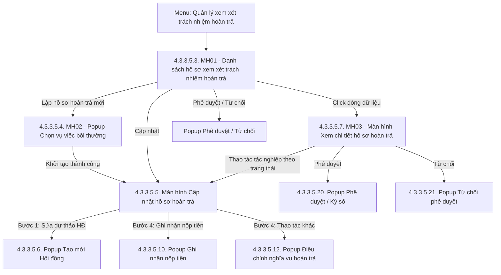

### 4.3.3.5. Quản lý xem xét trách nhiệm hoàn trả

#### 4.3.3.5.1. Mục đích

Cho phép quản lý toàn diện tiến trình xem xét, xác định và thực hiện nghĩa vụ hoàn trả kinh phí bồi thường của người thi hành công vụ có lỗi gây thiệt hại trên Website Quản trị, từ thời điểm vụ việc bồi thường nhà nước hoàn thành chi trả đến khi thu hồi đủ tiền vào ngân sách nhà nước (bao gồm: thành lập Hội đồng hoàn trả, ghi nhận quá trình làm việc và kết luận/kiến nghị của Hội đồng, ban hành Quyết định hoàn trả, theo dõi đôn đốc thu hồi tiền và xử lý điều chỉnh/miễn/hoãn/chấm dứt nghĩa vụ hoàn trả).

*a. Phân quyền*

\- **Cán bộ xử lý (Chuyên viên)**: Khởi tạo hồ sơ hoàn trả, lập thành phần Hội đồng, ghi nhận tiến trình làm việc và kiến nghị của Hội đồng, lập dự thảo các quyết định, theo dõi và ghi nhận nộp tiền, lập hồ sơ điều chỉnh/miễn/hoãn/chấm dứt hoàn trả, kết xuất Excel.

\- **Lãnh đạo phê duyệt**: Xem xét hồ sơ; phê duyệt hoặc từ chối kèm lý do đối với Quyết định thành lập Hội đồng và dự thảo Quyết định hoàn trả.

\- **Cán bộ tra cứu**: Chỉ xem danh sách và chi tiết hồ sơ hoàn trả trong phạm vi được phân quyền, kết xuất Excel; toàn bộ các nút tác nghiệp bị vô hiệu hóa.

\- **Phạm vi hiển thị dữ liệu**: Theo cơ quan, đơn vị công tác được phân quyền của người dùng đăng nhập.

*b. Điều kiện thực hiện*

\- Người dùng đã đăng nhập Website Quản trị thành công và được phân quyền truy cập chức năng `Quản lý xem xét trách nhiệm hoàn trả`.

\- Vụ việc bồi thường nhà nước gốc đã hoàn thành chi trả kinh phí bồi thường và chưa phát sinh hồ sơ xem xét trách nhiệm hoàn trả theo [BR-BTNN-HT-001].

---

#### 4.3.3.5.2. Sơ đồ luồng nghiệp vụ theo giao diện

---

#### 4.3.3.5.3. MH01 - Màn hình Danh sách hồ sơ xem xét trách nhiệm hoàn trả

##### 4.3.3.5.3.1. Màn hình

##### 4.3.3.5.3.2. Mô tả thông tin trên màn hình

| Trường thông tin | Kiểu dữ liệu | Bắt buộc | Mặc định | Mô tả |
| :--- | :--- | :--- | :--- | :--- |
| **I. Khối thông tin chung màn hình** | Section | - | - | Vùng tiêu đề và số liệu tổng quan phía trên màn hình. |
| Tiêu đề màn hình | String(255) | - | - | Control UI: Text heading (Read-only). - Hiển thị `Quản lý xem xét trách nhiệm hoàn trả`. |
| Số hồ sơ hoàn trả | Integer(10) | - | Theo dữ liệu | Control UI: Stat card (Read-only). - Đếm số hồ sơ thỏa mãn điều kiện lọc hiện tại. |
| Tổng số tiền phải hoàn trả | Decimal(18,0) | - | Theo dữ liệu | Control UI: Stat card (Read-only). - Tổng `Số tiền phải hoàn trả` của các hồ sơ thỏa mãn điều kiện lọc hiện tại. - Định dạng số có dấu phân cách hàng nghìn, đơn vị `VNĐ`. |
| Số tiền đã thu hồi thực tế | Decimal(18,0) | - | Theo dữ liệu | Control UI: Stat card (Read-only). - Tổng số tiền đã nộp thực tế ghi nhận trên sổ giao dịch của các hồ sơ thỏa mãn điều kiện lọc hiện tại. - Định dạng số có dấu phân cách hàng nghìn, đơn vị `VNĐ`. |
| **II. Khối bộ lọc tìm kiếm** | Section | - | - | Control UI: Filter panel. - Hiển thị phía trên bảng kết quả. |
| Mã hồ sơ | String(50) | Không | Trống | Control UI: Input text. - Placeholder: `Nhập mã hồ sơ...`. - Tìm kiếm theo mã hồ sơ hoàn trả (`HT-...`). |
| Mã vụ việc | String(50) | Không | Trống | Control UI: Input text. - Placeholder: `Nhập mã vụ việc...`. - Tìm kiếm theo mã vụ việc bồi thường gốc (`BT-...`). |
| Cán bộ gây sai phạm | String(255) | Không | Trống | Control UI: Input text. - Placeholder: `Nhập họ tên cán bộ...`. - Tìm kiếm gần đúng theo họ và tên cán bộ chịu trách nhiệm hoàn trả thuộc hồ sơ. |
| Đơn vị công tác | String(255) | Không | Trống | Control UI: Input text. - Placeholder: `Nhập đơn vị công tác của cán bộ...`. - Tìm kiếm gần đúng trên đơn vị công tác của các cán bộ chịu trách nhiệm hoàn trả thuộc hồ sơ. |
| Trạng thái | Enum(String(50)) | Không | `Tất cả` | Control UI: Combobox. Gồm: + Tất cả + Chờ thành lập hội đồng + Chờ duyệt QĐ thành lập + Bị từ chối thành lập HĐ + Đang họp hội đồng + Chờ ban hành QĐ hoàn trả + Bị từ chối QĐ hoàn trả + Đang thi hành + Hoàn thành + Không xem xét trách nhiệm hoàn trả + Chấm dứt thu hồi |
| Xóa bộ lọc | Button | Không | - | Control UI: Button. |
| Tìm kiếm | Button | Không | - | Control UI: Button. |
| **III. Khối bảng kết quả tìm kiếm** | Section | - | 10 bản ghi/trang | Control UI: Data grid. - Khi truy cập màn hình, hệ thống tự động tải toàn bộ hồ sơ hoàn trả thuộc phạm vi dữ liệu được phân quyền, sắp xếp mặc định theo ngày khởi tạo hồ sơ giảm dần. - Riêng người dùng có quyền Lãnh đạo phê duyệt: mặc định áp dụng sẵn bộ lọc `Trạng thái` gồm `Chờ duyệt QĐ thành lập` và `Chờ ban hành QĐ hoàn trả`, sắp xếp theo `Hạn xử lý` tăng dần. - Phân trang tuân thủ [BR-UI-001]. |
| Lập hồ sơ hoàn trả mới | Button | Không | - | Control UI: Button. - Cho phép mở popup chọn vụ việc bồi thường để lập hồ sơ hoàn trả mới. |
| Kết xuất Excel | Button | Không | - | Control UI: Button. - Cho phép kết xuất danh sách hồ sơ hoàn trả ra tệp Excel. |
| STT | Integer(10) | Không | Tự tăng | Control UI: Text (Read-only). - Số thứ tự dòng dữ liệu trên trang hiện tại. |
| Mã hồ sơ | String(50) | Có | Theo dữ liệu | Control UI: Text (Read-only). - Hiển thị mã hồ sơ hoàn trả in đậm, ví dụ `HT-2026-001`. - Mã do hệ thống tự sinh khi khởi tạo hồ sơ. |
| Cán bộ gây sai phạm | String(500) | Không | Theo dữ liệu | Control UI: Text kèm Popover (Read-only). - Cấu trúc hiển thị 2 dòng theo chuẩn UI: + Dòng 1: STT, Họ và tên cán bộ kèm tên đơn vị công tác viết tắt trong ngoặc đơn, font chữ in đậm (Ví dụ: `1. Nguyễn Văn A (Sở TP)`). + Dòng 2: Chức vụ của cán bộ, font chữ in nghiêng (Ví dụ: *Chấp hành viên*). - Trường hợp hồ sơ có nhiều cán bộ: Hiển thị tối đa 02 cán bộ (mỗi cán bộ đủ 2 dòng trên); nếu có từ 03 cán bộ trở lên thì hiển thị thêm badge `+ N người khác`. - Khi hover (trỏ chuột) vào ô: Hiển thị Popover danh sách đầy đủ cán bộ được nhóm theo từng đơn vị công tác, hiển thị số lượng cán bộ của từng đơn vị và danh sách chi tiết (Họ tên - Chức vụ). - Hiển thị `-` khi hồ sơ chưa ghi nhận cán bộ chịu trách nhiệm. |
| Đơn vị công tác | String(255) | Không | Theo dữ liệu | Control UI: Text kèm Tooltip (Read-only). - Trường hợp toàn bộ cán bộ thuộc 01 đơn vị: Hiển thị tên đơn vị đó. - Trường hợp thuộc 02 đơn vị: Hiển thị tên 02 đơn vị phân tách bởi ký tự `&`. - Trường hợp thuộc từ 03 đơn vị trở lên: Hiển thị `Liên ngành`. Khi người dùng hover (trỏ chuột) vào nhãn `Liên ngành`, hiển thị tooltip/popover danh sách đầy đủ các đơn vị công tác liên quan, mỗi đơn vị hiển thị trên 01 dòng riêng biệt và có đánh số thứ tự (STT). |
| Mã vụ việc | String(50) | Có | Theo dữ liệu | Control UI: Text link (Read-only). - Hiển thị mã vụ việc bồi thường nhà nước gốc, ví dụ `BT-2026-001`. |
| Số tiền bồi thường (VNĐ) | Decimal(18,0) | Có | Theo dữ liệu | Control UI: Text (Read-only). - Tổng số tiền Nhà nước đã chi trả bồi thường của vụ việc gốc. - Căn phải, định dạng số có dấu phân cách hàng nghìn. |
| Số tiền phải hoàn trả (VNĐ) | Decimal(18,0) | Không | Theo dữ liệu | Control UI: Text (Read-only). - Tổng số tiền phải hoàn trả của toàn bộ cán bộ theo Quyết định hoàn trả, đã trừ số tiền được giảm/miễn. - Hiển thị `-` khi hồ sơ chưa ban hành Quyết định hoàn trả. |
| Tiến độ thu hồi | Decimal(5,2) | Không | Theo dữ liệu | Control UI: Progress bar (Read-only). - Hiển thị số tiền đã thu và tỷ lệ phần trăm `Đã thu / Số tiền phải hoàn trả`. - Hiển thị `-` khi hồ sơ chưa ban hành Quyết định hoàn trả. |
| Trạng thái | Enum(String(50)) | Có | Theo dữ liệu | Control UI: Badge (Read-only). - Theo giá trị tại khối bộ lọc tìm kiếm. |
| Hạn xử lý | String(50) | Không | Theo dữ liệu | Control UI: Badge (Read-only). - Hiển thị chuẩn 02 dòng: + Dòng 1: Ngày hạn xử lý định dạng `dd/mm/yyyy`. + Dòng 2: Badge trạng thái:   * `Còn N ngày` (Badge xanh lá): Khi còn > 3 ngày.   * `Còn N ngày` (Badge vàng cam): Khi còn từ 1 đến 3 ngày.   * `Quá hạn N ngày` (Badge đỏ): Khi đã quá ngày quy định. - Quy định thời hạn theo trạng thái: + `Chờ thành lập hội đồng`, `Chờ duyệt QĐ thành lập`, `Bị từ chối thành lập HĐ` : Thời hạn thành lập HĐ (theo [BR-BTNN-HT-014]). + Các trạng thái còn lại: Hiển thị `-`. |
| Thao tác | Action | Không | - | Control UI: Nhóm nút thao tác. Gồm các nút: - **Cập nhật**: Chỉ hiển thị khi hồ sơ ở trạng thái: + `Bị từ chối thành lập HĐ` + `Đang họp hội đồng` + `Chờ ban hành QĐ hoàn trả` + `Bị từ chối QĐ hoàn trả` + `Đang thi hành` - **Phê duyệt/Từ chối**: + Chỉ hiển thị khi người dùng được phân quyền. + Chỉ hiển thị khi hồ sơ ở trạng thái:   * `Chờ duyệt QĐ thành lập`   * `Chờ ban hành QĐ hoàn trả` - **Xóa**: Chỉ hiển thị khi hồ sơ ở trạng thái: + `Chờ thành lập hội đồng` |

##### 4.3.3.5.3.3. Chức năng trên màn hình

| STT | Tên chức năng | Định dạng | Mô tả |
| :--- | :--- | :--- | :--- |
| 1 | Tìm kiếm | Button | Khi người dùng click nút Tìm kiếm, hệ thống lọc dữ liệu theo các điều kiện đã nhập/chọn. - **TH Không trả về dữ liệu**: Bảng kết quả hiển thị 01 dòng thông báo [MSG-INF-SYS-001]; thanh phân trang hiển thị `0-0 của 0 bản ghi`; toàn bộ thẻ số liệu tổng quan đang hiển thị đều trả về giá trị `0`; nút `Kết xuất Excel` khóa mờ kèm tooltip `Không có dữ liệu để kết xuất`. - **TH Trả về dữ liệu**: Hệ thống hiển thị danh sách hồ sơ hoàn trả theo phân trang, cập nhật lại toàn bộ thẻ số liệu tổng quan đang hiển thị theo đúng tập dữ liệu sau lọc và đưa con trỏ phân trang về trang 1. |
| 2 | Xóa bộ lọc | Button | Khi người dùng click nút Xóa bộ lọc, hệ thống xóa toàn bộ giá trị đã nhập/chọn trên khối bộ lọc, khôi phục giá trị mặc định của các combobox, tải lại danh sách mặc định theo phạm vi dữ liệu được phân quyền và đưa con trỏ phân trang về trang 1. |
| 3 | Lập hồ sơ hoàn trả mới | Button | Khi người dùng click nút Lập hồ sơ hoàn trả mới, hệ thống mở `MH02 - Popup Chọn vụ việc bồi thường để lập hồ sơ hoàn trả` và tải danh sách vụ việc bồi thường đủ điều kiện theo [BR-BTNN-HT-001]. |
| 4 | Kết xuất Excel | Button | Khi người dùng click nút Kết xuất Excel, hệ thống thực hiện kết xuất dữ liệu danh sách theo đúng quy định tại Mục 5.5 của tài liệu `04_Danh_muc_va_Phu_luc.md`. |
| 5 | Click dòng dữ liệu | Row click | Khi người dùng click vào bất kỳ vị trí nào trên dòng dữ liệu (ngoại trừ cột Thao tác và liên kết `Mã vụ việc`), hệ thống hiển thị `MH03 - Màn hình Xem chi tiết hồ sơ hoàn trả`, đồng thời tự động cuộn (focus) tới đúng khối thông tin theo đúng trạng thái tương ứng hiện tại của hồ sơ: - Trạng thái `Chờ thành lập hội đồng`, `Chờ duyệt QĐ thành lập`, `Bị từ chối thành lập HĐ`: focus tới `Khối IV. Thông tin Bước 1: Thành lập Hội đồng`. - Trạng thái `Đang họp hội đồng`, `Không xem xét trách nhiệm hoàn trả`: focus tới `Khối V. Thông tin Bước 2: Ý kiến của hội đồng`. - Trạng thái `Chờ ban hành QĐ hoàn trả`, `Bị từ chối QĐ hoàn trả`: focus tới `Khối VI. Thông tin Bước 3: Ban hành Quyết định hoàn trả`. - Trạng thái `Đang thi hành`, `Chấm dứt thu hồi`: focus tới `Khối VII. Thông tin Bước 4: Đang thi hành`. - Trạng thái `Hoàn thành`: focus tới `Khối VIII. Thông tin Bước 5: Hoàn thành`. |
| 6 | Mã vụ việc | Text link | Khi người dùng click vào mã vụ việc bồi thường, hệ thống mở màn hình chi tiết vụ việc bồi thường nhà nước gốc tại `SRS_BTNN_GiaiQuyetBT_GiaiQuyet_YCBT.md` trên một tab trình duyệt mới, đồng thời giữ nguyên trạng thái bộ lọc và trang hiện tại của màn hình danh sách. |
| 7 | Cập nhật | Button | Khi người dùng click nút Cập nhật, hệ thống điều hướng sang `Màn hình Cập nhật hồ sơ hoàn trả` và mở trực tiếp bước cần cập nhật theo trạng thái hồ sơ: - Trạng thái `Bị từ chối thành lập HĐ`: chuyển sang `Bước 1: Thành lập Hội đồng` tại `Màn hình Cập nhật hồ sơ hoàn trả` để chỉnh sửa thông tin/dự thảo Quyết định thành lập Hội đồng và trình duyệt lại. - Trạng thái `Đang họp hội đồng`: chuyển sang `Bước 2: Ý kiến của hội đồng` tại `Màn hình Cập nhật hồ sơ hoàn trả`. - Trạng thái `Chờ ban hành QĐ hoàn trả`: chuyển sang `Bước 3: Ban hành Quyết định hoàn trả` tại `Màn hình Cập nhật hồ sơ hoàn trả`. - Trạng thái `Bị từ chối QĐ hoàn trả`: chuyển sang `Bước 3: Ban hành Quyết định hoàn trả` tại `Màn hình Cập nhật hồ sơ hoàn trả` để chỉnh sửa lại dự thảo Quyết định hoàn trả và trình duyệt lại. - Trạng thái `Đang thi hành`: chuyển sang `Bước 4: Đang thi hành` tại `Màn hình Cập nhật hồ sơ hoàn trả`. |
| 8 | Phê duyệt | Button | Chỉ hiển thị khi người dùng được phân quyền và hồ sơ ở trạng thái `Chờ duyệt QĐ thành lập` hoặc `Chờ ban hành QĐ hoàn trả`. Khi click, hệ thống mở **Popup Phê duyệt / Ký số Quyết định** để Lãnh đạo thực hiện ký số hoặc xác nhận phê duyệt theo hình thức ban hành của văn bản. |
| 9 | Từ chối | Button | Chỉ hiển thị khi người dùng được phân quyền và hồ sơ ở trạng thái `Chờ duyệt QĐ thành lập` hoặc `Chờ ban hành QĐ hoàn trả`. Khi click, hệ thống mở **Popup Từ chối phê duyệt Quyết định** để Lãnh đạo nhập lý do từ chối và đính kèm văn bản chỉ đạo. |
| 10 | Xóa | Button | Khi người dùng click nút Xóa, hệ thống mở [POPUP-CFM-001] với tham số `Loại thao tác` = `Xóa` và nội dung xác nhận [MSG-CFM-SYS-001]. - **TH Người dùng chọn Hủy bỏ**: Hệ thống đóng popup, không thay đổi dữ liệu. - **TH Người dùng chọn Đồng ý**: Hệ thống kiểm tra lại điều kiện xóa theo [BR-BTNN-HT-012]; nếu hợp lệ thì xóa hồ sơ hoàn trả, ghi Audit Log, hiển thị thông báo [MSG-SUC-BTNN-HT-018], làm mới danh sách và cập nhật lại toàn bộ thẻ số liệu tổng quan đang hiển thị; nếu không hợp lệ thì hiển thị thông báo [MSG-ERR-BTNN-HT-008] và không thực hiện xóa. |

---

#### 4.3.3.5.4. MH02 - Popup Chọn vụ việc bồi thường để lập hồ sơ hoàn trả

##### 4.3.3.5.4.1. Màn hình

##### 4.3.3.5.4.2. Mô tả thông tin trên màn hình

| Trường thông tin | Kiểu dữ liệu | Bắt buộc | Mặc định | Mô tả |
| :--- | :--- | :--- | :--- | :--- |
| Tiêu đề popup | String(255) | - | - | Control UI: Text heading (Read-only). - Hiển thị `Lập hồ sơ hoàn trả: Chọn vụ việc bồi thường`. |
| Nội dung hướng dẫn | Text(500) | - | - | Control UI: Text (Read-only). - Hiển thị nội dung hướng dẫn về phạm vi danh sách: các vụ việc bồi thường nhà nước đã chi trả xong, đủ điều kiện khởi tạo hồ sơ xem xét trách nhiệm hoàn trả. |
| **Bảng danh sách vụ việc đủ điều kiện** | Section | - | - | Control UI: Data grid. - Danh sách vụ việc bồi thường nhà nước thỏa mãn [BR-BTNN-HT-001], thuộc phạm vi dữ liệu được phân quyền của người dùng. - Mặc định hiển thị 10 bản ghi/trang, sắp xếp theo `Ngày hoàn thành chi trả` tăng dần. |
| Mã vụ việc | String(50) | Có | Theo dữ liệu | Control UI: Text (Read-only). - Hiển thị mã vụ việc bồi thường nhà nước in đậm. |
| Người yêu cầu | String(255) | Có | Theo dữ liệu | Control UI: Text (Read-only). - Hiển thị họ tên cá nhân/tổ chức yêu cầu bồi thường của vụ việc gốc. |
| Số tiền bồi thường (VNĐ) | Decimal(18,0) | Có | Theo dữ liệu | Control UI: Text (Read-only). - Tổng số tiền Nhà nước đã chi trả bồi thường của vụ việc. - Căn phải, định dạng số có dấu phân cách hàng nghìn. |
| Ngày hoàn thành chi trả | Date | Có | Theo dữ liệu | Control UI: Text (Read-only). - Định dạng `dd/mm/yyyy`. Lấy theo ngày hoàn thành chi trả kinh phí bồi thường của vụ việc gốc. |

##### 4.3.3.5.4.3. Chức năng trên màn hình

| STT | Tên chức năng | Định dạng | Mô tả |
| :--- | :--- | :--- | :--- |
| 1 | Khởi tạo hồ sơ | Button | Khi người dùng click nút Khởi tạo hồ sơ trên một dòng vụ việc, hệ thống thực hiện kiểm tra và xử lý: - **TH Vụ việc không còn đủ điều kiện** (đã có hồ sơ hoàn trả do người dùng khác vừa khởi tạo): Hệ thống hiển thị thông báo [MSG-ERR-BTNN-HT-009], làm mới lại danh sách trong popup và không khởi tạo hồ sơ. - **TH Hợp lệ**: Hệ thống thực hiện tuần tự các bước: + Bước 1: Tự động sinh `Mã hồ sơ` theo quy tắc `HT-<năm>-<số thứ tự 3 chữ số>` (Ví dụ: `HT-2026-001`). + Bước 2: Lưu hồ sơ hoàn trả vào cơ sở dữ liệu ở trạng thái `Chờ thành lập hội đồng`, tự động kế thừa các thông tin từ vụ việc gốc gồm: Mã vụ việc, Tên vụ việc, Nội dung vụ việc, Đơn vị chi trả bồi thường, Tổng số tiền đã chi trả, Ngày hoàn thành chi trả. + Bước 3: Ghi Audit Log thao tác khởi tạo hồ sơ hoàn trả. + Bước 4: Hiển thị thông báo thành công [MSG-SUC-BTNN-HT-001]. + Bước 5: Đóng popup và điều hướng sang `Màn hình Cập nhật hồ sơ hoàn trả` tại Bước 1: Thành lập Hội đồng xem xét trách nhiệm hoàn trả. |
| 2 | Đóng | Button | Khi người dùng click nút Đóng hoặc biểu tượng `×` trên tiêu đề popup, hệ thống đóng popup và quay lại `MH01 - Màn hình Danh sách hồ sơ xem xét trách nhiệm hoàn trả`, không thay đổi dữ liệu. |

---

#### 4.3.3.5.5. Màn hình Cập nhật hồ sơ hoàn trả

##### 4.3.3.5.5.1. Màn hình

##### 4.3.3.5.5.2. Mô tả thông tin trên màn hình

| Trường thông tin | Kiểu dữ liệu | Bắt buộc | Mặc định | Mô tả |
| :--- | :--- | :--- | :--- | :--- |
| **I. Khối điều hướng và tiêu đề hồ sơ** | Section | - | - | Vùng thông tin nhận dạng hồ sơ phía trên màn hình cập nhật. |
| Đường dẫn điều hướng | String(255) | - | - | Control UI: Breadcrumb (Read-only). - Hiển thị `Quản lý xem xét trách nhiệm hoàn trả / Cập nhật hồ sơ <Mã hồ sơ>`. |
| Tiêu đề hồ sơ | String(50) | Có | Theo dữ liệu | Control UI: Text heading (Read-only). - Hiển thị `Hồ sơ trách nhiệm hoàn trả: <Mã hồ sơ>`. |
| Trạng thái | Enum(String(50)) | Có | Theo dữ liệu | Control UI: Badge (Read-only). - Hiển thị trạng thái hiện tại của hồ sơ hoàn trả (chỉ đọc). Gồm: + Chờ thành lập hội đồng + Chờ duyệt QĐ thành lập + Bị từ chối thành lập HĐ + Đang họp hội đồng + Chờ ban hành QĐ hoàn trả + Bị từ chối QĐ hoàn trả + Đang thi hành + Hoàn thành + Không xem xét trách nhiệm hoàn trả + Chấm dứt thu hồi |
| Vụ việc bồi thường gốc | String(50) | Có | Theo dữ liệu | Control UI: Text link (Read-only). - Hiển thị mã vụ việc bồi thường nhà nước gốc kèm nhãn `[Xem hồ sơ gốc]` và tên vụ việc. |
| **II. Thông tin vụ việc** | Section | - | - | Control UI: Info card (Read-only). Kế thừa toàn bộ thông tin từ vụ việc bồi thường gốc. |
| Mã vụ việc | String(50) | Có | Theo dữ liệu | Control UI: Text link (Read-only). - Hiển thị mã vụ việc bồi thường nhà nước gốc. |
| Tên vụ việc | String(255) | Có | Theo dữ liệu | Control UI: Text (Read-only). - Hiển thị tên vụ việc bồi thường nhà nước gốc. Theo thông tin Hồ sơ vụ việc. |
| Ngày QĐ giải quyết bồi thường | Date | Có | Theo dữ liệu | Control UI: Text (Read-only). - Định dạng `dd/mm/yyyy`. Theo thông tin Hồ sơ vụ việc. |
| Ngày hoàn thành chi trả | Date | Có | Theo dữ liệu | Control UI: Text (Read-only). - Định dạng `dd/mm/yyyy`. Theo thông tin Hồ sơ vụ việc. |
| Lĩnh vực phát sinh thiệt hại | String(255) | Có | Theo dữ liệu | Control UI: Text (Read-only). - Theo thông tin Hồ sơ vụ việc. |
| Hành vi gây thiệt hại | String(500) | Có | Theo dữ liệu | Control UI: Text (Read-only). - Theo thông tin Hồ sơ vụ việc. |
| Nội dung vụ việc sai phạm gây bồi thường | Text(2000) | Có | Theo dữ liệu | Control UI: Text (Read-only). - Theo thông tin Hồ sơ vụ việc. |
| Đơn vị chi trả bồi thường | String(255) | Có | Theo dữ liệu | Control UI: Text (Read-only). - Theo thông tin Hồ sơ vụ việc. |
| Tổng số tiền Nhà nước đã chi trả bồi thường | Decimal(18,0) | Có | Theo dữ liệu | Control UI: Text (Read-only). - Định dạng số có dấu phân cách hàng nghìn, đơn vị `VNĐ`. Theo thông tin Hồ sơ vụ việc. |
| **III. Khối thanh tiến trình xử lý hồ sơ** | Section | - | - | Control UI: Progress tracker (Stepper 5 bước). - Gồm 05 bước: `Thành lập Hội đồng`, `Ý kiến hội đồng`, `Ban hành QĐ`, `Đang thi hành`, `Hoàn thành`. |
| Trạng thái hiển thị bước trên Stepper | Enum(String(50)) | - | Theo dữ liệu | Control UI: Step node (Read-only). - **05 bước trên thanh tiến trình Stepper**: + `Bước 1: Thành lập Hội đồng` + `Bước 2: Ý kiến của hội đồng` + `Bước 3: Ban hành Quyết định hoàn trả` + `Bước 4: Đang thi hành` + `Bước 5: Hoàn thành` - **Quy tắc hiển thị trạng thái từng nút bước trên Stepper**: Gồm: + `Đã hoàn thành`: Bước nhỏ hơn bước hiện tại, hiển thị icon tích xanh `✓`, cho phép click xem lại dạng chỉ đọc. + `Đang xử lý`: Bước hiện tại của hồ sơ, highlight nổi bật, cho phép thao tác chỉnh sửa/nhập liệu. + `Chưa mở khóa`: Bước lớn hơn bước hiện tại, hiển thị mờ, khóa không cho click mở. + `Kết thúc do không xem xét`: Trạng thái `Không xem xét trách nhiệm hoàn trả`, bước 2 hiển thị dấu `×` màu đỏ, các bước 3, 4, 5 hiển thị mờ. + `Kết thúc do chấm dứt thu hồi`: Trạng thái `Chấm dứt thu hồi`, bước 4 hiển thị dấu `×` màu đỏ, bước 5 hiển thị mờ. |
| **IV. Bước 1: Thành lập Hội đồng** | Section | - | - | Vùng hiển thị thông tin thành lập Hội đồng xem xét trách nhiệm hoàn trả theo tiến trình xử lý hồ sơ. |
| **Khối thông tin cảnh báo từ chối** | Section | - | - | Control UI: Alert box (Danger). - **Điều kiện hiển thị**: Chỉ hiển thị khi hồ sơ ở trạng thái `Bị từ chối thành lập HĐ`. |
| Tiêu đề cảnh báo | String(255) | - | - | Control UI: Text heading (Read-only). - Hiển thị `Yêu cầu trình ký Quyết định thành lập bị từ chối`. |
| Người từ chối | String(255) | - | Theo dữ liệu | Control UI: Text (Read-only). - Hiển thị họ tên và chức vụ của Lãnh đạo từ chối phê duyệt. |
| Thời gian từ chối | DateTime | - | Theo dữ liệu | Control UI: Text (Read-only). - Định dạng `dd/mm/yyyy - HH:mm`. |
| Lý do từ chối | Text(1000) | - | Theo dữ liệu | Control UI: Text (Read-only). - Hiển thị nguyên văn ý kiến, lý do từ chối phê duyệt của Lãnh đạo. |
| **Thông tin văn bản** | Section | - | - | Control UI: Info card / Form card. - **Điều kiện hiển thị**: Hiển thị khi hồ sơ chuyển sang các trạng thái sau bước Chờ thành lập hội đồng (gồm: `Chờ duyệt QĐ thành lập`, `Bị từ chối thành lập HĐ`, `Đang họp hội đồng`, `Chờ ban hành QĐ hoàn trả`, `Bị từ chối QĐ hoàn trả`, `Đang thi hành`, `Hoàn thành`, `Không xem xét trách nhiệm hoàn trả`, `Chấm dứt thu hồi`). Kế thừa toàn bộ thông tin đã tạo lập tại bước tạo mới Hội đồng. - **Quy tắc thao tác**: Đối với trạng thái `Bị từ chối thành lập HĐ`, người dùng (Cán bộ) được phép chỉnh sửa lại các thông tin gồm: `Trích yếu`, `Lãnh đạo ký`, `Tệp văn bản Quyết định`, `Bảng Văn bản liên quan`; các thông tin còn lại và các trạng thái khác là chỉ đọc (Read-only). |
| Hình thức ban hành | Enum(String(50)) | Có | Theo dữ liệu | Control UI: Text (Read-only). Gồm: + `Trình ký điện tử trên hệ thống` + `Ký ngoài hệ thống` |
| Đơn vị ban hành | String(255) | Có | Theo dữ liệu | Control UI: Text (Read-only). - Đơn vị ban hành quyết định thành lập Hội đồng. |
| Số quyết định | String(50) | Có | Theo dữ liệu | Control UI: Text (Read-only). - Với hình thức `Ký ngoài hệ thống`: Hiển thị số quyết định do người dùng nhập. - Với hình thức `Trình ký điện tử trên hệ thống`: Hiển thị `Chờ cấp số` khi hồ sơ ở trạng thái `Chờ duyệt QĐ thành lập` hoặc `Bị từ chối thành lập HĐ`; tự động cấp số văn bản chính thức sau khi lãnh đạo ký duyệt thành công. |
| Ngày quyết định | Date | Có | Theo dữ liệu | Control UI: Text (Read-only). - Định dạng `dd/mm/yyyy`. Ngày ký ban hành quyết định. |
| Trích yếu | Text(2000) | Có | Theo dữ liệu | Control UI: Textarea / Text. - **Quy tắc thao tác**: + Trạng thái `Bị từ chối thành lập HĐ`: Cho phép chỉnh sửa lại nội dung trích yếu quyết định. + Các trạng thái khác: Chỉ đọc (Read-only). |
| Lãnh đạo ký | Enum(String(255)) | Có (khi ký điện tử) | Theo dữ liệu | Control UI: Combobox / Text. - Chỉ hiển thị nếu Hình thức ban hành là `Trình ký điện tử trên hệ thống`. - **Quy tắc thao tác**: + Trạng thái `Bị từ chối thành lập HĐ`: Cho phép chọn lại Lãnh đạo ký duyệt. + Các trạng thái khác: Chỉ đọc (Read-only). |
| Tệp văn bản Quyết định | File | Có | Theo dữ liệu | Control UI: File upload / File link. - Kèm liên kết `Xem file` (mở tab mới) và `Tải xuống`. - **Quy tắc thao tác & hiển thị**: + Trạng thái `Bị từ chối thành lập HĐ`: Cho phép tải lên tệp mới thay thế (kèm liên kết Xem file và Xóa file). + Trạng thái `Chờ duyệt QĐ thành lập`: Hiển thị `Văn bản PDF dự thảo ký` (Read-only kèm Xem file / Tải xuống). + Khi đã ký duyệt thành công (hoặc ký ngoài hệ thống): Hiển thị `Tệp tin PDF Quyết định đã ký số` hoặc `Quyết định đã ký, đóng dấu đỏ` (Read-only kèm Xem file / Tải xuống). |
| Bảng Văn bản liên quan | Section | Không | - | Control UI: Data grid. - **Quy tắc thao tác**: + Trạng thái `Bị từ chối thành lập HĐ`: Cho phép tải lên thêm văn bản liên quan hoặc xóa văn bản đã có. + Các trạng thái khác: Chỉ đọc danh sách (nếu không có văn bản liên quan thì không hiển thị bảng này). - Cột: `STT` \| `Tên văn bản` \| `Số hiệu` \| `Ngày văn bản` (`dd/mm/yyyy`) \| `Tệp đính kèm` (kèm liên kết Xem file - mở tab mới) \| `Thao tác` (Xóa - chỉ hiển thị khi `Bị từ chối thành lập HĐ`). |
| Trình ký | Button | - | - | Control UI: Button primary (Icon `fa-paper-plane`). - **Điều kiện hiển thị**: Chỉ hiển thị khi hồ sơ ở trạng thái `Bị từ chối thành lập HĐ` và người dùng có quyền Cán bộ xử lý nghiệp vụ. |
| Bảng Lịch sử xử lý Quyết định thành lập | Section | Không | - | Control UI: Timeline / Data grid (Read-only). - Ghi nhận toàn bộ tiến trình và lịch sử các lần xử lý, trình duyệt, phê duyệt, từ chối hoặc ban hành Quyết định thành lập Hội đồng xem xét trách nhiệm hoàn trả. |
| Thời gian thực hiện | DateTime | Có | Theo dữ liệu | Control UI: Text (Read-only). - Định dạng `dd/mm/yyyy - HH:mm`. Thời điểm phát sinh tác vụ. |
| Người thực hiện | String(255) | Có | Theo dữ liệu | Control UI: Text (Read-only). - Họ tên và chức vụ của người dùng thực hiện tác vụ. |
| Nội dung chi tiết / Lý do từ chối | Text(1000) | Không | Theo dữ liệu | Control UI: Text (Read-only). - Nội dung ghi chú xử lý hoặc ý kiến, lý do từ chối phê duyệt của Lãnh đạo. |
| **V. Bước 2: Ý kiến của hội đồng** | Section | - | - | Mở khóa khi hồ sơ ở trạng thái `Đang họp hội đồng` hoặc các bước sau. |
| Kết luận của Hội đồng | Enum(String(100)) | Có | Trống | Control UI: Combobox. Gồm 03 giá trị: + `Có lỗi - Kiến nghị hoàn trả` + `Không xem xét - Người thi hành công vụ không có lỗi` + `Không xem xét - Người thi hành công vụ đã chết trước khi ra quyết định hoàn trả` |
| Ngày họp / Lập biên bản kiến nghị | Date | Có | Trống | Control UI: Datepicker `dd/mm/yyyy`. - Không được lớn hơn ngày hiện tại. |
| Biên bản kiến nghị/kết luận đính kèm | File | Có | Trống | Control UI: File upload (Tải file lên). - Kèm liên kết Xem file và Xóa file. |
| Khối Ý kiến kiến nghị đối với từng cán bộ | Section | - | - | Control UI: Form card. - **Điều kiện hiển thị**: Chỉ hiển thị khi trường `Kết luận của Hội đồng` được chọn giá trị là `Có lỗi - Kiến nghị hoàn trả`. |
| Thêm cán bộ gây sai phạm | Button | Không | - | Control UI: Button primary (Icon `fa-plus`). - **Điều kiện hiển thị**: Chỉ hiển thị khi hồ sơ ở trạng thái `Đang họp hội đồng` và `Kết luận của Hội đồng` được chọn là `Có lỗi - Kiến nghị hoàn trả`. |
| Bảng danh sách cán bộ chịu trách nhiệm hoàn trả | Section | Có | - | Control UI: Data grid. - Bảng danh sách cán bộ chịu trách nhiệm hoàn trả do người dùng thiết lập. |
| STT | Integer | - | - | Control UI: Text (Read-only). - Số thứ tự tự động tăng (1, 2, 3...). |
| Cán bộ gây sai phạm | String(255) | Có | Trống | Control UI: Input text. - Nhập họ và tên cán bộ gây sai phạm, thiệt hại. |
| Chức vụ | String(255) | Có | Trống | Control UI: Input text. - Nhập chức vụ của cán bộ tại thời điểm gây sai phạm, thiệt hại. |
| Đơn vị công tác | String(255) | Có | Trống | Control UI: Combobox (hỗ trợ nhập tự do & tìm kiếm). - Cho phép nhập tay hoặc tìm kiếm, chọn từ danh sách đơn vị trên hệ thống theo mã đơn vị hoặc tên đơn vị. |
| Mức độ lỗi | Enum(String(50)) | Có | Trống | Control UI: Combobox. Gồm: + `Cố ý` + `Vô ý` |
| Số tiền hoàn trả (VNĐ) | Decimal(18,0) | Có | Trống | Control UI: Input number / text. - Căn phải, định dạng phân cách hàng nghìn. |
| Phương thức hoàn trả | Enum(String(50)) | Có | Trống | Control UI: Combobox. Gồm: + `Một lần` + `Nhiều lần` |
| Trạng thái hoãn | Enum(String(50)) | Có | `Không hoãn` | Control UI: Combobox. Gồm: + `Không hoãn` + `Đề xuất hoãn` |
| Thao tác trên dòng | Action | Không | - | Control UI: Nhóm nút thao tác trên từng dòng. Gồm: - `Sửa` (Icon `fa-pen-to-square`): Mở khóa các ô nhập liệu trên dòng để chỉnh sửa trực tiếp. - `Xóa` (Icon `fa-trash-can`): Xóa dòng cán bộ khỏi danh sách kiến nghị. |
| Lưu kết luận & Kết thúc hồ sơ | Button | - | - | Control UI: Button warning (Icon `fa-ban`). - **Điều kiện hiển thị**: Chỉ hiển thị khi hồ sơ ở trạng thái `Đang họp hội đồng` và `Kết luận của Hội đồng` được chọn là `Không xem xét - Người thi hành công vụ không có lỗi` hoặc `Không xem xét - Người thi hành công vụ đã chết trước khi ra quyết định hoàn trả`. |
| Trình duyệt kiến nghị | Button | - | - | Control UI: Button primary (Icon `fa-paper-plane`). - **Điều kiện hiển thị**: Chỉ hiển thị khi hồ sơ ở trạng thái `Đang họp hội đồng` và `Kết luận của Hội đồng` được chọn là `Có lỗi - Kiến nghị hoàn trả`. |
| **VI. Bước 3: Ban hành Quyết định hoàn trả** | Section | - | - | Mở khóa khi hồ sơ chuyển sang giai đoạn ban hành QĐ hoàn trả. |
| Khối thông tin cảnh báo từ chối QĐ hoàn trả | Section | - | - | Control UI: Alert box (Danger). - **Điều kiện hiển thị**: Chỉ hiển thị khi hồ sơ ở trạng thái `Bị từ chối QĐ hoàn trả`. |
| Tiêu đề cảnh báo | String(255) | - | - | Control UI: Text heading (Read-only). - Hiển thị `Yêu cầu trình ký dự thảo Quyết định hoàn trả bị từ chối`. |
| Người từ chối | String(255) | - | Theo dữ liệu | Control UI: Text (Read-only). - Hiển thị họ tên và chức vụ của Lãnh đạo từ chối phê duyệt. |
| Thời gian từ chối | DateTime | - | Theo dữ liệu | Control UI: Text (Read-only). - Định dạng `dd/mm/yyyy - HH:mm`. |
| Lý do từ chối | Text(1000) | - | Theo dữ liệu | Control UI: Text (Read-only). - Hiển thị nguyên văn ý kiến, lý do từ chối phê duyệt dự thảo Quyết định của Lãnh đạo. |
| Khối thông báo chưa ban hành QĐ hoàn trả | Section | - | - | Control UI: Call-to-action card. - **Điều kiện hiển thị**: Chỉ hiển thị khi hồ sơ ở trạng thái `Chờ ban hành QĐ hoàn trả` nhưng chưa tạo quyết định hoàn trả. |
| Tiêu đề thông báo | String(255) | - | - | Control UI: Text heading (Read-only). - Hiển thị `Chưa ban hành Quyết định hoàn trả`. |
| Nội dung hướng dẫn | Text(500) | - | - | Control UI: Text (Read-only). - Hiển thị `Bấm nút tạo Quyết định hoàn trả để nhập thông tin ban hành và văn bản quyết định.`. |
| Tạo QĐ hoàn trả | Button | Không | - | Control UI: Button primary (Icon `fa-circle-plus`). - **Điều kiện hiển thị**: Chỉ hiển thị khi hồ sơ ở trạng thái `Chờ ban hành QĐ hoàn trả` (chưa lập quyết định). |
| **Khối Thông tin văn bản Quyết định hoàn trả** | Section | - | - | Control UI: Info card / Form card. - **Điều kiện hiển thị**: Hiển thị khi người dùng đã bấm tạo Quyết định hoàn trả hoặc hồ sơ ở các trạng thái: `Chờ ban hành QĐ hoàn trả` (đang lập/đã trình ký), `Bị từ chối QĐ hoàn trả`, `Đang thi hành`, `Hoàn thành`, `Chấm dứt thu hồi`. - **Quy tắc thao tác**: Đối với trạng thái `Bị từ chối QĐ hoàn trả` hoặc khi đang lập dự thảo, người dùng (Cán bộ) được phép chỉnh sửa lại các thông tin: `Hình thức ban hành`, `Trích yếu`, `Lãnh đạo ký`, `Tệp văn bản Quyết định`, `Bảng Văn bản liên quan`, `Bảng danh sách cán bộ chịu trách nhiệm hoàn trả`. Ở các trạng thái sau khi đã ban hành chính thức (`Đang thi hành`, `Hoàn thành`...): Toàn bộ thông tin là chỉ đọc (Read-only). |
| Hình thức ban hành | Enum(String(50)) | Có | `Trình ký điện tử trên hệ thống` | Control UI: Radio button / Text. Gồm: + `Trình ký điện tử trên hệ thống` + `Ký ngoài hệ thống` |
| Đơn vị ban hành | String(255) | Có | Đơn vị đang đăng nhập | Control UI: Combobox / Text. - Đơn vị ban hành quyết định hoàn trả (mặc định đơn vị đăng nhập). |
| Số quyết định | String(50) | Có | Theo dữ liệu | Control UI: Input text / Text (Read-only). - Với hình thức `Ký ngoài hệ thống`: Cho phép nhập số quyết định chính thức. - Với hình thức `Trình ký điện tử trên hệ thống`: Hiển thị `Chờ cấp số` khi hồ sơ ở trạng thái `Chờ ban hành QĐ hoàn trả` hoặc `Bị từ chối QĐ hoàn trả`; tự động cấp số văn bản chính thức sau khi lãnh đạo ký duyệt thành công. |
| Ngày quyết định | Date | Có | Ngày hiện tại | Control UI: Datepicker `dd/mm/yyyy`. - Ngày ký ban hành quyết định hoàn trả. |
| Trích yếu | Text(2000) | Có | Trống | Control UI: Textarea / Text. - Trích yếu nội dung quyết định hoàn trả. Cho phép chỉnh sửa khi lập/sửa dự thảo, chỉ đọc khi đã ban hành. |
| Lãnh đạo ký | Enum(String(255)) | Có (khi ký điện tử) | Trống | Control UI: Combobox / Text. - Chỉ hiển thị nếu Hình thức ban hành là `Trình ký điện tử trên hệ thống`. Cho phép chọn Lãnh đạo ký khi lập dự thảo hoặc khi `Bị từ chối QĐ hoàn trả`; chỉ đọc khi đã ban hành. |
| Tệp văn bản Quyết định | File | Có | Trống | Control UI: File upload / File link. - Kèm liên kết `Xem file` (mở tab mới) và `Xóa file` / `Tải xuống`. - **Quy tắc hiển thị & thao tác**: + Khi lập/sửa dự thảo: Cho phép tải lên tệp dự thảo (PDF) hoặc tệp quyết định đã ký đóng dấu. + Khi đã ban hành chính thức: Hiển thị liên kết xem/tải tệp PDF quyết định đã ký số hoặc quyết định đã ký, đóng dấu đỏ (Read-only). |
| Bảng Văn bản liên quan | Section | Không | - | Control UI: Data grid. - **Quy tắc thao tác**: + Khi lập dự thảo hoặc trạng thái `Bị từ chối QĐ hoàn trả`: Cho phép đính kèm thêm văn bản liên quan hoặc xóa văn bản đã đính kèm. + Khi đã ban hành chính thức: Chỉ đọc danh sách. - Cột: `STT` \| `Tên văn bản` \| `Số hiệu` \| `Ngày văn bản` (`dd/mm/yyyy`) \| `Tệp đính kèm` (kèm liên kết Xem file - mở tab mới) \| `Thao tác` (Xóa - chỉ hiển thị khi cho phép chỉnh sửa). |
| Bảng danh sách cán bộ chịu trách nhiệm hoàn trả | Section | Có | - | Control UI: Data grid. - Kế thừa toàn bộ danh sách cán bộ từ Bước 2: Ý kiến của hội đồng, cho phép chỉnh sửa lại thông tin khi lập dự thảo Quyết định hoàn trả hoặc khi hồ sơ ở trạng thái `Bị từ chối QĐ hoàn trả`. Khi đã ban hành chính thức (`Đang thi hành`, `Hoàn thành`...): Toàn bộ thông tin trên bảng là chỉ đọc (Read-only). |
| STT | Integer | - | - | Control UI: Text (Read-only). - Số thứ tự tự động tăng (1, 2, 3...). |
| Cán bộ gây sai phạm | String(255) | Có | Theo dữ liệu | Control UI: Input text / Text (Read-only). - Nhập họ và tên cán bộ chịu trách nhiệm hoàn trả. Kế thừa từ Bước 2, cho phép sửa khi lập dự thảo hoặc khi `Bị từ chối QĐ hoàn trả`. |
| Chức vụ | String(255) | Có | Theo dữ liệu | Control UI: Input text / Text (Read-only). - Nhập chức vụ của cán bộ. Kế thừa từ Bước 2, cho phép sửa khi lập dự thảo hoặc khi `Bị từ chối QĐ hoàn trả`. |
| Đơn vị công tác | String(255) | Có | Theo dữ liệu | Control UI: Combobox (hỗ trợ nhập tự do & tìm kiếm) / Text (Read-only). - Đơn vị công tác của cán bộ. Kế thừa từ Bước 2, cho phép nhập tay hoặc tìm kiếm, chọn từ danh sách đơn vị trên hệ thống theo mã đơn vị hoặc tên đơn vị khi lập dự thảo hoặc khi `Bị từ chối QĐ hoàn trả`. |
| Mức độ lỗi | Enum(String(50)) | Có | Theo dữ liệu | Control UI: Combobox / Text (Read-only). Gồm: + `Cố ý` + `Vô ý` - Kế thừa từ Bước 2, cho phép chọn lại khi lập dự thảo hoặc khi `Bị từ chối QĐ hoàn trả`. |
| Số tiền hoàn trả (VNĐ) | Decimal(18,0) | Có | Theo dữ liệu | Control UI: Input number / text / Text (Read-only). - Căn phải, định dạng phân cách hàng nghìn. Kế thừa từ Bước 2, cho phép chỉnh sửa lại số tiền phải hoàn trả khi lập dự thảo hoặc khi `Bị từ chối QĐ hoàn trả`. |
| Phương thức hoàn trả | Enum(String(50)) | Có | Theo dữ liệu | Control UI: Combobox / Text (Read-only). Gồm: + `Một lần` + `Nhiều lần` - Kế thừa từ Bước 2, cho phép chọn lại khi lập dự thảo hoặc khi `Bị từ chối QĐ hoàn trả`. |
| Trạng thái hoãn | Enum(String(50)) | Có | Theo dữ liệu | Control UI: Combobox / Text (Read-only). Gồm: + `Không hoãn` + `Đề xuất hoãn` - Kế thừa từ Bước 2, cho phép chọn lại khi lập dự thảo hoặc khi `Bị từ chối QĐ hoàn trả`. |
| Thao tác trên dòng | Action | Không | - | Control UI: Nhóm nút thao tác trên từng dòng. Gồm: - `Sửa` (Icon `fa-pen-to-square`): Mở khóa các ô nhập liệu trên dòng để chỉnh sửa trực tiếp. - `Xóa` (Icon `fa-trash-can`): Xóa dòng cán bộ khỏi danh sách quyết định hoàn trả. - **Quy tắc hiển thị**: Chỉ hiển thị khi lập/sửa dự thảo hoặc khi trạng thái là `Bị từ chối QĐ hoàn trả`. |
| Trình ký | Button | - | - | Control UI: Button primary (Icon `fa-paper-plane`). - **Điều kiện hiển thị**: Chỉ hiển thị khi Hình thức ban hành là `Trình ký điện tử trên hệ thống`, tại trạng thái `Chờ ban hành QĐ hoàn trả` (khi lập mới dự thảo) hoặc `Bị từ chối QĐ hoàn trả`. |
| Ban hành QĐ | Button | - | - | Control UI: Button success (Icon `fa-check`). - **Điều kiện hiển thị**: Chỉ hiển thị khi Hình thức ban hành là `Ký ngoài hệ thống`, tại trạng thái `Chờ ban hành QĐ hoàn trả`. |
| Bảng Lịch sử xử lý Quyết định hoàn trả | Section | Không | - | Control UI: Timeline / Data grid (Read-only). - Ghi nhận toàn bộ tiến trình và lịch sử các lần xử lý, trình duyệt, phê duyệt, từ chối hoặc ban hành Quyết định hoàn trả. |
| Thời gian thực hiện | DateTime | Có | Theo dữ liệu | Control UI: Text (Read-only). - Định dạng `dd/mm/yyyy - HH:mm`. Thời điểm phát sinh tác vụ. |
| Người thực hiện | String(255) | Có | Theo dữ liệu | Control UI: Text (Read-only). - Họ tên và chức vụ của người dùng thực hiện tác vụ. |
| Nội dung chi tiết / Lý do từ chối | Text(1000) | Không | Theo dữ liệu | Control UI: Text (Read-only). - Nội dung ghi chú xử lý hoặc ý kiến, lý do từ chối phê duyệt dự thảo của Lãnh đạo. |
| **VII. Bước 4: Đang thi hành** | Section | - | - | Mở khóa khi Quyết định hoàn trả đã được ban hành chính thức. |
| **Bảng Theo dõi và cập nhật nộp tiền thực tế theo từng cán bộ** | Section | Có | - | Control UI: Data grid. - Theo dõi và quản lý việc nộp tiền thực tế vào ngân sách nhà nước của từng cán bộ theo Quyết định hoàn trả. |
| STT | Integer | - | - | Control UI: Text (Read-only). - Số thứ tự tự động tăng (1, 2, 3...). |
| Cán bộ gây sai phạm | String(255) | Có | Theo dữ liệu | Control UI: Text (Read-only). - Họ và tên cán bộ chịu trách nhiệm hoàn trả theo Quyết định hoàn trả. |
| Phương thức hoàn trả | Enum(String(50)) | Có | Theo dữ liệu | Control UI: Text (Read-only). - Kế thừa từ Quyết định hoàn trả. |
| Số tiền hoàn trả (VNĐ) | Decimal(18,0) | Có | Theo dữ liệu | Control UI: Text (Read-only). - Kế thừa từ Quyết định hoàn trả. - Căn phải, định dạng phân cách hàng nghìn. |
| Số tiền đã nộp (VNĐ) | Decimal(18,0) | Không | Theo dữ liệu | Control UI: Text (Read-only). - Tổng số tiền thực tế cán bộ đã nộp vào NSNN tính đến thời điểm hiện tại. - Căn phải, định dạng phân cách hàng nghìn. |
| Số tiền còn thiếu (VNĐ) | Decimal(18,0) | Không | Theo dữ liệu | Control UI: Text (Read-only). - Số tiền cán bộ còn phải tiếp tục nộp (bằng Số tiền hoàn trả trừ đi Số tiền đã nộp và trừ Số tiền được giảm/miễn nếu có). - Căn phải, định dạng phân cách hàng nghìn. |
| Tiến độ thu hồi tiền | Decimal(5,2) | Không | Theo dữ liệu | Control UI: Progress bar kèm Text (Read-only). - Tỷ lệ % hoàn thành nghĩa vụ nộp tiền của cán bộ (tính theo Số tiền đã nộp / Số tiền hoàn trả). |
| Trạng thái hoàn trả | Enum(String(50)) | Có | Theo dữ liệu | Control UI: Badge (Read-only). Hiển thị tình trạng thực hiện nghĩa vụ của cán bộ: + `Đang thi hành` (Badge xanh dương): Đang thực hiện nộp tiền theo tiến độ bình thường. - Trường hợp cán bộ vừa kết thúc thời hạn tạm hoãn, hiển thị bổ sung tag cảnh báo màu đỏ cam: `[Hết hạn hoãn từ dd/mm/yyyy]` để nhắc nhở cán bộ đôn đốc thu hồi nộp ngân sách. + `Đang hoãn` (Badge vàng cam): Đang trong thời hạn tạm hoãn thực hiện nghĩa vụ hoàn trả; hiển thị kèm khoảng thời gian `(Từ dd/mm/yyyy đến dd/mm/yyyy)`. - Khi thời gian tạm hoãn còn lại ≤ 05 ngày, hiển thị bổ sung tag cảnh báo: `[Sắp hết hạn hoãn: còn X ngày]`. + `Hoàn thành` (Badge xanh lá): Đã thu hồi đủ 100% nghĩa vụ nộp NSNN (Số tiền còn thiếu = 0). + `Miễn hoàn trả` (Badge tím): Được miễn hoàn trả 100% nghĩa vụ theo [BR-BTNN-HT-010]. + `Chấm dứt hoàn trả` (Badge xám): Đã ghi nhận chấm dứt nghĩa vụ do người thi hành công vụ qua đời theo [BR-BTNN-HT-017]. |
| Click dòng dữ liệu | Row click | Không | - | Control UI: Row click. - Khi người dùng click vào bất kỳ vị trí nào trên dòng cán bộ (ngoại trừ cột Thao tác), hệ thống mở `Popup Chi tiết tiến trình nộp tiền của cán bộ` để xem toàn bộ lịch sử các đợt nộp tiền, số chứng từ biên lai, và chi tiết các đợt điều chỉnh nghĩa vụ hoàn trả (Giảm mức hoàn trả, Miễn hoàn trả, Hoãn hoàn trả, Chấm dứt hoàn trả) kèm văn bản căn cứ đính kèm của cán bộ. |
| Thao tác | Action | Không | - | Control UI: Nhóm nút thao tác trên từng dòng dữ liệu. Gồm: - **Ghi nhận nộp tiền** (Icon `fa-money-bill-transfer`): + **Điều kiện hiển thị & cho phép click**: Luôn hiển thị và cho phép click khi cán bộ ở trạng thái `Đang thi hành` hoặc `Đang hoãn` (với Số tiền còn thiếu > 0) và người dùng có quyền tác nghiệp hồ sơ. + Khi cán bộ ở trạng thái `Đang hoãn`, hiển thị tooltip: *"Cán bộ đang trong thời gian tạm hoãn, vẫn cho phép ghi nhận nếu cán bộ tự nguyện nộp tiền trước hạn"*. + Khi click, hệ thống mở `Popup Ghi nhận nộp tiền hoàn trả ngân sách`. - **Thao tác khác** (Nút icon `fa-ellipsis-vertical` / Dropdown menu): + **Điều kiện hiển thị & cho phép click**: Chỉ hiển thị và cho phép click mở menu khi cán bộ ở trạng thái `Đang thi hành` hoặc `Đang hoãn` (với Số tiền còn thiếu > 0) và người dùng có quyền tác nghiệp hồ sơ. + **Trường hợp ẩn hoàn toàn**: Khi hồ sơ chuyển sang Bước 5 (`Hoàn thành` hoặc `Chấm dứt thu hồi`), toàn bộ bảng danh sách chuyển sang chế độ Chỉ đọc, không hiển thị cột Thao tác. + **Menu thả xuống gồm 04 thao tác**: + `Giảm mức hoàn trả`: Mở `Popup Điều chỉnh nghĩa vụ hoàn trả` với Loại điều chỉnh chọn sẵn là `Giảm mức hoàn trả`. + `Miễn hoàn trả`: Mở `Popup Điều chỉnh nghĩa vụ hoàn trả` với Loại điều chỉnh chọn sẵn là `Miễn hoàn trả`. + `Hoãn hoàn trả`: Mở `Popup Điều chỉnh nghĩa vụ hoàn trả` với Loại điều chỉnh chọn sẵn là `Hoãn hoàn trả`. + `Chấm dứt hoàn trả`: Mở `Popup Điều chỉnh nghĩa vụ hoàn trả` với Loại điều chỉnh chọn sẵn là `Chấm dứt hoàn trả`. |
| **VIII. Bước 5: Hoàn thành** | Section | - | - | **Quy tắc chuyển trạng thái tự động theo [BR-BTNN-HT-013]**: - Sau mỗi lần cán bộ thực hiện thao tác tại Bước 4 (ghi nhận nộp tiền, thực hiện điều chỉnh nghĩa vụ hoàn trả hoặc ghi nhận chấm dứt hoàn trả), hệ thống tự động kiểm tra lại toàn bộ cán bộ chịu trách nhiệm của hồ sơ. - Khi **tất cả các cán bộ** đều có `Số tiền còn thiếu = 0` (đã nộp đủ 100% số tiền hoàn trả hoặc được miễn hoàn trả toàn bộ), hệ thống **tự động chuyển trạng thái hồ sơ sang `Hoàn thành`**: + Mở khóa phân hệ `Bước 5: Hoàn thành` trên thanh tiến trình Stepper và trên màn hình cập nhật. + Chuyển toàn bộ các trường thông tin và nút thao tác tại Bước 1, Bước 2, Bước 3, Bước 4 sang chế độ chỉ xem (Read-only, khóa không cho phép chỉnh sửa thêm). + Tại Bước 5 chỉ hiển thị nút `Đóng`. - *Trường hợp ngoại lệ*: Nếu toàn bộ cán bộ còn nghĩa vụ đều được ghi nhận chấm dứt do qua đời theo [BR-BTNN-HT-017], hệ thống tự động chuyển hồ sơ sang trạng thái `Chấm dứt thu hồi` thay vì `Hoàn thành`. |
| Banner thông báo hoàn tất nghĩa vụ | Section | - | - | Control UI: Alert box (Read-only). - Thông báo hoàn thành 100% nghĩa vụ nộp tiền vào Kho bạc Nhà nước. |
| Khối Báo cáo tổng hợp số liệu thu hồi | Section | - | - | Control UI: Stat cards (Read-only). - Thẻ Tổng số cán bộ hoàn thành (Ví dụ: `3 / 3 cán bộ`). - Thẻ Tổng số tiền đã thu hồi (VNĐ, đạt 100%). - Thẻ Số dư còn nợ (`0 VNĐ`). |

##### 4.3.3.5.5.3. Chức năng trên màn hình

| STT | Tên chức năng | Định dạng | Mô tả |
| :--- | :--- | :--- | :--- |
| - | **Bước 1: Thành lập Hội đồng** | - | - |
| 1 | Trình ký | Button | Khi click, hệ thống kiểm tra dữ liệu và xử lý theo các trường hợp: - **TH1 (Chưa nhập đủ thông tin bắt buộc)**: Người dùng chưa nhập hoặc để trống một hoặc nhiều trường thông tin bắt buộc $\rightarrow$ Hệ thống áp dụng [BR-VAL-001], ngăn chặn gửi trình duyệt, highlight đỏ viền/nền ô lỗi đầu tiên (`.is-invalid`), hiển thị thông báo [MSG-ERR-VAL-001] ngay phía dưới ô nhập và tự động focus con trỏ vào ô lỗi đó. - **TH2 (Hợp lệ)**: Hệ thống lưu lại các thông tin đã chỉnh sửa, gửi trình duyệt lại cho Lãnh đạo, chuyển trạng thái hồ sơ sang `Chờ duyệt QĐ thành lập` và hiển thị thông báo [MSG-SUC-BTNN-HT-002]. |
| - | **Bước 2: Ý kiến của hội đồng** | - | - |
| 2 | Thêm cán bộ gây sai phạm | Button | Khi click, hệ thống tự động thêm 01 dòng mới trực tiếp ở Bảng danh sách cán bộ chịu trách nhiệm hoàn trả để người dùng nhập liệu trực tiếp trên các ô của dòng đó. |
| 3 | Sửa | Button / Icon | Khi người dùng click icon `Sửa` trên lưới Bảng danh sách cán bộ chịu trách nhiệm hoàn trả, hệ thống mở khóa các ô nhập liệu trên dòng cán bộ đó để cho phép chỉnh sửa lại trực tiếp trên dòng. |
| 4 | Xóa | Button / Icon | Khi người dùng click icon `Xóa` trên lưới Bảng danh sách cán bộ chịu trách nhiệm hoàn trả, hệ thống mở [POPUP-CFM-001] với nội dung xác nhận [MSG-CFM-SYS-001]. - **TH Người dùng chọn Hủy bỏ**: Hệ thống đóng popup, giữ nguyên dữ liệu. - **TH Người dùng chọn Đồng ý**: Hệ thống xóa dòng cán bộ khỏi danh sách kiến nghị hoàn trả và hiển thị thông báo [MSG-SUC-BTNN-HT-009]. |
| 5 | Lưu kết luận & Kết thúc hồ sơ | Button | Khi click, hệ thống kiểm tra dữ liệu và xử lý theo các trường hợp: - **TH1 (Chưa nhập đủ thông tin bắt buộc)**: Người dùng chưa nhập hoặc để trống một hoặc nhiều trường thông tin bắt buộc $\rightarrow$ Hệ thống áp dụng [BR-VAL-001], ngăn chặn, highlight đỏ viền ô lỗi đầu tiên (`.is-invalid`), hiển thị thông báo [MSG-ERR-VAL-001] ngay phía dưới ô nhập và tự động focus con trỏ vào ô lỗi đó. - **TH2 (Hợp lệ)**: Hệ thống lưu lại thông tin kết luận của Hội đồng ("Không xem xét trách nhiệm hoàn trả"), chuyển hồ sơ sang trạng thái `Không xem xét trách nhiệm hoàn trả` và kết thúc toàn bộ tiến trình hồ sơ theo [BR-BTNN-HT-005]: + Thanh tiến trình Stepper dừng lại tại Bước 2 với trạng thái hoàn tất/kết thúc vụ việc. + Các bước tiếp theo gồm `Bước 3: Ban hành Quyết định hoàn trả`, `Bước 4: Đang thi hành`, `Bước 5: Hoàn thành` được đóng hoàn toàn (khóa xám, không mở khóa, không phát sinh nghĩa vụ hoàn trả ngân sách). + Toàn bộ thông tin hồ sơ tại Bước 1 và Bước 2 được chuyển sang chế độ chỉ đọc (Read-only, không cho phép chỉnh sửa). + Hệ thống hiển thị thông báo [MSG-SUC-BTNN-HT-007]; người dùng chỉ có thể thực hiện thao tác `Đóng` để quay lại màn hình danh sách MH01. |
| 6 | Trình duyệt kiến nghị | Button | Khi click, hệ thống kiểm tra dữ liệu và xử lý theo các trường hợp: - **TH1 (Bỏ trống thông tin bắt buộc của Hội đồng)**: Người dùng chưa nhập hoặc để trống một hoặc nhiều trường thông tin bắt buộc của Hội đồng $\rightarrow$ Hệ thống áp dụng [BR-VAL-001], ngăn chặn trình duyệt, highlight đỏ viền/nền ô lỗi đầu tiên (`.is-invalid`), hiển thị thông báo [MSG-ERR-VAL-001] ngay phía dưới ô nhập và tự động focus con trỏ vào ô lỗi đó. - **TH2 (Chưa có cán bộ nào trong danh sách kiến nghị)**: Bảng danh sách cán bộ chịu trách nhiệm hoàn trả chưa có dữ liệu (chưa thêm bất kỳ cán bộ nào) $\rightarrow$ Hệ thống ngăn chặn trình duyệt, hiển thị thông báo [MSG-ERR-BTNN-HT-007]. - **TH3 (Dòng cán bộ bỏ trống thông tin bắt buộc)**: Có dòng cán bộ trong danh sách bị bỏ trống một hoặc nhiều trường thông tin bắt buộc $\rightarrow$ Hệ thống áp dụng [BR-VAL-001], ngăn chặn trình duyệt, tự động cuộn đến dòng lỗi, highlight đỏ viền/nền ô trống đầu tiên (`.is-invalid`), hiển thị thông báo [MSG-ERR-VAL-001] ngay phía dưới ô nhập và tự động focus con trỏ vào ô lỗi đó. - **TH4 (Số tiền hoàn trả không hợp lệ)**: Trường `Số tiền hoàn trả` của cán bộ có giá trị nhỏ hơn hoặc bằng 0 VNĐ $\rightarrow$ Hệ thống ngăn chặn trình duyệt, highlight đỏ viền ô nhập số tiền (`.is-invalid`), hiển thị thông báo [MSG-ERR-VAL-012] và tự động focus con trỏ vào ô lỗi. - **TH5 (Hợp lệ)**: Toàn bộ thông tin Hội đồng và danh sách kiến nghị cán bộ đều đầy đủ, hợp lệ $\rightarrow$ Hệ thống lưu toàn bộ kết luận, biên bản và danh sách kiến nghị cán bộ hoàn trả; hiển thị thông báo [MSG-SUC-BTNN-HT-006]; chuyển trạng thái hồ sơ sang `Chờ ban hành QĐ hoàn trả`; tự động mở khóa phân hệ `Bước 3: Ban hành Quyết định hoàn trả` trên thanh tiến trình Stepper. |
| - | **Bước 3: Ban hành Quyết định hoàn trả** | - | - |
| 7 | Tạo QĐ hoàn trả | Button | Khi click, hệ thống hiển thị khối thông tin văn bản để người dùng nhập thông tin ban hành Quyết định hoàn trả. |
| 8 | Sửa | Button / Icon | Khi người dùng click icon `Sửa` trên một dòng cán bộ tại Bảng danh sách cán bộ chịu trách nhiệm hoàn trả của dự thảo Quyết định, hệ thống mở khóa các ô nhập liệu trên dòng cán bộ đó để cho phép chỉnh sửa lại trực tiếp trên dòng. |
| 9 | Xóa | Button / Icon | Khi người dùng click icon `Xóa` trên một dòng cán bộ tại dự thảo Quyết định hoàn trả, hệ thống mở [POPUP-CFM-001] với nội dung xác nhận [MSG-CFM-SYS-001]. - **TH Người dùng chọn Hủy bỏ**: Hệ thống đóng popup, giữ nguyên dữ liệu. - **TH Người dùng chọn Đồng ý**: Hệ thống xóa dòng cán bộ khỏi danh sách dự thảo và hiển thị thông báo [MSG-SUC-BTNN-HT-009]. |
| 10 | Trình ký | Button | Khi click, hệ thống kiểm tra dữ liệu và xử lý theo các trường hợp: - **TH1 (Chưa nhập đủ thông tin bắt buộc)**: Người dùng chưa nhập hoặc để trống một hoặc nhiều trường thông tin bắt buộc $\rightarrow$ Hệ thống áp dụng [BR-VAL-001], ngăn chặn, highlight đỏ viền/nền ô lỗi đầu tiên (`.is-invalid`), hiển thị thông báo [MSG-ERR-VAL-001] ngay phía dưới ô nhập và tự động focus con trỏ vào ô lỗi đó. - **TH2 (Hợp lệ)**: Hệ thống gửi trình duyệt dự thảo Quyết định hoàn trả cho Lãnh đạo, chuyển trạng thái hồ sơ sang `Chờ ban hành QĐ hoàn trả` và hiển thị thông báo [MSG-SUC-BTNN-HT-010]. |
| 11 | Ban hành QĐ | Button | Khi click, hệ thống kiểm tra dữ liệu và xử lý theo các trường hợp: - **TH1 (Chưa nhập đủ thông tin bắt buộc)**: Người dùng chưa nhập hoặc để trống một hoặc nhiều trường thông tin bắt buộc $\rightarrow$ Hệ thống áp dụng [BR-VAL-001], ngăn chặn, highlight đỏ viền/nền ô lỗi đầu tiên (`.is-invalid`), hiển thị thông báo [MSG-ERR-VAL-001] ngay phía dưới ô nhập và tự động focus con trỏ vào ô lỗi đó. - **TH2 (Hợp lệ)**: Hệ thống hoàn tất ban hành quyết định, hiển thị thông báo [MSG-SUC-BTNN-HT-013], chuyển hồ sơ sang trạng thái `Đang thi hành` và mở khóa phân hệ `Bước 4: Đang thi hành` trên thanh tiến trình Stepper. |
| - | **Bước 4: Đang thi hành** | - | - |
| 12 | Click dòng cán bộ | Row click | Khi click dòng cán bộ (ngoại trừ cột Thao tác), hệ thống mở `Popup Chi tiết tiến trình nộp tiền của cán bộ`. |
| 13 | Ghi nhận nộp tiền | Button | Khi click, hệ thống mở `Popup Ghi nhận nộp tiền hoàn trả ngân sách`. - Cho phép thực hiện đối với cán bộ đang ở trạng thái `Đang thi hành` hoặc `Đang hoãn` (trường hợp cán bộ tự nguyện nộp tiền trong thời gian tạm hoãn). |
| 14 | Thao tác khác - Giảm mức hoàn trả | Button / Menu item | - **Điều kiện hiển thị & cho phép click**: Cán bộ ở trạng thái `Đang thi hành` hoặc `Đang hoãn` (với Số tiền còn thiếu > 0) và người dùng có quyền tác nghiệp hồ sơ. - Khi click, hệ thống mở `Popup Điều chỉnh nghĩa vụ hoàn trả` với Loại điều chỉnh chọn sẵn là "Giảm mức hoàn trả". |
| 15 | Thao tác khác - Miễn hoàn trả | Button / Menu item | - **Điều kiện hiển thị & cho phép click**: Cán bộ ở trạng thái `Đang thi hành` hoặc `Đang hoãn` (với Số tiền còn thiếu > 0) và người dùng có quyền tác nghiệp hồ sơ. - Khi click, hệ thống mở `Popup Điều chỉnh nghĩa vụ hoàn trả` với Loại điều chỉnh chọn sẵn là "Miễn hoàn trả". |
| 16 | Thao tác khác - Hoãn hoàn trả | Button / Menu item | - **Điều kiện hiển thị & cho phép click**: Cán bộ ở trạng thái `Đang thi hành` hoặc `Đang hoãn` (với Số tiền còn thiếu > 0) và người dùng có quyền tác nghiệp hồ sơ. - Khi click, hệ thống mở `Popup Điều chỉnh nghĩa vụ hoàn trả` với Loại điều chỉnh chọn sẵn là "Hoãn hoàn trả". |
| 17 | Thao tác khác - Chấm dứt hoàn trả | Button / Menu item | - **Điều kiện hiển thị & cho phép click**: Cán bộ ở trạng thái `Đang thi hành` hoặc `Đang hoãn` (người thi hành công vụ qua đời theo [BR-BTNN-HT-017]) và người dùng có quyền tác nghiệp hồ sơ. - Khi click, hệ thống mở `Popup Điều chỉnh nghĩa vụ hoàn trả` với Loại điều chỉnh chọn sẵn là "Chấm dứt hoàn trả". |
| - | **Thao tác chung màn hình** | - | - |
| 18 | Đóng | Button | Khi click, hệ thống đóng màn hình cập nhật và quay lại `MH01 - Màn hình Danh sách hồ sơ xem xét trách nhiệm hoàn trả`, không thực hiện lưu dữ liệu gì. |

---

#### 4.3.3.5.6. Popup Tạo mới Hội đồng xem xét trách nhiệm hoàn trả

##### 4.3.3.5.6.1. Màn hình

##### 4.3.3.5.6.2. Mô tả thông tin trên màn hình

| Trường thông tin | Kiểu dữ liệu | Bắt buộc | Mặc định | Mô tả |
| :--- | :--- | :--- | :--- | :--- |
| Tiêu đề popup | String(255) | - | - | Control UI: Text heading (Read-only). - Hiển thị `Tạo mới Hội đồng xem xét trách nhiệm hoàn trả`. |
| Hình thức ban hành | Enum(String(50)) | Có | `Trình ký điện tử trên hệ thống` | Control UI: Radio button. Gồm: + Trình ký điện tử trên hệ thống + Ký ngoài hệ thống - Mặc định chọn `Trình ký điện tử trên hệ thống`. Khi thay đổi lựa chọn, hệ thống tự động ẩn/hiển thị các trường dữ liệu và nút chức năng tương ứng. |
| **Thông tin văn bản** | Section | Có | - | Khối thông tin quyết định thành lập Hội đồng. |
| Tải file lên | File | Có | Trống | Control UI: File upload. - Tải lên tệp văn bản quyết định (dự thảo hoặc văn bản đã ký scan). Định dạng `.pdf` (tối đa 20MB theo [BR-FILE-010]). Kiểm tra tính hợp lệ ngay khi người dùng chọn tệp. Sau khi tải lên thành công, hiển thị tên file kèm liên kết `Xem file` (mở tab mới) và `Xóa`. |
| Đơn vị ban hành | Enum(String(255)) | Có | Đơn vị đang đăng nhập | Control UI: Combobox (Autocomplete). - Chọn từ danh sách đơn vị trên hệ thống, cho phép tìm kiếm theo Tên hoặc Mã đơn vị; mặc định là đơn vị đang đăng nhập của người dùng. |
| Số ký hiệu | String(50) | Có (khi Ký ngoài hệ thống) | Trống | Control UI: Input text. - Nhập số ký hiệu quyết định thành lập Hội đồng. - **Quy tắc hiển thị**: Chỉ hiển thị và bắt buộc nhập khi Hình thức ban hành là `Ký ngoài hệ thống`. Khi chọn `Trình ký điện tử trên hệ thống`, trường này bị ẩn (hệ thống sẽ tự động cấp số quyết định chính thức từ Sổ văn bản điện tử khi Lãnh đạo ký số phê duyệt theo [BR-BTNN-HT-004]). |
| Ngày quyết định | Date | Có (khi Ký ngoài hệ thống) | Ngày hiện tại | Control UI: Datepicker `dd/mm/yyyy`. - Ngày ký ban hành quyết định. - **Quy tắc hiển thị**: Chỉ hiển thị và bắt buộc nhập khi Hình thức ban hành là `Ký ngoài hệ thống` (không được lớn hơn ngày hiện tại theo [BR-VAL-008]). Khi chọn `Trình ký điện tử trên hệ thống`, trường này bị ẩn (hệ thống tự động ghi nhận ngày quyết định theo thời điểm Lãnh đạo ký số thành công). |
| Trích yếu | Text(2000) | Có | Trống | Control UI: Textarea. - Nhập trích yếu nội dung quyết định thành lập Hội đồng. |
| Lãnh đạo ký | Enum(String(255)) | Có (khi Trình ký điện tử) | Trống | Control UI: Combobox. - Chọn Lãnh đạo phê duyệt/ký số văn bản. - **Quy tắc hiển thị**: Chỉ hiển thị và bắt buộc chọn khi Hình thức ban hành là `Trình ký điện tử trên hệ thống`. Khi chọn `Ký ngoài hệ thống`, trường này bị ẩn. |
| **Văn bản liên quan** | Section | Không | - | Khối đính kèm các văn bản, tài liệu liên quan đến việc thành lập Hội đồng. |
| Bảng Văn bản liên quan | Section | Không | - | Control UI: Editable Data grid. - Gồm nút `Thêm văn bản liên quan` và bảng danh sách với các cột: `STT` \| `Tên văn bản` (Input text) \| `Ngày văn bản` (Datepicker `dd/mm/yyyy`) \| `Tải file lên / Tệp đính kèm` (File upload) \| `Thao tác` (Xem file - mở tab mới, Xóa dòng). |
| Ban hành QĐ | Button | Không | - | Control UI: Button. - Chỉ hiển thị nếu Hình thức ban hành là `Ký ngoài hệ thống`. |
| Trình ký | Button | Không | - | Control UI: Button. - Chỉ hiển thị nếu Hình thức ban hành là `Trình ký điện tử trên hệ thống`. |
| Hủy | Button | Không | - | Control UI: Button. - Luôn hiển thị và cho phép click. |

##### 4.3.3.5.6.3. Chức năng trên màn hình

| STT | Tên chức năng | Định dạng | Mô tả |
| :--- | :--- | :--- | :--- |
| 1 | Hình thức ban hành | Radio button | Khi người dùng thay đổi lựa chọn Hình thức ban hành, hệ thống cập nhật động giao diện: - **TH Chọn `Trình ký điện tử trên hệ thống`**: Hệ thống ẩn các trường `Số ký hiệu` và `Ngày quyết định`; hiển thị trường `Lãnh đạo ký` (bắt buộc); hiển thị nút `Trình ký` và ẩn nút `Ban hành QĐ`. - **TH Chọn `Ký ngoài hệ thống`**: Hệ thống hiển thị các trường `Số ký hiệu` và `Ngày quyết định` (bắt buộc); ẩn trường `Lãnh đạo ký`; hiển thị nút `Ban hành QĐ` và ẩn nút `Trình ký`. |
| 2 | Tải file lên (Thông tin văn bản) | File upload | Khi người dùng bấm tải tệp hoặc kéo thả tệp văn bản quyết định (dự thảo hoặc văn bản đã ký scan), hệ thống kiểm tra tính hợp lệ của tệp ngay tại thời điểm tải lên: - **TH Tệp không hợp lệ**: Tệp không đúng định dạng PDF hoặc dung lượng vượt quá 20MB theo [BR-FILE-010] $\rightarrow$ Hệ thống hiển thị thông báo [MSG-ERR-FILE-001] hoặc [MSG-ERR-FILE-002], không tiếp nhận tệp tải lên và giữ nguyên trạng thái trước đó của ô nhập. - **TH Hợp lệ**: Hệ thống tải tệp lên thành công, hiển thị tên file kèm 02 liên kết: `Xem file` (mở tab mới) và `Xóa` (gỡ tệp kèm Custom Confirmation Modal theo [BR-CFM-001]). |
| 3 | Ban hành QĐ | Button | Chỉ hiển thị nếu Hình thức ban hành là `Ký ngoài hệ thống`. Khi người dùng click nút Ban hành QĐ, hệ thống kiểm tra dữ liệu và xử lý theo các trường hợp: - **TH1 (Chưa nhập đủ thông tin bắt buộc)**: Người dùng chưa nhập hoặc để trống một hoặc nhiều trường thông tin bắt buộc (kể cả chưa tải tệp văn bản quyết định) $\rightarrow$ Hệ thống áp dụng [BR-VAL-001], ngăn chặn, highlight đỏ viền/nền ô lỗi đầu tiên (`.is-invalid`), hiển thị thông báo [MSG-ERR-VAL-001] ngay phía dưới ô nhập và tự động focus con trỏ vào ô lỗi đó. - **TH2 (Ngày quyết định không hợp lệ)**: Trường `Ngày quyết định` lớn hơn ngày hiện tại $\rightarrow$ Hệ thống áp dụng [BR-VAL-008], highlight đỏ viền ô nhập (`.is-invalid`), hiển thị thông báo [MSG-ERR-VAL-007] và tự động focus con trỏ vào ô lỗi. - **TH3 (Hợp lệ)**: Hệ thống lưu thông tin Quyết định thành lập Hội đồng, chuyển trạng thái hồ sơ sang `Đang họp hội đồng`, đóng popup, làm mới màn hình và hiển thị thông báo [MSG-SUC-BTNN-HT-003]. |
| 4 | Trình ký | Button | Chỉ hiển thị nếu Hình thức ban hành là `Trình ký điện tử trên hệ thống`. Khi người dùng click nút Trình ký, hệ thống kiểm tra dữ liệu và xử lý theo các trường hợp: - **TH1 (Chưa nhập đủ thông tin bắt buộc)**: Người dùng chưa nhập hoặc để trống một hoặc nhiều trường thông tin bắt buộc (kể cả chưa tải tệp văn bản dự thảo) $\rightarrow$ Hệ thống áp dụng [BR-VAL-001], ngăn chặn, highlight đỏ viền/nền ô lỗi đầu tiên (`.is-invalid`), hiển thị thông báo [MSG-ERR-VAL-001] ngay phía dưới ô nhập và tự động focus con trỏ vào ô lỗi đó. - **TH2 (Hợp lệ)**: Hệ thống lưu dự thảo quyết định thành lập Hội đồng, gửi thông tin trình duyệt đến Lãnh đạo đã chọn, chuyển trạng thái hồ sơ sang `Chờ duyệt QĐ thành lập`, đóng popup, làm mới màn hình và hiển thị thông báo [MSG-SUC-BTNN-HT-002]. |
| 5 | Thêm văn bản liên quan | Button | Khi người dùng click nút Thêm văn bản liên quan, hệ thống đơn thuần thêm 01 dòng dữ liệu mới vào bảng danh sách Văn bản liên quan, cho phép người dùng nhập các thông tin (`Tên văn bản`, `Ngày văn bản`) và thực hiện Tải file lên cho dòng đó. |
| 6 | Tải file văn bản liên quan | File upload | Khi người dùng bấm tải tệp tại một dòng văn bản liên quan, hệ thống kiểm tra tính hợp lệ của tệp ngay tại thời điểm tải lên: - **TH Tệp không hợp lệ**: Tệp đính kèm không đúng định dạng PDF hoặc dung lượng vượt quá 20MB theo [BR-FILE-010] $\rightarrow$ Hệ thống hiển thị thông báo [MSG-ERR-FILE-001] hoặc [MSG-ERR-FILE-002], không tiếp nhận tệp vào dòng này. - **TH Hợp lệ**: Tệp được đính kèm thành công vào dòng dữ liệu, hiển thị tên file kèm liên kết `Xem file` (mở tab mới) và `Xóa file`. |
| 7 | Xem file | Text link / Icon button | Khi người dùng click liên kết `Xem file` tại khối Thông tin văn bản hoặc tại dòng bảng Văn bản liên quan, hệ thống mở tệp tin trên tab mới của trình duyệt ở chế độ chỉ đọc. |
| 8 | Xóa dòng văn bản liên quan | Icon button | Khi người dùng click biểu tượng Xóa trên một dòng văn bản liên quan, hệ thống hiển thị Custom Confirmation Modal theo [BR-CFM-001] để xác nhận thao tác. - **TH Người dùng chọn Hủy**: Đóng popup xác nhận, giữ nguyên dòng văn bản. - **TH Người dùng chọn Đồng ý**: Hệ thống gỡ bỏ dòng văn bản liên quan khỏi bảng danh sách. |
| 9 | Hủy | Button | Khi người dùng click nút Hủy hoặc biểu tượng `×` trên header popup, hệ thống đóng popup và quay lại `Màn hình Cập nhật hồ sơ hoàn trả` (tại Bước 1: Thành lập Hội đồng), không thực hiện lưu dữ liệu gì. |

---

#### 4.3.3.5.7. MH03 - Màn hình Xem chi tiết hồ sơ hoàn trả

##### 4.3.3.5.7.1. Màn hình

##### 4.3.3.5.7.2. Mô tả thông tin trên màn hình

| Trường thông tin | Kiểu dữ liệu | Bắt buộc | Mặc định | Mô tả |
| :--- | :--- | :--- | :--- | :--- |
| **I. Khối điều hướng và tiêu đề hồ sơ** | Section | - | - | Vùng thông tin nhận dạng hồ sơ phía trên màn hình xem chi tiết. - Khi người dùng mở màn hình Xem chi tiết từ danh sách MH01, hệ thống hiển thị toàn bộ 05 bước của hồ sơ ở chế độ chỉ đọc, đồng thời tự động cuộn (focus) tới đúng khối thông tin theo trạng thái tương ứng hiện tại của hồ sơ: + Trạng thái `Chờ thành lập hội đồng`, `Chờ duyệt QĐ thành lập`, `Bị từ chối thành lập HĐ`: focus tới `Khối IV. Bước 1: Thành lập Hội đồng`. + Trạng thái `Đang họp hội đồng`, `Không xem xét trách nhiệm hoàn trả`: focus tới `Khối V. Bước 2: Ý kiến của hội đồng`. + Trạng thái `Chờ ban hành QĐ hoàn trả`, `Bị từ chối QĐ hoàn trả`: focus tới `Khối VI. Bước 3: Ban hành Quyết định hoàn trả`. + Trạng thái `Đang thi hành`, `Chấm dứt thu hồi`: focus tới `Khối VII. Bước 4: Đang thi hành`. + Trạng thái `Hoàn thành`: focus tới `Khối VIII. Bước 5: Hoàn thành`. |
| Đường dẫn điều hướng | String(255) | - | Theo dữ liệu | Control UI: Breadcrumb (Read-only). - Chỉ đọc. Theo thông tin hồ sơ. |
| Tiêu đề hồ sơ | String(50) | - | Theo dữ liệu | Control UI: Text heading (Read-only). - Chỉ đọc. Theo thông tin hồ sơ. |
| Trạng thái | Enum(String(50)) | Có | Theo dữ liệu | Control UI: Badge (Read-only). - Hiển thị trạng thái hiện tại của hồ sơ hoàn trả (chỉ đọc). Gồm: + Chờ thành lập hội đồng + Chờ duyệt QĐ thành lập + Bị từ chối thành lập HĐ + Đang họp hội đồng + Chờ ban hành QĐ hoàn trả + Bị từ chối QĐ hoàn trả + Đang thi hành + Hoàn thành + Không xem xét trách nhiệm hoàn trả + Chấm dứt thu hồi |
| Vụ việc bồi thường gốc | String(50) | - | Theo dữ liệu | Control UI: Text link (Read-only). - Chỉ đọc. Theo thông tin hồ sơ. |
| **II. Thông tin vụ việc** | Section | - | - | Control UI: Info card. Kế thừa toàn bộ thông tin từ vụ việc bồi thường gốc. |
| Mã vụ việc | String(50) | - | Theo dữ liệu | Control UI: Text link (Read-only). - Chỉ đọc. Theo thông tin hồ sơ. |
| Tên vụ việc | String(255) | - | Theo dữ liệu | Control UI: Text (Read-only). - Chỉ đọc. Theo thông tin hồ sơ. |
| Ngày QĐ giải quyết bồi thường | Date | - | Theo dữ liệu | Control UI: Text (Read-only). - Định dạng `dd/mm/yyyy`. Chỉ đọc. Theo thông tin hồ sơ. |
| Ngày hoàn thành chi trả | Date | - | Theo dữ liệu | Control UI: Text (Read-only). - Định dạng `dd/mm/yyyy`. Chỉ đọc. Theo thông tin hồ sơ. |
| Lĩnh vực phát sinh thiệt hại | String(255) | - | Theo dữ liệu | Control UI: Text (Read-only). - Chỉ đọc. Theo thông tin hồ sơ. |
| Hành vi gây thiệt hại | String(500) | - | Theo dữ liệu | Control UI: Text (Read-only). - Chỉ đọc. Theo thông tin hồ sơ. |
| Nội dung vụ việc sai phạm gây bồi thường | Text(2000) | - | Theo dữ liệu | Control UI: Text (Read-only). - Chỉ đọc. Theo thông tin hồ sơ. |
| Đơn vị chi trả bồi thường | String(255) | - | Theo dữ liệu | Control UI: Text (Read-only). - Chỉ đọc. Theo thông tin hồ sơ. |
| Tổng số tiền Nhà nước đã chi trả bồi thường | Decimal(18,0) | - | Theo dữ liệu | Control UI: Text (Read-only). - Định dạng số có dấu phân cách hàng nghìn, đơn vị `VNĐ`. Chỉ đọc. Theo thông tin hồ sơ. |
| **III. Khối thanh tiến trình xử lý hồ sơ** | Section | - | - | Control UI: Progress tracker (Stepper 5 bước). - Gồm 05 bước: `Thành lập Hội đồng`, `Ý kiến hội đồng`, `Ban hành QĐ`, `Đang thi hành`, `Hoàn thành`. |
| Trạng thái hiển thị bước trên Stepper | Enum(String(50)) | - | Theo dữ liệu | Control UI: Step node (Read-only). Gồm: + Đã hoàn thành + Đang xử lý + Chưa mở khóa + Kết thúc do không xem xét + Kết thúc do chấm dứt thu hồi - Chỉ đọc. Theo thông tin hồ sơ. |
| **IV. Bước 1: Thành lập Hội đồng** | Section | - | - | Vùng hiển thị thông tin thành lập Hội đồng xem xét trách nhiệm hoàn trả theo tiến trình xử lý hồ sơ. |
| Khối thông tin cảnh báo từ chối | Section | - | - | Control UI: Alert box (Danger). - Điều kiện hiển thị: Chỉ hiển thị khi hồ sơ ở trạng thái `Bị từ chối thành lập HĐ`. |
| Tiêu đề cảnh báo | String(255) | - | Theo dữ liệu | Control UI: Text heading (Read-only). - Chỉ đọc. Theo thông tin hồ sơ. |
| Người từ chối | String(255) | - | Theo dữ liệu | Control UI: Text (Read-only). - Chỉ đọc. Theo thông tin hồ sơ. |
| Thời gian từ chối | DateTime | - | Theo dữ liệu | Control UI: Text (Read-only). - Định dạng `dd/mm/yyyy - HH:mm`. Chỉ đọc. Theo thông tin hồ sơ. |
| Lý do từ chối | Text(1000) | - | Theo dữ liệu | Control UI: Text (Read-only). - Chỉ đọc. Theo thông tin hồ sơ. |
| Khối thông báo chưa thành lập Hội đồng | Section | - | - | Control UI: Call-to-action card. - Điều kiện hiển thị: Chỉ hiển thị khi hồ sơ ở trạng thái `Chờ thành lập hội đồng`. |
| Tiêu đề thông báo | String(255) | - | Theo dữ liệu | Control UI: Text heading (Read-only). - Hiển thị `Chưa thành lập Hội đồng xem xét trách nhiệm hoàn trả`. |
| Nội dung thông báo | Text(500) | - | Theo dữ liệu | Control UI: Text (Read-only). - Hiển thị `Hồ sơ chưa thành lập Hội đồng xem xét trách nhiệm hoàn trả.` |
| Thành lập hội đồng | Button | Không | - | Control UI: Button primary (Icon `fa-circle-plus`). - Điều kiện hiển thị: Chỉ hiển thị khi hồ sơ ở trạng thái `Chờ thành lập hội đồng` và người dùng có quyền Cán bộ xử lý nghiệp vụ. Khi click, mở `Popup Tạo mới Hội đồng xem xét trách nhiệm hoàn trả` (MH04). |
| **Thông tin văn bản** | Section | - | - | Control UI: Info card. - Điều kiện hiển thị: Hiển thị khi hồ sơ chuyển sang các trạng thái từ `Chờ duyệt QĐ thành lập` trở đi. Kế thừa toàn bộ thông tin đã tạo lập tại bước tạo mới Hội đồng. |
| Hình thức ban hành | Enum(String(50)) | - | Theo dữ liệu | Control UI: Text (Read-only). - Chỉ đọc. Theo thông tin hồ sơ. |
| Đơn vị ban hành | String(255) | - | Theo dữ liệu | Control UI: Text (Read-only). - Chỉ đọc. Theo thông tin hồ sơ. |
| Số quyết định | String(50) | - | Theo dữ liệu | Control UI: Text (Read-only). - Chỉ đọc. Theo thông tin hồ sơ. |
| Ngày quyết định | Date | - | Theo dữ liệu | Control UI: Text (Read-only). - Định dạng `dd/mm/yyyy`. Chỉ đọc. Theo thông tin hồ sơ. |
| Trích yếu | Text(2000) | - | Theo dữ liệu | Control UI: Text (Read-only). - Chỉ đọc. Theo thông tin hồ sơ. |
| Lãnh đạo ký | String(255) | - | Theo dữ liệu | Control UI: Text (Read-only). - Chỉ đọc. Theo thông tin hồ sơ. |
| Tệp văn bản Quyết định | File | - | Theo dữ liệu | Control UI: File link (Read-only). - Kèm liên kết Xem file / Tải xuống. Chỉ đọc. Theo thông tin hồ sơ. |
| Bảng Văn bản liên quan | Section | - | - | Control UI: Data grid. - Hiển thị danh sách văn bản liên quan kèm liên kết Xem file. |
| Bảng Lịch sử xử lý Quyết định thành lập | Section | - | - | Control UI: Timeline / Data grid (Read-only). - Chỉ đọc. Theo thông tin hồ sơ. |
| Thời gian thực hiện | DateTime | - | Theo dữ liệu | Control UI: Text (Read-only). - Định dạng `dd/mm/yyyy - HH:mm`. Chỉ đọc. Theo thông tin hồ sơ. |
| Người thực hiện | String(255) | - | Theo dữ liệu | Control UI: Text (Read-only). - Chỉ đọc. Theo thông tin hồ sơ. |
| Nội dung chi tiết / Lý do từ chối | Text(1000) | - | Theo dữ liệu | Control UI: Text (Read-only). - Chỉ đọc. Theo thông tin hồ sơ. |
| **V. Bước 2: Ý kiến của hội đồng** | Section | - | - | - |
| Kết luận của Hội đồng | Enum(String(100)) | - | Theo dữ liệu | Control UI: Text (Read-only). - Chỉ đọc. Theo thông tin hồ sơ. |
| Ngày họp / Lập biên bản kiến nghị | Date | - | Theo dữ liệu | Control UI: Text (Read-only). - Định dạng `dd/mm/yyyy`. Chỉ đọc. Theo thông tin hồ sơ. |
| Biên bản kiến nghị/kết luận đính kèm | File | - | Theo dữ liệu | Control UI: File link (Read-only). - Kèm liên kết Xem file. Chỉ đọc. Theo thông tin hồ sơ. |
| Khối Ý kiến kiến nghị đối với từng cán bộ | Section | - | - | Control UI: Info card. - Điều kiện hiển thị: Chỉ hiển thị khi trường `Kết luận của Hội đồng` là `Có lỗi - Kiến nghị hoàn trả`. |
| Bảng danh sách cán bộ chịu trách nhiệm hoàn trả | Section | - | - | Control UI: Data grid. - Bảng danh sách cán bộ chịu trách nhiệm hoàn trả theo kiến nghị của Hội đồng. |
| STT | Integer | - | Theo dữ liệu | Control UI: Text (Read-only). - Chỉ đọc. Theo thông tin hồ sơ. |
| Cán bộ gây sai phạm | String(255) | - | Theo dữ liệu | Control UI: Text (Read-only). - Chỉ đọc. Theo thông tin hồ sơ. |
| Chức vụ | String(255) | - | Theo dữ liệu | Control UI: Text (Read-only). - Chỉ đọc. Theo thông tin hồ sơ. |
| Đơn vị công tác | String(255) | - | Theo dữ liệu | Control UI: Text (Read-only). - Chỉ đọc. Theo thông tin hồ sơ. |
| Mức độ lỗi | Enum(String(50)) | - | Theo dữ liệu | Control UI: Badge (Read-only). - Chỉ đọc. Theo thông tin hồ sơ. |
| Số tiền hoàn trả (VNĐ) | Decimal(18,0) | - | Theo dữ liệu | Control UI: Text (Read-only). - Căn phải, định dạng phân cách hàng nghìn. Chỉ đọc. Theo thông tin hồ sơ. |
| Phương thức hoàn trả | Enum(String(50)) | - | Theo dữ liệu | Control UI: Text (Read-only). - Chỉ đọc. Theo thông tin hồ sơ. |
| Trạng thái hoãn | Enum(String(50)) | - | Theo dữ liệu | Control UI: Badge (Read-only). - Chỉ đọc. Theo thông tin hồ sơ. |
| **VI. Bước 3: Ban hành Quyết định hoàn trả** | Section | - | - | Vùng ghi nhận việc ban hành Quyết định hoàn trả chính thức. |
| Khối thông tin cảnh báo từ chối QĐ hoàn trả | Section | - | - | Control UI: Alert box (Danger). - Điều kiện hiển thị: Chỉ hiển thị khi hồ sơ ở trạng thái `Bị từ chối QĐ hoàn trả`. |
| Tiêu đề cảnh báo | String(255) | - | Theo dữ liệu | Control UI: Text heading (Read-only). - Chỉ đọc. Theo thông tin hồ sơ. |
| Người từ chối | String(255) | - | Theo dữ liệu | Control UI: Text (Read-only). - Chỉ đọc. Theo thông tin hồ sơ. |
| Thời gian từ chối | DateTime | - | Theo dữ liệu | Control UI: Text (Read-only). - Định dạng `dd/mm/yyyy - HH:mm`. Chỉ đọc. Theo thông tin hồ sơ. |
| Lý do từ chối | Text(1000) | - | Theo dữ liệu | Control UI: Text (Read-only). - Chỉ đọc. Theo thông tin hồ sơ. |
| Khối thông báo chưa ban hành QĐ hoàn trả | Section | - | - | Control UI: Alert box. - Điều kiện hiển thị: Chỉ hiển thị khi hồ sơ ở trạng thái `Chờ ban hành QĐ hoàn trả` nhưng chưa tạo quyết định hoàn trả. |
| Tiêu đề thông báo | String(255) | - | Theo dữ liệu | Control UI: Text heading (Read-only). - Chỉ đọc. Theo thông tin hồ sơ. |
| Nội dung thông báo | Text(500) | - | Theo dữ liệu | Control UI: Text (Read-only). - Chỉ đọc. Theo thông tin hồ sơ. |
| **Khối Thông tin văn bản Quyết định hoàn trả** | Section | - | - | Control UI: Info card. - Điều kiện hiển thị: Hiển thị khi hồ sơ ở các trạng thái từ `Chờ ban hành QĐ hoàn trả` (đang lập/đã trình ký) trở đi. |
| Hình thức ban hành | Enum(String(50)) | - | Theo dữ liệu | Control UI: Text (Read-only). - Chỉ đọc. Theo thông tin hồ sơ. |
| Đơn vị ban hành | String(255) | - | Theo dữ liệu | Control UI: Text (Read-only). - Chỉ đọc. Theo thông tin hồ sơ. |
| Số quyết định | String(50) | - | Theo dữ liệu | Control UI: Text (Read-only). - Chỉ đọc. Theo thông tin hồ sơ. |
| Ngày quyết định | Date | - | Theo dữ liệu | Control UI: Text (Read-only). - Định dạng `dd/mm/yyyy`. Chỉ đọc. Theo thông tin hồ sơ. |
| Trích yếu | Text(2000) | - | Theo dữ liệu | Control UI: Text (Read-only). - Chỉ đọc. Theo thông tin hồ sơ. |
| Lãnh đạo ký | String(255) | - | Theo dữ liệu | Control UI: Text (Read-only). - Chỉ đọc. Theo thông tin hồ sơ. |
| Tệp văn bản Quyết định | File | - | Theo dữ liệu | Control UI: File link (Read-only). - Kèm liên kết Xem file / Tải xuống. Chỉ đọc. Theo thông tin hồ sơ. |
| Bảng Văn bản liên quan | Section | - | - | Control UI: Data grid. - Hiển thị danh sách văn bản liên quan kèm liên kết Xem file. |
| Bảng danh sách cán bộ chịu trách nhiệm hoàn trả | Section | - | - | Control UI: Data grid. |
| STT | Integer | - | Theo dữ liệu | Control UI: Text (Read-only). - Chỉ đọc. Theo thông tin hồ sơ. |
| Cán bộ gây sai phạm | String(255) | - | Theo dữ liệu | Control UI: Text (Read-only). - Chỉ đọc. Theo thông tin hồ sơ. |
| Chức vụ | String(255) | - | Theo dữ liệu | Control UI: Text (Read-only). - Chỉ đọc. Theo thông tin hồ sơ. |
| Đơn vị công tác | String(255) | - | Theo dữ liệu | Control UI: Text (Read-only). - Chỉ đọc. Theo thông tin hồ sơ. |
| Mức độ lỗi | Enum(String(50)) | - | Theo dữ liệu | Control UI: Badge (Read-only). - Chỉ đọc. Theo thông tin hồ sơ. |
| Số tiền hoàn trả (VNĐ) | Decimal(18,0) | - | Theo dữ liệu | Control UI: Text (Read-only). - Căn phải, định dạng phân cách hàng nghìn. Chỉ đọc. Theo thông tin hồ sơ. |
| Phương thức hoàn trả | Enum(String(50)) | - | Theo dữ liệu | Control UI: Text (Read-only). - Chỉ đọc. Theo thông tin hồ sơ. |
| Trạng thái hoãn | Enum(String(50)) | - | Theo dữ liệu | Control UI: Badge (Read-only). - Chỉ đọc. Theo thông tin hồ sơ. |
| Bảng Lịch sử xử lý Quyết định hoàn trả | Section | - | - | Control UI: Timeline / Data grid. - Ghi nhận toàn bộ tiến trình và lịch sử các lần xử lý, trình duyệt, phê duyệt, từ chối hoặc ban hành Quyết định hoàn trả. |
| Thời gian thực hiện | DateTime | - | Theo dữ liệu | Control UI: Text (Read-only). - Định dạng `dd/mm/yyyy - HH:mm`. Chỉ đọc. Theo thông tin hồ sơ. |
| Người thực hiện | String(255) | - | Theo dữ liệu | Control UI: Text (Read-only). - Chỉ đọc. Theo thông tin hồ sơ. |
| Nội dung chi tiết / Lý do từ chối | Text(1000) | - | Theo dữ liệu | Control UI: Text (Read-only). - Chỉ đọc. Theo thông tin hồ sơ. |
| **VII. Bước 4: Đang thi hành** | Section | - | - |  |
| **Bảng Theo dõi và cập nhật nộp tiền thực tế theo từng cán bộ** | Section | - | - | Control UI: Data grid. - Theo dõi và quản lý việc nộp tiền thực tế vào ngân sách nhà nước của từng cán bộ theo Quyết định hoàn trả. |
| STT | Integer | - | Theo dữ liệu | Control UI: Text (Read-only). - Chỉ đọc. Theo thông tin hồ sơ. |
| Cán bộ gây sai phạm | String(255) | - | Theo dữ liệu | Control UI: Text (Read-only). - Chỉ đọc. Theo thông tin hồ sơ. |
| Phương thức hoàn trả | Enum(String(50)) | - | Theo dữ liệu | Control UI: Text (Read-only). - Chỉ đọc. Theo thông tin hồ sơ. |
| Số tiền hoàn trả (VNĐ) | Decimal(18,0) | - | Theo dữ liệu | Control UI: Text (Read-only). - Căn phải, định dạng phân cách hàng nghìn. Chỉ đọc. Theo thông tin hồ sơ. |
| Số tiền đã nộp (VNĐ) | Decimal(18,0) | - | Theo dữ liệu | Control UI: Text (Read-only). - Căn phải, định dạng phân cách hàng nghìn. Chỉ đọc. Theo thông tin hồ sơ. |
| Số tiền còn thiếu (VNĐ) | Decimal(18,0) | - | Theo dữ liệu | Control UI: Text (Read-only). - Căn phải, định dạng phân cách hàng nghìn. Chỉ đọc. Theo thông tin hồ sơ. |
| Tiến độ thu hồi tiền | Decimal(5,2) | - | Theo dữ liệu | Control UI: Progress bar kèm Text (Read-only). - Chỉ đọc. Theo thông tin hồ sơ. |
| Trạng thái hoàn trả | Enum(String(50)) | - | Theo dữ liệu | Control UI: Badge (Read-only). - Chỉ đọc. Theo thông tin hồ sơ. |
| Click dòng dữ liệu | Row click | - | - | Control UI: Row click. - Mở popup xem chi tiết tiến trình nộp tiền của cán bộ (Read-only). |
| **VIII. Bước 5: Hoàn thành** | Section | - | - | Vùng thông tin tổng kết hoàn tất nghĩa vụ hoàn trả kinh phí bồi thường. - **Quy tắc chuyển trạng thái tự động theo [BR-BTNN-HT-013]**: Hệ thống tự động kích hoạt và mở khóa Bước 5 khi **tất cả các cán bộ** trong hồ sơ đều có `Số tiền còn thiếu = 0` (đã thu hồi đủ 100% nghĩa vụ nộp NSNN hoặc được miễn hoàn trả toàn bộ), đồng thời chuyển toàn bộ các bước 1, 2, 3, 4 sang chế độ chỉ xem. Trường hợp mọi cán bộ còn lại đều qua đời được ghi nhận chấm dứt theo [BR-BTNN-HT-017], hệ thống tự động chuyển trạng thái sang `Chấm dứt thu hồi` thay vì `Hoàn thành`. |
| Banner thông báo hoàn tất nghĩa vụ | Section | - | - | Control UI: Alert box. - Thông báo hoàn thành 100% nghĩa vụ nộp tiền vào Kho bạc Nhà nước. |
| Khối Báo cáo tổng hợp số liệu thu hồi | Section | - | - | Control UI: Stat cards. - Thẻ Tổng số cán bộ hoàn thành, Tổng số tiền đã thu hồi, Số dư còn nợ. |

##### 4.3.3.5.7.3. Chức năng trên màn hình

| STT | Tên chức năng | Định dạng | Mô tả |
| :--- | :--- | :--- | :--- |
| 1 | Đóng | Button | Luôn hiển thị và cho phép click. Khi click, hệ thống đóng màn hình chi tiết và quay lại `MH01 - Màn hình Danh sách hồ sơ xem xét trách nhiệm hoàn trả`, không thực hiện lưu dữ liệu gì. |
| 2 | Thành lập hội đồng | Button | Chỉ hiển thị khi hồ sơ ở trạng thái `Chờ thành lập hội đồng` hoặc `Bị từ chối thành lập HĐ`. Khi click, hệ thống mở `Popup Tạo mới Hội đồng xem xét trách nhiệm hoàn trả` (MH04) để tạo mới hoặc chỉnh sửa lại thông tin Hội đồng. |
| 3 | Phê duyệt | Button | Chỉ hiển thị khi người dùng được phân quyền và hồ sơ ở trạng thái `Chờ duyệt QĐ thành lập` hoặc `Chờ ban hành QĐ hoàn trả`. Khi click, hệ thống xử lý tương tự như chức năng `Phê duyệt` tại Bảng kết quả tìm kiếm của MH01. |
| 4 | Từ chối | Button | Chỉ hiển thị khi người dùng được phân quyền và hồ sơ ở trạng thái `Chờ duyệt QĐ thành lập` hoặc `Chờ ban hành QĐ hoàn trả`. Khi click, hệ thống xử lý tương tự như chức năng `Từ chối` tại Bảng kết quả tìm kiếm của MH01. |
| 5 | Cập nhật | Button | Hiển thị khi hồ sơ ở trạng thái `Bị từ chối thành lập HĐ`, `Đang họp hội đồng`, `Chờ ban hành QĐ hoàn trả`, `Bị từ chối QĐ hoàn trả`, hoặc `Đang thi hành`. Khi click, hệ thống điều hướng sang `Màn hình Cập nhật hồ sơ hoàn trả` và mở trực tiếp bước tương ứng để chỉnh sửa: - Trạng thái `Bị từ chối thành lập HĐ`: chuyển sang `Bước 1: Thành lập Hội đồng`. - Trạng thái `Đang họp hội đồng`: chuyển sang `Bước 2: Ý kiến của hội đồng`. - Trạng thái `Chờ ban hành QĐ hoàn trả` hoặc `Bị từ chối QĐ hoàn trả`: chuyển sang `Bước 3: Ban hành Quyết định hoàn trả`. - Trạng thái `Đang thi hành`: chuyển sang `Bước 4: Đang thi hành`. |
| 6 | Cập nhật hoàn trả | Button | Hiển thị khi hồ sơ ở trạng thái `Đang thi hành`. Khi click, điều hướng sang `Màn hình Cập nhật hồ sơ hoàn trả` và chuyển sang `Bước 4: Đang thi hành`. |

---

#### 4.3.3.5.10. Popup Ghi nhận nộp tiền hoàn trả ngân sách

##### 4.3.3.5.10.1. Màn hình

##### 4.3.3.5.10.2. Mô tả thông tin trên màn hình

| Trường thông tin | Kiểu dữ liệu | Bắt buộc | Mặc định | Mô tả |
| :--- | :--- | :--- | :--- | :--- |
| Tiêu đề popup | String(255) | - | - | Control UI: Text heading (Read-only). - Hiển thị `Ghi nhận nộp tiền hoàn trả ngân sách`. |
| **Thông tin nộp tiền đợt này** | Section | - | - | Vùng nhập liệu giao dịch nộp tiền mới của cán bộ. |
| Cán bộ gây sai phạm | String(255) | - | Theo cán bộ đã chọn | Control UI: Input text (Disabled). - Hiển thị họ tên cán bộ được chọn từ bảng theo dõi thu hồi tại `Bước 4: Đang thi hành của Màn hình Cập nhật kết quả hồ sơ hoàn trả`, không cho phép sửa. |
| Số tiền nộp đợt này (VNĐ) | Decimal(18,0) | Có | Số tiền còn thiếu của cán bộ | Control UI: Input number. - Căn phải, tự động hiển thị dấu phân cách hàng nghìn khi nhập. - Chỉ nhận giá trị lớn hơn 0 và không được lớn hơn số tiền còn thiếu của cán bộ theo [BR-BTNN-HT-008], tuân thủ [BR-VAL-010]. |
| Số tiền bằng chữ | String(500) | Không | Trống | Control UI: Text note (Read-only). - Chỉ hiển thị khi người dùng đã nhập giá trị tại trường Số tiền nộp đợt này. - Hệ thống tự động chuyển đổi số tiền số sang chữ Tiếng Việt tương ứng theo giá trị đang nhập. |
| Ngày nộp | Date | Có | Ngày hiện tại | Control UI: Datepicker `dd/mm/yyyy`. - Không được lớn hơn ngày hiện tại, tuân thủ [BR-VAL-008]. - Không được nhỏ hơn `Ngày quyết định hoàn trả có hiệu lực` theo [BR-BTNN-HT-008], tuân thủ [BR-VAL-007]. |
| Nguồn thu / Hình thức nộp | Enum(String(100)) | Có | `Khấu trừ lương tại cơ quan` | Control UI: Combobox. Gồm: + Khấu trừ lương tại cơ quan + Nộp trực tiếp tại Kho bạc Nhà nước + Chuyển khoản vào tài khoản tạm giữ Kho bạc Nhà nước + BHXH khấu trừ lương hưu |
| Số chứng từ/Biên lai | String(50) | Không | Trống | Control UI: Input text. - Không được trùng với số chứng từ đã ghi nhận trên hồ sơ theo [BR-VAL-009]. |
| Văn bản kèm theo | File | Không | Trống | Control UI: File upload. - Cho phép tải lên nhiều file (định dạng PDF hoặc ảnh JPG, PNG). - Sau khi đính kèm, danh sách tệp hiển thị tên file kèm theo liên kết `Xem file` (mở tab mới) và `Xóa`. |

##### 4.3.3.5.10.3. Chức năng trên màn hình

| STT | Tên chức năng | Định dạng | Mô tả |
| :--- | :--- | :--- | :--- |
| 1 | Tải file đính kèm | File upload | Khi người dùng chọn tệp đính kèm, hệ thống kiểm tra tệp theo quy chuẩn: - **TH File không đúng định dạng**: Tệp đính kèm không thuộc định dạng ảnh (.jpg, .jpeg, .png) hoặc .pdf — hệ thống hiển thị thông báo lỗi [MSG-ERR-FILE-001] "Tệp không đúng định dạng cho phép (chỉ nhận định dạng hình ảnh JPG, PNG hoặc tài liệu PDF)" và không tiếp nhận tệp. - **TH File vượt quá dung lượng cho phép**: Dung lượng tệp vượt quá giới hạn 20MB theo quy định — hệ thống hiển thị thông báo lỗi [MSG-ERR-FILE-002] "Dung lượng tệp vượt quá giới hạn cho phép (tối đa 20MB)" và không tiếp nhận tệp. - **TH Hợp lệ**: Hệ thống tải tệp lên thành công, bổ sung tệp vào danh sách văn bản kèm theo, hiển thị tên file kèm theo liên kết `Xem file` (mở tab mới) và `Xóa`. |
| 2 | Xem file | Text link | Khi người dùng click liên kết `Xem file`, hệ thống mở tệp tin trên một tab mới của trình duyệt ở chế độ chỉ đọc. |
| 3 | Xóa | Icon button / Text link | Khi người dùng click liên kết `Xóa` cạnh tên tệp, hệ thống hiển thị Popup xác nhận (Custom Confirmation Modal) theo [BR-CFM-001]. Nếu người dùng chọn Đồng ý, hệ thống gỡ tệp khỏi danh sách văn bản kèm theo và hiển thị thông báo thành công. |
| 4 | Lưu lại | Button | Khi người dùng click nút Lưu lại, hệ thống kiểm tra dữ liệu và xử lý: - **TH Bỏ trống trường bắt buộc**: Hệ thống áp dụng [BR-VAL-001], highlight viền đỏ các trường bắt buộc còn trống (`.is-invalid`), hiển thị thông báo [MSG-ERR-VAL-001] ngay dưới từng trường và đưa con trỏ vào ô lỗi đầu tiên; không lưu dữ liệu (không áp dụng với các trường không bắt buộc như `Số chứng từ/Biên lai`, `Văn bản kèm theo`). - **TH Dữ liệu không hợp lệ**: `Số tiền nộp đợt này` nhỏ hơn hoặc bằng 0 — hệ thống hiển thị cảnh báo theo [BR-VAL-010] kèm thông báo [MSG-ERR-VAL-010]; `Ngày nộp` lớn hơn ngày hiện tại hoặc nhỏ hơn `Ngày quyết định hoàn trả có hiệu lực` — hệ thống hiển thị cảnh báo theo [BR-VAL-007], [BR-VAL-008] kèm thông báo [MSG-ERR-BTNN-HT-004]; không lưu dữ liệu. - **TH Số tiền nộp vượt số còn phải hoàn trả**: `Số tiền nộp đợt này` lớn hơn số tiền còn thiếu của cán bộ theo [BR-BTNN-HT-008] — hệ thống hiển thị thông báo [MSG-ERR-BTNN-HT-003], highlight viền đỏ trường `Số tiền nộp đợt này`, không lưu dữ liệu. - **TH Trùng lặp dữ liệu**: `Số chứng từ/Biên lai` đã tồn tại trên sổ giao dịch của hồ sơ theo [BR-VAL-009] (nếu có nhập) — hệ thống hiển thị thông báo [MSG-ERR-VAL-009], không lưu dữ liệu. - **TH Hợp lệ (Tuần tự các bước)**: 1. Lưu thông tin giao dịch nộp tiền vào sổ theo dõi của hồ sơ, gắn với cán bộ gây sai phạm kèm các tệp văn bản đính kèm. 2. Tự động tính toán lại các chỉ số: `Đã nộp`, `Còn thiếu` và `Tiến độ thu hồi tiền` của cán bộ. 3. Cập nhật cột `Trạng thái hoàn trả` của cán bộ sang `Hoàn thành` khi cán bộ đã nộp đủ nghĩa vụ (Số tiền còn thiếu = 0). 4. Ghi nhận lịch sử thao tác vào hệ thống (Audit Log). 5. Kiểm tra điều kiện hoàn tất hồ sơ: Nếu toàn bộ cán bộ thuộc hồ sơ đều đã hoàn thành nghĩa vụ thì tự động chuyển trạng thái hồ sơ sang `Hoàn thành` và mở khóa Bước 5: Hoàn thành của Màn hình Cập nhật kết quả hồ sơ hoàn trả. 6. Hiển thị thông báo lưu thành công [MSG-SUC-BTNN-HT-014]. 7. Đóng popup và tự động làm mới lại bảng `Theo dõi và cập nhật nộp tiền thực tế theo từng cán bộ`. |
| 5 | Hủy bỏ | Button | Khi người dùng click nút Hủy bỏ hoặc biểu tượng `×` trên tiêu đề popup, hệ thống đóng popup và hủy toàn bộ dữ liệu đang nhập, không thay đổi sổ giao dịch của hồ sơ. |

---

#### 4.3.3.5.11. Popup Chi tiết tiến trình nộp tiền của cán bộ

##### 4.3.3.5.11.1. Màn hình

##### 4.3.3.5.11.2. Mô tả thông tin trên màn hình

| Trường thông tin | Kiểu dữ liệu | Bắt buộc | Mặc định | Mô tả |
| :--- | :--- | :--- | :--- | :--- |
| Tiêu đề popup | String(255) | - | - | Control UI: Text heading (Read-only). - Hiển thị `Chi tiết tiến trình nộp tiền cán bộ`. |
| **Phần 1: Thông tin cán bộ hoàn trả** | Section | - | - | Control UI: Info grid (Read-only). |
| Họ tên cán bộ | String(255) | - | Theo dữ liệu | Control UI: Text (Read-only). |
| Chức vụ | String(255) | - | Theo dữ liệu | Control UI: Text (Read-only). |
| Đơn vị công tác | String(255) | - | Theo dữ liệu | Control UI: Text (Read-only). |
| Nguồn thu / Hình thức nộp | Enum(String(100)) | - | Theo dữ liệu | Control UI: Text (Read-only). - Chỉ đọc. Theo thông tin hồ sơ. |
| Số tiền hoàn trả (VNĐ) | Decimal(18,0) | - | Theo dữ liệu | Control UI: Stat tile (Read-only). - Định dạng số có dấu phân cách hàng nghìn, đơn vị `VNĐ`. |
| Số tiền đã nộp (VNĐ) | Decimal(18,0) | - | Theo dữ liệu | Control UI: Stat tile (Read-only). - Định dạng số có dấu phân cách hàng nghìn, đơn vị `VNĐ`. |
| Số tiền còn thiếu (VNĐ) | Decimal(18,0) | - | Theo dữ liệu | Control UI: Stat tile (Read-only). - Định dạng số có dấu phân cách hàng nghìn, đơn vị `VNĐ`. |
| Tiến độ thu hồi | Decimal(5,2) | - | Theo dữ liệu | Control UI: Progress bar (Read-only). - Thể hiện tỷ lệ `Số tiền đã nộp / Số tiền hoàn trả` kèm giá trị phần trăm. |
| **Phần 2: Chi tiết lịch sử nộp tiền** | Section | - | - | Control UI: Data grid (Read-only). - Hiển thị toàn bộ giao dịch nộp tiền của cán bộ, sắp xếp theo `Ngày nộp` tăng dần. - Khi cán bộ chưa có giao dịch, bảng hiển thị 01 dòng thông báo [MSG-INF-SYS-001]. |
| STT | Integer(10) | - | Tự tăng | Control UI: Text (Read-only). - Số thứ tự đợt nộp tiền. |
| Ngày nộp | Date | - | Theo dữ liệu | Control UI: Text (Read-only). - Định dạng `dd/mm/yyyy`. |
| Số tiền đã nộp | Decimal(18,0) | - | Theo dữ liệu | Control UI: Text (Read-only). - Căn phải, định dạng số có dấu phân cách hàng nghìn, đơn vị `VNĐ`. |
| Số chứng từ/Biên lai | String(50) | - | Theo dữ liệu | Control UI: Text (Read-only). |
| Tài liệu kèm theo | File | - | Theo dữ liệu | Control UI: File viewer (Read-only). - Hiển thị tên tệp biên lai/chứng từ kèm liên kết `Xem file` (mở tab mới) và `Tải file`. |
| **Phần 3: Lịch sử điều chỉnh nghĩa vụ hoàn trả** | Section | - | - | Control UI: Data grid (Read-only). - **Điều kiện hiển thị**: Chỉ hiển thị khi cán bộ có phát sinh ít nhất 01 đợt điều chỉnh nghĩa vụ hoàn trả (bao gồm: Giảm mức hoàn trả, Miễn hoàn trả, Hoãn hoàn trả hoặc Chấm dứt hoàn trả). Khi cán bộ chưa có điều chỉnh nào thì ẩn khối này (hoặc hiển thị thông báo chưa có dữ liệu điều chỉnh). - Sắp xếp theo `Ngày điều chỉnh` giảm dần. |
| STT | Integer(10) | - | Tự tăng | Control UI: Text (Read-only). - Số thứ tự tự động tăng (1, 2, 3...). |
| Ngày điều chỉnh | Date | - | Theo dữ liệu | Control UI: Text (Read-only). - Chỉ đọc. Theo dữ liệu đã nhập. - Định dạng `dd/mm/yyyy`. |
| Loại điều chỉnh | Enum(String(50)) | - | Theo dữ liệu | Control UI: Badge (Read-only). - Chỉ đọc. Theo dữ liệu đã nhập. |
| **I. Trường hợp Giảm mức hoàn trả** | Section | - | - | Chỉ hiển thị khi `Loại điều chỉnh` là `Giảm mức hoàn trả`. |
| Số tiền được giảm (VNĐ) | Decimal(18,0) | - | Theo dữ liệu | Control UI: Text (Read-only). - Chỉ đọc. Theo dữ liệu đã nhập. - Căn phải, định dạng phân cách hàng nghìn. |
| Số tiền còn thiếu sau giảm (VNĐ) | Decimal(18,0) | - | Theo dữ liệu | Control UI: Text (Read-only). - Chỉ đọc. Theo dữ liệu đã nhập. - Căn phải, định dạng phân cách hàng nghìn. |
| **II. Trường hợp Miễn hoàn trả** | Section | - | - | Chỉ hiển thị khi `Loại điều chỉnh` là `Miễn hoàn trả`. |
| Phạm vi miễn | Enum(String(50)) | - | Theo dữ liệu | Control UI: Text (Read-only). - Chỉ đọc. Theo dữ liệu đã nhập. |
| Số tiền được miễn (VNĐ) | Decimal(18,0) | - | Theo dữ liệu | Control UI: Text (Read-only). - Chỉ đọc. Theo dữ liệu đã nhập. - Căn phải, định dạng phân cách hàng nghìn. Chỉ hiển thị khi `Phạm vi miễn` là `Miễn một phần`. |
| **III. Trường hợp Hoãn hoàn trả** | Section | - | - | Chỉ hiển thị khi `Loại điều chỉnh` là `Hoãn hoàn trả`. |
| Thời gian tạm hoãn Từ ngày | Date | - | Theo dữ liệu | Control UI: Text (Read-only). - Chỉ đọc. Theo dữ liệu đã nhập. - Định dạng `dd/mm/yyyy`. |
| Thời gian tạm hoãn Đến ngày | Date | - | Theo dữ liệu | Control UI: Text (Read-only). - Chỉ đọc. Theo dữ liệu đã nhập. - Định dạng `dd/mm/yyyy`. |
| **Lý do và Văn bản căn cứ** | Section | - | - | Áp dụng cho tất cả các loại điều chỉnh (Giảm mức, Miễn, Hoãn, Chấm dứt; riêng trường hợp `Chấm dứt hoàn trả` chỉ cần Lý do và Văn bản căn cứ). |
| Lý do | Text(2000) | - | Theo dữ liệu | Control UI: Text (Read-only). - Chỉ đọc. Theo dữ liệu đã nhập. |
| Văn bản căn cứ | File | - | Theo dữ liệu | Control UI: File viewer (Read-only). - Chỉ đọc. Theo dữ liệu đã nhập. - Hiển thị tên tệp văn bản căn cứ kèm liên kết `Xem file` (mở tab mới) và `Tải file`. |

##### 4.3.3.5.11.3. Chức năng trên màn hình

| STT | Tên chức năng | Định dạng | Mô tả |
| :--- | :--- | :--- | :--- |
| 1 | Xem file | Text link | Khi người dùng click liên kết "Xem file" tại Bảng lịch sử nộp tiền hoặc Bảng lịch sử điều chỉnh nghĩa vụ hoàn trả, hệ thống mở tệp tương ứng trên một tab mới của trình duyệt ở chế độ chỉ đọc. |
| 2 | Tải file | Text link | Khi người dùng click liên kết "Tải file" tại Bảng lịch sử nộp tiền hoặc Bảng lịch sử điều chỉnh nghĩa vụ hoàn trả, hệ thống tải tệp về máy tính người dùng và ghi nhận Audit Log thao tác tải tệp. |
| 3 | Đóng | Button | Khi người dùng click nút Đóng hoặc biểu tượng "×" trên tiêu đề popup, hệ thống đóng popup và quay lại Bước 4: Đang thi hành của Màn hình Cập nhật kết quả hồ sơ hoàn trả, không thay đổi dữ liệu. |

---

#### 4.3.3.5.12. Popup Điều chỉnh nghĩa vụ hoàn trả

##### 4.3.3.5.12.1. Màn hình

##### 4.3.3.5.12.2. Mô tả thông tin trên màn hình

| Trường thông tin | Kiểu dữ liệu | Bắt buộc | Mặc định | Mô tả |
| :--- | :--- | :--- | :--- | :--- |
| Tiêu đề popup | String(255) | - | - | Control UI: Text heading (Read-only). - Hiển thị `Điều chỉnh nghĩa vụ hoàn trả`. |
| Mã hồ sơ | String(50) | - | Theo dữ liệu | Control UI: Text (Read-only). - Chỉ đọc. Theo thông tin hồ sơ. |
| Cán bộ gây sai phạm | String(255) | - | Theo cán bộ đã chọn | Control UI: Text (Read-only). - Chỉ đọc. Hiển thị họ và tên cán bộ được chọn từ Bảng theo dõi nộp tiền tại Bước 4: Đang thi hành. |
| Chức vụ | String(255) | - | Theo dữ liệu | Control UI: Text (Read-only). - Chỉ đọc. Theo thông tin cán bộ. |
| Đơn vị công tác | String(255) | - | Theo dữ liệu | Control UI: Text (Read-only). - Chỉ đọc. Theo thông tin cán bộ. |
| Số tiền hoàn trả (VNĐ) | Decimal(18,0) | - | Theo dữ liệu | Control UI: Text (Read-only). - Chỉ đọc. Hiển thị số tiền hoàn trả của cán bộ theo Quyết định hoàn trả, căn phải, định dạng số có dấu phân cách hàng nghìn. |
| Số tiền đã nộp (VNĐ) | Decimal(18,0) | - | Theo dữ liệu | Control UI: Text (Read-only). - Chỉ đọc. Hiển thị tổng số tiền cán bộ đã thực tế nộp vào NSNN tính đến thời điểm hiện tại, căn phải, định dạng số có dấu phân cách hàng nghìn. |
| Số tiền còn thiếu (VNĐ) | Decimal(18,0) | - | Theo dữ liệu | Control UI: Text (Read-only). - Chỉ đọc. Hiển thị số tiền cán bộ còn thiếu phải hoàn trả (bằng `Số tiền hoàn trả` trừ `Số tiền đã nộp` trừ số tiền đã được giảm/miễn trước đó nếu có), căn phải, định dạng số có dấu phân cách hàng nghìn. |
| Loại điều chỉnh | Enum(String(50)) | Có | Theo thao tác chọn | Control UI: Combobox. Gồm: + Giảm mức hoàn trả + Miễn hoàn trả + Hoãn hoàn trả + Chấm dứt hoàn trả - Giá trị mặc định được tự động chọn theo mục người dùng đã bấm từ menu `Thao tác khác` trên dòng cán bộ. - Khi người dùng thay đổi giá trị trong combobox này, hệ thống tự động ẩn/hiển thị linh hoạt các trường dữ liệu tương ứng bên dưới. |
| **I. Trường hợp Giảm mức hoàn trả** | Section | - | - | Chỉ hiển thị khi `Loại điều chỉnh` là `Giảm mức hoàn trả`. |
| Số tiền được giảm (VNĐ) | Decimal(18,0) | Có | Trống | Control UI: Input number. - Placeholder: `Ví dụ: 5.000.000`. Căn phải, tự động hiển thị dấu phân cách hàng nghìn khi nhập. - Bắt buộc nhập khi Loại điều chỉnh là `Giảm mức hoàn trả`. Chỉ nhận giá trị lớn hơn 0 và không được vượt quá `Số tiền còn thiếu (VNĐ)` của cán bộ theo [BR-BTNN-HT-009], tuân thủ [BR-VAL-010]. |
| Số tiền còn thiếu sau giảm (VNĐ) | Decimal(18,0) | - | Theo dữ liệu | Control UI: Input text (Disabled). - Hệ thống tự động tính bằng `Số tiền còn thiếu (VNĐ)` trừ `Số tiền được giảm`, tự động cập nhật ngay khi người dùng nhập số tiền được giảm. |
| **II. Trường hợp Miễn hoàn trả** | Section | - | - | Chỉ hiển thị khi `Loại điều chỉnh` là `Miễn hoàn trả`. |
| Phạm vi miễn | Enum(String(50)) | Có | `Miễn toàn bộ` | Control UI: Radio group. Gồm: + Miễn toàn bộ + Miễn một phần - Mặc định chọn `Miễn toàn bộ`. Khi chọn `Miễn một phần`, hệ thống hiển thị thêm trường `Số tiền được miễn (VNĐ)`; khi chọn `Miễn toàn bộ`, hệ thống ẩn trường này và tự động miễn toàn bộ `Số tiền còn thiếu (VNĐ)` của cán bộ theo [BR-BTNN-HT-010]. |
| Số tiền được miễn (VNĐ) | Decimal(18,0) | Có (khi chọn Miễn một phần) | Trống | Control UI: Input number. - Placeholder: `Ví dụ: 5.000.000`. Căn phải, tự động hiển thị dấu phân cách hàng nghìn khi nhập. - Bắt buộc nhập khi chọn `Miễn một phần`. Chỉ nhận giá trị lớn hơn 0 và không được vượt quá `Số tiền còn thiếu (VNĐ)` của cán bộ theo [BR-BTNN-HT-010], tuân thủ [BR-VAL-010]. |
| **III. Trường hợp Hoãn hoàn trả** | Section | - | - | Chỉ hiển thị khi `Loại điều chỉnh` là `Hoãn hoàn trả`. |
| Thời gian tạm hoãn Từ ngày | Date | Có | Trống | Control UI: Datepicker `dd/mm/yyyy`. - Bắt buộc nhập khi Loại điều chỉnh là `Hoãn hoàn trả`. - Tuân thủ [BR-VAL-007]. |
| Thời gian tạm hoãn Đến ngày | Date | Có | Trống | Control UI: Datepicker `dd/mm/yyyy`. - Bắt buộc nhập khi Loại điều chỉnh là `Hoãn hoàn trả`. - Không được nhỏ hơn `Thời gian tạm hoãn Từ ngày`, tuân thủ [BR-VAL-007]. |
| **Lý do và Văn bản căn cứ** | Section | - | - | Áp dụng cho tất cả các loại điều chỉnh (Giảm mức, Miễn, Hoãn, Chấm dứt; riêng trường hợp `Chấm dứt hoàn trả` chỉ cần nhập Lý do và đính kèm Văn bản căn cứ). |
| Lý do | Text(2000) | Có | Trống | Control UI: Textarea. - Bắt buộc nhập đối với tất cả các loại điều chỉnh. |
| Văn bản căn cứ | File | Có | Trống | Control UI: File upload (cho phép đính kèm tệp định dạng PDF, DOC, DOCX, JPG, PNG). - **BẮT BUỘC tối thiểu 01 tệp** (văn bản/quyết định cho phép giảm, miễn, hoãn hoặc giấy chứng tử/văn bản xác nhận đối với trường hợp chấm dứt nghĩa vụ theo [BR-BTNN-HT-017]). - Tuân thủ [BR-FILE-010] về định dạng và dung lượng tệp. - Sau khi tải lên thành công, danh sách tệp hiển thị tên file kèm theo liên kết `Xem file` (mở tab mới) và `Xóa` ngay cạnh tên file. Khi click `Xóa`, hệ thống hiển thị popup xác nhận tùy chỉnh trước khi gỡ tệp. |

##### 4.3.3.5.12.3. Chức năng trên màn hình

| STT | Tên chức năng | Định dạng | Mô tả |
| :--- | :--- | :--- | :--- |
| 1 | Tải lên văn bản căn cứ | File upload | Khi người dùng chọn tệp đính kèm, hệ thống kiểm tra tệp theo [BR-FILE-010]: - **TH1 (Tệp không đúng định dạng)**: Tệp đính kèm không thuộc định dạng cho phép (.pdf, .doc, .docx, .jpg, .png) $\rightarrow$ Hệ thống hiển thị thông báo lỗi [MSG-ERR-FILE-001] và không tiếp nhận tệp. - **TH2 (Tệp vượt quá dung lượng cho phép)**: Dung lượng tệp vượt quá giới hạn 20MB $\rightarrow$ Hệ thống hiển thị thông báo lỗi [MSG-ERR-FILE-002] và không tiếp nhận tệp. - **TH3 (Hợp lệ)**: Bổ sung tệp vào danh sách văn bản căn cứ, hiển thị tên file kèm theo liên kết `Xem file` (mở tab mới) và nút `Xóa` ngay cạnh tên file, hiển thị thông báo [MSG-SUC-SYS-004]. |
| 2 | Xem file | Text link | Khi người dùng click liên kết "Xem file" cạnh tên tệp, hệ thống mở tệp trên một tab mới của trình duyệt ở chế độ chỉ đọc. |
| 3 | Xóa file | Button / Icon | Khi người dùng click nút/icon "Xóa" cạnh tên tệp, hệ thống mở Popup xác nhận tùy chỉnh theo [POPUP-CFM-001] với nội dung [MSG-CFM-SYS-001]. - **TH Người dùng chọn Hủy bỏ**: Hệ thống đóng popup, giữ nguyên tệp trong danh sách. - **TH Người dùng chọn Đồng ý**: Hệ thống gỡ tệp khỏi danh sách văn bản căn cứ và cập nhật lại giao diện. |
| 4 | Lưu lại | Button | Khi người dùng click nút Lưu lại, hệ thống kiểm tra tính hợp lệ của dữ liệu và xử lý: - **TH1 (Bỏ trống trường bắt buộc)**: Người dùng chưa nhập hoặc để trống một hoặc nhiều trường thông tin bắt buộc $\rightarrow$ Hệ thống áp dụng [BR-VAL-001], highlight đỏ viền/nền ô trống đầu tiên (`.is-invalid`), hiển thị thông báo lỗi [MSG-ERR-VAL-001] ("Đây là trường bắt buộc") ngay phía dưới ô nhập đó và tự động focus con trỏ vào ô lỗi đầu tiên; không lưu dữ liệu. Tuyệt đối không dùng thông báo dạng Toast cho lỗi bỏ trống. - **TH2 (Dữ liệu không hợp lệ)**: + **TH2.1 (Số tiền không hợp lệ)**: `Số tiền được giảm` hoặc `Số tiền được miễn` nhỏ hơn hoặc bằng 0 $\rightarrow$ Hệ thống hiển thị cảnh báo theo [BR-VAL-010] kèm thông báo [MSG-ERR-VAL-010], highlight đỏ viền ô nhập số tiền và tự động focus con trỏ vào ô lỗi. + **TH2.2 (Số tiền được giảm vượt quá số còn thiếu)**: `Số tiền được giảm` lớn hơn `Số tiền còn thiếu (VNĐ)` của cán bộ $\rightarrow$ Hệ thống hiển thị thông báo [MSG-ERR-BTNN-HT-011], highlight đỏ viền ô nhập số tiền và tự động focus con trỏ vào ô lỗi. + **TH2.3 (Số tiền được miễn vượt quá số còn thiếu)**: `Số tiền được miễn` lớn hơn `Số tiền còn thiếu (VNĐ)` của cán bộ $\rightarrow$ Hệ thống hiển thị thông báo [MSG-ERR-BTNN-HT-012], highlight đỏ viền ô nhập số tiền và tự động focus con trỏ vào ô lỗi. + **TH2.4 (Khoảng thời gian tạm hoãn không hợp lệ)**: `Thời gian tạm hoãn Đến ngày` nhỏ hơn `Thời gian tạm hoãn Từ ngày` $\rightarrow$ Hệ thống hiển thị cảnh báo theo [BR-VAL-007] kèm thông báo [MSG-ERR-VAL-007], highlight đỏ viền cặp ô ngày và tự động focus con trỏ vào ô lỗi. + **TH2.5 (Trùng lặp thời gian tạm hoãn)**: Cán bộ đang có quyết định hoãn còn hiệu lực mà lại tiếp tục hoãn $\rightarrow$ Hệ thống hiển thị thông báo [MSG-ERR-BTNN-HT-013]. - **TH3 (Hợp lệ - Tuần tự các bước)**: (1) **Lưu lịch sử điều chỉnh**: Ghi nhận bản ghi điều chỉnh vào Lịch sử điều chỉnh nghĩa vụ hoàn trả của cán bộ (hiển thị tại Phần 3 của Popup MH14) gồm: Loại điều chỉnh, Ngày điều chỉnh (ngày hiện tại hệ thống), Số tiền điều chỉnh (nếu có), Thời gian tạm hoãn (nếu có), Lý do và Văn bản căn cứ đính kèm; (2) **Cập nhật trạng thái và số liệu cán bộ**: - *Giảm mức hoàn trả*: Trừ `Số tiền được giảm` vào số tiền hoàn trả của cán bộ và tính lại `Số tiền còn thiếu` của cán bộ cũng như tổng số tiền của hồ sơ; - *Miễn hoàn trả*: Trừ số tiền được miễn vào số tiền hoàn trả của cán bộ; trường hợp `Miễn toàn bộ` (hoặc số tiền miễn bằng toàn bộ số tiền còn thiếu), cập nhật `Trạng thái hoàn trả` của cán bộ sang `Miễn hoàn trả` và `Số tiền còn thiếu = 0`; - *Hoãn hoàn trả*: + Cập nhật `Trạng thái hoàn trả` của cán bộ trên Bảng theo dõi nộp tiền sang `Đang hoãn` kèm khoảng thời gian `(Từ dd/mm/yyyy đến dd/mm/yyyy)`. + Tự động gửi thông báo chuông (Notification) nhắc việc đến tài khoản cán bộ thụ lý hồ sơ vào ngày hết hạn hoãn; - *Chấm dứt hoàn trả*: Cập nhật `Trạng thái hoàn trả` của cán bộ sang `Chấm dứt hoàn trả` theo [BR-BTNN-HT-017]; (3) **Ghi Audit Log** tác nghiệp điều chỉnh nghĩa vụ hoàn trả; (4) **Kiểm tra điều kiện hoàn thành hồ sơ theo [BR-BTNN-HT-013]**: Nếu toàn bộ cán bộ đều đã hoàn thành nghĩa vụ (Số tiền còn thiếu = 0) hoặc được miễn/chấm dứt, hệ thống tự động chuyển hồ sơ sang trạng thái `Hoàn thành` (hoặc `Chấm dứt thu hồi`) và mở khóa Bước 5: Hoàn thành của Màn hình Cập nhật kết quả hồ sơ hoàn trả; (5) **Thông báo thành công**: Hiển thị thông báo thành công [MSG-SUC-BTNN-HT-015]; (6) **Đóng popup và làm mới dữ liệu**: Đóng popup điều chỉnh và làm mới dữ liệu Bảng theo dõi và cập nhật nộp tiền thực tế theo từng cán bộ tại Bước 4: Đang thi hành. |
| 5 | Hủy bỏ | Button | Khi người dùng click nút Hủy bỏ hoặc biểu tượng `×` trên tiêu đề popup, hệ thống đóng popup và hủy toàn bộ dữ liệu đang nhập, không thay đổi nghĩa vụ hoàn trả của cán bộ. |

---

#### 4.3.3.5.20. Popup Phê duyệt / Ký số Quyết định

##### 4.3.3.5.20.1. Màn hình

##### 4.3.3.5.20.2. Mô tả thông tin trên màn hình

| Trường thông tin | Kiểu dữ liệu | Bắt buộc | Mặc định | Mô tả |
| :--- | :--- | :--- | :--- | :--- |
| Tiêu đề popup | String(255) | - | - | Control UI: Text heading (Read-only). - Khi hồ sơ ở trạng thái `Chờ duyệt QĐ thành lập`: Hiển thị `Ký số phê duyệt Quyết định thành lập Hội đồng`. - Khi hồ sơ ở trạng thái `Chờ ban hành QĐ hoàn trả`: Hiển thị `Ký số phê duyệt Quyết định hoàn trả`. |
| Khung xem trước văn bản | File | Có | Theo dữ liệu | Control UI: PDF viewer (Read-only). - Hiển thị nội dung tệp PDF dự thảo quyết định để Lãnh đạo kiểm tra trước khi thực hiện ký số. |
| Hình thức ký số | Enum(String(50)) | Có | Theo cấu hình đơn vị | Control UI: Radio button. Gồm: + USB Token + SIM ký số + Ký số từ xa (HSM / Cloud CA) - Hiển thị hoặc tự động chọn theo hình thức ký số áp dụng tại cơ quan, đơn vị. |
| Chứng thư số | Enum(String(255)) | Có | Chứng thư số đầu tiên | Control UI: Combobox. - Tự động nhận diện và hiển thị danh sách chứng thư số hợp lệ tương ứng với hình thức ký số của đơn vị (từ thiết bị USB Token, SIM ký số hoặc tài khoản ký số HSM/Cloud CA của người ký). |
| Mã PIN / Xác thực ký số | Password(50) | Có | Trống | Control UI: Input password. - Nhập mã PIN hoặc mã xác thực tùy theo hình thức ký số của đơn vị: + Với `USB Token` / `SIM ký số`: Nhập mã PIN của thiết bị Token / SIM PKI. + Với `Ký số từ xa (HSM / Cloud CA)`: Nhập mã PIN HSM hoặc mã xác thực OTP / xác nhận qua ứng dụng ký số từ xa. |

##### 4.3.3.5.20.3. Chức năng trên màn hình

| STT | Tên chức năng | Định dạng | Mô tả |
| :--- | :--- | :--- | :--- |
| 1 | Xác nhận ký số | Button | Khi người dùng click nút Xác nhận ký số, hệ thống thực hiện ký số điện tử theo hình thức ký số của đơn vị (USB Token, SIM ký số hoặc HSM): - **TH1 (Bỏ trống thông tin xác thực)**: Người dùng chưa nhập mã PIN / OTP $\rightarrow$ Hệ thống áp dụng [BR-VAL-001], highlight đỏ viền ô nhập (`.is-invalid`), hiển thị thông báo lỗi [MSG-ERR-VAL-001] ngay phía dưới ô nhập và tự động focus con trỏ vào ô lỗi. - **TH2 (Lỗi xác thực / Ký số thất bại)**: Nhập sai mã PIN/OTP, rút thiết bị Token giữa chừng, mất kết nối dịch vụ SIM ký số/HSM hoặc chứng thư số đã hết hạn/bị thu hồi $\rightarrow$ Hệ thống hiển thị thông báo lỗi tương ứng theo quy định tại `[POPUP-SIGN-001]`, giữ nguyên trạng thái hồ sơ. - **TH3 (Ký số thành công)**: Hệ thống gắn chữ ký số điện tử và dấu thời gian vào tệp PDF quyết định, tự động cấp số văn bản chính thức từ Sổ văn bản điện tử theo [BR-BTNN-HT-004], lưu tệp đã ký vào hồ sơ, ghi Audit Log tác nghiệp ký số, đóng popup, tải lại màn hình và chuyển trạng thái hồ sơ: + Trạng thái `Chờ duyệt QĐ thành lập`: Chuyển sang **`Đang họp hội đồng`**, hiển thị thông báo [MSG-SUC-BTNN-HT-003]. + Trạng thái `Chờ ban hành QĐ hoàn trả`: Chuyển sang **`Đang thi hành`**, hiển thị thông báo [MSG-SUC-BTNN-HT-013]. |
| 2 | Hủy | Button | Khi người dùng click nút Hủy hoặc biểu tượng `×` trên tiêu đề popup, hệ thống đóng popup và giữ nguyên trạng thái hồ sơ, không thay đổi dữ liệu. |

---

#### 4.3.3.5.21. Popup Từ chối phê duyệt Quyết định

##### 4.3.3.5.21.1. Màn hình

##### 4.3.3.5.21.2. Mô tả thông tin trên màn hình

| Trường thông tin | Kiểu dữ liệu | Bắt buộc | Mặc định | Mô tả |
| :--- | :--- | :--- | :--- | :--- |
| Tiêu đề popup | String(255) | - | - | Control UI: Text heading (Read-only). - Khi hồ sơ ở trạng thái `Chờ duyệt QĐ thành lập`: Hiển thị `Từ chối phê duyệt Quyết định thành lập Hội đồng`. - Khi hồ sơ ở trạng thái `Chờ ban hành QĐ hoàn trả`: Hiển thị `Từ chối phê duyệt dự thảo Quyết định hoàn trả`. |
| **I. Thông tin hồ sơ** | Section | - | - | Vùng thông tin nhận diện hồ sơ (Read-only). |
| Mã hồ sơ | String(50) | - | Theo dữ liệu | Control UI: Text (Read-only). - Chỉ đọc. Theo thông tin hồ sơ. |
| Vụ việc bồi thường gốc | String(255) | - | Theo dữ liệu | Control UI: Text (Read-only). - Chỉ đọc. Theo thông tin hồ sơ. |
| **II. Nội dung từ chối** | Section | - | - | Khối thông tin ý kiến chỉ đạo và lý do từ chối phê duyệt. |
| Lý do từ chối / Ý kiến chỉ đạo | Text(2000) | Có | Trống | Control UI: Textarea. - Placeholder: `Nhập chi tiết lý do từ chối hoặc ý kiến chỉ đạo yêu cầu chỉnh sửa...`. - Bắt buộc nhập theo [BR-VAL-001], tối đa 2.000 ký tự kèm bộ đếm ký tự. |
| Tài liệu đính kèm | File | Không | Trống | Control UI: File upload (cho phép đính kèm tệp định dạng .pdf, .doc, .docx, .jpg, .png; tối đa 10MB/tệp). - Cho phép đính kèm tối đa 5 tệp văn bản hướng dẫn/chỉ đạo theo [BR-FILE-010]. - Sau khi tải lên thành công, danh sách tệp hiển thị tên file kèm theo liên kết `Xem file` (mở tab mới) và nút `Xóa` ngay cạnh tên file. Khi click `Xóa`, hệ thống hiển thị popup xác nhận tùy chỉnh trước khi gỡ tệp. |

##### 4.3.3.5.21.3. Chức năng trên màn hình

| STT | Tên chức năng | Định dạng | Mô tả |
| :--- | :--- | :--- | :--- |
| 1 | Tải lên tài liệu đính kèm | File upload | Khi người dùng chọn tệp đính kèm, hệ thống kiểm tra tệp theo [BR-FILE-010]: - **TH1 (Tệp không đúng định dạng)**: Tệp đính kèm không thuộc định dạng cho phép (.pdf, .doc, .docx, .jpg, .png) $\rightarrow$ Hệ thống hiển thị thông báo lỗi [MSG-ERR-FILE-001] và không tiếp nhận tệp. - **TH2 (Tệp vượt quá dung lượng cho phép)**: Dung lượng tệp vượt quá giới hạn 10MB $\rightarrow$ Hệ thống hiển thị thông báo lỗi [MSG-ERR-FILE-002] và không tiếp nhận tệp. - **TH3 (Vượt quá số lượng tệp cho phép)**: Đã đính kèm đủ 5 tệp mà tiếp tục chọn thêm tệp $\rightarrow$ Hệ thống hiển thị thông báo lỗi [MSG-ERR-FILE-003] và không tiếp nhận tệp. - **TH4 (Hợp lệ)**: Bổ sung tệp vào danh sách tài liệu đính kèm, hiển thị tên file kèm theo liên kết `Xem file` (mở tab mới) và nút `Xóa` ngay cạnh tên file, hiển thị thông báo [MSG-SUC-SYS-004]. |
| 2 | Xem file | Text link | Khi người dùng click liên kết "Xem file" cạnh tên tệp, hệ thống mở tệp trên một tab mới của trình duyệt ở chế độ chỉ đọc. |
| 3 | Xóa file | Button / Icon | Khi người dùng click nút/icon "Xóa" cạnh tên tệp, hệ thống mở Popup xác nhận tùy chỉnh theo [POPUP-CFM-001] với nội dung [MSG-CFM-SYS-001]. - **TH Người dùng chọn Hủy bỏ**: Hệ thống đóng popup, giữ nguyên tệp trong danh sách. - **TH Người dùng chọn Đồng ý**: Hệ thống gỡ tệp khỏi danh sách tài liệu đính kèm và cập nhật lại giao diện. |
| 4 | Xác nhận | Button | Khi người dùng click nút Xác nhận: - **TH1 (Bỏ trống lý do từ chối)**: Người dùng chưa nhập hoặc chỉ toàn ký tự khoảng trắng $\rightarrow$ Hệ thống áp dụng [BR-VAL-001], ngăn chặn việc gửi, highlight đỏ viền ô nhập (`.is-invalid`), hiển thị thông báo lỗi [MSG-ERR-VAL-001] ngay phía dưới ô nhập và tự động focus con trỏ vào ô nhập lý do từ chối đó. Tuyệt đối không dùng thông báo dạng Toast cho lỗi bỏ trống. - **TH2 (Từ chối hợp lệ)**: Người dùng nhập đầy đủ lý do từ chối $\rightarrow$ Hệ thống lưu toàn bộ thông tin từ chối (Lý do từ chối, Người từ chối, Thời gian từ chối, Danh sách tệp đính kèm nếu có) vào `Bảng Lịch sử xử lý Quyết định` của hồ sơ; ghi Audit Log; đóng popup; làm mới giao diện và chuyển trạng thái hồ sơ: + Trạng thái `Chờ duyệt QĐ thành lập`: Chuyển sang **`Bị từ chối thành lập HĐ`** và hiển thị thông báo [MSG-SUC-BTNN-HT-004]. + Trạng thái `Chờ ban hành QĐ hoàn trả`: Chuyển sang **`Bị từ chối QĐ hoàn trả`** và hiển thị thông báo [MSG-SUC-BTNN-HT-012]. |
| 5 | Hủy | Button | Khi người dùng click nút Hủy hoặc biểu tượng `×` đóng popup, hệ thống đóng popup, không lưu lý do từ chối, giữ nguyên trạng thái hồ sơ. |

