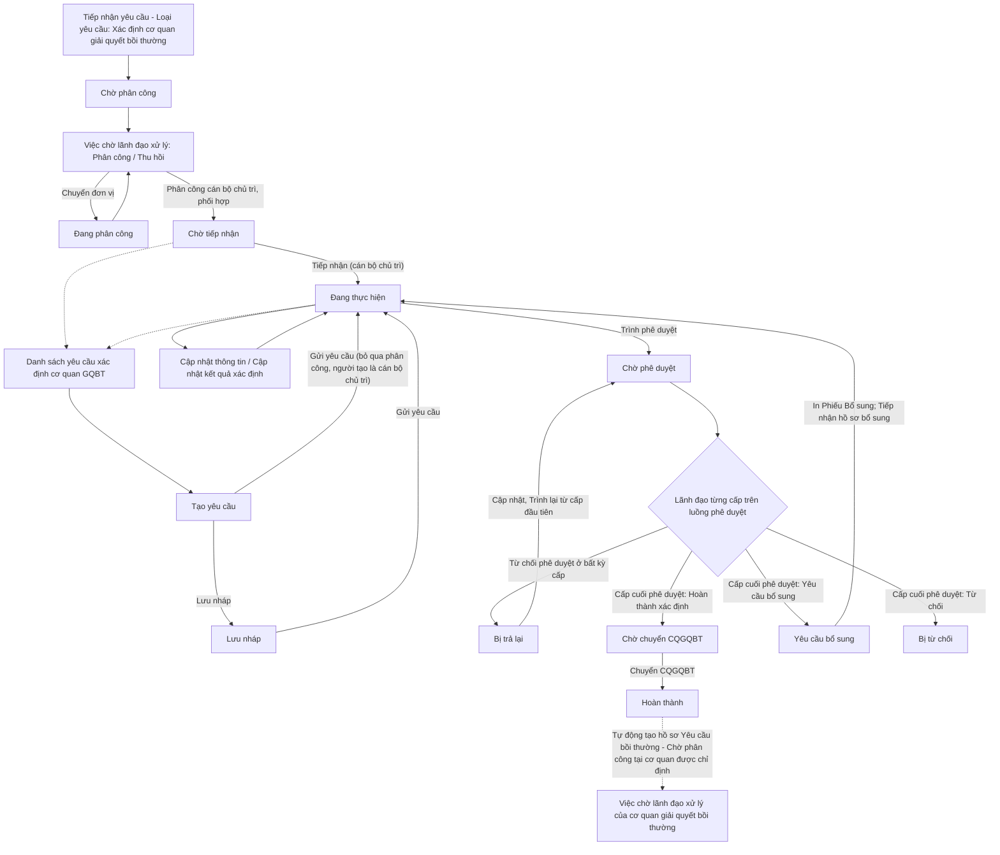
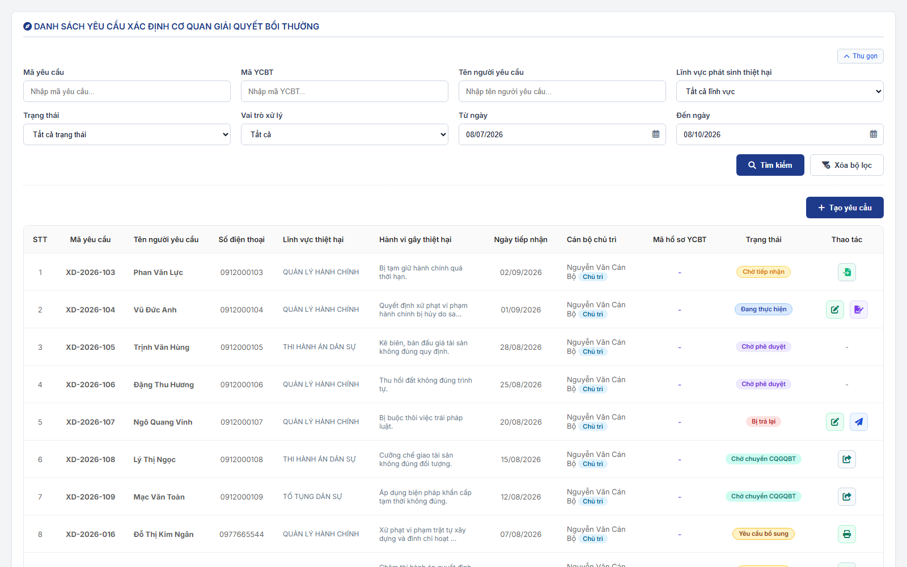
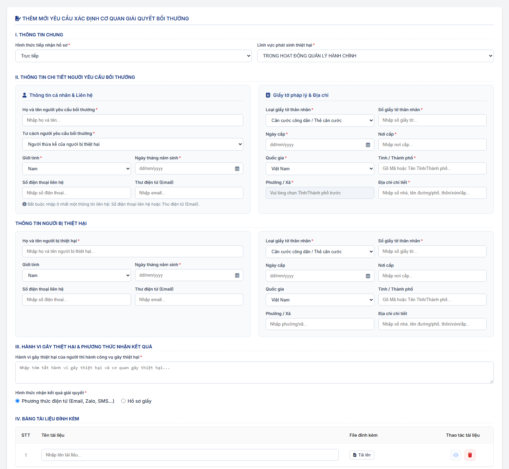
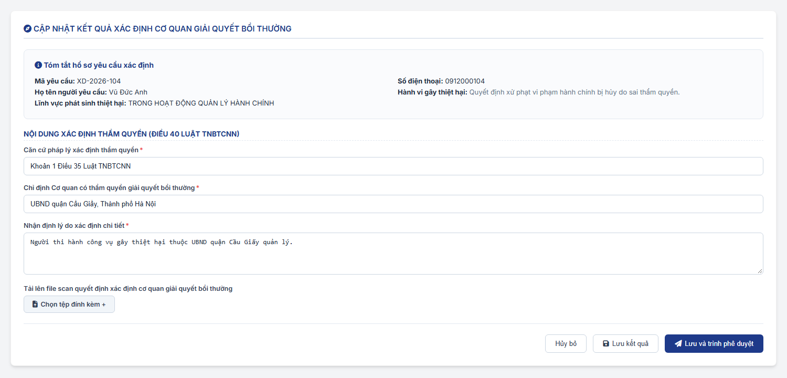
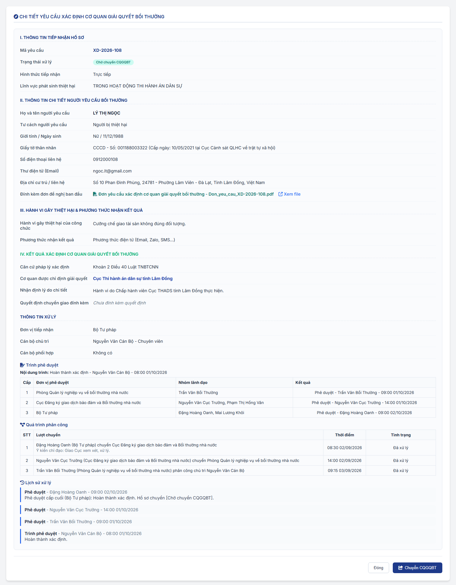
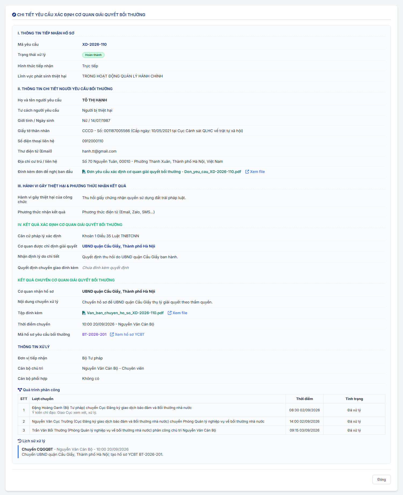
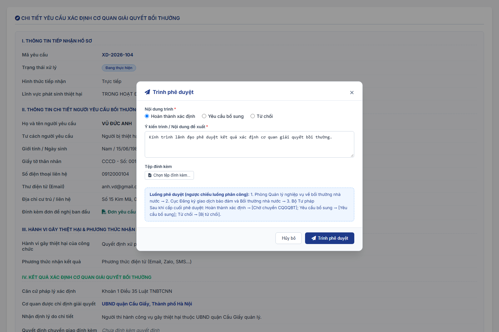
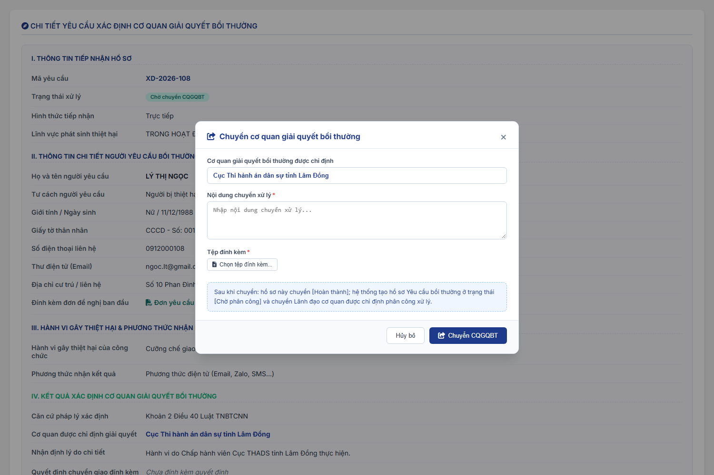
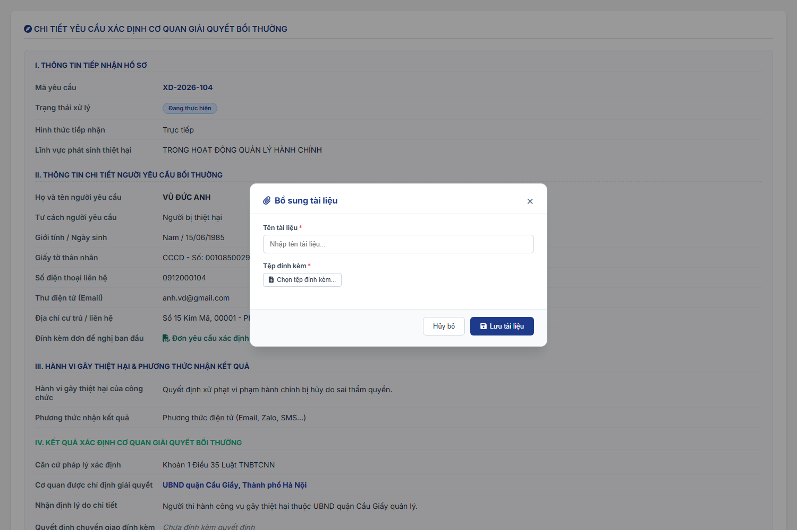
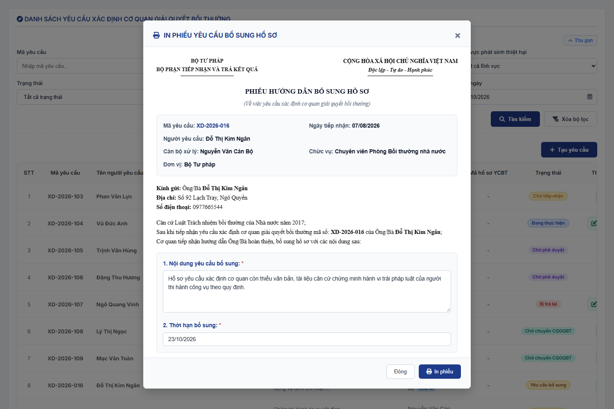

### 4.3.3. Dành cho Cán bộ nghiệp vụ bồi thường nhà nước

#### 4.3.3.1. Nhóm tính năng Xác định cơ quan giải quyết bồi thường

##### 4.3.3.1.1. Mục đích

\- Cho phép người dùng trên Website quản trị (menu `Xác định cơ quan giải quyết bồi thường`, phân hệ Bồi thường nhà nước) quản lý và xử lý hồ sơ yêu cầu xác định cơ quan giải quyết bồi thường, gồm:

+ Hồ sơ được tiếp nhận tại [MH02 - Màn hình Tiếp nhận yêu cầu - Tiếp nhận yêu cầu - Công tác bồi thường nhà nước (Website Quản trị)](SRS_BTNN_GiaiQuyetBT_TiepNhan_YCBT.md#43313-mh02---màn-hình-tiếp-nhận-yêu-cầu), được lãnh đạo phân công cán bộ chủ trì/phối hợp tại [Màn hình Việc chờ lãnh đạo xử lý - Việc chờ lãnh đạo xử lý - Công tác bồi thường nhà nước (Website Quản trị)](SRS_BTNN_ViecChoLanhDaoXuLy.md) và chuyển đến phân hệ ở trạng thái `Chờ tiếp nhận`.
+ Hồ sơ do cán bộ tạo mới trực tiếp tại phân hệ (`Tạo yêu cầu`).

\- Cán bộ chủ trì tiếp nhận, cập nhật kết quả xác định, trình lãnh đạo phê duyệt và sau khi được phê duyệt thì chuyển hồ sơ cho cơ quan giải quyết bồi thường được chỉ định. Khi chuyển, hệ thống tự động tạo hồ sơ yêu cầu bồi thường tại cơ quan được chỉ định.

*a. Phân quyền*

\- Chỉ người dùng thuộc đơn vị được áp dụng giá trị `Xác định cơ quan giải quyết bồi thường` trong [Danh mục Loại yêu cầu - Quản lý danh mục - Quản trị hệ thống (Website Quản trị)](../01_Quan_tri_he_thong/Quan_ly_danh_muc.md) [DM_54] (trường `Đơn vị áp dụng`) mới xử lý được loại yêu cầu này. Theo cấu hình danh mục, giá trị này chỉ áp dụng cho Bộ Tư pháp và các Sở Tư pháp.
+ Đơn vị áp dụng tính cả đơn vị cha: khi chọn đơn vị cha trong `Đơn vị áp dụng` thì toàn bộ đơn vị trực thuộc được áp dụng.
+ Người dùng thuộc đơn vị không được áp dụng: màn hình danh sách hiển thị thông báo *"Loại yêu cầu "Xác định cơ quan giải quyết bồi thường" không áp dụng cho đơn vị [Tên đơn vị] (Danh mục Loại yêu cầu - Đơn vị áp dụng). Chỉ Bộ Tư pháp và Sở Tư pháp được xử lý loại yêu cầu này."* và không hiển thị nút `Tạo yêu cầu`.

\- Quyền thao tác trên từng hồ sơ xác định theo vai trò của người dùng với hồ sơ:

| Vai trò | Quyền |
| :--- | :--- |
| Cán bộ chủ trì | Được lãnh đạo chỉ định khi phân công (01 người) hoặc là người tạo hồ sơ trực tiếp. Thực hiện toàn bộ thao tác xử lý: Tiếp nhận, Cập nhật thông tin, Cập nhật kết quả xác định, Trình phê duyệt/Trình lại, In Phiếu Bổ sung, Tiếp nhận hồ sơ bổ sung, Chuyển CQGQBT. |
| Cán bộ phối hợp | Được lãnh đạo chỉ định khi phân công (nhiều người). Chỉ được xem hồ sơ và `Bổ sung tài liệu`; không được trình phê duyệt và không thực hiện các thao tác xử lý khác. |
| Người tạo | Với hồ sơ `Lưu nháp`: chỉ người tạo nhìn thấy và được Chỉnh sửa, Xóa, Gửi yêu cầu. |
| Lãnh đạo các đơn vị trên luồng | Lãnh đạo (thuộc Nhóm lãnh đạo) của các đơn vị đã chuyển/phân công hồ sơ và các đơn vị trên luồng phê duyệt được xem hồ sơ tại danh sách. Thao tác phân công, phê duyệt, từ chối phê duyệt, thu hồi thực hiện tại [Màn hình Việc chờ lãnh đạo xử lý - Việc chờ lãnh đạo xử lý - Công tác bồi thường nhà nước (Website Quản trị)](SRS_BTNN_ViecChoLanhDaoXuLy.md). |

\- Nhóm lãnh đạo, đơn vị được chuyển và cán bộ được phân công của từng đơn vị lấy theo [Cấu hình luồng xử lý - Cấu hình luồng xử lý - Quản trị hệ thống (Website Quản trị)](../01_Quan_tri_he_thong/Cau_hinh_luong_xu_ly.md).

*b. Điều kiện thực hiện*

\- Người dùng truy cập màn hình `Xác định cơ quan giải quyết bồi thường` trên Website quản trị.

\- Người dùng được phân quyền thực hiện tính năng.

*c. Trạng thái hồ sơ*

| Trạng thái | Ý nghĩa | Hiển thị tại phân hệ |
| :--- | :--- | :--- |
| `Lưu nháp` | Hồ sơ do cán bộ tạo trực tiếp và lưu nháp, chưa gửi. | Có (chỉ người tạo) |
| `Chờ phân công` | Hồ sơ vừa được tiếp nhận, chờ lãnh đạo đơn vị gốc của cán bộ tiếp nhận phân công. | Không (hiển thị tại Tiếp nhận yêu cầu và Việc chờ lãnh đạo xử lý) |
| `Đang phân công` | Hồ sơ đã được lãnh đạo chuyển xuống đơn vị cấp dưới, chờ lãnh đạo đơn vị nhận phân công tiếp. | Không (hiển thị tại Tiếp nhận yêu cầu và Việc chờ lãnh đạo xử lý) |
| `Chờ tiếp nhận` | Lãnh đạo đã phân công cán bộ chủ trì/phối hợp; chờ cán bộ chủ trì tiếp nhận. | Có |
| `Đang thực hiện` | Cán bộ chủ trì đang xử lý hồ sơ (xác minh, cập nhật kết quả xác định, chuẩn bị trình phê duyệt). | Có |
| `Chờ phê duyệt` | Cán bộ chủ trì đã trình; hồ sơ đang chờ lãnh đạo các cấp trên luồng phê duyệt. | Có |
| `Bị trả lại` | Lãnh đạo một cấp phê duyệt đã từ chối phê duyệt; hồ sơ trả về cán bộ chủ trì. | Có |
| `Chờ chuyển CQGQBT` | Cấp phê duyệt cuối cùng đã phê duyệt nội dung `Hoàn thành xác định`; chờ cán bộ chủ trì chuyển cơ quan giải quyết bồi thường. | Có |
| `Yêu cầu bổ sung` | Cấp phê duyệt cuối cùng đã phê duyệt nội dung `Yêu cầu bổ sung`; chờ người yêu cầu nộp bổ sung. | Có |
| `Bị từ chối` | Cấp phê duyệt cuối cùng đã phê duyệt nội dung `Từ chối`. Trạng thái kết thúc. | Có |
| `Hoàn thành` | Đã chuyển cơ quan giải quyết bồi thường và tạo hồ sơ yêu cầu bồi thường. Trạng thái kết thúc. | Có |

*d. Quy tắc trình - phê duyệt*

\- **Luồng phê duyệt**: là luồng ngược chiều luồng phân công thực tế của chính hồ sơ. Hệ thống lấy danh sách các đơn vị đã chuyển/phân công hồ sơ theo thứ tự trong `Quá trình phân công`, đảo ngược và loại bỏ đơn vị trùng (ví dụ phân công Bộ Tư pháp → Cục → Phòng thì phê duyệt Phòng → Cục → Bộ Tư pháp).

\- **Hồ sơ tạo trực tiếp** (không có lượt phân công): luồng phê duyệt đi từ đơn vị của cán bộ chủ trì lên đơn vị gốc theo cây Cơ cấu tổ chức, chỉ gồm các đơn vị có Nhóm lãnh đạo trong Cấu hình luồng xử lý. Nếu không xác định được cấp phê duyệt nào, hệ thống không cho trình và hiển thị *"Chưa xác định được cấp phê duyệt. Vui lòng liên hệ Quản trị hệ thống."*

\- **Phê duyệt tại từng cấp**: bất kỳ tài khoản nào thuộc Nhóm lãnh đạo của đơn vị đang đến lượt đều được xử lý, tại tab `Chờ duyệt` của màn hình Việc chờ lãnh đạo xử lý:
+ `Phê duyệt` (Ý kiến phê duyệt, không bắt buộc): nếu chưa phải cấp cuối, hồ sơ chuyển cấp phê duyệt tiếp theo, giữ trạng thái `Chờ phê duyệt`; nếu là cấp cuối, hồ sơ chuyển trạng thái theo nội dung trình: `Hoàn thành xác định` → `Chờ chuyển CQGQBT`; `Yêu cầu bổ sung` → `Yêu cầu bổ sung`; `Từ chối` → `Bị từ chối`.
+ `Từ chối` (Lý do từ chối phê duyệt, bắt buộc) tại bất kỳ cấp nào: hồ sơ chuyển `Bị trả lại` về cán bộ chủ trì, ghi nhận người trả lại, đơn vị, thời điểm và lý do. Lịch sử xử lý ghi hành động `Từ chối phê duyệt` để phân biệt với nội dung trình `Từ chối` yêu cầu. Khi cán bộ chủ trì trình lại, luồng phê duyệt bắt đầu lại từ cấp phê duyệt đầu tiên.
+ Lãnh đạo cấp dưới được thu hồi kết quả phê duyệt đã chuyển cấp trên khi cấp trên chưa phê duyệt/từ chối.
+ `Phê duyệt` là quyết định phê duyệt thuần túy. Việc ký số văn bản (nếu có) là bước riêng, không gộp vào thao tác `Phê duyệt`.

\- **Kiểm tra đồng thời**: mọi thao tác phân công, phê duyệt, từ chối, thu hồi đều được hệ thống kiểm tra lại trạng thái hồ sơ tại máy chủ trước khi ghi nhận. Nếu hồ sơ đã được người khác xử lý, hệ thống hiển thị *"Hồ sơ đã được xử lý bởi người khác hoặc bạn không có quyền phân công/phê duyệt. Vui lòng tải lại danh sách."*

*e. Ghi chú các quy tắc đang áp dụng theo mặc định (chờ xác nhận nghiệp vụ)*

\- Chọn đơn vị cha trong `Đơn vị áp dụng` của Danh mục Loại yêu cầu thì áp dụng cho toàn bộ đơn vị trực thuộc.

\- Không cho `Chuyển CQGQBT` khi cơ quan được chỉ định chưa được cấu hình luồng phân công.

\- Bắt buộc nhập ít nhất một thông tin liên hệ của người yêu cầu (Số điện thoại liên hệ hoặc Thư điện tử (Email)).

\- Cán bộ phối hợp chỉ được xem hồ sơ và bổ sung tài liệu, không được trình phê duyệt.

\- Hồ sơ tạo trực tiếp tại phân hệ bỏ qua bước phân công, người tạo là cán bộ chủ trì; luồng phê duyệt theo cây đơn vị của người tạo.

\- Sau khi `Yêu cầu bổ sung` được phê duyệt, cán bộ chủ trì thực hiện `Tiếp nhận hồ sơ bổ sung` để chuyển hồ sơ về `Đang thực hiện`.

---

##### 4.3.3.1.2. Sơ đồ luồng nghiệp vụ theo giao diện

---

##### 4.3.3.1.3. MH01 - Màn hình Danh sách yêu cầu xác định cơ quan giải quyết bồi thường

###### 4.3.3.1.3.1. Màn hình

###### 4.3.3.1.3.2. Mô tả thông tin trên màn hình

| Trường thông tin | Kiểu dữ liệu | Bắt buộc | Mặc định | Mô tả |
| :--- | :--- | :--- | :--- | :--- |
| **Khối bộ lọc tìm kiếm** | String(255) | - | - | Control UI: Filter panel dạng thu gọn/mở rộng (Accordion). - Hiển thị phía trên bảng danh sách. - Các tiêu chí có dữ liệu được kết hợp theo điều kiện AND. - Mặc định hiển thị dạng mở rộng. - Cho phép thu gọn/mở rộng khi click vào nút "Thu gọn"/"Mở rộng" ở góc phải khối; khi thu gọn, các giá trị lọc đã nhập được giữ nguyên. |
| Mã yêu cầu | String(50) | Không | Trống | Control UI: Input text. - Placeholder: `Nhập mã yêu cầu...`. - Tìm kiếm gần đúng theo mã yêu cầu xác định cơ quan, không phân biệt hoa thường, có trim khoảng trắng. |
| Mã YCBT | String(50) | Không | Trống | Control UI: Input text. - Placeholder: `Nhập mã YCBT...`. - Tìm kiếm gần đúng theo mã hồ sơ yêu cầu bồi thường được hệ thống tạo khi `Chuyển CQGQBT`. - Nếu hồ sơ chưa có mã YCBT, dữ liệu trên lưới hiển thị `-`. |
| Tên người yêu cầu | String(100) | Không | Trống | Control UI: Input text. - Placeholder: `Nhập tên người yêu cầu...`. - Tìm kiếm gần đúng theo tên người yêu cầu, không phân biệt hoa thường, có trim khoảng trắng. |
| Lĩnh vực phát sinh thiệt hại | Enum(String(100)) | Không | `Tất cả lĩnh vực` | Control UI: Combobox. Tham chiếu danh mục Lĩnh vực phát sinh thiệt hại [DM_22]. |
| Trạng thái | Enum(String(50)) | Không | `Tất cả trạng thái` | Control UI: Combobox. Gồm: + Tất cả trạng thái + Lưu nháp + Chờ tiếp nhận + Đang thực hiện + Chờ phê duyệt + Bị trả lại + Chờ chuyển CQGQBT + Yêu cầu bổ sung + Bị từ chối + Hoàn thành - Không có `Chờ phân công`, `Đang phân công` vì hồ sơ ở hai trạng thái này không hiển thị tại phân hệ. |
| Vai trò xử lý | Enum(String(50)) | Không | `Tất cả` | Control UI: Combobox. Gồm: + Tất cả + Chủ trì: hồ sơ người dùng là cán bộ chủ trì + Phối hợp: hồ sơ người dùng là cán bộ phối hợp |
| Từ ngày | Date | Không | Ngày hiện tại trừ 03 tháng | Control UI: Datepicker. - Định dạng hiển thị `dd/mm/yyyy`. - Có icon lịch. - Lọc theo ngày tiếp nhận từ ngày. |
| Đến ngày | Date | Không | Ngày hiện tại | Control UI: Datepicker. - Định dạng hiển thị `dd/mm/yyyy`. - Có icon lịch. - Lọc theo ngày tiếp nhận đến ngày. |
| Thông báo phạm vi áp dụng | String(500) | - | Ẩn | Control UI: Alert banner. - Chỉ hiển thị khi đơn vị của người dùng không được áp dụng loại yêu cầu `Xác định cơ quan giải quyết bồi thường` (nội dung xem tại mục Phân quyền). |
| **Bảng danh sách yêu cầu xác định cơ quan giải quyết bồi thường** | Text(4000) | - | 20 bản ghi/trang | Control UI: Data grid. - Khi người dùng truy cập màn hình, hệ thống tự động tải trang đầu tiên (Trang 1) với số lượng mặc định 20 bản ghi. - Sắp xếp mặc định: Sắp xếp theo "Thời điểm tiếp nhận" giảm dần (mới nhất hiển thị lên đầu). - **Phạm vi dữ liệu**: chỉ hiển thị hồ sơ người dùng là cán bộ chủ trì, cán bộ phối hợp, người tạo (hồ sơ `Lưu nháp` chỉ người tạo nhìn thấy) hoặc người dùng thuộc Nhóm lãnh đạo của một đơn vị trên luồng phân công/phê duyệt của hồ sơ. Hồ sơ ở trạng thái `Chờ phân công`, `Đang phân công` không hiển thị tại màn hình này. - Cho phép click trực tiếp vào dòng dữ liệu để mở màn hình chi tiết, trừ khi click vào icon thao tác. - Trạng thái có dữ liệu: Hiển thị danh sách các bản ghi kết quả theo cấu trúc các cột quy định. - Trạng thái không có dữ liệu (Empty State): Khi không tìm thấy kết quả phù hợp với điều kiện tìm kiếm, bảng hiển thị duy nhất 01 dòng căn giữa trên toàn bộ chiều rộng bảng (`colspan`), in nghiêng với nội dung theo MessageList dùng chung [MSG-INF-SYS-001]. |
| STT | Integer(10) | - | Tự tăng | Control UI: Text hiển thị (Read-only). - Căn giữa. - Hiển thị số thứ tự theo trang hiện tại. |
| Mã yêu cầu | String(50) | - | Theo dữ liệu | Control UI: Text hiển thị (Read-only). - Căn giữa. - Hiển thị mã yêu cầu xác định cơ quan giải quyết bồi thường. |
| Tên người yêu cầu | String(100) | - | Theo dữ liệu | Control UI: Text hiển thị (Read-only). - Hiển thị tên người yêu cầu. - Nếu chưa có dữ liệu, hiển thị `(Chưa nhập)`. |
| Số điện thoại | String(20) | - | Theo dữ liệu | Control UI: Text hiển thị (Read-only). - Căn giữa. - Nếu chưa có dữ liệu, hiển thị `(Chưa nhập)`. |
| Lĩnh vực thiệt hại | Enum(String(50)) | - | Theo dữ liệu | Control UI: Text hiển thị (Read-only). - Hiển thị lĩnh vực phát sinh thiệt hại theo danh mục [DM_22], bỏ tiền tố `TRONG HOẠT ĐỘNG`. |
| Hành vi gây thiệt hại | String(255) | - | Theo dữ liệu | Control UI: Text hiển thị (Read-only). - Hiển thị tóm tắt hành vi gây thiệt hại. - Nếu nội dung dài hơn giới hạn hiển thị của ô, hệ thống rút gọn và cho phép xem đầy đủ khi rê chuột vào nội dung. |
| Ngày tiếp nhận | Date | - | Theo dữ liệu | Control UI: Text hiển thị (Read-only). - Căn giữa. - Định dạng `dd/mm/yyyy`. |
| Cán bộ chủ trì | String(100) | - | Theo dữ liệu | Control UI: Text hiển thị (Read-only) kèm nhãn vai trò. - Hiển thị họ tên cán bộ chủ trì của hồ sơ; chưa có thì hiển thị `--`. - Kèm nhãn `Chủ trì` khi người dùng là cán bộ chủ trì, nhãn `Phối hợp` khi người dùng là cán bộ phối hợp của hồ sơ. |
| Mã hồ sơ YCBT | String(50) | - | Theo dữ liệu | Control UI: Text hiển thị (Read-only). - Căn giữa. - Hiển thị mã hồ sơ yêu cầu bồi thường được tạo khi `Chuyển CQGQBT`. - Nếu chưa có mã hồ sơ YCBT: Hiển thị `-`. - Liên kết mở hồ sơ YCBT đặt tại [MH04 - Màn hình Chi tiết yêu cầu xác định cơ quan giải quyết bồi thường](#43316-mh04---màn-hình-chi-tiết-yêu-cầu-xác-định-cơ-quan-giải-quyết-bồi-thường). |
| Trạng thái | Enum(String(50)) | - | Theo dữ liệu | Control UI: Badge trạng thái. - Hiển thị badge theo trạng thái hồ sơ (danh sách trạng thái xem tại mục Trạng thái hồ sơ của [Mục đích](#43311-mục-đích)). |
| Thao tác | String(255) | - | Theo trạng thái và vai trò | Control UI: Action Buttons. - Chỉ hiển thị thao tác áp dụng cho trạng thái hồ sơ và vai trò của người dùng; thao tác không áp dụng thì Ẩn. Không có thao tác nào thì hiển thị `-`. - **Tiếp nhận**: Hồ sơ `Chờ tiếp nhận`, người dùng là cán bộ chủ trì. - **Chỉnh sửa thông tin**, **Xóa yêu cầu**: Hồ sơ `Lưu nháp`, người dùng là người tạo. - **Cập nhật kết quả xác định**, **Trình phê duyệt** (hiển thị `Trình lại` khi hồ sơ `Bị trả lại`): Hồ sơ `Đang thực hiện` hoặc `Bị trả lại`, người dùng là cán bộ chủ trì. - **Chuyển CQGQBT**: Hồ sơ `Chờ chuyển CQGQBT`, người dùng là cán bộ chủ trì. - **In Phiếu Bổ sung**: Hồ sơ `Yêu cầu bổ sung`, người dùng là cán bộ chủ trì. - **Bổ sung tài liệu**: Người dùng là cán bộ phối hợp, hồ sơ không ở trạng thái `Hoàn thành`, `Bị từ chối`. - Hồ sơ `Chờ phê duyệt`, `Hoàn thành`, `Bị từ chối` không có thao tác xử lý tại danh sách. |
| Phân trang | Pagination | - | 20 bản ghi/trang | Control UI: Pagination. - Cho phép chọn cấu hình số lượng bản ghi hiển thị (10, 20, 50, 100); mặc định 20 bản ghi/trang. - Hiển thị dải bản ghi: "Hiển thị [từ]-[đến] trong số [tổng số] bản ghi" (khi không có dữ liệu hiển thị 0-0 trong số 0). - Đầy đủ các nút điều hướng trang: Đầu (&#124;&lt;&lt;), Trước (&lt;), các số trang, Sau (&gt;), Cuối (&gt;&gt;&#124;). |

###### 4.3.3.1.3.3. Chức năng trên màn hình

| STT | Tên chức năng | Định dạng | Mô tả |
| :--- | :--- | :--- | :--- |
| 1 | Tìm kiếm | Button | Khi người dùng click nút, hệ thống kiểm tra điều kiện dữ liệu và thực hiện tìm kiếm theo các trường hợp bên dưới: |
|  |  |  | **TH1 - Khoảng ngày không hợp lệ**: Nếu `Từ ngày` lớn hơn `Đến ngày`, hệ thống hiển thị cảnh báo lỗi [MSG-ERR-VAL-007] và không thực hiện tìm kiếm. |
|  |  |  | **TH Hợp lệ (Có dữ liệu phù hợp)**: Hệ thống lọc và hiển thị danh sách các bản ghi thuộc phạm vi dữ liệu của người dùng, thỏa mãn đồng thời các tiêu chí tìm kiếm/lọc đã nhập/chọn, hiển thị kết quả lên bảng và đưa về Trang 1. |
|  |  |  | **TH Không có dữ liệu trả về**: Bảng kết quả hiển thị duy nhất 01 dòng căn giữa trên toàn bộ chiều rộng bảng (`colspan`), in nghiêng với nội dung theo MessageList dùng chung [MSG-INF-SYS-001]; thanh phân trang hiển thị *"Hiển thị 0-0 trong số 0 bản ghi"*, các nút điều hướng trang ở trạng thái khóa mờ (Disabled). |
| 2 | Xóa bộ lọc | Button | Xóa các bộ lọc (gồm cả `Trạng thái`, `Vai trò xử lý`), đưa Từ ngày, Đến ngày về khoảng 03 tháng gần nhất và tải lại danh sách về trang 1. |
| 3 | Tạo yêu cầu | Button | - **Điều kiện hiển thị**: Đơn vị của người dùng được áp dụng loại yêu cầu `Xác định cơ quan giải quyết bồi thường`. - **Hành vi**: Hệ thống mở [MH02 - Màn hình Thêm mới/Chỉnh sửa yêu cầu xác định cơ quan giải quyết bồi thường](#43314-mh02---màn-hình-thêm-mớichỉnh-sửa-yêu-cầu-xác-định-cơ-quan-giải-quyết-bồi-thường) ở ngữ cảnh tạo mới trực tiếp; tiêu đề hiển thị `THÊM MỚI YÊU CẦU XÁC ĐỊNH CƠ QUAN GIẢI QUYẾT BỒI THƯỜNG` và toàn bộ trường thông tin trên form ở trạng thái trống/mặc định ban đầu. |
| 4 | Click dòng dữ liệu | Row click | Khi người dùng click vào dòng dữ liệu, hệ thống xử lý theo các trường hợp bên dưới. |
|  |  |  | **TH1 - Click vào dòng dữ liệu**: Hệ thống mở [MH04 - Màn hình Chi tiết yêu cầu xác định cơ quan giải quyết bồi thường](#43316-mh04---màn-hình-chi-tiết-yêu-cầu-xác-định-cơ-quan-giải-quyết-bồi-thường) của bản ghi được chọn. |
|  |  |  | **TH2 - Click vào icon thao tác trong cột Thao tác**: Không thực hiện row click; thực hiện đúng chức năng của icon được click. |
| 5 | Tiếp nhận | Icon button | Hệ thống mở [MH02 - Màn hình Thêm mới/Chỉnh sửa yêu cầu xác định cơ quan giải quyết bồi thường](#43314-mh02---màn-hình-thêm-mớichỉnh-sửa-yêu-cầu-xác-định-cơ-quan-giải-quyết-bồi-thường) ở ngữ cảnh tiếp nhận hồ sơ được phân công; tiêu đề hiển thị `TIẾP NHẬN YÊU CẦU XÁC ĐỊNH CƠ QUAN GIẢI QUYẾT BỒI THƯỜNG`, tự động kế thừa dữ liệu tiếp nhận ban đầu và cho phép cán bộ chủ trì chỉnh sửa/nhập bổ sung trước khi bấm `Tiếp nhận`. |
| 6 | In Phiếu Bổ sung | Icon button | Hệ thống mở [Popup In Phiếu yêu cầu bổ sung hồ sơ](#433110-popup-in-phiếu-yêu-cầu-bổ-sung-hồ-sơ) để kiểm tra thông tin, quản lý tài liệu kèm theo và thực hiện in Phiếu hướng dẫn bổ sung hồ sơ. |
| 7 | Chỉnh sửa thông tin | Icon button | Hồ sơ `Lưu nháp`: hệ thống mở [MH02 - Màn hình Thêm mới/Chỉnh sửa yêu cầu xác định cơ quan giải quyết bồi thường](#43314-mh02---màn-hình-thêm-mớichỉnh-sửa-yêu-cầu-xác-định-cơ-quan-giải-quyết-bồi-thường) ở chế độ chỉnh sửa nháp và điền sẵn toàn bộ dữ liệu của bản ghi. |
| 8 | Cập nhật kết quả xác định | Icon button | Hồ sơ `Đang thực hiện` hoặc `Bị trả lại`: hệ thống mở [MH03 - Màn hình Cập nhật kết quả xác định cơ quan giải quyết bồi thường](#43315-mh03---màn-hình-cập-nhật-kết-quả-xác-định-cơ-quan-giải-quyết-bồi-thường). |
| 9 | Trình phê duyệt / Trình lại | Icon button | Hồ sơ `Đang thực hiện` (nhãn `Trình phê duyệt`) hoặc `Bị trả lại` (nhãn `Trình lại`): hệ thống mở [Popup Trình phê duyệt](#43317-popup-trình-phê-duyệt). |
| 10 | Chuyển CQGQBT | Icon button | Hồ sơ `Chờ chuyển CQGQBT`: hệ thống mở [Popup Chuyển cơ quan giải quyết bồi thường](#43318-popup-chuyển-cơ-quan-giải-quyết-bồi-thường). |
| 11 | Bổ sung tài liệu | Icon button | Cán bộ phối hợp: hệ thống mở [Popup Bổ sung tài liệu](#43319-popup-bổ-sung-tài-liệu). |
| 12 | Xóa yêu cầu | Icon button | Mở Custom Confirmation Modal xác nhận xóa [MSG-CFM-BTNN-XDCQ-001] (*"Bạn có chắc chắn muốn xóa yêu cầu Lưu nháp này không?"*). Nếu người dùng chọn `Đồng ý`, hệ thống xóa bản ghi `Lưu nháp` khỏi danh sách và hiển thị thông báo thành công [MSG-SUC-BTNN-XDCQ-003] (*"Xóa hồ sơ đã lưu nháp thành công!"*). Nếu người dùng chọn `Hủy bỏ`, đóng modal và giữ nguyên dữ liệu. |

---

##### 4.3.3.1.4. MH02 - Màn hình Thêm mới/Chỉnh sửa yêu cầu xác định cơ quan giải quyết bồi thường

###### 4.3.3.1.4.1. Màn hình

###### 4.3.3.1.4.2. Mô tả thông tin trên màn hình

| Trường thông tin | Kiểu dữ liệu | Bắt buộc | Mặc định | Mô tả |
| :--- | :--- | :--- | :--- | :--- |
| Tiêu đề màn hình | String(255) | - | Theo ngữ cảnh | Control UI: Text heading (Read-only). - Khi mở form do `Tiếp nhận` hồ sơ `Chờ tiếp nhận` đã được phân công: hiển thị `TIẾP NHẬN YÊU CẦU XÁC ĐỊNH CƠ QUAN GIẢI QUYẾT BỒI THƯỜNG`. - Khi `Tạo yêu cầu` trực tiếp tại phân hệ Xác định cơ quan: hiển thị `THÊM MỚI YÊU CẦU XÁC ĐỊNH CƠ QUAN GIẢI QUYẾT BỒI THƯỜNG`. - Khi chỉnh sửa hồ sơ `Lưu nháp` hoặc `Cập nhật thông tin` hồ sơ `Đang thực hiện`/`Bị trả lại`: hiển thị `CHỈNH SỬA YÊU CẦU XÁC ĐỊNH CƠ QUAN GIẢI QUYẾT BỒI THƯỜNG`. |
| **I. THÔNG TIN CHUNG** | String(255) | - | - | Control UI: Section header. - Khối thông tin chung của yêu cầu. |
| Trạng thái hồ sơ | Enum(String(50)) | - | Ẩn khi Thêm mới | Control UI: Badge trạng thái (Read-only). - Khi mở ở chế độ Thêm mới trực tiếp: **không hiển thị**. - Các chế độ còn lại: hiển thị badge trạng thái hiện tại của hồ sơ (`Chờ tiếp nhận`, `Lưu nháp`, `Đang thực hiện` hoặc `Bị trả lại`). |
| Hình thức tiếp nhận hồ sơ | Enum(String(50)) | Có | `Trực tiếp` | Control UI: Combobox. - Giá trị gồm: + `Trực tiếp` + `Nhận qua bưu điện/bưu chính` - Trường được điền sẵn theo dữ liệu kế thừa khi mở form từ `Tiếp nhận`; hồ sơ có giá trị cũ chứa "bưu" được hiển thị là `Nhận qua bưu điện/bưu chính`, các giá trị khác hiển thị là `Trực tiếp`. Cán bộ được phép chọn lại. |
| Lĩnh vực phát sinh thiệt hại | Enum(String(100)) | Có | `TRONG HOẠT ĐỘNG QUẢN LÝ HÀNH CHÍNH` | Control UI: Combobox. - Tham chiếu danh mục Lĩnh vực phát sinh thiệt hại [DM_22]. - Trường được điền sẵn theo dữ liệu kế thừa khi mở form từ `Tiếp nhận` hoặc theo bản ghi khi chỉnh sửa; cán bộ được phép chỉnh sửa. |
| **II. THÔNG TIN CHI TIẾT NGƯỜI YÊU CẦU BỒI THƯỜNG** | String(100) | - | - | Control UI: Section header. - Khối thông tin người yêu cầu bồi thường, gồm 02 cột `Thông tin cá nhân & Liên hệ` và `Giấy tờ pháp lý & Địa chỉ`. |
| Họ và tên người yêu cầu bồi thường | String(100) | Có | Theo ngữ cảnh | Control UI: Input text. - Placeholder: `Nhập họ và tên...`. - Trường được điền sẵn theo dữ liệu kế thừa khi mở form từ `Tiếp nhận` hoặc theo bản ghi khi chỉnh sửa; cán bộ được phép chỉnh sửa. - Khi tạo mới trực tiếp, trường ở trạng thái trống để cán bộ nhập từ đầu. |
| Tư cách người yêu cầu bồi thường | Enum(String(100)) | Có | `Người bị thiệt hại` | Control UI: Combobox. - Giá trị gồm: + `Người bị thiệt hại` + `Người thừa kế của người bị thiệt hại` + `Tổ chức kế thừa quyền, nghĩa vụ của tổ chức bị thiệt hại đã chấm dứt tồn tại` + `Người đại diện theo pháp luật của người bị thiệt hại` + `Cá nhân, pháp nhân được ủy quyền hợp pháp` - Khi chọn giá trị khác `Người bị thiệt hại`, hệ thống hiển thị khối `THÔNG TIN NGƯỜI BỊ THIỆT HẠI`; khi chọn lại `Người bị thiệt hại`, khối được ẩn và dữ liệu trong khối không được lưu. |
| Giới tính | Enum(String(50)) | Có | `Nam` | Control UI: Combobox. - Tham chiếu danh mục Giới tính [DM_23]. |
| Ngày tháng năm sinh | Date | Có | Trống | Control UI: Datepicker. - Placeholder: `dd/mm/yyyy`. - Có icon lịch. |
| Số điện thoại liên hệ | String(20) | Tùy điều kiện | Trống | Control UI: Input text. - Placeholder: `Nhập số điện thoại...`. - Không bắt buộc riêng; bắt buộc nhập ít nhất một trong hai trường `Số điện thoại liên hệ` hoặc `Thư điện tử (Email)`. |
| Thư điện tử (Email) | String(255) | Tùy điều kiện | Trống | Control UI: Input text. - Placeholder: `Nhập email...`. - Không bắt buộc riêng; bắt buộc nhập ít nhất một trong hai trường `Số điện thoại liên hệ` hoặc `Thư điện tử (Email)`. - Dưới hai trường hiển thị dòng hướng dẫn: *"Bắt buộc nhập ít nhất một thông tin liên hệ: Số điện thoại liên hệ hoặc Thư điện tử (Email)."* |
| Loại giấy tờ thân nhân | Enum(String(50)) | Có | `CCCD` | Control UI: Combobox. - Tham chiếu danh mục loại giấy tờ pháp lý [DM_10]. |
| Số giấy tờ thân nhân | String(50) | Có | Trống | Control UI: Input text. - Placeholder: `Nhập số giấy tờ...`. - Nhập số giấy tờ chứng minh tư cách pháp lý của người yêu cầu. |
| Ngày cấp | Date | Có | Trống | Control UI: Datepicker. - Placeholder: `dd/mm/yyyy`. - Có icon lịch. |
| Nơi cấp | String(255) | Có | Trống | Control UI: Input text. - Placeholder: `Nhập nơi cấp...`. - Nhập nơi cấp giấy tờ thân nhân. |
| Quốc gia | Enum(String(50)) | Có | `Việt Nam` | Control UI: Combobox. - Tham chiếu danh mục Quốc tịch/Quốc gia [DM_09]. |
| Tỉnh/Thành phố | Enum(String(100)) / String(100) | Có | Theo ngữ cảnh | Control UI: Combobox có tìm kiếm / Input text. - Nếu `Quốc gia` = `Việt Nam`: Tham chiếu Danh mục Tỉnh/Thành phố [DM_13]. Cho phép gõ tìm kiếm theo Mã hoặc Tên. - Nếu `Quốc gia` khác `Việt Nam`: Hiển thị ô nhập văn bản để người dùng tự do nhập. - Trường được điền sẵn theo dữ liệu kế thừa khi mở form từ `Tiếp nhận` hoặc theo bản ghi khi chỉnh sửa; cán bộ được phép chỉnh sửa. |
| Phường/Xã | Enum(String(100)) / String(100) | Có | Theo ngữ cảnh | Control UI: Combobox có tìm kiếm / Input text. - Phụ thuộc vào `Tỉnh/Thành phố` đã chọn. - Nếu `Quốc gia` = `Việt Nam`: Tham chiếu Danh mục Xã/Phường/Thị trấn [DM_15] (lọc động theo Tỉnh/Thành phố đã chọn). Cho phép gõ tìm kiếm theo Mã hoặc Tên. Nếu chưa chọn Tỉnh/Thành phố thì khóa mờ (Disabled) kèm placeholder *"Vui lòng chọn Tỉnh/Thành phố trước"*. - Nếu `Quốc gia` khác `Việt Nam`: Hiển thị ô nhập văn bản (Input text) để người dùng tự do nhập. - Trường được điền sẵn theo dữ liệu kế thừa khi mở form từ `Tiếp nhận` hoặc theo bản ghi khi chỉnh sửa; cán bộ được phép chỉnh sửa. |
| Địa chỉ chi tiết | Text(1000) / String(500) | Có | Theo ngữ cảnh | Control UI: Input text. - Placeholder: `Nhập số nhà, tên đường/phố, thôn/xóm/ấp...`. - Trường được điền sẵn theo dữ liệu kế thừa khi mở form từ `Tiếp nhận` hoặc theo bản ghi khi chỉnh sửa; cán bộ được phép chỉnh sửa. - Khi tạo mới trực tiếp, trường ở trạng thái trống để cán bộ nhập từ đầu. |
| **THÔNG TIN NGƯỜI BỊ THIỆT HẠI** | Section | - | Ẩn | Control UI: Section header. - Chỉ hiển thị khi `Tư cách người yêu cầu bồi thường` khác `Người bị thiệt hại`. - Gồm cùng bộ trường thông tin với khối người yêu cầu; chỉ 04 trường `Họ và tên người bị thiệt hại`, `Ngày tháng năm sinh`, `Loại giấy tờ thân nhân`, `Số giấy tờ thân nhân` là bắt buộc. - Trường được điền sẵn theo dữ liệu kế thừa khi mở form từ `Tiếp nhận` (dữ liệu đã nhập tại bước Tiếp nhận yêu cầu) hoặc theo bản ghi khi chỉnh sửa. |
| Họ và tên người bị thiệt hại | String(100) | Có | Trống | Control UI: Input text. - Placeholder: `Nhập họ và tên người bị thiệt hại...`. |
| Giới tính | Enum(String(50)) | Không | `Nam` | Control UI: Combobox. - Tham chiếu danh mục Giới tính [DM_23]. |
| Ngày tháng năm sinh | Date | Có | Trống | Control UI: Datepicker. - Placeholder: `dd/mm/yyyy`. - Có icon lịch. |
| Số điện thoại liên hệ | String(20) | Không | Trống | Control UI: Input text. - Placeholder: `Nhập số điện thoại...`. |
| Thư điện tử (Email) | String(255) | Không | Trống | Control UI: Input text. - Placeholder: `Nhập email...`. |
| Loại giấy tờ thân nhân | Enum(String(50)) | Có | `CCCD` | Control UI: Combobox. - Tham chiếu danh mục loại giấy tờ pháp lý [DM_10]. |
| Số giấy tờ thân nhân | String(50) | Có | Trống | Control UI: Input text. - Placeholder: `Nhập số giấy tờ...`. |
| Ngày cấp | Date | Không | Trống | Control UI: Datepicker. - Placeholder: `dd/mm/yyyy`. |
| Nơi cấp | String(255) | Không | Trống | Control UI: Input text. - Placeholder: `Nhập nơi cấp...`. |
| Quốc gia | Enum(String(50)) | Không | `Việt Nam` | Control UI: Combobox. - Tham chiếu danh mục Quốc tịch/Quốc gia [DM_09]. |
| Tỉnh/Thành phố | Enum(String(100)) | Không | Trống | Control UI: Combobox có tìm kiếm. - Tham chiếu Danh mục Tỉnh/Thành phố [DM_13]; placeholder `Gõ Mã hoặc Tên Tỉnh/Thành phố...`. |
| Phường/Xã | String(100) | Không | Trống | Control UI: Input text. - Placeholder: `Nhập phường/xã...`. |
| Địa chỉ chi tiết | String(500) | Không | Trống | Control UI: Input text. - Placeholder: `Nhập số nhà, tên đường/phố, thôn/xóm/ấp...`. |
| **III. HÀNH VI GÂY THIỆT HẠI & PHƯƠNG THỨC NHẬN KẾT QUẢ** | Text(2000) | - | - | Control UI: Section header. - Khối thông tin hành vi và cách nhận kết quả. |
| Hành vi gây thiệt hại của người thi hành công vụ gây thiệt hại | Text(2000) | Có | Trống | Control UI: Textarea. - Placeholder: `Nhập tóm tắt hành vi gây thiệt hại và cơ quan gây thiệt hại...`. - Nhập nội dung hành vi bị phản ánh gây thiệt hại. |
| Hình thức nhận kết quả giải quyết | Enum(String(50)) | Có | `Phương thức điện tử (Email, Zalo, SMS...)` | Control UI: Radio button. - Giá trị gồm: + `Phương thức điện tử (Email, Zalo, SMS...)` + `Hồ sơ giấy` - Lựa chọn hình thức nhận kết quả không làm thay đổi tính bắt buộc của `Thư điện tử (Email)`; áp dụng quy tắc nhập ít nhất một thông tin liên hệ. |
| **IV. BẢNG TÀI LIỆU ĐÍNH KÈM** | List(Object) | Không | Theo hồ sơ tiếp nhận / Trống | Control UI: Data grid. - Cho phép đính kèm nhiều tài liệu liên quan đến hồ sơ yêu cầu xác định cơ quan. - **Quy tắc kế thừa**: Đối với trường hợp mở form do `Tiếp nhận` hồ sơ `Chờ tiếp nhận`, hệ thống tự động kế thừa toàn bộ danh sách tài liệu đã có từ phân hệ **Tiếp nhận yêu cầu** gồm tên tài liệu và file đính kèm. - Cán bộ có thể bấm `Xem file`, `Xóa` file cũ hoặc bấm `Thêm dòng tài liệu` để đính kèm bổ sung tài liệu mới. - Khi tạo mới trực tiếp, bảng có 01 dòng trống; khi chỉnh sửa, bảng hiển thị danh sách tài liệu đã lưu trong bản ghi. |
| STT | Integer(10) | - | Tự tăng | Control UI: Text (Read-only). Căn giữa, tự tăng theo số dòng tài liệu. |
| Tên tài liệu | String(255) | Có khi thêm dòng | Trống | Control UI: Input text. Placeholder `Nhập tên tài liệu...`. Khi tải file lên mà chưa nhập tên, hệ thống lấy tên file (bỏ phần mở rộng) làm tên tài liệu. |
| File đính kèm | File | Không | Trống | Control UI: File upload trigger (`Tải lên`). Cho phép chọn file tài liệu liên quan theo quy tắc file dùng chung (định dạng `.pdf`, `.doc`, `.docx`, `.jpg`, `.png`; tối đa 20MB/file). |
| Thao tác tài liệu | String(255) | - | Theo dòng | Control UI: Icon button group. - Gồm các icon: `Xem file` (khóa mờ khi dòng chưa có file), `Xóa tài liệu`. |

###### 4.3.3.1.4.3. Chức năng trên màn hình

| STT | Tên chức năng | Định dạng | Mô tả |
| :--- | :--- | :--- | :--- |
| 1 | Hủy bỏ | Button | Hệ thống đóng màn hình thêm mới/chỉnh sửa và quay về [MH01 - Màn hình Danh sách yêu cầu xác định cơ quan giải quyết bồi thường](#43313-mh01---màn-hình-danh-sách-yêu-cầu-xác-định-cơ-quan-giải-quyết-bồi-thường). |
| 2 | Lưu nháp | Button | - **Điều kiện hiển thị**: Hiển thị ở ngữ cảnh Tạo mới trực tiếp, Tiếp nhận và Chỉnh sửa hồ sơ `Lưu nháp`; ẩn ở ngữ cảnh `Cập nhật thông tin` hồ sơ `Đang thực hiện`/`Bị trả lại`. - **Hành vi**: Hệ thống lưu tạm dữ liệu đang nhập, không kiểm tra trường bắt buộc, theo ngữ cảnh mở form: |
|  |  |  | **TH1 - Tiếp nhận hồ sơ được phân công**: Hệ thống lưu các thông tin đang nhập/chỉnh sửa, giữ nguyên trạng thái `Chờ tiếp nhận`; hiển thị thông báo *"Đã lưu nháp hồ sơ thành công!"*. |
|  |  |  | **TH2 - Tạo mới trực tiếp tại phân hệ Xác định cơ quan**: Hệ thống sinh mã yêu cầu mới (dạng `XD-[năm]-[số thứ tự]`), ghi nhận ngày hiện tại, người tạo, lưu hồ sơ ở trạng thái `Lưu nháp` và hiển thị thông báo *"Đã lưu nháp hồ sơ yêu cầu thành công!"*. |
|  |  |  | **TH3 - Chỉnh sửa hồ sơ Lưu nháp**: Hệ thống cập nhật dữ liệu bản ghi nháp hiện tại, giữ nguyên trạng thái `Lưu nháp` và hiển thị thông báo *"Đã lưu nháp hồ sơ thành công!"*. |
| 3 | Gửi yêu cầu / Tiếp nhận / Lưu thông tin | Button | Nút chính thay đổi nhãn theo ngữ cảnh: `Tiếp nhận` (ngữ cảnh Tiếp nhận), `Lưu thông tin` (ngữ cảnh Cập nhật thông tin), `Gửi yêu cầu` (Tạo mới, Chỉnh sửa nháp). Khi người dùng click nút, hệ thống kiểm tra dữ liệu và xử lý theo các trường hợp bên dưới: |
|  |  |  | **TH1 - Bỏ trống trường bắt buộc**: Nếu bỏ trống bất kỳ trường bắt buộc nào đang hiển thị trên form (gồm các trường bắt buộc của khối Người bị thiệt hại khi khối đang hiển thị), hệ thống tô viền đỏ các ô lỗi (`.is-invalid`), hiển thị cảnh báo đỏ *"Đây là trường bắt buộc"* [MSG-ERR-VAL-001] dưới ô nhập, hiển thị thông báo *"Vui lòng nhập đầy đủ thông tin bắt buộc!"* và auto-focus vào ô lỗi đầu tiên. Không cho phép lưu. |
|  |  |  | **TH2 - Chưa nhập thông tin liên hệ**: Nếu bỏ trống đồng thời `Số điện thoại liên hệ` và `Thư điện tử (Email)`, hệ thống tô viền đỏ cả hai ô, hiển thị dưới ô nhập *"Nhập ít nhất một trong hai: Số điện thoại liên hệ hoặc Thư điện tử (Email)"* và không cho phép lưu. |
|  |  |  | **TH3 - Hợp lệ, Tiếp nhận hồ sơ được phân công**: Hệ thống lưu toàn bộ thông tin đã kế thừa/chỉnh sửa/bổ sung, chuyển hồ sơ từ `Chờ tiếp nhận` sang `Đang thực hiện`, cập nhật tình trạng lượt phân công gần nhất thành `Đã xử lý` (lãnh đạo không còn thu hồi được), ghi Lịch sử xử lý `Tiếp nhận hồ sơ`; hiển thị thông báo *"Đã lưu hồ sơ [Mã yêu cầu]. Trạng thái: [Đang thực hiện]!"*. |
|  |  |  | **TH4 - Hợp lệ, tạo mới trực tiếp tại phân hệ Xác định cơ quan**: Hệ thống sinh mã yêu cầu, ghi nhận ngày hiện tại, lưu toàn bộ thông tin; người tạo đồng thời là cán bộ chủ trì, đơn vị tiếp nhận là đơn vị gốc của người tạo; hồ sơ chuyển thẳng sang `Đang thực hiện` (bỏ qua các bước `Chờ phân công`, `Chờ tiếp nhận`); ghi Lịch sử xử lý `Tạo yêu cầu`; hiển thị thông báo *"Gửi yêu cầu thành công. Hồ sơ [Mã yêu cầu] chuyển sang [Đang thực hiện]!"*. |
|  |  |  | **TH5 - Hợp lệ, chỉnh sửa hồ sơ Lưu nháp**: Hệ thống cập nhật dữ liệu bản ghi nháp, chuyển hồ sơ sang `Đang thực hiện`, ghi Lịch sử xử lý `Gửi yêu cầu` và hiển thị thông báo *"Đã lưu hồ sơ [Mã yêu cầu]. Trạng thái: [Đang thực hiện]!"*. |
|  |  |  | **TH6 - Hợp lệ, Cập nhật thông tin hồ sơ Đang thực hiện/Bị trả lại**: Hệ thống cập nhật thông tin hồ sơ, giữ nguyên trạng thái, ghi Lịch sử xử lý `Cập nhật thông tin` và hiển thị thông báo *"Đã lưu hồ sơ [Mã yêu cầu]. Trạng thái: [Trạng thái hiện tại]!"*. |
|  |  |  | Sau khi lưu thành công, hệ thống quay về [MH01 - Màn hình Danh sách yêu cầu xác định cơ quan giải quyết bồi thường](#43313-mh01---màn-hình-danh-sách-yêu-cầu-xác-định-cơ-quan-giải-quyết-bồi-thường). |
| 4 | Thêm dòng tài liệu | Button | Khi người dùng click nút, hệ thống chèn thêm 01 dòng trống mới vào `Bảng tài liệu đính kèm` để cán bộ nhập `Tên tài liệu` và bấm `Tải lên` chọn file. |
| 5 | Tải lên | File trigger | Khi người dùng click nút tại dòng tài liệu tương ứng, hệ thống mở trình chọn file trên máy tính và xử lý theo các trường hợp: - **TH1 - Sai định dạng file**: Nếu tệp tin không đúng định dạng cho phép, hiển thị cảnh báo lỗi [MSG-ERR-FILE-001] và không tiếp nhận tệp. - **TH2 - File quá dung lượng**: Nếu dung lượng tệp vượt quá 20MB, hiển thị cảnh báo lỗi [MSG-ERR-FILE-002] và không tiếp nhận tệp. - **TH3 - Hợp lệ**: Tải tệp thành công, hiển thị tên file trên dòng tài liệu và thông báo *"Đính kèm tập tin: [Tên file] thành công!"*. |
| 6 | Xem file | Icon button | Khi người dùng click icon, hệ thống mở xem trước nội dung file đính kèm trong một tab mới của trình duyệt. |
| 7 | Xóa tài liệu | Icon button | Khi người dùng click icon, hệ thống xử lý theo các trường hợp bên dưới: - **TH1 - Dòng đã có tên tài liệu hoặc file**: Hệ thống mở Custom Confirmation Modal xác nhận xóa [MSG-CFM-BTNN-XDCQ-002] (*"Bạn có chắc chắn muốn xóa tài liệu này khỏi bảng không?"*). Nếu người dùng chọn `Đồng ý`, hệ thống xóa dòng tài liệu tương ứng khỏi bảng (nếu là dòng duy nhất thì đưa dòng về trống). Nếu chọn `Hủy bỏ`, đóng modal và giữ nguyên dữ liệu. - **TH2 - Dòng trống**: Hệ thống xóa dòng tài liệu khỏi bảng, không yêu cầu xác nhận. |

---

##### 4.3.3.1.5. MH03 - Màn hình Cập nhật kết quả xác định cơ quan giải quyết bồi thường

###### 4.3.3.1.5.1. Màn hình

\- Màn hình chỉ mở được bởi cán bộ chủ trì đối với hồ sơ ở trạng thái `Đang thực hiện` hoặc `Bị trả lại`.

###### 4.3.3.1.5.2. Mô tả thông tin trên màn hình

| Trường thông tin | Kiểu dữ liệu | Bắt buộc | Mặc định | Mô tả |
| :--- | :--- | :--- | :--- | :--- |
| Tiêu đề màn hình | String(255) | - | - | Control UI: Text heading (Read-only). - Hiển thị `CẬP NHẬT KẾT QUẢ XÁC ĐỊNH CƠ QUAN GIẢI QUYẾT BỒI THƯỜNG`. |
| **Tóm tắt hồ sơ yêu cầu xác định** | String(255) | - | Theo hồ sơ | Control UI: Summary section. - Hiển thị thông tin tóm tắt của hồ sơ đang xử lý. |
| Mã yêu cầu | String(50) | - | Theo hồ sơ | Control UI: Text hiển thị (Read-only). - Hiển thị mã yêu cầu trong khối tóm tắt. |
| Họ tên người yêu cầu | String(100) | - | Theo hồ sơ | Control UI: Text hiển thị (Read-only). - Hiển thị họ tên người yêu cầu trong khối tóm tắt. |
| Lĩnh vực phát sinh thiệt hại | Enum(String(50)) | - | Theo hồ sơ | Control UI: Text hiển thị (Read-only). - Hiển thị lĩnh vực phát sinh thiệt hại trong khối tóm tắt theo danh mục [DM_22]. |
| Số điện thoại | String(20) | - | Theo hồ sơ | Control UI: Text hiển thị (Read-only). - Hiển thị số điện thoại liên hệ trong khối tóm tắt; nếu hồ sơ không có số điện thoại thì hiển thị Thư điện tử (Email). |
| Hành vi gây thiệt hại | String(255) | - | Theo hồ sơ | Control UI: Text hiển thị (Read-only). - Hiển thị tóm tắt hành vi gây thiệt hại trong khối tóm tắt. |
| **NỘI DUNG XÁC ĐỊNH THẨM QUYỀN (ĐIỀU 40 LUẬT TNBTCNN)** | Section | - | - | Control UI: Section header. - Khối nhập kết quả xác định thẩm quyền. |
| Căn cứ pháp lý xác định thẩm quyền | String(2000) | Có | Theo hồ sơ nếu có | Control UI: Input text. - Placeholder: `Nhập căn cứ pháp lý xác định thẩm quyền...`. - Nhập căn cứ pháp lý làm cơ sở xác định cơ quan có thẩm quyền giải quyết bồi thường. |
| Chỉ định Cơ quan có thẩm quyền giải quyết bồi thường | Enum(String(255)) | Có | Theo hồ sơ nếu có | Control UI: Combobox có tìm kiếm. - Placeholder: `Nhập hoặc tìm kiếm cơ quan có thẩm quyền...`. - Cho phép tìm kiếm theo tên đơn vị trong Danh sách đơn vị trên hệ thống. - Người dùng chọn một cơ quan có thẩm quyền giải quyết bồi thường từ kết quả tìm kiếm. - Cơ quan được chọn phải là đơn vị gốc đã được cấu hình luồng phân công thì mới thực hiện được `Chuyển CQGQBT` (kiểm tra tại [Popup Chuyển cơ quan giải quyết bồi thường](#43318-popup-chuyển-cơ-quan-giải-quyết-bồi-thường)). |
| Nhận định lý do xác định chi tiết | Text(2000) | Có | Theo hồ sơ nếu có | Control UI: Textarea. - Placeholder: `Nhập lập luận, phân tích lý do chỉ định cơ quan giải quyết này dựa trên hồ sơ xác minh...`. - Nhập nhận định, phân tích và lý do chỉ định cơ quan giải quyết bồi thường. |
| Tải lên file scan quyết định xác định cơ quan giải quyết bồi thường | File | Không | Theo hồ sơ nếu có | Control UI: File upload. - Cho phép đính kèm file scan quyết định xác định cơ quan giải quyết bồi thường. - Sau khi đính kèm, hiển thị tên file đã chọn. - Chi tiết nghiệp vụ nút thao tác tệp đính kèm xem tại bảng Chức năng trên màn hình. |

###### 4.3.3.1.5.3. Chức năng trên màn hình

| STT | Tên chức năng | Định dạng | Mô tả |
| :--- | :--- | :--- | :--- |
| 1 | Hủy bỏ | Button | Hệ thống đóng màn hình cập nhật kết quả xác định và quay về [MH01 - Màn hình Danh sách yêu cầu xác định cơ quan giải quyết bồi thường](#43313-mh01---màn-hình-danh-sách-yêu-cầu-xác-định-cơ-quan-giải-quyết-bồi-thường). |
| 2 | Lưu kết quả | Button | Khi người dùng click nút, hệ thống kiểm tra dữ liệu và xử lý theo các trường hợp bên dưới. |
|  |  |  | **TH1 - Bỏ trống trường bắt buộc**: Nếu bỏ trống trường bắt buộc, hệ thống hiển thị thông báo lỗi tương ứng: *"Căn cứ pháp lý xác định thẩm quyền bắt buộc phải nhập!"*, *"Cơ quan chỉ định giải quyết bắt buộc phải nhập!"*, *"Nhận định lý do xác định chi tiết bắt buộc phải nhập!"*. Không cho phép lưu. |
|  |  |  | **TH Hợp lệ**: Hệ thống lưu các thông tin kết quả xác định, giữ nguyên trạng thái hồ sơ (`Đang thực hiện` hoặc `Bị trả lại`), ghi Lịch sử xử lý `Cập nhật kết quả xác định`, hiển thị thông báo *"Đã lưu kết quả xác định cơ quan giải quyết bồi thường!"* và mở [MH04 - Màn hình Chi tiết yêu cầu xác định cơ quan giải quyết bồi thường](#43316-mh04---màn-hình-chi-tiết-yêu-cầu-xác-định-cơ-quan-giải-quyết-bồi-thường). |
| 3 | Lưu và trình phê duyệt | Button | Hệ thống xử lý như chức năng `Lưu kết quả`; khi lưu thành công, hệ thống mở tiếp [Popup Trình phê duyệt](#43317-popup-trình-phê-duyệt) với `Nội dung trình` chọn sẵn `Hoàn thành xác định`. |
| 4 | Chọn tệp đính kèm + | File trigger | Khi người dùng click nút, hệ thống mở trình chọn file trên máy tính và xử lý theo các trường hợp: - **TH1 - Sai định dạng file**: Nếu tệp tin không đúng định dạng cho phép, hiển thị cảnh báo lỗi [MSG-ERR-FILE-001] và không tiếp nhận tệp. - **TH2 - File quá dung lượng**: Nếu dung lượng tệp vượt quá 20MB, hiển thị cảnh báo lỗi [MSG-ERR-FILE-002] và không tiếp nhận tệp. - **TH3 - Hợp lệ**: Tải tệp thành công, hiển thị tên file kèm liên kết "Xem file" (mở tab mới) và nút "Xóa file". |
| 5 | Xem file | Link | Khi người dùng click link, hệ thống mở xem trước nội dung file đính kèm trong một tab mới của trình duyệt. |
| 6 | Xóa file | Link | Mở Custom Confirmation Modal xác nhận (*"Bạn có chắc chắn muốn gỡ tệp đính kèm này không?"*). Nếu người dùng chọn `Đồng ý`, hệ thống gỡ file và hiển thị thông báo *"Đã gỡ tệp đính kèm!"*. Nếu chọn `Hủy bỏ`, đóng modal và giữ nguyên file đính kèm. |

---

##### 4.3.3.1.6. MH04 - Màn hình Chi tiết yêu cầu xác định cơ quan giải quyết bồi thường

###### 4.3.3.1.6.1. Màn hình

\- Màn hình mở từ [MH01 - Màn hình Danh sách yêu cầu xác định cơ quan giải quyết bồi thường](#43313-mh01---màn-hình-danh-sách-yêu-cầu-xác-định-cơ-quan-giải-quyết-bồi-thường) hoặc từ liên kết hồ sơ tại các màn hình khác (Việc chờ lãnh đạo xử lý, Giải quyết yêu cầu bồi thường). Khi mở từ liên kết ở chế độ chỉ xem (tham số `readonly`), màn hình chỉ hiển thị thông tin và nút `Đóng`, không hiển thị thao tác xử lý.

###### 4.3.3.1.6.2. Mô tả thông tin trên màn hình

| Trường thông tin | Kiểu dữ liệu | Bắt buộc | Mặc định | Mô tả |
| :--- | :--- | :--- | :--- | :--- |
| Tiêu đề màn hình | String(255) | - | - | Control UI: Text heading (Read-only). - Hiển thị `CHI TIẾT YÊU CẦU XÁC ĐỊNH CƠ QUAN GIẢI QUYẾT BỒI THƯỜNG`. |
| Khối thông báo | Text(2000) | - | Ẩn | Control UI: Alert banner (Read-only). Hiển thị theo trạng thái hồ sơ: - **Bị trả lại**: tiêu đề `HỒ SƠ BỊ TRẢ LẠI`; nội dung *"[Người từ chối] ([Đơn vị]) từ chối phê duyệt lúc [hh:mm dd/mm/yyyy]."*, `Lý do: [Lý do từ chối phê duyệt]` và ghi chú *"Cán bộ chủ trì cập nhật hồ sơ và trình lại; luồng phê duyệt bắt đầu lại từ cấp phê duyệt đầu tiên."* - **Yêu cầu bổ sung**: tiêu đề `YÊU CẦU BỔ SUNG HỒ SƠ`; nội dung là Nội dung yêu cầu bổ sung (nội dung trình `Yêu cầu bổ sung` đã được phê duyệt hoặc nội dung đã chỉnh sửa tại lần in Phiếu gần nhất). - **Chế độ chỉ xem**: *"Chế độ xem: mở từ liên kết hồ sơ liên quan, không thực hiện thao tác xử lý."* |
| **THÔNG TIN TỪ CHỐI TIẾP NHẬN** | String(255) | - | Ẩn | Control UI: Section header. - Chỉ hiển thị khi trạng thái hồ sơ là `Bị từ chối`. |
| Lý do bị từ chối | Text(2000) | - | Theo hồ sơ | Dạng chỉ đọc. Hiển thị `Ý kiến trình / Nội dung đề xuất` của lần trình `Từ chối` đã được cấp cuối phê duyệt. |
| Văn bản đính kèm | File | - | Theo hồ sơ | Dạng chỉ đọc. Hiển thị tệp đính kèm của lần trình `Từ chối` kèm liên kết "Xem file"; không có tệp thì hiển thị *"Không có tệp đính kèm"*. |
| **I. THÔNG TIN TIẾP NHẬN HỒ SƠ** | String(255) | - | - | Control UI: Section header. - Khối thông tin tiếp nhận hồ sơ. |
| Mã yêu cầu | String(50) | - | Theo hồ sơ | Dạng chỉ đọc. Hiển thị theo hồ sơ. |
| Trạng thái xử lý | Enum(String(50)) | - | Theo hồ sơ | Control UI: Badge trạng thái (Read-only). Hiển thị theo trạng thái hồ sơ. |
| Hình thức tiếp nhận | Enum(String(50)) | - | Theo hồ sơ | Dạng chỉ đọc. Hiển thị `Trực tiếp` hoặc `Nhận qua bưu điện/bưu chính`. |
| Thời điểm tiếp nhận | Datetime | - | Ẩn khi tạo trực tiếp | Dạng chỉ đọc. Hiển thị theo hồ sơ. - **Điều kiện hiển thị**: Ẩn khi hồ sơ được tạo mới trực tiếp tại phân hệ Xác định cơ quan; chỉ hiển thị khi hồ sơ được tiếp nhận từ phân hệ Tiếp nhận yêu cầu. |
| Cán bộ tiếp nhận | String(255) | - | Theo hồ sơ | Dạng chỉ đọc. Hiển thị theo hồ sơ. |
| Lĩnh vực phát sinh thiệt hại | Enum(String(50)) | - | Theo hồ sơ | Dạng chỉ đọc. Hiển thị theo hồ sơ. |
| **II. THÔNG TIN CHI TIẾT NGƯỜI YÊU CẦU BỒI THƯỜNG** | String(100) | - | - | Control UI: Section header. - Khối thông tin người yêu cầu bồi thường. |
| Họ và tên người yêu cầu | String(100) | - | Theo hồ sơ | Dạng chỉ đọc. Hiển thị theo hồ sơ (in hoa). |
| Tư cách người yêu cầu | String(100) | - | Theo hồ sơ | Dạng chỉ đọc. Hiển thị theo hồ sơ. |
| Giới tính / Ngày sinh | Date | - | Theo hồ sơ | Dạng chỉ đọc. Hiển thị theo hồ sơ. |
| Giấy tờ thân nhân | String(255) | - | Theo hồ sơ | Dạng chỉ đọc. Hiển thị `[Loại giấy tờ] - Số: [Số giấy tờ] (Cấp ngày: [Ngày cấp] tại [Nơi cấp])`. |
| Số điện thoại liên hệ | String(20) | - | Theo hồ sơ | Dạng chỉ đọc. Không có dữ liệu thì hiển thị `Chưa cung cấp`. |
| Thư điện tử (Email) | String(255) | - | Theo hồ sơ | Dạng chỉ đọc. Không có dữ liệu thì hiển thị `Chưa cung cấp`. |
| Địa chỉ cư trú / liên hệ | String(500) | - | Theo hồ sơ | Dạng chỉ đọc. Hiển thị `[Địa chỉ chi tiết], [Phường/Xã], [Tỉnh/Thành phố], [Quốc gia]`. |
| Đính kèm đơn đề nghị ban đầu | File | - | Theo hồ sơ | Dạng chỉ đọc. Hiển thị danh sách tài liệu `[Tên tài liệu] - [Tên file]` kèm liên kết "Xem file". Tài liệu do cán bộ phối hợp bổ sung hiển thị thêm `(Phối hợp: [Họ tên cán bộ phối hợp])`. Không có tài liệu thì hiển thị *"Không có file đính kèm"*. |
| **THÔNG TIN NGƯỜI BỊ THIỆT HẠI** | Section | - | Ẩn | Control UI: Section header. - Chỉ hiển thị khi `Tư cách người yêu cầu` khác `Người bị thiệt hại` và hồ sơ có thông tin người bị thiệt hại. |
| Họ và tên người bị thiệt hại | String(100) | - | Theo hồ sơ | Dạng chỉ đọc. Hiển thị theo hồ sơ (in hoa). |
| Giới tính / Ngày sinh | String(100) | - | Theo hồ sơ | Dạng chỉ đọc. Hiển thị theo hồ sơ. |
| Giấy tờ thân nhân | String(255) | - | Theo hồ sơ | Dạng chỉ đọc. Hiển thị `[Loại giấy tờ] - Số: [Số giấy tờ] (Cấp ngày: [Ngày cấp] tại [Nơi cấp])`. |
| Liên hệ | String(255) | - | Theo hồ sơ | Dạng chỉ đọc. Hiển thị `[Số điện thoại] / [Email]`; không có dữ liệu thì hiển thị `Chưa cung cấp`. |
| Địa chỉ | String(500) | - | Theo hồ sơ | Dạng chỉ đọc. Hiển thị `[Địa chỉ chi tiết], [Phường/Xã], [Tỉnh/Thành phố], [Quốc gia]`; không có dữ liệu thì hiển thị `Chưa cung cấp`. |
| **III. HÀNH VI GÂY THIỆT HẠI & PHƯƠNG THỨC NHẬN KẾT QUẢ** | Text(2000) | - | - | Control UI: Section header. - Khối hành vi và phương thức nhận kết quả. |
| Hành vi gây thiệt hại của công chức | String(255) | - | Theo hồ sơ | Dạng chỉ đọc. Hiển thị theo hồ sơ. |
| Phương thức nhận kết quả | Text(2000) | - | Theo hồ sơ | Dạng chỉ đọc. Hiển thị `Phương thức điện tử (Email, Zalo, SMS...)` hoặc `Hồ sơ giấy`. |
| **IV. KẾT QUẢ XÁC ĐỊNH CƠ QUAN GIẢI QUYẾT BỒI THƯỜNG** | String(255) | - | Ẩn | Control UI: Section header. - Chỉ hiển thị khi hồ sơ đã có thông tin kết quả xác định hoặc ở trạng thái `Chờ phê duyệt`, `Chờ chuyển CQGQBT`, `Hoàn thành`. Trường chưa có dữ liệu hiển thị `Chưa cập nhật`. |
| Căn cứ pháp lý xác định | Text(2000) | - | Theo hồ sơ | Dạng chỉ đọc. Hiển thị theo hồ sơ. |
| Cơ quan được chỉ định giải quyết | String(255) | - | Theo hồ sơ | Dạng chỉ đọc. Hiển thị theo hồ sơ. |
| Nhận định lý do chi tiết | Text(2000) | - | Theo hồ sơ | Dạng chỉ đọc. Hiển thị theo hồ sơ. |
| Quyết định chuyển giao đính kèm | File | - | Theo hồ sơ | Dạng chỉ đọc. Hiển thị file scan quyết định kèm liên kết "Xem file"; chưa có thì hiển thị *"Chưa đính kèm quyết định"*. |
| **KẾT QUẢ CHUYỂN CƠ QUAN GIẢI QUYẾT BỒI THƯỜNG** | Section | - | Ẩn | Control UI: Section header. - Chỉ hiển thị khi hồ sơ đã `Chuyển CQGQBT` (trạng thái `Hoàn thành`, đã có Mã hồ sơ YCBT). |
| Cơ quan nhận hồ sơ | String(255) | - | Theo hồ sơ | Dạng chỉ đọc. Cơ quan giải quyết bồi thường được chỉ định đã nhận hồ sơ. |
| Nội dung chuyển xử lý | Text(2000) | - | Theo hồ sơ | Dạng chỉ đọc. Nội dung đã nhập tại [Popup Chuyển cơ quan giải quyết bồi thường](#43318-popup-chuyển-cơ-quan-giải-quyết-bồi-thường). |
| Tệp đính kèm | File | - | Theo hồ sơ | Dạng chỉ đọc. Danh sách tệp đã đính kèm khi chuyển, kèm liên kết "Xem file". |
| Thời điểm chuyển | Datetime | - | Theo hồ sơ | Dạng chỉ đọc. Hiển thị `[hh:mm dd/mm/yyyy] - [Họ tên người chuyển]`. |
| Mã hồ sơ yêu cầu bồi thường | String(50) | - | Theo hồ sơ | Dạng chỉ đọc. Hiển thị mã hồ sơ yêu cầu bồi thường được hệ thống tạo khi chuyển, kèm liên kết `Xem hồ sơ YCBT`. |
| **THÔNG TIN XỬ LÝ** | Section | - | - | Control UI: Section header. - Thông tin xử lý theo luồng phân công - phê duyệt. |
| Đơn vị tiếp nhận | String(255) | - | Theo hồ sơ | Dạng chỉ đọc. Đơn vị gốc tiếp nhận hồ sơ (đơn vị gốc của cán bộ tiếp nhận hoặc của người tạo trực tiếp). |
| Cán bộ chủ trì | String(255) | - | Theo hồ sơ | Dạng chỉ đọc. Hiển thị `[Họ tên] - [Chức danh]`; chưa có thì hiển thị `Chưa phân công`. |
| Cán bộ phối hợp | String(500) | - | Theo hồ sơ | Dạng chỉ đọc. Danh sách họ tên cán bộ phối hợp; không có thì hiển thị `Không có`. |
| Trình phê duyệt | Object | - | Ẩn | Control UI: Text + Data grid (Read-only). - Chỉ hiển thị khi hồ sơ đã trình phê duyệt. - Dòng `Nội dung trình: [Nội dung trình] - [Người trình] - [Thời điểm trình]` kèm Ý kiến trình. - Bảng các cấp phê duyệt gồm cột: `Cấp`, `Đơn vị phê duyệt`, `Nhóm lãnh đạo`, `Kết quả`. Cột `Kết quả` hiển thị: `Phê duyệt - [Người] - [Thời điểm] ([Ý kiến])`, `Từ chối phê duyệt - [Người] - [Thời điểm] ([Lý do])`, `Đang chờ phê duyệt` (kèm `- Đã xem lúc [hh:mm dd/mm/yyyy]` khi lãnh đạo đã mở xem) hoặc `Chưa đến lượt`. |
| Quá trình phân công | List(Object) | - | Theo hồ sơ | Control UI: Data grid (Read-only). - Cột: `STT`, `Lượt chuyển` (*"[Người chuyển] ([Đơn vị]) chuyển [Đơn vị nhận]"* hoặc *"[Người phân công] ([Đơn vị]) phân công chủ trì [Cán bộ chủ trì], phối hợp [Cán bộ phối hợp]"*, kèm `Ý kiến chỉ đạo` nếu có), `Thời điểm`, `Tình trạng` (`Đã xử lý`, `Chưa xử lý - Chưa xem` hoặc `Chưa xử lý - Đã xem lúc [hh:mm dd/mm/yyyy]`). - Hồ sơ chưa có lượt chuyển (tạo trực tiếp) hiển thị *"Chưa có lượt chuyển."* |
| Lịch sử xử lý | List(Object) | - | Theo hồ sơ | Control UI: Timeline (Read-only). - Sắp xếp mới nhất lên đầu; mỗi dòng gồm `[Hành động] - [Người thực hiện] - [Thời điểm]` và nội dung (nếu có). Hành động từ chối hiển thị viền đỏ. - Chưa có dữ liệu thì hiển thị *"Chưa có lịch sử xử lý."* |

###### 4.3.3.1.6.3. Chức năng trên màn hình

| STT | Tên chức năng | Định dạng | Mô tả |
| :--- | :--- | :--- | :--- |
| 1 | Đóng | Button | Hệ thống đóng màn hình chi tiết và quay về [MH01 - Màn hình Danh sách yêu cầu xác định cơ quan giải quyết bồi thường](#43313-mh01---màn-hình-danh-sách-yêu-cầu-xác-định-cơ-quan-giải-quyết-bồi-thường); trường hợp mở từ màn hình khác thì quay về màn hình đã mở. |
| 2 | Bổ sung tài liệu | Button | Chỉ hiển thị cho cán bộ phối hợp khi hồ sơ không ở trạng thái `Hoàn thành`, `Bị từ chối`. Khi click, hệ thống mở [Popup Bổ sung tài liệu](#43319-popup-bổ-sung-tài-liệu). |
| 3 | Tiếp nhận | Button | Chỉ hiển thị cho cán bộ chủ trì khi trạng thái `Chờ tiếp nhận`. Khi click, hệ thống mở [MH02 - Màn hình Thêm mới/Chỉnh sửa yêu cầu xác định cơ quan giải quyết bồi thường](#43314-mh02---màn-hình-thêm-mớichỉnh-sửa-yêu-cầu-xác-định-cơ-quan-giải-quyết-bồi-thường) ở chế độ tiếp nhận và kế thừa dữ liệu từ bước **Tiếp nhận yêu cầu**. |
| 4 | Cập nhật thông tin | Button | Chỉ hiển thị cho cán bộ chủ trì khi trạng thái `Đang thực hiện` hoặc `Bị trả lại`. Khi click, hệ thống mở [MH02 - Màn hình Thêm mới/Chỉnh sửa yêu cầu xác định cơ quan giải quyết bồi thường](#43314-mh02---màn-hình-thêm-mớichỉnh-sửa-yêu-cầu-xác-định-cơ-quan-giải-quyết-bồi-thường) ở chế độ cập nhật thông tin (nút chính `Lưu thông tin`, không có `Lưu nháp`). |
| 5 | Cập nhật kết quả xác định | Button | Chỉ hiển thị cho cán bộ chủ trì khi trạng thái `Đang thực hiện` hoặc `Bị trả lại`. Khi click, hệ thống mở [MH03 - Màn hình Cập nhật kết quả xác định cơ quan giải quyết bồi thường](#43315-mh03---màn-hình-cập-nhật-kết-quả-xác-định-cơ-quan-giải-quyết-bồi-thường). |
| 6 | Trình phê duyệt / Trình lại | Button | Chỉ hiển thị cho cán bộ chủ trì khi trạng thái `Đang thực hiện` (nhãn `Trình phê duyệt`) hoặc `Bị trả lại` (nhãn `Trình lại`). Khi click, hệ thống mở [Popup Trình phê duyệt](#43317-popup-trình-phê-duyệt). |
| 7 | Chuyển CQGQBT | Button | Chỉ hiển thị cho cán bộ chủ trì khi trạng thái `Chờ chuyển CQGQBT`. Khi click, hệ thống mở [Popup Chuyển cơ quan giải quyết bồi thường](#43318-popup-chuyển-cơ-quan-giải-quyết-bồi-thường). |
| 8 | Gửi yêu cầu | Button | Chỉ hiển thị cho người tạo khi trạng thái `Lưu nháp`. Khi click, hệ thống kiểm tra dữ liệu: - **TH1 - Thiếu thông tin bắt buộc**: hiển thị thông báo *"Vui lòng nhập đầy đủ thông tin bắt buộc trước khi gửi yêu cầu!"* hoặc *"Nhập ít nhất một trong hai: Số điện thoại liên hệ hoặc Thư điện tử (Email)!"* và mở [MH02 - Màn hình Thêm mới/Chỉnh sửa yêu cầu xác định cơ quan giải quyết bồi thường](#43314-mh02---màn-hình-thêm-mớichỉnh-sửa-yêu-cầu-xác-định-cơ-quan-giải-quyết-bồi-thường) để bổ sung. - **TH2 - Hợp lệ**: chuyển trạng thái sang `Đang thực hiện`, ghi Lịch sử xử lý `Gửi yêu cầu`, hiển thị thông báo *"Đã gửi yêu cầu. Hồ sơ chuyển sang [Đang thực hiện]!"* và tải lại màn hình chi tiết. |
| 9 | In Phiếu Bổ sung | Button | - **Điều kiện hiển thị**: Cán bộ chủ trì, hồ sơ ở trạng thái `Yêu cầu bổ sung`. - **Hành vi**: Hệ thống mở [Popup In Phiếu yêu cầu bổ sung hồ sơ](#433110-popup-in-phiếu-yêu-cầu-bổ-sung-hồ-sơ) để kiểm tra thông tin, quản lý tài liệu kèm theo và thực hiện in Phiếu hướng dẫn bổ sung hồ sơ. |
| 10 | Tiếp nhận hồ sơ bổ sung | Button | - **Điều kiện hiển thị**: Cán bộ chủ trì, hồ sơ ở trạng thái `Yêu cầu bổ sung`. - **Hành vi**: Hệ thống mở Custom Confirmation Modal *"Xác nhận đã nhận hồ sơ bổ sung của yêu cầu [Mã yêu cầu]? Hồ sơ chuyển [Đang thực hiện]."*. Nếu chọn `Đồng ý`: hồ sơ chuyển `Đang thực hiện`, ghi Lịch sử xử lý `Tiếp nhận hồ sơ bổ sung`, hiển thị thông báo *"Đã tiếp nhận hồ sơ bổ sung!"*. Nếu chọn `Hủy bỏ`: đóng modal, giữ nguyên trạng thái. |
| 11 | Xem file | Link | Cho phép xem file tại một tab riêng. |
| 12 | Xem hồ sơ YCBT | Text link | Khi người dùng click liên kết `Xem hồ sơ YCBT` cạnh `Mã hồ sơ yêu cầu bồi thường`: - Hệ thống mở [MH05 - Màn hình Xem chi tiết hồ sơ yêu cầu bồi thường - Giải quyết yêu cầu bồi thường - Công tác bồi thường nhà nước (Website Quản trị)](SRS_BTNN_GiaiQuyetBT_GiaiQuyet_YCBT.md#43317-mh05---màn-hình-xem-chi-tiết-hồ-sơ-yêu-cầu-bồi-thường) tương ứng với mã hồ sơ. - Thanh Menu Sidebar bên trái tự động chuyển trạng thái active/focus vào đúng chức năng **`Giải quyết yêu cầu bồi thường`**. |

---

##### 4.3.3.1.7. Popup Trình phê duyệt

###### 4.3.3.1.7.1. Màn hình

\- Popup mở khi cán bộ chủ trì click `Trình phê duyệt`/`Trình lại` tại MH01, MH04 hoặc `Lưu và trình phê duyệt` tại MH03, đối với hồ sơ `Đang thực hiện` hoặc `Bị trả lại`.

###### 4.3.3.1.7.2. Mô tả thông tin trên màn hình

| Trường thông tin | Kiểu dữ liệu | Bắt buộc | Mặc định | Mô tả |
| :--- | :--- | :--- | :--- | :--- |
| Tiêu đề popup | String(255) | - | `Trình phê duyệt` | Control UI: Heading text (Read-only). |
| Nội dung trình | Enum(String(50)) | Có | `Hoàn thành xác định` | Control UI: Radio button. - Giá trị gồm: + `Hoàn thành xác định`: đề xuất hoàn thành xác định cơ quan giải quyết bồi thường. + `Yêu cầu bổ sung`: đề xuất yêu cầu người yêu cầu bổ sung hồ sơ. + `Từ chối`: đề xuất từ chối yêu cầu xác định cơ quan giải quyết bồi thường. |
| Ý kiến trình / Nội dung đề xuất | Text(2000) | Có | Trống | Control UI: Textarea. - Placeholder: `Nhập ý kiến trình...`. - Khi Nội dung trình là `Yêu cầu bổ sung`: nội dung này là Nội dung yêu cầu bổ sung của hồ sơ (dùng tại [Popup In Phiếu yêu cầu bổ sung hồ sơ](#433110-popup-in-phiếu-yêu-cầu-bổ-sung-hồ-sơ)). - Khi Nội dung trình là `Từ chối`: nội dung này là Lý do bị từ chối hiển thị tại MH04. |
| Tệp đính kèm | List(File) | Không | Trống | Control UI: Multi-file upload (`Chọn tệp đính kèm...`). - Danh sách tệp đã chọn hiển thị tên file kèm `Xem file`, `Xóa file`. |
| Luồng phê duyệt dự kiến | Text(1000) | - | Theo hồ sơ | Control UI: Info box (Read-only). - Hiển thị *"Luồng phê duyệt (ngược chiều luồng phân công): 1. [Đơn vị] → 2. [Đơn vị] → ..."* theo quy tắc tại mục Quy tắc trình - phê duyệt của [Mục đích](#43311-mục-đích). - Hiển thị kết quả sau khi cấp cuối phê duyệt: *"Hoàn thành xác định → [Chờ chuyển CQGQBT]; Yêu cầu bổ sung → [Yêu cầu bổ sung]; Từ chối → [Bị từ chối]."* - Hồ sơ `Bị trả lại` hiển thị thêm *"Hồ sơ trình lại bắt đầu từ cấp phê duyệt đầu tiên."* - Không xác định được cấp phê duyệt: hiển thị *"Chưa xác định được cấp phê duyệt. Vui lòng liên hệ Quản trị hệ thống."* |

###### 4.3.3.1.7.3. Chức năng trên màn hình

| STT | Tên chức năng | Định dạng | Mô tả |
| :--- | :--- | :--- | :--- |
| 1 | Hủy bỏ | Button | Hệ thống đóng popup, giữ nguyên trạng thái hồ sơ. Tương đương click biểu tượng `×`. |
| 2 | Trình phê duyệt | Button | Khi người dùng click nút, hệ thống kiểm tra dữ liệu và xử lý theo các trường hợp bên dưới. |
|  |  |  | **TH1 - Bỏ trống Ý kiến trình**: tô viền đỏ ô nhập, hiển thị *"Đây là trường bắt buộc"* [MSG-ERR-VAL-001], focus vào ô lỗi. Không cho phép trình. |
|  |  |  | **TH2 - Trình Hoàn thành xác định khi chưa có kết quả xác định**: Nếu hồ sơ chưa có đủ `Căn cứ pháp lý xác định thẩm quyền`, `Cơ quan được chỉ định`, `Nhận định lý do xác định chi tiết`, hệ thống hiển thị *"Vui lòng cập nhật kết quả xác định (căn cứ, cơ quan được chỉ định, lý do) trước khi trình Hoàn thành xác định!"* và không cho phép trình. |
|  |  |  | **TH3 - Không đủ điều kiện trình** (hệ thống kiểm tra lại tại máy chủ): người dùng không phải cán bộ chủ trì (*"Chỉ cán bộ chủ trì được trình phê duyệt."*), trạng thái hồ sơ đã thay đổi (*"Trạng thái hồ sơ không cho phép trình phê duyệt."*) hoặc không xác định được cấp phê duyệt (*"Chưa xác định được cấp phê duyệt. Vui lòng liên hệ Quản trị hệ thống."*). Hệ thống đóng popup và hiển thị thông báo lỗi tương ứng. |
|  |  |  | **TH Hợp lệ**: Hệ thống lưu nội dung trình, ý kiến trình, tệp đính kèm và luồng phê duyệt; hồ sơ chuyển `Chờ phê duyệt` tại cấp phê duyệt đầu tiên (hồ sơ xuất hiện tại tab `Chờ duyệt` của lãnh đạo đơn vị cấp đầu tiên tại [Màn hình Việc chờ lãnh đạo xử lý - Việc chờ lãnh đạo xử lý - Công tác bồi thường nhà nước (Website Quản trị)](SRS_BTNN_ViecChoLanhDaoXuLy.md)); ghi Lịch sử xử lý `Trình phê duyệt`; hiển thị thông báo *"Đã trình phê duyệt hồ sơ [Mã yêu cầu]. Trạng thái: [Chờ phê duyệt]."* và mở MH04 của hồ sơ. Việc phê duyệt/từ chối phê duyệt tại từng cấp theo mục Quy tắc trình - phê duyệt của [Mục đích](#43311-mục-đích). |
| 3 | Chọn tệp đính kèm... | File trigger | Mở trình chọn file, cho phép chọn nhiều tệp; tệp được thêm vào danh sách tệp đính kèm. |
| 4 | Xem file / Xóa file | Link | `Xem file`: mở xem tệp tại tab mới. `Xóa file`: gỡ tệp khỏi danh sách. |

---

##### 4.3.3.1.8. Popup Chuyển cơ quan giải quyết bồi thường

###### 4.3.3.1.8.1. Màn hình

\- Popup mở khi cán bộ chủ trì click `Chuyển CQGQBT` tại MH01 hoặc MH04 đối với hồ sơ `Chờ chuyển CQGQBT`. Đây là thao tác duy nhất tạo hồ sơ yêu cầu bồi thường từ hồ sơ xác định cơ quan giải quyết bồi thường.

###### 4.3.3.1.8.2. Mô tả thông tin trên màn hình

| Trường thông tin | Kiểu dữ liệu | Bắt buộc | Mặc định | Mô tả |
| :--- | :--- | :--- | :--- | :--- |
| Tiêu đề popup | String(255) | - | `Chuyển cơ quan giải quyết bồi thường` | Control UI: Heading text (Read-only). |
| Khối thông báo lỗi | Text(500) | - | Ẩn | Control UI: Alert banner (Read-only). Hiển thị lỗi khi không chuyển được hồ sơ (xem bảng Chức năng). |
| Cơ quan giải quyết bồi thường được chỉ định | String(255) | - | Theo hồ sơ | Control UI: Input text (Read-only). - Hiển thị `Cơ quan được chỉ định giải quyết` tại kết quả xác định của hồ sơ. |
| Nội dung chuyển xử lý | Text(2000) | Có | Trống | Control UI: Textarea. - Placeholder: `Nhập nội dung chuyển xử lý...`. |
| Tệp đính kèm | List(File) | Có | Trống | Control UI: Multi-file upload (`Chọn tệp đính kèm...`). - Bắt buộc ít nhất 01 tệp. - Danh sách tệp đã chọn hiển thị tên file kèm `Xem file`, `Xóa file`. |
| Ghi chú kết quả | Text(500) | - | Hiển thị | Control UI: Info box (Read-only). - Nội dung: *"Sau khi chuyển: hồ sơ này chuyển [Hoàn thành]; hệ thống tạo hồ sơ Yêu cầu bồi thường ở trạng thái [Chờ phân công] và chuyển Lãnh đạo cơ quan được chỉ định phân công xử lý."* |

###### 4.3.3.1.8.3. Chức năng trên màn hình

| STT | Tên chức năng | Định dạng | Mô tả |
| :--- | :--- | :--- | :--- |
| 1 | Hủy bỏ | Button | Hệ thống đóng popup, giữ nguyên trạng thái hồ sơ. Tương đương click biểu tượng `×`. |
| 2 | Chuyển CQGQBT | Button | Khi người dùng click nút, hệ thống kiểm tra dữ liệu và xử lý theo các trường hợp bên dưới. |
|  |  |  | **TH1 - Bỏ trống trường bắt buộc**: Bỏ trống `Nội dung chuyển xử lý` thì tô viền đỏ và hiển thị *"Đây là trường bắt buộc"*; chưa đính kèm tệp thì hiển thị *"Vui lòng đính kèm ít nhất một tệp"*. Không cho phép chuyển. |
|  |  |  | **TH2 - Cơ quan được chỉ định chưa được cấu hình luồng**: Nếu cơ quan được chỉ định không phải đơn vị gốc trên cây Cơ cấu tổ chức hoặc chưa được cấu hình luồng phân công (đơn vị gốc chưa có Nhóm lãnh đạo hoặc chưa có hướng xử lý tại [Cấu hình luồng xử lý - Cấu hình luồng xử lý - Quản trị hệ thống (Website Quản trị)](../01_Quan_tri_he_thong/Cau_hinh_luong_xu_ly.md)), hệ thống hiển thị trong popup *"Đơn vị [Tên cơ quan] chưa được cấu hình luồng phân công. Vui lòng liên hệ Quản trị hệ thống."* và không chuyển hồ sơ. |
|  |  |  | **TH3 - Không đủ điều kiện chuyển** (hệ thống kiểm tra lại tại máy chủ): người dùng không phải cán bộ chủ trì (*"Chỉ cán bộ chủ trì được chuyển cơ quan giải quyết bồi thường."*) hoặc hồ sơ không còn ở trạng thái `Chờ chuyển CQGQBT` (*"Hồ sơ không ở trạng thái Chờ chuyển CQGQBT."*). Hệ thống hiển thị lỗi trong popup và không chuyển hồ sơ. |
|  |  |  | **TH Hợp lệ**: Hệ thống thực hiện tuần tự: + Tạo hồ sơ yêu cầu bồi thường mới: Mã hồ sơ dạng `BT-[năm]-[số thứ tự]`; Loại yêu cầu `Yêu cầu bồi thường`; Nguồn hồ sơ `Xác định CQGQBT`; liên kết với mã hồ sơ xác định; Đơn vị tiếp nhận là cơ quan được chỉ định; trạng thái `Chờ phân công` tại Lãnh đạo cơ quan được chỉ định (hồ sơ xuất hiện tại tab `Chờ phân công` của [Màn hình Việc chờ lãnh đạo xử lý - Việc chờ lãnh đạo xử lý - Công tác bồi thường nhà nước (Website Quản trị)](SRS_BTNN_ViecChoLanhDaoXuLy.md) của lãnh đạo cơ quan đó); ghi Lịch sử xử lý `Nhận hồ sơ từ Xác định CQGQBT`. + Hồ sơ yêu cầu bồi thường mới kế thừa từ hồ sơ xác định: thông tin người yêu cầu, thông tin người bị thiệt hại, lĩnh vực phát sinh thiệt hại, hành vi gây thiệt hại, hình thức nhận kết quả, tài liệu đính kèm, `Nội dung chuyển xử lý` và tệp đính kèm khi chuyển. Việc xử lý tiếp hồ sơ theo [Giải quyết yêu cầu bồi thường - Công tác bồi thường nhà nước (Website Quản trị)](SRS_BTNN_GiaiQuyetBT_GiaiQuyet_YCBT.md). + Hồ sơ xác định chuyển trạng thái `Hoàn thành`, ghi nhận Mã hồ sơ YCBT, cơ quan nhận, nội dung, tệp, thời điểm và người chuyển; ghi Lịch sử xử lý `Chuyển CQGQBT`. + Đóng popup, hiển thị thông báo *"Đã chuyển CQGQBT. Hồ sơ [Mã yêu cầu] chuyển [Hoàn thành]; tạo hồ sơ YCBT [Mã hồ sơ YCBT] chờ lãnh đạo [Tên cơ quan] phân công."* và mở MH04 của hồ sơ. |
| 3 | Chọn tệp đính kèm... | File trigger | Mở trình chọn file, cho phép chọn nhiều tệp; tệp được thêm vào danh sách tệp đính kèm. |
| 4 | Xem file / Xóa file | Link | `Xem file`: mở xem tệp tại tab mới. `Xóa file`: gỡ tệp khỏi danh sách. |

---

##### 4.3.3.1.9. Popup Bổ sung tài liệu

###### 4.3.3.1.9.1. Màn hình

\- Popup mở khi cán bộ phối hợp click `Bổ sung tài liệu` tại MH01 hoặc MH04, đối với hồ sơ không ở trạng thái `Hoàn thành`, `Bị từ chối`.

###### 4.3.3.1.9.2. Mô tả thông tin trên màn hình

| Trường thông tin | Kiểu dữ liệu | Bắt buộc | Mặc định | Mô tả |
| :--- | :--- | :--- | :--- | :--- |
| Tiêu đề popup | String(255) | - | `Bổ sung tài liệu` | Control UI: Heading text (Read-only). |
| Tên tài liệu | String(255) | Có | Trống | Control UI: Input text. - Placeholder: `Nhập tên tài liệu...`. |
| Tệp đính kèm | File | Có | Trống | Control UI: File upload (`Chọn tệp đính kèm...`). - Chỉ chọn 01 tệp; chọn lại thì tệp mới thay thế tệp đã chọn. - Tệp đã chọn hiển thị tên file kèm `Xem file`, `Xóa file`. |

###### 4.3.3.1.9.3. Chức năng trên màn hình

| STT | Tên chức năng | Định dạng | Mô tả |
| :--- | :--- | :--- | :--- |
| 1 | Hủy bỏ | Button | Hệ thống đóng popup, không lưu dữ liệu. Tương đương click biểu tượng `×`. |
| 2 | Lưu tài liệu | Button | Khi người dùng click nút, hệ thống kiểm tra dữ liệu: - **TH1 - Bỏ trống trường bắt buộc**: Bỏ trống `Tên tài liệu` thì tô viền đỏ và hiển thị *"Đây là trường bắt buộc"*; chưa chọn tệp thì hiển thị *"Vui lòng đính kèm tệp"*. Không cho phép lưu. - **TH2 - Hợp lệ**: Hệ thống thêm tài liệu vào danh sách tài liệu đính kèm của hồ sơ, ghi nhận người bổ sung (hiển thị `(Phối hợp: [Họ tên])` tại MH04), ghi Lịch sử xử lý `Bổ sung tài liệu`, đóng popup, hiển thị thông báo *"Đã bổ sung tài liệu vào hồ sơ!"* và mở MH04 của hồ sơ. Trạng thái hồ sơ không thay đổi. |
| 3 | Chọn tệp đính kèm... | File trigger | Mở trình chọn file để chọn 01 tệp. |
| 4 | Xem file / Xóa file | Link | `Xem file`: mở xem tệp tại tab mới. `Xóa file`: gỡ tệp đã chọn. |

---

##### 4.3.3.1.10. Popup In Phiếu yêu cầu bổ sung hồ sơ

###### 4.3.3.1.10.1. Màn hình

\- Popup mở khi cán bộ chủ trì click `In Phiếu Bổ sung` tại MH01 hoặc MH04 đối với hồ sơ `Yêu cầu bổ sung` (sau khi nội dung trình `Yêu cầu bổ sung` đã được cấp phê duyệt cuối cùng phê duyệt).

###### 4.3.3.1.10.2. Mô tả thông tin trên màn hình

| Trường thông tin | Kiểu dữ liệu | Bắt buộc | Mặc định | Mô tả |
| :--- | :--- | :--- | :--- | :--- |
| Tiêu đề popup | String(255) | - | `IN PHIẾU YÊU CẦU BỔ SUNG HỒ SƠ` | Control UI: Heading text (Chỉ đọc). |
| Mã yêu cầu | String(50) | - | Theo dữ liệu | Control UI: Text (Chỉ đọc). Mã yêu cầu xác định cơ quan giải quyết bồi thường (ví dụ: `XD-2026-016`). |
| Ngày tiếp nhận | Date | - | Theo dữ liệu | Control UI: Text (Chỉ đọc). Hiển thị Ngày tiếp nhận của hồ sơ (định dạng `dd/mm/yyyy`). |
| Người yêu cầu | String(100) | - | Theo dữ liệu | Control UI: Text (Chỉ đọc). Họ và tên người yêu cầu. |
| Cán bộ xử lý | String(100) | - | Theo dữ liệu | Control UI: Text (Chỉ đọc). Họ và tên cán bộ chủ trì của hồ sơ. |
| Chức vụ | String(100) | - | Theo dữ liệu | Control UI: Text (Chỉ đọc). Chức vụ của cán bộ chủ trì. |
| Đơn vị | String(255) | - | Theo dữ liệu | Control UI: Text (Chỉ đọc). Đơn vị tiếp nhận hồ sơ (đơn vị gốc, ví dụ: `Bộ Tư pháp`); đồng thời hiển thị in hoa tại phần đầu Phiếu. |
| Nội dung yêu cầu bổ sung | Text(2000) | Có | Theo dữ liệu | Control UI: Textarea. - Nhãn hiển thị: `1. Nội dung yêu cầu bổ sung:` kèm dấu `*` bắt buộc. - **Kế thừa dữ liệu**: Khi mở popup, hệ thống luôn nạp `Nội dung yêu cầu bổ sung` hiện hành của hồ sơ - chính là `Ý kiến trình / Nội dung đề xuất` của lần trình `Yêu cầu bổ sung` đã được phê duyệt (nhập tại [Popup Trình phê duyệt](#43317-popup-trình-phê-duyệt)) hoặc nội dung đã được chỉnh sửa tại lần in gần nhất. Đây là một trường dữ liệu duy nhất dùng chung, không tạo bản sao riêng cho Phiếu in. - **Điều kiện chỉnh sửa**: Chỉ cho phép chỉnh sửa khi hồ sơ còn ở trạng thái `Yêu cầu bổ sung`; khi hồ sơ đã chuyển trạng thái khác thì hiển thị ở chế độ Chỉ đọc. - Khi kết xuất bản in: ô nhập được thay bằng nội dung văn bản thuần, căn đều hai bên, giữ nguyên các dấu xuống dòng đã nhập. |
| Thời hạn bổ sung | Date | Có | Ngày hiện tại + 15 ngày | Control UI: Datepicker, định dạng `dd/mm/yyyy`. - Nhãn hiển thị: `2. Thời hạn bổ sung:` kèm dấu `*` bắt buộc. - Là ngày cuối cùng người yêu cầu phải hoàn thành việc bổ sung tài liệu hồ sơ theo quy định. - **Kế thừa dữ liệu**: Khi mở popup, hệ thống nạp giá trị `Thời hạn bổ sung` đã lưu của hồ sơ; trường hợp hồ sơ chưa từng ấn định thời hạn thì hệ thống tự động đề xuất `Ngày hiện tại + 15 ngày`. - **Điều kiện chỉnh sửa**: Áp dụng cùng điều kiện với trường `Nội dung yêu cầu bổ sung`. - `Thời hạn bổ sung` phải lớn hơn ngày lập Phiếu (ngày hiện tại); datepicker chỉ cho chọn từ ngày kế tiếp. - Khi kết xuất bản in: ô nhập được thay bằng câu văn hoàn chỉnh *"Trong thời hạn đến hết ngày [Thời hạn bổ sung], đề nghị Ông/Bà hoàn thiện và gửi lại hồ sơ về Cơ quan tiếp nhận."* |
| Tài liệu kèm theo  | List(File) | Không | Trống | Control UI: Multi-file upload. Khối đính kèm tài liệu kèm theo phiếu hướng dẫn bổ sung. - Cho phép tải lên nhiều file (định dạng: `.pdf`, `.doc`, `.docx`, `.jpg`, `.png`, tối đa 20MB/file). - Danh sách file đã chọn hiển thị tên file kèm theo các thao tác: `Xem file`, `Tải file về`, `Xóa file`. |

###### 4.3.3.1.10.3. Chức năng trên màn hình

| STT | Tên chức năng | Định dạng | Mô tả |
| :--- | :--- | :--- | :--- |
| 1 | Tải file (Upload) | Button | Cho phép người dùng chọn và tải lên một hoặc nhiều tệp tin tài liệu kèm theo từ máy tính. Hệ thống kiểm tra định dạng và dung lượng file: - **TH1 - Sai định dạng file**: Nếu tệp tin không thuộc các định dạng `.pdf`, `.doc`, `.docx`, `.jpg`, `.png`, hệ thống hiển thị thông báo lỗi và không tiếp nhận tệp. - **TH2 - File vượt quá dung lượng**: Nếu dung lượng tệp tin vượt quá 20MB, hệ thống hiển thị thông báo lỗi và không tiếp nhận tệp. - **TH3 - Hợp lệ**: Hệ thống bổ sung tệp tin vào cuối danh sách `Tài liệu kèm theo`, hiển thị tên file kèm dung lượng và nhóm thao tác tương ứng, đồng thời hiển thị thông báo thành công. |
| 2 | Xem file | Link | Mở tệp tin tài liệu đã tải lên tại tab trình duyệt mới để xem trước nội dung. |
| 3 | Tải file về (Download) | Link/Icon | Tải tệp tin tài liệu kèm theo về máy tính cá nhân của người dùng. |
| 4 | Xóa file | Link/Icon | Khi người dùng click icon Xóa file, hệ thống hiển thị Custom Confirmation Modal xác nhận xóa [MSG-CFM-BTNN-XDCQ-002]. Sau khi người dùng chọn "Đồng ý", hệ thống gỡ bỏ file đính kèm khỏi danh sách. |
| 5 | In phiếu | Button | Khi người dùng click nút, hệ thống kiểm tra tính hợp lệ của dữ liệu và xử lý theo các trường hợp bên dưới: - **TH1 - Bỏ trống trường bắt buộc**: Nếu bỏ trống `Nội dung yêu cầu bổ sung` hoặc `Thời hạn bổ sung`, hệ thống tô viền đỏ ô nhập lỗi, hiển thị cảnh báo lỗi (*"Đây là trường bắt buộc"*) ngay dưới ô nhập, tự động focus con trỏ vào ô nhập lỗi đầu tiên và không kích hoạt hộp thoại in. - **TH2 - Thời hạn bổ sung không hợp lệ**: Nếu `Thời hạn bổ sung` nhỏ hơn hoặc bằng ngày lập Phiếu (ngày hiện tại), hệ thống hiển thị *"Thời hạn bổ sung phải lớn hơn ngày lập Phiếu"* ngay dưới ô nhập, tự động focus con trỏ và không kích hoạt hộp thoại in. - **TH3 - Chỉnh sửa nội dung của Phiếu đã in**: Trường hợp hồ sơ đã in Phiếu ít nhất một lần VÀ cán bộ có chỉnh sửa `Nội dung yêu cầu bổ sung` hoặc `Thời hạn bổ sung` so với lần in gần nhất, hệ thống hiển thị Custom Confirmation Modal với nội dung: *"Phiếu hướng dẫn bổ sung của yêu cầu này đã được in ngày [Ngày in gần nhất]. Việc chỉnh sửa nội dung sẽ được ghi nhận vào Lịch sử yêu cầu bổ sung. Bạn có chắc chắn muốn tiếp tục?"*. + Nếu chọn `Hủy bỏ`: đóng hộp thoại xác nhận, giữ nguyên nội dung đang chỉnh sửa và không thực hiện in. + Nếu chọn `Đồng ý`: tiếp tục xử lý theo TH4. - **TH4 - Hợp lệ**: Hệ thống thực hiện tuần tự các xử lý: + Lưu `Nội dung yêu cầu bổ sung`, `Thời hạn bổ sung` và danh sách `Tài liệu kèm theo` vào hồ sơ. `Nội dung yêu cầu bổ sung` được ghi đè trực tiếp lên trường dữ liệu dùng chung nên nội dung hiển thị tại màn chi tiết yêu cầu luôn thống nhất với nội dung in trên Phiếu. + Ghi nhận một dòng vào Lịch sử yêu cầu bổ sung gồm: thời điểm in, người thực hiện, nội dung yêu cầu bổ sung và thời hạn bổ sung ấn định tại lần in này. Các dòng lịch sử của những lần in trước được giữ nguyên, không bị ghi đè. + Kết xuất nội dung Phiếu hướng dẫn bổ sung hồ sơ theo đúng mẫu quy định: các ô nhập liệu được thay bằng nội dung văn bản thuần, ẩn thanh tiêu đề popup, thanh nút chân popup, nút `Tải file` và các liên kết thao tác trên tài liệu; sau đó kích hoạt hộp thoại in của trình duyệt (Window Print) để in trực tiếp hoặc xuất file PDF. |
| 6 | Đóng | Button | Hệ thống đóng popup và quay lại màn hình làm việc hiện tại. Các nội dung cán bộ vừa chỉnh sửa trên popup mà chưa thực hiện chức năng `In phiếu` sẽ không được lưu; dữ liệu hồ sơ giữ nguyên như trước khi mở popup. Chức năng tương đương khi người dùng click biểu tượng `×` trên thanh tiêu đề popup. |

---

