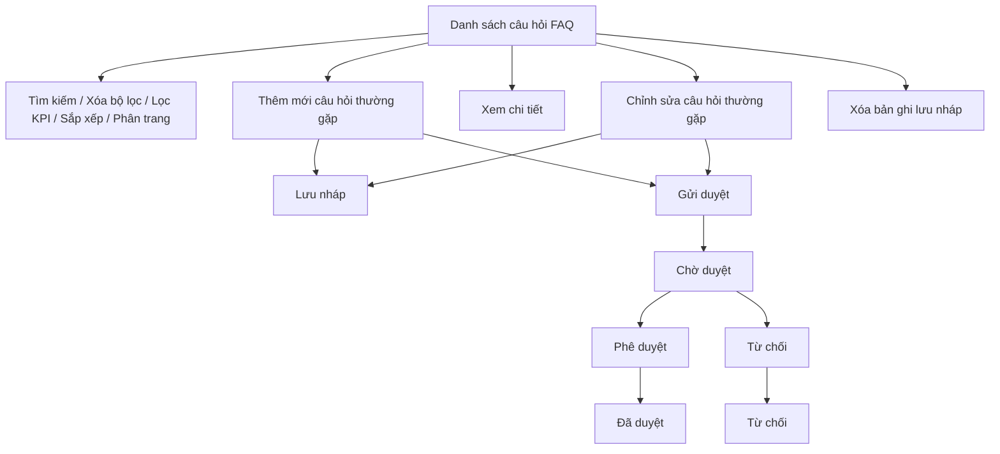

### 4.3.3. Hỗ trợ tư liệu - Câu hỏi và câu trả lời thường gặp (FAQ)

#### 4.3.3.8. Quản lý câu hỏi và trả lời thường gặp

##### 4.3.3.8.1. Mục đích

- Quản lý tập trung danh mục nội dung câu hỏi và câu trả lời thường gặp phục vụ số hóa tư liệu, hỗ trợ cán bộ tra cứu nghiệp vụ giải quyết yêu cầu bồi thường nhà nước và công khai hướng dẫn cho người dân, tổ chức.

- Kiểm soát toàn diện vòng đời bản ghi từ soạn thảo, lưu nháp, gửi duyệt, phê duyệt công khai đến từ chối, chỉnh sửa và gỡ bỏ bản ghi theo đúng quy trình nghiệp vụ.

- Cho phép cán bộ nghiệp vụ thêm mới, chỉnh sửa, lưu nháp, gửi duyệt và xóa bản ghi câu hỏi thường gặp theo trạng thái xử lý cho phép.

- Cho phép cán bộ phê duyệt xem chi tiết, phê duyệt hoặc từ chối câu hỏi thường gặp ở trạng thái "Chờ duyệt".

*a. Phân quyền*

- Cán bộ nghiệp vụ: Quyền tra cứu/tìm kiếm, xem danh sách, lọc theo KPI, xem chi tiết, thêm mới bản ghi, chỉnh sửa bản ghi (khi ở trạng thái "Lưu nháp" hoặc "Từ chối"), xóa bản ghi (chỉ khi ở trạng thái "Lưu nháp"), gửi duyệt bản ghi (khi ở trạng thái "Lưu nháp" hoặc "Từ chối"), kết xuất Excel danh sách.

- Cán bộ phê duyệt / Lãnh đạo: Quyền tra cứu/tìm kiếm, xem danh sách, xem chi tiết bản ghi, phê duyệt bản ghi (khi ở trạng thái "Chờ duyệt" để chuyển sang "Đã duyệt"), từ chối phê duyệt (kèm lý do bắt buộc để chuyển sang "Từ chối"), kết xuất Excel danh sách.

*b. Điều kiện thực hiện*

- Người dùng đã đăng nhập thành công vào Website Quản trị.

- Người dùng được phân quyền truy cập chức năng `Quản lý câu hỏi và trả lời thường gặp (FAQ)` thuộc phân hệ Hỗ trợ tư liệu.

- Nguồn giao diện: `UI_Mockups_Git_BPBD_UI/Website_Quan_tri/quan_ly_cau_hoi_faq.html`.

- Dữ liệu tham chiếu:
  + Danh mục Nhóm chủ đề câu hỏi thường gặp [DM_36].
  + Danh mục Trạng thái nội dung [DM_35].

---

##### 4.3.3.8.2. Sơ đồ luồng nghiệp vụ theo giao diện

---

##### 4.3.3.8.3. MH01 - Màn hình Danh sách câu hỏi và trả lời thường gặp

###### 4.3.3.8.3.1. Màn hình

Nguồn UI: `UI_Mockups_Git_BPBD_UI/Website_Quan_tri/quan_ly_cau_hoi_faq.html`.

###### 4.3.3.8.3.2. Mô tả thông tin trên màn hình

| Trường thông tin | Kiểu dữ liệu | Bắt buộc | Mặc định | Mô tả |
| :--- | :--- | :--- | :--- | :--- |
| **I. Bộ lọc tìm kiếm** | | | | |
| Từ khóa | String(255) | Không | Trống | Control UI: Text input. - Tìm kiếm theo nội dung câu hỏi hoặc nội dung câu trả lời (placeholder: "Tìm theo nội dung câu hỏi hoặc câu trả lời..."). |
| Nhóm chủ đề | Enum(String(100)) | Không | Tất cả | Control UI: Combobox. - Tham chiếu Danh mục Nhóm chủ đề câu hỏi thường gặp [DM_36]. Gồm: + Tất cả + Đăng ký biện pháp bảo đảm + Lệ phí và thanh toán + Tài khoản và phân quyền + Xử lý hồ sơ và biểu mẫu |
| Trạng thái | Enum(String(50)) | Không | Tất cả | Control UI: Combobox. - Tham chiếu Danh mục Trạng thái nội dung [DM_35]. Gồm: + Tất cả + Lưu nháp + Chờ duyệt + Đã duyệt + Từ chối |
| Từ ngày tạo | Date | Không | Ngày đầu tháng hiện tại | Control UI: Date input. - Nhập điều kiện lọc ngày tạo bắt đầu, định dạng `dd/mm/yyyy` (placeholder: "dd/mm/yyyy"). |
| Đến ngày tạo | Date | Không | Ngày hiện tại | Control UI: Date input. - Nhập điều kiện lọc ngày tạo kết thúc, định dạng `dd/mm/yyyy` (placeholder: "dd/mm/yyyy"). |
| **II. Thống kê nhanh** | | | | |
| Tất cả | Integer(10) | Không | Theo dữ liệu hệ thống | - Chỉ đọc. - Hiển thị tổng số bản ghi đang không bị xóa mềm. - Nhấp chọn để lọc nhanh danh sách toàn bộ câu hỏi FAQ. |
| Chờ duyệt | Integer(10) | Không | Theo dữ liệu hệ thống | - Chỉ đọc. - Hiển thị số bản ghi ở trạng thái "Chờ duyệt". - Nhấp chọn để lọc nhanh danh sách câu hỏi đang chờ phê duyệt. |
| Từ chối | Integer(10) | Không | Theo dữ liệu hệ thống | - Chỉ đọc. - Hiển thị số bản ghi ở trạng thái "Từ chối". - Nhấp chọn để lọc nhanh danh sách câu hỏi bị từ chối phê duyệt. |
| **III. Bảng danh sách kết quả** | - | - | 20 bản ghi/trang | Control UI: Data grid. - Khi người dùng truy cập màn hình, hệ thống tự động tải trang đầu tiên (Trang 1) với số lượng mặc định 20 bản ghi. - Sắp xếp mặc định: Sắp xếp theo "Ngày tạo" giảm dần (mới nhất hiển thị lên đầu). - Trạng thái có dữ liệu: Hiển thị danh sách các bản ghi kết quả theo cấu trúc các cột quy định. - Trạng thái không có dữ liệu (Empty State): Khi không tìm thấy kết quả phù hợp với điều kiện tìm kiếm, bảng hiển thị duy nhất 01 dòng căn giữa trên toàn bộ chiều rộng bảng (`colspan`), in nghiêng với nội dung theo MessageList dùng chung [MSG-INF-SYS-001]. |
| STT | Integer(10) | Không | Theo trang hiện tại | - Chỉ đọc. - Hiển thị số thứ tự dòng dữ liệu theo phân trang. |
| Câu hỏi | Text(1000) | Không | Theo dữ liệu hệ thống | - Chỉ đọc. - Hiển thị nội dung câu hỏi dưới dạng liên kết mở **MH02 - Màn hình Chi tiết câu hỏi thường gặp**. |
| Nhóm chủ đề | Enum(String(100)) | Không | Theo dữ liệu hệ thống | - Chỉ đọc. - Tham chiếu Danh mục Nhóm chủ đề câu hỏi thường gặp [DM_36]. Gồm: + Đăng ký biện pháp bảo đảm + Lệ phí và thanh toán + Tài khoản và phân quyền + Xử lý hồ sơ và biểu mẫu |
| Thứ tự hiển thị | Integer(10) | Không | Theo dữ liệu hệ thống | - Chỉ đọc. - Hiển thị số thứ tự ưu tiên khi công bố câu hỏi (hoặc hiển thị "—" nếu chưa gán). |
| Ngày tạo | Date | Không | Theo dữ liệu hệ thống | - Chỉ đọc. - Định dạng `dd/mm/yyyy`. |
| Trạng thái | Enum(String(50)) | Không | Theo dữ liệu hệ thống | - Chỉ đọc. - Hiển thị trạng thái phê duyệt theo Danh mục Trạng thái nội dung [DM_35] dưới dạng badge màu. Gồm: + Lưu nháp + Chờ duyệt + Đã duyệt + Từ chối |
| Thao tác | String(255) | Không | Theo quyền/trạng thái | - Chỉ đọc. - Luôn hiển thị đầy đủ số slot nút thao tác cố định theo vai trò (Fixed-Slot Action Column): + Vai trò Cán bộ nghiệp vụ (3 nút thao tác): Chỉnh sửa, Xóa, Gửi phê duyệt. + Vai trò Cán bộ phê duyệt (2 nút thao tác): Phê duyệt, Từ chối. - Các nút chưa đủ điều kiện hiển thị mờ ẩn (`opacity: 0.35; pointer-events: none; cursor: not-allowed;`) kèm tooltip giải thích lý do không khả dụng. |
| Số dòng hiển thị | Enum(String(10)) | Không | `20` | Control UI: Dropdown. - Cho phép chọn số bản ghi hiển thị trên mỗi trang. Gồm: + `10` + `20` + `50` + `100` |
| Thông tin phân trang | String(255) | Không | 20 bản ghi/trang | Control UI: Pagination. - Hiển thị dải bản ghi: "Hiển thị từ [từ] đến [đến] trong tổng số [tổng số] bản ghi". - Đầy đủ các nút điều hướng trang: Đầu (&#124;&lt;&lt;), Trước (&lt;), các số trang, Sau (&gt;), Cuối (&gt;&gt;&#124;). |
| Nút điều hướng trang | String(50) | Không | Theo số trang | Control UI: Pagination buttons. - Gồm các nút: + Trang đầu (&#124;&lt;&lt;) + Trang trước (&lt;) + Số trang cụ thể + Trang sau (&gt;) + Trang cuối (&gt;&gt;&#124;) |

###### 4.3.3.8.3.3. Chức năng trên màn hình

| STT | Tên chức năng | Định dạng | Mô tả |
| :--- | :--- | :--- | :--- |
| 1 | Tìm kiếm | Button | Khi người dùng click nút, hệ thống kiểm tra điều kiện dữ liệu và thực hiện tìm kiếm theo các trường hợp bên dưới: |
| | | | **TH1 - Khoảng ngày không hợp lệ**: Nếu `Từ ngày tạo` lớn hơn `Đến ngày tạo`, vi phạm [BR-VAL-007], hệ thống hiển thị cảnh báo lỗi [MSG-ERR-VAL-007] và không thực hiện tìm kiếm. |
| | | | **TH Hợp lệ (Có dữ liệu phù hợp)**: Hệ thống lọc và hiển thị danh sách các bản ghi thỏa mãn đồng thời các tiêu chí tìm kiếm/lọc đã nhập/chọn, hiển thị kết quả lên bảng và đưa về Trang 1. |
| | | | **TH Không có dữ liệu trả về**: Bảng kết quả hiển thị duy nhất 01 dòng căn giữa trên toàn bộ chiều rộng bảng (`colspan`), in nghiêng với nội dung theo MessageList dùng chung [MSG-INF-SYS-001]; thanh phân trang hiển thị *"Hiển thị 0-0 của 0 bản ghi"*, các nút điều hướng trang ở trạng thái khóa mờ (Disabled); nút "Kết xuất Excel" ở trạng thái khóa mờ kèm tooltip *"Không có dữ liệu để kết xuất Excel"*. |
| 2 | Xóa bộ lọc | Button | Hệ thống xóa toàn bộ tiêu chí tìm kiếm đã nhập/chọn, thiết lập các ô lọc về giá trị mặc định (`Từ khóa` để trống, `Nhóm chủ đề` và `Trạng thái` về "Tất cả", khoảng ngày về mặc định), đưa trang hiện tại về Trang 1 và tải lại danh sách câu hỏi FAQ. |
| 3 | Lọc theo KPI | Button | Hệ thống lọc nhanh danh sách câu hỏi theo thẻ KPI được chọn: `Tất cả`, `Chờ duyệt`, `Từ chối`; đồng thời cập nhật trạng thái kích hoạt (active) của khối KPI tương ứng và đưa danh sách về Trang 1. |
| | | | **TH Không có dữ liệu trả về**: Bảng kết quả hiển thị duy nhất 01 dòng căn giữa (`colspan`), in nghiêng với nội dung [MSG-INF-SYS-001]; thanh phân trang hiển thị *"Hiển thị 0-0 của 0 bản ghi"*; các nút điều hướng trang bị khóa mờ; nút "Kết xuất Excel" bị khóa mờ kèm tooltip *"Không có dữ liệu để kết xuất Excel"*. |
| 4 | Thêm mới | Button | Hệ thống mở **MH03 - Màn hình Thêm mới/Chỉnh sửa câu hỏi thường gặp** ở chế độ Thêm mới với form thông tin để trống. |
| 5 | Kết xuất Excel | Button | **TH1 - Danh sách rỗng**: Vi phạm [BR-EXP-040]. Nút bị khóa mờ hoặc hiển thị cảnh báo [MSG-WRN-SYS-001] và không tải file. |
| | | | **TH Hợp lệ**: Hệ thống kết xuất toàn bộ danh sách câu hỏi FAQ thỏa mãn tiêu chí lọc/sắp xếp hiện tại ra file Excel theo mẫu quy chuẩn, áp dụng [BR-EXP-040] và hiển thị thông báo thành công [MSG-SUC-BTNN-FAQ-003]. |
| 6 | Sắp xếp cột | Header cột | Áp dụng trên các cột: `Câu hỏi`, `Nhóm chủ đề`, `Thứ tự hiển thị`, `Ngày tạo`. |
| | | | **TH1 - Chọn lại cột đang sắp xếp**: Hệ thống đảo chiều sắp xếp tăng dần / giảm dần và cập nhật icon mũi tên trạng thái trên tiêu đề cột. |
| | | | **TH2 - Chọn cột khác**: Hệ thống thiết lập cột được chọn làm tiêu chí sắp xếp hiện hành và cập nhật lại thứ tự bản ghi trên bảng. |
| 7 | Xem chi tiết | Link / Row click | Khi người dùng click vào nội dung câu hỏi (dạng liên kết) hoặc click vào bất kỳ vị trí nào trên dòng dữ liệu (trừ các nút thao tác), hệ thống mở **MH02 - Màn hình Chi tiết câu hỏi thường gặp** ở chế độ chỉ xem. |
| 8 | Chỉnh sửa | Icon button | Thao tác dành cho vai trò Cán bộ nghiệp vụ. |
| | | | **TH1 - Bản ghi không ở trạng thái được chỉnh sửa**: Nếu bản ghi không ở trạng thái "Lưu nháp" hoặc "Từ chối", icon hiển thị mờ ẩn (`opacity: 0.35; pointer-events: none; cursor: not-allowed;`) kèm tooltip *"Chỉ chỉnh sửa khi ở trạng thái Lưu nháp hoặc Từ chối"*. |
| | | | **TH Hợp lệ**: Hệ thống mở **MH03 - Màn hình Thêm mới/Chỉnh sửa câu hỏi thường gặp** ở chế độ Chỉnh sửa với toàn bộ dữ liệu hiện tại của bản ghi được điền sẵn vào các trường. |
| 9 | Xóa câu hỏi FAQ | Icon button | Thao tác dành cho vai trò Cán bộ nghiệp vụ. |
| | | | **TH1 - Bản ghi không ở trạng thái "Lưu nháp"**: Icon hiển thị mờ ẩn (`opacity: 0.35; pointer-events: none; cursor: not-allowed;`) kèm tooltip *"Chỉ được xóa câu hỏi ở trạng thái Lưu nháp"*. |
| | | | **TH Hợp lệ**: Hệ thống hiển thị Popup Modal xác nhận xóa tùy chỉnh (Custom Confirmation Modal) [MSG-CFM-SYS-001] ("Bạn có chắc chắn muốn xóa câu hỏi thường gặp này không?"). Khi người dùng xác nhận "Đồng ý", hệ thống thực hiện xóa mềm bản ghi, ẩn khỏi bảng dữ liệu, cập nhật lại chỉ số KPI và hiển thị thông báo thành công [MSG-SUC-BTNN-FAQ-008]. |
| 10 | Gửi phê duyệt | Icon button | Thao tác dành cho vai trò Cán bộ nghiệp vụ. |
| | | | **TH1 - Bản ghi không ở trạng thái được gửi duyệt**: Nếu bản ghi không ở trạng thái "Lưu nháp" hoặc "Từ chối", icon hiển thị mờ ẩn (`opacity: 0.35; pointer-events: none; cursor: not-allowed;`) kèm tooltip *"Chỉ được gửi phê duyệt câu hỏi Lưu nháp hoặc Từ chối"*. |
| | | | **TH Hợp lệ**: Hệ thống cập nhật trạng thái bản ghi sang "Chờ duyệt", ghi nhận thời điểm gửi duyệt, cập nhật lại bảng danh sách và chỉ số KPI, hiển thị thông báo thành công [MSG-SUC-BTNN-FAQ-005]. |
| 11 | Phê duyệt | Icon button | Thao tác dành cho vai trò Cán bộ phê duyệt. |
| | | | **TH1 - Bản ghi không ở trạng thái "Chờ duyệt"**: Icon hiển thị mờ ẩn (`opacity: 0.35; pointer-events: none; cursor: not-allowed;`) kèm tooltip *"Chỉ phê duyệt câu hỏi ở trạng thái Chờ duyệt"*. |
| | | | **TH Hợp lệ**: Hệ thống mở **MH02 - Màn hình Chi tiết câu hỏi thường gặp**, cuộn đến khối phê duyệt và cho phép thực hiện phê duyệt bản ghi. |
| 12 | Từ chối | Icon button | Thao tác dành cho vai trò Cán bộ phê duyệt. |
| | | | **TH1 - Bản ghi không ở trạng thái "Chờ duyệt"**: Icon hiển thị mờ ẩn (`opacity: 0.35; pointer-events: none; cursor: not-allowed;`) kèm tooltip *"Chỉ từ chối câu hỏi ở trạng thái Chờ duyệt"*. |
| | | | **TH Hợp lệ**: Hệ thống mở **MH02 - Màn hình Chi tiết câu hỏi thường gặp**, cuộn đến khối phê duyệt, tự động focus vào ô nhập "Lý do từ chối". |
| 13 | Số dòng hiển thị | Select | Khi người dùng chọn `10`, `20`, `50` hoặc `100`, hệ thống cập nhật số bản ghi hiển thị trên mỗi trang, đưa trang hiện tại về Trang 1 và tải lại lưới dữ liệu; mặc định chọn sẵn `20`. |
| 14 | Chuyển trang | Pagination | Hệ thống chuyển đến trang đầu (&#124;&lt;&lt;), trang trước (&lt;), trang được chọn, trang sau (&gt;) hoặc trang cuối (&gt;&gt;&#124;) theo thao tác người dùng; dữ liệu hiển thị giữ nguyên tiêu chí lọc/sắp xếp hiện hành và cấu hình số dòng trên trang. |

---

##### 4.3.3.8.4. MH02 - Màn hình Chi tiết câu hỏi thường gặp

###### 4.3.3.8.4.1. Màn hình

Nguồn UI: modal `#faqModal` với tiêu đề `Chi tiết câu hỏi thường gặp`.

###### 4.3.3.8.4.2. Mô tả thông tin trên màn hình

| Trường thông tin | Kiểu dữ liệu | Bắt buộc | Mặc định | Mô tả |
| :--- | :--- | :--- | :--- | :--- |
| **I. Nội dung câu hỏi & Trả lời** | | | | |
| Câu hỏi | Text(1000) | Không | Theo dữ liệu hệ thống | - Chỉ đọc. - Hiển thị nội dung câu hỏi thường gặp. |
| Nội dung trả lời | Text(4000) | Không | Theo dữ liệu hệ thống | - Chỉ đọc. - Hiển thị nội dung câu trả lời chi tiết đã được định dạng. |
| Nhóm chủ đề | Enum(String(100)) | Không | Theo dữ liệu hệ thống | - Chỉ đọc. - Tham chiếu Danh mục Nhóm chủ đề câu hỏi thường gặp [DM_36]. Gồm: + Đăng ký biện pháp bảo đảm + Lệ phí và thanh toán + Tài khoản và phân quyền + Xử lý hồ sơ và biểu mẫu |
| Thứ tự hiển thị | Integer(10) | Không | Theo dữ liệu hệ thống | - Chỉ đọc. - Hiển thị số thứ tự ưu tiên khi công bố câu hỏi. |
| Tags / Từ khóa | String(500) | Không | Theo dữ liệu hệ thống | - Chỉ đọc. - Hiển thị các từ khóa phân tách bằng dấu phẩy. |
| **II. Tài liệu hướng dẫn đi kèm** | | | | |
| File tài liệu đính kèm | File | Không | Theo dữ liệu hệ thống | - Chỉ đọc. - Hiển thị danh sách file tài liệu đã đính kèm (PDF, JPG, PNG). - Kèm theo liên kết "Xem file" (mở xem tại tab mới). |
| File hướng dẫn media | File | Không | Theo dữ liệu hệ thống | - Chỉ đọc. - Hiển thị danh sách file media đã đính kèm (MP4, MP3). - Kèm theo liên kết "Xem file" (mở xem tại tab mới). |
| **III. Cán bộ phê duyệt câu hỏi FAQ** | | | | *(Khối này chỉ hiển thị khi tài khoản có vai trò Cán bộ phê duyệt hoặc khi xem bản ghi ở trạng thái "Từ chối" / "Đã duyệt")* |
| Người tạo / gửi duyệt | String(255) | Không | Theo dữ liệu hệ thống | - Chỉ đọc. - Hiển thị họ tên cán bộ đã tạo và gửi phê duyệt câu hỏi. |
| Ngày gửi duyệt | Date | Không | Theo dữ liệu hệ thống | - Chỉ đọc. - Hiển thị ngày gửi phê duyệt, định dạng `dd/mm/yyyy`. |
| Lý do từ chối | Text(1000) | Có (khi Từ chối) | Trống | - Hiển thị ô nhập lý do khi Cán bộ phê duyệt thực hiện từ chối. - Bắt buộc nhập nếu nhấn nút "Từ chối". - Khi xem lại bản ghi đã bị từ chối, trường ở chế độ chỉ đọc hiển thị lý do từ chối đã lưu. |

###### 4.3.3.8.4.3. Chức năng trên màn hình

| STT | Tên chức năng | Định dạng | Mô tả |
| :--- | :--- | :--- | :--- |
| 1 | Phê duyệt | Button | Chức năng chỉ hiển thị đối với vai trò Cán bộ phê duyệt khi xem bản ghi ở trạng thái "Chờ duyệt". - Khi click nút, hệ thống cập nhật trạng thái bản ghi sang "Đã duyệt", ghi nhận thông tin người duyệt và ngày phê duyệt, đóng popup modal, làm mới danh sách bản ghi và chỉ số KPI, hiển thị thông báo thành công [MSG-SUC-BTNN-FAQ-006]. |
| 2 | Từ chối | Button | Chức năng chỉ hiển thị đối với vai trò Cán bộ phê duyệt khi xem bản ghi ở trạng thái "Chờ duyệt". |
| | | | **TH1 - Bỏ trống lý do từ chối**: Vi phạm [BR-VAL-001]. Hệ thống highlight viền đỏ `.is-invalid` ô nhập "Lý do từ chối", hiển thị dòng cảnh báo "Đây là trường bắt buộc" ngay phía dưới và tự động focus con trỏ vào ô nhập lỗi (tuyệt đối không dùng toast). |
| | | | **TH Hợp lệ**: Hệ thống lưu lý do từ chối, cập nhật trạng thái bản ghi sang "Từ chối", ghi nhận thông tin người duyệt và ngày từ chối, đóng popup modal, làm mới danh sách bản ghi và chỉ số KPI, hiển thị thông báo thành công [MSG-SUC-BTNN-FAQ-007]. |
| 3 | Xem file | Link | Khi click vào liên kết "Xem file" cạnh tên tệp tin đính kèm, hệ thống mở nội dung file tại một tab trình duyệt mới. |
| 4 | Hủy | Button | Hệ thống đóng popup modal và quay lại màn hình danh sách **MH01**. |
| 5 | Đóng | Icon button | Click vào icon `fa-xmark` ở góc phải tiêu đề modal, hệ thống đóng popup modal và quay lại màn hình danh sách **MH01**. |

---

##### 4.3.3.8.5. MH03 - Màn hình Thêm mới/Chỉnh sửa câu hỏi thường gặp

###### 4.3.3.8.5.1. Màn hình

Nguồn UI: modal `#faqModal` với tiêu đề `Thêm mới câu hỏi thường gặp (FAQ)` hoặc `Chỉnh sửa câu hỏi thường gặp`.

###### 4.3.3.8.5.2. Mô tả thông tin trên màn hình

| Trường thông tin | Kiểu dữ liệu | Bắt buộc | Mặc định | Mô tả |
| :--- | :--- | :--- | :--- | :--- |
| **I. Nội dung câu hỏi & Trả lời** | | | | |
| Câu hỏi | Text(1000) | Có | Trống | Control UI: Textarea. - Nhập nội dung câu hỏi thường gặp (placeholder: "Nhập câu hỏi thường gặp..."). |
| Nội dung trả lời | Text(4000) | Có | Trống | Control UI: Rich Text Editor. - Nhập nội dung câu trả lời chi tiết (placeholder: "Nhập nội dung câu trả lời chi tiết..."). - Hỗ trợ các công cụ định dạng trực quan trên toolbar: + In đậm (Bold) + In nghiêng (Italic) + Danh sách không thứ tự (Bullet list) + Danh sách có thứ tự (Numbered list) + Chèn liên kết (Insert link) |
| Nhóm chủ đề | Enum(String(100)) | Có | Trống | Control UI: Combobox. - Tham chiếu Danh mục Nhóm chủ đề câu hỏi thường gặp [DM_36]. Gồm: + Đăng ký biện pháp bảo đảm + Lệ phí và thanh toán + Tài khoản và phân quyền + Xử lý hồ sơ và biểu mẫu |
| Thứ tự hiển thị | Integer(10) | Không | Trống | Control UI: Number input. - Nhập số nguyên dương xác định thứ tự ưu tiên khi công bố (placeholder: "Ví dụ: 1, 2, 3..."). |
| Tags / Từ khóa | String(500) | Không | Trống | Control UI: Text input. - Nhập tối đa 10 tags, phân tách nhau bằng dấu phẩy (placeholder: "Tối đa 10 tags, phân tách bằng dấu phẩy..."). |
| **II. Tài liệu hướng dẫn đi kèm** | | | | |
| File tài liệu đính kèm | File | Không | Trống | Control UI: File Upload Area. - Cho phép kéo thả hoặc click chọn nhiều file tài liệu. - Định dạng cho phép: PDF, JPG, PNG. - Dung lượng tối đa: 10MB/file, tối đa 5 file. - Áp dụng [BR-BTNN-FAQ-001]. - Sau khi tải lên thành công, hiển thị tên file kèm theo 2 liên kết: + Xem file (mở tab mới) + Xóa (xóa khỏi danh sách file trước khi lưu) |
| File hướng dẫn media | File | Không | Trống | Control UI: File Upload Area. - Cho phép kéo thả hoặc click chọn nhiều file media. - Định dạng cho phép: MP4, MP3. - Dung lượng tối đa: 50MB/file, tối đa 3 file. - Áp dụng [BR-BTNN-FAQ-002]. - Sau khi tải lên thành công, hiển thị tên file kèm theo 2 liên kết: + Xem file (mở tab mới) + Xóa (xóa khỏi danh sách file trước khi lưu) |

###### 4.3.3.8.5.3. Chức năng trên màn hình

| STT | Tên chức năng | Định dạng | Mô tả |
| :--- | :--- | :--- | :--- |
| 1 | Lưu nháp | Button | Khi người dùng click nút, hệ thống kiểm tra điều kiện dữ liệu và thực hiện lưu nháp theo các trường hợp bên dưới: |
| | | | **TH1 - Bỏ trống trường bắt buộc**: Vi phạm [BR-VAL-001] (chưa nhập `Câu hỏi`, `Nội dung trả lời` hoặc chưa chọn `Nhóm chủ đề`). Hệ thống highlight viền đỏ `.is-invalid` ô nhập trống đầu tiên, hiển thị dòng cảnh báo "Đây là trường bắt buộc" ngay phía dưới và tự động focus con trỏ vào ô nhập đó (tuyệt đối không dùng toast). |
| | | | **TH2 - Dữ liệu không hợp lệ**: Kiểm tra và phát hiện lỗi: + `Thứ tự hiển thị` không phải số nguyên dương: Hệ thống hiển thị cảnh báo lỗi [MSG-ERR-BTNN-FAQ-007] và không cho phép lưu. + File tài liệu đính kèm vi phạm [BR-BTNN-FAQ-001] (sai định dạng, vượt dung lượng 10MB hoặc quá 5 file): Hệ thống hiển thị thông báo lỗi [MSG-ERR-BTNN-FAQ-001], [MSG-ERR-BTNN-FAQ-002] hoặc [MSG-ERR-BTNN-FAQ-003] tương ứng. + File media đính kèm vi phạm [BR-BTNN-FAQ-002] (sai định dạng, vượt dung lượng 50MB hoặc quá 3 file): Hệ thống hiển thị thông báo lỗi [MSG-ERR-BTNN-FAQ-004], [MSG-ERR-BTNN-FAQ-005] hoặc [MSG-ERR-BTNN-FAQ-006] tương ứng. |
| | | | **TH Hợp lệ**: Hệ thống lưu thông tin câu hỏi ở trạng thái "Lưu nháp", đóng popup modal, làm mới danh sách bản ghi và chỉ số KPI, hiển thị thông báo thành công [MSG-SUC-BTNN-FAQ-004]. |
| 2 | Gửi duyệt | Button | Khi người dùng click nút, hệ thống kiểm tra điều kiện dữ liệu và thực hiện gửi duyệt theo các trường hợp bên dưới: |
| | | | **TH1 - Bỏ trống trường bắt buộc**: Vi phạm [BR-VAL-001]. Hệ thống highlight viền đỏ `.is-invalid` ô nhập trống đầu tiên, hiển thị dòng cảnh báo "Đây là trường bắt buộc" ngay phía dưới và tự động focus con trỏ vào ô đó (tuyệt đối không dùng toast). |
| | | | **TH2 - Dữ liệu không hợp lệ**: Kiểm tra các điều kiện định dạng dữ liệu tương tự chức năng `Lưu nháp`. Nếu có lỗi, hiển thị thông báo lỗi tương ứng và dừng xử lý. |
| | | | **TH Hợp lệ**: Hệ thống lưu thông tin câu hỏi, chuyển trạng thái bản ghi sang "Chờ duyệt", ghi nhận thời điểm gửi duyệt, đóng popup modal, làm mới danh sách bản ghi và chỉ số KPI, hiển thị thông báo thành công [MSG-SUC-BTNN-FAQ-005]. |
| 3 | Xem file | Link | Cho phép xem trước file đính kèm tại một tab trình duyệt riêng biệt. |
| 4 | Xóa file | Link | Hệ thống hiển thị Popup Modal xác nhận tùy chỉnh. Khi người dùng xác nhận, loại bỏ file đã chọn khỏi danh sách tải lên trước khi lưu form. |
| 5 | Hủy | Button | Hệ thống đóng popup modal và quay lại màn hình danh sách **MH01**; mọi dữ liệu vừa nhập chưa lưu sẽ bị hủy bỏ. |
| 6 | Đóng | Icon button | Click vào icon `fa-xmark` ở góc phải tiêu đề modal, hệ thống đóng popup modal và quay lại màn hình danh sách **MH01**; mọi dữ liệu vừa nhập chưa lưu sẽ bị hủy bỏ. |
