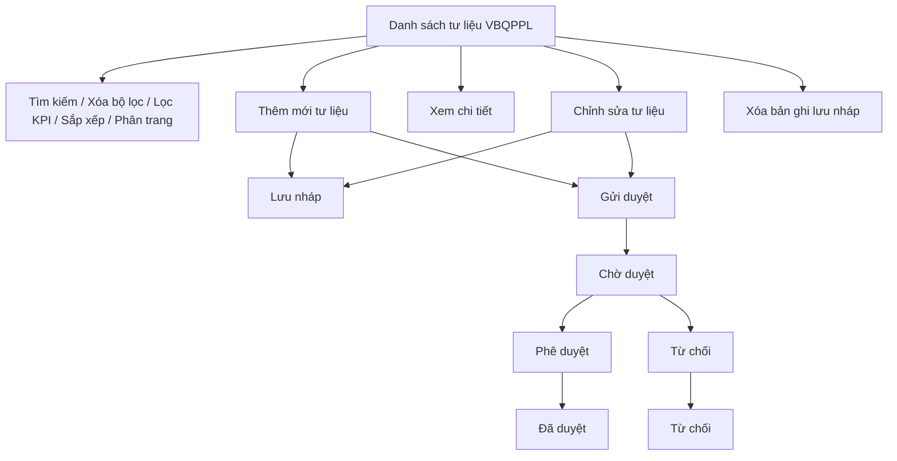

### 4.3.3. Dành cho Cán bộ Công tác bồi thường nhà nước

#### 4.3.3.7. UC505-507 - Quản lý thông tin tư liệu VBQPPL

##### 4.3.3.7.1. Mục đích

\- Cho phép cán bộ quản lý danh sách thông tin tư liệu văn bản quy phạm pháp luật phục vụ tra cứu, hỗ trợ nghiệp vụ bồi thường nhà nước.

\- Cho phép cán bộ nghiệp vụ thêm mới, chỉnh sửa, lưu nháp, gửi duyệt và xóa bản ghi tư liệu theo trạng thái xử lý.

\- Cho phép cán bộ phê duyệt xem chi tiết, phê duyệt hoặc từ chối tư liệu ở trạng thái "Chờ duyệt".

*a. Phân quyền*

\- Cán bộ nghiệp vụ: được tra cứu, xem chi tiết, thêm mới, chỉnh sửa bản ghi ở trạng thái "Lưu nháp" hoặc "Từ chối", xóa bản ghi ở trạng thái "Lưu nháp" và gửi duyệt bản ghi ở trạng thái "Lưu nháp" hoặc "Từ chối".

\- Cán bộ phê duyệt: được tra cứu, xem chi tiết, phê duyệt hoặc từ chối bản ghi ở trạng thái "Chờ duyệt".

*b. Điều kiện thực hiện*

\- Người dùng đã đăng nhập thành công vào Website quản trị.

\- Người dùng được phân quyền truy cập màn hình `Quản lý thông tin tư liệu VBQPPL`.

\- Nguồn giao diện: `UI_Mockups/Website_Quan_tri/UC505_UC510/quan_ly_tu_lieu_vbqppl.html`.

\- Loại văn bản tham chiếu danh mục [DM_21].

\- Trạng thái phê duyệt tư liệu tham chiếu danh mục [DM_35].

---

##### 4.3.3.7.2. Sơ đồ luồng nghiệp vụ theo giao diện

---

##### 4.3.3.7.3. MH01 - Màn hình Danh sách thông tin tư liệu VBQPPL

###### 4.3.3.7.3.1. Màn hình

Nguồn UI: `UI_Mockups/Website_Quan_tri/UC505_UC510/quan_ly_tu_lieu_vbqppl.html`.

###### 4.3.3.7.3.2. Mô tả thông tin trên màn hình

| Trường thông tin | Kiểu dữ liệu | Bắt buộc | Mặc định | Mô tả |
| :--- | :--- | :--- | :--- | :--- |
| **I. Bộ lọc tìm kiếm** | | | | |
| Từ khóa | String(255) | Không | Trống | Tìm kiếm theo tên văn bản hoặc số hiệu văn bản. |
| Loại văn bản | Enum(String(50)) | Không | Tất cả | - Tham chiếu danh mục [DM_21]. - Giá trị UI gồm: + Tất cả + Luật + Nghị định + Thông tư + Nghị quyết + Quyết định + Thông tư liên tịch |
| Cơ quan ban hành | String(255) | Không | Trống | Tìm kiếm theo tên cơ quan ban hành văn bản. |
| Trạng thái | Enum(String(50)) | Không | Tất cả | - Tham chiếu danh mục [DM_35]. - Giá trị UI gồm: + Tất cả + Lưu nháp + Chờ duyệt + Đã duyệt + Từ chối |
| Từ ngày ban hành | Date | Không | Theo dữ liệu hệ thống | Nhập điều kiện lọc ngày ban hành bắt đầu, định dạng `dd/mm/yyyy`. |
| Đến ngày ban hành | Date | Không | Theo dữ liệu hệ thống | Nhập điều kiện lọc ngày ban hành kết thúc, định dạng `dd/mm/yyyy`. |
| **II. Thống kê nhanh** | | | | |
| Tổng số tư liệu | Integer(10) | Không | Theo dữ liệu hệ thống | - Chỉ đọc. - Hiển thị tổng số bản ghi đang không bị xóa mềm. |
| Số tư liệu chờ duyệt | Integer(10) | Không | Theo dữ liệu hệ thống | - Chỉ đọc. - Hiển thị số bản ghi ở trạng thái "Chờ duyệt". |
| Số tư liệu từ chối | Integer(10) | Không | Theo dữ liệu hệ thống | - Chỉ đọc. - Hiển thị số bản ghi ở trạng thái "Từ chối". |
| **III. Bảng danh sách kết quả** | | | | |
| Cột: STT | Integer(10) | Không | Theo trang hiện tại | - Chỉ đọc. - Hiển thị số thứ tự dòng dữ liệu theo phân trang. |
| Cột: Tên văn bản | String(500) | Không | Theo dữ liệu hệ thống | - Chỉ đọc. - Hiển thị tên văn bản dưới dạng liên kết mở **4.3.3.7.4. MH02 - Màn hình Chi tiết thông tin tư liệu VBQPPL**. |
| Cột: Số hiệu | String(100) | Không | Theo dữ liệu hệ thống | - Chỉ đọc. - Hiển thị số hiệu văn bản. |
| Cột: Loại văn bản | Enum(String(50)) | Không | Theo dữ liệu hệ thống | - Chỉ đọc. - Tham chiếu [DM_21]. |
| Cột: Cơ quan ban hành | String(255) | Không | Theo dữ liệu hệ thống | - Chỉ đọc. - Hiển thị tên cơ quan ban hành văn bản. |
| Cột: Ngày ban hành | Date | Không | Theo dữ liệu hệ thống | - Chỉ đọc. - Định dạng `dd/mm/yyyy`. |
| Cột: Ngày có hiệu lực | Date | Không | Theo dữ liệu hệ thống | - Chỉ đọc. - Định dạng `dd/mm/yyyy`. |
| Cột: Trạng thái | Enum(String(50)) | Không | Theo dữ liệu hệ thống | - Chỉ đọc. - Hiển thị trạng thái phê duyệt theo [DM_35] dưới dạng badge màu. |
| Cột: Thao tác | String(255) | Không | Theo quyền/trạng thái | - Chỉ đọc. - Hiển thị các icon thao tác phù hợp với quyền tài khoản và trạng thái bản ghi. - Các icon chưa đủ điều kiện hiển thị dạng mờ và không cho thao tác. |
| Số dòng hiển thị | Enum(String(10)) | Không | 5 | - Giá trị UI gồm: + 5 + 10 + 20 |
| Thông tin phân trang | String(255) | Không | Theo dữ liệu lọc | - Chỉ đọc. - Hiển thị khoảng bản ghi đang xem và tổng số bản ghi. |
| Nút phân trang | String(50) | Không | Theo số trang | - Chỉ đọc. - Gồm các nút: + Trang đầu + Trang trước + Số trang + Trang sau + Trang cuối |

###### 4.3.3.7.3.3. Chức năng trên màn hình

| STT | Tên chức năng | Định dạng | Mô tả |
| :--- | :--- | :--- | :--- |
| 1 | Tìm kiếm | Button | TH1 (Khoảng ngày không hợp lệ): Nếu `Từ ngày ban hành` lớn hơn `Đến ngày ban hành`, vi phạm [BR-VAL-007]. Hệ thống hiển thị [MSG-ERR-VAL-007] và không thực hiện tìm kiếm. |
|  |  |  | TH2 (Không có dữ liệu phù hợp): Hệ thống hiển thị [MSG-INF-BTNN-HTTL-001] tại vùng lưới dữ liệu. |
|  |  |  | TH Hợp lệ: Hệ thống lọc danh sách tư liệu theo `Từ khóa`, `Loại văn bản`, `Cơ quan ban hành`, `Trạng thái`, khoảng `Ngày ban hành`, cập nhật lưới kết quả và hiển thị [MSG-SUC-BTNN-HTTL-001]. |
| 2 | Xóa bộ lọc | Button | Hệ thống xóa toàn bộ tiêu chí tìm kiếm, đặt các bộ lọc về giá trị mặc định, đưa trang hiện tại về trang 1 và hiển thị [MSG-SUC-BTNN-HTTL-002]. |
| 3 | Lọc theo KPI | Button | Hệ thống lọc nhanh danh sách theo nhóm thống kê được chọn: `Tất cả`, `Chờ duyệt`, `Từ chối`; đồng thời cập nhật trạng thái chọn của khối KPI. |
| 4 | Thêm mới | Button | Hệ thống mở **4.3.3.7.5. MH03 - Màn hình Thêm mới/Chỉnh sửa thông tin tư liệu VBQPPL** ở chế độ thêm mới. |
| 5 | Kết xuất Excel | Button | TH1 (Danh sách rỗng): Vi phạm [BR-EXP-040]. Hệ thống hiển thị [MSG-WRN-SYS-001] và không tải file. |
|  |  |  | TH Hợp lệ: Hệ thống kết xuất danh sách tư liệu hiện hành ra file Excel theo tiêu chí lọc/sắp xếp hiện tại, áp dụng [BR-EXP-040] và hiển thị [MSG-SUC-BTNN-HTTL-003]. |
| 6 | Sắp xếp cột | Header cột | TH1 (Chọn lại cột đang sắp xếp): Hệ thống đảo chiều sắp xếp tăng/giảm và cập nhật icon sắp xếp trên tiêu đề cột. |
|  |  |  | TH2 (Chọn cột khác): Hệ thống đặt cột được chọn làm cột sắp xếp hiện hành và cập nhật danh sách. Các cột hỗ trợ sắp xếp gồm `Tên văn bản`, `Số hiệu`, `Loại văn bản`, `Cơ quan ban hành`, `Ngày ban hành`, `Ngày có hiệu lực`. |
| 7 | Xem | Row Click | Hệ thống mở **4.3.3.7.4. MH02 - Màn hình Chi tiết thông tin tư liệu VBQPPL** ở chế độ chỉ xem. |
| 8 | Chỉnh sửa | Icon button | TH1 (Bản ghi không ở trạng thái được chỉnh sửa): Icon hiển thị dạng mờ và không cho thao tác nếu bản ghi không ở trạng thái "Lưu nháp" hoặc "Từ chối". |
|  |  |  | TH Hợp lệ: Hệ thống mở **4.3.3.7.5. MH03 - Màn hình Thêm mới/Chỉnh sửa thông tin tư liệu VBQPPL** ở chế độ chỉnh sửa. |
| 9 | Xóa tài liệu | Icon button | TH1 (Bản ghi không ở trạng thái "Lưu nháp"): Icon hiển thị dạng mờ và không cho thao tác. |
|  |  |  | TH Hợp lệ: Hệ thống hiển thị [MSG-CFM-SYS-001]. Nếu người dùng xác nhận, hệ thống xóa mềm bản ghi, ẩn khỏi danh sách và hiển thị [MSG-SUC-BTNN-HTTL-008]. |
| 10 | Gửi phê duyệt | Icon button | TH1 (Bản ghi không ở trạng thái được gửi duyệt): Icon hiển thị dạng mờ và không cho thao tác nếu bản ghi không ở trạng thái "Lưu nháp" hoặc "Từ chối". |
|  |  |  | TH Hợp lệ: Hệ thống chuyển bản ghi sang trạng thái "Chờ duyệt", cập nhật danh sách và hiển thị [MSG-SUC-BTNN-HTTL-005]. |
| 11 | Phê duyệt | Icon button | TH1 (Bản ghi không ở trạng thái "Chờ duyệt"): Icon hiển thị dạng mờ và không cho thao tác. |
|  |  |  | TH Hợp lệ: Hệ thống mở **4.3.3.7.4. MH02 - Màn hình Chi tiết thông tin tư liệu VBQPPL** và hiển thị khối phê duyệt. |
| 12 | Từ chối | Icon button | TH1 (Bản ghi không ở trạng thái "Chờ duyệt"): Icon hiển thị dạng mờ và không cho thao tác. |
|  |  |  | TH Hợp lệ: Hệ thống mở **4.3.3.7.4. MH02 - Màn hình Chi tiết thông tin tư liệu VBQPPL** và hiển thị khối phê duyệt. |
| 13 | Click tên văn bản | Link | Hệ thống mở **4.3.3.7.4. MH02 - Màn hình Chi tiết thông tin tư liệu VBQPPL** ở chế độ chỉ xem. |
| 14 | Click dòng dữ liệu | Row click | Hệ thống mở **4.3.3.7.4. MH02 - Màn hình Chi tiết thông tin tư liệu VBQPPL** ở chế độ chỉ xem. |
| 15 | Số dòng hiển thị | Select | Hệ thống cập nhật số bản ghi hiển thị trên mỗi trang theo giá trị được chọn, đưa trang hiện tại về trang 1 và tải lại lưới dữ liệu. |
| 16 | Chuyển trang | Pagination | Hệ thống chuyển đến trang đầu, trang trước, trang được chọn, trang sau hoặc trang cuối theo thao tác người dùng; dữ liệu hiển thị giữ nguyên tiêu chí lọc/sắp xếp hiện hành. |

---

##### 4.3.3.7.4. MH02 - Màn hình Chi tiết thông tin tư liệu VBQPPL

###### 4.3.3.7.4.1. Màn hình

Nguồn UI: modal `docModal` với tiêu đề `Chi tiết thông tin tư liệu văn bản quy phạm pháp luật`.

###### 4.3.3.7.4.2. Mô tả thông tin trên màn hình

| Trường thông tin | Kiểu dữ liệu | Bắt buộc | Mặc định | Mô tả |
| :--- | :--- | :--- | :--- | :--- |
| **I. Thông tin văn bản tư liệu** | | | | |
| Tên văn bản | String(500) | Không | Theo dữ liệu hệ thống | - Chỉ đọc. - Hiển thị tên văn bản tư liệu. |
| Số hiệu văn bản | String(100) | Không | Theo dữ liệu hệ thống | - Chỉ đọc. - Hiển thị số hiệu văn bản. |
| Loại văn bản | Enum(String(50)) | Không | Theo dữ liệu hệ thống | - Chỉ đọc. - Tham chiếu [DM_21]. |
| Cơ quan ban hành | String(255) | Không | Theo dữ liệu hệ thống | - Chỉ đọc. - Hiển thị tên cơ quan ban hành. |
| Ngày ban hành | Date | Không | Theo dữ liệu hệ thống | - Chỉ đọc. - Định dạng `dd/mm/yyyy`. |
| Ngày có hiệu lực | Date | Không | Theo dữ liệu hệ thống | - Chỉ đọc. - Định dạng `dd/mm/yyyy`. |
| Tags / Từ khóa | String(500) | Không | Theo dữ liệu hệ thống | - Chỉ đọc. - Hiển thị các từ khóa phân tách bằng dấu phẩy. |
| Người ký | String(255) | Không | Theo dữ liệu hệ thống | - Chỉ đọc. - Hiển thị họ tên người ký văn bản. |
| Chức danh | String(255) | Không | Theo dữ liệu hệ thống | - Chỉ đọc. - Hiển thị chức danh người ký văn bản. |
| Tóm tắt nội dung | Text(2000) | Không | Theo dữ liệu hệ thống | - Chỉ đọc. - Hiển thị tóm tắt nội dung văn bản. |
| **II. Tài liệu đính kèm** | | | | |
| File dữ liệu văn bản | File | Không | Theo dữ liệu hệ thống | - Chỉ đọc. - Hiển thị danh sách file PDF/DOCX đã đính kèm. - Mỗi file hiển thị tên file và liên kết `Xem file`. |
| File media đính kèm | File | Không | Theo dữ liệu hệ thống | - Chỉ đọc. - Hiển thị danh sách file MP4/MP3/JPG/PNG đã đính kèm. - Mỗi file hiển thị tên file và liên kết `Xem file`. |
| **III. Cán bộ phê duyệt hồ sơ** | | | | |
| Người tạo / gửi duyệt | String(255) | Không | Theo dữ liệu hệ thống | - Chỉ đọc. - Chỉ hiển thị trong khối phê duyệt hoặc khi xem bản ghi bị từ chối. |
| Ngày gửi duyệt | Date | Không | Theo dữ liệu hệ thống | - Chỉ đọc. - Chỉ hiển thị trong khối phê duyệt hoặc khi xem bản ghi bị từ chối. |
| Lý do từ chối | Text(1000) | Không | Trống | - Bắt buộc nhập khi thực hiện chức năng `Từ chối`. - Khi bản ghi ở trạng thái "Từ chối", trường hiển thị chỉ đọc lý do đã lưu. |

###### 4.3.3.7.4.3. Chức năng trên màn hình

| STT | Tên chức năng | Định dạng | Mô tả |
| :--- | :--- | :--- | :--- |
| 1 | Phê duyệt | Button | Chỉ hiển thị với tài khoản Cán bộ phê duyệt khi bản ghi ở trạng thái "Chờ duyệt". Hệ thống cập nhật trạng thái bản ghi sang "Đã duyệt", ghi nhận người duyệt/ngày duyệt, đóng màn hình chi tiết, tải lại danh sách và hiển thị [MSG-SUC-BTNN-HTTL-006]. |
| 2 | Từ chối | Button | TH1 (Bỏ trống lý do từ chối): Vi phạm [BR-VAL-001]. Hệ thống hiển thị [MSG-ERR-VAL-001] dưới trường `Lý do từ chối`, không cho phép từ chối. |
|  |  |  | TH Hợp lệ: Chỉ hiển thị với tài khoản Cán bộ phê duyệt khi bản ghi ở trạng thái "Chờ duyệt". Hệ thống cập nhật trạng thái bản ghi sang "Từ chối", lưu lý do từ chối, ghi nhận người duyệt/ngày duyệt, đóng màn hình chi tiết, tải lại danh sách và hiển thị [MSG-SUC-BTNN-HTTL-007]. |
| 3 | Xem file | Link | Cho phép xem file tại một tab riêng. |
| 4 | Hủy | Button | Hệ thống đóng màn hình chi tiết và quay lại **4.3.3.7.3. MH01 - Màn hình Danh sách thông tin tư liệu VBQPPL**. |
| 5 | Đóng | Icon button | Hệ thống đóng màn hình chi tiết và quay lại **4.3.3.7.3. MH01 - Màn hình Danh sách thông tin tư liệu VBQPPL**. |

---

##### 4.3.3.7.5. MH03 - Màn hình Thêm mới/Chỉnh sửa thông tin tư liệu VBQPPL

###### 4.3.3.7.5.1. Màn hình

Nguồn UI: modal `docModal` với tiêu đề `Thêm mới thông tin tư liệu văn bản quy phạm pháp luật` hoặc `Chỉnh sửa thông tin tư liệu văn bản quy phạm pháp luật`.

###### 4.3.3.7.5.2. Mô tả thông tin trên màn hình

| Trường thông tin | Kiểu dữ liệu | Bắt buộc | Mặc định | Mô tả |
| :--- | :--- | :--- | :--- | :--- |
| **I. Thông tin văn bản tư liệu** | | | | |
| Tên văn bản | String(500) | Có | Trống | Nhập tên văn bản tư liệu. |
| Số hiệu văn bản | String(100) | Có | Trống | Nhập số hiệu văn bản. |
| Loại văn bản | Enum(String(50)) | Có | Trống | - Tham chiếu [DM_21]. - Giá trị UI gồm: + Luật + Nghị định + Thông tư + Nghị quyết + Quyết định + Thông tư liên tịch |
| Cơ quan ban hành | String(255) | Có | Trống | Nhập tên cơ quan ban hành văn bản. |
| Ngày ban hành | Date | Có | Trống | Ngày ban hành văn bản. |
| Ngày có hiệu lực | Date | Không | Trống | Nếu nhập, ngày có hiệu lực phải lớn hơn hoặc bằng ngày ban hành. |
| Tags / Từ khóa | String(500) | Không | Trống | Nhập tối đa 10 tags, phân tách bằng dấu phẩy theo UI. |
| Người ký | String(255) | Có | Trống | Nhập họ tên người ký văn bản. |
| Chức danh | String(255) | Có | Trống | Nhập chức danh của người ký văn bản. |
| Tóm tắt nội dung | Text(2000) | Không | Trống | Nhập tóm tắt nội dung chính của văn bản. |
| **II. Tài liệu đính kèm** | | | | |
| File dữ liệu văn bản | File | Có | Trống | - Cho phép chọn đồng thời nhiều file. - Áp dụng [BR-BTNN-HTTL-001]. - Sau khi tải lên, mỗi file hiển thị tên file và các thao tác: + Xem file + Xóa |
| File media đính kèm | File | Không | Trống | - Cho phép chọn đồng thời nhiều file. - Áp dụng [BR-BTNN-HTTL-002]. - Sau khi tải lên, mỗi file hiển thị tên file và các thao tác: + Xem file + Xóa |

###### 4.3.3.7.5.3. Chức năng trên màn hình

| STT | Tên chức năng | Định dạng | Mô tả |
| :--- | :--- | :--- | :--- |
| 1 | Lưu nháp | Button | TH1 (Bỏ trống trường bắt buộc): Vi phạm [BR-VAL-001]. Hệ thống hiển thị [MSG-ERR-VAL-001] và không cho phép lưu. |
|  |  |  | TH2 (Dữ liệu không hợp lệ): Kiểm tra và phát hiện lỗi: - `Ngày ban hành` lớn hơn ngày hiện tại: Vi phạm [BR-VAL-008], hiển thị [MSG-ERR-VAL-008] và không cho phép lưu. - `Ngày có hiệu lực` nhỏ hơn `Ngày ban hành`: Vi phạm [BR-VAL-007], hiển thị [MSG-ERR-VAL-007] và không cho phép lưu. - File dữ liệu văn bản vi phạm [BR-BTNN-HTTL-001], hiển thị [MSG-ERR-BTNN-HTTL-001], [MSG-ERR-BTNN-HTTL-002] hoặc [MSG-ERR-BTNN-HTTL-003] theo lỗi phát sinh, không cho phép lưu. - File media đính kèm vi phạm [BR-BTNN-HTTL-002], hiển thị [MSG-ERR-BTNN-HTTL-004], [MSG-ERR-BTNN-HTTL-005] hoặc [MSG-ERR-BTNN-HTTL-006] theo lỗi phát sinh, không cho phép lưu. |
|  |  |  | TH Hợp lệ: Hệ thống lưu thông tin tư liệu ở trạng thái "Lưu nháp", đóng màn hình, tải lại danh sách và hiển thị [MSG-SUC-BTNN-HTTL-004]. |
| 2 | Gửi duyệt | Button | TH1 (Bỏ trống trường bắt buộc): Vi phạm [BR-VAL-001]. Hệ thống hiển thị [MSG-ERR-VAL-001] và không cho phép gửi duyệt. |
|  |  |  | TH2 (Dữ liệu không hợp lệ): Kiểm tra dữ liệu tương tự chức năng `Lưu nháp`. Nếu có lỗi, hệ thống hiển thị mã MSG tương ứng và không cho phép gửi duyệt. |
|  |  |  | TH Hợp lệ: Hệ thống lưu thông tin tư liệu, chuyển trạng thái bản ghi sang "Chờ duyệt", đóng màn hình, tải lại danh sách và hiển thị [MSG-SUC-BTNN-HTTL-005]. |
| 3 | Xem file | Link | Cho phép xem file tại một tab riêng. |
| 4 | Xóa | Link | Hệ thống xóa file khỏi danh sách file đã chọn trên màn hình trước khi lưu. |
| 5 | Hủy | Button | Hệ thống đóng màn hình thêm mới/chỉnh sửa và quay lại **4.3.3.7.3. MH01 - Màn hình Danh sách thông tin tư liệu VBQPPL**; các dữ liệu chưa lưu không được ghi nhận. |
| 6 | Đóng | Icon button | Hệ thống đóng màn hình thêm mới/chỉnh sửa và quay lại **4.3.3.7.3. MH01 - Màn hình Danh sách thông tin tư liệu VBQPPL**; các dữ liệu chưa lưu không được ghi nhận. |
