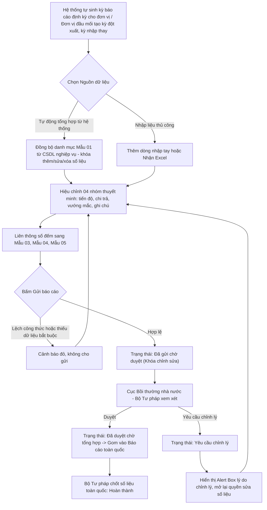

### 4.3.3.26. Quản lý kỳ báo cáo, nhập liệu biểu mẫu Thông tư 08/2019/TT-BTP

#### 1. Mục đích
Cho phép quản lý kỳ báo cáo, nhập liệu biểu mẫu và tổng hợp số liệu công tác bồi thường nhà nước theo Thông tư 08/2019/TT-BTP, bao gồm:
- Tạo lập, theo dõi và quản lý các kỳ báo cáo định kỳ (Báo cáo năm số liệu thực tế 10 tháng từ 01/01 - 31/10, Số liệu thống kê năm chính thức 01/01 - 31/12, Báo cáo tạm tính).
- Cho phép cơ quan chuyên môn (Sở Tư pháp) làm đầu mối kỹ thuật tại địa phương nhập thay số liệu cho các đơn vị cấp dưới (UBND cấp huyện/xã, sở ban ngành) theo 02 phương thức linh hoạt: Nhập trực tiếp kỳ Tổng hợp toàn tỉnh hoặc Nhập riêng từng đơn vị con rồi gom tự động.
- Lập số liệu biểu mẫu theo 02 nguồn dữ liệu tách bạch, xác định khi tạo kỳ báo cáo: `Tự động tổng hợp từ hệ thống` (số liệu lấy từ cơ sở dữ liệu nghiệp vụ, không cho thêm/sửa/xóa thủ công) hoặc `Nhập liệu thủ công` (dành cho đơn vị chưa vận hành phân hệ nghiệp vụ trên hệ thống).
- Áp dụng cơ chế chỉnh sửa có kiểm soát trên Mẫu 01 đối với vụ việc lấy từ hệ thống: Khóa chỉ đọc toàn bộ trường định danh và pháp lý; chỉ mở 04 nhóm thuyết minh gồm Tình hình giải quyết bồi thường, Chi trả tiền bồi thường, Khó khăn vướng mắc và Ghi chú, nhằm bảo toàn tính đối chiếu giữa số liệu báo cáo và hồ sơ gốc.
- Tự động liên thông số đếm vụ việc giữa Mẫu 01 với các chỉ tiêu thụ lý của Mẫu 03 (Tổng hợp tình hình), Mẫu 04 (Hoàn trả) và Mẫu 05 (Sổ thụ lý).
- Thực hiện quy trình gửi - duyệt - chỉnh lý nhiều cấp theo đúng Điều 26 Thông tư 08/2019/TT-BTP. Khi Bộ Tư pháp (Cục BTNN) yêu cầu chỉnh lý, kỳ báo cáo của địa phương chuyển sang trạng thái `Yêu cầu chỉnh lý`, tự động mở lại quyền cập nhật số liệu và hiển thị nổi bật lý do yêu cầu chỉnh lý.
- Hỗ trợ kết xuất toàn bộ bộ biểu mẫu báo cáo ra định dạng Excel, Word/PDF phục vụ công tác báo cáo theo quy định.

*a. Phân quyền*
- Cán bộ báo cáo của đơn vị (đơn vị không có đơn vị trực thuộc): Chỉ làm việc trên kỳ báo cáo của chính đơn vị mình, do hệ thống tự sinh theo [BR-BTNN-BC-008]. Được đồng bộ dữ liệu hệ thống, chọn vụ việc, thêm/sửa/xóa dòng biểu mẫu theo `Nguồn dữ liệu`, hiệu chỉnh thuyết minh, nộp kỳ báo cáo lên đầu mối cấp trên và cập nhật lại khi có yêu cầu chỉnh lý. **Không** được tạo kỳ báo cáo và không thấy kỳ báo cáo của đơn vị khác.
- Cán bộ báo cáo kiêm đầu mối kỹ thuật (đơn vị có đơn vị trực thuộc, ví dụ Sở Tư pháp tại địa phương): Có đầy đủ quyền của cán bộ báo cáo đơn vị đối với kỳ báo cáo của chính đơn vị mình; ngoài ra được tạo kỳ báo cáo đột xuất/tạm tính và tạo kỳ nhập thay cho các đơn vị cấp dưới chưa vận hành hệ thống, theo [BR-BTNN-BC-013].
- Cán bộ đầu mối tổng hợp (UBND cấp tỉnh / TANDTC / VKSNDTC / Bộ, ngành): Được tra cứu toàn bộ kỳ báo cáo của các đơn vị thuộc phạm vi quản lý, xem chi tiết số liệu, duyệt hoặc yêu cầu chỉnh lý từng đơn vị, loại trừ hoặc nhắc nộp đơn vị thành viên, tổng hợp số liệu thành báo cáo của đầu mối, gửi Bộ Tư pháp/Cục BTNN. Đồng thời có đầy đủ quyền của cán bộ báo cáo đơn vị đối với kỳ báo cáo riêng của chính cơ quan mình theo [BR-BTNN-BC-013].
- Cán bộ Bộ Tư pháp (Cục Bồi thường nhà nước): Được tra cứu toàn bộ kỳ báo cáo của các đầu mối trên phạm vi cả nước, xem chi tiết số liệu, duyệt hoặc yêu cầu chỉnh lý từng đầu mối, loại trừ hoặc nhắc nộp đầu mối, tổng hợp số liệu toàn quốc phục vụ báo cáo Chính phủ. Đồng thời có đầy đủ quyền của cán bộ báo cáo đơn vị đối với kỳ báo cáo riêng của chính cơ quan mình theo [BR-BTNN-BC-013].
- Lãnh đạo (mọi cấp): Được tra cứu, xem số liệu và kết xuất biểu mẫu theo phạm vi phân quyền; không nhập liệu, không duyệt.

*b. Điều kiện thực hiện*
- Người dùng đã đăng nhập Website quản trị và được gán vào cơ quan/đơn vị cụ thể theo cấu hình phân quyền hệ thống.
- Cây danh mục đơn vị [DM_DON_VI] đã được thiết lập phân cấp rành mạch, có cấu hình `Đầu mối tổng hợp trực tiếp` và `Đơn vị được phép nhập thay`.
- Các danh mục dùng chung đã sẵn sàng: Danh mục Loại cơ quan báo cáo [DM_43], Danh mục Loại kỳ báo cáo [DM_44], Danh mục Trạng thái kỳ báo cáo [DM_45], Danh mục Lĩnh vực phát sinh thiệt hại [DM_22], Danh mục Trạng thái vụ việc yêu cầu bồi thường [DM_24].
- Cơ sở dữ liệu nghiệp vụ bồi thường nhà nước đã sẵn sàng kết nối dữ liệu từ Tiếp nhận YCBT, Giải quyết yêu cầu bồi thường, Quyết định giải quyết, Kinh phí và Chi trả.

---

#### 2. Sơ đồ luồng nghiệp vụ theo giao diện

---

#### 3. Quy tắc nghiệp vụ chung

| Mã quy tắc | Nội dung |
| :--- | :--- |
| [BR-BTNN-BC-001] | Kỳ báo cáo chỉ được phép nhập liệu, thêm dòng, sửa dòng và đồng bộ lại khi ở trạng thái `Đang nhập liệu` hoặc `Yêu cầu chỉnh lý`. Khi ở trạng thái `Đã gửi chờ duyệt`, `Đã duyệt chờ tổng hợp`, `Đã tổng hợp` hoặc `Hoàn thành`, toàn bộ dữ liệu biểu mẫu chuyển sang chế độ chỉ đọc (Read-only) đối với đơn vị đã gửi. |
| [BR-BTNN-BC-002] | Trước khi cho phép `Gửi báo cáo` hoặc `Gửi lại báo cáo`, hệ thống kiểm tra: (i) đầy đủ các trường bắt buộc tại Cột (1), (3), (4), (5) của Mẫu 01; (ii) các công thức tổng hợp của Mẫu 03/04 khớp đúng (tổng ngang, tổng dọc); nếu có sai lệch, hệ thống tô đỏ cảnh báo tại ô bị lệch và không cho gửi. |
| [BR-BTNN-BC-003] | Khi cấp trên bấm `Yêu cầu chỉnh lý`, hệ thống bắt buộc nhập nội dung lý do chỉnh lý, chuyển trạng thái kỳ báo cáo của đơn vị cấp dưới sang **`Yêu cầu chỉnh lý`**, hiển thị khối cảnh báo lý do yêu cầu chỉnh lý trên màn hình chi tiết, gửi thông báo cho cán bộ báo cáo đơn vị đó; đồng thời mở lại toàn bộ quyền chỉnh sửa số liệu và hiển thị nút `Gửi lại báo cáo`. Số liệu đơn vị này tạm thời không được tính vào bảng tổng hợp của cấp trên cho đến khi được gửi lại và duyệt. |
| [BR-BTNN-BC-004] | Khi cấp trên bấm `Duyệt`, số liệu của đơn vị chuyển sang trạng thái `Đã duyệt chờ tổng hợp` và được tính vào bảng tổng hợp của cấp trên; đơn vị không còn được tự sửa số liệu trừ khi cấp trên `Yêu cầu chỉnh lý` lại. |
| [BR-BTNN-BC-005] | **Khóa số liệu theo Nguồn dữ liệu của biểu mẫu**: Mỗi biểu mẫu trong kỳ báo cáo có một `Nguồn dữ liệu` xác định khi tạo kỳ, quyết định phạm vi thao tác cho phép: - **Nguồn `Tự động tổng hợp từ hệ thống`**: Số liệu chỉ được nạp từ cơ sở dữ liệu nghiệp vụ thông qua chức năng `Đồng bộ từ hệ thống`. Hệ thống ẩn các chức năng `Thêm dòng` và `Nhận Excel`; không cho phép xóa dòng có nguồn gốc hệ thống. Trường hợp số liệu chưa đúng hoặc còn thiếu vụ việc, đơn vị phải điều chỉnh tại hồ sơ gốc ở phân hệ nghiệp vụ tương ứng rồi thực hiện `Đồng bộ từ hệ thống` lại; tuyệt đối không chỉnh sửa trực tiếp trên biểu mẫu báo cáo. - **Nguồn `Nhập liệu thủ công`**: Đơn vị được `Thêm dòng` và `Nhận Excel`, được nhập và sửa trực tiếp trên lưới, được xóa các dòng do mình nhập. Hệ thống ẩn chức năng `Đồng bộ từ hệ thống`. |
| [BR-BTNN-BC-011] | **Phạm vi trường được phép hiệu chỉnh trên dòng vụ việc lấy từ hệ thống**: Hệ thống khóa chỉ đọc các trường `Lĩnh vực phát sinh thiệt hại`, `Cột (1) Họ và tên người yêu cầu bồi thường`, `Cột (2) Địa chỉ người yêu cầu bồi thường`, `Cột (3) Cơ quan giải quyết bồi thường`, `Cột (4) Pháp luật áp dụng để giải quyết`. Chỉ mở nhập liệu 04 trường thuyết minh: `Cột (5) Tình hình giải quyết bồi thường`, `Cột (6) Chi trả tiền bồi thường`, `Cột (7) Khó khăn, vướng mắc`, `Cột (8) Ghi chú`. Quy tắc này áp dụng cho mọi cấp đơn vị và không phụ thuộc `Nguồn dữ liệu` của biểu mẫu. |
| [BR-BTNN-BC-012] | **Loại trừ đơn vị khỏi kỳ báo cáo tổng hợp**: Cán bộ đầu mối được chủ động loại trừ một đơn vị thành viên khỏi kỳ tổng hợp (ví dụ đơn vị đã giải thể, chia tách, sáp nhập hoặc không thuộc diện nộp báo cáo trong kỳ). Khi loại trừ, hệ thống bắt buộc nhập lý do, không cộng dồn số liệu của đơn vị đó vào biểu mẫu tổng hợp và không tính đơn vị đó vào tiến độ theo dõi nộp báo cáo; thao tác loại trừ và lý do được ghi vào Lịch sử xử lý của kỳ tổng hợp để phục vụ giải trình. Việc loại trừ chỉ thực hiện được khi kỳ tổng hợp ở trạng thái `Đang nhập liệu`, `Yêu cầu chỉnh lý` hoặc `Đã tổng hợp`; sau khi kỳ đã gửi hoặc đã chốt thì danh sách đơn vị thành viên được khóa. Đơn vị bị loại trừ vẫn giữ nguyên kỳ báo cáo và số liệu của mình, có thể được đưa trở lại phạm vi tổng hợp bất kỳ lúc nào khi kỳ còn mở. |
| [BR-BTNN-BC-013] | **Phân định kỳ báo cáo riêng đơn vị, kỳ báo cáo tổng hợp và thẩm quyền tạo kỳ**: Hệ thống tách bạch 02 tiêu chí độc lập khi sinh và phân quyền kỳ báo cáo: - *Đơn vị thuộc diện nộp báo cáo*: Hệ thống tự sinh 01 kỳ báo cáo `Riêng đơn vị được chọn` cho mọi đơn vị thuộc diện nộp, không phân biệt cấp. Đơn vị đầu mối tổng hợp (UBND cấp tỉnh, Bộ/ngành, TANDTC, VKSNDTC, Cục Bồi thường nhà nước) vẫn phải lập kỳ riêng này để báo cáo số liệu vụ việc phát sinh tại chính cơ quan mình. - *Đơn vị có đơn vị trực thuộc*: Hệ thống sinh thêm 01 kỳ báo cáo `Tổng hợp đơn vị trực thuộc` song song với kỳ riêng ở trên; hai kỳ có vòng trạng thái độc lập, hiển thị thành 02 dòng riêng trên MH01. - *Thẩm quyền tạo kỳ*: Nút `Tạo kỳ báo cáo` chỉ hiển thị với đơn vị có đơn vị trực thuộc theo cây danh mục [DM_DON_VI], và chỉ phục vụ tạo kỳ báo cáo đột xuất/tạm tính hoặc kỳ nhập thay cho đơn vị cấp dưới chưa vận hành hệ thống. Đơn vị không có đơn vị trực thuộc không được tạo kỳ báo cáo; toàn bộ kỳ định kỳ của đơn vị đó do hệ thống tự sinh theo [BR-BTNN-BC-008]. - *Xác định phạm vi thao tác*: Hệ thống xác định một kỳ báo cáo là "của chính đơn vị đang đăng nhập" theo mã đơn vị của kỳ, không theo cấp của kỳ. Kỳ mang mã đơn vị của người dùng được mở quyền nhập liệu và gửi báo cáo; kỳ của đơn vị cấp dưới chỉ được xem, duyệt hoặc yêu cầu chỉnh lý. |
| [BR-BTNN-BC-014] | **Xác định đơn vị nhận báo cáo khi tổng hợp số liệu**: Khi hệ thống tổng hợp số liệu của một kỳ báo cáo lên cấp trên, thứ tự xác định đơn vị nhận báo cáo như sau: - **Ưu tiên 1 - Luồng động**: Áp dụng theo cấu hình đã khai báo tại **Cấu hình luồng báo cáo phân hệ Bồi thường nhà nước** (mục 4.3.3.27), nếu tồn tại cấu hình ở trạng thái `Hoạt động`, đúng biểu mẫu báo cáo, có chứa đơn vị lập báo cáo tương ứng và ngày chốt số liệu của kỳ nằm trong khoảng thời gian áp dụng của cấu hình. - **Ưu tiên 2 - Cây cấp đơn vị**: Nếu không tồn tại cấu hình luồng động phù hợp, hệ thống tổng hợp về đơn vị cấp trên trực tiếp theo đúng cây cấp đơn vị đã khai báo tại Danh mục Cơ quan, Đơn vị giải quyết [DM_DON_VI]. - Cấu hình ở trạng thái `Tạm ngưng` bị bỏ qua hoàn toàn khi xác định luồng động. |
| [BR-BTNN-BC-006] | Bảng tổng hợp cấp đầu mối và cấp toàn quốc chỉ cộng dồn số liệu của các đơn vị cấp dưới đang ở trạng thái `Đã duyệt chờ tổng hợp`, `Đã tổng hợp` hoặc `Hoàn thành`. Các đơn vị đang ở trạng thái `Đang nhập liệu`, `Đã gửi chờ duyệt` hoặc `Yêu cầu chỉnh lý` được xếp vào nhóm `Chưa tổng hợp` để cấp trên đôn đốc. |
| [BR-BTNN-BC-007] | Sau khi kỳ báo cáo chuyển sang trạng thái `Hoàn thành`, hệ thống chỉ cho phép tạo bản ghi điều chỉnh dưới dạng phiên bản mới (tăng số phiên bản, lưu giữ nguyên trạng bản đã chốt) để bảo toàn vết kiểm toán số liệu. |
| [BR-BTNN-BC-008] | **Tự động sinh kỳ báo cáo định kỳ**: Định kỳ hàng năm, hệ thống tự động kích hoạt tạo sẵn danh sách Kỳ báo cáo ở trạng thái `Đang nhập liệu` cho 100% đơn vị thuộc diện nộp báo cáo: vào ngày `15/10` đối với Báo cáo năm số liệu thực tế (01/01 - 31/10) và vào ngày `15/12` đối với Số liệu thống kê năm chính thức (01/01 - 31/12). Cán bộ các đơn vị không phải tự tạo thủ công mà chỉ cần đăng nhập kiểm tra số liệu và nộp. Nút "Tạo kỳ báo cáo" chỉ phục vụ báo cáo đột xuất/tạm tính hoặc Sở Tư pháp tạo riêng để nhập thay cho cấp dưới. |
| [BR-BTNN-BC-009] | **Phân định phạm vi và thẩm quyền nộp báo cáo**: Hệ thống phân tầng rành mạch giữa 02 cấp thẩm quyền: - *Nguồn bắt buộc nộp Bộ Tư pháp (Cấp 1 Quốc gia)*: Gồm 63 UBND Tỉnh/Thành phố (do Sở Tư pháp làm cơ quan thường trực tham mưu lập và đại diện toàn tỉnh gửi) và các Bộ, cơ quan ngang Bộ, TANDTC, VKSNDTC. Bộ Tư pháp theo dõi tiến độ nộp dựa trên danh sách các đầu mối bắt buộc này. - *Đơn vị nội bộ tỉnh nộp Sở Tư pháp*: Các UBND Quận/Huyện/Thị xã và các Sở ban ngành trực thuộc tỉnh. Sở Tư pháp có thể tổng hợp trực tiếp số liệu của toàn tỉnh vào 01 báo cáo hoặc tạo kỳ nhập thay chi tiết cho từng đơn vị cấp dưới trước khi tổng hợp gửi Bộ. - *Đơn vị nội bộ Bộ, ngành nộp đầu mối của Bộ, ngành*: Các Tổng cục, Cục, Vụ, đơn vị sự nghiệp trực thuộc Bộ/cơ quan ngang Bộ nộp về đơn vị đầu mối do Bộ/ngành đó chỉ định; TAND và VKSND địa phương nộp theo ngành dọc về TANDTC/VKSNDTC. Đầu mối của Bộ, ngành áp dụng cùng cơ chế tổng hợp như Sở Tư pháp tại địa phương. - *Nguyên tắc chung*: Hệ thống không giới hạn cứng số cấp; mỗi đơn vị trong cây danh mục [DM_DON_VI] chỉ nộp về đúng một `Đầu mối tổng hợp trực tiếp` đã cấu hình, và cùng một bộ màn hình, quy trình gửi - duyệt - chỉnh lý được áp dụng lặp lại ở mọi cấp. |
| [BR-BTNN-BC-010] | **Kiểm soát số lần gửi và phiên bản**: Mỗi kỳ báo cáo của một đơn vị tại một thời điểm chỉ có duy nhất 01 bản nộp chính thức đang được xử lý. Khi đơn vị bấm `Gửi báo cáo`, toàn bộ dữ liệu bị khóa (chế độ chỉ đọc) để phục vụ thẩm định. Đơn vị chỉ được phép cập nhật và bấm `Gửi lại báo cáo` khi cấp trên trả lại ở trạng thái `Yêu cầu chỉnh lý`. Khi cấp trên đã bấm `Duyệt`, kỳ báo cáo bị khóa vĩnh viễn, đơn vị không được gửi lại. |

---

### MH01 - Màn hình Danh sách kỳ báo cáo & Dashboard giám sát tiến độ

#### 1. Màn hình

#### 2. Mô tả thông tin trên màn hình

| Trường thông tin | Kiểu dữ liệu | Bắt buộc | Mặc định | Mô tả |
| :--- | :--- | :--- | :--- | :--- |
| Tiêu đề màn hình | String(255) | - | - | Control UI: Page Header. Chỉ đọc. `QUẢN LÝ KỲ BÁO CÁO, NHẬP LIỆU BIỂU MẪU THÔNG TƯ 08/2019/TT-BTP`. |
| **I. Thanh chuyển đổi chế độ xem đa năng (View Mode Switcher)** | | | | |
| Chế độ 1: Quản lý theo Kỳ báo cáo | Button Tab | - | Kích hoạt mặc định | Control UI: Tab button. Góc nhìn quản lý theo từng đơn vị và kỳ nộp báo cáo. |
| Chế độ 2: Tra cứu Vụ việc tập trung | Button Tab | - | - | Control UI: Tab button. Góc nhìn tập trung Mẫu 01/BTNN: Gom toàn bộ vụ việc bồi thường của tất cả các đơn vị trong năm vào một bảng dữ liệu thống nhất; hỗ trợ tìm kiếm nhanh theo Họ tên người YCBT, Lĩnh vực, Tiến độ giải quyết và Tình trạng chi trả. |
| Chế độ 3: Ma trận So sánh Chỉ tiêu | Button Tab | - | - | Control UI: Tab button. Góc nhìn đối soát Mẫu 03 & 04: Hiển thị bảng so sánh số liệu ngang giữa các Đơn vị hoặc giữa các Kỳ trong năm; tự động highlight các chỉ tiêu có biến động lớn. |
| **II. Khối Dashboard Giám sát tiến độ nộp báo cáo** | | | | |
| Tiêu đề khối Dashboard | String(255) | - | - | Control UI: Section Title. Chỉ đọc: `Theo dõi tiến độ nộp báo cáo Thông tư 08/2019/TT-BTP`. |
| Nhãn phạm vi giám sát | String(255) | - | Theo vai trò | Control UI: Badge. Chỉ đọc. Hiển thị: `63 Tỉnh/Thành phố & Bộ ngành (Nguồn bắt buộc nộp Bộ)` (với Bộ Tư pháp) hoặc `30 Đơn vị trực thuộc tỉnh (Nộp cho Sở Tư pháp)` (với Sở Tư pháp). |
| KPI 1: Tổng số đơn vị phải nộp | Integer(10) | - | Theo vai trò | Control UI: KPI Card. Chỉ đọc. Hiển thị tổng số đơn vị phải nộp (83 đơn vị đối với Bộ Tư pháp; 30 đơn vị đối với Sở Tư pháp). Click để lọc toàn bộ danh sách. |
| KPI 2: Đã nộp / Đã duyệt | Integer(10) | - | Theo dữ liệu | Control UI: KPI Card. Chỉ đọc. Hiển thị số lượng và tỷ lệ % hoàn thành tiến độ (màu xanh lá). Click để lọc nhanh các đơn vị đã gửi/đã duyệt. |
| KPI 3: Yêu cầu chỉnh lý | Integer(10) | - | Theo dữ liệu | Control UI: KPI Card. Chỉ đọc. Hiển thị số lượng đơn vị bị trả lại yêu cầu chỉnh lý (màu vàng cam). Click để lọc nhanh các đơn vị đang chỉnh lý. |
| KPI 4: Chưa nộp / Quá hạn | Integer(10) | - | Theo dữ liệu | Control UI: KPI Card. Chỉ đọc. Hiển thị số lượng đơn vị chưa nộp hoặc quá hạn (màu đỏ cảnh báo). Click để mở danh sách đôn đốc khẩn cấp. |
| Thanh Tab lọc nhanh theo tiến độ | Enum(String) | - | `Tất cả đơn vị` | Control UI: Tab buttons bar. Gồm: + Tất cả đơn vị + Đã nộp / Đã duyệt + Yêu cầu chỉnh lý + ⚠️ Chưa nộp báo cáo |
| Khối cảnh báo hạn nộp & Nút Đôn đốc tất cả | Panel | Không | Ẩn | Control UI: Alert Box. Hiển thị khi chọn tab `⚠️ Chưa nộp báo cáo`. Hiển thị nút `Đôn đốc tất cả` (icon `fa-paper-plane`). |
| **III. Bộ lọc tìm kiếm kỳ báo cáo** | | | | |
| Năm báo cáo | Enum(String(10)) | Không | Năm hiện tại | Control UI: Combobox. Hiển thị 05 năm gần nhất. |
| Loại kỳ báo cáo | Enum(String(100)) | Không | `Tất cả` | Control UI: Combobox. Tham chiếu Danh mục Loại kỳ báo cáo [DM_44]. |
| Đơn vị/Đầu mối | Enum(Tree) | Không | Theo phạm vi phân quyền | Control UI: Popup chọn cây đơn vị. Tham chiếu Danh mục Cơ quan, Đơn vị giải quyết [DM_DON_VI]. Cho phép lọc theo đơn vị báo cáo thực tế hoặc đầu mối tổng hợp. |
| Mã hoặc tên đơn vị | String(255) | Không | Trống | Control UI: Textbox. Cho phép nhập từ khóa để tìm kiếm theo Mã đơn vị hoặc Tên đơn vị báo cáo. Hệ thống tìm kiếm tương đối, không phân biệt chữ hoa chữ thường và không phân biệt dấu. Người dùng có thể nhấn phím `Enter` để thực hiện tìm kiếm. |
| Trạng thái | Enum(String(100)) | Không | `Tất cả` | Control UI: Combobox. Tham chiếu Danh mục DM_45 [DM_45], gồm: + Tất cả + Đang nhập liệu + Đã gửi chờ duyệt + Yêu cầu chỉnh lý + Đã gửi lại (Lần 2) + Đã duyệt chờ tổng hợp + Kỳ tổng hợp + Đã tổng hợp + Hoàn thành |
| Nút: Xóa bộ lọc | Button | Không | Hiển thị | Control UI: Button (icon `fa-filter-circle-xmark`). Luôn hiển thị khả dụng. |
| Nút: Tìm kiếm | Button | Không | Hiển thị | Control UI: Button (icon `fa-magnifying-glass`). Luôn hiển thị khả dụng. |
| Nút: Tạo kỳ báo cáo | Button | Không | Ẩn/Hiện | Control UI: Button (icon `fa-plus`). - Chỉ hiển thị với đơn vị có đơn vị trực thuộc theo cây danh mục [DM_DON_VI], áp dụng [BR-BTNN-BC-013]. - Ẩn hoàn toàn với đơn vị không có đơn vị trực thuộc, do toàn bộ kỳ định kỳ của đơn vị đó được hệ thống tự sinh theo [BR-BTNN-BC-008]. |
| Khối mở nhanh kỳ tổng hợp | Text(1000) | Không | Theo vai trò | Control UI: Quick tiles. Hiển thị với đầu mối tổng hợp (UBND cấp tỉnh) và Bộ Tư pháp/Cục BTNN để mở nhanh kỳ tổng hợp của mình. |
| **IV. Bảng danh sách kỳ báo cáo & đôn đốc** | - | - | 10 bản ghi/trang | Control UI: Data grid. - Tải trang đầu tiên mặc định 10 bản ghi, sắp xếp theo "Ngày tạo" giảm dần. - Trạng thái không có dữ liệu: Hiển thị 01 dòng căn giữa `colspan="10"` theo [MSG-INF-SYS-001]. |
| Cột: STT | Integer(10) | Không | Tự tăng | Control UI: Text. Chỉ đọc. Đánh số thứ tự từ 1 đến hết trang. |
| Cột: Năm | Integer(4) | Có | Theo dữ liệu | Control UI: Text. Chỉ đọc. |
| Cột: Loại kỳ báo cáo | Enum(String(100)) | Có | Theo dữ liệu | Control UI: Text. Chỉ đọc. Tham chiếu Danh mục Loại kỳ báo cáo [DM_44]. |
| Cột: Phân loại nguồn | Enum(String(50)) | Có | Theo dữ liệu | Control UI: Badge. Chỉ đọc. Gồm: + `Nguồn nộp Bộ` (đối với 63 Tỉnh/Thành phố & Bộ ngành nộp Bộ Tư pháp) + `Đơn vị nội bộ tỉnh` (đối với Quận, Huyện, Phường, Xã nộp Sở Tư pháp). |
| Cột: Đơn vị báo cáo | String(255) | Có | Theo dữ liệu | Control UI: Text. Chỉ đọc. Hiển thị tên đơn vị báo cáo. Trường hợp ở tab Chưa nộp, hiển thị thêm Họ tên và SĐT cán bộ đầu mối liên hệ. |
| Cột: Đơn vị nhập liệu | String(255) | Có | Theo dữ liệu | Control UI: Badge. Chỉ đọc. Gồm: `Chính đơn vị nộp` hoặc `Sở Tư pháp (Nhập thay)`. |
| Cột: Xem nhanh Biểu mẫu TT08 | Action pills | Không | Theo dữ liệu | Control UI: Group pill buttons. Gồm các nút bấm nhanh: `M01`, `M03`, `M04`, `M05`. Khi click, mở ngay **Modal Xem nhanh Biểu mẫu (Quick Form Preview Modal)** hiển thị đầy đủ bảng biểu của kỳ đó mà không cần chuyển trang. |
| Cột: Trạng thái | Enum(String(100)) | Có | Theo dữ liệu | Control UI: Badge. Gồm: + `Đang nhập liệu` (xám) + `Đã gửi chờ duyệt` (xanh dương) + `Yêu cầu chỉnh lý` (vàng cam) + `Đã gửi lại (Lần 2)` (tím nhạt) + `Đã duyệt chờ tổng hợp` (xanh lá) + `Kỳ tổng hợp` (vàng hoàng gia) + `Hoàn thành` (xanh lá đậm) + `Quá hạn / Chưa nộp` (đỏ). |
| Cột: Ngày gửi gần nhất | DateTime | Không | Theo dữ liệu | Control UI: Text. Chỉ đọc. Định dạng `dd/mm/yyyy hh:mm` hoặc trạng thái đôn đốc gần nhất. |
| Cột: Thao tác | Action buttons | Không | Theo quy chuẩn cố định 4 slots | Control UI: Group icon button (tuân thủ User Rule #3 luôn hiển thị 4 nút cố định): + Slot 1: `Xem chi tiết` (mở toàn bộ workspace 5 tab) + Slot 2: `Biên tập số liệu` (khả dụng khi đang nhập liệu hoặc bị chỉnh lý; làm mờ khi đã gửi/duyệt) + Slot 3: `Kết xuất Excel` (khả dụng khi có số liệu đã gửi/duyệt; làm mờ khi chưa có số liệu) + Slot 4: `Xóa kỳ nháp` (với cán bộ tạo kỳ nháp) hoặc `Đôn đốc` (với cấp trên khi đơn vị chậm nộp; làm mờ khi không áp dụng). |
| Thanh phân trang | Panel | - | 10 bản ghi/trang | Control UI: Pagination bar đặt dưới bảng danh sách. - Bên trái: Combobox chọn số lượng bản ghi trên trang gồm các giá trị: + 10 + 20 + 50 + 100 kèm dòng thông tin `Đang xem [từ] đến [đến] trong tổng số [tổng] bản ghi`. - Bên phải: Nút `Trang trước`, các nút số trang và nút `Trang sau`; nút trang hiện hành hiển thị trạng thái được chọn; nút `Trang trước` khóa mờ tại trang đầu và nút `Trang sau` khóa mờ tại trang cuối. - Ẩn toàn bộ thanh phân trang khi không có bản ghi nào phù hợp điều kiện lọc. |

#### 3. Chức năng trên màn hình

| STT | Tên chức năng | Định dạng | Mô tả |
| :--- | :--- | :--- | :--- |
| 1 | Lọc theo tiến độ | Tab button / Card click | Khi người dùng click vào các thẻ KPI hoặc Tab tiến độ (`Tất cả`, `Đã nộp/Đã duyệt`, `Yêu cầu chỉnh lý`, `Chưa nộp`), hệ thống lọc lại bảng danh sách tương ứng. Khi chọn `Chưa nộp`, hiển thị danh sách đơn vị chưa gửi kèm nút đôn đốc. |
| 2 | Đôn đốc đơn vị | Button / Icon button | Khi người dùng bấm nút `Đôn đốc` tại dòng đơn vị chưa nộp hoặc bấm `Đôn đốc tất cả`, hệ thống mở **Hộp thoại xác nhận đôn đốc (Custom Confirmation Modal)** theo [MSG-CFM-SYS-001]. Sau khi người dùng xác nhận, hệ thống gửi thông báo tác nghiệp và email đến lãnh đạo/chuyên viên đầu mối đơn vị đó, cập nhật thời điểm đôn đốc gần nhất và hiển thị [MSG-SUC-SYS-002]. |
| 3 | Xóa bộ lọc | Button | Hệ thống đặt lại toàn bộ điều kiện lọc về mặc định ban đầu, tải lại bảng danh sách kỳ báo cáo và đưa về Trang 1. |
| 4 | Tìm kiếm | Button | Hệ thống lọc danh sách kỳ báo cáo theo các tiêu chí đã chọn, cập nhật bảng kết quả và đưa về Trang 1; nếu không có bản ghi phù hợp thì hiển thị thông báo [MSG-INF-SYS-001]. |
| 5 | Tạo kỳ báo cáo | Button | Hệ thống mở **MH02 - Màn hình Tạo/Cập nhật kỳ báo cáo** để người dùng chọn Đơn vị, Phạm vi, Loại kỳ, Nguồn dữ liệu và Thời gian báo cáo. |
| 6 | Mở/Xem chi tiết | Icon button | Hệ thống mở chi tiết kỳ báo cáo tương ứng tại **MH03 - Màn hình Chi tiết kỳ báo cáo**. Nếu là cán bộ cấp trên xem kỳ báo cáo của đơn vị cấp dưới đang chờ duyệt, mở màn hình duyệt tương ứng. |
| 7 | Xóa | Icon button | Hiển thị khả dụng khi kỳ ở trạng thái `Đang nhập liệu` và do người dùng tạo. Hiển thị xác nhận [MSG-CFM-SYS-001]; sau xác nhận, xóa kỳ báo cáo và hiển thị [MSG-SUC-SYS-002]. |
| 8 | Thanh phân trang | Panel | Khi người dùng chọn lại số lượng bản ghi trên trang, hệ thống áp dụng số lượng mới, đưa về Trang 1 và tải lại bảng danh sách. Khi người dùng click nút số trang, `Trang trước` hoặc `Trang sau`, hệ thống tải lại bảng danh sách theo đúng trang được chọn, giữ nguyên toàn bộ điều kiện lọc hiện hành và cập nhật lại dòng thông tin số bản ghi đang xem. |

---

### MH02 - Màn hình Tạo/Cập nhật kỳ báo cáo

#### 1. Màn hình

#### 2. Mô tả thông tin trên màn hình

| Trường thông tin | Kiểu dữ liệu | Bắt buộc | Mặc định | Mô tả |
| :--- | :--- | :--- | :--- | :--- |
| Đơn vị báo cáo | Enum(Tree) | Có | Trống | Control UI: Popup chọn cây đơn vị. Tham chiếu Danh mục Cơ quan, Đơn vị giải quyết [DM_DON_VI]. Hiển thị theo cây phân cấp trong phạm vi tài khoản được phép tạo/nhập thay; áp dụng [BR-VAL-001]. |
| Phạm vi số liệu | Enum(String(100)) | Có | `Riêng đơn vị được chọn` | Control UI: Combobox. - Khóa mờ (`Disabled`) khi chưa chọn `Đơn vị báo cáo`, hoặc khi đơn vị được chọn không có đơn vị trực thuộc theo [BR-BTNN-BC-013]; khi đó hệ thống hiển thị dòng chú thích nêu rõ lý do khóa ngay dưới ô nhập. - Giá trị gồm: + Riêng đơn vị được chọn + Tổng hợp đơn vị trực thuộc |
| Đơn vị nhập liệu | String(255) | - | Theo tài khoản | Control UI: Textbox. Chỉ đọc. Tự động điền cơ quan của tài khoản đăng nhập (ví dụ: *Sở Tư pháp Thành phố Hà Nội*). |
| Loại báo cáo | Enum(String(100)) | Có | `Bộ biểu mẫu TT08 (Mẫu 01/03/04/05)` | Control UI: Combobox. Gồm: + Bộ biểu mẫu TT08 (Mẫu 01/03/04/05) + Mẫu 01 - Danh mục vụ việc giải quyết yêu cầu bồi thường + Mẫu 03 - Tổng hợp tình hình yêu cầu bồi thường, giải quyết và chi trả + Mẫu 04 - Tình hình thực hiện trách nhiệm hoàn trả + Mẫu 05 - Sổ thụ lý |
| Nguồn dữ liệu | Enum(String(50)) | Có | `Tự động tổng hợp từ hệ thống` | Control UI: Combobox. - Xác định phạm vi thao tác trên biểu mẫu của kỳ báo cáo theo [BR-BTNN-BC-005]. - Giá trị gồm: + Tự động tổng hợp từ hệ thống + Nhập liệu thủ công |
| Năm báo cáo | Enum(String(10)) | Có | Năm hiện tại | Control UI: Combobox. Năm của kỳ báo cáo; không cho sửa sau khi đã tạo kỳ. |
| Loại kỳ báo cáo | Enum(String(100)) | Có | `Báo cáo năm số liệu thực tế (01/01 - 31/10)` | Control UI: Combobox. Tham chiếu Danh mục Loại kỳ báo cáo [DM_44]. |
| Từ ngày | Date | Có | `01/01/[Năm]` | Control UI: Datepicker text box có icon lịch. Định dạng `dd/mm/yyyy`. Tự động thiết lập theo Loại kỳ; cho phép điều chỉnh với báo cáo tạm tính. |
| Đến ngày | Date | Có | `31/10/[Năm]` | Control UI: Datepicker text box có icon lịch. Định dạng `dd/mm/yyyy`. Bắt buộc lớn hơn hoặc bằng Từ ngày theo [BR-VAL-007]. |
| Nút: Hủy bỏ | Button | Không | Hiển thị | Control UI: Button. Đóng modal tạo kỳ, không lưu dữ liệu. |
| Nút: Tạo kỳ báo cáo | Button | Không | Hiển thị | Control UI: Button. Luôn hiển thị khả dụng. |

#### 3. Chức năng trên màn hình

| STT | Tên chức năng | Định dạng | Mô tả |
| :--- | :--- | :--- | :--- |
| 1 | Hủy bỏ | Button | Hệ thống đóng form tạo kỳ báo cáo, không lưu dữ liệu. |
| 2 | Tạo kỳ báo cáo | Button | Hệ thống kiểm tra điều kiện bắt buộc: Đơn vị báo cáo, Phạm vi, Loại báo cáo, Loại kỳ và khoảng ngày hợp lệ [BR-VAL-007]. Kiểm tra không trùng kỳ chính thức đã tồn tại. Tạo kỳ báo cáo ở trạng thái `Đang nhập liệu`, chuyển thẳng sang màn hình chi tiết tại **MH03 - Tab Mẫu 01** và hiển thị [MSG-SUC-SYS-002]. |

---

### MH03 - Tab Mẫu 01 - Danh mục vụ việc giải quyết yêu cầu bồi thường

#### 1. Màn hình

#### 2. Mô tả thông tin trên màn hình

| Trường thông tin | Kiểu dữ liệu | Bắt buộc | Mặc định | Mô tả |
| :--- | :--- | :--- | :--- | :--- |
| **I. Khối thông tin chung & Điều hướng biểu mẫu** | | | | |
| Khối thông tin kỳ | String(255) | - | Theo dữ liệu | Control UI: Meta info panel. Chỉ đọc: Năm báo cáo, Loại kỳ, Đơn vị báo cáo, Phạm vi số liệu, Trạng thái kỳ. |
| Khối cảnh báo lý do yêu cầu chỉnh lý | Text(1000) | Không | Ẩn | Control UI: Alert Box (màu vàng cam). - Chỉ hiển thị khi kỳ báo cáo ở trạng thái `Yêu cầu chỉnh lý`. - Nội dung hiển thị: `Lý do yêu cầu chỉnh lý từ [Cơ quan cấp trên]: [Nội dung lý do]`, `Người yêu cầu: [Họ tên]`, `Thời điểm yêu cầu: [Thời gian]`. |
| Thanh Tab ngang chuyển đổi biểu mẫu | Enum(String) | Có | `Mẫu 01` | Control UI: Horizontal Nav Tabs Bar. Hệ thống tab ngang cỡ lớn hiển thị nổi bật 04 biểu mẫu chuẩn Thông tư 08/2019/TT-BTP kèm badge số lượng dữ liệu: + `Mẫu 01 - Danh mục vụ việc` (icon `fa-file-invoice`, kèm badge số vụ việc) + `Mẫu 03 - Tổng hợp tình hình` (icon `fa-chart-pie`, kèm badge 26 chỉ tiêu) + `Mẫu 04 - Trách nhiệm hoàn trả` (icon `fa-hand-holding-dollar`, kèm badge 15 chỉ tiêu) + `Mẫu 05 - Sổ thụ lý` (icon `fa-book-bookmark`, kèm badge số hồ sơ) + `Lịch sử xử lý` (icon `fa-clock-rotate-left`) |
| Thanh hiển thị nguồn số liệu | String(255) | - | Theo kỳ | Control UI: Info Bar. Chỉ đọc. Hiển thị nguồn dữ liệu tương ứng của biểu mẫu đang kích hoạt (`Tự động tổng hợp từ hệ thống` hoặc `Nhập liệu thủ công`). |
| **II. Thanh công cụ Toolbar Mẫu 01** | | | | |
| Nhãn Nguồn dữ liệu | Enum(String(50)) | - | Theo kỳ báo cáo | Control UI: Badge (icon `fa-database`). - Chỉ đọc. Hiển thị `Nguồn dữ liệu` đang áp dụng cho biểu mẫu Mẫu 01 của kỳ báo cáo. - Giá trị gồm: + Tự động tổng hợp từ hệ thống + Nhập liệu thủ công |
| Nút: Đồng bộ từ hệ thống | Button | Không | Ẩn/Hiện | Control UI: Button (icon `fa-rotate`). - Chỉ hiển thị khi `Nguồn dữ liệu` của Mẫu 01 là `Tự động tổng hợp từ hệ thống` theo [BR-BTNN-BC-005]; ẩn hoàn toàn khi nguồn là `Nhập liệu thủ công`. - Khả dụng khi kỳ ở trạng thái `Đang nhập liệu` hoặc `Yêu cầu chỉnh lý`. - Khóa mờ khi kỳ ở trạng thái `Đã gửi chờ duyệt`, `Đã duyệt chờ tổng hợp`, `Đã tổng hợp` hoặc `Hoàn thành`. |
| Nút: Nhận Excel | Button | Không | Ẩn/Hiện | Control UI: Button (icon `fa-file-import`). - Chỉ hiển thị khi `Nguồn dữ liệu` của Mẫu 01 là `Nhập liệu thủ công` theo [BR-BTNN-BC-005]; ẩn hoàn toàn khi nguồn là `Tự động tổng hợp từ hệ thống`. - Chỉ hiển thị khi kỳ ở trạng thái `Đang nhập liệu` hoặc `Yêu cầu chỉnh lý`; ẩn ở các trạng thái còn lại. |
| Nút: Kết xuất Excel | Button | Không | Hiển thị | Control UI: Button (icon `fa-file-excel`). - Hiển thị khả dụng khi bảng có dữ liệu. - Khóa mờ kèm tooltip khi bảng trống. |
| Nút: Gửi báo cáo / Gửi lại báo cáo | Button | Không | Hiển thị | Control UI: Button (icon `fa-paper-plane`). - Khi kỳ ở trạng thái `Đang nhập liệu`: Hiển thị nhãn **`Gửi báo cáo`**. - Khi kỳ ở trạng thái `Yêu cầu chỉnh lý`: Hiển thị nhãn **`Gửi lại báo cáo`**. - Khóa mờ khi kỳ đã gửi chờ duyệt hoặc đã duyệt. |
| **III. Bảng danh mục Mẫu 01** | - | - | Toàn bộ danh mục | Control UI: Data grid. Bảng hiển thị hợp nhất cả dòng tự động hệ thống và dòng nhập tay theo đúng chuẩn 8 cột của Thông tư 08/2019/TT-BTP. |
| Nhóm dòng theo lĩnh vực | String(255) | - | Theo dữ liệu | Control UI: Table group header row. Chỉ đọc. Nhóm theo 06 lĩnh vực phát sinh thiệt hại từ `I` đến `VI`. Dòng tiêu đề hiển thị số La Mã tại cột STT, tên lĩnh vực merge (colspan) từ Cột (1) đến cột Thao tác, kèm số lượng vụ việc của nhóm. |
| Nút: Thêm dòng | Button | Không | Ẩn/Hiện | Control UI: Button (icon `fa-plus`), bố trí tại dòng cuối cùng của từng nhóm lĩnh vực bên trong bảng danh mục (không bố trí tại thanh công cụ ngoài bảng). - Chỉ hiển thị khi `Nguồn dữ liệu` của Mẫu 01 là `Nhập liệu thủ công` theo [BR-BTNN-BC-005]; ẩn hoàn toàn khi nguồn là `Tự động tổng hợp từ hệ thống`. - Chỉ hiển thị khi kỳ ở trạng thái `Đang nhập liệu` hoặc `Yêu cầu chỉnh lý`; ẩn ở các trạng thái còn lại. |
| Cột: STT | Integer(10) | - | Tự tăng | Control UI: Text. Chỉ đọc. Đánh số thứ tự 1, 2, 3... trong từng nhóm lĩnh vực. Hiển thị kèm Badge nguồn gốc: `[Hệ thống]` (màu xanh dương) hoặc `[Nhập tay]` (màu cam nhạt). |
| Cột (1): Họ và tên của người yêu cầu bồi thường | String(100) | Có | Theo dữ liệu | Control UI: Text / Link. - Đối với dòng hệ thống: Hiển thị dạng liên kết văn bản màu xanh; khóa chỉ đọc. - Đối với dòng nhập tay: Cho phép sửa trực tiếp; áp dụng [BR-VAL-001]. |
| Cột (2): Địa chỉ của người yêu cầu bồi thường | String(500) | Không | Theo dữ liệu | Control UI: Text. - Đối với dòng hệ thống: Khóa chỉ đọc. - Đối với dòng nhập tay: Cho phép sửa trực tiếp. |
| Cột (3): Cơ quan giải quyết bồi thường | String(255) | Có | Theo dữ liệu | Control UI: Text / Combobox autocomplete. - Đối với dòng hệ thống: Khóa chỉ đọc. - Đối với dòng nhập tay: Hỗ trợ tìm kiếm chọn nhanh các đơn vị cấp dưới trong tỉnh từ [DM_DON_VI] hoặc gõ tên cơ quan; áp dụng [BR-VAL-001]. |
| Cột (4): Pháp luật áp dụng để giải quyết bồi thường | Enum(String(100)) | Có | Theo dữ liệu | Control UI: Combobox. - Đối với dòng hệ thống: Khóa chỉ đọc. - Đối với dòng nhập tay: Cho phép chọn 1 trong 4 giá trị luật quy định; áp dụng [BR-VAL-001]. |
| Cột (5): Tình hình giải quyết bồi thường | Text(1000) | Có | Theo dữ liệu | Control UI: Textarea. - Áp dụng [BR-BTNN-BC-011]: Cho phép hiệu chỉnh trực tiếp trên cả dòng hệ thống và dòng nhập tay. - Dòng hệ thống mặc định điền tóm tắt Timeline; khi sửa sẽ gắn cờ `[Đã hiệu chỉnh]` và lưu riêng cho kỳ báo cáo; áp dụng [BR-VAL-001]. |
| Cột (6): Chi trả tiền bồi thường | Text(500) | Không | Theo dữ liệu | Control UI: Textarea. - Áp dụng [BR-BTNN-BC-011]: Cho phép hiệu chỉnh trên cả 2 nguồn; mặc định lấy số liệu từ module kinh phí. |
| Cột (7): Khó khăn, vướng mắc | Text(1000) | Không | Theo dữ liệu | Control UI: Textarea. - Áp dụng [BR-BTNN-BC-011]: Cho phép sửa trên cả 2 nguồn; mặc định lấy từ tab khó khăn vướng mắc của hồ sơ. |
| Cột (8): Ghi chú | Text(500) | Không | Trống | Control UI: Textarea. Cho phép nhập tự do thông tin bổ sung cho mọi dòng. |
| Cột: Thao tác | Action buttons | Không | Theo quy chuẩn cố định 2 slots | Control UI: Fixed-slot group button (2 slot). Không bố trí nút `Chỉnh sửa` do toàn bộ ô dữ liệu đã cho nhập và sửa trực tiếp ngay trên lưới: + Slot 1 `Khôi phục nguyên bản` (icon `fa-rotate-left`): Chỉ khả dụng với dòng vụ việc có nguồn gốc từ hệ thống và đã được hiệu chỉnh tại Cột (5)-(8); khóa mờ với dòng nhập tay hoặc dòng chưa hiệu chỉnh. + Slot 2 `Xóa vụ việc` (icon `fa-trash-can`): Chỉ khả dụng với dòng vụ việc do đơn vị nhập tay; khóa mờ với dòng có nguồn gốc từ hệ thống theo [BR-BTNN-BC-005]. |
| Dòng Tổng cộng | Integer(10) | - | Hệ thống tính | Control UI: Table total row. Chỉ đọc. Cột STT hiển thị `Tổng cộng`, Cột (1) hiển thị tổng số vụ việc của toàn bộ 06 nhóm; không merge dòng này. |

#### 3. Chức năng trên màn hình

| STT | Tên chức năng | Định dạng | Mô tả |
| :--- | :--- | :--- | :--- |
| 1 | Đồng bộ từ hệ thống | Button | Khi người dùng click nút, hệ thống kiểm tra và thực hiện quét CSDL hồ sơ BTNN thuộc thẩm quyền đơn vị trong khoảng ngày kỳ báo cáo. Tự động điền Cột (1) đến Cột (7) vào các nhóm lĩnh vực I - VI. Nếu phát hiện dòng đã có hiệu chỉnh thủ công, hiển thị xác nhận [MSG-CFM-SYS-001] hỏi người dùng giữ lại câu chỉnh sửa hay ghi đè mới. Không xóa các dòng nhập tay. Cập nhật số liệu và hiển thị [MSG-SUC-SYS-002]. |
| 2 | Thêm dòng | Button | Khi người dùng click nút tại dòng cuối cùng của một nhóm lĩnh vực, hệ thống chèn ngay 01 dòng trống mới vào cuối nhóm lĩnh vực đó với nguồn gốc `Nhập tay`, cấp mã vụ việc tạm và cho phép người dùng nhập tay trực tiếp trên lưới tại Cột (1) đến Cột (8), tự động focus con trỏ vào ô `Họ và tên của người yêu cầu bồi thường` của dòng vừa thêm và hiển thị thông báo thành công [MSG-SUC-SYS-002]. Hệ thống cập nhật lại số lượng vụ việc của nhóm và dòng Tổng cộng. |
| 3 | Nhận Excel | Button | Hệ thống mở **MH10 - Popup Nhận dữ liệu từ Excel** để người dùng tải file mẫu Excel của Mẫu 01 và tải lên file dữ liệu. |
| 4 | Kết xuất Excel | Button | Áp dụng Mục 5.5 của 04_Danh_muc_va_Phu_luc.md. Kết xuất toàn bộ danh mục Mẫu 01 ra file Excel đúng 100% tiêu đề 8 cột Thông tư 08 và hiển thị [MSG-SUC-SYS-002]. |
| 5 | Khôi phục nguyên bản | Icon button | Hiển thị xác nhận [MSG-CFM-SYS-001]; sau khi xác nhận, hệ thống nạp lại nguyên bản các câu tóm tắt tự động ban đầu từ hệ thống cho Cột (5), (6), (7) của dòng đó và hiển thị [MSG-SUC-SYS-002]. |
| 6 | Xóa vụ việc | Icon button | Khi người dùng click icon, hệ thống xử lý theo các trường hợp bên dưới: - **TH1 - Dòng vụ việc có nguồn gốc từ hệ thống**: Vi phạm [BR-BTNN-BC-005], hệ thống hiển thị cảnh báo [MSG-WRN-SYS-001] nêu rõ phải điều chỉnh tại hồ sơ gốc ở phân hệ nghiệp vụ rồi thực hiện `Đồng bộ từ hệ thống` lại, và không thực hiện xóa. - **TH2 - Dòng vụ việc do đơn vị nhập tay**: Hệ thống hiển thị xác nhận [MSG-CFM-SYS-001]; sau khi người dùng chọn "Đồng ý", hệ thống xóa dòng khỏi bảng, cập nhật lại dòng Tổng cộng và số liệu liên thông sang Mẫu 03/04/05, hiển thị thông báo thành công [MSG-SUC-SYS-002]. |
| 7 | Click Họ tên người yêu cầu | Link click | Mở màn hình chi tiết hồ sơ vụ việc tương ứng tại một tab mới của trình duyệt ở chế độ chỉ xem. |
| 8 | Gửi báo cáo / Gửi lại báo cáo | Button | Áp dụng [BR-BTNN-BC-002]. Kiểm tra đầy đủ trường bắt buộc và tính khớp đúng công thức. Hiển thị xác nhận [MSG-CFM-SYS-001]. Sau khi xác nhận, chuyển trạng thái kỳ báo cáo sang `Đã gửi chờ duyệt`, khóa toàn bộ quyền chỉnh sửa, gửi thông báo cho cấp trên và hiển thị [MSG-SUC-SYS-002]. |

---

### MH04 - Tab Mẫu 03/Mẫu 04 - Ma trận chỉ tiêu (chế độ nhập liệu)

#### 1. Màn hình

#### 2. Mô tả thông tin trên màn hình

| Trường thông tin | Kiểu dữ liệu | Bắt buộc | Mặc định | Mô tả |
| :--- | :--- | :--- | :--- | :--- |
| Nhãn Nguồn dữ liệu | Enum(String(50)) | - | Theo kỳ báo cáo | Control UI: Badge (icon `fa-database`). - Chỉ đọc. Hiển thị `Nguồn dữ liệu` đang áp dụng cho Mẫu 03 / Mẫu 04 của kỳ báo cáo. - Giá trị gồm: + Tự động tổng hợp từ hệ thống + Nhập liệu thủ công |
| Nút: Đồng bộ từ hệ thống | Button | Không | Ẩn/Hiện | Control UI: Button (icon `fa-rotate`). - Chỉ hiển thị khi `Nguồn dữ liệu` của biểu mẫu đang xem là `Tự động tổng hợp từ hệ thống` theo [BR-BTNN-BC-005]; ẩn hoàn toàn khi nguồn là `Nhập liệu thủ công`. - Chỉ hiển thị khi kỳ ở trạng thái `Đang nhập liệu` hoặc `Yêu cầu chỉnh lý`; ẩn ở các trạng thái còn lại. |
| Nút: Kiểm tra công thức | Button | Không | Hiển thị | Control UI: Button (icon `fa-square-check`). Luôn hiển thị khả dụng khi bảng ma trận có dữ liệu. |
| Nút: Nhận Excel | Button | Không | Ẩn/Hiện | Control UI: Button (icon `fa-file-import`). - Chỉ hiển thị khi `Nguồn dữ liệu` của biểu mẫu đang xem là `Nhập liệu thủ công` theo [BR-BTNN-BC-005]; ẩn hoàn toàn khi nguồn là `Tự động tổng hợp từ hệ thống`. - Chỉ hiển thị khi kỳ ở trạng thái `Đang nhập liệu` hoặc `Yêu cầu chỉnh lý`; ẩn ở các trạng thái còn lại. |
| Nút: Kết xuất Excel | Button | Không | Hiển thị | Control UI: Button (icon `fa-file-excel`). - Hiển thị khả dụng khi bảng có dữ liệu. - Khóa mờ kèm tooltip khi bảng trống. |
| Bảng ma trận chỉ tiêu | Text(2000) | - | Theo nguồn số liệu | Control UI: Matrix Data Grid. - Khi nguồn = Tự động: bảng chỉ đọc, tự tính từ dữ liệu vụ việc. - Khi nguồn = Nhập tay: cho nhập trực tiếp vào từng ô chỉ tiêu gốc (chỉ nhận số nguyên hoặc số thập phân không âm đơn vị nghìn đồng); các ô chỉ tiêu công thức hiển thị chỉ đọc, tự tính tự động khi các ô gốc thay đổi. |
| Ô lệch công thức | - | - | - | Control UI: Highlight cell. Nếu số liệu dán/nhập vào ô công thức khác với giá trị tự tính, ô hiển thị highlight cảnh báo (nền đỏ nhạt) kèm tooltip giá trị đúng theo công thức; kiểm tra bắt buộc trước khi gửi theo [BR-BTNN-BC-002]. |
| Ghi chú nội bộ hệ thống | Text(2000) | Không | Trống | Control UI: Textarea. Chỉ tiêu 26 của Mẫu 03 / dòng ghi chú của Mẫu 04; dùng để giải trình chênh lệch hoặc nguồn số liệu khi điều chỉnh thủ công. |

#### 3. Chức năng trên màn hình

| STT | Tên chức năng | Định dạng | Mô tả |
| :--- | :--- | :--- | :--- |
| 1 | Đồng bộ từ hệ thống | Button | Khi người dùng click nút, hệ thống quét lại CSDL hồ sơ BTNN thuộc thẩm quyền đơn vị trong khoảng ngày kỳ báo cáo, tính lại toàn bộ chỉ tiêu gốc của biểu mẫu theo 06 nhóm lĩnh vực I - VI, tự tính lại các ô công thức và dòng Tổng cộng, sau đó hiển thị thông báo thành công [MSG-SUC-SYS-002]. |
| 2 | Kiểm tra công thức | Button | Hệ thống đối chiếu giá trị của toàn bộ ô chỉ tiêu công thức với giá trị tính từ các ô chỉ tiêu gốc. Nếu khớp, hiển thị thông báo thành công [MSG-SUC-SYS-002]; nếu lệch, highlight các ô sai và hiển thị cảnh báo [MSG-WRN-SYS-001]. |
| 3 | Nhận Excel | Button | Hệ thống mở **MH10 - Popup Nhận dữ liệu từ Excel** để người dùng tải file mẫu Excel của biểu mẫu đang xem (Mẫu 03 hoặc Mẫu 04) và tải lên file dữ liệu. |
| 4 | Kết xuất Excel | Button | Áp dụng Mục 5.5 của 04_Danh_muc_va_Phu_luc.md. Kết xuất ma trận chỉ tiêu ra file Excel đúng bố cục biểu mẫu Thông tư 08 và hiển thị [MSG-SUC-SYS-002]. |
| 5 | Nhập giá trị chỉ tiêu | Inline edit | Nhập giá trị số trực tiếp trên lưới cho các ô chỉ tiêu gốc. Chỉ khả dụng khi `Nguồn dữ liệu` của biểu mẫu là `Nhập liệu thủ công` và kỳ ở trạng thái `Đang nhập liệu` hoặc `Yêu cầu chỉnh lý` theo [BR-BTNN-BC-005]. |
| 6 | Tính lại công thức | Auto | Hệ thống tự tính lại toàn bộ các ô công thức thành phần và ô tổng cộng ngay khi một ô gốc thay đổi giá trị. |

---

### MH05 - Tab Mẫu 05 - Sổ thụ lý hồ sơ (chế độ nhập liệu)

#### 1. Màn hình

#### 2. Mô tả thông tin trên màn hình

| Trường thông tin | Kiểu dữ liệu | Bắt buộc | Mặc định | Mô tả |
| :--- | :--- | :--- | :--- | :--- |
| Nhãn Nguồn dữ liệu | Enum(String(50)) | - | Theo kỳ báo cáo | Control UI: Badge (icon `fa-database`). - Chỉ đọc. Hiển thị `Nguồn dữ liệu` đang áp dụng cho Mẫu 05 của kỳ báo cáo. - Giá trị gồm: + Tự động tổng hợp từ hệ thống + Nhập liệu thủ công |
| Nút: Đồng bộ từ hệ thống | Button | Không | Ẩn/Hiện | Control UI: Button (icon `fa-rotate`). - Chỉ hiển thị khi `Nguồn dữ liệu` của Mẫu 05 là `Tự động tổng hợp từ hệ thống` theo [BR-BTNN-BC-005]; ẩn hoàn toàn khi nguồn là `Nhập liệu thủ công`. - Chỉ hiển thị khi kỳ ở trạng thái `Đang nhập liệu` hoặc `Yêu cầu chỉnh lý`; ẩn ở các trạng thái còn lại. |
| Nút: Nhận Excel | Button | Không | Ẩn/Hiện | Control UI: Button (icon `fa-file-import`). - Chỉ hiển thị khi `Nguồn dữ liệu` của Mẫu 05 là `Nhập liệu thủ công` theo [BR-BTNN-BC-005]; ẩn hoàn toàn khi nguồn là `Tự động tổng hợp từ hệ thống`. - Chỉ hiển thị khi kỳ ở trạng thái `Đang nhập liệu` hoặc `Yêu cầu chỉnh lý`; ẩn ở các trạng thái còn lại. |
| Nút: Kết xuất Excel | Button | Không | Hiển thị | Control UI: Button (icon `fa-file-excel`). - Hiển thị khả dụng khi sổ thụ lý có dữ liệu. - Khóa mờ kèm tooltip khi sổ trống. |
| Bảng sổ thụ lý | Text(2000) | - | Theo nguồn số liệu | Control UI: Data grid. Hiển thị 16 trường thông tin mốc nghiệp vụ theo Sổ thụ lý hồ sơ Thông tư 08, nhóm theo 06 lĩnh vực phát sinh thiệt hại. Khi `Nguồn dữ liệu` là `Nhập liệu thủ công`, toàn bộ ô dữ liệu cho nhập tay trực tiếp trên lưới; khi là `Tự động tổng hợp từ hệ thống`, bảng ở chế độ chỉ đọc. |
| Nút: Thêm dòng | Button | Không | Ẩn/Hiện | Control UI: Button (icon `fa-plus`), bố trí tại dòng cuối cùng của từng nhóm lĩnh vực bên trong bảng sổ thụ lý (không bố trí tại thanh công cụ ngoài bảng). - Chỉ hiển thị khi `Nguồn dữ liệu` của Mẫu 05 là `Nhập liệu thủ công` theo [BR-BTNN-BC-005]. - Chỉ hiển thị khi kỳ ở trạng thái `Đang nhập liệu` hoặc `Yêu cầu chỉnh lý`; ẩn ở các trạng thái còn lại. |
| Icon: Đính kèm tài liệu | Icon button | Không | Hiển thị | Control UI: Icon button. Mở popup chọn file đính kèm cho mốc nghiệp vụ tương ứng. |
| Icon: Xóa vụ việc khỏi sổ | Icon button | Không | Hiển thị | Control UI: Icon button. Xóa dòng vụ việc khỏi sổ sau khi xác nhận [MSG-CFM-SYS-001]. |

#### 3. Chức năng trên màn hình

| STT | Tên chức năng | Định dạng | Mô tả |
| :--- | :--- | :--- | :--- |
| 1 | Đồng bộ từ hệ thống | Button | Khi người dùng click nút, hệ thống quét CSDL hồ sơ BTNN thuộc thẩm quyền đơn vị trong khoảng ngày kỳ báo cáo và nạp bổ sung các vụ việc chưa có vào đúng nhóm lĩnh vực của sổ thụ lý, không ghi đè các dòng do đơn vị nhập tay, sau đó hiển thị thông báo thành công [MSG-SUC-SYS-002]. |
| 2 | Nhận Excel | Button | Hệ thống mở **MH10 - Popup Nhận dữ liệu từ Excel** để người dùng tải file mẫu Excel của Mẫu 05 và tải lên file dữ liệu. |
| 3 | Kết xuất Excel | Button | Áp dụng Mục 5.5 của 04_Danh_muc_va_Phu_luc.md. Kết xuất toàn bộ sổ thụ lý ra file Excel đúng bố cục Mẫu 05 Thông tư 08 và hiển thị [MSG-SUC-SYS-002]. |
| 4 | Thêm dòng | Button | Khi người dùng click nút tại dòng cuối cùng của một nhóm lĩnh vực, hệ thống chèn ngay 01 dòng trống mới vào cuối nhóm lĩnh vực đó và cho phép người dùng nhập tay trực tiếp trên lưới, hiển thị thông báo thành công [MSG-SUC-SYS-002]. Bắt buộc nhập Mã vụ việc, Tên vụ việc, Ngày thụ lý trước khi gửi báo cáo. |
| 5 | Đính kèm tài liệu | Icon button | Mở popup chọn file đính kèm cho mốc nghiệp vụ tương ứng của dòng được chọn. |
| 6 | Xóa vụ việc khỏi sổ | Icon button | Hiển thị xác nhận [MSG-CFM-SYS-001]; sau khi xác nhận, xóa dòng khỏi sổ thụ lý. |

---

### MH06 - Màn hình Danh sách đơn vị cấp dưới cần duyệt

#### 1. Màn hình

#### 2. Mô tả thông tin trên màn hình

| Trường thông tin | Kiểu dữ liệu | Bắt buộc | Mặc định | Mô tả |
| :--- | :--- | :--- | :--- | :--- |
| Kỳ báo cáo | Enum(String(100)) | Có | Kỳ gần nhất | Control UI: Combobox. Chọn năm báo cáo + loại kỳ báo cáo [DM_44] để xem danh sách đơn vị cấp dưới. |
| Bảng danh sách đơn vị cấp dưới | Text(1000) | - | 20 bản ghi/trang | Control UI: Data grid. Hiển thị danh sách các đơn vị cấp dưới đã nộp báo cáo. Các cột gồm: `Đơn vị`, `Số vụ việc đã nhập`, `Trạng thái` [DM_45], `Ngày gửi`, `Thao tác`. |
| Nhóm Chưa tổng hợp | - | - | - | Control UI: Warning panel. Áp dụng [BR-BTNN-BC-006]: Tách riêng các đơn vị chưa gửi, đang chờ duyệt hoặc đang ở trạng thái `Yêu cầu chỉnh lý` thành nhóm cảnh báo màu vàng để cấp trên đôn đốc. |
| Cột: Thao tác | Action buttons | Không | Theo trạng thái | Control UI: Group icon button. `Xem/Duyệt` (khi `Đã gửi chờ duyệt`), `Xem` (các trạng thái khác), `Nhắc gửi báo cáo` (khi `Chưa tổng hợp`). |

#### 3. Chức năng trên màn hình

| STT | Tên chức năng | Định dạng | Mô tả |
| :--- | :--- | :--- | :--- |
| 1 | Xem/Duyệt | Row click/Icon button | Mở **MH07 - Màn hình Xem chi tiết và Duyệt kỳ báo cáo đơn vị cấp dưới** với dữ liệu của đơn vị được chọn. |
| 2 | Nhắc gửi báo cáo | Icon button | Hệ thống gửi thông báo đôn đốc đơn vị cấp dưới hoàn thiện và nộp kỳ báo cáo; không thay đổi trạng thái dữ liệu. |

---

### MH07 - Màn hình Xem chi tiết và Duyệt kỳ báo cáo đơn vị cấp dưới

#### 1. Màn hình

#### 2. Mô tả thông tin trên màn hình

| Trường thông tin | Kiểu dữ liệu | Bắt buộc | Mặc định | Mô tả |
| :--- | :--- | :--- | :--- | :--- |
| Thông tin đơn vị | String(255) | - | Theo dữ liệu | Control UI: Meta info. Chỉ đọc: Đơn vị, Phạm vi số liệu, Trạng thái, Ngày gửi, Người gửi. |
| Khối tab biểu mẫu | Tab | - | Mẫu 01 | Control UI: Tab panel. Hiển thị chỉ đọc toàn bộ dữ liệu Mẫu 01/03/04/05 của đơn vị để cấp trên thẩm tra. |
| Lịch sử xử lý kỳ báo cáo | Timeline | - | Theo dữ liệu | Control UI: Timeline panel. Hiển thị các lần gửi, yêu cầu chỉnh lý (kèm lý do), duyệt theo thời gian giảm dần. |
| Nút: Duyệt | Button | Không | Hiển thị | Control UI: Button (màu xanh lá). Hiển thị khả dụng khi kỳ ở trạng thái `Đã gửi chờ duyệt`. |
| Nút: Yêu cầu chỉnh lý | Button | Không | Hiển thị | Control UI: Button (màu vàng cam). Hiển thị khả dụng khi kỳ ở trạng thái `Đã gửi chờ duyệt`. Mở **MH09 - Popup Yêu cầu chỉnh lý**. |
| Nút: Đóng | Button | Không | Hiển thị | Control UI: Button. Quay về MH06. |

#### 3. Chức năng trên màn hình

| STT | Tên chức năng | Định dạng | Mô tả |
| :--- | :--- | :--- | :--- |
| 1 | Duyệt | Button | Áp dụng [BR-BTNN-BC-004]. Hiển thị xác nhận [MSG-CFM-SYS-001]. Sau khi xác nhận, chuyển trạng thái kỳ báo cáo của đơn vị sang `Đã duyệt chờ tổng hợp`, ghi nhận người duyệt, thời điểm duyệt, ghi lịch sử xử lý, gửi thông báo cho đơn vị và đưa số liệu vào bảng tổng hợp của cấp trên. |
| 2 | Yêu cầu chỉnh lý | Button | Mở **MH09 - Popup Yêu cầu chỉnh lý** để người dùng nhập lý do chỉnh lý. |
| 3 | Đóng | Button | Đóng màn hình xem chi tiết, quay về MH06. |

---

### MH08 - Màn hình Tổng hợp kỳ báo cáo cấp đầu mối/toàn quốc

#### 1. Màn hình

#### 2. Mô tả thông tin trên màn hình

| Trường thông tin | Kiểu dữ liệu | Bắt buộc | Mặc định | Mô tả |
| :--- | :--- | :--- | :--- | :--- |
| Kỳ báo cáo | String(255) | - | Theo dữ liệu | Control UI: Meta info. Chỉ đọc: Năm báo cáo, Loại kỳ, Đơn vị/Đầu mối tổng hợp, Trạng thái. |
| Khối Danh sách đơn vị thành viên | Panel | - | Thu gọn | Control UI: Collapsible section. - Tiêu đề khối hiển thị `Danh sách đơn vị thành viên ([tổng số đơn vị])` kèm nút `Thu gọn`/`Mở rộng`. - Mặc định khi mở màn hình chi tiết kỳ báo cáo, khối luôn ở trạng thái thu gọn; người dùng bấm nút để mở rộng. - Sau khi người dùng thực hiện `Loại trừ`, `Đưa lại vào` hoặc `Nhắc nộp`, hệ thống giữ nguyên trạng thái mở rộng của khối. |
| Tên đơn vị | String(255) | Không | Trống | Control UI: Textbox. Cho phép nhập từ khóa để tìm kiếm theo Tên đơn vị thành viên. Hệ thống tìm kiếm tương đối, không phân biệt chữ hoa chữ thường và lọc ngay trong lúc người dùng gõ. |
| Danh sách đơn vị thành viên | List(Object) | - | Theo dữ liệu | Control UI: Member table. - Liệt kê các đơn vị thành viên thuộc phạm vi tổng hợp của kỳ báo cáo, gồm các cột: `STT`, `Đơn vị`, `Số vụ việc đã nhập`, `Trạng thái`, `Ngày gửi gần nhất`, `Kết quả tổng hợp`, `Thao tác`. - Khi người dùng click vào dòng đơn vị, hệ thống mở kỳ báo cáo của đơn vị đó. - Trạng thái không có dữ liệu: Hiển thị 01 dòng căn giữa `colspan="7"` theo [MSG-INF-SYS-001]. |
| Thanh phân trang danh sách đơn vị thành viên | Panel | - | 10 bản ghi/trang | Control UI: Pagination bar đặt dưới bảng đơn vị thành viên. - Bên trái: Combobox chọn số lượng bản ghi trên trang gồm các giá trị: + 10 + 20 + 50 + 100 kèm dòng thông tin `Đang xem [từ] đến [đến] trong tổng số [tổng] bản ghi`. - Bên phải: Nút `Trang trước`, các nút số trang và nút `Trang sau`; nút trang hiện hành hiển thị trạng thái được chọn; nút `Trang trước` khóa mờ tại trang đầu và nút `Trang sau` khóa mờ tại trang cuối. - Ẩn toàn bộ thanh phân trang khi không có đơn vị thành viên phù hợp điều kiện tìm kiếm. |
| Kết quả tổng hợp | Enum(String(50)) | - | Theo dữ liệu | Control UI: Badge. - Giá trị gồm: + `Được tổng hợp`: Đơn vị không bị loại trừ và đang ở trạng thái `Đã duyệt chờ tổng hợp`, `Đã tổng hợp` hoặc `Hoàn thành`. + `Chưa tổng hợp`: Đơn vị không bị loại trừ và đang ở trạng thái `Đang nhập liệu`, `Đã gửi chờ duyệt` hoặc `Yêu cầu chỉnh lý`. + `Đã loại trừ`: Đơn vị đã được đầu mối chủ động loại khỏi kỳ tổng hợp theo [BR-BTNN-BC-012]. |
| Cột: Thao tác (dòng đơn vị thành viên) | Action buttons | Không | Theo trạng thái | Control UI: Group button. - Chỉ hiển thị với cán bộ đầu mối đang lập kỳ tổng hợp và khi kỳ ở trạng thái `Đang nhập liệu`, `Yêu cầu chỉnh lý` hoặc `Đã tổng hợp`; ẩn khi kỳ đã gửi hoặc đã chốt. + Nút `Loại trừ`: Hiển thị với đơn vị đang thuộc phạm vi tổng hợp. + Nút `Đưa lại vào`: Hiển thị thay cho nút `Loại trừ` đối với đơn vị đã bị loại trừ. + Nút `Nhắc nộp`: Chỉ hiển thị với đơn vị chưa bị loại trừ và chưa gửi báo cáo. |
| Khối tab biểu mẫu tổng hợp | Tab | - | Mẫu 01 | Control UI: Tab panel. Hiển thị Mẫu 01/03/04/05 đã được cộng dồn tự động từ toàn bộ các đơn vị đã duyệt; chỉ đọc. |
| Nút: Tổng hợp lại | Button | Không | Hiển thị | Control UI: Button (icon `fa-rotate`). Tính lại toàn bộ số liệu cộng dồn khi có đơn vị mới được duyệt. |
| Nút: Gửi báo cáo | Button | Không | Hiển thị | Control UI: Button. Chỉ hiển thị với cán bộ đầu mối tổng hợp (UBND cấp tỉnh). Gửi báo cáo tổng hợp cấp tỉnh lên Bộ Tư pháp/Cục BTNN. |
| Nút: Hoàn thành | Button | Không | Hiển thị | Control UI: Button. Chỉ hiển thị với cán bộ Bộ Tư pháp/Cục BTNN sau khi đã duyệt đủ các đầu mối. Chốt số liệu báo cáo toàn quốc. |
| Nút: Kết xuất | Button | Không | Hiển thị | Control UI: Button (icon `fa-file-excel`). Xuất Excel/Word/PDF toàn bộ các biểu mẫu Mẫu 01/03/04/05 tổng hợp. |

#### 3. Chức năng trên màn hình

| STT | Tên chức năng | Định dạng | Mô tả |
| :--- | :--- | :--- | :--- |
| 1 | Tổng hợp lại | Button | Hệ thống tính lại toàn bộ số liệu cộng dồn Mẫu 01/03/04/05 theo danh sách các đơn vị đã duyệt tại thời điểm hiện tại và hiển thị [MSG-SUC-SYS-002]. |
| 2 | Gửi báo cáo | Button | Áp dụng [BR-BTNN-BC-002]. Chuyển trạng thái kỳ báo cáo của đầu mối sang `Đã gửi chờ duyệt` tại Bộ Tư pháp/Cục BTNN và khóa quyền chỉnh sửa theo [BR-BTNN-BC-001]. |
| 3 | Hoàn thành | Button | Hiển thị xác nhận [MSG-CFM-SYS-001]. Sau khi xác nhận, chuyển trạng thái kỳ báo cáo toàn quốc sang `Hoàn thành`, chốt số liệu chính thức phục vụ báo cáo Chính phủ; các lần điều chỉnh sau đó tạo phiên bản mới theo [BR-BTNN-BC-007]. |
| 4 | Kết xuất | Button | Kết xuất các biểu mẫu tổng hợp ra Excel, Word/PDF theo đúng thể thức quy định. |
| 5 | Loại trừ | Button | Khi người dùng click nút tại dòng đơn vị thành viên, hệ thống xử lý theo các trường hợp bên dưới: - **TH1 - Không nhập lý do loại trừ**: Vi phạm [BR-VAL-001], hệ thống hiển thị cảnh báo [MSG-ERR-VAL-001] và không thực hiện loại trừ. - **TH2 - Hợp lệ**: Hệ thống đánh dấu đơn vị là `Đã loại trừ`, loại số liệu của đơn vị khỏi phạm vi cộng dồn và khỏi tiến độ theo dõi nộp báo cáo theo [BR-BTNN-BC-012]; ghi nhận thao tác kèm lý do vào Lịch sử xử lý của kỳ tổng hợp; hiển thị thông báo thành công [MSG-SUC-SYS-002] kèm nhắc người dùng thực hiện lại chức năng `Tổng hợp lại`. |
| 6 | Đưa lại vào | Button | Khi người dùng click nút tại dòng đơn vị đã bị loại trừ, hệ thống gỡ đánh dấu loại trừ, đưa đơn vị trở lại phạm vi tổng hợp và tiến độ theo dõi, ghi nhận thao tác vào Lịch sử xử lý của kỳ tổng hợp, hiển thị thông báo thành công [MSG-SUC-SYS-002] kèm nhắc người dùng thực hiện lại chức năng `Tổng hợp lại`. |
| 7 | Nhắc nộp | Button | Khi người dùng click nút tại dòng đơn vị chưa gửi báo cáo, hệ thống gửi thông báo đôn đốc nộp báo cáo tới cán bộ báo cáo của đơn vị đó, ghi nhận thao tác vào Lịch sử xử lý của cả kỳ tổng hợp và kỳ báo cáo của đơn vị được nhắc, đồng thời hiển thị thông báo thành công [MSG-SUC-SYS-002]. |
| 8 | Khối Danh sách đơn vị thành viên | Panel | Khi người dùng click nút `Mở rộng`, hệ thống hiển thị ô tìm kiếm, bảng đơn vị thành viên và thanh phân trang; khi click nút `Thu gọn`, hệ thống ẩn toàn bộ nội dung của khối và chỉ giữ lại dòng tiêu đề. |
| 9 | Tên đơn vị | Textbox | Khi người dùng nhập từ khóa, hệ thống lọc ngay danh sách đơn vị thành viên theo tên đơn vị, đưa về Trang 1 và cập nhật lại thanh phân trang; nếu không có đơn vị phù hợp thì hiển thị thông báo [MSG-INF-SYS-001]. |
| 10 | Thanh phân trang danh sách đơn vị thành viên | Panel | Khi người dùng chọn lại số lượng bản ghi trên trang, hệ thống áp dụng số lượng mới, đưa về Trang 1 và tải lại bảng đơn vị thành viên. Khi người dùng click nút số trang, `Trang trước` hoặc `Trang sau`, hệ thống tải lại bảng theo đúng trang được chọn, giữ nguyên từ khóa tìm kiếm hiện hành và cập nhật lại dòng thông tin số bản ghi đang xem. |

---

### MH09 - Popup Yêu cầu chỉnh lý

#### 1. Màn hình

#### 2. Mô tả thông tin trên màn hình

| Trường thông tin | Kiểu dữ liệu | Bắt buộc | Mặc định | Mô tả |
| :--- | :--- | :--- | :--- | :--- |
| Tiêu đề popup | String(255) | - | - | Control UI: Modal Header (Sticky). Chỉ đọc. `Yêu cầu chỉnh lý kỳ báo cáo - [Tên đơn vị]`. Khung modal chiều rộng `650px`, padding chuẩn `24px`. |
| Thông tin đơn vị | String(255) | - | Theo dữ liệu | Control UI: Textbox. Chỉ đọc: Đơn vị báo cáo, Năm báo cáo, Loại kỳ báo cáo. |
| Lý do yêu cầu chỉnh lý | Text(1000) | Có | Trống | Control UI: Textarea (4 dòng). Nhập chi tiết các nội dung, số liệu hoặc biểu mẫu đơn vị cần kiểm tra, hiệu chỉnh lại; áp dụng [BR-VAL-001]. |
| Nút: Hủy bỏ | Button | Không | Hiển thị | Control UI: Button. Đóng popup, không thực hiện yêu cầu chỉnh lý. |
| Nút: Xác nhận yêu cầu | Button | Không | Hiển thị | Control UI: Button (màu vàng cam). Luôn hiển thị khả dụng. |

#### 3. Chức năng trên màn hình

| STT | Tên chức năng | Định dạng | Mô tả |
| :--- | :--- | :--- | :--- |
| 1 | Hủy bỏ | Button | Hệ thống đóng popup, giữ nguyên trạng thái `Đã gửi chờ duyệt`. |
| 2 | Xác nhận yêu cầu | Button | Khi người dùng click nút, hệ thống kiểm tra bắt buộc nhập `Lý do yêu cầu chỉnh lý` [BR-VAL-001]. Nếu bỏ trống, highlight viền đỏ và focus con trỏ. Khi hợp lệ theo [BR-BTNN-BC-003], hệ thống chuyển trạng thái kỳ báo cáo của đơn vị cấp dưới sang **`Yêu cầu chỉnh lý`**, ghi nhận người yêu cầu, thời điểm yêu cầu và nội dung lý do vào lịch sử xử lý; gửi thông báo cho cán bộ báo cáo đơn vị đó; mở lại toàn bộ quyền cập nhật số liệu cho đơn vị; đóng popup và hiển thị [MSG-SUC-SYS-002]. |

---

### MH10 - Popup Nhận dữ liệu từ Excel

#### 1. Màn hình

#### 2. Mô tả thông tin trên màn hình

| Trường thông tin | Kiểu dữ liệu | Bắt buộc | Mặc định | Mô tả |
| :--- | :--- | :--- | :--- | :--- |
| Tiêu đề popup | String(255) | - | - | Control UI: Modal Header (Sticky). Chỉ đọc. `Nhận dữ liệu từ Excel`, dùng chung cho cả 04 biểu mẫu. Khung modal chiều rộng `620px`, padding chuẩn `24px`. |
| Nút: Tải file mẫu Excel | Button | Không | Hiển thị | Control UI: Button (màu xanh lá, icon `fa-file-arrow-down`). Luôn hiển thị khả dụng. Hệ thống tự xác định file mẫu theo biểu mẫu người dùng đang mở. |
| Tải file lên | File | Có | `Chưa chọn tệp nào` | Control UI: Button `Chọn tệp` (icon `fa-folder-open`) kèm nhãn hiển thị tên tệp đã chọn. - Chỉ nhận file định dạng `.xls`, `.xlsx`, dung lượng tối đa `20MB`. - Khi chưa chọn tệp, nhãn hiển thị `Chưa chọn tệp nào`. - Sau khi chọn tệp, nhãn hiển thị tên tệp và hệ thống hiển thị thêm tên tệp kèm dung lượng ngay bên dưới. - Áp dụng [BR-VAL-001]. |
| Nút: Hủy bỏ | Button | Không | Hiển thị | Control UI: Button. Luôn hiển thị khả dụng ở Footer (Sticky). |
| Nút: Nhận dữ liệu | Button | Không | Hiển thị | Control UI: Button (icon `fa-file-import`). Luôn hiển thị khả dụng ở Footer (Sticky). |

#### 3. Chức năng trên màn hình

| STT | Tên chức năng | Định dạng | Mô tả |
| :--- | :--- | :--- | :--- |
| 1 | Tải file mẫu Excel | Button | Hệ thống tải xuống file Excel mẫu của biểu mẫu đang nhận dữ liệu theo Mục 5.6 của 04_Danh_muc_va_Phu_luc.md, đúng cấu trúc cột quy định tại Thông tư 08/2019/TT-BTP. |
| 2 | Tải file lên | File input | Khi người dùng chọn file, hệ thống hiển thị tên file và dung lượng file đã chọn để người dùng đối chiếu trước khi nhận dữ liệu. |
| 3 | Hủy bỏ | Button | Hệ thống đóng popup, không thực hiện nhận dữ liệu. |
| 4 | Nhận dữ liệu | Button | Khi người dùng click nút, hệ thống kiểm tra tính hợp lệ: - **TH1 - Chưa chọn file dữ liệu**: Vi phạm [BR-VAL-001], hệ thống hiển thị cảnh báo đỏ ngay dưới ô chọn file và không thực hiện nhận dữ liệu. - **TH2 - File sai định dạng hoặc vượt quá dung lượng cho phép**: Hệ thống hiển thị cảnh báo [MSG-WRN-SYS-001] và không thực hiện nhận dữ liệu. - **TH3 - Hợp lệ**: Hệ thống bóc tách dữ liệu theo đúng cấu trúc file mẫu, bổ sung các dòng hợp lệ vào biểu mẫu tương ứng với nguồn gốc `Nhập tay`, đóng popup, cập nhật lại lưới dữ liệu và hiển thị thông báo thành công [MSG-SUC-SYS-002]. |
