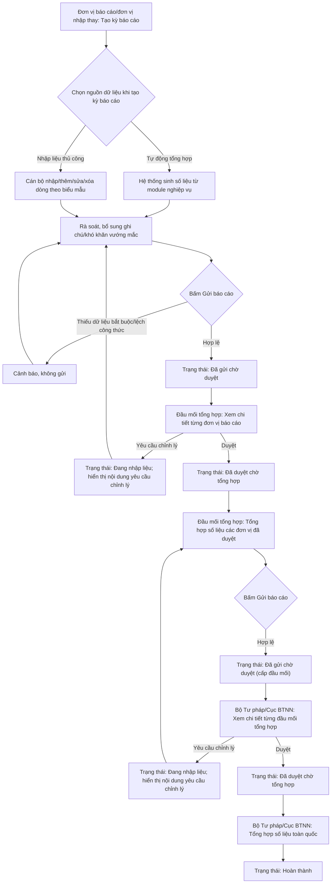

### 4.3.3.26. UCPS023 - Quản lý kỳ báo cáo, nhập liệu biểu mẫu Thông tư 08/2019/TT-BTP

#### 4.3.3.26.1. Mục đích

\- Cho phép các cơ quan, đơn vị tham gia công tác bồi thường nhà nước (cơ quan cấp tỉnh, cấp xã/phường/đặc khu theo mô hình chính quyền địa phương 2 cấp hiện hành, cơ quan khác có trụ sở tại địa phương, Tòa án nhân dân, Viện kiểm sát nhân dân, Bộ/cơ quan ngang Bộ và các cơ quan trực thuộc) trực tiếp nhập liệu hoặc được đơn vị đầu mối nhập thay vào các biểu mẫu Mẫu số 01, 03, 04, 05 Thông tư 08/2019/TT-BTP đối với những đơn vị chưa số hóa đầy đủ nghiệp vụ xử lý vụ việc trên hệ thống, thay cho cơ chế hệ thống tự tổng hợp từ module nghiệp vụ (Tiếp nhận YCBT, Giải quyết YCBT...) đã đặc tả tại `SRS_BaoCao_Mau01_DanhMucVuViec.md`, `SRS_BaoCao_Mau03_TongHopTinhHinh.md`, `SRS_BaoCao_Mau04_TinhHinhHoanTra.md`.

\- Cho phép tổng hợp số liệu theo mô hình báo cáo:
&nbsp;&nbsp;+ **Đơn vị báo cáo thực tế**: cơ quan cụ thể phát sinh số liệu, gồm đơn vị cấp tỉnh, cấp xã/phường/đặc khu theo mô hình chính quyền địa phương 2 cấp, cơ quan khác có trụ sở tại địa phương, hoặc đơn vị trực thuộc trung ương của Tòa án/Viện kiểm sát/Bộ. Đơn vị báo cáo thực tế được chọn từ cây đơn vị `[DM_DON_VI]` và có thể chưa có tài khoản đăng nhập riêng.
&nbsp;&nbsp;+ **Đơn vị nhập liệu/được ủy quyền nhập thay**: giai đoạn hiện tại cho phép tạo tài khoản cho các Sở Tư pháp địa phương để nhập liệu thay cho các đơn vị báo cáo thực tế thuộc phạm vi địa phương; hệ thống phải ghi nhận riêng `Đơn vị báo cáo` và `Đơn vị nhập liệu`.
&nbsp;&nbsp;+ **Đầu mối tổng hợp**: UBND cấp tỉnh, Tòa án nhân dân tối cao, Viện kiểm sát nhân dân tối cao, Bộ/cơ quan ngang Bộ ([DM_43]) tổng hợp số liệu từ các đơn vị báo cáo thực tế thuộc phạm vi quản lý, gửi Bộ Tư pháp.
&nbsp;&nbsp;+ **Bộ Tư pháp (Cục Bồi thường nhà nước)**: tổng hợp công tác BTNN trên phạm vi cả nước phục vụ báo cáo Chính phủ theo khoản 5 Điều 26 Thông tư 08/2019/TT-BTP.

\- Khi tạo kỳ báo cáo, người dùng chọn một `Nguồn dữ liệu` áp dụng cho kỳ báo cáo hoặc biểu mẫu được chọn: `Tự động tổng hợp từ hệ thống` (áp dụng khi đơn vị đã dùng đầy đủ module nghiệp vụ BTNN) hoặc `Nhập liệu thủ công` (áp dụng khi đơn vị chưa số hóa hoặc cần bổ sung/hiệu chỉnh số liệu ngoài hệ thống). Sau khi kỳ báo cáo được tạo, nguồn dữ liệu hiển thị chỉ đọc trên màn hình chi tiết; không cho đổi trực tiếp trong từng tab biểu mẫu để tránh ghi đè dữ liệu đang nhập.

\- Cho phép chỉnh lý, bổ sung số liệu theo khoản 6 Điều 26 Thông tư 08/2019/TT-BTP: đơn vị báo cáo tự phát hiện sai sót thì được sửa khi kỳ báo cáo chưa được cấp trên duyệt; đơn vị nhận báo cáo (cấp trên) phát hiện sai sót thì yêu cầu đơn vị cấp dưới chỉnh lý.

*a. Phân quyền*

\- Cán bộ báo cáo/nhập liệu: Được tạo kỳ báo cáo cho đơn vị của mình hoặc cho đơn vị được cấu hình nhập thay trong phạm vi được phân quyền, chọn `Đơn vị báo cáo` từ cây đơn vị, chọn loại báo cáo, nguồn dữ liệu, nhập liệu/chỉnh sửa/thêm/xóa dòng biểu mẫu khi kỳ báo cáo ở trạng thái `Đang nhập liệu`, gửi kỳ báo cáo lên đầu mối tổng hợp.

\- Cán bộ đầu mối tổng hợp (thuộc UBND cấp tỉnh/TANDTC/VKSNDTC/Bộ, ngành): Được tra cứu toàn bộ kỳ báo cáo của các đơn vị báo cáo thực tế thuộc phạm vi quản lý, xem chi tiết số liệu, duyệt hoặc yêu cầu chỉnh lý từng đơn vị, tổng hợp số liệu thành báo cáo của đầu mối, gửi Bộ Tư pháp/Cục BTNN.

\- Cán bộ Bộ Tư pháp/Cục Bồi thường nhà nước: Được tra cứu toàn bộ kỳ báo cáo của các đầu mối tổng hợp trên phạm vi cả nước, xem chi tiết số liệu, duyệt hoặc yêu cầu chỉnh lý từng đầu mối, tổng hợp số liệu toàn quốc.

\- Lãnh đạo (mọi cấp): Được tra cứu, xem số liệu theo phạm vi được phân quyền; không nhập liệu, không duyệt.

*b. Điều kiện thực hiện*

\- Người dùng đã đăng nhập Website quản trị, được gán vào một cơ quan/đơn vị cụ thể và phạm vi đơn vị được phép tạo/nhập kỳ báo cáo theo cấu hình tài khoản/phân quyền đã có sẵn của hệ thống.

\- Danh mục đơn vị `[DM_DON_VI]` đã khai báo dạng cây theo mô hình chính quyền địa phương 2 cấp hiện hành và các khối trung ương. Mỗi đơn vị báo cáo có đầy đủ `Mã đơn vị`, `Tên đơn vị`, `Đơn vị cha`, `Cấp đơn vị`, `Tỉnh/TP`, `Loại cơ quan báo cáo`, `Đầu mối tổng hợp trực tiếp`, `Trạng thái hiệu lực`, và cấu hình `Đơn vị được nhập thay` nếu chưa cấp tài khoản đăng nhập riêng.

\- Loại cơ quan báo cáo tham chiếu [DM_43]. Loại kỳ báo cáo tham chiếu [DM_44]. Trạng thái kỳ báo cáo tham chiếu [DM_45]. Lĩnh vực phát sinh thiệt hại tham chiếu [DM_22]. Trạng thái vụ việc tham chiếu [DM_24].

\- Cấu trúc cột/chỉ tiêu của từng biểu mẫu áp dụng đúng theo đặc tả tại `SRS_BaoCao_Mau01_DanhMucVuViec.md` (Mẫu 01), `SRS_BaoCao_Mau03_TongHopTinhHinh.md` (Mẫu 03), `SRS_BaoCao_Mau04_TinhHinhHoanTra.md` (Mẫu 04) và mục 10 `bieu-mau-btnn-tt08-2019.md` (Mẫu 05).

---

#### 4.3.3.26.2. Sơ đồ luồng nghiệp vụ theo giao diện

---

#### 4.3.3.26.3. Quy tắc nghiệp vụ chung

| Mã quy tắc | Nội dung |
| :--- | :--- |
| [BR-BTNN-BC-001] | Kỳ báo cáo chỉ được nhập liệu/chỉnh sửa khi ở trạng thái `Đang nhập liệu`. Khi ở trạng thái `Đã gửi chờ duyệt`, `Đã duyệt chờ tổng hợp`, `Đã tổng hợp`, `Hoàn thành`, toàn bộ dữ liệu biểu mẫu chuyển chỉ đọc đối với đơn vị đã gửi. |
| [BR-BTNN-BC-002] | Trước khi cho phép `Gửi báo cáo`, hệ thống kiểm tra: (i) đầy đủ trường bắt buộc theo từng biểu mẫu; (ii) các công thức tổng hợp của Mẫu 03/04 khớp đúng (tổng ngang, tổng dọc theo mục 8.4/9.3 `bieu-mau-btnn-tt08-2019.md`); nếu sai lệch, hiển thị cảnh báo tại đúng chỉ tiêu/dòng bị lệch và không cho gửi. |
| [BR-BTNN-BC-003] | Khi cấp trên bấm `Yêu cầu chỉnh lý`, hệ thống bắt buộc nhập lý do chỉnh lý, chuyển trạng thái kỳ báo cáo của đơn vị cấp dưới về `Đang nhập liệu`, hiển thị nội dung yêu cầu chỉnh lý trên màn chi tiết, gửi thông báo cho cán bộ báo cáo đơn vị đó; số liệu đơn vị này không được tính vào bảng tổng hợp của cấp trên cho đến khi được gửi lại và duyệt. |
| [BR-BTNN-BC-004] | Khi cấp trên bấm `Duyệt`, số liệu của đơn vị chuyển trạng thái `Đã duyệt chờ tổng hợp` và được tính vào bảng tổng hợp của cấp trên; đơn vị không còn được tự sửa số liệu trừ khi cấp trên `Yêu cầu chỉnh lý` lại. |
| [BR-BTNN-BC-005] | Một `Mã vụ việc` (Mẫu 01/05) hoặc một dòng chỉ tiêu (Mẫu 03/04) chỉ được tính một lần trong cùng kỳ báo cáo, cùng đơn vị nhập liệu; hệ thống cảnh báo trùng `Mã vụ việc` giữa các dòng nhập tay trong cùng biểu mẫu, cùng kỳ. |
| [BR-BTNN-BC-006] | Bảng tổng hợp của đầu mối tổng hợp và Bộ Tư pháp/Cục BTNN chỉ cộng dồn số liệu của các đơn vị/đầu mối cấp dưới đang ở trạng thái `Đã duyệt chờ tổng hợp`, `Đã tổng hợp` hoặc `Hoàn thành` trong kỳ báo cáo tương ứng; đơn vị chưa gửi, đang chờ duyệt hoặc đang phải chỉnh lý hiển thị riêng trong danh sách `Chưa tổng hợp` kèm cảnh báo để đơn vị nhận báo cáo đôn đốc. |
| [BR-BTNN-BC-007] | Sau khi kỳ báo cáo chuyển `Hoàn thành`, hệ thống chỉ cho tạo bản ghi điều chỉnh dưới dạng phiên bản mới (tăng số phiên bản, giữ nguyên bản đã chốt), không cho sửa trực tiếp vào bản đã chốt, theo đúng nguyên tắc lưu vết tại mục 15 `bieu-mau-btnn-tt08-2019.md`. |

---

#### 4.3.3.26.4. MH01 - Màn hình Danh sách kỳ báo cáo

##### 4.3.3.26.4.1. Màn hình

##### 4.3.3.26.4.2. Mô tả thông tin trên màn hình

| Trường thông tin | Kiểu dữ liệu | Bắt buộc | Mặc định | Mô tả |
| :--- | :--- | :--- | :--- | :--- |
| Tiêu đề màn hình | String(255) | - | - | Chỉ đọc. `DANH SÁCH KỲ BÁO CÁO BTNN - THÔNG TƯ 08/2019/TT-BTP`. |
| **I. Bộ lọc tìm kiếm** | | | | |
| Năm báo cáo | Enum(String(10)) | Không | Năm hiện tại | Hiển thị 05 năm gần nhất. |
| Loại kỳ báo cáo | Enum(String(100)) | Không | `Tất cả` | Tham chiếu [DM_44]. |
| Đơn vị/Đầu mối | Enum(Tree) | Không | Theo phạm vi phân quyền | Control UI: Popup chọn cây đơn vị. Cho phép lọc theo `Đơn vị báo cáo`, `Đầu mối tổng hợp trực tiếp` hoặc `Bộ Tư pháp/Cục BTNN` theo phạm vi tài khoản. Cây đơn vị cho phép tìm kiếm nhanh theo `Mã đơn vị` hoặc `Tên đơn vị`, hiển thị đường dẫn cây của đơn vị được chọn. Tham chiếu [DM_DON_VI]. |
| Trạng thái | Enum(String(100)) | Không | `Tất cả` | Tham chiếu [DM_45]. |
| Tìm kiếm | - | Không | Hiển thị | Chi tiết nghiệp vụ xem tại bảng Chức năng trên màn hình. |
| Tạo kỳ báo cáo | - | Không | Hiển thị theo quyền | Hiển thị với cán bộ báo cáo/nhập liệu có quyền tạo kỳ cho ít nhất một đơn vị báo cáo. Đơn vị đăng nhập có thể là đơn vị nhập thay; đơn vị báo cáo thực tế được chọn tại popup tạo kỳ theo cây đơn vị trong phạm vi được phân quyền. |
| Khối mở nhanh kỳ tổng hợp | Text(1000) | Không | Theo vai trò | Hiển thị với đầu mối tổng hợp và Bộ Tư pháp/Cục BTNN. Với đầu mối tổng hợp, hiển thị nút mở kỳ tổng hợp của đầu mối. Với Bộ Tư pháp/Cục BTNN, chỉ hiển thị nút mở kỳ tổng hợp toàn quốc theo kỳ báo cáo. |
| **II. Bảng danh sách kỳ báo cáo** | | | | |
| STT | Integer(10) | Không | Tự tăng | |
| Năm báo cáo | Integer(4) | Có | Theo dữ liệu | Chỉ đọc. |
| Loại kỳ báo cáo | Enum(String(100)) | Có | Theo dữ liệu | Chỉ đọc. Tham chiếu [DM_44]. |
| Loại báo cáo | Enum(String(100)) | Không | Theo dữ liệu | Chỉ đọc. Gồm `Báo cáo đơn vị`, `Báo cáo tổng hợp đầu mối`, `Báo cáo tổng hợp toàn quốc`, `Báo cáo tạm tính`. |
| Đơn vị báo cáo | String(255) | Có | Theo dữ liệu | Chỉ đọc. Hiển thị tên đơn vị báo cáo thực tế đã chọn khi tạo kỳ; trường hợp nhập thay vẫn hiển thị đơn vị báo cáo thực tế, không hiển thị đơn vị nhập liệu thay thế. |
| Số vụ việc đã nhập | Integer(10) | Không | Theo dữ liệu | Tổng số dòng đã nhập tại Mẫu 01/05 của kỳ báo cáo. |
| Trạng thái | Enum(String(100)) | Có | Theo dữ liệu | Hiển thị badge theo [DM_45]. |
| Ngày gửi gần nhất | DateTime | Không | Theo dữ liệu | Chỉ đọc. |
| Thao tác | String(255) | Không | Theo quyền/trạng thái | Gồm `Mở`, `Xóa` (chỉ khi kỳ báo cáo đang ở trạng thái `Đang nhập liệu` và do mình tạo). |

##### 4.3.3.26.4.3. Chức năng trên màn hình

| STT | Tên chức năng | Định dạng | Mô tả |
| :--- | :--- | :--- | :--- |
| 1 | Tìm kiếm | Button | Lọc danh sách theo các tiêu chí đang chọn (kết hợp AND), hiển thị kết quả và đưa về trang 1. - **TH Không có dữ liệu trả về**: + Bảng kết quả: Hiển thị dòng thông báo rỗng *"Không tìm thấy dữ liệu phù hợp với điều kiện tìm kiếm."* ở giữa bảng. + Thanh phân trang (Pagination): Dòng số lượng hiển thị *"Hiển thị 0-0 của 0 bản ghi"* (hoặc *"Hiển thị 0-0 của 0 yêu cầu"*); các nút điều hướng trang (`&#124;&lt;&lt;`, `&lt;`, các số trang, `&gt;`, `&gt;&gt;&#124;`) ở trạng thái ẩn hoặc khóa mờ (Disabled). + Nút "Kết xuất Excel" (nếu màn hình có nút này): Thiết lập ở trạng thái khóa mờ (Disabled) với thuộc tính `style="opacity: 0.35; pointer-events: none; cursor: not-allowed;"` kèm tooltip: *"Không có dữ liệu để kết xuất Excel"*. |
| 2 | Tạo kỳ báo cáo | Button | Mở popup tạo kỳ báo cáo để chọn `Đơn vị báo cáo`, `Loại báo cáo`, `Nguồn dữ liệu`, `Thời gian báo cáo`. Sau khi tạo thành công mở **4.3.3.26.5. MH02** tại đúng biểu mẫu đã chọn. |
| 3 | Click dòng dữ liệu/Mở | Row click/Icon button | Mở **4.3.3.26.5. MH02** với dữ liệu kỳ báo cáo tương ứng. Nếu người dùng là cán bộ đầu mối tổng hợp hoặc cán bộ Bộ Tư pháp/Cục BTNN và kỳ báo cáo thuộc đơn vị cấp dưới ở trạng thái `Đã gửi chờ duyệt`, mở **4.3.3.26.9. MH08** (màn duyệt) thay vì MH02. |
| 4 | Xóa | Icon button | Hiển thị khi kỳ báo cáo ở trạng thái `Đang nhập liệu` và do người dùng hiện tại tạo. Xác nhận [MSG-CFM-SYS-001] trước khi xóa. |

---

#### 4.3.3.26.5. MH02 - Màn hình Tạo/Cập nhật kỳ báo cáo

##### 4.3.3.26.5.1. Màn hình

##### 4.3.3.26.5.2. Mô tả thông tin trên màn hình

| Trường thông tin | Kiểu dữ liệu | Bắt buộc | Mặc định | Mô tả |
| :--- | :--- | :--- | :--- | :--- |
| **Khối thông tin tạo kỳ** | | | | |
| Đơn vị báo cáo | Enum(Tree) | Có | Trống | Control UI: Popup chọn cây đơn vị. Bắt buộc hiển thị theo cây phân cấp từ `[DM_DON_VI]`, không hiển thị dạng danh sách phẳng. Cây đơn vị hiển thị ngắn gọn theo `Mã đơn vị` và `Tên đơn vị`, cho phép mở rộng/thu gọn từng node. Cây đơn vị chỉ gồm các đơn vị thuộc phạm vi người dùng được phép tạo/nhập thay. Cho phép tìm kiếm nhanh theo `Mã đơn vị` hoặc `Tên đơn vị`, áp dụng tìm gần đúng, không phân biệt hoa/thường và dấu tiếng Việt. |
| Phạm vi số liệu | Enum(String(100)) | Có | `Riêng đơn vị được chọn` | Control UI: Hộp chọn. Gồm `Riêng đơn vị được chọn`, `Tổng hợp đơn vị trực thuộc`. Chỉ cho phép chọn `Tổng hợp đơn vị trực thuộc` khi `Đơn vị báo cáo` được chọn là node có đơn vị con trong phạm vi được phép tạo/nhập thay. Trường hợp Sở Tư pháp được cấu hình nhập thay/tổng hợp cho các đơn vị thuộc địa phương, cán bộ Sở Tư pháp chọn node đầu mối hoặc node Sở Tư pháp tương ứng và chọn `Tổng hợp đơn vị trực thuộc`; hệ thống ghi nhận riêng `Đơn vị báo cáo`, `Phạm vi số liệu` và `Đơn vị nhập liệu`. |
| Loại báo cáo | Enum(String(100)) | Có | `Bộ biểu mẫu TT08 (Mẫu 01/03/04/05)` | Giá trị gồm `Bộ biểu mẫu TT08`, `Mẫu 01`, `Mẫu 03`, `Mẫu 04`, `Mẫu 05`. Sau khi tạo kỳ, nếu chọn một mẫu cụ thể thì mở đúng tab biểu mẫu đó; nếu chọn `Bộ biểu mẫu TT08` thì mở tab `Mẫu 01` mặc định. |
| Nguồn dữ liệu | Enum(String(50)) | Có | `Tự động tổng hợp từ hệ thống` | Giá trị: `Tự động tổng hợp từ hệ thống` / `Nhập liệu thủ công`. Giá trị này áp dụng cho kỳ báo cáo/biểu mẫu được chọn và hiển thị chỉ đọc sau khi tạo kỳ. |
| Năm báo cáo | Enum(String(10)) | Có | Năm hiện tại | Không sửa được sau khi đã lưu. |
| Từ ngày | Date | Có | `01/01/[Năm báo cáo]` | Định dạng hiển thị `dd/mm/yyyy`. Có datepicker. Người dùng được điều chỉnh trước khi tạo kỳ. |
| Đến ngày | Date | Có | `31/10/[Năm báo cáo]` | Định dạng hiển thị `dd/mm/yyyy`. Có datepicker. Bắt buộc lớn hơn hoặc bằng `Từ ngày`. |
| Loại kỳ báo cáo | Enum(String(100)) | Có | `Báo cáo năm số liệu thực tế (01/01 - 31/10)` | Tham chiếu [DM_44]. Không sửa được sau khi đã lưu; hệ thống lưu kèm khoảng `Từ ngày` - `Đến ngày` thực tế đã chọn. |
| Đơn vị nhập liệu | String(255) | - | Theo tài khoản đăng nhập | Chỉ đọc. Ghi nhận đơn vị/tài khoản thực hiện nhập liệu, có thể khác `Đơn vị báo cáo` khi Sở Tư pháp/Bộ Tư pháp nhập thay. |
| Trạng thái | Enum(String(100)) | - | `Đang nhập liệu` | Chỉ đọc. Tham chiếu [DM_45]. Giá trị gồm `Đang nhập liệu`, `Đã gửi chờ duyệt`, `Đã duyệt chờ tổng hợp`, `Đã tổng hợp`, `Hoàn thành`. |
| **Khối chọn biểu mẫu trong kỳ** | Select | - | Theo `Loại báo cáo` đã chọn khi tạo kỳ | Gồm `Mẫu 01 - Danh mục vụ việc`, `Mẫu 03 - Tổng hợp tình hình`, `Mẫu 04 - Tình hình hoàn trả`, `Mẫu 05 - Sổ thụ lý`, `Lịch sử xử lý`. Khi đổi mẫu, hệ thống chỉ chuyển phần nội dung hiển thị; không cho chỉnh lại `Nguồn dữ liệu` tại màn chi tiết. |

##### 4.3.3.26.5.3. Chức năng trên màn hình

| STT | Tên chức năng | Định dạng | Mô tả |
| :--- | :--- | :--- | :--- |
| 1 | Tạo kỳ báo cáo | Button | Kiểm tra bắt buộc `Đơn vị báo cáo`, `Phạm vi số liệu`, `Loại báo cáo`, `Nguồn dữ liệu`, `Năm báo cáo`, `Từ ngày`, `Đến ngày`. Hợp lệ thì tạo kỳ ở trạng thái `Đang nhập liệu`, ghi nhận `Đơn vị báo cáo`, `Phạm vi số liệu`, `Đơn vị nhập liệu`, phạm vi thời gian và mở đúng biểu mẫu đã chọn. |
| 2 | Lưu nháp | Button | Lưu thông tin kỳ báo cáo và dữ liệu biểu mẫu hiện tại, giữ trạng thái `Đang nhập liệu`, không kiểm tra đầy đủ dữ liệu bắt buộc. |
| 3 | Tổng hợp lại | Button | Chỉ hiển thị khi nguồn dữ liệu = `Tự động tổng hợp từ hệ thống` và trạng thái thuộc [BR-BTNN-BC-001]. Tổng hợp lại số liệu mới nhất từ module nghiệp vụ theo `Đơn vị báo cáo` và khoảng thời gian của kỳ báo cáo, ghi đè dữ liệu hiển thị hiện tại. |
| 4 | Gửi báo cáo | Button | Áp dụng [BR-BTNN-BC-002]. TH1 (Không hợp lệ): Hiển thị danh sách lỗi/chỉ tiêu lệch công thức, không gửi. TH2 (Hợp lệ): Hiển thị xác nhận [MSG-CFM-SYS-001], sau xác nhận chuyển trạng thái `Đã gửi chờ duyệt`, ghi nhận người gửi, thời điểm gửi, gửi thông báo cho cán bộ tổng hợp đầu mối phụ trách đơn vị, khóa chỉnh sửa theo [BR-BTNN-BC-001]. |
| 5 | Hủy bỏ | Button | Đóng màn hình, không lưu thay đổi chưa lưu nháp. |

---

#### 4.3.3.26.6. MH03 - Tab Mẫu 01 - Danh mục vụ việc (chế độ nhập liệu)

##### 4.3.3.26.6.1. Màn hình

##### 4.3.3.26.6.2. Mô tả thông tin trên màn hình

| Trường thông tin | Kiểu dữ liệu | Bắt buộc | Mặc định | Mô tả |
| :--- | :--- | :--- | :--- | :--- |
| Bảng danh mục vụ việc | Text(2000) | - | Theo nguồn dữ liệu | Khi nguồn = `Tự động tổng hợp từ hệ thống`: bảng chỉ đọc, đúng cấu trúc `STT` + cột (1) đến (8) và 6 nhóm lĩnh vực theo `SRS_BaoCao_Mau01_DanhMucVuViec.md`. Khi nguồn = `Nhập liệu thủ công`: bảng cho phép thêm/sửa/xóa dòng trực tiếp nhưng vẫn giữ đúng cấu trúc biểu mẫu `STT` + 8 cột: `Họ và tên người yêu cầu bồi thường`, `Địa chỉ của người yêu cầu bồi thường`, `Cơ quan giải quyết bồi thường`, `Pháp luật áp dụng để giải quyết bồi thường`, `Tình hình giải quyết bồi thường`, `Chi trả tiền bồi thường`, `Khó khăn, vướng mắc`, `Ghi chú`; nhóm theo 6 lĩnh vực phát sinh thiệt hại [DM_22] do người nhập chọn cho từng dòng. |
| Thêm dòng | Button | - | Hiển thị theo nhóm lĩnh vực | Mỗi nhóm lĩnh vực có nút `Thêm vụ việc` riêng; dòng mới thêm vào cuối nhóm tương ứng. |
| Xóa dòng | Icon button | - | Theo dòng | Icon xóa cuối mỗi dòng nhập tay; không hiển thị khi nguồn = tự động. |
| Dòng Tổng cộng | Text | - | Hệ thống tính | Tự tính số vụ việc theo từng nhóm lĩnh vực và tổng cộng toàn bảng; cập nhật ngay khi thêm/xóa dòng. |

##### 4.3.3.26.6.3. Chức năng trên màn hình

| STT | Tên chức năng | Định dạng | Mô tả |
| :--- | :--- | :--- | :--- |
| 1 | Thêm vụ việc | Button | Thêm 01 dòng rỗng vào nhóm lĩnh vực tương ứng, focus vào ô `Họ và tên người yêu cầu bồi thường`. Áp dụng [BR-BTNN-BC-005] bằng mã nội bộ của dòng/vụ việc nếu có liên kết dữ liệu gốc; mã nội bộ không hiển thị thành cột trên biểu mẫu Mẫu 01. |
| 2 | Sửa giá trị ô | Inline edit | Cho sửa trực tiếp trên bảng đối với dòng nhập tay; các trường bắt buộc theo `SRS_BaoCao_Mau01_DanhMucVuViec.md` gồm `Họ và tên người yêu cầu bồi thường`, `Cơ quan giải quyết bồi thường`, `Pháp luật áp dụng để giải quyết bồi thường`, `Tình hình giải quyết bồi thường`. |
| 3 | Xóa vụ việc | Icon button | Xác nhận [MSG-CFM-SYS-001] trước khi xóa dòng khỏi bảng. |

---

#### 4.3.3.26.7. MH04 - Tab Mẫu 03/Mẫu 04 - Ma trận chỉ tiêu (chế độ nhập liệu)

##### 4.3.3.26.7.1. Màn hình

##### 4.3.3.26.7.2. Mô tả thông tin trên màn hình

| Trường thông tin | Kiểu dữ liệu | Bắt buộc | Mặc định | Mô tả |
| :--- | :--- | :--- | :--- | :--- |
| Bảng ma trận chỉ tiêu | Text(2000) | - | Theo nguồn số liệu | Khi nguồn = `Tự động tổng hợp từ hệ thống`: bảng chỉ đọc, đúng 26 chỉ tiêu Mẫu 03 (`SRS_BaoCao_Mau03_TongHopTinhHinh.md`) hoặc 15 chỉ tiêu Mẫu 04 (`SRS_BaoCao_Mau04_TinhHinhHoanTra.md`), theo 6 nhóm lĩnh vực + dòng Tổng cộng. Khi nguồn = `Nhập liệu thủ công`: cho nhập trực tiếp vào từng ô **chỉ tiêu gốc** (không phải chỉ tiêu tính bằng công thức); các ô chỉ tiêu công thức (ví dụ chỉ tiêu 1, 10, 16 của Mẫu 03; chỉ tiêu 3, 12 của Mẫu 04) hiển thị chỉ đọc, tự tính theo công thức tương ứng khi người dùng nhập/sửa các ô gốc liên quan. |
| Ô lệch công thức | - | - | - | Nếu người dùng dán/nhập giá trị đè lên ô công thức khác với giá trị hệ thống tự tính, ô hiển thị highlight cảnh báo (nền đỏ nhạt) kèm tooltip giá trị đúng theo công thức; áp dụng khi kiểm tra [BR-BTNN-BC-002] lúc gửi. |
| Ghi chú nội bộ hệ thống | Text(2000) | Không | Trống | Chỉ tiêu 26 của Mẫu 03/dòng ghi chú của Mẫu 04; dùng để giải trình chênh lệch hoặc nguồn số liệu khi điều chỉnh thủ công. |

##### 4.3.3.26.7.3. Chức năng trên màn hình

| STT | Tên chức năng | Định dạng | Mô tả |
| :--- | :--- | :--- | :--- |
| 1 | Nhập giá trị chỉ tiêu | Inline edit | Chỉ áp dụng cho ô chỉ tiêu gốc khi nguồn = `Nhập liệu thủ công`. Chỉ nhận giá trị số nguyên (chỉ tiêu vụ việc) hoặc số thập phân không âm (chỉ tiêu tiền, đơn vị nghìn đồng). |
| 2 | Tính lại công thức | Auto | Hệ thống tự tính lại toàn bộ ô công thức mỗi khi một ô chỉ tiêu gốc thay đổi giá trị, không cần thao tác thủ công. |

---

#### 4.3.3.26.8. MH05 - Tab Mẫu 05 - Sổ thụ lý hồ sơ (chế độ nhập liệu)

##### 4.3.3.26.8.1. Màn hình

##### 4.3.3.26.8.2. Mô tả thông tin trên màn hình

| Trường thông tin | Kiểu dữ liệu | Bắt buộc | Mặc định | Mô tả |
| :--- | :--- | :--- | :--- | :--- |
| Bảng sổ thụ lý | Text(2000) | - | Theo nguồn số liệu | Khi nguồn = `Tự động tổng hợp từ hệ thống`: bảng chỉ đọc, sinh từ lịch sử xử lý vụ việc theo 16 trường tại mục 10.2 `bieu-mau-btnn-tt08-2019.md` (`Mã vụ việc`, `Tên vụ việc`, `Ngày thụ lý`, `Họ tên/địa chỉ`, `Văn bản làm căn cứ`, `Cử người giải quyết`, `Tạm ứng kinh phí`, `Xác minh thiệt hại`, `Thương lượng`, `Quyết định giải quyết`, `Cấp kinh phí`, `Chi trả`, `Hoãn/Tạm đình chỉ/Đình chỉ`, `Khởi kiện Tòa án`, `Phục hồi danh dự`). Khi nguồn = `Nhập liệu thủ công`: cho thêm/sửa/xóa dòng theo vụ việc, mỗi cột mốc nghiệp vụ (từ `Văn bản làm căn cứ` đến `Phục hồi danh dự`) nhập dạng text mô tả (số/ký hiệu văn bản, ngày, nội dung tóm tắt) kèm nút đính kèm file. |
| Đính kèm tài liệu mốc nghiệp vụ | File | Không | Trống | Cho phép đính kèm nhiều file cho mỗi mốc nghiệp vụ của từng dòng khi nhập tay. |

##### 4.3.3.26.8.3. Chức năng trên màn hình

| STT | Tên chức năng | Định dạng | Mô tả |
| :--- | :--- | :--- | :--- |
| 1 | Thêm vụ việc vào sổ | Button | Thêm 01 dòng rỗng, bắt buộc nhập `Mã vụ việc`, `Tên vụ việc`, `Ngày thụ lý` trước khi lưu. |
| 2 | Đính kèm tài liệu | Icon button | Mở popup chọn file cho mốc nghiệp vụ tương ứng của dòng đang chọn. |
| 3 | Xóa vụ việc khỏi sổ | Icon button | Xác nhận [MSG-CFM-SYS-001] trước khi xóa dòng. |

---

#### 4.3.3.26.9. MH06 - Màn hình Danh sách đơn vị cấp dưới cần duyệt

##### 4.3.3.26.9.1. Màn hình

##### 4.3.3.26.9.2. Mô tả thông tin trên màn hình

\- Chỉ hiển thị với cán bộ đầu mối tổng hợp hoặc cán bộ Bộ Tư pháp/Cục BTNN. Đầu mối tổng hợp xem danh sách đơn vị báo cáo thực tế thuộc phạm vi quản lý; Bộ Tư pháp/Cục BTNN xem danh sách các đầu mối tổng hợp gửi báo cáo.

| Trường thông tin | Kiểu dữ liệu | Bắt buộc | Mặc định | Mô tả |
| :--- | :--- | :--- | :--- | :--- |
| Kỳ báo cáo | Enum(String(100)) | Có | Kỳ gần nhất chưa hoàn thành | Chọn năm báo cáo + loại kỳ báo cáo [DM_44] để xem danh sách đơn vị cấp dưới thuộc kỳ đó. |
| Bảng danh sách đơn vị cấp dưới | Text(1000) | - | Theo dữ liệu | Cột: `Đơn vị`, `Số vụ việc đã nhập`, `Trạng thái` [DM_45], `Ngày gửi`, `Thao tác`. - Trạng thái có dữ liệu: Hiển thị danh sách các bản ghi kết quả theo cấu trúc các cột quy định. - Trạng thái không có dữ liệu (Empty State): Khi không tìm thấy kết quả phù hợp với điều kiện tìm kiếm, bảng hiển thị duy nhất 01 dòng căn giữa trên toàn bộ chiều rộng bảng (`colspan`), in nghiêng với nội dung: *"Không tìm thấy dữ liệu phù hợp với điều kiện tìm kiếm."* |
| Nhóm `Chưa tổng hợp` | - | - | - | Áp dụng [BR-BTNN-BC-006]: tách riêng các đơn vị chưa gửi, đang chờ duyệt hoặc đang phải chỉnh lý thành nhóm hiển thị cảnh báo màu vàng/đỏ để cấp trên đôn đốc. |
| Thao tác | String(255) | Không | Theo trạng thái | `Xem/Duyệt` (khi `Đã gửi chờ duyệt`), `Xem` (các trạng thái khác), `Nhắc gửi báo cáo` (khi `Chưa tổng hợp`). |

##### 4.3.3.26.9.3. Chức năng trên màn hình

| STT | Tên chức năng | Định dạng | Mô tả |
| :--- | :--- | :--- | :--- |
| 1 | Xem/Duyệt | Row click/Icon button | Mở **4.3.3.26.10. MH07** với dữ liệu kỳ báo cáo của đơn vị được chọn. |
| 2 | Nhắc gửi báo cáo | Icon button | Gửi thông báo nhắc đơn vị cấp dưới hoàn thiện và gửi kỳ báo cáo; không thay đổi trạng thái dữ liệu. |

---

#### 4.3.3.26.10. MH07 - Màn hình Xem chi tiết và Duyệt kỳ báo cáo đơn vị cấp dưới

##### 4.3.3.26.10.1. Màn hình

##### 4.3.3.26.10.2. Mô tả thông tin trên màn hình

| Trường thông tin | Kiểu dữ liệu | Bắt buộc | Mặc định | Mô tả |
| :--- | :--- | :--- | :--- | :--- |
| Thông tin đơn vị | String(255) | - | Theo dữ liệu | Chỉ đọc: `Đơn vị`, `Phạm vi số liệu`, `Trạng thái`, `Ngày gửi`, `Người gửi`. |
| Khối tab biểu mẫu | Tab | - | Mẫu 01 | Hiển thị chỉ đọc toàn bộ dữ liệu Mẫu 01/03/04/05 của đơn vị, đúng cấu trúc tại 4.3.3.26.6 - 4.3.3.26.8, có đánh dấu ô/dòng lệch công thức (nếu còn) để cấp trên tham khảo trước khi duyệt. |
| Lịch sử xử lý kỳ báo cáo | Timeline | - | Theo dữ liệu | Hiển thị các lần gửi, yêu cầu chỉnh lý (kèm lý do), duyệt theo thời gian giảm dần. |

##### 4.3.3.26.10.3. Chức năng trên màn hình

| STT | Tên chức năng | Định dạng | Mô tả |
| :--- | :--- | :--- | :--- |
| 1 | Duyệt | Button | Áp dụng [BR-BTNN-BC-004]. Xác nhận [MSG-CFM-SYS-001], sau xác nhận chuyển trạng thái đơn vị về `Đã duyệt chờ tổng hợp`, ghi nhận người duyệt, thời điểm duyệt, ghi vào lịch sử xử lý, gửi thông báo cho đơn vị. |
| 2 | Yêu cầu chỉnh lý | Button | Áp dụng [BR-BTNN-BC-003]. Mở popup bắt buộc nhập `Lý do chỉnh lý` (Text(1000)); sau khi xác nhận, chuyển trạng thái đơn vị về `Đang nhập liệu`, ghi vào lịch sử xử lý, hiển thị nội dung yêu cầu chỉnh lý trên màn chi tiết và gửi thông báo kèm lý do cho đơn vị. |
| 3 | Đóng | Button | Đóng màn hình, quay về **4.3.3.26.9. MH06**. |

---

#### 4.3.3.26.11. MH08 - Màn hình Tổng hợp kỳ báo cáo cấp đầu mối/toàn quốc

##### 4.3.3.26.11.1. Màn hình

##### 4.3.3.26.11.2. Mô tả thông tin trên màn hình

\- Chỉ hiển thị với cán bộ đầu mối tổng hợp hoặc cán bộ Bộ Tư pháp/Cục BTNN, khi đã duyệt xong ít nhất một đơn vị/đầu mối cấp dưới trong kỳ báo cáo.

| Trường thông tin | Kiểu dữ liệu | Bắt buộc | Mặc định | Mô tả |
| :--- | :--- | :--- | :--- | :--- |
| Kỳ báo cáo | String(255) | - | Theo dữ liệu | Chỉ đọc: `Năm báo cáo`, `Loại kỳ báo cáo`, `Đơn vị/Đầu mối`, `Trạng thái`. |
| Danh sách đơn vị thành viên | Text(1000) | - | Theo dữ liệu | Liệt kê các đơn vị thuộc phạm vi tổng hợp. Cột gồm `Đơn vị`, `Số vụ việc đã nhập`, `Trạng thái`, `Ngày gửi gần nhất`, `Kết quả tổng hợp`. Với kỳ chính thức, chỉ các đơn vị có báo cáo ở trạng thái `Đã duyệt chờ tổng hợp`, `Đã tổng hợp` hoặc `Hoàn thành` được đánh dấu `Được tổng hợp`; đơn vị chưa gửi, đang chờ duyệt hoặc đang phải chỉnh lý được đánh dấu `Chưa tổng hợp`. Với báo cáo tạm tính, hệ thống có thể tổng hợp dữ liệu hiện có trong phạm vi mà không yêu cầu duyệt. |
| Khối tab biểu mẫu tổng hợp | Tab | - | Mẫu 01 | Hiển thị Mẫu 01/03/04/05 đã cộng dồn từ các đơn vị cấp dưới đã duyệt, đúng cấu trúc biểu mẫu; chỉ đọc, không cho sửa tay ở bước tổng hợp. |
| Ghi chú tổng hợp | Text(2000) | Không | Trống | Cho nhập ghi chú/giải trình chung của cấp tổng hợp trước khi gửi báo cáo hoặc chốt toàn quốc. |

##### 4.3.3.26.11.3. Chức năng trên màn hình

| STT | Tên chức năng | Định dạng | Mô tả |
| :--- | :--- | :--- | :--- |
| 1 | Tổng hợp lại | Button | Tính lại toàn bộ số liệu cộng dồn theo danh sách đơn vị đã duyệt hiện tại; dùng khi có đơn vị mới được duyệt sau lần tổng hợp trước. |
| 2 | Gửi báo cáo | Button | Chỉ hiển thị với cán bộ đầu mối tổng hợp. Áp dụng [BR-BTNN-BC-002]. Chuyển trạng thái báo cáo đầu mối về `Đã gửi chờ duyệt` tại Bộ Tư pháp/Cục BTNN, khóa chỉnh sửa theo [BR-BTNN-BC-001]. |
| 3 | Hoàn thành (chốt toàn quốc) | Button | Chỉ hiển thị với cán bộ Bộ Tư pháp/Cục BTNN, sau khi đã duyệt xong toàn bộ hoặc đủ số đầu mối tổng hợp cần thiết. Xác nhận [MSG-CFM-SYS-001]; sau xác nhận chuyển trạng thái kỳ báo cáo toàn quốc về `Hoàn thành`, áp dụng [BR-BTNN-BC-007] cho các lần điều chỉnh sau đó. |
| 4 | Kết xuất | Button/Menu | Xuất Excel/Word/PDF theo đúng biểu mẫu Mẫu 01/03/04/05 với số liệu tổng hợp hiện tại, cùng cơ chế kết xuất tại `SRS_BaoCao_Mau01_DanhMucVuViec.md`/`SRS_BaoCao_Mau03_TongHopTinhHinh.md`/`SRS_BaoCao_Mau04_TinhHinhHoanTra.md`. |

---

#### 4.3.3.26.12. Danh sách dữ liệu

| Trường thông tin | Diễn giải |
| :--- | :--- |
| Kỳ báo cáo | Bản ghi tổng hợp gắn với năm báo cáo, loại kỳ báo cáo, đơn vị báo cáo và vai trò báo cáo. |
| Nguồn số liệu | Xác định biểu mẫu con lấy số liệu tự động từ hệ thống hay nhập liệu thủ công. |
| Đầu mối tổng hợp | UBND cấp tỉnh/TANDTC/VKSNDTC/Bộ, ngành hoặc đơn vị được cấu hình là nơi nhận, duyệt và tổng hợp báo cáo của các đơn vị báo cáo thực tế thuộc phạm vi quản lý. |

---

#### 4.3.3.26.13. Ghi chú phạm vi đặc tả

\- SRS này bổ sung năng lực **nhập liệu thủ công** và **luồng duyệt/tổng hợp 3 cấp** cho đúng cơ chế lập báo cáo tại mục 13 `bieu-mau-btnn-tt08-2019.md`; không thay đổi cấu trúc cột/chỉ tiêu đã đặc tả tại `SRS_BaoCao_Mau01_DanhMucVuViec.md`, `SRS_BaoCao_Mau03_TongHopTinhHinh.md`, `SRS_BaoCao_Mau04_TinhHinhHoanTra.md`.

\- Giữ nguyên song song 02 lối truy cập số liệu Mẫu 01/03/04: (1) Menu `Báo cáo quản lý BTNN` (`SRS_BaoCao_Mau01/03/04`) dùng để **xem nhanh** số liệu hiện tại, tổng hợp trực tiếp từ dữ liệu vụ việc tại mọi thời điểm, không gắn với một kỳ báo cáo hay trạng thái duyệt cụ thể; (2) Module `Quản lý kỳ báo cáo` (SRS này) dùng khi cần **chốt số liệu chính thức theo kỳ**, có luồng gửi/duyệt/tổng hợp 3 cấp để gửi Bộ Tư pháp. Khi chọn nguồn số liệu `Tự động tổng hợp từ hệ thống` tại MH02-MH05 của module này, hệ thống gọi đúng logic tổng hợp của `SRS_BaoCao_Mau01/03/04`, không viết lại cách tính; phần khác biệt duy nhất là dữ liệu được đóng băng theo kỳ báo cáo tại thời điểm `Gửi báo cáo`/`Duyệt` thay vì luôn tính theo dữ liệu mới nhất như màn xem nhanh.

\- Việc khai báo cây `[DM_DON_VI]`, cấu hình `Đầu mối tổng hợp trực tiếp`, `Đơn vị được phép nhập thay` và cấp tài khoản/phân quyền thực hiện tại module Quản trị người dùng/Quản lý đơn vị. SRS này sử dụng các cấu hình đó để giới hạn danh sách đơn vị được chọn khi tạo kỳ báo cáo và khi tổng hợp số liệu.

\- Mẫu 02-TT08 (Báo cáo công tác bồi thường nhà nước năm - nội dung thuyết minh) không thuộc phạm vi SRS này, sẽ đặc tả riêng nếu có yêu cầu.
