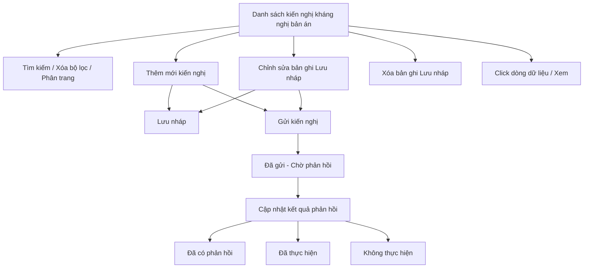

#### 4.3.3.11. UC483-484 - Kiến nghị người có thẩm quyền kháng nghị bản án, quyết định của Tòa án có nội dung GQBT

##### 4.3.3.11.1. Mục đích

\- Cho phép cán bộ Sở Tư pháp lập, quản lý và theo dõi văn bản kiến nghị người có thẩm quyền kháng nghị đối với bản án, quyết định của Tòa án có nội dung giải quyết bồi thường (GQBT) chưa phù hợp quy định pháp luật, theo Điều 28 Thông tư 08/2019/TT-BTP.

\- Cho phép theo dõi trạng thái xử lý và kết quả phản hồi của người/cơ quan có thẩm quyền kháng nghị.

*a. Phân quyền*

\- Cán bộ Sở Tư pháp: được tra cứu, xem chi tiết, thêm mới, chỉnh sửa, xóa bản ghi ở trạng thái "Lưu nháp" do chính mình tạo; được gửi kiến nghị và cập nhật kết quả phản hồi cho bản ghi do mình tạo.

*b. Điều kiện thực hiện*

\- Người dùng đã đăng nhập thành công vào Website quản trị.

\- Người dùng được phân quyền truy cập màn hình `Kiến nghị kháng nghị bản án, quyết định của Tòa án có nội dung GQBT`.

\- Trạng thái xử lý kiến nghị Tham chiếu Danh mục Trạng thái xử lý trách nhiệm hoàn trả [DM_42].

\- Người/cơ quan có thẩm quyền kháng nghị tham chiếu Danh mục các đơn vị trên hệ thống `[DM_DON_VI]`.

---

##### 4.3.3.11.2. Sơ đồ luồng nghiệp vụ theo giao diện

---

##### 4.3.3.11.3. MH01 - Màn hình Danh sách kiến nghị kháng nghị bản án

###### 4.3.3.11.3.1. Màn hình

###### 4.3.3.11.3.2. Mô tả thông tin trên màn hình

| Trường thông tin | Kiểu dữ liệu | Bắt buộc | Mặc định | Mô tả |
| :--- | :--- | :--- | :--- | :--- |
| **I. Bộ lọc tìm kiếm** | | | | |
| Từ khóa | String(255) | Không | Trống | Tìm kiếm gần đúng theo `Số văn bản kiến nghị` hoặc `Số Bản án/Quyết định`. |
| Trạng thái | Enum(String(50)) | Không | Tất cả | Tham chiếu Danh mục Trạng thái xử lý trách nhiệm hoàn trả [DM_42]. |
| Từ ngày gửi | Date | Không | Theo dữ liệu hệ thống | Định dạng `dd/mm/yyyy`. |
| Đến ngày gửi | Date | Không | Theo dữ liệu hệ thống | Định dạng `dd/mm/yyyy`. Áp dụng rule khoảng ngày [BR-VAL-007]. |
| **II. Bảng danh sách kết quả** | - | - | 20 bản ghi/trang | Control UI: Data grid. - Khi người dùng truy cập màn hình, hệ thống tự động tải trang đầu tiên (Trang 1) với số lượng mặc định 20 bản ghi. - Sắp xếp mặc định: Sắp xếp theo "Ngày tạo" giảm dần (mới nhất hiển thị lên đầu). - Trạng thái có dữ liệu: Hiển thị danh sách các bản ghi kết quả theo cấu trúc các cột quy định. - Trạng thái không có dữ liệu (Empty State): Khi không tìm thấy kết quả phù hợp với điều kiện tìm kiếm, bảng hiển thị duy nhất 01 dòng căn giữa trên toàn bộ chiều rộng bảng (`colspan`), in nghiêng với nội dung: *"Không tìm thấy dữ liệu phù hợp với điều kiện tìm kiếm."* |
| Cột: STT | Integer(10) | Không | Theo trang hiện tại | Chỉ đọc. Căn giữa, tăng theo phân trang. |
| Cột: Số văn bản kiến nghị | String(50) | Không | Theo dữ liệu hệ thống | Chỉ đọc. Hiển thị `-` khi chưa gửi. |
| Cột: Số Bản án/Quyết định bị kiến nghị | String(50) | Không | Theo dữ liệu hệ thống | Chỉ đọc. |
| Cột: Người/cơ quan có thẩm quyền kháng nghị | String(255) | Không | Theo dữ liệu hệ thống | Chỉ đọc. |
| Cột: Ngày gửi | Date | Không | Theo dữ liệu hệ thống | Chỉ đọc. Định dạng `dd/mm/yyyy`; hiển thị `-` khi chưa gửi. |
| Cột: Trạng thái | Enum(String(50)) | Không | Theo dữ liệu hệ thống | Chỉ đọc. Hiển thị badge màu theo Danh mục Trạng thái xử lý trách nhiệm hoàn trả [DM_42]. |
| Cột: Thao tác | String(255) | Không | Theo trạng thái | Chỉ đọc. Gồm icon `Chỉnh sửa`, `Xóa`, `Gửi kiến nghị`, `Cập nhật phản hồi`; icon không đủ điều kiện hiển thị dạng mờ, không cho thao tác. |
| Phân trang | String(255) | Không | 20 bản ghi/trang | Control UI: Pagination. - Cho phép chọn cấu hình số lượng bản ghi hiển thị trên mỗi trang gồm: 10, 20, 50, 100 bản ghi/trang; mặc định chọn sẵn 20 bản ghi/trang. - Đầy đủ các nút điều hướng trang: Đầu (&#124;&lt;&lt;), Trước (&lt;), các số trang, Sau (&gt;), Cuối (&gt;&gt;&#124;). - Hiển thị dải bản ghi: "Hiển thị [từ] - [đến] của [tổng số] bản ghi". |

###### 4.3.3.11.3.3. Chức năng trên màn hình

| STT | Tên chức năng | Định dạng | Mô tả |
| :--- | :--- | :--- | :--- |
| 1 | Tìm kiếm | Button | Khi người dùng click nút, hệ thống kiểm tra điều kiện dữ liệu và thực hiện tìm kiếm theo các trường hợp bên dưới: |
|  |  |  | **TH1 - Khoảng ngày không hợp lệ**: Nếu `Từ ngày` lớn hơn `Đến ngày`, vi phạm [BR-VAL-007], hệ thống hiển thị cảnh báo lỗi [MSG-ERR-VAL-007] và không thực hiện tìm kiếm. |
|  |  |  | **TH Hợp lệ (Có dữ liệu phù hợp)**: Hệ thống lọc và hiển thị danh sách các bản ghi thỏa mãn đồng thời các tiêu chí tìm kiếm/lọc đã nhập/chọn, hiển thị kết quả lên bảng và đưa về Trang 1. |
|  |  |  | **TH Không có dữ liệu trả về**: Bảng kết quả hiển thị duy nhất 01 dòng căn giữa trên toàn bộ chiều rộng bảng (`colspan`), in nghiêng với nội dung: *"Không tìm thấy dữ liệu phù hợp với điều kiện tìm kiếm."*; thanh phân trang hiển thị *"Hiển thị 0-0 của 0 bản ghi"*, các nút điều hướng trang ở trạng thái ẩn hoặc khóa mờ (Disabled); nút "Kết xuất Excel" (nếu có) ở trạng thái khóa mờ kèm tooltip *"Không có dữ liệu để kết xuất Excel"*. |
| 2 | Xóa bộ lọc | Button | Hệ thống đặt lại toàn bộ tiêu chí lọc về giá trị mặc định và tải lại danh sách. |
| 3 | Thêm mới | Button | Hệ thống mở **MH02 - Thêm mới/Chỉnh sửa kiến nghị kháng nghị bản án** ở chế độ thêm mới, trạng thái khởi tạo "Lưu nháp". |
| 4 | Chỉnh sửa | Icon button | Chỉ hiển thị với bản ghi ở trạng thái "Lưu nháp" do cán bộ đăng nhập tạo. Hệ thống mở **MH02 - Thêm mới/Chỉnh sửa kiến nghị kháng nghị bản án** ở chế độ chỉnh sửa. |
| 5 | Gửi kiến nghị | Icon button | Chỉ hiển thị với bản ghi ở trạng thái "Lưu nháp". Hệ thống mở **Popup Xác nhận** với nội dung [MSG-CFM-SYS-001]. Nếu xác nhận, hệ thống chuyển trạng thái sang "Đã gửi - Chờ phản hồi", ghi nhận ngày gửi là ngày hiện tại và hiển thị [MSG-SUC-SYS-003]. |
| 6 | Cập nhật phản hồi | Icon button | Chỉ hiển thị với bản ghi ở trạng thái "Đã gửi - Chờ phản hồi" hoặc "Đã có phản hồi". Hệ thống mở **Popup Cập nhật kết quả phản hồi**. |
| 7 | Xóa | Icon button | Chỉ hiển thị với bản ghi ở trạng thái "Lưu nháp" do cán bộ đăng nhập tạo. Hệ thống mở **Popup Xác nhận** với nội dung [MSG-CFM-SYS-001]. Nếu xác nhận, hệ thống xóa vĩnh viễn bản ghi khỏi hệ thống và hiển thị [MSG-SUC-SYS-002]. |
| 8 | Click dòng dữ liệu | Row click | Hệ thống mở **MH02 - Thêm mới/Chỉnh sửa kiến nghị kháng nghị bản án** ở chế độ chỉ xem. |

---

##### 4.3.3.11.4. MH02 - Màn hình Thêm mới/Chỉnh sửa kiến nghị kháng nghị bản án

###### 4.3.3.11.4.1. Màn hình

###### 4.3.3.11.4.2. Mô tả thông tin trên màn hình

| Trường thông tin | Kiểu dữ liệu | Bắt buộc | Mặc định | Mô tả |
| :--- | :--- | :--- | :--- | :--- |
| Tiêu đề màn hình | String(255) | - | Theo ngữ cảnh | Chỉ đọc. Hiển thị `THÊM MỚI KIẾN NGHỊ KHÁNG NGHỊ BẢN ÁN` hoặc `CHỈNH SỬA KIẾN NGHỊ KHÁNG NGHỊ BẢN ÁN`. |
| Trạng thái | Enum(String(50)) | - | `Lưu nháp` | Chỉ đọc. Tham chiếu Danh mục Trạng thái xử lý trách nhiệm hoàn trả [DM_42]; hệ thống tự chuyển trạng thái theo thao tác, không cho chỉnh sửa trực tiếp. |
| **I. Thông tin Bản án/Quyết định bị kiến nghị** | String(255) | - | - | Khối thông tin bản án/quyết định của Tòa án có nội dung GQBT. |
| Số Bản án/Quyết định | String(50) | Có | Trống | Áp dụng rule bắt buộc [BR-VAL-001]. |
| Tòa án ban hành | Enum(String(255)) | Có | Trống | Tham chiếu Danh mục Cơ quan, Đơn vị giải quyết [DM_DON_VI]. Cho phép tìm kiếm nhanh theo `Mã đơn vị` hoặc `Tên đơn vị`; áp dụng tìm gần đúng. Áp dụng rule bắt buộc [BR-VAL-001]. |
| Ngày Bản án/Quyết định có hiệu lực | Date | Có | Trống | Áp dụng rule ngày quá khứ [BR-VAL-008]. |
| Nội dung GQBT bị kiến nghị kháng nghị | Text(2000) | Có | Trống | Ghi rõ nội dung GQBT trong bản án/quyết định chưa phù hợp quy định pháp luật. Áp dụng rule bắt buộc [BR-VAL-001]. |
| Vụ việc yêu cầu bồi thường liên quan | String(255) | Không | Trống | Ô nhập `Mã vụ việc` kèm nút `Tìm kiếm` và `Tìm kiếm nâng cao`. Khi thao tác tìm kiếm, hệ thống mở popup chuẩn tại **Popup chuẩn Tìm kiếm vụ việc/hồ sơ gốc liên quan** trong SRS Module Giải quyết yêu cầu bồi thường. |
| Liên kết hồ sơ gốc | Link | Không | Ẩn | Chỉ hiển thị sau khi cán bộ chọn vụ việc yêu cầu bồi thường liên quan từ popup hoặc khi mở lại bản ghi đã có liên kết. Link hiển thị `Mã vụ việc - Tên vụ việc`; khi bấm mở màn hình xem chi tiết hồ sơ gốc ở cùng tab, chế độ chỉ xem. |
| **II. Nội dung kiến nghị** | Text(2000) | - | - | Khối nội dung văn bản kiến nghị. |
| Người/cơ quan có thẩm quyền kháng nghị | Enum(String(255)) | Có | Trống | Tham chiếu Danh mục Cơ quan, Đơn vị giải quyết [DM_DON_VI]. Cho phép tìm kiếm nhanh theo `Mã đơn vị` hoặc `Tên đơn vị`; áp dụng tìm gần đúng. Áp dụng rule bắt buộc [BR-VAL-001]. |
| Căn cứ pháp lý kiến nghị | Text(1000) | Có | `Điều 28 Thông tư 08/2019/TT-BTP` | Áp dụng rule bắt buộc [BR-VAL-001]. |
| Nội dung kiến nghị | Text(2000) | Có | Trống | Ghi nội dung đề nghị kháng nghị cụ thể. Áp dụng rule bắt buộc [BR-VAL-001]. |
| Số văn bản kiến nghị | String(50) | Có theo điều kiện | Trống | Bắt buộc nhập khi thực hiện `Gửi kiến nghị`. |
| Ngày lập văn bản | Date | Có theo điều kiện | Ngày hiện tại | Bắt buộc nhập khi thực hiện `Gửi kiến nghị`. Áp dụng rule ngày quá khứ [BR-VAL-008]. |
| Người ký | String(100) | Có theo điều kiện | Trống | Bắt buộc nhập khi thực hiện `Gửi kiến nghị`. |
| Chức vụ | String(100) | Có theo điều kiện | Trống | Bắt buộc nhập khi thực hiện `Gửi kiến nghị`. |
| Tài liệu kiến nghị đính kèm | File | Không | Trống | Áp dụng [BR-FILE-010]. |
| Hủy bỏ | - | Không | Hiển thị | Chi tiết nghiệp vụ xem tại bảng Chức năng trên màn hình. |
| Lưu nháp | - | Không | Hiển thị khi trạng thái "Lưu nháp" | Chi tiết nghiệp vụ xem tại bảng Chức năng trên màn hình. |
| Gửi kiến nghị | - | Không | Hiển thị khi trạng thái "Lưu nháp" | Chi tiết nghiệp vụ xem tại bảng Chức năng trên màn hình. |

###### 4.3.3.11.4.3. Chức năng trên màn hình

| STT | Tên chức năng | Định dạng | Mô tả |
| :--- | :--- | :--- | :--- |
| 1 | Hủy bỏ | Button | Hệ thống đóng màn hình, không lưu dữ liệu và quay lại **MH01 - Danh sách kiến nghị kháng nghị bản án**. |
| 2 | Lưu nháp | Button | TH1 (Bỏ trống trường bắt buộc của bước Lưu nháp, gồm `Số Bản án/Quyết định`, `Tòa án ban hành`, `Ngày Bản án/Quyết định có hiệu lực`, `Nội dung GQBT bị kiến nghị kháng nghị`, `Người/cơ quan có thẩm quyền kháng nghị`, `Căn cứ pháp lý kiến nghị`, `Nội dung kiến nghị`): Vi phạm [BR-VAL-001]. Hệ thống tô viền đỏ ô trống đầu tiên và hiển thị [MSG-ERR-VAL-001]. Không cho phép lưu. |
|  |  |  | TH2 (`Ngày Bản án/Quyết định có hiệu lực` lớn hơn ngày hiện tại): Vi phạm [BR-VAL-008], hiển thị [MSG-ERR-VAL-008]. Không cho phép lưu. |
|  |  |  | TH3 (Hợp lệ): Hệ thống lưu bản ghi ở trạng thái "Lưu nháp", đóng màn hình, tải lại danh sách và hiển thị [MSG-SUC-SYS-001]. |
| 3 | Gửi kiến nghị | Button | TH1 (Bỏ trống trường bắt buộc, bao gồm cả `Số văn bản kiến nghị`, `Ngày lập văn bản`, `Người ký`, `Chức vụ`): Vi phạm [BR-VAL-001]. Hệ thống tô viền đỏ ô trống đầu tiên và hiển thị [MSG-ERR-VAL-001]. Không cho phép gửi. |
|  |  |  | TH2 (`Ngày lập văn bản` lớn hơn ngày hiện tại): Vi phạm [BR-VAL-008], hiển thị [MSG-ERR-VAL-008]. Không cho phép gửi. |
|  |  |  | TH3 (Hợp lệ): Hệ thống lưu bản ghi, chuyển trạng thái sang "Đã gửi - Chờ phản hồi", ghi nhận ngày gửi là ngày hiện tại, đóng màn hình, tải lại danh sách và hiển thị [MSG-SUC-SYS-003]. |
| 4 | Tìm kiếm (Vụ việc yêu cầu bồi thường liên quan) | Button | Khi người dùng click nút, hệ thống mở popup tìm kiếm hồ sơ liên quan và xử lý theo các trường hợp bên dưới: |
|  |  |  | **TH Hợp lệ (Có dữ liệu phù hợp)**: Hệ thống tự điền giá trị đang nhập tại trường liên quan vào tiêu chí tìm kiếm tương ứng, hiển thị danh sách bản ghi phù hợp trên popup để người dùng lựa chọn. |
|  |  |  | **TH Không có dữ liệu trả về**: Bảng kết quả hiển thị duy nhất 01 dòng căn giữa trên toàn bộ chiều rộng bảng (`colspan`), in nghiêng với nội dung: *"Không tìm thấy dữ liệu phù hợp với điều kiện tìm kiếm."*; thanh phân trang hiển thị *"Hiển thị 0-0 của 0 bản ghi"*, các nút điều hướng trang ở trạng thái ẩn hoặc khóa mờ (Disabled); nút "Kết xuất Excel" (nếu có) ở trạng thái khóa mờ kèm tooltip *"Không có dữ liệu để kết xuất Excel"*. |
| 5 | Tìm kiếm nâng cao | Button | Khi người dùng click nút, hệ thống mở popup tìm kiếm nâng cao; khi thực hiện tìm kiếm trên popup, hệ thống kiểm tra điều kiện dữ liệu và xử lý theo các trường hợp bên dưới: |
|  |  |  | **TH1 - Khoảng ngày không hợp lệ**: Nếu `Từ ngày` lớn hơn `Đến ngày`, vi phạm [BR-VAL-007], hệ thống hiển thị cảnh báo lỗi [MSG-ERR-VAL-007] và không thực hiện tìm kiếm. |
|  |  |  | **TH Hợp lệ (Có dữ liệu phù hợp)**: Hệ thống lọc và hiển thị danh sách các bản ghi thỏa mãn đồng thời các tiêu chí tìm kiếm/lọc đã nhập/chọn trên popup, hiển thị kết quả lên bảng và đưa về Trang 1. |
|  |  |  | **TH Không có dữ liệu trả về**: Bảng kết quả hiển thị duy nhất 01 dòng căn giữa trên toàn bộ chiều rộng bảng (`colspan`), in nghiêng với nội dung: *"Không tìm thấy dữ liệu phù hợp với điều kiện tìm kiếm."*; thanh phân trang hiển thị *"Hiển thị 0-0 của 0 bản ghi"*, các nút điều hướng trang ở trạng thái ẩn hoặc khóa mờ (Disabled); nút "Kết xuất Excel" (nếu có) ở trạng thái khóa mờ kèm tooltip *"Không có dữ liệu để kết xuất Excel"*. |
| 6 | Liên kết hồ sơ gốc | Link | Khi bấm link, hệ thống mở màn hình xem chi tiết hồ sơ yêu cầu bồi thường gốc ở cùng tab, chế độ chỉ xem. |
| 7 | Tải lên | Button | Hệ thống mở trình chọn file cho `Tài liệu kiến nghị đính kèm`. |
| 8 | Xem file | Link | Cho phép xem file tại một tab riêng. |
| 9 | Xóa | Link | Hệ thống gỡ file khỏi danh sách file đã chọn trên màn hình trước khi lưu. |

---

##### 4.3.3.11.5. Popup Xác nhận

###### 4.3.3.11.5.1. Màn hình

###### 4.3.3.11.5.2. Mô tả thông tin trên màn hình

| Trường thông tin | Kiểu dữ liệu | Bắt buộc | Mặc định | Mô tả |
| :--- | :--- | :--- | :--- | :--- |
| Tiêu đề popup | String(255) | - | Theo thao tác | Chỉ đọc. Hiển thị icon cảnh báo và nội dung xác nhận theo thao tác đang thực hiện. |
| Nội dung xác nhận | Text(2000) | - | Theo thao tác | Chỉ đọc. Áp dụng message xác nhận [MSG-CFM-SYS-001]. |
| Hủy bỏ | - | Không | Hiển thị | Đóng popup, không thực hiện callback. |
| Đồng ý | - | Không | Hiển thị | Xác nhận thực hiện callback của thao tác đã gọi popup. |

###### 4.3.3.11.5.3. Chức năng trên màn hình

| STT | Tên chức năng | Định dạng | Mô tả |
| :--- | :--- | :--- | :--- |
| 1 | Hủy bỏ | Button | Hệ thống đóng popup xác nhận và không thực hiện thao tác. |
| 2 | Đồng ý | Button | Hệ thống đóng popup xác nhận và thực hiện callback tương ứng (gửi kiến nghị hoặc xóa vĩnh viễn bản ghi). |

---

##### 4.3.3.11.6. Popup Cập nhật kết quả phản hồi

###### 4.3.3.11.6.1. Màn hình

###### 4.3.3.11.6.2. Mô tả thông tin trên màn hình

| Trường thông tin | Kiểu dữ liệu | Bắt buộc | Mặc định | Mô tả |
| :--- | :--- | :--- | :--- | :--- |
| Tiêu đề popup | String(255) | - | - | Chỉ đọc. `Cập nhật kết quả phản hồi kiến nghị kháng nghị`. |
| Ngày phản hồi | Date | Có | Ngày hiện tại | Áp dụng rule ngày quá khứ [BR-VAL-008]. |
| Kết quả phản hồi | Enum(String(50)) | Có | `Đã có phản hồi` | \- Giá trị gồm: + Đã có phản hồi + Đã thực hiện + Không thực hiện |
| Nội dung phản hồi | Text(2000) | Có | Trống | Ghi nội dung phản hồi/kết quả kháng nghị (nếu có). Áp dụng rule bắt buộc [BR-VAL-001]. |
| Tài liệu phản hồi đính kèm | File | Không | Trống | Áp dụng [BR-FILE-010]. |
| Hủy bỏ | - | Không | Hiển thị | Đóng popup, không lưu dữ liệu. |
| Lưu lại | - | Không | Hiển thị | Chi tiết nghiệp vụ xem tại bảng Chức năng trên màn hình. |

###### 4.3.3.11.6.3. Chức năng trên màn hình

| STT | Tên chức năng | Định dạng | Mô tả |
| :--- | :--- | :--- | :--- |
| 1 | Hủy bỏ | Button | Hệ thống đóng popup, không lưu dữ liệu. |
| 2 | Lưu lại | Button | TH1 (Bỏ trống trường bắt buộc): Vi phạm [BR-VAL-001], hiển thị [MSG-ERR-VAL-001]. Không cho phép lưu. |
|  |  |  | TH2 (Hợp lệ): Hệ thống lưu kết quả phản hồi, cập nhật trạng thái bản ghi theo `Kết quả phản hồi` đã chọn, đóng popup, tải lại danh sách và hiển thị [MSG-SUC-SYS-002]. |

---

##### 4.3.3.11.7. Ghi chú phạm vi đặc tả

\- Bản ghi kiến nghị áp dụng cơ chế xóa vĩnh viễn (hard delete), chỉ áp dụng cho bản ghi ở trạng thái "Lưu nháp" (chưa gửi).

\- Sau khi đã "Gửi kiến nghị", bản ghi không còn cho phép xóa hoặc chỉnh sửa nội dung kiến nghị gốc; chỉ cho phép cập nhật khối kết quả phản hồi.

\- `Số Bản án/Quyết định`, `Tòa án ban hành`, `Ngày Bản án/Quyết định có hiệu lực` là thông tin bản án/quyết định nguồn của Tòa án bị kiến nghị kháng nghị, không phải số quyết định mới phát sinh từ module này.

\- Module này không có bước trình lãnh đạo trên hệ thống. `Số văn bản kiến nghị`, `Ngày lập văn bản`, `Người ký`, `Chức vụ` là thông tin văn bản kiến nghị do cán bộ ghi nhận khi gửi; nếu áp dụng quản lý sổ văn bản thì văn bản này được ghi nhận theo sổ của đơn vị ban hành văn bản kiến nghị.
