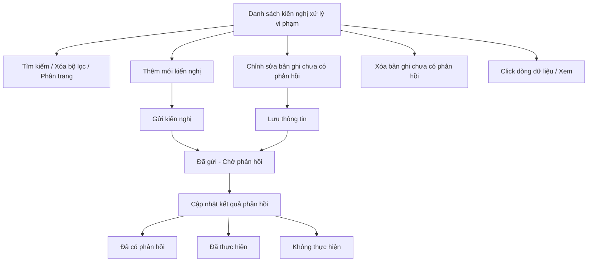
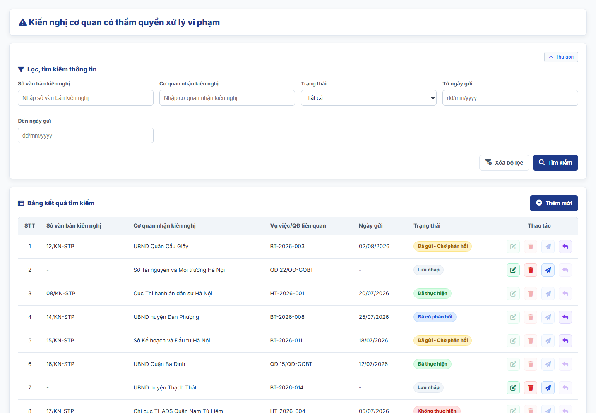

#### 4.3.3.10. UC481-482 - Kiến nghị cơ quan có thẩm quyền xử lý vi phạm trong việc GQBT, thực hiện trách nhiệm hoàn trả

##### 4.3.3.10.1. Mục đích

\- Cho phép cán bộ Sở Tư pháp lập, quản lý và theo dõi văn bản kiến nghị cơ quan có thẩm quyền xử lý vi phạm phát sinh trong quá trình giải quyết bồi thường (GQBT) hoặc thực hiện trách nhiệm hoàn trả tại địa phương, theo quy định tại điểm l khoản 1 Điều 73 Luật Trách nhiệm bồi thường của Nhà nước 2017.

\- Cho phép theo dõi trạng thái xử lý và kết quả phản hồi của cơ quan nhận kiến nghị.

*a. Phân quyền*

\- Cán bộ Sở Tư pháp: được tra cứu, xem chi tiết, thêm mới và gửi kiến nghị; chỉnh sửa, xóa bản ghi ở trạng thái "Đã gửi - Chờ phản hồi" (chưa cập nhật kết quả phản hồi) do chính mình tạo; cập nhật kết quả phản hồi cho bản ghi do mình tạo.

*b. Điều kiện thực hiện*

\- Người dùng đã đăng nhập thành công vào Website quản trị.

\- Người dùng được phân quyền truy cập màn hình `Kiến nghị xử lý vi phạm trong GQBT, thực hiện trách nhiệm hoàn trả`.

\- Trạng thái xử lý kiến nghị gồm: "Đã gửi - Chờ phản hồi", "Đã có phản hồi", "Đã thực hiện", "Không thực hiện". Bản ghi được lưu và gửi trong cùng một thao tác nên trạng thái khởi tạo là "Đã gửi - Chờ phản hồi".

\- Cơ quan nhận kiến nghị tham chiếu Danh mục các đơn vị trên hệ thống `[DM_DON_VI]`.

---

##### 4.3.3.10.2. Sơ đồ luồng nghiệp vụ theo giao diện

---

##### 4.3.3.10.3. MH01 - Màn hình Danh sách kiến nghị xử lý vi phạm trong GQBT/hoàn trả

###### 4.3.3.10.3.1. Màn hình

###### 4.3.3.10.3.2. Mô tả thông tin trên màn hình

| Trường thông tin | Kiểu dữ liệu | Bắt buộc | Mặc định | Mô tả |
| :--- | :--- | :--- | :--- | :--- |
| **I. Bộ lọc tìm kiếm** | - | - | - | Control UI: Khối thu gọn/mở rộng (Accordion). - Mặc định hiển thị dạng mở rộng. - Cho phép thu gọn/mở rộng khi click vào nút "Thu gọn"/"Mở rộng" ở góc phải khối; khi thu gọn, các giá trị lọc đã nhập được giữ nguyên. |
| Số văn bản kiến nghị | String(50) | Không | Trống | Control UI: Input text. - Placeholder: "Nhập số văn bản kiến nghị...". - Tìm gần đúng theo Số văn bản kiến nghị; không phân biệt hoa thường, có dấu/không dấu. |
| Cơ quan nhận kiến nghị | String(255) | Không | Trống | Control UI: Input text. - Placeholder: "Nhập cơ quan nhận kiến nghị...". - Tìm gần đúng theo Cơ quan nhận kiến nghị; không phân biệt hoa thường, có dấu/không dấu. |
| Trạng thái | Enum(String(50)) | Không | Tất cả | Gồm: + Tất cả + Đã gửi - Chờ phản hồi + Đã có phản hồi + Đã thực hiện + Không thực hiện |
| Từ ngày gửi | Date | Không | Theo dữ liệu hệ thống | Định dạng `dd/mm/yyyy`. |
| Đến ngày gửi | Date | Không | Theo dữ liệu hệ thống | Định dạng `dd/mm/yyyy`. Áp dụng rule khoảng ngày [BR-VAL-007]. |
| **II. Bảng danh sách kết quả** | - | - | 20 bản ghi/trang | Control UI: Data grid. - Khi người dùng truy cập màn hình, hệ thống tự động tải trang đầu tiên (Trang 1) với số lượng mặc định 20 bản ghi. - Sắp xếp mặc định: Sắp xếp theo "Ngày tạo" giảm dần (mới nhất hiển thị lên đầu). - Trạng thái có dữ liệu: Hiển thị danh sách các bản ghi kết quả theo cấu trúc các cột quy định. - Trạng thái không có dữ liệu (Empty State): Khi không tìm thấy kết quả phù hợp với điều kiện tìm kiếm, bảng hiển thị duy nhất 01 dòng căn giữa trên toàn bộ chiều rộng bảng (`colspan`), in nghiêng với nội dung theo MessageList dùng chung [MSG-INF-SYS-001]. |
| Cột: STT | Integer(10) | Không | Theo trang hiện tại | Chỉ đọc. Căn giữa, tăng theo phân trang. |
| Cột: Số văn bản kiến nghị | String(50) | Không | Theo dữ liệu hệ thống | Chỉ đọc. |
| Cột: Cơ quan nhận kiến nghị | String(255) | Không | Theo dữ liệu hệ thống | Chỉ đọc. |
| Cột: Vụ việc/QĐ liên quan | String(255) | Không | Theo dữ liệu hệ thống | Chỉ đọc. Hiển thị `-` nếu chưa gắn thông tin. |
| Cột: Ngày gửi | Date | Không | Theo dữ liệu hệ thống | Chỉ đọc. Định dạng `dd/mm/yyyy`. |
| Cột: Trạng thái | Enum(String(50)) | Không | Theo dữ liệu hệ thống | Chỉ đọc. Hiển thị badge màu theo trạng thái xử lý. |
| Cột: Thao tác | String(255) | Không | Theo trạng thái | Chỉ đọc. Gồm icon `Chỉnh sửa`, `Xóa`, `Cập nhật phản hồi`; icon không đủ điều kiện hiển thị dạng mờ, không cho thao tác. |
| Phân trang | String(255) | Không | 20 bản ghi/trang | Control UI: Pagination. - Cho phép chọn cấu hình số lượng bản ghi hiển thị trên mỗi trang gồm: 10, 20, 50, 100 bản ghi/trang; mặc định chọn sẵn 20 bản ghi/trang. - Đầy đủ các nút điều hướng trang: Đầu (&#124;&lt;&lt;), Trước (&lt;), các số trang, Sau (&gt;), Cuối (&gt;&gt;&#124;). - Hiển thị dải bản ghi: "Hiển thị [từ] - [đến] của [tổng số] bản ghi". |

###### 4.3.3.10.3.3. Chức năng trên màn hình

| STT | Tên chức năng | Định dạng | Mô tả |
| :--- | :--- | :--- | :--- |
| 1 | Tìm kiếm | Button | Khi người dùng click nút, hệ thống kiểm tra điều kiện dữ liệu và thực hiện tìm kiếm theo các trường hợp bên dưới: |
|  |  |  | **TH1 - Khoảng ngày không hợp lệ**: Nếu `Từ ngày` lớn hơn `Đến ngày`, vi phạm [BR-VAL-007], hệ thống hiển thị cảnh báo lỗi [MSG-ERR-VAL-007] và không thực hiện tìm kiếm. |
|  |  |  | **TH Hợp lệ (Có dữ liệu phù hợp)**: Hệ thống lọc và hiển thị danh sách các bản ghi thỏa mãn đồng thời các tiêu chí tìm kiếm/lọc đã nhập/chọn, hiển thị kết quả lên bảng và đưa về Trang 1. |
|  |  |  | **TH Không có dữ liệu trả về**: Bảng kết quả hiển thị duy nhất 01 dòng căn giữa trên toàn bộ chiều rộng bảng (`colspan`), in nghiêng với nội dung theo MessageList dùng chung [MSG-INF-SYS-001]; thanh phân trang hiển thị *"Hiển thị 0-0 của 0 bản ghi"*, các nút điều hướng trang ở trạng thái ẩn hoặc khóa mờ (Disabled); nút "Kết xuất Excel" (nếu có) ở trạng thái khóa mờ kèm tooltip *"Không có dữ liệu để kết xuất Excel"*. |
| 2 | Xóa bộ lọc | Button | Hệ thống đặt lại toàn bộ tiêu chí lọc về giá trị mặc định và tải lại danh sách. |
| 3 | Thêm mới | Button | Hệ thống mở **MH02 - Thêm mới/Chỉnh sửa kiến nghị xử lý vi phạm** ở chế độ thêm mới. |
| 4 | Chỉnh sửa | Icon button | Chỉ cho phép với bản ghi ở trạng thái "Đã gửi - Chờ phản hồi" (chưa cập nhật kết quả phản hồi) do cán bộ đăng nhập tạo. Hệ thống mở **MH02 - Thêm mới/Chỉnh sửa kiến nghị xử lý vi phạm** ở chế độ chỉnh sửa. |
| 5 | Cập nhật phản hồi | Icon button | Chỉ hiển thị với bản ghi ở trạng thái "Đã gửi - Chờ phản hồi" hoặc "Đã có phản hồi". Hệ thống mở **Popup Cập nhật kết quả phản hồi**. |
| 6 | Xóa | Icon button | Chỉ cho phép với bản ghi ở trạng thái "Đã gửi - Chờ phản hồi" (chưa cập nhật kết quả phản hồi) do cán bộ đăng nhập tạo. Hệ thống mở **Popup Xác nhận** với nội dung [MSG-CFM-SYS-001]. Nếu xác nhận, hệ thống xóa vĩnh viễn bản ghi khỏi hệ thống và hiển thị [MSG-SUC-SYS-002]. |
| 7 | Click dòng dữ liệu | Row click | Hệ thống mở **MH02 - Thêm mới/Chỉnh sửa kiến nghị xử lý vi phạm** ở chế độ chỉ xem. |

---

##### 4.3.3.10.4. MH02 - Màn hình Thêm mới/Chỉnh sửa kiến nghị xử lý vi phạm

###### 4.3.3.10.4.1. Màn hình

###### 4.3.3.10.4.2. Mô tả thông tin trên màn hình

| Trường thông tin | Kiểu dữ liệu | Bắt buộc | Mặc định | Mô tả |
| :--- | :--- | :--- | :--- | :--- |
| Tiêu đề màn hình | String(255) | - | Theo ngữ cảnh | Chỉ đọc. Hiển thị `THÊM MỚI KIẾN NGHỊ XỬ LÝ VI PHẠM` hoặc `CHỈNH SỬA KIẾN NGHỊ XỬ LÝ VI PHẠM`. |
| Trạng thái | Enum(String(50)) | - | `Đang nhập` | Chỉ đọc. Khi thêm mới hiển thị `Đang nhập` (bản ghi chưa được lưu); khi chỉnh sửa/xem hiển thị trạng thái hiện hành của bản ghi; hệ thống tự chuyển trạng thái theo thao tác, không cho chỉnh sửa trực tiếp. |
| Vụ việc/Quyết định liên quan | String(255) | Không | Trống | Ô nhập mã vụ việc hoặc số quyết định kèm nút `Tìm kiếm` và `Tìm kiếm nâng cao`. Khi thao tác tìm kiếm, hệ thống mở popup chuẩn tại **Popup chuẩn Tìm kiếm vụ việc/hồ sơ gốc liên quan** trong SRS Module Giải quyết yêu cầu bồi thường. |
| Liên kết vụ việc/QĐ gốc | Link | Không | Ẩn | Chỉ hiển thị sau khi cán bộ chọn vụ việc/quyết định liên quan từ popup hoặc khi mở lại bản ghi đã có liên kết. Link hiển thị `Mã vụ việc/Số quyết định - Họ và tên người yêu cầu bồi thường`; khi bấm mở màn hình xem chi tiết hồ sơ gốc tương ứng ở cùng tab, chế độ chỉ xem. |
| Cơ quan nhận kiến nghị | Enum(String(255)) | Có | Trống | Tham chiếu Danh mục Cơ quan, Đơn vị giải quyết [DM_DON_VI]. Cho phép tìm kiếm nhanh theo `Mã đơn vị` hoặc `Tên đơn vị`; áp dụng tìm gần đúng (chứa chuỗi nhập, không phân biệt hoa/thường và dấu tiếng Việt). Áp dụng rule bắt buộc [BR-VAL-001]. |
| Căn cứ pháp lý kiến nghị | Text(1000) | Có | `Điểm l khoản 1 Điều 73 Luật Trách nhiệm bồi thường của Nhà nước 2017` | Áp dụng rule bắt buộc [BR-VAL-001]. |
| Nội dung vi phạm phát hiện | Text(2000) | Có | Trống | Ghi rõ hành vi vi phạm, thời điểm phát hiện, cơ quan/cá nhân liên quan. Áp dụng rule bắt buộc [BR-VAL-001]. |
| Nội dung kiến nghị | Text(2000) | Có | Trống | Ghi nội dung đề nghị xử lý cụ thể. Áp dụng rule bắt buộc [BR-VAL-001]. |
| Số văn bản kiến nghị | String(50) | Có theo điều kiện | Trống | Bắt buộc nhập khi thực hiện `Gửi kiến nghị`. Áp dụng rule bắt buộc [BR-VAL-001]. |
| Ngày lập văn bản | Date | Có theo điều kiện | Ngày hiện tại | Bắt buộc nhập khi thực hiện `Gửi kiến nghị`. Áp dụng rule ngày quá khứ [BR-VAL-008]. |
| Người ký | String(100) | Có theo điều kiện | Trống | Bắt buộc nhập khi thực hiện `Gửi kiến nghị`. |
| Chức vụ | String(100) | Có theo điều kiện | Trống | Bắt buộc nhập khi thực hiện `Gửi kiến nghị`. |
| Tài liệu kiến nghị đính kèm | File | Không | Trống | Áp dụng [BR-FILE-010]. |
| Hủy bỏ | - | Không | Hiển thị | Chi tiết nghiệp vụ xem tại bảng Chức năng trên màn hình. |
| Lưu thông tin | - | Không | Hiển thị ở chế độ chỉnh sửa | Chi tiết nghiệp vụ xem tại bảng Chức năng trên màn hình. |
| Gửi kiến nghị | - | Không | Hiển thị ở chế độ thêm mới | Chi tiết nghiệp vụ xem tại bảng Chức năng trên màn hình. |

###### 4.3.3.10.4.3. Chức năng trên màn hình

| STT | Tên chức năng | Định dạng | Mô tả |
| :--- | :--- | :--- | :--- |
| 1 | Hủy bỏ | Button | Hệ thống đóng màn hình, không lưu dữ liệu và quay lại **MH01 - Danh sách kiến nghị xử lý vi phạm trong GQBT/hoàn trả**. |
| 2 | Lưu thông tin | Button | Chỉ áp dụng ở chế độ chỉnh sửa. TH1 (Bỏ trống trường bắt buộc, gồm `Cơ quan nhận kiến nghị`, `Căn cứ pháp lý kiến nghị`, `Nội dung vi phạm phát hiện`, `Nội dung kiến nghị` và các trường thông tin văn bản đã gửi): Vi phạm [BR-VAL-001]. Hệ thống tô viền đỏ ô trống đầu tiên và hiển thị [MSG-ERR-VAL-001]. Không cho phép lưu. |
|  |  |  | TH2 (Hợp lệ): Hệ thống lưu thông tin đã chỉnh sửa, giữ nguyên trạng thái "Đã gửi - Chờ phản hồi" và ngày gửi, đóng màn hình, tải lại danh sách và hiển thị [MSG-SUC-SYS-002]. |
| 3 | Gửi kiến nghị | Button | Chỉ áp dụng ở chế độ thêm mới. TH1 (Bỏ trống trường bắt buộc, bao gồm cả `Số văn bản kiến nghị`, `Ngày lập văn bản`, `Người ký`, `Chức vụ`): Vi phạm [BR-VAL-001]. Hệ thống tô viền đỏ ô trống đầu tiên và hiển thị [MSG-ERR-VAL-001]. Không cho phép gửi. |
|  |  |  | TH2 (`Ngày lập văn bản` lớn hơn ngày hiện tại): Vi phạm [BR-VAL-008], hiển thị [MSG-ERR-VAL-008]. Không cho phép gửi. |
|  |  |  | TH3 (Hợp lệ): Hệ thống mở **Popup Xác nhận** với nội dung [MSG-CFM-SYS-001]. Nếu xác nhận, hệ thống lưu bản ghi trực tiếp ở trạng thái "Đã gửi - Chờ phản hồi" (không có bước lưu tạm), ghi nhận ngày gửi là ngày hiện tại, đóng màn hình, tải lại danh sách và hiển thị [MSG-SUC-SYS-003]. |
| 4 | Tìm kiếm (Vụ việc/Quyết định liên quan) | Button | Khi người dùng click nút, hệ thống mở popup tìm kiếm hồ sơ liên quan và xử lý theo các trường hợp bên dưới: |
|  |  |  | **TH Hợp lệ (Có dữ liệu phù hợp)**: Hệ thống tự điền giá trị đang nhập tại trường liên quan vào tiêu chí tìm kiếm tương ứng, hiển thị danh sách bản ghi phù hợp trên popup để người dùng lựa chọn. |
|  |  |  | **TH Không có dữ liệu trả về**: Bảng kết quả hiển thị duy nhất 01 dòng căn giữa trên toàn bộ chiều rộng bảng (`colspan`), in nghiêng với nội dung theo MessageList dùng chung [MSG-INF-SYS-001]; thanh phân trang hiển thị *"Hiển thị 0-0 của 0 bản ghi"*, các nút điều hướng trang ở trạng thái ẩn hoặc khóa mờ (Disabled); nút "Kết xuất Excel" (nếu có) ở trạng thái khóa mờ kèm tooltip *"Không có dữ liệu để kết xuất Excel"*. |
| 5 | Tìm kiếm nâng cao | Button | Khi người dùng click nút, hệ thống mở popup tìm kiếm nâng cao; khi thực hiện tìm kiếm trên popup, hệ thống kiểm tra điều kiện dữ liệu và xử lý theo các trường hợp bên dưới: |
|  |  |  | **TH1 - Khoảng ngày không hợp lệ**: Nếu `Từ ngày` lớn hơn `Đến ngày`, vi phạm [BR-VAL-007], hệ thống hiển thị cảnh báo lỗi [MSG-ERR-VAL-007] và không thực hiện tìm kiếm. |
|  |  |  | **TH Hợp lệ (Có dữ liệu phù hợp)**: Hệ thống lọc và hiển thị danh sách các bản ghi thỏa mãn đồng thời các tiêu chí tìm kiếm/lọc đã nhập/chọn trên popup, hiển thị kết quả lên bảng và đưa về Trang 1. |
|  |  |  | **TH Không có dữ liệu trả về**: Bảng kết quả hiển thị duy nhất 01 dòng căn giữa trên toàn bộ chiều rộng bảng (`colspan`), in nghiêng với nội dung theo MessageList dùng chung [MSG-INF-SYS-001]; thanh phân trang hiển thị *"Hiển thị 0-0 của 0 bản ghi"*, các nút điều hướng trang ở trạng thái ẩn hoặc khóa mờ (Disabled); nút "Kết xuất Excel" (nếu có) ở trạng thái khóa mờ kèm tooltip *"Không có dữ liệu để kết xuất Excel"*. |
| 6 | Liên kết vụ việc/QĐ gốc | Link | Khi bấm link, hệ thống mở màn hình xem chi tiết hồ sơ gốc tương ứng ở cùng tab, chế độ chỉ xem. |
| 7 | Tải lên | Button | Hệ thống mở trình chọn file cho `Tài liệu kiến nghị đính kèm`. |
| 8 | Xem file | Link | Cho phép xem file tại một tab riêng. |
| 9 | Xóa | Link | Hệ thống gỡ file khỏi danh sách file đã chọn trên màn hình trước khi lưu. |

---

##### 4.3.3.10.5. Popup Xác nhận

###### 4.3.3.10.5.1. Màn hình

###### 4.3.3.10.5.2. Mô tả thông tin trên màn hình

| Trường thông tin | Kiểu dữ liệu | Bắt buộc | Mặc định | Mô tả |
| :--- | :--- | :--- | :--- | :--- |
| Tiêu đề popup | String(255) | - | Theo thao tác | Chỉ đọc. Hiển thị icon cảnh báo và nội dung xác nhận theo thao tác đang thực hiện. |
| Nội dung xác nhận | Text(2000) | - | Theo thao tác | Chỉ đọc. Áp dụng message xác nhận [MSG-CFM-SYS-001]. |
| Hủy bỏ | - | Không | Hiển thị | Đóng popup, không thực hiện callback. |
| Đồng ý | - | Không | Hiển thị | Xác nhận thực hiện callback của thao tác đã gọi popup. |

###### 4.3.3.10.5.3. Chức năng trên màn hình

| STT | Tên chức năng | Định dạng | Mô tả |
| :--- | :--- | :--- | :--- |
| 1 | Hủy bỏ | Button | Hệ thống đóng popup xác nhận và không thực hiện thao tác. |
| 2 | Đồng ý | Button | Hệ thống đóng popup xác nhận và thực hiện callback tương ứng (gửi kiến nghị hoặc xóa vĩnh viễn bản ghi). |

---

##### 4.3.3.10.6. Popup Cập nhật kết quả phản hồi

###### 4.3.3.10.6.1. Màn hình

###### 4.3.3.10.6.2. Mô tả thông tin trên màn hình

| Trường thông tin | Kiểu dữ liệu | Bắt buộc | Mặc định | Mô tả |
| :--- | :--- | :--- | :--- | :--- |
| Tiêu đề popup | String(255) | - | - | Chỉ đọc. `Cập nhật kết quả phản hồi kiến nghị`. |
| Ngày phản hồi | Date | Có | Ngày hiện tại | Áp dụng rule ngày quá khứ [BR-VAL-008]. |
| Kết quả phản hồi | Enum(String(50)) | Có | `Đã có phản hồi` | \- Giá trị gồm: + Đã có phản hồi + Đã thực hiện + Không thực hiện |
| Nội dung phản hồi | Text(2000) | Có | Trống | Ghi nội dung phản hồi/kết quả xử lý của cơ quan nhận kiến nghị. Áp dụng rule bắt buộc [BR-VAL-001]. |
| Tài liệu phản hồi đính kèm | File | Không | Trống | Áp dụng [BR-FILE-010]. |
| Hủy bỏ | - | Không | Hiển thị | Đóng popup, không lưu dữ liệu. |
| Lưu lại | - | Không | Hiển thị | Chi tiết nghiệp vụ xem tại bảng Chức năng trên màn hình. |

###### 4.3.3.10.6.3. Chức năng trên màn hình

| STT | Tên chức năng | Định dạng | Mô tả |
| :--- | :--- | :--- | :--- |
| 1 | Hủy bỏ | Button | Hệ thống đóng popup, không lưu dữ liệu. |
| 2 | Lưu lại | Button | TH1 (Bỏ trống trường bắt buộc): Vi phạm [BR-VAL-001], hiển thị [MSG-ERR-VAL-001]. Không cho phép lưu. |
|  |  |  | TH2 (Hợp lệ): Hệ thống lưu kết quả phản hồi, cập nhật trạng thái bản ghi theo `Kết quả phản hồi` đã chọn, đóng popup, tải lại danh sách và hiển thị [MSG-SUC-SYS-002]. |

---

##### 4.3.3.10.7. Ghi chú phạm vi đặc tả

\- Bản ghi kiến nghị áp dụng cơ chế xóa vĩnh viễn (hard delete), chỉ áp dụng cho bản ghi ở trạng thái "Đã gửi - Chờ phản hồi" chưa cập nhật kết quả phản hồi, do chính cán bộ đăng nhập tạo.

\- Hệ thống không có bước lưu tạm: bản ghi được lưu và gửi trong cùng thao tác "Gửi kiến nghị". Sau khi đã cập nhật kết quả phản hồi, bản ghi không còn cho phép xóa hoặc chỉnh sửa nội dung kiến nghị gốc; chỉ cho phép cập nhật khối kết quả phản hồi.

\- Trường `Vụ việc/Quyết định liên quan` chỉ dùng để liên kết tới vụ việc hoặc quyết định nguồn phục vụ nội dung kiến nghị, không làm phát sinh quyết định mới trong module này.

\- Module này không có bước trình lãnh đạo trên hệ thống. `Số văn bản kiến nghị`, `Ngày lập văn bản`, `Người ký`, `Chức vụ` là thông tin văn bản kiến nghị do cán bộ ghi nhận khi gửi; nếu áp dụng quản lý sổ văn bản thì văn bản này được ghi nhận theo sổ của đơn vị ban hành văn bản kiến nghị.
