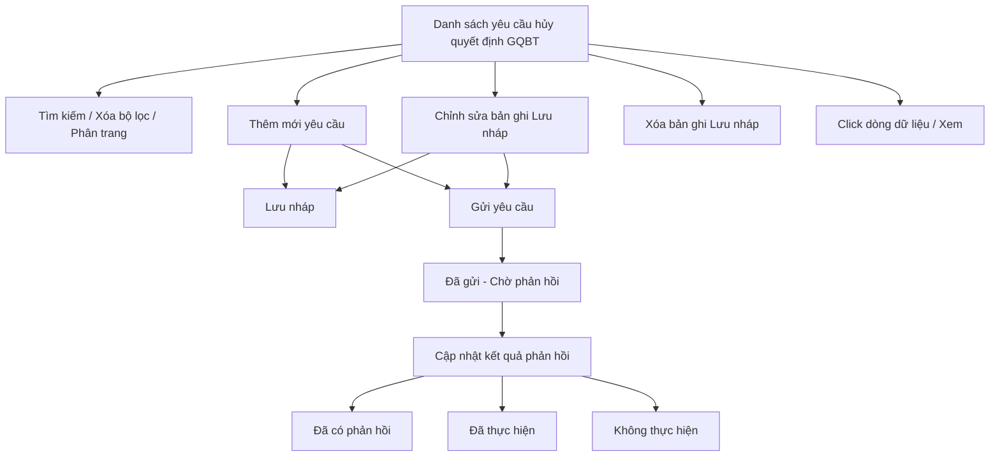

#### 4.3.3.12. UC485-486 - Yêu cầu Thủ trưởng cơ quan trực tiếp quản lý người thi hành công vụ gây thiệt hại hủy quyết định GQBT

##### 4.3.3.12.1. Mục đích

\- Cho phép cán bộ Sở Tư pháp lập, quản lý và theo dõi văn bản yêu cầu Thủ trưởng cơ quan trực tiếp quản lý người thi hành công vụ gây thiệt hại hủy quyết định giải quyết bồi thường (GQBT) khi có căn cứ quyết định đó trái quy định pháp luật, theo Điều 29 Thông tư 08/2019/TT-BTP.

\- Cho phép theo dõi trạng thái xử lý và kết quả phản hồi của cơ quan nhận yêu cầu.

*a. Phân quyền*

\- Cán bộ Sở Tư pháp: được tra cứu, xem chi tiết, thêm mới, chỉnh sửa, xóa bản ghi ở trạng thái "Lưu nháp" do chính mình tạo; được gửi yêu cầu và cập nhật kết quả phản hồi cho bản ghi do mình tạo.

*b. Điều kiện thực hiện*

\- Người dùng đã đăng nhập thành công vào Website quản trị.

\- Người dùng được phân quyền truy cập màn hình `Yêu cầu hủy quyết định GQBT`.

\- Trạng thái xử lý yêu cầu Tham chiếu Danh mục Trạng thái xử lý trách nhiệm hoàn trả [DM_42].

\- Thủ trưởng cơ quan quản lý người thi hành công vụ (nhận yêu cầu) tham chiếu Danh mục các đơn vị trên hệ thống `[DM_DON_VI]`.

---

##### 4.3.3.12.2. Sơ đồ luồng nghiệp vụ theo giao diện

---

##### 4.3.3.12.3. MH01 - Màn hình Danh sách yêu cầu hủy quyết định GQBT

###### 4.3.3.12.3.1. Màn hình

###### 4.3.3.12.3.2. Mô tả thông tin trên màn hình

| Trường thông tin | Kiểu dữ liệu | Bắt buộc | Mặc định | Mô tả |
| :--- | :--- | :--- | :--- | :--- |
| **I. Bộ lọc tìm kiếm** | | | | |
| Từ khóa | String(255) | Không | Trống | Tìm kiếm gần đúng theo `Số văn bản yêu cầu` hoặc `Số Quyết định GQBT bị yêu cầu hủy`. |
| Trạng thái | Enum(String(50)) | Không | Tất cả | Tham chiếu Danh mục Trạng thái xử lý trách nhiệm hoàn trả [DM_42]. |
| Từ ngày gửi | Date | Không | Theo dữ liệu hệ thống | Định dạng `dd/mm/yyyy`. |
| Đến ngày gửi | Date | Không | Theo dữ liệu hệ thống | Định dạng `dd/mm/yyyy`. Áp dụng rule khoảng ngày [BR-VAL-007]. |
| **II. Bảng danh sách kết quả** | | | | - Trạng thái có dữ liệu: Hiển thị danh sách các bản ghi kết quả theo cấu trúc các cột quy định. - Trạng thái không có dữ liệu (Empty State): Khi không tìm thấy kết quả phù hợp với điều kiện tìm kiếm, bảng hiển thị duy nhất 01 dòng căn giữa trên toàn bộ chiều rộng bảng (`colspan`), in nghiêng với nội dung: *"Không tìm thấy dữ liệu phù hợp với điều kiện tìm kiếm."* |
| Cột: STT | Integer(10) | Không | Theo trang hiện tại | Chỉ đọc. Căn giữa, tăng theo phân trang. |
| Cột: Số văn bản yêu cầu | String(50) | Không | Theo dữ liệu hệ thống | Chỉ đọc. Hiển thị `-` khi chưa gửi. |
| Cột: Số Quyết định GQBT bị yêu cầu hủy | String(50) | Không | Theo dữ liệu hệ thống | Chỉ đọc. |
| Cột: Cơ quan nhận yêu cầu | String(255) | Không | Theo dữ liệu hệ thống | Chỉ đọc. |
| Cột: Ngày gửi | Date | Không | Theo dữ liệu hệ thống | Chỉ đọc. Định dạng `dd/mm/yyyy`; hiển thị `-` khi chưa gửi. |
| Cột: Trạng thái | Enum(String(50)) | Không | Theo dữ liệu hệ thống | Chỉ đọc. Hiển thị badge màu theo Danh mục Trạng thái xử lý trách nhiệm hoàn trả [DM_42]. |
| Cột: Thao tác | String(255) | Không | Theo trạng thái | Chỉ đọc. Gồm icon `Chỉnh sửa`, `Xóa`, `Gửi yêu cầu`, `Cập nhật phản hồi`; icon không đủ điều kiện hiển thị dạng mờ, không cho thao tác. |
| Phân trang | String(255) | Không | `20 bản ghi/trang` | Tuân thủ quy chuẩn phân trang chung [BR-UI-001]. |

###### 4.3.3.12.3.3. Chức năng trên màn hình

| STT | Tên chức năng | Định dạng | Mô tả |
| :--- | :--- | :--- | :--- |
| 1 | Tìm kiếm | Button | TH1 (Khoảng ngày không hợp lệ): Vi phạm [BR-VAL-007], hiển thị [MSG-ERR-VAL-007]. Không thực hiện tìm kiếm. - **TH Không có dữ liệu trả về**: + Bảng kết quả: Hiển thị dòng thông báo rỗng *"Không tìm thấy dữ liệu phù hợp với điều kiện tìm kiếm."* ở giữa bảng. + Thanh phân trang (Pagination): Dòng số lượng hiển thị *"Hiển thị 0-0 của 0 bản ghi"* (hoặc *"Hiển thị 0-0 của 0 yêu cầu"*); các nút điều hướng trang (`&#124;&lt;&lt;`, `&lt;`, các số trang, `&gt;`, `&gt;&gt;&#124;`) ở trạng thái ẩn hoặc khóa mờ (Disabled). + Nút "Kết xuất Excel" (nếu màn hình có nút này): Thiết lập ở trạng thái khóa mờ (Disabled) kèm tooltip: *"Không có dữ liệu để kết xuất Excel"*. |
|  |  |  | TH2 (Hợp lệ): Hệ thống lọc danh sách theo các tiêu chí đã nhập, cập nhật lưới kết quả và đưa về trang 1. |
| 2 | Xóa bộ lọc | Button | Hệ thống đặt lại toàn bộ tiêu chí lọc về giá trị mặc định và tải lại danh sách. |
| 3 | Thêm mới | Button | Hệ thống mở **MH02 - Thêm mới/Chỉnh sửa yêu cầu hủy quyết định GQBT** ở chế độ thêm mới, trạng thái khởi tạo "Lưu nháp". |
| 4 | Chỉnh sửa | Icon button | Chỉ hiển thị với bản ghi ở trạng thái "Lưu nháp" do cán bộ đăng nhập tạo. Hệ thống mở **MH02 - Thêm mới/Chỉnh sửa yêu cầu hủy quyết định GQBT** ở chế độ chỉnh sửa. |
| 5 | Gửi yêu cầu | Icon button | Chỉ hiển thị với bản ghi ở trạng thái "Lưu nháp". Hệ thống mở **Popup Xác nhận** với nội dung [MSG-CFM-SYS-001]. Nếu xác nhận, hệ thống chuyển trạng thái sang "Đã gửi - Chờ phản hồi", ghi nhận ngày gửi là ngày hiện tại và hiển thị [MSG-SUC-SYS-003]. |
| 6 | Cập nhật phản hồi | Icon button | Chỉ hiển thị với bản ghi ở trạng thái "Đã gửi - Chờ phản hồi" hoặc "Đã có phản hồi". Hệ thống mở **Popup Cập nhật kết quả phản hồi**. |
| 7 | Xóa | Icon button | Chỉ hiển thị với bản ghi ở trạng thái "Lưu nháp" do cán bộ đăng nhập tạo. Hệ thống mở **Popup Xác nhận** với nội dung [MSG-CFM-SYS-001]. Nếu xác nhận, hệ thống xóa vĩnh viễn bản ghi khỏi hệ thống và hiển thị [MSG-SUC-SYS-002]. |
| 8 | Click dòng dữ liệu | Row click | Hệ thống mở **MH02 - Thêm mới/Chỉnh sửa yêu cầu hủy quyết định GQBT** ở chế độ chỉ xem. |

---

##### 4.3.3.12.4. MH02 - Màn hình Thêm mới/Chỉnh sửa yêu cầu hủy quyết định GQBT

###### 4.3.3.12.4.1. Màn hình

###### 4.3.3.12.4.2. Mô tả thông tin trên màn hình

| Trường thông tin | Kiểu dữ liệu | Bắt buộc | Mặc định | Mô tả |
| :--- | :--- | :--- | :--- | :--- |
| Tiêu đề màn hình | String(255) | - | Theo ngữ cảnh | Chỉ đọc. Hiển thị `THÊM MỚI YÊU CẦU HỦY QUYẾT ĐỊNH GQBT` hoặc `CHỈNH SỬA YÊU CẦU HỦY QUYẾT ĐỊNH GQBT`. |
| Trạng thái | Enum(String(50)) | - | `Lưu nháp` | Chỉ đọc. Tham chiếu Danh mục Trạng thái xử lý trách nhiệm hoàn trả [DM_42]; hệ thống tự chuyển trạng thái theo thao tác, không cho chỉnh sửa trực tiếp. |
| **I. Thông tin Quyết định GQBT bị yêu cầu hủy** | String(255) | - | - | Khối thông tin quyết định giải quyết bồi thường bị yêu cầu hủy. |
| Số Quyết định GQBT | String(50) | Có | Trống | Áp dụng rule bắt buộc [BR-VAL-001]. |
| Cơ quan ban hành Quyết định | Enum(String(255)) | Có | Trống | Tham chiếu Danh mục Cơ quan, Đơn vị giải quyết [DM_DON_VI]. Cho phép tìm kiếm nhanh theo `Mã đơn vị` hoặc `Tên đơn vị`; áp dụng tìm gần đúng. Áp dụng rule bắt buộc [BR-VAL-001]. |
| Ngày ban hành Quyết định | Date | Có | Trống | Áp dụng rule ngày quá khứ [BR-VAL-008]. |
| Vụ việc yêu cầu bồi thường liên quan | String(255) | Không | Trống | Ô nhập `Mã vụ việc` kèm nút `Tìm kiếm` và `Tìm kiếm nâng cao`. Khi thao tác tìm kiếm, hệ thống mở popup chuẩn tại **Popup chuẩn Tìm kiếm vụ việc/hồ sơ gốc liên quan** trong SRS Module Giải quyết yêu cầu bồi thường. |
| Liên kết hồ sơ gốc | Link | Không | Ẩn | Chỉ hiển thị sau khi cán bộ chọn vụ việc yêu cầu bồi thường liên quan từ popup hoặc khi mở lại bản ghi đã có liên kết. Link hiển thị `Mã vụ việc - Tên vụ việc`; khi bấm mở màn hình xem chi tiết hồ sơ gốc ở cùng tab, chế độ chỉ xem. |
| Căn cứ cho rằng Quyết định trái pháp luật | Text(2000) | Có | Trống | Ghi rõ nội dung/điều khoản pháp luật mà Quyết định GQBT vi phạm. Áp dụng rule bắt buộc [BR-VAL-001]. |
| **II. Nội dung yêu cầu** | Text(2000) | - | - | Khối nội dung văn bản yêu cầu hủy quyết định. |
| Thủ trưởng cơ quan quản lý người thi hành công vụ (nhận yêu cầu) | Enum(String(255)) | Có | Trống | Tham chiếu Danh mục Cơ quan, Đơn vị giải quyết [DM_DON_VI]. Cho phép tìm kiếm nhanh theo `Mã đơn vị` hoặc `Tên đơn vị`; áp dụng tìm gần đúng. Áp dụng rule bắt buộc [BR-VAL-001]. |
| Căn cứ pháp lý yêu cầu | Text(1000) | Có | `Điều 29 Thông tư 08/2019/TT-BTP` | Áp dụng rule bắt buộc [BR-VAL-001]. |
| Nội dung yêu cầu | Text(2000) | Có | Trống | Ghi nội dung đề nghị hủy quyết định cụ thể. Áp dụng rule bắt buộc [BR-VAL-001]. |
| Số văn bản yêu cầu | String(50) | Có theo điều kiện | Trống | Bắt buộc nhập khi thực hiện `Gửi yêu cầu`. |
| Ngày lập văn bản | Date | Có theo điều kiện | Ngày hiện tại | Bắt buộc nhập khi thực hiện `Gửi yêu cầu`. Áp dụng rule ngày quá khứ [BR-VAL-008]. |
| Người ký | String(100) | Có theo điều kiện | Trống | Bắt buộc nhập khi thực hiện `Gửi yêu cầu`. |
| Chức vụ | String(100) | Có theo điều kiện | Trống | Bắt buộc nhập khi thực hiện `Gửi yêu cầu`. |
| Tài liệu yêu cầu đính kèm | File | Không | Trống | Áp dụng [BR-FILE-010]. |
| Hủy bỏ | - | Không | Hiển thị | Chi tiết nghiệp vụ xem tại bảng Chức năng trên màn hình. |
| Lưu nháp | - | Không | Hiển thị khi trạng thái "Lưu nháp" | Chi tiết nghiệp vụ xem tại bảng Chức năng trên màn hình. |
| Gửi yêu cầu | - | Không | Hiển thị khi trạng thái "Lưu nháp" | Chi tiết nghiệp vụ xem tại bảng Chức năng trên màn hình. |

###### 4.3.3.12.4.3. Chức năng trên màn hình

| STT | Tên chức năng | Định dạng | Mô tả |
| :--- | :--- | :--- | :--- |
| 1 | Hủy bỏ | Button | Hệ thống đóng màn hình, không lưu dữ liệu và quay lại **MH01 - Danh sách yêu cầu hủy quyết định GQBT**. |
| 2 | Lưu nháp | Button | TH1 (Bỏ trống trường bắt buộc của bước Lưu nháp, gồm `Số Quyết định GQBT`, `Cơ quan ban hành Quyết định`, `Ngày ban hành Quyết định`, `Căn cứ cho rằng Quyết định trái pháp luật`, `Thủ trưởng cơ quan quản lý người thi hành công vụ`, `Căn cứ pháp lý yêu cầu`, `Nội dung yêu cầu`): Vi phạm [BR-VAL-001]. Hệ thống tô viền đỏ ô trống đầu tiên và hiển thị [MSG-ERR-VAL-001]. Không cho phép lưu. |
|  |  |  | TH2 (`Ngày ban hành Quyết định` lớn hơn ngày hiện tại): Vi phạm [BR-VAL-008], hiển thị [MSG-ERR-VAL-008]. Không cho phép lưu. |
|  |  |  | TH3 (Hợp lệ): Hệ thống lưu bản ghi ở trạng thái "Lưu nháp", đóng màn hình, tải lại danh sách và hiển thị [MSG-SUC-SYS-001]. |
| 3 | Gửi yêu cầu | Button | TH1 (Bỏ trống trường bắt buộc, bao gồm cả `Số văn bản yêu cầu`, `Ngày lập văn bản`, `Người ký`, `Chức vụ`): Vi phạm [BR-VAL-001]. Hệ thống tô viền đỏ ô trống đầu tiên và hiển thị [MSG-ERR-VAL-001]. Không cho phép gửi. |
|  |  |  | TH2 (`Ngày lập văn bản` lớn hơn ngày hiện tại): Vi phạm [BR-VAL-008], hiển thị [MSG-ERR-VAL-008]. Không cho phép gửi. |
|  |  |  | TH3 (Hợp lệ): Hệ thống lưu bản ghi, chuyển trạng thái sang "Đã gửi - Chờ phản hồi", ghi nhận ngày gửi là ngày hiện tại, đóng màn hình, tải lại danh sách và hiển thị [MSG-SUC-SYS-003]. |
| 4 | Tìm kiếm (Vụ việc yêu cầu bồi thường liên quan) | Button | Hệ thống mở popup chuẩn tại **Popup chuẩn Tìm kiếm vụ việc/hồ sơ gốc liên quan** trong SRS Module Giải quyết yêu cầu bồi thường, tự điền tiêu chí `Mã vụ việc` bằng giá trị đang nhập tại trường `Vụ việc yêu cầu bồi thường liên quan` và tự thực hiện tìm kiếm. Trường hợp không có kết quả, hiển thị [MSG-INF-BTNN-GQBT-002] tại vùng bảng kết quả. - **TH Không có dữ liệu trả về**: + Bảng kết quả: Hiển thị dòng thông báo rỗng *"Không tìm thấy dữ liệu phù hợp với điều kiện tìm kiếm."* ở giữa bảng. + Thanh phân trang (Pagination): Dòng số lượng hiển thị *"Hiển thị 0-0 của 0 bản ghi"* (hoặc *"Hiển thị 0-0 của 0 yêu cầu"*); các nút điều hướng trang (`&#124;&lt;&lt;`, `&lt;`, các số trang, `&gt;`, `&gt;&gt;&#124;`) ở trạng thái ẩn hoặc khóa mờ (Disabled). + Nút "Kết xuất Excel" (nếu màn hình có nút này): Thiết lập ở trạng thái khóa mờ (Disabled) kèm tooltip: *"Không có dữ liệu để kết xuất Excel"*. |
| 5 | Tìm kiếm nâng cao | Button | Hệ thống mở popup chuẩn tại **Popup chuẩn Tìm kiếm vụ việc/hồ sơ gốc liên quan** trong SRS Module Giải quyết yêu cầu bồi thường với các tiêu chí tìm kiếm chi tiết. - **TH Không có dữ liệu trả về**: + Bảng kết quả: Hiển thị dòng thông báo rỗng *"Không tìm thấy dữ liệu phù hợp với điều kiện tìm kiếm."* ở giữa bảng. + Thanh phân trang (Pagination): Dòng số lượng hiển thị *"Hiển thị 0-0 của 0 bản ghi"* (hoặc *"Hiển thị 0-0 của 0 yêu cầu"*); các nút điều hướng trang (`&#124;&lt;&lt;`, `&lt;`, các số trang, `&gt;`, `&gt;&gt;&#124;`) ở trạng thái ẩn hoặc khóa mờ (Disabled). + Nút "Kết xuất Excel" (nếu màn hình có nút này): Thiết lập ở trạng thái khóa mờ (Disabled) kèm tooltip: *"Không có dữ liệu để kết xuất Excel"*. |
| 6 | Liên kết hồ sơ gốc | Link | Chỉ hiển thị sau khi cán bộ chọn vụ việc từ popup hoặc khi mở bản ghi đã có liên kết. Khi bấm link, hệ thống mở màn hình xem chi tiết hồ sơ yêu cầu bồi thường gốc ở cùng tab, chế độ chỉ xem. |
| 7 | Tải lên | Button | Hệ thống mở trình chọn file cho `Tài liệu yêu cầu đính kèm`. |
| 8 | Xem file | Link | Cho phép xem file tại một tab riêng. |
| 9 | Xóa | Link | Hệ thống gỡ file khỏi danh sách file đã chọn trên màn hình trước khi lưu. |

---

##### 4.3.3.12.5. Popup Xác nhận

###### 4.3.3.12.5.1. Màn hình

###### 4.3.3.12.5.2. Mô tả thông tin trên màn hình

| Trường thông tin | Kiểu dữ liệu | Bắt buộc | Mặc định | Mô tả |
| :--- | :--- | :--- | :--- | :--- |
| Tiêu đề popup | String(255) | - | Theo thao tác | Chỉ đọc. Hiển thị icon cảnh báo và nội dung xác nhận theo thao tác đang thực hiện. |
| Nội dung xác nhận | Text(2000) | - | Theo thao tác | Chỉ đọc. Áp dụng message xác nhận [MSG-CFM-SYS-001]. |
| Hủy bỏ | - | Không | Hiển thị | Đóng popup, không thực hiện callback. |
| Đồng ý | - | Không | Hiển thị | Xác nhận thực hiện callback của thao tác đã gọi popup. |

###### 4.3.3.12.5.3. Chức năng trên màn hình

| STT | Tên chức năng | Định dạng | Mô tả |
| :--- | :--- | :--- | :--- |
| 1 | Hủy bỏ | Button | Hệ thống đóng popup xác nhận và không thực hiện thao tác. |
| 2 | Đồng ý | Button | Hệ thống đóng popup xác nhận và thực hiện callback tương ứng (gửi yêu cầu hoặc xóa vĩnh viễn bản ghi). |

---

##### 4.3.3.12.6. Popup Cập nhật kết quả phản hồi

###### 4.3.3.12.6.1. Màn hình

###### 4.3.3.12.6.2. Mô tả thông tin trên màn hình

| Trường thông tin | Kiểu dữ liệu | Bắt buộc | Mặc định | Mô tả |
| :--- | :--- | :--- | :--- | :--- |
| Tiêu đề popup | String(255) | - | - | Chỉ đọc. `Cập nhật kết quả phản hồi yêu cầu hủy quyết định GQBT`. |
| Ngày phản hồi | Date | Có | Ngày hiện tại | Áp dụng rule ngày quá khứ [BR-VAL-008]. |
| Kết quả phản hồi | Enum(String(50)) | Có | `Đã có phản hồi` | \- Giá trị gồm: + Đã có phản hồi + Đã thực hiện + Không thực hiện |
| Nội dung phản hồi | Text(2000) | Có | Trống | Ghi nội dung phản hồi/kết quả xử lý (ví dụ số Quyết định hủy nếu đã ban hành). Áp dụng rule bắt buộc [BR-VAL-001]. |
| Tài liệu phản hồi đính kèm | File | Không | Trống | Áp dụng [BR-FILE-010]. |
| Hủy bỏ | - | Không | Hiển thị | Đóng popup, không lưu dữ liệu. |
| Lưu lại | - | Không | Hiển thị | Chi tiết nghiệp vụ xem tại bảng Chức năng trên màn hình. |

###### 4.3.3.12.6.3. Chức năng trên màn hình

| STT | Tên chức năng | Định dạng | Mô tả |
| :--- | :--- | :--- | :--- |
| 1 | Hủy bỏ | Button | Hệ thống đóng popup, không lưu dữ liệu. |
| 2 | Lưu lại | Button | TH1 (Bỏ trống trường bắt buộc): Vi phạm [BR-VAL-001], hiển thị [MSG-ERR-VAL-001]. Không cho phép lưu. |
|  |  |  | TH2 (Hợp lệ): Hệ thống lưu kết quả phản hồi, cập nhật trạng thái bản ghi theo `Kết quả phản hồi` đã chọn, đóng popup, tải lại danh sách và hiển thị [MSG-SUC-SYS-002]. |

---

##### 4.3.3.12.7. Ghi chú phạm vi đặc tả

\- Bản ghi yêu cầu áp dụng cơ chế xóa vĩnh viễn (hard delete), chỉ áp dụng cho bản ghi ở trạng thái "Lưu nháp" (chưa gửi).

\- Sau khi đã "Gửi yêu cầu", bản ghi không còn cho phép xóa hoặc chỉnh sửa nội dung yêu cầu gốc; chỉ cho phép cập nhật khối kết quả phản hồi.

\- `Số Quyết định GQBT`, `Cơ quan ban hành Quyết định`, `Ngày ban hành Quyết định` là thông tin quyết định nguồn bị yêu cầu hủy, không phải số quyết định mới phát sinh từ module này.

\- Module này không có bước trình lãnh đạo trên hệ thống. `Số văn bản yêu cầu`, `Ngày lập văn bản`, `Người ký`, `Chức vụ` là thông tin văn bản yêu cầu đã được cán bộ ghi nhận khi gửi; nếu áp dụng quản lý sổ văn bản thì văn bản này được ghi nhận theo sổ của đơn vị ban hành văn bản yêu cầu, không dùng sổ quyết định GQBT.
