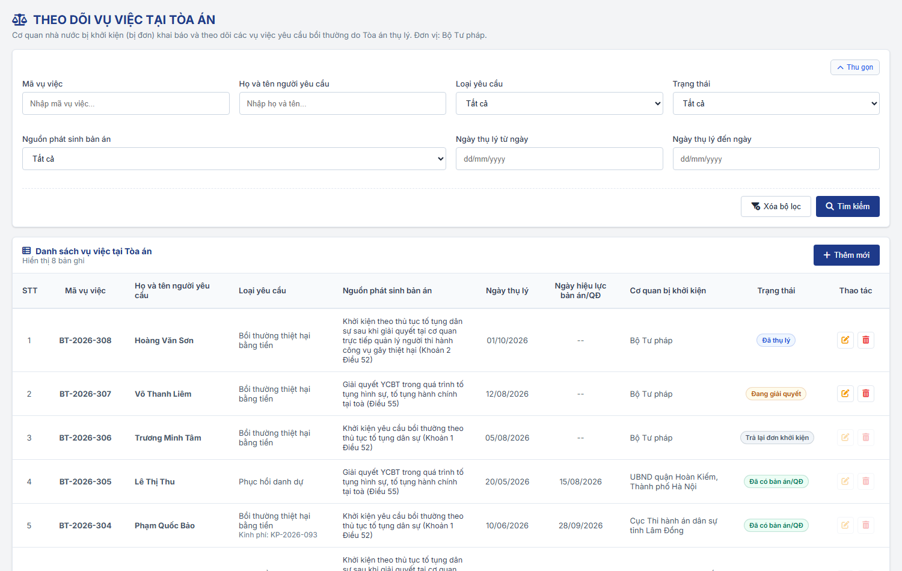
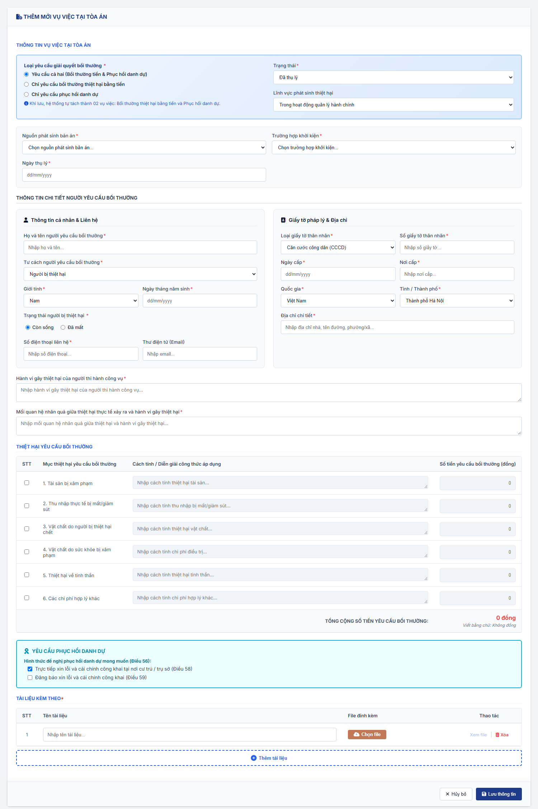
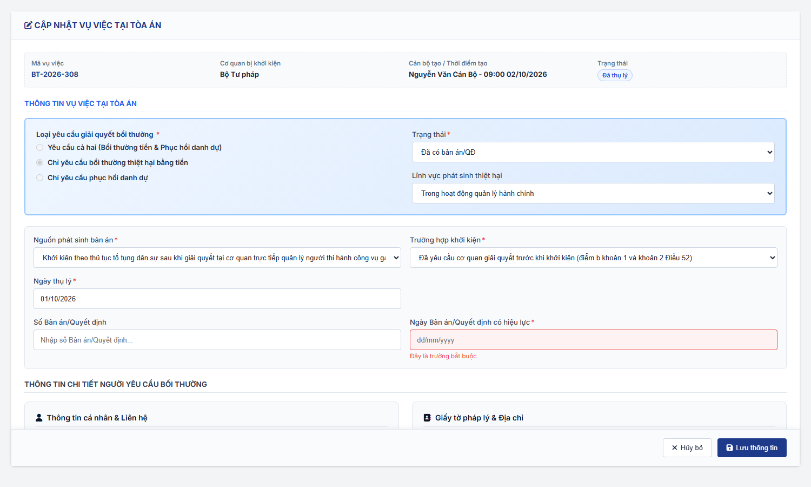
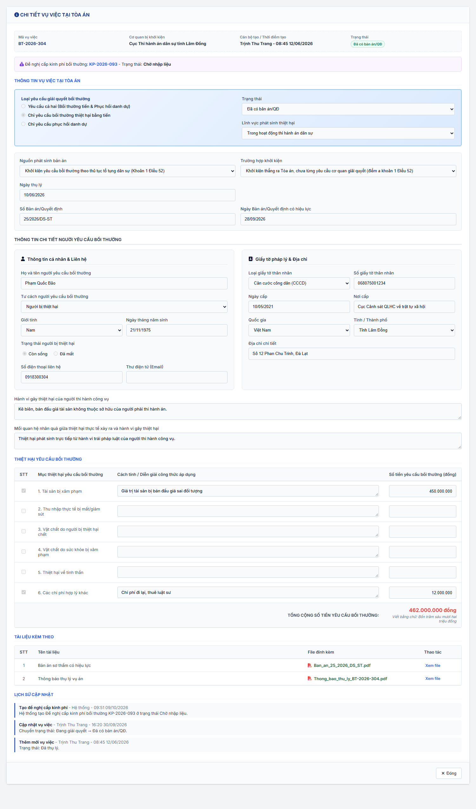
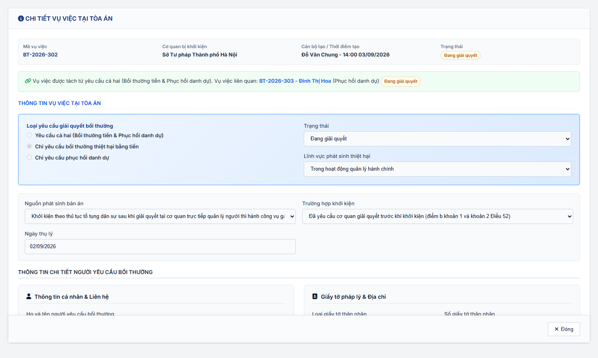

### 4.3.3.30. Theo dõi vụ việc tại Tòa án

#### 4.3.3.30.1. Mục đích

\- Cho phép cơ quan nhà nước bị khởi kiện (bị đơn) khai báo và quản lý các vụ việc yêu cầu bồi thường do Tòa án tiếp nhận, gồm: khởi kiện yêu cầu bồi thường theo thủ tục tố tụng dân sự và giải quyết yêu cầu bồi thường trong quá trình tố tụng hình sự, tố tụng hành chính tại Tòa án.

\- Gồm 06 chức năng:

\+ Tra cứu danh sách vụ việc tại Tòa án.

\+ Xem chi tiết vụ việc, vụ việc liên quan, đề nghị cấp kinh phí đã tạo và lịch sử cập nhật.

\+ Thêm mới vụ việc; vụ việc "Yêu cầu cả hai" được hệ thống tự tách thành 02 vụ việc.

\+ Cập nhật thông tin và trạng thái vụ việc.

\+ Xóa vụ việc chưa ở trạng thái kết thúc.

\+ Tự động tạo Đề nghị cấp kinh phí bồi thường ở trạng thái "Chờ nhập liệu" khi vụ việc có yêu cầu bồi thường bằng tiền chuyển "Đã có bản án/QĐ".

\- Thông tin người yêu cầu bồi thường, người bị thiệt hại, loại yêu cầu, lĩnh vực, hành vi gây thiệt hại, thiệt hại yêu cầu bồi thường dùng cùng cấu trúc với [Thêm mới hồ sơ yêu cầu bồi thường - Giải quyết yêu cầu bồi thường - Bồi thường nhà nước (Website Quản trị)](SRS_BTNN_GiaiQuyetBT_GiaiQuyet_YCBT.md).

*a. Phân quyền*

\- Menu "Theo dõi vụ việc tại Tòa án" thuộc Bồi thường nhà nước → Giải quyết bồi thường, đặt ngay sau menu "Giải quyết yêu cầu bồi thường".

\- Nhóm quyền "Theo dõi vụ việc tại Tòa án" gồm: Tra cứu vụ việc tại Tòa án; Thêm mới vụ việc tại Tòa án; Cập nhật vụ việc tại Tòa án; Xóa vụ việc tại Tòa án.

\- Thêm mới, Cập nhật, Xóa: chỉ cán bộ thuộc đơn vị được áp dụng Loại yêu cầu "Yêu cầu bồi thường" theo [Đơn vị áp dụng của Loại yêu cầu - Quản lý danh mục dùng chung - Quản trị hệ thống (Website Quản trị)](../01_Quan_tri_he_thong/Quan_ly_danh_muc.md#dm-don-vi-ap-dung).

*b. Điều kiện thực hiện*

\- Người dùng đã đăng nhập Website Quản trị và được phân quyền chức năng tương ứng của nhóm quyền "Theo dõi vụ việc tại Tòa án".

---

#### 4.3.3.30.2. Quy tắc chung

| STT | Nội dung | Quy tắc |
| :-- | :--- | :--- |
| 1 | Cơ quan bị khởi kiện | Cơ quan bị khởi kiện (bị đơn) của vụ việc là đơn vị gốc (đơn vị cấp cao nhất trên cây Cơ cấu tổ chức) của cán bộ thêm mới vụ việc. Hệ thống tự gán, không cho sửa. |
| 2 | Phạm vi xem | Cán bộ xem vụ việc có Cơ quan bị khởi kiện là đơn vị gốc của mình. - Cán bộ thuộc Bộ Tư pháp xem vụ việc của mọi cơ quan. |
| 3 | Quyền nhập liệu | Một Loại yêu cầu áp dụng cho người dùng khi Đơn vị áp dụng chứa đơn vị của người dùng hoặc một đơn vị cấp trên của đơn vị đó. - Đơn vị không được áp dụng Loại yêu cầu "Yêu cầu bồi thường": nút "Thêm mới" và thao tác Cập nhật, Xóa hiển thị mờ; màn hình hiển thị thông báo "Đơn vị của bạn chưa được áp dụng Loại yêu cầu "Yêu cầu bồi thường" nên không được thêm mới, cập nhật hoặc xóa vụ việc tại Tòa án." - Cập nhật, Xóa chỉ áp dụng cho vụ việc có Cơ quan bị khởi kiện là đơn vị gốc của người dùng. Mọi cán bộ của cơ quan có quyền nhập liệu đều được cập nhật, không giới hạn người tạo. |
| 4 | Mã vụ việc | Sinh khi Lưu theo quy tắc chung BT-yyyy-nnn: yyyy là năm hiện tại; nnn là số thứ tự lớn nhất trong năm cộng 1, xét đồng thời mã vụ việc tại Giải quyết yêu cầu bồi thường, hồ sơ luồng phân công Bồi thường nhà nước và module này; không trùng mã đã có. |
| 5 | Tự tách vụ việc "Yêu cầu cả hai" | Khi thêm mới với Loại yêu cầu "Yêu cầu cả hai (Bồi thường tiền & Phục hồi danh dự)", hệ thống tạo 02 vụ việc với 02 Mã vụ việc liên tiếp: + Vụ việc thứ nhất: "Bồi thường thiệt hại bằng tiền", lưu bảng Thiệt hại yêu cầu bồi thường. + Vụ việc thứ hai: "Phục hồi danh dự", lưu Hình thức đề nghị phục hồi danh dự. - Hai vụ việc dùng chung các thông tin còn lại, liên kết qua lại (Vụ việc liên quan) và cùng nằm trong module này. - Sau khi tách, mỗi vụ việc được cập nhật trạng thái độc lập. - Xóa một vụ việc thì gỡ liên kết ở vụ việc còn lại và ghi lịch sử "Gỡ liên kết". |
| 6 | Loại yêu cầu sau khi lưu | Loại yêu cầu chỉ chọn khi thêm mới; sau khi lưu hiển thị chỉ đọc. |
| 7 | Trạng thái kết thúc | "Đã có bản án/QĐ" và "Trả lại đơn khởi kiện" là trạng thái kết thúc. Sau khi lưu ở trạng thái kết thúc, vụ việc không được đổi trạng thái, không được cập nhật, không được xóa. |
| 8 | Ngày hiệu lực bản án/QĐ | Bắt buộc khi Trạng thái = "Đã có bản án/QĐ"; không nhỏ hơn Ngày thụ lý. |
| 9 | Tự tạo đề nghị cấp kinh phí | Khi vụ việc "Bồi thường thiệt hại bằng tiền" được lưu ở trạng thái "Đã có bản án/QĐ", hệ thống tạo 01 Đề nghị cấp kinh phí bồi thường tại [Quản lý kinh phí bồi thường - Giải quyết bồi thường - Bồi thường nhà nước (Website Quản trị)](SRS_BTNN_GiaiQuyetBT_KinhPhi_BT.md): + Loại đề nghị: "Đề nghị cấp kinh phí bồi thường"; Trạng thái: "Chờ nhập liệu". + Dữ liệu nạp sẵn: Mã vụ việc; thông tin người yêu cầu bồi thường; Cơ quan bị khởi kiện; Số Bản án/Quyết định và Ngày Bản án/Quyết định có hiệu lực (làm Số, Ngày Quyết định làm căn cứ); các khoản thiệt hại yêu cầu bồi thường và tổng số tiền; tài liệu kèm theo có tệp đính kèm. - Mỗi vụ việc chỉ tạo 01 lần, khóa chống trùng theo Mã vụ việc. Màn hình Cấp kinh phí tạm ứng/Bồi thường kiểm tra lại khi tải và bổ sung bản ghi còn thiếu. - Vụ việc "Phục hồi danh dự" không tạo đề nghị cấp kinh phí. - Ghi lịch sử vụ việc "Tạo đề nghị cấp kinh phí" với nội dung "Hệ thống tạo Đề nghị cấp kinh phí bồi thường [Mã đề xuất] ở trạng thái Chờ nhập liệu.", người thực hiện "Hệ thống". |
| 10 | Báo cáo thống kê | Vụ việc có trạng thái "Trả lại đơn khởi kiện" không được đếm tại các màn hình Thống kê vụ việc yêu cầu bồi thường (TT08) và Dashboard Bồi thường nhà nước. |
| 11 | Kiểm tra đồng thời | Khi Lưu, Xóa: hệ thống kiểm tra lại trạng thái mới nhất của vụ việc. Vụ việc đã chuyển trạng thái kết thúc hoặc đã bị xóa: hiển thị "Vụ việc đã được cập nhật sang trạng thái kết thúc hoặc đã bị xóa. Danh sách đã được tải lại.", không lưu. |
| 12 | Lịch sử cập nhật | Mỗi thao tác ghi 01 dòng gồm Thao tác, Người thực hiện, Thời điểm (hh:mm dd/mm/yyyy), Nội dung. Thao tác: Thêm mới vụ việc; Cập nhật vụ việc; Tạo đề nghị cấp kinh phí; Gỡ liên kết. |
| 13 | Nhận diện vụ việc | Thông báo, popup xác nhận nhận diện vụ việc bằng "[Mã vụ việc] - [Họ và tên người yêu cầu]". |

---

#### 4.3.3.30.3. Trạng thái vụ việc

\- Cán bộ tự chọn trạng thái khi thêm mới và khi cập nhật. Vụ việc chưa ở trạng thái kết thúc được chuyển sang bất kỳ trạng thái nào trong danh sách.

| Trạng thái | Ý nghĩa | Trạng thái kết thúc | Thao tác được phép |
| :--- | :--- | :--- | :--- |
| Đã thụ lý | Tòa án đã thụ lý vụ việc. Giá trị mặc định khi thêm mới. | Không | Xem; Cập nhật; Xóa. |
| Đang giải quyết | Tòa án đang giải quyết vụ việc. | Không | Xem; Cập nhật; Xóa. |
| Đã có bản án/QĐ | Đã có Bản án/Quyết định của Tòa án có hiệu lực. Vụ việc bồi thường bằng tiền phát sinh Đề nghị cấp kinh phí bồi thường "Chờ nhập liệu". | Có | Xem. |
| Trả lại đơn khởi kiện | Tòa án trả lại đơn khởi kiện. Không đếm trong báo cáo thống kê. | Có | Xem. |

---

#### 4.3.3.30.4. MH01 - Màn hình Danh sách vụ việc tại Tòa án

##### 4.3.3.30.4.1. Màn hình

##### 4.3.3.30.4.2. Mô tả thông tin trên màn hình

| Trường thông tin | Kiểu dữ liệu | Bắt buộc | Mặc định | Mô tả |
| :--- | :--- | :--- | :--- | :--- |
| Tiêu đề màn hình | String(255) | - | - | Hiển thị "THEO DÕI VỤ VIỆC TẠI TÒA ÁN". Dòng mô tả: "Cơ quan nhà nước bị khởi kiện (bị đơn) khai báo và theo dõi các vụ việc yêu cầu bồi thường do Tòa án thụ lý. Đơn vị: [Tên đơn vị gốc của người dùng]." |
| Thông báo không có quyền nhập liệu | String(500) | - | Ẩn | Chỉ hiển thị khi đơn vị của người dùng không được áp dụng Loại yêu cầu "Yêu cầu bồi thường" (quy tắc 3 tại [Quy tắc chung](#tdta-quy-tac-chung)). |
| **Khối bộ lọc** | - | - | - | Control UI: Khối thu gọn/mở rộng; các điều kiện kết hợp theo điều kiện AND. |
| Mã vụ việc | String(50) | Không | Trống | Control UI: Input text, placeholder "Nhập mã vụ việc...". - Tìm gần đúng, không phân biệt hoa thường, không phân biệt dấu. |
| Họ và tên người yêu cầu | String(100) | Không | Trống | Control UI: Input text, placeholder "Nhập họ và tên...". - Tìm gần đúng, không phân biệt hoa thường, không phân biệt dấu. |
| Loại yêu cầu | Enum(String(50)) | Không | Tất cả | Control UI: Hộp chọn. Gồm: Tất cả; Bồi thường thiệt hại bằng tiền; Phục hồi danh dự. |
| Trạng thái | Enum(String(50)) | Không | Tất cả | Control UI: Hộp chọn. Gồm "Tất cả" và 04 trạng thái tại [Trạng thái vụ việc](#tdta-trang-thai). |
| Nguồn phát sinh bản án | Enum(String(255)) | Không | Tất cả | Control UI: Hộp chọn. Gồm "Tất cả" và 03 giá trị của trường Nguồn phát sinh bản án tại [MH02](#tdta-mh02). |
| Ngày thụ lý từ ngày | Date | Không | Trống | Control UI: DatePicker, định dạng dd/mm/yyyy. Lọc vụ việc có Ngày thụ lý lớn hơn hoặc bằng giá trị nhập. |
| Ngày thụ lý đến ngày | Date | Không | Trống | Control UI: DatePicker, định dạng dd/mm/yyyy. Lọc vụ việc có Ngày thụ lý nhỏ hơn hoặc bằng giá trị nhập. |
| **Bảng danh sách vụ việc** | - | - | 20 bản ghi/trang | Control UI: Bảng, phân trang (10/20/50/100 dòng). - Sắp xếp theo Mã vụ việc giảm dần. - Không có dữ liệu: 01 dòng căn giữa, in nghiêng "Không tìm thấy dữ liệu phù hợp với điều kiện tìm kiếm.". |
| STT | Integer(10) | - | Tự sinh | Tăng dần theo phân trang. |
| Mã vụ việc | String(50) | - | Theo dữ liệu | Chữ đậm, căn giữa. |
| Họ và tên người yêu cầu | String(100) | - | Theo dữ liệu | Chữ đậm. |
| Loại yêu cầu | String(50) | - | Theo dữ liệu | "Bồi thường thiệt hại bằng tiền" hoặc "Phục hồi danh dự". - Vụ việc tách từ yêu cầu cả hai: dòng phụ "Liên kết: [Mã vụ việc liên quan]". - Vụ việc đã tạo đề nghị cấp kinh phí: dòng phụ "Kinh phí: [Mã đề xuất]". |
| Nguồn phát sinh bản án | String(255) | - | Theo dữ liệu | |
| Ngày thụ lý | Date | - | Theo dữ liệu | dd/mm/yyyy, căn giữa. |
| Ngày hiệu lực bản án/QĐ | Date | - | Theo dữ liệu | dd/mm/yyyy, căn giữa; chưa có: "--". |
| Cơ quan bị khởi kiện | String(255) | - | Theo dữ liệu | Tên đơn vị gốc của vụ việc. |
| Trạng thái | String(50) | - | Theo dữ liệu | Control UI: Badge theo trạng thái. |
| Thao tác | - | - | - | Icon "Cập nhật", icon "Xóa". Hiển thị mờ, không cho click khi vụ việc ở trạng thái kết thúc, không thuộc cơ quan của người dùng hoặc đơn vị của người dùng không có quyền nhập liệu; tooltip nêu lý do. |

##### 4.3.3.30.4.3. Chức năng trên màn hình

| STT | Tên chức năng | Định dạng | Mô tả |
| :-- | :--- | :--- | :--- |
| 1 | Tìm kiếm | Nút | - Lọc danh sách theo đồng thời các điều kiện, đưa về trang 1. |
| 2 | Xóa bộ lọc | Nút | - Xóa các điều kiện lọc, đưa các hộp chọn về "Tất cả" và tải lại danh sách. |
| 3 | Thêm mới | Nút | - Mở [MH02 - Màn hình Thêm mới / Cập nhật vụ việc](#tdta-mh02) ở chế độ thêm mới. - Đơn vị không có quyền nhập liệu: nút hiển thị mờ; nếu vẫn gọi chức năng, hiển thị "Đơn vị chưa được áp dụng Loại yêu cầu "Yêu cầu bồi thường", không được thêm mới vụ việc!". |
| 4 | Click dòng dữ liệu | Row click | - Mở [MH03 - Màn hình Xem chi tiết vụ việc](#tdta-mh03). Click vào icon tại cột Thao tác thì chỉ thực hiện thao tác đó. |
| 5 | Cập nhật | Icon | - Mở [MH02 - Màn hình Thêm mới / Cập nhật vụ việc](#tdta-mh02) ở chế độ cập nhật. |
| 6 | Xóa | Icon | - Hiển thị popup "Xác nhận xóa" với nội dung "Bạn có chắc chắn muốn xóa vụ việc [Mã vụ việc] - [Họ và tên người yêu cầu] không?". - Đồng ý: kiểm tra lại theo quy tắc 11 tại [Quy tắc chung](#tdta-quy-tac-chung); hợp lệ thì xóa vụ việc khỏi danh sách, gỡ liên kết ở vụ việc liên quan (nếu có), hiển thị "Đã xóa vụ việc [Mã vụ việc]!". - Hủy bỏ: đóng popup, giữ nguyên dữ liệu. |

---

#### 4.3.3.30.5. MH02 - Màn hình Thêm mới / Cập nhật vụ việc

##### 4.3.3.30.5.1. Màn hình

##### 4.3.3.30.5.2. Mô tả thông tin trên màn hình

| Trường thông tin | Kiểu dữ liệu | Bắt buộc | Mặc định | Mô tả |
| :--- | :--- | :--- | :--- | :--- |
| Tiêu đề màn hình | String(255) | - | Theo chế độ | Thêm mới: "THÊM MỚI VỤ VIỆC TẠI TÒA ÁN". Cập nhật: "CẬP NHẬT VỤ VIỆC TẠI TÒA ÁN". |
| Khối thông tin chung | - | - | - | Chỉ hiển thị ở chế độ cập nhật, chỉ đọc: Mã vụ việc; Cơ quan bị khởi kiện; Cán bộ tạo / Thời điểm tạo; Trạng thái (Badge). |
| **Thông tin vụ việc tại Tòa án** | - | - | - | |
| Loại yêu cầu giải quyết bồi thường | Enum(String(100)) | Có | Yêu cầu cả hai | Control UI: Radio. Gồm: + Yêu cầu cả hai (Bồi thường tiền & Phục hồi danh dự) + Chỉ yêu cầu bồi thường thiệt hại bằng tiền + Chỉ yêu cầu phục hồi danh dự - Chọn "Yêu cầu cả hai": hiển thị dòng hướng dẫn "Khi lưu, hệ thống tự tách thành 02 vụ việc: Bồi thường thiệt hại bằng tiền và Phục hồi danh dự." - Chế độ cập nhật: chỉ đọc, chọn sẵn theo loại của vụ việc (tiền hoặc phục hồi danh dự). |
| Trạng thái | Enum(String(50)) | Có | Đã thụ lý | Control UI: Hộp chọn, gồm 04 trạng thái tại [Trạng thái vụ việc](#tdta-trang-thai). |
| Lĩnh vực phát sinh thiệt hại | Enum(String(100)) | Không | Trong hoạt động quản lý hành chính | Control UI: Hộp chọn. Gồm: Trong hoạt động quản lý hành chính; Trong hoạt động tố tụng hình sự; Trong hoạt động tố tụng dân sự; Trong hoạt động tố tụng hành chính; Trong hoạt động thi hành án hình sự; Trong hoạt động thi hành án dân sự. |
| Nguồn phát sinh bản án | Enum(String(255)) | Có | Trống | Control UI: Hộp chọn, placeholder "Chọn nguồn phát sinh bản án...". Gồm: + Khởi kiện yêu cầu bồi thường theo thủ tục tố tụng dân sự (Khoản 1 Điều 52) + Khởi kiện theo thủ tục tố tụng dân sự sau khi giải quyết tại cơ quan trực tiếp quản lý người thi hành công vụ gây thiệt hại (Khoản 2 Điều 52) + Giải quyết YCBT trong quá trình tố tụng hình sự, tố tụng hành chính tại toà (Điều 55) |
| Trường hợp khởi kiện | Enum(String(255)) | Có | Trống | Control UI: Hộp chọn, luôn hiển thị, placeholder "Chọn trường hợp khởi kiện...". Gồm: + Đã yêu cầu cơ quan giải quyết trước khi khởi kiện (điểm b khoản 1 và khoản 2 Điều 52) + Khởi kiện thẳng ra Tòa án, chưa từng yêu cầu cơ quan giải quyết (điểm a khoản 1 Điều 52) + Kết hợp giải quyết YCBT trong quá trình tố tụng hình sự, tố tụng hành chính tại toà |
| Ngày thụ lý | Date | Có | Trống | Control UI: DatePicker, định dạng dd/mm/yyyy. Không lớn hơn ngày hiện tại. |
| Số Bản án/Quyết định | String(100) | Không | Trống | Control UI: Input text, placeholder "Nhập số Bản án/Quyết định...". Chỉ hiển thị khi Trạng thái = "Đã có bản án/QĐ". |
| Ngày Bản án/Quyết định có hiệu lực | Date | Có (khi Trạng thái = "Đã có bản án/QĐ") | Trống | Control UI: DatePicker, định dạng dd/mm/yyyy. Chỉ hiển thị khi Trạng thái = "Đã có bản án/QĐ". Không nhỏ hơn Ngày thụ lý. |
| **Thông tin chi tiết người yêu cầu bồi thường** | - | - | - | Giống hệt khối thông tin người yêu cầu bồi thường tại [Thêm mới hồ sơ yêu cầu bồi thường - Giải quyết yêu cầu bồi thường - Bồi thường nhà nước (Website Quản trị)](SRS_BTNN_GiaiQuyetBT_GiaiQuyet_YCBT.md): Họ và tên người yêu cầu bồi thường*; Tư cách người yêu cầu bồi thường*; Giới tính*; Ngày tháng năm sinh*; Trạng thái người bị thiệt hại* (Còn sống/Đã mất); Số điện thoại liên hệ*; Thư điện tử (Email); Loại giấy tờ thân nhân*; Số giấy tờ thân nhân*; Ngày cấp*; Nơi cấp*; Quốc gia*; Tỉnh / Thành phố*; Địa chỉ chi tiết*. |
| **Thông tin người bị thiệt hại** | - | - | Ẩn | Chỉ hiển thị khi Tư cách người yêu cầu bồi thường khác "Người bị thiệt hại". - Gồm các trường giống hệt khối Người bị thiệt hại tại Giải quyết yêu cầu bồi thường: Họ và tên người bị thiệt hại; Giới tính; Ngày tháng năm sinh; Số điện thoại liên hệ; Thư điện tử (Email); Loại giấy tờ thân nhân; Số giấy tờ thân nhân; Ngày cấp; Nơi cấp; Quốc gia; Tỉnh / Thành phố; Địa chỉ chi tiết. - Không bắt buộc trường nào. |
| Hành vi gây thiệt hại của người thi hành công vụ | Text(4000) | Có | Trống | Control UI: Textarea, placeholder "Nhập hành vi gây thiệt hại của người thi hành công vụ...". |
| Mối quan hệ nhân quả giữa thiệt hại thực tế xảy ra và hành vi gây thiệt hại | Text(4000) | Có | Trống | Control UI: Textarea, placeholder "Nhập mối quan hệ nhân quả giữa thiệt hại và hành vi gây thiệt hại...". |
| **Thiệt hại yêu cầu bồi thường** | Table | Không | Không chọn dòng nào | Hiển thị khi Loại yêu cầu là "Yêu cầu cả hai" hoặc "Chỉ yêu cầu bồi thường thiệt hại bằng tiền". - 06 dòng cố định: 1. Tài sản bị xâm phạm; 2. Thu nhập thực tế bị mất/giảm sút; 3. Vật chất do người bị thiệt hại chết; 4. Vật chất do sức khỏe bị xâm phạm; 5. Thiệt hại về tinh thần; 6. Các chi phí hợp lý khác. - Mỗi dòng: Checkbox chọn; Cách tính / Diễn giải công thức áp dụng (Textarea); Số tiền yêu cầu bồi thường (đồng), tự định dạng phân cách hàng nghìn bằng dấu chấm. Chỉ nhập được khi tích chọn dòng; bỏ chọn thì xóa giá trị. - Dòng tổng: "TỔNG CỘNG SỐ TIỀN YÊU CẦU BỒI THƯỜNG" và số tiền viết bằng chữ, tự tính. |
| **Yêu cầu phục hồi danh dự** | - | - | - | Hiển thị khi Loại yêu cầu là "Yêu cầu cả hai" hoặc "Chỉ yêu cầu phục hồi danh dự". - Hình thức đề nghị phục hồi danh dự mong muốn (Điều 56), Checkbox: "Trực tiếp xin lỗi và cải chính công khai tại nơi cư trú / trụ sở (Điều 58)" (mặc định chọn); "Đăng báo xin lỗi và cải chính công khai (Điều 59)". - Trạng thái người bị thiệt hại = "Đã mất": tự chọn "Đăng báo...", bỏ chọn và khóa "Trực tiếp xin lỗi...". |
| **Tài liệu kèm theo** | Table | Có | 01 dòng trống | Control UI: Bảng gồm STT; Tên tài liệu (Input text, placeholder "Nhập tên tài liệu..."); File đính kèm (nút "Chọn file"); Thao tác ("Xem file", "Xóa"). - Bắt buộc ít nhất 01 dòng có tệp đính kèm. - Chọn tệp khi chưa nhập tên: tên tài liệu lấy theo tên tệp. - Nút "Thêm tài liệu" thêm 01 dòng trống. |

##### 4.3.3.30.5.3. Chức năng trên màn hình

| STT | Tên chức năng | Định dạng | Mô tả |
| :-- | :--- | :--- | :--- |
| 1 | Loại yêu cầu giải quyết bồi thường | Radio | - Đổi lựa chọn: hiển thị/ẩn khối Thiệt hại yêu cầu bồi thường và khối Yêu cầu phục hồi danh dự theo mô tả tại bảng trên. |
| 2 | Trạng thái | Hộp chọn | - Chọn "Đã có bản án/QĐ": hiển thị Số Bản án/Quyết định và Ngày Bản án/Quyết định có hiệu lực. Chọn trạng thái khác: ẩn 02 trường này; khi lưu không lưu giá trị 02 trường. |
| 3 | Tư cách người yêu cầu bồi thường | Hộp chọn | - Khác "Người bị thiệt hại": hiển thị khối Thông tin người bị thiệt hại. |
| 4 | Lưu thông tin | Nút | - TH1 (Bỏ trống trường bắt buộc): tô đỏ trường, hiển thị "Đây là trường bắt buộc" dưới trường, thông báo "Vui lòng nhập đầy đủ thông tin bắt buộc!", không lưu. - TH2 (Trạng thái = "Đã có bản án/QĐ" mà bỏ trống Ngày Bản án/Quyết định có hiệu lực): tô đỏ trường, thông báo "Vui lòng nhập Ngày Bản án/Quyết định có hiệu lực khi trạng thái là Đã có bản án/QĐ!", không lưu. - TH3 (Ngày thụ lý lớn hơn ngày hiện tại): "Ngày thụ lý không được lớn hơn ngày hiện tại" dưới trường, không lưu. - TH4 (Ngày hiệu lực nhỏ hơn Ngày thụ lý): "Ngày hiệu lực bản án/QĐ không được nhỏ hơn Ngày thụ lý" dưới trường, không lưu. - TH5 (Chưa có tài liệu nào có tệp đính kèm): hiển thị "Vui lòng đính kèm ít nhất 01 tài liệu kèm theo" dưới bảng, thông báo "Vui lòng đính kèm ít nhất 01 tài liệu kèm theo!", không lưu. - TH6 (Trạng thái là trạng thái kết thúc): hiển thị popup "Xác nhận lưu" với nội dung "Trạng thái "[Trạng thái]" là trạng thái kết thúc. Sau khi lưu, vụ việc không được thay đổi trạng thái, cập nhật hoặc xóa. Bạn có chắc chắn muốn lưu?". Đồng ý: lưu theo TH Hợp lệ. Hủy bỏ: đóng popup, giữ nguyên màn hình. - TH Hợp lệ - Thêm mới: sinh Mã vụ việc (quy tắc 4); Loại yêu cầu "Yêu cầu cả hai" thì tách 02 vụ việc (quy tắc 5); ghi lịch sử "Thêm mới vụ việc"; xử lý tự tạo đề nghị cấp kinh phí (quy tắc 9); đóng màn hình, tải lại danh sách, thông báo "Đã lưu vụ việc [Mã vụ việc]." hoặc "Đã lưu và tách thành 02 vụ việc: [Mã 1] (Bồi thường thiệt hại bằng tiền), [Mã 2] (Phục hồi danh dự)." - TH Hợp lệ - Cập nhật: kiểm tra lại theo quy tắc 11; lưu thông tin; ghi lịch sử "Cập nhật vụ việc" với nội dung "Chuyển trạng thái: [Trạng thái cũ] → [Trạng thái mới]." hoặc "Cập nhật thông tin vụ việc."; xử lý quy tắc 9; thông báo "Đã cập nhật vụ việc [Mã vụ việc]." - Khi tạo đề nghị cấp kinh phí: thông báo thêm "Đã tạo Đề nghị cấp kinh phí bồi thường [Mã đề xuất] ở trạng thái Chờ nhập liệu." |
| 5 | Hủy bỏ | Nút | - Đóng màn hình, không lưu, quay lại MH01. |

---

#### 4.3.3.30.6. MH03 - Màn hình Xem chi tiết vụ việc

##### 4.3.3.30.6.1. Màn hình

##### 4.3.3.30.6.2. Mô tả thông tin trên màn hình

\- Tiêu đề "CHI TIẾT VỤ VIỆC TẠI TÒA ÁN". Các trường như [MH02](#tdta-mh02), chỉ đọc; bảng tài liệu chỉ có thao tác "Xem file".

| Trường thông tin | Kiểu dữ liệu | Bắt buộc | Mặc định | Mô tả |
| :--- | :--- | :--- | :--- | :--- |
| Vụ việc liên quan | String(255) | - | Theo dữ liệu | Chỉ hiển thị với vụ việc tách từ yêu cầu cả hai: "Vụ việc được tách từ yêu cầu cả hai (Bồi thường tiền & Phục hồi danh dự). Vụ việc liên quan: [Mã vụ việc] - [Họ và tên người yêu cầu] ([Loại yêu cầu]) [Trạng thái]". Mã vụ việc dạng liên kết, mở chi tiết vụ việc liên quan. |
| Đề nghị cấp kinh phí bồi thường | String(255) | - | Theo dữ liệu | Chỉ hiển thị với vụ việc đã tạo đề nghị: "Đề nghị cấp kinh phí bồi thường: [Mã đề xuất] - Trạng thái: [Trạng thái đề nghị]". Mã đề xuất dạng liên kết, mở chi tiết đề nghị tại màn hình Cấp kinh phí tạm ứng/Bồi thường. |
| Lịch sử cập nhật | List | - | Theo dữ liệu | Mới nhất ở trên: "[Thao tác] - [Người thực hiện] - [Thời điểm]" và Nội dung. |

##### 4.3.3.30.6.3. Chức năng trên màn hình

| STT | Tên chức năng | Định dạng | Mô tả |
| :-- | :--- | :--- | :--- |
| 1 | Đóng | Nút | - Đóng màn hình, quay lại MH01. |
| 2 | Cập nhật | Nút | - Hiển thị khi người dùng được cập nhật vụ việc (quy tắc 3, 7 tại [Quy tắc chung](#tdta-quy-tac-chung)). Mở [MH02](#tdta-mh02) ở chế độ cập nhật. |
| 3 | Xóa | Nút | - Hiển thị cùng điều kiện với Cập nhật. Xử lý như chức năng Xóa tại [MH01](#tdta-mh01). |
| 4 | Mở bằng tham số | URL | - Mở màn hình kèm tham số Mã vụ việc (VD từ liên kết Mã vụ việc tại màn hình Cấp kinh phí tạm ứng/Bồi thường): mở sẵn MH03 của vụ việc tương ứng. |

---

#### 4.3.3.30.7. Ghi chú

\- Các quy tắc sau được áp dụng theo mặc định, chưa được xác nhận chính thức:

\+ Ngày thụ lý là trường bắt buộc; Số Bản án/Quyết định không bắt buộc.

\+ Vụ việc ở trạng thái kết thúc không được cập nhật bất kỳ thông tin nào (không chỉ trạng thái).

\+ Cán bộ thuộc Bộ Tư pháp xem được vụ việc của mọi cơ quan; các đơn vị khác chỉ xem vụ việc của cơ quan mình.

\+ Bảng Thiệt hại yêu cầu bồi thường không bắt buộc; số tiền nạp sẵn sang Đề nghị cấp kinh phí bồi thường lấy theo bảng này.

\- Thanh "Người dùng giả lập" trên mockup chỉ phục vụ minh họa phân quyền theo đơn vị, không thuộc phạm vi chức năng.
