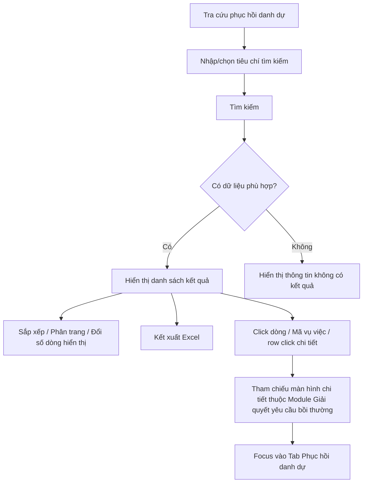

### 4.3.3. Dành cho Cán bộ Công tác bồi thường nhà nước

#### 4.3.3.5. UC434-437 - Tra cứu phục hồi danh dự

##### 4.3.3.5.1. Mục đích

\- Cho phép người dùng trên Website quản trị tra cứu danh sách tiến trình phục hồi danh dự được kế thừa tự động từ hồ sơ giải quyết yêu cầu bồi thường.

\- Cho phép lọc danh sách theo mã vụ việc, người bị thiệt hại, cơ quan giải quyết bồi thường, trạng thái giải quyết, hình thức phục hồi danh dự và khoảng ngày cập nhật.

\- Cho phép sắp xếp, phân trang, kết xuất Excel và mở hồ sơ giải quyết yêu cầu bồi thường liên quan trong cùng tab, đồng thời focus vào nội dung phục hồi danh dự.

*a. Phân quyền*

\- Người dùng có quyền tra cứu công tác bồi thường được truy cập màn hình Tra cứu phục hồi danh dự.

\- Màn hình chỉ phục vụ tra cứu/xem chi tiết liên kết, không hiển thị chức năng thêm mới, cập nhật hoặc phê duyệt trực tiếp trên danh sách.

*b. Điều kiện thực hiện*

\- Người dùng truy cập menu Tra cứu phục hồi danh dự trên Website quản trị.

\- Danh sách hồ sơ được lấy từ các hồ sơ giải quyết yêu cầu bồi thường có phát sinh yêu cầu/thông tin phục hồi danh dự.

\- Trạng thái giải quyết tham chiếu danh mục Trạng thái vụ việc yêu cầu bồi thường [DM_24].

\- Hình thức phục hồi danh dự tham chiếu danh mục Hình thức phục hồi danh dự [DM_31].

---

##### 4.3.3.5.2. Sơ đồ luồng nghiệp vụ theo giao diện

---

##### 4.3.3.5.3. MH01 - Màn hình Tra cứu phục hồi danh dự

###### 4.3.3.5.3.1. Màn hình

Nguồn UI: `UI_Mockups/Website_Quan_tri/UC434_to_UC437/phuc_hoi_danh_du.html`

###### 4.3.3.5.3.2. Mô tả thông tin trên màn hình

| Trường thông tin | Kiểu dữ liệu | Bắt buộc | Mặc định | Mô tả |
| :--- | :--- | :--- | :--- | :--- |
| Mã vụ việc | String(50) | Không | Trống | Control UI: Input text. - Nhập mã vụ việc giải quyết yêu cầu bồi thường để tìm kiếm gần đúng, tự động trim space trước khi lọc. |
| Người bị thiệt hại | String(255) | Không | Trống | Control UI: Input text. - Nhập họ tên người bị thiệt hại/người yêu cầu để tìm kiếm gần đúng, không phân biệt chữ hoa/chữ thường. |
| Cơ quan giải quyết bồi thường | Enum(String(255)) | Không | Tất cả cơ quan | Control UI: Combobox. - Chọn cơ quan giải quyết bồi thường. - Giá trị UI gồm: + Tất cả cơ quan + Tòa án nhân dân TP. Hà Nội + Công an Quận 1, TP. HCM + Viện kiểm sát nhân dân Tỉnh Long An + Cục Thi hành án dân sự tỉnh Bình Dương + Tòa án nhân dân Quận Đống Đa + Công an Huyện Gia Lâm + Viện kiểm sát nhân dân TP. Đà Nẵng + Tòa án nhân dân Tỉnh Quảng Ninh + Cục Cảnh sát hình sự (C02) + Tòa án nhân dân Tỉnh Đồng Nai |
| Trạng thái giải quyết | Enum(String(50)) | Không | Tất cả trạng thái | Control UI: Combobox. - Tham chiếu Danh mục Trạng thái vụ việc yêu cầu bồi thường [DM_24]. |
| Hình thức phục hồi danh dự | Enum(String(50)) | Không | Tất cả hình thức | Control UI: Combobox. - Tham chiếu Danh mục Hình thức phục hồi danh dự [DM_31]. |
| Cập nhật từ ngày | Date | Không | Ngày đầu tháng hiện tại | Control UI: Datepicker. - Định dạng `dd/mm/yyyy`. - Dùng để lọc các hồ sơ có ngày cập nhật lớn hơn hoặc bằng giá trị nhập. |
| Cập nhật đến ngày | Date | Không | Ngày hiện tại | Control UI: Datepicker. - Định dạng `dd/mm/yyyy`. - Dùng để lọc các hồ sơ có ngày cập nhật nhỏ hơn hoặc bằng giá trị nhập. |
| Bảng danh sách hồ sơ phục hồi danh dự | List(Object) | Không | 20 bản ghi/trang | Control UI: Data grid. - Khi người dùng truy cập màn hình, hệ thống tự động tải trang đầu tiên (Trang 1) với số lượng mặc định 20 bản ghi. - Sắp xếp mặc định: Sắp xếp theo "Ngày cập nhật" giảm dần (mới nhất hiển thị lên đầu). - Trạng thái có dữ liệu: Hiển thị danh sách các bản ghi kết quả theo cấu trúc các cột quy định. - Trạng thái không có dữ liệu (Empty State): Khi không tìm thấy kết quả phù hợp với điều kiện tìm kiếm, bảng hiển thị duy nhất 01 dòng căn giữa trên toàn bộ chiều rộng bảng (`colspan`), in nghiêng với nội dung: *"Không tìm thấy dữ liệu phù hợp với điều kiện tìm kiếm."* |
| STT | Integer(10) | Không | Theo trang hiện tại | Control UI: Cột lưới dữ liệu (chỉ đọc). - Hiển thị số thứ tự bản ghi trên trang hiện tại. |
| Mã vụ việc | String(50) | Không | Theo dữ liệu vụ việc | Control UI: Cột lưới dữ liệu (chỉ đọc), dạng liên kết. - Tham chiếu/mở **Module Giải quyết yêu cầu bồi thường - 4.3.3.1.5. MH03 - Màn hình Xem chi tiết và xử lý hồ sơ yêu cầu bồi thường** trong cùng tab và focus vào Tab Phục hồi danh dự. - Hỗ trợ sắp xếp. |
| Tên vụ việc | String(255) | Không | Theo dữ liệu vụ việc | Control UI: Cột lưới dữ liệu (chỉ đọc). - Hiển thị tên vụ việc. - Hỗ trợ sắp xếp. |
| Người yêu cầu | String(255) | Không | Theo dữ liệu hồ sơ | Control UI: Cột lưới dữ liệu (chỉ đọc). - Hiển thị người bị thiệt hại/người yêu cầu trong hồ sơ. - Hỗ trợ sắp xếp. |
| Tỉnh/Thành phố | Enum(String(100)) / String(100) | Không | Theo dữ liệu vụ việc | Control UI: Combobox có tìm kiếm / Input text. - Nếu `Quốc gia` = `Việt Nam`: Tham chiếu Danh mục Tỉnh/Thành phố [DM_13]. Cho phép gõ tìm kiếm theo Mã hoặc Tên. - Nếu `Quốc gia` khác `Việt Nam`: Hiển thị ô nhập văn bản để người dùng tự do nhập. |
| Phường/Xã | Enum(String(100)) / String(100) | Không | Theo dữ liệu vụ việc | Control UI: Combobox có tìm kiếm / Input text. - Phụ thuộc vào `Tỉnh/Thành phố` đã chọn. - Nếu `Quốc gia` = `Việt Nam`: Tham chiếu Danh mục Xã/Phường/Thị trấn [DM_15] (lọc động theo Tỉnh/Thành phố đã chọn). Cho phép gõ tìm kiếm theo Mã hoặc Tên. Nếu chưa chọn Tỉnh/Thành phố thì khóa mờ (Disabled) kèm placeholder *"Vui lòng chọn Tỉnh/Thành phố trước"*. - Nếu `Quốc gia` khác `Việt Nam`: Hiển thị ô nhập văn bản (Input text) để người dùng tự do nhập. |
| Địa chỉ chi tiết | Text(1000) / String(500) | Không | Theo dữ liệu vụ việc | Control UI: Textarea / Input text. - Nhập/hiển thị số nhà, tên đường/phố, thôn/xóm/ấp... |
| Cơ quan giải quyết bồi thường | String(255) | Không | Theo dữ liệu hồ sơ | Control UI: Cột lưới dữ liệu (chỉ đọc). - Hiển thị cơ quan giải quyết bồi thường của hồ sơ. |
| Hình thức phục hồi | Enum(String(50)) | Không | Theo dữ liệu hồ sơ | Control UI: Cột lưới dữ liệu (chỉ đọc). - Hiển thị hình thức phục hồi danh dự theo Danh mục Hình thức phục hồi danh dự [DM_31]. |
| Ngày tiếp nhận | Date | Không | Theo dữ liệu hồ sơ | Control UI: Cột lưới dữ liệu (chỉ đọc). - Định dạng `dd/mm/yyyy`. - Hỗ trợ sắp xếp. |
| Trạng thái | Enum(String(50)) | Không | Theo dữ liệu hồ sơ | Control UI: Cột lưới dữ liệu (chỉ đọc), hiển thị dạng badge màu. - Hiển thị trạng thái giải quyết, Tham chiếu Danh mục Trạng thái vụ việc yêu cầu bồi thường [DM_24]. |
| Thời hạn thực hiện | String(100) | Không | Theo dữ liệu hồ sơ | Control UI: Cột lưới dữ liệu (chỉ đọc). - Hiển thị tình trạng thời hạn thực hiện phục hồi danh dự, ví dụ: còn hạn, sắp hết hạn, quá hạn, đã hoàn thành hoặc theo tiến trình kinh phí tùy dữ liệu hồ sơ. |
| Ngày cập nhật | Date | Không | Theo dữ liệu hồ sơ | Control UI: Cột lưới dữ liệu (chỉ đọc). - Định dạng `dd/mm/yyyy`. - Hỗ trợ sắp xếp; mặc định danh sách sắp xếp giảm dần theo cột này. |
| Số dòng hiển thị | Enum(String(10)) | Không | `20` | Control UI: Dropdown. - Cho phép chọn số bản ghi hiển thị trên mỗi trang. - Giá trị gồm: + `10` + `20` + `50` + `100`. |
| Thông tin phân trang | String(255) | Không | 20 bản ghi/trang | Control UI: Pagination. - Cho phép chọn cấu hình số lượng bản ghi hiển thị trên mỗi trang gồm: 10, 20, 50, 100 bản ghi/trang; mặc định chọn sẵn 20 bản ghi/trang. - Đầy đủ các nút điều hướng trang: Đầu (&#124;&lt;&lt;), Trước (&lt;), các số trang, Sau (&gt;), Cuối (&gt;&gt;&#124;). - Hiển thị dải bản ghi: "Hiển thị [từ] - [đến] của [tổng số] bản ghi". |

###### 4.3.3.5.3.3. Chức năng trên màn hình

| STT | Tên chức năng | Định dạng | Mô tả |
| :--- | :--- | :--- | :--- |
| 1 | Tìm kiếm | Button | Khi người dùng click nút, hệ thống kiểm tra điều kiện dữ liệu và thực hiện tìm kiếm theo các trường hợp bên dưới: |
|  |  |  | **TH1 - Khoảng ngày không hợp lệ**: Nếu `Từ ngày` lớn hơn `Đến ngày`, vi phạm [BR-VAL-007], hệ thống hiển thị cảnh báo lỗi [MSG-ERR-VAL-007] và không thực hiện tìm kiếm. |
|  |  |  | **TH Hợp lệ (Có dữ liệu phù hợp)**: Hệ thống lọc và hiển thị danh sách các bản ghi thỏa mãn đồng thời các tiêu chí tìm kiếm/lọc đã nhập/chọn, hiển thị kết quả lên bảng và đưa về Trang 1. |
|  |  |  | **TH Không có dữ liệu trả về**: Bảng kết quả hiển thị duy nhất 01 dòng căn giữa trên toàn bộ chiều rộng bảng (`colspan`), in nghiêng với nội dung: *"Không tìm thấy dữ liệu phù hợp với điều kiện tìm kiếm."*; thanh phân trang hiển thị *"Hiển thị 0-0 của 0 bản ghi"*, các nút điều hướng trang ở trạng thái ẩn hoặc khóa mờ (Disabled); nút "Kết xuất Excel" (nếu có) ở trạng thái khóa mờ kèm tooltip *"Không có dữ liệu để kết xuất Excel"*. |
| 2 | Xóa bộ lọc | Button | Hệ thống xóa các tiêu chí `Mã vụ việc`, `Người bị thiệt hại`, `Cơ quan giải quyết bồi thường`, `Trạng thái giải quyết`, `Hình thức phục hồi danh dự`; đặt lại `Cập nhật từ ngày` là ngày đầu tháng hiện tại, `Cập nhật đến ngày` là ngày hiện tại; tải lại danh sách theo bộ lọc mặc định và hiển thị [MSG-SUC-BTNN-PHDD-002]. |
| 3 | Kết xuất Excel | Button | Khi người dùng click nút, hệ thống kiểm tra dữ liệu và xử lý theo các trường hợp bên dưới. |
|  |  |  | **TH1 (Danh sách rỗng):** Vi phạm quy tắc [BR-EXP-040]. Hệ thống hiển thị cảnh báo [MSG-WRN-SYS-001] và không tải file. |
|  |  |  | **TH Hợp lệ:** Hệ thống kết xuất danh sách kết quả tra cứu hiện hành ra tệp Excel theo đúng tiêu chí lọc/sắp xếp hiện tại, áp dụng [BR-EXP-040] và hiển thị [MSG-SUC-BTNN-PHDD-003]. |
| 4 | Sắp xếp cột | Header cột | Khi người dùng click tiêu đề cột, hệ thống xử lý theo các trường hợp bên dưới. |
|  |  |  | **TH1 (Chọn lại cột đang sắp xếp):** Hệ thống đảo chiều sắp xếp tăng dần/giảm dần của cột được chọn và cập nhật icon sắp xếp trên tiêu đề cột. |
|  |  |  | **TH2 (Chọn cột khác):** Hệ thống đặt cột được chọn làm cột sắp xếp hiện hành, mặc định chiều sắp xếp tăng dần và cập nhật danh sách. Các cột hỗ trợ sắp xếp gồm `Mã vụ việc`, `Tên vụ việc`, `Người yêu cầu`, `Ngày tiếp nhận`, `Ngày cập nhật`. |
| 5 | Số dòng hiển thị | Select | Khi người dùng chọn `10`, `20`, `50` hoặc `100`, hệ thống cập nhật số bản ghi hiển thị trên mỗi trang, đưa trang hiện tại về trang 1 và tải lại lưới dữ liệu; mặc định chọn sẵn `20`. |
| 6 | Chuyển trang | Pagination | Hệ thống chuyển đến trang đầu (&#124;&lt;&lt;), trang trước (&lt;), trang được chọn, trang sau (&gt;) hoặc trang cuối (&gt;&gt;&#124;) theo thao tác người dùng; dữ liệu hiển thị giữ nguyên tiêu chí lọc/sắp xếp hiện hành và cấu hình mặc định 20 bản ghi/trang. |
| 7 | Click dòng dữ liệu | Row click | Hệ thống tham chiếu/mở **Module Giải quyết yêu cầu bồi thường - 4.3.3.1.5. MH03 - Màn hình Xem chi tiết và xử lý hồ sơ yêu cầu bồi thường** tương ứng trong cùng tab và focus vào Tab Phục hồi danh dự. |
| 8 | Mã vụ việc | Link | Hệ thống tham chiếu/mở **Module Giải quyết yêu cầu bồi thường - 4.3.3.1.5. MH03 - Màn hình Xem chi tiết và xử lý hồ sơ yêu cầu bồi thường** tương ứng trong cùng tab và focus vào Tab Phục hồi danh dự. |
| 9 | Xem chi tiết | Row Click | Hệ thống tham chiếu/mở **Module Giải quyết yêu cầu bồi thường - 4.3.3.1.5. MH03 - Màn hình Xem chi tiết và xử lý hồ sơ yêu cầu bồi thường** tương ứng trong cùng tab và focus vào Tab Phục hồi danh dự. |
