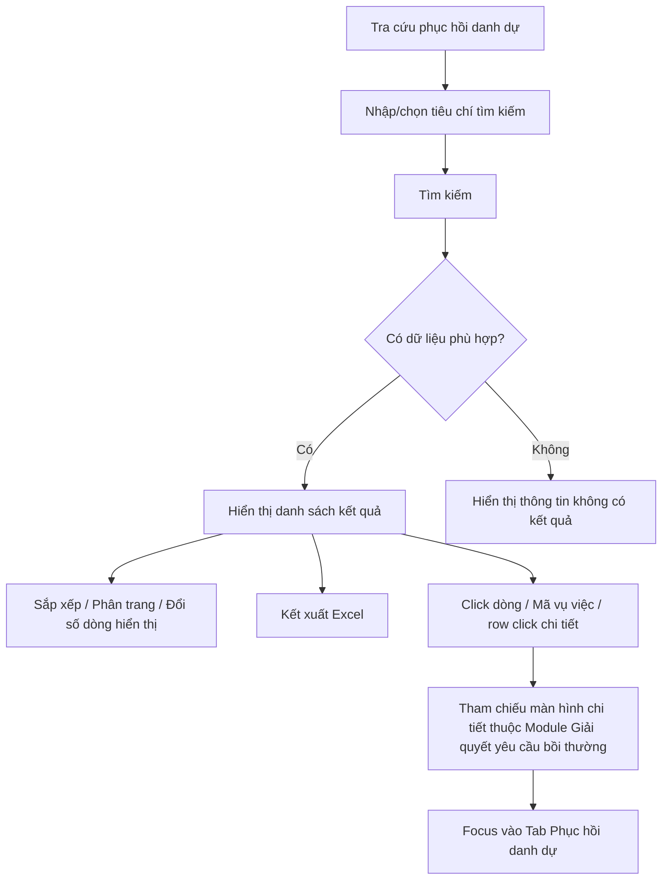

### 4.3.3. Dành cho Cán bộ Công tác bồi thường nhà nước

#### 4.3.3.5. UC434-437 - Tra cứu phục hồi danh dự

##### 4.3.3.5.1. Mục đích

\- Cho phép người dùng trên Website quản trị tra cứu danh sách tiến trình phục hồi danh dự được kế thừa tự động từ hồ sơ giải quyết yêu cầu bồi thường.

\- Cho phép lọc danh sách theo mã vụ việc, người bị thiệt hại, cơ quan giải quyết bồi thường, trạng thái giải quyết, hình thức phục hồi danh dự và khoảng ngày cập nhật.

\- Cho phép sắp xếp, phân trang, kết xuất Excel và mở hồ sơ giải quyết yêu cầu bồi thường liên quan trong cùng tab, đồng thời focus vào nội dung phục hồi danh dự.

*a. Phân quyền*

\- Người dùng có quyền tra cứu công tác bồi thường được truy cập màn hình Tra cứu phục hồi danh dự.

\- Màn hình chỉ phục vụ tra cứu/xem chi tiết liên kết, không hiển thị chức năng thêm mới, cập nhật hoặc phê duyệt trực tiếp trên danh sách.

*b. Điều kiện thực hiện*

\- Người dùng truy cập menu Tra cứu phục hồi danh dự trên Website quản trị.

\- Danh sách hồ sơ được lấy từ các hồ sơ giải quyết yêu cầu bồi thường có phát sinh yêu cầu/thông tin phục hồi danh dự.

\- Trạng thái giải quyết tham chiếu danh mục Trạng thái vụ việc yêu cầu bồi thường [DM_24].

\- Hình thức phục hồi danh dự tham chiếu danh mục Hình thức phục hồi danh dự [DM_31].

---

##### 4.3.3.5.2. Sơ đồ luồng nghiệp vụ theo giao diện

---

##### 4.3.3.5.3. MH01 - Màn hình Tra cứu phục hồi danh dự

###### 4.3.3.5.3.1. Màn hình

Nguồn UI: `UI_Mockups/Website_Quan_tri/UC434_to_UC437/phuc_hoi_danh_du.html`

###### 4.3.3.5.3.2. Mô tả thông tin trên màn hình

| Trường thông tin | Kiểu dữ liệu | Bắt buộc | Mặc định | Mô tả |
| :--- | :--- | :--- | :--- | :--- |
| Mã vụ việc | String(50) | Không | Trống | Nhập mã vụ việc giải quyết yêu cầu bồi thường để tìm kiếm gần đúng, tự động trim space trước khi lọc. |
| Người bị thiệt hại | String(255) | Không | Trống | Nhập họ tên người bị thiệt hại/người yêu cầu để tìm kiếm gần đúng, không phân biệt chữ hoa/chữ thường. |
| Cơ quan giải quyết bồi thường | Enum(String(255)) | Không | Tất cả cơ quan | Chọn cơ quan giải quyết bồi thường. Giá trị UI gồm: - Tất cả cơ quan - Tòa án nhân dân TP. Hà Nội - Công an Quận 1, TP. HCM - Viện kiểm sát nhân dân Tỉnh Long An - Cục Thi hành án dân sự tỉnh Bình Dương - Tòa án nhân dân Quận Đống Đa - Công an Huyện Gia Lâm - Viện kiểm sát nhân dân TP. Đà Nẵng - Tòa án nhân dân Tỉnh Quảng Ninh - Cục Cảnh sát hình sự (C02) - Tòa án nhân dân Tỉnh Đồng Nai |
| Trạng thái giải quyết | Enum(String(50)) | Không | Tất cả trạng thái | Tham chiếu danh mục Trạng thái vụ việc yêu cầu bồi thường [DM_24]. Giá trị UI gồm: - Tất cả trạng thái - Chờ nhập liệu - Chờ kiểm tra - Yêu cầu bổ sung - Bị từ chối - Chờ thụ lý - Từ chối thụ lý - Đang xác minh thiệt hại - Đang thương lượng - Thương lượng không thành công - Chờ ban hành QĐ - Hoãn giải quyết - Tạm đình chỉ giải quyết - Đình chỉ giải quyết - Chờ thực thi - Đang thực thi theo bản án - Hoàn thành |
| Hình thức phục hồi danh dự | Enum(String(50)) | Không | Tất cả hình thức | Tham chiếu danh mục Hình thức phục hồi danh dự [DM_31]. Giá trị UI gồm: - Tất cả hình thức - Trực tiếp xin lỗi - Đăng báo - Cả hai hình thức |
| Cập nhật từ ngày | Date | Không | Ngày đầu tháng hiện tại | Định dạng `dd/mm/yyyy`. Dùng để lọc các hồ sơ có ngày cập nhật lớn hơn hoặc bằng giá trị nhập. |
| Cập nhật đến ngày | Date | Không | Ngày hiện tại | Định dạng `dd/mm/yyyy`. Dùng để lọc các hồ sơ có ngày cập nhật nhỏ hơn hoặc bằng giá trị nhập. |
| Cột: STT | Integer(10) | Không | Theo trang hiện tại | Chỉ đọc. Hiển thị số thứ tự bản ghi trên trang hiện tại. |
| Cột: Mã vụ việc | String(50) | Không | Theo dữ liệu vụ việc | Chỉ đọc. Hiển thị dạng liên kết; tham chiếu/mở **Module Giải quyết yêu cầu bồi thường - 4.3.3.1.5. MH03 - Màn hình Xem chi tiết và xử lý hồ sơ yêu cầu bồi thường** trong cùng tab và focus vào Tab Phục hồi danh dự. Hỗ trợ sắp xếp. |
| Cột: Tên vụ việc | String(255) | Không | Theo dữ liệu vụ việc | Chỉ đọc. Hiển thị tên vụ việc. Hỗ trợ sắp xếp. |
| Cột: Người yêu cầu | String(255) | Không | Theo dữ liệu hồ sơ | Chỉ đọc. Hiển thị người bị thiệt hại/người yêu cầu trong hồ sơ. Hỗ trợ sắp xếp. |
| Cột: Tỉnh/TP | Enum(String(100)) | Không | Theo dữ liệu vụ việc | Chỉ đọc. Hiển thị tỉnh/thành phố của người yêu cầu hoặc địa bàn phát sinh vụ việc. |
| Cột: Địa chỉ chi tiết | Text(1000) | Không | Theo dữ liệu vụ việc | Chỉ đọc. Hiển thị địa chỉ chi tiết của người yêu cầu/vụ việc. |
| Cột: Cơ quan giải quyết bồi thường | String(255) | Không | Theo dữ liệu hồ sơ | Chỉ đọc. Hiển thị cơ quan giải quyết bồi thường của hồ sơ. |
| Cột: Hình thức phục hồi | Enum(String(50)) | Không | Theo dữ liệu hồ sơ | Chỉ đọc. Hiển thị hình thức phục hồi danh dự theo [DM_31]. |
| Cột: Ngày tiếp nhận | Date | Không | Theo dữ liệu hồ sơ | Chỉ đọc. Định dạng `dd/mm/yyyy`. Hỗ trợ sắp xếp. |
| Cột: Trạng thái | Enum(String(50)) | Không | Theo dữ liệu hồ sơ | Chỉ đọc. Hiển thị trạng thái giải quyết dưới dạng badge màu, tham chiếu [DM_24]. |
| Cột: Thời hạn thực hiện | String(100) | Không | Theo dữ liệu hồ sơ | Chỉ đọc. Hiển thị tình trạng thời hạn thực hiện phục hồi danh dự, ví dụ: còn hạn, sắp hết hạn, quá hạn, đã hoàn thành hoặc theo tiến trình kinh phí tùy dữ liệu hồ sơ. |
| Cột: Ngày cập nhật | Date | Không | Theo dữ liệu hồ sơ | Chỉ đọc. Định dạng `dd/mm/yyyy`. Hỗ trợ sắp xếp; mặc định danh sách sắp xếp giảm dần theo cột này. |
| Cột: Thao tác | String(50) | Không | Hiển thị | Chỉ đọc. Hiển thị row click chi tiết để mở hồ sơ liên kết. |
| Số dòng hiển thị | Enum(String(10)) | Không | 5 | Giá trị UI gồm: - 5 - 10 - 20 |
| Thông tin phân trang | String(255) | Không | Theo dữ liệu lọc | Chỉ đọc. Hiển thị khoảng bản ghi đang xem và tổng số bản ghi. |
| Nút phân trang | String(255) | Không | Theo số trang | Chỉ đọc. Hiển thị các nút về trang đầu, trang trước, số trang, trang sau và trang cuối. |

###### 4.3.3.5.3.3. Chức năng trên màn hình

| STT | Tên chức năng | Định dạng | Mô tả |
| :--- | :--- | :--- | :--- |
| 1 | Tìm kiếm | Button | TH1 (Khoảng ngày không hợp lệ): Nếu "Cập nhật từ ngày" lớn hơn "Cập nhật đến ngày", vi phạm quy tắc [BR-VAL-007]. Hệ thống hiển thị cảnh báo lỗi [MSG-ERR-VAL-007] và không thực hiện tìm kiếm. |
|  |  |  | TH2 (Không có dữ liệu phù hợp): Hệ thống hiển thị thông tin [MSG-INF-BTNN-PHDD-001] trong vùng lưới kết quả, đưa tổng số bản ghi về 0 và không hiển thị nút phân trang. |
|  |  |  | TH Hợp lệ: Hệ thống lọc danh sách hồ sơ phục hồi danh dự theo các tiêu chí đang nhập/chọn, cập nhật lưới kết quả, đưa trang hiện tại về trang 1 và hiển thị [MSG-SUC-BTNN-PHDD-001]. |
| 2 | Xóa bộ lọc | Button | Hệ thống xóa các tiêu chí `Mã vụ việc`, `Người bị thiệt hại`, `Cơ quan giải quyết bồi thường`, `Trạng thái giải quyết`, `Hình thức phục hồi danh dự`; đặt lại `Cập nhật từ ngày` là ngày đầu tháng hiện tại, `Cập nhật đến ngày` là ngày hiện tại; tải lại danh sách theo bộ lọc mặc định và hiển thị [MSG-SUC-BTNN-PHDD-002]. |
| 3 | Kết xuất Excel | Button | TH1 (Danh sách rỗng): Vi phạm quy tắc [BR-EXP-040]. Hệ thống hiển thị cảnh báo [MSG-WRN-SYS-001] và không tải file. |
|  |  |  | TH Hợp lệ: Hệ thống kết xuất danh sách kết quả tra cứu hiện hành ra tệp Excel theo đúng tiêu chí lọc/sắp xếp hiện tại, áp dụng [BR-EXP-040] và hiển thị [MSG-SUC-BTNN-PHDD-003]. |
| 4 | Sắp xếp cột | Header cột | TH1 (Chọn lại cột đang sắp xếp): Hệ thống đảo chiều sắp xếp tăng dần/giảm dần của cột được chọn và cập nhật icon sắp xếp trên tiêu đề cột. |
|  |  |  | TH2 (Chọn cột khác): Hệ thống đặt cột được chọn làm cột sắp xếp hiện hành, mặc định chiều sắp xếp tăng dần và cập nhật danh sách. Các cột hỗ trợ sắp xếp gồm `Mã vụ việc`, `Tên vụ việc`, `Người yêu cầu`, `Ngày tiếp nhận`, `Ngày cập nhật`. |
| 5 | Số dòng hiển thị | Select | Hệ thống cập nhật số bản ghi hiển thị trên mỗi trang theo giá trị người dùng chọn, đưa trang hiện tại về trang 1 và tải lại lưới dữ liệu. |
| 6 | Chuyển trang | Pagination | Hệ thống chuyển đến trang đầu, trang trước, trang được chọn, trang sau hoặc trang cuối theo thao tác người dùng; dữ liệu hiển thị giữ nguyên tiêu chí lọc/sắp xếp hiện hành. |
| 7 | Click dòng dữ liệu | Row click | Hệ thống tham chiếu/mở **Module Giải quyết yêu cầu bồi thường - 4.3.3.1.5. MH03 - Màn hình Xem chi tiết và xử lý hồ sơ yêu cầu bồi thường** tương ứng trong cùng tab và focus vào Tab Phục hồi danh dự. |
| 8 | Mã vụ việc | Link | Hệ thống tham chiếu/mở **Module Giải quyết yêu cầu bồi thường - 4.3.3.1.5. MH03 - Màn hình Xem chi tiết và xử lý hồ sơ yêu cầu bồi thường** tương ứng trong cùng tab và focus vào Tab Phục hồi danh dự. |
| 9 | Xem chi tiết | Row Click | Hệ thống tham chiếu/mở **Module Giải quyết yêu cầu bồi thường - 4.3.3.1.5. MH03 - Màn hình Xem chi tiết và xử lý hồ sơ yêu cầu bồi thường** tương ứng trong cùng tab và focus vào Tab Phục hồi danh dự. |
