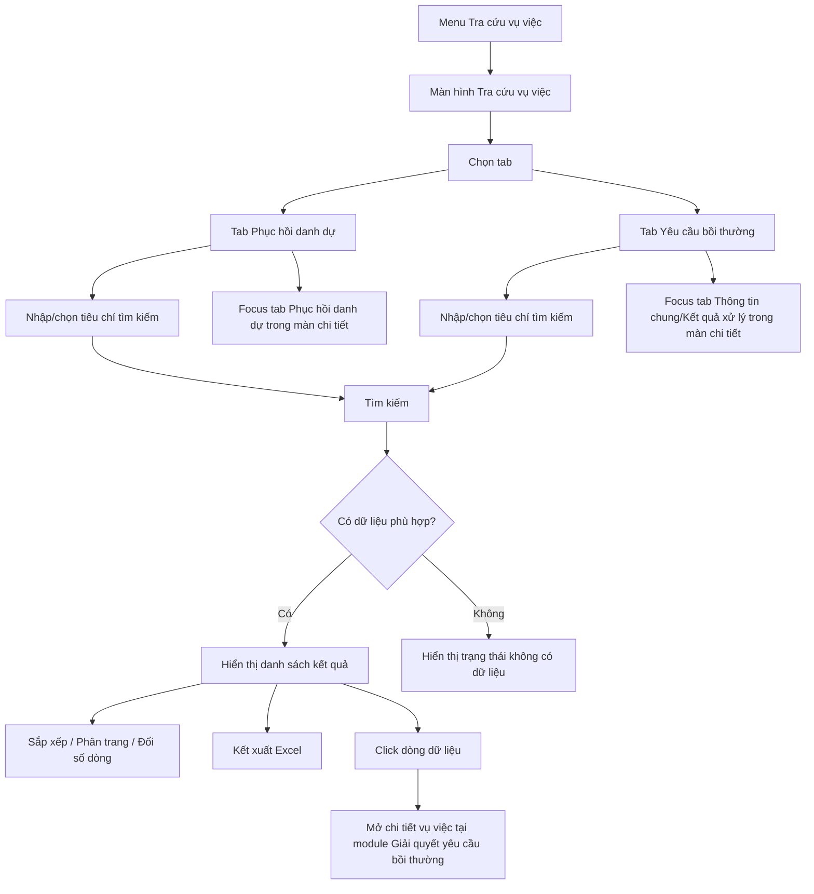

### 4.3.3. Dành cho Cán bộ Công tác bồi thường nhà nước

#### 4.3.3.5. UC - Tra cứu vụ việc

##### 4.3.3.5.1. Mục đích

\- Cho phép người dùng trên Website quản trị tra cứu tập trung các vụ việc bồi thường nhà nước đã phát sinh trên hệ thống.

\- Màn hình được chia thành 02 tab:

| Tab | Phạm vi dữ liệu | Mục đích |
| :--- | :--- | :--- |
| `Phục hồi danh dự` | Hiển thị các vụ việc có yêu cầu/thông tin phục hồi danh dự. | Tra cứu tiến trình phục hồi danh dự và mở chi tiết vụ việc tại đúng tab phục hồi danh dự. |
| `Yêu cầu bồi thường` | Hiển thị các vụ việc yêu cầu bồi thường không có yêu cầu phục hồi danh dự. | Tra cứu vụ việc yêu cầu bồi thường theo đầy đủ vòng đời trạng thái, bao gồm cả vụ việc đang xử lý, tạm dừng và đã kết thúc. |

\- Màn hình chỉ phục vụ tra cứu, xem chi tiết liên kết và kết xuất danh sách; không cho phép thêm mới, cập nhật, phê duyệt hoặc thực hiện thao tác xử lý nghiệp vụ trực tiếp trên lưới.

*a. Phân quyền*

\- Người dùng có quyền tra cứu công tác bồi thường nhà nước được truy cập menu `Tra cứu vụ việc`.

\- Người dùng chỉ xem được các vụ việc thuộc phạm vi cơ quan/đơn vị hoặc phạm vi dữ liệu được phân quyền.

\- Chuyên viên, Lãnh đạo và người dùng quản trị nghiệp vụ có thể cùng sử dụng màn hình tra cứu; phạm vi dữ liệu hiển thị phụ thuộc cấu hình phân quyền, không phụ thuộc trạng thái xử lý hiện tại của vụ việc.

*b. Điều kiện thực hiện*

\- Người dùng đã đăng nhập Website quản trị và được phân quyền truy cập chức năng `Tra cứu vụ việc`.

\- Dữ liệu vụ việc được kế thừa từ các module `Tiếp nhận YCBT`, `Giải quyết yêu cầu bồi thường`, `Quyết định giải quyết bồi thường`, `Cấp kinh phí tạm ứng/Bồi thường` và thông tin phục hồi danh dự phát sinh trong quá trình giải quyết.

\- Trạng thái vụ việc yêu cầu bồi thường Tham chiếu Danh mục Trạng thái vụ việc yêu cầu bồi thường [DM_24].

\- Hình thức phục hồi danh dự Tham chiếu Danh mục Hình thức phục hồi danh dự [DM_31].

---

##### 4.3.3.5.2. Sơ đồ luồng nghiệp vụ theo giao diện

---

##### 4.3.3.5.3. MH01 - Màn hình Tra cứu vụ việc

###### 4.3.3.5.3.1. Màn hình

Ảnh theo tab:

\- Tab `Phục hồi danh dự`: 

\- Tab `Yêu cầu bồi thường`: 

###### 4.3.3.5.3.2. Mô tả cấu trúc chung trên màn hình

| Trường thông tin | Kiểu dữ liệu | Bắt buộc | Mặc định | Mô tả |
| :--- | :--- | :--- | :--- | :--- |
| Tiêu đề màn hình | String(255) | - | `TRA CỨU VỤ VIỆC BỒI THƯỜNG NHÀ NƯỚC` | Chỉ đọc. Hiển thị tiêu đề màn hình. |
| Mô tả ngắn | String(500) | - | Theo cấu hình UI | Chỉ đọc. Mô tả ngắn mục đích tra cứu vụ việc bồi thường nhà nước. |
| Tab tra cứu | Enum(String(100)) | Có | `Phục hồi danh dự` | Gồm 02 tab: `Phục hồi danh dự` và `Yêu cầu bồi thường`. Mỗi tab có phạm vi dữ liệu, khối lọc và bảng kết quả riêng, mô tả tại **4.3.3.5.3.3** và **4.3.3.5.3.4**. |
| Vùng nội dung tab | Container | - | Theo tab đang chọn | Hiển thị khối lọc, tìm kiếm thông tin và bảng kết quả tìm kiếm của tab hiện hành. Không mô tả chi tiết dữ liệu tại mục chung này để tránh trùng lặp với từng tab. |

###### 4.3.3.5.3.3. Tab Phục hồi danh dự

*Phạm vi dữ liệu*

\- Chỉ hiển thị các vụ việc có yêu cầu phục hồi danh dự hoặc đã phát sinh thông tin phục hồi danh dự trong quá trình giải quyết.

\- Vụ việc có đồng thời yêu cầu bồi thường bằng tiền và phục hồi danh dự được hiển thị tại tab `Phục hồi danh dự`, không hiển thị tại tab `Yêu cầu bồi thường` để tránh trùng danh sách.

| Trường thông tin | Kiểu dữ liệu | Bắt buộc | Mặc định | Mô tả |
| :--- | :--- | :--- | :--- | :--- |
| **I. Khối Lọc, tìm kiếm thông tin** | - | - | - | Control UI: Filter panel. - Khối lọc hiển thị phía trên bảng kết quả của tab `Phục hồi danh dự`. - Các tiêu chí có dữ liệu được kết hợp theo điều kiện AND. |
| Mã vụ việc | String(50) | Không | Trống | Control UI: Input text. - Tìm gần đúng theo mã vụ việc, tự động trim space trước khi lọc. |
| Tên vụ việc | String(255) | Không | Trống | Control UI: Input text. - Tìm gần đúng theo tên vụ việc, không phân biệt hoa thường. |
| Người bị thiệt hại/người yêu cầu | String(255) | Không | Trống | Control UI: Input text. - Tìm gần đúng theo họ tên người bị thiệt hại hoặc người yêu cầu bồi thường. |
| Cơ quan giải quyết bồi thường | Enum(String(255)) | Không | `Tất cả` | Control UI: Combobox. - Chọn cơ quan giải quyết bồi thường thuộc phạm vi phân quyền. |
| Trạng thái giải quyết | Enum(String(50)) | Không | `Tất cả` | Control UI: Combobox. - Tham chiếu Danh mục Trạng thái vụ việc yêu cầu bồi thường [DM_24]. - Cho phép lọc mọi trạng thái vụ việc để xem cả vụ việc đang xử lý, tạm dừng, kết thúc và hoàn thành. |
| Nhóm trạng thái | Enum(String(50)) | Không | `Tất cả` | Control UI: Combobox. - Lọc nhanh theo nhóm: `Đang xử lý`, `Tạm dừng`, `Kết thúc`. - Khi chọn nhóm, hệ thống tự động áp dụng tập trạng thái tương ứng. |
| Hình thức phục hồi danh dự | Enum(String(50)) | Không | `Tất cả` | Control UI: Combobox. - Tham chiếu Danh mục Hình thức phục hồi danh dự [DM_31]. |
| Cập nhật từ ngày | Date | Không | Ngày đầu tháng hiện tại | Control UI: Datepicker. - Định dạng `dd/mm/yyyy`. - Áp dụng quy tắc kiểm tra khoảng ngày [BR-VAL-007]. |
| Cập nhật đến ngày | Date | Không | Ngày hiện tại | Control UI: Datepicker. - Định dạng `dd/mm/yyyy`. - Áp dụng quy tắc kiểm tra khoảng ngày [BR-VAL-007]. |
| **II. Bảng kết quả tìm kiếm** | - | - | 20 bản ghi/trang | Control UI: Data grid. - Khi người dùng truy cập màn hình, hệ thống tự động tải trang đầu tiên (Trang 1) với số lượng mặc định 20 bản ghi. - Sắp xếp mặc định: Sắp xếp theo "Ngày tạo" giảm dần (mới nhất hiển thị lên đầu). - Bảng kết quả hiển thị danh sách vụ việc thuộc phạm vi dữ liệu của tab `Phục hồi danh dự`. - Trạng thái có dữ liệu: Hiển thị danh sách các bản ghi kết quả theo cấu trúc các cột quy định. - Trạng thái không có dữ liệu (Empty State): Khi không tìm thấy kết quả phù hợp với điều kiện tìm kiếm, bảng hiển thị duy nhất 01 dòng căn giữa trên toàn bộ chiều rộng bảng (`colspan`), in nghiêng với nội dung theo MessageList dùng chung [MSG-INF-SYS-001]. |
| STT | Integer(10) | - | Tự tăng | Số thứ tự dòng dữ liệu trên trang hiện tại. |
| Mã vụ việc | String(50) | - | Theo dữ liệu | Chỉ đọc. Hiển thị mã vụ việc. Người dùng click dòng dữ liệu để mở chi tiết. |
| Tên vụ việc | String(255) | - | Theo dữ liệu | Chỉ đọc. Hiển thị tên vụ việc. |
| Người yêu cầu | String(255) | - | Theo dữ liệu | Chỉ đọc. Hiển thị người bị thiệt hại/người yêu cầu bồi thường. |
| Tỉnh/Thành phố | Enum(String(100)) / String(100) | - | Theo dữ liệu | Control UI: Combobox có tìm kiếm / Input text. - Nếu `Quốc gia` = `Việt Nam`: Tham chiếu Danh mục Tỉnh/Thành phố [DM_13]. Cho phép gõ tìm kiếm theo Mã hoặc Tên. - Nếu `Quốc gia` khác `Việt Nam`: Hiển thị ô nhập văn bản để người dùng tự do nhập. |
| Phường/Xã | Enum(String(100)) / String(100) | - | Theo dữ liệu | Control UI: Combobox có tìm kiếm / Input text. - Phụ thuộc vào `Tỉnh/Thành phố` đã chọn. - Nếu `Quốc gia` = `Việt Nam`: Tham chiếu Danh mục Xã/Phường/Thị trấn [DM_15] (lọc động theo Tỉnh/Thành phố đã chọn). Cho phép gõ tìm kiếm theo Mã hoặc Tên. Nếu chưa chọn Tỉnh/Thành phố thì khóa mờ (Disabled) kèm placeholder *"Vui lòng chọn Tỉnh/Thành phố trước"*. - Nếu `Quốc gia` khác `Việt Nam`: Hiển thị ô nhập văn bản (Input text) để người dùng tự do nhập. |
| Địa chỉ chi tiết | Text(1000) / String(500) | - | Theo dữ liệu | Control UI: Textarea / Input text. - Nhập/hiển thị số nhà, tên đường/phố, thôn/xóm/ấp... |
| Cơ quan giải quyết bồi thường | String(255) | - | Theo dữ liệu | Chỉ đọc. Hiển thị cơ quan giải quyết bồi thường. |
| Cán bộ xử lý | String(255) | - | Theo dữ liệu | Chỉ đọc. Hiển thị cán bộ đang xử lý hoặc cán bộ phụ trách phục hồi danh dự, nếu đã được phân công. |
| Hình thức phục hồi | Enum(String(50)) | - | Theo dữ liệu | Chỉ đọc. Hiển thị hình thức phục hồi danh dự theo Danh mục Hình thức phục hồi danh dự [DM_31]. |
| Trạng thái | Enum(String(50)) | - | Theo dữ liệu | Chỉ đọc. Hiển thị trạng thái vụ việc theo Danh mục Trạng thái vụ việc yêu cầu bồi thường [DM_24] dưới dạng badge. |
| Thời hạn thực hiện | String(100) | - | Theo dữ liệu | Chỉ đọc. Hiển thị tình trạng thời hạn phục hồi danh dự: còn hạn, sắp hết hạn, quá hạn, đã hoàn thành hoặc theo tiến trình kinh phí tùy dữ liệu vụ việc. |
| Ngày cập nhật | Date | - | Theo dữ liệu | Định dạng `dd/mm/yyyy`. Hỗ trợ sắp xếp; mặc định sắp xếp giảm dần. |

###### 4.3.3.5.3.4. Tab Yêu cầu bồi thường

*Phạm vi dữ liệu*

\- Chỉ hiển thị các vụ việc yêu cầu bồi thường không có yêu cầu phục hồi danh dự.

\- Danh sách bao gồm đầy đủ các trạng thái vòng đời của vụ việc để người dùng tra cứu các vụ việc đang xử lý, bị từ chối, đình chỉ hoặc đã hoàn thành.

| Trường thông tin | Kiểu dữ liệu | Bắt buộc | Mặc định | Mô tả |
| :--- | :--- | :--- | :--- | :--- |
| **I. Khối Lọc, tìm kiếm thông tin** | - | - | - | Control UI: Filter panel. - Khối lọc hiển thị phía trên bảng kết quả của tab `Yêu cầu bồi thường`. - Các tiêu chí có dữ liệu được kết hợp theo điều kiện AND. |
| Mã vụ việc | String(50) | Không | Trống | Control UI: Input text. - Tìm gần đúng theo mã vụ việc, tự động trim space trước khi lọc. |
| Tên vụ việc | String(255) | Không | Trống | Control UI: Input text. - Tìm gần đúng theo tên vụ việc, không phân biệt hoa thường. |
| Tên người yêu cầu | String(100) | Không | Trống | Control UI: Input text. - Tìm gần đúng theo họ tên người yêu cầu bồi thường. |
| Cơ quan giải quyết | String(255) | Không | Trống | Control UI: Input text/Combobox theo UI. - Tìm gần đúng theo tên cơ quan giải quyết bồi thường. |
| Lĩnh vực phát sinh thiệt hại | Enum(String(100)) | Không | `Tất cả` | Control UI: Combobox. - Tham chiếu Danh mục Lĩnh vực phát sinh thiệt hại [DM_22]. |
| Hình thức tiếp nhận hồ sơ | Enum(String(50)) | Không | `Tất cả` | Control UI: Combobox. - Tham chiếu Danh mục Hình thức tiếp nhận hồ sơ bồi thường [DM_25]. |
| Trạng thái giải quyết | Enum(String(50)) | Không | `Tất cả` | Control UI: Combobox. - Tham chiếu Danh mục Trạng thái vụ việc yêu cầu bồi thường [DM_24]. - Cho phép chọn từng trạng thái vụ việc. |
| Nhóm trạng thái | Enum(String(50)) | Không | `Tất cả` | Control UI: Combobox. - Lọc nhanh theo nhóm: `Đang xử lý`, `Tạm dừng`, `Kết thúc`. |
| Tiếp nhận từ ngày | Date | Không | Trống | Control UI: Datepicker. - Định dạng `dd/mm/yyyy`. - Lọc theo thời điểm tiếp nhận. - Áp dụng [BR-VAL-007]. |
| Tiếp nhận đến ngày | Date | Không | Trống | Control UI: Datepicker. - Định dạng `dd/mm/yyyy`. - Lọc theo thời điểm tiếp nhận. - Áp dụng [BR-VAL-007]. |
| Hạn xử lý từ ngày | Date | Không | Trống | Control UI: Datepicker. - Định dạng `dd/mm/yyyy`. - Lọc theo hạn xử lý. - Áp dụng [BR-VAL-007]. |
| Hạn xử lý đến ngày | Date | Không | Trống | Control UI: Datepicker. - Định dạng `dd/mm/yyyy`. - Lọc theo hạn xử lý. - Áp dụng [BR-VAL-007]. |
| **II. Bảng kết quả tìm kiếm** | - | - | 20 bản ghi/trang | Control UI: Data grid. - Khi người dùng truy cập màn hình, hệ thống tự động tải trang đầu tiên (Trang 1) với số lượng mặc định 20 bản ghi. - Sắp xếp mặc định: Sắp xếp theo "Ngày tạo" giảm dần (mới nhất hiển thị lên đầu). - Bảng kết quả hiển thị danh sách vụ việc thuộc phạm vi dữ liệu của tab `Yêu cầu bồi thường`. - Trạng thái có dữ liệu: Hiển thị danh sách các bản ghi kết quả theo cấu trúc các cột quy định. - Trạng thái không có dữ liệu (Empty State): Khi không tìm thấy kết quả phù hợp với điều kiện tìm kiếm, bảng hiển thị duy nhất 01 dòng căn giữa trên toàn bộ chiều rộng bảng (`colspan`), in nghiêng với nội dung theo MessageList dùng chung [MSG-INF-SYS-001]. |
| STT | Integer(10) | - | Tự tăng | Số thứ tự dòng dữ liệu trên trang hiện tại. |
| Mã vụ việc | String(50) | - | Theo dữ liệu | Chỉ đọc. Hiển thị mã vụ việc. Người dùng click dòng dữ liệu để mở chi tiết. |
| Tên vụ việc | String(255) | - | Theo dữ liệu | Chỉ đọc. Hiển thị tên vụ việc đã ghi nhận ở bước tiếp nhận/nhập hồ sơ. |
| Tên người yêu cầu | String(100) | - | Theo dữ liệu | Chỉ đọc. Hiển thị tên người yêu cầu bồi thường. |
| Tỉnh/Thành phố | Enum(String(100)) / String(100) | - | Theo dữ liệu | Control UI: Combobox có tìm kiếm / Input text. - Nếu `Quốc gia` = `Việt Nam`: Tham chiếu Danh mục Tỉnh/Thành phố [DM_13]. Cho phép gõ tìm kiếm theo Mã hoặc Tên. - Nếu `Quốc gia` khác `Việt Nam`: Hiển thị ô nhập văn bản để người dùng tự do nhập. |
| Phường/Xã | Enum(String(100)) / String(100) | - | Theo dữ liệu | Control UI: Combobox có tìm kiếm / Input text. - Phụ thuộc vào `Tỉnh/Thành phố` đã chọn. - Nếu `Quốc gia` = `Việt Nam`: Tham chiếu Danh mục Xã/Phường/Thị trấn [DM_15] (lọc động theo Tỉnh/Thành phố đã chọn). Cho phép gõ tìm kiếm theo Mã hoặc Tên. Nếu chưa chọn Tỉnh/Thành phố thì khóa mờ (Disabled) kèm placeholder *"Vui lòng chọn Tỉnh/Thành phố trước"*. - Nếu `Quốc gia` khác `Việt Nam`: Hiển thị ô nhập văn bản (Input text) để người dùng tự do nhập. |
| Địa chỉ chi tiết | Text(1000) / String(500) | - | Theo dữ liệu | Control UI: Textarea / Input text. - Nhập/hiển thị số nhà, tên đường/phố, thôn/xóm/ấp... |
| Lĩnh vực phát sinh thiệt hại | Enum(String(100)) | - | Theo dữ liệu | Chỉ đọc. Hiển thị lĩnh vực phát sinh thiệt hại theo Danh mục Lĩnh vực phát sinh thiệt hại [DM_22]. |
| Cơ quan giải quyết | String(255) | - | Theo dữ liệu | Chỉ đọc. Hiển thị cơ quan giải quyết bồi thường. |
| Cán bộ xử lý | String(255) | - | Theo dữ liệu | Chỉ đọc. Hiển thị cán bộ xử lý được phân công, nếu đã có. |
| Ngày tiếp nhận | DateTime | - | Theo dữ liệu | Định dạng `dd/mm/yyyy HH:mm`. Hỗ trợ sắp xếp. |
| Hạn xử lý | Date | - | Theo dữ liệu | Hiển thị hạn xử lý và cảnh báo SLA theo dữ liệu hệ thống. |
| Hình thức tiếp nhận | Enum(String(50)) | - | Theo dữ liệu | Chỉ đọc. Hiển thị hình thức tiếp nhận theo Danh mục Hình thức tiếp nhận hồ sơ bồi thường [DM_25]. |
| Trạng thái | Enum(String(50)) | - | Theo dữ liệu | Chỉ đọc. Hiển thị trạng thái vụ việc theo Danh mục Trạng thái vụ việc yêu cầu bồi thường [DM_24] dưới dạng badge. |
| Ngày cập nhật | Date | - | Theo dữ liệu | Định dạng `dd/mm/yyyy`. Hỗ trợ sắp xếp; mặc định sắp xếp giảm dần. |

###### 4.3.3.5.3.5. Chức năng trên màn hình

| STT | Tên chức năng | Định dạng | Mô tả |
| :--- | :--- | :--- | :--- |
| 1 | Chuyển tab | Tab | Hệ thống tải danh sách vụ việc theo tab được chọn, đặt lại trang hiện tại về trang 1. Dữ liệu tab `Phục hồi danh dự` và tab `Yêu cầu bồi thường` là 02 tập dữ liệu loại trừ nhau theo phạm vi dữ liệu đã mô tả. |
| 2 | Tìm kiếm | Button | Khi người dùng click nút, hệ thống kiểm tra điều kiện dữ liệu và thực hiện tìm kiếm theo các trường hợp bên dưới: |
|  |  |  | **TH1 - Khoảng ngày không hợp lệ**: Nếu `Từ ngày` lớn hơn `Đến ngày`, vi phạm [BR-VAL-007], hệ thống hiển thị cảnh báo lỗi [MSG-ERR-VAL-007] và không thực hiện tìm kiếm. |
|  |  |  | **TH Hợp lệ (Có dữ liệu phù hợp)**: Hệ thống lọc và hiển thị danh sách các bản ghi thỏa mãn đồng thời các tiêu chí tìm kiếm/lọc đã nhập/chọn, hiển thị kết quả lên bảng và đưa về Trang 1. |
|  |  |  | **TH Không có dữ liệu trả về**: Bảng kết quả hiển thị duy nhất 01 dòng căn giữa trên toàn bộ chiều rộng bảng (`colspan`), in nghiêng với nội dung theo MessageList dùng chung [MSG-INF-SYS-001]; thanh phân trang hiển thị *"Hiển thị 0-0 của 0 bản ghi"*, các nút điều hướng trang ở trạng thái ẩn hoặc khóa mờ (Disabled); nút "Kết xuất Excel" (nếu có) ở trạng thái khóa mờ kèm tooltip *"Không có dữ liệu để kết xuất Excel"*. |
| 3 | Xóa bộ lọc | Button | Hệ thống xóa các tiêu chí đã nhập, đưa các combobox về `Tất cả`, đưa danh sách về trang 1 và tải lại dữ liệu mặc định của tab hiện hành. |
| 4 | Kết xuất Excel | Button | Hệ thống kết xuất danh sách kết quả hiện hành của tab đang chọn theo đúng tiêu chí lọc và sắp xếp hiện tại. Nếu danh sách rỗng, áp dụng [BR-EXP-040] và không tải file. |
| 5 | Sắp xếp cột | Header cột | Người dùng click tiêu đề cột có hỗ trợ sắp xếp để đảo chiều tăng/giảm hoặc chọn cột sắp xếp mới. |
| 6 | Đổi số dòng hiển thị | Dropdown | Hệ thống cập nhật số bản ghi trên mỗi trang theo giá trị người dùng chọn và đưa về trang 1. |
| 7 | Chuyển trang | Pagination | Hệ thống chuyển đến trang đầu (&#124;&lt;&lt;), trang trước (&lt;), trang được chọn, trang sau (&gt;) hoặc trang cuối (&gt;&gt;&#124;) theo thao tác người dùng; dữ liệu hiển thị giữ nguyên tiêu chí lọc/sắp xếp hiện hành và cấu hình mặc định 20 bản ghi/trang. |
| 8 | Click dòng dữ liệu | Row click | Hệ thống mở màn hình **MH05 - Xem chi tiết hồ sơ yêu cầu bồi thường** (thuộc tài liệu `SRS_BTNN_GiaiQuyetBT_GiaiQuyet_YCBT.md`) ở chế độ xem chi tiết. Với tab `Phục hồi danh dự`, hệ thống focus vào tab/khối `Phục hồi danh dự`. Với tab `Chi tiết xử lý hồ sơ`, hệ thống focus vào `Thông tin Hồ sơ yêu cầu` hoặc tab/khối xử lý hiện hành theo trạng thái vụ việc. |

###### 4.3.3.5.3.6. Quy tắc lọc theo nhóm trạng thái

| Nhóm trạng thái | Trạng thái bao gồm | Ghi chú |
| :--- | :--- | :--- |
| `Tất cả` | Toàn bộ trạng thái trong [DM_24] | Mặc định không giới hạn trạng thái. |
| `Đang xử lý` | `Chờ nhập liệu`, `Yêu cầu bổ sung`, `Chờ kiểm tra`, `Chờ thụ lý`, `Đang xác minh thiệt hại`, `Đang thương lượng`, `Thương lượng không thành công`, `Chờ ban hành QĐ`, `Chờ thực thi`, `Đang thực thi theo bản án` | Dùng để theo dõi các vụ việc còn đang có bước xử lý tiếp theo. |
| `Tạm dừng` | `Hoãn giải quyết`, `Tạm đình chỉ giải quyết` | Dùng để theo dõi các vụ việc chưa kết thúc nhưng đang tạm dừng giải quyết. |
| `Kết thúc` | `Bị từ chối`, `Từ chối thụ lý`, `Đình chỉ giải quyết`, `Hoàn thành` | Dùng để xem các vụ việc đã kết thúc vòng đời xử lý, bao gồm các vụ việc đã hoàn thành. |

###### 4.3.3.5.3.7. Quy tắc hiển thị và thao tác

| Nội dung | Quy tắc |
| :--- | :--- |
| Phân tách dữ liệu giữa 02 tab | Một vụ việc chỉ hiển thị tại một tab. Nếu có yêu cầu/thông tin phục hồi danh dự thì hiển thị tại `Phục hồi danh dự`; nếu không có phục hồi danh dự thì hiển thị tại `Yêu cầu bồi thường`. |
| Vụ việc đã hoàn thành | Hiển thị tại module `Tra cứu vụ việc`, lọc theo trạng thái `Hoàn thành` hoặc nhóm trạng thái `Kết thúc`. |
| Thao tác trên lưới | Không hiển thị các nút xử lý nghiệp vụ như `Nhập hồ sơ`, `Tiếp nhận`, `Yêu cầu bổ sung`, `Từ chối`, `Thụ lý`, `Hoãn giải quyết`. |
| Xem chi tiết | Thực hiện bằng row click. Không cần bố trí row click xem chi tiết riêng trên từng dòng nếu UI thống nhất sử dụng row click. |
| Dữ liệu ngoài phạm vi phân quyền | Không hiển thị trên danh sách và không cho mở chi tiết bằng URL trực tiếp. |
