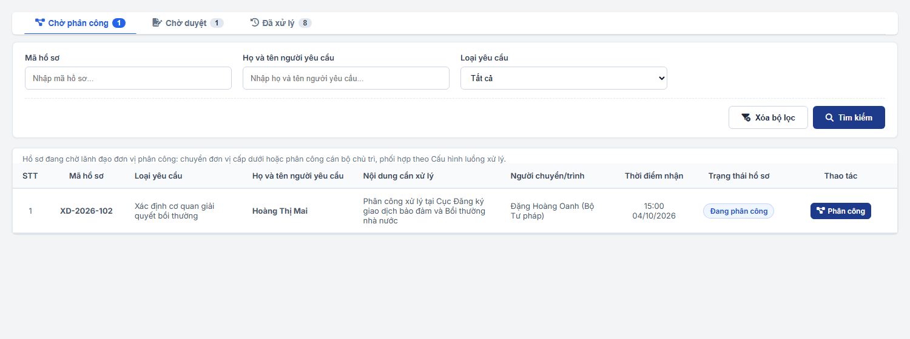
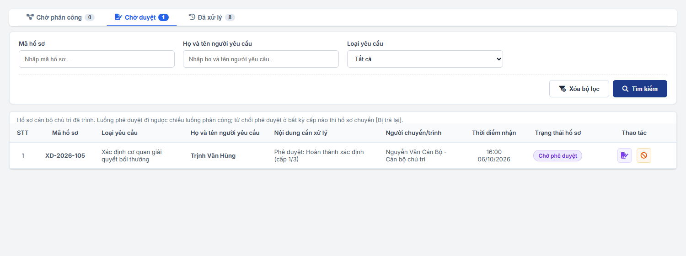
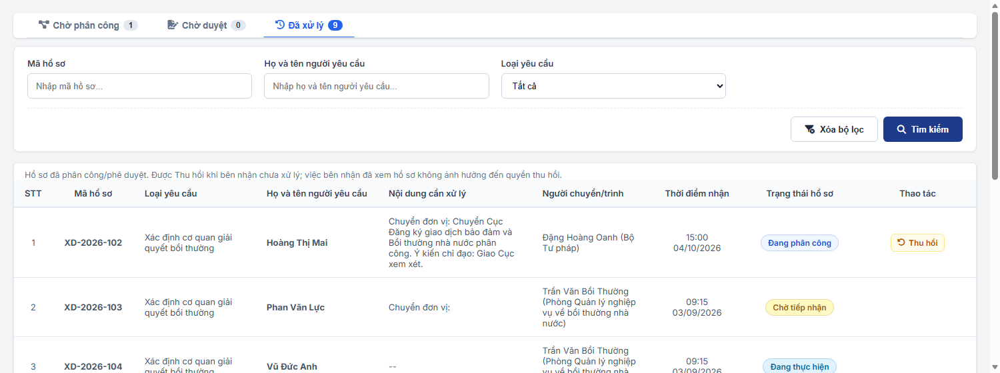
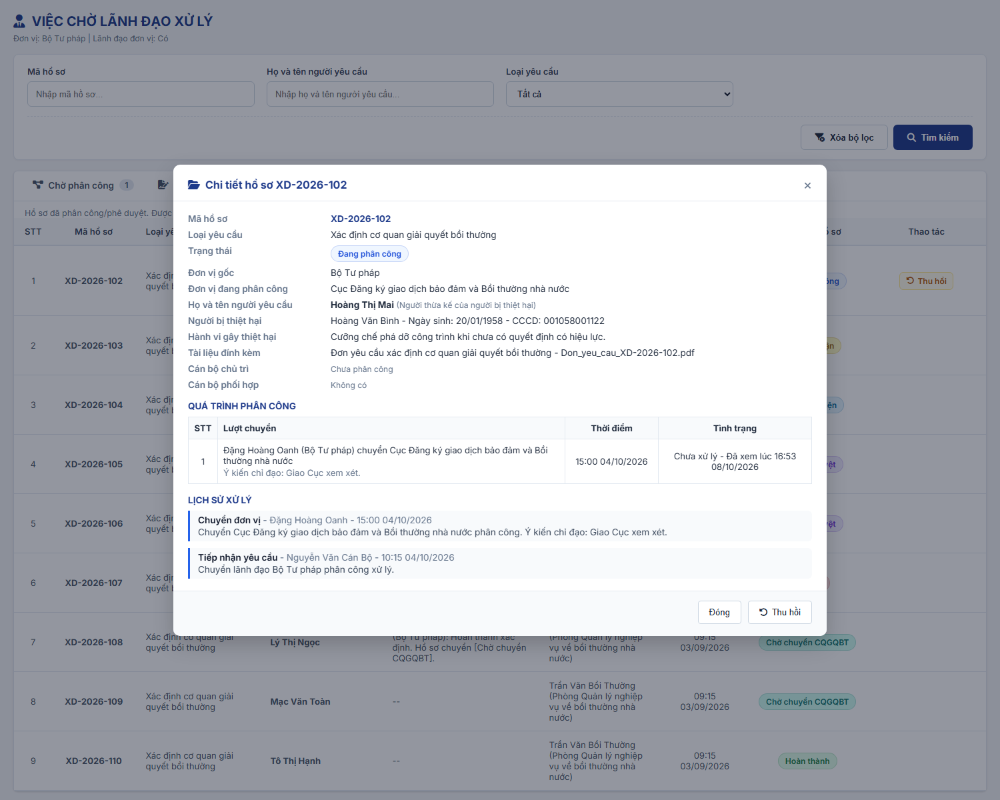
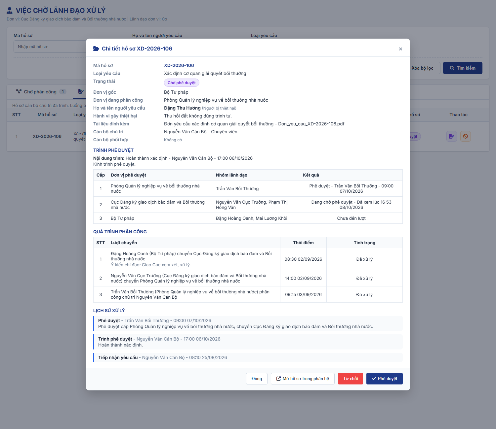
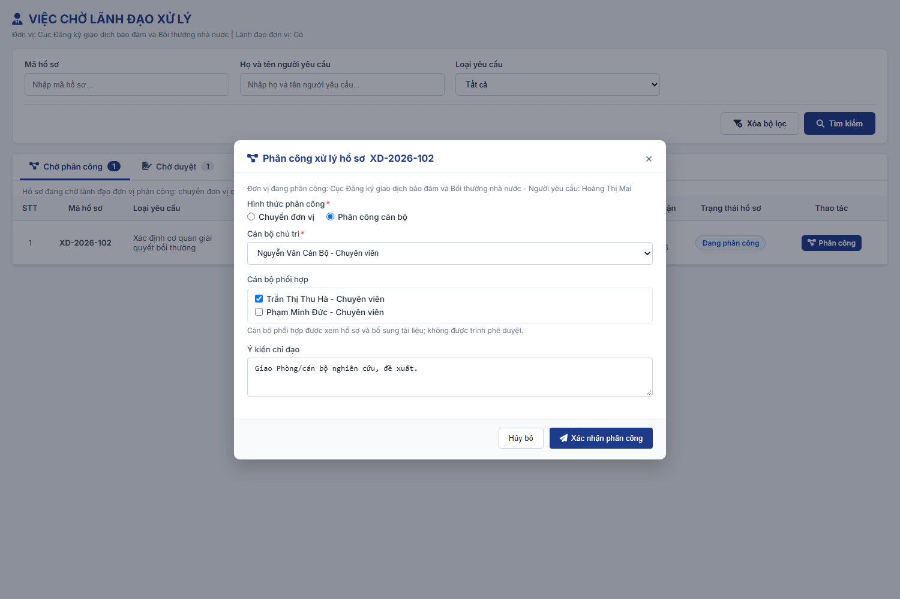
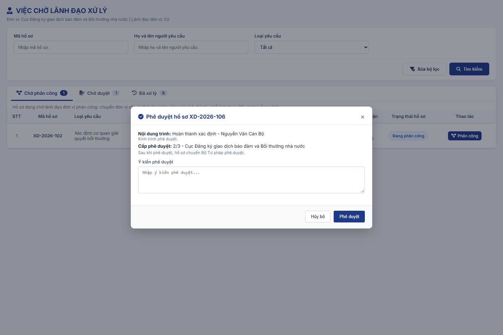
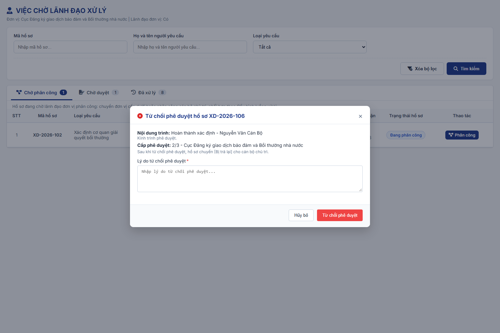
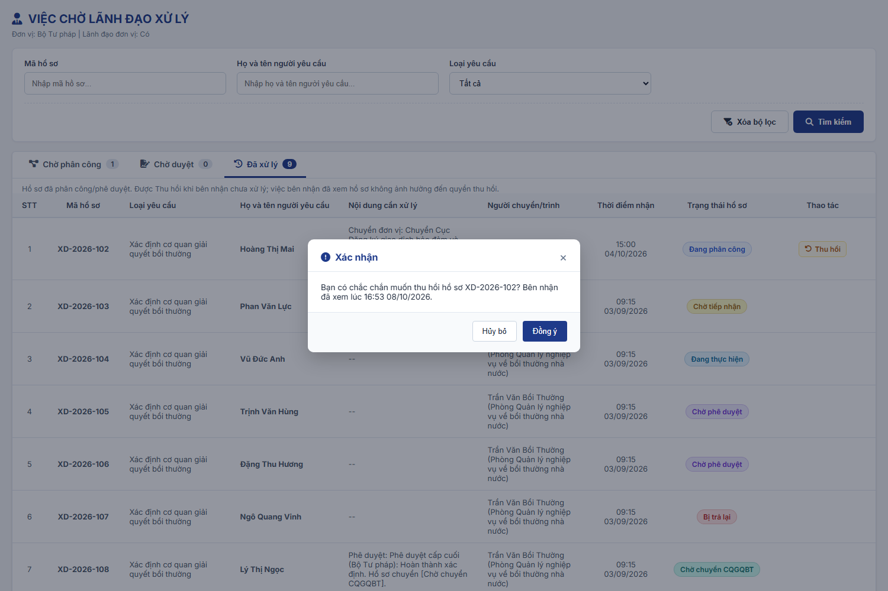

### 4.3.3.29. Hồ sơ trình Lãnh đạo

#### 4.3.3.29.1. Mục đích

\- Cung cấp cho Lãnh đạo các đơn vị một màn hình tập trung các hồ sơ thuộc phân hệ Bồi thường nhà nước (BTNN) đang chờ lãnh đạo xử lý, gồm hồ sơ Loại yêu cầu "Xác định cơ quan giải quyết bồi thường" và "Yêu cầu bồi thường".

\- Gồm 06 chức năng:

\+ Tra cứu danh sách hồ sơ trình Lãnh đạo theo tab: Chờ phân công, Chờ duyệt, Đã xử lý.

\+ Xem chi tiết hồ sơ, quá trình phân công, trình phê duyệt (kèm Văn bản dự thảo, nếu lần trình có) và lịch sử xử lý.

\+ Phân công xử lý hồ sơ: chuyển đơn vị cấp dưới hoặc phân công cán bộ chủ trì, cán bộ phối hợp.

\+ Phê duyệt kết quả do cán bộ chủ trì trình.

\+ Từ chối phê duyệt kết quả do cán bộ chủ trì trình.

\+ Thu hồi hồ sơ đã chuyển, đã phân công hoặc kết quả phê duyệt đã chuyển cấp trên khi bên nhận chưa xử lý.

\- Hướng phân công và Nhóm lãnh đạo của từng đơn vị lấy theo [Cấu hình luồng xử lý - Cấu hình luồng xử lý - Quản trị hệ thống (Website Quản trị)](../01_Quan_tri_he_thong/Cau_hinh_luong_xu_ly.md).

*a. Phân quyền*

\- Menu "Hồ sơ trình Lãnh đạo" thuộc phân hệ Bồi thường nhà nước, đặt ngay dưới menu "Tiếp nhận yêu cầu".

\- Vai trò thực hiện: Lãnh đạo đơn vị, là tài khoản thuộc Nhóm lãnh đạo của đơn vị tại Cấu hình luồng xử lý.

\- Tài khoản không thuộc Nhóm lãnh đạo của đơn vị nào vẫn mở được màn hình; tab "Chờ phân công" và "Chờ duyệt" không có hồ sơ.

*b. Điều kiện thực hiện*

\- Người dùng đã đăng nhập Website Quản trị và được phân quyền chức năng "Hồ sơ trình Lãnh đạo".

\- Đơn vị gốc của hồ sơ đã được cấu hình luồng xử lý.

---

#### 4.3.3.29.2. Quy tắc chung

| STT | Nội dung | Quy tắc |
| :-- | :--- | :--- |
| 1 | Phạm vi theo Loại yêu cầu | Người dùng chỉ thấy hồ sơ có Loại yêu cầu áp dụng cho đơn vị của mình theo [Đơn vị áp dụng của Loại yêu cầu - Quản lý danh mục dùng chung - Quản trị hệ thống (Website Quản trị)](../01_Quan_tri_he_thong/Quan_ly_danh_muc.md#dm-don-vi-ap-dung). - Một Loại yêu cầu áp dụng cho người dùng khi Đơn vị áp dụng chứa đơn vị của người dùng hoặc một đơn vị cấp trên của đơn vị đó. - Loại yêu cầu "Xác định cơ quan giải quyết bồi thường" chỉ áp dụng cho Bộ Tư pháp và các Sở Tư pháp. Lãnh đạo đơn vị khác không thấy hồ sơ loại này. - Bộ lọc "Loại yêu cầu" chỉ hiển thị các Loại yêu cầu áp dụng cho người dùng. |
| 2 | Đơn vị gốc và đơn vị đang phân công | Đơn vị gốc là đơn vị cấp cao nhất trên cây Cơ cấu tổ chức chứa đơn vị của cán bộ tiếp nhận (hoặc cơ quan giải quyết bồi thường được chỉ định, với hồ sơ sinh ra khi Chuyển CQGQBT). - Hồ sơ mới ở trạng thái "Chờ phân công" tại đơn vị gốc. - Mỗi lần Chuyển đơn vị, "Đơn vị đang phân công" đổi thành đơn vị nhận và hồ sơ chuyển "Đang phân công". |
| 3 | Quyền thao tác theo Nhóm lãnh đạo | Bất kỳ tài khoản nào trong Nhóm lãnh đạo của đơn vị đang phân công đều được phân công hồ sơ. - Bất kỳ tài khoản nào trong Nhóm lãnh đạo của đơn vị phê duyệt ở cấp hiện tại đều được phê duyệt hoặc từ chối phê duyệt. - Người thao tác trước xử lý hồ sơ; hồ sơ không còn trong tab chờ của các thành viên khác trong nhóm. - Không có chức năng ủy quyền. |
| 4 | Hướng phân công | Chỉ dùng các hướng xử lý đã cấu hình cho đơn vị đang phân công: - Chuyển đơn vị: chỉ chuyển đến đơn vị cấp dưới trực tiếp đã chọn tại cấu hình. - Phân công cán bộ: chỉ chọn cán bộ đã chọn tại cấu hình. - Không có thao tác "Trả lại" hồ sơ lên cấp trên; cấp trên dùng "Thu hồi". |
| 5 | Thời hạn | Không quy định thời hạn cho từng bước phân công, phê duyệt. |
| 6 | Lượt chuyển và tình trạng | Mỗi lần Chuyển đơn vị hoặc Phân công cán bộ tạo 01 lượt chuyển, Tình trạng ban đầu "Chưa xử lý". - Lượt chuyển đến đơn vị chuyển "Đã xử lý" khi lãnh đạo đơn vị nhận chuyển tiếp hoặc phân công. - Lượt chuyển đến cán bộ chuyển "Đã xử lý" khi cán bộ chủ trì thực hiện "Tiếp nhận" hồ sơ tại phân hệ xử lý. - Khi bên nhận mở xem hồ sơ lần đầu (lãnh đạo đơn vị nhận mở chi tiết hoặc popup phân công; cán bộ chủ trì mở hồ sơ), hệ thống ghi thời điểm xem và hiển thị "Chưa xử lý - Đã xem lúc hh:mm dd/mm/yyyy". Chưa xem hiển thị "Chưa xử lý - Chưa xem". - Việc xem hồ sơ không được tính là đã xử lý. |
| 7 | Thu hồi | Thu hồi lượt chuyển gần nhất khi đồng thời: + Người dùng thuộc Nhóm lãnh đạo của đơn vị đã chuyển. + Lượt chuyển gần nhất của hồ sơ có Tình trạng "Chưa xử lý" (đơn vị nhận chưa chuyển tiếp, chưa phân công; cán bộ chủ trì chưa tiếp nhận). + Hồ sơ đang ở "Đang phân công" tại đơn vị nhận (chuyển đơn vị) hoặc "Chờ tiếp nhận" (phân công cán bộ). - Bên nhận đã mở xem hồ sơ vẫn được thu hồi. - Kết quả: xóa lượt chuyển gần nhất; hồ sơ trở lại đơn vị đã chuyển, trạng thái "Chờ phân công" nếu đơn vị đó là đơn vị gốc, ngược lại "Đang phân công"; lượt chuyển liền trước trở lại "Chưa xử lý"; thu hồi phân công cán bộ thì xóa cán bộ chủ trì, cán bộ phối hợp. - Thu hồi kết quả phê duyệt: khi hồ sơ "Chờ phê duyệt", lãnh đạo của đơn vị vừa phê duyệt và chuyển cấp trên được thu hồi nếu cấp trên chưa phê duyệt hoặc từ chối phê duyệt. Hồ sơ quay lại chờ phê duyệt tại đơn vị đã thu hồi. |
| 8 | Luồng phê duyệt | Luồng phê duyệt đi ngược chiều luồng phân công thực tế của chính hồ sơ: lấy các đơn vị đã chuyển hoặc phân công theo thứ tự lượt chuyển, đảo ngược, bỏ đơn vị trùng. - VD: Bộ Tư pháp → Cục → Phòng → Cán bộ thì luồng phê duyệt là Phòng → Cục → Bộ Tư pháp. - Hồ sơ do cán bộ tạo trực tiếp tại phân hệ (không qua phân công): luồng phê duyệt đi từ đơn vị của cán bộ chủ trì lên đơn vị gốc, chỉ gồm các đơn vị có Nhóm lãnh đạo. - Luồng phê duyệt được xác định khi cán bộ chủ trì trình và giữ nguyên cho lần trình đó. |
| 9 | Kết quả phê duyệt | Phê duyệt ở cấp chưa phải cấp cuối: hồ sơ giữ "Chờ phê duyệt", chuyển cấp phê duyệt tiếp theo. - Phê duyệt ở cấp cuối, theo Nội dung trình: + Hoàn thành xác định → "Chờ chuyển CQGQBT". + Yêu cầu bổ sung → "Yêu cầu bổ sung". + Từ chối → "Bị từ chối". |
| 10 | Từ chối phê duyệt | Từ chối phê duyệt ở bất kỳ cấp nào: hồ sơ chuyển "Bị trả lại" về cán bộ chủ trì; lưu người trả lại, đơn vị, thời điểm, lý do. - Cán bộ chủ trì trình lại thì luồng phê duyệt bắt đầu lại từ cấp phê duyệt đầu tiên. - Lịch sử xử lý ghi thao tác "Từ chối phê duyệt" để phân biệt với "Từ chối" yêu cầu. |
| 11 | Phê duyệt là quyết định thuần túy | "Phê duyệt" và "Từ chối phê duyệt" là quyết định thuần túy của lãnh đạo (ghi kết quả, chuyển trạng thái, ghi lịch sử). - Phân hệ Bồi thường nhà nước không sử dụng ký số. Văn bản (nếu có) được xử lý theo hình thức ký duyệt + đính file, không gộp vào thao tác Phê duyệt. |
| 12 | Kiểm tra đồng thời | Mọi thao tác Phân công, Phê duyệt, Từ chối phê duyệt, Thu hồi đều kiểm tra lại trạng thái hồ sơ và quyền của người dùng tại máy chủ ngay khi xác nhận. - Khi mở popup thao tác mà hồ sơ đã được xử lý: hiển thị "Hồ sơ đã được xử lý bởi người khác. Danh sách đã được tải lại." và tải lại danh sách. - Khi xác nhận Phân công mà không còn hợp lệ: "Hồ sơ đã được xử lý bởi người khác hoặc bạn không có quyền phân công. Vui lòng tải lại danh sách." - Khi xác nhận Phê duyệt, Từ chối phê duyệt mà không còn hợp lệ: "Hồ sơ đã được xử lý bởi người khác hoặc bạn không có quyền phê duyệt. Vui lòng tải lại danh sách." - Khi Thu hồi mà bên nhận đã xử lý: "Không thể thu hồi: bên nhận đã xử lý hồ sơ." |
| 13 | Lịch sử xử lý | Mỗi thao tác ghi 01 dòng lịch sử gồm Thao tác, Người thực hiện, Thời điểm, Nội dung. Thao tác tại màn hình này: Chuyển đơn vị; Phân công cán bộ; Thu hồi; Phê duyệt; Từ chối phê duyệt; Thu hồi phê duyệt. |
| 14 | Văn bản dự thảo | Lần trình có Văn bản dự thảo khi cán bộ chủ trì trình "Yêu cầu bổ sung" tại [Popup Yêu cầu bổ sung hồ sơ - Xác định cơ quan giải quyết bồi thường - Bồi thường nhà nước (Website Quản trị)](SRS_BTNN_GiaiQuyetBT__Xac%20định%20cơ%20quan%20GQBT.md#433110-popup-yêu-cầu-bổ-sung-hồ-sơ) (nút "Trình Lãnh đạo"). Hồ sơ trình từ trạng thái "Chờ tiếp nhận" hoặc "Bị trả lại" và chuyển "Chờ phê duyệt" theo cùng luồng phê duyệt tại quy tắc 8. - Văn bản dự thảo gồm: Văn bản theo mẫu (Thông báo yêu cầu bổ sung hồ sơ, file "Thong_bao_yeu_cau_bo_sung_[Mã hồ sơ].doc", hệ thống sinh theo thông tin hồ sơ, Nội dung yêu cầu bổ sung và danh sách tài liệu kèm theo) và Văn bản trình Lãnh đạo (bản đã chỉnh sửa do cán bộ đính kèm; không có thì dùng Văn bản theo mẫu). - Lãnh đạo xem chi tiết hồ sơ kèm Văn bản dự thảo tại [MH02 - Popup Xem chi tiết hồ sơ](#vcld-mh02) hoặc [MH04 - Popup Phê duyệt / Từ chối phê duyệt](#vcld-mh04), sau đó thực hiện "Phê duyệt" hoặc "Từ chối phê duyệt". Lãnh đạo không chỉnh sửa Văn bản dự thảo trên màn hình này. - Cấp cuối phê duyệt: hồ sơ chuyển "Yêu cầu bổ sung". Bất kỳ cấp nào từ chối phê duyệt: hồ sơ chuyển "Bị trả lại". |

---

#### 4.3.3.29.3. Trạng thái hồ sơ liên quan

\- Luồng chính: Chờ phân công → Đang phân công → Chờ tiếp nhận → Đang thực hiện → Chờ phê duyệt → Bị trả lại / Chờ chuyển CQGQBT / Yêu cầu bổ sung / Bị từ chối. Trình "Yêu cầu bổ sung" kèm Văn bản dự thảo được thực hiện ngay từ "Chờ tiếp nhận" hoặc "Bị trả lại" → "Chờ phê duyệt" (quy tắc 14 tại [Quy tắc chung](#vcld-quy-tac-chung)). Chi tiết các bước của cán bộ chủ trì (Tiếp nhận, Yêu cầu bổ sung, Trình phê duyệt, Chuyển CQGQBT) mô tả tại [Xác định cơ quan giải quyết bồi thường - Xác định cơ quan giải quyết bồi thường - Bồi thường nhà nước (Website Quản trị)](SRS_BTNN_GiaiQuyetBT__Xac%20định%20cơ%20quan%20GQBT.md).

| Trạng thái | Ý nghĩa | Hiển thị tại màn hình này |
| :--- | :--- | :--- |
| Chờ phân công | Hồ sơ đang ở đơn vị gốc, chưa có lượt chuyển hoặc đã được thu hồi về đơn vị gốc. | Tab "Chờ phân công" của Nhóm lãnh đạo đơn vị gốc. |
| Đang phân công | Hồ sơ đã được chuyển đến đơn vị cấp dưới, chờ lãnh đạo đơn vị đó phân công. | Tab "Chờ phân công" của Nhóm lãnh đạo đơn vị đang phân công. |
| Chờ tiếp nhận | Hồ sơ đã được phân công cán bộ chủ trì, chờ cán bộ tiếp nhận tại phân hệ Xác định cơ quan giải quyết bồi thường hoặc Giải quyết yêu cầu bồi thường. | Tab "Đã xử lý" của lãnh đạo đã phân công. |
| Chờ phê duyệt | Cán bộ chủ trì đã trình, đang chờ một cấp phê duyệt. | Tab "Chờ duyệt" của Nhóm lãnh đạo đơn vị phê duyệt cấp hiện tại. |
| Bị trả lại | Một cấp phê duyệt đã từ chối phê duyệt. | Tab "Đã xử lý" của lãnh đạo đã thao tác. |
| Chờ chuyển CQGQBT / Yêu cầu bổ sung / Bị từ chối | Kết quả sau khi cấp cuối phê duyệt. | Tab "Đã xử lý" của lãnh đạo đã thao tác. |

---

#### 4.3.3.29.4. MH01 - Màn hình Hồ sơ trình Lãnh đạo

##### 4.3.3.29.4.1. Màn hình

##### 4.3.3.29.4.2. Mô tả thông tin trên màn hình

| Trường thông tin | Kiểu dữ liệu | Bắt buộc | Mặc định | Mô tả |
| :--- | :--- | :--- | :--- | :--- |
| **Thanh tab nghiệp vụ** | Tab | - | `Chờ phân công` | Control UI: Thanh tab đặt trên cùng màn hình, phía trên khối bộ lọc (bố cục như màn Giải quyết yêu cầu bồi thường). - Gồm 03 tab: `Chờ phân công` \| `Chờ duyệt` \| `Đã xử lý`; mỗi tab hiển thị số hồ sơ của tab. - Màn hình không hiển thị dòng thông tin đơn vị/vai trò của người dùng. |
| **I. Lọc, tìm kiếm thông tin** | - | - | - | Control UI: Khối bộ lọc; các điều kiện kết hợp theo điều kiện AND; áp dụng cho tab đang chọn. |
| Mã hồ sơ | String(50) | Không | Trống | Control UI: Input text, placeholder "Nhập mã hồ sơ...". - Tìm gần đúng, không phân biệt hoa thường, không phân biệt dấu. |
| Họ và tên người yêu cầu | String(100) | Không | Trống | Control UI: Input text, placeholder "Nhập họ và tên người yêu cầu...". - Tìm gần đúng, không phân biệt hoa thường, không phân biệt dấu. |
| Loại yêu cầu | Enum(String(100)) | Không | Tất cả | Control UI: Hộp chọn. - Gồm "Tất cả" và các giá trị Danh mục Loại yêu cầu [DM_54] áp dụng cho đơn vị của người dùng. |
| **II. Tab danh sách** | - | - | Chờ phân công | Control UI: 03 tab, mỗi tab có ô đếm số hồ sơ của tab (không phụ thuộc bộ lọc). - Dòng ghi chú dưới tab thay đổi theo tab đang chọn. |
| Chờ phân công | Integer(10) | - | Theo dữ liệu | Hồ sơ ở "Chờ phân công" hoặc "Đang phân công" mà người dùng thuộc Nhóm lãnh đạo của đơn vị đang phân công. - Ghi chú: "Hồ sơ đang chờ lãnh đạo đơn vị phân công: chuyển đơn vị cấp dưới hoặc phân công cán bộ chủ trì, phối hợp theo Cấu hình luồng xử lý." |
| Chờ duyệt | Integer(10) | - | Theo dữ liệu | Hồ sơ ở "Chờ phê duyệt" mà người dùng thuộc Nhóm lãnh đạo của đơn vị phê duyệt ở cấp hiện tại. - Ghi chú: "Hồ sơ cán bộ chủ trì đã trình. Luồng phê duyệt đi ngược chiều luồng phân công; từ chối phê duyệt ở bất kỳ cấp nào thì hồ sơ chuyển [Bị trả lại]." |
| Đã xử lý | Integer(10) | - | Theo dữ liệu | Hồ sơ người dùng đã Chuyển đơn vị, Phân công cán bộ, Phê duyệt hoặc Từ chối phê duyệt; hiển thị với mọi trạng thái hiện tại. - Ghi chú: "Hồ sơ đã phân công/phê duyệt. Được Thu hồi khi bên nhận chưa xử lý; việc bên nhận đã xem hồ sơ không ảnh hưởng đến quyền thu hồi." |
| **III. Bảng danh sách hồ sơ** | - | - | - | Control UI: Bảng. - Không có dữ liệu: 01 dòng căn giữa, in nghiêng "Không có hồ sơ.". |
| STT | Integer(10) | - | Tự sinh | |
| Mã hồ sơ | String(50) | - | Theo dữ liệu | Chữ đậm, căn giữa. |
| Loại yêu cầu | String(100) | - | Theo dữ liệu | Tên Loại yêu cầu. - Hồ sơ có Nguồn hồ sơ: dòng phụ "Nguồn: [Nguồn hồ sơ]" (VD "Nguồn: Xác định CQGQBT"). |
| Họ và tên người yêu cầu | String(100) | - | Theo dữ liệu | Chữ đậm. |
| Nội dung cần xử lý | String(1000) | - | Theo tab | Tab Chờ phân công: "Phân công xử lý tại [Đơn vị đang phân công]". - Tab Chờ duyệt: "Phê duyệt: [Nội dung trình] (cấp [n]/[tổng số cấp])". - Tab Đã xử lý: thao tác gần nhất của người dùng trên hồ sơ, dạng "[Thao tác]: [Nội dung]". |
| Người chuyển/trình | String(255) | - | Theo tab | Tab Chờ duyệt: người phê duyệt cấp liền trước "[Họ tên] ([Đơn vị])"; chưa có cấp nào phê duyệt: "[Họ tên] - Cán bộ chủ trì". - Tab còn lại: người thực hiện lượt chuyển gần nhất "[Họ tên] ([Đơn vị])"; hồ sơ chưa có lượt chuyển: "[Họ tên] - Cán bộ tiếp nhận" hoặc "[Họ tên] - Chuyển từ Xác định CQGQBT". |
| Thời điểm nhận | DateTime | - | Theo tab | Định dạng hh:mm dd/mm/yyyy. - Tab Chờ duyệt: thời điểm phê duyệt cấp liền trước hoặc thời điểm trình. - Tab còn lại: thời điểm lượt chuyển gần nhất; chưa có lượt chuyển: thời điểm tiếp nhận. |
| Trạng thái hồ sơ | String(50) | - | Theo dữ liệu | Control UI: Badge theo trạng thái hồ sơ. |
| Thao tác | - | - | Theo tab | Tab Chờ phân công: nút "Phân công". - Tab Chờ duyệt: icon "Phê duyệt", icon "Từ chối". - Tab Đã xử lý: nút "Thu hồi", chỉ hiển thị khi hồ sơ thỏa điều kiện thu hồi tại [Quy tắc chung](#vcld-quy-tac-chung). |

##### 4.3.3.29.4.3. Chức năng trên màn hình

| STT | Tên chức năng | Định dạng | Mô tả |
| :-- | :--- | :--- | :--- |
| 1 | Tìm kiếm | Nút | - Lọc danh sách của tab đang chọn theo đồng thời các điều kiện. |
| 2 | Xóa bộ lọc | Nút | - Xóa các điều kiện lọc, đưa Loại yêu cầu về "Tất cả" và tải lại danh sách. |
| 3 | Chọn tab | Tab | - Hiển thị danh sách và dòng ghi chú của tab; giữ nguyên điều kiện lọc. - Mở màn hình kèm tham số tab (Chờ phân công, Chờ duyệt, Đã xử lý) thì chọn sẵn tab tương ứng. |
| 4 | Click dòng dữ liệu | Row click | - Mở [MH02 - Popup Xem chi tiết hồ sơ](#vcld-mh02). Click vào nút/icon tại cột Thao tác thì chỉ thực hiện thao tác đó. |
| 5 | Phân công | Nút | - Mở [MH03 - Popup Phân công xử lý hồ sơ](#vcld-mh03). |
| 6 | Phê duyệt | Icon | - Mở [MH04 - Popup Phê duyệt / Từ chối phê duyệt](#vcld-mh04) ở chế độ Phê duyệt. |
| 7 | Từ chối | Icon | - Mở [MH04 - Popup Phê duyệt / Từ chối phê duyệt](#vcld-mh04) ở chế độ Từ chối phê duyệt. |
| 8 | Thu hồi | Nút | - Mở [MH05 - Popup Xác nhận thu hồi](#vcld-mh05). |

---

#### 4.3.3.29.5. MH02 - Popup Xem chi tiết hồ sơ

##### 4.3.3.29.5.1. Màn hình

##### 4.3.3.29.5.2. Mô tả thông tin trên màn hình

\- Khi lãnh đạo là bên nhận của lượt chuyển gần nhất (hoặc lãnh đạo đơn vị phê duyệt cấp hiện tại) mở popup lần đầu, hệ thống ghi thời điểm đã xem theo [Quy tắc chung](#vcld-quy-tac-chung).

| Trường thông tin | Kiểu dữ liệu | Bắt buộc | Mặc định | Mô tả |
| :--- | :--- | :--- | :--- | :--- |
| Tiêu đề popup | String(255) | - | - | "Chi tiết hồ sơ [Mã hồ sơ]". |
| **I. Thông tin hồ sơ** | - | - | - | Chỉ đọc. |
| Mã hồ sơ | String(50) | - | Theo dữ liệu | |
| Loại yêu cầu | String(100) | - | Theo dữ liệu | |
| Nguồn hồ sơ | String(100) | - | Theo dữ liệu | Chỉ hiển thị khi hồ sơ có Nguồn hồ sơ. - Hồ sơ sinh ra từ Chuyển CQGQBT: kèm "Hồ sơ Xác định CQGQBT [Mã]" dạng liên kết, mở chi tiết hồ sơ Xác định cơ quan giải quyết bồi thường ở chế độ chỉ xem. |
| Trạng thái | String(50) | - | Theo dữ liệu | Control UI: Badge. |
| Đơn vị gốc | String(255) | - | Theo dữ liệu | |
| Đơn vị đang phân công | String(255) | - | Theo dữ liệu | |
| Họ và tên người yêu cầu | String(100) | - | Theo dữ liệu | Kèm Tư cách người yêu cầu trong ngoặc. |
| Người bị thiệt hại | String(500) | - | Theo dữ liệu | Chỉ hiển thị khi có thông tin người bị thiệt hại: "[Họ và tên] - Ngày sinh: [dd/mm/yyyy] - [Loại giấy tờ]: [Số giấy tờ]". |
| Hành vi gây thiệt hại | Text | - | Theo dữ liệu | Không có dữ liệu: "--". |
| Nội dung chuyển xử lý | Text | - | Theo dữ liệu | Chỉ hiển thị với hồ sơ sinh ra từ Chuyển CQGQBT; kèm danh sách tệp đính kèm. |
| Tài liệu đính kèm | List | - | Theo dữ liệu | "[Tên tài liệu] - [Tên tệp]"; không có: "Không có". |
| Cán bộ chủ trì | String(255) | - | Theo dữ liệu | "[Họ tên] - [Chức danh]"; chưa phân công: "Chưa phân công". |
| Cán bộ phối hợp | String(1000) | - | Theo dữ liệu | Danh sách họ tên; không có: "Không có". |
| **II. Trình phê duyệt** | - | - | - | Chỉ hiển thị khi hồ sơ đã được trình phê duyệt. |
| Văn bản dự thảo | Object | - | Ẩn | Control UI: Info box "Văn bản dự thảo", hiển thị đầu khối Trình phê duyệt. - Chỉ hiển thị khi lần trình có Văn bản dự thảo (quy tắc 14 tại [Quy tắc chung](#vcld-quy-tac-chung)). - Dòng 1: "Văn bản theo mẫu: [Thong_bao_yeu_cau_bo_sung_[Mã hồ sơ].doc]" kèm liên kết "Xem văn bản dự thảo" và "Tải về (Word)". - Dòng 2: "Văn bản trình Lãnh đạo: [Tên file]" kèm nhãn nguồn: "(Bản đã chỉnh sửa do cán bộ đính kèm)" và liên kết "Xem file" khi cán bộ đã tải lên bản chỉnh sửa; "(Dùng văn bản theo mẫu)" khi không có bản chỉnh sửa. |
| Nội dung trình | String(1000) | - | Theo dữ liệu | "[Nội dung trình] - [Người trình] - [Thời điểm trình]" và Ý kiến trình. |
| Bảng cấp phê duyệt | Table | - | Theo dữ liệu | Cột: Cấp; Đơn vị phê duyệt; Nhóm lãnh đạo; Kết quả. - Kết quả: "Phê duyệt - [Người] - [Thời điểm] ([Ý kiến])" / "Từ chối phê duyệt - [Người] - [Thời điểm] ([Lý do])" / "Đang chờ phê duyệt" / "Đang chờ phê duyệt - Đã xem lúc hh:mm dd/mm/yyyy" / "Chưa đến lượt". |
| **III. Quá trình phân công** | - | - | - | Control UI: Bảng; chưa có lượt chuyển: "Chưa có lượt chuyển.". |
| STT | Integer(10) | - | Tự sinh | |
| Lượt chuyển | String(1000) | - | Theo dữ liệu | "[Người chuyển] ([Đơn vị chuyển]) chuyển [Đơn vị nhận]" hoặc "[Người chuyển] ([Đơn vị chuyển]) phân công chủ trì [Họ tên], phối hợp [Họ tên]"; kèm dòng "Ý kiến chỉ đạo: [Nội dung]" nếu có. |
| Thời điểm | DateTime | - | Theo dữ liệu | hh:mm dd/mm/yyyy. |
| Tình trạng | String(100) | - | Theo dữ liệu | "Đã xử lý" / "Chưa xử lý - Chưa xem" / "Chưa xử lý - Đã xem lúc hh:mm dd/mm/yyyy". |
| **IV. Lịch sử xử lý** | - | - | - | Danh sách thao tác, mới nhất ở trên: "[Thao tác] - [Người thực hiện] - [Thời điểm]" và Nội dung. - Thao tác "Từ chối phê duyệt" có viền màu đỏ để phân biệt. |

##### 4.3.3.29.5.3. Chức năng trên màn hình

| STT | Tên chức năng | Định dạng | Mô tả |
| :-- | :--- | :--- | :--- |
| 1 | Đóng / Đóng (x) | Nút / Icon | - Đóng popup. |
| 2 | Mở hồ sơ trong phân hệ | Nút | - Hiển thị khi hồ sơ Loại yêu cầu "Xác định cơ quan giải quyết bồi thường" không ở "Chờ phân công", "Đang phân công". - Mở chi tiết hồ sơ tại [Xác định cơ quan giải quyết bồi thường - Xác định cơ quan giải quyết bồi thường - Bồi thường nhà nước (Website Quản trị)](SRS_BTNN_GiaiQuyetBT__Xac%20định%20cơ%20quan%20GQBT.md) ở chế độ chỉ xem. |
| 3 | Phân công | Nút | - Hiển thị khi người dùng được phân công hồ sơ (quy tắc 3 tại [Quy tắc chung](#vcld-quy-tac-chung)). - Đóng popup, mở [MH03 - Popup Phân công xử lý hồ sơ](#vcld-mh03). |
| 4 | Từ chối | Nút | - Hiển thị khi người dùng được phê duyệt cấp hiện tại. - Đóng popup, mở [MH04 - Popup Phê duyệt / Từ chối phê duyệt](#vcld-mh04) ở chế độ Từ chối phê duyệt. |
| 5 | Phê duyệt | Nút | - Hiển thị khi người dùng được phê duyệt cấp hiện tại. - Đóng popup, mở [MH04 - Popup Phê duyệt / Từ chối phê duyệt](#vcld-mh04) ở chế độ Phê duyệt. - Lãnh đạo xem chi tiết hồ sơ kèm Văn bản dự thảo (nếu có) rồi chọn "Phê duyệt" hoặc "Từ chối". Đây là quyết định thuần túy, không ký số. |
| 6 | Thu hồi | Nút | - Hiển thị khi hồ sơ thỏa điều kiện thu hồi đối với người dùng. - Đóng popup, mở [MH05 - Popup Xác nhận thu hồi](#vcld-mh05). |
| 7 | Xem văn bản dự thảo | Liên kết | - Hiển thị trong khối Văn bản dự thảo. - Hệ thống sinh Văn bản theo mẫu "Thông báo yêu cầu bổ sung hồ sơ" từ thông tin hồ sơ, Ý kiến trình (Nội dung yêu cầu bổ sung) và danh sách tài liệu kèm theo đã lưu của hồ sơ; mở popup "Xem văn bản dự thảo - Thong_bao_yeu_cau_bo_sung_[Mã hồ sơ].doc" hiển thị toàn văn văn bản. - Popup xem có nút "Tải về (Word)" (xử lý như chức năng Tải về (Word)) và "Đóng" / Đóng (x) (đóng popup xem, giữ nguyên popup chi tiết). |
| 8 | Tải về (Word) | Liên kết | - Hiển thị trong khối Văn bản dự thảo. - Tải về máy file "Thong_bao_yeu_cau_bo_sung_[Mã hồ sơ].doc" (định dạng Word) của Văn bản theo mẫu. |
| 9 | Xem file | Liên kết | - Chỉ hiển thị khi cán bộ đã tải lên bản chỉnh sửa. - Mở xem file Văn bản trình Lãnh đạo (bản đã chỉnh sửa). |

---

#### 4.3.3.29.6. MH03 - Popup Phân công xử lý hồ sơ

##### 4.3.3.29.6.1. Màn hình

##### 4.3.3.29.6.2. Mô tả thông tin trên màn hình

| Trường thông tin | Kiểu dữ liệu | Bắt buộc | Mặc định | Mô tả |
| :--- | :--- | :--- | :--- | :--- |
| Tiêu đề popup | String(255) | - | - | "Phân công xử lý hồ sơ [Mã hồ sơ]". |
| Thông tin ngữ cảnh | String(500) | - | Theo hồ sơ | "Đơn vị đang phân công: [Tên đơn vị] - Người yêu cầu: [Họ và tên]". |
| Hình thức phân công | Enum(String(50)) | Có | Hình thức đầu tiên được cấu hình | Control UI: Radio. - Chỉ hiển thị hình thức đã cấu hình cho đơn vị đang phân công và có dữ liệu: "Chuyển đơn vị"; "Phân công cán bộ". - Đơn vị chưa cấu hình hướng nào: hiển thị "Đơn vị chưa được cấu hình hướng xử lý." |
| Đơn vị nhận | Enum(String(255)) | Có (Chuyển đơn vị) | Trống | Control UI: Hộp chọn, placeholder "Chọn đơn vị nhận...". - Chỉ hiển thị khi chọn "Chuyển đơn vị". - Danh sách: các đơn vị cấp dưới trực tiếp đã chọn tại cấu hình của đơn vị đang phân công. |
| Cán bộ chủ trì | Enum(String(255)) | Có (Phân công cán bộ) | Trống | Control UI: Hộp chọn, chọn 01 cán bộ, placeholder "Chọn cán bộ chủ trì...". - Chỉ hiển thị khi chọn "Phân công cán bộ". - Danh sách: cán bộ đã chọn tại cấu hình của đơn vị đang phân công, hiển thị "[Họ tên] - [Chức danh]". |
| Cán bộ phối hợp | List(String) | Không | Trống | Control UI: Danh sách checkbox, chọn nhiều. - Chỉ hiển thị khi chọn "Phân công cán bộ". - Danh sách: cán bộ đã cấu hình, trừ cán bộ chủ trì đang chọn; không có: "Không có cán bộ khác." - Dòng hướng dẫn: "Cán bộ phối hợp được xem hồ sơ và bổ sung tài liệu; không được trình phê duyệt." |
| Ý kiến chỉ đạo | Text(2000) | Không | Trống | Control UI: Textarea, placeholder "Nhập ý kiến chỉ đạo...". |

##### 4.3.3.29.6.3. Chức năng trên màn hình

| STT | Tên chức năng | Định dạng | Mô tả |
| :-- | :--- | :--- | :--- |
| 1 | Hình thức phân công | Radio | - Đổi hình thức: hiển thị trường Đơn vị nhận hoặc nhóm trường Cán bộ chủ trì, Cán bộ phối hợp. |
| 2 | Cán bộ chủ trì | Hộp chọn | - Đổi cán bộ chủ trì: tải lại danh sách Cán bộ phối hợp, loại cán bộ chủ trì. |
| 3 | Xác nhận phân công | Nút | - TH1 (Bỏ trống Đơn vị nhận hoặc Cán bộ chủ trì): hiển thị "Đây là trường bắt buộc" dưới trường, không lưu. - TH2 (Hồ sơ không còn hợp lệ: đã được thành viên khác xử lý, đã bị thu hồi hoặc người dùng không còn thuộc Nhóm lãnh đạo): hiển thị "Hồ sơ đã được xử lý bởi người khác hoặc bạn không có quyền phân công. Vui lòng tải lại danh sách." - TH3 (Đơn vị nhận không còn thuộc cấu hình của đơn vị đang phân công): "Đơn vị nhận không thuộc cấu hình luồng của đơn vị hiện tại." - TH4 (Đơn vị đang phân công không còn được cấu hình phân công cán bộ): "Đơn vị hiện tại không được cấu hình phân công cán bộ." - TH Hợp lệ - Chuyển đơn vị: lượt chuyển gần nhất (nếu có) chuyển "Đã xử lý"; tạo lượt chuyển mới "Chưa xử lý"; Đơn vị đang phân công = Đơn vị nhận; hồ sơ chuyển "Đang phân công"; ghi lịch sử "Chuyển đơn vị" với nội dung "Chuyển [Đơn vị nhận] phân công. Ý kiến chỉ đạo: [Nội dung]". - TH Hợp lệ - Phân công cán bộ: lượt chuyển gần nhất (nếu có) chuyển "Đã xử lý"; tạo lượt chuyển mới "Chưa xử lý"; lưu Cán bộ chủ trì, Cán bộ phối hợp; hồ sơ chuyển "Chờ tiếp nhận" tại phân hệ tương ứng (Xác định cơ quan giải quyết bồi thường hoặc Giải quyết yêu cầu bồi thường); ghi lịch sử "Phân công cán bộ" với nội dung "Chủ trì: [Họ tên]; Phối hợp: [Họ tên]. Ý kiến chỉ đạo: [Nội dung]". - Sau khi thành công: đóng popup, tải lại danh sách, hiển thị "Đã phân công hồ sơ [Mã hồ sơ]. Trạng thái: [Trạng thái]." |
| 4 | Hủy bỏ / Đóng (x) | Nút / Icon | - Đóng popup, không lưu. |

---

#### 4.3.3.29.7. MH04 - Popup Phê duyệt / Từ chối phê duyệt

##### 4.3.3.29.7.1. Màn hình

##### 4.3.3.29.7.2. Mô tả thông tin trên màn hình

| Trường thông tin | Kiểu dữ liệu | Bắt buộc | Mặc định | Mô tả |
| :--- | :--- | :--- | :--- | :--- |
| Tiêu đề popup | String(255) | - | Theo chế độ | Phê duyệt: "Phê duyệt hồ sơ [Mã hồ sơ]". - Từ chối: "Từ chối phê duyệt hồ sơ [Mã hồ sơ]". |
| Văn bản dự thảo | Object | - | Ẩn | Control UI: Info box "Văn bản dự thảo", hiển thị trên cùng phần thông tin của popup, ở cả chế độ Phê duyệt và Từ chối. - Chỉ hiển thị khi lần trình có Văn bản dự thảo (quy tắc 14 tại [Quy tắc chung](#vcld-quy-tac-chung)). - Nội dung và liên kết giống trường Văn bản dự thảo tại [MH02 - Popup Xem chi tiết hồ sơ](#vcld-mh02): "Văn bản theo mẫu: [Tên file]" kèm "Xem văn bản dự thảo", "Tải về (Word)"; "Văn bản trình Lãnh đạo: [Tên file]" kèm nhãn nguồn và "Xem file" (khi có bản đã chỉnh sửa). - Lãnh đạo xem Văn bản dự thảo trước khi xác nhận; thao tác Phê duyệt / Từ chối phê duyệt không thay đổi Văn bản dự thảo. |
| Nội dung trình | String(1000) | - | Theo hồ sơ | Chỉ đọc: "[Nội dung trình] - [Cán bộ chủ trì]" và Ý kiến trình. |
| Cấp phê duyệt | String(255) | - | Theo hồ sơ | Chỉ đọc: "[n]/[tổng số cấp] - [Đơn vị phê duyệt cấp hiện tại]". |
| Hướng dẫn kết quả | String(500) | - | Theo chế độ | Phê duyệt, chưa phải cấp cuối: "Sau khi phê duyệt, hồ sơ chuyển [Đơn vị cấp tiếp theo] phê duyệt." - Phê duyệt, cấp cuối: "Cấp phê duyệt cuối cùng. Sau khi phê duyệt, hồ sơ chuyển [Trạng thái theo Nội dung trình]." - Từ chối: "Sau khi từ chối phê duyệt, hồ sơ chuyển [Bị trả lại] cho cán bộ chủ trì." |
| Ý kiến phê duyệt | Text(2000) | Không | Trống | Control UI: Textarea, placeholder "Nhập ý kiến phê duyệt...". - Chỉ có ở chế độ Phê duyệt. |
| Lý do từ chối phê duyệt | Text(2000) | Có | Trống | Control UI: Textarea, placeholder "Nhập lý do từ chối phê duyệt...". - Chỉ có ở chế độ Từ chối. |

##### 4.3.3.29.7.3. Chức năng trên màn hình

| STT | Tên chức năng | Định dạng | Mô tả |
| :-- | :--- | :--- | :--- |
| 1 | Phê duyệt | Nút (chế độ Phê duyệt) | - TH1 (Hồ sơ không còn chờ cấp này phê duyệt hoặc người dùng không còn thuộc Nhóm lãnh đạo): "Hồ sơ đã được xử lý bởi người khác hoặc bạn không có quyền phê duyệt. Vui lòng tải lại danh sách." - TH2 (Chưa phải cấp cuối): ghi kết quả "Phê duyệt" của cấp hiện tại; hồ sơ giữ "Chờ phê duyệt", chuyển cấp tiếp theo; ghi lịch sử "Phê duyệt" với nội dung "Phê duyệt cấp [Đơn vị]; chuyển [Đơn vị cấp tiếp theo]. Ý kiến: [Nội dung]"; hiển thị "Hồ sơ [Mã hồ sơ]: [Chờ phê duyệt] - chuyển [Đơn vị cấp tiếp theo]." - TH3 (Cấp cuối): hồ sơ chuyển trạng thái theo Nội dung trình (Hoàn thành xác định → "Chờ chuyển CQGQBT"; Yêu cầu bổ sung → "Yêu cầu bổ sung"; Từ chối → "Bị từ chối"); ghi lịch sử "Phê duyệt" với nội dung "Phê duyệt cấp cuối ([Đơn vị]): [Nội dung trình]. Hồ sơ chuyển [Trạng thái]."; hiển thị "Hồ sơ [Mã hồ sơ]: [Trạng thái]." - Phê duyệt là quyết định thuần túy, không ký số (quy tắc 11 tại [Quy tắc chung](#vcld-quy-tac-chung)). - Sau khi xử lý: đóng popup, tải lại danh sách. |
| 2 | Từ chối phê duyệt | Nút (chế độ Từ chối) | - TH1 (Bỏ trống Lý do từ chối phê duyệt): hiển thị "Đây là trường bắt buộc" dưới trường, không lưu. - TH2 (Hồ sơ không còn hợp lệ): "Hồ sơ đã được xử lý bởi người khác hoặc bạn không có quyền phê duyệt. Vui lòng tải lại danh sách." - TH Hợp lệ: ghi kết quả "Từ chối phê duyệt" của cấp hiện tại; hồ sơ chuyển "Bị trả lại" về cán bộ chủ trì, lưu người trả lại, đơn vị, thời điểm, lý do; ghi lịch sử "Từ chối phê duyệt" với nội dung "Trả lại cán bộ chủ trì. Lý do: [Lý do]"; đóng popup, tải lại danh sách, hiển thị "Hồ sơ [Mã hồ sơ]: [Bị trả lại]." - Từ chối phê duyệt là quyết định thuần túy, không ký số. |
| 3 | Hủy bỏ / Đóng (x) | Nút / Icon | - Đóng popup, không lưu. |
| 4 | Xem văn bản dự thảo / Tải về (Word) / Xem file | Liên kết | - Hiển thị trong khối Văn bản dự thảo (khi lần trình có Văn bản dự thảo). - Xử lý như chức năng cùng tên tại [MH02 - Popup Xem chi tiết hồ sơ](#vcld-mh02); popup xem văn bản dự thảo mở chồng lên popup Phê duyệt / Từ chối phê duyệt, đóng popup xem thì giữ nguyên dữ liệu đang nhập. |

---

#### 4.3.3.29.8. MH05 - Popup Xác nhận thu hồi

##### 4.3.3.29.8.1. Màn hình

##### 4.3.3.29.8.2. Mô tả thông tin trên màn hình

| Trường thông tin | Kiểu dữ liệu | Bắt buộc | Mặc định | Mô tả |
| :--- | :--- | :--- | :--- | :--- |
| Tiêu đề popup | String(50) | - | - | "Xác nhận". |
| Nội dung xác nhận | String(500) | - | Theo hồ sơ | "Bạn có chắc chắn muốn thu hồi hồ sơ [Mã hồ sơ]?" - Thu hồi lượt chuyển mà bên nhận đã xem: thêm "Bên nhận đã xem lúc hh:mm dd/mm/yyyy." |

##### 4.3.3.29.8.3. Chức năng trên màn hình

| STT | Tên chức năng | Định dạng | Mô tả |
| :-- | :--- | :--- | :--- |
| 1 | Thu hồi (trước khi mở popup) | Nút | - Hồ sơ không còn thỏa điều kiện thu hồi: hiển thị "Không thể thu hồi: bên nhận đã xử lý hồ sơ.", tải lại danh sách, không mở popup. |
| 2 | Đồng ý | Nút | - Kiểm tra lại điều kiện thu hồi. Không thỏa: "Không thể thu hồi: bên nhận đã xử lý hồ sơ." - TH Thu hồi lượt chuyển: xử lý theo quy tắc Thu hồi tại [Quy tắc chung](#vcld-quy-tac-chung); ghi lịch sử "Thu hồi" với nội dung "Thu hồi hồ sơ đã chuyển [Đơn vị nhận]." hoặc "Thu hồi phân công cán bộ [Họ tên]." - TH Thu hồi kết quả phê duyệt: xóa kết quả phê duyệt của cấp đã thu hồi, hồ sơ quay lại chờ cấp đó phê duyệt; ghi lịch sử "Thu hồi phê duyệt" với nội dung "Thu hồi kết quả phê duyệt đã chuyển [Đơn vị cấp trên]." - Sau khi thành công: đóng popup, tải lại danh sách, hiển thị "Đã thu hồi hồ sơ [Mã hồ sơ]. Trạng thái: [Trạng thái]." |
| 3 | Hủy bỏ / Đóng (x) | Nút / Icon | - Đóng popup, không thu hồi. |

---

#### 4.3.3.29.9. Ghi chú

\- Các quy tắc sau được áp dụng theo mặc định, chưa được xác nhận chính thức:

\+ Cán bộ phối hợp chỉ được xem hồ sơ và bổ sung tài liệu, không được trình phê duyệt.

\+ Hồ sơ do cán bộ tạo trực tiếp tại phân hệ Xác định cơ quan giải quyết bồi thường bỏ qua bước phân công, người tạo là cán bộ chủ trì; luồng phê duyệt theo cây đơn vị của người tạo.

\- Thanh "Người dùng giả lập" trên mockup chỉ phục vụ minh họa phân quyền theo đơn vị, không thuộc phạm vi chức năng.
